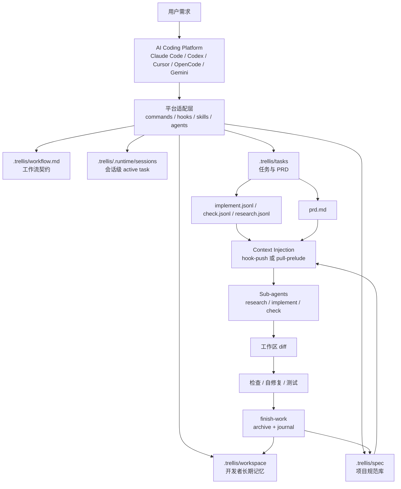
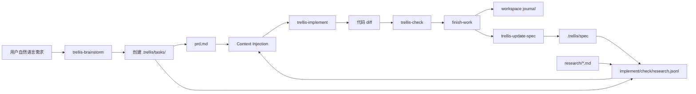
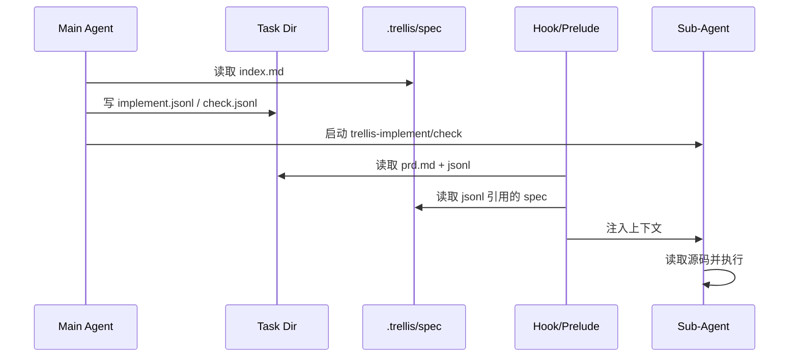
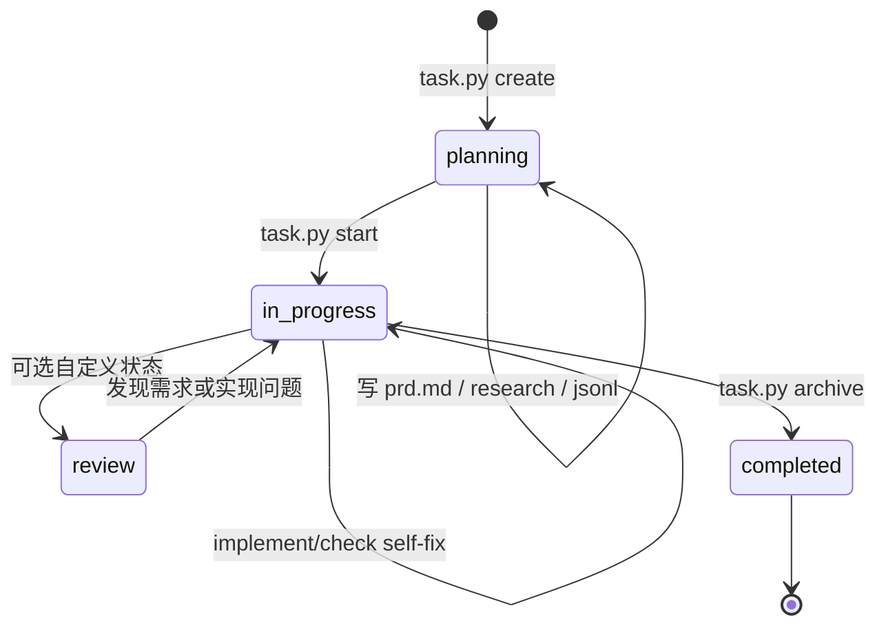
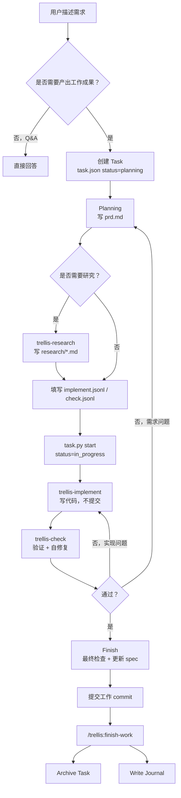
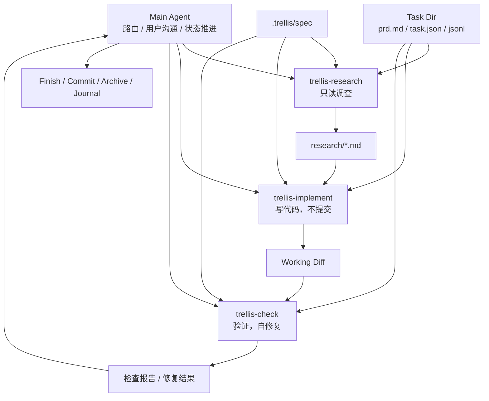
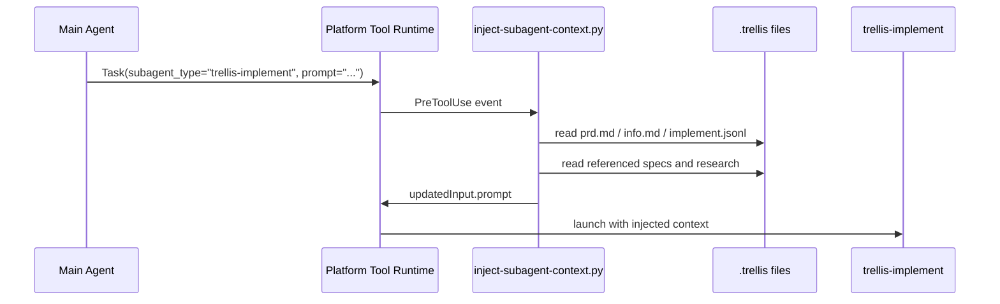
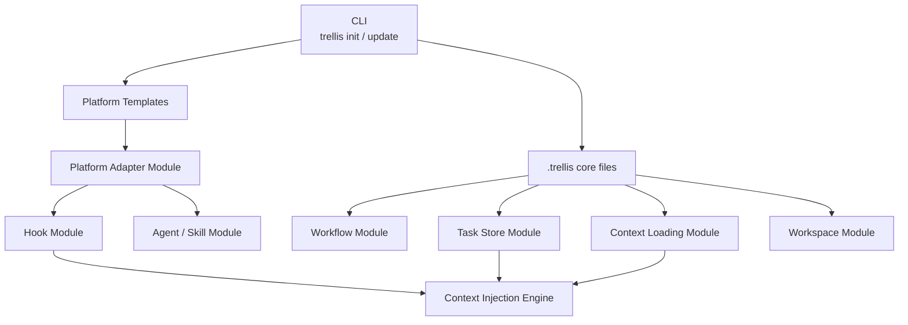

# Trellis 使用指南：从零上手到理解架构

> 适用读者：熟悉 React、Next.js、TypeScript、tRPC，但第一次使用 Trellis 的开发者。
>
> 版本说明：本文按 Trellis 官方文档中的 0.6 beta 轨道和当前公开源码/README 信息整理。安装前建议运行 `trellis --version` 核对版本；如需最新 beta，可使用 `npm install -g @mindfoldhq/trellis@beta`。

## 第一部分：Trellis 概述

### Trellis 是什么？

Trellis 是一个面向 AI Coding Agent 的工程化协作框架。它把项目规范、任务需求、工作流状态、长期记忆、Agent 分工和上下文注入机制固化到仓库文件里，使 Claude Code、Codex、Cursor、OpenCode、Gemini CLI 等不同 AI 编程工具都能围绕同一套项目事实工作。

一句话理解：

> Trellis 不是另一个 Prompt 模板，而是把 AI 编程从“聊天”升级为“有规范、有任务、有状态、有记忆、有分工的工程工作流”。

官方 README 对它的定位是：AI 写代码很快，但每次会话都会从头开始；Trellis 把 specs、tasks、memory 持久化到仓库中，让任何 coding agent 都按团队工程标准工作。

### Trellis 要解决什么问题？

AI Coding Agent 的常见问题不是“不会写代码”，而是：

- 不知道项目真实约定：组件如何组织、API 如何命名、错误如何处理。
- 每次会话都忘记上下文：昨天的决策、踩过的坑、未完成任务消失在聊天记录里。
- Prompt 不可审查：团队成员各自写私有提示词，无法像代码一样版本化。
- 任务边界不清：Agent 做着做着改了无关文件。
- 规划、实现、检查混在一起：一个 Agent 同时当产品、架构师、实现者和 Reviewer。
- 多工具无法共享记忆：Claude Code 中的上下文无法自然迁移到 Codex 或 Cursor。

Trellis 的答案是把这些问题转化为文件和工作流：

- 项目规范放在 `.trellis/spec/`。
- 任务需求放在 `.trellis/tasks/<task>/prd.md`。
- 任务状态放在 `.trellis/tasks/<task>/task.json`。
- Agent 需要的上下文清单放在 `implement.jsonl`、`check.jsonl`、`research.jsonl`。
- 长期记忆放在 `.trellis/workspace/<developer>/journal-N.md`。
- 平台适配放在 `.claude/`、`.codex/`、`.cursor/`、`.opencode/`、`.gemini/` 等目录。

### 为什么会出现 Trellis？

随着 AI Coding Agent 从“补全工具”变成“可执行工程任务的代理”，传统 Prompt Engineering 暴露出三个结构性缺陷：

1. **上下文不可持久化**：聊天窗口关闭或压缩后，需求、决策和陷阱丢失。
2. **上下文不可分层**：所有规则塞进一个文件，Agent 很难判断当前任务到底需要哪部分规则。
3. **工作流不可验证**：没有明确的任务状态、检查阶段和完成边界，AI 容易跳步或自我宣布完成。

Trellis 的设计思想更接近 Kubernetes 式的声明式工程系统：把期望状态写入文件，让工具和 Agent 根据状态推进，而不是完全依赖一次性口头指令。

### Trellis 与其他方案的区别

#### 与 CLAUDE.md 的区别

`CLAUDE.md` 是 Claude Code 的项目说明入口，适合放高层规则。它的问题是通常会变成一个越来越大的单文件。

Trellis 可以生成或利用 `CLAUDE.md`，但核心不止于它：

- `CLAUDE.md` 是入口，Trellis 是完整工作流。
- `CLAUDE.md` 通常在会话开始读取，Trellis 还能按任务状态和 sub-agent 类型注入不同上下文。
- Trellis 的 specs、tasks、workspace、hooks 都是可版本化工程资产。

#### 与 .cursorrules 的区别

`.cursorrules` 或 Cursor rules 主要解决 Cursor 中的项目规则注入。它适合编辑器内约定，但平台绑定明显。

Trellis 的重点是跨平台：

- 同一套 `.trellis/` 可被 Claude Code、Cursor、Codex、OpenCode、Gemini CLI 等适配。
- Cursor 只是平台适配层之一。
- Trellis 把任务 PRD、JSONL 上下文、Journal 和 workflow state 也纳入体系。

#### 与 OpenSpec 的区别

OpenSpec 更偏向“规格驱动开发”：先写规格，再让 AI 或人围绕规格实现。

Trellis 也重视 Spec，但它的范围更广：

- Spec 只是 Trellis 的一个子系统。
- Trellis 还管理任务生命周期、Agent 分工、上下文注入、工作流状态和长期记忆。
- OpenSpec 更像需求/规范系统；Trellis 更像 AI 工程协作运行时。

#### 与 Superpowers 的区别

Superpowers 通常强调让 AI 工具有更多能力、技能或可复用提示。

Trellis 更强调“团队级工程约束”：

- Superpowers 偏能力增强。
- Trellis 偏工作流、状态、规范、记忆、审查边界。
- Trellis 的关键不是让 Agent 更自由，而是让 Agent 在正确上下文中按阶段行动。

#### 与普通 Prompt Engineering 的区别

普通 Prompt Engineering 主要靠自然语言指令；Trellis 靠文件系统和工作流约束。

| 维度 | 普通 Prompt | Trellis |
|---|---|---|
| 存储 | 聊天窗口或单个规则文件 | `.trellis/` 多层文件系统 |
| 生命周期 | 会话级 | 项目级、任务级、开发者级 |
| 可审查性 | 弱 | 可提交、可 diff、可 review |
| 上下文选择 | 人手动复制 | JSONL 清单 + hooks / prelude |
| 工作流状态 | 口头提醒 | `task.json.status` + `[workflow-state:*]` |
| 多 Agent | 临时提示 | 内置 research / implement / check 分工 |

### Trellis 的核心设计理念

1. **AI 编程是工作流问题，不只是模型问题**  
   好模型仍需要正确任务边界、正确上下文、正确检查阶段。

2. **知识必须落盘**  
   PRD、研究结论、规范、Journal 都放在仓库文件里，避免上下文丢失。

3. **上下文必须按需加载**  
   不把整个项目塞给 Agent，而是通过 spec index 和 JSONL 清单注入当前任务需要的内容。

4. **责任必须拆分**  
   Research 负责只读调查，Implement 负责写代码，Check 负责验证和自修复。

5. **完成边界必须清楚**  
   实现和检查不等于结束；还要更新可复用规范、提交代码、归档任务、写 Journal。

6. **团队和工具多样性必须被支持**  
   `.trellis/` 是跨工具核心，平台目录只是适配层。

### Trellis 整体架构图



## 第二部分：核心概念讲解

### Spec

**为什么存在**：让 AI 明确项目约定，而不是根据通用训练数据猜测。  
**解决什么问题**：组件风格不一致、API 错误处理不统一、类型策略随意、测试标准漂移。  
**数据存储在哪里**：`.trellis/spec/**/index.md` 以及同目录下的具体规范文件。  
**生命周期**：初始化生成占位模板；bootstrap 任务从真实代码中提炼；任务完成后通过 `trellis-update-spec` 增量更新。  
**如何协作**：Task 的 JSONL 清单引用相关 Spec；hook 或 sub-agent prelude 在执行前读取并注入。

### Task

**为什么存在**：把自然语言需求转成可持久化、可检查、可恢复的工作单元。  
**解决什么问题**：需求散在聊天里、实现范围失控、跨会话无法继续。  
**数据存储在哪里**：`.trellis/tasks/<MM-DD-task-name>/`。  
**生命周期**：`create -> planning -> start/in_progress -> implement/check -> completed -> archive`。  
**如何协作**：Task 持有 PRD、上下文清单、研究资料和状态；Workflow State 根据 Task 状态注入下一步。

### Workspace

**为什么存在**：保存开发者维度的长期记忆。  
**解决什么问题**：多次 AI 会话之间无法继承经验；不同开发者上下文混杂。  
**数据存储在哪里**：`.trellis/workspace/<developer>/index.md` 和 `journal-N.md`。  
**生命周期**：`trellis init -u <name>` 创建；每次 `/trellis:finish-work` 追加 Journal；后续 session start 读取。  
**如何协作**：Startup Context 会读取 workspace index 和近期 Journal，帮助 Agent 恢复历史。

### Skill

**为什么存在**：把常见能力包装成可自动触发的行为单元。  
**解决什么问题**：用户不想记大量命令；Agent 需要在特定场景执行固定步骤。  
**数据存储在哪里**：平台目录下的 skills，例如 `.claude/skills/`、`.cursor/skills/`、`.codex/skills/`，以及共享的 `.agents/skills/`。  
**生命周期**：`trellis init` 生成；平台根据 intent 自动触发；可手动调用或自定义。  
**如何协作**：`trellis-brainstorm` 生成 PRD；`trellis-before-dev` 读 spec；`trellis-check` 验证；`trellis-update-spec` 沉淀知识。

### Hook

**为什么存在**：在平台事件发生时自动注入上下文或执行自动化。  
**解决什么问题**：靠用户手动提醒 Agent 容易遗漏；sub-agent 启动前需要自动读取正确上下文。  
**数据存储在哪里**：平台 hooks 目录，如 `.claude/hooks/`、`.cursor/hooks/`、`.codex/hooks/`；任务生命周期 hook 配置在 `.trellis/config.yaml` 或相关本地配置中。  
**生命周期**：会话开始、用户提交 prompt、工具调用前后、任务 create/start/finish/archive 时触发。  
**如何协作**：`session-start.py` 注入启动上下文；`inject-workflow-state.py` 注入状态提示；`inject-subagent-context.py` 注入 PRD 和 JSONL 引用文件。

### Command

**为什么存在**：提供少量手动边界动作。  
**解决什么问题**：会话开始、继续推进、结束归档这类动作需要用户确认。  
**数据存储在哪里**：平台 commands 目录，例如 `.claude/commands/trellis/`、`.gemini/commands/trellis/`。  
**生命周期**：`trellis init` 安装；用户在会话中调用；新版本可更新。  
**如何协作**：`/trellis:start` 加载上下文；`/trellis:continue` 根据状态推进；`/trellis:finish-work` 归档并写 Journal。

### Agent

**为什么存在**：主会话负责路由、协调和用户沟通。  
**解决什么问题**：一个 Agent 不能同时高质量承担规划、实现、审查、记忆管理。  
**数据存储在哪里**：主 Agent 通常是平台当前会话；其行为由 workflow、skills、hooks、rules 文件共同塑造。  
**生命周期**：SessionStart -> 接收用户需求 -> 创建/继续 Task -> 调用 sub-agent -> 完成收尾。  
**如何协作**：主 Agent 不直接吞掉所有上下文，而是根据 task 状态和 JSONL 把工作交给 sub-agent。

### Sub-Agent

**为什么存在**：隔离职责和上下文。  
**解决什么问题**：实现者和检查者角色混乱；研究阶段误改代码；检查阶段只看表面。  
**数据存储在哪里**：`.claude/agents/`、`.cursor/agents/`、`.codex/agents/`、`.opencode/agents/` 等。  
**生命周期**：由主 Agent 在特定阶段启动；读取 PRD、JSONL 和 specs；完成后把结果报告给主会话。  
**如何协作**：`trellis-research` 只读调查；`trellis-implement` 写代码不提交；`trellis-check` 验证并可自修复。

### Context Injection

**为什么存在**：让 Agent 在行动前自动获得正确上下文。  
**解决什么问题**：手动复制规范容易漏；一次性塞全部上下文又浪费窗口。  
**数据存储在哪里**：上下文本身在 `.trellis/spec/`、`prd.md`、`research/*.md`；清单在 `*.jsonl`；注入逻辑在 hooks 或 sub-agent prelude。  
**生命周期**：规划阶段生成 JSONL；sub-agent 启动前读取；执行阶段使用；任务结束后可更新 spec。  
**如何协作**：Task 决定“当前要做什么”；JSONL 决定“该读哪些规范”；hook/prelude 决定“如何送进 Agent”。

### Workflow State

**为什么存在**：让 AI 每一轮知道当前任务处于哪个阶段。  
**解决什么问题**：会话中途忘记是否已规划、是否该实现、是否该检查。  
**数据存储在哪里**：状态在 `task.json.status`；状态说明块在 `.trellis/workflow.md` 的 `[workflow-state:STATUS]` 中。  
**生命周期**：创建时 `planning`；`task.py start` 后 `in_progress`；归档时 `completed`；也可扩展自定义状态。  
**如何协作**：hook 读取 active task，再从 workflow 中抽取匹配状态块注入当前 prompt。

### Journal

**为什么存在**：记录会话级经验和完成情况，成为长期记忆。  
**解决什么问题**：任务完成后知识只留在聊天窗口；下一次 session 无法恢复背景。  
**数据存储在哪里**：`.trellis/workspace/<developer>/journal-N.md`。  
**生命周期**：`/trellis:finish-work` 时追加；新 session start 时读取近期记录。  
**如何协作**：Journal 是 Workspace 的时间序列记忆；Spec 是团队可复用规则；Task 是具体工作单元。

### 核心数据流



## 第三部分：安装与初始化

### 安装 Trellis

```bash
# 稳定版
npm install -g @mindfoldhq/trellis

# beta 轨道
npm install -g @mindfoldhq/trellis@beta

# 检查版本
trellis --version
```

依赖要求：

- Node.js 18+
- Python 3.9+
- macOS、Linux、Windows 均支持

### 初始化项目

```bash
cd your-project

# 交互式初始化，自动检测已安装平台
trellis init -u alice

# 明确指定平台
trellis init -u alice --claude
trellis init -u alice --codex
trellis init -u alice --cursor
trellis init -u alice --opencode
trellis init -u alice --gemini

# 多平台同时初始化
trellis init -u alice --claude --codex --cursor --opencode --gemini
```

`-u alice` 会写入当前 checkout 的开发者身份，并创建 `.trellis/workspace/alice/`。`.trellis/.developer` 是本地身份文件，通常不提交。

### 初始化场景

| 场景 | 命令 | 结果 |
|---|---|---|
| 第一次初始化项目 | `trellis init -u alice --claude` | 创建 `.trellis/` 和 `00-bootstrap-guidelines` |
| 给已有 Trellis 项目增加平台 | `trellis init --cursor` | 增加平台配置，不新建核心任务 |
| 新成员加入项目 | `trellis init -u bob` | 创建 joiner onboarding task |
| 同一开发者同一机器重复初始化 | `trellis init -u alice` | 基本无操作 |

### 目录结构解析

```text
your-project/
├── .trellis/
│   ├── .developer
│   ├── .version
│   ├── workflow.md
│   ├── config.yaml
│   ├── .runtime/
│   │   └── sessions/
│   ├── spec/
│   │   ├── frontend/
│   │   ├── backend/
│   │   └── guides/
│   ├── workspace/
│   │   ├── index.md
│   │   └── alice/
│   │       ├── index.md
│   │       └── journal-1.md
│   ├── tasks/
│   │   ├── 06-02-user-login/
│   │   │   ├── task.json
│   │   │   ├── prd.md
│   │   │   ├── info.md
│   │   │   ├── implement.jsonl
│   │   │   ├── check.jsonl
│   │   │   └── research.jsonl
│   │   └── archive/
│   └── scripts/
│       ├── task.py
│       ├── get_context.py
│       ├── add_session.py
│       └── common/
├── .claude/
├── .codex/
├── .cursor/
├── .opencode/
├── .gemini/
├── .agents/
└── AGENTS.md
```

各目录职责：

- `.trellis/`：跨平台核心，所有工具共享。
- `.trellis/spec/`：项目规范库。
- `.trellis/tasks/`：任务事实库。
- `.trellis/workspace/`：开发者长期记忆。
- `.trellis/.runtime/sessions/`：会话级 active task 指针，通常 gitignored。
- `.trellis/scripts/`：任务、上下文、归档等自动化脚本。
- `.claude/`、`.cursor/`、`.codex/` 等：平台适配层。
- `.agents/skills/`：共享技能层，支持读取 Agent Skills 标准的工具。

### 与 Claude Code 集成

```bash
trellis init -u alice --claude
```

生成内容通常包括：

```text
.claude/
├── settings.json
├── commands/trellis/
│   ├── start.md
│   ├── continue.md
│   └── finish-work.md
├── agents/
│   ├── trellis-research.md
│   ├── trellis-implement.md
│   └── trellis-check.md
├── skills/
└── hooks/
    ├── session-start.py
    ├── inject-workflow-state.py
    └── inject-subagent-context.py
```

Claude Code 支持 `SessionStart`、`UserPromptSubmit`、`PreToolUse` 等 hooks，因此 Trellis 在 Claude Code 中能使用较完整的 hook-push 注入。

### 与 Codex 集成

```bash
trellis init -u alice --codex
```

典型生成：

```text
.codex/
├── agents/
├── skills/
└── hooks/
AGENTS.md
```

Codex 会自动读取 `AGENTS.md`。如果要启用 hooks，需要在 Codex 配置中开启：

```toml
# ~/.codex/config.toml
[features]
hooks = true
```

旧版本可能使用：

```toml
codex_hooks = true
```

Codex 0.129+ 还可能需要在会话中运行 `/hooks` 批准 hook。Codex 的 sub-agent 上下文更多依赖 pull-prelude：agent 定义会要求自己读取 active task、PRD 和 JSONL。

### 与 Cursor 集成

```bash
trellis init -u alice --cursor
```

典型生成：

```text
.cursor/
├── commands/
├── agents/
├── skills/
└── hooks/
```

Cursor 可使用 Trellis 的 commands、agents、skills 和 hooks 适配。实践中建议把 `.trellis/spec/` 作为主要规范源，而不是把所有规则写进 Cursor rules。

### 与 OpenCode 集成

```bash
trellis init -u alice --opencode
```

典型生成：

```text
.opencode/
├── commands/trellis/
├── agents/
├── skills/
└── plugins/
```

OpenCode 使用 JS plugin 实现类似 hook 的行为。核心仍然读取 `.trellis/`。

### 与 Gemini CLI 集成

```bash
trellis init -u alice --gemini
```

典型生成：

```text
.gemini/
├── commands/trellis/
├── agents/
├── skills/
└── hooks/
```

Gemini CLI 支持 session-start 类注入，但 sub-agent context 可能走 pull-prelude 路径。

## 第四部分：Specs 系统

### 什么是 Spec？

Spec 是写给 Agent 的项目工程约定。它不是泛泛的“请写高质量代码”，而是具体到项目层面的规则，例如：

- React 组件如何分层。
- Next.js App Router 中 Server Component 和 Client Component 如何边界划分。
- tRPC procedure 如何组织。
- Prisma transaction 什么时候使用。
- TypeScript 中禁止哪些逃逸类型。
- 错误处理和日志如何统一。

### 为什么 Trellis 使用 Spec？

因为 AI 默认会从训练数据中选择“看起来常见”的实现方式，但你的项目往往有自己的约定。Spec 的作用是把这些约定转成可注入、可审查、可迭代的文件。

好的 Spec 应该具备：

- 明确适用范围。
- 明确 required / forbidden。
- 有好坏示例。
- 能直接影响 Agent 选择。
- 足够短，避免变成不可读的大文档。

### Spec 如何被注入 Agent Context？

Trellis 不会默认把所有 specs 注入每次任务。流程通常是：

1. Planning 阶段确定任务领域。
2. AI 查看 `.trellis/spec/**/index.md`。
3. AI 把相关 spec 或 research 文件写入 `implement.jsonl`、`check.jsonl`。
4. sub-agent 启动前，hook 或 prelude 读取 JSONL。
5. 注入 PRD、info、JSONL 引用文件。
6. Agent 再读取相关源码并执行任务。



### Spec 的组织方式

默认初始化结构：

```text
.trellis/spec/
├── frontend/
│   ├── index.md
│   ├── component-guidelines.md
│   ├── hook-guidelines.md
│   ├── state-management.md
│   ├── type-safety.md
│   ├── quality-guidelines.md
│   └── directory-structure.md
├── backend/
│   ├── index.md
│   ├── database-guidelines.md
│   ├── error-handling.md
│   ├── logging-guidelines.md
│   ├── quality-guidelines.md
│   └── directory-structure.md
└── guides/
    ├── index.md
    ├── cross-layer-thinking-guide.md
    └── code-reuse-thinking-guide.md
```

但这只是约定，不是强制。你可以按 monorepo 包组织：

```text
.trellis/spec/
├── web/
│   ├── frontend/
│   │   ├── index.md
│   │   └── nextjs-app-router.md
│   └── api/
│       ├── index.md
│       └── trpc-procedures.md
├── database/
│   ├── index.md
│   └── prisma.md
└── guides/
    ├── index.md
    └── cross-layer-thinking-guide.md
```

Trellis 的关键约定是：一个 spec layer 通常有自己的 `index.md`，让 Agent 能先扫描索引，再决定读哪些具体文件。

### 前端规范示例

````md
# Frontend Component Guidelines

## Scope

Applies to `src/components/**` and shared UI modules.

## Required

- Use function components only.
- Export shared components as named exports.
- Keep server data fetching outside client-only UI components.
- Put interaction state as close as possible to the component that owns it.

## Forbidden

- Do not use `any` for component props.
- Do not call tRPC mutations directly inside presentational components.
- Do not mix layout primitives and domain logic in the same component.

## Good Example

```tsx
type UserMenuProps = {
  user: Pick<User, "id" | "name" | "email">;
  onSignOut: () => void;
};

export function UserMenu({ user, onSignOut }: UserMenuProps) {
  return (
    <DropdownMenu>
      <DropdownMenuTrigger>{user.name}</DropdownMenuTrigger>
      <DropdownMenuContent>
        <DropdownMenuItem onSelect={onSignOut}>Sign out</DropdownMenuItem>
      </DropdownMenuContent>
    </DropdownMenu>
  );
}
```
````

影响 AI 输出的方式：Agent 会倾向于把业务请求、mutation、页面数据加载放在容器或 page 层，把组件保持为可复用 UI。

### React 规范示例

```md
# React Hooks Guidelines

## Required

- Custom hooks must start with `use`.
- Hooks that call APIs must expose explicit loading/error states.
- Effects must list all dependencies; prefer deriving state over syncing state.

## Forbidden

- Do not use `useEffect` to mirror props into state unless there is a reset rule.
- Do not suppress `react-hooks/exhaustive-deps` without a comment explaining the invariant.

## Pattern

Use `useMemo` only for expensive derived values or stable reference requirements, not as a default.
```

影响 AI 输出的方式：减少滥用 `useEffect`、减少 props/state 同步错误，促使 Agent 使用更清晰的 hook 边界。

### Next.js 规范示例

```md
# Next.js App Router Guidelines

## Required

- Prefer Server Components for data loading.
- Add `"use client"` only at interaction boundaries.
- Keep route handlers thin; delegate business logic to services.
- Use `generateMetadata` for route-level metadata when content is dynamic.

## Forbidden

- Do not import server-only modules into client components.
- Do not fetch the same data separately in nested components when the page can pass it down.

## Example Boundary

- `app/dashboard/page.tsx`: server component, loads data.
- `app/dashboard/DashboardClient.tsx`: client component, handles filters and UI interactions.
```

影响 AI 输出的方式：Agent 在创建页面时会先考虑 server/client 边界，避免把整个页面都标成 client component。

### API 规范示例

````md
# tRPC API Guidelines

## Required

- Procedures live under `src/server/api/routers/<domain>.ts`.
- Use `zod` schemas for all input.
- Keep authorization checks close to procedure entry.
- Move reusable business logic into `src/server/services/**`.

## Forbidden

- Do not access Prisma directly from React components.
- Do not return raw internal error messages to clients.
- Do not create one procedure per database table by default; model user workflows.

## Error Handling

Use `TRPCError` with explicit codes:

```ts
throw new TRPCError({
  code: "FORBIDDEN",
  message: "You cannot update this workspace.",
});
```
````

影响 AI 输出的方式：Agent 会更倾向于创建 domain router + service，而不是在 UI 中直接拼数据访问逻辑。

### TypeScript 规范示例

````md
# TypeScript Guidelines

## Required

- Use `unknown` at trust boundaries, then narrow.
- Prefer discriminated unions for state machines.
- Export types only when consumed outside the module.
- Use `satisfies` for config objects where inference should be preserved.

## Forbidden

- Do not use `any` unless the PRD explicitly allows an escape hatch.
- Do not use non-null assertion `!` to silence real uncertainty.
- Do not widen literal domain values to `string`.

## Good Example

```ts
type LoadState<T> =
  | { status: "idle" }
  | { status: "loading" }
  | { status: "success"; data: T }
  | { status: "error"; error: Error };
```
````

影响 AI 输出的方式：Agent 会选择可检查的状态建模，而不是使用多个 boolean 或宽泛字符串。

### Spec 最佳实践

- 每个 spec 文件只讲一个主题。
- `index.md` 要写清楚本 layer 包含哪些文件、何时读取。
- 用 required / forbidden / examples，而不是抽象价值观。
- 把重复踩坑沉淀到 spec，而不是只写进 Journal。
- 删除过时规则，避免 Agent 被旧约束误导。
- 对跨层任务使用 guides，例如 cross-layer-thinking-guide。

## 第五部分：Task 系统

### Task 的生命周期



官方常用流程：

```text
create -> curate jsonl -> start -> implement/check -> finish -> archive
```

### task.json

示例：

```json
{
  "id": "06-02-user-login",
  "name": "user-login",
  "title": "Add user login",
  "description": "Implement JWT login flow",
  "status": "planning",
  "dev_type": null,
  "scope": "auth",
  "package": "web",
  "priority": "P1",
  "creator": "alice",
  "assignee": "alice",
  "createdAt": "2026-06-02",
  "completedAt": null,
  "branch": "feature/user-login",
  "base_branch": "main",
  "worktree_path": null,
  "commit": null,
  "pr_url": null,
  "subtasks": [],
  "children": [],
  "parent": null,
  "relatedFiles": [],
  "notes": "",
  "meta": {}
}
```

关键字段：

- `status`：驱动 workflow state 注入。
- `scope`：可用于 commit scope 或任务分类。
- `package`：monorepo 中用于选择 spec layer。
- `children` / `parent`：任务树关系。
- `subtasks`：单个任务内部 checklist，不等同于子任务目录。
- `meta`：可存外部系统 ID，例如 Linear issue。

### prd.md

PRD 是任务需求事实源。推荐结构：

```md
# Add User Login

## Goal

Allow users to sign in with email and password.

## Requirements

- Users can submit email and password.
- Invalid credentials return a safe error message.
- Successful login creates a session cookie.
- Authenticated users are redirected to `/dashboard`.

## Acceptance Criteria

- Login form validates email format.
- API rejects invalid credentials with `UNAUTHORIZED`.
- Session cookie is httpOnly and secure in production.
- Existing unauthenticated routes continue to work.

## Out of Scope

- OAuth login.
- Password reset.
- Email verification.

## Technical Notes

- Use existing Prisma `User` model.
- Follow `.trellis/spec/web/api/trpc-procedures.md`.
```

### implement.jsonl

实现 Agent 的上下文清单：

```jsonl
{"file": ".trellis/spec/web/frontend/nextjs-app-router.md", "reason": "Login page uses App Router server/client boundary"}
{"file": ".trellis/spec/web/api/trpc-procedures.md", "reason": "Auth API must follow tRPC procedure conventions"}
{"file": ".trellis/spec/database/prisma.md", "reason": "User lookup and session writes use Prisma"}
{"file": ".trellis/tasks/06-02-user-login/research/auth-session-options.md", "reason": "Session implementation decision"}
```

注意：不要把将要修改的源码文件放进去。源码由 sub-agent 在实现阶段自己读取；JSONL 主要列 specs 和 research。

### check.jsonl

检查 Agent 的上下文清单：

```jsonl
{"file": ".trellis/spec/web/frontend/quality-guidelines.md", "reason": "Verify UI quality and validation states"}
{"file": ".trellis/spec/web/api/error-handling.md", "reason": "Verify auth errors do not leak internals"}
{"file": ".trellis/spec/database/prisma.md", "reason": "Verify transaction and query patterns"}
```

### info.md

`info.md` 是可选技术设计文档。适合复杂任务：

```md
# Technical Design

## Architecture

- Login UI lives in `app/(auth)/login`.
- tRPC procedure `auth.login` validates credentials.
- Session service owns cookie creation.

## Data Flow

1. User submits form.
2. Client calls `auth.login`.
3. Server validates password hash.
4. Server sets session cookie.
5. Client redirects.

## Risks

- Avoid leaking whether email exists.
- Ensure cookie config differs between dev and prod.
```

### 如何创建 Task

```bash
# 创建任务
TASK_DIR=$(./.trellis/scripts/task.py create "Add user login" \
  --slug user-login \
  --assignee alice \
  --priority P1 \
  --description "Implement email/password login")

# 添加上下文
./.trellis/scripts/task.py add-context "$TASK_DIR" implement \
  ".trellis/spec/web/api/trpc-procedures.md" "Auth API conventions"

./.trellis/scripts/task.py add-context "$TASK_DIR" check \
  ".trellis/spec/web/api/error-handling.md" "Auth error verification"

# 验证 JSONL 引用文件存在
./.trellis/scripts/task.py validate "$TASK_DIR"

# 设为当前会话任务，并进入 in_progress
./.trellis/scripts/task.py start "$TASK_DIR"
```

Windows PowerShell 示例：

```powershell
$taskDir = .\.trellis\scripts\task.py create "Add user login" `
  --slug user-login `
  --assignee alice `
  --priority P1 `
  --description "Implement email/password login"

.\.trellis\scripts\task.py add-context $taskDir implement `
  ".trellis/spec/web/api/trpc-procedures.md" "Auth API conventions"

.\.trellis\scripts\task.py validate $taskDir
.\.trellis\scripts\task.py start $taskDir
```

### 如何管理复杂项目

复杂项目不要创建一个巨大 Task。使用父子任务：

```bash
# 父任务
./.trellis/scripts/task.py create "User authentication epic" \
  --slug user-auth

# 子任务
./.trellis/scripts/task.py create "Login form" \
  --slug login-form \
  --parent 06-02-user-auth

./.trellis/scripts/task.py create "Session service" \
  --slug session-service \
  --parent 06-02-user-auth

./.trellis/scripts/task.py create "Route protection" \
  --slug route-protection \
  --parent 06-02-user-auth
```

拆分原则：

- 每个 Task 有独立 PRD 和验收标准。
- 每个 Task 的 diff 应能独立 review。
- 父任务记录共享背景，子任务执行具体交付。
- 不要让一个 Task 同时改 UI、DB、Auth、Billing、Docs，除非 PRD 解释了跨层必要性。

## 第六部分：Workflow 工作流

Trellis 的工作流可以理解为：

```text
用户需求
↓
Task 创建
↓
Planning
↓
Research
↓
Implement
↓
Check
↓
Finish
↓
Journal
```

### 总流程图



### 阶段详解

| 阶段 | 输入 | 输出 | Context 来源 | Agent 行为 | 状态变化 |
|---|---|---|---|---|---|
| 用户需求 | 自然语言 | 路由决策 | startup context、workflow state | 判断 Q&A / quick fix / task | 无 |
| Task 创建 | 需求标题、slug | task dir、task.json、JSONL seed | `.trellis/scripts/task.py` | 创建任务文件 | `planning` |
| Planning | 用户需求 | `prd.md`、可能的 `info.md` | spec index、代码调查 | 澄清、拆解、定义验收 | `planning` |
| Research | PRD 中的不确定点 | `research/*.md` | 代码库、外部文档、已有 specs | 只读调查 | `planning` |
| Context Curation | PRD + specs + research | `implement.jsonl`、`check.jsonl` | `.trellis/spec/**/index.md` | 选择相关规范 | `planning` |
| Implement | PRD + JSONL 注入 | 工作区 diff | PRD、specs、research、源码 | 写代码，不提交 | `in_progress` |
| Check | diff + PRD + check specs | 修复后 diff、检查报告 | `check.jsonl`、测试命令 | 验证、自修复 | `in_progress` |
| Finish | 通过检查的 diff | spec update、commit plan | workflow、git diff、specs | 最终收尾 | 可进入 completed |
| Journal | 已完成任务 | journal-N.md | task、commit、session summary | 记录长期记忆 | archive |

### Workflow State 注入

```mermaid
flowchart LR
  Prompt["用户提交 prompt"] --> Hook["UserPromptSubmit hook"]
  Hook --> Session["读取 .trellis/.runtime/sessions/<session>.json"]
  Session --> TaskJson["读取 active task/task.json"]
  TaskJson --> Status["获得 status"]
  Status --> Workflow["解析 .trellis/workflow.md"]
  Workflow --> Block["提取 [workflow-state:status]"]
  Block --> Inject["注入 <workflow-state>...</workflow-state>"]
  Inject --> Agent["主 Agent 决定下一步"]
```



## 第七部分：Workspace 与长期记忆

### Workspace 的作用

Workspace 是“开发者维度”的记忆空间。它不替代 Spec，也不替代 Task：

- Task 记录某个工作单元的事实。
- Spec 记录团队可复用的规则。
- Workspace 记录某个开发者的会话历史、偏好、最近工作和上下文恢复线索。

### Journal 的作用

Journal 是每次完成工作的会话记录。它通常包含：

- 做了什么。
- 改了哪些主要文件。
- 重要决策。
- 运行了哪些检查。
- 未完成事项。
- 是否有知识沉淀到 spec。

### Session Persistence

Trellis 不把“当前任务”存成全局单例，而是使用 session-scoped active task：

```text
.trellis/.runtime/sessions/<session-key>.json
```

这样多个 AI 窗口可以同时处理不同任务。`.trellis/.current-task` 可作为 fallback，但核心设计是会话级指针。

### Context 恢复机制

新会话开始时，Trellis 通常加载：

- `.trellis/.developer`
- 当前 git branch、dirty files、recent commits
- active task pointer
- `.trellis/tasks/*/task.json`
- `.trellis/workflow.md`
- `.trellis/spec/**/index.md`
- `.trellis/workspace/<developer>/index.md`
- 近期 Journal

这是一份“索引和状态报告”，不是全量 dump。Agent 根据报告决定下一步再读取细节。

### 实际案例

第 1 天你完成 `user-login`：

- Task archived。
- Journal 记录：使用 httpOnly cookie、tRPC `auth.login`、Prisma 查询策略。
- 发现“不要泄露邮箱是否存在”的规则被写进 `.trellis/spec/web/api/error-handling.md`。

第 2 天你创建 `password-reset`：

- Startup Context 读取近期 Journal。
- Planning 阶段读取 API spec。
- `check.jsonl` 引入 error-handling spec。
- Agent 自动避免返回 “email not found” 这种泄漏信息。

这就是 Trellis 的长期记忆闭环：一次任务的经验会影响后续任务，而不是消失在聊天历史中。

## 第八部分：Agent 与 Sub-Agent

### 三个内置 Sub-Agent

#### trellis-research

职责：

- 只读调查代码库。
- 查找已有模式。
- 比较库或 API。
- 写 `research/*.md`。

Context 来源：

- PRD 中的问题。
- `research.jsonl`。
- spec index。
- 相关源码，但不写文件。

#### trellis-implement

职责：

- 根据 PRD 和 specs 写代码。
- 运行必要检查。
- 产出 working diff。
- 不做 git commit。

Context 来源：

- `prd.md`
- `info.md`
- `implement.jsonl`
- JSONL 引用的 specs / research
- 实现时读取的源码

#### trellis-check

职责：

- 检查 diff 是否满足 PRD。
- 检查是否违反 specs。
- 运行 lint/typecheck/test。
- 可在有界循环中自修复。

Context 来源：

- `prd.md`
- `check.jsonl`
- changed files
- spec quality checklist
- 项目检查命令

### Agent 协作架构图



### 为什么要拆分 Agent？

拆分不是为了炫技，而是为了降低上下文污染：

- Research 不应该拥有写权限，否则调查阶段可能误改代码。
- Implement 不应该自我审查完就提交，否则 review 边界消失。
- Check 不应该只读，它需要能修复小问题并 rerun checks。
- Main Agent 不应该被所有实现细节淹没，它负责协调和确认。

## 第九部分：Hooks 与自动化机制

### Hook 是什么？

Hook 是平台事件和 Trellis 脚本之间的连接点。它在特定事件发生时运行脚本，读取项目状态，并把结果注入当前会话或 sub-agent。

常见 hook 类型：

| Hook | 触发时机 | 用途 |
|---|---|---|
| SessionStart | 新会话开始 | 加载 startup context |
| UserPromptSubmit | 用户提交 prompt | 注入 workflow state |
| PreToolUse | 工具调用前 | 修改工具输入，注入 sub-agent context |
| PostToolUse | 工具调用后 | 日志、自动检查、后续动作 |

### Context Injection 如何实现？

以 Claude Code / Cursor / OpenCode 等支持 PreToolUse 的平台为例：

1. 主 Agent 准备启动 `trellis-implement`。
2. 平台触发 `PreToolUse`，matcher 命中 Task 调用。
3. `inject-subagent-context.py` 读取工具输入中的 `subagent_type`。
4. 如果是 `trellis-implement`，读取 `implement.jsonl`。
5. 如果是 `trellis-check`，读取 `check.jsonl`。
6. 脚本读取 PRD、info、JSONL 引用文件。
7. 组装成新的 prompt。
8. 返回 `updatedInput`，让平台以增强后的 prompt 启动 sub-agent。



在 Codex、Gemini、Qoder、Copilot 等部分平台，sub-agent 可能没有 PreToolUse 注入能力，此时使用 pull-prelude：sub-agent 的系统提示会要求它自己读取 active task、PRD 和 JSONL。

### Workflow State 如何自动注入？

`inject-workflow-state.py` 是 parser-only：

- 找到 `.trellis/`。
- 解析当前 session key。
- 读取 `.trellis/.runtime/sessions/<session-key>.json`。
- 找到 active task。
- 读取 `task.json.status`。
- 在 `.trellis/workflow.md` 中找 `[workflow-state:<status>]`。
- 把内容包装为 `<workflow-state>...</workflow-state>` 注入。

如果没有 active task，使用伪状态 `no_task`。如果 workflow 中没有匹配块，则提示 Agent 重新参考 `workflow.md`。

### Startup Context 如何生成？

`session-start.py` 通常读取：

- developer identity
- workflow contract
- workspace memory
- git log / git status
- active tasks
- spec indexes

它输出的是启动系统消息。这个设计避免每次会话都从“你是谁、项目是什么、现在做到哪”开始。

### 任务生命周期 Hooks

Trellis 还支持 task.py 生命周期事件：

| 事件 | 触发 |
|---|---|
| `after_create` | `task.py create` 完成 |
| `after_start` | `task.py start` 完成 |
| `after_finish` | `task.py finish` 完成 |
| `after_archive` | `task.py archive` 完成 |

这些 hooks 可用于同步 Linear、Jira、飞书、多维表等系统。每个 hook 会收到 `TASK_JSON_PATH` 环境变量。

示例思路：

```json
{
  "hooks": {
    "after_create": ["python .trellis/scripts/hooks/create_issue.py"],
    "after_archive": ["python .trellis/scripts/hooks/close_issue.py"]
  }
}
```

## 第十部分：实战案例：Next.js + TypeScript + tRPC + Prisma

目标：从零创建一个 Trellis 管理的功能任务，实现“用户登录”。

### 1. 初始化 Trellis

```bash
cd next-trpc-prisma-app
npm install -g @mindfoldhq/trellis@beta
trellis init -u alice --codex --cursor --claude
```

初始化后先做 `00-bootstrap-guidelines`，让 AI 从真实代码提炼 specs。不要跳过，否则 specs 只是空模板。

### 2. 创建项目 Specs

建议目录：

```text
.trellis/spec/
├── web/
│   ├── index.md
│   ├── nextjs-app-router.md
│   ├── react-components.md
│   ├── forms.md
│   └── quality-guidelines.md
├── api/
│   ├── index.md
│   ├── trpc-procedures.md
│   └── error-handling.md
├── database/
│   ├── index.md
│   └── prisma.md
└── guides/
    ├── index.md
    └── cross-layer-thinking-guide.md
```

`.trellis/spec/api/index.md` 示例：

```md
# API Spec Index

## Files

- `trpc-procedures.md`: tRPC router, input validation, auth checks.
- `error-handling.md`: client-safe errors and logging rules.

## Load When

- Any task changes `src/server/api/**`.
- Any task adds or changes client/server API behavior.
- Any auth, permission, or validation behavior changes.
```

### 3. 创建 Task

```bash
TASK_DIR=$(./.trellis/scripts/task.py create "Add email password login" \
  --slug email-password-login \
  --assignee alice \
  --priority P1 \
  --description "Implement login page, tRPC login procedure, and session cookie")
```

### 4. 编写 PRD

`.trellis/tasks/06-02-email-password-login/prd.md`：

```md
# Add Email Password Login

## Goal

Users can sign in with email and password and access authenticated pages.

## Requirements

- Add `/login` route.
- Validate email and password on the client.
- Add `auth.login` tRPC procedure.
- Verify password hash server-side.
- Set httpOnly session cookie on success.
- Redirect authenticated users to `/dashboard`.

## Acceptance Criteria

- Invalid input shows form-level validation.
- Invalid credentials return a generic safe error.
- Successful login creates a session cookie.
- `pnpm lint`, `pnpm typecheck`, and relevant tests pass.

## Out of Scope

- OAuth.
- Password reset.
- Registration.
```

### 5. Research

让 `trellis-research` 调查：

- 现有 Prisma User model。
- 是否已有 session service。
- 现有 form 组件模式。
- 当前 tRPC router 结构。

研究产物：

```text
.trellis/tasks/06-02-email-password-login/research/
├── auth-data-model.md
├── existing-form-patterns.md
└── session-cookie-options.md
```

### 6. 填写 JSONL

```jsonl
{"file": ".trellis/spec/web/nextjs-app-router.md", "reason": "Login page route and server/client boundary"}
{"file": ".trellis/spec/web/forms.md", "reason": "Form validation and UX states"}
{"file": ".trellis/spec/api/trpc-procedures.md", "reason": "auth.login procedure conventions"}
{"file": ".trellis/spec/api/error-handling.md", "reason": "Invalid credential errors must be safe"}
{"file": ".trellis/spec/database/prisma.md", "reason": "User lookup and password hash access"}
{"file": ".trellis/tasks/06-02-email-password-login/research/session-cookie-options.md", "reason": "Chosen session cookie strategy"}
```

`check.jsonl`：

```jsonl
{"file": ".trellis/spec/web/quality-guidelines.md", "reason": "Verify UI states and accessibility"}
{"file": ".trellis/spec/api/error-handling.md", "reason": "Verify no auth information leakage"}
{"file": ".trellis/spec/database/prisma.md", "reason": "Verify database access conventions"}
```

### 7. Implement

```bash
./.trellis/scripts/task.py validate "$TASK_DIR"
./.trellis/scripts/task.py start "$TASK_DIR"
```

然后在 AI 会话中输入：

```text
continue
```

主 Agent 应启动 `trellis-implement`。实现阶段应遵循：

- 先读 PRD。
- 再读 implement.jsonl。
- 读取引用 specs。
- 检查相关源码。
- 编写登录 UI、tRPC procedure、session service。
- 运行 lint/typecheck。

### 8. Check

实现后继续：

```text
continue
```

`trellis-check` 会：

- 读取 PRD 和 check.jsonl。
- 查看 `git diff --name-only HEAD`。
- 对照 specs 检查。
- 运行 `pnpm lint`、`pnpm typecheck`、相关测试。
- 能修的小问题直接修，并重新运行检查。

### 9. Finish

完成后：

```text
continue
```

主 Agent 会判断是否需要更新 spec。例如新增一条 API 错误规范：

```md
## Authentication Error Safety

Login and password reset flows must not reveal whether an email exists. Return a generic client-safe message for invalid credentials and log detailed causes server-side only.
```

### 10. 提交、归档、Journal

工作 diff 提交后：

```text
/trellis:finish-work
```

它会归档任务，并把本次会话写入 workspace journal。

## 第十一部分：最佳实践

### 企业级项目组织方式

- 按 package / domain 建 spec layer，而不是只用 frontend/backend。
- 每个 team 维护自己的 spec index。
- PRD、info、research、JSONL 都进入 code review。
- task archive 可以保留在仓库中，作为可搜索的历史知识。
- 对跨团队约定使用 `.trellis/spec/guides/`。

### 团队协作方案

- `.trellis/spec/` 和 `.trellis/workflow.md` 必须提交。
- `.trellis/.developer` 和 `.trellis/.runtime/` 不提交。
- 每个开发者有自己的 workspace 子目录。
- 任务完成后的 spec update 应像代码一样 review。
- 对 Linear/Jira 使用 lifecycle hooks 同步状态。

### Spec 编写技巧

- 从真实代码中提炼，不要凭空发明规范。
- 每条规则都写“为什么”，但保持短。
- 把模糊词换成可执行规则：不要写“代码要优雅”，要写“service 不直接返回 Prisma entity 给 client”。
- 为禁止项提供替代方案。
- index.md 要说明“什么时候读这个 spec”。

### Task 拆分技巧

- 一个 Task 对应一个可验收行为。
- PRD 必须有 Out of Scope。
- 复杂工作用父子任务，不用一个超大 PRD。
- Research 结论落到文件，不只留在聊天。
- JSONL 只放 specs/research，不放即将修改的源码。

### Context 控制技巧

- 优先注入 index，再选择具体 spec。
- 不要把整套规范塞给每个任务。
- Check 和 Implement 的 JSONL 可以不同。
- 研究文件只保留决策相关内容，避免流水账。
- 经常清理过时 specs。

### Agent 使用技巧

- 主 Agent 负责协调，不要让它直接长期编码。
- Research 要只读。
- Implement 不提交。
- Check 可以修复，但要报告修了什么。
- Finish 时必须思考是否要更新 Spec。

### 常见错误与避坑

- **跳过 bootstrap specs**：会导致 sub-agent 读到空模板。
- **PRD 太 vague**：实现会漂移，Check 也无法判断对错。
- **JSONL 放源码路径**：违背设计；源码应由 Agent 在执行时读取。
- **把所有规则写进一个 spec**：上下文不可控。
- **任务未归档**：workspace journal 不完整，后续 session 难恢复。
- **Spec 只增不删**：旧规则会持续误导 Agent。
- **把 Journal 当团队规范**：Journal 是记忆，Spec 才是可复用契约。

## 第十二部分：源码架构解析

### Trellis 整体架构

从源码和生成项目结构看，Trellis 可分为几个模块：



### Context Injection 原理

核心不是“把 prompt 写长”，而是“根据任务上下文选择文件并注入”。

数据来源：

- `prd.md`：任务需求。
- `info.md`：技术设计。
- `implement.jsonl` / `check.jsonl` / `research.jsonl`：上下文 manifest。
- `.trellis/spec/**`：规范。
- `research/*.md`：任务内研究。

执行方式：

- hook-push：hook 拦截 sub-agent 启动，修改 prompt。
- pull-prelude：sub-agent 启动后按说明主动读取。
- main-session skill：无 sub-agent 或无 hook 的平台，在主会话内读同一套文件。

### Task Store 原理

`task.py` 是任务文件系统的操作入口：

- `create`：创建目录、`task.json`、JSONL seed。
- `start`：写入当前 session active task，并把 planning 改为 in_progress。
- `finish`：清理当前 session active task。
- `archive`：移动任务到 archive，并写 completed 状态。
- `add-context`：向 implement/check JSONL 添加引用。
- `validate`：验证 JSONL 文件引用存在。
- `list`：列出活动任务。

Task Store 的关键是把任务状态从聊天迁移到文件。这样 Agent 重启后能通过文件恢复，而不是问用户“我们刚才做到哪了”。

### Workflow State 原理

`.trellis/workflow.md` 既是给 Agent 读的工作流文档，也是 hook 解析的数据源。

示意：

```md
[workflow-state:planning]
You are in planning. Do not implement yet. Finalize prd.md and curate JSONL context.
[/workflow-state:planning]

[workflow-state:in_progress]
You are in execution. Run implement/check and finish only after verification.
[/workflow-state:in_progress]
```

hook 不内置复杂状态文案，而是从 workflow 中解析。这意味着团队可以改 workflow，不必改 Python hook。

### Workspace 原理

Workspace 是 Git-tracked 的长期记忆目录，但开发者身份 `.developer` 是本地文件。这样：

- 新成员 clone 后需要 `trellis init -u name` 建立本地身份。
- 每个人有独立 workspace。
- Journal 可以被提交，从而团队也能看到历史。
- session-start 只读取相关开发者 workspace 和近期 journal，避免过量上下文。

### Hook 原理

Hook 接收平台事件 JSON，输出平台能理解的 JSON。以 PreToolUse 为例，输入包含：

```json
{
  "hook_event_name": "PreToolUse",
  "tool_name": "Task",
  "tool_input": {
    "subagent_type": "trellis-implement",
    "prompt": "..."
  },
  "cwd": "/path/to/project"
}
```

输出可以包含 `updatedInput`：

```json
{
  "hookSpecificOutput": {
    "hookEventName": "PreToolUse",
    "permissionDecision": "allow",
    "updatedInput": {
      "subagent_type": "trellis-implement",
      "prompt": "modified prompt with PRD and specs"
    }
  }
}
```

这就是 hook-push 注入的底层形态。

### Agent Harness 原理

Trellis 被称为 Agent Harness，是因为它不直接替代模型，而是给模型加上工程运行时：

- workflow 定义阶段。
- task store 定义事实。
- spec store 定义规范。
- workspace 定义记忆。
- hooks 定义注入时机。
- skills 定义自动触发能力。
- sub-agents 定义角色边界。
- platform adapters 把同一套核心映射到不同工具。

### 源码目录视角

Trellis 官方仓库公开目录显示其主体包括：

```text
mindfold-ai/Trellis
├── packages/cli
├── docs-site
├── marketplace
├── .trellis
├── .claude
├── .codex
├── .cursor
├── .opencode
├── .pi
├── .agents/skills
├── AGENTS.md
└── CLAUDE.md
```

可以把源码结构理解为：

- `packages/cli`：CLI、初始化、模板和平台配置器。
- `docs-site`：官方文档站。
- `marketplace`：skills 和 spec templates。
- `.trellis`：项目自身也使用 Trellis 管理规范和任务。
- 各平台目录：Trellis 自己对多平台适配的示例和模板来源。

## 学习路线建议

1. **第一天：只做安装和 bootstrap**  
   初始化一个真实项目，完成 `00-bootstrap-guidelines`，观察 `.trellis/spec/` 如何从空模板变成项目规范。

2. **第二天：做一个小 Task**  
   创建一个简单 UI 修改任务，重点看 `prd.md`、`implement.jsonl`、`check.jsonl`。

3. **第三天：做一个跨层 Task**  
   例如 Next.js 页面 + tRPC + Prisma，观察 research、info、spec injection 如何协作。

4. **第四天：定制 specs**  
   把 AI 经常犯的错误写成 required / forbidden 规则。

5. **第五天：理解 hooks 和 workflow**  
   阅读 `.trellis/workflow.md`、平台 hooks、sub-agent 定义，尝试改一个 workflow-state 块。

6. **第六天以后：团队化**  
   把 specs 和 tasks 纳入 code review，配置任务生命周期 hooks，同步 Linear/Jira。

## 参考资料

- [Trellis 官方文档索引](https://docs.trytrellis.app/llms.txt)
- [Install & First Task](https://docs.trytrellis.app/start/install-and-first-task)
- [How It Works](https://docs.trytrellis.app/start/how-it-works)
- [Commands, Tasks & Specs](https://docs.trytrellis.app/start/everyday-use)
- [Architecture Overview](https://docs.trytrellis.app/advanced/architecture)
- [Custom Hooks](https://docs.trytrellis.app/advanced/custom-hooks)
- [Custom Sub-agents](https://docs.trytrellis.app/advanced/custom-agents)
- [mindfold-ai/Trellis GitHub Repository](https://github.com/mindfold-ai/Trellis)
