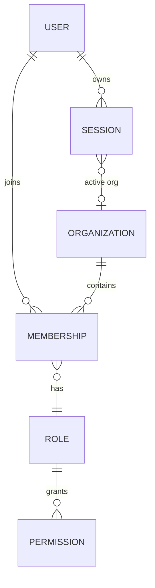
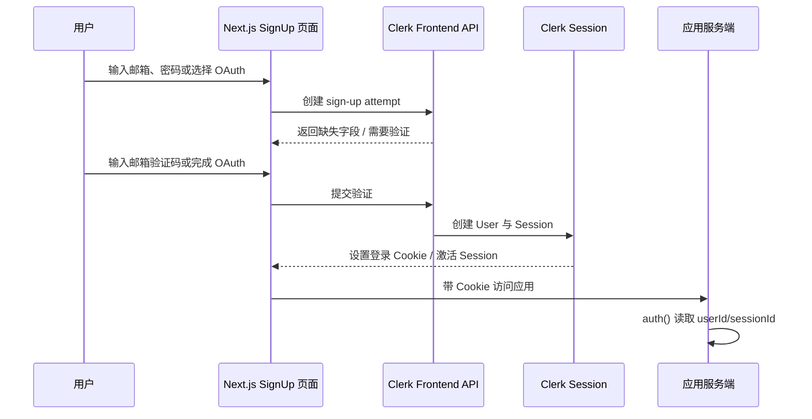
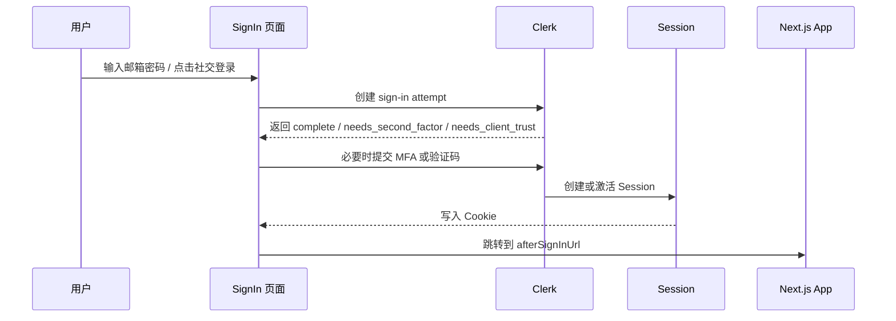
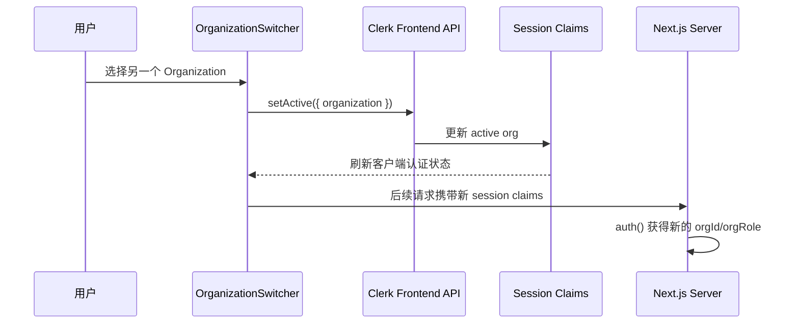
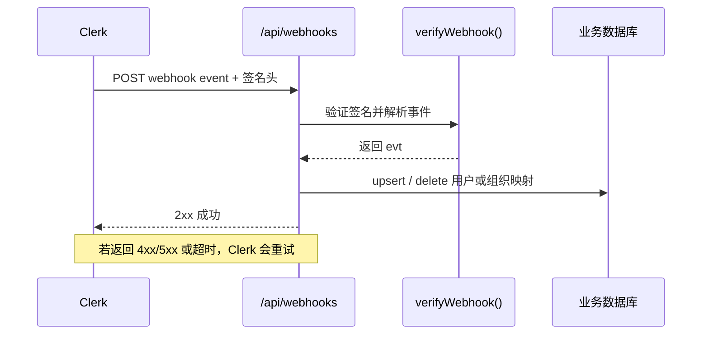
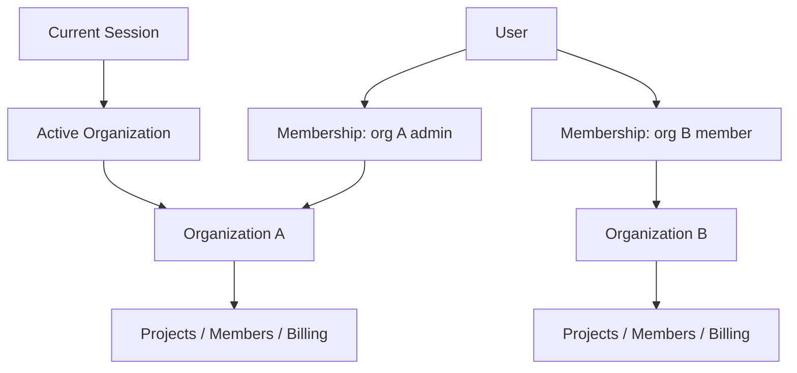
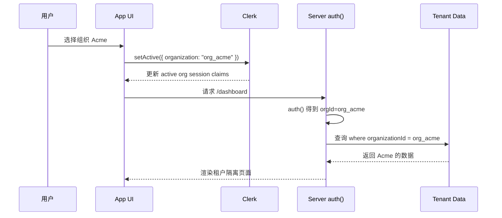

## 基于 Next.js App Router 的企业级认证、授权与多租户实践

> 适用技术栈：Next.js App Router、TypeScript、`@clerk/nextjs`。
>
> 版本说明：本文按 Clerk 官方文档在 2026-05 附近的最新稳定写法整理。Clerk 最新 Next.js Quickstart 已使用 `proxy.ts`，并明确说明 Next.js 15 及以下仍应命名为 `middleware.ts`，代码本身保持一致。参考官方文档：
>
> - [Clerk Next.js App Router Quickstart](https://clerk.com/docs/nextjs/getting-started/quickstart)
> - [clerkMiddleware()](https://clerk.com/docs/reference/nextjs/clerk-middleware)
> - [auth()](https://clerk.com/docs/reference/nextjs/app-router/auth)
> - [currentUser()](https://clerk.com/docs/reference/nextjs/app-router/current-user)
> - [clerkClient](https://clerk.com/docs/references/backend/overview)
> - [Organizations](https://clerk.com/docs/nextjs/guides/organizations/getting-started)
> - [Webhooks](https://clerk.com/docs/guides/development/webhooks/syncing)
> - [User metadata](https://clerk.com/docs/guides/users/extending)

## 目录

1. Clerk 是什么
2. Clerk 核心架构
3. Clerk 的运行流程
4. Next.js 快速开始
5. Clerk 核心组件
6. Clerk Hooks
7. 服务端能力
8. Middleware 与路由保护
9. 身份认证与授权
10. Metadata 深入讲解
11. Organizations 多租户
12. Webhooks
13. JWT、Session 与 Cookie
14. 高级定制
15. 生产环境最佳实践
16. 常见坑与排查
17. 完整实战案例
18. 学习路线建议

---

## 1. Clerk 是什么

Clerk 是一个面向现代 Web 应用的身份认证与用户管理平台。它把注册、登录、会话管理、用户资料、安全设置、多因素认证、社交登录、组织管理、Webhook 同步、服务端鉴权等能力打包成一套可组合的 SDK、组件和后台服务。

### 1.1 Clerk 的定位

Clerk 不只是一个登录表单库，而是一个完整的身份平台：

- 前端：提供 `<SignIn />`、`<SignUp />`、`<UserButton />`、`<OrganizationSwitcher />` 等预构建组件，以及 `useUser()`、`useAuth()`、`useOrganization()` 等 hooks。
- 服务端：提供 `auth()`、`currentUser()`、`clerkClient()`、`clerkMiddleware()`、Webhook 验签等能力。
- 后台：Clerk Dashboard 负责配置登录方式、OAuth、组织、角色权限、JWT 模板、Webhook、域名与安全策略。
- 数据：Clerk 托管用户、会话、认证因子、组织与成员关系，你的业务数据库只需要同步与业务相关的用户映射和权限快照。

### 1.2 它解决了什么问题

自建认证系统通常要处理：

- 密码哈希、重置密码、邮件验证。
- OAuth 回调、安全重定向、账户绑定。
- Session 生成、刷新、吊销、跨设备登录。
- CSRF、XSS、Cookie 安全、SameSite、HTTPS。
- MFA、账号锁定、可疑登录检测。
- 用户资料、头像、邮箱、手机号、组织、邀请。
- 服务端 API 鉴权、权限模型、Webhook 同步。

Clerk 的价值在于：把高风险、重复性强、容易出漏洞的身份系统外包给专业服务，同时仍允许你在 Next.js 中用原生 App Router、Server Components、Route Handlers 和 Server Actions 的方式接入。

### 1.3 与传统自建登录系统的区别

| 维度 | 自建登录系统 | Clerk |
| --- | --- | --- |
| 开发速度 | 需要从数据库、表单、安全策略开始搭建 | 几个文件即可接入 |
| 安全维护 | 团队自己负责漏洞修复与策略升级 | Clerk 负责大部分底层安全 |
| 用户资料 | 自己设计用户表和资料页 | 预构建用户中心和 Backend API |
| 多租户 | 自己设计组织、成员、邀请、角色 | 内置 Organizations |
| Webhook | 自己定义事件流 | Clerk 推送用户和组织事件 |
| 灵活性 | 完全可控 | 平台约束更多 |
| 成本 | 人力成本高，服务成本低 | 服务成本更明确 |

### 1.4 与 NextAuth/Auth.js、Auth0、Supabase Auth 的对比

| 产品 | 特点 | 更适合 |
| --- | --- | --- |
| Clerk | 预构建 UI 强、Next.js 集成深、组织能力完善、上手快 | SaaS、B2B、多租户、希望快速交付的团队 |
| NextAuth/Auth.js | 开源、灵活、适合自控数据库和 session 策略 | 有较强后端能力、希望高度自定义的团队 |
| Auth0 | 企业级身份平台，协议与企业 SSO 能力强 | 大企业、复杂 IAM、合规场景 |
| Supabase Auth | 与 Supabase 数据库和 RLS 结合紧密 | Supabase 全家桶、Postgres/RLS 驱动应用 |

Clerk 的优势是“产品化身份体验 + Next.js 亲和度”。缺点是你会依赖 Clerk 的托管服务、定价、数据模型和 API 设计。

### 1.5 适用场景与不适用场景

适合：

- Next.js SaaS 应用。
- B2B 多租户系统，如团队空间、项目空间、企业账号。
- 需要快速上线登录、注册、用户中心、组织邀请。
- 需要服务端鉴权、Server Components、Route Handlers、Server Actions。
- 需要 Webhook 同步用户数据到业务数据库。

不适合：

- 必须完全离线或私有化部署的系统。
- 对认证数据库、密码策略、session 存储有极强自定义要求的系统。
- 已有成熟内部 IAM，Clerk 只会增加一层复杂度的系统。
- 对第三方身份服务依赖不可接受的高合规场景。

---

## 2. Clerk 核心架构

Clerk 的架构可以理解为四层：

1. 用户交互层：Clerk 前端组件和 hooks。
2. Next.js 应用层：App Router 页面、Server Components、Route Handlers、Server Actions。
3. Clerk 服务层：Frontend API、Backend API、Session、User、Organization、Webhook。
4. 业务数据层：你自己的数据库、权限表、订阅表、租户资源表。

### 2.1 Frontend SDK

Frontend SDK 是浏览器端的 Clerk 能力集合。`@clerk/nextjs` 基于 Clerk React SDK，提供：

- 预构建组件：`<SignIn />`、`<SignUp />`、`<UserButton />`。
- 状态 hooks：`useUser()`、`useAuth()`、`useSession()`。
- 多租户 hooks：`useOrganization()`、`useOrganizationList()`。
- 自定义流程 hooks：`useSignIn()`、`useSignUp()`。

它负责把用户操作变成对 Clerk Frontend API 的调用，并维护当前浏览器里的认证状态。

### 2.2 Backend SDK

Backend SDK 是服务端访问 Clerk 后端数据和管理能力的入口。Next.js 中常用：

- `auth()`：读取当前请求的认证上下文。
- `currentUser()`：获取当前用户的 Backend User 对象。
- `clerkClient()`：调用 Clerk Backend API，如查询用户、更新 metadata、读取组织成员。
- `verifyWebhook()`：验证 Clerk Webhook 签名并解析事件。

### 2.3 Clerk Dashboard

Dashboard 是身份配置中心：

- 配置登录方式：邮箱密码、邮箱验证码、Google、GitHub 等。
- 配置登录/注册 URL、重定向 URL。
- 启用 Organizations、角色、权限。
- 管理用户、session、组织、邀请。
- 配置 Webhook endpoint 和 signing secret。
- 配置 JWT 模板和自定义 claims。

### 2.4 Authentication / Session / User / Organization 的关系

- Authentication：证明“你是谁”的过程，例如密码、OAuth、验证码、MFA。
- User：Clerk 中的用户主体，包含邮箱、手机号、姓名、头像、metadata 等。
- Session：某个用户在某个客户端上的登录态。一个用户可以有多个 session。
- Organization：组织或租户，如公司、团队、工作区。
- Membership：用户与组织之间的成员关系。
- Role / Permission：用户在某个组织中的角色和权限。



### 2.5 Webhook 机制

Webhook 是 Clerk 把用户和组织变化推送给你应用的事件机制。常见事件：

- `user.created`
- `user.updated`
- `user.deleted`
- `organization.created`
- `organization.updated`
- `organization.deleted`
- `organizationMembership.created`
- `organizationMembership.updated`
- `organizationMembership.deleted`

你的应用通过公开的 Route Handler 接收事件，使用 `verifyWebhook()` 验证签名，然后把必要数据同步到业务数据库。

### 2.6 Token / Cookie / Session 的关系

- Cookie：浏览器保存认证状态的载体。
- Session：Clerk 维护的登录会话。
- JWT / Session token：服务端或外部 API 用来验证用户身份与 claims 的令牌。
- `auth()`：在服务端从当前请求中解析认证上下文，得到 `userId`、`sessionId`、`orgId`、`orgRole` 等信息。

### 2.7 整体架构图

```mermaid
flowchart LR
  A[用户浏览器] --> B[Clerk 前端组件 / Hooks]
  B --> C[Clerk Frontend API]
  C --> D[Clerk Session 服务]
  D --> E[Cookie / Session Token]
  A --> F[Next.js App Router 请求]
  F --> G[clerkMiddleware / proxy.ts]
  G --> H[auth() 读取请求认证上下文]
  H --> I[Server Component / Route Handler / Server Action]
  I --> J[受保护资源]
  I --> K[clerkClient Backend API]
  K --> L[User / Organization / Membership]
  L --> M[Webhook 事件]
  M --> N[业务数据库同步]
```

---

## 3. Clerk 的运行流程

### 3.1 注册流程

注册的核心是：用户提交身份标识和验证因子，Clerk 创建 User，完成验证后创建 Session，浏览器获得登录态。



常见坑：

- Dashboard 中未启用对应登录方式。
- 自定义流程里忘记处理 `missing_requirements`。
- 注册完成后没有调用 `finalize()` 或没有正确导航。
- 将业务 onboarding 数据直接信任 `unsafeMetadata`。

### 3.2 登录流程

登录与注册类似，但用户主体已存在。Clerk 验证凭证后创建或激活 session。



### 3.3 访问受保护页面流程

```mermaid
flowchart TD
  A[请求 /dashboard] --> B{proxy.ts / middleware.ts matcher 命中?}
  B -- 否 --> C[进入普通 Next.js 路由]
  B -- 是 --> D[clerkMiddleware 执行]
  D --> E{是否受保护路由?}
  E -- 否 --> C
  E -- 是 --> F[auth.protect()]
  F --> G{已登录?}
  G -- 否 --> H[重定向到登录页]
  G -- 是 --> I{权限满足?}
  I -- 否 --> J[404 或自定义处理]
  I -- 是 --> K[进入页面 / Route Handler]
```

### 3.4 服务端鉴权流程

服务端鉴权通常发生在：

- Server Component 中渲染页面前。
- Route Handler 中返回数据前。
- Server Action 中执行写操作前。
- `clerkMiddleware()` 中进入路由前。

核心代码：

```ts
import { auth } from '@clerk/nextjs/server'

export default async function DashboardPage() {
  const { isAuthenticated, userId, orgId } = await auth()

  if (!isAuthenticated) {
    return <p>请先登录。</p>
  }

  return (
    <main>
      <h1>Dashboard</h1>
      <p>User ID: {userId}</p>
      <p>Active Org ID: {orgId ?? '未选择组织'}</p>
    </main>
  )
}
```

### 3.5 Session 校验流程

Clerk 在 Next.js 中通过 middleware/proxy 和 server helpers 协同工作：

1. 浏览器请求携带 Clerk Cookie。
2. `clerkMiddleware()` 让当前请求具备 Clerk 认证上下文。
3. `auth()` 从请求上下文解析 `Auth` object。
4. 如果需要更完整用户数据，再用 `currentUser()` 或 `clerkClient().users.getUser()`。
5. 如果 session 不存在、过期或无效，`isAuthenticated` 为 `false`。

### 3.6 组织切换流程



注意：组织切换不是切换用户，而是切换当前 session 的 active organization。服务端以 `auth().orgId` 和 `auth().orgRole` 判断当前组织上下文。

### 3.7 Webhook 触发与同步流程



---

## 4. Next.js 快速开始

### 4.1 安装 Clerk

```bash
npm install @clerk/nextjs
```

### 4.2 配置环境变量

`.env.local`

```env
NEXT_PUBLIC_CLERK_PUBLISHABLE_KEY=pk_test_xxx
CLERK_SECRET_KEY=sk_test_xxx

NEXT_PUBLIC_CLERK_SIGN_IN_URL=/sign-in
NEXT_PUBLIC_CLERK_SIGN_UP_URL=/sign-up
NEXT_PUBLIC_CLERK_SIGN_IN_FALLBACK_REDIRECT_URL=/dashboard
NEXT_PUBLIC_CLERK_SIGN_UP_FALLBACK_REDIRECT_URL=/dashboard

CLERK_WEBHOOK_SIGNING_SECRET=whsec_xxx
```

解释：

- `NEXT_PUBLIC_CLERK_PUBLISHABLE_KEY`：浏览器可见，用于初始化前端 SDK。
- `CLERK_SECRET_KEY`：服务端密钥，只能放服务端环境变量。
- 登录/注册链接：让 Clerk 组件和服务端重定向知道你的自定义页面在哪里。
- `CLERK_WEBHOOK_SIGNING_SECRET`：Webhook 签名验证密钥，只能服务端使用。

### 4.3 目录结构

```text
app/
  layout.tsx
  page.tsx
  sign-in/
    [[...sign-in]]/
      page.tsx
  sign-up/
    [[...sign-up]]/
      page.tsx
  dashboard/
    page.tsx
  user-profile/
    [[...user-profile]]/
      page.tsx
proxy.ts              # Next.js 16+
middleware.ts         # Next.js 15 及以下使用此文件名，代码同 proxy.ts
.env.local
```

### 4.4 配置 `ClerkProvider`

`app/layout.tsx`

```tsx
import type { Metadata } from 'next'
import {
  ClerkProvider,
  Show,
  SignInButton,
  SignUpButton,
  UserButton,
} from '@clerk/nextjs'
import './globals.css'

export const metadata: Metadata = {
  title: 'Clerk Next.js App',
  description: 'Clerk authentication learning project',
}

function Header() {
  return (
    <header style={{ display: 'flex', gap: 16, alignItems: 'center', padding: 16 }}>
      <a href="/">Home</a>
      <a href="/dashboard">Dashboard</a>

      <div style={{ marginLeft: 'auto', display: 'flex', gap: 12 }}>
        <Show when="signed-out">
          <SignInButton />
          <SignUpButton />
        </Show>

        <Show when="signed-in">
          <UserButton userProfileMode="navigation" userProfileUrl="/user-profile" />
        </Show>
      </div>
    </header>
  )
}

export default function RootLayout({
  children,
}: Readonly<{
  children: React.ReactNode
}>) {
  return (
    <html lang="zh-CN">
      <body>
        <ClerkProvider>
          <Header />
          {children}
        </ClerkProvider>
      </body>
    </html>
  )
}
```

为什么这样配置：

- `<ClerkProvider>` 必须包住需要使用 Clerk 组件和 hooks 的区域。
- `Show` 用于根据登录状态渲染 UI。
- `UserButton` 提供账户菜单、退出登录、用户资料入口。

### 4.5 配置登录页

`app/sign-in/[[...sign-in]]/page.tsx`

```tsx
import { SignIn } from '@clerk/nextjs'

export default function SignInPage() {
  return (
    <main style={{ display: 'grid', placeItems: 'center', minHeight: '80vh' }}>
      <SignIn />
    </main>
  )
}
```

`[[...sign-in]]` 是可选 catch-all 路由，Clerk 的预构建组件可能需要处理额外路径，例如回调、验证步骤、继续流程。

### 4.6 配置注册页

`app/sign-up/[[...sign-up]]/page.tsx`

```tsx
import { SignUp } from '@clerk/nextjs'

export default function SignUpPage() {
  return (
    <main style={{ display: 'grid', placeItems: 'center', minHeight: '80vh' }}>
      <SignUp />
    </main>
  )
}
```

### 4.7 配置用户中心

`app/user-profile/[[...user-profile]]/page.tsx`

```tsx
import { UserProfile } from '@clerk/nextjs'

export default function UserProfilePage() {
  return (
    <main style={{ display: 'grid', placeItems: 'center', padding: 32 }}>
      <UserProfile routing="path" path="/user-profile" />
    </main>
  )
}
```

### 4.8 配置 middleware/proxy

Next.js 16+ 使用 `proxy.ts`。Next.js 15 及以下使用 `middleware.ts`。内容相同。

`proxy.ts`

```ts
import { clerkMiddleware, createRouteMatcher } from '@clerk/nextjs/server'

const isProtectedRoute = createRouteMatcher(['/dashboard(.*)'])

export default clerkMiddleware(async (auth, req) => {
  if (isProtectedRoute(req)) {
    await auth.protect()
  }
})

export const config = {
  matcher: [
    '/((?!_next|[^?]*\\.(?:html?|css|js(?!on)|jpe?g|webp|png|gif|svg|ttf|woff2?|ico|csv|docx?|xlsx?|zip|webmanifest)).*)',
    '/(api|trpc)(.*)',
    '/__clerk/(.*)',
  ],
}
```

解释：

- `clerkMiddleware()` 将 Clerk 认证能力接入请求生命周期。
- `createRouteMatcher()` 用路径规则判断哪些路由需要保护。
- `auth.protect()` 未登录时会重定向到登录页；权限不满足时通常返回 404。
- `matcher` 避开静态资源，同时确保 API、tRPC、Clerk 前端代理路径会经过 middleware。

### 4.9 验证接入成功

1. 运行 `npm run dev`。
2. 访问 `http://localhost:3000`，应看到登录/注册入口。
3. 访问 `/dashboard`，未登录会跳转到登录页。
4. 注册或登录后再访问 `/dashboard`，应能看到页面。
5. 点击 `UserButton`，应能打开账户菜单并退出登录。

---

## 5. Clerk 核心组件

### 5.1 `<ClerkProvider />`

它是什么：Clerk React/Next.js 的上下文提供者。

为什么存在：Clerk 的组件和 hooks 需要访问同一个 Clerk client、session 状态、路由配置和外观配置。

什么时候用：几乎所有 Clerk Next.js 应用都应在 `app/layout.tsx` 顶层使用。

底层机制：初始化前端 Clerk 实例，读取 publishable key，维护客户端认证状态，并向子组件暴露 context。

示例：

```tsx
import { ClerkProvider } from '@clerk/nextjs'

export default function RootLayout({ children }: { children: React.ReactNode }) {
  return (
    <html lang="zh-CN">
      <body>
        <ClerkProvider
          appearance={{
            variables: {
              colorPrimary: '#2563eb',
            },
          }}
        >
          {children}
        </ClerkProvider>
      </body>
    </html>
  )
}
```

常见配置：

- `appearance`：定制 Clerk 组件样式。
- `signInUrl` / `signUpUrl`：也可以通过环境变量配置。
- `dynamic`：在特定渲染模式下帮助动态读取认证状态，避免静态渲染拿不到请求态。

常见坑：

- 没有包住使用 Clerk hooks 的 Client Component。
- 在多个 layout 重复包裹导致状态混乱。
- 服务端组件中误用客户端 hook。

### 5.2 `<SignIn />`

作用：渲染完整登录流程。

典型场景：需要快速接入登录页，支持邮箱密码、验证码、OAuth、MFA 等 Dashboard 中启用的策略。

示例：

```tsx
import { SignIn } from '@clerk/nextjs'

export default function Page() {
  return <SignIn path="/sign-in" routing="path" signUpUrl="/sign-up" />
}
```

主要 props：

- `path`：当前组件所在路径。
- `routing`：使用 path routing 时设为 `path`。
- `signUpUrl`：跳转到注册页。
- `appearance`：样式定制。
- `fallback`：组件加载时显示。

运行机制：组件根据当前登录 attempt 状态渲染不同步骤；完成后 Clerk 激活 session 并按配置重定向。

常见问题：

- URL 配置和实际路由不一致，导致回调失败。
- OAuth redirect URL 没在 Dashboard 配好。
- 自定义页面没有用 catch-all 路由。

### 5.3 `<SignUp />`

作用：渲染完整注册流程。

示例：

```tsx
import { SignUp } from '@clerk/nextjs'

export default function Page() {
  return <SignUp path="/sign-up" routing="path" signInUrl="/sign-in" />
}
```

使用场景：

- B2C 应用开放注册。
- SaaS 用户注册后进入 onboarding。
- 与 Organizations 结合，让新用户创建或加入组织。

底层机制：创建 sign-up attempt，处理必填字段、邮箱/手机号验证、OAuth 回调，最终创建 User 和 Session。

常见坑：

- Dashboard 关闭了注册或未启用对应标识符。
- 注册完成后的 fallback redirect 未配置。
- 把敏感业务字段放进 `unsafeMetadata`。

### 5.4 `<UserButton />`

作用：显示用户头像菜单，提供账户管理、退出登录、多 session 切换等。

示例：

```tsx
import { UserButton } from '@clerk/nextjs'

export function AccountMenu() {
  return (
    <UserButton
      showName
      userProfileMode="navigation"
      userProfileUrl="/user-profile"
      afterSwitchSessionUrl="/dashboard"
    />
  )
}
```

主要 props：

- `showName`：是否显示用户名。
- `userProfileMode`：`modal` 或 `navigation`。
- `userProfileUrl`：用户资料页路径。
- `afterSwitchSessionUrl`：多 session 切换后的跳转路径。
- `appearance`：样式配置。

运行机制：读取当前 session 的用户资料，展示菜单；退出时调用 Clerk session sign out；进入用户中心时打开 `<UserProfile />`。

常见坑：

- 未登录时直接渲染可能出现加载状态，应配合 `Show when="signed-in"`。
- 使用 navigation 模式但没有实际挂载 `<UserProfile />` 页面。

### 5.5 `<UserProfile />`

作用：完整用户中心，用于管理资料、安全设置、邮箱、手机号、MFA 等。

示例：

```tsx
import { UserProfile } from '@clerk/nextjs'

export default function UserProfilePage() {
  return <UserProfile routing="path" path="/user-profile" />
}
```

典型场景：

- 用户需要修改姓名、头像、邮箱、密码。
- 用户需要管理 MFA。
- 用户需要连接 OAuth 账号。

常见坑：

- 路由模式不匹配。
- 把用户中心放在未受保护页面，但用户未登录时体验不清晰。

### 5.6 `<OrganizationSwitcher />`

作用：创建、切换、管理当前 active organization。

示例：

```tsx
import { OrganizationSwitcher } from '@clerk/nextjs'

export function OrgSwitcher() {
  return (
    <OrganizationSwitcher
      hidePersonal
      afterCreateOrganizationUrl="/dashboard"
      afterSelectOrganizationUrl="/dashboard"
      afterLeaveOrganizationUrl="/"
    />
  )
}
```

主要 props：

- `hidePersonal`：隐藏个人账户入口，适合强组织 SaaS。
- `afterCreateOrganizationUrl`：创建组织后跳转。
- `afterSelectOrganizationUrl`：切换组织后跳转。
- `organizationProfileMode`：组织管理页以 modal 或 navigation 打开。

运行机制：调用 Clerk 的 `setActive({ organization })`，更新当前 session 的 active org。

常见坑：

- Dashboard 未启用 Organizations。
- 服务端根据 URL tenant 判断组织，但没有同步 active organization。
- 用户没有任何组织时没有处理空状态。

### 5.7 `<CreateOrganization />`

作用：预构建的创建组织组件。

示例：

```tsx
import { CreateOrganization } from '@clerk/nextjs'

export default function CreateOrgPage() {
  return <CreateOrganization afterCreateOrganizationUrl="/dashboard" />
}
```

典型场景：

- SaaS onboarding 第一步让用户创建公司。
- 用户从个人空间升级到团队空间。

常见坑：

- Organizations 未启用。
- 组织 slug 与已有组织冲突。
- 创建后没有设置合理跳转。

---

## 6. Clerk Hooks

所有 hooks 都只能在 Client Component 中使用，即文件顶部需要 `'use client'`。

### 6.1 `useUser()`

它是什么：读取当前用户对象和加载状态的 hook。

返回值：

- `isLoaded`：Clerk 是否已加载。
- `isSignedIn`：是否登录。
- `user`：前端 User 对象，包含邮箱、姓名、头像、public/unsafe metadata 等。

示例：

```tsx
'use client'

import { useUser } from '@clerk/nextjs'

export function UserGreeting() {
  const { isLoaded, isSignedIn, user } = useUser()

  if (!isLoaded) return <p>加载中...</p>
  if (!isSignedIn) return <p>请登录。</p>

  return <p>你好，{user.firstName ?? user.primaryEmailAddress?.emailAddress}</p>
}
```

什么时候用：客户端展示用户资料时。

常见坑：不要在服务端组件使用；不要依赖它做服务端安全判断。

### 6.2 `useAuth()`

它是什么：读取认证状态、session、组织上下文和客户端授权判断的 hook。

返回值常用字段：

- `isLoaded`
- `isSignedIn`
- `userId`
- `sessionId`
- `orgId`
- `orgRole`
- `orgSlug`
- `sessionClaims`
- `getToken()`
- `has()`
- `signOut()`

示例：

```tsx
'use client'

import { useAuth } from '@clerk/nextjs'

export function ClientAuthPanel() {
  const { isLoaded, isSignedIn, userId, orgId, has } = useAuth()

  if (!isLoaded) return null
  if (!isSignedIn) return <p>未登录</p>

  const canManageMembers = has({ permission: 'org:members:manage' })

  return (
    <section>
      <p>User: {userId}</p>
      <p>Org: {orgId ?? '无 active org'}</p>
      <p>Can manage members: {String(canManageMembers)}</p>
    </section>
  )
}
```

注意：客户端 `has()` 适合控制 UI 显示，真正的写操作仍要在服务端再次校验。

### 6.3 `useSession()`

它是什么：读取当前 active session 资源。

示例：

```tsx
'use client'

import { useSession } from '@clerk/nextjs'

export function SessionInfo() {
  const { isLoaded, session } = useSession()

  if (!isLoaded) return <p>加载 session...</p>
  if (!session) return <p>无 active session</p>

  return (
    <ul>
      <li>Session ID: {session.id}</li>
      <li>Status: {session.status}</li>
      <li>Last active: {session.lastActiveAt?.toLocaleString()}</li>
    </ul>
  )
}
```

使用场景：展示当前设备登录状态、处理 session 级别信息。

常见坑：不要把 session 对象当作业务用户表；它是登录态，不是业务档案。

### 6.4 `useOrganization()`

它是什么：读取当前 active organization。

示例：

```tsx
'use client'

import { useOrganization } from '@clerk/nextjs'

export function ActiveOrgName() {
  const { isLoaded, organization } = useOrganization()

  if (!isLoaded) return null
  if (!organization) return <p>请选择组织。</p>

  return <p>当前组织：{organization.name}</p>
}
```

使用场景：客户端显示当前组织名称、头像、slug。

常见坑：没有 active organization 时 `organization` 为 `null`，必须处理。

### 6.5 `useOrganizationList()`

它是什么：读取用户可访问的组织列表，并提供 `setActive()`、`createOrganization()`。

示例：

```tsx
'use client'

import { useOrganizationList } from '@clerk/nextjs'

export function OrganizationListPanel() {
  const { isLoaded, userMemberships, setActive } = useOrganizationList({
    userMemberships: true,
  })

  if (!isLoaded) return <p>加载组织...</p>

  return (
    <ul>
      {userMemberships.data?.map((membership) => (
        <li key={membership.id}>
          <button
            type="button"
            onClick={() => setActive?.({ organization: membership.organization.id })}
          >
            {membership.organization.name} - {membership.role}
          </button>
        </li>
      ))}
    </ul>
  )
}
```

使用场景：自定义组织切换器、组织列表页、邀请处理页。

常见坑：`setActive()` 可能导致认证状态短暂重新加载，要处理 `isLoaded`。

### 6.6 `useSignIn()`

它是什么：自定义登录流程的底层 hook。最新 Clerk SDK 推荐使用新 `SignInFuture` API，而旧版 `@clerk/nextjs/legacy` 会在未来移除。

示例：邮箱密码登录。

```tsx
'use client'

import { useSignIn } from '@clerk/nextjs'
import { useRouter } from 'next/navigation'
import { FormEvent, useState } from 'react'

export function CustomSignInForm() {
  const { signIn, fetchStatus, errors } = useSignIn()
  const router = useRouter()
  const [emailAddress, setEmailAddress] = useState('')
  const [password, setPassword] = useState('')

  async function onSubmit(event: FormEvent<HTMLFormElement>) {
    event.preventDefault()

    const result = await signIn.password({
      emailAddress,
      password,
    })

    if (result.error) {
      console.error(result.error)
      return
    }

    if (signIn.status === 'complete') {
      await signIn.finalize({
        navigate: ({ session, decorateUrl }) => {
          if (session?.currentTask) return
          const url = decorateUrl('/dashboard')
          router.push(url)
        },
      })
    }
  }

  return (
    <form onSubmit={onSubmit}>
      <input value={emailAddress} onChange={(e) => setEmailAddress(e.target.value)} />
      <input
        type="password"
        value={password}
        onChange={(e) => setPassword(e.target.value)}
      />
      <button type="submit" disabled={fetchStatus === 'fetching'}>
        登录
      </button>
      {errors?.map((error) => <p key={error.code}>{error.message}</p>)}
    </form>
  )
}
```

使用时机：预构建 `<SignIn />` 无法满足产品体验时。

注意事项：

- 要处理 `needs_second_factor`、`needs_client_trust`、`currentTask`。
- `signIn` 对象会随流程变化，放进 hook 依赖数组时要小心。
- 自定义流程复杂度明显高于预构建组件。

### 6.7 `useSignUp()`

它是什么：自定义注册流程的底层 hook。

示例：创建账号并发送邮箱验证码。

```tsx
'use client'

import { useSignUp } from '@clerk/nextjs'
import { useRouter } from 'next/navigation'
import { FormEvent, useState } from 'react'

export function CustomSignUpForm() {
  const { signUp, fetchStatus, errors } = useSignUp()
  const router = useRouter()
  const [emailAddress, setEmailAddress] = useState('')
  const [password, setPassword] = useState('')
  const [code, setCode] = useState('')
  const [verifying, setVerifying] = useState(false)

  async function createAccount(event: FormEvent<HTMLFormElement>) {
    event.preventDefault()

    const result = await signUp.password({ emailAddress, password })
    if (result.error) return

    await signUp.verifications.sendEmailCode()
    setVerifying(true)
  }

  async function verifyEmail(event: FormEvent<HTMLFormElement>) {
    event.preventDefault()

    const result = await signUp.verifications.verifyEmailCode({ code })
    if (result.error) return

    if (signUp.status === 'complete') {
      await signUp.finalize({
        navigate: ({ session, decorateUrl }) => {
          if (session?.currentTask) return
          router.push(decorateUrl('/dashboard'))
        },
      })
    }
  }

  if (verifying) {
    return (
      <form onSubmit={verifyEmail}>
        <input value={code} onChange={(e) => setCode(e.target.value)} />
        <button type="submit">验证邮箱</button>
      </form>
    )
  }

  return (
    <form onSubmit={createAccount}>
      <input value={emailAddress} onChange={(e) => setEmailAddress(e.target.value)} />
      <input
        type="password"
        value={password}
        onChange={(e) => setPassword(e.target.value)}
      />
      <button type="submit" disabled={fetchStatus === 'fetching'}>
        注册
      </button>
      {errors?.map((error) => <p key={error.code}>{error.message}</p>)}
    </form>
  )
}
```

---

## 7. 服务端能力

### 7.1 `auth()`

`auth()` 是 App Router 服务端读取当前请求认证上下文的首选 API。

它返回：

- `isAuthenticated`
- `userId`
- `sessionId`
- `orgId`
- `orgRole`
- `orgSlug`
- `sessionClaims`
- `has()`
- `getToken()`
- `redirectToSignIn()`

Server Component 示例：

```tsx
import { auth } from '@clerk/nextjs/server'

export default async function DashboardPage() {
  const { isAuthenticated, userId } = await auth()

  if (!isAuthenticated) {
    return <p>请登录。</p>
  }

  return <h1>欢迎，{userId}</h1>
}
```

Route Handler 示例：

```ts
import { auth } from '@clerk/nextjs/server'
import { NextResponse } from 'next/server'

export async function GET() {
  const { isAuthenticated, userId } = await auth()

  if (!isAuthenticated) {
    return NextResponse.json({ error: 'Unauthorized' }, { status: 401 })
  }

  return NextResponse.json({ userId })
}
```

Server Action 示例：

```ts
'use server'

import { auth } from '@clerk/nextjs/server'

export async function createProject(formData: FormData) {
  const { isAuthenticated, userId, orgId } = await auth()

  if (!isAuthenticated) {
    throw new Error('Unauthorized')
  }

  const name = String(formData.get('name') ?? '')

  return {
    id: crypto.randomUUID(),
    name,
    ownerId: userId,
    organizationId: orgId,
  }
}
```

### 7.2 `currentUser()`

`currentUser()` 返回当前 active user 的 Backend User 对象。

```tsx
import { currentUser } from '@clerk/nextjs/server'

export default async function Page() {
  const user = await currentUser()

  if (!user) return <p>未登录</p>

  return <p>{user.primaryEmailAddress?.emailAddress}</p>
}
```

`auth()` 和 `currentUser()` 的区别：

| API | 返回内容 | 是否调用 Backend API | 适合场景 |
| --- | --- | --- | --- |
| `auth()` | 认证上下文和 claims | 通常不需要额外获取完整用户 | 鉴权、读取 userId/orgId/sessionId |
| `currentUser()` | Backend User 对象 | 会调用 Clerk Backend API，并计入限流 | 服务端确实需要姓名、邮箱、metadata |

为什么不要滥用 `currentUser()`：

- 它底层会请求 Clerk Backend API。
- 会计入 Backend API rate limit。
- Backend User 包含 `privateMetadata`，不要原样传给客户端。
- 很多场景只需要 `auth().userId`。

### 7.3 `clerkClient()`

`clerkClient()` 是 Clerk Backend API 的服务端客户端。

查询用户：

```ts
import { clerkClient } from '@clerk/nextjs/server'

export async function getUserEmail(userId: string) {
  const client = await clerkClient()
  const user = await client.users.getUser(userId)

  return user.primaryEmailAddress?.emailAddress ?? null
}
```

更新用户 metadata：

```ts
import { clerkClient } from '@clerk/nextjs/server'

export async function markUserAsOnboarded(userId: string) {
  const client = await clerkClient()

  await client.users.updateUserMetadata(userId, {
    publicMetadata: {
      onboardingComplete: true,
    },
    privateMetadata: {
      internalStatus: 'active',
    },
  })
}
```

读取组织：

```ts
import { clerkClient } from '@clerk/nextjs/server'

export async function getOrganizationName(organizationId: string) {
  const client = await clerkClient()
  const organization = await client.organizations.getOrganization({ organizationId })

  return organization.name
}
```

---

## 8. Middleware 与路由保护

### 8.1 `clerkMiddleware()`

`clerkMiddleware()` 把 Clerk 的请求级认证能力接入 Next.js。官方最新 Quickstart 说明：

- Next.js 16+：文件命名为 `proxy.ts`。
- Next.js 15 及以下：文件命名为 `middleware.ts`。
- 代码相同。
- 默认不保护任何路由，必须显式配置。

### 8.2 matcher 的作用

`matcher` 决定哪些请求会经过 middleware/proxy。推荐规则：

```ts
export const config = {
  matcher: [
    '/((?!_next|[^?]*\\.(?:html?|css|js(?!on)|jpe?g|webp|png|gif|svg|ttf|woff2?|ico|csv|docx?|xlsx?|zip|webmanifest)).*)',
    '/(api|trpc)(.*)',
    '/__clerk/(.*)',
  ],
}
```

含义：

- 跳过 `_next` 和大多数静态资源。
- 始终包含 API 和 tRPC。
- 始终包含 Clerk 前端 API 代理路径。

### 8.3 middleware 请求拦截流程

```mermaid
flowchart TD
  A[请求进入 Next.js] --> B{matcher 是否匹配}
  B -- 否 --> C[跳过 clerkMiddleware]
  B -- 是 --> D[执行 clerkMiddleware]
  D --> E[读取 Cookie / Session Token]
  E --> F[生成 Auth 上下文]
  F --> G{createRouteMatcher 命中受保护路由}
  G -- 否 --> H[继续处理请求]
  G -- 是 --> I[auth.protect 或 auth().has]
  I --> J{认证 / 授权通过}
  J -- 是 --> H
  J -- 否 --> K[重定向登录 / 返回 404 / 自定义响应]
```

### 8.4 完整保护示例

`proxy.ts` 或 `middleware.ts`

```ts
import { clerkMiddleware, createRouteMatcher } from '@clerk/nextjs/server'
import { NextResponse } from 'next/server'

const isPublicRoute = createRouteMatcher([
  '/',
  '/sign-in(.*)',
  '/sign-up(.*)',
  '/api/webhooks(.*)',
])

const isDashboardRoute = createRouteMatcher(['/dashboard(.*)'])
const isAdminRoute = createRouteMatcher(['/admin(.*)'])
const isApiRoute = createRouteMatcher(['/api/private(.*)'])

export default clerkMiddleware(async (auth, req) => {
  if (isPublicRoute(req)) {
    return NextResponse.next()
  }

  if (isDashboardRoute(req) || isApiRoute(req)) {
    await auth.protect()
  }

  if (isAdminRoute(req)) {
    await auth.protect((has) => has({ role: 'org:admin' }))
  }
})

export const config = {
  matcher: [
    '/((?!_next|[^?]*\\.(?:html?|css|js(?!on)|jpe?g|webp|png|gif|svg|ttf|woff2?|ico|csv|docx?|xlsx?|zip|webmanifest)).*)',
    '/(api|trpc)(.*)',
    '/__clerk/(.*)',
  ],
}
```

### 8.5 API 路由保护

```ts
import { auth } from '@clerk/nextjs/server'
import { NextResponse } from 'next/server'

export async function POST() {
  const { isAuthenticated, has } = await auth()

  if (!isAuthenticated) {
    return NextResponse.json({ error: 'Unauthorized' }, { status: 401 })
  }

  if (!has({ permission: 'org:projects:create' })) {
    return NextResponse.json({ error: 'Forbidden' }, { status: 403 })
  }

  return NextResponse.json({ ok: true })
}
```

### 8.6 Server Action 保护

```ts
'use server'

import { auth } from '@clerk/nextjs/server'

export async function deleteProject(projectId: string) {
  const { isAuthenticated, has } = await auth()

  if (!isAuthenticated) {
    throw new Error('Unauthorized')
  }

  if (!has({ permission: 'org:projects:delete' })) {
    throw new Error('Forbidden')
  }

  return { deletedProjectId: projectId }
}
```

### 8.7 常见错误与排查

- middleware 没生效：文件名与 Next.js 版本不匹配，或放错目录。
- 访问受保护路由未拦截：忘记调用 `auth.protect()`。
- API 全部被拦：Webhook 路由没有设为 public。
- 权限判断不准：服务端 `has({ permission })` 只适合 custom permissions；系统权限建议判断 role。
- 重定向循环：登录页本身被保护了。

---

## 9. 身份认证与授权

### 9.1 Authentication vs Authorization

Authentication：确认用户是谁。

Authorization：确认用户能做什么。

在 Clerk 中：

- `userId` 解决“是谁”。
- `sessionId` 解决“当前登录态是什么”。
- `orgId` 解决“当前租户上下文是什么”。
- `orgRole` 和 `permission` 解决“在这个租户里能做什么”。

### 9.2 `auth().protect()`

`auth.protect()` 用于快速保护页面和路由。

```tsx
import { auth } from '@clerk/nextjs/server'

export default async function AdminPage() {
  await auth.protect({ role: 'org:admin' })

  return <h1>Admin</h1>
}
```

未登录会重定向；已登录但无权限通常返回 404，避免暴露资源存在性。

### 9.3 `auth().has()`

`has()` 提供更灵活的判断。

```tsx
import { auth } from '@clerk/nextjs/server'

export default async function BillingPage() {
  const { isAuthenticated, has } = await auth()

  if (!isAuthenticated) return <p>请登录</p>
  if (!has({ permission: 'org:billing:manage' })) return <p>无权限</p>

  return <h1>Billing Settings</h1>
}
```

### 9.4 RBAC 示例

目录：

```text
app/
  admin/
    page.tsx
  dashboard/
    page.tsx
proxy.ts
```

`proxy.ts`

```ts
import { clerkMiddleware, createRouteMatcher } from '@clerk/nextjs/server'

const isAdminRoute = createRouteMatcher(['/admin(.*)'])
const isDashboardRoute = createRouteMatcher(['/dashboard(.*)'])

export default clerkMiddleware(async (auth, req) => {
  if (isDashboardRoute(req)) {
    await auth.protect()
  }

  if (isAdminRoute(req)) {
    await auth.protect((has) => has({ role: 'org:admin' }))
  }
})

export const config = {
  matcher: [
    '/((?!_next|[^?]*\\.(?:html?|css|js(?!on)|jpe?g|webp|png|gif|svg|ttf|woff2?|ico|csv|docx?|xlsx?|zip|webmanifest)).*)',
    '/(api|trpc)(.*)',
    '/__clerk/(.*)',
  ],
}
```

`app/admin/page.tsx`

```tsx
import { auth } from '@clerk/nextjs/server'

export default async function AdminPage() {
  const { orgId, orgRole } = await auth.protect()

  return (
    <main>
      <h1>Admin Console</h1>
      <p>Organization: {orgId}</p>
      <p>Role: {orgRole}</p>
    </main>
  )
}
```

### 9.5 基于权限的访问控制

权限更细粒度，适合：

- `org:projects:create`
- `org:projects:delete`
- `org:members:manage`
- `org:billing:manage`

写操作必须服务端校验：

```ts
'use server'

import { auth } from '@clerk/nextjs/server'

export async function inviteMember(emailAddress: string) {
  const { isAuthenticated, has, orgId } = await auth()

  if (!isAuthenticated || !orgId) {
    throw new Error('Unauthorized')
  }

  if (!has({ permission: 'org:members:manage' })) {
    throw new Error('Forbidden')
  }

  return { invited: emailAddress, organizationId: orgId }
}
```

---

## 10. Metadata 深入讲解

Clerk User metadata 用于存储 Clerk 默认不收集的用户附加信息。官方说明 metadata 总大小限制为 8KB；如果放入 session token，自定义 claims 建议保持更小，以免 token 过大。

### 10.1 三种 metadata 对比

| 类型 | 前端读 | 前端写 | 后端读 | 后端写 | 适合存储 |
| --- | --- | --- | --- | --- | --- |
| `publicMetadata` | 可以 | 不可以 | 可以 | 可以 | 前端可见但用户不能改的数据 |
| `privateMetadata` | 不可以 | 不可以 | 可以 | 可以 | 内部 ID、风控标记、支付客户 ID |
| `unsafeMetadata` | 可以 | 可以 | 可以 | 可以 | 注册/onboarding 临时数据 |

### 10.2 publicMetadata

适合：

- `roleLabel`
- `onboardingComplete`
- `preferredWorkspaceType`

不适合：

- 密钥、token、支付信息。
- 服务端权限唯一来源。

读取：

```tsx
'use client'

import { useUser } from '@clerk/nextjs'

export function OnboardingStatus() {
  const { user } = useUser()
  const completed = user?.publicMetadata.onboardingComplete

  return <p>Onboarding: {completed ? '完成' : '未完成'}</p>
}
```

更新：

```ts
import { clerkClient } from '@clerk/nextjs/server'

export async function completeOnboarding(userId: string) {
  const client = await clerkClient()

  await client.users.updateUserMetadata(userId, {
    publicMetadata: {
      onboardingComplete: true,
    },
  })
}
```

### 10.3 privateMetadata

适合：

- `stripeCustomerId`
- `internalRiskLevel`
- `legacyUserId`

示例：

```ts
import { clerkClient } from '@clerk/nextjs/server'

export async function attachStripeCustomer(userId: string, stripeCustomerId: string) {
  const client = await clerkClient()

  await client.users.updateUserMetadata(userId, {
    privateMetadata: {
      stripeCustomerId,
    },
  })
}
```

安全边界：private metadata 不会暴露给前端，但如果你把 `currentUser()` 的完整返回值传给 Client Component，就可能自己泄露它。

### 10.4 unsafeMetadata

适合：

- 注册流程收集但尚未审核的数据。
- onboarding 中的临时偏好。

不适合：

- 权限、角色、付费状态。
- 任何用户不能自行伪造的数据。

示例：

```tsx
'use client'

import { useUser } from '@clerk/nextjs'

export function UpdateUnsafeMetadataButton() {
  const { user } = useUser()

  async function update() {
    await user?.update({
      unsafeMetadata: {
        onboardingSource: 'marketing-site',
      },
    })
  }

  return <button onClick={update}>保存临时信息</button>
}
```

### 10.5 metadata 与 session token 延迟

如果你把 metadata 加入 JWT claims，服务端更新 metadata 后，旧 session token 不一定立刻反映新值。处理方式：

- 对实时性要求高的权限，不依赖刚更新的 token claims。
- 更新后让客户端刷新 token。
- 服务端关键写操作直接查业务数据库或 Clerk Backend API。

---

## 11. Organizations 多租户

### 11.1 为什么 SaaS 需要多租户

SaaS 用户通常不是孤立个人，而是属于某个团队、公司或项目空间。多租户要解决：

- 同一个用户可以加入多个组织。
- 同一资源必须归属某个租户。
- 用户在不同组织中可能有不同角色。
- 邀请、成员管理、账单、权限都按组织隔离。

### 11.2 核心概念

- Organization：租户主体。
- Membership：用户加入组织后的成员关系。
- Invitation：邀请用户加入组织。
- Role：成员角色，例如 `org:admin`、`org:member`。
- Permission：角色包含的具体权限。
- Active Organization：当前 session 正在操作的组织上下文。



### 11.3 添加组织切换器

```tsx
import { OrganizationSwitcher } from '@clerk/nextjs'

export function HeaderOrgSwitcher() {
  return (
    <OrganizationSwitcher
      hidePersonal
      afterCreateOrganizationUrl="/dashboard"
      afterSelectOrganizationUrl="/dashboard"
    />
  )
}
```

### 11.4 创建组织

预构建组件：

```tsx
import { CreateOrganization } from '@clerk/nextjs'

export default function CreateOrganizationPage() {
  return <CreateOrganization afterCreateOrganizationUrl="/dashboard" />
}
```

自定义流程：

```tsx
'use client'

import { useOrganizationList } from '@clerk/nextjs'
import { FormEvent, useState } from 'react'

export function CustomCreateOrganization() {
  const { isLoaded, createOrganization, setActive } = useOrganizationList()
  const [name, setName] = useState('')

  async function onSubmit(event: FormEvent<HTMLFormElement>) {
    event.preventDefault()
    if (!isLoaded || !createOrganization) return

    const organization = await createOrganization({ name })
    await setActive?.({ organization: organization.id })
  }

  return (
    <form onSubmit={onSubmit}>
      <input value={name} onChange={(event) => setName(event.target.value)} />
      <button type="submit">创建组织</button>
    </form>
  )
}
```

### 11.5 获取组织信息

服务端：

```tsx
import { auth, clerkClient } from '@clerk/nextjs/server'

export default async function OrganizationDashboardPage() {
  const { isAuthenticated, orgId, orgRole } = await auth()

  if (!isAuthenticated) return <p>请登录</p>
  if (!orgId) return <p>请选择组织</p>

  const client = await clerkClient()
  const organization = await client.organizations.getOrganization({ organizationId: orgId })

  return (
    <main>
      <h1>{organization.name}</h1>
      <p>你的角色：{orgRole}</p>
    </main>
  )
}
```

客户端：

```tsx
'use client'

import { useOrganization, useOrganizationList } from '@clerk/nextjs'

export function ClientOrganizationSummary() {
  const { organization } = useOrganization()
  const { userMemberships } = useOrganizationList({ userMemberships: true })

  const membership = userMemberships.data?.find(
    (item) => item.organization.id === organization?.id,
  )

  return (
    <section>
      <h2>{organization?.name ?? '未选择组织'}</h2>
      <p>{membership?.role ?? '无角色'}</p>
    </section>
  )
}
```

### 11.6 组织成员管理

读取成员：

```ts
import { clerkClient } from '@clerk/nextjs/server'

export async function listOrganizationMembers(organizationId: string) {
  const client = await clerkClient()

  return client.organizations.getOrganizationMembershipList({
    organizationId,
  })
}
```

邀请成员：

```ts
'use server'

import { auth, clerkClient } from '@clerk/nextjs/server'

export async function inviteOrganizationMember(emailAddress: string) {
  const { isAuthenticated, orgId, has } = await auth()

  if (!isAuthenticated || !orgId) {
    throw new Error('Unauthorized')
  }

  if (!has({ permission: 'org:members:manage' })) {
    throw new Error('Forbidden')
  }

  const client = await clerkClient()

  await client.organizations.createOrganizationInvitation({
    organizationId: orgId,
    emailAddress,
    role: 'org:member',
  })
}
```

### 11.7 多租户 URL 设计思路

常见方案：

| 方案 | 示例 | 优点 | 注意事项 |
| --- | --- | --- | --- |
| active org | `/dashboard` | 简单，依赖 Clerk active org | URL 不表达租户 |
| slug path | `/org/acme/dashboard` | 可分享、可审计 | 需要同步 URL org 与 active org |
| 子域名 | `acme.example.com` | 企业感强 | 域名、cookie、proxy 配置更复杂 |

推荐起步：先用 active org。业务成熟后再引入 `/org/[slug]`。

### 11.8 多租户运行流程



---

## 12. Webhooks

### 12.1 为什么需要 Webhook

Clerk 是身份系统，业务数据库是你的业务事实来源。你通常需要在本地数据库保存：

- `clerkUserId` 到业务用户 ID 的映射。
- 用户邮箱、头像、姓名快照。
- `clerkOrganizationId` 到租户 ID 的映射。
- 成员关系、订阅关系、权限缓存。

Webhook 让 Clerk 事件可靠地同步到你的系统。

### 12.2 常见事件类型

- `user.created`：创建业务用户记录。
- `user.updated`：更新用户资料快照。
- `user.deleted`：软删除或匿名化用户。
- `organization.created`：创建租户记录。
- `organization.updated`：更新租户名称、slug。
- `organization.deleted`：停用租户。
- `organizationMembership.created`：同步成员加入。
- `organizationMembership.deleted`：同步成员移除。

### 12.3 Webhook 路由为什么应当公开

Webhook 请求来自 Clerk 服务器，不是来自已登录用户浏览器，不会携带你的应用 session。它的安全性不靠登录态，而靠签名验证。

因此：

- `/api/webhooks(.*)` 必须从 middleware 保护中排除。
- 必须调用 `verifyWebhook()`。
- 必须保护 `CLERK_WEBHOOK_SIGNING_SECRET`。

### 12.4 Route Handler 示例

`app/api/webhooks/route.ts`

```ts
import { verifyWebhook } from '@clerk/nextjs/webhooks'
import { NextRequest, NextResponse } from 'next/server'

type SyncedUser = {
  clerkUserId: string
  emailAddress: string | null
  firstName: string | null
  lastName: string | null
}

async function upsertUser(user: SyncedUser) {
  // 替换为 prisma.user.upsert(...) 或你的数据库写入逻辑。
  console.log('upsert user', user)
}

async function deleteUser(clerkUserId: string) {
  // 推荐软删除，避免审计数据丢失。
  console.log('delete user', clerkUserId)
}

export async function POST(req: NextRequest) {
  try {
    const evt = await verifyWebhook(req)

    if (evt.type === 'user.created' || evt.type === 'user.updated') {
      const emailAddress = evt.data.email_addresses.find(
        (email) => email.id === evt.data.primary_email_address_id,
      )?.email_address

      await upsertUser({
        clerkUserId: evt.data.id,
        emailAddress: emailAddress ?? null,
        firstName: evt.data.first_name,
        lastName: evt.data.last_name,
      })
    }

    if (evt.type === 'user.deleted' && evt.data.id) {
      await deleteUser(evt.data.id)
    }

    return NextResponse.json({ received: true })
  } catch (error) {
    console.error('Error verifying Clerk webhook:', error)
    return new Response('Error verifying webhook', { status: 400 })
  }
}
```

### 12.5 `verifyWebhook()` 的作用

`verifyWebhook()` 会：

- 读取请求体和签名相关 header。
- 使用 webhook signing secret 验证事件确实来自 Clerk。
- 验证成功后返回结构化事件对象。
- 验证失败时抛出错误。

不要自己用普通 JSON parse 后直接信任请求体。

### 12.6 本地调试建议

- 在 Clerk Dashboard 创建 Webhook endpoint。
- 本地用 ngrok、Cloudflare Tunnel 或 Clerk 推荐的转发方式把公网 URL 指到本地。
- 只订阅当前正在处理的事件，减少噪音。
- Webhook handler 必须幂等，因为事件可能重试。
- 返回 2xx 表示成功；返回 4xx/5xx 或超时会触发重试。

### 12.7 数据同步流程

```mermaid
flowchart TD
  A[Clerk user.created] --> B[/api/webhooks]
  B --> C[verifyWebhook 验签]
  C --> D{事件类型}
  D --> E[user.created / updated]
  D --> F[user.deleted]
  D --> G[organization.created / updated]
  E --> H[upsert users 表]
  F --> I[soft delete users 表]
  G --> J[upsert tenants 表]
  H --> K[返回 2xx]
  I --> K
  J --> K
```

---

## 13. JWT、Session 与 Cookie

### 13.1 Clerk 的 session 模型

Clerk 的 session 是用户在某个客户端上的登录态。它关联：

- User
- Client
- Session ID
- 当前 active organization
- session claims
- 认证因子状态

一个用户可以在多个浏览器或设备上有多个 session。多 session 模式下，一个浏览器也可以切换多个账号。

### 13.2 JWT 的作用

JWT 用于把身份信息和 claims 以可验证格式传给服务端或第三方服务。常见用途：

- 你的 Next.js 服务端读取 session claims。
- 调用外部 API 时用 `getToken()` 取得 token。
- 与 Supabase、Hasura、后端微服务集成。
- 自定义 JWT template 加入业务 claims。

客户端获取 token：

```tsx
'use client'

import { useAuth } from '@clerk/nextjs'

export function ExternalApiButton() {
  const { getToken } = useAuth()

  async function callApi() {
    const token = await getToken()

    await fetch('https://api.example.com/me', {
      headers: {
        Authorization: `Bearer ${token}`,
      },
    })
  }

  return <button onClick={callApi}>调用外部 API</button>
}
```

### 13.3 Cookie 与 token 的关系

浏览器与 Next.js 应用之间主要靠 Clerk Cookie 传递登录态。服务端 helper 根据请求中的 cookie/session 信息建立 auth context。JWT 则更常用于：

- 服务端验证。
- 外部 API 授权。
- 自定义 claims 传递。

### 13.4 stateless / stateful

- Stateless：服务端只验证 token 签名和 claims，不查数据库即可判断身份。
- Stateful：服务端需要查 session 存储或后端服务确认 session 状态。

Clerk 在实际系统中兼具两者特征：session 是 Clerk 托管的状态，JWT claims 又可以支持高效验证和跨服务传递。

### 13.5 Next.js 中身份上下文如何传递

```mermaid
flowchart LR
  A[浏览器 Cookie] --> B[proxy.ts / clerkMiddleware]
  B --> C[请求级 Auth 上下文]
  C --> D[auth()]
  D --> E[Server Component]
  D --> F[Route Handler]
  D --> G[Server Action]
  C --> H[ClerkProvider hydration]
  H --> I[useAuth / useUser]
```

### 13.6 自定义 JWT claims 的思路

在 Dashboard 中配置 JWT template，将必要的 metadata 或组织信息放入 claims。

原则：

- 只放小而稳定的数据。
- 不放敏感密钥。
- 不把可由用户改写的 `unsafeMetadata` 当权限来源。
- 权限变化要求强实时性时，不只依赖旧 token。

---

## 14. 高级定制

### 14.1 自定义登录 / 注册流程

使用 `useSignIn()` 和 `useSignUp()` 可以完全自定义表单、步骤和交互。适合：

- 登录和注册合一。
- 深度品牌化页面。
- 特殊 onboarding。
- 需要在认证前后收集额外字段。

建议：

- 能用预构建组件就先用预构建组件。
- 自定义流程必须处理 MFA、缺失字段、验证码、OAuth 回调、session task。
- 服务端不能信任客户端传来的权限字段。

### 14.2 社交登录

配置步骤：

1. 在 Clerk Dashboard 启用 Google、GitHub 等 provider。
2. 配置 OAuth app 的 redirect URL。
3. 在 `<SignIn />` / `<SignUp />` 中自动出现对应按钮。
4. 自定义流程中调用 OAuth 相关方法。

常见坑：

- OAuth app redirect URL 与 Clerk Dashboard 不一致。
- 生产域名和开发域名混用。
- 用户使用不同登录方式创建了多个账号，需要配置账号合并策略。

### 14.3 自定义认证页面样式

通过 `appearance`：

```tsx
<SignIn
  appearance={{
    variables: {
      colorPrimary: '#111827',
      borderRadius: '6px',
    },
    elements: {
      card: 'shadow-none border',
      formButtonPrimary: 'bg-black hover:bg-neutral-800',
    },
  }}
/>
```

### 14.4 MFA / 2FA 基础说明

MFA 是在密码或 OAuth 之外增加第二验证因素，如：

- 邮箱验证码。
- 短信验证码。
- TOTP。
- WebAuthn / Passkey。

产品建议：

- 普通用户可选开启。
- 管理员或高风险操作强制二次验证。
- 对删除组织、导出数据、支付设置等敏感操作做 reverification。

### 14.5 自定义 organization flow

常见流程：

1. 用户注册。
2. 填写公司名。
3. 创建 organization。
4. 设置 active organization。
5. 邀请成员。
6. 进入 dashboard。

核心 API 是 `useOrganizationList().createOrganization()` 和 `setActive()`。

### 14.6 自定义 account portal 体验

可以选择：

- 使用 Clerk Account Portal 托管页面。
- 使用 `<UserProfile />` 嵌入应用页面。
- 用 `UserButton` 的 `userProfileMode` 决定打开 modal 或页面。
- 给 UserProfile / OrganizationProfile 增加自定义页面和链接。

---

## 15. 生产环境最佳实践

### 15.1 环境变量管理

- 开发、预发、生产使用不同 Clerk instance。
- 不要把 `CLERK_SECRET_KEY` 提交到 Git。
- `NEXT_PUBLIC_CLERK_PUBLISHABLE_KEY` 可以前端可见，但也应按环境区分。
- Webhook secret 每个环境单独配置。

### 15.2 Secret Key 与 Publishable Key

| Key | 可见范围 | 用途 |
| --- | --- | --- |
| Publishable Key | 浏览器可见 | 初始化前端 SDK |
| Secret Key | 仅服务端 | 调用 Backend API、服务端鉴权 |
| Webhook Signing Secret | 仅 Webhook handler | 验证事件签名 |

### 15.3 SSR / RSC 注意事项

- Server Component 用 `auth()`，Client Component 用 `useAuth()`。
- 不要把完整 Backend User 传给客户端。
- 需要请求时认证状态的页面应避免被错误静态化。
- UI 显示可以客户端判断，数据写入必须服务端判断。

### 15.4 Edge Runtime 注意事项

- `clerkMiddleware()` 在请求早期执行，适合轻量鉴权。
- 不要在 middleware 中做重数据库查询。
- 权限复杂逻辑放 Route Handler 或 Server Action。
- 使用 Clerk 动态 key 时注意 `CLERK_ENCRYPTION_KEY`。

### 15.5 缓存与预取问题

- 与用户相关的数据不要用全局静态缓存。
- 在 Route Handler 中根据用户返回数据时，确保不是公共缓存。
- Next.js `fetch` 缓存策略要与认证数据一致。
- 页面预取可能触发受保护路由请求，注意重定向体验。

### 15.6 日志与排错建议

记录：

- `userId`
- `sessionId`
- `orgId`
- `requestId`
- Webhook `evt.id` 和 `evt.type`

不要记录：

- Secret key。
- 原始 session token。
- Webhook signing secret。
- 用户密码或验证码。

### 15.7 权限控制最佳实践

- 页面级保护：middleware/proxy。
- 数据级保护：Route Handler / Server Action。
- UI 级隐藏：客户端 `has()` 或 `Show`。
- 租户隔离：所有业务表都带 `organizationId`。
- Webhook 同步：幂等 upsert。
- 管理员权限：优先使用 org role，细粒度操作使用 custom permission。

---

## 16. 常见坑与排查

### 16.1 `auth()` 获取不到用户

原因：

- 没有配置 `clerkMiddleware()`。
- 请求没有携带 Clerk cookie。
- Route Handler 从客户端 `fetch` 时没带凭证。
- 登录页和应用域名不一致。

解决：

- 检查 `proxy.ts` / `middleware.ts` 文件名和位置。
- 检查 matcher 是否覆盖目标路由。
- 同域请求使用默认 cookie；跨域请求要处理 credentials 和 CORS。
- 打印 `await auth()` 看 `isAuthenticated`。

### 16.2 `clerkMiddleware()` 没生效

原因：

- Next.js 16 项目仍命名为 `middleware.ts`。
- Next.js 15 及以下项目误用了 `proxy.ts`。
- 文件不在项目根目录或 `src` 根目录。
- matcher 写错。

解决：按 Next.js 版本修正文件名，并使用官方推荐 matcher。

### 16.3 `<ClerkProvider>` 配置错误

原因：

- 没有包住使用 Clerk 组件的树。
- 环境变量缺失。
- 登录/注册 URL 与实际路由不匹配。

解决：把 `<ClerkProvider>` 放在根 `app/layout.tsx`，检查 `.env.local`。

### 16.4 hydration mismatch

原因：

- 服务端和客户端认证状态渲染不一致。
- 在 Server Component 中混用客户端状态。
- 根据 `window` 或未加载的 Clerk 状态直接渲染。

解决：

- 客户端组件先判断 `isLoaded`。
- 服务端用 `auth()` 决定服务端内容。
- 不要在服务端组件调用 hooks。

### 16.5 路由保护失效

原因：

- 只写了 `clerkMiddleware()`，没写 `auth.protect()`。
- `createRouteMatcher()` 路径没有覆盖子路由。
- 登录页被误判为 public/protected。

解决：逐条检查 matcher 和 protected matcher。

### 16.6 webhook 验签失败

原因：

- `CLERK_WEBHOOK_SIGNING_SECRET` 错误。
- 使用了错误环境的 secret。
- 请求体被提前消费或改写。
- 复制 endpoint 时包含多余路径。

解决：

- 使用 `verifyWebhook(req)` 直接处理原始请求。
- 确认 Dashboard endpoint 和本地/生产 URL 一致。
- 不要在验签前 `await req.json()`。

### 16.7 organization 状态异常

原因：

- 用户没有 active organization。
- 用户不属于当前 URL 对应组织。
- 切换组织后服务端仍使用旧缓存。
- Dashboard 未启用 Organizations。

解决：

- 页面处理 `!orgId` 状态。
- 使用 `OrganizationSwitcher` 或 `setActive()`。
- 多租户数据查询始终带 `orgId`。

### 16.8 session 失效或刷新问题

原因：

- 用户退出、session 过期或被吊销。
- Cookie 域名/SameSite 设置不适合部署方式。
- metadata 更新后 token claims 尚未刷新。

解决：

- 使用 `isAuthenticated` 兜底。
- 关键权限查服务端实时数据。
- 检查生产域名、HTTPS、Clerk instance 配置。

---

## 17. 完整实战案例

目标：实现“带登录认证 + 用户中心 + Admin 权限控制 + 多租户 Organization 支持 + Webhook 同步”的 Next.js 应用。

### 17.1 目录结构

```text
app/
  layout.tsx
  page.tsx
  sign-in/
    [[...sign-in]]/
      page.tsx
  sign-up/
    [[...sign-up]]/
      page.tsx
  user-profile/
    [[...user-profile]]/
      page.tsx
  create-organization/
    page.tsx
  dashboard/
    page.tsx
  admin/
    page.tsx
  api/
    private/
      route.ts
    webhooks/
      route.ts
components/
  app-header.tsx
  org-summary.tsx
server/
  actions.ts
proxy.ts
```

### 17.2 根布局与导航

`components/app-header.tsx`

```tsx
import {
  OrganizationSwitcher,
  Show,
  SignInButton,
  SignUpButton,
  UserButton,
} from '@clerk/nextjs'
import Link from 'next/link'

export function AppHeader() {
  return (
    <header style={{ display: 'flex', gap: 16, alignItems: 'center', padding: 16 }}>
      <Link href="/">Home</Link>
      <Link href="/dashboard">Dashboard</Link>
      <Link href="/admin">Admin</Link>

      <Show when="signed-in">
        <OrganizationSwitcher
          hidePersonal
          afterCreateOrganizationUrl="/dashboard"
          afterSelectOrganizationUrl="/dashboard"
        />
      </Show>

      <div style={{ marginLeft: 'auto', display: 'flex', gap: 12 }}>
        <Show when="signed-out">
          <SignInButton />
          <SignUpButton />
        </Show>
        <Show when="signed-in">
          <UserButton userProfileMode="navigation" userProfileUrl="/user-profile" />
        </Show>
      </div>
    </header>
  )
}
```

`app/layout.tsx`

```tsx
import { ClerkProvider } from '@clerk/nextjs'
import { AppHeader } from '@/components/app-header'
import './globals.css'

export default function RootLayout({ children }: { children: React.ReactNode }) {
  return (
    <html lang="zh-CN">
      <body>
        <ClerkProvider>
          <AppHeader />
          {children}
        </ClerkProvider>
      </body>
    </html>
  )
}
```

### 17.3 登录、注册、用户中心

`app/sign-in/[[...sign-in]]/page.tsx`

```tsx
import { SignIn } from '@clerk/nextjs'

export default function SignInPage() {
  return <SignIn />
}
```

`app/sign-up/[[...sign-up]]/page.tsx`

```tsx
import { SignUp } from '@clerk/nextjs'

export default function SignUpPage() {
  return <SignUp />
}
```

`app/user-profile/[[...user-profile]]/page.tsx`

```tsx
import { UserProfile } from '@clerk/nextjs'

export default function UserProfilePage() {
  return <UserProfile routing="path" path="/user-profile" />
}
```

### 17.4 middleware/proxy

`proxy.ts`

```ts
import { clerkMiddleware, createRouteMatcher } from '@clerk/nextjs/server'
import { NextResponse } from 'next/server'

const isPublicRoute = createRouteMatcher([
  '/',
  '/sign-in(.*)',
  '/sign-up(.*)',
  '/api/webhooks(.*)',
])

const isProtectedRoute = createRouteMatcher([
  '/dashboard(.*)',
  '/admin(.*)',
  '/create-organization(.*)',
  '/user-profile(.*)',
  '/api/private(.*)',
])

const isAdminRoute = createRouteMatcher(['/admin(.*)'])

export default clerkMiddleware(async (auth, req) => {
  if (isPublicRoute(req)) {
    return NextResponse.next()
  }

  if (isProtectedRoute(req)) {
    await auth.protect()
  }

  if (isAdminRoute(req)) {
    await auth.protect((has) => has({ role: 'org:admin' }))
  }
})

export const config = {
  matcher: [
    '/((?!_next|[^?]*\\.(?:html?|css|js(?!on)|jpe?g|webp|png|gif|svg|ttf|woff2?|ico|csv|docx?|xlsx?|zip|webmanifest)).*)',
    '/(api|trpc)(.*)',
    '/__clerk/(.*)',
  ],
}
```

### 17.5 Dashboard 页面

`app/dashboard/page.tsx`

```tsx
import { auth, clerkClient } from '@clerk/nextjs/server'
import Link from 'next/link'

export default async function DashboardPage() {
  const { userId, orgId, orgRole } = await auth.protect()

  if (!orgId) {
    return (
      <main>
        <h1>请选择或创建组织</h1>
        <Link href="/create-organization">创建组织</Link>
      </main>
    )
  }

  const client = await clerkClient()
  const organization = await client.organizations.getOrganization({ organizationId: orgId })

  return (
    <main>
      <h1>{organization.name} Dashboard</h1>
      <p>User: {userId}</p>
      <p>Role: {orgRole}</p>
    </main>
  )
}
```

### 17.6 Admin 页面

`app/admin/page.tsx`

```tsx
import { auth } from '@clerk/nextjs/server'
import { inviteOrganizationMember } from '@/server/actions'

export default async function AdminPage() {
  const { orgId, orgRole } = await auth.protect((has) => has({ role: 'org:admin' }))

  async function invite(formData: FormData) {
    'use server'
    const email = String(formData.get('email') ?? '')
    await inviteOrganizationMember(email)
  }

  return (
    <main>
      <h1>Admin Console</h1>
      <p>Organization: {orgId}</p>
      <p>Role: {orgRole}</p>

      <form action={invite}>
        <input name="email" type="email" placeholder="member@example.com" required />
        <button type="submit">邀请成员</button>
      </form>
    </main>
  )
}
```

### 17.7 Server Action

`server/actions.ts`

```ts
'use server'

import { auth, clerkClient } from '@clerk/nextjs/server'

export async function inviteOrganizationMember(emailAddress: string) {
  const { isAuthenticated, orgId, has } = await auth()

  if (!isAuthenticated || !orgId) {
    throw new Error('Unauthorized')
  }

  if (!has({ permission: 'org:members:manage' }) && !has({ role: 'org:admin' })) {
    throw new Error('Forbidden')
  }

  const client = await clerkClient()

  await client.organizations.createOrganizationInvitation({
    organizationId: orgId,
    emailAddress,
    role: 'org:member',
  })
}
```

### 17.8 创建组织页面

`app/create-organization/page.tsx`

```tsx
import { CreateOrganization } from '@clerk/nextjs'

export default function CreateOrganizationPage() {
  return <CreateOrganization afterCreateOrganizationUrl="/dashboard" />
}
```

### 17.9 私有 API

`app/api/private/route.ts`

```ts
import { auth } from '@clerk/nextjs/server'
import { NextResponse } from 'next/server'

export async function GET() {
  const { isAuthenticated, userId, orgId } = await auth()

  if (!isAuthenticated) {
    return NextResponse.json({ error: 'Unauthorized' }, { status: 401 })
  }

  return NextResponse.json({
    message: 'private data',
    userId,
    orgId,
  })
}
```

### 17.10 Webhook

`app/api/webhooks/route.ts`

```ts
import { verifyWebhook } from '@clerk/nextjs/webhooks'
import { NextRequest, NextResponse } from 'next/server'

export async function POST(req: NextRequest) {
  try {
    const evt = await verifyWebhook(req)

    switch (evt.type) {
      case 'user.created':
      case 'user.updated': {
        console.log('sync user', evt.data.id)
        break
      }
      case 'organization.created':
      case 'organization.updated': {
        console.log('sync organization', evt.data.id)
        break
      }
      case 'organizationMembership.created':
      case 'organizationMembership.deleted': {
        console.log('sync membership event', evt.type)
        break
      }
      default: {
        console.log('ignored Clerk event', evt.type)
      }
    }

    return NextResponse.json({ received: true })
  } catch (error) {
    console.error(error)
    return new Response('Invalid webhook signature', { status: 400 })
  }
}
```

### 17.11 运行流程说明

```mermaid
flowchart TD
  A[用户访问 /dashboard] --> B[clerkMiddleware]
  B --> C{已登录?}
  C -- 否 --> D[/sign-in]
  C -- 是 --> E{有 active org?}
  E -- 否 --> F[/create-organization]
  E -- 是 --> G[auth() 读取 orgId/orgRole]
  G --> H[查询组织与业务数据]
  H --> I[渲染 Dashboard]
  J[管理员访问 /admin] --> K[auth.protect role org:admin]
  K --> L[邀请成员 Server Action]
  M[Clerk 用户/组织变化] --> N[/api/webhooks verifyWebhook]
  N --> O[同步业务数据库]
```

---

## 18. 学习路线建议

### 18.1 初级

目标：能把 Clerk 接入 Next.js，并完成登录、注册、退出。

推荐顺序：

1. 理解 User、Session、Cookie 的关系。
2. 接入 `@clerk/nextjs`。
3. 配置 `<ClerkProvider />`。
4. 使用 `<SignIn />`、`<SignUp />`、`<UserButton />`。
5. 用 `clerkMiddleware()` 保护 `/dashboard`。
6. 用 `useUser()` 和 `auth()` 读取用户。

### 18.2 进阶

目标：能完成服务端鉴权、API 保护、Webhook 同步。

推荐顺序：

1. 深入 `auth()`、`currentUser()`、`clerkClient()`。
2. 在 Server Component、Route Handler、Server Action 中鉴权。
3. 理解 `auth.protect()` 和 `has()`。
4. 配置 Webhook，并用 `verifyWebhook()` 同步用户。
5. 学习 metadata 的安全边界。
6. 梳理业务数据库中的 `clerkUserId` 映射。

### 18.3 高级

目标：能独立设计企业级多租户身份系统。

推荐顺序：

1. 启用 Organizations。
2. 理解 Membership、Invitation、Role、Permission。
3. 实现组织切换与租户隔离。
4. 设计 RBAC 和权限矩阵。
5. 设计多租户 URL 和 active org 同步策略。
6. 自定义登录/注册/onboarding flow。
7. 配置 MFA、OAuth、JWT template。
8. 建立生产环境排错、审计、日志和 Webhook 幂等机制。

---

## 结语

学习 Clerk 的关键不是背 API，而是建立一条清晰主线：

用户通过 Clerk 完成认证，浏览器得到 session；Next.js 通过 `clerkMiddleware()` 和 `auth()` 在服务端识别当前请求；业务数据永远按 `userId` 与 `orgId` 做隔离；权限在服务端执行；用户和组织变化通过 Webhook 同步到你的数据库。

掌握这条主线之后，预构建组件、hooks、Server helpers、Organizations、Webhook 和自定义流程都会变成同一套系统里的不同入口。
