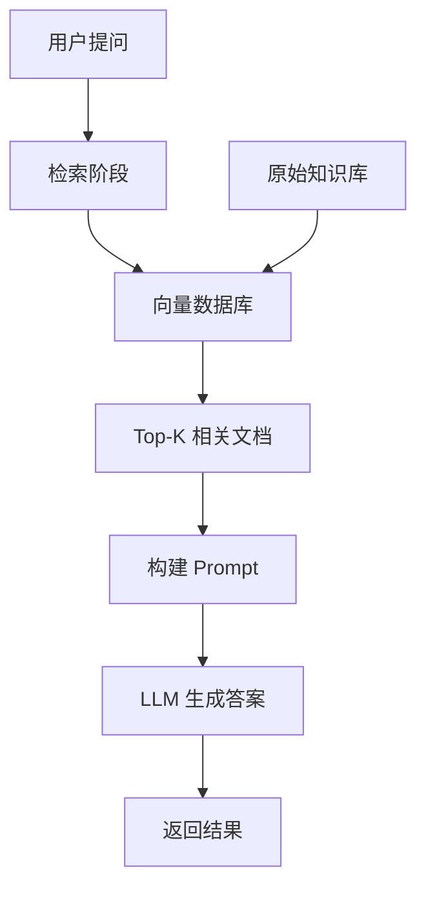
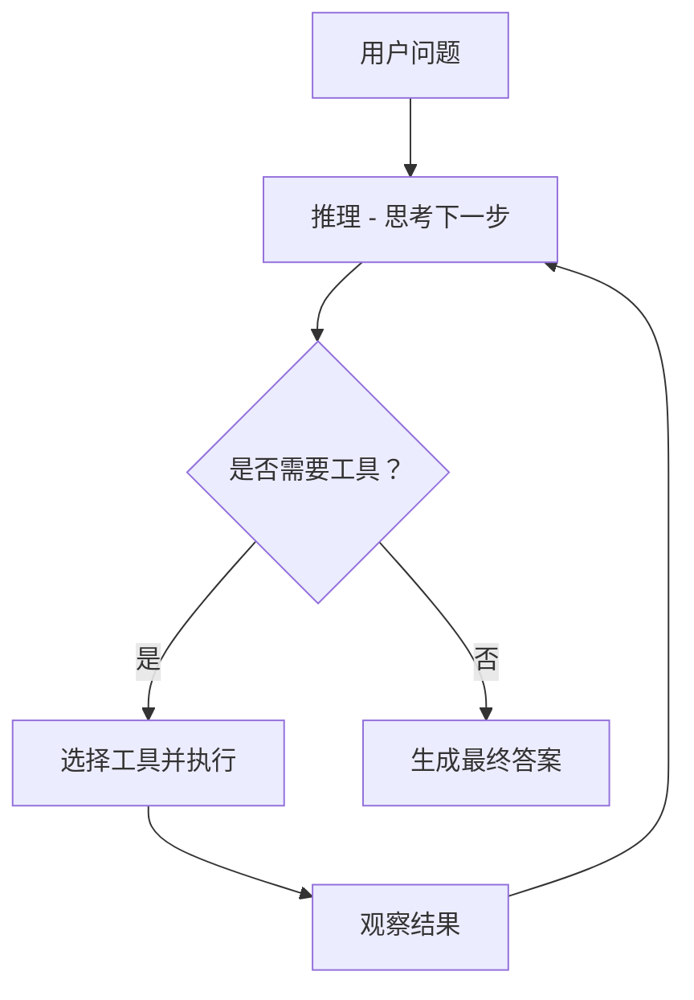
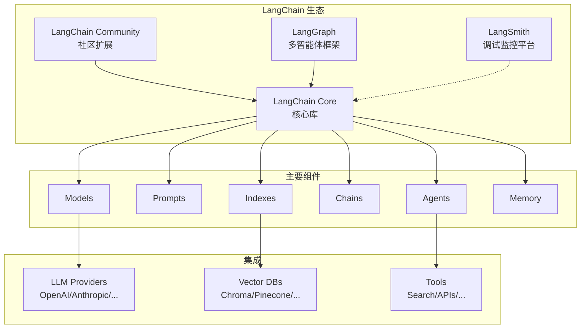
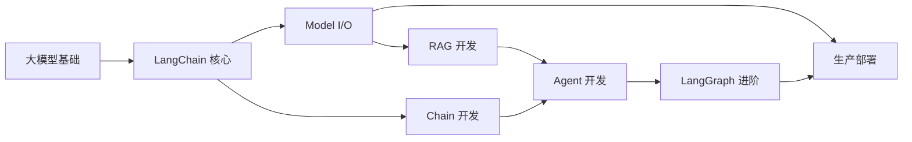

# 大模型前置知识

在学习 LangChain 之前，我们需要了解一些核心概念。这些知识将帮助你更好地理解 LangChain 解决的是什么问题，以及为什么需要它。

---

## 1. 什么是大语言模型（LLM）？

大语言模型（Large Language Model，简称 LLM）是一类基于深度学习的 AI 模型，通过海量文本数据进行预训练，获得了理解和生成自然语言的能力。

**核心特点：**
- **规模庞大**：参数量从数十亿到数千亿不等
- **涌现能力**：当模型规模足够大时，会出现意想不到的新能力
- **通用性**：同一个模型可以处理多种任务，无需针对每个任务单独训练

**主流 LLM 举例：**
- GPT-4 / GPT-4o / GPT-4o-mini（OpenAI）
- Claude 3.5（Anthropic）
- Gemini（Google）
- 通义千问（阿里）
- DeepSeek（深度求索）
- 文心一言（百度）

```python
# 最简单的 LLM 调用示例
import OpenAI

client = OpenAI()
response = client.chat.completions.create(
    model="gpt-4o",
    messages=[
        {"role": "user", "content": "你好，介绍一下你自己"}
    ]
)
print(response.choices[0].message.content)
```

---

## 2. Token：模型的货币

### 什么是 Token？

Token 是文本处理的基本单位。对于英文，1 个 token 大约等于 4 个字符或 0.75 个单词；对于中文，1 个 token 通常对应 1-2 个汉字。

### 为什么重要？

- **计费单位**：大多数 LLM API 按 token 数量收费
- **上下文限制**：每个模型有最大 token 限制（如 GPT-4o 是 128k tokens）
- **性能影响**：输入 token 越多，处理时间越长，成本越高

```python
# 使用 tiktoken 计算 token 数量
import tiktoken

enc = tiktoken.get_encoding("cl100k_base")  # GPT-4 使用的编码
text = "你好，世界！"
tokens = enc.encode(text)
print(f"文本: {text}")
print(f"Token 数量: {len(tokens)}")
print(f"Token IDs: {tokens}")
```

**估算规则（英文）：**
- 1 token ≈ 4 个字符
- 1 token ≈ 3/4 个单词
- 1 页纸 ≈ 500 tokens

---

## 3. Prompt：与模型对话的艺术

### 什么是 Prompt？

Prompt（提示词）是我们与 LLM 交互的方式。好的 Prompt 可以显著提升模型输出质量。

### Prompt 的基本结构

```python
# 角色设定
system_prompt = """你是一位专业的 Python 后端工程师。
你擅长使用 FastAPI、Django 等框架。
你总是用简洁易懂的方式解释技术概念。"""

# 用户输入
user_prompt = "解释一下什么是异步编程"

# 对话历史（可选）
messages = [
    {"role": "system", "content": system_prompt},
    {"role": "user", "content": user_prompt}
]
```

### 常见的 Prompt 工程技巧

| 技巧 | 说明 | 示例 |
|------|------|------|
| Few-shot | 提供示例让模型学习 | `"例子：输入'很好'→正面"`<br>`"请判断：'一般'"` |
| Chain-of-Thought | 让模型分步骤思考 | `请一步一步分析这个问题` |
| Zero-shot | 不给示例直接推理 | `将以下文本分类：...` |
| 思维链提示 | 结合 CoT + Few-shot | 先举例思考过程，再让模型推理 |

```python
# Few-shot 示例
few_shot_prompt = """将用户情感分类为正面或负面。

例子1：
输入：这家餐厅太棒了！
输出：正面

例子2：
输入：等了两个小时，菜品还很难吃
输出：负面

请分类：
输入：服务态度还可以，就是有点贵
输出："""
```

---

## 4. Embedding：让文本变成数字

### 什么是 Embedding？

Embedding（嵌入）是将文本、图像、音频等转换为稠密向量的技术。这些向量可以在高维空间中表示语义信息。

**核心特性：**
- **语义相似性**：语义相近的内容，向量距离更近
- **可计算性**：可以用余弦相似度等度量比较向量

```python
# 使用 OpenAI 的 Embedding API
from openai import OpenAI

client = OpenAI()
response = client.embeddings.create(
    model="text-embedding-3-small",
    input="北京是中国的首都"
)
vector = response.data[0].embedding
print(f"向量维度: {len(vector)}")
print(f"前5个值: {vector[:5]}")
```

```python
# 计算两个文本的相似度
import numpy as np

def cosine_similarity(a, b):
    return np.dot(a, b) / (np.linalg.norm(a) * np.linalg.norm(b))

# 语义相近的句子
text1 = "我喜欢吃苹果"
text2 = "苹果是一种水果"

# 语义较远的句子
text3 = "我今天要写代码"

# 向量化（需要实际 API 调用）
vec1, vec2, vec3 = get_embeddings([text1, text2, text3])

print(f"text1 vs text2 (相近): {cosine_similarity(vec1, vec2):.4f}")
print(f"text1 vs text3 (较远): {cosine_similarity(vec1, vec3):.4f}")
# 输出类似：
# text1 vs text2 (相近): 0.8923
# text1 vs text3 (较远): 0.4521
```

### Embedding 的应用场景

- **语义搜索**：找出与查询最相关的文档
- **推荐系统**：推荐相似内容
- **聚类分析**：将相似内容分组
- **去重检测**：识别相似或重复的内容

---

## 5. 向量数据库

### 为什么需要向量数据库？

传统数据库按精确匹配查询，而向量数据库专门优化了**近似最近邻（ANN）**搜索，可以快速找到与给定向量最相似的内容。

### 主流向量数据库

| 数据库 | 特点 | 适用场景 |
|--------|------|----------|
| Chroma | 轻量、嵌入式、适合起步 | 原型开发、学习 |
| FAISS | Meta 开源、性能高 | 大规模向量检索 |
| Pinecone | 云服务、托管式 | 生产环境 |
| Milvus | 开源、云原生 | 大规模分布式 |
| Qdrant | Rust 实现、性能好 | 需要高吞吐 |
| Weaviate | 混合搜索能力强 | 混合检索需求 |

```python
# 使用 Chroma（最简入门方案）
import chromadb

# 创建客户端（默认是内存模式）
client = chromadb.Client()

# 创建集合
collection = client.create_collection("my_docs")

# 添加文档
collection.add(
    documents=[
        "Python 是一种高级编程语言",
        "JavaScript 主要用于 Web 开发",
        "Java 是一门面向对象编程语言"
    ],
    ids=["doc1", "doc2", "doc3"]
)

# 相似性搜索
results = collection.query(
    query_texts=["哪种语言适合做网站？"],
    n_results=2
)
print(results)
# 输出: ['JavaScript 主要用于 Web 开发', 'Python 是一种高级编程语言']
```

---

## 6. RAG：检索增强生成

### 什么是 RAG？

RAG（Retrieval-Augmented Generation，检索增强生成）是一种将外部知识库与大模型结合的技术。

**为什么需要 RAG？**
1. **解决知识过时**：LLM 的知识有截止日期，RAG 可以访问最新信息
2. **减少幻觉**：基于真实文档生成，降低胡说八道的概率
3. **降低成本**：不用频繁微调，直接更新知识库即可
4. **可追溯**：答案可以直接溯源到源文档

### RAG 工作流程



### RAG 简单实现

```python
# RAG 核心流程
from openai import OpenAI

client = OpenAI()

# 1. 文档处理
documents = [
    "LangChain 是一个用于构建 LLM 应用的框架",
    "LangGraph 是 LangChain 的扩展，用于构建多智能体",
    "RAG 是检索增强生成技术"
]

# 2. 向量化（实际需要调用 Embedding API）
doc_embeddings = [embed(d) for d in documents]

# 3. 用户查询
query = "什么是 LangGraph？"

# 4. 检索相关文档
query_embedding = embed(query)
relevant_docs = retrieve_similar(query_embedding, doc_embeddings, documents)

# 5. 构建 Prompt
rag_prompt = f"""基于以下文档回答问题。如果文档中没有答案，请说"我不知道"。

文档：
{relevant_docs}

问题：{query}"""

# 6. 生成回答
response = client.chat.completions.create(
    model="gpt-4o",
    messages=[{"role": "user", "content": rag_prompt}]
)
print(response.choices[0].message.content)
```

---

## 7. Function Calling / Tool Use

### 什么是 Function Calling？

Function Calling 让 LLM 可以调用外部工具和函数，突破纯文本生成的限制。

**应用场景：**
- 实时查询（天气、股票、搜索）
- 操作数据库
- 发送消息、邮件
- 执行代码
- 访问 API

```python
# Function Calling 示例
from openai import OpenAI

client = OpenAI()

# 定义工具
tools = [
    {
        "type": "function",
        "function": {
            "name": "get_weather",
            "description": "获取城市的天气信息",
            "parameters": {
                "type": "object",
                "properties": {
                    "city": {
                        "type": "string",
                        "description": "城市名称，如北京、上海"
                    }
                },
                "required": ["city"]
            }
        }
    }
]

response = client.chat.completions.create(
    model="gpt-4o",
    messages=[{"role": "user", "content": "北京今天天气怎么样？"}],
    tools=tools
)

# LLM 返回的函数调用
tool_call = response.choices[0].message.tool_calls[0]
print(f"函数名: {tool_call.function.name}")
print(f"参数: {tool_call.function.arguments}")
# 输出: 函数名: get_weather
# 输出: 参数: {"city": "北京"}
```

---

## 8. Agent：能自主行动的 AI

### 什么是 Agent？

Agent（智能体）是能够自主规划、执行任务、调用工具的 AI 系统。它不仅仅是回答问题，而是能够：
- 理解复杂目标
- 分解任务步骤
- 调用各种工具
- 根据反馈调整策略
- 持续迭代直到完成任务

### Agent vs 普通 LLM 调用

| 特性 | 普通 LLM | Agent |
|------|----------|-------|
| 交互方式 | 一次性问答 | 多轮交互 |
| 工具调用 | 无 | 可调用多种工具 |
| 规划能力 | 无 | 有规划分解能力 |
| 自我纠错 | 无 | 可根据结果调整 |
| 记忆 | 无 | 可保留上下文 |

### Agent 的经典框架：ReAct

ReAct = Reason + Act，让 Agent 交替进行推理和行动。



```python
# ReAct 风格伪代码
while True:
    # 1. Reason - 推理
    thought = llm.think(task, history, tools)

    if thought.is_finished:
        return thought.final_answer

    # 2. Act - 行动
    if thought.needs_tool:
        result = execute_tool(thought.tool_name, thought.tool_args)
        history.add(thought, result)
    else:
        # 继续推理
        history.add(thought, None)
```

---

## 9. 什么是 LangChain？

### LangChain 的定位

LangChain 是一个用于构建 LLM 应用的**开源框架**，提供了一套标准化的组件和接口。

**解决的问题：**
- 简化 LLM 应用开发
- 提供丰富的组件库
- 支持多种 LLM 提供商
- 简化 RAG、Agent 等复杂流程

### LangChain 生态



### LangChain 解决了什么问题？

| 问题 | 没有 LangChain | 使用 LangChain |
|------|----------------|----------------|
| 多 LLM 支持 | 需要写多个适配器 | 统一接口 |
| Prompt 管理 | 字符串拼接 | 模板化管理 |
| RAG 开发 | 从零实现检索和生成 | 几行代码搞定 |
| Agent 开发 | 手动实现循环和工具调用 | 提供现成框架 |
| 调试测试 | 难以追踪 | LangSmith 可视化 |

---

## 10. 学习路径建议

### 入门路线



### 学习优先级

| 优先级 | 内容 | 重要性 | 难度 |
|--------|------|--------|------|
| ⭐⭐⭐ | Model I/O / Prompt | 必须掌握 | 低 |
| ⭐⭐⭐ | RAG | 核心应用 | 中 |
| ⭐⭐ | LCEL | 进阶基础 | 中 |
| ⭐⭐ | Chain | 理解原理 | 中 |
| ⭐⭐ | Agent | 高级应用 | 高 |
| ⭐⭐ | LangGraph | 复杂系统 | 高 |
| ⭐ | Memory | 视需求 | 中 |

---

## 本章小结

本章介绍了学习 LangChain 所需的前置知识：

- **Token**：LLM 的计费和计算单位
- **Prompt**：与模型交互的方式
- **Embedding**：将文本转为向量
- **向量数据库**：存储和检索向量
- **RAG**：结合检索和生成的技术
- **Function Calling**：让模型调用外部工具
- **Agent**：能够自主规划和执行任务的 AI 系统

这些概念将在后续章节中反复出现，建议先有基本印象，学习过程中再深入理解。

---

**下一章预告：** 下一章我们将正式进入 LangChain 的世界，了解它的安装、整体架构，以及编写第一个 Hello World 程序。