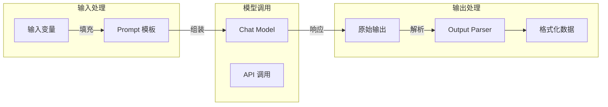
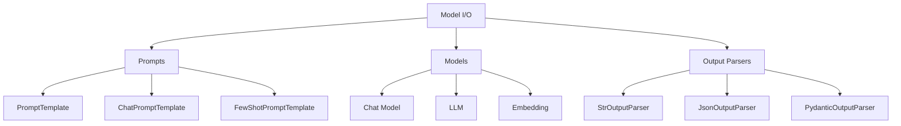

# 第 2 章 Model I/O 三件套

LangChain 的核心是 **Model I/O** 模块，它封装了与 LLM 交互的完整流程。本章将深入学习三个关键组件：

1. **Prompts** - 提示词模板管理
2. **Models** - 统一模型接口
3. **Output Parsers** - 输出解析

---

## 1. Prompts：提示词模板

### 什么是 Prompt 模板？

Prompt 模板是将静态部分（系统指令）和动态部分（用户输入）分离的一种方式。它让代码更清晰，更易复用。

### 基本使用

```python
from langchain_core.prompts import PromptTemplate

# 方式1：使用字符串
template = "告诉我关于{topic}的{count}个有趣事实"
prompt = PromptTemplate.from_template(template)

# 方式2：使用字典定义
prompt = PromptTemplate(
    input_variables=["topic", "count"],
    template="告诉我关于{topic}的{count}个有趣事实"
)

# 调用
result = prompt.invoke({"topic": "Python", "count": 3})
print(result.to_string())
```

输出：
```
Tell me 3 interesting facts about Python.
```

### Chat Prompt 模板

对于 Chat Model，需要使用特殊的消息模板：

```python
from langchain_core.prompts import ChatPromptTemplate

# 创建 Chat Prompt
prompt = ChatPromptTemplate.from_messages([
    ("system", "你是一个{language}助手"),
    ("user", "{question}")
])

# 调用
result = prompt.invoke({
    "language": "中文",
    "question": "什么是闭包？"
})

print(result.to_string())
```

输出：
```
System: 你是一个中文助手
Human: 什么是闭包？
```

### 消息角色说明

| 角色 | 含义 | 用途 |
|------|------|------|
| `system` | 系统消息 | 定义 AI 行为和身份 |
| `human` / `user` | 用户消息 | 用户输入 |
| `ai` / `assistant` | AI 消息 | AI 回复 |

---

## 2. Few-shot Learning（少样本学习）

Few-shot Learning 通过提供示例来引导模型理解任务。

### 基本示例

```python
from langchain_core.prompts import FewShotChatMessagePromptTemplate

# 定义示例
examples = [
    {"input": "今天天气真好", "output": "正面"},
    {"input": "这个电影太无聊了", "output": "负面"},
    {"input": "一般般，没什么特别的", "output": "中性"},
]

# 创建示例模板
example_prompt = ChatPromptTemplate.from_messages([
    ("human", "{input}"),
    ("ai", "{output}")
])

# 创建 Few-shot 模板
few_shot_prompt = FewShotChatMessagePromptTemplate(
    examples=examples,
    example_prompt=example_prompt,
    input_variables=["input"]  # 主 Prompt 的输入变量
)

# 组合完整 Prompt
final_prompt = ChatPromptTemplate.from_messages([
    ("system", "你是一个情感分析专家，请将用户输入分类为正面、负面或中性"),
    few_shot_prompt,
    ("human", "{input}")
])

# 使用
chain = final_prompt | ChatOpenAI(model="gpt-4o")
result = chain.invoke({"input": "这个产品超出预期，很满意！"})
print(result.content)
# 输出：正面
```

### 自动 Few-shot

```python
from langchain_core.prompts import FewShotPromptTemplate
from langchain_core.prompts.prompt import PromptTemplate

# 示例选择器：从大量示例中智能选择
from langchain_core.prompts import SemanticSimilarityExampleSelector
from langchain_community.vectorstores import Chroma
from langchain_openai import OpenAIEmbeddings

# 示例池
examples = [
    {"word": "开心", " antonym": "难过"},
    {"word": "高", "antonym": "矮"},
    {"word": "快", "antonym": "慢"},
    {"word": "明亮", "antonym": "黑暗"},
]

# 创建示例选择器（基于语义相似度）
selector = SemanticSimilarityExampleSelector.from_examples(
    examples,
    OpenAIEmbeddings(),
    Chroma,
    k=2  # 选择最相似的 2 个示例
)

# 创建 Few-shot Prompt
prompt = FewShotPromptTemplate(
    example_selector=selector,
    example_prompt=PromptTemplate.from_template(
        "单词: {word}\n反义词: {antonym}"
    ),
    prefix="给出以下单词的反义词：",
    suffix="单词: {word}\n反义词:",
    input_variables=["word"]
)

# 调用
result = prompt.invoke({"word": "快乐"})
print(result.to_string())
```

---

## 3. 模型（Models）

### 模型类型

| 类型 | 描述 | 适用场景 |
|------|------|----------|
| **LLM** | 输入文本，返回文本 | 文本补全、写作 |
| **Chat Model** | 输入消息列表，返回消息 | 对话、问答 |
| **Embedding Model** | 输入文本，返回向量 | 文本向量化、相似度计算 |

### Chat Model 详解

```python
from langchain_openai import ChatOpenAI

# 基本使用
llm = ChatOpenAI(model="gpt-4o", temperature=0.7)

# 调用方式 1：字符串
response = llm.invoke("解释一下什么是 API")

# 调用方式 2：消息列表
from langchain_core.messages import HumanMessage
response = llm.invoke([
    HumanMessage(content="解释一下什么是 API")
])

# 调用方式 3：混合消息
response = llm.invoke([
    SystemMessage(content="你是一个技术作家"),
    HumanMessage(content="解释一下什么是 API")
])
```

### 模型参数

```python
# 常用参数
llm = ChatOpenAI(
    model="gpt-4o",
    temperature=0.7,          # 创造性：0-2，越高越随机
    max_tokens=1000,         # 最大 token 数
    top_p=0.9,               # 核采样参数
    frequency_penalty=0,     # 频率惩罚
    presence_penalty=0,      # 存在惩罚
    stop=None,               # 停止词
)
```

### LLM（补全模型）

```python
from langchain_openai import OpenAI

# 文本补全模型（GPT-3.5-turbo-instruct 等）
llm = OpenAI(
    model="gpt-3.5-turbo-instruct",
    temperature=0.7,
    max_tokens=500
)

response = llm.invoke("从前有座山，")
print(response.content)
```

### Embedding 模型

```python
from langchain_openai import OpenAIEmbeddings

# 创建 Embedding 模型
embeddings = OpenAIEmbeddings(
    model="text-embedding-3-small"  # 1536 维
    # model="text-embedding-3-large"  # 3072 维
)

# 单文本向量化
vector = embeddings.embed_query("你好，世界！")
print(f"向量维度: {len(vector)}")

# 多文本批量向量化
texts = ["第一个文档", "第二个文档", "第三个文档"]
vectors = embeddings.embed_documents(texts)
print(f"文档数量: {len(vectors)}")
```

### 多模型支持

LangChain 提供了统一的接口来支持多种模型提供商：

```python
# OpenAI
from langchain_openai import ChatOpenAI

# Anthropic
from langchain_anthropic import ChatAnthropic

# Google Gemini
from langchain_google_genai import ChatGoogleGenerativeAI

# 本地模型（Ollama）
from langchain_ollama import ChatOllama

# 通义千问
from langchain_qianfan import ChatQianfan

# DeepSeek
from langchain_deepseek import ChatDeepSeek
```

---

## 4. Output Parsers（输出解析器）

Output Parser 将模型的原始输出转换为结构化数据。

### 内置解析器

| 解析器 | 用途 | 输出格式 |
|--------|------|----------|
| **StrOutputParser** | 提取字符串 | `str` |
| **JsonOutputParser** | 解析 JSON | `dict` |
| **PydanticOutputParser** | 验证结构化数据 | `Pydantic Model` |
| **CommaSeparatedListOutputParser** | 解析逗号分隔列表 | `List[str]` |
| **MarkdownListOutputParser** | 解析 Markdown 列表 | `List[str]` |

### StrOutputParser

```python
from langchain_core.output_parsers import StrOutputParser

chain = prompt | model | StrOutputParser()

result = chain.invoke({"topic": "Python"})
print(type(result))  # <class 'str'>
```

### JsonOutputParser

```python
from langchain_core.output_parsers import JsonOutputParser
from langchain_core.prompts import PromptTemplate
from langchain_openai import ChatOpenAI

# 定义 JSON 结构
json_schema = {
    "type": "object",
    "properties": {
        "name": {"type": "string", "description": "人物姓名"},
        "age": {"type": "integer", "description": "年龄"},
        "occupation": {"type": "string", "description": "职业"}
    }
}

parser = JsonOutputParser()
prompt = PromptTemplate.from_template(
    "请生成一个人的信息，格式为 JSON",
    partial_variables={"format_instructions": parser.get_format_instructions()}
)

chain = prompt | ChatOpenAI(model="gpt-4o") | parser
result = chain.invoke({})
print(result)
# {'name': '张三', 'age': 30, 'occupation': '软件工程师'}
```

### PydanticOutputParser（推荐）

```python
from typing import List
from pydantic import BaseModel, Field
from langchain_core.prompts import PromptTemplate
from langchain_core.output_parsers import JsonOutputParser
from langchain_openai import ChatOpenAI

# 定义数据结构
class Book(BaseModel):
    title: str = Field(description="书名")
    author: str = Field(description="作者")
    year: int = Field(description="出版年份")
    genres: List[str] = Field(description="类型标签")

class BookReview(BaseModel):
    book: Book
    summary: str = Field(description="书评摘要")
    rating: float = Field(description="评分 1-5")
    recommendation: str = Field(description="推荐理由")

# 创建解析器
parser = JsonOutputParser(pydantic_object=BookReview)

# 创建 Prompt
prompt = PromptTemplate.from_template(
    "请为以下书籍撰写评论：{book_name}",
    partial_variables={"format_instructions": parser.get_format_instructions()}
)

# 使用
chain = prompt | ChatOpenAI(model="gpt-4o") | parser
result = chain.invoke({"book_name": "《百年孤独》"})

# result 是一个 BookReview 实例
print(f"书名: {result.book.title}")
print(f"评分: {result.rating}")
print(f"推荐理由: {result.recommendation}")
```

### CommaSeparatedListOutputParser

```python
from langchain_core.output_parsers import CommaSeparatedListOutputParser

parser = CommaSeparatedListOutputParser()

prompt = PromptTemplate.from_template(
    "列出 5 种水果，用逗号分隔",
    partial_variables={"format_instructions": parser.get_format_instructions()}
)

chain = prompt | ChatOpenAI(model="gpt-4o") | parser
result = chain.invoke({})
print(result)
# ['苹果', '香蕉', '橙子', '葡萄', '草莓']
```

---

## 5. Model I/O 完整流程

### 架构图



### 完整示例

```python
from langchain_openai import ChatOpenAI
from langchain_core.prompts import ChatPromptTemplate
from langchain_core.output_parsers import JsonOutputParser
from pydantic import BaseModel
from typing import List

# 1. 定义输出结构
class Recipe(BaseModel):
    name: str
    ingredients: List[str]
    instructions: List[str]
    cooking_time: int  # 分钟

# 2. 创建 Prompt 模板
prompt = ChatPromptTemplate.from_messages([
    ("system", "你是一位专业厨师，擅长创作健康美味的食谱"),
    ("user", "帮我设计一道{cuisine}菜，要求：\n1. 简单易做\n2. 营养均衡\n3. 适合在家制作")
])

# 3. 创建解析器
parser = JsonOutputParser(pydantic_object=Recipe)

# 4. 组装 Chain
chain = prompt | ChatOpenAI(model="gpt-4o") | parser

# 5. 调用
result = chain.invoke({"cuisine": "意大利"})

# 6. 使用结果
print(f"菜名: {result['name']}")
print(f"食材: {', '.join(result['ingredients'])}")
print(f"烹饪时间: {result['cooking_time']}分钟")
```

---

## 6. 综合实战：构建一个问答系统

```python
# qa_system.py
from langchain_openai import ChatOpenAI
from langchain_core.prompts import ChatPromptTemplate
from langchain_core.output_parsers import StrOutputParser
from langchain_core.messages import SystemMessage, HumanMessage

# 系统 Prompt
SYSTEM_PROMPT = """你是一个专业的技术问答助手，名为 TechBot。
你的特点：
1. 回答专业、准确、易懂
2. 会用代码示例来解释技术概念
3. 如果不确定，会诚实说明
4. 始终使用中文回答"""

# 创建主 Chain
def create_qa_chain():
    prompt = ChatPromptTemplate.from_messages([
        ("system", SYSTEM_PROMPT),
        ("user", "{question}")
    ])

    model = ChatOpenAI(
        model="gpt-4o",
        temperature=0.5
    )

    parser = StrOutputParser()

    return prompt | model | parser

# 带历史记录的 Chain
def create_conversational_qa_chain():
    prompt = ChatPromptTemplate.from_messages([
        ("system", SYSTEM_PROMPT),
        ("placeholder", "{history}"),  # 占位符用于对话历史
        ("user", "{question}")
    ])

    model = ChatOpenAI(model="gpt-4o", temperature=0.5)
    parser = StrOutputParser()

    return prompt | model | parser

# 使用示例
if __name__ == "__main__":
    chain = create_qa_chain()

    questions = [
        "什么是装饰器？",
        "能举个代码例子吗？",
        "装饰器和上下文管理器有什么区别？"
    ]

    for q in questions:
        print(f"\n问题: {q}")
        print("-" * 40)
        result = chain.invoke({"question": q})
        print(result)
```

---

## 7. 最佳实践

### Prompt 编写技巧

1. **明确角色**：使用 system message 设定身份
2. **具体指令**：告诉模型"做什么"而不是"不要做什么"
3. **结构化输出**：使用 JSON 或特定格式
4. **示例驱动**：复杂任务使用 few-shot

### 性能优化

1. **减少 token**：精简 Prompt，只提供必要信息
2. **批量处理**：使用 `batch()` 方法并行处理多个输入
3. **流式输出**：使用 `stream()` 获取实时响应
4. **缓存结果**：对相同输入使用缓存

```python
# 批量处理
chain = prompt | model | parser

# 批量调用
results = chain.batch([
    {"topic": "Python"},
    {"topic": "JavaScript"},
    {"topic": "Go"}
])

# 流式输出
for token in chain.stream({"topic": "Python"}):
    print(token, end="", flush=True)
```

---

## 8. 本章小结



**核心要点：**

1. **Prompt 模板** 将静态指令和动态输入分离
2. **Few-shot Learning** 通过示例引导模型
3. **Chat Model** 使用消息列表，**LLM** 使用纯文本
4. **Output Parser** 将原始输出转为结构化数据
5. **PydanticOutputParser** 是最推荐的解析器类型

---

**下一章预告：** 下一章我们将深入学习 **LCEL 表达式语言**，了解如何用 `|` 管道操作符组合复杂的处理流程，实现并行、批处理、条件分支等功能。