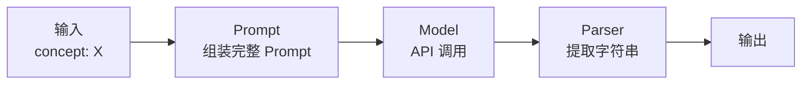
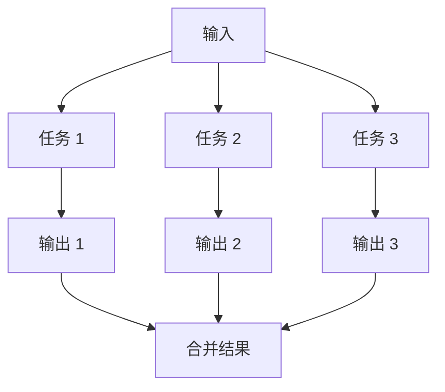
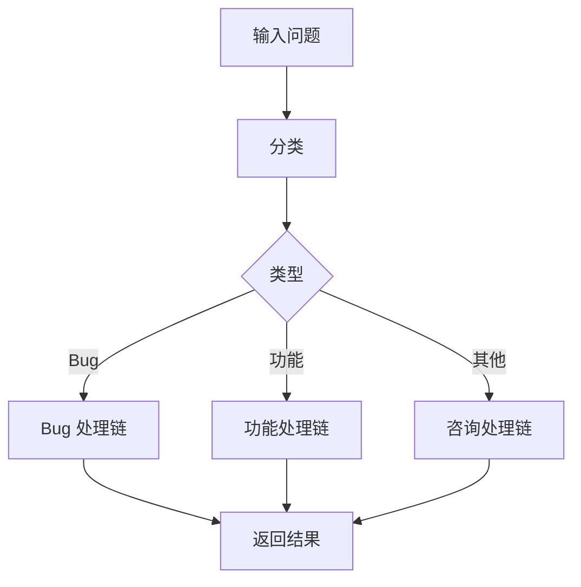

# 第 3 章 LCEL 表达式语言与 Runnable 接口

LCEL（LangChain Expression Language）是 LangChain 的核心，它提供了一种声明式、模块化的方式来组合各种组件。本章将深入学习 LCEL 的强大功能。

---

## 1. LCEL 核心概念

### 什么是 LCEL？

LCEL 是一种领域特定语言（DSL），通过 `|` 管道操作符将多个 **Runnable** 对象串联起来，形成处理管道。

### 为什么需要 LCEL？

| 传统方式 | LCEL 方式 |
|----------|------------|
| 手动管理状态传递 | 自动处理输入输出 |
| 需要处理并发 | 内置并行支持 |
| 代码分散 | 声明式、可读性强 |
| 难以调试 | 统一接口、容易追踪 |

### 基本语法

```python
# 基础语法
chain = component_a | component_b | component_c

# 等价于
# chain = component_c(component_b(component_a(input)))
```

---

## 2. Runnable 接口

### 所有组件都是 Runnable

LangChain 中的大多数对象都实现了 **Runnable** 接口，包括：

- Prompt 模板
- Chat Model / LLM
- Output Parser
- 工具函数
- Chain
- 自定义函数

### Runnable 的核心方法

```python
# 主要方法
chain.invoke(input)      # 单次同步调用
chain.batch(inputs)     # 批量同步调用
chain.stream(input)     # 流式调用
chain.invoke.Async(...) # 异步调用

# 副作用方法
chain.invoke(input, config={...})  # 带配置的调用
```

### 自定义 Runnable

```python
from langchain_core.runnables import RunnableLambda

# 使用函数创建 Runnable
def to_upper_case(text: str) -> str:
    return text.upper()

uppercase_runnable = RunnableLambda(to_upper_case)

# 使用
result = uppercase_runnable.invoke("hello")
print(result)  # HELLO
```

---

## 3. 管道组合

### 简单管道

```python
from langchain_openai import ChatOpenAI
from langchain_core.prompts import PromptTemplate
from langchain_core.output_parsers import StrOutputParser

# 各组件
prompt = PromptTemplate.from_template("用一句话解释{concept}")
model = ChatOpenAI(model="gpt-4o")
parser = StrOutputParser()

# 组合成 Chain
chain = prompt | model | parser

# 调用
result = chain.invoke({"concept": "量子计算"})
print(result)
```

### 多步骤管道



```python
# 复杂 Chain 示例：翻译 -> 摘要 -> 情感分析

# Step 1: 翻译
translate_prompt = PromptTemplate.from_template(
    "将以下中文翻译成英文：\n{text}"
)
translator = translate_prompt | ChatOpenAI(model="gpt-4o") | StrOutputParser()

# Step 2: 摘要
summarize_prompt = PromptTemplate.from_template(
    "用一句话概括以下文本：\n{text}"
)
summarizer = summarize_prompt | ChatOpenAI(model="gpt-4o") | StrOutputParser()

# Step 3: 情感分析
sentiment_prompt = PromptTemplate.from_template(
    "判断以下文本的情感（正面/负面/中性）：\n{text}"
)
sentiment_analyzer = sentiment_prompt | ChatOpenAI(model="gpt-4o") | StrOutputParser()

# Step 4: 组合整个流程
full_chain = (
    translator
    | (lambda x: {"text": x})  # 转换输出格式
    | summarizer
    | (lambda x: {"text": x})
    | sentiment_analyzer
)

# 调用
result = full_chain.invoke({"text": "今天天气真好，心情特别愉快！"})
print(result)  # 正面
```

---

## 4. 并行处理

### 使用 `RunnableParallel`

```python
from langchain_core.runnables import RunnableParallel

# 并行执行多个任务
parallel_chain = RunnableParallel({
    "topic_info": prompt1 | model | parser1,
    "related_news": prompt2 | model | parser2,
    "similar_questions": prompt3 | model | parser3
})

# 调用
result = parallel_chain.invoke({"topic": "Python"})
# result = {
#     "topic_info": "...",
#     "related_news": "...",
#     "similar_questions": "..."
# }
```

### 并行工作流程图



### 实际示例：生成多角度内容

```python
from langchain_openai import ChatOpenAI
from langchain_core.prompts import PromptTemplate
from langchain_core.output_parsers import StrOutputParser
from langchain_core.runnables import RunnableParallel

model = ChatOpenAI(model="gpt-4o")
parser = StrOutputParser()

# 定义多个角度的 Prompt
definition_prompt = PromptTemplate.from_template(
    "用简洁的语言定义{topic}，不超过50字"
)
example_prompt = PromptTemplate.from_template(
    "举例说明{topic}的3个实际应用场景"
)
history_prompt = PromptTemplate.from_template(
    "简述{topic}的历史和发展，不超过100字"
)

# 组合成并行 Chain
content_chain = RunnableParallel({
    "definition": definition_prompt | model | parser,
    "examples": example_prompt | model | parser,
    "history": history_prompt | model | parser
})

# 调用
result = content_chain.invoke({"topic": "机器学习"})

print(f"定义: {result['definition']}")
print(f"应用: {result['examples']}")
print(f"历史: {result['history']}")
```

---

## 5. 批处理与异步

### 批量处理

```python
# 批量调用
inputs = [
    {"topic": "Python"},
    {"topic": "JavaScript"},
    {"topic": "Go"}
]

results = chain.batch(inputs)

for r in results:
    print(r)
    print("-" * 20)
```

### 异步处理

```python
import asyncio
from langchain_openai import ChatOpenAI
from langchain_core.prompts import PromptTemplate
from langchain_core.output_parsers import StrOutputParser

async def async_invoke(chain, topic: str):
    return await chain.ainvoke({"topic": topic})

async def main():
    chain = (
        PromptTemplate.from_template("用一句话解释{topic}")
        | ChatOpenAI(model="gpt-4o")
        | StrOutputParser()
    )

    # 并发调用
    topics = ["Python", "JavaScript", "Go", "Rust"]
    tasks = [async_invoke(chain, topic) for topic in topics]
    results = await asyncio.gather(*tasks)

    for topic, result in zip(topics, results):
        print(f"{topic}: {result}")

# 运行
asyncio.run(main())
```

---

## 6. 输入转换

### 使用 RunnableLambda 转换输入

```python
from langchain_core.runnables import RunnableLambda

# 场景：从单个输入转换为多个输入
chain = (
    RunnableLambda(lambda x: {"text": x, "style": "formal"})
    | prompt
    | model
    | parser
)

result = chain.invoke("你好")  # 自动添加 style="formal"

# 场景：从多个输入提取部分
chain = (
    prompt
    | model
    | parser
    | RunnableLambda(lambda x: x.get("summary", ""))  # 只取 summary 字段
)
```

### 使用 RunnablePassthrough

```python
from langchain_core.runnables import RunnablePassthrough

# 原样传递输入，同时添加额外字段
chain = (
    {"original": RunnablePassthrough(), "extracted": extraction_step}
    | final_prompt
)
```

---

## 7. 分支与条件

### 使用 RunnableBranch

```python
from langchain_core.runnables import RunnableBranch

# 根据条件选择不同的处理路径
question_classifier = (
    PromptTemplate.from_template(
        "判断以下问题属于哪种类型：bug/功能/咨询，返回 bug 或 功能 或 咨询"
    )
    | ChatOpenAI(model="gpt-4o")
    | StrOutputParser()
)

bug_chain = (
    PromptTemplate.from_template("这是一个 bug，请提供调试步骤：\n{question}")
    | ChatOpenAI(model="gpt-4o")
    | StrOutputParser()
)

feature_chain = (
    PromptTemplate.from_template("这是一个功能请求，请说明实现方案：\n{question}")
    | ChatOpenAI(model="gpt-4o")
    | StrOutputParser()
)

consult_chain = (
    PromptTemplate.from_template("这是一个咨询，请给出建议：\n{question}")
    | ChatOpenAI(model="gpt-4o")
    | StrOutputParser()
)

# 分支 Chain
branch_chain = RunnableBranch(
    (lambda x: "bug" in x.lower(), bug_chain),
    (lambda x: "功能" in x or "feature" in x.lower(), feature_chain),
    consult_chain  # 默认分支
)

# 主 Chain
main_chain = (
    {"question": RunnablePassthrough(), "type": question_classifier}
    | (lambda x: x["question"])  # 提取 question 传给分支
    | branch_chain
)
```

### 分支流程图



---

## 8. 流式输出

### 流式调用

```python
chain = (
    PromptTemplate.from_template("讲一个关于{topic}的笑话")
    | ChatOpenAI(model="gpt-4o")
    | StrOutputParser()
)

# 流式获取结果
for token in chain.stream({"topic": "程序员"}):
    print(token, end="", flush=True)
```

### 流式输出在对话中的应用

```python
from fastapi import FastAPI
from fastapi.responses import StreamingResponse
from langchain_openai import ChatOpenAI
from langchain_core.prompts import ChatPromptTemplate

app = FastAPI()

@app.get("/chat/{topic}")
async def chat_stream(topic: str):
    chain = (
        ChatPromptTemplate.from_template("用一首诗介绍{topic}")
        | ChatOpenAI(model="gpt-4o")
    )

    async def event_stream():
        async for chunk in chain.astream({"topic": topic}):
            yield chunk.content

    return StreamingResponse(event_stream(), media_type="text/event-stream")
```

---

## 9. 配置与回调

### Callback 配置

```python
from langchain_core.callbacks import StdOutCallbackHandler
from langchain_openai import ChatOpenAI
from langchain_core.prompts import PromptTemplate

# 创建带回调的 Chain
chain = (
    PromptTemplate.from_template("解释{topic}")
    | ChatOpenAI(model="gpt-4o")
)

# 全局回调
result = chain.invoke(
    {"topic": "量子计算"},
    config={"callbacks": [StdOutCallbackHandler()]}
)
```

### 自定义 Callback

```python
from langchain_core.callbacks import BaseCallbackHandler
from langchain_core.messages import BaseMessage

class MyCallbackHandler(BaseCallbackHandler):
    def on_llm_start(self, serialized, prompts, **kwargs):
        print(f"开始调用 LLM，Prompt 数量: {len(prompts)}")

    def on_llm_end(self, response, **kwargs):
        print(f"LLM 调用完成，响应 tokens: {response.llm_output.get('token_usage', {}).get('total_tokens', 'N/A')}")

    def on_chain_end(self, outputs, **kwargs):
        print(f"Chain 执行完成，输出键: {list(outputs.keys()) if isinstance(outputs, dict) else 'N/A'}")

# 使用
result = chain.invoke(
    {"topic": "机器学习"},
    config={"callbacks": [MyCallbackHandler()]}
)
```

---

## 10. 容错与重试

### 配置重试

```python
from langchain_core.runnables import RunnableConfig

# 定义带重试的配置
config = RunnableConfig(
    max_concurrent_requests=5,  # 最大并发数
    recursion_limit=10,          # 最大递归深度
    run_name="my_chain",
    tags=["production"]
)

# 带重试的 Chain
from tenacity import retry, stop_after_attempt, wait_exponential

@retry(stop=stop_after_attempt(3), wait=wait_exponential(multiplier=1, min=2, max=10))
def call_with_retry(chain, input_dict):
    return chain.invoke(input_dict)
```

---

## 11. 完整示例：多阶段内容生成

```python
# multi_stage_content.py
from langchain_openai import ChatOpenAI
from langchain_core.prompts import PromptTemplate
from langchain_core.output_parsers import StrOutputParser, JsonOutputParser
from langchain_core.runnables import RunnableParallel, RunnableLambda
from pydantic import BaseModel
from typing import List

# 输出结构
class Outline(BaseModel):
    sections: List[str]
    estimated_time: int  # 分钟

class ContentDraft(BaseModel):
    content: str
    word_count: int
    key_points: List[str]

# Prompt 模板
outline_prompt = PromptTemplate.from_template("""
为一个关于"{topic}"的技术博客生成大纲。
要求：
1. 包含引言、主体（3-4节）、结论
2. 每节有小标题
3. 估计阅读时间

JSON 格式输出。
""")

draft_prompt = PromptTemplate.from_template("""
根据以下大纲撰写详细内容：

标题：{title}
章节：{sections}

要求：
1. 内容详实，每个章节至少300字
2. 代码示例（如果适用）
3. 专业且易懂

JSON 格式输出。
""")

# 创建 Chain
model = ChatOpenAI(model="gpt-4o", temperature=0.7)
parser1 = JsonOutputParser(pydantic_object=Outline)
parser2 = JsonOutputParser(pydantic_object=ContentDraft)

# Stage 1: 生成大纲
outline_chain = (
    outline_prompt
    | model
    | parser1
)

# Stage 2: 根据大纲生成内容
draft_chain = (
    draft_prompt
    | model
    | parser2
)

# 主 Chain
content_pipeline = (
    RunnableLambda(
        lambda x: {
            "title": f"深入理解{x['topic']}",
            "sections": x["outline"]["sections"],
            "estimated_time": x["outline"]["estimated_time"]
        }
    )
    | draft_chain
)

# 完整流程
full_chain = (
    RunnableLambda(
        lambda x: {"topic": x["topic"]}
    )
    | {
        "outline": outline_chain,
        "topic": RunnableLambda(lambda x: x["topic"])
    }
    | RunnableLambda(
        lambda x: {
            "topic": x["topic"],
            "title": x["outline"]["sections"][0] if x["outline"]["sections"] else "技术博客",
            "sections": x["outline"]["sections"]
        }
    )
    | content_pipeline
)

# 使用
if __name__ == "__main__":
    result = content_pipeline.invoke({
        "topic": "Python 异步编程",
        "outline": {
            "sections": [
                "1. 什么是异步编程",
                "2. async/await 语法",
                "3. 异步 vs 多线程",
                "4. 实际应用案例"
            ],
            "estimated_time": 15
        }
    })

    print(f"标题: {result['content'][:50]}...")
    print(f"字数: {result['word_count']}")
    print(f"要点: {result['key_points']}")
```

---

## 12. 本章小结

```mermaid
flowchart TD
    A[LCEL 核心] --> B[管道组合<br/>| 操作符]
    A --> C[并行处理<br/>RunnableParallel]
    A --> D[分支逻辑<br/>RunnableBranch]
    A --> E[流式输出<br/>stream 方法]
    A --> F[配置回调<br/>Callbacks]

    B --> G[invoke]
    B --> H[batch]
    B --> I[astream]

    C --> J[多任务并行]
    D --> K[条件路由]
    E --> L[实时响应]
    F --> M[监控调试]
```

**核心要点：**

1. **LCEL** 使用 `|` 管道操作符组合 Runnable 对象
2. **Runnable** 是统一接口，实现 `invoke`、`batch`、`stream` 等方法
3. **RunnableParallel** 实现并行处理
4. **RunnableBranch** 实现条件分支
5. **流式输出** 使用 `stream()` 方法获取实时结果
6. **回调机制** 用于监控和调试 Chain 执行

---

**下一章预告：** 下一章我们将学习 **数据连接与 RAG**，包括：
- 文档加载器（Document Loaders）
- 文本分割器（Text Splitters）
- 向量存储（Vector Stores）
- 完整 RAG 流程实现