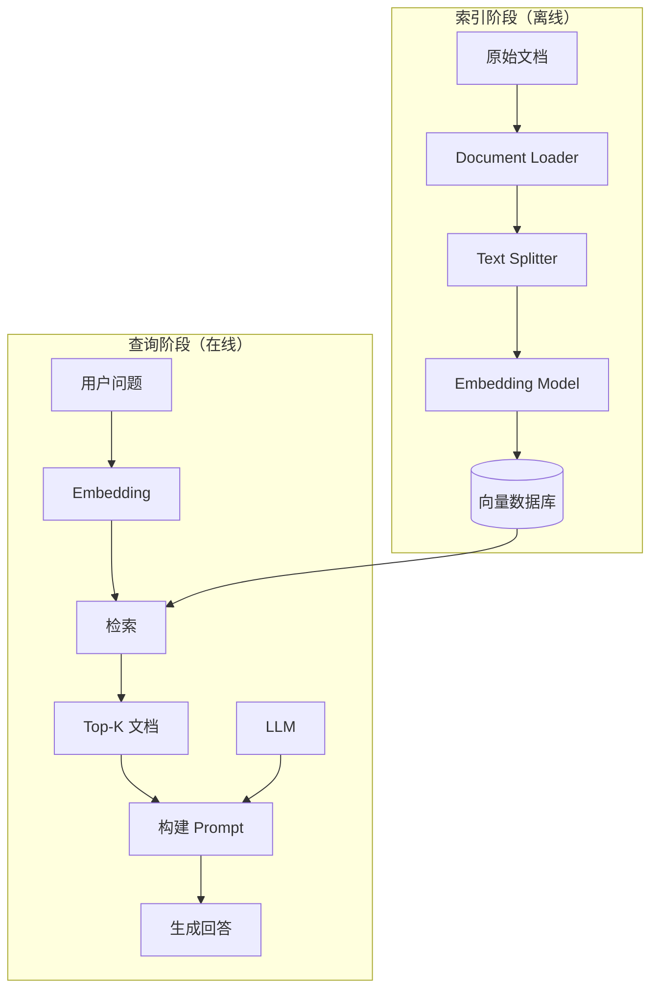
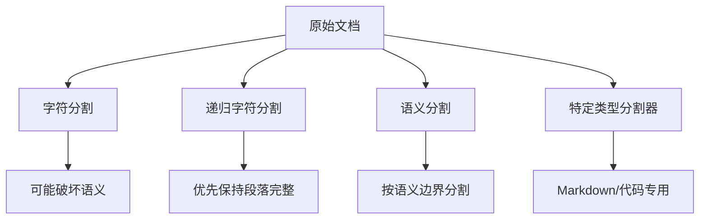
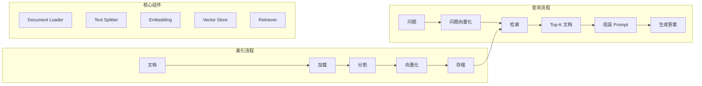

# 第 4 章 数据连接与 RAG

RAG（Retrieval-Augmented Generation，检索增强生成）是 LLM 应用的核心模式之一。本章将学习 LangChain 的数据连接组件，以及如何构建完整的 RAG 系统。

---

## 1. RAG 概述

### 什么是 RAG？

RAG 是一种结合了**外部知识检索**和**LLM 生成**的技术。它让模型能够基于真实的文档数据来回答问题，而不是仅依赖训练时的知识。

### RAG 工作流程



### 为什么需要 RAG？

| 问题 | 纯 LLM | RAG |
|------|--------|-----|
| 知识时效 | 训练数据有截止日期 | 可访问最新信息 |
| 幻觉 | 容易编造答案 | 基于真实文档生成 |
| 可追溯性 | 难以验证来源 | 可直接溯源 |
| 成本 | 训练/微调成本高 | 更新知识库即可 |

---

## 2. Document Loader（文档加载器）

LangChain 支持加载各种格式的文档。

### 安装额外依赖

```bash
# 根据需要安装
pip install langchain-community
pip install pypdf          # PDF
pip install python-docx     # Word
pip install pandas          # CSV/Excel
pip install playwright      # 网页
```

### 常用加载器

```python
from langchain_community.document_loaders import (
    TextLoader,           # 纯文本
    PDFLoader,            # PDF
    Docx2txtLoader,       # Word
    CSVLoader,            # CSV
    UnstructuredHTMLLoader,  # HTML
    WebBaseLoader,        # 网页
    PyPDFLoader,          # PDF
    UnstructuredMarkdownLoader,  # Markdown
)
```

### 使用示例

```python
# 1. 文本文件
loader = TextLoader("data/article.txt")
documents = loader.load()

# 2. PDF 文件
loader = PyPDFLoader("data/report.pdf")
documents = loader.load()

# 3. 网页
loader = WebBaseLoader("https://example.com/article")
documents = loader.load()

# 4. 多个文件
from langchain_community.document_loaders import DirectoryLoader

loader = DirectoryLoader(
    "./documents",
    glob="**/*.pdf",  # 匹配模式
    loader_cls=PyPDFLoader
)
documents = loader.load()
```

### Document 对象

```python
# Document 结构
print(documents[0])

# 输出示例
# Document(
#     page_content="这是文档内容...",
#     metadata={
#         "source": "document.pdf",
#         "page": 1,
#         "created": "2024-01-15"
#     }
# )

# 访问属性
print(documents[0].page_content)  # 内容
print(documents[0].metadata)      # 元数据
```

### 网页加载器进阶

```python
from langchain_community.document_loaders import WebBaseLoader

# 加载多个页面
loader = WebBaseLoader([
    "https://python.langchain.com/docs/get_started/introduction",
    "https://python.langchain.com/docs/modules/model_io/"
])

documents = loader.load()

# 延迟加载（适合大量页面）
from langchain_community.document_loaders import PlaywrightLoader

loader = PlaywrightLoader(
    urls=["https://example.com/page1", "https://example.com/page2"],
    headless=True
)
documents = loader.load()
```

---

## 3. Text Splitter（文本分割器）

### 为什么需要分割？

- LLM 有上下文长度限制
- 太大的文本块检索精度低
- 需要保留语义完整性

### 分割策略



### 常用分割器

```python
from langchain.text_splitter import (
    CharacterTextSplitter,
    RecursiveCharacterTextSplitter,
    MarkdownTextSplitter,
    PythonTextSplitter,
    TokenTextSplitter,
)
```

### 使用示例

```python
from langchain.text_splitter import RecursiveCharacterTextSplitter

# 创建分割器
text_splitter = RecursiveCharacterTextSplitter(
    chunk_size=500,       # 每个块的最大字符数
    chunk_overlap=50,     # 块之间的重叠（保持上下文）
    length_function=len,   # 计算长度的函数
    separators=["\n\n", "\n", "。", " ", ""]  # 分隔符优先级
)

# 分割文档
docs = text_splitter.split_documents(documents)

print(f"分割后文档数量: {len(docs)}")
print(f"第一个文档: {docs[0].page_content[:100]}...")
```

### Token 感知的分割

```python
from langchain.text_splitter import TokenTextSplitter

# 基于 token 数量分割（更准确）
text_splitter = TokenTextSplitter(
    chunk_size=500,    # token 数
    chunk_overlap=50
)

docs = text_splitter.split_documents(documents)
```

### Markdown 分割器

```python
from langchain.text_splitter import MarkdownTextSplitter

splitter = MarkdownTextSplitter(
    chunk_size=300,
    chunk_overlap=50
)

markdown_text = """
# 标题

这是第一段内容。

## 小标题

这是第二段内容。

- 列表项 1
- 列表项 2
"""

docs = splitter.create_documents([markdown_text])
```

---

## 4. Embedding（向量化）

### Embedding 模型

```python
from langchain_openai import OpenAIEmbeddings

# 创建 Embedding 模型
embeddings = OpenAIEmbeddings(
    model="text-embedding-3-small"  # 1536 维
)

# 向量化单个文本
query_embedding = embeddings.embed_query("什么是机器学习？")

# 向量化多个文本
doc_embeddings = embeddings.embed_documents([
    "Python 是一种编程语言",
    "机器学习是 AI 的一个分支",
    "深度学习是机器学习的一个子领域"
])
```

### 其他 Embedding 提供商

```python
# Google
from langchain_google_genai import GoogleGenerativeAIEmbeddings

# Ollama（本地模型）
from langchain_ollama import OllamaEmbeddings

# Cohere
from langchain_community.embeddings import CohereEmbeddings

# HuggingFace
from langchain_community.embeddings import HuggingFaceEmbeddings
```

---

## 5. Vector Store（向量数据库）

### 常用向量数据库

| 数据库 | 特点 | 适用场景 |
|--------|------|----------|
| Chroma | 轻量、Python 原生 | 原型开发、学习 |
| FAISS | 高性能、Facebook 开源 | 大规模检索 |
| Pinecone | 云服务、托管 | 生产环境 |
| Milvus | 开源、云原生 | 大规模分布式 |
| Qdrant | Rust、高性能 | 高并发场景 |

### Chroma（入门首选）

```python
import chromadb
from langchain_community.vectorstores import Chroma
from langchain_openai import OpenAIEmbeddings

# Embedding 模型
embeddings = OpenAIEmbeddings(model="text-embedding-3-small")

# 创建向量数据库
vectorstore = Chroma.from_documents(
    documents=docs,           # 分割后的文档
    embedding=embeddings,     # Embedding 模型
    persist_directory="./chroma_db"  # 持久化目录
)

# 保存（可选）
vectorstore.persist()
```

### 向量检索

```python
# 相似性搜索
results = vectorstore.similarity_search(
    query="什么是深度学习？",
    k=3  # 返回 top-k 结果
)

for i, doc in enumerate(results):
    print(f"结果 {i+1}:")
    print(doc.page_content[:200])
    print(f"来源: {doc.metadata}\n")

# 带相似度分数的搜索
results_with_scores = vectorstore.similarity_search_with_score(
    query="Python 的优势是什么？",
    k=3
)

for doc, score in results_with_scores:
    print(f"分数: {score:.4f}")
    print(f"内容: {doc.page_content[:100]}...\n")
```

### 带过滤条件的检索

```python
# 如果文档有元数据，可以过滤
vectorstore = Chroma.from_documents(
    documents=docs,
    embedding=embeddings,
    persist_directory="./chroma_db"
)

# 只返回特定来源的文档
results = vectorstore.similarity_search(
    query="Python 基础",
    k=5,
    filter={"source": "tutorial.pdf"}  # 元数据过滤
)
```

### FAISS（大规模场景）

```python
from langchain_community.vectorstores import FAISS
from langchain_openai import OpenAIEmbeddings

# 创建 FAISS 向量数据库
db = FAISS.from_documents(docs, embeddings)

# 保存
db.save_local("faiss_index")

# 加载
db = FAISS.load_local("faiss_index", embeddings)

# 搜索
results = db.similarity_search("深度学习的应用", k=5)
```

### 使用 Retriever 接口

```python
# Vectorstore 转 Retriever
retriever = vectorstore.as_retriever(
    search_type="similarity",      # similarity / mmr
    search_kwargs={
        "k": 5,                    # 返回数量
        "score_threshold": 0.5     # 最低相似度阈值
    }
)

# 使用 Retriever
docs = retriever.invoke("Python 是什么？")
```

---

## 6. 构建完整 RAG Chain

### 基础 RAG Chain

```python
from langchain_openai import ChatOpenAI
from langchain_core.prompts import ChatPromptTemplate
from langchain_core.output_parsers import StrOutputParser
from langchain_core.runnables import RunnablePassthrough

# 1. 向量数据库（假设已创建）
vectorstore = Chroma(...)  # 见上文
retriever = vectorstore.as_retriever()

# 2. LLM
llm = ChatOpenAI(model="gpt-4o", temperature=0)

# 3. Prompt 模板
prompt = ChatPromptTemplate.from_messages([
    ("system", """你是一个问答助手，基于给定的上下文回答问题。
要求：
1. 只根据上下文信息回答，不要编造
2. 如果上下文中没有相关信息，说明"我不知道"
3. 回答要简洁、准确"""),
    ("user", """上下文：
{context}

问题：{question}""")
])

# 4. 组装 RAG Chain
rag_chain = (
    {"context": retriever, "question": RunnablePassthrough()}
    | prompt
    | llm
    | StrOutputParser()
)

# 5. 使用
result = rag_chain.invoke("什么是 Python？")
print(result)
```

### 带上下文格式化的 RAG Chain

```python
from langchain_core.output_parsers import StrOutputParser
from langchain_core.runnables import RunnablePassthrough

# 格式化检索到的文档
def format_docs(docs):
    return "\n\n".join(doc.page_content for doc in docs)

rag_chain = (
    {"context": retriever | format_docs, "question": RunnablePassthrough()}
    | prompt
    | llm
    | StrOutputParser()
)
```

---

## 7. 高级 RAG 模式

### MMR（最大边际相关）搜索

```python
# MMR 在检索时平衡相关性和多样性
retriever = vectorstore.as_retriever(
    search_type="mmr",
    search_kwargs={
        "k": 5,
        "fetch_k": 20,      # 从中选 5 个
        "lambda_mult": 0.5  # 0=只管多样性，1=只管相关性
    }
)
```

### ParentDocument Retriever

```python
from langchain.retrievers import ParentDocumentRetriever
from langchain.text_splitter import RecursiveCharacterTextSplitter

# 父文档分割器（大块）
parent_splitter = RecursiveCharacterTextSplitter(chunk_size=2000)

# 子文档分割器（小块）
child_splitter = RecursiveCharacterTextSplitter(chunk_size=400)

# 创建 Retriever
retriever = ParentDocumentRetriever(
    vectorstore=vectorstore,
    docstore=InMemoryStore(),  # 存储父文档
    child_splitter=child_splitter,
    parent_splitter=parent_splitter
)

# 检索时既返回小块用于精确匹配，又返回完整父文档提供上下文
```

### 自查询检索器

```python
from langchain.retrievers import SelfQueryRetriever
from langchain_openai import ChatOpenAI

# 当文档有结构化元数据时使用
retriever = SelfQueryRetriever.from_llm(
    llm=ChatOpenAI(model="gpt-4o"),
    vectorstore=vectorstore,
    document_contents="技术文档",  # 文档内容描述
    metadata_field_info=[
        AttributeInfo(
            name="source",
            description="文档来源",
            type="string"
        ),
        AttributeInfo(
            name="category",
            description="文档类别",
            type="string"
        ),
        AttributeInfo(
            name="date",
            description="文档日期",
            type="datetime"
        )
    ]
)
```

### 时序感知检索

```python
# 按时间排序检索结果
results = vectorstore.similarity_search(
    query="最新的 Python 特性",
    k=5,
    filter={"date": {"$gte": "2024-01-01"}}  # 只检索2024年后的文档
)
```

---

## 8. RAG 评估与优化

### 检索质量检查

```python
# 检查检索结果
query = "Python 的异步编程"
docs = retriever.invoke(query)

print(f"检索到 {len(docs)} 个文档：")
for i, doc in enumerate(docs):
    print(f"\n--- 文档 {i+1} ---")
    print(f"内容: {doc.page_content[:300]}...")
    print(f"元数据: {doc.metadata}")
```

### 常见问题与解决

| 问题 | 原因 | 解决方案 |
|------|------|----------|
| 检索不到相关内容 | 分割不当 | 调整 chunk_size |
| 答案不完整 | 上下文丢失 | 增加 overlap |
| 检索太慢 | 向量库太大 | 使用更快的索引 |
| 答案偏离主题 | 噪声太多 | 添加过滤条件 |

### 分层检索策略

```python
# 1. 摘要层快速定位
summary_retriever = vectorstore.as_retriever(
    search_kwargs={"k": 1},
    search_type="similarity"
)

# 2. 详细内容层
detail_retriever = vectorstore.as_retriever(
    search_kwargs={"k": 5}
)

# 3. 组合策略
def hierarchical_retrieve(query):
    # 先找相关主题
    summary = summary_retriever.invoke(query)
    topic = summary[0].page_content

    # 再找详细内容
    details = detail_retriever.invoke(topic)

    return details

chain = (
    {"docs": RunnableLambda(hierarchical_retrieve) | format_docs}
    | prompt
    | llm
)
```

---

## 9. 完整 RAG 应用示例

```python
# rag_app.py
from langchain_community.document_loaders import TextLoader
from langchain.text_splitter import RecursiveCharacterTextSplitter
from langchain_openai import OpenAIEmbeddings, ChatOpenAI
from langchain_community.vectorstores import Chroma
from langchain_core.prompts import ChatPromptTemplate
from langchain_core.output_parsers import StrOutputParser
from langchain_core.runnables import RunnablePassthrough

class RAGApplication:
    def __init__(self, data_path: str):
        # 1. 加载文档
        loader = TextLoader(data_path, encoding="utf-8")
        documents = loader.load()

        # 2. 分割文档
        text_splitter = RecursiveCharacterTextSplitter(
            chunk_size=500,
            chunk_overlap=50,
            separators=["\n\n", "\n", "。", "！", "？", " ", ""]
        )
        self.docs = text_splitter.split_documents(documents)

        # 3. 创建向量数据库
        embeddings = OpenAIEmbeddings()
        self.vectorstore = Chroma.from_documents(
            documents=self.docs,
            embedding=embeddings,
            persist_directory="./chroma_db"
        )
        self.retriever = self.vectorstore.as_retriever(k=5)

        # 4. 初始化 LLM
        self.llm = ChatOpenAI(model="gpt-4o", temperature=0.3)

        # 5. 创建 RAG Chain
        self._build_chain()

    def _build_chain(self):
        prompt = ChatPromptTemplate.from_messages([
            ("system", """你是一个知识库问答助手。基于以下上下文回答问题。
要求：
1. 简洁、准确
2. 如果上下文没有答案，诚实地说明"我没有找到相关信息"
3. 适当引用上下文中的信息"""),
            ("user", """上下文：
{context}

问题：{question}""")
        ])

        def format_docs(docs):
            return "\n\n".join(f"[来源 {i+1}] {doc.page_content}"
                              for i, doc in enumerate(docs))

        self.chain = (
            {"context": self.retriever | format_docs, "question": RunnablePassthrough()}
            | prompt
            | self.llm
            | StrOutputParser()
        )

    def ask(self, question: str) -> str:
        """问答"""
        return self.chain.invoke(question)

    def add_document(self, file_path: str):
        """添加新文档"""
        loader = TextLoader(file_path, encoding="utf-8")
        new_docs = loader.load()

        text_splitter = RecursiveCharacterTextSplitter(chunk_size=500, chunk_overlap=50)
        split_docs = text_splitter.split_documents(new_docs)

        self.vectorstore.add_documents(split_docs)
        self.vectorstore.persist()

        # 重建 Retriever
        self.retriever = self.vectorstore.as_retriever(k=5)
        self._build_chain()

# 使用
if __name__ == "__main__":
    app = RAGApplication("data/knowledge_base.txt")

    questions = [
        "这本书的主要内容是什么？",
        "作者的主要观点是什么？",
        "有什么具体的例子吗？"
    ]

    for q in questions:
        print(f"\n问题: {q}")
        print("-" * 40)
        print(app.ask(q))
        print()
```

---

## 10. 本章小结



**核心要点：**

1. **Document Loader** 加载各种格式的文档
2. **Text Splitter** 将文档分割成小块
3. **Embedding** 将文本转换为向量
4. **Vector Store** 存储和检索向量
5. **Retriever** 提供统一的检索接口
6. **RAG Chain** 组合检索和生成

---

**下一章预告：** 下一章我们将学习 **Memory（记忆）** 和 **Chain**，了解如何：
- 管理对话历史
- 实现多轮对话
- 构建复杂的工作流 Chain