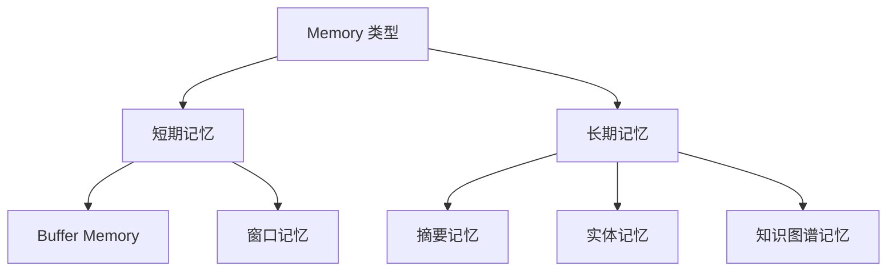
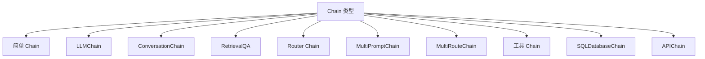
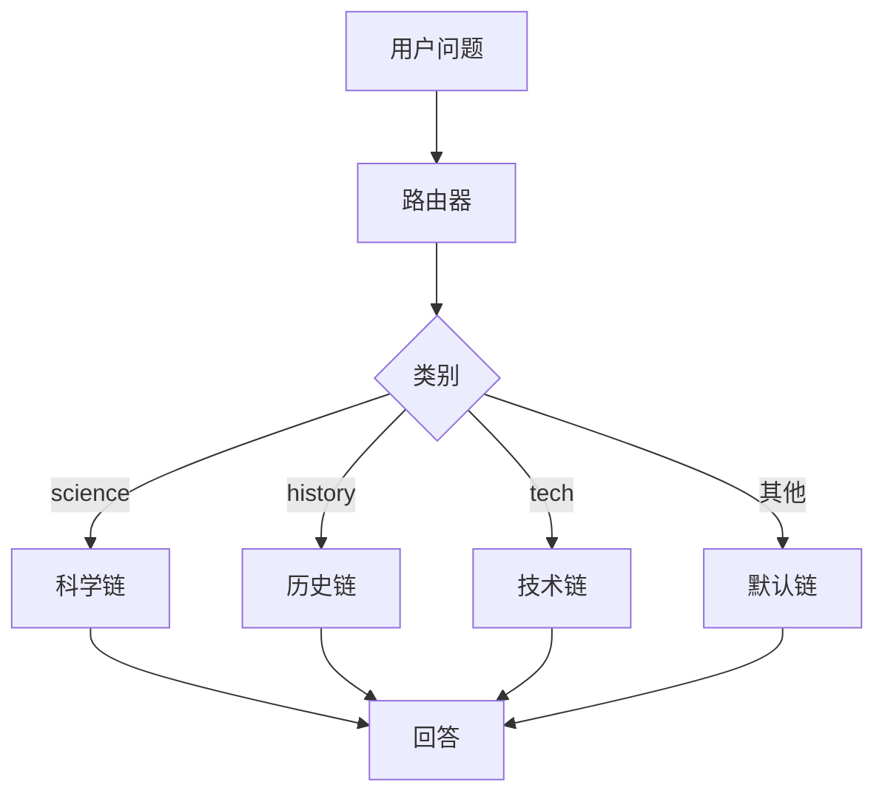
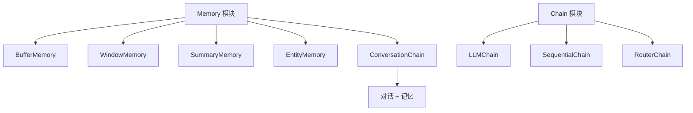

# 第 5 章 Memory 与 Chain

AI 应用需要"记忆"来维持连贯的对话体验。本章将学习 LangChain 的 Memory 组件以及 Chain 的概念和实现。

---

## 1. Memory 概述

### 为什么需要 Memory？

LLM 本身是无状态的，每次调用都是独立的。为了实现多轮对话，需要手动维护对话历史，并将历史记录传递给模型。

```python
# 无 Memory 的问题
# 每次调用都是独立的，模型不会记住之前的对话

# 第一次调用
llm.invoke("我叫张三")  # AI 回复："你好，张三！"

# 第二次调用
llm.invoke("我叫什么？")  # AI 不知道，因为它没有记忆
```

### Memory 的作用

| 功能 | 说明 |
|------|------|
| 维护对话历史 | 保存用户和 AI 的对话记录 |
| 管理上下文 | 控制传递给模型的上下文长度 |
| 摘要历史 | 防止上下文过长时截断重要信息 |

---

## 2. Memory 类型

### Memory 分类



### 1. BufferMemory（缓冲记忆）

最简单的记忆类型，保存完整的对话历史。

```python
from langchain.memory import ConversationBufferMemory

memory = ConversationBufferMemory(
    memory_key="history",  # 在 prompt 中引用的键名
    return_messages=True  # 返回消息对象而非字符串
)

# 保存对话
memory.save_context(
    {"input": "我叫张三"},
    {"output": "你好，张三！很高兴认识你。"}
)

memory.save_context(
    {"input": "我喜欢 Python 编程"},
    {"output": "Python 是一门很棒的编程语言，简洁易学！"}
)

# 加载历史
history = memory.load_memory_variables({})
print(history)
# {'history': [HumanMessage(content='我叫张三'),
#             AIMessage(content='你好，张三！'),
#             HumanMessage(content='我喜欢 Python 编程'),
#             AIMessage(content='...')]}
```

### 2. BufferWindowMemory（窗口记忆）

只保留最近 N 轮对话，避免上下文无限增长。

```python
from langchain.memory import ConversationBufferWindowMemory

memory = ConversationBufferWindowMemory(
    memory_key="history",
    k=3,  # 只保留最近 3 轮
    return_messages=True
)

# 添加 5 轮对话
for i in range(5):
    memory.save_context({"input": f"问题 {i}"}, {"output": f"回答 {i}"})

# 只有最近 3 轮被保留
history = memory.load_memory_variables({})
print(len(history["history"]))  # 6 (3对对话)
```

### 3. ConversationSummaryMemory（摘要记忆）

将对话历史压缩成摘要，适合长对话场景。

```python
from langchain.memory import ConversationSummaryMemory
from langchain_openai import ChatOpenAI

# 使用 LLM 生成摘要
memory = ConversationSummaryMemory(
    llm=ChatOpenAI(model="gpt-4o"),
    memory_key="summary",
    return_messages=True
)

# 添加长对话
messages = [
    "我叫张三，是一名后端工程师",
    "我在一家互联网公司工作，主要用 Java 和 Python",
    "我们公司在做一个电商平台",
    "日活用户大概有 100 万",
    "系统遇到了一些性能问题"
]

for msg in messages:
    memory.save_context({"input": msg}, {"output": "好的，我记住了"})

# 查看摘要
summary = memory.load_memory_variables({})
print(summary["summary"])
# "用户张三是一名后端工程师，在互联网公司工作，..."
```

### 4. ConversationEntityMemory（实体记忆）

专门记住对话中提到的实体信息。

```python
from langchain.memory import ConversationEntityMemory
from langchain_openai import ChatOpenAI

memory = ConversationEntityMemory(llm=ChatOpenAI(model="gpt-4o"))

# 记住实体
memory.save_context(
    {"input": "我的朋友李四开了一家咖啡店"},
    {"output": "听起来很棒！李四的咖啡店叫什么名字？"}
)

memory.save_context(
    {"input": "叫'温暖的角落'，在朝阳区"},
    {"output": "记住了，下次我去朝阳区会去看看"}
)

# 获取实体信息
entities = memory.load_memory_variables({})
print(entities["entities"])
# {'李四': '是用户的朋友，在朝阳区开了一家叫"温暖的角落"的咖啡店'}
```

### 5. CombinedMemory（组合记忆）

组合多种记忆类型。

```python
from langchain.memory import CombinedMemory, ConversationBufferMemory, ConversationSummaryMemory

# 组合多种记忆
memory = CombinedMemory(
    memories=[
        ConversationBufferMemory(memory_key="buffer"),
        ConversationSummaryMemory(memory_key="summary", llm=llm)
    ]
)
```

---

## 3. ConversationChain：对话链

### 使用 ConversationChain

```python
from langchain.chains import ConversationChain
from langchain.memory import ConversationBufferMemory
from langchain_openai import ChatOpenAI

# 创建 LLM
llm = ChatOpenAI(model="gpt-4o", temperature=0)

# 创建 Memory
memory = ConversationBufferMemory()

# 创建对话链
conversation = ConversationChain(
    llm=llm,
    memory=memory,
    verbose=True  # 打印中间步骤
)

# 多轮对话
response1 = conversation.invoke({"input": "我叫张三"})
print(response1["response"])
# "你好，张三！很高兴认识你。"

response2 = conversation.invoke({"input": "我是做什么的？"})
print(response2["response"])
# "你刚才告诉我你叫张三，但你没有说你是做什么的。"

response3 = conversation.invoke({"input": "我是后端工程师"})
print(response3["response"])
# "明白了，你是后端工程师。"

response4 = conversation.invoke({"input": "我是做什么的？"})
print(response4["response"])
# "你是后端工程师。"
```

### 带系统 Prompt 的对话

```python
from langchain.prompts import PromptTemplate

# 自定义 Prompt
template = """你是一个友好的 AI 助手，名叫小智。

当前对话历史：
{history}

用户：{input}
AI："""

prompt = PromptTemplate(
    input_variables=["history", "input"],
    template=template
)

conversation = ConversationChain(
    llm=llm,
    memory=memory,
    prompt=prompt,
    verbose=False
)
```

---

## 4. LCEL 中的 Memory

### 手动管理 Memory

```python
from langchain_core.messages import HumanMessage, AIMessage, SystemMessage
from langchain_openai import ChatOpenAI
from langchain_core.prompts import ChatPromptTemplate
from langchain_core.output_parsers import StrOutputParser

# 维护消息历史
chat_history = [
    SystemMessage(content="你是一个有帮助的助手")
]

llm = ChatOpenAI(model="gpt-4o")

while True:
    user_input = input("你: ")

    # 添加用户消息
    chat_history.append(HumanMessage(content=user_input))

    # 调用 LLM
    response = llm.invoke(chat_history)

    # 打印 AI 回复
    print(f"AI: {response.content}")

    # 添加 AI 回复到历史
    chat_history.append(AIMessage(content=response.content))

    # 可选：限制历史长度
    if len(chat_history) > 10:
        chat_history = chat_history[:3] + chat_history[3:]  # 保留前3条（system + 前2条）
```

### 自动管理 Memory 的 Chain

```python
from langchain_core.runnables import RunnableLambda
from langchain_core.messages import HumanMessage, AIMessage
from langchain_openai import ChatOpenAI
from langchain_core.prompts import ChatPromptTemplate

class ChatHistoryManager:
    def __init__(self, max_messages=10):
        self.history = [SystemMessage(content="你是一个有帮助的助手")]
        self.max_messages = max_messages

    def add_user_message(self, message: str):
        self.history.append(HumanMessage(content=message))

    def add_ai_message(self, message: str):
        self.history.append(AIMessage(content=message))

    def get_history(self):
        return self.history

    def trim_history(self):
        # 保留 SystemMessage + 最近的消息
        if len(self.history) > self.max_messages:
            self.history = [self.history[0]] + self.history[-(self.max_messages-1):]

# 使用
class ChatBot:
    def __init__(self):
        self.history_manager = ChatHistoryManager(max_messages=10)
        self.llm = ChatOpenAI(model="gpt-4o")

    def chat(self, user_input: str) -> str:
        self.history_manager.add_user_message(user_input)

        response = self.llm.invoke(self.history_manager.get_history())

        self.history_manager.add_ai_message(response.content)
        self.history_manager.trim_history()

        return response.content

# 使用
bot = ChatBot()
print(bot.chat("我叫张三"))
print(bot.chat("我是做什么的？"))
```

---

## 5. Chain 深入理解

### 什么是 Chain？

Chain 是 LangChain 的核心概念之一，它将多个组件组合成一个处理流程。在 LCEL 之前，Chain 是通过 `L-chain` 类来实现的；现在，LCEL 已经成为了定义 Chain 的主要方式。

### Chain 类型



### LLMChain

最基础的 Chain 类型。

```python
from langchain.chains import LLMChain
from langchain_openai import ChatOpenAI
from langchain_core.prompts import PromptTemplate

llm = ChatOpenAI(model="gpt-4o")

prompt = PromptTemplate.from_template(
    "用{style}风格写一首关于{topic}的诗"
)

chain = LLMChain(llm=llm, prompt=prompt)

result = chain.invoke({
    "style": "古风",
    "topic": "春天"
})

print(result["text"])
```

### SimpleSequentialChain（简单顺序链）

```python
from langchain.chains import SimpleSequentialChain

# Chain 1: 生成主题
chain1 = LLMChain(
    llm=llm,
    prompt=PromptTemplate.from_template(
        "生成一个关于{product}的简短描述（20字以内）"
    )
)

# Chain 2: 写营销文案
chain2 = LLMChain(
    llm=llm,
    prompt=PromptTemplate.from_template(
        "基于以下描述写一段营销文案：\n{description}"
    )
)

# 组合
sequential_chain = SimpleSequentialChain(
    chains=[chain1, chain2],
    verbose=True
)

result = sequential_chain.invoke("智能手表")
print(result["output"])
```

### SequentialChain（多输入输出链）

```python
from langchain.chains import SequentialChain

# Chain 1: 提取国家
chain1 = LLMChain(
    llm=llm,
    prompt=PromptTemplate.from_template(
        "从以下文本中提取提到的国家：{text}"
    ),
    output_key="countries"
)

# Chain 2: 生成问候语
chain2 = LLMChain(
    llm=llm,
    prompt=PromptTemplate.from_template(
        "用国家{country}的官方语言写一句问候语（用{country}的语言）",
    ),
    output_key="greeting"
)

# Chain 3: 翻译
chain3 = LLMChain(
    llm=llm,
    prompt=PromptTemplate.from_template(
        "将以下文本翻译成中文：{greeting}",
    ),
    output_key="chinese_greeting"
)

# 组合
full_chain = SequentialChain(
    chains=[chain1, chain2, chain3],
    input_variables=["text"],
    output_variables=["countries", "greeting", "chinese_greeting"],
    verbose=True
)

result = full_chain.invoke({
    "text": "I visited Japan and France last summer."
})

print(f"国家: {result['countries']}")
print(f"原文问候: {result['greeting']}")
print(f"中文翻译: {result['chinese_greeting']}")
```

---

## 6. Router Chain（路由链）

### 使用 MultiPromptChain 实现路由

```python
from langchain.chains import LLMChain
from langchain_core.prompts import PromptTemplate
from langchain.chains.router import MultiPromptChain
from langchain.chains.router.llm_router import LLMRouterChain, RouterOutputParser
from langchain_openai import ChatOpenAI

llm = ChatOpenAI(model="gpt-4o")

# 定义多个专业链
science_prompt = PromptTemplate.from_template(
    """你是一位科学家。请回答以下关于科学的问题。

问题：{input}
回答："""
)

history_prompt = PromptTemplate.from_template(
    """你是一位历史学家。请回答以下关于历史的问题。

问题：{input}
回答："""
)

tech_prompt = PromptTemplate.from_template(
    """你是一位技术专家。请回答以下关于技术的问题。

问题：{input}
回答："""
)

# 路由链
router_template = """根据输入的问题，将其路由到最合适的类别。

问题：{input}

可选类别：science（科学）、history（历史）、tech（技术）

请只输出类别名称，不要其他内容。"""

router_chain = LLMRouterChain.from_llm(
    llm,
    PromptTemplate.from_template(router_template)
)

# 组合
chain = MultiPromptChain(
    router_chain=router_chain,
    destination_chains={
        "science": LLMChain(llm=llm, prompt=science_prompt),
        "history": LLMChain(llm=llm, prompt=history_prompt),
        "tech": LLMChain(llm=llm, prompt=tech_prompt)
    },
    default_chain=LLMChain(llm=llm, prompt=PromptTemplate.from_template(
        "抱歉，我没有合适的分类来回答这个问题。请详细说明您的需求。"
    )),
    verbose=True
)

# 测试
print(chain.invoke({"input": "Python 的 GIL 是什么？"}))
print(chain.invoke({"input": "二战的转折点是什么？"}))
```

### 流程图



---

## 7. 转换 Chain

### TransformationChain

对输入或输出进行转换。

```python
from langchain.chains import TransformChain
from langchain_openai import ChatOpenAI

def transform_func(inputs):
    text = inputs["text"]
    # 清理文本
    cleaned = text.replace("\n\n", "\n").strip()
    return {"cleaned_text": cleaned}

cleanup_chain = TransformChain(
    input_variables=["text"],
    output_variables=["cleaned_text"],
    transform=transform_func
)

# 使用
result = cleanup_chain.invoke({
    "text": "这是第一段\n\n\n这是第二段\n\n"
})
print(result)
# {'cleaned_text': '这是第一段\n这是第二段'}
```

### OpenAPI Functions Chain

```python
from langchain.chains import create_structured_output_runnable
from langchain_openai import ChatOpenAI
from pydantic import BaseModel
from typing import List

class Task(BaseModel):
    title: str
    priority: str
    due_date: str = None

class TaskList(BaseModel):
    tasks: List[Task]

chain = create_structured_output_runnable(TaskList, ChatOpenAI(model="gpt-4o"))

result = chain.invoke("帮我规划一下今天的工作：写周报、开会、回复邮件")
print(result)
# TaskList(tasks=[Task(title='写周报', ...), Task(title='开会', ...), ...])
```

---

## 8. 完整示例：带记忆的 RAG 对话系统

```python
# conversational_rag.py
from langchain_openai import ChatOpenAI, OpenAIEmbeddings
from langchain_community.vectorstores import Chroma
from langchain_core.prompts import ChatPromptTemplate
from langchain_core.output_parsers import StrOutputParser
from langchain_core.runnables import RunnablePassthrough
from langchain_core.messages import HumanMessage, AIMessage, SystemMessage
from langchain.memory import ConversationBufferMemory

class ConversationalRAG:
    def __init__(self, vectorstore_path: str):
        # 初始化组件
        self.embeddings = OpenAIEmbeddings()
        self.vectorstore = Chroma(persist_directory=vectorstore_path,
                                   embedding_function=self.embeddings)
        self.retriever = self.vectorstore.as_retriever(k=5)
        self.llm = ChatOpenAI(model="gpt-4o", temperature=0.3)

        # 对话历史
        self.chat_history = [
            SystemMessage(content="你是一个知识库问答助手，可以参考历史对话更好地回答问题。")
        ]

    def _format_docs(self, docs):
        return "\n\n".join(doc.page_content for doc in docs)

    def ask(self, question: str) -> str:
        # 添加用户消息
        self.chat_history.append(HumanMessage(content=question))

        # 检索相关文档
        docs = self.retriever.invoke(question)
        context = self._format_docs(docs)

        # 构建包含历史的 Prompt
        prompt = ChatPromptTemplate.from_messages([
            ("system", """你是一个知识库问答助手。
参考以下上下文回答问题，如果信息不足，说"我没有找到相关信息"。
当前对话历史可以帮助理解上下文。

上下文：
{context}"""),
            ("placeholder", "{chat_history}"),
            ("user", "问题：{question}")
        ])

        chain = prompt | self.llm | StrOutputParser()

        # 执行
        response = chain.invoke({
            "context": context,
            "chat_history": self.chat_history[:-1],  # 不包含当前用户消息
            "question": question
        })

        # 添加 AI 回复到历史
        self.chat_history.append(AIMessage(content=response))

        # 控制历史长度
        if len(self.chat_history) > 20:
            self.chat_history = [self.chat_history[0]] + self.chat_history[-19:]

        return response

# 使用
if __name__ == "__main__":
    rag = ConversationalRAG("./chroma_db")

    # 第一轮
    print("用户: Python 是什么？")
    print("AI:", rag.ask("Python 是什么？"))

    # 第二轮（可引用上一轮）
    print("\n用户: 它适合做什么？")
    print("AI:", rag.ask("它适合做什么？"))

    # 第三轮
    print("\n用户: 和 Java 相比呢？")
    print("AI:", rag.ask("和 Java 相比呢？"))
```

---

## 9. 本章小结



**核心要点：**

1. **Memory** 维护对话历史，支持多种类型：
   - BufferMemory：完整历史
   - WindowMemory：最近 N 轮
   - SummaryMemory：摘要压缩
   - EntityMemory：实体记忆

2. **Chain** 组合多个组件：
   - LLMChain：基础链
   - SequentialChain：顺序执行
   - RouterChain：条件路由

3. **LCEL** 是定义 Chain 的现代方式，提供了更强大的组合能力

4. **对话系统** 需要同时处理 Memory 和 RAG

---

**下一章预告：** 下一章我们将学习 **Tools 和 Agents**，了解：
- 如何定义和注册工具
- Function Calling 的实现
- ReAct 模式的原理
- 各种 Agent 类型的使用