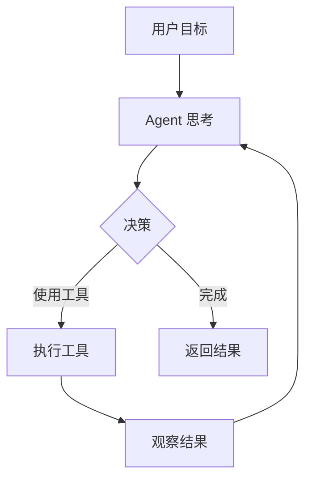
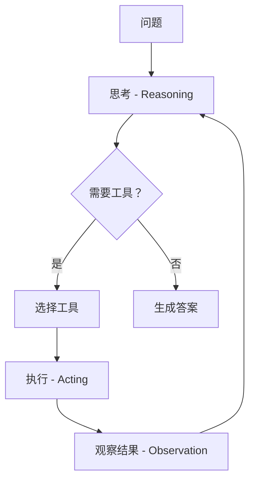
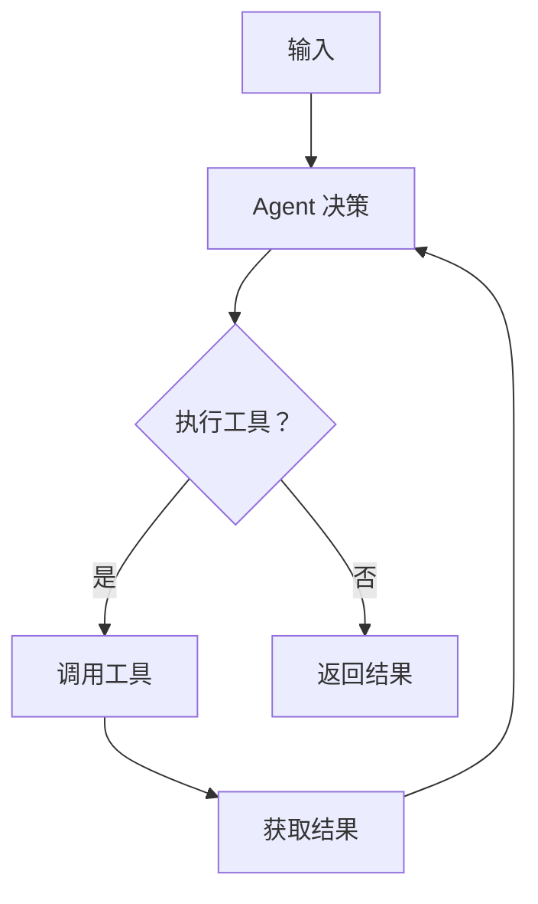
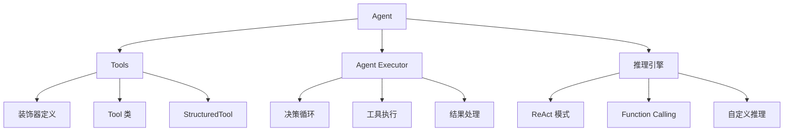

# 第 6 章 Tools 与 Agents

Agent（智能体）是 LangChain 最强大的功能之一，它能让 AI 自主规划、执行任务。本章将深入学习 Tools 和 Agents 的使用。

---

## 1. Agent 概述

### 什么是 Agent？

Agent 是能够**自主决策**和**执行行动**的 AI 系统。与简单的问答不同，Agent 可以：

- 理解复杂目标
- 分解任务步骤
- 调用各种工具
- 根据反馈调整策略
- 持续迭代直到完成任务

### Agent vs 普通 Chain

| 特性 | 普通 Chain | Agent |
|------|------------|-------|
| 执行流程 | 固定 | 动态 |
| 工具调用 | 无 | 可调用多种工具 |
| 决策能力 | 无 | 有推理和决策能力 |
| 自我纠错 | 无 | 可根据结果调整 |
| 循环控制 | 手动 | 自动直到完成 |



---

## 2. Tools（工具）

### 什么是 Tool？

Tool 是 Agent 可以调用的外部能力，如搜索、计算、API 调用等。

### 定义 Tool 的方式

#### 方式 1：使用装饰器（推荐）

```python
from langchain_core.tools import tool

@tool
def multiply(a: int, b: int) -> int:
    """将两个数字相乘"""
    return a * b

@tool
def get_weather(city: str) -> str:
    """获取城市天气

    Args:
        city: 城市名称，如 北京、上海
    """
    weather_data = {
        "北京": "晴，25°C",
        "上海": "多云，28°C",
        "广州": "雨，26°C"
    }
    return weather_data.get(city, "未知城市")
```

#### 方式 2：使用 Tool 类

```python
from langchain_core.tools import Tool

def calculate(expression: str) -> str:
    """执行数学计算"""
    try:
        result = eval(expression)
        return str(result)
    except Exception as e:
        return f"计算错误: {e}"

calculator = Tool(
    name="calculator",
    func=calculate,
    description="用于数学计算，输入是数学表达式，如 '2+3*5'"
)
```

#### 方式 3：使用 StructuredTool

```python
from langchain_core.tools import StructuredTool
from pydantic import BaseModel

class SearchInput(BaseModel):
    query: str
    num_results: int = 5

def web_search(query: str, num_results: int = 5) -> str:
    """执行网络搜索"""
    # 这里可以是真实的搜索 API
    return f"搜索结果：关于'{query}'的{num_results}个结果"

search_tool = StructuredTool.from_function(
    func=web_search,
    name="web_search",
    description="执行网络搜索，获取相关信息",
    args_schema=SearchInput
)
```

### 工具注册与使用

```python
from langchain_openai import ChatOpenAI
from langchain_core.utils.function_calling import convert_to_openai_function_schema

# 获取工具的 OpenAI 格式定义
tools = [get_weather, multiply]
functions = [convert_to_openai_function_schema(t) for t in tools]

# 使用
llm = ChatOpenAI(model="gpt-4o")

response = llm.bind(functions=functions).invoke(
    "北京天气怎么样？2乘3等于多少？"
)

print(response.additional_kwargs.get("tool_calls"))
```

---

## 3. ToolKit（工具集）

LangChain 提供了预定义的工具集。

```python
# 搜索工具集
from langchain_community.agent_toolkits import create_python_agent
from langchain_community.tools import DuckDuckGoSearchRun

search = DuckDuckGoSearchRun()
search_results = search.run("Python 异步编程")
print(search_results)
```

### 常用预置工具

| 工具 | 用途 | 包 |
|------|------|-----|
| DuckDuckGoSearch | 网络搜索 | langchain-community |
| Wikipedia | 百科查询 | wikipedia |
| Calculator | 数学计算 | langchain |
| SQLDatabase | 数据库查询 | langchain |
| PythonREPL | 执行 Python 代码 | langchain |
| FileSystem | 文件操作 | langchain-core |

### 文件操作工具

```python
from langchain_community.tools import WriteFileTool, ReadFileTool

tools = [
    WriteFileTool(),
    ReadFileTool()
]

# 写入文件
write_tool = WriteFileTool()
write_tool.invoke({
    "file_path": "example.txt",
    "text": "Hello, World!"
})

# 读取文件
read_tool = ReadFileTool()
content = read_tool.invoke("example.txt")
print(content)
```

### Python 解释器

```python
from langchain_experimental.tools import PythonREPLTool

python_tool = PythonREPLTool()

# 执行代码
result = python_tool.run("""
import numpy as np
import matplotlib.pyplot as plt

x = np.linspace(0, 10, 100)
y = np.sin(x)

plt.plot(x, y)
plt.savefig('sin_wave.png')
print('图片已保存')
""")
```

---

## 4. ReAct 模式

### 什么是 ReAct？

**ReAct = Reason + Act**，让 Agent 交替进行推理和行动。

### ReAct 流程



### ReAct 实现

```python
from langchain_core.agents import AgentFinish, AgentAction
from langchain_openai import ChatOpenAI

class ReActAgent:
    def __init__(self, tools, llm):
        self.tools = tools
        self.llm = llm

    def run(self, question: str):
        history = []

        while True:
            # 1. 推理 - 让 LLM 思考下一步
            prompt = self._build_prompt(question, history)
            response = self.llm.invoke(prompt)

            # 2. 解析响应
            action = self._parse_response(response.content)

            # 3. 检查是否完成
            if isinstance(action, AgentFinish):
                return action.return_values["output"]

            # 4. 执行工具
            result = self._execute_tool(action)

            # 5. 添加到历史
            history.append((action, result))

    def _build_prompt(self, question, history):
        # 构建 ReAct 格式的 prompt
        ...

    def _parse_response(self, response):
        # 解析 LLM 响应，决定下一步行动
        ...

    def _execute_tool(self, action):
        # 执行工具并返回结果
        tool = self.tools.get(action.tool)
        return tool.run(action.tool_input)
```

---

## 5. Agent 类型

### 1. OpenAI Functions Agent

最常用的 Agent 类型，利用 OpenAI 的 Function Calling。

```python
from langchain.agents import create_openai_functions_agent
from langchain_openai import ChatOpenAI
from langchain_core.tools import tool
from langchain_core.prompts import ChatPromptTemplate

# 定义工具
@tool
def get_weather(city: str) -> str:
    """获取城市天气"""
    weathers = {"北京": "晴", "上海": "雨", "广州": "阴"}
    return weathers.get(city, "未知")

@tool
def calculator(expr: str) -> str:
    """计算数学表达式"""
    return str(eval(expr))

tools = [get_weather, calculator]

# 创建 Agent
llm = ChatOpenAI(model="gpt-4o")

prompt = ChatPromptTemplate.from_messages([
    ("system", "你是一个有帮助的助手，可以使用提供的工具来回答问题。"),
    ("placeholder", "{chat_history}"),
    ("human", "{input}"),
    ("placeholder", "{agent_scratchpad}")
])

agent = create_openai_functions_agent(llm, tools, prompt)

# 创建 Agent Executor
from langchain.agents import AgentExecutor

agent_executor = AgentExecutor(
    agent=agent,
    tools=tools,
    verbose=True,
    max_iterations=5
)

# 运行
result = agent_executor.invoke({"input": "北京天气怎么样？帮我计算 2+3*5"})
print(result["output"])
```

### 2. Conversational Agent

专门用于对话场景的 Agent。

```python
from langchain.agents import create_conversational_retrieval_agent
from langchain_community.agent_toolkits import OpenAIToolkit

# 创建 Agent
agent_executor = create_conversational_retrieval_agent(
    llm,
    tools,
    verbose=True
)

result = agent_executor.invoke({
    "input": "你好，我叫张三",
    "chat_history": []
})
```

### 3. SQL Agent

用于数据库查询的 Agent。

```python
from langchain_community.agent_toolkits import SQLDatabaseToolkit
from langchain.agents import create_sql_agent
from langchain_community.utilities import SQLDatabase
from langchain_openai import ChatOpenAI

# 连接数据库
db = SQLDatabase.from_uri("sqlite:///chinook.db")

# 创建 Agent
toolkit = SQLDatabaseToolkit(db=db, llm=llm)

agent_executor = create_sql_agent(
    llm=llm,
    toolkit=toolkit,
    verbose=True
)

# 查询
result = agent_executor.invoke(
    "有多少客户？列出他们的姓名和邮箱"
)
```

### 4. JSON Agent

处理 JSON 数据的 Agent。

```python
from langchain.agents import create_json_agent
from langchain_community.agent_toolkits import JsonToolkit
from langchain_core.utils.function_calling import convert_to_openai_function_schema

# 读取 JSON 数据
import json
with open("data.json", "r") as f:
    data = json.load(f)

# 创建 Agent
agent_executor = create_json_agent(
    llm=llm,
    toolkit=JsonToolkit(json_object=data),
    verbose=True
)

result = agent_executor.invoke("找出所有年龄大于30的人")
```

### 5. OpenAPI Agent

与 REST API 交互的 Agent。

```python
from langchain_community.agent_toolkits import OpenAPIToolkit
from langchain_community.utilities import RequestsWrapper
import requests

# API 配置
requests_wrapper = RequestsWrapper(headers={"Authorization": "Bearer xxx"})

toolkit = OpenAPIToolkit.from_llm(
    llm=llm,
    requests_wrapper=requests_wrapper,
    verbose=True
)

agent = create_openapi_agent(
    llm=llm,
    toolkit=toolkit,
    prompt=prompt,
    verbose=True
)
```

---

## 6. Agent Executor

### AgentExecutor 工作原理



### 配置选项

```python
from langchain.agents import AgentExecutor

agent_executor = AgentExecutor(
    agent=agent,
    tools=tools,

    # 执行控制
    max_iterations=10,          # 最大迭代次数
    max_execution_time=60,      # 最大执行时间（秒）
    early_stopping_method="force",  # force / generate

    # 错误处理
    handle_parsing_errors=True,  # 自动处理解析错误

    # 输出控制
    verbose=True,
    callbacks=[callback]
)
```

### 处理解析错误

```python
# 方式 1：返回错误信息
agent_executor = AgentExecutor(
    agent=agent,
    tools=tools,
    handle_parsing_errors="请检查你的格式，只返回 JSON"
)

# 方式 2：自定义处理函数
def handle_error(error):
    return "出错了，请重试"

agent_executor = AgentExecutor(
    agent=agent,
    tools=tools,
    handle_parsing_errors=handle_error
)
```

---

## 7. 多工具协作

### 工具调用链

```python
from langchain_core.tools import tool
from langchain_openai import ChatOpenAI
from langchain.agents import create_openai_functions_agent, AgentExecutor

# 工具定义
@tool
def search_news(keyword: str) -> str:
    """搜索新闻"""
    return f"关于'{keyword}'的最新新闻：1. xxx 2. yyy 3. zzz"

@tool
def get_stock_price(symbol: str) -> str:
    """获取股票价格"""
    stocks = {
        "AAPL": "$178.50",
        "GOOGL": "$142.50",
        "MSFT": "$378.50"
    }
    return stocks.get(symbol.upper(), "未知股票代码")

@tool
def get_weather(city: str) -> str:
    """获取天气"""
    weathers = {
        "北京": "晴 25°C",
        "上海": "雨 22°C"
    }
    return weathers.get(city, "未知城市")

tools = [search_news, get_stock_price, get_weather]

# Agent
llm = ChatOpenAI(model="gpt-4o")
prompt = ChatPromptTemplate.from_messages([
    ("system", "你是一个信息助手，可以帮助用户查询各种信息。"),
    ("human", "{input}"),
    ("placeholder", "{agent_scratchpad}")
])

agent = create_openai_functions_agent(llm, tools, prompt)
agent_executor = AgentExecutor(agent=agent, tools=tools, verbose=True)

# 测试
results = agent_executor.batch([
    {"input": "苹果公司股价多少？"},
    {"input": "北京今天天气如何？"},
    {"input": "搜索一下 AI 相关的新闻"}
])

for r in results:
    print(r["output"])
    print("-" * 20)
```

---

## 8. 自定义 Agent

### 创建自定义推理 Agent

```python
from typing import List, Union, NamedTuple
from langchain_core.agents import AgentAction, AgentFinish
from langchain_core.prompts import PromptTemplate
from langchain_openai import ChatOpenAI

class CustomAgent:
    def __init__(self, tools, llm, prompt):
        self.tools = tools
        self.llm = llm
        self.prompt = prompt

    def plan(self, intermediate_steps, **kwargs):
        # 自定义规划逻辑
        ...

    def run(self, input_str):
        steps = []

        while True:
            # 生成下一步
            thoughts = self._get_next_action(input_str, steps)

            # 解析行动
            action = self._parse_action(thoughts)

            # 检查是否完成
            if isinstance(action, AgentFinish):
                return action.return_values

            # 执行行动
            result = self._execute_action(action.tool, action.tool_input)
            steps.append((action, result))

    def _get_next_action(self, input_str, steps):
        ...

# 使用
agent = CustomAgent(tools=tools, llm=llm, prompt=custom_prompt)
result = agent.run("帮我查一下苹果公司的最新新闻")
```

---

## 9. 实战：构建个人助理 Agent

```python
# personal_assistant.py
from langchain_core.tools import tool
from langchain_openai import ChatOpenAI
from langchain.agents import create_openai_functions_agent, AgentExecutor
from langchain_core.prompts import ChatPromptTemplate
from datetime import datetime

# 定义工具
@tool
def get_current_time() -> str:
    """获取当前日期和时间"""
    now = datetime.now()
    return now.strftime("%Y年%m月%d日 %H:%M:%S")

@tool
def search_web(query: str) -> str:
    """搜索网络信息"""
    # 模拟搜索结果
    return f"关于'{query}'的搜索结果：这是一条模拟的搜索结果。"

@tool
def send_email(recipient: str, subject: str, content: str) -> str:
    """发送邮件

    Args:
        recipient: 收件人邮箱
        subject: 邮件主题
        content: 邮件内容
    """
    # 模拟发送
    return f"邮件已发送至 {recipient}，主题：{subject}"

@tool
def create_reminder(task: str, time: str) -> str:
    """创建提醒

    Args:
        task: 待办事项
        time: 提醒时间
    """
    return f"已设置提醒：{task}，时间：{time}"

tools = [get_current_time, search_web, send_email, create_reminder]

# 创建 Agent
llm = ChatOpenAI(model="gpt-4o", temperature=0)

prompt = ChatPromptTemplate.from_messages([
    ("system", """你是一个智能个人助理，名叫小助手。

你有以下能力：
1. 查询当前时间
2. 搜索网络信息
3. 发送邮件
4. 创建提醒

请根据用户的需求，选择合适的工具来帮助他们。"""),
    ("human", "{input}"),
    ("placeholder", "{agent_scratchpad}")
])

agent = create_openai_functions_agent(llm, tools, prompt)
agent_executor = AgentExecutor(
    agent=agent,
    tools=tools,
    verbose=True,
    max_iterations=5
)

# 交互式使用
if __name__ == "__main__":
    print("=" * 50)
    print("欢迎使用智能个人助理！")
    print("=" * 50)

    while True:
        user_input = input("\n你: ")
        if user_input.lower() in ["退出", "exit", "quit"]:
            print("再见！")
            break

        result = agent_executor.invoke({"input": user_input})
        print(f"\n助理: {result['output']}")
```

---

## 10. 常见问题与优化

### 问题 1：Agent 不调用工具

```python
# 检查工具描述是否清晰
@tool
def get_weather(city: str) -> str:
    """获取指定城市的当前天气情况，包括温度和天气状况

    Args:
        city: 城市的中文名称，如"北京"、"上海"、"广州"
    """
    ...

# 确保 prompt 明确指示使用工具
prompt = ChatPromptTemplate.from_messages([
    ("system", "你可以使用工具来回答问题，请选择合适的工具。"),
    ...
])
```

### 问题 2：无限循环

```python
# 使用 max_iterations 限制
agent_executor = AgentExecutor(
    agent=agent,
    tools=tools,
    max_iterations=5  # 最多迭代 5 次
)

# 使用 early_stopping
agent_executor = AgentExecutor(
    agent=agent,
    tools=tools,
    early_stopping_method="force"  # 强制停止
)
```

### 问题 3：工具调用失败

```python
# 使用 try-except 处理
@tool
def unreliable_tool(input: str) -> str:
    try:
        # 实际调用
        return call_api(input)
    except Exception as e:
        return f"工具执行失败: {str(e)}"
```

### 优化建议

| 优化项 | 方法 |
|--------|------|
| 提高工具调用准确性 | 优化工具描述和参数说明 |
| 减少 token 消耗 | 限制 max_iterations |
| 提高响应速度 | 使用流式输出 |
| 增强可靠性 | 添加错误处理和重试 |

---

## 11. 本章小结



**核心要点：**

1. **Tool** 定义了 Agent 可以调用的外部能力
2. **ReAct** 是 Agent 的核心推理模式：Reason → Act → Observe
3. **create_openai_functions_agent** 是最常用的 Agent 创建方式
4. **AgentExecutor** 管理 Agent 的执行循环
5. **多工具协作** 可以构建复杂的智能助理

---

**下一章预告：** 下一章我们将学习 **LangGraph**，了解：
- 状态机与工作流
- 构建多 Agent 协作系统
- 人机协同
- 持久化与检查点