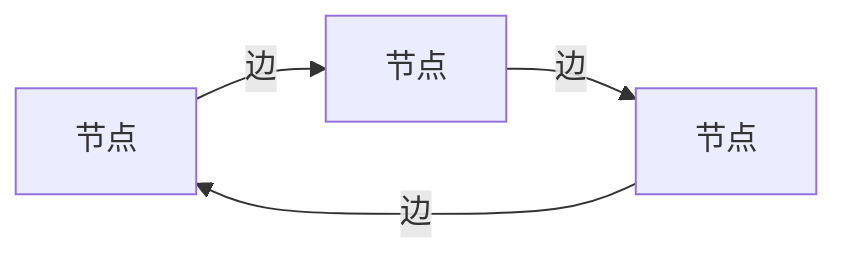
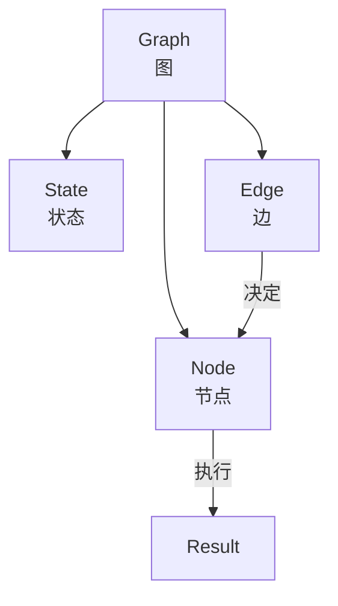
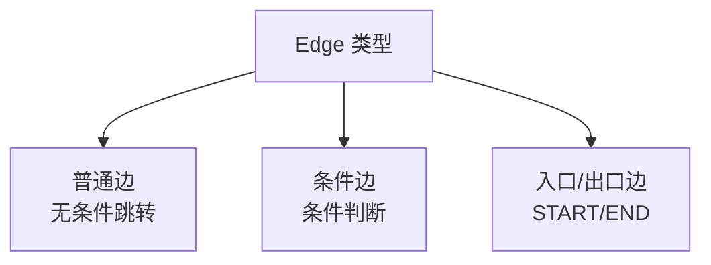
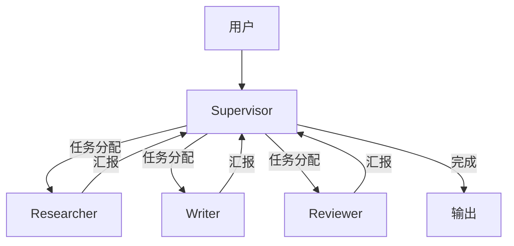
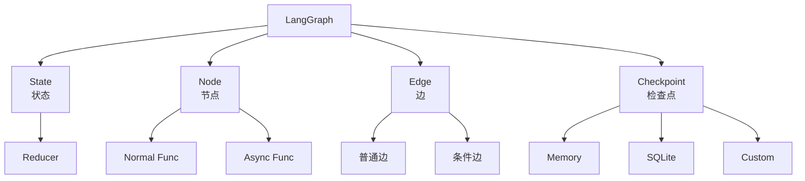

# 第 7 章 LangGraph 与多智能体

LangGraph 是 LangChain 生态中的重要成员，专门用于构建复杂的多智能体系统和有状态的工作流。本章将深入学习 LangGraph 的核心概念和使用方法。

---

## 1. 为什么需要 LangGraph？

### LCEL 的局限

LCEL 适合线性流程，但对于复杂的多分支、循环、人机交互场景，LCEL 的表达能力有限。

| 场景 | LCEL | LangGraph |
|------|------|-----------|
| 线性流程 | ✅ 完美 | ✅ 也可以 |
| 多分支 | ⚠️ RunnableBranch | ✅ 更清晰 |
| 循环/迭代 | ❌ 难以表达 | ✅ 状态机 |
| 多 Agent 协作 | ❌ 不支持 | ✅ 支持 |
| 人机协同 | ❌ 不支持 | ✅ 支持 |
| 检查点/恢复 | ❌ 不支持 | ✅ 支持 |

### LangGraph 的定位

LangGraph 基于**状态机**和**图**的概念，使用户可以精确控制 Agent 的执行流程。



---

## 2. LangGraph 核心概念

### 核心组件



| 组件 | 说明 |
|------|------|
| **State** | 贯穿整个图执行的状态（共享数据） |
| **Node** | 执行特定任务的函数 |
| **Edge** | 定义从一个节点到另一个节点的路径 |
| **Graph** | 由节点和边组成的完整工作流 |

### 简单示例

```python
from langgraph.graph import StateGraph, END

# 定义状态
class State(TypedDict):
    messages: list

# 创建图
graph = StateGraph(State)

# 添加节点
graph.add_node("greet", lambda state: {"messages": state["messages"] + ["Hello!"]})
graph.add_node("ask", lambda state: {"messages": state["messages"] + ["How are you?"]})

# 添加边
graph.set_entry_point("greet")
graph.add_edge("greet", "ask")
graph.add_edge("ask", END)

# 编译
app = graph.compile()

# 运行
result = app.invoke({"messages": []})
print(result)
# {'messages': ['Hello!', 'How are you?']}
```

---

## 3. State（状态管理）

### 定义状态

```python
from typing import TypedDict, Annotated
from langgraph.graph import add_messages

class AgentState(TypedDict):
    """Agent 的状态定义"""
    messages: Annotated[list, add_messages]  # 使用 Annotated 添加 reducer
    user_name: str
    task_status: str
    results: dict

# Annotated 说明：
# add_messages 是一个 reducer 函数，指定如何合并消息列表
```

### Reducer（状态合并器）

```python
from typing import Annotated
from langgraph.graph import add_messages

# 默认 reducer：后面的值覆盖前面的
class State1(TypedDict):
    counter: int

# 使用 add_messages reducer：列表追加
class State2(TypedDict):
    messages: Annotated[list, add_messages]

# 自定义 reducer
def merge_dicts(left: dict, right: dict) -> dict:
    """合并两个字典，right 覆盖 left"""
    return {**left, **right}

class State3(TypedDict):
    config: Annotated[dict, merge_dicts]
    history: Annotated[list, lambda x, y: x + y[-5:]]  # 只保留最近5条
```

### 状态初始化

```python
# 方式 1：使用 initial_state 参数
result = app.invoke(
    {"messages": [], "user_name": "张三"},
    config={"configurable": {"thread_id": "123"}}
)

# 方式 2：在图中设置初始节点返回初始状态
def init_state(state):
    return {
        "messages": [],
        "user_name": "Guest",
        "task_status": "pending",
        "results": {}
    }

graph.set_entry_point("init")
graph.add_node("init", init_state)
```

---

## 4. Node（节点）

### 什么是节点？

节点是执行特定任务的函数，接收当前状态，返回更新后的状态。

### 节点定义方式

```python
from langgraph.graph import StateGraph, START, END
from typing import TypedDict

class State(TypedDict):
    messages: list
    current_step: str

# 方式 1：普通函数
def greet(state: State) -> State:
    return {"messages": state["messages"] + ["你好！"], "current_step": "greet"}

# 方式 2：异步函数
async def async_greet(state: State) -> State:
    return {"messages": state["messages"] + ["你好！"]}

# 方式 3：使用装饰器
from langgraph.graph import node

@node
def process_node(state: State) -> State:
    # 节点逻辑
    return {"current_step": "processed"}

# 方式 4：Lambda（简单场景）
graph.add_node("simple_node", lambda state: {"data": "processed"})
```

### 节点的错误处理

```python
from langgraph.prebuilt import ToolNode

# ToolNode 已经包含了错误处理
# 自定义节点可以使用 try-except

def unreliable_node(state: State) -> State:
    try:
        result = risky_operation()
        return {"result": result, "status": "success"}
    except Exception as e:
        return {"result": None, "status": "error", "error": str(e)}
```

---

## 5. Edge（边）

### 边的类型



### 普通边

```python
# A -> B -> C 顺序执行
graph.add_edge("A", "B")
graph.add_edge("B", "C")
```

### 条件边

```python
from langgraph.graph import StateGraph

# 定义条件函数
def should_continue(state: State) -> str:
    if len(state["messages"]) > 5:
        return "end"
    elif state["status"] == "error":
        return "handle_error"
    else:
        return "continue"

# 添加条件边
graph.add_conditional_edges(
    "process",                    # 源节点
    should_continue,              # 条件函数
    {
        "end": END,               # 条件 -> 目标
        "handle_error": "error_handler",
        "continue": "process"      # 继续处理
    }
)
```

### 完整边配置

```python
from langgraph.graph import StateGraph, START, END

# 创建图
graph = StateGraph(State)

# 添加节点
graph.add_node("start", start_node)
graph.add_node("process", process_node)
graph.add_node("validate", validate_node)
graph.add_node("end", end_node)

# 设置入口
graph.set_entry_point("start")

# 边：start -> process -> validate
graph.add_edge("start", "process")
graph.add_edge("process", "validate")

# 条件边：validate -> 选择下一步
graph.add_conditional_edges(
    "validate",
    lambda state: "pass" if state["is_valid"] else "fail",
    {
        "pass": "end",
        "fail": "process"  # 返回重新处理
    }
)

# 设置出口
graph.add_edge("end", END)

# 编译
app = graph.compile()
```

### 边的条件函数示例

```python
# 根据状态决定路由
def route_based_on_intent(state: State) -> str:
    """根据用户意图路由"""
    last_message = state["messages"][-1].content.lower()

    if "search" in last_message:
        return "search"
    elif "write" in last_message or "create" in last_message:
        return "writer"
    elif "analyze" in last_message:
        return "analyzer"
    else:
        return "chat"

# 添加条件边
graph.add_conditional_edges(
    "classify",
    route_based_on_intent,
    {
        "search": "search_agent",
        "writer": "writer_agent",
        "analyzer": "analyzer_agent",
        "chat": "chat_node"
    }
)
```

---

## 6. 实际示例：RAG 流程

### 使用 LangGraph 实现 RAG

```python
from typing import TypedDict, Annotated
from langgraph.graph import StateGraph, START, END
from langgraph.graph import add_messages
from langchain_openai import ChatOpenAI, OpenAIEmbeddings
from langchain_community.vectorstores import Chroma
from langchain_core.prompts import ChatPromptTemplate
from langchain_core.output_parsers import StrOutputParser

# 定义状态
class RAGState(TypedDict):
    question: str
    context: list
    answer: str
    documents_retrieved: bool

# 初始化
llm = ChatOpenAI(model="gpt-4o")
embeddings = OpenAIEmbeddings()

# 节点定义
def retrieve(state: RAGState) -> RAGState:
    """检索相关文档"""
    vectorstore = Chroma(persist_directory="./chroma_db", embedding_function=embeddings)
    retriever = vectorstore.as_retriever(k=5)

    docs = retriever.invoke(state["question"])
    return {
        "context": docs,
        "documents_retrieved": True
    }

def generate(state: RAGState) -> RAGState:
    """基于文档生成回答"""
    prompt = ChatPromptTemplate.from_messages([
        ("system", "基于以下上下文回答问题。"),
        ("user", "上下文：\n{context}\n\n问题：{question}")
    ])

    chain = prompt | llm | StrOutputParser()

    answer = chain.invoke({
        "context": "\n\n".join(doc.page_content for doc in state["context"]),
        "question": state["question"]
    })

    return {"answer": answer}

# 创建图
graph = StateGraph(RAGState)

graph.add_node("retrieve", retrieve)
graph.add_node("generate", generate)

graph.set_entry_point("retrieve")
graph.add_edge("retrieve", "generate")
graph.add_edge("generate", END)

app = graph.compile()

# 运行
result = app.invoke({
    "question": "什么是 Python？",
    "context": [],
    "answer": "",
    "documents_retrieved": False
})

print(result["answer"])
```

---

## 7. 多智能体协作

### Agent 协作模式



### Supervisor 模式

```python
from typing import TypedDict
from langgraph.graph import StateGraph, START, END
from langgraph.prebuilt import create_react_agent
from langchain_openai import ChatOpenAI

# 状态定义
class TeamState(TypedDict):
    messages: list
    next_worker: str
    task_result: str

# 成员 Agent
research_agent = create_react_agent(llm, research_tools, name="researcher")
writer_agent = create_react_agent(llm, writing_tools, name="writer")
reviewer_agent = create_react_agent(llm, review_tools, name="reviewer")

# Supervisor
members = ["researcher", "writer", "reviewer"]

options = members + ["FINISH"]

def supervisor_node(state: TeamState) -> TeamState:
    """Supervisor 决定下一步谁执行"""
    # 让 Supervisor 分析状态，决定下一步
    supervisor_prompt = f"""你是团队负责人。当前任务状态：
    {state}

    团队成员：{members}

    请决定下一步由谁执行（researcher/writer/reviewer），或返回 FINISH 表示任务完成。"""

    response = llm.invoke([HumanMessage(content=supervisor_prompt)])

    # 解析响应...
    return {"next_worker": next_worker}

def route_next_worker(state: TeamState) -> str:
    """路由到选定的 worker"""
    return state["next_worker"]

# 创建图
graph = StateGraph(TeamState)

graph.add_node("supervisor", supervisor_node)
graph.add_node("researcher", research_agent)
graph.add_node("writer", writer_agent)
graph.add_node("reviewer", reviewer_agent)

graph.set_entry_point("supervisor")

# 条件边：supervisor 决定谁执行
graph.add_conditional_edges(
    "supervisor",
    lambda state: state["next_worker"],
    {member: member for member in members}
)

# 每个 worker 完成后返回 supervisor
for member in members:
    graph.add_edge(member, "supervisor")

# 完成时结束
graph.add_conditional_edges(
    "supervisor",
    lambda state: END if state["next_worker"] == "FINISH" else "supervisor",
)

app = graph.compile()
```

### 任务传递模式

```python
from typing import TypedDict
from pydantic import BaseModel

class Task(BaseModel):
    description: str
    assigned_to: str
    status: str = "pending"
    result: str = ""

# 共享任务队列
task_queue = []

def create_tasks(state: TeamState) -> TeamState:
    """创建任务列表"""
    task_description = state["task_description"]
    # 分解为子任务
    tasks = [
        Task(description="收集相关信息", assigned_to="researcher"),
        Task(description="撰写内容", assigned_to="writer"),
        Task(description="审核内容", assigned_to="reviewer")
    ]
    return {"tasks": tasks}

def execute_task(state: TeamState) -> TeamState:
    """执行当前任务"""
    current_task = get_next_task(state["tasks"])

    if current_task.assigned_to == "researcher":
        result = research_agent.invoke({"messages": [current_task.description]})
    elif current_task.assigned_to == "writer":
        result = writer_agent.invoke({"messages": [current_task.description]})
    # ...

    return {"current_result": result}
```

---

## 8. 人机协同

### Human-in-the-Loop

```python
from typing import TypedDict
from langgraph.graph import StateGraph, START
from langgraph.types import interrupt

class ApprovalState(TypedDict):
    task: str
    approved: bool
    feedback: str

def execute_task(state: ApprovalState) -> ApprovalState:
    """执行任务"""
    result = do_task(state["task"])
    return {"result": result}

def human_review(state: ApprovalState) -> ApprovalState:
    """等待人工审核 - 使用 interrupt"""
    # 这里会暂停，等待人工输入
    human_input = interrupt({
        "task": state["task"],
        "result": state["result"],
        "question": "请确认是否批准此任务？"
    })

    # human_input 包含用户响应
    return {
        "approved": human_input["approved"],
        "feedback": human_input.get("feedback", "")
    }

# 创建图
graph = StateGraph(ApprovalState)

graph.add_node("execute", execute_task)
graph.add_node("human_review", human_review)

graph.add_edge(START, "execute")
graph.add_edge("execute", "human_review")

# 根据审核结果决定下一步
def should_continue(state: ApprovalState) -> str:
    if state["approved"]:
        return "approved"
    else:
        return "needs_revision"

graph.add_conditional_edges(
    "human_review",
    should_continue,
    {
        "approved": END,
        "needs_revision": "execute"  # 重新执行
    }
)

app = graph.compile()

# 运行（需要人工介入）
# result = app.invoke({"task": "xxx"})
# print(result)
```

### interrupt 的作用

```python
# interrupt 会暂停执行，等待外部输入
# 可以用于：
# 1. 人工审批
# 2. 用户确认
# 3. 补充信息
# 4. 取消操作

from langgraph.types import interrupt, Command

# 在节点中使用 interrupt
def wait_for_input(state):
    user_input = interrupt({
        "message": "需要您提供更多信息",
        "options": ["继续", "取消"]
    })
    return {"user_input": user_input}

# 通过 Command 恢复执行
app.invoke(
    None,  # 如果是 interrupt 点，不需要初始状态
    config={"recurring_barrier": "wait_for_input"},
    resumable_input={"user_input": "继续"}
)
```

---

## 9. 持久化与检查点

### Checkpoint（检查点）

```python
from langgraph.checkpoint.memory import MemorySaver

# 创建内存检查点存储器
checkpointer = MemorySaver()

# 编译时启用检查点
app = graph.compile(checkpointer=checkpointer)

# 后续可以从检查点恢复
checkpoint_config = {"configurable": {"thread_id": "user-123"}}

# 多次调用共享同一个线程状态
app.invoke({"messages": ["hello"]}, config=checkpoint_config)
app.invoke({"messages": ["how are you?"]}, config=checkpoint_config)
```

### 持久化检查点

```python
from langgraph.checkpoint.sqlite import SqliteSaver

# SQLite 持久化
checkpointer = SqliteSaver.from_conn_string("./checkpoints.db")

app = graph.compile(checkpointer=checkpointer)

# 支持多线程/多用户
configs = [
    {"configurable": {"thread_id": "user-1"}},
    {"configurable": {"thread_id": "user-2"}},
]

for config in configs:
    app.invoke({"input": "hello"}, config=config)
```

### 时间旅行（Time Travel）

```python
# 获取历史状态
checkpoint_config = {"configurable": {"thread_id": "user-123", "checkpoint_id": "xxx"}}

# 获取特定检查点的状态
state_at_checkpoint = app.get_state(checkpoint_config)

# 更新某个检查点的状态（回滚）
app.update_state(checkpoint_config, {"messages": [...], ...})

# 重新执行从某个检查点开始
app.invoke(
    None,
    config={"configurable": {"thread_id": "user-123", "checkpoint_id": "xxx"}}
)
```

### 完整示例：带持久化的对话

```python
from langgraph.graph import StateGraph, START, END, add_messages
from langgraph.checkpoint.sqlite import SqliteSaver
from typing import TypedDict, Annotated
from langchain_openai import ChatOpenAI

class ConversationState(TypedDict):
    messages: Annotated[list, add_messages]
    user_name: str

checkpointer = SqliteSaver.from_conn_string("./conversations.db")

llm = ChatOpenAI(model="gpt-4o")

def chat_node(state: ConversationState) -> ConversationState:
    """对话节点"""
    response = llm.invoke(state["messages"])
    return {"messages": [response]}

graph = StateGraph(ConversationState)
graph.add_node("chat", chat_node)
graph.add_edge(START, "chat")
graph.add_edge("chat", END)

app = graph.compile(checkpointer=checkpointer)

# 用户 1 的对话
config1 = {"configurable": {"thread_id": "user-1-session-1"}}
app.invoke({"messages": ["你好，我叫张三"], "user_name": "张三"}, config=config1)
app.invoke({"messages": ["我叫什么名字？"], "user_name": "张三"}, config=config1)

# 用户 1 可以恢复对话
config1_v2 = {"configurable": {"thread_id": "user-1-session-2"}}
app.invoke({"messages": ["继续上次的话题"], "user_name": "张三"}, config=config1_v2)

# 用户 2 完全是独立的对话
config2 = {"configurable": {"thread_id": "user-2-session-1"}}
app.invoke({"messages": ["你好，我叫李四"], "user_name": "李四"}, config=config2)
```

---

## 10. 监控与调试

### 状态追踪

```python
# 查看当前状态
state = app.get_state(checkpoint_config)
print(state)

# 查看所有检查点
checkpoints = app.get_checkpoint_history(checkpoint_config)
for cp in checkpoints:
    print(cp.metadata)
```

### Visualizer（可视化）

```python
# 生成图的可视化
from langgraph.graph import StateGraph

# 在 Jupyter 中显示
graph = app.get_graph()
graph.draw_ascii()  # 文本格式

# 导出 Mermaid
mermaid_code = graph.draw_mermaid()
print(mermaid_code)

# 或者生成图像
graph.draw_png(filename="graph.png")
```

---

## 11. 完整示例：多阶段写作工作流

```python
from typing import TypedDict, Annotated
from langgraph.graph import StateGraph, START, END
from langgraph.graph import add_messages
from langgraph.checkpoint.memory import MemorySaver
from pydantic import BaseModel
from langchain_openai import ChatOpenAI
from langchain_core.prompts import ChatPromptTemplate

# 定义状态
class WritingState(TypedDict):
    topic: str
    outline: str
    draft: str
    review_feedback: str
    final_version: str
    revision_count: int
    messages: Annotated[list, add_messages]

llm = ChatOpenAI(model="gpt-4o")

# 节点定义
def create_outline(state: WritingState) -> WritingState:
    prompt = ChatPromptTemplate.from_template(
        "为'{topic}'主题的文章创建详细大纲"
    )
    outline = (prompt | llm).invoke({"topic": state["topic"]})
    return {"outline": outline.content, "revision_count": 0}

def write_draft(state: WritingState) -> WritingState:
    prompt = ChatPromptTemplate.from_template(
        "根据以下大纲撰写文章：\n{outline}\n\n要求：内容详实，逻辑清晰"
    )
    draft = (prompt | llm).invoke({"outline": state["outline"]})
    return {"draft": draft.content}

def review(state: WritingState) -> WritingState:
    prompt = ChatPromptTemplate.from_template(
        "审查以下文章，给出改进意见：\n{draft}\n\n回复格式：\n- 需要改进的地方：\n- 建议："
    )
    feedback = (prompt | llm).invoke({"draft": state["draft"]})
    return {"review_feedback": feedback.content}

def revise(state: WritingState) -> WritingState:
    prompt = ChatPromptTemplate.from_template(
        "根据以下反馈修改文章：\n\n原文：\n{draft}\n\n反馈：\n{feedback}\n\n请重写文章："
    )
    revised = (prompt | llm).invoke({
        "draft": state["draft"],
        "feedback": state["review_feedback"]
    })
    return {
        "draft": revised.content,
        "revision_count": state["revision_count"] + 1
    }

def finalize(state: WritingState) -> WritingState:
    # 最后一轮审阅后直接定稿
    return {"final_version": state["draft"]}

# 创建图
workflow = StateGraph(WritingState)

workflow.add_node("outline", create_outline)
workflow.add_node("draft", write_draft)
workflow.add_node("review", review)
workflow.add_node("revise", revise)
workflow.add_node("finalize", finalize)

# 边
workflow.add_edge(START, "outline")
workflow.add_edge("outline", "draft")
workflow.add_edge("draft", "review")

# 条件边：最多修订 3 次
def should_revise(state: WritingState) -> str:
    if state["revision_count"] >= 3:
        return "finalize"
    else:
        # 检查反馈，如果反馈说"无需修改"也可以直接完成
        if "无需修改" in state.get("review_feedback", ""):
            return "finalize"
        return "revise"

workflow.add_conditional_edges(
    "review",
    should_revise,
    {
        "revise": "revise",
        "finalize": "finalize"
    }
)

workflow.add_edge("revise", "draft")  # 修改后重新审阅
workflow.add_edge("finalize", END)

# 编译
checkpointer = MemorySaver()
app = workflow.compile(checkpointer=checkpointer)

# 运行
result = app.invoke({
    "topic": "人工智能在教育中的应用",
    "outline": "",
    "draft": "",
    "review_feedback": "",
    "final_version": "",
    "revision_count": 0,
    "messages": []
})

print(f"最终版本：\n{result['final_version']}")
print(f"\n修订次数：{result['revision_count']}")
```

---

## 12. 本章小结



**核心要点：**

1. **State** 定义了工作流的共享状态，使用 Annotated 添加 reducer
2. **Node** 是执行任务的函数，接收状态并返回更新
3. **Edge** 定义执行路径，包括普通边和条件边
4. **interrupt** 实现人机协同，暂停等待人工输入
5. **Checkpoint** 实现了持久化和时间旅行功能
6. **多智能体协作** 可以通过 Supervisor 模式实现

---

**下一章预告：** 下一章我们将学习 **调试、监控与可观测性**，包括：
- LangSmith 的使用
- Callbacks 机制
- 流式输出
- 错误处理与重试
- 成本和 Token 追踪