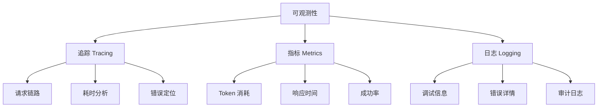
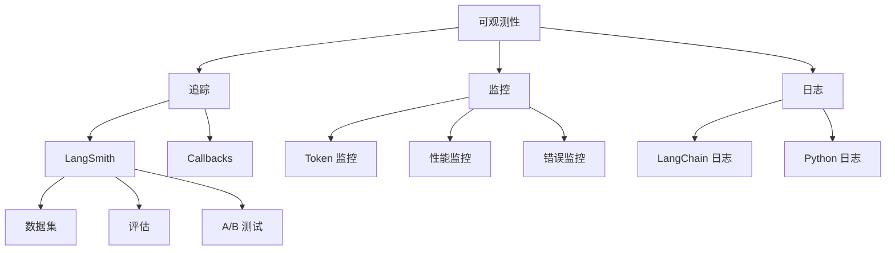

# 第 8 章 调试、监控与可观测性

在实际应用中，调试和监控 LLM 应用至关重要。本章将学习 LangChain 提供的调试工具和可观测性解决方案。

---

## 1. 为什么需要可观测性？

### 传统应用 vs LLM 应用

| 方面 | 传统应用 | LLM 应用 |
|------|----------|----------|
| 输入 | 确定的结构化数据 | 模糊的自然语言 |
| 输出 | 确定的结构化数据 | 不可预测的自然语言 |
| 调试 | 有明确的断点 | 黑盒、难以追踪 |
| 成本 | 相对稳定 | 按 token 计费，波动大 |
| 延迟 | 稳定 | 不稳定，取决于模型 |

### 可观测性的三大支柱



---

## 2. LangSmith 简介

### 什么是 LangSmith？

LangSmith 是 LangChain 官方提供的调试、监控和评估平台，提供：
- 请求追踪
- 性能分析
- Token 使用统计
- 错误日志
- 数据集管理
- 自动评估

### 安装和配置

```bash
pip install langsmith
```

```python
# .env 文件
LANGCHAIN_TRACING_V2=true
LANGCHAIN_API_KEY=ls__xxxxxxx  # 从 LangSmith 获取
LANGCHAIN_PROJECT=my-project    # 项目名称
LANGCHAIN_ENDPOINT=https://api.smith.langchain.com
```

### 基本使用

```python
from langchain_openai import ChatOpenAI

# 启用追踪
llm = ChatOpenAI(model="gpt-4o")

# 所有调用会自动追踪
response = llm.invoke("你好")

# 在 LangSmith 控制台查看追踪记录
```

### 追踪特定 Chain

```python
from langchain_openai import ChatOpenAI
from langchain_core.prompts import PromptTemplate
from langchain_core.output_parsers import StrOutputParser

llm = ChatOpenAI(model="gpt-4o")
prompt = PromptTemplate.from_template("用一句话解释{topic}")
parser = StrOutputParser()

chain = prompt | llm | parser

# 追踪
chain.invoke({"topic": "量子计算"})

# 在 LangSmith 中查看：
# 1. 完整的调用链路
# 2. 每个步骤的输入输出
# 3. Token 使用量
# 4. 耗时分析
```

---

## 3. Callbacks 机制

### 什么是 Callbacks？

Callbacks 允许你在 Chain 执行过程中的特定时刻插入自定义逻辑。

### 可用事件

| 事件 | 触发时机 |
|------|----------|
| `on_chain_start` | Chain 开始执行 |
| `on_chain_end` | Chain 执行完成 |
| `on_chain_error` | Chain 执行出错 |
| `on_llm_start` | LLM 调用开始 |
| `on_llm_end` | LLM 调用完成 |
| `on_tool_start` | 工具调用开始 |
| `on_tool_end` | 工具调用完成 |
| `on_chat_model_start` | Chat Model 调用开始 |
| `on_text` | 文本输出 |
| `on_agent_action` | Agent 执行动作 |
| `on_agent_finish` | Agent 执行完成 |

### 内置 Callback

```python
from langchain_core.callbacks import StdOutCallbackHandler, FileCallbackHandler
from langchain_openai import ChatOpenAI
from langchain_core.prompts import PromptTemplate
import logging

# 标准输出回调
handler = StdOutCallbackHandler()

chain = (
    PromptTemplate.from_template("解释{topic}")
    | ChatOpenAI(model="gpt-4o")
)

result = chain.invoke(
    {"topic": "机器学习"},
    config={"callbacks": [handler]}
)
```

### 自定义 Callback

```python
from langchain_core.callbacks import BaseCallbackHandler
from langchain_core.messages import BaseMessage
from typing import Any

class CustomCallbackHandler(BaseCallbackHandler):
    """自定义回调处理器"""

    def on_chain_start(
        self,
        serialized: dict,
        inputs: dict,
        **kwargs
    ):
        print(f"Chain 开始: {serialized.get('name', 'unknown')}")
        print(f"输入: {inputs}")

    def on_chain_end(
        self,
        outputs: dict,
        **kwargs
    ):
        print(f"Chain 完成")
        print(f"输出: {outputs}")

    def on_llm_start(
        self,
        serialized: dict,
        prompts: list,
        **kwargs
    ):
        print(f"LLM 调用开始")
        print(f"提示词: {prompts}")

    def on_llm_end(
        self,
        response: Any,
        **kwargs
    ):
        # 获取 token 使用情况
        if hasattr(response, "llm_output"):
            usage = response.llm_output.get("token_usage", {})
            print(f"Token 使用: {usage}")

    def on_llm_error(
        self,
        error: Exception,
        **kwargs
    ):
        print(f"LLM 错误: {error}")

    def on_tool_start(
        self,
        serialized: dict,
        input_str: str,
        **kwargs
    ):
        print(f"工具开始: {serialized.get('name', 'unknown')}")
        print(f"输入: {input_str}")

    def on_tool_end(
        self,
        output: str,
        **kwargs
    ):
        print(f"工具结果: {output}")

# 使用
handler = CustomCallbackHandler()

result = chain.invoke(
    {"topic": "Python"},
    config={"callbacks": [handler]}
)
```

### 多个 Callback 组合

```python
from langchain_core.callbacks import StdOutCallbackHandler
from langchain_core.callbacks import FileCallbackHandler
import logging

# 设置日志
logging.basicConfig(level=logging.INFO)
file_handler = FileCallbackHandler(logging.getLogger("my_app"))

# 组合多个 handler
handlers = [
    StdOutCallbackHandler(),
    file_handler
]

result = chain.invoke(
    {"topic": "测试"},
    config={"callbacks": handlers}
)
```

---

## 4. 流式输出

### 基本流式调用

```python
chain = (
    PromptTemplate.from_template("写一个关于{topic}的短故事")
    | ChatOpenAI(model="gpt-4o")
    | StrOutputParser()
)

# 流式获取
for token in chain.stream({"topic": "星际旅行"}):
    print(token, end="", flush=True)
```

### 带 Callback 的流式

```python
class StreamingCallback(BaseCallbackHandler):
    def on_llm_new_token(self, token: str, **kwargs):
        print(token, end="", flush=True)

handler = StreamingCallback()

chain.stream(
    {"topic": "人工智能"},
    config={"callbacks": [handler]}
)
```

### FastAPI 流式响应

```python
from fastapi import FastAPI
from fastapi.responses import StreamingResponse
from langchain_openai import ChatOpenAI
from langchain_core.prompts import PromptTemplate

app = FastAPI()

@app.get("/chat")
async def chat(topic: str):
    chain = (
        PromptTemplate.from_template("用诗歌介绍{topic}")
        | ChatOpenAI(model="gpt-4o")
    )

    async def event_stream():
        async for chunk in chain.astream({"topic": topic}):
            yield chunk

    return StreamingResponse(event_stream(), media_type="text/event-stream")

# 客户端可以通过 SSE 获取流式响应
```

---

## 5. Token 和成本追踪

### 手动追踪

```python
from langchain_openai import ChatOpenAI

llm = ChatOpenAI(model="gpt-4o")

response = llm.invoke("你好")

# 获取 token 使用
if hasattr(response, "response_metadata"):
    usage = response.response_metadata.get("token_usage", {})
    print(f"输入 tokens: {usage.get('prompt_tokens', 0)}")
    print(f"输出 tokens: {usage.get('completion_tokens', 0)}")
    print(f"总 tokens: {usage.get('total_tokens', 0)}")

# 计算成本
def calculate_cost(usage, model="gpt-4o"):
    # 2024年价格（每1000 tokens）
    prices = {
        "gpt-4o": {"input": 0.005, "output": 0.015},
        "gpt-4o-mini": {"input": 0.00015, "output": 0.0006},
        "gpt-4-turbo": {"input": 0.01, "output": 0.03}
    }
    p = prices.get(model, prices["gpt-4o"])
    cost = usage.get('prompt_tokens', 0) * p["input"] / 1000
    cost += usage.get('completion_tokens', 0) * p["output"] / 1000
    return cost

print(f"预估成本: ${calculate_cost(usage, 'gpt-4o'):.4f}")
```

### 使用 LangSmith 追踪

```python
from langsmith.client import Client
from datetime import datetime

client = Client()

# 获取项目统计数据
project_stats = client.get_project_stats(
    project_name="my-project",
    start_time=datetime.now().timestamp() - 86400 * 7  # 最近7天
)

print(f"总请求数: {project_stats.total_runs}")
print(f"总 Token 数: {project_stats.total_tokens}")
print(f"总成本: ${project_stats.total_cost:.2f}")
```

### Token 感知的 Prompt 优化

```python
import tiktoken

def count_tokens(text: str, model="gpt-4o") -> int:
    enc = tiktoken.encoding_for_model(model)
    return len(enc.encode(text))

def estimate_cost(text: str, model="gpt-4o") -> float:
    tokens = count_tokens(text, model)
    # 粗略估算（input = output）
    return tokens * 0.00001  # 约 $0.01/1K tokens

# 使用
prompt = "你的长提示词..."
print(f"预估 Token: {count_tokens(prompt)}")
print(f"预估成本: ${estimate_cost(prompt)}")
```

---

## 6. 错误处理与重试

### 基础错误处理

```python
from tenacity import retry, stop_after_attempt, wait_exponential

@retry(
    stop=stop_after_attempt(3),
    wait=wait_exponential(multiplier=1, min=2, max=10)
)
def call_llm_with_retry(prompt):
    try:
        return llm.invoke(prompt)
    except Exception as e:
        print(f"错误: {e}")
        raise  # 让 tenacity 处理重试

# 使用
result = call_llm_with_retry("你好")
```

### 带回调的错误处理

```python
from langchain_core.callbacks import BaseCallbackHandler

class ErrorTrackingCallback(BaseCallbackHandler):
    def __init__(self):
        self.errors = []

    def on_chain_error(self, error: Exception, **kwargs):
        self.errors.append({
            "error": str(error),
            "timestamp": datetime.now(),
            "inputs": kwargs.get("inputs", {})
        })

    def get_error_summary(self):
        return {
            "total_errors": len(self.errors),
            "common_errors": self._count_error_types()
        }
```

### Chain 中的错误处理

```python
from langchain_core.runnables import RunnableLambda
from langchain_core.output_parsers import StrOutputParser

def safe_invoke(chain, input_dict):
    """安全的 Chain 调用"""
    try:
        return chain.invoke(input_dict)
    except Exception as e:
        return {"error": str(e), "fallback": "默认回复"}

# 备用链
fallback_chain = (
    PromptTemplate.from_template("你遇到了一些问题，请稍后再试。")
    | ChatOpenAI(model="gpt-4o")
    | StrOutputParser()
)

# 在 LCEL 中组合
chain = (
    primary_chain
    | RunnableLambda(
        lambda x: x if not isinstance(x, dict) or "error" not in x else fallback_chain.invoke({})
    )
)
```

---

## 7. 性能监控

### 响应时间监控

```python
import time
from functools import wraps

def timing_decorator(func):
    @wraps(func)
    def wrapper(*args, **kwargs):
        start = time.time()
        result = func(*args, **kwargs)
        elapsed = time.time() - start
        print(f"{func.__name__} 执行时间: {elapsed:.2f}秒")
        return result
    return wrapper

@timing_decorator
def slow_operation():
    # 模拟慢操作
    time.sleep(1)
    return "完成"

# 使用
result = slow_operation()
```

### 综合监控 Callback

```python
from langchain_core.callbacks import BaseCallbackHandler
from datetime import datetime
import time

class MonitoringCallback(BaseCallbackHandler):
    def __init__(self):
        self.metrics = {
            "total_requests": 0,
            "total_tokens": 0,
            "total_cost": 0,
            "errors": 0,
            "latencies": []
        }

    def on_chain_start(self, serialized, inputs, **kwargs):
        self.metrics["total_requests"] += 1
        self._start_time = time.time()

    def on_chain_end(self, outputs, **kwargs):
        latency = time.time() - self._start_time
        self.metrics["latencies"].append(latency)

    def on_llm_end(self, response, **kwargs):
        if hasattr(response, "llm_output"):
            usage = response.llm_output.get("token_usage", {})
            self.metrics["total_tokens"] += usage.get("total_tokens", 0)

    def on_chain_error(self, error, **kwargs):
        self.metrics["errors"] += 1

    def get_metrics(self):
        avg_latency = sum(self.metrics["latencies"]) / len(self.metrics["latencies"]) if self.metrics["latencies"] else 0
        return {
            **self.metrics,
            "avg_latency": avg_latency,
            "error_rate": self.metrics["errors"] / max(self.metrics["total_requests"], 1)
        }

# 使用
monitor = MonitoringCallback()
chain.invoke({"topic": "测试"}, config={"callbacks": [monitor]})
print(monitor.get_metrics())
```

---

## 8. 生产环境最佳实践

### 环境配置

```python
import os
from typing import Optional

class Config:
    """生产环境配置"""

    # API 配置
    OPENAI_API_KEY: str = os.getenv("OPENAI_API_KEY", "")
    ANTHROPIC_API_KEY: str = os.getenv("ANTHROPIC_API_KEY", "")

    # LangSmith 配置
    LANGCHAIN_TRACING_V2: bool = os.getenv("LANGCHAIN_TRACING_V2", "false").lower() == "true"
    LANGCHAIN_API_KEY: str = os.getenv("LANGCHAIN_API_KEY", "")
    LANGCHAIN_PROJECT: str = os.getenv("LANGCHAIN_PROJECT", "production")

    # 性能配置
    MAX_TOKENS: int = int(os.getenv("MAX_TOKENS", "2000"))
    REQUEST_TIMEOUT: int = int(os.getenv("REQUEST_TIMEOUT", "60"))

    # 安全配置
    RATE_LIMIT: int = int(os.getenv("RATE_LIMIT", "100"))  # 每分钟请求数

config = Config()
```

### 健康检查

```python
from fastapi import FastAPI
from langchain_openai import ChatOpenAI

app = FastAPI()

@app.get("/health")
async def health_check():
    """健康检查端点"""
    checks = {
        "api": check_openai_connection(),
        "vectorstore": check_vectorstore_connection()
    }

    all_healthy = all(checks.values())
    return {
        "status": "healthy" if all_healthy else "unhealthy",
        "checks": checks
    }

def check_openai_connection() -> bool:
    try:
        llm = ChatOpenAI(model="gpt-4o-mini")
        llm.invoke("test")
        return True
    except Exception:
        return False
```

### 日志配置

```python
import logging
import sys

def setup_logging(level=logging.INFO):
    """配置日志"""
    logging.basicConfig(
        level=level,
        format="%(asctime)s - %(name)s - %(levelname)s - %(message)s",
        handlers=[
            logging.StreamHandler(sys.stdout),
            logging.FileHandler("app.log")
        ]
    )

    # LangChain 日志
    logging.getLogger("langchain").setLevel(logging.WARNING)
    logging.getLogger("openai").setLevel(logging.WARNING)

# 在应用启动时调用
setup_logging()
```

### 限流

```python
import time
from functools import wraps
from collections import defaultdict

class RateLimiter:
    def __init__(self, max_calls: int, period: int):
        self.max_calls = max_calls
        self.period = period
        self.calls = defaultdict(list)

    def is_allowed(self, key: str) -> bool:
        now = time.time()
        # 清理过期记录
        self.calls[key] = [
            t for t in self.calls[key]
            if now - t < self.period
        ]

        if len(self.calls[key]) >= self.max_calls:
            return False

        self.calls[key].append(now)
        return True

def rate_limit(max_calls: int, period: int):
    limiter = RateLimiter(max_calls, period)

    def decorator(func):
        @wraps(func)
        def wrapper(*args, **kwargs):
            key = kwargs.get("user_id", "default")
            if not limiter.is_allowed(key):
                raise Exception("Rate limit exceeded")
            return func(*args, **kwargs)
        return wrapper
    return decorator

# 使用
@rate_limit(max_calls=10, period=60)  # 每分钟10次
def chat(user_id: str, message: str):
    # 处理聊天请求
    pass
```

---

## 9. LangSmith 高级功能

### 数据集和评估

```python
from langsmith.client import Client

client = Client()

# 创建数据集
dataset = client.create_dataset(
    project_name="my-project",
    dataset_name="test-qa",
    description="测试问答数据集"
)

# 添加示例
client.create_examples(
    dataset_id=dataset.id,
    inputs=[
        {"question": "什么是 Python？"},
        {"question": "什么是闭包？"}
    ],
    outputs=[
        {"answer": "Python 是一种编程语言"},
        {"answer": "闭包是..."}
    ]
)

# 运行评估
def evaluate_response(run, example):
    # 自定义评估逻辑
    predicted = run.outputs.get("output", "")
    expected = example.outputs.get("answer", "")

    # 简单评估：检查关键词
    score = sum(1 for word in expected.split() if word in predicted) / len(expected.split())
    return {"score": score}

# 评估所有运行
results = client.evaluate(
    chain,
    dataset_name="test-qa",
    evaluation_config={"custom_evaluator": evaluate_response}
)
```

### A/B 测试

```python
# 部署两个版本的 Chain
chain_v1 = prompt_v1 | model | parser
chain_v2 = prompt_v2 | model | parser

# 在 LangSmith 中比较性能
# 查看两个版本的：
# - 响应质量
# - Token 消耗
# - 延迟
# - 用户满意度
```

---

## 10. 本章小结



**核心要点：**

1. **LangSmith** 提供完整的 LLM 应用调试和监控平台
2. **Callbacks** 机制让你可以监听和干预 Chain 执行过程
3. **流式输出** 提供更好的用户体验
4. **Token 追踪** 帮助控制成本
5. **错误处理和重试** 提高应用稳定性
6. **健康检查和限流** 是生产环境的必备功能

---

## 附录：调试清单

在部署生产环境前，确保检查：

- [ ] LangSmith 已配置并可追踪
- [ ] 所有 Chain 调用都配置了适当的 Callback
- [ ] Token 使用量有监控和告警
- [ ] 错误有详细的日志记录
- [ ] 实现重试机制
- [ ] 配置流式输出（如果适用）
- [ ] 设置限流保护
- [ ] 健康检查端点可用

---

**总结：** 本系列教程到此结束。通过这 8 章的学习，你应该已经掌握了：

1. 大模型基础概念
2. LangChain 入门和架构
3. Model I/O 组件
4. LCEL 表达式语言
5. 数据连接与 RAG
6. Memory 与 Chain
7. Tools 与 Agents
8. LangGraph 与多智能体
9. 调试、监控与可观测性