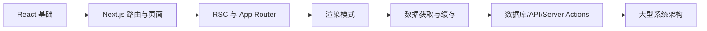
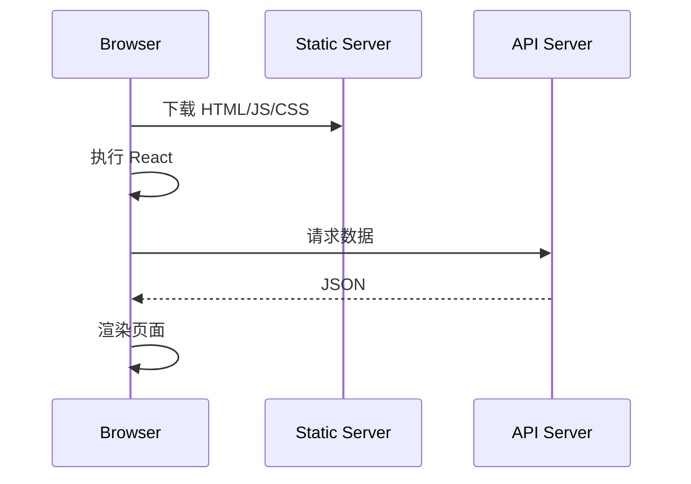
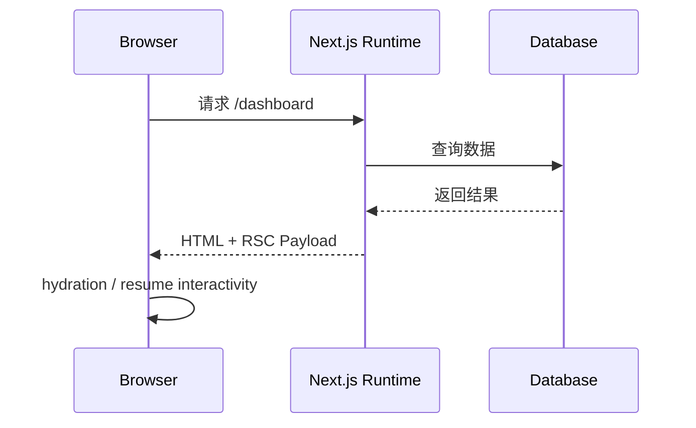
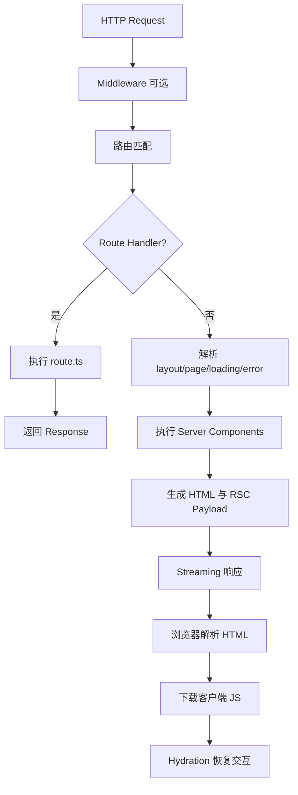
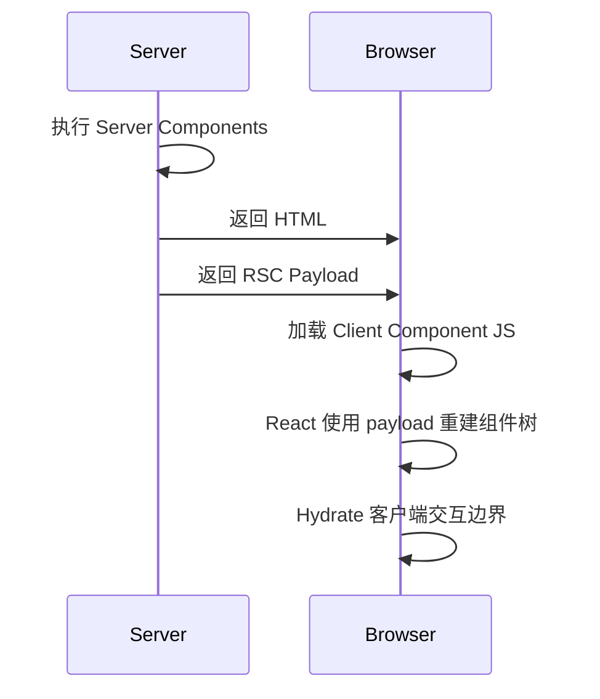

## Next.js 深度学习指南

> 基于 Next.js `16.2.7`，面向希望从“会用”进阶到“能独立设计现代 React 全栈系统”的学习者。
>
> 版本确认方式：`npm view next version`。官方参考：Next.js 文档、Next.js Support Policy、React Server Components 文档。

## 0. 学习路线总览

Next.js 不是“React 加路由”这么简单。它本质上是一个围绕 React 构建的全栈应用运行时：负责路由、构建、服务端渲染、静态生成、缓存、数据获取、服务端函数、边缘运行、资源优化和部署适配。

建议按这条路径学习：

1. React 渲染模型：组件、状态、服务端渲染、hydration。
2. Next.js 基础：项目结构、文件系统路由、页面、布局、样式、图片、字体。
3. App Router：Server Component、Client Component、layout、page、loading、error、route handler。
4. 渲染模式：SSR、SSG、ISR、Streaming、Partial Prerendering。
5. 数据与缓存：`fetch` 缓存、`revalidateTag`、`revalidatePath`、unstable cache、TanStack Query。
6. 服务端交互：Route Handlers、Server Actions、表单、鉴权、数据库。
7. 架构实践：模块化、类型安全、Prisma、API 设计、错误边界、性能优化。
8. 源码导向理解：请求如何进入、路由如何匹配、RSC payload 如何生成、客户端如何恢复交互。



## 1. Next.js 的架构角色

传统 React SPA 把大部分工作放在浏览器：



Next.js 把“页面生成”和“数据获取”的一部分前移到服务端或构建期：



这种设计带来几个关键能力：

- 首屏 HTML 可直接被搜索引擎和用户看到。
- 数据获取可以在服务端完成，减少客户端暴露的密钥和逻辑。
- 静态内容可以预渲染并放到 CDN。
- 动态内容可以流式返回，避免等整个页面完成再显示。
- React Server Components 让部分组件只在服务端执行，不进入客户端 JS bundle。

## 2. 安装与项目初始化

创建项目：

```bash
pnpm create next-app@latest next-deep-app
cd next-deep-app
pnpm dev
```

推荐选项：

```text
TypeScript: Yes
ESLint: Yes
Tailwind CSS: 根据项目需要
src directory: 推荐 Yes
App Router: Yes
Turbopack: Yes
Import alias: @/*
```

一个现代 Next.js 项目通常长这样：

```text
src/
  app/
    layout.tsx
    page.tsx
    loading.tsx
    error.tsx
    not-found.tsx
    api/
      health/
        route.ts
  components/
  features/
  lib/
  server/
  styles/
prisma/
public/
next.config.ts
package.json
tsconfig.json
```

核心文件：

- `app/layout.tsx`：根布局，定义 HTML 外壳。
- `app/page.tsx`：根路由页面。
- `app/**/page.tsx`：页面入口。
- `app/**/layout.tsx`：嵌套路由布局。
- `app/**/loading.tsx`：Suspense fallback。
- `app/**/error.tsx`：客户端错误边界。
- `app/**/route.ts`：HTTP API 路由处理器。

## 3. App Router 的第一性原理

App Router 的核心思想是：URL 路由树和 React 组件树同构。

例如：

```text
app/
  layout.tsx
  page.tsx
  dashboard/
    layout.tsx
    page.tsx
    settings/
      page.tsx
```

访问 `/dashboard/settings` 时，组件组合大致是：

```tsx
<RootLayout>
  <DashboardLayout>
    <SettingsPage />
  </DashboardLayout>
</RootLayout>
```

这带来两个重要收益：

- 布局天然可复用，页面切换时不必重新渲染整棵树。
- 每个路由段可以拥有自己的 loading、error、metadata 和缓存策略。

### 3.1 最小页面示例

```tsx
// src/app/page.tsx
export default function HomePage() {
  return (
    <main>
      <h1>Home</h1>
      <p>Rendered by Next.js App Router.</p>
    </main>
  );
}
```

默认情况下，App Router 中的组件是 Server Component。

这意味着：

- 可以直接在组件里 `await` 服务端数据。
- 不能使用 `useState`、`useEffect`、浏览器事件等客户端能力。
- 组件代码不会自动进入客户端 JS bundle。

### 3.2 Layout

```tsx
// src/app/layout.tsx
import type { ReactNode } from "react";
import "./globals.css";

export const metadata = {
  title: "Next Deep App",
  description: "A deep learning project for Next.js",
};

export default function RootLayout({ children }: { children: ReactNode }) {
  return (
    <html lang="zh-CN">
      <body>{children}</body>
    </html>
  );
}
```

layout 的职责不是“页面内容”，而是稳定外壳：导航、侧边栏、主题 Provider、全局样式和公共结构。

## 4. Server Component 与 Client Component

React Server Components 解决的不是“能不能 SSR”，而是“哪些组件根本不需要发给浏览器”。

### 4.1 Server Component

```tsx
// src/app/posts/page.tsx
import { db } from "@/server/db";

export default async function PostsPage() {
  const posts = await db.post.findMany({
    orderBy: { createdAt: "desc" },
  });

  return (
    <main>
      <h1>文章</h1>
      <ul>
        {posts.map((post) => (
          <li key={post.id}>{post.title}</li>
        ))}
      </ul>
    </main>
  );
}
```

它适合：

- 数据查询。
- 读取文件系统、环境变量、数据库。
- 组装页面结构。
- 输出不需要浏览器交互的 UI。

### 4.2 Client Component

```tsx
// src/components/like-button.tsx
"use client";

import { useState } from "react";

export function LikeButton({ initialCount }: { initialCount: number }) {
  const [count, setCount] = useState(initialCount);

  return (
    <button type="button" onClick={() => setCount((value) => value + 1)}>
      Like {count}
    </button>
  );
}
```

只要文件顶部写了 `"use client"`，该模块以及它导入的客户端依赖都会进入客户端边界。

### 4.3 组合原则

推荐结构是：Server Component 做数据和外壳，Client Component 做局部交互。

```tsx
// src/app/posts/[id]/page.tsx
import { LikeButton } from "@/components/like-button";
import { db } from "@/server/db";

export default async function PostPage({
  params,
}: {
  params: Promise<{ id: string }>;
}) {
  const { id } = await params;
  const post = await db.post.findUniqueOrThrow({ where: { id } });

  return (
    <article>
      <h1>{post.title}</h1>
      <p>{post.content}</p>
      <LikeButton initialCount={post.likes} />
    </article>
  );
}
```

设计原则：

- 尽量把 `"use client"` 放在叶子节点。
- 不要把整个页面都变成 Client Component。
- Client Component 的 props 必须可序列化。
- Server Component 可以导入 Client Component，Client Component 不能直接导入 Server Component。


## 5. 路由系统

### 5.1 静态路由

```text
app/about/page.tsx -> /about
app/docs/page.tsx  -> /docs
```

### 5.2 动态路由

```text
app/posts/[id]/page.tsx -> /posts/123
```

```tsx
// src/app/posts/[id]/page.tsx
export default async function Page({
  params,
}: {
  params: Promise<{ id: string }>;
}) {
  const { id } = await params;
  return <h1>Post {id}</h1>;
}
```

### 5.3 捕获路由

```text
app/docs/[...slug]/page.tsx      -> /docs/a, /docs/a/b
app/docs/[[...slug]]/page.tsx    -> /docs, /docs/a, /docs/a/b
```

```tsx
export default async function DocsPage({
  params,
}: {
  params: Promise<{ slug?: string[] }>;
}) {
  const { slug = [] } = await params;
  return <pre>{JSON.stringify(slug, null, 2)}</pre>;
}
```

### 5.4 Route Groups

```text
app/
  (marketing)/
    page.tsx
    pricing/page.tsx
  (dashboard)/
    dashboard/page.tsx
```

括号目录不会出现在 URL 中。它用于组织代码和拆分 layout。

### 5.5 Parallel Routes

```text
app/dashboard/
  layout.tsx
  @analytics/page.tsx
  @activity/page.tsx
```

```tsx
// src/app/dashboard/layout.tsx
import type { ReactNode } from "react";

export default function DashboardLayout({
  analytics,
  activity,
}: {
  analytics: ReactNode;
  activity: ReactNode;
}) {
  return (
    <main>
      <section>{analytics}</section>
      <aside>{activity}</aside>
    </main>
  );
}
```

适合复杂仪表盘、弹窗层、主从视图。

### 5.6 Intercepting Routes

拦截路由常用于“列表页打开详情弹窗，同时刷新后又能进入独立详情页”。

```text
app/photos/page.tsx
app/photos/[id]/page.tsx
app/photos/@modal/(.)[id]/page.tsx
```

核心思想：同一个资源根据导航上下文渲染为 modal 或完整页面。

## 6. Pages Router 与 App Router 对比

Pages Router：

```text
pages/
  index.tsx
  posts/[id].tsx
  api/hello.ts
```

App Router：

```text
app/
  page.tsx
  posts/[id]/page.tsx
  api/hello/route.ts
```

| 维度 | Pages Router | App Router |
| --- | --- | --- |
| 路由单位 | 文件即页面 | 目录段 + 特殊文件 |
| 数据获取 | `getServerSideProps` / `getStaticProps` | Server Component `await` / `fetch` |
| 布局 | 自己组合或 `_app` | 原生嵌套 layout |
| RSC | 不支持 | 默认支持 |
| Streaming | 支持有限 | 原生支持 |
| API | `pages/api/*` | `app/**/route.ts` |

什么时候还会遇到 Pages Router？

- 老项目维护。
- 某些迁移中的代码库。
- 对 `_app.tsx`、`getServerSideProps` 已有大量依赖的系统。

新项目通常优先 App Router。

## 7. 渲染模式：SSR、SSG、ISR、RSC、Streaming

### 7.1 SSR

SSR 是每次请求都在服务端生成 HTML。

适合：

- 用户个性化页面。
- 强实时数据。
- 依赖 cookie/session 的页面。

```tsx
// src/app/profile/page.tsx
import { cookies } from "next/headers";

export default async function ProfilePage() {
  const cookieStore = await cookies();
  const token = cookieStore.get("session")?.value;

  const user = await fetch("https://api.example.com/me", {
    headers: { Authorization: `Bearer ${token}` },
    cache: "no-store",
  }).then((res) => res.json());

  return <h1>{user.name}</h1>;
}
```

`cache: "no-store"` 表示这个请求不走持久缓存，页面会倾向动态渲染。

### 7.2 SSG

SSG 是构建时生成 HTML。

适合：

- 文档站。
- 营销页。
- 变化不频繁的文章。

```tsx
// src/app/blog/[slug]/page.tsx
import { getPost, getPostSlugs } from "@/server/posts";

export async function generateStaticParams() {
  const slugs = await getPostSlugs();
  return slugs.map((slug) => ({ slug }));
}

export default async function BlogPostPage({
  params,
}: {
  params: Promise<{ slug: string }>;
}) {
  const { slug } = await params;
  const post = await getPost(slug);

  return (
    <article>
      <h1>{post.title}</h1>
      <div>{post.content}</div>
    </article>
  );
}
```

### 7.3 ISR

ISR 是静态生成和按需更新之间的折中。

```tsx
// src/app/products/page.tsx
export const revalidate = 60;

export default async function ProductsPage() {
  const products = await fetch("https://api.example.com/products").then((res) =>
    res.json()
  );

  return (
    <ul>
      {products.map((product: { id: string; name: string }) => (
        <li key={product.id}>{product.name}</li>
      ))}
    </ul>
  );
}
```

含义：页面可以被缓存，最多 60 秒后重新生成。

### 7.4 Streaming

Streaming 的关键不是“更快完成”，而是“更早显示可用部分”。

```tsx
// src/app/dashboard/page.tsx
import { Suspense } from "react";
import { RevenueChart } from "./revenue-chart";
import { SlowReport } from "./slow-report";

export default function DashboardPage() {
  return (
    <main>
      <RevenueChart />
      <Suspense fallback={<p>报告加载中...</p>}>
        <SlowReport />
      </Suspense>
    </main>
  );
}
```

```tsx
// src/app/dashboard/slow-report.tsx
export async function SlowReport() {
  const report = await fetch("https://api.example.com/report").then((res) =>
    res.json()
  );

  return <pre>{JSON.stringify(report, null, 2)}</pre>;
}
```

`loading.tsx` 是路由级 Suspense fallback：

```tsx
// src/app/dashboard/loading.tsx
export default function Loading() {
  return <p>仪表盘加载中...</p>;
}
```

## 8. 请求处理流程

App Router 请求大致经历这些阶段：



源码导向理解：

- 路由树来自 `app` 目录的静态分析。
- Server Component 在服务端渲染为一种可传输描述，通常称为 RSC Payload 或 Flight 数据。
- 浏览器先获得 HTML，用于首屏显示。
- 客户端 React 再根据 payload 和客户端组件 bundle 恢复可交互区域。
- Client Component 不是重新“服务端执行”，而是在浏览器 hydration 后接管事件。

## 9. Hydration 与 RSC Payload

SSR 和 hydration 的经典问题是：服务端生成 HTML，客户端再次执行 React，二者必须匹配。

RSC 引入后，流程更细：



常见 hydration 错误来源：

- 服务端和客户端渲染出不同文本，比如 `new Date()`。
- 在渲染期间读取 `window`、`localStorage`。
- HTML 标签嵌套不合法。
- 客户端状态初始值和服务端输出不一致。

错误示例：

```tsx
export function Clock() {
  return <p>{new Date().toLocaleString()}</p>;
}
```

修复：

```tsx
"use client";

import { useEffect, useState } from "react";

export function Clock() {
  const [time, setTime] = useState<string | null>(null);

  useEffect(() => {
    setTime(new Date().toLocaleString());
  }, []);

  return <p>{time ?? "..."}</p>;
}
```

## 10. 数据获取与缓存

Next.js 的数据缓存不是单一开关，而是由多个层次组成：

- 请求级 memoization：同一次渲染中相同 `fetch` 可复用。
- Data Cache：跨请求缓存服务端数据。
- Full Route Cache：缓存整条静态路由输出。
- Router Cache：客户端缓存已访问的路由段。

### 10.1 `fetch` 缓存

默认可缓存：

```tsx
const posts = await fetch("https://api.example.com/posts").then((res) =>
  res.json()
);
```

强制动态：

```tsx
const posts = await fetch("https://api.example.com/posts", {
  cache: "no-store",
}).then((res) => res.json());
```

设置再验证时间：

```tsx
const posts = await fetch("https://api.example.com/posts", {
  next: { revalidate: 300 },
}).then((res) => res.json());
```

设置 tag：

```tsx
const posts = await fetch("https://api.example.com/posts", {
  next: { tags: ["posts"] },
}).then((res) => res.json());
```

### 10.2 按 tag 失效缓存

```tsx
// src/app/actions.ts
"use server";

import { revalidateTag } from "next/cache";

export async function createPost(formData: FormData) {
  const title = String(formData.get("title") ?? "");

  await fetch("https://api.example.com/posts", {
    method: "POST",
    body: JSON.stringify({ title }),
    headers: { "Content-Type": "application/json" },
  });

  revalidateTag("posts");
}
```

### 10.3 按 path 失效缓存

```tsx
"use server";

import { revalidatePath } from "next/cache";

export async function updateSettings() {
  await saveSettings();
  revalidatePath("/dashboard/settings");
}
```

选择建议：

- 资源集合变化：优先 `revalidateTag("posts")`。
- 某个页面必须刷新：使用 `revalidatePath("/somewhere")`。
- 用户私有数据：通常 `cache: "no-store"` 或结合 session 做隔离。

## 11. Server Actions

Server Actions 让表单和服务端逻辑更接近 React 组件。

```tsx
// src/app/posts/new/actions.ts
"use server";

import { revalidatePath } from "next/cache";
import { redirect } from "next/navigation";
import { db } from "@/server/db";

export async function createPost(formData: FormData) {
  const title = String(formData.get("title") ?? "").trim();
  const content = String(formData.get("content") ?? "").trim();

  if (!title) {
    throw new Error("Title is required");
  }

  const post = await db.post.create({
    data: { title, content },
  });

  revalidatePath("/posts");
  redirect(`/posts/${post.id}`);
}
```

```tsx
// src/app/posts/new/page.tsx
import { createPost } from "./actions";

export default function NewPostPage() {
  return (
    <form action={createPost}>
      <input name="title" placeholder="标题" />
      <textarea name="content" placeholder="内容" />
      <button type="submit">创建</button>
    </form>
  );
}
```

工程注意点：

- Server Action 是服务端入口，必须做鉴权和数据校验。
- 不要相信客户端传来的 userId、role、price 等敏感字段。
- 推荐用 Zod 做表单校验。

```ts
// src/features/posts/schema.ts
import { z } from "zod";

export const createPostSchema = z.object({
  title: z.string().min(1).max(100),
  content: z.string().min(1),
});
```

```tsx
"use server";

import { createPostSchema } from "@/features/posts/schema";

export async function createPost(formData: FormData) {
  const input = createPostSchema.parse({
    title: formData.get("title"),
    content: formData.get("content"),
  });

  await db.post.create({ data: input });
}
```

## 12. Route Handlers 与 API 设计

App Router 中的 API 路由使用 `route.ts`。

```ts
// src/app/api/health/route.ts
import { NextResponse } from "next/server";

export function GET() {
  return NextResponse.json({ ok: true });
}
```

REST 示例：

```ts
// src/app/api/posts/route.ts
import { NextRequest, NextResponse } from "next/server";
import { z } from "zod";
import { db } from "@/server/db";

const createPostSchema = z.object({
  title: z.string().min(1),
  content: z.string().min(1),
});

export async function GET() {
  const posts = await db.post.findMany({
    orderBy: { createdAt: "desc" },
  });

  return NextResponse.json({ posts });
}

export async function POST(request: NextRequest) {
  const json = await request.json();
  const input = createPostSchema.parse(json);

  const post = await db.post.create({ data: input });

  return NextResponse.json({ post }, { status: 201 });
}
```

动态 API：

```ts
// src/app/api/posts/[id]/route.ts
import { NextResponse } from "next/server";
import { db } from "@/server/db";

export async function GET(
  _request: Request,
  { params }: { params: Promise<{ id: string }> }
) {
  const { id } = await params;
  const post = await db.post.findUnique({ where: { id } });

  if (!post) {
    return NextResponse.json({ error: "Not found" }, { status: 404 });
  }

  return NextResponse.json({ post });
}
```

Route Handler 适合：

- 给第三方客户端提供 HTTP API。
- Webhook。
- 文件上传下载。
- 非 React 页面请求。

如果只是页面内表单提交，Server Actions 往往更直接。

## 13. Middleware

Middleware 在路由处理前执行，常用于鉴权、重定向、A/B 测试、国际化。

```ts
// middleware.ts
import { NextRequest, NextResponse } from "next/server";

export function middleware(request: NextRequest) {
  const token = request.cookies.get("session")?.value;
  const isDashboard = request.nextUrl.pathname.startsWith("/dashboard");

  if (isDashboard && !token) {
    const loginUrl = new URL("/login", request.url);
    loginUrl.searchParams.set("next", request.nextUrl.pathname);
    return NextResponse.redirect(loginUrl);
  }

  return NextResponse.next();
}

export const config = {
  matcher: ["/dashboard/:path*"],
};
```

注意：

- Middleware 应保持轻量。
- 不适合执行复杂数据库查询。
- 对性能敏感，尤其在边缘运行时。

## 14. 错误处理

### 14.1 `notFound`

```tsx
// src/app/posts/[id]/page.tsx
import { notFound } from "next/navigation";
import { db } from "@/server/db";

export default async function PostPage({
  params,
}: {
  params: Promise<{ id: string }>;
}) {
  const { id } = await params;
  const post = await db.post.findUnique({ where: { id } });

  if (!post) {
    notFound();
  }

  return <h1>{post.title}</h1>;
}
```

```tsx
// src/app/posts/[id]/not-found.tsx
export default function PostNotFound() {
  return <p>文章不存在。</p>;
}
```

### 14.2 `error.tsx`

```tsx
// src/app/dashboard/error.tsx
"use client";

export default function DashboardError({
  error,
  reset,
}: {
  error: Error;
  reset: () => void;
}) {
  return (
    <section>
      <h2>加载失败</h2>
      <p>{error.message}</p>
      <button type="button" onClick={reset}>
        重试
      </button>
    </section>
  );
}
```

`error.tsx` 必须是 Client Component，因为它需要处理用户点击 `reset`。

### 14.3 API 错误响应

```ts
import { NextResponse } from "next/server";
import { ZodError } from "zod";

export function toApiError(error: unknown) {
  if (error instanceof ZodError) {
    return NextResponse.json(
      { error: "Invalid input", issues: error.issues },
      { status: 400 }
    );
  }

  return NextResponse.json({ error: "Internal server error" }, { status: 500 });
}
```

## 15. Metadata 与 SEO

静态 metadata：

```tsx
// src/app/layout.tsx
export const metadata = {
  title: {
    default: "Acme",
    template: "%s | Acme",
  },
  description: "Acme content platform",
};
```

动态 metadata：

```tsx
// src/app/posts/[slug]/page.tsx
import type { Metadata } from "next";
import { getPost } from "@/server/posts";

export async function generateMetadata({
  params,
}: {
  params: Promise<{ slug: string }>;
}): Promise<Metadata> {
  const { slug } = await params;
  const post = await getPost(slug);

  return {
    title: post.title,
    description: post.excerpt,
  };
}
```

## 16. 图片、字体与资源优化

### 16.1 Image

```tsx
import Image from "next/image";

export function Avatar({ src, name }: { src: string; name: string }) {
  return (
    <Image
      src={src}
      alt={name}
      width={80}
      height={80}
      priority={false}
    />
  );
}
```

远程图片需要配置：

```ts
// next.config.ts
import type { NextConfig } from "next";

const nextConfig: NextConfig = {
  images: {
    remotePatterns: [
      {
        protocol: "https",
        hostname: "images.example.com",
      },
    ],
  },
};

export default nextConfig;
```

### 16.2 Font

```tsx
// src/app/layout.tsx
import { Inter } from "next/font/google";

const inter = Inter({
  subsets: ["latin"],
  display: "swap",
});

export default function RootLayout({ children }: { children: React.ReactNode }) {
  return (
    <html lang="en" className={inter.className}>
      <body>{children}</body>
    </html>
  );
}
```

## 17. Prisma 集成

安装：

```bash
pnpm add prisma @prisma/client
pnpm prisma init
```

模型：

```prisma
// prisma/schema.prisma
model Post {
  id        String   @id @default(cuid())
  title     String
  content   String
  createdAt DateTime @default(now())
  updatedAt DateTime @updatedAt
}
```

Prisma Client 单例：

```ts
// src/server/db.ts
import { PrismaClient } from "@prisma/client";

const globalForPrisma = globalThis as unknown as {
  prisma?: PrismaClient;
};

export const db =
  globalForPrisma.prisma ??
  new PrismaClient({
    log: process.env.NODE_ENV === "development" ? ["query", "error"] : ["error"],
  });

if (process.env.NODE_ENV !== "production") {
  globalForPrisma.prisma = db;
}
```

在 Server Component 中查询：

```tsx
// src/app/posts/page.tsx
import { db } from "@/server/db";

export default async function PostsPage() {
  const posts = await db.post.findMany();
  return <pre>{JSON.stringify(posts, null, 2)}</pre>;
}
```

架构建议：

- `src/server/db.ts`：数据库连接。
- `src/features/posts/repository.ts`：数据访问封装。
- `src/features/posts/service.ts`：业务规则。
- `src/app/**`：路由和 UI 组合。

```ts
// src/features/posts/repository.ts
import { db } from "@/server/db";

export function findLatestPosts() {
  return db.post.findMany({
    orderBy: { createdAt: "desc" },
    take: 20,
  });
}
```

```ts
// src/features/posts/service.ts
import { findLatestPosts } from "./repository";

export async function listPostsForHomePage() {
  const posts = await findLatestPosts();
  return posts.map((post) => ({
    id: post.id,
    title: post.title,
    createdAt: post.createdAt,
  }));
}
```

## 18. TanStack Query 与 Next.js

Server Component 已经能做大量数据获取。TanStack Query 适合客户端交互密集场景：

- 搜索、筛选、分页。
- 乐观更新。
- 客户端缓存。
- 多次交互后局部刷新。

安装：

```bash
pnpm add @tanstack/react-query
```

Provider：

```tsx
// src/providers/query-provider.tsx
"use client";

import { QueryClient, QueryClientProvider } from "@tanstack/react-query";
import { useState } from "react";

export function QueryProvider({ children }: { children: React.ReactNode }) {
  const [client] = useState(() => new QueryClient());

  return <QueryClientProvider client={client}>{children}</QueryClientProvider>;
}
```

放入 layout：

```tsx
// src/app/layout.tsx
import { QueryProvider } from "@/providers/query-provider";

export default function RootLayout({ children }: { children: React.ReactNode }) {
  return (
    <html lang="zh-CN">
      <body>
        <QueryProvider>{children}</QueryProvider>
      </body>
    </html>
  );
}
```

客户端查询：

```tsx
// src/features/posts/post-search.tsx
"use client";

import { useQuery } from "@tanstack/react-query";

async function searchPosts(keyword: string) {
  const res = await fetch(`/api/posts/search?q=${encodeURIComponent(keyword)}`);
  if (!res.ok) throw new Error("Search failed");
  return res.json() as Promise<{ posts: { id: string; title: string }[] }>;
}

export function PostSearch({ keyword }: { keyword: string }) {
  const query = useQuery({
    queryKey: ["posts", "search", keyword],
    queryFn: () => searchPosts(keyword),
    enabled: keyword.length > 0,
  });

  if (query.isLoading) return <p>搜索中...</p>;
  if (query.isError) return <p>搜索失败。</p>;

  return (
    <ul>
      {query.data?.posts.map((post) => (
        <li key={post.id}>{post.title}</li>
      ))}
    </ul>
  );
}
```

经验判断：

- 首屏数据：优先 Server Component。
- 浏览器内高频交互：TanStack Query。
- 跨页面公共数据：看是否用户私有，以及是否需要实时一致。

## 19. 类型安全 API

Route Handler 的问题是：HTTP 边界天然会丢失类型。推荐用 schema 作为运行时和编译时的共同边界。

```ts
// src/features/posts/contracts.ts
import { z } from "zod";

export const postDtoSchema = z.object({
  id: z.string(),
  title: z.string(),
  createdAt: z.string(),
});

export const listPostsResponseSchema = z.object({
  posts: z.array(postDtoSchema),
});

export type ListPostsResponse = z.infer<typeof listPostsResponseSchema>;
```

服务端：

```ts
import { NextResponse } from "next/server";
import type { ListPostsResponse } from "@/features/posts/contracts";

export async function GET() {
  const response: ListPostsResponse = {
    posts: [{ id: "1", title: "Hello", createdAt: new Date().toISOString() }],
  };

  return NextResponse.json(response);
}
```

客户端：

```ts
import {
  listPostsResponseSchema,
  type ListPostsResponse,
} from "@/features/posts/contracts";

export async function fetchPosts(): Promise<ListPostsResponse> {
  const res = await fetch("/api/posts");
  const json = await res.json();
  return listPostsResponseSchema.parse(json);
}
```

如果系统足够复杂，可以考虑 tRPC、Hono RPC、OpenAPI Codegen 或 GraphQL。但不要为了类型安全牺牲边界清晰度。

## 20. 鉴权与安全

常见鉴权层次：

- Middleware：粗粒度保护路由。
- Server Component：读取 session，决定页面内容。
- Server Action / Route Handler：执行写操作前做强校验。
- 数据层：按当前用户过滤数据。

示例：

```ts
// src/server/auth.ts
import { cookies } from "next/headers";
import { redirect } from "next/navigation";

export async function getCurrentUser() {
  const cookieStore = await cookies();
  const token = cookieStore.get("session")?.value;

  if (!token) return null;

  return verifySessionToken(token);
}

export async function requireUser() {
  const user = await getCurrentUser();

  if (!user) {
    redirect("/login");
  }

  return user;
}
```

```tsx
// src/app/dashboard/page.tsx
import { requireUser } from "@/server/auth";

export default async function DashboardPage() {
  const user = await requireUser();
  return <h1>{user.name} 的工作台</h1>;
}
```

安全原则：

- 写操作必须在服务端重新判断权限。
- 不把服务端密钥暴露给 `NEXT_PUBLIC_*`。
- 不在 Client Component 中导入数据库、私钥、服务端 SDK。
- Webhook 要校验签名。
- API 错误不要泄漏堆栈和敏感字段。

## 21. 环境变量

```env
DATABASE_URL="postgresql://..."
AUTH_SECRET="..."
NEXT_PUBLIC_APP_URL="http://localhost:3000"
```

规则：

- 无前缀变量只应在服务端使用。
- `NEXT_PUBLIC_` 会进入客户端 bundle。
- 类型安全可以配合 Zod。

```ts
// src/server/env.ts
import { z } from "zod";

const envSchema = z.object({
  DATABASE_URL: z.string().url(),
  AUTH_SECRET: z.string().min(32),
  NEXT_PUBLIC_APP_URL: z.string().url(),
});

export const env = envSchema.parse(process.env);
```

## 22. 性能优化

### 22.1 减少客户端 JS

优先 Server Component，把交互组件局部化。

不推荐：

```tsx
"use client";

export default function EntireDashboard() {
  return <div>大量静态内容和少量按钮</div>;
}
```

推荐：

```tsx
import { RefreshButton } from "./refresh-button";

export default function DashboardPage() {
  return (
    <main>
      <h1>Dashboard</h1>
      <StaticReport />
      <RefreshButton />
    </main>
  );
}
```

### 22.2 动态导入

```tsx
"use client";

import dynamic from "next/dynamic";

const HeavyEditor = dynamic(() => import("./heavy-editor"), {
  ssr: false,
  loading: () => <p>编辑器加载中...</p>,
});

export function EditorShell() {
  return <HeavyEditor />;
}
```

### 22.3 缓存策略

| 场景 | 推荐策略 |
| --- | --- |
| 文档页 | SSG |
| 商品列表 | ISR + tag |
| 用户订单 | SSR / no-store |
| 搜索页 | Client Query + API |
| 后台报表 | Streaming + 局部缓存 |

## 23. 大型项目模块化

推荐按功能域组织，而不是按技术类型无限堆叠。

```text
src/
  app/
    dashboard/
      page.tsx
    posts/
      page.tsx
      [id]/page.tsx
  features/
    posts/
      components/
      contracts.ts
      repository.ts
      service.ts
      actions.ts
      schema.ts
    users/
  server/
    db.ts
    auth.ts
  shared/
    ui/
    utils/
```

分层建议：

- `app`：路由、页面组合、metadata、layout、loading、error。
- `features/*/components`：业务 UI。
- `features/*/actions.ts`：业务写操作。
- `features/*/repository.ts`：数据库访问。
- `features/*/service.ts`：业务规则。
- `features/*/contracts.ts`：跨边界 DTO 和 schema。
- `server`：基础设施能力。
- `shared`：无业务归属的公共代码。

避免：

- 所有 API 都塞进 `app/api` 里写完业务。
- 所有组件都放 `components`，最后变成无法治理的抽屉。
- 在页面组件里堆数据库、权限、校验和 UI。

## 24. 一个完整工程案例：文章系统

目标：

- 首页展示最新文章。
- 详情页静态生成并 ISR。
- 后台创建文章。
- 创建后刷新文章列表和详情。

### 24.1 Prisma 模型

```prisma
model Post {
  id        String   @id @default(cuid())
  slug      String   @unique
  title     String
  content   String
  published Boolean  @default(false)
  createdAt DateTime @default(now())
  updatedAt DateTime @updatedAt
}
```

### 24.2 Repository

```ts
// src/features/posts/repository.ts
import { db } from "@/server/db";

export function findPublishedPosts() {
  return db.post.findMany({
    where: { published: true },
    orderBy: { createdAt: "desc" },
    select: {
      id: true,
      slug: true,
      title: true,
      createdAt: true,
    },
  });
}

export function findPostBySlug(slug: string) {
  return db.post.findUnique({
    where: { slug },
  });
}

export function createPost(data: {
  slug: string;
  title: string;
  content: string;
}) {
  return db.post.create({
    data: {
      ...data,
      published: true,
    },
  });
}
```

### 24.3 页面

```tsx
// src/app/posts/page.tsx
import Link from "next/link";
import { findPublishedPosts } from "@/features/posts/repository";

export const revalidate = 300;

export default async function PostsPage() {
  const posts = await findPublishedPosts();

  return (
    <main>
      <h1>文章</h1>
      <ul>
        {posts.map((post) => (
          <li key={post.id}>
            <Link href={`/posts/${post.slug}`}>{post.title}</Link>
          </li>
        ))}
      </ul>
    </main>
  );
}
```

```tsx
// src/app/posts/[slug]/page.tsx
import { notFound } from "next/navigation";
import { findPostBySlug, findPublishedPosts } from "@/features/posts/repository";

export const revalidate = 300;

export async function generateStaticParams() {
  const posts = await findPublishedPosts();
  return posts.map((post) => ({ slug: post.slug }));
}

export default async function PostPage({
  params,
}: {
  params: Promise<{ slug: string }>;
}) {
  const { slug } = await params;
  const post = await findPostBySlug(slug);

  if (!post || !post.published) {
    notFound();
  }

  return (
    <article>
      <h1>{post.title}</h1>
      <div>{post.content}</div>
    </article>
  );
}
```

### 24.4 创建文章

```tsx
// src/app/admin/posts/new/actions.ts
"use server";

import { revalidatePath } from "next/cache";
import { redirect } from "next/navigation";
import { z } from "zod";
import { createPost } from "@/features/posts/repository";
import { requireUser } from "@/server/auth";

const schema = z.object({
  title: z.string().min(1).max(100),
  slug: z.string().min(1).regex(/^[a-z0-9-]+$/),
  content: z.string().min(1),
});

export async function publishPost(formData: FormData) {
  await requireUser();

  const input = schema.parse({
    title: formData.get("title"),
    slug: formData.get("slug"),
    content: formData.get("content"),
  });

  const post = await createPost(input);

  revalidatePath("/posts");
  revalidatePath(`/posts/${post.slug}`);
  redirect(`/posts/${post.slug}`);
}
```

```tsx
// src/app/admin/posts/new/page.tsx
import { publishPost } from "./actions";

export default function NewPostPage() {
  return (
    <form action={publishPost}>
      <input name="title" placeholder="标题" />
      <input name="slug" placeholder="slug" />
      <textarea name="content" placeholder="正文" />
      <button type="submit">发布</button>
    </form>
  );
}
```

## 25. 源码导向：Next.js 为什么这样设计

### 25.1 文件系统路由

文件系统路由的本质是把“路由配置”从手写对象变成目录结构。这样框架可以在构建期做静态分析：

- 找到页面入口。
- 找到 layout、loading、error 等特殊文件。
- 推导路由段。
- 生成客户端导航所需的路由清单。
- 判断哪些路由可能静态化。

代价是：项目结构本身变成架构约束。好处是大型项目的路由边界更可见。

### 25.2 Server Component

传统 SSR 的问题：

- 组件代码通常仍然要发到客户端。
- 数据获取和组件树之间的关系不够自然。
- 服务端渲染完成后客户端还要承担大量恢复工作。

RSC 的设计目标：

- 让不需要交互的组件只在服务端执行。
- 允许组件直接读取服务端数据。
- 把客户端 JS 控制在真正需要交互的边界。

### 25.3 缓存为何复杂

Next.js 同时支持：

- 构建期页面。
- 请求期页面。
- 部分静态、部分动态。
- 用户私有数据。
- 公共数据缓存。
- 客户端路由预取。

因此它需要多层缓存，而不是一个简单的 `cache: true`。

理解缓存的关键问题：

1. 这份数据是否和用户身份相关？
2. 数据多久可以过期？
3. 页面变化后需要刷新哪个范围？
4. 刷新应该按资源 tag，还是按页面 path？
5. 是否允许用户先看到旧数据，再后台更新？

## 26. 常见场景架构选择

### 26.1 SaaS 后台

推荐：

- App Router。
- Server Component 获取首屏数据。
- TanStack Query 处理筛选、分页、局部刷新。
- Prisma 或 ORM 管理数据库。
- Middleware 做粗粒度登录保护。
- Server Action 做表单写操作。

### 26.2 内容站

推荐：

- SSG / ISR。
- `generateStaticParams`。
- Metadata API。
- 图片优化。
- tag 或 path revalidation。

### 26.3 电商

推荐：

- 商品详情 ISR。
- 库存和价格动态校验。
- 购物车 Client Component。
- 下单 Route Handler / Server Action。
- 支付 webhook 使用 Route Handler。

### 26.4 管理后台

推荐：

- SSR 获取权限敏感数据。
- Streaming 分块加载报表。
- 客户端表格用 TanStack Query。
- 操作后 `router.refresh()` 或失效 Query。

## 27. 常用命令

```bash
pnpm dev
pnpm build
pnpm start
pnpm lint
pnpm prisma migrate dev
pnpm prisma generate
```

查看 Next.js 版本：

```bash
npm view next version
```

安装指定版本：

```bash
pnpm add next@latest react@latest react-dom@latest
```

## 28. 学习检查清单

基础阶段：

- 能创建 Next.js 项目。
- 能解释 `app/page.tsx` 和 `app/layout.tsx`。
- 能区分 Server Component 和 Client Component。
- 能写动态路由。

进阶阶段：

- 能解释 SSR、SSG、ISR 的差异。
- 能用 `loading.tsx` 和 Suspense 做 Streaming。
- 能用 Route Handler 写 API。
- 能用 Server Action 处理表单。
- 能处理 `notFound` 和 `error.tsx`。

架构阶段：

- 能为不同页面选择缓存策略。
- 能判断数据应该在服务端还是客户端获取。
- 能设计 Prisma + Service + Repository 分层。
- 能把 `"use client"` 控制在合理边界。
- 能设计类型安全 API。

源码理解阶段：

- 能画出一次请求到页面展示的流程。
- 能解释 RSC Payload 的作用。
- 能说明 hydration 错误产生原因。
- 能解释 App Router 为什么使用特殊文件约定。

## 29. 官方参考

- [Next.js Documentation](https://nextjs.org/docs)
- [Next.js App Router Docs](https://nextjs.org/docs/app)
- [Next.js Support Policy](https://nextjs.org/support-policy)
- [React Server Components](https://react.dev/reference/rsc/server-components)
- [Prisma Documentation](https://www.prisma.io/docs)
- [TanStack Query Documentation](https://tanstack.com/query/latest/docs/framework/react/overview)

## 30. 总结

学习 Next.js 的关键，不是背 API，而是建立一套判断模型：

- 页面是否需要实时？
- 数据是否用户私有？
- 组件是否需要交互？
- 这段逻辑应该在服务端、客户端、构建期还是边缘执行？
- 缓存失效应该按资源、路径还是用户操作触发？
- 类型边界应该放在哪里？

当你能回答这些问题时，Next.js 就不再是一组零散功能，而是一套可以用于设计现代全栈系统的架构工具。
