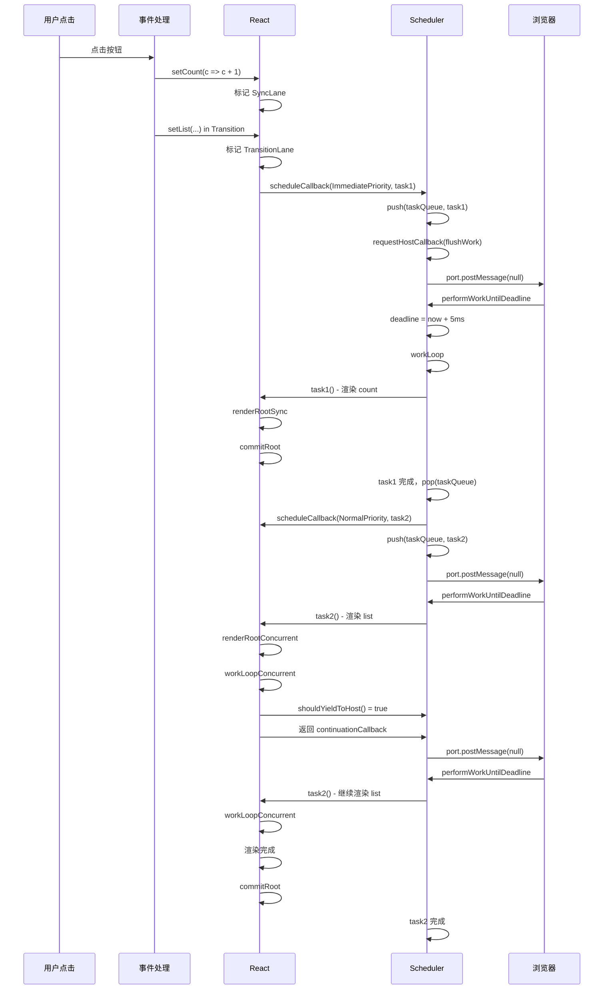
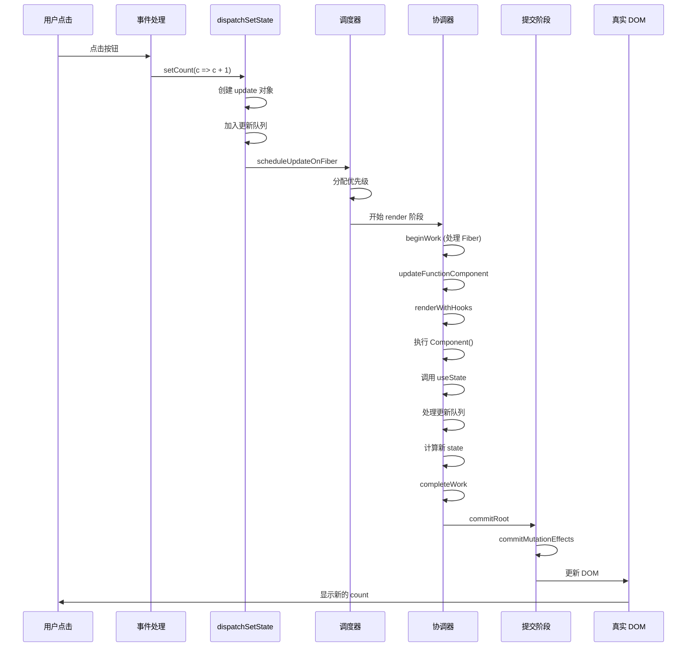

## React 源码级原理深度解析

> 面向已掌握 React 使用和 mini React 实现的开发者，系统讲解 React 底层运行原理

## 阅读指南

本文采用"问题驱动"的方式，每个知识点都会回答：
1. **要解决什么问题？**
2. **mini-react 为什么做不到？**
3. **React 官方是如何解决的？**
4. **这样设计的 trade-off 是什么？**

## 目录

- [前言：从 mini-react 到 React 官方实现](#前言从-mini-react-到-react-官方实现)
- [第一部分：架构设计](#第一部分架构设计)
- [第二部分：Fiber 架构深入](#第二部分fiber-架构深入)
- [第三部分：调度系统 Scheduler](#第三部分调度系统-scheduler)
- [第四部分：协调过程 Reconciliation](#第四部分协调过程-reconciliation)
- [第五部分：Commit 阶段](#第五部分commit-阶段)
- [第六部分：Hooks 实现原理](#第六部分hooks-实现原理)
- [第七部分：并发特性](#第七部分并发特性)
- [第八部分：性能优化机制](#第八部分性能优化机制)

---

## 前言：从 mini-react 到 React 官方实现

### 你的 mini-react 已经实现了什么？

回顾你的 mini-react 实现，你已经掌握了 React 的核心概念：

1. ✅ **虚拟 DOM**：`createElement` 创建轻量级 JS 对象
2. ✅ **Fiber 架构**：通过 `child`、`sibling`、`parent` 构建链表
3. ✅ **可中断渲染**：`requestIdleCallback` + `workLoop`
4. ✅ **双缓存**：`currentRoot` 和 `wipRoot` 交替切换
5. ✅ **Diff 算法**：通过 `alternate` 对比新旧节点
6. ✅ **副作用标记**：`PLACEMENT`、`UPDATE`、`DELETION`
7. ✅ **Commit 阶段**：一次性提交所有 DOM 变更
8. ✅ **Hooks**：`useState` 的基础实现

### React 官方实现多了什么？

但 React 官方实现还有很多你的 mini-react 没有的东西：

| 特性               | mini-react                  | React 官方              | 为什么需要？                                                 |
| ---------------- | --------------------------- | --------------------- | ------------------------------------------------------ |
| **优先级调度**        | ❌ 所有更新平等                    | ✅ Lane 模型             | 高优先级任务（用户输入）可以打断低优先级任务（列表渲染）                           |
| **Scheduler**    | ❌ 直接用 `requestIdleCallback` | ✅ 独立的调度器              | `requestIdleCallback` 兼容性差，React 用 `MessageChannel` 实现 |
| **批量更新**         | ❌ 每次 `setState` 都渲染         | ✅ 自动批处理               | 多个 `setState` 合并成一次渲染                                  |
| **bailout 优化**   | ❌ 每次都重新渲染                   | ✅ props 没变就跳过         | 避免不必要的渲染                                               |
| **subtreeFlags** | ❌ 遍历整棵树                     | ✅ 快速跳过子树              | Commit 阶段不需要遍历没有副作用的子树                                 |
| **updateQueue**  | ❌ 直接替换 state                | ✅ 更新队列                | 支持多个 `setState` 排队执行                                   |
| **Context 优化**   | ❌                           | ✅ 依赖追踪                | Context 变化只更新依赖的组件                                     |
| **并发特性**         | ❌                           | ✅ Suspense、Transition | 提升用户体验                                                 |

### 本文的组织方式

接下来，我会按照以下路径展开：

1. **对比差异**：每个知识点都会先展示 mini-react 的实现，再讲解 React 官方的改进
2. **问题驱动**：解释为什么需要这个特性，解决了什么问题
3. **源码级讲解**：结合关键源码，讲解实现原理
4. **图解 + 执行流程**：用图表和时序图帮助理解

---

## 第一部分：架构设计

### 1.1 从 mini-react 的问题说起

#### 问题 1：你的 mini-react 能处理这个场景吗？

```javascript
function App() {
  const [query, setQuery] = useState('');
  const [results, setResults] = useState([]);
  
  const handleInput = (e) => {
    setQuery(e.target.value);  // 用户输入
  };
  
  useEffect(() => {
    // 搜索 10000 条数据，很慢
    const data = searchInLargeDataset(query);
    setResults(data);
  }, [query]);
  
  return (
    <>
      <input value={query} onChange={handleInput} />
      <ResultList items={results} />  {/* 渲染 1000+ 个节点 */}
    </>
  );
}
```

**在你的 mini-react 中会发生什么？**

```
用户输入 "a"
  ↓
setQuery("a") 触发更新
  ↓
workLoop 开始处理 Fiber 树
  ↓
渲染 ResultList（1000+ 个节点，耗时 100ms）
  ↓
用户继续输入 "b"，但必须等待
  ↓
100ms 后才能响应用户输入
  ↓
用户感觉卡顿 ❌
```

**为什么会卡顿？**

虽然你实现了 `requestIdleCallback` 和时间切片，但有一个致命问题：

```javascript
// 你的 mini-react
function workLoop(deadline) {
  let shouldYield = false;
  
  while (nextUnitOfWork && !shouldYield) {
    nextUnitOfWork = performUnitOfWork(nextUnitOfWork);
    shouldYield = deadline.timeRemaining() < 1;
  }
  
  requestIdleCallback(workLoop);
}
```

**问题在哪？**

1. **所有更新都是平等的**：用户输入和列表渲染没有优先级区分
2. **无法打断正在进行的更新**：一旦开始渲染列表，必须等它完成
3. **`requestIdleCallback` 的问题**：
   - 兼容性差（Safari 不支持）
   - 触发频率不稳定（可能 20ms 才触发一次）
   - 在后台标签页可能完全不触发

#### 问题 2：多次 setState 会发生什么？

```javascript
function handleClick() {
  setCount(c => c + 1);  // 第 1 次
  setCount(c => c + 1);  // 第 2 次
  setCount(c => c + 1);  // 第 3 次
}
```

**在你的 mini-react 中：**

```javascript
// 你的 useState 实现
const setState = action => {
  hook.queue.push(action);
  
  // 每次都重新开启 work loop
  wipRoot = {
    dom: currentRoot.dom,
    props: currentRoot.props,
    alternate: currentRoot,
  };
  nextUnitOfWork = wipRoot;
  deletions = [];
};
```

**会触发 3 次渲染！**

```
setCount(1) → 开始渲染 → Commit
setCount(2) → 开始渲染 → Commit
setCount(3) → 开始渲染 → Commit

总共 3 次 DOM 操作，性能浪费
```

### 1.2 React 官方的解决方案：三层架构

React 16+ 采用了清晰的三层架构设计：

```
┌─────────────────────────────────────┐
│   Scheduler (调度层)                 │
│   - 任务优先级管理                    │
│   - 时间切片                         │
│   - 任务调度                         │
│   - 批量更新                         │
└─────────────────────────────────────┘
              ↓
┌─────────────────────────────────────┐
│   Reconciler (协调层)                │
│   - Fiber 树构建                     │
│   - Diff 算法                        │
│   - 副作用标记                       │
│   - 优先级判断                       │
└─────────────────────────────────────┘
              ↓
┌─────────────────────────────────────┐
│   Renderer (渲染层)                  │
│   - ReactDOM (浏览器)                │
│   - ReactNative (移动端)             │
│   - ReactTest (测试)                 │
└─────────────────────────────────────┘
```

**核心设计思想：**

1. **Scheduler 与 Reconciler 解耦**：调度逻辑独立，可中断可恢复
2. **Reconciler 与 Renderer 解耦**：协调过程平台无关，渲染层可替换
3. **异步可中断更新**：支持时间切片，避免长任务阻塞

#### 解决问题 1：优先级调度

```javascript
// React 官方的处理流程
用户输入 "a"
  ↓
setQuery("a") → 标记为 SyncLane（最高优先级）
  ↓
开始渲染 ResultList（DefaultLane，低优先级）
  ↓
用户输入 "b"，产生新的 SyncLane 更新
  ↓
Scheduler 检测到高优先级任务
  ↓
打断 ResultList 渲染，保存进度
  ↓
立即处理 setQuery("b")，更新输入框
  ↓
继续渲染 ResultList（基于最新的 "b"）
  ↓
用户感觉流畅 ✅
```

**关键代码：**

```javascript
// 调度更新时分配优先级
function scheduleUpdateOnFiber(fiber, lane) {
  // 根据更新类型分配不同的 lane
  // 用户输入 → SyncLane
  // 普通更新 → DefaultLane
  // Transition → TransitionLane
  
  if (lane === SyncLane) {
    // 同步更新，立即执行
    performSyncWorkOnRoot(root);
  } else {
    // 异步更新，调度执行
    ensureRootIsScheduled(root);
  }
}

// 工作循环中检查是否需要让步
function workLoopConcurrent() {
  while (workInProgress !== null && !shouldYield()) {
    performUnitOfWork(workInProgress);
  }
}

function shouldYield() {
  // 检查是否有更高优先级的任务
  const currentTime = getCurrentTime();
  if (currentTime >= deadline) {
    // 时间片用完
    return true;
  }
  
  // 检查是否有更高优先级的任务等待
  if (hasHigherPriorityWork()) {
    return true;
  }
  
  return false;
}
```

#### 解决问题 2：批量更新

```javascript
// React 18 的自动批处理
function handleClick() {
  setCount(c => c + 1);  // 不会立即渲染
  setCount(c => c + 1);  // 不会立即渲染
  setCount(c => c + 1);  // 不会立即渲染
  // React 会合并这 3 次更新，只渲染 1 次
}

// 实现原理
let executionContext = NoContext;

function batchedUpdates(fn) {
  const prevContext = executionContext;
  executionContext |= BatchedContext;  // 标记批量更新
  
  try {
    return fn();
  } finally {
    executionContext = prevContext;
    
    if (executionContext === NoContext) {
      // 批量更新结束，刷新队列
      flushSyncCallbacks();
    }
  }
}
```

### 1.3 为什么需要独立的 Scheduler？

**mini-react 的问题：**

```javascript
// 直接使用 requestIdleCallback
requestIdleCallback(workLoop);
```

**React 官方为什么不用 `requestIdleCallback`？**

1. **兼容性问题**：Safari 不支持
2. **触发频率不稳定**：可能 20ms 才触发一次，太慢
3. **后台标签页不触发**：用户切换标签页后，更新会停止
4. **无法控制优先级**：所有任务都是平等的

**React 的解决方案：MessageChannel**

```javascript
// Scheduler 使用 MessageChannel 实现时间切片
const channel = new MessageChannel();
const port = channel.port2;

channel.port1.onmessage = performWorkUntilDeadline;

function requestHostCallback(callback) {
  scheduledHostCallback = callback;
  port.postMessage(null);  // 触发宏任务
}

function performWorkUntilDeadline() {
  const currentTime = getCurrentTime();
  deadline = currentTime + yieldInterval;  // 5ms 后让步
  
  const hasMoreWork = scheduledHostCallback(true, currentTime);
  
  if (hasMoreWork) {
    // 还有工作，继续调度
    port.postMessage(null);
  }
}
```

**为什么用 MessageChannel？**

1. **兼容性好**：所有现代浏览器都支持
2. **触发及时**：宏任务，在下一个事件循环立即执行
3. **可控性强**：可以精确控制时间切片（5ms）
4. **支持优先级**：可以根据优先级决定是否让步

**对比：**

| 方案 | 触发时机 | 兼容性 | 可控性 | React 是否使用 |
|------|---------|--------|--------|---------------|
| `requestIdleCallback` | 浏览器空闲时 | 差（Safari 不支持） | 差 | ❌ |
| `setTimeout(fn, 0)` | 下一个宏任务 | 好 | 一般（最小 4ms 延迟） | ❌ |
| `MessageChannel` | 下一个宏任务 | 好 | 好（无最小延迟） | ✅ |
| `setImmediate` | 下一个宏任务 | 差（只有 IE 支持） | 好 | ❌ |

---
3. **异步可中断更新**：支持时间切片，避免长任务阻塞

### 1.2 为什么需要 Fiber 架构？

**React 15 的问题：**

```javascript
// React 15 的 Stack Reconciler
function reconcile(element) {
  // 递归处理子节点
  element.children.forEach(child => {
    reconcile(child);  // 同步递归，无法中断
  });
  // 更新 DOM
  updateDOM(element);
}
```

问题：
- **同步递归**：一旦开始就无法中断
- **长任务阻塞**：大组件树更新会阻塞主线程
- **掉帧**：超过 16.6ms 的更新会导致卡顿

**Fiber 架构的解决方案：**

```javascript
// Fiber 架构：链表结构 + 可中断
function workLoop(deadline) {
  let shouldYield = false;
  while (nextUnitOfWork && !shouldYield) {
    nextUnitOfWork = performUnitOfWork(nextUnitOfWork);
    shouldYield = deadline.timeRemaining() < 1;
  }
  
  if (nextUnitOfWork) {
    // 还有工作，继续调度
    requestIdleCallback(workLoop);
  } else {
    // 工作完成，提交更新
    commitRoot();
  }
}
```

核心改进：
- **链表结构**：可以随时中断和恢复
- **时间切片**：将长任务拆分成多个小任务
- **优先级调度**：高优先级任务可以打断低优先级任务

### 1.3 双缓存机制（Double Buffering）

React 使用双缓存技术来实现快速的 DOM 更新：

```javascript
// 双缓存 Fiber 树
function FiberRootNode() {
  this.current = null;        // 当前屏幕上显示的 Fiber 树
  this.finishedWork = null;   // 正在构建的 Fiber 树
}

// 工作流程
// 1. 初次渲染
fiberRoot.current = null;
const workInProgress = createWorkInProgress(null);  // 构建新树
// ... 协调过程
fiberRoot.current = workInProgress;  // 切换指针

// 2. 更新渲染
const current = fiberRoot.current;
const workInProgress = createWorkInProgress(current);  // 基于 current 构建新树
// ... 协调过程
fiberRoot.current = workInProgress;  // 切换指针
```

**双缓存的优势：**

1. **内存复用**：两棵树交替使用，避免频繁创建销毁
2. **快速切换**：只需改变指针，O(1) 时间复杂度
3. **回滚能力**：更新失败可以保留 current 树

```
初始状态：
┌─────────────┐
│ FiberRoot   │
│ current ────┼──→ Fiber Tree A (屏幕显示)
└─────────────┘

更新过程：
┌─────────────┐
│ FiberRoot   │
│ current ────┼──→ Fiber Tree A (屏幕显示)
│             │
│ wip ────────┼──→ Fiber Tree B (正在构建)
└─────────────┘

提交完成：
┌─────────────┐
│ FiberRoot   │
│ current ────┼──→ Fiber Tree B (屏幕显示)
└─────────────┘
```

---

## 第二部分：Fiber 架构深入

### 2.1 Fiber 节点的数据结构

```javascript
function FiberNode(tag, pendingProps, key, mode) {
  // ===== 实例属性 =====
  this.tag = tag;                    // Fiber 类型（FunctionComponent, ClassComponent 等）
  this.key = key;                    // React 元素的 key
  this.elementType = null;           // React 元素类型
  this.type = null;                  // 函数组件的函数本身，类组件的类
  this.stateNode = null;             // 真实 DOM 节点或类组件实例
  
  // ===== Fiber 树结构 =====
  this.return = null;                // 父 Fiber（向上）
  this.child = null;                 // 第一个子 Fiber（向下）
  this.sibling = null;               // 下一个兄弟 Fiber（向右）
  this.index = 0;                    // 在父节点中的索引
  
  // ===== 工作单元相关 =====
  this.ref = null;                   // ref 引用
  this.pendingProps = pendingProps;  // 新的 props
  this.memoizedProps = null;         // 上次渲染的 props
  this.updateQueue = null;           // 更新队列（setState、replaceState）
  this.memoizedState = null;         // 上次渲染的 state（函数组件存 hooks 链表）
  this.dependencies = null;          // 依赖项（context、subscription）
  
  // ===== 副作用相关 =====
  this.flags = NoFlags;              // 副作用标记（Placement、Update、Deletion 等）
  this.subtreeFlags = NoFlags;       // 子树的副作用标记
  this.deletions = null;             // 需要删除的子 Fiber 数组
  
  // ===== 调度优先级 =====
  this.lanes = NoLanes;              // 本 Fiber 的优先级
  this.childLanes = NoLanes;         // 子树的优先级
  
  // ===== 双缓存 =====
  this.alternate = null;             // 指向另一棵树中对应的 Fiber
}
```

**关键字段解析：**

1. **tag**：标识 Fiber 类型
```javascript
export const FunctionComponent = 0;
export const ClassComponent = 1;
export const IndeterminateComponent = 2;  // 未确定是函数还是类
export const HostRoot = 3;                // 根节点
export const HostComponent = 5;           // 原生 DOM 节点（div、span）
export const HostText = 6;                // 文本节点
```

2. **flags（副作用标记）**：
```javascript
export const NoFlags = 0b000000000000000000000000;
export const Placement = 0b000000000000000000000010;      // 插入
export const Update = 0b000000000000000000000100;         // 更新
export const Deletion = 0b000000000000000000001000;       // 删除
export const ChildDeletion = 0b000000000000000000010000;  // 子节点删除
export const Passive = 0b000000000000010000000000;        // useEffect
export const Ref = 0b000000000000100000000000;            // ref 更新

// 使用位运算高效操作
fiber.flags |= Update;                    // 添加标记
fiber.flags &= ~Update;                   // 移除标记
if (fiber.flags & Update) { /* ... */ }   // 检查标记
```

3. **lanes（优先级）**：
```javascript
export const NoLanes = 0b0000000000000000000000000000000;
export const SyncLane = 0b0000000000000000000000000000001;           // 同步优先级（最高）
export const InputContinuousLane = 0b0000000000000000000000000000100; // 连续输入
export const DefaultLane = 0b0000000000000000000000000010000;         // 默认优先级
export const IdleLane = 0b0100000000000000000000000000000;            // 空闲优先级（最低）

// 优先级越高，数值越小
```

### 2.2 Fiber 树的遍历

Fiber 树使用**深度优先遍历**，通过 `child`、`sibling`、`return` 三个指针实现：

```javascript
function performUnitOfWork(unitOfWork) {
  const current = unitOfWork.alternate;
  
  // 1. beginWork：处理当前节点，返回子节点
  let next = beginWork(current, unitOfWork, renderLanes);
  
  unitOfWork.memoizedProps = unitOfWork.pendingProps;
  
  if (next === null) {
    // 2. 没有子节点，进入 completeWork
    completeUnitOfWork(unitOfWork);
  } else {
    // 3. 有子节点，继续处理子节点
    workInProgress = next;
  }
}

function completeUnitOfWork(unitOfWork) {
  let completedWork = unitOfWork;
  
  do {
    const current = completedWork.alternate;
    const returnFiber = completedWork.return;
    
    // 完成当前节点
    completeWork(current, completedWork, renderLanes);
    
    const siblingFiber = completedWork.sibling;
    if (siblingFiber !== null) {
      // 有兄弟节点，处理兄弟节点
      workInProgress = siblingFiber;
      return;
    }
    
    // 没有兄弟节点，返回父节点
    completedWork = returnFiber;
    workInProgress = completedWork;
  } while (completedWork !== null);
}
```

**遍历示例：**

```
组件树：
    A
   / \
  B   C
 /
D

Fiber 树结构：
A.child = B
B.sibling = C
B.child = D
B.return = A
C.return = A
D.return = B

遍历顺序（深度优先）：
1. A (beginWork)
2. B (beginWork)
3. D (beginWork)
4. D (completeWork) ← 没有子节点，开始回溯
5. B (completeWork) ← D 没有兄弟节点，返回父节点
6. C (beginWork)    ← B 有兄弟节点 C
7. C (completeWork)
8. A (completeWork)
```

### 2.3 Fiber 的创建与复用

```javascript
// 创建 WorkInProgress Fiber
function createWorkInProgress(current, pendingProps) {
  let workInProgress = current.alternate;
  
  if (workInProgress === null) {
    // 首次渲染：创建新 Fiber
    workInProgress = createFiber(
      current.tag,
      pendingProps,
      current.key,
      current.mode
    );
    workInProgress.elementType = current.elementType;
    workInProgress.type = current.type;
    workInProgress.stateNode = current.stateNode;
    
    // 建立双向连接
    workInProgress.alternate = current;
    current.alternate = workInProgress;
  } else {
    // 更新渲染：复用 Fiber
    workInProgress.pendingProps = pendingProps;
    workInProgress.type = current.type;
    
    // 清空副作用
    workInProgress.flags = NoFlags;
    workInProgress.subtreeFlags = NoFlags;
    workInProgress.deletions = null;
  }
  
  // 复制状态
  workInProgress.childLanes = current.childLanes;
  workInProgress.lanes = current.lanes;
  workInProgress.child = current.child;
  workInProgress.memoizedProps = current.memoizedProps;
  workInProgress.memoizedState = current.memoizedState;
  workInProgress.updateQueue = current.updateQueue;
  
  return workInProgress;
}
```

---

## 第三部分：调度系统 Scheduler

### 3.0 从 mini-react 的调度说起

#### 回顾：你的 mini-react 如何调度任务？

```javascript
// 你的实现
function workLoop(deadline) {
  let shouldYield = false;
  
  while (nextUnitOfWork && !shouldYield) {
    nextUnitOfWork = performUnitOfWork(nextUnitOfWork);
    shouldYield = deadline.timeRemaining() < 1;
  }
  
  if (nextUnitOfWork) {
    requestIdleCallback(workLoop);
  } else {
    commitRoot();
  }
}

requestIdleCallback(workLoop);
```

这个实现已经有了时间切片的概念！但有几个致命问题：

#### 问题 1：requestIdleCallback 的缺陷

```javascript
// 你的 mini-react
requestIdleCallback(workLoop);

// 问题：
// 1. Safari 不支持（兼容性差）
// 2. 触发频率不稳定（可能 20ms 才触发一次）
// 3. 后台标签页可能完全不触发
// 4. 无法控制优先级
```

**实际测试：**

```javascript
// 测试 requestIdleCallback 的触发频率
let lastTime = performance.now();
let count = 0;

function test(deadline) {
  const now = performance.now();
  const gap = now - lastTime;
  console.log(`第 ${++count} 次触发，距离上次 ${gap.toFixed(2)}ms`);
  lastTime = now;
  requestIdleCallback(test);
}

requestIdleCallback(test);

// 输出（Chrome）：
// 第 1 次触发，距离上次 50.20ms
// 第 2 次触发，距离上次 16.80ms
// 第 3 次触发，距离上次 33.40ms
// 触发时机非常不稳定！
```

#### 问题 2：没有优先级概念

```javascript
// 场景：用户正在输入，同时有一个大列表在渲染
function App() {
  const [query, setQuery] = useState('');
  const [list, setList] = useState([]);
  
  return (
    <>
      <input value={query} onChange={e => setQuery(e.target.value)} />
      <List items={list} />  {/* 1000+ 个节点 */}
    </>
  );
}

// 你的 mini-react：
// - 用户输入和列表渲染是平等的
// - 无法打断正在进行的列表渲染
// - 用户感觉输入卡顿
```

#### 问题 3：没有任务队列

```javascript
// 你的 mini-react
const setState = action => {
  hook.queue.push(action);
  
  // 每次都重新开启 work loop
  wipRoot = {
    dom: currentRoot.dom,
    props: currentRoot.props,
    alternate: currentRoot,
  };
  nextUnitOfWork = wipRoot;
};

// 问题：
// - 多个 setState 会触发多次渲染
// - 没有任务优先级排序
// - 无法合并相同优先级的任务
```

### 3.1 React 官方的解决方案：独立的 Scheduler

React 为什么要实现独立的 Scheduler？

**设计目标：**

1. **跨平台兼容**：不依赖 `requestIdleCallback`
2. **精确的时间切片**：5ms 一个切片，可配置
3. **优先级调度**：支持 5 个优先级等级
4. **任务队列管理**：支持延迟任务和立即任务
5. **饥饿问题处理**：低优先级任务不会永远得不到执行

#### 浏览器事件循环基础

在深入 Scheduler 之前，先理解浏览器的事件循环：

```
┌─────────────────────────────────────┐
│   1. 执行一个宏任务                   │
│      - script 标签                   │
│      - setTimeout / setInterval      │
│      - I/O                           │
│      - MessageChannel                │
└─────────────────────────────────────┘
              ↓
┌─────────────────────────────────────┐
│   2. 执行所有微任务                   │
│      - Promise.then                  │
│      - MutationObserver              │
│      - queueMicrotask                │
└─────────────────────────────────────┘
              ↓
┌─────────────────────────────────────┐
│   3. 渲染（如果需要）                 │
│      - requestAnimationFrame         │
│      - 样式计算（Recalculate Style）  │
│      - 布局（Layout）                 │
│      - 绘制（Paint）                  │
│      - 合成（Composite）              │
└─────────────────────────────────────┘
              ↓
         回到步骤 1
```

**关键点：**

- **JS 执行和渲染互斥**：JS 执行时不会渲染
- **60Hz 刷新率**：浏览器每 16.6ms 渲染一帧
- **长任务阻塞**：超过 16.6ms 的 JS 任务会导致掉帧

**示例：长任务导致卡顿**

```javascript
// 模拟长任务
function heavyTask() {
  const start = performance.now();
  while (performance.now() - start < 100) {
    // 阻塞 100ms
  }
}

button.addEventListener('click', () => {
  heavyTask();  // 阻塞 100ms
  // 这期间浏览器无法响应用户操作，无法渲染
});

// 用户点击按钮后，会感觉卡顿 100ms
```

### 3.2 为什么用 MessageChannel 而不是 setTimeout？

React 需要一个宏任务 API 来实现时间切片，有几个候选方案：

#### 方案对比

| 方案 | 触发时机 | 最小延迟 | 兼容性 | React 是否使用 |
|------|---------|---------|--------|---------------|
| `requestIdleCallback` | 浏览器空闲时 | 不确定（可能 20ms+） | 差（Safari 不支持） | ❌ |
| `setTimeout(fn, 0)` | 下一个宏任务 | 4ms（嵌套 5 层后） | 好 | ❌ |
| `MessageChannel` | 下一个宏任务 | 无最小延迟 | 好 | ✅ |
| `setImmediate` | 下一个宏任务 | 无最小延迟 | 差（只有 IE/Node） | ❌ |

#### setTimeout 的问题

```javascript
// setTimeout 的最小延迟
let count = 0;
let lastTime = performance.now();

function test() {
  const now = performance.now();
  const gap = now - lastTime;
  console.log(`第 ${++count} 次，间隔 ${gap.toFixed(2)}ms`);
  lastTime = now;
  
  if (count < 10) {
    setTimeout(test, 0);
  }
}

setTimeout(test, 0);

// 输出（Chrome）：
// 第 1 次，间隔 1.20ms
// 第 2 次，间隔 1.10ms
// 第 3 次，间隔 1.05ms
// 第 4 次，间隔 1.15ms
// 第 5 次，间隔 4.20ms  ← 从第 5 次开始，最小 4ms
// 第 6 次，间隔 4.10ms
// 第 7 次，间隔 4.05ms
// ...

// 浏览器限制：嵌套 5 层以上的 setTimeout，最小延迟 4ms
```

**为什么 4ms 是个问题？**

```javascript
// React 的时间切片是 5ms
// 如果用 setTimeout，每次让步需要等待 4ms
// 实际可用时间只有 1ms，效率太低

时间线：
0ms:   开始执行任务
5ms:   时间片用完，调用 setTimeout(callback, 0)
9ms:   callback 被执行（等待了 4ms）
14ms:  时间片用完，再次调用 setTimeout
18ms:  callback 被执行
...

// 每个时间片实际只工作 5ms，但总耗时 9ms
// 效率：5 / 9 = 55.6%
```

#### MessageChannel 的优势

```javascript
// MessageChannel 实现
const channel = new MessageChannel();
const port1 = channel.port1;
const port2 = channel.port2;

let count = 0;
let lastTime = performance.now();

port1.onmessage = function test() {
  const now = performance.now();
  const gap = now - lastTime;
  console.log(`第 ${++count} 次，间隔 ${gap.toFixed(2)}ms`);
  lastTime = now;
  
  if (count < 10) {
    port2.postMessage(null);
  }
};

port2.postMessage(null);

// 输出（Chrome）：
// 第 1 次，间隔 0.80ms
// 第 2 次，间隔 0.75ms
// 第 3 次，间隔 0.70ms
// 第 4 次，间隔 0.85ms
// 第 5 次，间隔 0.80ms  ← 没有 4ms 限制
// 第 6 次，间隔 0.75ms
// ...

// MessageChannel 没有最小延迟限制
// 效率：5 / 5.8 ≈ 86%
```

**React 的实现：**

```javascript
// packages/scheduler/src/forks/Scheduler.js

const channel = new MessageChannel();
const port = channel.port2;

channel.port1.onmessage = performWorkUntilDeadline;

function requestHostCallback(callback) {
  scheduledHostCallback = callback;
  if (!isMessageLoopRunning) {
    isMessageLoopRunning = true;
    port.postMessage(null);  // 触发宏任务
  }
}

function performWorkUntilDeadline() {
  if (scheduledHostCallback !== null) {
    const currentTime = getCurrentTime();
    startTime = currentTime;
    deadline = currentTime + yieldInterval;  // 5ms 后让步
    
    const hasTimeRemaining = true;
    let hasMoreWork = true;
    
    try {
      hasMoreWork = scheduledHostCallback(hasTimeRemaining, currentTime);
    } finally {
      if (hasMoreWork) {
        // 还有工作，继续调度
        port.postMessage(null);
      } else {
        isMessageLoopRunning = false;
        scheduledHostCallback = null;
      }
    }
  } else {
    isMessageLoopRunning = false;
  }
}
```

### 3.3 优先级系统：Scheduler Priority vs Lane Priority

React 有两套优先级系统，为什么？

#### Scheduler 优先级（5 个等级）

```javascript
// packages/scheduler/src/SchedulerPriorities.js

export const NoPriority = 0;
export const ImmediatePriority = 1;      // 立即执行（最高优先级）
export const UserBlockingPriority = 2;   // 用户交互（250ms 超时）
export const NormalPriority = 3;         // 正常优先级（5s 超时）
export const LowPriority = 4;            // 低优先级（10s 超时）
export const IdlePriority = 5;           // 空闲优先级（永不超时）

// 超时时间
const IMMEDIATE_PRIORITY_TIMEOUT = -1;        // 立即过期
const USER_BLOCKING_PRIORITY_TIMEOUT = 250;   // 250ms
const NORMAL_PRIORITY_TIMEOUT = 5000;         // 5s
const LOW_PRIORITY_TIMEOUT = 10000;           // 10s
const IDLE_PRIORITY_TIMEOUT = maxSigned31BitInt;  // 永不过期
```

**为什么需要超时时间？**

```javascript
// 场景：防止饥饿问题
// 低优先级任务一直被高优先级任务打断，永远得不到执行

// 示例：
scheduleCallback(NormalPriority, task1);  // 5s 后过期
scheduleCallback(NormalPriority, task2);  // 5s 后过期

// 3s 后，来了一个高优先级任务
scheduleCallback(UserBlockingPriority, task3);

// task3 会打断 task1 和 task2
// 但 2s 后，task1 和 task2 过期了
// 即使有更多高优先级任务，也必须先执行 task1 和 task2
```

#### Lane 优先级（31 个等级）

```javascript
// packages/react-reconciler/src/ReactFiberLane.js

export const NoLanes = 0b0000000000000000000000000000000;
export const NoLane = NoLanes;

// 同步优先级
export const SyncLane = 0b0000000000000000000000000000001;

// 连续输入优先级
export const InputContinuousHydrationLane = 0b0000000000000000000000000000010;
export const InputContinuousLane = 0b0000000000000000000000000000100;

// 默认优先级
export const DefaultHydrationLane = 0b0000000000000000000000000001000;
export const DefaultLane = 0b0000000000000000000000000010000;

// Transition 优先级（16 个）
export const TransitionLane1 = 0b0000000000000000000000001000000;
export const TransitionLane2 = 0b0000000000000000000000010000000;
// ... TransitionLane3 ~ TransitionLane16

// 空闲优先级
export const IdleHydrationLane = 0b0010000000000000000000000000000;
export const IdleLane = 0b0100000000000000000000000000000;

// 离屏优先级
export const OffscreenLane = 0b1000000000000000000000000000000;
```

**为什么需要 31 个等级？**

```javascript
// Lane 模型的优势：支持批量操作

// 场景 1：合并多个更新
const lane1 = 0b0000000000000000000000000000001;  // SyncLane
const lane2 = 0b0000000000000000000000000010000;  // DefaultLane
const merged = lane1 | lane2;  // 0b0000000000000000000000000010001

// 场景 2：检查是否包含某个优先级
function includesSomeLane(set, subset) {
  return (set & subset) !== NoLanes;
}

// 场景 3：移除某个优先级
function removeLanes(set, subset) {
  return set & ~subset;
}

// 场景 4：获取最高优先级
function getHighestPriorityLane(lanes) {
  return lanes & -lanes;  // 位运算技巧：获取最低位的 1
}

// 示例：
const lanes = 0b0000000000000000000000000010100;
//                                      ↑ ↑
//                                      | DefaultLane
//                                      InputContinuousLane

getHighestPriorityLane(lanes);
// 返回 0b0000000000000000000000000000100 (InputContinuousLane)
```

#### Lane 到 Scheduler 优先级的映射

```javascript
// packages/react-reconciler/src/ReactFiberWorkLoop.js

function lanesToSchedulerPriority(lanes) {
  // 找到最高优先级的 lane
  const lane = getHighestPriorityLane(lanes);
  
  if (lane === SyncLane) {
    return ImmediatePriority;
  }
  
  if ((lane & InputContinuousLane) !== NoLanes) {
    return UserBlockingPriority;
  }
  
  if ((lane & DefaultLane) !== NoLanes) {
    return NormalPriority;
  }
  
  if ((lane & TransitionLanes) !== NoLanes) {
    return NormalPriority;
  }
  
  if ((lane & IdleLane) !== NoLanes) {
    return IdlePriority;
  }
  
  return NormalPriority;
}
```

**为什么需要两套优先级？**

1. **Scheduler 是独立的**：可以被其他库使用，不依赖 React
2. **Lane 更细粒度**：支持 Transition、Suspense 等复杂场景
3. **Lane 支持批量操作**：位运算高效合并和检查优先级

### 3.4 任务队列：taskQueue 和 timerQueue

Scheduler 维护两个队列，为什么？

#### 数据结构

```javascript
// packages/scheduler/src/Scheduler.js

// 任务队列（最小堆）
const taskQueue = [];      // 已经可以执行的任务
const timerQueue = [];     // 延迟任务（还没到执行时间）

// 任务对象
const newTask = {
  id: taskIdCounter++,           // 任务 ID
  callback,                      // 任务函数
  priorityLevel,                 // 优先级
  startTime,                     // 开始时间
  expirationTime,                // 过期时间
  sortIndex: -1,                 // 排序索引
};
```

#### 为什么用最小堆？

```javascript
// 最小堆的特点：
// 1. 父节点总是小于子节点
// 2. 插入：O(log n)
// 3. 取最小值：O(1)
// 4. 删除最小值：O(log n)

// 对比数组：
// 1. 插入：O(1)
// 2. 取最小值：O(n) - 需要遍历
// 3. 删除最小值：O(n)

// Scheduler 需要频繁获取最高优先级任务，最小堆更高效
```

**最小堆实现：**

```javascript
// packages/scheduler/src/SchedulerMinHeap.js

export function push(heap, node) {
  const index = heap.length;
  heap.push(node);
  siftUp(heap, node, index);
}

export function peek(heap) {
  return heap.length === 0 ? null : heap[0];
}

export function pop(heap) {
  if (heap.length === 0) {
    return null;
  }
  const first = heap[0];
  const last = heap.pop();
  
  if (last !== first) {
    heap[0] = last;
    siftDown(heap, last, 0);
  }
  
  return first;
}

function siftUp(heap, node, i) {
  let index = i;
  
  while (index > 0) {
    const parentIndex = (index - 1) >>> 1;  // 父节点索引
    const parent = heap[parentIndex];
    
    if (compare(parent, node) > 0) {
      // 父节点大于当前节点，交换
      heap[parentIndex] = node;
      heap[index] = parent;
      index = parentIndex;
    } else {
      return;
    }
  }
}

function siftDown(heap, node, i) {
  let index = i;
  const length = heap.length;
  const halfLength = length >>> 1;
  
  while (index < halfLength) {
    const leftIndex = (index + 1) * 2 - 1;
    const left = heap[leftIndex];
    const rightIndex = leftIndex + 1;
    const right = heap[rightIndex];
    
    // 找到最小的子节点
    if (compare(left, node) < 0) {
      if (rightIndex < length && compare(right, left) < 0) {
        heap[index] = right;
        heap[rightIndex] = node;
        index = rightIndex;
      } else {
        heap[index] = left;
        heap[leftIndex] = node;
        index = leftIndex;
      }
    } else if (rightIndex < length && compare(right, node) < 0) {
      heap[index] = right;
      heap[rightIndex] = node;
      index = rightIndex;
    } else {
      return;
    }
  }
}

function compare(a, b) {
  // 按 sortIndex 排序
  const diff = a.sortIndex - b.sortIndex;
  return diff !== 0 ? diff : a.id - b.id;
}
```

#### taskQueue vs timerQueue

```javascript
function scheduleCallback(priorityLevel, callback, options) {
  const currentTime = getCurrentTime();
  
  // 计算开始时间
  let startTime;
  if (typeof options === 'object' && options !== null) {
    const delay = options.delay;
    startTime = typeof delay === 'number' ? currentTime + delay : currentTime;
  } else {
    startTime = currentTime;
  }
  
  // 计算过期时间
  let timeout;
  switch (priorityLevel) {
    case ImmediatePriority:
      timeout = IMMEDIATE_PRIORITY_TIMEOUT;  // -1
      break;
    case UserBlockingPriority:
      timeout = USER_BLOCKING_PRIORITY_TIMEOUT;  // 250ms
      break;
    case IdlePriority:
      timeout = IDLE_PRIORITY_TIMEOUT;  // 永不过期
      break;
    case LowPriority:
      timeout = LOW_PRIORITY_TIMEOUT;  // 10s
      break;
    case NormalPriority:
    default:
      timeout = NORMAL_PRIORITY_TIMEOUT;  // 5s
      break;
  }
  
  const expirationTime = startTime + timeout;
  
  const newTask = {
    id: taskIdCounter++,
    callback,
    priorityLevel,
    startTime,
    expirationTime,
    sortIndex: -1,
  };
  
  if (startTime > currentTime) {
    // ===== 延迟任务，加入 timerQueue =====
    newTask.sortIndex = startTime;  // 按开始时间排序
    push(timerQueue, newTask);
    
    if (peek(taskQueue) === null && newTask === peek(timerQueue)) {
      // taskQueue 为空，且这是最早的延迟任务
      // 设置定时器
      if (isHostTimeoutScheduled) {
        cancelHostTimeout();
      } else {
        isHostTimeoutScheduled = true;
      }
      requestHostTimeout(handleTimeout, startTime - currentTime);
    }
  } else {
    // ===== 立即任务，加入 taskQueue =====
    newTask.sortIndex = expirationTime;  // 按过期时间排序
    push(taskQueue, newTask);
    
    // 开始调度
    if (!isHostCallbackScheduled && !isPerformingWork) {
      isHostCallbackScheduled = true;
      requestHostCallback(flushWork);
    }
  }
  
  return newTask;
}
```

**关键点：**

1. **timerQueue 按 startTime 排序**：最早开始的任务在堆顶
2. **taskQueue 按 expirationTime 排序**：最早过期的任务在堆顶
3. **延迟任务到期后移到 taskQueue**：通过 `advanceTimers` 函数

#### advanceTimers：移动到期任务

```javascript
function advanceTimers(currentTime) {
  // 检查 timerQueue，将到期的任务移到 taskQueue
  let timer = peek(timerQueue);
  
  while (timer !== null) {
    if (timer.callback === null) {
      // 任务被取消，移除
      pop(timerQueue);
    } else if (timer.startTime <= currentTime) {
      // 任务到期，移到 taskQueue
      pop(timerQueue);
      timer.sortIndex = timer.expirationTime;
      push(taskQueue, timer);
    } else {
      // 还没到期，停止检查
      return;
    }
    timer = peek(timerQueue);
  }
}
```

**示例：任务调度流程**

```javascript
// t=0ms: 调度 3 个任务
scheduleCallback(NormalPriority, task1);           // 立即执行
scheduleCallback(NormalPriority, task2, { delay: 100 });  // 100ms 后执行
scheduleCallback(UserBlockingPriority, task3);     // 立即执行

// 初始状态：
taskQueue = [
  { id: 1, callback: task1, expirationTime: 5000, sortIndex: 5000 },
  { id: 3, callback: task3, expirationTime: 250, sortIndex: 250 },
]
// task3 在堆顶（expirationTime 更小）

timerQueue = [
  { id: 2, callback: task2, startTime: 100, sortIndex: 100 },
]

// t=100ms: advanceTimers 被调用
advanceTimers(100);

// task2 移到 taskQueue：
taskQueue = [
  { id: 3, callback: task3, expirationTime: 250, sortIndex: 250 },
  { id: 2, callback: task2, expirationTime: 5100, sortIndex: 5100 },
  { id: 1, callback: task1, expirationTime: 5000, sortIndex: 5000 },
]
// task3 仍在堆顶
```

### 3.5 时间切片与 shouldYield

#### 从 mini-react 到 React 官方

**你的 mini-react：**

```javascript
function workLoop(deadline) {
  let shouldYield = false;
  
  while (nextUnitOfWork && !shouldYield) {
    nextUnitOfWork = performUnitOfWork(nextUnitOfWork);
    shouldYield = deadline.timeRemaining() < 1;  // 剩余时间 < 1ms
  }
  
  if (nextUnitOfWork) {
    requestIdleCallback(workLoop);
  } else {
    commitRoot();
  }
}
```

**React 官方：**

```javascript
// packages/scheduler/src/Scheduler.js

let yieldInterval = 5;  // 5ms 一个时间切片
let deadline = 0;
let startTime = -1;

function shouldYieldToHost() {
  const currentTime = getCurrentTime();
  return currentTime >= deadline;  // 超过截止时间就让步
}

// 工作循环
function workLoopConcurrent() {
  while (workInProgress !== null && !shouldYieldToHost()) {
    performUnitOfWork(workInProgress);
  }
}
```

#### 为什么是 5ms？

```javascript
// 浏览器渲染流程：
// 1 帧 = 16.6ms (60Hz)
// 
// 理想情况：
// ┌─────────────────────────────────────┐
// │  JS (10ms)  │  Render (6.6ms)       │
// └─────────────────────────────────────┘
// 0ms          10ms                   16.6ms
//
// 如果 JS 执行超过 16.6ms，就会掉帧

// React 的策略：
// - 每 5ms 让步一次
// - 给浏览器机会处理用户输入、渲染等
// - 即使任务很重，也能保持响应

// 时间线：
// 0ms:   开始执行 React 任务
// 5ms:   让步，浏览器可以处理其他事情
// 6ms:   继续执行 React 任务
// 11ms:  让步
// 12ms:  继续执行
// 16.6ms: 浏览器渲染
```

**可配置的时间切片：**

```javascript
// React 允许配置时间切片大小
// 但默认 5ms 是经过大量测试的最优值

// 如果设置太小（如 1ms）：
// - 让步太频繁，效率低
// - 每次让步都有开销（保存/恢复状态）

// 如果设置太大（如 50ms）：
// - 可能阻塞用户输入
// - 可能导致掉帧

// 5ms 是一个平衡点
```

#### performWorkUntilDeadline 实现

```javascript
function performWorkUntilDeadline() {
  if (scheduledHostCallback !== null) {
    const currentTime = getCurrentTime();
    startTime = currentTime;
    deadline = currentTime + yieldInterval;  // 设置截止时间
    
    const hasTimeRemaining = true;
    let hasMoreWork = true;
    
    try {
      // 执行任务，返回是否还有更多工作
      hasMoreWork = scheduledHostCallback(hasTimeRemaining, currentTime);
    } finally {
      if (hasMoreWork) {
        // 还有工作，继续调度
        port.postMessage(null);
      } else {
        // 工作完成
        isMessageLoopRunning = false;
        scheduledHostCallback = null;
      }
    }
  } else {
    isMessageLoopRunning = false;
  }
}
```

#### workLoop：任务执行循环

```javascript
function workLoop(hasTimeRemaining, initialTime) {
  let currentTime = initialTime;
  
  // 1. 将到期的延迟任务移到 taskQueue
  advanceTimers(currentTime);
  
  // 2. 取出最高优先级任务
  currentTask = peek(taskQueue);
  
  while (currentTask !== null) {
    if (
      currentTask.expirationTime > currentTime &&
      (!hasTimeRemaining || shouldYieldToHost())
    ) {
      // 任务未过期 且 时间片用完，中断
      break;
    }
    
    const callback = currentTask.callback;
    
    if (typeof callback === 'function') {
      currentTask.callback = null;
      currentPriorityLevel = currentTask.priorityLevel;
      
      // 判断任务是否超时
      const didUserCallbackTimeout = currentTask.expirationTime <= currentTime;
      
      // 3. 执行任务
      const continuationCallback = callback(didUserCallbackTimeout);
      
      currentTime = getCurrentTime();
      
      if (typeof continuationCallback === 'function') {
        // 任务返回函数，表示还有工作要做
        currentTask.callback = continuationCallback;
      } else {
        // 任务完成，移出队列
        if (currentTask === peek(taskQueue)) {
          pop(taskQueue);
        }
      }
      
      // 4. 再次检查延迟任务
      advanceTimers(currentTime);
    } else {
      // callback 为 null，任务被取消
      pop(taskQueue);
    }
    
    // 5. 取下一个任务
    currentTask = peek(taskQueue);
  }
  
  // 6. 返回是否还有任务
  if (currentTask !== null) {
    return true;  // 还有任务
  } else {
    // taskQueue 为空，检查 timerQueue
    const firstTimer = peek(timerQueue);
    if (firstTimer !== null) {
      // 设置定时器，等待下一个延迟任务
      requestHostTimeout(handleTimeout, firstTimer.startTime - currentTime);
    }
    return false;  // 没有任务了
  }
}
```

**关键点：**

1. **任务可以返回函数**：表示还有工作要做，下次继续执行
2. **任务超时会被标记**：`didUserCallbackTimeout` 参数
3. **每次循环都检查时间**：`shouldYieldToHost()`
4. **过期任务优先执行**：即使时间片用完，也要执行过期任务

#### 示例：可中断的任务

```javascript
// React 的 render 任务
function performConcurrentWorkOnRoot(root, didTimeout) {
  // 开始渲染
  let exitStatus = renderRootConcurrent(root, lanes);
  
  if (exitStatus === RootInProgress) {
    // 渲染未完成，返回函数继续执行
    return performConcurrentWorkOnRoot.bind(null, root);
  }
  
  // 渲染完成，进入 commit 阶段
  commitRoot(root);
  
  // 返回 null 表示任务完成
  return null;
}

// 调度
scheduleCallback(
  schedulerPriorityLevel,
  performConcurrentWorkOnRoot.bind(null, root)
);

// 执行流程：
// 第 1 次调用：渲染 100 个 Fiber，时间片用完，返回函数
// 第 2 次调用：继续渲染 100 个 Fiber，时间片用完，返回函数
// 第 3 次调用：渲染完成，commit，返回 null
```

### 3.6 完整执行流程示例

让我们追踪一次完整的调度流程：

```javascript
// 场景：用户点击按钮，触发两个更新
function App() {
  const [count, setCount] = useState(0);
  const [list, setList] = useState([]);
  
  const handleClick = () => {
    setCount(c => c + 1);  // 高优先级
    startTransition(() => {
      setList(generateLargeList());  // 低优先级
    });
  };
  
  return (
    <>
      <button onClick={handleClick}>Count: {count}</button>
      <List items={list} />
    </>
  );
}
```

#### 时序图



#### 详细步骤

**1. 用户点击，触发更新**

```javascript
// t=0ms
setCount(c => c + 1);  // SyncLane
startTransition(() => {
  setList(generateLargeList());  // TransitionLane
});
```

**2. 调度高优先级任务**

```javascript
// scheduleUpdateOnFiber
const lane = SyncLane;
const schedulerPriority = ImmediatePriority;

scheduleCallback(
  ImmediatePriority,
  performSyncWorkOnRoot.bind(null, root)
);

// taskQueue = [
//   { id: 1, callback: performSyncWorkOnRoot, expirationTime: -1 }
// ]
```

**3. 执行高优先级任务**

```javascript
// t=1ms: MessageChannel 触发
performWorkUntilDeadline();
  → workLoop()
    → task1 = peek(taskQueue)  // performSyncWorkOnRoot
    → task1.callback()
      → renderRootSync()  // 同步渲染，不可中断
      → commitRoot()
    → pop(taskQueue)  // 任务完成

// 高优先级任务完成，count 更新到 DOM
```

**4. 调度低优先级任务**

```javascript
// t=5ms
const lane = TransitionLane;
const schedulerPriority = NormalPriority;

scheduleCallback(
  NormalPriority,
  performConcurrentWorkOnRoot.bind(null, root)
);

// taskQueue = [
//   { id: 2, callback: performConcurrentWorkOnRoot, expirationTime: 5005 }
// ]
```

**5. 执行低优先级任务（第 1 次）**

```javascript
// t=6ms: MessageChannel 触发
performWorkUntilDeadline();
  deadline = 6 + 5 = 11ms
  
  → workLoop()
    → task2 = peek(taskQueue)
    → task2.callback()
      → renderRootConcurrent()
        → workLoopConcurrent()
          while (workInProgress !== null && !shouldYieldToHost()) {
            performUnitOfWork(workInProgress);
          }
          // t=11ms: shouldYieldToHost() = true
          // 渲染了 100 个 Fiber，但还没完成
      → return performConcurrentWorkOnRoot  // 返回函数
    
    → task2.callback = performConcurrentWorkOnRoot  // 更新 callback
    → return true  // 还有工作

// 任务未完成，继续调度
port.postMessage(null);
```

**6. 执行低优先级任务（第 2 次）**

```javascript
// t=12ms: MessageChannel 触发
performWorkUntilDeadline();
  deadline = 12 + 5 = 17ms
  
  → workLoop()
    → task2.callback()
      → renderRootConcurrent()
        → workLoopConcurrent()
          // 继续渲染剩余的 Fiber
          // t=15ms: 渲染完成
      → commitRoot()
      → return null  // 任务完成
    
    → pop(taskQueue)
    → return false  // 没有任务了

// 所有任务完成
```

**时间线总结：**

```
0ms:   用户点击
1ms:   调度高优先级任务
1ms:   执行高优先级任务（同步）
5ms:   高优先级任务完成，count 更新
6ms:   调度低优先级任务
6ms:   执行低优先级任务（第 1 次）
11ms:  时间片用完，让步
12ms:  继续执行低优先级任务（第 2 次）
15ms:  低优先级任务完成，list 更新
16.6ms: 浏览器渲染

总耗时：15ms
用户感知：count 立即更新（5ms），list 稍后更新（15ms）
```

---

## 第四部分：协调过程 Reconciliation

### 4.0 从 mini-react 的 Reconciliation 说起

#### 回顾：你的 mini-react 如何协调？

```javascript
// 你的实现
function reconcileChildren(wipFiber, elements) {
  let index = 0;
  let oldFiber = wipFiber.alternate && wipFiber.alternate.child;
  let prevSibling = null;
  
  while (index < elements.length || oldFiber != null) {
    const element = elements[index];
    let newFiber = null;
    
    // 比较 type
    const sameType = oldFiber && element && element.type === oldFiber.type;
    
    if (sameType) {
      // 更新
      newFiber = {
        type: oldFiber.type,
        props: element.props,
        dom: oldFiber.dom,
        parent: wipFiber,
        alternate: oldFiber,
        effectTag: 'UPDATE',
      };
    }
    
    if (element && !sameType) {
      // 新增
      newFiber = {
        type: element.type,
        props: element.props,
        dom: null,
        parent: wipFiber,
        alternate: null,
        effectTag: 'PLACEMENT',
      };
    }
    
    if (oldFiber && !sameType) {
      // 删除
      oldFiber.effectTag = 'DELETION';
      deletions.push(oldFiber);
    }
    
    if (oldFiber) {
      oldFiber = oldFiber.sibling;
    }
    
    if (index === 0) {
      wipFiber.child = newFiber;
    } else if (element) {
      prevSibling.sibling = newFiber;
    }
    
    prevSibling = newFiber;
    index++;
  }
}
```

这个实现已经有了 Diff 的核心思想！但有几个问题：

#### 问题 1：没有 key 的支持

```javascript
// 场景：列表插入
旧：[A, B, C]
新：[A, D, B, C]

// 你的 mini-react：
// 1. A vs A：type 相同，UPDATE
// 2. B vs D：type 不同，DELETE B，PLACEMENT D
// 3. C vs B：type 不同，DELETE C，PLACEMENT B
// 4. null vs C：PLACEMENT C

// 结果：1 次 UPDATE + 3 次 DELETE + 3 次 PLACEMENT
// 实际上只需要：1 次 UPDATE + 1 次 PLACEMENT
```

**为什么没有 key 会导致性能问题？**

```javascript
// 没有 key 的情况
<ul>
  <li>A</li>
  <li>B</li>
  <li>C</li>
</ul>

// 插入 D
<ul>
  <li>A</li>
  <li>D</li>  {/* 新增 */}
  <li>B</li>
  <li>C</li>
</ul>

// 你的 mini-react 会认为：
// - 第 2 个位置：B → D（删除 B，创建 D）
// - 第 3 个位置：C → B（删除 C，创建 B）
// - 第 4 个位置：null → C（创建 C）

// 有 key 的情况
<ul>
  <li key="a">A</li>
  <li key="b">B</li>
  <li key="c">C</li>
</ul>

// 插入 D
<ul>
  <li key="a">A</li>
  <li key="d">D</li>  {/* 新增 */}
  <li key="b">B</li>
  <li key="c">C</li>
</ul>

// React 官方会认为：
// - key="a"：复用
// - key="d"：新增
// - key="b"：复用（移动）
// - key="c"：复用（移动）
```

#### 问题 2：没有 bailout 优化

```javascript
// 场景：父组件更新，子组件 props 没变
function Parent() {
  const [count, setCount] = useState(0);
  
  return (
    <>
      <button onClick={() => setCount(c => c + 1)}>{count}</button>
      <Child name="Alice" />  {/* props 没变 */}
    </>
  );
}

// 你的 mini-react：
// - 每次 Parent 更新，Child 都会重新渲染
// - 即使 Child 的 props 没有变化

// React 官方：
// - 检查 props 是否变化
// - 如果没变，跳过 Child 的渲染（bailout）
```

#### 问题 3：没有 subtreeFlags 优化

```javascript
// 你的 mini-react 在 Commit 阶段：
function commitRoot() {
  deletions.forEach(commitWork);
  commitWork(wipRoot.child);  // 遍历整棵树
  currentRoot = wipRoot;
  wipRoot = null;
}

function commitWork(fiber) {
  if (!fiber) return;
  
  // 处理当前节点
  // ...
  
  // 递归处理子节点
  commitWork(fiber.child);
  commitWork(fiber.sibling);
}

// 问题：
// - 即使子树没有任何副作用，也要遍历
// - 浪费时间
```

**React 官方的解决方案：subtreeFlags**

```javascript
// Render 阶段：收集子树的副作用
function completeWork(current, workInProgress) {
  // ...
  
  // 收集子树的副作用标记
  let subtreeFlags = NoFlags;
  let child = workInProgress.child;
  
  while (child !== null) {
    subtreeFlags |= child.subtreeFlags;
    subtreeFlags |= child.flags;
    child = child.sibling;
  }
  
  workInProgress.subtreeFlags = subtreeFlags;
}

// Commit 阶段：快速跳过没有副作用的子树
function commitMutationEffects(root, finishedWork) {
  if ((finishedWork.subtreeFlags & MutationMask) === NoFlags) {
    // 子树没有副作用，跳过
    return;
  }
  
  // 有副作用，继续处理
  commitMutationEffectsOnFiber(finishedWork);
}
```

### 4.1 Child Reconciliation：核心 Diff 算法

React 的 Diff 算法基于三个假设：

1. **不同类型的元素会产生不同的树**
2. **通过 key 标识哪些元素是稳定的**
3. **只对同层节点进行比较**（不跨层比较）

#### 单节点 Diff

```javascript
// packages/react-reconciler/src/ReactChildFiber.js

function reconcileSingleElement(
  returnFiber,
  currentFirstChild,
  element,
  lanes
) {
  const key = element.key;
  let child = currentFirstChild;
  
  // 遍历旧的子节点
  while (child !== null) {
    // 1. 比较 key
    if (child.key === key) {
      // 2. 比较 type
      if (child.elementType === element.type) {
        // ===== key 和 type 都相同，复用 =====
        deleteRemainingChildren(returnFiber, child.sibling);
        
        const existing = useFiber(child, element.props);
        existing.ref = coerceRef(returnFiber, child, element);
        existing.return = returnFiber;
        return existing;
      } else {
        // key 相同但 type 不同，删除所有旧节点
        deleteRemainingChildren(returnFiber, child);
        break;
      }
    } else {
      // key 不同，删除当前节点
      deleteChild(returnFiber, child);
    }
    child = child.sibling;
  }
  
  // 创建新节点
  const created = createFiberFromElement(element, returnFiber.mode, lanes);
  created.ref = coerceRef(returnFiber, currentFirstChild, element);
  created.return = returnFiber;
  return created;
}
```

**为什么 key 相同但 type 不同要删除所有节点？**

```javascript
// 场景：
旧：<div key="a">A</div> → <span key="b">B</span> → <p key="c">C</p>
新：<span key="a">A</span>

// 流程：
// 1. 比较第 1 个节点：
//    - key 相同（都是 "a"）
//    - type 不同（div vs span）
//    - 删除所有旧节点（div、span、p）
//    - 创建新节点（span）

// 为什么要删除所有？
// - key 相同说明这是同一个元素
// - type 不同说明元素类型变了
// - 既然类型变了，后面的兄弟节点也不可能复用
// - 直接删除所有，避免无意义的比较
```

**示例：单节点 Diff 流程**

```javascript
// 示例 1：type 相同，复用
旧：<div key="a">A</div> → <span key="b">B</span> → <p key="c">C</p>
新：<div key="a">A+</div>

// 流程：
// 1. 比较 key="a"：相同
// 2. 比较 type=div：相同
// 3. 复用 div，更新 props
// 4. 删除 span 和 p

// 示例 2：key 不同，删除并创建
旧：<div key="a">A</div> → <span key="b">B</span> → <p key="c">C</p>
新：<div key="d">D</div>

// 流程：
// 1. 比较 key：a vs d，不同
// 2. 删除 div(key="a")
// 3. 比较 key：b vs d，不同
// 4. 删除 span(key="b")
// 5. 比较 key：c vs d，不同
// 6. 删除 p(key="c")
// 7. 创建新的 div(key="d")
```
        unresolvedProps,
        renderLanes
      );
    }
    case HostRoot:
      return updateHostRoot(current, workInProgress, renderLanes);
    case HostComponent:
      return updateHostComponent(current, workInProgress, renderLanes);
    case HostText:
      return null;  // 文本节点没有子节点
    // ... 其他类型
  }
}
```

#### 多节点 Diff：两轮遍历

多节点 Diff 是 React 最复杂的部分，采用**两轮遍历**策略。

**为什么需要两轮遍历？**

```javascript
// 常见场景分析：
// 1. 节点更新：A B C → A B' C（最常见）
// 2. 节点新增：A B C → A B C D
// 3. 节点删除：A B C D → A B C
// 4. 节点移动：A B C → A C B（较少见）

// React 的策略：
// - 第一轮遍历：处理更新（最常见的情况）
// - 第二轮遍历：处理移动、新增、删除
```

**完整实现：**

```javascript
function reconcileChildrenArray(
  returnFiber,
  currentFirstChild,
  newChildren,
  lanes
) {
  let resultingFirstChild = null;
  let previousNewFiber = null;
  
  let oldFiber = currentFirstChild;
  let lastPlacedIndex = 0;  // 最后一个不需要移动的节点的索引
  let newIdx = 0;
  let nextOldFiber = null;
  
  // ===== 第一轮遍历：处理更新的节点 =====
  for (; oldFiber !== null && newIdx < newChildren.length; newIdx++) {
    if (oldFiber.index > newIdx) {
      nextOldFiber = oldFiber;
      oldFiber = null;
    } else {
      nextOldFiber = oldFiber.sibling;
    }
    
    // 尝试复用
    const newFiber = updateSlot(
      returnFiber,
      oldFiber,
      newChildren[newIdx],
      lanes
    );
    
    if (newFiber === null) {
      // key 不同，跳出第一轮遍历
      if (oldFiber === null) {
        oldFiber = nextOldFiber;
      }
      break;
    }
    
    if (shouldTrackSideEffects) {
      if (oldFiber && newFiber.alternate === null) {
        // 没有复用，删除旧节点
        deleteChild(returnFiber, oldFiber);
      }
    }
    
    lastPlacedIndex = placeChild(newFiber, lastPlacedIndex, newIdx);
    
    if (previousNewFiber === null) {
      resultingFirstChild = newFiber;
    } else {
      previousNewFiber.sibling = newFiber;
    }
    previousNewFiber = newFiber;
    oldFiber = nextOldFiber;
  }
  
  // ===== 情况 1：新节点遍历完，删除剩余旧节点 =====
  if (newIdx === newChildren.length) {
    deleteRemainingChildren(returnFiber, oldFiber);
    return resultingFirstChild;
  }
  
  // ===== 情况 2：旧节点遍历完，插入剩余新节点 =====
  if (oldFiber === null) {
    for (; newIdx < newChildren.length; newIdx++) {
      const newFiber = createChild(returnFiber, newChildren[newIdx], lanes);
      if (newFiber === null) continue;
      
      lastPlacedIndex = placeChild(newFiber, lastPlacedIndex, newIdx);
      
      if (previousNewFiber === null) {
        resultingFirstChild = newFiber;
      } else {
        previousNewFiber.sibling = newFiber;
      }
      previousNewFiber = newFiber;
    }
    return resultingFirstChild;
  }
  
  // ===== 第二轮遍历：处理移动的节点 =====
  // 将剩余旧节点放入 Map
  const existingChildren = mapRemainingChildren(returnFiber, oldFiber);
  
  for (; newIdx < newChildren.length; newIdx++) {
    const newFiber = updateFromMap(
      existingChildren,
      returnFiber,
      newIdx,
      newChildren[newIdx],
      lanes
    );
    
    if (newFiber !== null) {
      if (shouldTrackSideEffects) {
        if (newFiber.alternate !== null) {
          // 复用了，从 Map 中删除
          existingChildren.delete(
            newFiber.key === null ? newIdx : newFiber.key
          );
        }
      }
      
      lastPlacedIndex = placeChild(newFiber, lastPlacedIndex, newIdx);
      
      if (previousNewFiber === null) {
        resultingFirstChild = newFiber;
      } else {
        previousNewFiber.sibling = newFiber;
      }
      previousNewFiber = newFiber;
    }
  }
  
  // 删除 Map 中剩余的旧节点
  if (shouldTrackSideEffects) {
    existingChildren.forEach(child => deleteChild(returnFiber, child));
  }
  
  return resultingFirstChild;
}
```

**关键函数：updateSlot**

```javascript
function updateSlot(returnFiber, oldFiber, newChild, lanes) {
  const key = oldFiber !== null ? oldFiber.key : null;
  
  if (typeof newChild === 'object' && newChild !== null) {
    if (newChild.key === key) {
      // key 相同，尝试复用
      if (newChild.type === oldFiber.type) {
        return useFiber(oldFiber, newChild.props);
      } else {
        return createFiberFromElement(newChild, returnFiber.mode, lanes);
      }
    } else {
      // key 不同，返回 null，跳出第一轮遍历
      return null;
    }
  }
  
  return null;
}
```

**关键函数：placeChild**

```javascript
function placeChild(newFiber, lastPlacedIndex, newIndex) {
  newFiber.index = newIndex;
  
  if (!shouldTrackSideEffects) {
    // 首次渲染，不需要标记
    return lastPlacedIndex;
  }
  
  const current = newFiber.alternate;
  if (current !== null) {
    const oldIndex = current.index;
    if (oldIndex < lastPlacedIndex) {
      // ===== 需要移动 =====
      newFiber.flags |= Placement;
      return lastPlacedIndex;
    } else {
      // ===== 不需要移动 =====
      return oldIndex;
    }
  } else {
    // 新插入的节点
    newFiber.flags |= Placement;
    return lastPlacedIndex;
  }
}
```

**核心算法：lastPlacedIndex**

这是 React Diff 算法的精髓！

```javascript
// lastPlacedIndex 的含义：
// "最后一个不需要移动的节点在旧列表中的位置"

// 规则：
// - 如果节点的 oldIndex < lastPlacedIndex，需要移动
// - 如果节点的 oldIndex >= lastPlacedIndex，不需要移动，更新 lastPlacedIndex

// 为什么这样设计？
// - 只向右移动，不向左移动
// - 最小化 DOM 操作次数
```

**示例 1：节点移动**

```javascript
旧：A(0) → B(1) → C(2) → D(3)
新：A(0) → C(1) → B(2) → D(3)

// 第一轮遍历：
newIdx=0: A vs A
  - key 相同，type 相同，复用
  - oldIndex=0, lastPlacedIndex=0
  - 0 >= 0，不移动
  - lastPlacedIndex = 0

newIdx=1: B vs C
  - key 不同，跳出第一轮遍历

// 第二轮遍历：
// 将 B(1)、C(2)、D(3) 放入 Map
existingChildren = {
  B: Fiber(B, oldIndex=1),
  C: Fiber(C, oldIndex=2),
  D: Fiber(D, oldIndex=3),
}

newIdx=1: 处理 C
  - 在 Map 中找到 C，oldIndex=2
  - 2 >= 0，不移动
  - lastPlacedIndex = 2
  - 从 Map 删除 C

newIdx=2: 处理 B
  - 在 Map 中找到 B，oldIndex=1
  - 1 < 2，需要移动！
  - 标记 Placement
  - lastPlacedIndex = 2（不变）
  - 从 Map 删除 B

newIdx=3: 处理 D
  - 在 Map 中找到 D，oldIndex=3
  - 3 >= 2，不移动
  - lastPlacedIndex = 3
  - 从 Map 删除 D

// 结果：只移动 B
```

**示例 2：节点新增**

```javascript
旧：A(0) → B(1) → C(2)
新：A(0) → D(1) → B(2) → C(3)

// 第一轮遍历：
newIdx=0: A vs A
  - 复用，lastPlacedIndex = 0

newIdx=1: B vs D
  - key 不同，跳出

// 第二轮遍历：
existingChildren = {
  B: Fiber(B, oldIndex=1),
  C: Fiber(C, oldIndex=2),
}

newIdx=1: 处理 D
  - Map 中没有 D，创建新节点
  - 标记 Placement
  - lastPlacedIndex = 0（不变）

newIdx=2: 处理 B
  - 在 Map 中找到 B，oldIndex=1
  - 1 >= 0，不移动
  - lastPlacedIndex = 1

newIdx=3: 处理 C
  - 在 Map 中找到 C，oldIndex=2
  - 2 >= 1，不移动
  - lastPlacedIndex = 2

// 结果：只插入 D
```

**示例 3：最坏情况**

```javascript
旧：A(0) → B(1) → C(2) → D(3)
新：D(0) → C(1) → B(2) → A(3)

// 第一轮遍历：
newIdx=0: A vs D
  - key 不同，跳出

// 第二轮遍历：
existingChildren = {
  A: Fiber(A, oldIndex=0),
  B: Fiber(B, oldIndex=1),
  C: Fiber(C, oldIndex=2),
  D: Fiber(D, oldIndex=3),
}

newIdx=0: 处理 D
  - oldIndex=3
  - 3 >= 0，不移动
  - lastPlacedIndex = 3

newIdx=1: 处理 C
  - oldIndex=2
  - 2 < 3，移动！

newIdx=2: 处理 B
  - oldIndex=1
  - 1 < 3，移动！

newIdx=3: 处理 A
  - oldIndex=0
  - 0 < 3，移动！

// 结果：移动 C、B、A（3 次移动）
// 实际上只需要移动 D 到最前面（1 次移动）

// 这是 React Diff 算法的局限性：
// - 只向右移动，不向左移动
// - 某些情况下不是最优解
// - 但算法简单，时间复杂度 O(n)
```

**为什么不用最优算法？**

```javascript
// 最优算法（最长递增子序列）：
// - 可以找到最少的移动次数
// - 时间复杂度 O(n log n)
// - 实现复杂

// React 的选择：
// - 简单的 O(n) 算法
// - 大多数情况下表现良好
// - 最坏情况也可以接受
// - 代码简单，易于维护
```

```javascript
function reconcileSingleElement(
  returnFiber,
  currentFirstChild,
  element,
  lanes
) {
  const key = element.key;
  let child = currentFirstChild;
  
  // 遍历旧的子节点
  while (child !== null) {
    // 1. 比较 key
    if (child.key === key) {
      // 2. 比较 type
      if (child.elementType === element.type) {
        // key 和 type 都相同，复用
        deleteRemainingChildren(returnFiber, child.sibling);
        
        const existing = useFiber(child, element.props);
        existing.ref = coerceRef(returnFiber, child, element);
        existing.return = returnFiber;
        return existing;
      } else {
        // key 相同但 type 不同，删除所有旧节点
        deleteRemainingChildren(returnFiber, child);
        break;
      }
    } else {
      // key 不同，删除当前节点
      deleteChild(returnFiber, child);
    }
    child = child.sibling;
  }
  
  // 创建新节点
  const created = createFiberFromElement(element, returnFiber.mode, lanes);
  created.ref = coerceRef(returnFiber, currentFirstChild, element);
  created.return = returnFiber;
  return created;
}
```

**单节点 Diff 流程：**

```
旧：A → B → C
新：B

1. 比较 A 和 B
   - key 不同，删除 A
2. 比较 B 和 B
   - key 相同，type 相同，复用 B
   - 删除 C
```

### 4.2 bailout 优化：跳过不必要的渲染

#### 从 mini-react 到 React 官方

**你的 mini-react：**

```javascript
// 你的实现：每次都重新渲染
function reconcileChildren(wipFiber, elements) {
  // 总是创建新的 Fiber 或更新
  // 没有检查 props 是否变化
}
```

**React 官方：bailout 策略**

```javascript
function beginWork(current, workInProgress, renderLanes) {
  if (current !== null) {
    const oldProps = current.memoizedProps;
    const newProps = workInProgress.pendingProps;
    
    if (
      oldProps === newProps &&
      !hasLegacyContextChanged() &&
      !includesSomeLane(renderLanes, workInProgress.lanes)
    ) {
      // ===== 满足 bailout 条件，跳过渲染 =====
      return bailoutOnAlreadyFinishedWork(current, workInProgress, renderLanes);
    }
  }
  
  // 继续渲染
  // ...
}
```

#### bailout 的四个条件

```javascript
// 1. oldProps === newProps
//    - props 引用相等（浅比较）
//    - 这就是为什么 React.memo 有效

// 2. !hasLegacyContextChanged()
//    - Context 没有变化

// 3. workInProgress.type === current.type
//    - 组件类型没有变化

// 4. !includesSomeLane(renderLanes, workInProgress.lanes)
//    - 当前优先级不包含此 Fiber 的更新
```

**bailoutOnAlreadyFinishedWork 实现：**

```javascript
function bailoutOnAlreadyFinishedWork(
  current,
  workInProgress,
  renderLanes
) {
  // 清空优先级
  workInProgress.lanes = NoLanes;
  
  // 检查子树是否有更新
  if (!includesSomeLane(renderLanes, workInProgress.childLanes)) {
    // ===== 子树也没有更新，直接跳过整个子树 =====
    return null;
  }
  
  // ===== 子树有更新，克隆子节点继续处理 =====
  cloneChildFibers(current, workInProgress);
  return workInProgress.child;
}
```

**关键点：childLanes**

```javascript
// childLanes 的作用：
// - 记录子树中所有更新的优先级
// - 快速判断子树是否需要处理

// 示例：
//       App (lanes: NoLanes, childLanes: DefaultLane)
//        |
//      Header (lanes: NoLanes, childLanes: NoLanes)
//        |
//      Content (lanes: DefaultLane, childLanes: NoLanes)
//        |
//      Footer (lanes: NoLanes, childLanes: NoLanes)

// 处理 App：
// - App 自己没有更新（lanes: NoLanes）
// - 但子树有更新（childLanes: DefaultLane）
// - 不能跳过，继续处理子节点

// 处理 Header：
// - Header 自己没有更新
// - 子树也没有更新（childLanes: NoLanes）
// - 跳过整个 Header 子树

// 处理 Content：
// - Content 有更新（lanes: DefaultLane）
// - 重新渲染 Content
```

#### 示例：bailout 的威力

```javascript
function App() {
  const [count, setCount] = useState(0);
  
  return (
    <>
      <button onClick={() => setCount(c => c + 1)}>{count}</button>
      <ExpensiveTree />  {/* props 没变 */}
    </>
  );
}

function ExpensiveTree() {
  // 渲染 1000 个节点
  return (
    <div>
      {Array.from({ length: 1000 }, (_, i) => (
        <div key={i}>Item {i}</div>
      ))}
    </div>
  );
}

// 没有 bailout：
// - 每次 setCount，ExpensiveTree 都重新渲染
// - 需要处理 1000+ 个 Fiber 节点

// 有 bailout：
// - ExpensiveTree 的 props 没变（都是 undefined）
// - oldProps === newProps（都是 {}）
// - 跳过 ExpensiveTree 及其 1000 个子节点
// - 只处理 button 节点
```

#### React.memo 的本质

```javascript
// React.memo 的实现
function memo(type, compare) {
  const elementType = {
    $$typeof: REACT_MEMO_TYPE,
    type,
    compare: compare === undefined ? null : compare,
  };
  return elementType;
}

// 在 beginWork 中处理
function updateMemoComponent(
  current,
  workInProgress,
  Component,
  nextProps,
  renderLanes
) {
  if (current === null) {
    // 首次渲染
    return mountMemoComponent(/* ... */);
  }
  
  const currentChild = current.child;
  
  if (!includesSomeLane(renderLanes, workInProgress.lanes)) {
    // 优先级不够，bailout
    return bailoutOnAlreadyFinishedWork(current, workInProgress, renderLanes);
  }
  
  const prevProps = currentChild.memoizedProps;
  
  // 使用自定义比较函数或默认的浅比较
  let compare = Component.compare;
  compare = compare !== null ? compare : shallowEqual;
  
  if (compare(prevProps, nextProps) && current.ref === workInProgress.ref) {
    // ===== props 相等，bailout =====
    return bailoutOnAlreadyFinishedWork(current, workInProgress, renderLanes);
  }
  
  // props 不等，继续渲染
  // ...
}

// 默认的浅比较
function shallowEqual(objA, objB) {
  if (Object.is(objA, objB)) {
    return true;
  }
  
  if (
    typeof objA !== 'object' ||
    objA === null ||
    typeof objB !== 'object' ||
    objB === null
  ) {
    return false;
  }
  
  const keysA = Object.keys(objA);
  const keysB = Object.keys(objB);
  
  if (keysA.length !== keysB.length) {
    return false;
  }
  
  for (let i = 0; i < keysA.length; i++) {
    const key = keysA[i];
    if (
      !objB.hasOwnProperty(key) ||
      !Object.is(objA[key], objB[key])
    ) {
      return false;
    }
  }
  
  return true;
}
```

**React.memo 的常见陷阱：**

```javascript
// ❌ 错误：每次渲染创建新对象
function Parent() {
  return <Child config={{ theme: 'dark' }} />;
}

const Child = React.memo(function Child({ config }) {
  // 每次 Parent 渲染，config 都是新对象
  // React.memo 无效
  return <div>{config.theme}</div>;
});

// ✅ 正确：使用 useMemo
function Parent() {
  const config = useMemo(() => ({ theme: 'dark' }), []);
  return <Child config={config} />;
}

// ✅ 正确：直接传递原始值
function Parent() {
  return <Child theme="dark" />;
}

const Child = React.memo(function Child({ theme }) {
  return <div>{theme}</div>;
});
```

### 4.3 Fiber 复用策略

#### useFiber：复用 Fiber 节点

```javascript
function useFiber(fiber, pendingProps) {
  // 复用 alternate Fiber
  const clone = createWorkInProgress(fiber, pendingProps);
  clone.index = 0;
  clone.sibling = null;
  return clone;
}

function createWorkInProgress(current, pendingProps) {
  let workInProgress = current.alternate;
  
  if (workInProgress === null) {
    // ===== 首次渲染：创建新 Fiber =====
    workInProgress = createFiber(
      current.tag,
      pendingProps,
      current.key,
      current.mode
    );
    workInProgress.elementType = current.elementType;
    workInProgress.type = current.type;
    workInProgress.stateNode = current.stateNode;
    
    // 建立双向连接
    workInProgress.alternate = current;
    current.alternate = workInProgress;
  } else {
    // ===== 更新渲染：复用 Fiber =====
    workInProgress.pendingProps = pendingProps;
    workInProgress.type = current.type;
    
    // 清空副作用
    workInProgress.flags = NoFlags;
    workInProgress.subtreeFlags = NoFlags;
    workInProgress.deletions = null;
  }
  
  // 复制状态
  workInProgress.childLanes = current.childLanes;
  workInProgress.lanes = current.lanes;
  workInProgress.child = current.child;
  workInProgress.memoizedProps = current.memoizedProps;
  workInProgress.memoizedState = current.memoizedState;
  workInProgress.updateQueue = current.updateQueue;
  workInProgress.dependencies = current.dependencies;
  
  return workInProgress;
}
```

**双缓存机制的优势：**

```javascript
// 初始状态：
FiberRoot.current → Fiber Tree A

// 更新过程：
FiberRoot.current → Fiber Tree A
                    ↓ alternate
                    Fiber Tree B (正在构建)

// 提交完成：
FiberRoot.current → Fiber Tree B
                    ↓ alternate
                    Fiber Tree A (保留，下次更新复用)

// 下次更新：
FiberRoot.current → Fiber Tree B
                    ↓ alternate
                    Fiber Tree A (复用，不需要创建新对象)

// 优势：
// 1. 内存复用：两棵树交替使用
// 2. 快速切换：只需改变指针
// 3. 回滚能力：更新失败可以保留 current 树
```

### 4.4 subtreeFlags：快速跳过子树

#### 从 mini-react 到 React 官方

**你的 mini-react：**

```javascript
// Commit 阶段：遍历整棵树
function commitWork(fiber) {
  if (!fiber) return;
  
  // 处理当前节点
  if (fiber.effectTag === 'PLACEMENT') {
    // ...
  } else if (fiber.effectTag === 'UPDATE') {
    // ...
  } else if (fiber.effectTag === 'DELETION') {
    // ...
  }
  
  // 递归处理子节点（即使没有副作用）
  commitWork(fiber.child);
  commitWork(fiber.sibling);
}
```

**React 官方：subtreeFlags 优化**

```javascript
// Render 阶段：收集子树的副作用
function completeWork(current, workInProgress, renderLanes) {
  // ... 处理节点
  
  // 收集子树的副作用标记
  bubbleProperties(workInProgress);
  
  return null;
}

function bubbleProperties(completedWork) {
  let subtreeFlags = NoFlags;
  let child = completedWork.child;
  
  // 遍历所有子节点
  while (child !== null) {
    subtreeFlags |= child.subtreeFlags;
    subtreeFlags |= child.flags;
    child = child.sibling;
  }
  
  completedWork.subtreeFlags = subtreeFlags;
}

// Commit 阶段：快速跳过没有副作用的子树
function commitMutationEffects(root, finishedWork, committedLanes) {
  if ((finishedWork.subtreeFlags & MutationMask) === NoFlags) {
    // ===== 子树没有副作用，跳过 =====
    return;
  }
  
  // 有副作用，继续处理
  commitMutationEffectsOnFiber(finishedWork, root, committedLanes);
}
```

**示例：subtreeFlags 的威力**

```javascript
// 组件树：
//       App (flags: Update, subtreeFlags: Update | Placement)
//        |
//      ├─ Header (flags: NoFlags, subtreeFlags: NoFlags)
//      |   └─ Logo (flags: NoFlags, subtreeFlags: NoFlags)
//      |
//      ├─ Content (flags: Update, subtreeFlags: Placement)
//      |   ├─ Article (flags: NoFlags, subtreeFlags: Placement)
//      |   |   └─ Paragraph (flags: Placement, subtreeFlags: NoFlags)
//      |   └─ Sidebar (flags: NoFlags, subtreeFlags: NoFlags)
//      |
//      └─ Footer (flags: NoFlags, subtreeFlags: NoFlags)

// Commit 阶段遍历：
// 1. App: subtreeFlags 有副作用，继续
// 2. Header: subtreeFlags 无副作用，跳过整个 Header 子树
// 3. Content: subtreeFlags 有副作用，继续
// 4. Article: subtreeFlags 有副作用，继续
// 5. Paragraph: flags 有副作用，处理
// 6. Sidebar: subtreeFlags 无副作用，跳过
// 7. Footer: subtreeFlags 无副作用，跳过

// 结果：
// - 只处理了 App、Content、Article、Paragraph
// - 跳过了 Header、Logo、Sidebar、Footer
// - 大幅减少遍历次数
```

**对比 React 17 的 Effect List：**

```javascript
// React 17：维护副作用链表
// - Render 阶段：将有副作用的 Fiber 串成链表
// - Commit 阶段：只遍历链表

// 优点：Commit 阶段只遍历有副作用的节点
// 缺点：
// - 需要维护链表（额外开销）
// - 代码复杂
// - 难以支持 Suspense（需要暂停/恢复链表）

// React 18：使用 subtreeFlags
// - Render 阶段：向上冒泡副作用标记
// - Commit 阶段：根据 subtreeFlags 跳过子树

// 优点：
// - 代码简单
// - 支持 Suspense
// - 性能相当（大多数情况下）

// 缺点：
// - 仍需要遍历树结构（但可以快速跳过）
```

```javascript
function reconcileChildrenArray(
  returnFiber,
  currentFirstChild,
  newChildren,
  lanes
) {
  let resultingFirstChild = null;
  let previousNewFiber = null;
  
  let oldFiber = currentFirstChild;
  let lastPlacedIndex = 0;
  let newIdx = 0;
  let nextOldFiber = null;
  
  // ===== 第一轮遍历：处理更新的节点 =====
  for (; oldFiber !== null && newIdx < newChildren.length; newIdx++) {
    if (oldFiber.index > newIdx) {
      nextOldFiber = oldFiber;
      oldFiber = null;
    } else {
      nextOldFiber = oldFiber.sibling;
    }
    
    // 尝试复用
    const newFiber = updateSlot(
      returnFiber,
      oldFiber,
      newChildren[newIdx],
      lanes
    );
    
    if (newFiber === null) {
      // key 不同，跳出第一轮遍历
      if (oldFiber === null) {
        oldFiber = nextOldFiber;
      }
      break;
    }
    
    if (shouldTrackSideEffects) {
      if (oldFiber && newFiber.alternate === null) {
        // 没有复用，删除旧节点
        deleteChild(returnFiber, oldFiber);
      }
    }
    
    lastPlacedIndex = placeChild(newFiber, lastPlacedIndex, newIdx);
    
    if (previousNewFiber === null) {
      resultingFirstChild = newFiber;
    } else {
      previousNewFiber.sibling = newFiber;
    }
    previousNewFiber = newFiber;
    oldFiber = nextOldFiber;
  }
  
  // ===== 情况 1：新节点遍历完，删除剩余旧节点 =====
  if (newIdx === newChildren.length) {
    deleteRemainingChildren(returnFiber, oldFiber);
    return resultingFirstChild;
  }
  
  // ===== 情况 2：旧节点遍历完，插入剩余新节点 =====
  if (oldFiber === null) {
    for (; newIdx < newChildren.length; newIdx++) {
      const newFiber = createChild(returnFiber, newChildren[newIdx], lanes);
      if (newFiber === null) continue;
      
      lastPlacedIndex = placeChild(newFiber, lastPlacedIndex, newIdx);
      
      if (previousNewFiber === null) {
        resultingFirstChild = newFiber;
      } else {
        previousNewFiber.sibling = newFiber;
      }
      previousNewFiber = newFiber;
    }
    return resultingFirstChild;
  }
  
  // ===== 第二轮遍历：处理移动的节点 =====
  // 将剩余旧节点放入 Map
  const existingChildren = mapRemainingChildren(returnFiber, oldFiber);
  
  for (; newIdx < newChildren.length; newIdx++) {
    const newFiber = updateFromMap(
      existingChildren,
      returnFiber,
      newIdx,
      newChildren[newIdx],
      lanes
    );
    
    if (newFiber !== null) {
      if (shouldTrackSideEffects) {
        if (newFiber.alternate !== null) {
          // 复用了，从 Map 中删除
          existingChildren.delete(
            newFiber.key === null ? newIdx : newFiber.key
          );
        }
      }
      
      lastPlacedIndex = placeChild(newFiber, lastPlacedIndex, newIdx);
      
      if (previousNewFiber === null) {
        resultingFirstChild = newFiber;
      } else {
        previousNewFiber.sibling = newFiber;
      }
      previousNewFiber = newFiber;
    }
  }
  
  // 删除 Map 中剩余的旧节点
  if (shouldTrackSideEffects) {
    existingChildren.forEach(child => deleteChild(returnFiber, child));
  }
  
  return resultingFirstChild;
}
```

**多节点 Diff 示例：**

```javascript
// 示例 1：节点移动
旧：A(0) → B(1) → C(2) → D(3)
新：A(0) → C(1) → B(2) → D(3)

第一轮遍历：
- A vs A：key 相同，复用，lastPlacedIndex = 0
- B vs C：key 不同，跳出第一轮

第二轮遍历：
- 将 B、C、D 放入 Map：{ B: B, C: C, D: D }
- 处理 C：在 Map 中找到，oldIndex = 2 > lastPlacedIndex = 0，不移动，lastPlacedIndex = 2
- 处理 B：在 Map 中找到，oldIndex = 1 < lastPlacedIndex = 2，标记移动
- 处理 D：在 Map 中找到，oldIndex = 3 > lastPlacedIndex = 2，不移动

结果：只移动 B

// 示例 2：节点增删
旧：A → B → C
新：A → D → C

第一轮遍历：
- A vs A：复用
- B vs D：key 不同，跳出

第二轮遍历：
- 将 B、C 放入 Map
- 处理 D：Map 中没有，创建新节点
- 处理 C：Map 中找到，复用
- 删除 Map 中剩余的 B
```

**核心优化：lastPlacedIndex**

```javascript
function placeChild(newFiber, lastPlacedIndex, newIndex) {
  newFiber.index = newIndex;
  
  if (!shouldTrackSideEffects) {
    return lastPlacedIndex;
  }
  
  const current = newFiber.alternate;
  if (current !== null) {
    const oldIndex = current.index;
    if (oldIndex < lastPlacedIndex) {
      // 需要移动
      newFiber.flags |= Placement;
      return lastPlacedIndex;
    } else {
      // 不需要移动
      return oldIndex;
    }
  } else {
    // 新插入的节点
    newFiber.flags |= Placement;
    return lastPlacedIndex;
  }
}
```

**为什么这样设计？**
- 只向右移动，不向左移动
- 最小化 DOM 操作次数
- 时间复杂度 O(n)

### 4.4 completeWork：向上归并

`completeWork` 的核心任务：
1. 创建或更新 DOM 节点
2. 处理 props（事件绑定、属性设置）
3. 收集副作用链（React 17 之前）

```javascript
function completeWork(current, workInProgress, renderLanes) {
  const newProps = workInProgress.pendingProps;
  
  switch (workInProgress.tag) {
    case HostComponent: {
      const type = workInProgress.type;
      
      if (current !== null && workInProgress.stateNode != null) {
        // ===== 更新节点 =====
        updateHostComponent(
          current,
          workInProgress,
          type,
          newProps,
          renderLanes
        );
        
        if (current.ref !== workInProgress.ref) {
          markRef(workInProgress);
        }
      } else {
        // ===== 创建节点 =====
        const instance = createInstance(
          type,
          newProps,
          rootContainerInstance,
          currentHostContext,
          workInProgress
        );
        
        // 将子节点插入到父节点
        appendAllChildren(instance, workInProgress, false, false);
        
        workInProgress.stateNode = instance;
        
        // 设置初始属性
        if (
          finalizeInitialChildren(
            instance,
            type,
            newProps,
            rootContainerInstance,
            currentHostContext
          )
        ) {
          markUpdate(workInProgress);
        }
        
        if (workInProgress.ref !== null) {
          markRef(workInProgress);
        }
      }
      return null;
    }
    
    case HostText: {
      const newText = newProps;
      
      if (current && workInProgress.stateNode != null) {
        const oldText = current.memoizedProps;
        updateHostText(current, workInProgress, oldText, newText);
      } else {
        workInProgress.stateNode = createTextInstance(
          newText,
          rootContainerInstance,
          currentHostContext,
          workInProgress
        );
      }
      return null;
    }
    
    case FunctionComponent:
    case ClassComponent:
    case HostRoot:
      // 这些类型不需要创建 DOM
      return null;
  }
}
```

**appendAllChildren：构建离屏 DOM 树**

```javascript
function appendAllChildren(parent, workInProgress) {
  let node = workInProgress.child;
  
  while (node !== null) {
    if (node.tag === HostComponent || node.tag === HostText) {
      // 原生节点，直接插入
      appendInitialChild(parent, node.stateNode);
    } else if (node.child !== null) {
      // 组件节点，继续向下找原生节点
      node.child.return = node;
      node = node.child;
      continue;
    }
    
    if (node === workInProgress) {
      return;
    }
    
    // 向上回溯
    while (node.sibling === null) {
      if (node.return === null || node.return === workInProgress) {
        return;
      }
      node = node.return;
    }
    
    node.sibling.return = node.return;
    node = node.sibling;
  }
}
```

**示例：**

```jsx
function App() {
  return (
    <div>
      <Header />
      <span>text</span>
    </div>
  );
}

function Header() {
  return <h1>Title</h1>;
}

// completeWork 处理 div 时：
// 1. 创建 div DOM 节点
// 2. appendAllChildren：
//    - 遇到 Header（组件），向下找到 h1（原生节点），插入
//    - 遇到 span（原生节点），直接插入
// 3. 最终 div 包含：<h1>Title</h1><span>text</span>
```

### 4.5 副作用标记的冒泡

React 18 使用 `subtreeFlags` 优化副作用收集：

```javascript
function completeWork(current, workInProgress, renderLanes) {
  // ... 处理节点
  
  // 收集子树的副作用
  bubbleProperties(workInProgress);
  
  return null;
}

function bubbleProperties(completedWork) {
  let subtreeFlags = NoFlags;
  let child = completedWork.child;
  
  // 遍历所有子节点
  while (child !== null) {
    subtreeFlags |= child.subtreeFlags;
    subtreeFlags |= child.flags;
    child = child.sibling;
  }
  
  completedWork.subtreeFlags = subtreeFlags;
}
```

**优势：**
- Commit 阶段可以快速跳过没有副作用的子树
- 不需要维护副作用链表（React 17 的 Effect List）

---

## 第五部分：Commit 阶段

Commit 阶段是**同步执行**，不可中断，分为三个子阶段：

```
Before Mutation 阶段
    ↓
Mutation 阶段
    ↓
Layout 阶段
```

### 5.1 Commit 阶段入口

```javascript
function commitRoot(root) {
  const finishedWork = root.finishedWork;
  const lanes = root.finishedLanes;
  
  root.finishedWork = null;
  root.finishedLanes = NoLanes;
  
  // 调度 useEffect
  if (
    (finishedWork.subtreeFlags & PassiveMask) !== NoFlags ||
    (finishedWork.flags & PassiveMask) !== NoFlags
  ) {
    if (!rootDoesHavePassiveEffects) {
      rootDoesHavePassiveEffects = true;
      scheduleCallback(NormalPriority, () => {
        flushPassiveEffects();
        return null;
      });
    }
  }
  
  // 判断是否有副作用
  const subtreeHasEffects =
    (finishedWork.subtreeFlags & MutationMask) !== NoFlags;
  const rootHasEffect = (finishedWork.flags & MutationMask) !== NoFlags;
  
  if (subtreeHasEffects || rootHasEffect) {
    // ===== 三个子阶段 =====
    
    // 1. Before Mutation 阶段
    commitBeforeMutationEffects(root, finishedWork);
    
    // 2. Mutation 阶段
    commitMutationEffects(root, finishedWork, lanes);
    
    // 切换 Fiber 树
    root.current = finishedWork;
    
    // 3. Layout 阶段
    commitLayoutEffects(finishedWork, root, lanes);
  } else {
    // 没有副作用，直接切换
    root.current = finishedWork;
  }
  
  // 执行同步任务
  flushSyncCallbacks();
}
```

### 5.2 Before Mutation 阶段

在 DOM 变更之前执行：

```javascript
function commitBeforeMutationEffects(root, firstChild) {
  nextEffect = firstChild;
  commitBeforeMutationEffects_begin();
}

function commitBeforeMutationEffects_begin() {
  while (nextEffect !== null) {
    const fiber = nextEffect;
    const child = fiber.child;
    
    // 如果子树有副作用，先处理子树
    if (
      (fiber.subtreeFlags & BeforeMutationMask) !== NoFlags &&
      child !== null
    ) {
      nextEffect = child;
    } else {
      commitBeforeMutationEffects_complete();
    }
  }
}

function commitBeforeMutationEffects_complete() {
  while (nextEffect !== null) {
    const fiber = nextEffect;
    
    try {
      commitBeforeMutationEffectsOnFiber(fiber);
    } catch (error) {
      captureCommitPhaseError(fiber, fiber.return, error);
    }
    
    const sibling = fiber.sibling;
    if (sibling !== null) {
      nextEffect = sibling;
      return;
    }
    
    nextEffect = fiber.return;
  }
}

function commitBeforeMutationEffectsOnFiber(finishedWork) {
  const current = finishedWork.alternate;
  const flags = finishedWork.flags;
  
  switch (finishedWork.tag) {
    case ClassComponent: {
      if ((flags & Snapshot) !== NoFlags) {
        if (current !== null) {
          const prevProps = current.memoizedProps;
          const prevState = current.memoizedState;
          const instance = finishedWork.stateNode;
          
          // 调用 getSnapshotBeforeUpdate
          const snapshot = instance.getSnapshotBeforeUpdate(
            prevProps,
            prevState
          );
          instance.__reactInternalSnapshotBeforeUpdate = snapshot;
        }
      }
      return;
    }
  }
}
```

**主要工作：**
1. 调用 `getSnapshotBeforeUpdate`
2. 调度 `useEffect`（异步）

### 5.3 Mutation 阶段

执行 DOM 操作：

```javascript
function commitMutationEffects(root, finishedWork, committedLanes) {
  nextEffect = finishedWork;
  commitMutationEffects_begin(root, committedLanes);
}

function commitMutationEffectsOnFiber(finishedWork, root, lanes) {
  const flags = finishedWork.flags;
  
  // 1. 处理 ref
  if (flags & Ref) {
    const current = finishedWork.alternate;
    if (current !== null) {
      commitDetachRef(current);
    }
  }
  
  // 2. 处理 DOM 操作
  const primaryFlags = flags & (Placement | Update | Hydrating);
  
  switch (primaryFlags) {
    case Placement: {
      // 插入节点
      commitPlacement(finishedWork);
      finishedWork.flags &= ~Placement;
      break;
    }
    case PlacementAndUpdate: {
      // 插入并更新
      commitPlacement(finishedWork);
      finishedWork.flags &= ~Placement;
      
      const current = finishedWork.alternate;
      commitWork(current, finishedWork);
      break;
    }
    case Update: {
      // 更新节点
      const current = finishedWork.alternate;
      commitWork(current, finishedWork);
      break;
    }
  }
}

// 插入节点
function commitPlacement(finishedWork) {
  const parentFiber = getHostParentFiber(finishedWork);
  
  switch (parentFiber.tag) {
    case HostComponent: {
      const parent = parentFiber.stateNode;
      
      if (parentFiber.flags & ContentReset) {
        resetTextContent(parent);
        parentFiber.flags &= ~ContentReset;
      }
      
      const before = getHostSibling(finishedWork);
      insertOrAppendPlacementNode(finishedWork, before, parent);
      break;
    }
    case HostRoot: {
      const parent = parentFiber.stateNode.containerInfo;
      const before = getHostSibling(finishedWork);
      insertOrAppendPlacementNodeIntoContainer(finishedWork, before, parent);
      break;
    }
  }
}

// 更新节点
function commitWork(current, finishedWork) {
  switch (finishedWork.tag) {
    case FunctionComponent:
    case ForwardRef:
    case MemoComponent:
    case SimpleMemoComponent: {
      // 执行 useLayoutEffect 的销毁函数
      commitHookEffectListUnmount(
        HookLayout | HookHasEffect,
        finishedWork,
        finishedWork.return
      );
      return;
    }
    case HostComponent: {
      const instance = finishedWork.stateNode;
      if (instance != null) {
        const newProps = finishedWork.memoizedProps;
        const oldProps = current !== null ? current.memoizedProps : newProps;
        const type = finishedWork.type;
        const updatePayload = finishedWork.updateQueue;
        finishedWork.updateQueue = null;
        
        if (updatePayload !== null) {
          // 更新 DOM 属性
          commitUpdate(
            instance,
            updatePayload,
            type,
            oldProps,
            newProps,
            finishedWork
          );
        }
      }
      return;
    }
    case HostText: {
      const textInstance = finishedWork.stateNode;
      const newText = finishedWork.memoizedProps;
      const oldText = current !== null ? current.memoizedProps : newText;
      commitTextUpdate(textInstance, oldText, newText);
      return;
    }
  }
}
```

**getHostSibling：查找插入位置**

```javascript
function getHostSibling(fiber) {
  let node = fiber;
  
  siblings: while (true) {
    // 向上找到有兄弟节点的祖先
    while (node.sibling === null) {
      if (node.return === null || isHostParent(node.return)) {
        return null;
      }
      node = node.return;
    }
    
    node.sibling.return = node.return;
    node = node.sibling;
    
    // 向下找到第一个原生节点
    while (node.tag !== HostComponent && node.tag !== HostText) {
      if (node.flags & Placement) {
        // 这个节点也是新插入的，跳过
        continue siblings;
      }
      
      if (node.child === null) {
        continue siblings;
      } else {
        node.child.return = node;
        node = node.child;
      }
    }
    
    if (!(node.flags & Placement)) {
      // 找到稳定的节点
      return node.stateNode;
    }
  }
}
```

### 5.4 Layout 阶段

DOM 变更完成后执行：

```javascript
function commitLayoutEffects(finishedWork, root, committedLanes) {
  nextEffect = finishedWork;
  commitLayoutEffects_begin(finishedWork, root, committedLanes);
}

function commitLayoutEffectOnFiber(
  finishedRoot,
  current,
  finishedWork,
  committedLanes
) {
  const flags = finishedWork.flags;
  
  switch (finishedWork.tag) {
    case FunctionComponent:
    case ForwardRef:
    case SimpleMemoComponent: {
      // 执行 useLayoutEffect 的创建函数
      commitHookEffectListMount(HookLayout | HookHasEffect, finishedWork);
      break;
    }
    case ClassComponent: {
      const instance = finishedWork.stateNode;
      if (flags & Update) {
        if (current === null) {
          // 首次渲染，调用 componentDidMount
          instance.componentDidMount();
        } else {
          // 更新，调用 componentDidUpdate
          const prevProps = current.memoizedProps;
          const prevState = current.memoizedState;
          instance.componentDidUpdate(
            prevProps,
            prevState,
            instance.__reactInternalSnapshotBeforeUpdate
          );
        }
      }
      
      // 执行 setState 的回调
      const updateQueue = finishedWork.updateQueue;
      if (updateQueue !== null) {
        commitUpdateQueue(finishedWork, updateQueue, instance);
      }
      break;
    }
    case HostRoot: {
      const updateQueue = finishedWork.updateQueue;
      if (updateQueue !== null) {
        let instance = null;
        if (finishedWork.child !== null) {
          switch (finishedWork.child.tag) {
            case HostComponent:
              instance = finishedWork.child.stateNode;
              break;
            case ClassComponent:
              instance = finishedWork.child.stateNode;
              break;
          }
        }
        commitUpdateQueue(finishedWork, updateQueue, instance);
      }
      break;
    }
    case HostComponent: {
      const instance = finishedWork.stateNode;
      
      if (current === null && flags & Update) {
        const type = finishedWork.type;
        const props = finishedWork.memoizedProps;
        // 自动聚焦等
        commitMount(instance, type, props, finishedWork);
      }
      break;
    }
  }
  
  // 绑定 ref
  if (flags & Ref) {
    commitAttachRef(finishedWork);
  }
}
```

### 5.5 三个阶段的时机总结

```javascript
// 时间线
Before Mutation 阶段
  ↓
  - getSnapshotBeforeUpdate
  - 调度 useEffect（异步）
  
Mutation 阶段
  ↓
  - useLayoutEffect 销毁函数
  - DOM 操作（插入、更新、删除）
  - ref 解绑
  
切换 Fiber 树（root.current = finishedWork）
  
Layout 阶段
  ↓
  - useLayoutEffect 创建函数（同步）
  - componentDidMount / componentDidUpdate
  - ref 绑定
  - setState 回调
  
异步调度
  ↓
  - useEffect 销毁函数
  - useEffect 创建函数
```

**为什么 useLayoutEffect 在 Mutation 和 Layout 阶段分别执行？**

```javascript
// Mutation 阶段：销毁旧的 effect
commitHookEffectListUnmount(HookLayout | HookHasEffect, finishedWork);

// Layout 阶段：创建新的 effect
commitHookEffectListMount(HookLayout | HookHasEffect, finishedWork);

// 这样可以保证：
// 1. 销毁函数在 DOM 变更前执行（可以读取旧 DOM）
// 2. 创建函数在 DOM 变更后执行（可以读取新 DOM）
// 3. 整个过程是同步的，用户看不到中间状态
```

---

## 第六部分：Hooks 实现原理

### 6.0 从 mini-react 的 Hooks 说起

#### 回顾：你的 mini-react 中的 useState

```javascript
// 你的实现
let wipFiber = null;
let hookIndex = null;

function useState(initial) {
  const oldHook =
    wipFiber.alternate &&
    wipFiber.alternate.hooks &&
    wipFiber.alternate.hooks[hookIndex];
    
  const hook = {
    state: oldHook ? oldHook.state : initial,
    queue: [],
  };
  
  // 处理更新队列
  const actions = oldHook ? oldHook.queue : [];
  actions.forEach(action => {
    hook.state = action(hook.state);
  });
  
  const setState = action => {
    hook.queue.push(action);
    
    // 触发重新渲染
    wipRoot = {
      dom: currentRoot.dom,
      props: currentRoot.props,
      alternate: currentRoot,
    };
    nextUnitOfWork = wipRoot;
    deletions = [];
  };
  
  wipFiber.hooks.push(hook);
  hookIndex++;
  return [hook.state, setState];
}
```

这个实现已经很好了！你理解了 Hooks 的核心概念：

1. ✅ **链表结构**：通过 `hookIndex` 维护调用顺序
2. ✅ **状态复用**：通过 `alternate` 获取旧状态
3. ✅ **更新队列**：`queue` 存储多个 `setState`
4. ✅ **触发渲染**：`setState` 重新设置 `wipRoot`

#### 但是，有几个问题你的实现无法解决

**问题 1：闭包陷阱**

```javascript
function Counter() {
  const [count, setCount] = useState(0);
  
  const handleClick = () => {
    setTimeout(() => {
      setCount(count + 1);  // 闭包捕获的是旧的 count
    }, 3000);
  };
  
  return <button onClick={handleClick}>Count: {count}</button>;
}

// 用户快速点击 3 次
// 期望：count 变成 3
// 实际：count 变成 1（因为 3 次 setTimeout 都捕获了 count = 0）
```

**你的 mini-react 能处理这个吗？**

不能！因为你的 `setState` 直接执行 `action(hook.state)`，而 `action` 是 `count + 1`，这个 `count` 是闭包捕获的旧值。

**问题 2：优先级更新**

```javascript
// 场景：有一个低优先级更新正在进行
setState(1);  // 低优先级

// 突然来了一个高优先级更新
setState(2);  // 高优先级

// 期望：先执行高优先级，再执行低优先级
// 你的 mini-react：按顺序执行，无法区分优先级
```

**问题 3：批量更新**

```javascript
function handleClick() {
  setCount(c => c + 1);
  setCount(c => c + 1);
  setCount(c => c + 1);
}

// 你的 mini-react：每次 setState 都触发渲染（3 次）
// React 官方：合并成 1 次渲染
```

### 6.1 Hooks 的数据结构

#### mini-react vs React 官方

**你的 mini-react：**

```javascript
const hook = {
  state: 0,           // 当前状态
  queue: [action1, action2],  // 更新队列
};
```

**React 官方：**

```javascript
type Hook = {
  memoizedState: any,        // 当前状态
  baseState: any,            // 基础状态（用于优先级更新）
  baseQueue: Update<any>,    // 基础更新队列
  queue: UpdateQueue<any>,   // 更新队列
  next: Hook | null,         // 下一个 Hook
};
```

**为什么需要 `baseState` 和 `baseQueue`？**

这是为了解决**优先级更新**的问题。让我们通过一个例子理解：

```javascript
// 场景：有 3 个更新
setState(1);  // 低优先级
setState(2);  // 高优先级
setState(3);  // 低优先级

// 第一次渲染：只处理高优先级更新
baseState = 0
baseQueue = [update1(低), update3(低)]
memoizedState = 2  // 只执行了 update2

// 第二次渲染：处理所有更新
baseState = 0  // 从基础状态开始
执行 update1 → state = 1
执行 update2 → state = 2
执行 update3 → state = 3
memoizedState = 3
```

**图解优先级更新：**

```
初始状态：state = 0

更新队列：
┌─────────┐    ┌─────────┐    ┌─────────┐
│ update1 │ -> │ update2 │ -> │ update3 │
│ 低优先级 │    │ 高优先级 │    │ 低优先级 │
│ +1      │    │ +2      │    │ +3      │
└─────────┘    └─────────┘    └─────────┘

第一次渲染（只处理高优先级）：
baseState = 0
跳过 update1 → 放入 baseQueue
执行 update2 → state = 2
跳过 update3 → 放入 baseQueue
memoizedState = 2

第二次渲染（处理所有更新）：
从 baseState = 0 开始
执行 update1 → state = 1
执行 update2 → state = 3  // 基于 state = 1
执行 update3 → state = 6  // 基于 state = 3
memoizedState = 6
```

**为什么这样设计？**

保证**状态的一致性**。如果不从 `baseState` 重新计算，可能会丢失更新：

```javascript
// 错误的做法：
第一次渲染：state = 2（只执行 update2）
第二次渲染：state = 2 + 1 + 3 = 6  // ❌ 错误！

// 正确的做法：
第一次渲染：state = 2
第二次渲染：从 baseState = 0 重新计算
  0 + 1 + 2 + 3 = 6  // ✅ 正确！
```

#### 不同 Hook 的 memoizedState

```javascript
// useState / useReducer
hook.memoizedState = state;

// useEffect
hook.memoizedState = {
  tag: HookPassive,
  create: () => {},      // effect 函数
  destroy: undefined,    // 清理函数
  deps: [dep1, dep2],    // 依赖数组
  next: null,            // 下一个 effect
};

// useRef
hook.memoizedState = { current: value };

// useMemo
hook.memoizedState = [value, deps];

// useCallback
hook.memoizedState = [callback, deps];
```

**为什么 useEffect 的结构这么复杂？**

因为 effect 需要：
1. **延迟执行**：不能在渲染时立即执行
2. **清理函数**：需要保存上一次的清理函数
3. **依赖比较**：需要保存依赖数组
4. **链表组织**：一个组件可能有多个 effect

### 6.2 Dispatcher 切换机制

#### 为什么需要 Dispatcher？

**问题：如何区分 mount 和 update？**

```javascript
// 第一次渲染（mount）
const [count, setCount] = useState(0);  // 需要初始化

// 第二次渲染（update）
const [count, setCount] = useState(0);  // 需要复用旧状态
```

**你的 mini-react 的做法：**

```javascript
function useState(initial) {
  const oldHook = wipFiber.alternate?.hooks?.[hookIndex];
  
  // 通过 oldHook 是否存在判断是 mount 还是 update
  const hook = {
    state: oldHook ? oldHook.state : initial,
    queue: [],
  };
  // ...
}
```

这样可以工作，但有个问题：**每次都要判断**。

**React 官方的做法：Dispatcher 切换**

```javascript
// 全局变量
let currentlyRenderingFiber = null;
let workInProgressHook = null;
let currentHook = null;

// Mount 时的实现
const HooksDispatcherOnMount = {
  useState: mountState,
  useEffect: mountEffect,
  // ...
};

// Update 时的实现
const HooksDispatcherOnUpdate = {
  useState: updateState,
  useEffect: updateEffect,
  // ...
};

// 渲染函数组件时切换 Dispatcher
function renderWithHooks(current, workInProgress, Component, props) {
  currentlyRenderingFiber = workInProgress;
  
  // 根据 current 判断是 mount 还是 update
  ReactCurrentDispatcher.current =
    current === null || current.memoizedState === null
      ? HooksDispatcherOnMount
      : HooksDispatcherOnUpdate;
  
  // 执行组件函数
  let children = Component(props);
  
  // 重置
  ReactCurrentDispatcher.current = ContextOnlyDispatcher;
  return children;
}
```

**优势：**

1. **性能更好**：不需要每次都判断
2. **代码更清晰**：mount 和 update 逻辑分离
3. **错误检测**：可以检测 Hooks 是否在正确的地方调用

**错误检测示例：**

```javascript
// ContextOnlyDispatcher：用于检测错误
const ContextOnlyDispatcher = {
  useState() {
    throw new Error('Hooks can only be called inside a function component');
  },
};

// 如果在组件外调用 useState
const [count, setCount] = useState(0);  // ❌ 抛出错误
```


  useCallback: updateCallback,
  useRef: updateRef,
  // ...
};

// 渲染函数组件
function renderWithHooks(
  current,
  workInProgress,
  Component,
  props,
  secondArg,
  nextRenderLanes
) {
  renderLanes = nextRenderLanes;
  currentlyRenderingFiber = workInProgress;
  
  // 重置状态
  workInProgress.memoizedState = null;
  workInProgress.updateQueue = null;
  workInProgress.lanes = NoLanes;
  
  // 根据 current 判断是 mount 还是 update
  ReactCurrentDispatcher.current =
    current === null || current.memoizedState === null
      ? HooksDispatcherOnMount
      : HooksDispatcherOnUpdate;
  
  // 执行函数组件
  let children = Component(props, secondArg);
  
  // 重置全局变量
  ReactCurrentDispatcher.current = ContextOnlyDispatcher;
  currentlyRenderingFiber = null;
  workInProgressHook = null;
  currentHook = null;
  
  return children;
}
```

**为什么 Hooks 不能在条件语句中使用？**

```javascript
// 错误示例
function App() {
  const [count, setCount] = useState(0);
  
  if (count > 0) {
    const [name, setName] = useState('');  // ❌ 条件调用
  }
  
  return <div>{count}</div>;
}

// 问题：
// Mount 时：Hook1(count) → Hook2(name)
// Update 时（count = 0）：Hook1(count)
// Hooks 链表长度不一致，导致错乱
```

### 6.3 useState 的完整实现

#### 回顾问题：闭包陷阱

对于 `setTimeout` 用到的外部值，如果是作为参数传给 `setTimeout`，那是在调用 `setTimeout` 时就确定了

如果是回调里直接引用外部变量，那就是闭包读取执行时的值，不是创建时的值。

```javascript
function Counter() {
  const [count, setCount] = useState(0);
  
  const handleClick = () => {
    setTimeout(() => {
      setCount(count + 1);  // 闭包捕获的是旧的 count
    }, 3000);
  };
  
  return <button onClick={handleClick}>Count: {count}</button>;
}
// 其实这个set函数里的参数在setTimeout执行的时候就将参数传递进去了
// 所以如果在 3000ms 内 count 改了多次，这个 setTimeout 仍然只会把当时闭包里的 count +1
```

**你的 mini-react 为什么无法解决？**

```javascript
// 你的实现
const setState = action => {
  hook.queue.push(action);  // action 是 count + 1，count 已经被闭包捕获
  // ...
};

// 用户点击 3 次
// queue = [0 + 1, 0 + 1, 0 + 1]
// 最终 state = 1  ❌
```

**React 官方的解决方案：函数式更新**

```javascript
// 正确的写法
setCount(c => c + 1);  // 传入函数，而不是值

// 这样 queue 中存的是函数
// queue = [c => c + 1, c => c + 1, c => c + 1]
// 执行时：0 → 1 → 2 → 3  ✅
```

#### mountState 实现

```javascript
function mountState(initialState) {
  // 创建 Hook 对象
  const hook = mountWorkInProgressHook();
  
  // 处理初始值（可能是函数）
  if (typeof initialState === 'function') {
    initialState = initialState();
  }
  
  hook.memoizedState = hook.baseState = initialState;
  
  // 创建更新队列
  const queue = {
    pending: null,              // 待处理的更新（环形链表）
    lanes: NoLanes,             // 优先级
    dispatch: null,             // dispatch 函数
    lastRenderedReducer: basicStateReducer,  // 用于 eager state
    lastRenderedState: initialState,         // 用于 eager state
  };
  hook.queue = queue;
  
  // 创建 dispatch 函数（绑定当前 Fiber 和 queue）
  const dispatch = dispatchSetState.bind(
    null,
    currentlyRenderingFiber,
    queue
  );
  queue.dispatch = dispatch;
  
  return [hook.memoizedState, dispatch];
}

function mountWorkInProgressHook() {
  const hook = {
    memoizedState: null,
    baseState: null,
    baseQueue: null,
    queue: null,
    next: null,
  };
  
  if (workInProgressHook === null) {
    // 第一个 Hook
    currentlyRenderingFiber.memoizedState = workInProgressHook = hook;
  } else {
    // 后续 Hook，追加到链表
    workInProgressHook = workInProgressHook.next = hook;
  }
  
  return workInProgressHook;
}
```

**关键点：**

1. **queue 是环形链表**：`pending` 指向最后一个更新，`pending.next` 指向第一个更新
2. **dispatch 绑定了 Fiber 和 queue**：这样 `setState` 知道更新哪个组件
3. **lastRenderedState 用于 eager state 优化**：后面会讲

#### updateState 实现

```javascript
function updateState(initialState) {
  return updateReducer(basicStateReducer, initialState);
}

function updateReducer(reducer, initialArg) {
  const hook = updateWorkInProgressHook();
  const queue = hook.queue;
  
  const current = currentHook;
  const pendingQueue = queue.pending;
  
  if (pendingQueue !== null) {
    // 有新的更新
    queue.pending = null;
    
    // 将环形链表展开
    const first = pendingQueue.next;
    let newState = current.baseState;
    
    let newBaseState = null;
    let newBaseQueueFirst = null;
    let newBaseQueueLast = null;
    let update = first;
    
    // 遍历更新队列
    do {
      const updateLane = update.lane;
      
      if (!isSubsetOfLanes(renderLanes, updateLane)) {
        // 优先级不够，跳过这个更新
        const clone = {
          lane: updateLane,
          action: update.action,
          hasEagerState: update.hasEagerState,
          eagerState: update.eagerState,
          next: null,
        };
        
        if (newBaseQueueLast === null) {
          newBaseQueueFirst = newBaseQueueLast = clone;
          newBaseState = newState;  // 保存基础状态
        } else {
          newBaseQueueLast = newBaseQueueLast.next = clone;
        }
      } else {
        // 优先级足够，执行更新
        if (newBaseQueueLast !== null) {
          // 如果前面有跳过的更新，这个更新也要加入 baseQueue
          const clone = {
            lane: NoLane,  // 标记为已处理
            action: update.action,
            hasEagerState: update.hasEagerState,
            eagerState: update.eagerState,
            next: null,
          };
          newBaseQueueLast = newBaseQueueLast.next = clone;
        }
        
        // 计算新状态
        if (update.hasEagerState) {
          // 使用预计算的状态
          newState = update.eagerState;
        } else {
          const action = update.action;
          newState = reducer(newState, action);
        }
      }
      
      update = update.next;
    } while (update !== null && update !== first);
    
    // 更新 Hook
    if (newBaseQueueLast === null) {
      newBaseState = newState;
    } else {
      newBaseQueueLast.next = newBaseQueueFirst;
    }
    
    hook.memoizedState = newState;
    hook.baseState = newBaseState;
    hook.baseQueue = newBaseQueueFirst;
    
    queue.lastRenderedState = newState;
  }
  
  const dispatch = queue.dispatch;
  return [hook.memoizedState, dispatch];
}
```

**关键逻辑：优先级更新**

```javascript
// 场景：3 个更新，优先级不同
update1: lane = DefaultLane, action = c => c + 1
update2: lane = SyncLane,    action = c => c + 2
update3: lane = DefaultLane, action = c => c + 3

// 第一次渲染（renderLanes = SyncLane）
遍历 update1：优先级不够，跳过，加入 baseQueue
  newBaseState = 0
  newBaseQueue = [update1]
  
遍历 update2：优先级足够，执行
  newState = 0 + 2 = 2
  因为前面有跳过的，update2 也加入 baseQueue
  newBaseQueue = [update1, update2]
  
遍历 update3：优先级不够，跳过
  newBaseQueue = [update1, update2, update3]

结果：
  memoizedState = 2
  baseState = 0
  baseQueue = [update1, update2, update3]

// 第二次渲染（renderLanes = DefaultLane）
从 baseState = 0 开始
执行 update1 → state = 1
执行 update2 → state = 3
执行 update3 → state = 6

结果：
  memoizedState = 6
  baseState = 6
  baseQueue = null
```


```javascript
// ===== Mount 阶段 =====
function mountState(initialState) {
  // 创建 Hook 对象
  const hook = mountWorkInProgressHook();
  
  // 处理初始值
  if (typeof initialState === 'function') {
    initialState = initialState();
  }
  
  hook.memoizedState = hook.baseState = initialState;
  
  // 创建更新队列
  const queue = {
    pending: null,
    lanes: NoLanes,
    dispatch: null,
    lastRenderedReducer: basicStateReducer,
    lastRenderedState: initialState,
  };
  hook.queue = queue;
  
  // 创建 dispatch 函数
  const dispatch = (queue.dispatch = dispatchSetState.bind(
    null,
    currentlyRenderingFiber,
    queue
  ));
  
  return [hook.memoizedState, dispatch];
}

function mountWorkInProgressHook() {
  const hook = {
    memoizedState: null,
    baseState: null,
    baseQueue: null,
    queue: null,
    next: null,
  };
  
  if (workInProgressHook === null) {
    // 第一个 Hook
    currentlyRenderingFiber.memoizedState = workInProgressHook = hook;
  } else {
    // 后续 Hook，追加到链表
    workInProgressHook = workInProgressHook.next = hook;
  }
  
  return workInProgressHook;
}

// ===== Update 阶段 =====
function updateState(initialState) {
  return updateReducer(basicStateReducer, initialState);
}

function updateReducer(reducer, initialArg) {
  // 获取对应的旧 Hook
  const hook = updateWorkInProgressHook();
  const queue = hook.queue;
  
  queue.lastRenderedReducer = reducer;
  
  const current = currentHook;
  const pendingQueue = queue.pending;
  
  if (pendingQueue !== null) {
    // 有新的更新
    queue.pending = null;
    
    // 将 pending 队列合并到 baseQueue
    const first = pendingQueue.next;
    let newState = current.baseState;
    
    let newBaseState = null;
    let newBaseQueueFirst = null;
    let newBaseQueueLast = null;
    let update = first;
    
    do {
      const updateLane = update.lane;
      
      if (!isSubsetOfLanes(renderLanes, updateLane)) {
        // 优先级不够，跳过这个更新
        const clone = {
          lane: updateLane,
          action: update.action,
          hasEagerState: update.hasEagerState,
          eagerState: update.eagerState,
          next: null,
        };
        
        if (newBaseQueueLast === null) {
          newBaseQueueFirst = newBaseQueueLast = clone;
          newBaseState = newState;
        } else {
          newBaseQueueLast = newBaseQueueLast.next = clone;
        }
      } else {
        // 优先级足够，执行更新
        if (newBaseQueueLast !== null) {
          const clone = {
            lane: NoLane,
            action: update.action,
            hasEagerState: update.hasEagerState,
            eagerState: update.eagerState,
            next: null,
          };
          newBaseQueueLast = newBaseQueueLast.next = clone;
        }
        
        // 计算新状态
        if (update.hasEagerState) {
          newState = update.eagerState;
        } else {
          const action = update.action;
          newState = reducer(newState, action);
        }
      }
      
      update = update.next;
    } while (update !== null && update !== first);
    
    // 更新 Hook
    if (newBaseQueueLast === null) {
      newBaseState = newState;
    } else {
      newBaseQueueLast.next = newBaseQueueFirst;
    }
    
    hook.memoizedState = newState;
    hook.baseState = newBaseState;
    hook.baseQueue = newBaseQueueFirst;
    
    queue.lastRenderedState = newState;
  }
  
  const dispatch = queue.dispatch;
  return [hook.memoizedState, dispatch];
}

function updateWorkInProgressHook() {
  let nextCurrentHook;
  
  if (currentHook === null) {
    // 第一个 Hook
    const current = currentlyRenderingFiber.alternate;
    nextCurrentHook = current.memoizedState;
  } else {
    // 后续 Hook
    nextCurrentHook = currentHook.next;
  }
  
  let nextWorkInProgressHook;
  if (workInProgressHook === null) {
    nextWorkInProgressHook = currentlyRenderingFiber.memoizedState;
  } else {
    nextWorkInProgressHook = workInProgressHook.next;
  }
  
  if (nextWorkInProgressHook !== null) {
    // 重用已有的 Hook
    workInProgressHook = nextWorkInProgressHook;
    nextWorkInProgressHook = workInProgressHook.next;
    currentHook = nextCurrentHook;
  } else {
    // 克隆旧 Hook
    currentHook = nextCurrentHook;
    
    const newHook = {
      memoizedState: currentHook.memoizedState,
      baseState: currentHook.baseState,
      baseQueue: currentHook.baseQueue,
      queue: currentHook.queue,
      next: null,
    };
    
    if (workInProgressHook === null) {
      currentlyRenderingFiber.memoizedState = workInProgressHook = newHook;
    } else {
      workInProgressHook = workInProgressHook.next = newHook;
    }
  }
  
  return workInProgressHook;
}
```

#### dispatchSetState：触发更新

```javascript
function dispatchSetState(fiber, queue, action) {
  // 1. 分配优先级
  const lane = requestUpdateLane(fiber);
  
  // 2. 创建 update 对象
  const update = {
    lane,
    action,
    hasEagerState: false,
    eagerState: null,
    next: null,
  };
  
  // 3. 判断是否在渲染阶段
  if (fiber === currentlyRenderingFiber) {
    // 在渲染阶段调用 setState（比如在 render 中直接调用）
    enqueueRenderPhaseUpdate(queue, update);
  } else {
    // 4. Eager State 优化
    const alternate = fiber.alternate;
    
    if (
      fiber.lanes === NoLanes &&
      (alternate === null || alternate.lanes === NoLanes)
    ) {
      // 当前没有更新，尝试提前计算状态
      const lastRenderedReducer = queue.lastRenderedReducer;
      if (lastRenderedReducer !== null) {
        try {
          const currentState = queue.lastRenderedState;
          const eagerState = lastRenderedReducer(currentState, action);
          
          update.hasEagerState = true;
          update.eagerState = eagerState;
          
          if (Object.is(eagerState, currentState)) {
            // 状态没变，不需要调度更新
            return;
          }
        } catch (error) {
          // 计算失败，继续正常流程
        }
      }
    }
    
    // 5. 将 update 加入队列（环形链表）
    const pending = queue.pending;
    if (pending === null) {
      update.next = update;  // 形成环
    } else {
      update.next = pending.next;
      pending.next = update;
    }
    queue.pending = update;
    
    // 6. 调度更新
    scheduleUpdateOnFiber(fiber, lane);
  }
}
```

**关键优化：Eager State**

**问题：为什么需要 Eager State？**

```javascript
// 场景：用户快速点击按钮
function Counter() {
  const [count, setCount] = useState(0);
  
  return (
    <button onClick={() => setCount(1)}>
      Count: {count}
    </button>
  );
}

// 用户点击 3 次
setCount(1);  // 第 1 次
setCount(1);  // 第 2 次
setCount(1);  // 第 3 次

// 没有 Eager State：触发 3 次渲染
// 有 Eager State：只触发 1 次渲染
```

**Eager State 的逻辑：**

```javascript
// 第 1 次 setCount(1)
currentState = 0
eagerState = 1
Object.is(1, 0) = false  → 调度更新

// 第 2 次 setCount(1)（在第 1 次渲染完成前）
currentState = 0  // 还没渲染，lastRenderedState 还是 0
eagerState = 1
Object.is(1, 0) = false  → 调度更新

// 第 3 次 setCount(1)（在第 1 次渲染完成后）
currentState = 1  // 已经渲染完成，lastRenderedState 更新为 1
eagerState = 1
Object.is(1, 1) = true  → 跳过更新 ✅
```

**为什么要检查 `fiber.lanes === NoLanes`？**

```javascript
if (
  fiber.lanes === NoLanes &&
  (alternate === null || alternate.lanes === NoLanes)
) {
  // 只有在没有更新时才能使用 Eager State
}
```

因为如果有正在进行的更新，`lastRenderedState` 可能不准确：

```javascript
// 场景：有一个更新正在进行
setCount(5);  // 正在渲染中，lastRenderedState 还是 0

// 此时又来了一个更新
setCount(5);  // 如果用 Eager State，会误判为相同而跳过

// 正确做法：不使用 Eager State，让它正常排队
```

#### 环形链表的设计

**为什么用环形链表？**

```javascript
// 普通链表
update1 → update2 → update3 → null

// 环形链表
pending → update3 → update1 → update2 → update3
          ↑___________________________|

// pending 指向最后一个节点
// pending.next 指向第一个节点
```

**优势：**

1. **O(1) 插入**：直接在 `pending` 后面插入
2. **O(1) 获取首尾**：`pending` 是尾，`pending.next` 是首
3. **方便遍历**：从 `pending.next` 开始，到 `pending` 结束

**插入过程：**

```javascript
// 初始状态：空队列
queue.pending = null;

// 插入 update1
update1.next = update1;  // 自己指向自己
queue.pending = update1;

// 插入 update2
update2.next = pending.next;  // update2 → update1
pending.next = update2;       // update1 → update2
queue.pending = update2;      // pending 指向 update2

// 结果：update2 → update1 → update2（环形）
```

### 6.4 为什么 Hooks 必须按固定顺序调用？

#### 回顾你的 mini-react

```javascript
// 你的实现
let hookIndex = 0;

function useState(initial) {
  const oldHook = wipFiber.alternate?.hooks?.[hookIndex];
  // ...
  hookIndex++;
}
```

**问题：如果在条件语句中调用会怎样？**

```javascript
function App() {
  const [count, setCount] = useState(0);
  
  if (count > 0) {
    const [name, setName] = useState('');  // ❌ 条件调用
  }
  
  const [age, setAge] = useState(18);
  
  return <div>{count}</div>;
}
```

**第一次渲染（count = 0）：**

```
hookIndex = 0 → useState(0)   → hooks[0] = { state: 0 }
hookIndex = 1 → 跳过
hookIndex = 1 → useState(18)  → hooks[1] = { state: 18 }

hooks = [
  { state: 0 },   // count
  { state: 18 },  // age
]
```

**第二次渲染（count = 1）：**

```
hookIndex = 0 → useState(0)   → 读取 hooks[0] = { state: 0 }  ✅
hookIndex = 1 → useState('')  → 读取 hooks[1] = { state: 18 } ❌ 错误！
hookIndex = 2 → useState(18)  → 读取 hooks[2] = undefined     ❌ 错误！

hooks = [
  { state: 0 },   // count
  { state: 18 },  // name（错误地读取了 age 的值）
  undefined,      // age（找不到）
]
```

**React 官方的检测：**

```javascript
// React 会在开发模式下检测 Hooks 数量是否变化
function renderWithHooks(current, workInProgress, Component, props) {
  // ...
  
  if (__DEV__) {
    const hookCountBefore = workInProgressHook ? countHooks(workInProgressHook) : 0;
  }
  
  let children = Component(props);
  
  if (__DEV__) {
    const hookCountAfter = countHooks(workInProgress.memoizedState);
    if (hookCountBefore !== hookCountAfter) {
      console.error(
        'Rendered fewer hooks than expected. ' +
        'This may be caused by an accidental early return statement.'
      );
    }
  }
  
  return children;
}
```

**总结：Hooks 规则**

1. ✅ **只在顶层调用 Hooks**：不要在循环、条件或嵌套函数中调用
2. ✅ **只在 React 函数中调用 Hooks**：不要在普通 JS 函数中调用
3. ✅ **自定义 Hooks 必须以 use 开头**：方便 lint 工具检测


```javascript
function dispatchSetState(fiber, queue, action) {
  const lane = requestUpdateLane(fiber);
  
  // 创建 update 对象
  const update = {
    lane,
    action,
    hasEagerState: false,
    eagerState: null,
    next: null,
  };
  
  // 判断是否在渲染阶段
  if (fiber === currentlyRenderingFiber) {
    // 在渲染阶段调用 setState，加入渲染阶段更新队列
    enqueueRenderPhaseUpdate(queue, update);
  } else {
    // 正常更新流程
    const alternate = fiber.alternate;
    
    if (
      fiber.lanes === NoLanes &&
      (alternate === null || alternate.lanes === NoLanes)
    ) {
      // 当前没有更新，尝试提前计算状态（eagerState 优化）
      const lastRenderedReducer = queue.lastRenderedReducer;
      if (lastRenderedReducer !== null) {
        try {
          const currentState = queue.lastRenderedState;
          const eagerState = lastRenderedReducer(currentState, action);
          
          update.hasEagerState = true;
          update.eagerState = eagerState;
          
          if (Object.is(eagerState, currentState)) {
            // 状态没变，不需要调度更新
            return;
          }
        } catch (error) {
          // 计算失败，继续正常流程
        }
      }
    }
    
    // 将 update 加入队列
    const pending = queue.pending;
    if (pending === null) {
      update.next = update;  // 形成环形链表
    } else {
      update.next = pending.next;
      pending.next = update;
    }
    queue.pending = update;
    
    // 调度更新
    scheduleUpdateOnFiber(fiber, lane);
  }
}
```

**eagerState 优化：**

```javascript
// 示例
const [count, setCount] = useState(0);

// 第一次点击
setCount(1);  // 计算 eagerState = 1，不等于 0，调度更新

// 第二次点击（在更新前）
setCount(1);  // 计算 eagerState = 1，等于当前 lastRenderedState = 1，跳过更新
```

### 6.5 完整执行流程：从 setState 到 DOM 更新

让我们追踪一次完整的更新流程：

```javascript
function Counter() {
  const [count, setCount] = useState(0);
  
  const handleClick = () => {
    setCount(c => c + 1);
  };
  
  return <button onClick={handleClick}>Count: {count}</button>;
}
```

#### 流程图



#### 详细步骤

**1. 用户点击按钮**

```javascript
// 浏览器触发 click 事件
<button onClick={handleClick}>
```

**2. 执行事件处理函数**

```javascript
const handleClick = () => {
  setCount(c => c + 1);  // 调用 dispatch
};
```

**3. dispatchSetState**

```javascript
function dispatchSetState(fiber, queue, action) {
  // 创建 update
  const update = {
    lane: SyncLane,  // 用户交互，高优先级
    action: c => c + 1,
    hasEagerState: false,
    eagerState: null,
    next: null,
  };
  
  // 加入队列
  queue.pending = update;
  
  // 调度更新
  scheduleUpdateOnFiber(fiber, SyncLane);
}
```

**4. scheduleUpdateOnFiber**

```javascript
function scheduleUpdateOnFiber(fiber, lane) {
  // 标记 Fiber 有更新
  fiber.lanes = mergeLanes(fiber.lanes, lane);
  
  // 向上标记 childLanes
  let parent = fiber.return;
  while (parent !== null) {
    parent.childLanes = mergeLanes(parent.childLanes, lane);
    parent = parent.return;
  }
  
  // 调度根节点
  const root = markUpdateLaneFromFiberToRoot(fiber);
  ensureRootIsScheduled(root);
}
```

**5. ensureRootIsScheduled**

```javascript
function ensureRootIsScheduled(root) {
  // 检查是否有更高优先级的任务
  const nextLanes = getNextLanes(root, NoLanes);
  
  if (nextLanes === NoLanes) {
    return;  // 没有工作
  }
  
  const newCallbackPriority = getHighestPriorityLane(nextLanes);
  
  if (newCallbackPriority === SyncLane) {
    // 同步优先级，立即执行
    scheduleSyncCallback(performSyncWorkOnRoot.bind(null, root));
    flushSyncCallbacks();
  } else {
    // 异步优先级，调度执行
    const schedulerPriority = lanesToSchedulerPriority(newCallbackPriority);
    scheduleCallback(schedulerPriority, performConcurrentWorkOnRoot.bind(null, root));
  }
}
```

**6. performSyncWorkOnRoot（Render 阶段开始）**

```javascript
function performSyncWorkOnRoot(root) {
  const lanes = getNextLanes(root, NoLanes);
  
  // 开始渲染
  renderRootSync(root, lanes);
  
  // 渲染完成，进入 Commit 阶段
  const finishedWork = root.current.alternate;
  root.finishedWork = finishedWork;
  commitRoot(root);
}
```

**7. renderRootSync**

```javascript
function renderRootSync(root, lanes) {
  // 准备工作栈
  prepareFreshStack(root, lanes);
  
  // 工作循环
  workLoopSync();
}

function workLoopSync() {
  while (workInProgress !== null) {
    performUnitOfWork(workInProgress);
  }
}
```

**8. performUnitOfWork**

```javascript
function performUnitOfWork(unitOfWork) {
  const current = unitOfWork.alternate;
  
  // beginWork：处理当前节点
  let next = beginWork(current, unitOfWork, renderLanes);
  
  if (next === null) {
    // 没有子节点，进入 completeWork
    completeUnitOfWork(unitOfWork);
  } else {
    workInProgress = next;
  }
}
```

**9. beginWork → updateFunctionComponent**

```javascript
function updateFunctionComponent(current, workInProgress, Component, props, renderLanes) {
  // 渲染函数组件
  const nextChildren = renderWithHooks(
    current,
    workInProgress,
    Component,
    props,
    renderLanes
  );
  
  // 协调子节点
  reconcileChildren(current, workInProgress, nextChildren, renderLanes);
  
  return workInProgress.child;
}
```

**10. renderWithHooks**

```javascript
function renderWithHooks(current, workInProgress, Component, props, renderLanes) {
  currentlyRenderingFiber = workInProgress;
  workInProgress.memoizedState = null;
  
  // 切换 Dispatcher
  ReactCurrentDispatcher.current = 
    current === null ? HooksDispatcherOnMount : HooksDispatcherOnUpdate;
  
  // 执行组件函数
  let children = Component(props);  // 这里会调用 useState
  
  return children;
}
```

**11. useState → updateState**

```javascript
function updateState(initialState) {
  return updateReducer(basicStateReducer, initialState);
}

function updateReducer(reducer, initialArg) {
  const hook = updateWorkInProgressHook();
  const queue = hook.queue;
  
  // 处理更新队列
  const pendingQueue = queue.pending;
  if (pendingQueue !== null) {
    queue.pending = null;
    
    const first = pendingQueue.next;
    let newState = hook.baseState;
    let update = first;
    
    do {
      const action = update.action;
      newState = reducer(newState, action);  // 执行 c => c + 1
      update = update.next;
    } while (update !== first);
    
    hook.memoizedState = newState;  // 更新状态
  }
  
  return [hook.memoizedState, queue.dispatch];
}
```

**12. completeWork**

```javascript
function completeWork(current, workInProgress, renderLanes) {
  const newProps = workInProgress.pendingProps;
  
  switch (workInProgress.tag) {
    case HostComponent: {
      if (current !== null && workInProgress.stateNode != null) {
        // 更新节点
        updateHostComponent(current, workInProgress, type, newProps);
      }
      return null;
    }
  }
}

function updateHostComponent(current, workInProgress, type, newProps) {
  const oldProps = current.memoizedProps;
  const instance = workInProgress.stateNode;
  
  // 比较 props，生成更新队列
  const updatePayload = diffProperties(instance, type, oldProps, newProps);
  
  workInProgress.updateQueue = updatePayload;
  
  if (updatePayload) {
    // 标记需要更新
    markUpdate(workInProgress);
  }
}
```

**13. commitRoot（Commit 阶段开始）**

```javascript
function commitRoot(root) {
  const finishedWork = root.finishedWork;
  
  // Before Mutation 阶段
  commitBeforeMutationEffects(root, finishedWork);
  
  // Mutation 阶段
  commitMutationEffects(root, finishedWork);
  
  // 切换 Fiber 树
  root.current = finishedWork;
  
  // Layout 阶段
  commitLayoutEffects(finishedWork, root);
}
```

**14. commitMutationEffects**

```javascript
function commitMutationEffects(root, finishedWork) {
  // 遍历 Fiber 树，执行 DOM 操作
  commitMutationEffectsOnFiber(finishedWork, root);
}

function commitMutationEffectsOnFiber(finishedWork, root) {
  const flags = finishedWork.flags;
  
  if (flags & Update) {
    // 更新 DOM
    const instance = finishedWork.stateNode;
    const updatePayload = finishedWork.updateQueue;
    
    if (updatePayload !== null) {
      commitUpdate(instance, updatePayload);
    }
  }
}
```

**15. commitUpdate**

```javascript
function commitUpdate(domElement, updatePayload, type, oldProps, newProps) {
  // 更新 DOM 属性
  updateProperties(domElement, updatePayload, type, oldProps, newProps);
}

function updateProperties(domElement, updatePayload) {
  // updatePayload = ['children', '1']
  for (let i = 0; i < updatePayload.length; i += 2) {
    const propKey = updatePayload[i];
    const propValue = updatePayload[i + 1];
    
    if (propKey === 'children') {
      setTextContent(domElement, propValue);  // 更新文本内容
    }
    // ... 其他属性
  }
}
```

**16. 完成！**

```
用户看到按钮文本从 "Count: 0" 变成 "Count: 1"
```

#### 时间线

```
0ms:   用户点击
0ms:   dispatchSetState
0ms:   scheduleUpdateOnFiber
0ms:   ensureRootIsScheduled
0ms:   performSyncWorkOnRoot (Render 开始)
1ms:   workLoop 处理 Fiber 树
2ms:   renderWithHooks 执行组件
2ms:   useState 计算新状态
3ms:   completeWork 标记更新
3ms:   commitRoot (Commit 开始)
4ms:   commitMutationEffects 更新 DOM
4ms:   完成！

总耗时：4ms
```


```javascript
// ===== Mount 阶段 =====
function mountEffect(create, deps) {
  return mountEffectImpl(
    PassiveEffect | PassiveStaticEffect,
    HookPassive,
    create,
    deps
  );
}

function mountEffectImpl(fiberFlags, hookFlags, create, deps) {
  const hook = mountWorkInProgressHook();
  const nextDeps = deps === undefined ? null : deps;
  
  // 标记 Fiber 有副作用
  currentlyRenderingFiber.flags |= fiberFlags;
  
  // 创建 effect 对象
  hook.memoizedState = pushEffect(
    HookHasEffect | hookFlags,
    create,
    undefined,
    nextDeps
  );
}

function pushEffect(tag, create, destroy, deps) {
  const effect = {
    tag,
    create,
    destroy,
    deps,
    next: null,
  };
  
  let componentUpdateQueue = currentlyRenderingFiber.updateQueue;
  
  if (componentUpdateQueue === null) {
    // 创建 effect 环形链表
    componentUpdateQueue = createFunctionComponentUpdateQueue();
    currentlyRenderingFiber.updateQueue = componentUpdateQueue;
    componentUpdateQueue.lastEffect = effect.next = effect;
  } else {
    // 追加到链表
    const lastEffect = componentUpdateQueue.lastEffect;
    if (lastEffect === null) {
      componentUpdateQueue.lastEffect = effect.next = effect;
    } else {
      const firstEffect = lastEffect.next;
      lastEffect.next = effect;
      effect.next = firstEffect;
      componentUpdateQueue.lastEffect = effect;
    }
  }
  
  return effect;
}

// ===== Update 阶段 =====
function updateEffect(create, deps) {
  return updateEffectImpl(PassiveEffect, HookPassive, create, deps);
}

function updateEffectImpl(fiberFlags, hookFlags, create, deps) {
  const hook = updateWorkInProgressHook();
  const nextDeps = deps === undefined ? null : deps;
  let destroy = undefined;
  
  if (currentHook !== null) {
    const prevEffect = currentHook.memoizedState;
    destroy = prevEffect.destroy;
    
    if (nextDeps !== null) {
      const prevDeps = prevEffect.deps;
      
      // 比较依赖
      if (areHookInputsEqual(nextDeps, prevDeps)) {
        // 依赖没变，不执行 effect
        hook.memoizedState = pushEffect(hookFlags, create, destroy, nextDeps);
        return;
      }
    }
  }
  
  // 依赖变了，标记需要执行
  currentlyRenderingFiber.flags |= fiberFlags;
  hook.memoizedState = pushEffect(
    HookHasEffect | hookFlags,
    create,
    destroy,
    nextDeps
  );
}

function areHookInputsEqual(nextDeps, prevDeps) {
  if (prevDeps === null) {
    return false;
  }
  
  for (let i = 0; i < prevDeps.length && i < nextDeps.length; i++) {
    if (Object.is(nextDeps[i], prevDeps[i])) {
      continue;
    }
    return false;
  }
  return true;
}
```

**useEffect 的执行时机：**

```javascript
// Commit 阶段：调度 useEffect
function commitRootImpl(root, renderPriorityLevel) {
  // ...
  
  if (
    (finishedWork.subtreeFlags & PassiveMask) !== NoFlags ||
    (finishedWork.flags & PassiveMask) !== NoFlags
  ) {
    if (!rootDoesHavePassiveEffects) {
      rootDoesHavePassiveEffects = true;
      
      // 异步调度
      scheduleCallback(NormalPriority, () => {
        flushPassiveEffects();
        return null;
      });
    }
  }
  
  // ...
}

// 执行 useEffect
function flushPassiveEffects() {
  if (rootWithPendingPassiveEffects !== null) {
    const root = rootWithPendingPassiveEffects;
    rootWithPendingPassiveEffects = null;
    
    // 1. 执行所有 effect 的销毁函数
    commitPassiveUnmountEffects(root.current);
    
    // 2. 执行所有 effect 的创建函数
    commitPassiveMountEffects(root, root.current);
  }
}

function commitHookEffectListUnmount(flags, finishedWork, nearestMountedAncestor) {
  const updateQueue = finishedWork.updateQueue;
  const lastEffect = updateQueue !== null ? updateQueue.lastEffect : null;
  
  if (lastEffect !== null) {
    const firstEffect = lastEffect.next;
    let effect = firstEffect;
    
    do {
      if ((effect.tag & flags) === flags) {
        // 执行销毁函数
        const destroy = effect.destroy;
        effect.destroy = undefined;
        
        if (destroy !== undefined) {
          destroy();
        }
      }
      effect = effect.next;
    } while (effect !== firstEffect);
  }
}

function commitHookEffectListMount(flags, finishedWork) {
  const updateQueue = finishedWork.updateQueue;
  const lastEffect = updateQueue !== null ? updateQueue.lastEffect : null;
  
  if (lastEffect !== null) {
    const firstEffect = lastEffect.next;
    let effect = firstEffect;
    
    do {
      if ((effect.tag & flags) === flags) {
        // 执行创建函数
        const create = effect.create;
        effect.destroy = create();
      }
      effect = effect.next;
    } while (effect !== firstEffect);
  }
}
```

**useEffect 和 useLayoutEffect 的区别：**

| 特性 | useEffect | useLayoutEffect |
|------|-----------|-----------------|
| 执行时机 | 异步，在浏览器绘制后 | 同步，在 DOM 变更后、浏览器绘制前 |
| 阻塞渲染 | 不阻塞 | 阻塞 |
| 使用场景 | 数据获取、订阅、日志 | DOM 测量、同步 DOM 更新 |
| 性能影响 | 小 | 可能导致卡顿 |

### 6.6 useMemo 和 useCallback

```javascript
// ===== useMemo =====
function mountMemo(nextCreate, deps) {
  const hook = mountWorkInProgressHook();
  const nextDeps = deps === undefined ? null : deps;
  
  const nextValue = nextCreate();
  hook.memoizedState = [nextValue, nextDeps];
  return nextValue;
}

function updateMemo(nextCreate, deps) {
  const hook = updateWorkInProgressHook();
  const nextDeps = deps === undefined ? null : deps;
  const prevState = hook.memoizedState;
  
  if (prevState !== null) {
    if (nextDeps !== null) {
      const prevDeps = prevState[1];
      if (areHookInputsEqual(nextDeps, prevDeps)) {
        // 依赖没变，返回缓存值
        return prevState[0];
      }
    }
  }
  
  // 依赖变了，重新计算
  const nextValue = nextCreate();
  hook.memoizedState = [nextValue, nextDeps];
  return nextValue;
}

// ===== useCallback =====
function mountCallback(callback, deps) {
  const hook = mountWorkInProgressHook();
  const nextDeps = deps === undefined ? null : deps;
  hook.memoizedState = [callback, nextDeps];
  return callback;
}

function updateCallback(callback, deps) {
  const hook = updateWorkInProgressHook();
  const nextDeps = deps === undefined ? null : deps;
  const prevState = hook.memoizedState;
  
  if (prevState !== null) {
    if (nextDeps !== null) {
      const prevDeps = prevState[1];
      if (areHookInputsEqual(nextDeps, prevDeps)) {
        // 依赖没变，返回缓存的函数
        return prevState[0];
      }
    }
  }
  
  // 依赖变了，返回新函数
  hook.memoizedState = [callback, nextDeps];
  return callback;
}
```

**useCallback 的本质：**

```javascript
// useCallback(fn, deps) 等价于 useMemo(() => fn, deps)
useCallback(fn, deps) === useMemo(() => fn, deps)
```

---

## 第七部分：并发特性

### 7.1 并发模式的核心概念

React 18 引入的并发特性：

```javascript
// 传统模式（同步渲染）
ReactDOM.render(<App />, root);

// 并发模式
const root = ReactDOM.createRoot(document.getElementById('root'));
root.render(<App />);
```

**并发模式的特点：**

1. **可中断渲染**：长任务可以被拆分
2. **优先级调度**：紧急更新可以打断非紧急更新
3. **时间切片**：避免阻塞主线程
4. **并发渲染**：可以同时准备多个版本的 UI

### 7.2 startTransition

```javascript
import { startTransition } from 'react';

function App() {
  const [input, setInput] = useState('');
  const [list, setList] = useState([]);
  
  const handleChange = (e) => {
    // 高优先级：立即更新输入框
    setInput(e.target.value);
    
    // 低优先级：延迟更新列表
    startTransition(() => {
      setList(generateList(e.target.value));
    });
  };
  
  return (
    <>
      <input value={input} onChange={handleChange} />
      <List items={list} />
    </>
  );
}
```

**实现原理：**

```javascript
function startTransition(scope) {
  const prevTransition = ReactCurrentBatchConfig.transition;
  
  // 标记为 Transition 优先级
  ReactCurrentBatchConfig.transition = 1;
  
  try {
    scope();
  } finally {
    ReactCurrentBatchConfig.transition = prevTransition;
  }
}

function dispatchSetState(fiber, queue, action) {
  // 根据 transition 标记分配优先级
  const lane = requestUpdateLane(fiber);
  
  // 如果在 transition 中，分配 TransitionLane
  // 否则分配 DefaultLane 或 SyncLane
  
  const update = {
    lane,
    action,
    // ...
  };
  
  enqueueUpdate(fiber, queue, update, lane);
  scheduleUpdateOnFiber(fiber, lane);
}
```

### 7.3 useDeferredValue

```javascript
function App() {
  const [input, setInput] = useState('');
  const deferredInput = useDeferredValue(input);
  
  return (
    <>
      <input value={input} onChange={e => setInput(e.target.value)} />
      <List query={deferredInput} />
    </>
  );
}
```

**实现原理：**

```javascript
function mountDeferredValue(value) {
  const hook = mountWorkInProgressHook();
  hook.memoizedState = value;
  return value;
}

function updateDeferredValue(value) {
  const hook = updateWorkInProgressHook();
  const prevValue = hook.memoizedState;
  
  if (Object.is(value, prevValue)) {
    return value;
  }
  
  // 值变了，以低优先级调度更新
  const deferredLane = claimNextTransitionLane();
  
  // 在当前渲染中返回旧值
  // 然后调度一个低优先级更新来更新为新值
  scheduleUpdateOnFiber(currentlyRenderingFiber, deferredLane);
  
  return prevValue;
}
```

### 7.4 Suspense 和异步渲染

```javascript
function App() {
  return (
    <Suspense fallback={<Loading />}>
      <AsyncComponent />
    </Suspense>
  );
}

function AsyncComponent() {
  const data = use(fetchData());  // React 19 的 use Hook
  return <div>{data}</div>;
}
```

**Suspense 的实现原理：**

```javascript
// 组件抛出 Promise
function AsyncComponent() {
  const data = cache.read();  // 如果数据未就绪，抛出 Promise
  return <div>{data}</div>;
}

// Suspense 捕获 Promise
function updateSuspenseComponent(current, workInProgress, renderLanes) {
  const nextProps = workInProgress.pendingProps;
  
  let nextState = workInProgress.memoizedState;
  
  try {
    // 尝试渲染子组件
    return mountSuspensePrimaryChildren(
      workInProgress,
      nextProps.children,
      renderLanes
    );
  } catch (thrownValue) {
    if (
      thrownValue !== null &&
      typeof thrownValue === 'object' &&
      typeof thrownValue.then === 'function'
    ) {
      // 捕获到 Promise
      const suspensePromise = thrownValue;
      
      // 渲染 fallback
      return mountSuspenseFallbackChildren(
        workInProgress,
        nextProps.children,
        nextProps.fallback,
        renderLanes
      );
    } else {
      throw thrownValue;
    }
  }
}

// Promise resolve 后重新渲染
suspensePromise.then(() => {
  // 标记 Suspense 需要更新
  const root = markUpdateLaneFromFiberToRoot(fiber, SyncLane);
  if (root !== null) {
    ensureRootIsScheduled(root);
  }
});
```

### 7.5 并发渲染的挑战

**问题 1：Tearing（撕裂）**

```javascript
// 外部状态
let externalState = 0;

function Component() {
  const [, forceUpdate] = useState({});
  
  // 读取外部状态
  const value = externalState;
  
  return <div>{value}</div>;
}

// 并发渲染过程中，externalState 可能被修改
// 导致同一次渲染中不同组件看到不同的值
```

**解决方案：useSyncExternalStore**

```javascript
import { useSyncExternalStore } from 'react';

function Component() {
  const value = useSyncExternalStore(
    subscribe,           // 订阅函数
    getSnapshot,         // 获取快照
    getServerSnapshot    // 服务端快照（可选）
  );
  
  return <div>{value}</div>;
}

function subscribe(callback) {
  // 订阅外部状态变化
  store.subscribe(callback);
  return () => store.unsubscribe(callback);
}

function getSnapshot() {
  // 返回当前状态的快照
  return store.getState();
}
```

**问题 2：并发更新的优先级反转**

```javascript
// 高优先级更新可能依赖低优先级更新的结果
// React 通过 Lane 模型和 baseState/baseQueue 机制解决

// 示例：
setState(1);  // 低优先级
setState(2);  // 高优先级

// 高优先级更新时，会基于 baseState 计算
// 确保最终状态的一致性
```

---

## 第八部分：性能优化机制

### 8.1 bailout 策略

React 通过 bailout 跳过不必要的渲染：

```javascript
function beginWork(current, workInProgress, renderLanes) {
  if (current !== null) {
    const oldProps = current.memoizedProps;
    const newProps = workInProgress.pendingProps;
    
    if (
      oldProps === newProps &&
      !hasLegacyContextChanged() &&
      !includesSomeLane(renderLanes, workInProgress.lanes)
    ) {
      // 满足 bailout 条件
      return bailoutOnAlreadyFinishedWork(current, workInProgress, renderLanes);
    }
  }
  
  // 继续渲染
  // ...
}

function bailoutOnAlreadyFinishedWork(current, workInProgress, renderLanes) {
  // 清空优先级
  workInProgress.lanes = NoLanes;
  
  // 检查子树是否有更新
  if (!includesSomeLane(renderLanes, workInProgress.childLanes)) {
    // 子树也没有更新，直接跳过整个子树
    return null;
  }
  
  // 子树有更新，克隆子节点继续处理
  cloneChildFibers(current, workInProgress);
  return workInProgress.child;
}
```

**bailout 的四个条件：**

1. `oldProps === newProps`：props 引用相等
2. `!hasLegacyContextChanged()`：context 没变
3. `workInProgress.type === current.type`：组件类型没变
4. `!includesSomeLane(renderLanes, workInProgress.lanes)`：当前优先级不包含此 Fiber 的更新

### 8.2 React.memo

```javascript
function memo(type, compare) {
  const elementType = {
    $$typeof: REACT_MEMO_TYPE,
    type,
    compare: compare === undefined ? null : compare,
  };
  return elementType;
}

// 在 beginWork 中处理
function updateMemoComponent(current, workInProgress, Component, nextProps, renderLanes) {
  if (current === null) {
    // 首次渲染
    return mountMemoComponent(current, workInProgress, Component, nextProps, renderLanes);
  }
  
  const currentChild = current.child;
  
  if (!includesSomeLane(renderLanes, workInProgress.lanes)) {
    // 优先级不够，bailout
    return bailoutOnAlreadyFinishedWork(current, workInProgress, renderLanes);
  }
  
  const prevProps = currentChild.memoizedProps;
  let compare = Component.compare;
  compare = compare !== null ? compare : shallowEqual;
  
  // 比较 props
  if (compare(prevProps, nextProps) && current.ref === workInProgress.ref) {
    // props 相等，bailout
    return bailoutOnAlreadyFinishedWork(current, workInProgress, renderLanes);
  }
  
  // props 不等，继续渲染
  const newChild = createFiberFromTypeAndProps(
    Component.type,
    null,
    nextProps,
    workInProgress,
    workInProgress.mode,
    renderLanes
  );
  newChild.ref = workInProgress.ref;
  newChild.return = workInProgress;
  workInProgress.child = newChild;
  return newChild;
}
```

### 8.3 Context 优化

**问题：Context 变化导致所有消费者重新渲染**

```javascript
const ThemeContext = React.createContext();

function App() {
  const [theme, setTheme] = useState('light');
  const [user, setUser] = useState(null);
  
  return (
    <ThemeContext.Provider value={{ theme, user }}>
      <Child />
    </ThemeContext.Provider>
  );
}

// 即使 Child 只用了 theme，user 变化也会导致重新渲染
```

**优化方案 1：拆分 Context**

```javascript
const ThemeContext = React.createContext();
const UserContext = React.createContext();

function App() {
  const [theme, setTheme] = useState('light');
  const [user, setUser] = useState(null);
  
  return (
    <ThemeContext.Provider value={theme}>
      <UserContext.Provider value={user}>
        <Child />
      </UserContext.Provider>
    </ThemeContext.Provider>
  );
}
```

**优化方案 2：使用 useMemo**

```javascript
function App() {
  const [theme, setTheme] = useState('light');
  const [user, setUser] = useState(null);
  
  const themeValue = useMemo(() => ({ theme }), [theme]);
  const userValue = useMemo(() => ({ user }), [user]);
  
  return (
    <ThemeContext.Provider value={themeValue}>
      <UserContext.Provider value={userValue}>
        <Child />
      </UserContext.Provider>
    </ThemeContext.Provider>
  );
}
```

**Context 的实现原理：**

```javascript
function readContext(context) {
  const value = context._currentValue;
  
  // 记录依赖
  const contextItem = {
    context,
    memoizedValue: value,
    next: null,
  };
  
  if (lastContextDependency === null) {
    lastContextDependency = contextItem;
    currentlyRenderingFiber.dependencies = {
      lanes: NoLanes,
      firstContext: contextItem,
    };
  } else {
    lastContextDependency = lastContextDependency.next = contextItem;
  }
  
  return value;
}

// Context 变化时，标记所有消费者需要更新
function propagateContextChange(workInProgress, context, renderLanes) {
  let fiber = workInProgress.child;
  
  while (fiber !== null) {
    let nextFiber;
    
    // 检查是否依赖此 Context
    const list = fiber.dependencies;
    if (list !== null) {
      nextFiber = fiber.child;
      
      let dependency = list.firstContext;
      while (dependency !== null) {
        if (dependency.context === context) {
          // 标记需要更新
          fiber.lanes = mergeLanes(fiber.lanes, renderLanes);
          const alternate = fiber.alternate;
          if (alternate !== null) {
            alternate.lanes = mergeLanes(alternate.lanes, renderLanes);
          }
          
          // 向上标记 childLanes
          scheduleContextWorkOnParentPath(
            fiber.return,
            renderLanes,
            workInProgress
          );
          
          break;
        }
        dependency = dependency.next;
      }
    }
    
    fiber = nextFiber;
  }
}
```

### 8.4 列表渲染优化

**key 的重要性：**

```javascript
// 没有 key
旧：[A, B, C]
新：[A, D, B, C]

// Diff 过程：
// 1. A vs A：复用
// 2. B vs D：type 不同，删除 B，创建 D
// 3. C vs B：type 不同，删除 C，创建 B
// 4. 插入 C
// 结果：3 次删除 + 3 次创建

// 有 key
旧：[A(key:a), B(key:b), C(key:c)]
新：[A(key:a), D(key:d), B(key:b), C(key:c)]

// Diff 过程：
// 1. A vs A：key 相同，复用
// 2. B vs D：key 不同，跳出第一轮
// 3. 第二轮：创建 D，移动 B、C
// 结果：1 次创建 + 2 次移动
```

**key 的选择原则：**

```javascript
// ❌ 使用 index 作为 key（列表会变化时）
{items.map((item, index) => (
  <Item key={index} data={item} />
))}

// ✅ 使用稳定的唯一标识
{items.map(item => (
  <Item key={item.id} data={item} />
))}

// ❌ 使用随机值
{items.map(item => (
  <Item key={Math.random()} data={item} />
))}
```

### 8.5 批量更新（Batching）

**React 18 之前：**

```javascript
function handleClick() {
  setCount(c => c + 1);  // 不会立即重新渲染
  setFlag(f => !f);      // 不会立即重新渲染
  // React 会批量处理这两个更新，只渲染一次
}

setTimeout(() => {
  setCount(c => c + 1);  // 立即渲染
  setFlag(f => !f);      // 立即渲染
  // 不在 React 事件处理函数中，不会批量处理
}, 1000);
```

**React 18：自动批量更新**

```javascript
setTimeout(() => {
  setCount(c => c + 1);  // 不会立即渲染
  setFlag(f => !f);      // 不会立即渲染
  // React 18 会自动批量处理
}, 1000);

fetch('/api').then(() => {
  setCount(c => c + 1);  // 不会立即渲染
  setFlag(f => !f);      // 不会立即渲染
  // Promise 回调中也会批量处理
});
```

**实现原理：**

```javascript
// React 18 使用 executionContext 标记批量更新
let executionContext = NoContext;

function batchedUpdates(fn) {
  const prevExecutionContext = executionContext;
  executionContext |= BatchedContext;
  
  try {
    return fn();
  } finally {
    executionContext = prevExecutionContext;
    
    if (executionContext === NoContext) {
      // 批量更新结束，刷新同步队列
      flushSyncCallbacks();
    }
  }
}

// React 18 在所有更新入口自动调用 batchedUpdates
function scheduleUpdateOnFiber(fiber, lane) {
  // ...
  
  if (lane === SyncLane) {
    if (executionContext === NoContext) {
      // 不在批量更新中，立即执行
      flushSyncCallbacks();
    }
  }
  
  ensureRootIsScheduled(root);
}
```

**退出批量更新：flushSync**

```javascript
import { flushSync } from 'react-dom';

function handleClick() {
  flushSync(() => {
    setCount(c => c + 1);  // 立即渲染
  });
  
  setFlag(f => !f);  // 在下一次批量更新中渲染
}
```

### 8.6 性能优化总结

**渲染优化清单：**

1. **使用 React.memo**：避免不必要的组件重新渲染
2. **使用 useMemo/useCallback**：缓存计算结果和函数引用
3. **合理使用 key**：帮助 React 识别列表项
4. **拆分组件**：将变化频繁的部分独立出来
5. **使用 Context 时注意粒度**：避免过度订阅
6. **利用 startTransition**：标记非紧急更新
7. **使用 Suspense**：优化异步数据加载体验
8. **避免在渲染中创建新对象/函数**：保持引用稳定

**常见性能陷阱：**

```javascript
// ❌ 每次渲染创建新对象
function Parent() {
  return <Child style={{ color: 'red' }} />;
}

// ✅ 提取到外部或使用 useMemo
const style = { color: 'red' };
function Parent() {
  return <Child style={style} />;
}

// ❌ 每次渲染创建新函数
function Parent() {
  return <Child onClick={() => console.log('click')} />;
}

// ✅ 使用 useCallback
function Parent() {
  const handleClick = useCallback(() => {
    console.log('click');
  }, []);
  return <Child onClick={handleClick} />;
}

// ❌ 在渲染中执行昂贵计算
function Component({ items }) {
  const total = items.reduce((sum, item) => sum + item.price, 0);
  return <div>{total}</div>;
}

// ✅ 使用 useMemo
function Component({ items }) {
  const total = useMemo(
    () => items.reduce((sum, item) => sum + item.price, 0),
    [items]
  );
  return <div>{total}</div>;
}
```

---

## 总结

本文从架构设计、Fiber 实现、调度系统、协调过程、Commit 阶段、Hooks 原理、并发特性到性能优化，系统讲解了 React 的底层运行机制。

**核心要点：**

1. **Fiber 架构**：通过链表结构实现可中断的渲染
2. **双缓存机制**：快速切换 UI 版本
3. **优先级调度**：保证高优先级任务优先执行
4. **时间切片**：避免长任务阻塞主线程
5. **Diff 算法**：高效更新 DOM
6. **Hooks 链表**：函数组件的状态管理
7. **并发渲染**：提升用户体验
8. **性能优化**：bailout、memo、批量更新

理解这些原理，可以帮助你：
- 写出更高性能的 React 代码
- 更好地调试和排查问题
- 深入理解 React 的设计思想
- 为阅读 React 源码打下基础

**推荐进阶学习：**

1. 阅读 React 官方源码：https://github.com/facebook/react
2. 研究 React DevTools 的实现
3. 学习 React Compiler（React 19+）
4. 探索 React Server Components
5. 了解 React Native 的渲染机制