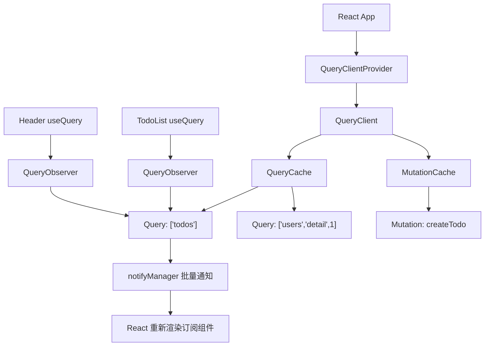
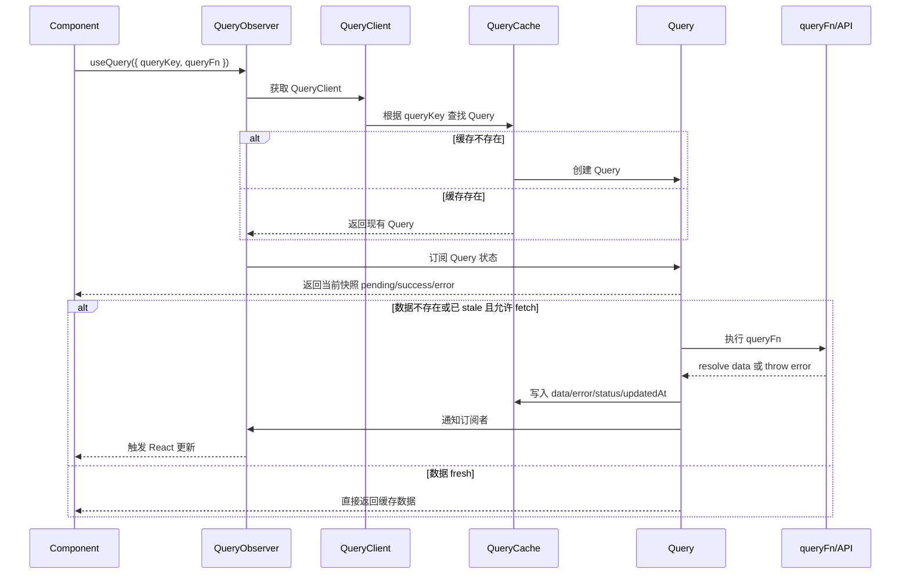
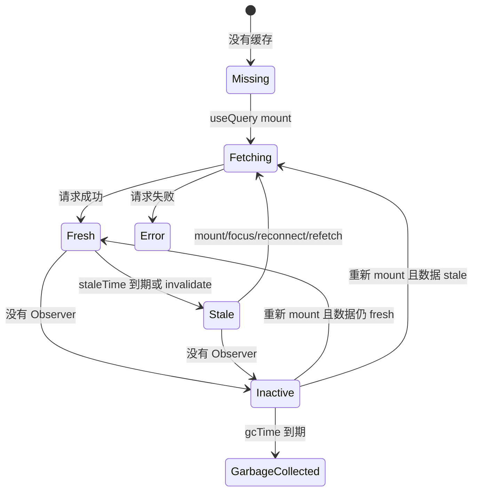
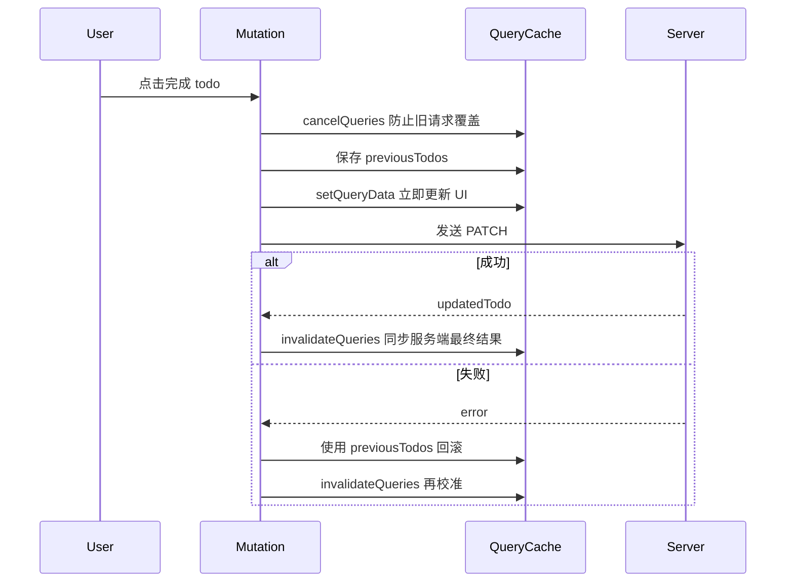

## TanStack Query 学习指南

> 版本基准：TanStack Query v5，示例默认使用 React + TypeScript + `@tanstack/react-query`。  
> 适合路径：先理解“服务端状态是什么”，再掌握 Query / Mutation / Cache，最后学习工程化封装、性能优化和常见坑。

## 目录

1. [TanStack Query 是什么](#1-tanstack-query-是什么)
2. [与传统请求方案的区别](#2-与传统请求方案的区别)
3. [快速开始](#3-快速开始)
4. [核心架构与运行流程](#4-核心架构与运行流程)
5. [Query：读取服务端数据](#5-query读取服务端数据)
6. [核心配置详解](#6-核心配置详解)
7. [缓存机制与数据生命周期](#7-缓存机制与数据生命周期)
8. [Mutation：创建、修改、删除数据](#8-mutation创建修改删除数据)
9. [失效、刷新、预取与缓存写入](#9-失效刷新预取与缓存写入)
10. [分页、无限滚动与轮询](#10-分页无限滚动与轮询)
11. [并发请求、依赖查询与动态查询](#11-并发请求依赖查询与动态查询)
12. [错误处理、重试与取消](#12-错误处理重试与取消)
13. [乐观更新](#13-乐观更新)
14. [React 工程化集成](#14-react-工程化集成)
15. [调试、性能优化与落地建议](#15-调试性能优化与落地建议)
16. [v5 与旧版本关键差异](#16-v5-与旧版本关键差异)
17. [常见最佳实践与反模式](#17-常见最佳实践与反模式)
18. [完整小型示例](#18-完整小型示例)
19. [参考资料](#19-参考资料)

---

## 1. TanStack Query 是什么

TanStack Query 是一个用于管理**服务端状态**的异步状态管理库。它不负责发请求本身，也不绑定某个 HTTP 客户端；你可以继续用 `fetch`、`axios`、GraphQL Client。它真正解决的是：请求结果如何缓存、什么时候重新请求、多个组件如何共享同一份数据、失败如何重试、修改数据后如何同步界面。

### 1.1 服务端状态与客户端状态

| 类型 | 数据来源 | 典型例子 | 更适合谁管理 |
| --- | --- | --- | --- |
| 客户端状态 | 浏览器内存、本地交互 | 弹窗开关、表单输入、主题、当前 tab | React state、Zustand、Redux |
| 服务端状态 | 后端、数据库、远程 API | 用户信息、订单列表、商品详情、评论分页 | TanStack Query |

服务端状态有几个天然难点：

- 数据不由前端完全拥有，随时可能被别人改掉。
- 数据有“新鲜 / 过期”的区别。
- 同一份数据可能被多个组件同时使用。
- 请求会失败、重试、取消、并发、重复。
- 修改数据后，旧缓存需要失效或同步更新。

TanStack Query 的核心思想是：**把远程数据当作可缓存、可订阅、可失效的资源，而不是普通组件状态。**

### 1.2 适用场景

适合：

- CRUD 后台、管理系统、移动端 App、内容站点、电商、仪表盘。
- 请求结果需要缓存、复用、后台刷新。
- 多个页面 / 组件使用同一份远程数据。
- 需要分页、无限滚动、轮询、预取、乐观更新。
- 需要与 SSR / 路由预加载 / 离线缓存等工程能力结合。

不适合或不该滥用：

- 纯本地 UI 状态，例如 modal 是否打开。
- 高频局部交互状态，例如输入框每个字符。
- WebSocket 实时流的全部状态管理。可以结合使用，但不要把它当成事件总线。
- 服务端已经用框架内置数据层完整管理的简单页面。此时要判断是否真的需要客户端缓存。

---

## 2. 与传统请求方案的区别

### 2.1 传统 `useEffect + fetch`

```tsx
import { useEffect, useState } from 'react'

type User = {
  id: number
  name: string
}

async function fetchUser(userId: number): Promise<User> {
  const res = await fetch(`/api/users/${userId}`)
  if (!res.ok) throw new Error('Failed to fetch user')
  return res.json()
}

export function UserCard({ userId }: { userId: number }) {
  const [data, setData] = useState<User | null>(null)
  const [loading, setLoading] = useState(false)
  const [error, setError] = useState<Error | null>(null)

  useEffect(() => {
    let ignore = false

    setLoading(true)
    setError(null)

    fetchUser(userId)
      .then((user) => {
        if (!ignore) setData(user)
      })
      .catch((err) => {
        if (!ignore) setError(err)
      })
      .finally(() => {
        if (!ignore) setLoading(false)
      })

    return () => {
      ignore = true
    }
  }, [userId])

  if (loading) return <p>Loading...</p>
  if (error) return <p>{error.message}</p>
  return <p>{data?.name}</p>
}
```

这段代码可以运行，但随着需求增加，你会继续补：

- 缓存同一个 `userId` 的结果。
- 多个组件共享同一请求。
- 聚焦窗口后刷新。
- 失败重试。
- 请求中断。
- 参数变化时保留上一页数据。
- 修改用户后让列表和详情同步刷新。

### 2.2 TanStack Query 写法

```tsx
import { useQuery } from '@tanstack/react-query'

type User = {
  id: number
  name: string
}

async function fetchUser(userId: number): Promise<User> {
  const res = await fetch(`/api/users/${userId}`)
  if (!res.ok) throw new Error('Failed to fetch user')
  return res.json()
}

export function UserCard({ userId }: { userId: number }) {
  const userQuery = useQuery({
    queryKey: ['users', 'detail', userId],
    queryFn: () => fetchUser(userId),
    staleTime: 1000 * 60,
  })

  if (userQuery.isPending) return <p>Loading...</p>
  if (userQuery.isError) return <p>{userQuery.error.message}</p>

  return <p>{userQuery.data.name}</p>
}
```

差异不只是代码更短，而是模型变了：

| 问题 | 传统请求 | TanStack Query |
| --- | --- | --- |
| loading / error / data | 手写 state | hook 直接返回 |
| 缓存 | 手写 Map 或放全局状态 | QueryCache 自动维护 |
| 重复请求 | 很容易重复 | 相同 queryKey 可共享 |
| 后台刷新 | 手写事件监听 | 内置策略 |
| 失败重试 | 手写 retry | `retry` / `retryDelay` |
| 数据修改后同步 | 手动串联请求 | invalidate / setQueryData |
| 分页与无限滚动 | 手动维护数组和状态 | `placeholderData` / `useInfiniteQuery` |

---

## 3. 快速开始

### 3.1 安装

```bash
npm install @tanstack/react-query
npm install -D @tanstack/eslint-plugin-query
```

调试工具可选：

```bash
npm install @tanstack/react-query-devtools
```

### 3.2 创建 QueryClient

`QueryClient` 是整个应用访问缓存和配置默认行为的入口。通常每个应用创建一个稳定实例。

```tsx
// src/queryClient.ts
import { QueryClient } from '@tanstack/react-query'

export const queryClient = new QueryClient({
  defaultOptions: {
    queries: {
      staleTime: 1000 * 30,
      gcTime: 1000 * 60 * 5,
      retry: 2,
      refetchOnWindowFocus: true,
    },
    mutations: {
      retry: 0,
    },
  },
})
```

### 3.3 接入 React

```tsx
// src/main.tsx
import React from 'react'
import ReactDOM from 'react-dom/client'
import { QueryClientProvider } from '@tanstack/react-query'
import { ReactQueryDevtools } from '@tanstack/react-query-devtools'
import { queryClient } from './queryClient'
import { App } from './App'

ReactDOM.createRoot(document.getElementById('root')!).render(
  <React.StrictMode>
    <QueryClientProvider client={queryClient}>
      <App />
      <ReactQueryDevtools initialIsOpen={false} />
    </QueryClientProvider>
  </React.StrictMode>,
)
```

### 3.4 第一个 Query

```tsx
import { useQuery } from '@tanstack/react-query'

type Todo = {
  id: number
  title: string
  completed: boolean
}

async function fetchTodos(): Promise<Todo[]> {
  const res = await fetch('/api/todos')
  if (!res.ok) throw new Error('Failed to fetch todos')
  return res.json()
}

export function TodoList() {
  const { data, isPending, isError, error, isFetching } = useQuery({
    queryKey: ['todos'],
    queryFn: fetchTodos,
  })

  if (isPending) return <p>Loading...</p>
  if (isError) return <p>{error.message}</p>

  return (
    <section>
      {isFetching && <small>Refreshing...</small>}
      <ul>
        {data.map((todo) => (
          <li key={todo.id}>{todo.title}</li>
        ))}
      </ul>
    </section>
  )
}
```

注意：v5 中初始无数据、正在等待的主状态是 `isPending`；`isLoading` 更偏向“首次实际 fetch 中”的派生状态。学习时先记住：**页面首屏无数据常用 `isPending`，后台刷新看 `isFetching`。**

---

## 4. 核心架构与运行流程

### 4.1 关键对象关系



### 4.2 每个角色做什么

| 对象 | 作用 | 你通常是否直接使用 |
| --- | --- | --- |
| `QueryClient` | 统一入口，提供默认配置、读写缓存、失效、预取、取消等方法 | 经常，通过 `useQueryClient` |
| `QueryCache` | 存放所有 Query 对象 | 偶尔，用于全局监听或底层调试 |
| `MutationCache` | 存放所有 Mutation 状态 | 偶尔，用于全局 mutation 监听 |
| `Query` | 某个 `queryKey` 对应的一份缓存记录 | 通常不直接操作 |
| `QueryObserver` | 组件与 Query 之间的订阅者，决定组件拿到哪些状态 | hook 内部使用 |
| `QueryKey` | 缓存身份标识，会被稳定 hash | 每个 query 都必须设计 |

### 4.3 一次 query 从发起到渲染发生了什么



### 4.4 设计背后的直觉

你在组件里写 `useQuery`，本质上不是“发一个请求”，而是：

1. 声明我需要哪份远程资源：`queryKey`。
2. 声明这份资源如何获取：`queryFn`。
3. 订阅这份资源的当前状态：`pending / success / error / fetching / stale`。
4. 让 QueryClient 决定是否需要请求、复用缓存、后台刷新、垃圾回收。

---

## 5. Query：读取服务端数据

### 5.1 Query 的最小组成

```tsx
const result = useQuery({
  queryKey: ['projects'],
  queryFn: async () => {
    const res = await fetch('/api/projects')
    if (!res.ok) throw new Error('Failed to fetch projects')
    return res.json() as Promise<Project[]>
  },
})
```

`queryKey` 和 `queryFn` 是最重要的两个字段：

- `queryKey` 决定缓存身份。
- `queryFn` 决定如何获取数据，必须返回 Promise，失败时应该 throw。

### 5.2 QueryKey 设计

推荐使用数组，并按“资源 -> 范围 -> 参数”组织：

```tsx
export const projectKeys = {
  all: ['projects'] as const,
  lists: () => [...projectKeys.all, 'list'] as const,
  list: (filters: ProjectFilters) => [...projectKeys.lists(), filters] as const,
  details: () => [...projectKeys.all, 'detail'] as const,
  detail: (id: string) => [...projectKeys.details(), id] as const,
}

useQuery({
  queryKey: projectKeys.list({ status: 'active', page: 1 }),
  queryFn: () => fetchProjects({ status: 'active', page: 1 }),
})

useQuery({
  queryKey: projectKeys.detail('p1'),
  queryFn: () => fetchProject('p1'),
})
```

这样做的好处：

- `invalidateQueries({ queryKey: projectKeys.all })` 可让所有项目相关缓存失效。
- `invalidateQueries({ queryKey: projectKeys.lists() })` 只刷新列表，不影响详情。
- key 集中管理，避免字符串拼错。

### 5.3 queryFn 如何拿到 queryKey

当参数较多时，可以从 `QueryFunctionContext` 中读取 `queryKey`：

```tsx
import type { QueryFunctionContext } from '@tanstack/react-query'

type ProductFilters = {
  keyword: string
  page: number
}

async function fetchProducts({
  queryKey,
  signal,
}: QueryFunctionContext<readonly ['products', ProductFilters]>) {
  const [, filters] = queryKey
  const params = new URLSearchParams({
    keyword: filters.keyword,
    page: String(filters.page),
  })

  const res = await fetch(`/api/products?${params}`, { signal })
  if (!res.ok) throw new Error('Failed to fetch products')
  return res.json() as Promise<Product[]>
}

useQuery({
  queryKey: ['products', { keyword: 'phone', page: 1 }] as const,
  queryFn: fetchProducts,
})
```

`signal` 来自 AbortController，可用于取消过期请求。

---

## 6. 核心配置详解

### 6.1 状态字段：`status` 与 `fetchStatus`

TanStack Query 把“有没有数据”和“现在是否在请求”分开。

| 字段 | 含义 |
| --- | --- |
| `status` | 数据结果状态：`pending` / `error` / `success` |
| `fetchStatus` | 请求行为状态：`fetching` / `paused` / `idle` |
| `isPending` | 还没有可用数据 |
| `isFetching` | 正在请求，包括后台刷新 |
| `isRefetching` | 已经有数据，又在重新请求 |
| `isSuccess` | 有成功数据 |
| `isError` | 当前结果为错误 |
| `isStale` | 数据已过期 |

示例：

```tsx
function UserPanel({ userId }: { userId: string }) {
  const query = useQuery({
    queryKey: ['users', userId],
    queryFn: () => fetchUser(userId),
  })

  if (query.isPending) return <p>First loading...</p>
  if (query.isError) return <p>{query.error.message}</p>

  return (
    <article>
      <h2>{query.data.name}</h2>
      {query.isRefetching && <small>Updating in background...</small>}
    </article>
  )
}
```

### 6.2 `staleTime`

`staleTime` 表示数据在多长时间内被认为是 fresh。fresh 数据通常不会因为组件重新挂载、窗口聚焦等原因自动重新请求。

```tsx
useQuery({
  queryKey: ['settings'],
  queryFn: fetchSettings,
  staleTime: 1000 * 60 * 10,
})
```

什么时候调大：

- 用户资料、系统配置、枚举字典等变化不频繁。
- 页面来回切换时不希望重复请求。

什么时候保持较小：

- 订单状态、通知、任务进度等需要较新数据。

### 6.3 `gcTime`

`gcTime` 表示 query 没有观察者后，缓存保留多久再被垃圾回收。v5 中它取代旧名 `cacheTime`。

```tsx
useQuery({
  queryKey: ['countries'],
  queryFn: fetchCountries,
  staleTime: Infinity,
  gcTime: 1000 * 60 * 60,
})
```

理解重点：

- 只要还有组件在订阅这个 query，`gcTime` 不会开始倒计时。
- 组件卸载后 query 变成 inactive，才开始计算垃圾回收时间。
- `staleTime` 管“要不要重新请求”，`gcTime` 管“没人用后缓存保留多久”。

### 6.4 `enabled`

`enabled` 用于条件查询。它适合“依赖参数存在才请求”的场景。

```tsx
function TeamMembers({ teamId }: { teamId?: string }) {
  const membersQuery = useQuery({
    queryKey: ['teams', teamId, 'members'],
    queryFn: () => fetchTeamMembers(teamId!),
    enabled: Boolean(teamId),
  })

  if (!teamId) return <p>Please select a team.</p>
  if (membersQuery.isPending) return <p>Loading...</p>

  return <MemberList members={membersQuery.data ?? []} />
}
```

注意：长期把 query 设置为 `enabled: false` 再靠 `refetch()` 触发，会让代码从声明式变成命令式，并失去不少自动刷新能力。更推荐用状态表达依赖。

### 6.5 `placeholderData`

`placeholderData` 是“临时显示的数据”，不会真正作为成功数据持久写入缓存。常用于分页时保留上一页，避免界面闪烁。

```tsx
import { keepPreviousData, useQuery } from '@tanstack/react-query'

function ProjectPage({ page }: { page: number }) {
  const projectsQuery = useQuery({
    queryKey: ['projects', { page }],
    queryFn: () => fetchProjects(page),
    placeholderData: keepPreviousData,
  })

  return (
    <section>
      {projectsQuery.data?.items.map((project) => (
        <p key={project.id}>{project.name}</p>
      ))}
      {projectsQuery.isPlaceholderData && <small>Loading next page...</small>}
    </section>
  )
}
```

### 6.6 `initialData`

`initialData` 是“我已经有一份可被当作真实结果的数据”，会写入缓存。不要用半截数据、占位骨架数据填它。

```tsx
function TodoDetail({
  todoId,
  initialTodo,
}: {
  todoId: number
  initialTodo: Todo
}) {
  const todoQuery = useQuery({
    queryKey: ['todos', 'detail', todoId],
    queryFn: () => fetchTodo(todoId),
    initialData: initialTodo,
    initialDataUpdatedAt: Date.now(),
    staleTime: 1000 * 60,
  })

  return <h2>{todoQuery.data.title}</h2>
}
```

常见判断：

| 需求 | 使用 |
| --- | --- |
| 只是加载期间临时展示 | `placeholderData` |
| 已有完整可信数据，想跳过首次 loading | `initialData` |
| 想在进入页面前加载 | `queryClient.prefetchQuery` |
| 想手动写入最新结果 | `queryClient.setQueryData` |

### 6.7 `select`

`select` 用于从原始数据中派生组件需要的数据。它不会改变缓存中的原始数据，只改变当前 observer 看到的结果。

```tsx
function CompletedTodoCount() {
  const countQuery = useQuery({
    queryKey: ['todos'],
    queryFn: fetchTodos,
    select: (todos) => todos.filter((todo) => todo.completed).length,
  })

  if (countQuery.isPending) return <span>...</span>
  return <span>{countQuery.data}</span>
}
```

适合：

- 组件只需要列表中的数量、某个字段、局部映射。
- 减少组件渲染时的计算。

不适合：

- 有副作用的转换。
- 需要修改缓存原始结构。那应该用 `setQueryData`。

### 6.8 `refetch`

`refetch` 是当前 query observer 返回的手动刷新函数。

```tsx
function RefreshableTodos() {
  const todosQuery = useQuery({
    queryKey: ['todos'],
    queryFn: fetchTodos,
    enabled: false,
  })

  return (
    <button type="button" onClick={() => todosQuery.refetch()}>
      Load todos
    </button>
  )
}
```

注意：`refetch` 不适合传新参数。参数应该进入 `queryKey`，由 key 变化驱动请求。

---

## 7. 缓存机制与数据生命周期

### 7.1 生命周期图



### 7.2 默认行为

常见默认值需要记住：

- `staleTime` 默认是 `0`，所以数据请求成功后立刻就被视为 stale。
- stale 不代表没有缓存；它只是“允许在合适时机后台刷新”。
- inactive query 默认大约 5 分钟后被垃圾回收。
- 查询失败默认会重试。
- 窗口重新聚焦、网络恢复、组件重新挂载时，stale query 可能自动重新请求。

### 7.3 缓存命中流程

```tsx
function A() {
  useQuery({ queryKey: ['profile'], queryFn: fetchProfile })
  return null
}

function B() {
  useQuery({ queryKey: ['profile'], queryFn: fetchProfile })
  return null
}
```

如果 A 和 B 同时订阅 `['profile']`：

1. QueryCache 中只会维护一份 `['profile']` 对应的 Query。
2. A 和 B 各有自己的 QueryObserver。
3. 请求结果写入 Query 后，两个 Observer 都会收到通知。
4. 两个组件都会基于同一份缓存重新渲染。

---

## 8. Mutation：创建、修改、删除数据

Query 负责读，Mutation 负责写。写操作不会自动知道哪些查询要刷新，你需要通过 `invalidateQueries` 或 `setQueryData` 告诉它。

### 8.1 基础 Mutation

```tsx
import { useMutation, useQueryClient } from '@tanstack/react-query'

type CreateTodoInput = {
  title: string
}

async function createTodo(input: CreateTodoInput): Promise<Todo> {
  const res = await fetch('/api/todos', {
    method: 'POST',
    headers: { 'Content-Type': 'application/json' },
    body: JSON.stringify(input),
  })
  if (!res.ok) throw new Error('Failed to create todo')
  return res.json()
}

export function AddTodoForm() {
  const queryClient = useQueryClient()

  const createTodoMutation = useMutation({
    mutationFn: createTodo,
    onSuccess: () => {
      queryClient.invalidateQueries({ queryKey: ['todos'] })
    },
  })

  return (
    <form
      onSubmit={(event) => {
        event.preventDefault()
        const form = new FormData(event.currentTarget)
        createTodoMutation.mutate({ title: String(form.get('title')) })
        event.currentTarget.reset()
      }}
    >
      <input name="title" />
      <button type="submit" disabled={createTodoMutation.isPending}>
        {createTodoMutation.isPending ? 'Saving...' : 'Add'}
      </button>
      {createTodoMutation.isError && <p>{createTodoMutation.error.message}</p>}
    </form>
  )
}
```

### 8.2 `mutate` 与 `mutateAsync`

```tsx
const updateTodoMutation = useMutation({
  mutationFn: updateTodo,
})

// 事件驱动，回调式
updateTodoMutation.mutate(
  { id: 1, title: 'New title' },
  {
    onSuccess: (todo) => {
      console.log(todo)
    },
  },
)

// async/await
await updateTodoMutation.mutateAsync({ id: 1, title: 'New title' })
```

选择建议：

- 表单提交、按钮点击：多数时候用 `mutate`。
- 需要串行执行多个异步步骤：用 `mutateAsync`。

### 8.3 Mutation 回调顺序

```tsx
useMutation({
  mutationFn: updateTodo,
  onMutate: async (variables) => {
    // 请求真正发出前。常用于乐观更新、取消相关查询。
    return { previousTodos: [] as Todo[] }
  },
  onError: (error, variables, context) => {
    // 失败后回滚。
  },
  onSuccess: (data, variables, context) => {
    // 成功后写缓存或失效。
  },
  onSettled: (data, error, variables, context) => {
    // 成功失败都会执行。常用于最终 invalidate。
  },
})
```

---

## 9. 失效、刷新、预取与缓存写入

### 9.1 `invalidateQueries`

失效表示“这份缓存不再可信”。如果当前有组件订阅，它通常会触发后台重新请求。

```tsx
const queryClient = useQueryClient()

queryClient.invalidateQueries({ queryKey: ['todos'] })
```

按层级 key 设计后，可以精确控制刷新范围：

```tsx
// 刷新全部 todo 相关数据
queryClient.invalidateQueries({ queryKey: ['todos'] })

// 只刷新 todo 列表
queryClient.invalidateQueries({ queryKey: ['todos', 'list'] })

// 精确刷新某个详情
queryClient.invalidateQueries({ queryKey: ['todos', 'detail', todoId] })
```

### 9.2 `refetchQueries`

`refetchQueries` 更直接：让匹配的查询重新请求。

```tsx
await queryClient.refetchQueries({
  queryKey: ['notifications'],
  type: 'active',
})
```

一般优先用 `invalidateQueries` 表达“数据过期了”，只有需要立即强制刷新一批 query 时再考虑 `refetchQueries`。

### 9.3 `setQueryData`

通常情况下，我们是通过 `useQuery` 自动去服务器拉取数据并写入缓存的

而 `setQueryData` 允许你**绕过异步请求，直接手动修改或向缓存中写入数据**。像是 TanStack Query 内部状态管理器的 `setState`。

---

`setQueryData` 是 `queryClient` 实例上的一个方法。它接受两个参数：

1. **`queryKey`**：你要修改哪条缓存数据的唯一标识（数组形式）。
    
2. **`updater`**：新数据，或者一个通过旧数据计算新数据的函数。

当 mutation 返回了新数据，可以直接写缓存，避免再请求一次。

```tsx
const updateTodoMutation = useMutation({
  mutationFn: updateTodo,
  onSuccess: (updatedTodo) => {
    queryClient.setQueryData<Todo>(
      ['todos', 'detail', updatedTodo.id],
      updatedTodo,
    )

    queryClient.setQueryData<Todo[]>(['todos'], (oldTodos) => {
	  // 如果原本没缓存，返回缓存
      if (!oldTodos) return oldTodos
      return oldTodos.map((todo) =>
        todo.id === updatedTodo.id ? updatedTodo : todo,
      )
    })
  },
})
```

重点：`setQueryData` 必须以不可变方式返回新对象，不要原地修改旧数组或旧对象。


### 9.4 `getQueryData`

读取现有缓存，不触发请求。

```tsx
const cachedTodos = queryClient.getQueryData<Todo[]>(['todos'])
```

适合：

- 从列表缓存里给详情页提供 `initialData`。
- 判断是否已有缓存。
- 调试或事件处理。

### 9.5 `prefetchQuery`

预取表示“现在先把数据放进缓存，稍后组件真正渲染时直接命中”。

```tsx
function ProjectLink({ projectId }: { projectId: string }) {
  const queryClient = useQueryClient()

  return (
    <a
      href={`/projects/${projectId}`}
      onMouseEnter={() => {
        queryClient.prefetchQuery({
          queryKey: ['projects', 'detail', projectId],
          queryFn: () => fetchProject(projectId),
          staleTime: 1000 * 60,
        })
      }}
    >
      View project
    </a>
  )
}
```


---

## 10. 分页、无限滚动与轮询

### 10.1 普通分页

分页的页码必须进入 `queryKey`。否则不同页会共用同一份缓存。

```tsx
import { keepPreviousData, useQuery } from '@tanstack/react-query'

type PageResult<T> = {
  items: T[]
  page: number
  hasMore: boolean
}

function ProjectsTable() {
  const [page, setPage] = useState(1)

  const projectsQuery = useQuery({
    queryKey: ['projects', 'list', { page }],
    queryFn: () => fetchProjects({ page }),
    placeholderData: keepPreviousData,
  })

  return (
    <section>
      {projectsQuery.data?.items.map((project) => (
        <p key={project.id}>{project.name}</p>
      ))}

      <button
        type="button"
        disabled={page === 1}
        onClick={() => setPage((value) => value - 1)}
      >
        Prev
      </button>
      <button
        type="button"
        disabled={
          projectsQuery.isPlaceholderData || !projectsQuery.data?.hasMore
        }
        onClick={() => setPage((value) => value + 1)}
      >
        Next
      </button>
    </section>
  )
}
```

### 10.2 无限滚动

```tsx
import { useInfiniteQuery } from '@tanstack/react-query'

type CursorPage = {
  items: Project[]
  nextCursor?: string
}

function InfiniteProjects() {
  const projectsQuery = useInfiniteQuery({
    queryKey: ['projects', 'infinite'],
    initialPageParam: undefined as string | undefined,
    queryFn: ({ pageParam }) => fetchProjectsByCursor(pageParam),
    getNextPageParam: (lastPage) => lastPage.nextCursor,
  })

  const projects = projectsQuery.data?.pages.flatMap((page) => page.items) ?? []

  return (
    <section>
      {projects.map((project) => (
        <p key={project.id}>{project.name}</p>
      ))}
      <button
        type="button"
        disabled={!projectsQuery.hasNextPage || projectsQuery.isFetchingNextPage}
        onClick={() => projectsQuery.fetchNextPage()}
      >
        {projectsQuery.isFetchingNextPage ? 'Loading...' : 'Load more'}
      </button>
    </section>
  )
}
```

v5 注意点：`useInfiniteQuery` 需要显式提供 `initialPageParam`。

### 10.3 轮询

```tsx
function JobStatus({ jobId }: { jobId: string }) {
  const jobQuery = useQuery({
    queryKey: ['jobs', jobId],
    queryFn: () => fetchJob(jobId),
    refetchInterval: (query) => {
      return query.state.data?.status === 'done' ? false : 2000
    },
    refetchIntervalInBackground: false,
  })

  if (jobQuery.isPending) return <p>Loading...</p>
  return <p>Status: {jobQuery.data.status}</p>
}
```

轮询适合任务状态、导出进度、支付状态。不要给大列表、昂贵接口盲目设置短间隔。

默认情况下，如果用户**离开了当前标签页（Tab 失去了焦点）**，或者**点击了页面的其他地方导致浏览器处于后台**，TanStack Query 会**暂停**轮询，以节省用户的流量和服务器资源。

如果希望**无论用户在不在这个网页，都在后台持续轮询**，需要配合 `refetchIntervalInBackground` 参数

---

## 11. 并发请求、依赖查询与动态查询

### 11.1 静态并发

多个 `useQuery` 并排写就是并发。

```tsx
function Dashboard() {
  const profileQuery = useQuery({
    queryKey: ['profile'],
    queryFn: fetchProfile,
  })

  const statsQuery = useQuery({
    queryKey: ['stats'],
    queryFn: fetchStats,
  })

  if (profileQuery.isPending || statsQuery.isPending) return <p>Loading...</p>
  return <DashboardView profile={profileQuery.data} stats={statsQuery.data} />
}
```

### 11.2 动态并发：`useQueries`

```tsx
import { useQueries } from '@tanstack/react-query'

function UserNames({ userIds }: { userIds: string[] }) {
  const userQueries = useQueries({
    queries: userIds.map((id) => ({
      queryKey: ['users', 'detail', id],
      queryFn: () => fetchUser(id),
      staleTime: 1000 * 60,
    })),
  })

  if (userQueries.some((query) => query.isPending)) return <p>Loading...</p>

  return (
    <ul>
      {userQueries.map((query) =>
        query.isSuccess ? <li key={query.data.id}>{query.data.name}</li> : null,
      )}
    </ul>
  )
}
```

### 11.3 依赖查询

依赖查询就是第二个 query 依赖第一个 query 的结果。

```tsx
function UserProjects({ email }: { email: string }) {
  const userQuery = useQuery({
    queryKey: ['users', 'by-email', email],
    queryFn: () => fetchUserByEmail(email),
  })

  const projectsQuery = useQuery({
    queryKey: ['projects', 'by-user', userQuery.data?.id],
    queryFn: () => fetchProjectsByUser(userQuery.data!.id),
    enabled: Boolean(userQuery.data?.id),
  })

  if (userQuery.isPending) return <p>Loading user...</p>
  if (projectsQuery.isPending) return <p>Loading projects...</p>

  return <ProjectList projects={projectsQuery.data ?? []} />
}
```

如果两个请求没有真实依赖，不要人为串行；并发能减少瀑布请求。

---

## 12. 错误处理、重试与取消

### 12.1 queryFn 必须 throw

`fetch` 遇到 HTTP 400 / 500 不会自动 reject，所以要手动判断。

```tsx
async function fetchJson<T>(url: string, init?: RequestInit): Promise<T> {
  const res = await fetch(url, init)
  if (!res.ok) {
    const message = await res.text()
    throw new Error(message || `Request failed: ${res.status}`)
  }
  return res.json() as Promise<T>
}
```

### 12.2 重试

```tsx
useQuery({
  queryKey: ['report'],
  queryFn: fetchReport,
  retry: (failureCount, error) => {
    if (error.message.includes('401')) return false
    return failureCount < 2
  },
  retryDelay: (attempt) => Math.min(1000 * 2 ** attempt, 30_000),
})
```

建议：

- GET 请求可以重试。
- POST / PUT / DELETE 默认谨慎重试，避免重复提交。
- 401、403、业务校验错误通常不要重试。

### 12.3 全局错误处理

```tsx
import { MutationCache, QueryCache, QueryClient } from '@tanstack/react-query'

export const queryClient = new QueryClient({
  queryCache: new QueryCache({
    onError: (error) => {
      console.error('Query error:', error)
    },
  }),
  mutationCache: new MutationCache({
    onError: (error) => {
      console.error('Mutation error:', error)
    },
  }),
})
```

全局处理适合打日志、上报监控、统一 toast。具体页面仍然应该有局部错误 UI。

### 12.4 取消请求

```tsx
async function fetchSearch(keyword: string, signal?: AbortSignal) {
  const res = await fetch(`/api/search?q=${keyword}`, { signal })
  if (!res.ok) throw new Error('Failed to search')
  return res.json() as Promise<SearchResult[]>
}

useQuery({
  queryKey: ['search', keyword],
  queryFn: ({ signal }) => fetchSearch(keyword, signal),
  enabled: keyword.length > 0,
})
```

当 query 过期、参数变化、组件卸载时，TanStack Query 可以把 `signal` 传给 queryFn，前提是你的请求库支持 AbortSignal。

---

## 13. 乐观更新

乐观更新是指：用户操作后先更新 UI，再等待服务端确认。失败时回滚。

### 13.1 典型流程



### 13.2 示例

```tsx
function useToggleTodo() {
  const queryClient = useQueryClient()

  return useMutation({
    mutationFn: toggleTodo,
    onMutate: async (todoId: number) => {
      // 取消正在进行的重新获取，避免覆盖我们的乐观更新
      await queryClient.cancelQueries({ queryKey: ['todos'] })
	  // 保存旧数据用于回滚
      const previousTodos = queryClient.getQueryData<Todo[]>(['todos'])
	  // 乐观更新：立刻修改缓存让 UI 发生变化
      queryClient.setQueryData<Todo[]>(['todos'], (oldTodos) => {
        if (!oldTodos) return oldTodos
        return oldTodos.map((todo) =>
          todo.id === todoId
            ? { ...todo, completed: !todo.completed }
            : todo,
        )
      })
	  // 返回上下文对象（包含旧数据）
      return { previousTodos }
    },
    // 如果后端报错了，把数据回滚回去
    onError: (_error, _todoId, context) => {
      queryClient.setQueryData(['todos'], context?.previousTodos)
    },
    onSettled: () => {
      queryClient.invalidateQueries({ queryKey: ['todos'] })
    },
  })
}
```

使用场景：

- 点赞、收藏、勾选完成、简单排序。
- 用户能容忍失败后回滚。

谨慎使用：

- 金额、库存、权限、支付等强一致业务。
- 服务端返回结构复杂且冲突概率高的操作。

---

## 14. React 工程化集成

### 14.1 推荐目录结构

```text
src/
  api/
    http.ts
    todos.ts
  query/
    queryClient.ts
    keys.ts
  features/
    todos/
      todoQueries.ts
      TodoList.tsx
      AddTodoForm.tsx
```

### 14.2 API 层

```tsx
// src/api/http.ts
export async function http<T>(url: string, init?: RequestInit): Promise<T> {
  const res = await fetch(url, {
    ...init,
    headers: {
      'Content-Type': 'application/json',
      ...init?.headers,
    },
  })

  if (!res.ok) {
    throw new Error(await res.text())
  }

  return res.json() as Promise<T>
}
```

```tsx
// src/api/todos.ts
import { http } from './http'

export type Todo = {
  id: number
  title: string
  completed: boolean
}

export function fetchTodos() {
  return http<Todo[]>('/api/todos')
}

export function createTodo(input: { title: string }) {
  return http<Todo>('/api/todos', {
    method: 'POST',
    body: JSON.stringify(input),
  })
}
```

### 14.3 queryOptions 封装

v5 推荐用 `queryOptions` 复用配置并保留类型推导。

```tsx
// src/features/todos/todoQueries.ts
import { queryOptions } from '@tanstack/react-query'
import { fetchTodos } from '../../api/todos'

export const todoKeys = {
  all: ['todos'] as const,
  lists: () => [...todoKeys.all, 'list'] as const,
}

export const todoQueries = {
  list: () =>
    queryOptions({
      queryKey: todoKeys.lists(),
      queryFn: fetchTodos,
      staleTime: 1000 * 30,
    }),
}
```

```tsx
import { useQuery } from '@tanstack/react-query'
import { todoQueries } from './todoQueries'

export function TodoList() {
  const todosQuery = useQuery(todoQueries.list())

  if (todosQuery.isPending) return <p>Loading...</p>
  return todosQuery.data.map((todo) => <p key={todo.id}>{todo.title}</p>)
}
```

### 14.4 SSR / 路由预加载的思路

在 Next.js、TanStack Router、React Router loader 中常见模式是：

1. 路由进入前 `prefetchQuery` 或 `ensureQueryData`。
2. 页面组件内部仍然调用 `useQuery` 订阅缓存。
3. 服务端渲染时使用 hydrate/dehydrate 把服务端缓存交给客户端。

路由层负责“提前准备数据”，组件层负责“订阅数据并响应刷新”。

---

## 15. 调试、性能优化与落地建议

### 15.1 Devtools 看什么

Devtools 重点看：

- queryKey 是否符合预期。
- 数据是 fresh 还是 stale。
- observer 数量。
- 最后更新时间。
- 请求是否重复、是否一直 fetching。
- inactive query 是否按预期被回收。

### 15.2 性能优化

| 手段 | 解决什么问题 |
| --- | --- |
| 合理设置 `staleTime` | 避免切页、聚焦时过度请求 |
| 设计稳定 queryKey | 避免缓存碎片和错误复用 |
| 使用 `select` | 降低组件订阅的数据面 |
| 使用 `placeholderData` | 分页切换更平滑 |
| 路由预取 | 降低页面进入时白屏 |
| 避免请求瀑布 | 无依赖的 query 并发发起 |
| Devtools + 日志 | 发现重复请求和错误刷新 |

### 15.3 什么时候该手动写缓存

适合 `setQueryData`：

- mutation 返回了完整的新实体。
- 修改结果可以很容易映射到列表和详情。
- 想要减少一次额外 GET。

适合 `invalidateQueries`：

- 服务端会产生额外副作用。
- 列表排序、分页、筛选复杂。
- 不确定本地如何合并才正确。

工程里常用组合：

```tsx
onSuccess: (updatedTodo) => {
  queryClient.setQueryData(['todos', 'detail', updatedTodo.id], updatedTodo)
  queryClient.invalidateQueries({ queryKey: ['todos', 'list'] })
}
```

---

## 16. v5 与旧版本关键差异

| 旧写法 / 旧概念 | v5 写法 / 变化 |
| --- | --- |
| `useQuery(key, fn, options)` | 只支持对象格式：`useQuery({ queryKey, queryFn, ...options })` |
| `cacheTime` | 改名为 `gcTime`，更准确表示垃圾回收时间 |
| `keepPreviousData: true` | 使用 `placeholderData: keepPreviousData` |
| `useErrorBoundary` | 改名为 `throwOnError` |
| query callbacks：`onSuccess/onError/onSettled` | 从 `useQuery` / `QueryObserver` 中移除，副作用应放在业务层、mutation 或订阅层 |
| `isLoading` 作为主要首屏状态 | v5 更推荐理解 `isPending`、`isFetching`、`isLoading` 的区别 |
| infinite query 可省略初始参数 | v5 需要 `initialPageParam` |
| `refetchPage` | 使用 `maxPages` 等新模式替代 |

迁移时最容易踩的点：

- 旧教程大量使用三参数写法，v5 需要改成对象写法。
- `cacheTime` 改名不是语义小改。它不是“缓存多久都不请求”，而是“没人订阅后多久回收”。
- `placeholderData` 替代 `keepPreviousData` 后，结果会有 `isPlaceholderData` 标识。

---

## 17. 常见最佳实践与反模式

### 17.1 最佳实践

1. queryKey 必须包含所有影响请求结果的参数。
2. key 使用数组层级，不要手写字符串拼接。
3. `queryFn` 放在组件外或 API 层，组件只负责传参数。
4. 对低频变化数据设置合理 `staleTime`。
5. mutation 成功后明确选择 `invalidateQueries` 或 `setQueryData`。
6. 列表、详情、筛选条件分别设计 key。
7. 对分页使用 `placeholderData` 改善体验。
8. 对搜索框做 debounce 后再进入 queryKey。
9. 用 Devtools 观察缓存，而不是靠猜。
10. 在团队内统一封装 `queryClient`、`keys`、`http` 错误处理。

### 17.2 反模式

| 反模式 | 问题 | 更好的做法 |
| --- | --- | --- |
| `queryKey: ['todos']`，但请求里用了 page/filter | 不同参数复用同一缓存，数据错乱 | `['todos', { page, filter }]` |
| 用 `enabled: false` + `refetch(params)` 做搜索 | 参数不进 key，缓存不可追踪 | 参数进入 state 和 queryKey |
| 把服务端数据复制到 Redux/Zustand | 双份数据源，容易不同步 | 直接使用 Query 缓存 |
| `staleTime: Infinity` 到处用 | 数据长期不刷新 | 只给真正稳定的数据使用 |
| 在 `select` 里产生副作用 | 渲染和数据订阅变得不可预测 | 副作用放事件或 mutation 回调 |
| 原地修改 `oldData` | React 和 Query 可能无法正确识别变化 | 返回新数组 / 新对象 |
| 每个组件 new QueryClient | 缓存被拆散，状态丢失 | 应用级稳定单例 |

---

## 18. 完整小型示例

下面把查询、分页、创建、乐观更新、失效串起来。

```tsx
import {
  QueryClient,
  QueryClientProvider,
  keepPreviousData,
  queryOptions,
  useMutation,
  useQuery,
  useQueryClient,
} from '@tanstack/react-query'

type Todo = {
  id: number
  title: string
  completed: boolean
}

type TodoPage = {
  items: Todo[]
  page: number
  hasMore: boolean
}

const queryClient = new QueryClient({
  defaultOptions: {
    queries: {
      staleTime: 1000 * 30,
      gcTime: 1000 * 60 * 5,
      retry: 2,
    },
  },
})

async function http<T>(url: string, init?: RequestInit): Promise<T> {
  const res = await fetch(url, {
    ...init,
    headers: {
      'Content-Type': 'application/json',
      ...init?.headers,
    },
  })

  if (!res.ok) throw new Error(await res.text())
  return res.json() as Promise<T>
}

const todoKeys = {
  all: ['todos'] as const,
  lists: () => [...todoKeys.all, 'list'] as const,
  list: (page: number) => [...todoKeys.lists(), { page }] as const,
}

function fetchTodoPage(page: number) {
  return http<TodoPage>(`/api/todos?page=${page}`)
}

function createTodo(input: { title: string }) {
  return http<Todo>('/api/todos', {
    method: 'POST',
    body: JSON.stringify(input),
  })
}

function toggleTodo(todoId: number) {
  return http<Todo>(`/api/todos/${todoId}/toggle`, {
    method: 'PATCH',
  })
}

const todoQueries = {
  list: (page: number) =>
    queryOptions({
      queryKey: todoKeys.list(page),
      queryFn: () => fetchTodoPage(page),
      placeholderData: keepPreviousData,
    }),
}

function useCreateTodo() {
  const queryClient = useQueryClient()

  return useMutation({
    mutationFn: createTodo,
    onSuccess: () => {
      queryClient.invalidateQueries({ queryKey: todoKeys.lists() })
    },
  })
}

function useToggleTodo(page: number) {
  const queryClient = useQueryClient()

  return useMutation({
    mutationFn: toggleTodo,
    onMutate: async (todoId) => {
      await queryClient.cancelQueries({ queryKey: todoKeys.list(page) })
      const previousPage = queryClient.getQueryData<TodoPage>(todoKeys.list(page))

      queryClient.setQueryData<TodoPage>(todoKeys.list(page), (oldPage) => {
        if (!oldPage) return oldPage

        return {
          ...oldPage,
          items: oldPage.items.map((todo) =>
            todo.id === todoId
              ? { ...todo, completed: !todo.completed }
              : todo,
          ),
        }
      })

      return { previousPage }
    },
    onError: (_error, _todoId, context) => {
      queryClient.setQueryData(todoKeys.list(page), context?.previousPage)
    },
    onSettled: () => {
      queryClient.invalidateQueries({ queryKey: todoKeys.list(page) })
    },
  })
}

function TodosPage() {
  const [page, setPage] = React.useState(1)
  const todosQuery = useQuery(todoQueries.list(page))
  const createTodoMutation = useCreateTodo()
  const toggleTodoMutation = useToggleTodo(page)

  if (todosQuery.isPending) return <p>Loading...</p>
  if (todosQuery.isError) return <p>{todosQuery.error.message}</p>

  return (
    <section>
      <form
        onSubmit={(event) => {
          event.preventDefault()
          const form = new FormData(event.currentTarget)
          createTodoMutation.mutate({ title: String(form.get('title')) })
          event.currentTarget.reset()
        }}
      >
        <input name="title" />
        <button type="submit" disabled={createTodoMutation.isPending}>
          Add
        </button>
      </form>

      {todosQuery.isFetching && <small>Refreshing...</small>}

      <ul>
        {todosQuery.data.items.map((todo) => (
          <li key={todo.id}>
            <label>
              <input
                type="checkbox"
                checked={todo.completed}
                onChange={() => toggleTodoMutation.mutate(todo.id)}
              />
              {todo.title}
            </label>
          </li>
        ))}
      </ul>

      <button
        type="button"
        disabled={page === 1}
        onClick={() => setPage((value) => value - 1)}
      >
        Prev
      </button>
      <button
        type="button"
        disabled={todosQuery.isPlaceholderData || !todosQuery.data.hasMore}
        onClick={() => setPage((value) => value + 1)}
      >
        Next
      </button>
    </section>
  )
}

export function App() {
  return (
    <QueryClientProvider client={queryClient}>
      <TodosPage />
    </QueryClientProvider>
  )
}
```

这个示例包含了：

- `QueryClientProvider` 接入。
- `queryOptions` 复用查询配置。
- 分页 queryKey。
- `placeholderData: keepPreviousData`。
- mutation 成功后失效列表。
- 乐观更新与失败回滚。
- `isPending`、`isFetching`、`isPlaceholderData` 的实际使用。

---

## 19. 参考资料

- TanStack Query 官方首页：https://tanstack.com/query/latest
- React `useQuery` API：https://tanstack.com/query/latest/docs/framework/react/reference/useQuery
- QueryClient API：https://tanstack.com/query/latest/docs/reference/QueryClient
- Initial Query Data：https://tanstack.com/query/latest/docs/framework/react/guides/initial-query-data
- Disabling / Pausing Queries：https://tanstack.com/query/latest/docs/framework/react/guides/disabling-queries
- Mutations：https://tanstack.com/query/latest/docs/framework/react/guides/mutations
- Optimistic Updates：https://tanstack.com/query/latest/docs/framework/react/guides/optimistic-updates
- Infinite Queries：https://tanstack.com/query/latest/docs/framework/react/guides/infinite-queries
- Migrating to v5：https://tanstack.com/query/v5/docs/framework/react/guides/migrating-to-v5

---

## 最后小结

学习 TanStack Query 时，不要把它理解成“更好用的 fetch hook”。它真正提供的是一套服务端状态模型：

- 用 `queryKey` 标识远程资源。
- 用 `QueryClient` 管理缓存、失效、预取和写入。
- 用 `QueryObserver` 把缓存状态订阅到 React 组件。
- 用 `staleTime` 和 `gcTime` 分别控制新鲜度和回收。
- 用 `Mutation` 表达写操作，再通过 invalidate 或 setQueryData 同步读缓存。

掌握这套模型后，分页、轮询、预取、乐观更新、SSR、水合和工程封装都会变得自然很多。
