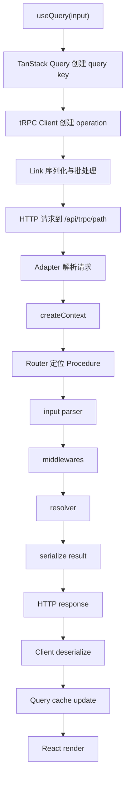

# tRPC 深度学习指南

> 版本基准：tRPC 11.x，npm latest 参考 `@trpc/server@11.17.0`。本文面向已经掌握 TypeScript / React / Node 基础的开发者，目标不是“会写一个 demo”，而是建立从 RPC 模型、类型推导、运行流程到中大型工程落地的完整认知。

---

## 0. 学习路线图

学习 tRPC 最容易走偏的地方，是只记住 `router`、`procedure`、`useQuery` 这些 API，却没有理解它为什么能做到“端到端类型安全”。建议按下面路径学习：

1. 先理解 RPC：客户端调用远程函数，本质是序列化一次函数调用。
2. 再理解 tRPC 的契约来源：服务端 Router 的 TypeScript 类型。
3. 再掌握 Procedure：Query、Mutation、Subscription 三类远程能力。
4. 再看运行时链路：Client Link -> HTTP / WS -> Adapter -> Router -> Procedure。
5. 再进入工程实践：Context、Middleware、Zod、Prisma、TanStack Query、Next.js App Router。
6. 最后学习架构权衡：何时用 tRPC，何时不用，如何拆分 Router，如何治理类型复杂度。


---

## 1. tRPC 是什么

tRPC 是 TypeScript Remote Procedure Call。它允许你在服务端定义一组函数式 API，然后让客户端像调用本地对象方法一样调用这些 API，并自动获得输入、输出和错误类型提示。

官方对 tRPC 的定位是：在全栈 TypeScript 项目中，不通过 schema 文件或代码生成，而直接借助 TypeScript 类型推导来保持 API 契约同步。换句话说，tRPC 的核心不是“新的 HTTP 协议”，而是“把服务端 Router 的类型暴露给客户端编译器”。

### 1.1 它解决的核心问题

| 传统问题 | tRPC 的设计 |
| --- | --- |
| 前后端接口类型容易漂移 | 客户端从服务端 `AppRouter` 推导类型 |
| REST endpoint、请求体、响应体需要文档维护 | Procedure 本身就是契约 |
| OpenAPI / GraphQL 往往需要 schema 或 codegen | 不需要额外 schema 和代码生成 |
| 输入校验经常散落在 Controller 里 | `.input(zodSchema)` 让入口校验成为 Procedure 的一部分 |
| React 请求状态、缓存、重试重复封装 | 与 TanStack Query 集成 |
| 后端上下文重复解析 session / db / headers | `createContext` 统一注入 |

### 1.2 适合 tRPC 的场景

- 前端和后端都使用 TypeScript。
- Next.js、React、Node.js 或 monorepo 全栈项目。
- 内部业务系统、SaaS 控制台、后台管理系统、协作工具。
- 需要快速迭代，同时希望接口变更能被 TypeScript 及时发现。
- 团队能接受“API 契约主要服务 TS 客户端”，而不是面向任意语言开放。

### 1.3 不适合 tRPC 的场景

- API 要公开给 Java、Go、Python、移动端原生等多语言客户端。
- 公司需要 OpenAPI / AsyncAPI / GraphQL Schema 作为强治理资产。
- 前后端由完全独立团队维护，无法共享 TypeScript 类型。
- 需要 GraphQL 那种客户端字段级选择能力。
- API 协议需要长期稳定、独立版本化、发布 SDK。

### 1.4 tRPC、REST、GraphQL 的比较

| 维度 | tRPC | REST | GraphQL |
| --- | --- | --- | --- |
| 契约来源 | TypeScript Router 类型 | URL / Method / 文档 / OpenAPI | GraphQL Schema |
| 类型同步 | TS 推导 | 手写或 codegen | 常用 codegen |
| 跨语言能力 | 弱 | 强 | 强 |
| 客户端查询灵活度 | Procedure 粒度 | Endpoint 粒度 | 字段级 |
| 缓存语义 | TanStack Query / HTTP | HTTP 原生友好 | 客户端缓存为主 |
| 最佳场景 | TS 全栈内部 API | 通用 Web API | 多端复杂数据图谱 |

---

## 2. 第一性原理：RPC 到底是什么

RPC 的本质是：

> 把“调用一个远程函数”包装成“网络请求 + 参数序列化 + 结果反序列化”。

本地函数调用：

```ts
const user = await getUserById({ id: "u_1" });
```

远程调用真正发生的事情：

```text
函数名: user.byId
参数: { id: "u_1" }
传输: HTTP GET /api/trpc/user.byId?input=...
结果: JSON response
```

tRPC 做了两件关键的事：

1. 运行时：把 Procedure 名称、输入、输出、错误封装到 HTTP / WebSocket 传输中。
2. 编译时：把服务端 Router 的类型投影到客户端，让客户端知道每个 Procedure 的输入和输出。

这就是为什么 tRPC 不需要生成客户端 SDK：客户端 SDK 的“形状”来自 TypeScript 类型系统。

---

## 3. 核心架构

```mermaid
sequenceDiagram
  participant UI as React Component
  participant RQ as TanStack Query
  participant Client as tRPC Client
  participant Link as httpBatchLink
  participant Adapter as Next/Fetch Adapter
  participant Router as AppRouter
  participant Proc as Procedure
  participant DB as Prisma/Database

  UI->>RQ: trpc.user.byId.useQuery(input)
  RQ->>Client: execute query operation
  Client->>Link: serialize operation
  Link->>Adapter: HTTP request
  Adapter->>Router: resolve path user.byId
  Router->>Proc: run middleware + resolver
  Proc->>DB: query database
  DB-->>Proc: result
  Proc-->>Adapter: typed result
  Adapter-->>Link: JSON response
  Link-->>Client: deserialize response
  Client-->>RQ: data / error
  RQ-->>UI: render state
```

### 3.1 关键组件

| 组件 | 所在位置 | 职责 |
| --- | --- | --- |
| `initTRPC` | server | 初始化 Router、Procedure、Middleware 构造器 |
| Router | server | 组织 Procedure，可嵌套、合并、拆分 |
| Procedure | server | 可被客户端调用的函数，分 Query / Mutation / Subscription |
| Context | server | 每次请求的上下文，如 session、db、headers |
| Middleware | server | 鉴权、日志、限流、多租户、上下文收窄 |
| Adapter | server | 把 Next.js / Express / Fetch 请求接入 tRPC |
| Client | client | 根据 `AppRouter` 类型创建调用入口 |
| Link | client | 定义传输、批处理、日志、重试、WebSocket 等链路行为 |
| TanStack Query | client | 管理缓存、请求状态、失效、重试和并发 |

---

## 4. 最小可运行示例

安装依赖：

```bash
npm install @trpc/server @trpc/client @trpc/react-query @tanstack/react-query zod
```

### 4.1 服务端初始化

```ts
// src/server/trpc.ts
import { initTRPC } from "@trpc/server";

const t = initTRPC.create();

export const router = t.router;
export const publicProcedure = t.procedure;
```

重要原则：`initTRPC` 应该在应用中初始化一次。实际工程中通常只从这个文件导出 `router`、`publicProcedure`、`middleware` 等基础构造器，而不是到处重新 `initTRPC.create()`。

### 4.2 定义 Router

```ts
// src/server/root.ts
import { z } from "zod";
import { publicProcedure, router } from "./trpc";

export const appRouter = router({
  greeting: publicProcedure
    .input(z.object({ name: z.string().min(1) }))
    .query(({ input }) => {
      return { message: `hello ${input.name}` };
    }),
});

export type AppRouter = typeof appRouter;
```

`export type AppRouter = typeof appRouter` 是 tRPC 的灵魂之一：客户端只导入类型，不导入服务端运行时代码。

### 4.3 Vanilla Client 调用

```ts
// src/client.ts
import { createTRPCClient, httpBatchLink } from "@trpc/client";
import type { AppRouter } from "./server/root";

const trpc = createTRPCClient<AppRouter>({
  links: [
    httpBatchLink({
      url: "http://localhost:3000/api/trpc",
    }),
  ],
});

const result = await trpc.greeting.query({ name: "Ada" });
console.log(result.message);
```

这里的类型推导效果：

- `trpc.greeting.query` 只能接收 `{ name: string }`。
- 返回值被推导为 `{ message: string }`。
- 如果服务端把 `message` 改名为 `text`，客户端访问 `result.message` 会在编译期报错。

---

## 5. Procedure：tRPC 的最小业务单元

Procedure 是暴露给客户端调用的服务端函数。tRPC 中 Procedure 分三类：

| 类型 | 语义 | HTTP 常见映射 | 典型用途 |
| --- | --- | --- | --- |
| Query | 读取数据 | GET | 列表、详情、搜索 |
| Mutation | 修改数据 | POST | 新增、更新、删除、登录 |
| Subscription | 实时数据流 | WebSocket / SSE | 通知、协作、实时状态 |

### 5.1 Query

```ts
const postRouter = router({
  byId: publicProcedure
    .input(z.object({ id: z.string().cuid() }))
    .query(async ({ input, ctx }) => {
      return ctx.db.post.findUnique({
        where: { id: input.id },
      });
    }),
});
```

Query 应尽量保持“读语义”。虽然技术上你可以在 Query 中修改数据库，但这会破坏缓存、重试和幂等性假设。

### 5.2 Mutation

```ts
const postRouter = router({
  create: publicProcedure
    .input(
      z.object({
        title: z.string().min(1).max(100),
        content: z.string().min(1),
      }),
    )
    .mutation(async ({ input, ctx }) => {
      return ctx.db.post.create({
        data: {
          title: input.title,
          content: input.content,
        },
      });
    }),
});
```

Mutation 常与 TanStack Query 的 `invalidate` 配合，让写入成功后刷新相关缓存。

### 5.3 Subscription

Subscription 用于服务端持续推送数据。它适合实时通知、在线状态、协作文档事件，但不应该替代普通 Query。

```ts
import { observable } from "@trpc/server/observable";

const notificationRouter = router({
  onNew: publicProcedure.subscription(() => {
    return observable<{ title: string }>((emit) => {
      const unsubscribe = notificationBus.on("new", (event) => {
        emit.next({ title: event.title });
      });

      return () => unsubscribe();
    });
  }),
});
```

---

## 6. TypeScript 类型推导机制

tRPC 的类型安全依赖 TypeScript，而不是运行时魔法。

### 6.1 服务端类型如何传到客户端

```ts
// server
export const appRouter = router({
  user: router({
    byId: publicProcedure
      .input(z.object({ id: z.string() }))
      .query(() => ({ id: "u_1", name: "Ada" })),
  }),
});

export type AppRouter = typeof appRouter;
```

```ts
// client
import type { AppRouter } from "@/server/root";
import { createTRPCReact } from "@trpc/react-query";

export const trpc = createTRPCReact<AppRouter>();
```

关键点：

- 客户端只需要 `import type`。
- TypeScript 编译器读取 `AppRouter` 的类型结构。
- `createTRPCReact<AppRouter>()` 根据 Router 结构生成类型化 hooks。
- 运行时真正发送的仍然是 HTTP / WebSocket 请求。

### 6.2 输入类型

```ts
import type { inferRouterInputs } from "@trpc/server";
import type { AppRouter } from "@/server/root";

type RouterInput = inferRouterInputs<AppRouter>;
type CreatePostInput = RouterInput["post"]["create"];
```

`inferRouterInputs` 常用于表单、组件 props、测试数据工厂。

### 6.3 输出类型

```ts
import type { inferRouterOutputs } from "@trpc/server";
import type { AppRouter } from "@/server/root";

type RouterOutput = inferRouterOutputs<AppRouter>;
type PostByIdOutput = RouterOutput["post"]["byId"];
```

`inferRouterOutputs` 常用于组件展示层类型、表格行类型、mock 数据类型。

### 6.4 类型安全的边界

tRPC 的类型安全主要发生在“编译时”。运行时仍然需要输入校验，因为外部请求可以绕过 TypeScript。

因此：

- 输入必须用 Zod / Valibot / Superstruct 等 schema 校验。
- 输出如果涉及不可信数据，也可以使用 `.output()` 校验。
- 不要把 TypeScript 类型当作运行时安全机制。

---

## 7. Zod 输入与输出校验

### 7.1 输入校验

```ts
const searchPosts = publicProcedure
  .input(
    z.object({
      keyword: z.string().trim().min(1).max(50),
      page: z.number().int().min(1).default(1),
      pageSize: z.number().int().min(1).max(100).default(20),
    }),
  )
  .query(async ({ input, ctx }) => {
    return ctx.db.post.findMany({
      where: {
        title: { contains: input.keyword },
      },
      skip: (input.page - 1) * input.pageSize,
      take: input.pageSize,
    });
  });
```

设计要点：

- `.input()` 是 Procedure 的边界层。
- `default()` 后的字段在 resolver 中已是补全后的类型。
- 所有来自客户端的数据都应该先过 schema。

### 7.2 输出校验

```ts
const publicUserSchema = z.object({
  id: z.string(),
  name: z.string(),
  avatarUrl: z.string().url().nullable(),
});

const userRouter = router({
  me: publicProcedure
    .output(publicUserSchema.nullable())
    .query(async ({ ctx }) => {
      if (!ctx.session?.userId) return null;

      return ctx.db.user.findUnique({
        where: { id: ctx.session.userId },
        select: {
          id: true,
          name: true,
          avatarUrl: true,
        },
      });
    }),
});
```

输出校验不是每个项目都必须全量使用。它的价值在于保护安全边界，例如避免把 `passwordHash`、`internalRole`、`deletedAt` 等字段意外返回。

---

## 8. Context：请求级依赖注入

Context 是每次请求创建的对象，通常包含：

- 数据库客户端：`db`
- 当前用户或 session：`session`
- 请求头：`headers`
- 日志器：`logger`
- 租户信息：`tenantId`
- feature flag、trace id 等

### 8.1 定义 Context

```ts
// src/server/context.ts
import { prisma } from "@/server/db";
import { getSessionFromRequest } from "@/server/auth";

export async function createContext(opts: { headers: Headers }) {
  const session = await getSessionFromRequest(opts.headers);

  return {
    db: prisma,
    session,
    headers: opts.headers,
  };
}

export type Context = Awaited<ReturnType<typeof createContext>>;
```

### 8.2 在 initTRPC 中绑定 Context

```ts
// src/server/trpc.ts
import { initTRPC, TRPCError } from "@trpc/server";
import type { Context } from "./context";

const t = initTRPC.context<Context>().create();

export const router = t.router;
export const publicProcedure = t.procedure;

export const protectedProcedure = t.procedure.use(({ ctx, next }) => {
  if (!ctx.session?.userId) {
    throw new TRPCError({
      code: "UNAUTHORIZED",
      message: "You must be signed in.",
    });
  }

  return next({
    ctx: {
      session: ctx.session,
    },
  });
});
```

### 8.3 Context 收窄

`protectedProcedure` 的关键价值不只是运行时鉴权，还能把类型收窄。

在 `publicProcedure` 中：

```ts
ctx.session // Session | null
```

在 `protectedProcedure` 中：

```ts
ctx.session // Session
```

这就是 tRPC Middleware 的工程价值：它把“前置检查”和“类型事实”绑定在一起。

---

## 9. Middleware：可组合的服务端管道

Middleware 用于在 resolver 前执行通用逻辑。

### 9.1 鉴权中间件

```ts
import { TRPCError } from "@trpc/server";

const enforceUserIsAuthed = t.middleware(({ ctx, next }) => {
  if (!ctx.session?.userId) {
    throw new TRPCError({ code: "UNAUTHORIZED" });
  }

  return next({
    ctx: {
      session: ctx.session,
    },
  });
});

export const protectedProcedure = t.procedure.use(enforceUserIsAuthed);
```

### 9.2 角色权限

```ts
const adminProcedure = protectedProcedure.use(({ ctx, next }) => {
  if (ctx.session.role !== "admin") {
    throw new TRPCError({
      code: "FORBIDDEN",
      message: "Admin permission required.",
    });
  }

  return next();
});
```

### 9.3 多租户检查

```ts
const tenantProcedure = protectedProcedure
  .input(z.object({ tenantId: z.string() }))
  .use(async ({ ctx, input, next }) => {
    const membership = await ctx.db.membership.findFirst({
      where: {
        userId: ctx.session.userId,
        tenantId: input.tenantId,
      },
    });

    if (!membership) {
      throw new TRPCError({ code: "FORBIDDEN" });
    }

    return next({
      ctx: {
        tenantId: input.tenantId,
        membership,
      },
    });
  });
```

### 9.4 日志与性能观测

```ts
const loggedProcedure = t.procedure.use(async ({ path, type, next, ctx }) => {
  const start = Date.now();
  const result = await next();
  const duration = Date.now() - start;

  ctx.logger.info({
    path,
    type,
    duration,
    ok: result.ok,
  });

  return result;
});
```

Middleware 的设计哲学：把横切关注点做成“可组合的 Procedure 基类”，而不是在每个 resolver 里复制 `if (!session)`。

---

## 10. Router 组织与模块化

### 10.1 单文件 Router

小项目可以直接写：

```ts
export const appRouter = router({
  health: publicProcedure.query(() => "ok"),
  greeting: publicProcedure
    .input(z.object({ name: z.string() }))
    .query(({ input }) => `hello ${input.name}`),
});
```

### 10.2 领域拆分

中大型项目建议按业务领域拆分：

```text
src/server/api/
  trpc.ts
  context.ts
  root.ts
  routers/
    user.ts
    post.ts
    billing.ts
    admin.ts
```

```ts
// src/server/api/root.ts
import { router } from "./trpc";
import { userRouter } from "./routers/user";
import { postRouter } from "./routers/post";
import { billingRouter } from "./routers/billing";

export const appRouter = router({
  user: userRouter,
  post: postRouter,
  billing: billingRouter,
});

export type AppRouter = typeof appRouter;
```

客户端调用路径会自然对应：

```ts
trpc.user.me.useQuery();
trpc.post.byId.useQuery({ id });
trpc.billing.createCheckout.useMutation();
```

### 10.3 Inline sub-router

tRPC 11 支持直接用对象表达嵌套路由：

```ts
export const appRouter = router({
  user: {
    me: protectedProcedure.query(({ ctx }) => ctx.session.user),
  },
});
```

大型项目仍建议显式拆文件，因为它更利于代码所有权、测试和维护。

---

## 11. HTTP RPC 规范与请求格式

tRPC 默认通过 HTTP 暴露单一 endpoint，例如：

```text
/api/trpc
```

Procedure path 会追加到 endpoint 后：

```text
/api/trpc/post.byId
```

嵌套路由用点号分隔：

```ts
router({
  post: router({
    byId: publicProcedure.query(...)
  })
})
```

对应路径：

```text
post.byId
```

### 11.1 Query 请求

Query 通常使用 GET：

```text
GET /api/trpc/post.byId?input={"json":{"id":"p_1"}}
```

实际 URL 中 input 会被编码。

### 11.2 Mutation 请求

Mutation 通常使用 POST：

```http
POST /api/trpc/post.create
Content-Type: application/json

{"json":{"title":"Hello","content":"..."}}
```

### 11.3 批处理请求

`httpBatchLink` 可以把同一时间窗口内的多个请求合并为一次 HTTP 请求。

```text
GET /api/trpc/post.byId,user.me?batch=1&input=...
```

批处理的价值：

- 减少 HTTP 请求数。
- 保留每个 Procedure 的独立类型和错误。
- 与 React 同屏多个组件并发查询很契合。

注意：批处理不是事务。多个 Procedure 被放进一个请求，不代表它们共享数据库事务。

---

## 12. Client Links：客户端传输管道

Link 类似客户端侧 middleware，决定请求如何发送、如何记录日志、如何批处理、如何走 WebSocket。

### 12.1 httpBatchLink

```ts
import { httpBatchLink } from "@trpc/client";

httpBatchLink({
  url: "/api/trpc",
  headers() {
    return {
      authorization: getAuthToken(),
    };
  },
});
```

它是最常见的生产选择。

### 12.2 loggerLink

```ts
import { loggerLink, httpBatchLink } from "@trpc/client";

links: [
  loggerLink({
    enabled: (opts) =>
      process.env.NODE_ENV === "development" ||
      (opts.direction === "down" && opts.result instanceof Error),
  }),
  httpBatchLink({ url: "/api/trpc" }),
];
```

`loggerLink` 适合开发环境观察请求路径、输入、输出和错误。

### 12.3 splitLink

可以按条件选择不同传输：

```ts
import { splitLink, httpBatchLink, httpLink } from "@trpc/client";

links: [
  splitLink({
    condition(op) {
      return op.type === "subscription";
    },
    true: wsLink({ client: wsClient }),
    false: httpBatchLink({ url: "/api/trpc" }),
  }),
];
```

### 12.4 Transformer 的位置

tRPC 11 中，数据 transformer 通常在 server `initTRPC.create({ transformer })` 和 client link 上配置。比如使用 `superjson` 支持 `Date`、`Map`、`Set` 等非普通 JSON 类型：

```bash
npm install superjson
```

```ts
// server/trpc.ts
import superjson from "superjson";

const t = initTRPC.context<Context>().create({
  transformer: superjson,
});
```

```ts
// client
httpBatchLink({
  url: "/api/trpc",
  transformer: superjson,
});
```

如果只返回普通 JSON 数据，可以不配置 transformer。

---

## 13. 错误处理

tRPC 使用 `TRPCError` 表达可预期错误。

### 13.1 抛出业务错误

```ts
import { TRPCError } from "@trpc/server";

const postRouter = router({
  byId: publicProcedure
    .input(z.object({ id: z.string() }))
    .query(async ({ input, ctx }) => {
      const post = await ctx.db.post.findUnique({
        where: { id: input.id },
      });

      if (!post) {
        throw new TRPCError({
          code: "NOT_FOUND",
          message: "Post not found.",
        });
      }

      return post;
    }),
});
```

常见错误码：

| code | 含义 |
| --- | --- |
| `BAD_REQUEST` | 请求无效 |
| `UNAUTHORIZED` | 未登录 |
| `FORBIDDEN` | 无权限 |
| `NOT_FOUND` | 资源不存在 |
| `CONFLICT` | 状态冲突 |
| `INTERNAL_SERVER_ERROR` | 未预期服务端错误 |

### 13.2 客户端读取错误

```tsx
const postQuery = trpc.post.byId.useQuery({ id });

if (postQuery.error?.data?.code === "NOT_FOUND") {
  return <NotFound />;
}

if (postQuery.error) {
  return <ErrorState message={postQuery.error.message} />;
}
```

### 13.3 errorFormatter

可以在服务端统一格式化错误，例如把 Zod 错误打平：

```ts
import { ZodError } from "zod";

const t = initTRPC.context<Context>().create({
  errorFormatter({ shape, error }) {
    return {
      ...shape,
      data: {
        ...shape.data,
        zodError:
          error.cause instanceof ZodError
            ? error.cause.flatten()
            : null,
      },
    };
  },
});
```

客户端可以拿到结构化校验错误：

```ts
mutation.error?.data?.zodError?.fieldErrors.title;
```

工程建议：

- 对用户可理解的错误，用 `TRPCError` 明确表达。
- 对未知错误，记录日志，但不要把内部堆栈暴露给用户。
- 表单错误优先从 Zod field errors 映射到字段。

---

## 14. TanStack Query 集成

tRPC React 集成本质上是把 Procedure 映射为类型安全的 TanStack Query hooks。

### 14.1 创建 React 客户端

```ts
// src/trpc/react.tsx
"use client";

import { QueryClient, QueryClientProvider } from "@tanstack/react-query";
import { createTRPCReact, httpBatchLink } from "@trpc/react-query";
import { useState } from "react";
import type { AppRouter } from "@/server/api/root";

export const trpc = createTRPCReact<AppRouter>();

function makeQueryClient() {
  return new QueryClient({
    defaultOptions: {
      queries: {
        staleTime: 30_000,
      },
    },
  });
}

export function TRPCReactProvider(props: { children: React.ReactNode }) {
  const [queryClient] = useState(makeQueryClient);
  const [trpcClient] = useState(() =>
    trpc.createClient({
      links: [
        httpBatchLink({
          url: "/api/trpc",
        }),
      ],
    }),
  );

  return (
    <trpc.Provider client={trpcClient} queryClient={queryClient}>
      <QueryClientProvider client={queryClient}>
        {props.children}
      </QueryClientProvider>
    </trpc.Provider>
  );
}
```

### 14.2 Query 使用

```tsx
"use client";

import { trpc } from "@/trpc/react";

export function PostDetail({ id }: { id: string }) {
  const postQuery = trpc.post.byId.useQuery({ id });

  if (postQuery.isLoading) return <div>Loading...</div>;
  if (postQuery.error) return <div>{postQuery.error.message}</div>;
  if (!postQuery.data) return <div>Not found</div>;

  return <article>{postQuery.data.title}</article>;
}
```

### 14.3 Mutation 使用

```tsx
"use client";

import { trpc } from "@/trpc/react";

export function CreatePostForm() {
  const utils = trpc.useUtils();

  const createPost = trpc.post.create.useMutation({
    onSuccess() {
      utils.post.list.invalidate();
    },
  });

  return (
    <form
      onSubmit={(event) => {
        event.preventDefault();
        createPost.mutate({
          title: "Hello",
          content: "My first post",
        });
      }}
    >
      <button disabled={createPost.isPending}>Create</button>
    </form>
  );
}
```

### 14.4 缓存失效策略

常见模式：

```ts
utils.post.list.invalidate();      // 重新获取列表
utils.post.byId.invalidate({ id }); // 重新获取详情
utils.post.list.setData(input, updater); // 乐观更新或手动写缓存
```

设计建议：

- Query key 由 Procedure path + input 决定。
- Mutation 成功后只失效相关 Query，不要粗暴全局失效。
- 对高频交互可以使用乐观更新，但要处理失败回滚。
- `staleTime` 应根据业务数据变化频率设置。

---

## 15. Next.js App Router 集成

Next.js App Router 中，tRPC 通常通过 Route Handler 暴露 `/api/trpc/[trpc]`。

### 15.1 Route Handler

```ts
// src/app/api/trpc/[trpc]/route.ts
import { fetchRequestHandler } from "@trpc/server/adapters/fetch";
import { appRouter } from "@/server/api/root";
import { createContext } from "@/server/api/context";

const handler = (req: Request) =>
  fetchRequestHandler({
    endpoint: "/api/trpc",
    req,
    router: appRouter,
    createContext: () =>
      createContext({
        headers: req.headers,
      }),
  });

export { handler as GET, handler as POST };
```

### 15.2 Provider 挂载

```tsx
// src/app/layout.tsx
import { TRPCReactProvider } from "@/trpc/react";

export default function RootLayout({
  children,
}: {
  children: React.ReactNode;
}) {
  return (
    <html lang="en">
      <body>
        <TRPCReactProvider>{children}</TRPCReactProvider>
      </body>
    </html>
  );
}
```

### 15.3 Server Component 中调用

在 App Router 中，服务端组件可以直接调用业务函数，也可以通过 tRPC caller 调用 Procedure。

```ts
// src/server/api/caller.ts
import { appRouter } from "./root";
import { createContext } from "./context";

export async function createCaller(headers: Headers) {
  return appRouter.createCaller(
    await createContext({
      headers,
    }),
  );
}
```

```tsx
// src/app/posts/[id]/page.tsx
import { headers } from "next/headers";
import { createCaller } from "@/server/api/caller";

export default async function Page({ params }: { params: { id: string } }) {
  const caller = await createCaller(await headers());
  const post = await caller.post.byId({ id: params.id });

  return <h1>{post.title}</h1>;
}
```

架构判断：

- Server Component 内如果只是读取数据库，直接调用 service 通常更简单。
- 如果你想复用 Procedure 的输入校验、鉴权和错误语义，可以用 `createCaller`。
- 不要在同一个服务器进程里绕 HTTP 调自己的 tRPC endpoint。

---

## 16. Prisma 集成

### 16.1 Prisma Client 单例

```ts
// src/server/db.ts
import { PrismaClient } from "@prisma/client";

const globalForPrisma = globalThis as unknown as {
  prisma?: PrismaClient;
};

export const prisma =
  globalForPrisma.prisma ??
  new PrismaClient({
    log:
      process.env.NODE_ENV === "development"
        ? ["query", "error", "warn"]
        : ["error"],
  });

if (process.env.NODE_ENV !== "production") {
  globalForPrisma.prisma = prisma;
}
```

### 16.2 在 Context 中注入

```ts
import { prisma } from "@/server/db";

export async function createContext(opts: { headers: Headers }) {
  return {
    db: prisma,
    headers: opts.headers,
    session: await getSession(opts.headers),
  };
}
```

### 16.3 Procedure 中使用 Prisma

```ts
const postRouter = router({
  list: publicProcedure
    .input(
      z.object({
        cursor: z.string().nullish(),
        limit: z.number().min(1).max(50).default(20),
      }),
    )
    .query(async ({ ctx, input }) => {
      const items = await ctx.db.post.findMany({
        take: input.limit + 1,
        cursor: input.cursor ? { id: input.cursor } : undefined,
        orderBy: { createdAt: "desc" },
      });

      let nextCursor: string | undefined;
      if (items.length > input.limit) {
        const nextItem = items.pop();
        nextCursor = nextItem?.id;
      }

      return { items, nextCursor };
    }),
});
```

### 16.4 Service 层分离

不要把所有业务规则都塞进 Procedure。更稳的结构是：

```text
Procedure = 协议边界：校验、鉴权、调用 service、返回结果
Service = 业务规则：状态流转、领域逻辑、事务
Repository / Prisma = 数据访问
```

```ts
// src/server/domain/post.service.ts
export async function createPost(
  db: PrismaClient,
  input: { title: string; content: string; authorId: string },
) {
  return db.post.create({
    data: input,
  });
}
```

```ts
// router
create: protectedProcedure
  .input(createPostSchema)
  .mutation(({ ctx, input }) => {
    return createPost(ctx.db, {
      ...input,
      authorId: ctx.session.userId,
    });
  });
```

这样做的好处：

- Procedure 保持薄。
- Service 可被任务队列、Server Action、测试复用。
- tRPC 不绑死业务核心。

---

## 17. 完整 CRUD 示例

### 17.1 Schema

```ts
import { z } from "zod";

export const createPostSchema = z.object({
  title: z.string().trim().min(1).max(100),
  content: z.string().trim().min(1),
});

export const updatePostSchema = createPostSchema.partial().extend({
  id: z.string(),
});
```

### 17.2 Router

```ts
export const postRouter = router({
  list: publicProcedure.query(({ ctx }) => {
    return ctx.db.post.findMany({
      orderBy: { createdAt: "desc" },
      take: 50,
    });
  }),

  byId: publicProcedure
    .input(z.object({ id: z.string() }))
    .query(async ({ ctx, input }) => {
      const post = await ctx.db.post.findUnique({
        where: { id: input.id },
      });

      if (!post) {
        throw new TRPCError({ code: "NOT_FOUND" });
      }

      return post;
    }),

  create: protectedProcedure
    .input(createPostSchema)
    .mutation(({ ctx, input }) => {
      return ctx.db.post.create({
        data: {
          ...input,
          authorId: ctx.session.userId,
        },
      });
    }),

  update: protectedProcedure
    .input(updatePostSchema)
    .mutation(async ({ ctx, input }) => {
      const post = await ctx.db.post.findUnique({
        where: { id: input.id },
        select: { authorId: true },
      });

      if (!post) throw new TRPCError({ code: "NOT_FOUND" });
      if (post.authorId !== ctx.session.userId) {
        throw new TRPCError({ code: "FORBIDDEN" });
      }

      return ctx.db.post.update({
        where: { id: input.id },
        data: {
          title: input.title,
          content: input.content,
        },
      });
    }),

  delete: protectedProcedure
    .input(z.object({ id: z.string() }))
    .mutation(async ({ ctx, input }) => {
      const post = await ctx.db.post.findUnique({
        where: { id: input.id },
        select: { authorId: true },
      });

      if (!post) throw new TRPCError({ code: "NOT_FOUND" });
      if (post.authorId !== ctx.session.userId) {
        throw new TRPCError({ code: "FORBIDDEN" });
      }

      await ctx.db.post.delete({
        where: { id: input.id },
      });

      return { ok: true };
    }),
});
```

### 17.3 React 页面

```tsx
"use client";

import { trpc } from "@/trpc/react";

export function PostsPage() {
  const utils = trpc.useUtils();
  const posts = trpc.post.list.useQuery();

  const createPost = trpc.post.create.useMutation({
    onSuccess() {
      utils.post.list.invalidate();
    },
  });

  if (posts.isLoading) return <div>Loading...</div>;
  if (posts.error) return <div>{posts.error.message}</div>;

  return (
    <main>
      <button
        onClick={() =>
          createPost.mutate({
            title: "New post",
            content: "Hello tRPC",
          })
        }
      >
        Create
      </button>

      <ul>
        {posts.data?.map((post) => (
          <li key={post.id}>{post.title}</li>
        ))}
      </ul>
    </main>
  );
}
```

---

## 18. 请求运行流程深拆

一次 `trpc.post.byId.useQuery({ id: "p_1" })` 的完整流程：

1. React 组件调用 hook。
2. TanStack Query 根据 path + input 生成 query key。
3. tRPC Client 创建 operation：`{ type: "query", path: "post.byId", input }`。
4. Link 链处理 operation。
5. `httpBatchLink` 把 operation 序列化为 HTTP 请求。
6. Next.js Route Handler 接收请求。
7. `fetchRequestHandler` 解析 path、method、body、batch 参数。
8. tRPC 创建 Context。
9. Router 根据 `post.byId` 找到 Procedure。
10. Procedure 执行 input parser。
11. Middleware 按链式顺序执行。
12. Resolver 执行业务逻辑。
13. 返回值经过 transformer 序列化。
14. Adapter 生成 HTTP response。
15. Client 反序列化。
16. TanStack Query 更新缓存和状态。
17. React 组件重新渲染。



### 18.1 数据流动

```text
Client input
  -> JSON / transformer serialize
  -> HTTP body or query string
  -> adapter parse
  -> Zod parse
  -> resolver input
  -> business result
  -> transformer serialize
  -> client deserialize
  -> typed data
```

### 18.2 错误流动

```text
ZodError / TRPCError / unknown Error
  -> tRPC error shape
  -> errorFormatter
  -> HTTP error response
  -> TRPCClientError
  -> React Query error state
```

---

## 19. 鉴权、授权与安全边界

### 19.1 鉴权 Authentication

鉴权回答：“你是谁？”

```ts
const protectedProcedure = t.procedure.use(({ ctx, next }) => {
  if (!ctx.session) {
    throw new TRPCError({ code: "UNAUTHORIZED" });
  }

  return next({ ctx: { session: ctx.session } });
});
```

### 19.2 授权 Authorization

授权回答：“你能不能做这件事？”

```ts
const projectMemberProcedure = protectedProcedure
  .input(z.object({ projectId: z.string() }))
  .use(async ({ ctx, input, next }) => {
    const member = await ctx.db.projectMember.findUnique({
      where: {
        projectId_userId: {
          projectId: input.projectId,
          userId: ctx.session.userId,
        },
      },
    });

    if (!member) {
      throw new TRPCError({ code: "FORBIDDEN" });
    }

    return next({
      ctx: {
        projectRole: member.role,
      },
    });
  });
```

### 19.3 安全原则

- 客户端类型不是安全边界。
- 所有敏感 Procedure 必须在服务端校验权限。
- 不要把 Prisma `include` 的完整用户对象直接返回给客户端。
- 对文件上传、Webhook、第三方回调等场景，要单独考虑 Content-Type 和签名校验。
- 公开 Procedure 也应该有输入长度限制，避免滥用。

---

## 20. Data Transformer

普通 JSON 不支持 `Date`、`Map`、`Set`、`BigInt` 等类型。tRPC 可以通过 transformer 扩展序列化能力。

### 20.1 不使用 transformer

```ts
return {
  createdAt: post.createdAt.toISOString(),
};
```

优点：

- 协议更显式。
- 更接近公共 API 风格。
- 客户端不依赖特殊序列化。

### 20.2 使用 superjson

```ts
// server
const t = initTRPC.context<Context>().create({
  transformer: superjson,
});
```

```ts
// client link
httpBatchLink({
  url: "/api/trpc",
  transformer: superjson,
});
```

优点：

- `Date` 可以在客户端保持为 `Date`。
- 对内部 TS 全栈项目很方便。

权衡：

- 协议不再是最朴素的 JSON。
- 非 TS 客户端理解成本更高。

---

## 21. 文件上传与非 JSON 内容

tRPC 11 支持 JSON 之外的内容类型能力，例如 FormData、File、Blob。工程上更常见的方案有两种：

### 21.1 小文件直接走 FormData Procedure

适合头像、小型导入文件。

```ts
const uploadAvatar = protectedProcedure
  .input(z.instanceof(FormData))
  .mutation(async ({ input, ctx }) => {
    const file = input.get("file");
    if (!(file instanceof File)) {
      throw new TRPCError({ code: "BAD_REQUEST" });
    }

    return saveAvatar(ctx.session.userId, file);
  });
```

### 21.2 大文件走对象存储直传

更推荐的生产架构：

1. tRPC Mutation 申请预签名上传 URL。
2. 客户端直接上传到 S3 / R2 / OSS。
3. 上传完成后调用 tRPC Mutation 写入文件元数据。

这样可以避免应用服务器承载大文件流量。

---

## 22. Server-side Calls 与测试

`appRouter.createCaller(ctx)` 可以在服务端直接调用 Procedure，不经过 HTTP。

### 22.1 单元测试

```ts
import { appRouter } from "@/server/api/root";

test("post.byId returns post", async () => {
  const caller = appRouter.createCaller({
    db: fakeDb,
    session: { userId: "u_1", role: "user" },
    headers: new Headers(),
  });

  const post = await caller.post.byId({ id: "p_1" });
  expect(post.id).toBe("p_1");
});
```

### 22.2 后台任务复用

```ts
const caller = appRouter.createCaller(ctx);
await caller.billing.syncSubscription({ customerId });
```

注意：如果后台任务本身就是业务核心，优先调用 service。`createCaller` 适合你确实想复用 Procedure 的校验、鉴权、中间件语义。

---

## 23. tRPC 与 Server Actions 的关系

Next.js Server Actions 和 tRPC 都可以从客户端触发服务端逻辑，但定位不同。

| 维度 | tRPC | Server Actions |
| --- | --- | --- |
| 核心模型 | RPC API 层 | React / Next 表单与服务端函数 |
| 客户端状态 | 深度集成 TanStack Query | 需要自行组织或依赖框架能力 |
| 跨客户端复用 | Web、React Native、脚本都可用 | 更偏 Next.js App |
| API 结构 | Router / Procedure | 函数 |
| 类型契约 | AppRouter 推导 | 函数类型 |
| 适合 | 系统 API 层、复杂缓存、跨端 | 表单提交、页面局部操作 |

实际项目可以混用：

- 页面表单强绑定 Next.js：Server Actions。
- 业务 API、客户端缓存、跨端调用：tRPC。
- 内部业务逻辑：service 层共享。

---

## 24. 中大型项目架构建议

### 24.1 推荐目录

```text
src/
  app/
    api/trpc/[trpc]/route.ts
  trpc/
    react.tsx
    server.ts
  server/
    api/
      context.ts
      trpc.ts
      root.ts
      routers/
        user.router.ts
        post.router.ts
        billing.router.ts
    domain/
      post/
        post.schema.ts
        post.service.ts
        post.policy.ts
    db.ts
```

### 24.2 分层职责

| 层 | 职责 | 不应该做 |
| --- | --- | --- |
| React Component | 展示、交互、调用 hooks | 写业务权限规则 |
| tRPC Router | API 边界、输入校验、鉴权、调用 service | 堆积复杂业务流程 |
| Service | 业务用例、事务、状态流转 | 依赖 React / HTTP |
| Repository / Prisma | 数据访问 | 决定用户是否有权限 |
| Policy | 权限判断 | 访问 UI 状态 |

### 24.3 Router 粒度

推荐以业务领域划分，而不是以数据库表机械划分。

好的例子：

```text
workspace.inviteMember
workspace.changeMemberRole
billing.createCheckoutSession
project.archive
```

不理想的例子：

```text
userTable.update
projectTable.insert
membershipTable.delete
```

Procedure 应表达业务动作，而不只是数据库 CRUD。

---

## 25. 性能与可维护性

### 25.1 避免巨型 Router 类型

当 Router 极大时，TypeScript 类型计算可能变慢。实践建议：

- 按领域拆分 router 文件。
- 避免过深嵌套。
- 避免把巨大复杂泛型暴露到每个客户端文件。
- 使用 `import type`，避免客户端意外打包服务端代码。

### 25.2 控制 Zod Schema 复杂度

Zod 很适合边界校验，但不要把所有业务规则都塞进 schema。比如“当前用户是否能转移订单状态”更适合 service / policy，而不是 Zod。

### 25.3 批处理不是银弹

`httpBatchLink` 能减少请求数量，但也有权衡：

- 一个批处理请求过大，会增加单次响应体积。
- 批内某些 Procedure 慢，可能影响整体感知。
- 需要设置合理的 `maxURLLength` 或改用 POST。

### 25.4 数据选择

使用 Prisma 时，尽量 `select` 必要字段：

```ts
return ctx.db.user.findUnique({
  where: { id },
  select: {
    id: true,
    name: true,
    avatarUrl: true,
  },
});
```

这既是性能优化，也是安全策略。

---

## 26. 常见工程模式

### 26.1 Base Procedure 家族

```ts
export const publicProcedure = t.procedure;
export const protectedProcedure = t.procedure.use(enforceUserIsAuthed);
export const adminProcedure = protectedProcedure.use(enforceAdmin);
export const tenantProcedure = protectedProcedure.use(enforceTenantMember);
```

这会让 Router 读起来像 DSL：

```ts
deleteUser: adminProcedure
  .input(z.object({ userId: z.string() }))
  .mutation(...)
```

### 26.2 Router Factory

当多个资源有相似 CRUD 时，可以用工厂创建 Router，但要谨慎。过度抽象会让类型和调试变复杂。

```ts
function createCrudRouter<TModel>(options: CrudOptions<TModel>) {
  return router({
    list: protectedProcedure.query(options.list),
    byId: protectedProcedure.input(idSchema).query(options.byId),
  });
}
```

适合内部管理后台的重复资源，不适合业务语义强的核心领域。

### 26.3 Policy 函数

```ts
function canUpdatePost(userId: string, post: { authorId: string }) {
  return post.authorId === userId;
}
```

Procedure 中使用：

```ts
if (!canUpdatePost(ctx.session.userId, post)) {
  throw new TRPCError({ code: "FORBIDDEN" });
}
```

这样权限规则可测试、可复用、可审查。

---

## 27. 常见应用场景

### 27.1 SaaS 后台

- `workspace.*`：组织、成员、邀请。
- `billing.*`：订阅、发票、支付回调查询。
- `settings.*`：偏好设置。
- `audit.*`：审计日志。

tRPC 优势：内部 API 多、变化快、类型安全收益高。

### 27.2 内容系统

- `post.list`
- `post.bySlug`
- `post.createDraft`
- `post.publish`
- `media.createUploadUrl`

设计重点：读写分离、缓存失效、权限控制。

### 27.3 管理后台

- 表格查询：分页、排序、筛选。
- 批量操作：导入、导出、审批。
- 权限：角色、资源、操作粒度。

tRPC + TanStack Query 很适合管理后台，因为查询状态和缓存模型清晰。

### 27.4 移动端 / React Native

如果后端和移动端都能共享 TypeScript 类型，tRPC 也可用于 React Native。但要考虑：

- API 版本兼容。
- App Store 发布后客户端无法立即更新。
- 更需要稳定契约和向后兼容。

---

## 28. 测试策略

### 28.1 Schema 测试

```ts
expect(createPostSchema.safeParse({ title: "", content: "" }).success).toBe(
  false,
);
```

### 28.2 Service 测试

```ts
test("cannot publish archived post", async () => {
  await expect(publishPost(db, archivedPost.id)).rejects.toThrow();
});
```

### 28.3 Procedure 测试

```ts
test("anonymous user cannot create post", async () => {
  const caller = appRouter.createCaller({
    db,
    session: null,
    headers: new Headers(),
  });

  await expect(
    caller.post.create({ title: "A", content: "B" }),
  ).rejects.toMatchObject({
    code: "UNAUTHORIZED",
  });
});
```

### 28.4 集成测试

对关键链路可以启动真实 server，用 tRPC client 调用，验证 HTTP 层、Context、Cookie、Headers 是否正确工作。

---

## 29. 调试方法

### 29.1 类型不生效

检查：

- 客户端是否使用 `createTRPCReact<AppRouter>()`。
- 是否 `import type { AppRouter }`。
- `AppRouter` 是否来自真正的 root router。
- monorepo 是否正确引用源码或声明文件。

### 29.2 运行时报 404

检查：

- Route Handler 路径是否是 `/api/trpc/[trpc]/route.ts`。
- `endpoint` 是否和 client link `url` 一致。
- Router 中是否存在对应 path。

### 29.3 Zod 校验失败

检查：

- 客户端传入的 input 是否与 schema 一致。
- `z.coerce.number()` 是否更适合 URL / 表单输入。
- 默认值是否写在 schema 中，而不是 resolver 里临时补。

### 29.4 Date 变成 string

如果没用 transformer，这是正常 JSON 行为。选择：

- 明确返回 ISO string。
- 或在 server 和 client link 都配置 `superjson`。

---

## 30. 设计哲学与架构权衡

tRPC 的设计哲学可以概括为：

> 在同一个 TypeScript 信任边界内，最大化编译期反馈，最小化协议样板。

它不是想取代所有 API 风格，而是服务一个明确场景：TypeScript 全栈应用内部通信。

### 30.1 tRPC 的优势

- 接口变更能立刻传导到客户端。
- 开发速度快，样板少。
- 与 React Query、Zod、Prisma、Next.js 组合自然。
- Router 结构能反映业务能力。
- 中间件可同时承载运行时检查和类型收窄。

### 30.2 tRPC 的代价

- 跨语言和公开 API 能力弱。
- 强依赖 TypeScript 类型系统。
- 大型 Router 可能带来 TS 性能压力。
- API 契约不如 OpenAPI / GraphQL Schema 独立。
- 团队需要理解类型边界和运行时边界的区别。

### 30.3 成熟团队的使用方式

成熟项目通常不会把 tRPC 当成整个后端架构，而是把它当成 API 边界层：

```text
UI
  -> tRPC Client
  -> Router / Procedure
  -> Service / Domain
  -> Prisma / External API
```

这样，当未来需要开放 REST API、迁移到队列、增加 CLI、接入 Webhook 时，核心业务逻辑仍然可复用。

---

## 31. 最佳实践清单

- 只初始化一次 `initTRPC`。
- 客户端只 `import type { AppRouter }`。
- 所有客户端输入都用 schema 校验。
- 用 `protectedProcedure`、`adminProcedure`、`tenantProcedure` 表达权限层级。
- Procedure 保持薄，把复杂业务放到 service。
- Mutation 成功后精准失效相关 Query。
- 返回数据时使用 `select` 限制字段。
- 对公开错误使用 `TRPCError`。
- 对表单错误使用 `errorFormatter` 暴露结构化 Zod 信息。
- 不要在服务端内部通过 HTTP 调自己的 tRPC。
- 不要把 tRPC 类型安全误认为运行时安全。
- 大文件上传优先使用对象存储直传。
- 大型项目按领域拆 Router，不要创建单个巨型文件。

---

## 32. 推荐练习路径

### 阶段一：会用

1. 创建 `appRouter`。
2. 写 `hello` Query。
3. 写 `createPost` Mutation。
4. 在 React 中用 `useQuery` 和 `useMutation`。
5. 加入 Zod 输入校验。

### 阶段二：理解设计

1. 手动观察一次 HTTP 请求 URL 和 body。
2. 画出 Client Link 到 Procedure 的执行流程。
3. 使用 `inferRouterInputs` 和 `inferRouterOutputs`。
4. 写一个 `protectedProcedure` 并观察 ctx 类型变化。

### 阶段三：掌握架构

1. 拆分 `userRouter`、`postRouter`、`billingRouter`。
2. 引入 Prisma。
3. 把复杂业务放进 service。
4. 为 Procedure 写 `createCaller` 测试。
5. 设计缓存失效策略。

### 阶段四：能独立设计

1. 为多租户项目设计 `tenantProcedure`。
2. 为管理后台设计分页、筛选、排序输入模型。
3. 为支付模块设计鉴权、幂等和错误处理。
4. 判断哪些接口应该用 tRPC，哪些应该用 REST / Webhook。

---

## 33. 官方资料索引

建议阅读顺序：

1. tRPC Introduction：理解定位和特性。
2. Define Routers：掌握 Router 初始化与组织。
3. Define Procedures：理解 Query / Mutation / Subscription。
4. Context / Middlewares：掌握请求级依赖和权限模型。
5. Input & Output Validators：掌握边界校验。
6. Error Handling / Error Formatting：掌握错误形状。
7. Data Transformers：理解 JSON 边界。
8. React Query Integration：掌握客户端缓存模型。
9. HTTP RPC Specification：理解底层请求格式。
10. Next.js Adapter：掌握 Next.js 接入方式。

---

## 34. 总结

tRPC 的核心不是“把 REST 写得更短”，而是把 TypeScript 类型系统变成 API 契约的传导机制。服务端 Router 是唯一事实来源，客户端通过 `AppRouter` 获得类型化调用能力，运行时再通过 Link、Adapter、Context、Middleware、Procedure 完成真实请求。

当你只会写 `.query()` 和 `.mutation()` 时，你是在“使用 tRPC”。当你能解释请求如何从 React Hook 进入 Adapter，Context 如何注入，Middleware 如何收窄类型，Zod 如何保护运行时边界，TanStack Query 如何管理缓存，Service 层如何隔离业务复杂度时，你才真正掌握了 tRPC 的架构价值。

最终记住一句话：

> tRPC 最适合做 TypeScript 全栈系统的内部 API 边界。它让团队在快速迭代中保留类型安全，但成熟工程仍然需要清晰分层、权限治理、错误治理和缓存策略。
