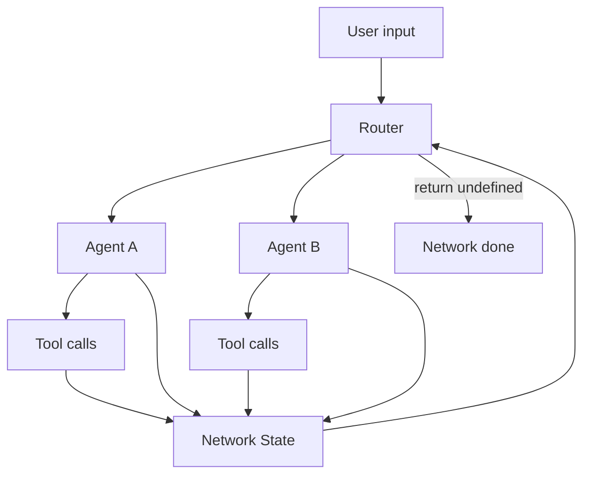
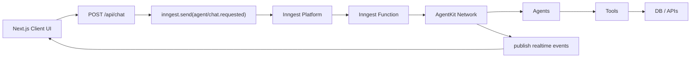

## AgentKit 学习指南

> 面向已经会 Next.js 的前端同学。目标是从“能跑一个 AI Agent”逐步过渡到理解 AgentKit 的架构、核心概念、多 Agent 协作、工具调用、状态路由、Inngest 持久执行和实时 UI。

更新时间：2026-05-12  
主要参考：AgentKit 官方文档、Quick Start、Concepts、Streaming、Reference、Advanced Patterns。

## 0. AgentKit 是什么

AgentKit 是 Inngest 出品的 TypeScript AI Agent 框架，用来构建从单次模型调用到多 Agent 系统的 AI 应用。它的核心特点不是“多包一层 LLM SDK”，而是围绕编排设计：

- 用 `Agent` 表示一个有角色、有系统提示词、可调用工具的模型执行单元。
- 用 `Tool` 让模型安全调用你的代码、数据库、第三方 API 或结构化输出。
- 用 `Network` 把多个 Agents 组合成一个可循环执行的协作系统。
- 用 `State` 在 Agents、Tools、Router 之间共享短期上下文和结构化数据。
- 用 `Router` 决定下一步调用哪个 Agent，或者结束整个 Network。
- 和 Inngest 结合后，可以获得 durable execution、step、waitForEvent、retries、local traces、logs、realtime streaming。

一句话：

```txt
AgentKit = AI Agent primitives + workflow orchestration + Inngest durable runtime
```

`agentkit`本质上是`model + tool`的封装

## 1. 你需要先区分几个概念

| 概念 | 作用 | 类比 |
| --- | --- | --- |
| Model | 真正调用的 LLM，例如 OpenAI、Anthropic、Gemini、Grok | 大脑 |
| Agent | 有名字、角色、提示词、模型和工具的执行单元 | 专家员工 |
| Tool | Agent 能调用的函数 | 员工可使用的工具 |
| Network | 多个 Agents 组成的系统 | 团队 |
| State | Network 单次运行中的共享记忆和结构化数据 | 团队白板 |
| Router | 决定下一个调用谁 | 调度员 |
| History | 跨对话保存的消息历史 | 聊天记录 |
| Memory | 更长期的用户偏好和事实记忆 | 长期记忆 |
| Inngest Function | durable 后台执行容器 | 可靠工作流 |
| Streaming | 把 Agent 执行过程实时推到 UI | 实时进度条和聊天流 |

AgentKit 自己能跑 Agent/Network；当你把它放进 Inngest function 里，就能获得可靠后台执行、可观测性和实时事件。

## 2. 安装

官方 Quick Start 当前要求同时安装：

```bash
npm install @inngest/agent-kit inngest
```

如果要在 React/Next.js 前端里使用官方 hook：

```bash
npm install @inngest/use-agent
```

常见模型还需要配置对应环境变量：

```bash
OPENAI_API_KEY=...
ANTHROPIC_API_KEY=...
GEMINI_API_KEY=...
```

官方特别提示：从 AgentKit `v0.9.0` 开始，`inngest` 是必需 peer dependency，所以不要只安装 `@inngest/agent-kit`。

## 3. 最小例子：创建一个单 Agent

先不碰 Next.js，只看 AgentKit 最小代码。

`index.ts`

```ts
import { createAgent, openai } from "@inngest/agent-kit";

const sqlAgent = createAgent({
  name: "SQL assistant",
  description: "Helps users write and explain SQL queries",
  system:
    "You are a senior SQL assistant. Answer clearly, avoid unsafe queries, " +
    "and explain important tradeoffs.",
  model: openai({
    model: "gpt-4o-mini",
  }),
});

const result = await sqlAgent.run(
  "Write a PostgreSQL query to count orders per day for the last 30 days."
);

console.log(result.output);
```

这里你要理解：

- `createAgent()` 定义 Agent。
- `name` 会出现在 tracing 里。
- `description` 会帮助 LLM-based router 选择 Agent。
- `system` 是这个 Agent 的长期角色和约束。
- `model` 是实际模型 provider。
- `agent.run()` 执行一次 Agent 调用。

## 4. 让 AgentKit 暴露 HTTP 服务并接入 Dev Server

官方 Quick Start 使用 `createServer()` 把 agents/networks 暴露给 Inngest Dev Server 调试。

```ts
import { createAgent, anthropic } from "@inngest/agent-kit";
import { createServer } from "@inngest/agent-kit/server";

const dbaAgent = createAgent({
  name: "Database administrator",
  description: "Provides expert support for managing PostgreSQL databases",
  system:
    "You are a PostgreSQL expert database administrator. " +
    "Only answer questions related to PostgreSQL schemas, indexes, extensions, and performance.",
  model: anthropic({
    model: "claude-3-5-haiku-latest",
    defaultParameters: {
      max_tokens: 1000,
    },
  }),
});

const server = createServer({
  agents: [dbaAgent],
});

server.listen(3000, () => {
  console.log("AgentKit server running on http://localhost:3000");
});
```

运行：

```bash
npx tsx ./index.ts
```

再启动 Inngest Dev Server：

```bash
npx inngest-cli@latest dev -u http://localhost:3000/api/inngest
```

打开：

```txt
http://localhost:8288/functions
```

你可以在 Dev Server 中 invoke 这个 Agent，并查看 agent run、模型输入输出、tool calls、state 和 logs。

## 5. Agent：最小的智能执行单元

Agent 的作用是把一个模型调用包装成“有身份、有目标、有能力”的对象。

常见配置：

```ts
const agent = createAgent({
  name: "Support agent",
  description: "Answers customer support questions and looks up order information",
  system: "You are a helpful customer support agent.",
  model: openai({ model: "gpt-4o-mini" }),
  tools: [],
});
```

### 5.1 动态 system prompt

`system` 可以是函数，用 state 或 memory 动态生成提示词。

```ts
import { createAgent, openai } from "@inngest/agent-kit";

type SupportState = {
  customerName?: string;
  plan?: "free" | "pro" | "enterprise";
};

export const supportAgent = createAgent<SupportState>({
  name: "Support agent",
  description: "Handles product support questions",
  model: openai({ model: "gpt-4o-mini" }),
  system: ({ network }) => {
    const name = network.state.data.customerName ?? "the customer";
    const plan = network.state.data.plan ?? "unknown";

    return [
      "You are a careful product support agent.",
      `You are helping ${name}.`,
      `The customer plan is ${plan}.`,
      "If you are unsure, ask for clarification.",
    ].join("\n");
  },
});
```

适合：

- 把用户信息注入 prompt。
- 根据当前 state 切换语气、权限、业务规则。
- 避免把所有上下文硬编码进一个大 prompt。

### 5.2 Agent lifecycle hooks

`createAgent()` 支持 lifecycle，例如：

- `onStart`：模型调用前，可修改 system/history/input。
- `onResponse`：模型响应后、tool calling 前，可检查或修改响应。
- `onFinish`：tool calling 完成后，可修改最终 `InferenceResult`。

示例：

```ts
const agent = createAgent({
  name: "Audited agent",
  description: "Agent with lifecycle logging",
  model: openai({ model: "gpt-4o-mini" }),
  system: "Answer concisely.",
  lifecycle: {
    onStart: ({ input, system, history }) => {
      console.log("agent start", input);
      return { system, history };
    },
    onFinish: ({ result }) => {
      console.log("agent finished", result.output);
      return result;
    },
  },
});
```

用途：

- 日志、审计、埋点。
- 给 prompt 注入额外上下文。
- 阻止不合规请求。
- 输出后处理。

## 6. Tool：让 Agent 调用你的代码

Agent 只会生成文本是不够的。真实业务里它需要查数据库、请求 API、写 state、发送事件、等待审批，这些都通过 Tool 完成。

其实`tool`的本质是`LLM`建议调用，模型的响应会带有一个`tool_call`字段，也就是建议调用哪个tool
model怎么知道调用哪个tool？Agentkit会在初始化时，将**工具白名单**和**工具描述**发给模型
然后`AgentKit`执行`tool`的`handle`，把`result`发给模型

### Tool的生命周期

#### 1) Tool 是怎么“注册”进去的

在 `createAgent({ tools: [...] })` 里传进去的工具，会被 Agent 存到 `this.tools` 这个 Map 里。AgentKit 还支持一种特殊工具：MCP server 提供的工具，会在 `initMCP()` 里动态拉取并加入工具列表。

#### 2) 推理时，tool 会先作为“可用能力”发给模型

`agent.run()` 进入循环后，会先调用 `performInference()`；这里会把当前 prompt、history、以及 `Array.from(this.tools.values())` 一起交给模型。`AgenticModel.infer()` 内部再通过 `requestParser` 把这些信息序列化成具体 provider 的请求体，发给模型，最后用 `responseParser` 把 provider 返回值再统一成 AgentKit 的 `Message[]`。

#### 3) 模型不是“执行 tool”，而是“提出 tool_call”

模型返回后，AgentKit 先看输出里有没有 `type === "tool_call"` 的消息。也就是说：**模型只负责决定“调用哪个工具、传什么参数”**，不负责真的执行函数。

#### 4) 真正执行 tool 的地方在 `invokeTools()`

`invokeTools()` 会遍历模型输出里的 `tool_call` 消息，逐个取出 tool 名字，去 `this.tools.get(tool.name)` 里查对应工具。  
如果找不到，直接报错：`Inference requested a non-existent tool`。

找到以后，就会真正调用：

```
found.handler(tool.input, {  agent: this,  network,  step,})
```

这里的 `handler` 可以是同步也可以是异步；如果它返回 `undefined`，AgentKit 会自动补成 `"{tool.name} successfully executed"`。如果抛错，会被序列化成 error 结果。

#### 5) 工具结果会被写回成 `tool_result`

每个 tool 执行完，AgentKit 会生成一个 `tool_result` 消息，里面带上：

- tool 的 id / name / input
- 执行结果 `content`
- `stop_reason: "tool"`

这个结果会被放进本轮的 `result.toolCalls` 里。

#### 6) 是否继续下一轮，取决于工具调用后模型是否还要继续

`agent.run()` 外层有个循环：只要当前模型输出不是正常 `stop`，并且 agent 还有 tools，AgentKit 就会继续下一轮推理。也就是说，tool 执行完成后，工具结果会进入下一轮上下文，再让模型基于 tool 结果继续生成最终回答。

### 6.1 创建一个 Tool

```ts
import { createTool } from "@inngest/agent-kit";
import { z } from "zod";

const getOrderTool = createTool({
  name: "get_order",
  description: "Look up an order by order ID.",
  parameters: z.object({
    orderId: z.string().describe("The order ID to look up"),
  }),
  handler: async ({ orderId }, { network, agent, step }) => {
    const order = await db.order.findUnique({
      where: { id: orderId },
    });

    return {
      found: Boolean(order),
      order,
    };
  },
});
```

字段解释：

| 字段            | 说明                            |
| ------------- | ----------------------------- |
| `name`        | 工具名，模型用它决定调用哪个工具              |
| `description` | 工具说明，越具体越容易被正确调用              |
| `parameters`  | JSON Schema 或 Zod schema，定义入参 |
| `handler`     | 真正执行的代码                       |
| `strict`      | 是否严格校验参数，默认 `true`            |

`parameters` 参数是模型通过自然语言推理出来的，也就是提取`prompt`中的参数，然后注入到tool中，这里用到了zod验证，如果验证成功就继续执行

当然也可以将`createTool`定义为函数的返回值，通过函数传递参数

### 6.2 给 Agent 添加 Tool

```ts
const supportAgent = createAgent({
  name: "Support agent",
  description: "Answers customer support questions",
  system: "Use tools when you need customer or order data.",
  model: openai({ model: "gpt-4o-mini" }),
  tools: [getOrderTool],
});
```

### 6.3 Tool handler 的上下文

Tool handler 的第二个参数常见有：

```ts
handler: async (input, { agent, network, step }) => {
  // agent: 当前调用该 tool 的 Agent
  // network: 当前 Network，可读写 network.state.data
  // step: 放在 Inngest function 中运行时，可以使用 durable step
}
```

关键点：

- 如果 Tool 只在普通 Node 进程中运行，`step` 可能不存在。
- 如果 Tool 在 Inngest function 中运行，可以用 `step.run()`、`step.waitForEvent()` 等 durable API。
- Tool 返回值会回到模型上下文里，所以不要返回巨大对象或敏感数据。

### 6.4 可选参数要用 nullable

官方文档建议可选参数使用 `.nullable()`，而不是 `.optional()`。

```ts
const listChargesTool = createTool({
  name: "list_charges",
  description: "List a user's charges, optionally filtered by date range.",
  parameters: z.object({
    userId: z.string(),
    created: z
      .object({
        gte: z.string().date(),
        lte: z.string().date(),
      })
      .nullable(),
  }),
  handler: async ({ userId, created }) => {
    return listCharges(userId, created);
  },
});
```

### 6.5 Tool 写入 State

```ts
type NetworkState = {
  orderId?: string;
  orderStatus?: string;
};

const saveOrderStatusTool = createTool({
  name: "save_order_status",
  description: "Save the current order status into network state.",
  parameters: z.object({
    orderId: z.string(),
    status: z.string(),
  }),
  handler: async ({ orderId, status }, { network }) => {
    network.state.data.orderId = orderId;
    network.state.data.orderStatus = status;

    return { saved: true };
  },
});
```

State 的价值在于：Router、后续 Agent、后续 Tool 都可以看到这些结构化结果。

## 7. State：Network 单次运行的共享上下文

AgentKit 的 State 包含两类东西：

- History：本次 Network 中的消息、模型响应、tool calls。
- Typed state data：你定义的结构化数据。

示例：

```ts
import { createState } from "@inngest/agent-kit";

type ResearchState = {
  topic?: string;
  sources?: string[];
  summary?: string;
  done?: boolean;
};

const state = createState<ResearchState>({
  sources: [],
  done: false,
});

state.data.topic = "Next.js caching";
```

重要限制：

- State 默认只保留在一次 `network.run()` 中。
- 它是短期记忆，不等于数据库。
- 如果要跨多轮对话持久化，需要 History Adapter。
- 如果要长期记忆用户偏好，需要 Memory 方案，例如官方文档中的 Mem0 集成。

## 8. Network：把多个 Agents 组成团队

Network 是 AgentKit 最核心的抽象。它把多个 Agent、共享 State、Router 组合起来，并通过循环执行直到 Router 返回 `undefined`。



### 8.1 创建一个简单 Network

```ts
import { createNetwork } from "@inngest/agent-kit";

const supportNetwork = createNetwork({
  name: "Support network",
  agents: [supportAgent],
});

const result = await supportNetwork.run("Where is my order order_123?");
```

### 8.2 多 Agent Network

```ts
type SupportState = {
  classification?: "billing" | "technical" | "general";
  finalAnswer?: string;
};

const classifierAgent = createAgent<SupportState>({
  name: "Classifier",
  description: "Classifies customer questions into billing, technical, or general.",
  system:
    "Classify the user's question. Use the save_classification tool. " +
    "Do not answer the customer directly.",
  model: openai({ model: "gpt-4o-mini" }),
  tools: [
    createTool({
      name: "save_classification",
      description: "Save the classification result.",
      parameters: z.object({
        classification: z.enum(["billing", "technical", "general"]),
      }),
      handler: async ({ classification }, { network }) => {
        network.state.data.classification = classification;
        return { saved: true };
      },
    }),
  ],
});

const billingAgent = createAgent<SupportState>({
  name: "Billing agent",
  description: "Answers billing and subscription questions.",
  system: "You answer billing questions clearly and safely.",
  model: openai({ model: "gpt-4o-mini" }),
});

const technicalAgent = createAgent<SupportState>({
  name: "Technical agent",
  description: "Answers technical troubleshooting questions.",
  system: "You help debug product issues step by step.",
  model: openai({ model: "gpt-4o-mini" }),
});

const generalAgent = createAgent<SupportState>({
  name: "General support agent",
  description: "Answers general product questions.",
  system: "You answer general support questions.",
  model: openai({ model: "gpt-4o-mini" }),
});

const network = createNetwork<SupportState>({
  name: "Customer support network",
  agents: [classifierAgent, billingAgent, technicalAgent, generalAgent],
  router: ({ network, callCount }) => {
    if (callCount === 0) {
      return classifierAgent;
    }

    switch (network.state.data.classification) {
      case "billing":
        return billingAgent;
      case "technical":
        return technicalAgent;
      case "general":
        return generalAgent;
      default:
        return undefined;
    }
  },
  maxIter: 4,
});
```

`maxIter` 是保护阀，避免 Router 或 Agent 行为导致无限循环。

## 9. Router：决定下一步调用哪个 Agent

Router 是 Network 的调度核心。它在每次 Agent 执行后运行，返回：

- 一个 Agent：继续执行这个 Agent。
- `undefined`：停止 Network。

Router 参数常见包括：

| 参数 | 说明 |
| --- | --- |
| `network` | 当前 Network，可读取 `network.state` |
| `stack` | 未来待调用的 Agent 栈 |
| `callCount` | 已调用 Agent 的次数 |
| `lastResult` | 上一个 Agent 的结果 |
| `input` | 原始输入 |

### 9.1 代码路由：最可控

```ts
const network = createNetwork({
  name: "Two step writing network",
  agents: [plannerAgent, writerAgent],
  router: ({ callCount }) => {
    if (callCount === 0) {
      return plannerAgent;
    }

    if (callCount === 1) {
      return writerAgent;
    }

    return undefined;
  },
});
```

优点：

- 可预测。
- 好测试。
- 适合业务流程明确的场景。

### 9.2 基于 State 的确定性路由

```ts
type CodeState = {
  plan?: string;
  filesWritten?: boolean;
  done?: boolean;
};

const codingNetwork = createNetwork<CodeState>({
  name: "Coding network",
  agents: [planningAgent, editingAgent, reviewAgent],
  router: ({ network }) => {
    if (network.state.data.done) {
      return undefined;
    }

    if (!network.state.data.plan) {
      return planningAgent;
    }

    if (!network.state.data.filesWritten) {
      return editingAgent;
    }

    return reviewAgent;
  },
});
```

这是 AgentKit 文档反复强调的模式：不要把所有“下一步做什么”的决策都交给模型。能用 state machine 明确表达的流程，就用代码路由。

### 9.3 LLM Router：更灵活但更不可控

AgentKit 也支持 routing agent，让模型根据 Agent description 和上下文决定调用谁。

适合：

- 用户意图很开放。
- Agent 数量较多。
- 分类规则不容易写死。

不适合：

- 强合规业务。
- 钱、权限、删除、发送通知这类高风险动作。
- 必须可预测和可测试的核心流程。

### 9.4 Hybrid Router：推荐的折中

```ts
import { createNetwork, getDefaultRoutingAgent } from "@inngest/agent-kit";

const network = createNetwork({
  name: "Hybrid network",
  agents: [classifierAgent, researchAgent, writerAgent],
  router: ({ callCount }) => {
    if (callCount === 0) {
      return classifierAgent;
    }

    return getDefaultRoutingAgent();
  },
});
```

常见思路：

- 前几步用代码强制完成鉴权、分类、上下文加载。
- 后续低风险探索交给 LLM router。
- 最后再用代码检查 state 是否满足完成条件。

## 10. 在 Next.js 中组织 AgentKit 代码

推荐目录：

```txt
src/
  app/
    api/
      chat/
        route.ts
      inngest/
        route.ts
      realtime/
        token/
          route.ts
  inngest/
    client.ts
    functions.ts
  agentkit/
    agents.ts
    tools.ts
    networks.ts
    state.ts
    history.ts
```

一个渐进式架构：



## 11. 在 Inngest Function 中运行 AgentKit

这是生产中更推荐的方式：用户请求只负责发送事件，Agent 在后台可靠运行。

### 11.1 Inngest client

`src/inngest/client.ts`

```ts
import { Inngest } from "inngest";

export const inngest = new Inngest({
  id: "my-next-agent-app",
});
```

### 11.2 AgentKit Network

`src/agentkit/networks.ts`

```ts
import { createNetwork, createState } from "@inngest/agent-kit";
import { supportAgent } from "./agents";

export type AgentState = {
  userId?: string;
  orderId?: string;
};

export function createSupportNetwork(initialState: AgentState) {
  return createNetwork<AgentState>({
    name: "Support network",
    agents: [supportAgent],
    defaultState: createState<AgentState>(initialState),
  });
}
```

如果你的 AgentKit 版本不支持 `defaultState` 这种写法，可以在 `network.run()` 时传入 state，按当前 SDK 类型提示调整即可。核心思想是：每次请求都创建一个带初始 state 的 network run。

### 11.3 Inngest function

`src/inngest/functions.ts`

```ts
import { inngest } from "./client";
import { createSupportNetwork } from "@/agentkit/networks";

export const runSupportAgent = inngest.createFunction(
  {
    id: "run-support-agent",
    triggers: { event: "agent/chat.requested" },
  },
  async ({ event, step }) => {
    const result = await step.run("run-agent-network", async () => {
      const network = createSupportNetwork({
        userId: event.data.userId,
      });

      return network.run(event.data.message);
    });

    return {
      threadId: event.data.threadId,
      result,
    };
  }
);
```

注意：如果 tool 内部也需要 durable step，不要把整个 `network.run()` 包进一个大 `step.run()` 后就结束。更高级的写法是把 `step` 传给 tools 或 model provider，让 tool handler 内部使用 `step.run()`、`step.waitForEvent()`。

### 11.4 Next.js Inngest route

`src/app/api/inngest/route.ts`

```ts
import { serve } from "inngest/next";
import { inngest } from "@/inngest/client";
import { runSupportAgent } from "@/inngest/functions";

export const { GET, POST, PUT } = serve({
  client: inngest,
  functions: [runSupportAgent],
});
```

### 11.5 Chat API route

`src/app/api/chat/route.ts`

```ts
import { randomUUID } from "crypto";
import { NextRequest, NextResponse } from "next/server";
import { inngest } from "@/inngest/client";

export async function POST(req: NextRequest) {
  const body = await req.json();

  const threadId = body.threadId ?? randomUUID();

  await inngest.send({
    name: "agent/chat.requested",
    data: {
      threadId,
      userId: body.userId,
      message: body.message,
    },
  });

  return NextResponse.json({
    success: true,
    threadId,
  });
}
```

这时请求流程是：

```txt
前端发送 message -> /api/chat -> inngest.send -> 后台 runSupportAgent -> AgentKit network.run
```

## 12. Tool 中使用 Inngest step

很多 AI Agent 业务需要可靠副作用，例如发邮件、写数据库、调用第三方 API。把这些动作放到 Inngest step 里更安全。

```ts
const refundTool = createTool({
  name: "issue_refund",
  description: "Issue a refund for an eligible order.",
  parameters: z.object({
    orderId: z.string(),
    reason: z.string(),
  }),
  handler: async ({ orderId, reason }, { step }) => {
    if (!step) {
      return {
        error: "This tool must run inside an Inngest function.",
      };
    }

    return step.run("issue-refund", async () => {
      return stripe.refunds.create({
        payment_intent: orderId,
        metadata: { reason },
      });
    });
  },
});
```

这样做的好处：

- Tool 失败可以让 Inngest 重试。
- Step output 可在 Dev Server/Dashboard 里看到。
- 成功过的 step 可被持久化记录。
- 对外部副作用更容易做幂等。

## 13. Human in the Loop：等待人工输入

AgentKit 文档把 Human in the Loop 建议建在 Inngest `step.waitForEvent()` 上。

例子：技术支持 Agent 遇到复杂问题时，向工程师提问并等待回复。

```ts
const askDeveloperTool = createTool({
  name: "ask_developer",
  description: "Ask a developer for input on a technical support issue.",
  parameters: z.object({
    ticketId: z.string(),
    question: z.string(),
    context: z.string(),
  }),
  handler: async ({ ticketId, question, context }, { step }) => {
    if (!step) {
      return { error: "This tool requires Inngest step context." };
    }

    await step.run("notify-developer", async () => {
      await sendSlackMessage({
        channel: "#support-escalations",
        text: `${question}\n\n${context}`,
        metadata: { ticketId },
      });
    });

    const developerResponse = await step.waitForEvent("wait-for-developer-response", {
      event: "app/support.ticket.developer-response",
      timeout: "4h",
      match: "data.ticketId",
    });

    if (!developerResponse) {
      return {
        error: "No developer response was provided before timeout.",
      };
    }

    return {
      answer: developerResponse.data.answer,
      respondedAt: developerResponse.data.timestamp,
    };
  },
});
```

前端或内部系统回复时发送事件：

```ts
await inngest.send({
  name: "app/support.ticket.developer-response",
  data: {
    ticketId: "ticket_123",
    answer: "The root cause is an expired webhook signing secret.",
    timestamp: Date.now(),
  },
});
```

这个模式适合：

- 审批后再执行。
- 人工客服接管。
- 高风险工具调用前确认。
- 编码 Agent 请求开发者提供上下文。

## 14. Multi-step Tools

有些 Tool 不是一个简单函数，而是内部有多个可靠步骤。

```ts
const analyzeUploadTool = createTool({
  name: "analyze_upload",
  description: "Analyze an uploaded file and store extracted insights.",
  parameters: z.object({
    fileId: z.string(),
    fileUrl: z.string().url(),
  }),
  handler: async ({ fileId, fileUrl }, { step }) => {
    if (!step) {
      return { error: "This tool requires Inngest step context." };
    }

    const text = await step.run("extract-text", async () => {
      return extractTextFromFile(fileUrl);
    });

    const summary = await step.run("summarize-text", async () => {
      return summarizeWithLLM(text);
    });

    await step.run("save-analysis", async () => {
      await db.fileAnalysis.create({
        data: {
          fileId,
          summary,
        },
      });
    });

    return {
      fileId,
      summary,
    };
  },
});
```

经验：

- 一个 Tool 内部可以有多个 step。
- 每个 step 命名要稳定。
- 对第三方 API 调用尤其适合用 step。
- Tool 返回给模型的内容要精简，完整数据可写数据库。

## 15. History：持久化多轮对话

State 只存在于一次 Network run 中。如果你要做真正的聊天应用，需要把对话历史保存到数据库。

官方文档把这抽象为 History Adapter。它的职责通常包括：

- 创建 thread。
- 根据 threadId 读取历史消息。
- 保存新消息和 Agent result。

伪代码结构：

```ts
type ChatMessage = {
  id: string;
  threadId: string;
  role: "user" | "assistant";
  parts: unknown[];
  createdAt: Date;
};

export class DbHistoryAdapter {
  async getMessages(threadId: string): Promise<ChatMessage[]> {
    return db.chatMessage.findMany({
      where: { threadId },
      orderBy: { createdAt: "asc" },
    });
  }

  async saveMessage(message: ChatMessage) {
    await db.chatMessage.create({ data: message });
  }
}
```

实际项目中按 AgentKit 当前 `HistoryConfig` 类型实现即可。你要抓住重点：History 不是 prompt 字符串拼接，而是一套让 Agent/Network 在不同 run 之间恢复上下文的持久化接口。

## 16. Memory：长期记忆

[官方实现记忆功能](https://github.com/inngest/agent-kit/tree/main/examples/mem0-memory)

History 保存“这段对话说过什么”。Memory 保存“长期有用的事实和偏好”。

例如：

- 用户偏好中文回答。
- 用户使用 PostgreSQL + Next.js。
- 用户所在团队不能使用某个云服务。
- 用户喜欢简短答案。

官方 Memory 文档强调可以结合 Mem0 和 Inngest：

- Agent 先快速响应用户。
- 把“创建/更新/删除记忆”的动作发送给 Inngest。
- Inngest 在后台 durable 执行 memory write。

一个简单 memory tool 思路：

```ts
const rememberPreferenceTool = createTool({
  name: "remember_preference",
  description: "Remember a stable user preference for future conversations.",
  parameters: z.object({
    userId: z.string(),
    preference: z.string(),
  }),
  handler: async ({ userId, preference }, { step }) => {
    if (!step) {
      return { error: "Requires Inngest step context." };
    }

    await step.run("save-memory", async () => {
      await memoryStore.upsert({
        userId,
        text: preference,
      });
    });

    return { remembered: true };
  },
});
```

实现记忆功能的核心思路是：

**把“记忆”当成一个独立的外部存储层，用 Mem0 负责存取，用 AgentKit 负责在对话中调用这些存取能力，用 Inngest 负责把写入操作异步、可靠地放到后台执行**。

其实是**用 Mem0 做外部长期记忆系统，再用 AgentKit 的工具调用和 Inngest 的事件机制，把“记忆检索 + 记忆维护”接进对话循环里**。

**多智能体网络流程：**

1. **记忆检索代理** : 路由器首先调用这个代理，它的唯一任务就是使用 `recall_memories` 工具。
2. **个人助理代理** : 路由器随后将对话和回忆的记忆传递给这个代理。它没有工具，其唯一的工作就是为用户综合最终的答案。
3. **记忆更新代理** : 最后，路由器调用这个代理。它审查整个对话（初始查询、回忆的记忆和最终答案），并使用 `manage_memories` 工具执行一个或多个必要的创建、更新或删除操作——通过发送 Inngest 事件，在后台异步地执行每个创建/更新/删除操作。

### Qdrant

向量数据库 用于语义检索

### Mem0 - AI Memory Framework

用于操作Qdrant，封装了操作Qdrant的方法

例如：
``` ts
mem0.add(...)
mem0.search(...)
mem0.update(...)
mem0.delete(...)
```
它内部：
- 自动 embedding
- 自动 vector search
- 自动 metadata
- 自动 memory schema
- 自动 memory retrieval

示例：
``` ts
const mem0 = new Memory({
  vectorStore: {
    provider: "qdrant",
    config: {
      collectionName: "agent-kit-memories",
      url: "http://localhost:6333",
      dimension: 1536,
    },
  },
});

// Mem0 使用 Qdrant 作为底层存储
```

---
## 17. Streaming：把 Agent 执行过程实时推到 UI

如果只是 `/api/chat` 返回最终结果，用户会一直等。AgentKit 的 streaming 用来把网络运行、文本增量、工具调用、工具结果等结构化事件实时推给前端。

官方 Streaming Usage Guide 的后端组成：

- Inngest Client：初始化 Inngest，并加入 realtime middleware。
- Realtime Channel：定义 typed realtime channel/topic。
- Chat Route：接收前端 message，发送 Inngest event。
- Token Route：给前端生成 realtime subscription token。
- Inngest Route：暴露 functions。
- Inngest Function：运行 AgentKit network，并通过 `publish` 推送 streaming events。

### 17.1 UI hook：useAgent

```tsx
"use client";

import { useAgent } from "@inngest/use-agent";

export function AgentChat() {
  const { messages, sendMessage, status } = useAgent();

  async function onSubmit(formData: FormData) {
    const value = String(formData.get("message") ?? "");
    if (!value.trim()) return;

    await sendMessage(value);
  }

  return (
    <div>
      <ul>
        {messages.map((message) => (
          <li key={message.id}>
            <strong>{message.role}</strong>
            {message.parts.map((part) =>
              part.type === "text" ? (
                <p key={part.id}>{part.content}</p>
              ) : null
            )}
          </li>
        ))}
      </ul>

      <form action={onSubmit}>
        <input name="message" />
        <button disabled={status !== "ready"}>Send</button>
      </form>
    </div>
  );
}
```

`useAgent()` 负责：

- 发送消息。
- 接收实时事件。
- 处理乱序事件。
- 管理当前 thread。
- 维护 messages。
- 暴露 tool call 状态。
- 支持 HITL approve/deny。

常用返回值：

| 字段/方法 | 说明 |
| --- | --- |
| `messages` | 当前 thread 的消息 |
| `sendMessage` | 给当前 thread 发送消息 |
| `status` | `"ready"`、`"submitted"`、`"streaming"`、`"error"` |
| `error` | 当前错误 |
| `isConnected` | realtime 是否连接 |
| `currentThreadId` | 当前 thread |
| `switchToThread` | 切换 thread |
| `createNewThread` | 创建本地新 thread |
| `cancel` | 取消当前 run |
| `approveToolCall` | 批准待确认 tool call |
| `denyToolCall` | 拒绝待确认 tool call |

### 17.2 Streaming event 心智模型

前端不是直接拿到一大段文本，而是拿到一串结构化事件：

- run started
- agent started
- part created
- text delta
- tool call input streaming
- tool executing
- tool output available
- run completed
- stream ended

`useAgent` 内部会把这些事件 reduce 成适合 UI 渲染的 `messages`。

### 17.3 Tool UI

因为 message part 里有 `tool-call`，你可以给不同工具渲染不同 UI：

```tsx
function MessagePart({ part }: { part: any }) {
  if (part.type === "text") {
    return <p>{part.content}</p>;
  }

  if (part.type === "tool-call") {
    return (
      <div>
        <strong>{part.toolName}</strong>
        <span>{part.state}</span>
        {part.output ? <pre>{JSON.stringify(part.output, null, 2)}</pre> : null}
      </div>
    );
  }

  return null;
}
```

这就是 AgentKit streaming 相比普通 token streaming 更重要的地方：你不仅能流文本，还能流工具调用和工作流状态。

## 18. MCP：把外部工具接进 AgentKit

AgentKit 支持 MCP as tools。MCP 的价值是把外部系统能力标准化暴露给 Agent。

适合：

- 让 Agent 调用已有 MCP server。
- 连接代码编辑、浏览器、数据库、文件系统、内部系统。
- 避免为每个系统手写一套 tool。

使用原则：

- 只给 Agent 暴露必要工具。
- 对危险工具加审批或权限判断。
- 给 MCP tool 调用加日志。
- 对写操作使用 Inngest step 和幂等保护。

## 19. Retries 和可靠性

AgentKit 本身处理 Agent/Tool 执行；Inngest 提供更强的工作流可靠性。

建议：

- LLM 临时失败：让 function throw，由 Inngest retry。
- Tool 内第三方 API 失败：放进 `step.run()`。
- 高风险 Tool：加业务幂等 key。
- 可恢复长流程：拆成多个 step。
- 人工介入：使用 `step.waitForEvent()`。

示例：

```ts
export const runAgent = inngest.createFunction(
  {
    id: "run-agent",
    triggers: { event: "agent/run.requested" },
    retries: 3,
  },
  async ({ event, step }) => {
    const network = createSupportNetwork({
      userId: event.data.userId,
    });

    return network.run(event.data.input, {
      step,
    });
  }
);
```

具体 `network.run()` 是否接受 `step` 以及参数形态，请以当前 SDK 类型提示为准；核心模式是不变的：AgentKit 负责 agent workflow，Inngest 负责 durable runtime。

## 20. Multitenancy：多租户注意事项

多租户 AgentKit 应用要特别注意隔离：

- `userId`、`tenantId` 必须进入事件 payload。
- Tool 查数据库时必须带 `tenantId` 条件。
- Realtime channel 必须按用户或租户隔离。
- History 查询必须校验 thread 属于当前用户。
- Memory 也必须按用户/租户隔离。
- LLM prompt 不要混入别的租户数据。

示例：

```ts
const getAccountTool = createTool({
  name: "get_account",
  description: "Get account data for the current tenant.",
  parameters: z.object({
    accountId: z.string(),
  }),
  handler: async ({ accountId }, { network }) => {
    const tenantId = network.state.data.tenantId;

    if (!tenantId) {
      return { error: "Missing tenant context." };
    }

    return db.account.findFirst({
      where: {
        id: accountId,
        tenantId,
      },
    });
  },
});
```

## 21. 常见架构选型

### 21.1 简单问答

```txt
Next.js API Route -> agent.run() -> 返回最终答案
```

适合：

- 原型。
- 内部工具。
- 不需要长流程和后台执行。

### 21.2 后台可靠 Agent

```txt
Next.js API Route -> inngest.send() -> Inngest Function -> network.run()
```

适合：

- 长耗时任务。
- Tool 有副作用。
- 需要 retry 和 traces。
- 用户不一定要同步等结果。

### 21.3 实时聊天 Agent

```txt
UI useAgent -> /api/chat -> inngest.send()
Inngest Function -> network.run(streaming.publish)
Inngest Realtime -> UI
```

适合：

- ChatGPT 类界面。
- 需要显示工具调用过程。
- 多 thread。
- 需要取消、审批、恢复。

## 22. 实战：Next.js 客服 Agent

目标：

- 用户在前端输入问题。
- API 发送事件。
- Inngest function 运行 AgentKit network。
- Agent 根据问题查订单或回答通用问题。

### 22.1 Tools

```ts
// src/agentkit/tools.ts
import { createTool } from "@inngest/agent-kit";
import { z } from "zod";

export const getOrderTool = createTool({
  name: "get_order",
  description: "Look up order details by order ID.",
  parameters: z.object({
    orderId: z.string(),
  }),
  handler: async ({ orderId }, { network, step }) => {
    const tenantId = network.state.data.tenantId;

    if (!tenantId) {
      return { error: "Missing tenant context." };
    }

    if (step) {
      return step.run("get-order", async () => {
        return db.order.findFirst({
          where: { id: orderId, tenantId },
        });
      });
    }

    return db.order.findFirst({
      where: { id: orderId, tenantId },
    });
  },
});
```

### 22.2 Agent

```ts
// src/agentkit/agents.ts
import { createAgent, openai } from "@inngest/agent-kit";
import { getOrderTool } from "./tools";

export const supportAgent = createAgent({
  name: "Support agent",
  description: "Answers customer support questions and checks order status.",
  system:
    "You are a helpful support agent. " +
    "Use get_order when the user asks about an order. " +
    "Never invent order details.",
  model: openai({ model: "gpt-4o-mini" }),
  tools: [getOrderTool],
});
```

### 22.3 Network

```ts
// src/agentkit/networks.ts
import { createNetwork } from "@inngest/agent-kit";
import { supportAgent } from "./agents";

export type SupportState = {
  userId: string;
  tenantId: string;
};

export function createSupportNetwork() {
  return createNetwork<SupportState>({
    name: "Support network",
    agents: [supportAgent],
    maxIter: 6,
  });
}
```

### 22.4 Inngest function

```ts
// src/inngest/functions.ts
import { createState } from "@inngest/agent-kit";
import { inngest } from "./client";
import { createSupportNetwork, type SupportState } from "@/agentkit/networks";

export const runSupportAgent = inngest.createFunction(
  {
    id: "run-support-agent",
    triggers: { event: "agent/support.message" },
    retries: 3,
  },
  async ({ event, step }) => {
    const network = createSupportNetwork();

    const state = createState<SupportState>({
      userId: event.data.userId,
      tenantId: event.data.tenantId,
    });

    const result = await network.run(event.data.message, {
      state,
      step,
    });

    return {
      threadId: event.data.threadId,
      result,
    };
  }
);
```

注：不同 AgentKit 版本的 `network.run()` option 类型可能略有差异。写项目时以 TypeScript 类型提示为准，本文示例展示的是架构关系和常见传参意图。

### 22.5 Next.js route

```ts
// src/app/api/support-chat/route.ts
import { randomUUID } from "crypto";
import { NextRequest, NextResponse } from "next/server";
import { inngest } from "@/inngest/client";

export async function POST(req: NextRequest) {
  const body = await req.json();

  const threadId = body.threadId ?? randomUUID();

  await inngest.send({
    name: "agent/support.message",
    data: {
      threadId,
      userId: body.userId,
      tenantId: body.tenantId,
      message: body.message,
    },
  });

  return NextResponse.json({
    success: true,
    threadId,
  });
}
```

## 23. 学习路线

### 第 1 阶段：单 Agent

你要能做到：

- 安装 `@inngest/agent-kit` 和 `inngest`。
- 创建一个 `createAgent()`。
- 配置 OpenAI 或 Anthropic model。
- 调用 `agent.run()`。

你要能解释：

- `system` 和用户输入有什么区别？
- `name` 和 `description` 为什么重要？
- Agent 和普通 LLM SDK 调用有什么区别？

### 第 2 阶段：Tools

你要能做到：

- 用 `createTool()` 定义 Zod 参数。
- 在 Tool 中查询数据库或调用 API。
- 把 Tool 加到 Agent。
- 把重要结果写入 `network.state.data`。

你要能解释：

- Tool description 如何影响模型调用？
- Tool 返回值为什么不能太大？
- 写操作为什么要考虑权限和幂等？

### 第 3 阶段：Network 和 Router

你要能做到：

- 创建两个以上 Agents。
- 用 `createNetwork()` 组合它们。
- 写一个 code-based router。
- 根据 state 决定下一步调用谁。

你要能解释：

- Router 返回 `undefined` 代表什么？
- 为什么确定性路由通常比纯 LLM routing 更容易维护？
- `maxIter` 为什么重要？

### 第 4 阶段：Next.js + Inngest

你要能做到：

- `/api/chat` 只发送事件。
- Inngest function 运行 AgentKit network。
- Tool 中使用 `step.run()`。
- Dev Server 中查看 traces。

你要能解释：

- 为什么长 Agent 不应该直接阻塞 API Route？
- AgentKit 和 Inngest 分别负责什么？
- durable step 对 Tool 副作用有什么帮助？

### 第 5 阶段：Streaming 和产品化

你要能做到：

- 用 `@inngest/use-agent` 渲染 messages。
- 配置 realtime token route。
- 在 function 中 publish streaming events。
- 渲染 tool-call UI。
- 支持多 thread、取消、HITL。

你要能解释：

- token streaming 和 structured event streaming 的区别。
- 为什么前端需要 threadId。
- Tool approval 应该放在哪一层做权限判断。

## 24. 最佳实践清单

- Agent 尽量职责单一，不要一个 Agent 承担所有事情。
- Tool 名和 description 要具体，避免模型误用。
- Tool 参数用 Zod 或 JSON Schema 明确定义。
- 可选字段优先用 `.nullable()`。
- 高风险写操作 Tool 必须做权限校验。
- 业务副作用放入 Inngest `step.run()`。
- 人工审批使用 `step.waitForEvent()`。
- 多 Agent 流程优先用 state-based router。
- 设置 `maxIter` 防止无限循环。
- State 只当短期上下文，长期数据写数据库。
- 多租户系统所有 Tool 查询都必须带 tenant 条件。
- 前端不要直接暴露模型 API key。
- 生产环境要记录 agent run、tool call 和用户身份，方便审计。
- 不要把大量原始数据库记录直接塞回模型上下文。
- 能用代码确定的流程，不要完全交给 LLM 自由决定。

## 25. API 速查

### createAgent

```ts
const agent = createAgent({
  name: "Agent name",
  description: "What this agent is good at",
  system: "System prompt",
  model: openai({ model: "gpt-4o-mini" }),
  tools: [tool],
});
```

### createTool

```ts
const tool = createTool({
  name: "tool_name",
  description: "When and how to use this tool",
  parameters: z.object({
    id: z.string(),
  }),
  handler: async ({ id }, { network, agent, step }) => {
    return { id };
  },
});
```

### createState

```ts
const state = createState<{ userId: string }>({
  userId: "user_123",
});
```

### createNetwork

```ts
const network = createNetwork({
  name: "Network name",
  agents: [agentA, agentB],
  router: ({ network, callCount, lastResult }) => {
    return callCount === 0 ? agentA : undefined;
  },
  maxIter: 5,
});
```

### network.run

```ts
const result = await network.run("User input", {
  state,
});
```

### createServer

```ts
import { createServer } from "@inngest/agent-kit/server";

const server = createServer({
  agents: [agent],
  networks: [network],
});

server.listen(3000);
```

### useAgent

```tsx
const {
  messages,
  sendMessage,
  status,
  error,
  currentThreadId,
  switchToThread,
  cancel,
} = useAgent();
```

## 26. 常见问题

### 26.1 AgentKit 和 LangChain 类似吗？

有重叠，但 AgentKit 更强调 Inngest 风格的编排、可观测性、durable execution、state router、streaming UI 和多 Agent workflow。

### 26.2 我会 Next.js，可以直接用吗？

可以。最简单是 API Route 里调用 `agent.run()`；生产级建议用 API Route 发送 Inngest event，再在 Inngest function 中运行 network。

### 26.3 AgentKit 必须用 Inngest 吗？

不一定。你可以直接运行 Agent/Network。但和 Inngest 结合后，能获得更完整的后台执行、step、waitForEvent、retries、Dev Server traces 和 realtime。

### 26.4 Agent 是有状态的吗？

Agent 本身更接近无状态定义。Network run 里的 State 和 History 承担上下文。

### 26.5 Router 必须用 LLM 吗？

不必须。很多业务推荐使用代码 Router 或 state-based router，因为更可预测、更容易测试。

### 26.6 Tool 可以写数据库吗？

可以，但要做权限校验、租户隔离、幂等和日志。生产中建议把写操作放进 Inngest `step.run()`。

## 27. 官方资料

- AgentKit 官网: https://agentkit.inngest.com/
- Overview: https://agentkit.inngest.com/overview
- Quick Start: https://agentkit.inngest.com/getting-started/quick-start
- Local Development: https://agentkit.inngest.com/getting-started/local-development
- Agents: https://agentkit.inngest.com/concepts/agents
- Tools: https://agentkit.inngest.com/concepts/tools
- Networks: https://agentkit.inngest.com/concepts/networks
- State: https://agentkit.inngest.com/concepts/state
- Routers: https://agentkit.inngest.com/concepts/routers
- History: https://agentkit.inngest.com/concepts/history
- Memory: https://agentkit.inngest.com/concepts/memory
- Streaming Overview: https://agentkit.inngest.com/streaming/overview
- Streaming Usage Guide: https://agentkit.inngest.com/streaming/usage-guide
- useAgent Reference: https://agentkit.inngest.com/reference/use-agent
- Human in the Loop: https://agentkit.inngest.com/advanced-patterns/human-in-the-loop
- Deterministic State Routing: https://agentkit.inngest.com/advanced-patterns/routing

