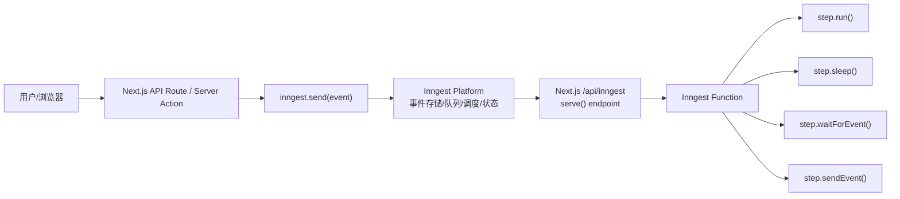

## Inngest v4 学习指南

> 面向已经会 Next.js 的前端同学。目标不是只会复制 quick start，而是理解 Inngest 的架构、核心概念、API 设计和常见后台工作流写法。

更新时间：2026-05-11  
主要参考：Inngest 官方文档 v4、Next.js Quick Start、TypeScript SDK v4 Reference、Checkpointing、Vercel 部署文档。

## 0. 你先记住一句话

Inngest 是一个事件驱动的持久化执行平台。你在 Next.js 里写函数，Inngest 负责事件队列、调度、重试、限流、并发控制、定时任务、步骤状态保存和可观测性。

你可以把它理解成：

- 比普通 API Route 更可靠：请求返回以后，后台任务还能继续执行。
- 比自己接 Redis Queue 简单：不用自己搭队列、worker、retry、scheduler。
- 比纯 cron 更灵活：可以由事件触发，也可以等待另一个事件再继续。
- 比普通 serverless 函数更适合长流程：步骤会被持久化，失败后可以从步骤边界恢复。

典型场景：

- 用户注册后发邮件、建工作区、同步 CRM。
- 文件上传后转码、抽取内容、写入向量库。
- 订单支付后发票、库存、物流、通知多系统联动。
- AI 工作流里分步骤调用模型、等待用户确认、失败重试。
- 每天凌晨清理数据、同步第三方接口。

## 1. 官方 v4 状态和安装说明

官方文档页面顶部显示 TypeScript SDK v4 已经可用，并且 v4 reference 中介绍了几个重要变化：

- middleware 重写。
- schema 能力增强，支持 Standard Schema，不只限 Zod。
- parallel step optimization 和 checkpointing 默认开启。
- 日志更结构化。
- API 更清爽，triggers 放进函数配置对象里。

安装命令需要注意：官方 Next.js Quick Start 使用：

```bash
npm install inngest
```

官方 v4 reference 的安装段落仍写着：

```bash
npm install inngest@beta
```

所以实践上建议：

```bash
npm install inngest@latest
npm ls inngest
```

如果确认 major 不是 4，再改用：

```bash
npm install inngest@beta
```

本文代码全部按 v4 API 书写，核心特征是：

```ts
inngest.createFunction(
  {
    id: "process-task",
    triggers: { event: "app/task.created" },
  },
  async ({ event, step }) => {
    // ...
  }
);
```

这和 v3 常见写法不同，v3 常见是第二个参数单独传 trigger：

```ts
// v3 风格，不作为本文推荐写法
inngest.createFunction(
  { id: "process-task" },
  { event: "app/task.created" },
  async ({ event, step }) => {}
);
```

## 2. Inngest 的整体架构

先从你熟悉的 Next.js 视角看。



关键点：

- 你的业务代码仍然部署在自己的 Next.js 应用里。
- Inngest 不直接运行你的源代码，而是通过 HTTP 请求调用你暴露的 `/api/inngest` endpoint。
- `inngest.send()` 只负责发送事件，真正执行发生在匹配 trigger 的 function 中。
- function 内部的 `step` 是可靠性的边界，Inngest 会记录每个 step 的状态和输出。
- 本地开发时，Inngest Dev Server 扮演本地 Inngest Platform。
- 生产环境时，Inngest Cloud 或自托管 Inngest Platform 负责调度。

## 3. 核心概念速览

| 概念 | 你可以怎么理解 | 在代码中的位置 |
| --- | --- | --- |
| App | 一个接入 Inngest 的应用 | `new Inngest({ id: "my-app" })` |
| Client | SDK 客户端，负责发送事件、创建函数 | `src/inngest/client.ts` |
| Event | 发生了一件事，通常是过去式命名 | `app/user.created` |
| Trigger | function 的触发条件 | `triggers: { event: "..." }` |
| Function | Inngest 执行的后台函数/工作流 | `inngest.createFunction()` |
| Step | function 内部的持久化步骤 | `step.run()` |
| Serve endpoint | Inngest 调用你函数的 HTTP 入口 | `/api/inngest` |
| Dev Server | 本地调试 UI 和本地调度器 | `npx inngest-cli@latest dev` |
| Run | 一次 function 执行实例 | Dashboard 里的 runs |
| Attempt | 一次执行尝试，失败重试会增加 | handler 参数 `attempt` |

## 4. 从 Next.js App Router 接入

推荐目录：

```txt
src/
  app/
    api/
      inngest/
        route.ts
      create-task/
        route.ts
  inngest/
    client.ts
    events.ts
    functions.ts
```

### 4.1 创建 client

`src/inngest/client.ts`

```ts
import { Inngest } from "inngest";

export const inngest = new Inngest({
  id: "my-next-app",
});
```

如果你部署在 Vercel 这类 serverless 平台，建议一开始就配置 checkpointing 的 `maxRuntime`。例如你的 `/api/inngest` 最长运行 60 秒，可以把 `maxRuntime` 设为 40 到 50 秒。

```ts
import { Inngest } from "inngest";

export const inngest = new Inngest({
  id: "my-next-app",
  checkpointing: {
    maxRuntime: "50s",
  },
});
```

### 4.2 创建第一个 function

`src/inngest/functions.ts`

```ts
import { inngest } from "./client";

export const processTask = inngest.createFunction(
  {
    id: "process-task",
    name: "Process task",
    triggers: { event: "app/task.created" },
  },
  async ({ event, step, runId, logger, attempt }) => {
    logger.info("task received", {
      runId,
      attempt,
      taskId: event.data.id,
    });

    const result = await step.run("handle-task", async () => {
      return {
        processed: true,
        id: event.data.id,
      };
    });

    await step.sleep("short-pause", "1s");

    return {
      message: `Task ${event.data.id} complete`,
      result,
    };
  }
);
```

### 4.3 暴露 `/api/inngest`

`src/app/api/inngest/route.ts`

```ts
import { serve } from "inngest/next";
import { inngest } from "@/inngest/client";
import { processTask } from "@/inngest/functions";

export const { GET, POST, PUT } = serve({
  client: inngest,
  functions: [processTask],
});
```

如果部署 Vercel：

```ts
import { serve } from "inngest/next";
import { inngest } from "@/inngest/client";
import { processTask } from "@/inngest/functions";

export const maxDuration = 60;

export const { GET, POST, PUT } = serve({
  client: inngest,
  functions: [processTask],
});
```

`serve()` 的作用：

- `GET`：让 Inngest 发现 app 和 function 元数据。
- `PUT`：用于 sync app。
- `POST`：Inngest 真正调用 function run 的入口。

### 4.4 从你的 app 发送事件

`src/app/api/create-task/route.ts`

```ts
import { NextResponse } from "next/server";
import { inngest } from "@/inngest/client";

export async function POST() {
  const { ids } = await inngest.send({
    name: "app/task.created",
    data: {
      id: "task_001",
      source: "api",
    },
    user: {
      external_id: "user_123",
      email: "taylor@example.com",
    },
  });

  return NextResponse.json({
    message: "Event sent",
    eventIds: ids,
  });
}
```

事件 payload 常见字段：

| 字段 | 必填 | 说明 |
| --- | --- | --- |
| `name` | 是 | 事件名，决定触发哪些 functions |
| `data` | 是 | 业务数据，推荐全部可 JSON 序列化 |
| `user` | 否 | 用户信息，便于过滤、观测和审计 |
| `id` | 否 | 事件幂等 ID，重复事件 ID 只会触发一次 function run |
| `v` | 否 | 事件版本 |
| `ts` | 否 | 毫秒时间戳；如果是未来时间，可以让 function 延迟到该时间启动 |

### 4.5 本地运行

终端 1，启动 Next.js：

```bash
INNGEST_DEV=1 npm run dev
```

Windows PowerShell：

```powershell
$env:INNGEST_DEV="1"; npm run dev
```

终端 2，启动 Inngest Dev Server：

```bash
npx inngest-cli@latest dev
```

打开：

```txt
http://localhost:8288
```

然后请求你的 API：

```bash
curl -X POST http://localhost:3000/api/create-task
```

你会在 Dev Server UI 中看到 event、function run、step output 和日志。

## 5. 事件建模：先设计事件，再写函数

Inngest 是事件驱动，不是“直接调用后台函数”的思维。

不推荐：

```txt
runWelcomeEmail()
```

推荐：

```txt
app/user.created
app/email.welcome.requested
billing/subscription.started
shop/order.paid
file/upload.completed
```

事件命名建议：

- 使用小写。
- 用 `/` 做领域前缀，例如 `app/`、`shop/`、`billing/`。
- 后半段用过去式表示已经发生的事实，例如 `user.created`、`order.paid`。
- 不要把事件名写成命令式，例如 `send.email`，除非它确实是“请求发送邮件”的业务事件。

## 6. v4 的类型化事件：eventType

v4 推荐使用 `eventType()` 定义类型化触发器和发送 payload。

### 6.1 使用 Zod 运行时校验

`src/inngest/events.ts`

```ts
import { eventType } from "inngest";
import { z } from "zod";

export const userCreated = eventType("app/user.created", {
  schema: z.object({
    userId: z.string(),
    email: z.string().email(),
    plan: z.enum(["free", "pro", "enterprise"]),
  }),
});
```

使用它创建 function：

```ts
import { inngest } from "./client";
import { userCreated } from "./events";

export const onboarding = inngest.createFunction(
  {
    id: "user-onboarding",
    triggers: [userCreated],
  },
  async ({ event, step }) => {
    const userId = event.data.userId;

    await step.run("send-welcome-email", async () => {
      await sendWelcomeEmail(event.data.email);
    });

    return { userId };
  }
);

async function sendWelcomeEmail(email: string) {
  console.log("send welcome email", email);
}
```

发送事件时也可以使用 `.create()`：

```ts
import { inngest } from "@/inngest/client";
import { userCreated } from "@/inngest/events";

await inngest.send(
  userCreated.create({
    userId: "user_123",
    email: "a@example.com",
    plan: "pro",
  })
);
```

这样写的好处：

- `event.data` 在 function 中有类型提示。
- `inngest.send()` 发送时也有类型提示。
- 使用 Zod 等 Standard Schema 时，运行时也能校验 payload。

### 6.2 使用 staticSchema 只做 TypeScript 类型检查

如果你不想引入运行时校验，只想要 TS 类型：

```ts
import { eventType, staticSchema } from "inngest";

type OrderPlaced = {
  orderId: string;
  userId: string;
  total: number;
};

export const orderPlaced = eventType("shop/order.placed", {
  schema: staticSchema<OrderPlaced>(),
});
```

`staticSchema()` 只提供编译期类型，不会在运行时验证数据。

### 6.3 多个事件触发一个函数

```ts
import { eventType } from "inngest";
import { z } from "zod";
import { inngest } from "./client";

const userCreated = eventType("app/user.created", {
  schema: z.object({ userId: z.string() }),
});

const userUpdated = eventType("app/user.updated", {
  schema: z.object({
    userId: z.string(),
    changes: z.record(z.string(), z.unknown()),
  }),
});

export const syncUser = inngest.createFunction(
  {
    id: "sync-user",
    triggers: [userCreated, userUpdated],
  },
  async ({ event, step }) => {
    if (event.name === "app/user.created") {
      await step.run("create-in-crm", async () => {
        await createUserInCRM(event.data.userId);
      });
    }

    if (event.name === "app/user.updated") {
      await step.run("update-in-crm", async () => {
        await updateUserInCRM(event.data.userId, event.data.changes);
      });
    }
  }
);

async function createUserInCRM(userId: string) {}
async function updateUserInCRM(userId: string, changes: Record<string, unknown>) {}
```

### 6.4 使用 if 过滤触发

Inngest 的很多配置项支持 CEL 表达式。最常见的是按事件数据过滤。

```ts
import { inngest } from "./client";
import { orderPlaced } from "./events";

export const notifyLargeOrder = inngest.createFunction(
  {
    id: "notify-large-order",
    triggers: [
      {
        event: orderPlaced,
        if: "event.data.total > 1000",
      },
    ],
  },
  async ({ event, step }) => {
    await step.run("notify-sales", async () => {
      await notifySales(event.data.orderId, event.data.total);
    });
  }
);

async function notifySales(orderId: string, total: number) {}
```

### 6.5 通配符事件

```ts
import { eventType } from "inngest";
import { inngest } from "./client";

const anyUserEvent = eventType("user/*");

export const auditUserEvents = inngest.createFunction(
  {
    id: "audit-user-events",
    triggers: [anyUserEvent],
  },
  async ({ event, step }) => {
    await step.run("write-audit-log", async () => {
      console.log(event.name, event.data);
    });
  }
);
```

通配符事件不能定义 schema，因为不同事件的数据结构可能不同。

## 7. Function：后台任务和工作流的主体

最小结构：

```ts
export const fn = inngest.createFunction(
  {
    id: "unique-function-id",
    triggers: { event: "app/something.happened" },
  },
  async ({ event, step }) => {
    // workflow
  }
);
```

配置对象常用字段：

| 字段 | 用途 |
| --- | --- |
| `id` | 稳定唯一 ID，部署后不要随便改 |
| `name` | UI 展示名 |
| `triggers` | 一个或多个 event、cron、invoke trigger |
| `retries` | 失败重试次数，默认 4，可设 0 到 20 |
| `concurrency` | 控制同时运行数量 |
| `throttle` | 控制某段时间内新 run 启动数量 |
| `rateLimit` | 较短窗口内的速率限制 |
| `debounce` | 防抖，短时间多事件只延后/合并触发 |
| `batchEvents` | 批量消费事件 |
| `priority` | 给 run 设置优先级 |
| `idempotency` | 24 小时内相同 key 只触发一次 |
| `cancelOn` | 某事件到达时取消正在运行或睡眠的 run |
| `timeouts` | 控制开始或完成超时 |
| `onFailure` | 所有 retry 用尽后的失败处理 |
| `checkpointing` | 控制 v4 checkpointing 行为 |

handler 参数常用字段：

| 字段 | 说明 |
| --- | --- |
| `event` | 当前触发事件，cron function 没有普通 event |
| `events` | 批处理时的事件数组 |
| `step` | 所有持久化步骤 API |
| `runId` | 当前 run 的唯一 ID |
| `logger` | 结构化日志 |
| `attempt` | 当前 attempt，从 0 开始 |

## 8. Step：Inngest 可靠性的关键

Inngest function 可以写普通 TypeScript，但真正需要可靠执行的副作用必须放在 step 里。

```ts
await step.run("charge-card", async () => {
  return stripe.paymentIntents.create(...);
});
```

为什么？

- step 有稳定 ID。
- step 的结果会被记录。
- function 重试或恢复时，成功过的 step 不会无意义重复执行。
- 每个 step 在 Dashboard 中可见，便于排查。

### 8.1 step.run

用于执行同步或异步代码，适合数据库写入、调用第三方 API、发邮件、调用 AI API。

```ts
const profile = await step.run("load-user-profile", async () => {
  return db.user.findUnique({
    where: { id: event.data.userId },
  });
});
```

注意：

- step ID 要稳定，不要用随机数、时间戳、用户输入拼接成不稳定 ID。
- 返回值必须可 JSON 序列化。
- 尽量一个 step 表示一个明确的副作用或可观察动作。

### 8.2 step.sleep

暂停一段时间。

```ts
await step.sleep("wait-one-day", "1d");
```

适合：

- 注册一天后提醒。
- 订单 30 分钟未支付后取消。
- 分阶段 email drip campaign。

### 8.3 step.sleepUntil

睡到某个绝对时间。

```ts
await step.sleepUntil("wait-until-renewal-date", new Date("2026-06-01T00:00:00Z"));
```

### 8.4 step.waitForEvent

暂停当前 function，直到收到另一个匹配事件或超时。

```ts
const approval = await step.waitForEvent("wait-for-approval", {
  event: "app/invoice.approved",
  timeout: "7d",
  match: "data.invoiceId",
});

if (!approval) {
  await step.run("mark-expired", async () => {
    await markInvoiceApprovalExpired(event.data.invoiceId);
  });
  return;
}

await step.run("continue-invoice", async () => {
  await issueInvoice(event.data.invoiceId);
});
```

`match: "data.invoiceId"` 的意思是：

- 原始触发事件的 `event.data.invoiceId`
- 必须等于等待事件的 `async.data.invoiceId`

也可以用 `if` 写更复杂的 CEL：

```ts
const subscription = await step.waitForEvent("wait-for-pro-subscription", {
  event: "app/subscription.created",
  timeout: "30d",
  if: "event.data.userId == async.data.userId && async.data.billingPlan == 'pro'",
});
```

### 8.5 step.sendEvent

在 function 内部发送事件时，优先用 `step.sendEvent()`，不要用外层 `inngest.send()`。

```ts
await step.sendEvent("fan-out-image-jobs", [
  {
    name: "image/resize.requested",
    data: { imageId: event.data.imageId, size: "small" },
  },
  {
    name: "image/resize.requested",
    data: { imageId: event.data.imageId, size: "large" },
  },
]);
```

原因：`step.sendEvent()` 本身是 durable step，能确保 function 内部 fan-out 事件发送的可靠性。

### 8.6 step.invoke

直接调用另一个 Inngest function，并等待结果。它像 RPC，但底层仍由 Inngest 管理。

目标 function：

```ts
import { invoke } from "inngest";
import { z } from "zod";
import { inngest } from "./client";

export const computeSquare = inngest.createFunction(
  {
    id: "compute-square",
    triggers: [
      { event: "calculate/square" },
      invoke({
        schema: z.object({
          number: z.number(),
        }),
      }),
    ],
  },
  async ({ event }) => {
    return {
      result: event.data.number * event.data.number,
    };
  }
);
```

调用方：

```ts
export const mainFunction = inngest.createFunction(
  {
    id: "main-function",
    triggers: { event: "main/event" },
  },
  async ({ step }) => {
    const square = await step.invoke("compute-square-value", {
      function: computeSquare,
      data: { number: 4 },
    });

    return square;
  }
);
```

什么时候用 `step.invoke()`：

- 目标 function 需要自己的并发、重试、限流配置。
- 某段工作流要被多个地方复用。
- 你想把大流程拆成可观察的子流程。

什么时候用 `step.run()`：

- 只是当前 function 内部的一小段逻辑。
- 不需要独立配置。
- 不需要跨 app 复用。

## 9. 并行执行步骤

如果多个 step 互不依赖，可以用 `Promise.all`。

```ts
export const enrichUser = inngest.createFunction(
  {
    id: "enrich-user",
    triggers: { event: "app/user.created" },
  },
  async ({ event, step }) => {
    const [crm, billing, analytics] = await Promise.all([
      step.run("sync-crm", async () => syncCRM(event.data.userId)),
      step.run("sync-billing", async () => syncBilling(event.data.userId)),
      step.run("sync-analytics", async () => syncAnalytics(event.data.userId)),
    ]);

    return { crm, billing, analytics };
  }
);
```

v4 默认开启 parallel step optimization 和 checkpointing，但你仍然应该只把真正互不依赖的步骤并行。

## 10. 定时任务：cron trigger

```ts
import { cron } from "inngest";
import { inngest } from "./client";

export const dailyCleanup = inngest.createFunction(
  {
    id: "daily-cleanup",
    triggers: [cron("0 0 * * *")],
  },
  async ({ step }) => {
    await step.run("delete-expired-sessions", async () => {
      await deleteExpiredSessions();
    });
  }
);

async function deleteExpiredSessions() {}
```

带时区：

```ts
triggers: [cron("TZ=Asia/Shanghai 0 9 * * 1")]
```

上面表示 Asia/Shanghai 时区每周一上午 9 点。

如果需要 jitter，使用对象形式：

```ts
triggers: [
  {
    cron: "0 * * * *",
    jitter: "30s",
  },
]
```

jitter 会在计划时间后加入随机延迟，适合避免整点大量任务同时打到你的服务或第三方 API。

## 11. 流控：并发、限流、防抖、批处理、幂等

这是 Inngest 很有价值的部分。很多队列系统要自己写 worker 和 limiter，而 Inngest 把它们放在 function 配置里。

### 11.1 concurrency：控制同时运行

全局控制某个 function 同时最多 5 个 run：

```ts
export const resizeImage = inngest.createFunction(
  {
    id: "resize-image",
    triggers: { event: "image/uploaded" },
    concurrency: 5,
  },
  async ({ event, step }) => {
    await step.run("resize", async () => resize(event.data.imageId));
  }
);
```

按用户维度控制并发：

```ts
export const syncAccount = inngest.createFunction(
  {
    id: "sync-account",
    triggers: { event: "account/sync.requested" },
    concurrency: {
      limit: 1,
      key: "event.data.accountId",
    },
  },
  async ({ event, step }) => {
    await step.run("sync", async () => syncExternalAccount(event.data.accountId));
  }
);
```

适合：

- 同一个 account 不能同时同步。
- 同一个文件不能同时处理。
- 第三方资源不允许并发写。

### 11.2 throttle：控制一段时间内启动多少 run

```ts
export const callThirdParty = inngest.createFunction(
  {
    id: "call-third-party",
    triggers: { event: "third-party/call.requested" },
    throttle: {
      limit: 100,
      period: "1m",
      key: "event.data.accountId",
    },
  },
  async ({ event, step }) => {
    await step.run("call-api", async () => callAPI(event.data.accountId));
  }
);
```

适合第三方 API 每分钟限制。

### 11.3 rateLimit：短窗口速率限制

```ts
rateLimit: {
  limit: 10,
  period: "10s",
  key: "event.data.userId",
}
```

适合短时间保护服务，官方 reference 中 `period` 允许 1s 到 60s。

### 11.4 debounce：防抖

```ts
export const rebuildSearchIndex = inngest.createFunction(
  {
    id: "rebuild-search-index",
    triggers: { event: "article/updated" },
    debounce: {
      period: "10m",
      key: "event.data.articleId",
    },
  },
  async ({ event, step }) => {
    await step.run("rebuild", async () => rebuildArticleIndex(event.data.articleId));
  }
);
```

适合：

- 用户连续编辑文章，最后一次编辑后再重建索引。
- 设置频繁更新，等稳定后同步第三方。

### 11.5 batchEvents：批量消费

```ts
export const bulkInsertAnalytics = inngest.createFunction(
  {
    id: "bulk-insert-analytics",
    triggers: { event: "analytics/event.received" },
    batchEvents: {
      maxSize: 100,
      timeout: "30s",
      key: "event.data.accountId",
    },
  },
  async ({ events, step }) => {
    await step.run("insert-batch", async () => {
      await insertAnalytics(events.map((item) => item.data));
    });
  }
);
```

适合高频事件写入数据库、日志、分析系统。

### 11.6 idempotency：避免重复触发

```ts
export const processPayment = inngest.createFunction(
  {
    id: "process-payment",
    triggers: { event: "billing/payment.succeeded" },
    idempotency: "event.data.paymentIntentId",
  },
  async ({ event, step }) => {
    await step.run("mark-paid", async () => {
      await markInvoicePaid(event.data.invoiceId);
    });
  }
);
```

官方说明中，`idempotency` 等价于对某个 key 做 24 小时内 limit 为 1 的限制。

## 12. 取消和超时

### 12.1 cancelOn

例如用户删除账号时，取消正在进行的 onboarding drip campaign。

```ts
export const onboardingDrip = inngest.createFunction(
  {
    id: "onboarding-drip",
    triggers: { event: "app/user.created" },
    cancelOn: [
      {
        event: "app/user.deleted",
		if: "async.data.userId == event.data.userId",
      },
    ],
  },
  async ({ event, step }) => {
    await step.sleep("wait-one-day", "1d");

    await step.run("send-nudge", async () => {
      await sendNudgeEmail(event.data.userId);
    });
  }
);
```

`cancelOn`函数指的是 仅在当前事件和原始 `app/user.created` 事件具有相同的 `data.userId` 值时

`cancelOn` `app/user.deleted`事件

**if 参数**

- 一个用于在条件上匹配原始事件触发器（`event`）和等待事件（`async`）的表达式

### 12.2 timeouts

```ts
export const slowJob = inngest.createFunction(
  {
    id: "slow-job",
    triggers: { event: "job/slow.requested" },
    timeouts: {
      start: "10m",
      finish: "2h",
    },
  },
  async ({ step }) => {
    await step.run("work", async () => doSlowWork());
  }
);
```

- `start`：排队太久还没开始就取消。
- `finish`：run 总执行时间超过限制就取消。

## 13. 错误处理和重试

### 13.1 默认重试

function 默认重试 4 次。可以配置：

```ts
export const unstableJob = inngest.createFunction(
  {
    id: "unstable-job",
    triggers: { event: "job/unstable.requested" },
    retries: 8,
  },
  async ({ step }) => {
    await step.run("call-flaky-api", async () => {
      await callFlakyAPI();
    });
  }
);
```

建议：

- 第三方 API 临时失败，直接 throw，让 Inngest retry。
- 明确的业务失败，例如参数非法，不要无限 retry。
- 外部副作用尽量有幂等 key，例如 Stripe idempotency key、数据库唯一约束。

### 13.2 onFailure

所有 retry 用尽后执行。

```ts
export const importCsv = inngest.createFunction(
  {
    id: "import-csv",
    triggers: { event: "csv/import.requested" },
    retries: 3,
    onFailure: async ({ event, error, step }) => {
      await step.run("notify-failure", async () => {
        await notifyUserImportFailed({
          userId: event.data.userId,
          message: error.message,
        });
      });
    },
  },
  async ({ event, step }) => {
    await step.run("parse-and-import", async () => {
      await parseAndImportCsv(event.data.fileUrl);
    });
  }
);
```

### 13.3 try/catch 的使用

不要随便吞掉错误：

```ts
await step.run("call-api", async () => {
  try {
    return await callAPI();
  } catch (error) {
    console.error(error);
    return null;
  }
});
```

上面会让 Inngest 以为 step 成功，后续不会 retry。

更合理：

```ts
await step.run("call-api", async () => {
  try {
    return await callAPI();
  } catch (error) {
    console.error("call api failed", error);
    throw error;
  }
});
```

如果是业务上可接受的失败，再返回可识别结果：

```ts
const result = await step.run("check-coupon", async () => {
  const coupon = await findCoupon(event.data.code);

  if (!coupon) {
    return { valid: false, reason: "not_found" as const };
  }

  return { valid: true, coupon };
});
```

## 14. Checkpointing：v4 默认开启的性能优化

传统 Durable Execution 往往每个 step 都要和平台来回一次。v4 默认启用 checkpointing 后，SDK 会在你的服务器侧更积极地连续执行步骤，同时把 checkpoint 发给 Inngest 保存进度，从而降低 step 之间的延迟。

你需要知道：

- v4 中默认开启。
- 长运行服务器通常不用配置。
- serverless 平台建议配置 `maxRuntime`，略低于平台最大执行时间。
- 如果 step 失败并需要 retry，会回退到标准编排来保证可靠性。
- 并行 step 后，当前 run 后续可能切回标准编排。

Next.js + Vercel 示例：

`src/inngest/client.ts`

```ts
import { Inngest } from "inngest";

export const inngest = new Inngest({
  id: "my-next-app",
  checkpointing: {
    maxRuntime: "50s",
    bufferedSteps: 1,
    maxInterval: "10s",
  },
});
```

`src/app/api/inngest/route.ts`

```ts
export const maxDuration = 60;
```

官方 Vercel 文档建议：checkpointing 的 `maxRuntime` 设置为 Vercel `maxDuration` 的 20% 到 40% 以下。

如果要关闭：

```ts
export const inngest = new Inngest({
  id: "my-next-app",
  checkpointing: false,
});
```

或者单个 function 关闭：

```ts
export const myFunction = inngest.createFunction(
  {
    id: "my-function",
    triggers: { event: "app/test" },
    checkpointing: false,
  },
  async ({ step }) => {
    await step.run("work", async () => {});
  }
);
```

## 15. 常见模式

### 15.1 用户注册 onboarding

```ts
import { eventType } from "inngest";
import { z } from "zod";
import { inngest } from "./client";

const userCreated = eventType("app/user.created", {
  schema: z.object({
    userId: z.string(),
    email: z.string().email(),
  }),
});

export const userOnboarding = inngest.createFunction(
  {
    id: "user-onboarding",
    triggers: [userCreated],
    retries: 5,
    idempotency: "event.data.userId",
  },
  async ({ event, step }) => {
    await step.run("create-workspace", async () => {
      await createWorkspace(event.data.userId);
    });

    await step.run("send-welcome-email", async () => {
      await sendWelcomeEmail(event.data.email);
    });

    const completed = await step.waitForEvent("wait-for-profile-completed", {
      event: "app/profile.completed",
      timeout: "3d",
      match: "data.userId",
    });

    if (!completed) {
      await step.run("send-profile-nudge", async () => {
        await sendProfileNudge(event.data.email);
      });
    }

    return { userId: event.data.userId };
  }
);
```

### 15.2 文件上传处理

```ts
export const processUpload = inngest.createFunction(
  {
    id: "process-upload",
    triggers: { event: "file/upload.completed" },
    concurrency: {
      limit: 2,
      key: "event.data.userId",
    },
  },
  async ({ event, step }) => {
    const text = await step.run("extract-text", async () => {
      return extractText(event.data.fileUrl);
    });

    const embedding = await step.run("create-embedding", async () => {
      return createEmbedding(text);
    });

    await step.run("save-result", async () => {
      await saveDocument({
        fileId: event.data.fileId,
        text,
        embedding,
      });
    });
  }
);
```

### 15.3 Fan-out：一个事件触发多个后续任务

```ts
export const splitImageJobs = inngest.createFunction(
  {
    id: "split-image-jobs",
    triggers: { event: "image/uploaded" },
  },
  async ({ event, step }) => {
    await step.sendEvent("send-resize-events", [
      {
        name: "image/resize.requested",
        data: { imageId: event.data.imageId, width: 320 },
      },
      {
        name: "image/resize.requested",
        data: { imageId: event.data.imageId, width: 1024 },
      },
      {
        name: "image/resize.requested",
        data: { imageId: event.data.imageId, width: 2048 },
      },
    ]);
  }
);
```

### 15.4 人工审批

```ts
export const payoutWorkflow = inngest.createFunction(
  {
    id: "payout-workflow",
    triggers: { event: "payout/requested" },
  },
  async ({ event, step }) => {
    await step.run("notify-admin", async () => {
      await notifyAdmin(event.data.payoutId);
    });

    const approval = await step.waitForEvent("wait-for-admin-approval", {
      event: "payout/approved",
      timeout: "7d",
      match: "data.payoutId",
    });

    if (!approval) {
      await step.run("expire-payout", async () => {
        await expirePayout(event.data.payoutId);
      });
      return { status: "expired" };
    }

    await step.run("send-money", async () => {
      await sendMoney(event.data.payoutId);
    });

    return { status: "paid" };
  }
);
```

## 16. 生产部署

### 16.1 必需环境变量

生产环境通常需要：

```txt
INNGEST_EVENT_KEY=...
INNGEST_SIGNING_KEY=...
```

- `INNGEST_EVENT_KEY`：你的 app 发送事件到 Inngest 用。
- `INNGEST_SIGNING_KEY`：Inngest 调用你的 `/api/inngest` 时做签名验证用。

如果使用官方 Vercel integration，它会自动设置这些环境变量，并在每次部署后自动 sync app。

### 16.2 同步 app

Inngest 需要知道你的 app 暴露在哪里，以及有哪些 functions。常见方式：

- 使用 Vercel integration 自动同步。
- 在 Inngest Cloud Dashboard 手动同步 `/api/inngest` 地址。
- 用 `curl -X PUT https://your-app.com/api/inngest --fail-with-body` 手动触发 sync。

每次改了 function 配置，例如 id、trigger、concurrency、cron，都需要重新同步。

### 16.3 Vercel 注意事项

`/api/inngest/route.ts`：

```ts
export const maxDuration = 300;
```

`client.ts`：

```ts
export const inngest = new Inngest({
  id: "my-next-app",
  checkpointing: {
    maxRuntime: "200s",
  },
});
```

如果 Vercel 开启 Deployment Protection，Inngest 可能无法访问 preview/production deployment。解决方式：

- 关闭对应环境的 Deployment Protection。
- 或配置 Protection Bypass for Automation，并在 Inngest integration 设置里填写 bypass secret。

### 16.4 多环境

建议至少区分：

- Local：使用 Dev Server，`INNGEST_DEV=1`。
- Preview/Staging：使用 Inngest branch/custom environment。
- Production：正式 event key 和 signing key。

不要让本地或测试事件打到生产环境。

## 17. 可观测性和调试

你应该习惯看这几类信息：

- Events：事件是否发出，payload 是否正确。
- Functions：function 是否注册，trigger 是否匹配。
- Runs：某次执行到了哪个 step。
- Step output：每个 step 的返回值。
- Logs：`logger.info/warn/error/debug` 输出。
- Attempts：是否发生 retry，当前第几次 attempt。

推荐在 handler 里使用 `logger`：

```ts
export const syncCRM = inngest.createFunction(
  {
    id: "sync-crm",
    triggers: { event: "app/user.created" },
  },
  async ({ event, step, logger, runId }) => {
    logger.info("sync crm started", {
      runId,
      userId: event.data.userId,
    });

    await step.run("sync", async () => {
      await pushUserToCRM(event.data.userId);
    });

    logger.info("sync crm finished", {
      runId,
      userId: event.data.userId,
    });
  }
);
```

## 18. 测试思路

Inngest function 本质上是业务工作流，测试可以分三层。

### 18.1 纯业务函数单测

把复杂逻辑抽成普通函数：

```ts
export function shouldSendNudge(input: {
  profileCompleted: boolean;
  plan: "free" | "pro";
}) {
  return !input.profileCompleted && input.plan === "free";
}
```

这样不需要 Inngest 就能测。

### 18.2 step 内部服务测试

例如 `sendWelcomeEmail()`、`createWorkspace()`，用 mock 数据库或测试数据库测。

### 18.3 本地集成测试

运行：

```bash
INNGEST_DEV=1 npm run dev
npx inngest-cli@latest dev
```

然后发送真实事件，看 Dev Server 中 run 和 step 是否符合预期。

## 19. v3 到 v4 的关键差异

如果你看到旧教程，需要特别注意。

### 19.1 createFunction trigger 位置变化

v3 常见：

```ts
inngest.createFunction(
  { id: "hello" },
  { event: "app/hello" },
  async ({ event, step }) => {}
);
```

v4 推荐：

```ts
inngest.createFunction(
  {
    id: "hello",
    triggers: { event: "app/hello" },
  },
  async ({ event, step }) => {}
);
```

### 19.2 trigger helper 更重要

v4 推荐：

```ts
import { eventType, cron, invoke, staticSchema } from "inngest";
```

你可以用这些 helper 获得更好的类型推导和 runtime validation。

### 19.3 checkpointing 默认开启

v4 默认更快，但部署到 serverless 时更应该关注：

- route 的 `maxDuration`
- client 的 `checkpointing.maxRuntime`

### 19.4 schema 支持 Standard Schema

不只 Zod，支持兼容 Standard Schema 的库。Zod 仍然是最容易上手的选择。

## 20. 学习路线

### 第 1 阶段：跑通最小闭环

目标：

- Next.js 中创建 `client.ts`。
- 创建 `/api/inngest/route.ts`。
- 写一个 `processTask`。
- 从 API route 里 `inngest.send()`。
- 在 Dev Server 看到 run。

你要能解释：

- 为什么需要 `/api/inngest`？
- `send()` 和 function 执行是什么关系？
- `step.run()` 为什么比直接 `await` 更可靠？

### 第 2 阶段：类型化事件

目标：

- 用 `eventType()` 定义 3 个业务事件。
- 用 `.create()` 发送事件。
- 用 Zod 或 `staticSchema()` 让 `event.data` 有类型。

你要能解释：

- 事件名如何设计？
- runtime schema 和 static schema 差异是什么？
- 多 trigger function 如何根据 `event.name` 分支？

### 第 3 阶段：掌握步骤 API

目标：

- 用 `step.run()` 调数据库或第三方 API。
- 用 `step.sleep()` 做延迟任务。
- 用 `step.waitForEvent()` 做审批或等待用户动作。
- 用 `step.sendEvent()` 做 fan-out。
- 用 `step.invoke()` 拆分可复用 workflow。

你要能解释：

- 哪些代码必须放 step？
- step ID 为什么不能乱变？
- `waitForEvent` 的 `match` 和 `if` 差异是什么？

### 第 4 阶段：流控和可靠性

目标：

- 给某个 function 加 `retries`。
- 给第三方 API function 加 `throttle`。
- 给用户维度任务加 `concurrency.key`。
- 给频繁更新任务加 `debounce`。
- 给高频事件加 `batchEvents`。

你要能解释：

- concurrency、throttle、rateLimit 区别是什么？
- 什么场景必须加 idempotency？
- 失败应该 throw 还是 catch？

### 第 5 阶段：生产部署

目标：

- 配置 `INNGEST_EVENT_KEY` 和 `INNGEST_SIGNING_KEY`。
- Vercel 上配置 `maxDuration`。
- client 里配置 `checkpointing.maxRuntime`。
- 完成 app sync。
- 在 Cloud Dashboard 看生产 run。

你要能解释：

- Inngest 如何安全调用你的 app？
- 为什么改 function 配置后要 sync？
- serverless timeout 和 checkpointing 的关系是什么？

## 21. 实战练习：用 Inngest 重构一个 Next.js 注册流程

假设你现在的注册 API 是这样：

```ts
export async function POST(request: Request) {
  const body = await request.json();

  const user = await createUser(body);
  await createWorkspace(user.id);
  await sendWelcomeEmail(user.email);
  await syncCRM(user.id);

  return Response.json({ user });
}
```

问题：

- 用户要等所有任务完成。
- 邮件服务失败会影响注册接口。
- CRM 慢会拖慢响应。
- 没有任务可观测性。
- 失败后不好 retry。

重构后：

```ts
export async function POST(request: Request) {
  const body = await request.json();
  const user = await createUser(body);

  await inngest.send(
    userCreated.create({
      userId: user.id,
      email: user.email,
      plan: "free",
    })
  );

  return Response.json({ user });
}
```

后台 function：

```ts
export const userCreatedWorkflow = inngest.createFunction(
  {
    id: "user-created-workflow",
    triggers: [userCreated],
    retries: 5,
    idempotency: "event.data.userId",
    concurrency: {
      limit: 1,
      key: "event.data.userId",
    },
  },
  async ({ event, step }) => {
    await Promise.all([
      step.run("create-workspace", async () => {
        await createWorkspace(event.data.userId);
      }),
      step.run("send-welcome-email", async () => {
        await sendWelcomeEmail(event.data.email);
      }),
      step.run("sync-crm", async () => {
        await syncCRM(event.data.userId);
      }),
    ]);

    await step.sleep("wait-before-nudge", "1d");

    const activated = await step.waitForEvent("wait-for-activation", {
      event: "app/user.activated",
      timeout: "6d",
      match: "data.userId",
    });

    if (!activated) {
      await step.run("send-activation-nudge", async () => {
        await sendActivationNudge(event.data.email);
      });
    }
  }
);
```

这就是 Inngest 的核心价值：请求只做必须同步完成的事情，后续流程交给可靠后台工作流。

## 22. 最佳实践清单

- function `id` 一旦上线不要随便改，改了就像新 function。
- event 名用领域前缀和过去式，例如 `billing/invoice.paid`。
- 副作用放进 `step.run()`，不要直接散落在 handler 顶层。
- step ID 保持稳定，避免动态生成。
- function 内发送事件用 `step.sendEvent()`。
- 外部请求入口发送事件用 `inngest.send()`。
- 高风险副作用加业务幂等，例如数据库唯一键、第三方 idempotency key。
- 对多租户任务加 `concurrency.key` 或 `throttle.key`。
- 高频事件优先考虑 `batchEvents`。
- 用户连续编辑类任务优先考虑 `debounce`。
- 部署 serverless 时配置 `maxDuration` 和 `checkpointing.maxRuntime`。
- 本地始终用 Dev Server 观察 event、run、step。
- 不要 catch 后吞掉错误，除非业务上真的要把它视为成功。

## 23. 常见问题

### 23.1 Inngest 能替代 API Route 吗？

不能完全替代。API Route 处理用户请求和鉴权，Inngest 处理请求之后的后台流程。常见组合是：

```txt
API Route 创建核心数据 -> inngest.send() -> 立即响应用户 -> Inngest 后台执行后续任务
```

### 23.2 Inngest 是队列吗？

它包含队列能力，但不只是队列。它还包括 durable steps、workflow state、cron、waitForEvent、flow control、observability。

### 23.3 我可以在 Server Action 里发送事件吗？

可以。只要是在服务端环境调用 `inngest.send()`，就可以发送事件。注意不要把 event key 暴露到浏览器。

### 23.4 为什么 function 会被 HTTP 调用很多次？

这是 durable execution 的正常机制。Inngest 会按 step 和状态调度你的 function。v4 checkpointing 会减少很多 step 间往返，但你仍然应该把 function 写成可恢复的工作流，而不是依赖进程内状态。

### 23.5 可以把大对象放 event.data 吗？

不建议。event.data 放 ID、URL、必要元数据。大文件、长文本、二进制内容放对象存储或数据库，function 里再按 ID 读取。

### 23.6 数据库事务和 Inngest 事件怎么处理？

常见做法：

- 先在数据库完成核心写入。
- 写入成功后发送事件。
- 对严格一致性要求高的系统，可以使用 outbox pattern：在同一个数据库事务中写业务数据和 outbox 表，再由后台进程发送 Inngest 事件。

## 24. API 速查

### Client

```ts
import { Inngest } from "inngest";

export const inngest = new Inngest({
  id: "my-app",
  checkpointing: {
    maxRuntime: "50s",
  },
});
```

### serve

```ts
import { serve } from "inngest/next";

export const { GET, POST, PUT } = serve({
  client: inngest,
  functions: [fn1, fn2],
});
```

### send

```ts
await inngest.send({
  name: "app/event.name",
  data: { id: "123" },
});
```

### createFunction

```ts
inngest.createFunction(
  {
    id: "my-function",
    triggers: { event: "app/event.name" },
    retries: 4,
  },
  async ({ event, step }) => {}
);
```

### eventType

```ts
const event = eventType("app/user.created", {
  schema: z.object({
    userId: z.string(),
  }),
});
```

### cron

```ts
triggers: [cron("0 0 * * *")]
```

### step.run

```ts
const value = await step.run("step-id", async () => {
  return doWork();
});
```

### step.sleep

```ts
await step.sleep("wait", "1d");
```

### step.waitForEvent

```ts
const result = await step.waitForEvent("wait-for-event", {
  event: "app/approved",
  timeout: "7d",
  match: "data.id",
});
```

### step.sendEvent

```ts
await step.sendEvent("send-next-event", {
  name: "app/next",
  data: { id: "123" },
});
```

### step.invoke

```ts
const output = await step.invoke("invoke-worker", {
  function: workerFunction,
  data: { id: "123" },
});
```

## 25. 官方资料

- Inngest Docs: https://www.inngest.com/docs
- Next.js Quick Start: https://www.inngest.com/docs/getting-started/nextjs-quick-start
- TypeScript SDK v4 Intro: https://www.inngest.com/docs/reference/typescript/intro
- Create Function v4: https://www.inngest.com/docs/reference/typescript/functions/create
- Trigger Helpers v4: https://www.inngest.com/docs/reference/typescript/functions/triggers
- Send Events v4: https://www.inngest.com/docs/reference/typescript/v4/events/send
- Wait for Event: https://www.inngest.com/docs/reference/typescript/functions/step-wait-for-event
- Step Invoke v4: https://www.inngest.com/docs/reference/typescript/v4/functions/step-invoke
- Checkpointing: https://www.inngest.com/docs/setup/checkpointing
- Vercel Deploy: https://www.inngest.com/docs/deploy/vercel
