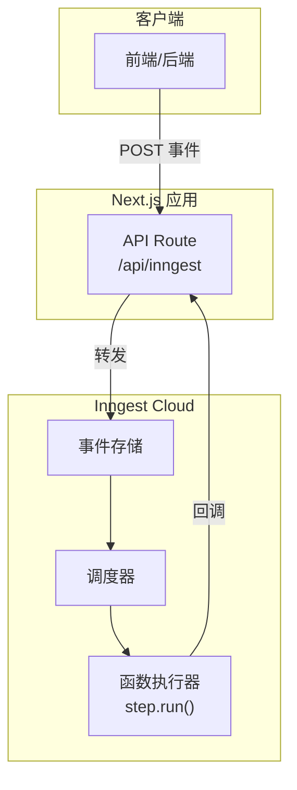
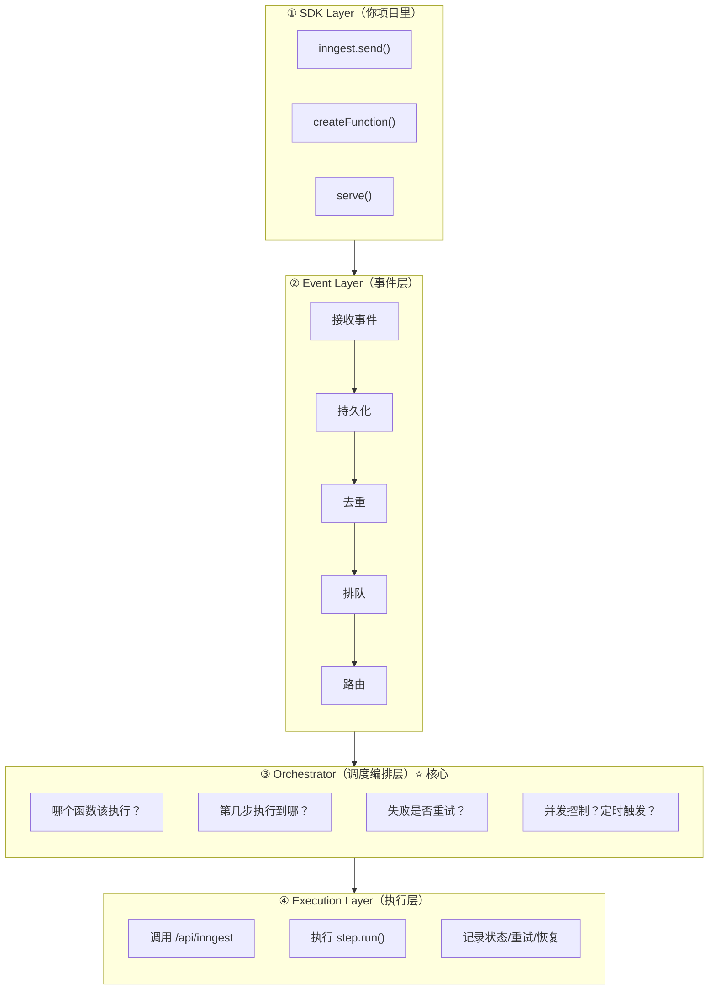
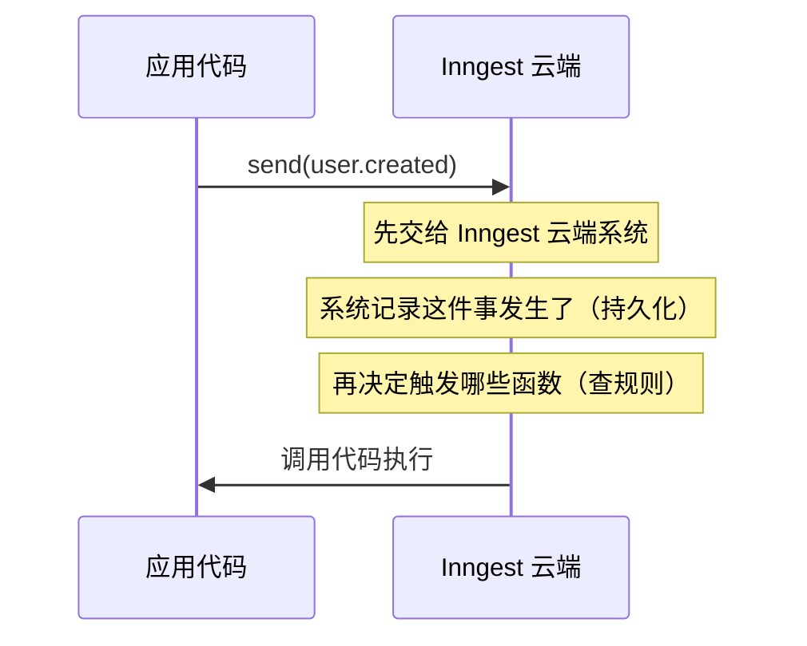
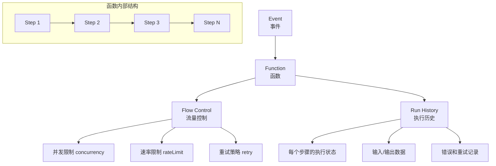
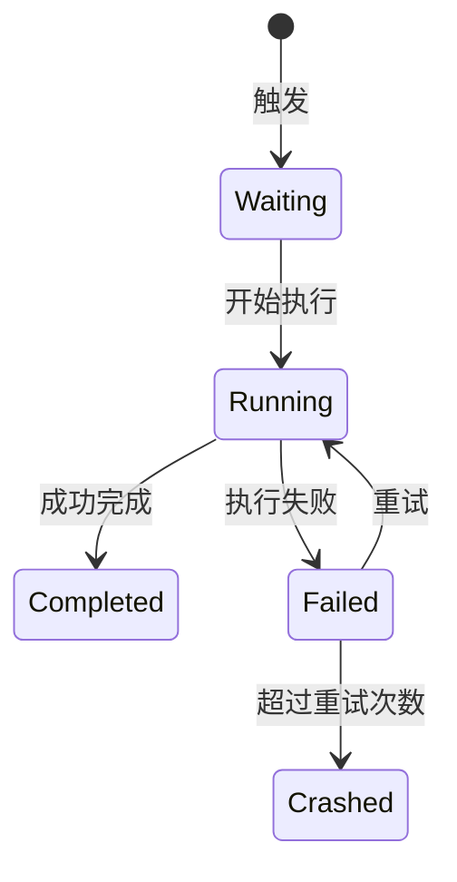
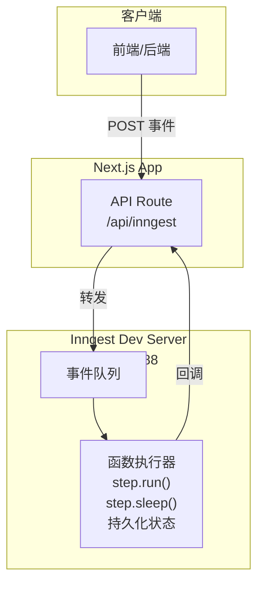
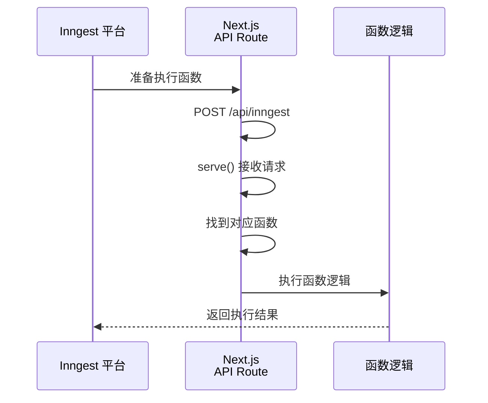

# Inngest 学习指南

> 文档版本: v2.2 (v4) | 最后更新: 2026-04-29

## 目录

1. [概述](#1-概述)
2. [核心概念](#2-核心概念)
3. [快速开始](#3-快速开始)
4. [函数创建详解](#4-函数创建详解)
5. [触发器详解](#5-触发器详解)
6. [步骤与控制流](#6-步骤与控制流)
7. [事件系统](#7-事件系统)
8. [定时任务与调度](#8-定时任务与调度)
9. [Next.js 集成进阶](#9-nextjs-集成进阶)
10. [开发服务器](#10-开发服务器)
11. [生产环境部署](#11-生产环境部署)
12. [最佳实践](#12-最佳实践)
13. [附录](#附录)
14. [v4 版本新特性](#14-v4-版本新特性)

---

## 1. 概述

### 1.1 什么是 Inngest

Inngest 是一个**事件驱动的后台任务/工作流编排平台**，专门用于构建可靠的后台逻辑和工作流。

它将持久化执行（Durable Execution）、事件驱动架构和任务队列整合到一个零基础设施的平台中。

### 1.2 解决了什么问题？

把 **耗时、异步、定时、多步骤任务** 从前端请求拆分出去，在 **后台可靠执行**。

**例如：** 当用户注册网站后
```js
await createUser()
await sendWelcomeEmail()
await createStripeCustomer()
await syncCRM()
await generateTrialWorkspace()
```
**问题：** 页面转圈五秒、某一步失败全挂、无日志跟踪

使用Inngest后，用户注册后页面立即返回，所有任务后台执行。同时Inngest可以持久化执行。

### 1.3 核心特性

- **持久化函数执行**：即使进程崩溃，函数也能从中断处恢复执行

  - **例子：** 如果函数有 5 个步骤，执行到第 3 步时服务器挂了，Inngest 会**记住**前两步已经做完了。等系统恢复，它会直接从第 3 步继续，而不是从头开始。这就叫**持久执行 (Durable Execution)**。

- **事件驱动**：通过事件触发函数执行

- **零基础设施**：无需搭建消息队列、状态管理系统或任务调度器

- **内置可观测性**：自动记录函数执行日志和状态

- **多语言支持**：TypeScript、Python、Go、Java/Kotlin

- **本地开发支持**：提供 Dev Server，与生产环境完全一致

### 1.4 工作原理

#### 1.4.1 核心定位

Inngest 的**执行流程**本质上是 **事件驱动 + 持久化步骤执行 + 自动重试 + 可恢复工作流**

解决了 Serverless 环境下如何 可靠执行后台任务与长流程的问题。

#### 1.4.2 整体架构图



#### 1.4.3 四层架构



#### 1.4.4 执行流程详解

**你以为的执行方式：**
```
inngest.send(user.created) → 马上执行 welcome-email 函数
```

**真实的执行方式：**



#### 1.4.5 为什么不直接执行？

| 问题 | 直接执行的后果 |
|------|---------------|
| 网站请求卡住 | 注册用户需要等待 8 秒（发邮件、sync CRM 等全部完成） |
| 服务器崩了 | 任务丢失，已执行的操作无法恢复 |
| 瞬间 1000 人注册 | 服务器直接爆掉 |

**先进系统再执行的好处：**

- **排队**：1000 个事件先排队，一个个处理
- **自动重试**：发邮件失败自动重试
- **不阻塞前端**：前端 0.2 秒返回成功
- **有日志**：知道谁失败了

#### 1.4.6 本质理解

> `inngest.send()` 不是"执行任务"，而是"发通知"：发生了一件事，请安排后台处理。

```
send() = 发消息

createFunction() = 谁来处理消息

step.run() = 怎么处理
```

#### 1.4.7 无状态执行 + 有状态流程

这是 Inngest 最核心的设计：

| 组件 | 特性 | 说明 |
| --- | --- | --- |
| **执行器（你的代码）** | 无状态 | Next.js 函数执行完就结束 |
| **流程（Inngest 云端）** | 有状态 | 记录执行到第几步、失败等待重试等 |

即使服务器重启，Inngest 云端仍然记得：当前执行到第 2 步，第 3 步失败过，等待明天继续。

#### 1.4.8 为什么适合 Serverless

Serverless 最大问题：

- 函数会超时
- 函数会销毁
- 没有常驻 worker

Inngest 解决方案：

- 短执行 + 云端持久状态 + 分步恢复

---

## 2. 核心概念

### 2.1 核心组件概览

| 组件 | 作用 | 说明 |
| --- | --- | --- |
| **Triggers (触发器)** | 定义何时执行函数 | 事件触发、定时触发、HTTP 触发 |
| **Steps (步骤)** | 定义函数执行逻辑 | 每个步骤可自动重试、支持持久化状态 |
| **Flow Control (流量控制)** | 控制执行方式 | 并发限制、速率限制、去抖动、优先级 |
| **Schedule（定时任务）** | 定时触发函数 | Cron 表达式调度 |
| **Run History（执行历史）** | 记录执行状态 | 调试、日志追踪、状态回溯 |

### 2.2 关键术语

| 术语 | 说明 |
| --- | --- |
| Function | 一个可执行的逻辑单元，类似 serverless 函数 |
| Event | 触发函数执行的消息 |
| Step | 函数中的单个执行单元 |
| Run | 函数的一次执行实例 |
| Action | Inngest 平台执行的具体操作 |

### 2.3 组件关系图



### 2.4 执行状态流转



### 2.5 重试时间轴

```mermaid
gantt
    title 重试时间轴（指数退避）
    dateFormat X
    axisFormat %fs

    section 尝试
    尝试 1 (立即)       :0, 1
    尝试 2 (等待 10s)    :1, 11
    尝试 3 (等待 20s)    :12, 32
    尝试 4 (等待 40s)    :33, 73
    尝试 5 (等待 80s)    :74, 154
    标记失败            :154, 155
```



---

## 3. 快速开始

本节将带你创建一个最简单的 Inngest 后台任务处理流程。理解每个步骤的「为什么」，比单纯复制代码更重要。

### 3.1 整体架构一览

在开始之前，先理解整个请求链路：



**核心流程：**
1. 你的应用通过 `inngest.send()` 发送一个事件
2. 事件被发送到 Inngest 平台
3. Inngest 根据触发器匹配，调度对应的函数执行
4. 函数在你的 Next.js 应用中执行（通过 API Route 接收请求）

### 3.2 安装依赖

```bash
npm install inngest
```

> **为什么用 inngest 而不是 inngest/next？**
>
> inngest 包本身已经包含了对 Next.js 的支持。`import { Inngest } from "inngest"` 是统一入口，
> SDK 会自动检测运行环境（Node.js / Next.js / Edge），无需单独安装 `inngest/next`。

### 3.3 创建 Inngest 客户端

**目的：** 创建客户端实例，作为应用与 Inngest 平台通信的桥梁。

```typescript
// src/inngest/client.ts
import { Inngest } from "inngest";

// 创建 Inngest 实例
// id 是你的应用唯一标识符，Inngest 根据它来组织和区分不同的函数
const inngest = new Inngest({
  id: "my-app", // 建议使用应用名称的短横线格式，如 "my-blog", "ecommerce-api"
});

export { inngest };
```

> **为什么要单独一个文件？**
>
> 1. **复用**：在应用的任何地方（API Route、页面组件、后台任务）都可以导入同一个实例
> 2. **配置集中**：所有 Inngest 配置（中间件、环境变量）都在一处管理
> 3. **测试友好**：可以方便地 mock 这个实例进行单元测试

### 3.4 创建 HTTP 处理器

**目的：** 暴露一个 API 端点，让 Inngest 平台能够调用你的函数。

```typescript
// src/app/api/inngest/route.ts
import { serve } from "inngest/next";
import { inngest } from "@/inngest/client";

// 导入所有函数
import { processTask } from "@/inngest/functions";

// 创建一个 Next.js API Route 处理器
// 这个路由会处理所有来自 Inngest 平台的函数执行请求
export const { GET, POST, PUT } = serve({
  client: inngest,
  functions: [processTask], // 注册函数列表
});
```

**serve 做了什么？**



`serve` 实际上是一个适配器，它把 Inngest 的函数注册格式转换为 Next.js API Route 的处理逻辑。

你的函数不会在这里直接执行，而是由 Inngest 平台的执行器（运行在你的服务器上或云端）来调度。

### 3.5 创建第一个函数

**目的：** 定义一个可被 Inngest 平台触发的后台任务逻辑。

```typescript
// src/inngest/functions/processTask.ts
import { inngest } from "../client";

// 创建函数
// v4 版本使用 createFunction，触发器定义在第一个参数的 triggers 字段中
export const processTask = inngest.createFunction(
  {
    id: "process-task",                             // 函数唯一 ID
    retries: 3,                                     // 失败时自动重试 3 次
    triggers: { event: "app/task.created" },       // 触发条件：监听这个事件
  },
  async ({ event, step }) => {
    // event - 触发这个函数的事件对象
    // step  - 步骤控制 API，用于定义可恢复的步骤

    // step.run() - 执行一个步骤
    // 第一个参数是步骤名称（用于追踪和重试）
    const result = await step.run("handle-task", async () => {
      // 在这里执行实际的业务逻辑
      return { processed: true, taskId: event.data.taskId };
    });

    // step.sleep() - 暂停一段时间（函数执行会在指定时间后恢复）
    await step.sleep("wait-before-complete", "1s");

    return { message: `Task ${event.data.taskId} processed`, result };
  }
);
```

> **为什么要用 step.run() 而不是直接写代码？**

区别在于**持久化和可恢复性**：

| 特性 | 直接代码 | step.run() |
|------|---------|------------|
| 进程崩溃后恢复 | ❌ 需要从头开始 | ✅ 从断点继续 |
| 重试粒度 | 整个函数重试 | 精确到单个步骤 |
| 执行日志 | 需要自己实现 | 自动记录每个步骤 |
| 状态追踪 | 需要自己实现 | 自动持久化 |

```typescript
// ❌ 直接写 - 崩溃后整个函数要重新执行
async ({ event }) => {
  const user = await fetchUser(event.data.userId);  // 可能成功
  await sendEmail(user.email);                       // 可能失败，但用户已经获取了
}

// ✅ 用 step.run() - 精确控制每一步
async ({ step }) => {
  const user = await step.run("fetch-user", async () => {
    return await fetchUser(event.data.userId);  // 如果成功，重试时跳过
  });

  await step.run("send-email", async () => {
    return await sendEmail(user.email);          // 如果失败，只重试这一步
  });
}
```

### 3.6 在函数文件中导出

**目的：** 方便统一管理和注册所有函数。

```typescript
// src/inngest/functions/index.ts
export { processTask } from "./processTask";
// 未来可以在这里添加更多函数：
// export { sendWelcomeEmail } from "./sendWelcomeEmail";
// export { generateReport } from "./generateReport";
```

### 3.7 发送事件触发函数

现在函数已经注册好了，如何触发它？通过发送事件：

```typescript
// 在任何地方（API Route、页面组件、业务逻辑中）
import { inngest } from "@/inngest/client";

await inngest.send({
  name: "app/task.created",           // 事件名称，要和函数触发器匹配
  data: {
    taskId: "task_123",
    priority: "high",
  },
});
```

> **完整示例：在 Next.js API Route 中使用**

```typescript
// src/app/api/tasks/route.ts
import { NextRequest, NextResponse } from "next/server";
import { inngest } from "@/inngest/client";

export async function POST(req: NextRequest) {
  const { taskId, priority } = await req.json();

  // 创建任务（同步保存到数据库）
  const task = await db.tasks.create({ id: taskId, priority });

  // 发送事件触发后台处理（非阻塞）
  // 这样用户不用等待后台处理完成，可以立即收到响应
  await inngest.send({
    name: "app/task.created",
    data: {
      taskId: task.id,
      priority: task.priority,
    },
  });

  return NextResponse.json({ success: true, taskId: task.id });
}
```

### 3.8 启动本地开发

```bash
# 启动 Next.js 开发服务器
npm run dev

# 在另一个终端启动 Inngest Dev Server
npx inngest-cli@latest dev
# 访问 http://localhost:8288 查看 Inngest 开发控制台
```

> **Dev Server 的作用：**
>
> ```mermaid
> flowchart LR
>     subgraph NextJS["你的 Next.js App<br/>localhost:3000"]
>         Send["inngest.send()"]
>     end
>
>     subgraph DevServer["Inngest Dev Server<br/>localhost:8288"]
>         Queue["事件队列"]
>         Storage["内存/文件存储"]
>         Executor["函数执行器"]
>         UI["Web UI<br/>执行日志<br/>历史记录"]
>     end
>
>     Send -->|"发送事件"| Queue
>     Queue --> Storage
>     Storage --> Executor
>     Executor -->|"函数执行结果"| Storage
>     UI --> Storage
> ```
>
> Dev Server 模拟了完整的 Inngest 平台行为：
> - 事件接收和存储
> - 函数调度和执行
> - 状态持久化（开发模式下通常用内存）
> - Web UI（查看执行日志、历史记录）
>
> **关键点：** 开发时 `inngest.send()` 会发送到本地 Dev Server，而不是真实的 Inngest 云平台。
> 这样可以在本地完整测试整个流程，无需配置任何外部服务。

### 3.9 目录结构推荐

```
my-nextjs-app/
├── app/
│   ├── api/
│   │   ├── inngest/
│   │   │   └── route.ts          # ✅ HTTP 处理器（必须）
│   │   └── tasks/
│   │       └── route.ts          # 业务 API，发事件触发后台任务
│   └── page.tsx
├── inngest/                       # ✅ 单独目录管理所有 Inngest 代码
│   ├── client.ts                  # ✅ 客户端实例
│   └── functions/
│       ├── index.ts               # ✅ 统一导出
│       └── processTask.ts         # 函数定义
```

> **为什么推荐这种结构？**
>
> 1. **关注点分离**：Inngest 逻辑与业务逻辑分开
> 2. **易于扩展**：随着函数增多，只需要在这个目录下添加新文件
> 3. **便于测试**：可以单独对函数进行单元测试

---

## 4. 函数创建详解

### 4.1 createFunction 完整签名

```typescript
inngest.createFunction(
  {
    id: "function-id",           // 函数唯一ID（可选，默认使用名称）
    name: "显示名称",              // 在控制台显示的名称
    concurrency: 5,               // 并发限制
    rateLimit: {                  // 速率限制
      limit: 10,                 // 时间窗口内最大执行次数
      period: "1m",              // 时间窗口
    },
    idempotencyKey: "key",        // 幂等性键
    retries: 3,                  // 重试次数（默认3次）
    cors: true,                  // 是否启用CORS
    batchEvents: {                // 批量事件处理
      maxSize: 100,
      timeout: "5s",
    },
  },
  // 触发器定义
  { event: "user/signup" },
  // 执行函数
  async ({ event, step, ctx }) => {
    // 函数逻辑
  }
);
```

### 4.2 触发器类型

```typescript
// 方式一：单个事件触发
{ event: "user/signup" }

// 方式二：多个事件触发（任一事件都会触发）
{ events: ["user/signup", "user/login"] }

// 方式三：带过滤条件的事件触发
{
  event: "payment.created",
  where: {
    "data.amount": { $gt: 100 },  // 只处理金额大于100的支付
  }
}

// 方式四：定时触发（cron表达式）
{ cron: "*/5 * * * *" }  // 每5分钟执行一次

// 方式五：HTTP 触发
{ id: "my-endpoint" }  // 可以通过 HTTP 调用
```

### 4.3 函数上下文对象

```typescript
async ({ event, step, ctx, logger, input }) => {
  // event - 触发事件
  //   event.name    - 事件名称
  //   event.data    - 事件数据
  //   event.user    - 用户信息（如有）
  //   event.v       - 事件版本
  //   event.ts      - 事件时间戳

  // step - 步骤控制API
  //   step.run()   - 执行同步操作
  //   step.sleep() - 暂停执行
  //   step.waitFor() - 等待某个事件
  //   step.invoke() - 调用另一个函数

  // ctx - 执行上下文
  //   ctx.run_id   - 当前运行ID
  //   ctx.attempt  - 当前重试次数

  // logger - 日志记录器
  logger.info("信息日志");

  // input - 输入数据
}
```

---

## 5. 触发器详解

### 5.1 事件触发器

事件触发是最常用的方式，当发送指定事件时函数被触发执行。

```typescript
// 监听单个事件
const onUserSignup = inngest.createFunction(
  { id: "welcome-email" },
  { event: "user/signup" },  // 事件名称
  async ({ event }) => {
    const { email, name } = event.data;
    // 发送欢迎邮件
    await sendEmail({ to: email, template: "welcome", name });
  }
);
```

**发送事件触发函数：**

```typescript
// 在应用代码中发送事件
await inngest.send({
  name: "user/signup",        // 事件名称
  data: {                     // 事件数据
    userId: "12345",
    email: "user@example.com",
    name: "张三",
  },
  // 可选：用户信息（用于追踪）
  user: {
    external_id: "user_123",
    email: "user@example.com",
  },
});
```

### 5.2 带条件的事件过滤

```typescript
// 使用 where 选项过滤事件
const onHighValuePayment = inngest.createFunction(
  { id: "high-value-order" },
  {
    event: "payment/created",
    where: {
      // 只处理金额 >= 1000 的订单
      "data.amount": { $gte: 1000 },
      // 只处理 USD 货币
      "data.currency": "USD",
    },
  },
  async ({ event }) => {
    // 只处理高价值订单的逻辑
    await processHighValueOrder(event.data);
  }
);
```

**支持的过滤操作符：**

| 操作符 | 说明 | 示例 |
|--------|------|------|
| `$eq` | 等于 | `{ $eq: "USD" }` |
| `$ne` | 不等于 | `{ $ne: "pending" }` |
| `$gt` | 大于 | `{ $gt: 100 }` |
| `$gte` | 大于等于 | `{ $gte: 100 }` |
| `$lt` | 小于 | `{ $lt: 1000 }` |
| `$lte` | 小于等于 | `{ $lte: 1000 }` |
| `$in` | 在数组中 | `{ $in: ["pending", "processing"] }` |
| `$nin` | 不在数组中 | `{ $nin: ["failed", "cancelled"] }` |
| `$contains` | 包含字符串 | `{ $contains: "vip" }` |

### 5.3 定时触发器（Cron）

```typescript
// 每小时执行一次
const hourlyReport = inngest.createFunction(
  { id: "generate-report" },
  { cron: "0 * * * *" },  // 标准 cron 表达式
  async () => {
    await generateAndSendReport();
  }
);

// 每天凌晨2点执行
const dailyCleanup = inngest.createFunction(
  { id: "daily-cleanup" },
  { cron: "0 2 * * *" },
  async () => {
    await cleanupOldData();
  }
);

// 每5分钟执行一次（用于处理积压任务）
const processBacklog = inngest.createFunction(
  { id: "process-backlog" },
  { cron: "*/5 * * * *" },
  async () => {
    await processPendingItems();
  }
);
```

**常用 Cron 表达式：**

| 表达式 | 说明 |
|--------|------|
| `*/5 * * * *` | 每5分钟 |
| `0 * * * *` | 每小时 |
| `0 0 * * *` | 每天午夜 |
| `0 0 * * 0` | 每周日午夜 |
| `0 0 1 * *` | 每月第一天 |
| `0 9-17 * * *` | 工作时间每小时 |

---

## 6. 步骤与控制流

### 6.1 step.run - 执行同步操作

`step.run` 用于执行同步代码，是最常用的步骤类型。每个 `step.run` 都是原子性的，支持自动重试。

```typescript
async ({ step }) => {
  // 第一步：获取用户数据
  const user = await step.run("fetch-user", async () => {
    const response = await fetch(`/api/users/${event.data.userId}`);
    return response.json();
  });

  // 第二步：处理数据
  const processed = await step.run("process-data", async () => {
    return {
      ...user,
      processedAt: new Date().toISOString(),
      upperName: user.name.toUpperCase(),
    };
  });

  // 第三步：保存结果
  await step.run("save-result", async () => {
    await db.collection("processed_users").insertOne(processed);
  });

  return processed;
}
```

### 6.2 step.sleep - 暂停执行

用于在函数执行中暂停一段时间。

```typescript
async ({ step }) => {
  // 第一步：创建订单
  await step.run("create-order", async () => {
    return await createOrder(event.data);
  });

  // 第二步：等待1小时（用于支付超时处理）
  await step.sleep("wait-for-payment", "1h");

  // 第三步：检查订单状态
  const orderStatus = await step.run("check-order-status", async () => {
    const order = await getOrder(event.data.orderId);
    return order.status;
  });

  // 第四步：根据状态处理
  if (orderStatus === "pending") {
    await step.run("cancel-order", async () => {
      await cancelOrder(event.data.orderId);
    });
  }
}
```

**时间格式：**

```typescript
// 各种时间格式都支持
await step.sleep("sleep-1", "5s");    // 5秒
await step.sleep("sleep-2", "30m");   // 30分钟
await step.sleep("sleep-3", "2h");    // 2小时
await step.sleep("sleep-4", "1d");    // 1天
await step.sleep("sleep-5", "1d2h3m4s"); // 1天2小时3分钟4秒
```

### 6.3 step.waitFor - 等待事件

暂停执行直到收到指定事件。

```typescript
async ({ step }) => {
  // 启动任务
  await step.run("start-task", async () => {
    return await startLongRunningTask();
  });

  // 等待完成事件，最多等待24小时
  const completeEvent = await step.waitFor(
    "wait-for-completion",
    event => event.name === "task/completed" && event.data.taskId === event.data.taskId,
    { timeout: "24h" }
  );

  // 处理完成事件
  await step.run("handle-completion", async () => {
    await handleTaskResult(completeEvent.data);
  });
}
```

### 6.4 step.invoke - 调用其他函数

在一个函数中调用另一个 Inngest 函数。

```typescript
// 定义被调用的函数
const sendNotification = inngest.createFunction(
  { id: "send-notification", retries: 2 },
  { event: "notification/send" },
  async ({ event }) => {
    await sendEmail(event.data);
  }
);

// 主函数中调用
const processOrder = inngest.createFunction(
  { id: "process-order" },
  { event: "order/created" },
  async ({ step }) => {
    await step.run("create-order", async () => {
      return await db.orders.create(event.data);
    });

    // 调用通知函数
    await step.invoke("notify-user", {
      function: sendNotification,
      data: {
        userId: event.data.userId,
        type: "order_confirmed",
        orderId: event.data.orderId,
      },
    });
  }
);
```

### 6.5 错误处理与重试

```typescript
const robustFunction = inngest.createFunction(
  {
    id: "robust-function",
    retries: 3,  // 最多重试3次
  },
  { event: "data/process" },
  async ({ step, ctx }) => {
    // ctx.attempt 包含当前重试次数（从1开始）
    console.log(`执行中，当前尝试次数: ${ctx.attempt}`);

    await step.run("risky-operation", async () => {
      const result = await riskyApiCall();
      if (!result.success) {
        // 抛出错误将触发重试
        throw new Error("操作失败");
      }
      return result;
    });
  }
);
```

**重试策略：**

```typescript
// 方式一：简单配置
{ retries: 5 }

// 方式二：详细配置
{
  retries: {
    attempts: 5,
    delay: "10s",           // 初始延迟
    backoff: "exponential", // 指数退避
    maxDelay: "1h",         // 最大延迟
  }
}

// 方式三：使用 step.run 的 retry 配置
await step.run("unreliable-service", {
  retry: {
    attempts: 3,
    delay: "5s",
  }
}, async () => {
  // 操作
});
```

**重试时间轴示意：**

```mermaid
gantt
    title 重试时间轴（指数退避）
    dateFormat X
    axisFormat %fs

    section 尝试
    尝试 1 (立即)       :0, 1
    尝试 2 (等待 10s)    :1, 11
    尝试 3 (等待 20s)    :12, 32
    尝试 4 (等待 40s)    :33, 73
    尝试 5 (等待 80s)    :74, 154
```



### 6.6 并发控制

```typescript
// 全局并发限制
const globalLimited = inngest.createFunction(
  { id: "global-task", concurrency: 10 },  // 最多10个并发实例
  { event: "task/run" },
  async ({ step }) => {
    // 函数逻辑
  }
);

// 按事件数据分组控制并发
const perUserLimited = inngest.createFunction(
  {
    id: "per-user-task",
    concurrency: 5,
    matchingPaths: ["event.data.userId"],  // 按 userId 分组
  },
  { event: "task/run" },
  async ({ step }) => {
    // 每个 userId 最多5个并发
  }
);
```

### 6.7 速率限制

```typescript
const rateLimitedFunction = inngest.createFunction(
  {
    id: "api-caller",
    rateLimit: {
      limit: 100,      // 时间窗口内最多100次
      period: "1m",    // 1分钟时间窗口
      burst: 10,       // 允许突发请求数
    },
  },
  { event: "api/call" },
  async ({ step }) => {
    await callExternalApi(event.data);
  }
);
```

---

## 7. 事件系统

### 7.1 事件结构

```typescript
// 事件对象
{
  name: "user/signup",           // 事件名称（必需）
  data: {                        // 事件数据（必需）
    userId: "123",
    email: "user@example.com",
    metadata: { /* ... */ }
  },
  user: {                        // 用户信息（可选）
    external_id: "user_123",
    email: "user@example.com",
  },
  v: "2024-01-01",              // 事件版本
  ts: 1704067200000,            // 时间戳（毫秒）
  idempotencyKey: "unique_key", // 幂等性键（可选）
}
```

### 7.2 发送事件

```typescript
import { Inngest } from "inngest";

const inngest = new Inngest({ id: "my-app" });

// 发送单个事件
await inngest.send({
  name: "user/signup",
  data: {
    userId: "123",
    email: "user@example.com",
  },
});

// 批量发送事件
await inngest.send([
  { name: "user/signup", data: { userId: "1", email: "a@example.com" } },
  { name: "user/signup", data: { userId: "2", email: "b@example.com" } },
  { name: "order/created", data: { orderId: "100" } },
]);
```

### 7.3 幂等性

```typescript
// 使用幂等性键防止重复处理
await inngest.send({
  name: "payment/process",
  data: { paymentId: "pay_123", amount: 100 },
  idempotencyKey: "payment_pay_123", // 相同键的事件只处理一次
});
```

### 7.4 在函数中发送事件

```typescript
async ({ step }) => {
  // 发送新事件触发其他函数
  await step.run("send-follow-up-event", async () => {
    await inngest.send({
      name: "user/welcomed",
      data: { userId: event.data.userId },
    });
  });
}
```

---

## 8. 定时任务与调度

### 8.1 Cron 表达式详解

Inngest 使用标准 cron 表达式，格式为：

```
┌───────────── 分钟 (0-59)
│ ┌───────────── 小时 (0-23)
│ │ ┌───────────── 日期 (1-31)
│ │ │ ┌───────────── 月份 (1-12)
│ │ │ │ ┌───────────── 星期 (0-7, 0和7都是周日)
│ │ │ │ │
* * * * *
```

### 8.2 常见调度场景

```typescript
// 每分钟检查一次健康状态
const healthCheck = inngest.createFunction(
  { id: "health-check", retries: 1 },
  { cron: "* * * * *" },
  async () => {
    await checkSystemHealth();
  }
);

// 每天凌晨清理过期数据
const dailyCleanup = inngest.createFunction(
  { id: "daily-cleanup", idemPotencyKey: "cleanup" },
  { cron: "0 2 * * *" },  // 凌晨2点
  async () => {
    await cleanupExpiredData();
  }
);

// 每周一早上9点生成周报
const weeklyReport = inngest.createFunction(
  { id: "weekly-report" },
  { cron: "0 9 * * 1" },  // 周一9点
  async () => {
    await generateWeeklyReport();
  }
);

// 每季度第一天发送报告
const quarterlyReport = inngest.createFunction(
  { id: "quarterly-report" },
  { cron: "0 0 1 1,4,7,10 *" },  // 1月、4月、7月、10月第一天
  async () => {
    await sendQuarterlyReport();
  }
);
```

### 8.3 调度函数与事件函数的区别

| 特性 | 事件函数 | 调度函数 |
|------|----------|----------|
| 触发方式 | 事件发送 | Cron 表达式 |
| 执行时机 | 事件驱动 | 固定时间 |
| 适用场景 | 异步处理、响应事件 | 定期任务、清理、报表 |
| 数据来源 | 事件数据 | 自身逻辑 |

---

## 9. Next.js 集成进阶

> 本章是 [第3章 快速开始](#3-快速开始) 的进阶内容，包含第3章中没有的 Middleware 和部署相关内容。第3章已涵盖的基础内容（安装、客户端创建、HTTP处理器、函数创建等）不再重复。

### 9.1 项目结构推荐

```
my-nextjs-app/
├── app/
│   ├── api/
│   │   └── inngest/
│   │       └── route.ts          # Inngest HTTP 处理器
│   └── page.tsx
├── inngest/
│   ├── client.ts                 # Inngest 客户端配置
│   ├── functions/
│   │   ├── index.ts              # 导出所有函数
│   │   ├── user.signup.ts        # 用户注册相关函数
│   │   ├── order.process.ts      # 订单处理函数
│   │   └── scheduled.tasks.ts    # 定时任务
│   └── middleware.ts             # 中间件配置
└── lib/
    └── inngest.ts                # 可选：单独的客户端实例
```

### 9.2 使用 Middleware

Inngest 支持中间件来添加日志、追踪等功能。

```typescript
// inngest/middleware.ts
import { InngestMiddleware } from "inngest";
import { Logger } from "./logger";

export const loggingMiddleware = new InngestMiddleware({
  name: "logging",
  init: () => {
    const logger = new Logger();
    return {
      onFunctionRun: ({ functionName, event, ctx }) => {
        return {
          transformOutput: (output) => {
            console.log(`函数 ${functionName} 执行完成`);
            return output;
          },
        };
      },
    };
  },
});

// 在客户端中使用中间件
export const inngest = new Inngest({
  id: "my-app",
  middleware: [loggingMiddleware],
});
```

### 9.3 部署到生产环境

**环境变量配置：**

```bash
# .env.production
INNGEST_EVENT_KEY=your_event_key_here
INNGEST_SIGNING_KEY=your_signing_key_here
```

**获取 Event Key：**

1. 登录 [Inngest Dashboard](https://app.inngest.com)
2. 创建一个 App
3. 复制 Event Key 到环境变量

---

## 10. 开发服务器

### 10.1 启动本地开发服务器

Inngest 提供独立的开发服务器，可以完整模拟生产环境行为。

```bash
# 安装 CLI
npm install -g inngest

# 启动开发服务器（监听 Inngest 事件）
npx inngest dev

# 指定端口
npx inngest dev --port 8383

# 指定应用目录
npx inngest dev --dir ./app
```

### 10.2 开发服务器功能

- 完整的事件处理和函数执行
- 可视化的函数执行日志
- 支持单步调试
- 自动重载（文件变化时）
- 模拟事件发送

### 10.3 使用开发 UI

开发服务器启动后，访问 `http://localhost:8288` 可以看到：
- 事件历史
- 函数执行状态
- 实时日志
- 手动发送测试事件

### 10.4 本地开发配置

```typescript
// 在 .env.local 中配置
INNGEST_DEV=1                    // 启用开发模式
INNGEST_EVENT_KEY=dev-key        // 开发环境 Event Key
```

### 10.5 生产环境预演

```bash
# 在生产环境部署前测试
npx inngest dev --production

# 这将使用生产环境的事件处理逻辑
```

---

## 11. 生产环境部署

### 11.1 部署选项

| 选项 | 说明 |
|------|------|
| **Inngest Cloud** | 托管服务，无需管理基础设施 |
| **自托管** | 部署到自己的服务器（Docker/K8s） |
| **混合模式** | 开发用云端，生产用自托管 |

### 11.2 Docker 部署

```dockerfile
# Dockerfile
FROM inngest/inngest:latest

WORKDIR /app

# 复制函数代码
COPY . .

# 暴露端口
EXPOSE 8080

CMD ["serve", "--app-dir", "/app"]
```

```yaml
# docker-compose.yml
version: "3.8"
services:
  inngest:
    build: .
    ports:
      - "8080:8080"
    environment:
      - INNGEST_EVENT_KEY=${INNGEST_EVENT_KEY}
      - INNGEST_SIGNING_KEY=${INNGEST_SIGNING_KEY}
      - DATABASE_URL=${DATABASE_URL}
    restart: unless-stopped
```

### 11.3 环境变量

| 变量 | 说明 | 必需 |
|------|------|------|
| `INNGEST_EVENT_KEY` | 用于发送事件 | 是 |
| `INNGEST_SIGNING_KEY` | 签名验证 | 是 |
| `INNGEST_APP_ID` | 应用ID | 否 |
| `PORT` | 服务端口 | 否 |

### 11.4 健康检查

```typescript
// app/api/inngest/health/route.ts
import { serve } from "inngest/next";
import { inngest } from "@/inngest/client";
import { functions } from "@/inngest/functions";

export const { GET, POST, PUT } = serve({
  client: inngest,
  functions,
  // 添加健康检查端点
  servePath: "/api/inngest",
});

export async function GET(req: Request) {
  // 返回服务健康状态
  return Response.json({ status: "ok" });
}
```

---

## 12. 最佳实践

### 12.1 函数设计原则

**1. 保持函数小而专注**

```typescript
// ❌ 不好：函数太大，处理太多逻辑
const badFunction = inngest.createFunction(
  { id: "do-everything" },
  { event: "user/action" },
  async ({ step }) => {
    await step.run("step1", async () => { /* 很多代码 */ });
    await step.run("step2", async () => { /* 很多代码 */ });
    // ... 更多步骤
  }
);

// ✅ 好：职责分离，每个函数做一件事
const sendEmail = inngest.createFunction(
  { id: "send-email" },
  { event: "email/send" },
  async ({ step }) => { /* 只发送邮件 */ }
);

const processPayment = inngest.createFunction(
  { id: "process-payment" },
  { event: "payment/process" },
  async ({ step }) => { /* 只处理支付 */ }
);
```

**2. 使用步骤名称便于追踪**

```typescript
// ❌ 不好的命名
await step.run("run", async () => { /* ... */ });
await step.run("execute", async () => { /* ... */ });

// ✅ 好的命名：清晰描述步骤目的
await step.run("fetch-user-from-database", async () => { /* ... */ });
await step.run("validate-email-address", async () => { /* ... */ });
await step.run("send-welcome-email", async () => { /* ... */ });
```

**3. 合理设置重试次数**

```typescript
// 快速操作（API调用） - 较多重试
const apiCall = inngest.createFunction(
  { id: "api-call", retries: 5 },
  { event: "api/call" },
  async ({ step }) => { /* 快速操作 */ }
);

// 关键业务操作 - 适度重试
const payment = inngest.createFunction(
  { id: "process-payment", retries: 3 },
  { event: "payment/process" },
  async ({ step }) => { /* 支付处理 */ }
);

// 后台清理任务 - 较少重试
const cleanup = inngest.createFunction(
  { id: "cleanup", retries: 1 },
  { event: "cleanup/run" },
  async ({ step }) => { /* 清理操作 */ }
);
```

### 12.2 幂等性设计

```typescript
// 使用幂等性键确保事件只被处理一次
await inngest.send({
  name: "payment/process",
  data: { paymentId: "pay_123", amount: 100 },
  idempotencyKey: `payment_pay_123`, // 基于支付ID生成
});

// 在函数中使用幂等性键
export const processPayment = inngest.createFunction(
  {
    id: "process-payment",
    // 框架自动处理幂等性
  },
  { event: "payment/process" },
  async ({ step }) => {
    // 检查是否已处理
    const existing = await step.run("check-existing", async () => {
      return await db.payments.findOne({
        where: { paymentId: event.data.paymentId }
      });
    });

    if (existing) {
      return { alreadyProcessed: true };
    }

    // 处理支付
    await step.run("execute-payment", async () => {
      await db.payments.create(event.data);
    });
  }
);
```

### 12.3 错误处理策略

```typescript
async ({ step }) => {
  try {
    await step.run("risky-operation", async () => {
      return await riskyApiCall();
    });
  } catch (error) {
    // 记录错误但不让函数失败
    await step.run("log-error", async () => {
      logger.error("操作失败", { error, event: event.data });
    });

    // 返回安全默认值
    return { status: "failed", error: error.message };
  }
}
```

### 12.4 性能优化

**1. 减少不必要的步骤**

```typescript
// ❌ 不必要的步骤分离
await step.run("combine-strings", async () => {
  const str = firstName + lastName; // 简单字符串拼接
  return str;
});

// ✅ 简单操作直接返回
const fullName = `${firstName} ${lastName}`;
```

**2. 合理设置并发限制**

```typescript
// 调用外部 API 时限制并发，避免被限流
const externalApiCall = inngest.createFunction(
  {
    id: "external-api-call",
    concurrency: 10,  // 根据 API 限制调整
  },
  { event: "api/call" },
  async ({ step }) => { /* ... */ }
);
```

**3. 使用批量操作**

```typescript
// 批量获取数据
const users = await step.run("fetch-users", async () => {
  return await db.users.findMany({
    where: { status: "active" },
    select: { id: true, email: true },
  });
});

// 批量处理
await step.run("process-batch", async () => {
  const chunks = chunkArray(users, 100);
  for (const chunk of chunks) {
    await processChunk(chunk);
  }
});
```

### 12.5 监控与可观测性

```typescript
import { Inngest } from "inngest";

// 使用 Sentry 中间件
export const inngest = new Inngest({
  id: "my-app",
  middleware: [
    // Sentry 中间件用于错误追踪
  ],
});

export const monitoredFunction = inngest.createFunction(
  {
    id: "monitored-function",
    retries: 3,
  },
  { event: "data/process" },
  async ({ event, step, logger }) => {
    logger.info("开始处理", { userId: event.data.userId });

    const result = await step.run("process", async () => {
      // 处理逻辑
      return result;
    });

    logger.info("处理完成", { userId: event.data.userId, result });

    return result;
  }
);
```

### 12.6 安全考虑

**1. 验证事件签名**

```typescript
// 确保事件来自 Inngest
export const { GET, POST, PUT } = serve({
  client: inngest,
  functions,
  signingKey: process.env.INNGEST_SIGNING_KEY,  // 验证签名
});
```

**2. 敏感数据处理**

```typescript
async ({ step }) => {
  // 不要在日志中记录敏感信息
  logger.info("处理支付", {
    userId: event.data.userId,
    // 不要记录: event.data.password
    // 不要记录: event.data.creditCard
  });
}
```

---

## 附录

### A. TypeScript 类型定义

```typescript
// 事件类型定义
interface InngestEvent<T = Record<string, unknown>> {
  name: string;
  data: T;
  user?: {
    external_id?: string;
    email?: string;
    [key: string]: unknown;
  };
  v?: string;
  ts?: number;
  idempotencyKey?: string;
}

// 函数上下文类型
interface FunctionContext {
  event: InngestEvent;
  step: StepAPI;
  ctx: {
    run_id: string;
    attempt: number;
  };
  logger: Logger;
}

// 步骤 API
interface StepAPI {
  run<T>(id: string, fn: () => Promise<T>): Promise<T>;
  sleep(id: string, duration: string): Promise<void>;
  waitFor(
    id: string,
    filter: (event: InngestEvent) => boolean,
    options?: { timeout: string }
  ): Promise<InngestEvent>;
  invoke<T>(id: string, options: {
    function: InngestFunction;
    data: T;
  }): Promise<unknown>;
}
```

### B. 常用命令

```bash
# 安装 Inngest CLI
npm install -g inngest

# 启动开发服务器
npx inngest dev

# 查看帮助
npx inngest --help

# 发送测试事件
npx inngest event send user/signup '{"userId":"123"}'
```

### C. 参考资源

- **官方文档**: https://www.inngest.com/docs
- **GitHub**: https://github.com/inngest/inngest
- **SDK**: https://github.com/inngest/inngest-js
- **Discord 社区**: https://discord.gg/inngest

---

## 14. v4 版本新特性

### 14.1 v4 版本概述

Inngest SDK v4 是最新的主要版本（当前最新稳定版：4.1.0，2026年3月25日发布）。v4 版本在内部架构、中间件生态和开发者体验方面进行了重大改进。

### 14.2 主要变化

#### 1. Connect 架构重构

v4 版本对 Connect 内部架构进行了全面重构，提升了性能和稳定性。

```typescript
// v4 中的 Connect 用法
import { Inngest } from "inngest";

const inngest = new Inngest({
  id: "my-app",
  // v4 新增 Connect 配置选项
  connect: {
    // 连接配置
  },
});
```

#### 2. 中间件生态增强

v4 版本提供了独立的中间件包，方便按需使用：

```bash
# 安装中间件包
npm install @inngest/middleware-encryption
npm install @inngest/middleware-sentry
npm install @inngest/middleware-validation
npm install @inngest/middleware-remote-state
npm install @inngest/realtime
```

**加密中间件示例：**

```typescript
import { Inngest } from "inngest";
import { encryptionMiddleware } from "@inngest/middleware-encryption";

const inngest = new Inngest({
  id: "my-app",
  middleware: [encryptionMiddleware({
    key: process.env.ENCRYPTION_KEY,
  })],
});
```

**Sentry 集成示例：**

```typescript
import { Inngest } from "inngest";
import { sentryMiddleware } from "@inngest/middleware-sentry";

const inngest = new Inngest({
  id: "my-app",
  middleware: [sentryMiddleware({
    dsn: process.env.SENTRY_DSN,
  })],
});
```

#### 3. Step Metadata 行为优化

v4 版本合并了 `step` 和 `step_attempt` 的行为，简化了 API：

```typescript
// v4 中的步骤元数据
async ({ step }) => {
  await step.run("do-something", async () => {
    // v4 中 step.attempts 被合并到 step 中
    // 不再需要区分 step 和 step_attempt
    return await doSomething();
  });
}
```

#### 4. Extended Traces

v4 版本增强了追踪功能，在 userland spans 中包含更详细的 step 属性：

```typescript
async ({ step }) => {
  // v4 中自动包含更丰富的 trace 信息
  await step.run("traced-step", async () => {
    // 自动记录步骤耗时、输入输出等
    return processData();
  });
}
```

#### 5. 实时支持（Realtime）

v4 版本新增 `@inngest/realtime` 包，支持实时功能：

```bash
npm install @inngest/realtime
```

```typescript
import { Inngest } from "inngest";
import { RealtimeClient } from "@inngest/realtime";

const client = new RealtimeClient({
  inngest,
});

client.on("function.completed", ({ functionId, runId }) => {
  console.log(`函数 ${functionId} 完成，Run ID: ${runId}`);
});

client.connect();
```

#### 6. 优雅关闭改进

v4 版本改进了连接 draining 时的关闭行为：

```typescript
// v4 中支持更优雅的关闭
const server = serve(inngest, functions);

process.on("SIGTERM", async () => {
  // v4 自动处理正在运行的函数
  await server.close({
    graceful: true,
    timeout: 30_000, // 最多等待30秒
  });
});
```

### 14.3 v4 迁移指南

#### 从 v3 升级到 v4

**1. 更新依赖：**

```bash
npm install inngest@^4.0.0
```

**2. 检查中间件兼容性：**

v4 中的中间件 API 有变化，如果你使用了自定义中间件，需要更新：

```typescript
// v3 中间件
const v3Middleware = {
  onFunctionRun: ({ fn, event, ctx }) => { /* ... */ },
};

// v4 中间件（需要使用 InngestMiddleware）
import { InngestMiddleware } from "inngest";

const v4Middleware = new InngestMiddleware({
  name: "my-middleware",
  init: () => ({
    onFunctionRun: ({ fn, event, ctx }) => ({
      // v4 中返回 transformOutput
      transformOutput: (output) => output,
    }),
  }),
});
```

**3. 移除过期的 batchEvents 配置（如果有）：**

```typescript
// v3 中
{ batchEvents: { maxSize: 100, timeout: "5s" } }

// v4 中 - batchEvents 功能仍然支持，但 API 有调整
```

**4. 更新 step.run 的类型（如果使用 TypeScript）：**

v4 中 `step.run` 的第二个参数类型有调整，确保你的函数返回值类型正确。

### 14.4 v4 版本支持的环境

| 环境 | v4 支持状态 |
|------|------------|
| Node.js 18+ | ✅ 支持 |
| Next.js 13+ (Pages Router) | ✅ 支持 |
| Next.js 13+ (App Router) | ✅ 支持 |
| Edge Runtime | ✅ 支持 |
| Bun | ✅ 支持 |
| Deno | ✅ 支持 |
| TypeScript 4.9+ | ✅ 支持 |

### 14.5 v4 新增的环境变量

| 变量 | 说明 |
|------|------|
| `INNGEST_APP_URL` | 应用 URL（用于回调） |
| `INNGEST_LOG_LEVEL` | 日志级别（debug, info, warn, error） |
| `INNGEST_TRACE` | 启用追踪（true/false） |

### 14.6 v4 官方文档资源

- **v3 到 v4 迁移指南**: https://www.inngest.com/docs/reference/typescript/v4/migrations/v3-to-v4
- **官方文档**: https://www.inngest.com/docs
- **GitHub Releases**: https://github.com/inngest/inngest-js/releases

---

*文档版本: v2.2 (v4)*
*最后更新: 2026-04-29*
