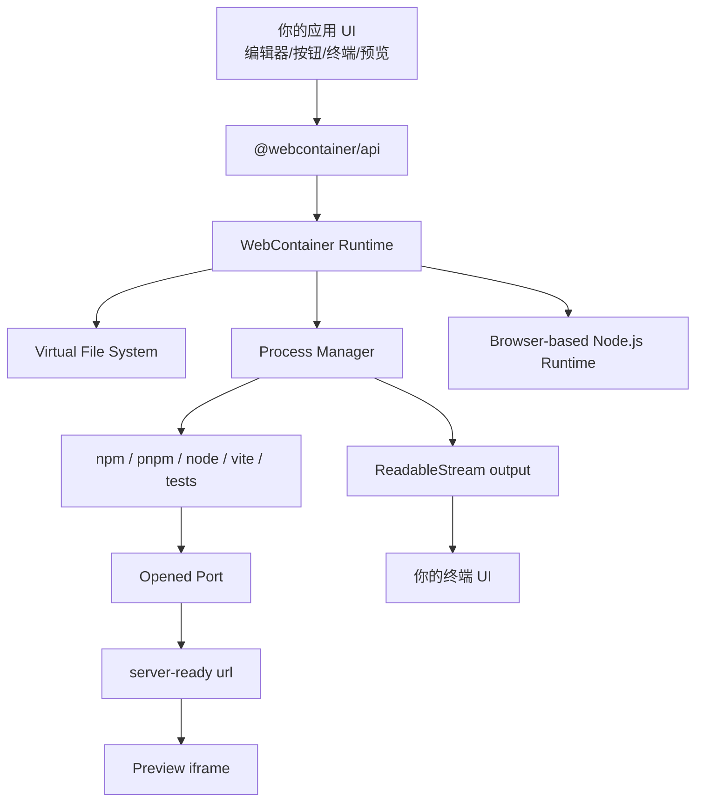

## WebContainer 学习指南

> 面向想在浏览器里运行 Node.js 项目、代码沙盒、在线 IDE、教程平台或 AI 代码执行环境的前端开发者。本文按最新官方 WebContainers 文档整理，重点讲架构、核心概念、API、代码示例、常见限制和产品化实践。

更新时间：2026-05-19  
主要参考：WebContainers 官方文档、API Reference、Quickstart、File System、Running Processes、Configuring Headers、Browser Support、API Versioning。

## 0. WebContainer 是什么

WebContainer 是 StackBlitz 提供的浏览器内 Node.js 运行时。它可以在浏览器标签页中执行 Node.js 应用和操作系统命令，不需要你给每个用户启动一台云端 VM 或 Docker 容器。

你可以把它理解为：

```txt
WebContainer = 浏览器里的轻量 Node.js 运行环境 + 虚拟文件系统 + 进程 API + 端口预览代理
```

它适合做：

- 在线代码编辑器。
- 交互式文档和教程。
- 框架 Playground，例如 Vue、React、Svelte、Nuxt、Vite。
- 面试题/练习题运行环境。
- AI 生成代码后的即时预览环境。
- 员工 onboarding 或教学平台。
- 浏览器端 npm 项目执行和调试。

它不适合直接做：

- 真实生产服务器。
- 需要访问用户本地磁盘的桌面级 IDE。
- 需要原生二进制、Docker、数据库守护进程的完整后端环境。
- 需要在后端隐藏密钥的任务。

## 1. 核心心智模型

传统在线 IDE：

```txt
浏览器编辑代码 -> 后端 VM/Docker 写文件 -> 后端执行 npm install/start -> 通过公网 URL 预览
```

WebContainer：

```txt
浏览器编辑代码 -> 浏览器内虚拟文件系统 -> 浏览器内执行 npm install/start -> iframe 预览
```

核心差异：

- 执行发生在用户浏览器内。
- 文件系统在浏览器运行时中。
- Node.js 进程也是浏览器内模拟/实现的。
- 预览服务通过 WebContainer 提供的 URL 暴露给 iframe。
- 安全边界主要依赖浏览器沙箱、cross-origin isolation 和 StackBlitz 的 WebContainer runtime。

## 2. 架构图



你的应用通常需要管理 4 块 UI：

- 文件树和代码编辑器。
- 运行按钮/任务状态。
- 终端输出。
- iframe 预览。

WebContainer 提供底层能力，你自己决定产品形态。

## 3. 安装

```bash
npm install @webcontainer/api
```

官方文档建议直接安装 `@webcontainer/api`。如果你要做更复杂的首屏加速，也可能用到：

```bash
npm install @webcontainer/snapshot
```

`@webcontainer/snapshot` 用于生成可被 `mount()` 直接加载的二进制 snapshot，适合大型模板项目加速初始化。

## 4. 最小运行示例

### 4.1 准备文件树

WebContainer 的文件系统通过 `FileSystemTree` 描述。

```ts
import type { FileSystemTree } from "@webcontainer/api";

export const files: FileSystemTree = {
  "package.json": {
    file: {
      contents: JSON.stringify(
        {
          scripts: {
            start: "vite --host 0.0.0.0",
          },
          dependencies: {
            "@vitejs/plugin-react": "latest",
            vite: "latest",
            react: "latest",
            "react-dom": "latest",
          },
          devDependencies: {},
        },
        null,
        2
      ),
    },
  },
  "index.html": {
    file: {
      contents: `<div id="root"></div><script type="module" src="/src/main.jsx"></script>`,
    },
  },
  src: {
    directory: {
      "main.jsx": {
        file: {
          contents: `
				import React from "react";
				import { createRoot } from "react-dom/client";
				
				function App() {
				  return <h1>Hello WebContainer</h1>;
				}
				
				createRoot(document.getElementById("root")).render(<App />);
			`,
        },
      },
    },
  },
};
```

### 4.2 启动 WebContainer

```ts
import { WebContainer } from "@webcontainer/api";
import { files } from "./files";

const webcontainer = await WebContainer.boot();

await webcontainer.mount(files);
```

注意：官方 API 明确说明，同一时间只能 boot 一个 WebContainer 实例。`boot()` 是昂贵操作，不要在 React render 中反复调用。

### 4.3 安装依赖并启动 dev server

```ts
async function installDependencies(webcontainer: WebContainer) {
  const installProcess = await webcontainer.spawn("npm", ["install"]);

  installProcess.output.pipeTo(
    new WritableStream({
      write(chunk) {
        console.log(chunk);
      },
    })
  );

  const exitCode = await installProcess.exit;

  if (exitCode !== 0) {
    throw new Error("npm install failed");
  }
}

async function startDevServer(webcontainer: WebContainer, iframe: HTMLIFrameElement) {
  await webcontainer.spawn("npm", ["run", "start"]);

  webcontainer.on("server-ready", (port, url) => {
    iframe.src = url;
  });
}

await installDependencies(webcontainer);
await startDevServer(webcontainer, document.querySelector("iframe")!);
```

完整流程：

```txt
boot -> mount files -> npm install -> npm run start -> server-ready -> iframe.src = url
```

## 5. 必须配置的 COOP/COEP Headers

WebContainer 依赖 `SharedArrayBuffer`，而 `SharedArrayBuffer` 要求页面 cross-origin isolated。因此页面必须带这些响应头：

```yaml
Cross-Origin-Embedder-Policy: require-corp
Cross-Origin-Opener-Policy: same-origin
```

如果使用 `credentialless` 模式：

```yaml
Cross-Origin-Embedder-Policy: credentialless
Cross-Origin-Opener-Policy: same-origin
```

同时 boot 时要写：

```ts
const webcontainer = await WebContainer.boot({
  coep: "credentialless",
});
```

### 5.1 Next.js 配置

`next.config.js`

```js
module.exports = {
  async headers() {
    return [
      {
        source: "/(.*)",
        headers: [
          {
            key: "Cross-Origin-Embedder-Policy",
            value: "require-corp",
          },
          {
            key: "Cross-Origin-Opener-Policy",
            value: "same-origin",
          },
        ],
      },
    ];
  },
};
```

如果只给某个页面启用：

```js
module.exports = {
  async headers() {
    return [
      {
        source: "/playground",
        headers: [
          {
            key: "Cross-Origin-Embedder-Policy",
            value: "require-corp",
          },
          {
            key: "Cross-Origin-Opener-Policy",
            value: "same-origin",
          },
        ],
      },
    ];
  },
};
```

### 5.2 Vercel 配置

`vercel.json`

```json
{
  "headers": [
    {
      "source": "/(.*)",
      "headers": [
        {
          "key": "Cross-Origin-Embedder-Policy",
          "value": "require-corp"
        },
        {
          "key": "Cross-Origin-Opener-Policy",
          "value": "same-origin"
        }
      ]
    }
  ]
}
```

### 5.3 本地开发也需要

官方文档强调：即使开发环境也需要这些 header。`localhost` 对 HTTPS 有特殊宽容，但不会替你解决 cross-origin isolation。

你可以检查：

```ts
console.log(window.crossOriginIsolated);
```

如果是 `false`，WebContainer 很可能无法正常 boot。

## 6. WebContainer.boot()

`boot()` 是 WebContainer 的入口。

```ts
const webcontainer = await WebContainer.boot({
  coep: "require-corp",
  workdirName: "my-project",
  forwardPreviewErrors: "exceptions-only",
});
```

类型：

```ts
interface BootOptions {
  coep?: "require-corp" | "credentialless" | "none";
  workdirName?: string;
  forwardPreviewErrors?: boolean | "exceptions-only";
}
```

字段解释：

| 字段 | 说明 |
| --- | --- |
| `coep` | WebContainer 页面使用的 COEP 模式 |
| `workdirName` | 工作目录名称，主要是展示层面的配置 |
| `forwardPreviewErrors` | 是否把 iframe 预览中的错误转发到父页面 |

重要规则：

- 同时只能 boot 一个 WebContainer。
- `boot()` 很重，应缓存实例。
- `coep` 第一次 boot 后固定，后续 reboot 不能切换。
- 如果要释放资源，调用 `teardown()`。

一个单例封装：

```ts
import { WebContainer } from "@webcontainer/api";

let instance: WebContainer | null = null;

export async function getWebContainer() {
  if (instance) {
    return instance;
  }
  
// 这会有点问题
// 如果两个组件几乎同时调用时，instance此时还在等待，instance还是为null
// 这样就会初始化两个instance

  instance = await WebContainer.boot({
    coep: "require-corp",
    forwardPreviewErrors: "exceptions-only",
  });

  return instance;
}
```

第二版：

bootPromise 确保即使并发调用，也只执行一次 WebContainer.boot()

``` ts
// 存储已创建的 WebContainer 实例
let webcontainerInstance: WebContainer | null = null;
// 存储正在进行的 boot 操作，避免重复 boot
let bootPromise: Promise<WebContainer> | null = null;
const getWebContainer = async (): Promise<WebContainer> => {
  if (webcontainerInstance) {
    return webcontainerInstance;
  }
  if (!bootPromise) {
    bootPromise = WebContainer.boot({ coep: "credentialless" });
  }
  
  // 在此处会等待promise执行
  webcontainerInstance = await bootPromise;
  return webcontainerInstance;
};
```

React 组件中不要这样写：

```tsx
function Playground() {
  const wc = await WebContainer.boot(); // 错误：组件不能这样 await，也会反复 boot
}
```

推荐：

```tsx
"use client";

import { useEffect, useState } from "react";
import type { WebContainer } from "@webcontainer/api";
import { getWebContainer } from "@/lib/webcontainer";

export function Playground() {
  const [webcontainer, setWebcontainer] = useState<WebContainer | null>(null);

  useEffect(() => {
    let cancelled = false;

    getWebContainer().then((instance) => {
      if (!cancelled) {
        setWebcontainer(instance);
      }
    });

    return () => {
      cancelled = true;
    };
  }, []);

  return <div>{webcontainer ? "Ready" : "Booting..."}</div>;
}
```

## 7. 文件系统：mount 与 fs

WebContainer 的文件系统 API 模仿 Node 的 `fs.promises`。

### 7.1 FileSystemTree 格式

```ts
const tree = {
  "package.json": {
    file: {
      contents: '{"scripts":{"start":"vite --host 0.0.0.0"}}',
    },
  },
  src: {
    directory: {
      "main.js": {
        file: {
          contents: 'console.log("hello")',
        },
      },
    },
  },
  "linked.js": {
    file: {
      symlink: "./src/main.js",
    },
  },
};
```

节点类型：

| 类型  | 写法                              |
| --- | ------------------------------- |
| 文件  | `{ file: { contents: string`    |
| 目录  | `{ directory: FileSystemTree }` |
| 软链接 | `{ file: { symlink: string } }` |

### 7.2 mount

```ts
await webcontainer.mount(files);
```

挂载到子目录：

```ts
await webcontainer.mount(files, {
  mountPoint: "/workspace",
});
```

官方建议：初始化大量文件时优先使用 `mount()`，比逐个 `writeFile()` 更适合首屏加载。

### 7.3 readFile

```ts
const bytes = await webcontainer.fs.readFile("/package.json");
const text = await webcontainer.fs.readFile("/package.json", "utf-8");
```

如果不传 encoding，返回 `Uint8Array`；传 `"utf-8"` 返回字符串。

### 7.4 writeFile

```ts
await webcontainer.fs.writeFile(
  "/src/main.js",
  'console.log("Hello from WebContainer")'
);
```

如果文件不存在会创建；如果存在会覆盖。

### 7.5 mkdir

```ts
await webcontainer.fs.mkdir("/src/components", {
  recursive: true,
});
```

### 7.6 readdir

```ts
const names = await webcontainer.fs.readdir("/src", {
  encoding: "utf-8",
});
```

带文件类型：

```ts
const entries = await webcontainer.fs.readdir("/src", {
  encoding: "utf-8",
  withFileTypes: true,
});

for (const entry of entries) {
  console.log(entry.name, entry.isFile(), entry.isDirectory());
}
```

### 7.7 rename

```ts
await webcontainer.fs.rename("/src/index.js", "/src/main.js");
```

注意：目标路径的父目录必须已经存在。

### 7.8 rm

删除文件：

```ts
await webcontainer.fs.rm("/src/main.js");
```

递归删除目录：

```ts
await webcontainer.fs.rm("/src", {
  recursive: true,
  force: true,
});
```

### 7.9 watch

监听文件：

```ts
const watcher = webcontainer.fs.watch("/src/main.js", (event, filename) => {
  console.log(event, filename);
});

watcher.close();
```

监听目录：

```ts
const watcher = webcontainer.fs.watch(
  "/src",
  { recursive: true },
  (event, filename) => {
    console.log("changed", event, filename);
  }
);
```

### 7.10 编辑器同步到 WebContainer

一个典型编辑器保存逻辑：

```ts
async function saveFile(path: string, code: string) {
  await webcontainer.fs.writeFile(path, code);
}
```

配合 Monaco Editor：

```ts
editor.onDidChangeModelContent(async () => {
  const code = editor.getValue();
  await webcontainer.fs.writeFile(activeFilePath, code);
});
```

实际产品里建议加 debounce：

```ts
let timer: ReturnType<typeof setTimeout> | null = null;

function scheduleSave(path: string, code: string) {
  if (timer) {
    clearTimeout(timer);
  }

  timer = setTimeout(() => {
    webcontainer.fs.writeFile(path, code);
  }, 300);
}
```

## 8. 进程：spawn 与 WebContainerProcess

WebContainer 通过 `spawn()` 执行命令。

```ts
const process = await webcontainer.spawn("npm", ["install"]);
```

命令参数要拆成数组：

```ts
await webcontainer.spawn("ls", ["src", "-l"]);
```

不要写成：

```ts
await webcontainer.spawn("ls src -l"); // 不推荐
```

### 8.1 SpawnOptions

```ts
const process = await webcontainer.spawn("npm", ["run", "start"], {
  cwd: "/workspace",
  env: {
    NODE_ENV: "development",
  },
  terminal: {
    cols: 80,
    rows: 24,
  },
});
```

类型：

```ts
interface SpawnOptions {
  cwd?: string;
  env?: Record<string, string | number | boolean>;
  output?: boolean;
  terminal?: { cols: number; rows: number };
}
```

| 选项 | 说明 |
| --- | --- |
| `cwd` | 当前工作目录，相对 WebContainer workdir |
| `env` | 环境变量 |
| `output` | 设为 `false` 时不产生终端输出 |
| `terminal` | 伪终端尺寸 |

### 8.2 读取输出

`spawn()` 返回 `WebContainerProcess`，它的 `output` 是 `ReadableStream<string>`。

```ts
const install = await webcontainer.spawn("npm", ["install"]);

install.output.pipeTo(
  new WritableStream({
    write(data) {
      terminal.write(data);
    },
  })
);
```

如果只关心退出码：

```ts
const process = await webcontainer.spawn("npm", ["test"], {
  output: false,
});

const exitCode = await process.exit;
```

### 8.3 ReadableStream、WritableStream 和 pipeTo

WebContainer 的进程输出使用的是 Web Streams API。你在很多示例里看到的这段代码，本质上就是“把一个可读流接到一个可写流”：

```ts
process.output.pipeTo(
  new WritableStream({
    write(chunk) {
      terminal.write(chunk);
    },
  })
);
```

拆开理解：

| 名称 | 作用 | WebContainer 中的例子 |
| --- | --- | --- |
| `ReadableStream` | 数据源，可以不断读出数据 | `process.output` |
| `WritableStream` | 数据目标，可以不断写入数据 | 你创建的终端输出流 |
| `pipeTo()` | 把 readable 自动接到 writable | `process.output.pipeTo(writable)` |
| `chunk` | 每次流过来的一小段数据 | 终端输出字符串 |

#### 8.3.1 ReadableStream：数据从这里来

`process.output` 是 `ReadableStream<string>`，表示命令运行时持续产生的 stdout/stderr 文本。

```ts
const install = await webcontainer.spawn("npm", ["install"]);

console.log(install.output); // ReadableStream<string>
```

它不是一次性字符串，所以不能这样写：

```ts
const output = await install.output; // 错误理解
```

因为终端输出是持续产生的：

```txt
npm install 开始
输出第 1 行
输出第 2 行
...
进程退出
```

#### 8.3.2 WritableStream：数据写到这里

`WritableStream` 定义“收到 chunk 后怎么处理”。

```ts
const terminalStream = new WritableStream<string>({
  write(chunk) {
    terminal.write(chunk);
  },
});
```

你也可以写到 React state：

```ts
const logStream = new WritableStream<string>({
  write(chunk) {
    setLogs((current) => current + chunk);
  },
});
```

或者收集成一个字符串：

```ts
let output = "";

const collectStream = new WritableStream<string>({
  write(chunk) {
    output += chunk;
  },
});
```

#### 8.3.3 pipeTo：自动搬运数据

`pipeTo()` 会不断从 `ReadableStream` 读取数据，并写入 `WritableStream`。

```ts
await install.output.pipeTo(
  new WritableStream({
    write(chunk) {
      console.log(chunk);
    },
  })
);
```

注意：`pipeTo()` 返回一个 Promise。这个 Promise 会在流结束时 resolve，如果流中途出错会 reject。

如果你不想阻塞当前流程，可以不 `await`，但最好处理错误：

```ts
install.output
  .pipeTo(
    new WritableStream({
      write(chunk) {
        terminal.write(chunk);
      },
    })
  )
  .catch((error) => {
    console.error("Failed to pipe process output", error);
  });
```

然后单独等待进程退出：

```ts
const exitCode = await install.exit;
```

WebContainer 示例里经常这样分开写：

```ts
const install = await webcontainer.spawn("npm", ["install"]);

install.output.pipeTo(
  new WritableStream({
    write(chunk) {
      terminal.write(chunk);
    },
  })
);

const exitCode = await install.exit;
```

这里的含义是：

- 输出流持续写到终端。
- 主逻辑等待进程退出码。
- 退出码决定安装是否成功。

#### 8.3.4 背压：为什么 pipeTo 比手动循环舒服

Streams API 内置背压机制。简单说：如果写入端处理太慢，读取端会自动放慢，不会无脑把数据全部塞进内存。

这对终端输出很有价值：

- `npm install` 可能瞬间输出很多日志。
- UI 渲染可能跟不上日志产生速度。
- `pipeTo()` 可以协调读写速度。

你平时不需要手写背压逻辑，直接使用 `pipeTo()` 就好。

#### 8.3.5 手动读取：getReader()

如果你想自己控制读取过程，可以用 reader。

```ts
const reader = install.output.getReader();

try {
  while (true) {
    const { done, value } = await reader.read();

    if (done) {
      break;
    }

    terminal.write(value);
  }
} finally {
  reader.releaseLock();
}
```

适合：

- 需要逐行解析日志。
- 需要遇到特定输出后触发动作。
- 需要中途停止读取。

例如检测 Vite ready：

```ts
let buffer = "";
const reader = devServer.output.getReader();

while (true) {
  const { done, value } = await reader.read();

  if (done) {
    break;
  }

  buffer += value;
  terminal.write(value);

  if (buffer.includes("Local:")) {
    console.log("Vite printed local url");
  }
}
```

多数预览场景不需要这么做，因为 WebContainer 已经提供了 `server-ready` 事件。

#### 8.3.6 手动写入：getWriter()

`process.input` 是 `WritableStream<string>`。如果你要给 shell 写命令，就需要 writer。

```ts
const shell = await webcontainer.spawn("jsh", {
  terminal: {
    cols: 80,
    rows: 24,
  },
});

const writer = shell.input.getWriter();

await writer.write("npm install\n");
await writer.write("npm run dev\n");

writer.releaseLock();
```

`getWriter()` 会锁定这个 writable stream。锁定期间，其他地方不能再拿 writer。写完后如果还要给别的代码使用，记得 `releaseLock()`。

#### 8.3.7 常见错误

错误一：重复消费同一个 output。

```ts
process.output.pipeTo(streamA);
process.output.pipeTo(streamB); // 可能失败，因为 readable 已经被锁定
```

如果要一份输出给多个地方，自己在一个 `write()` 里分发：

```ts
process.output.pipeTo(
  new WritableStream({
    write(chunk) {
      terminal.write(chunk);
      setLogs((current) => current + chunk);
    },
  })
);
```

错误二：把 output 当普通字符串。

```ts
const text = String(process.output); // 没有意义
```

正确方式是 pipe 或 reader。

错误三：忘记处理 pipeTo 错误。

```ts
process.output.pipeTo(stream); // 如果中途错误，可能出现未处理 Promise rejection
```

更稳妥：

```ts
process.output.pipeTo(stream).catch(console.error);
```

#### 8.3.8 在 React 里使用时的性能提醒

如果每个 chunk 都 `setState`，日志很多时可能导致频繁渲染。

简单优化：批量刷新。

```ts
let pending = "";
let scheduled = false;

const stream = new WritableStream<string>({
  write(chunk) {
    pending += chunk;

    if (scheduled) {
      return;
    }

    scheduled = true;

    requestAnimationFrame(() => {
      setLogs((current) => current + pending);
      pending = "";
      scheduled = false;
    });
  },
});

process.output.pipeTo(stream).catch(console.error);
```

真实终端 UI 推荐使用 xterm.js，它比把所有日志塞进 React state 更适合大量输出。

### 8.4 等待退出码

`WebContainerProcess`的`exit`属性是一个Promise，用于监听进程的结束状态。

进程运行完毕、正常退出或被异常终止时，这个 Promise 就会 resolve，并返回一个数字类型的 **状态码**

- `0`：代表进程执行成功，顺利结束。
    
- `非 0`（如 `1`）：代表进程执行出错，或被中途强行停止。

```ts
const testProcess = await webcontainer.spawn("npm", ["test"]);
const exitCode = await testProcess.exit;

if (exitCode === 0) {
  console.log("tests passed");
} else {
  console.log("tests failed");
}
```

### 8.5 输入 stdin

`process.input` 是 `WritableStream<string>`，适合做交互式终端。

```ts
const shell = await webcontainer.spawn("jsh", {
  terminal: {
    cols: 80,
    rows: 24,
  },
});

const writer = shell.input.getWriter();
await writer.write("npm install\n");
await writer.write("npm run start\n");
```

### 8.6 调整终端尺寸

```ts
shell.resize({
  cols: 120,
  rows: 30,
});
```

### 8.7 杀死进程

```ts
const devServer = await webcontainer.spawn("npm", ["run", "start"]);

function stopServer() {
  devServer.kill();
}
```

实际应用中建议记录正在运行的进程，重新运行前先停止旧进程。

```ts
let currentDevServer: WebContainerProcess | null = null;

async function restartDevServer() {
  currentDevServer?.kill();
  currentDevServer = await webcontainer.spawn("npm", ["run", "start"]);
}
```

## 9. 预览：server-ready、port、iframe

当 WebContainer 内部应用监听端口时，会触发事件。

### 9.1 server-ready

```ts
webcontainer.on("server-ready", (port, url) => {
  console.log("server ready", port, url);
  iframe.src = url;
});
```

`url` 是可放入 iframe 的预览地址。不要自己拼 `localhost:port`，使用 WebContainer 提供的 URL。

### 9.2 port

```ts
webcontainer.on("port", (port, type, url) => {
  console.log(port, type, url);
});
```

`type` 是 `"open"` 或 `"close"`。

这个事件适合做：

- 端口列表。
- 多服务预览选择。
- 判断 dev server 是否关闭。

### 9.3 reloadPreview

```ts
import { reloadPreview } from "@webcontainer/api";

await reloadPreview(iframeElement);
```

`reloadPreview()` 会先尝试给 iframe 发消息刷新，失败后再回退到重置 `src`。

## 10. 预览错误转发

如果 boot 时开启：

```ts
const webcontainer = await WebContainer.boot({
  forwardPreviewErrors: true,
});
```

或者只转发异常，不转发 `console.error`：

```ts
const webcontainer = await WebContainer.boot({
  forwardPreviewErrors: "exceptions-only",
});
```

就可以监听：

```ts
webcontainer.on("preview-message", (message) => {
  console.log("preview error", message);
});
```

常见 message 类型：

- uncaught exception
- unhandled rejection
- console.error

这对在线 IDE 很有用：可以把 iframe 里的运行时错误显示在你的外层 UI 中。

## 11. export：导出文件系统

官方 API 从 `1.4.0` 起支持 `export()`。

导出 JSON tree：

```ts
const tree = await webcontainer.export("/", {
  format: "json",
  excludes: ["node_modules"],
});
```

导出 zip：

```ts
const data = await webcontainer.export("/", {
  format: "zip",
  excludes: ["node_modules"],
});

const blob = new Blob([data], {
  type: "application/zip",
});

const url = URL.createObjectURL(blob);
const a = document.createElement("a");
a.href = url;
a.download = "project.zip";
a.click();
URL.revokeObjectURL(url);
```

导出指定目录：

```ts
const distZip = await webcontainer.export("/dist", {
  format: "zip",
});
```

`ExportOptions`：

```ts
interface ExportOptions {
  format?: "json" | "binary" | "zip";
  includes?: string[];
  excludes?: string[];
}
```

## 12. teardown：释放实例

```ts
webcontainer.teardown();
```

作用：

- 销毁 WebContainer 实例。
- 释放资源。
- 所有由该实例派生的进程、文件系统对象等都会失效。
- 之后可以重新 `WebContainer.boot()`。

适合：

- 用户退出 Playground。
- 切换完全不同的项目。
- 释放长时间占用的内存。

注意：普通页面内切文件通常不需要 teardown，直接改文件系统和重启进程即可。

## 13. setPreviewScript：给预览注入脚本

官方 API 从 `1.5.0` 起支持。

```ts
await webcontainer.setPreviewScript(`
  console.log("Injected into preview");
`);
```

也可以传配置：

```ts
await webcontainer.setPreviewScript(
  `
    window.__PLAYGROUND__ = true;
  `,
  {
    type: "module",
    defer: true,
  }
);
```

官方把它标为高级能力，并提醒只有在没有更好选择时使用。因为你通常能控制 WebContainer 内运行的服务，更好的做法是在应用本身注入调试脚本。

适合：

- 采集 preview 错误或日志。
- 对用户代码进行可视化调试。
- 给教程页面注入检测脚本。

不适合：

- 大量业务逻辑。
- 替代项目自身代码。
- 破坏 preview 页面的隔离。

## 14. configureAPIKey：商业使用

```ts
import { configureAPIKey, WebContainer } from "@webcontainer/api";

configureAPIKey("your-api-key");

const webcontainer = await WebContainer.boot();
```

规则：

- 必须在 `WebContainer.boot()` 之前调用。
- 用于商业使用的 API key 配置。
- 具体授权和额度以 StackBlitz/WebContainers 商业条款为准。

## 15. auth：安装私有包

WebContainer API 提供 `auth` namespace，可通过 StackBlitz 认证用户。用户需要：

- 已登录 StackBlitz。
- 属于你生成 `clientId` 的组织。
- 授权你的网站。

典型流程：

```ts
import { auth, WebContainer } from "@webcontainer/api";

const authResult = auth.init({
  clientId: "your-client-id",
  scope: "your-scope",
});

if (authResult.status === "need-auth") {
  auth.startAuthFlow({ popup: true });
  await auth.loggedIn();
}

const webcontainer = await WebContainer.boot();
await webcontainer.spawn("npm", ["install"]);
```

登出：

```ts
await auth.logout();
```

监听认证事件：

```ts
auth.on("logged-out", () => {
  console.log("user logged out");
});

auth.on("auth-failed", (reason) => {
  console.error(reason.error, reason.description);
});
```

注意：`auth.init()` 也必须在 `WebContainer.boot()` 之前调用。

## 16. 在 React/Next.js 中封装 WebContainer

### 16.1 推荐目录

```txt
src/
  app/
    playground/
      page.tsx
  components/
    Playground.tsx
    Terminal.tsx
    Preview.tsx
    FileEditor.tsx
  lib/
    webcontainer.ts
    project-files.ts
```

### 16.2 单例工具

`src/lib/webcontainer.ts`

```ts
import { WebContainer } from "@webcontainer/api";

let bootPromise: Promise<WebContainer> | null = null;

export function bootWebContainer() {
  if (!bootPromise) {
    bootPromise = WebContainer.boot({
      coep: "require-corp",
      forwardPreviewErrors: "exceptions-only",
    });
  }

  return bootPromise;
}
```

这里用 `bootPromise` 而不是 `instance`，可以避免两个组件同时调用时触发两次 boot。

### 16.3 Playground 组件

```tsx
"use client";

import { useEffect, useRef, useState } from "react";
import type { WebContainer, WebContainerProcess } from "@webcontainer/api";
import { bootWebContainer } from "@/lib/webcontainer";
import { files } from "@/lib/project-files";

export function Playground() {
  const iframeRef = useRef<HTMLIFrameElement | null>(null);
  const devServerRef = useRef<WebContainerProcess | null>(null);
  const [webcontainer, setWebcontainer] = useState<WebContainer | null>(null);
  const [logs, setLogs] = useState("");
  const [status, setStatus] = useState("Booting");

  useEffect(() => {
    let cancelled = false;

    async function start() {
      const wc = await bootWebContainer();

      if (cancelled) {
        return;
      }

      setWebcontainer(wc);
      setStatus("Mounting files");
      await wc.mount(files);

      wc.on("server-ready", (_port, url) => {
        if (iframeRef.current) {
          iframeRef.current.src = url;
        }
      });

      wc.on("preview-message", (message) => {
        setLogs((current) => current + `\n[preview] ${message.message ?? message.type}`);
      });

      setStatus("Installing dependencies");
      const install = await wc.spawn("npm", ["install"]);

      install.output.pipeTo(
        new WritableStream({
          write(chunk) {
            setLogs((current) => current + chunk);
          },
        })
      );

      const installCode = await install.exit;

      if (installCode !== 0) {
        setStatus("Install failed");
        return;
      }

      setStatus("Starting dev server");
      devServerRef.current = await wc.spawn("npm", ["run", "start"]);

      devServerRef.current.output.pipeTo(
        new WritableStream({
          write(chunk) {
            setLogs((current) => current + chunk);
          },
        })
      );

      setStatus("Ready");
    }

    start();

    return () => {
      cancelled = true;
      devServerRef.current?.kill();
    };
  }, []);

  async function updateMainFile(code: string) {
    if (!webcontainer) {
      return;
    }

    await webcontainer.fs.writeFile("/src/main.jsx", code);
  }

  return (
    <div style={{ display: "grid", gridTemplateColumns: "1fr 1fr", gap: 16 }}>
      <section>
        <p>{status}</p>
        <textarea
          style={{ width: "100%", height: 300 }}
          onChange={(event) => updateMainFile(event.target.value)}
          defaultValue={`console.log("edit me")`}
        />
        <pre>{logs}</pre>
      </section>

      <iframe ref={iframeRef} style={{ width: "100%", height: 500 }} />
    </div>
  );
}
```

这只是教学示例。真实项目建议：

- 用 Monaco/CodeMirror 替代 textarea。
- 用 xterm.js 渲染终端。
- 保存时 debounce。
- 安装依赖和启动服务拆成显式状态机。
- 监听 `port` 来展示多服务。
- 错误状态可重试。

## 17. 实战：在线 Vite Playground

### 17.1 文件模板

```ts
import type { FileSystemTree } from "@webcontainer/api";

export const viteReactFiles: FileSystemTree = {
  "package.json": {
    file: {
      contents: JSON.stringify(
        {
          scripts: {
            dev: "vite --host 0.0.0.0",
            build: "vite build",
          },
          dependencies: {
            "@vitejs/plugin-react": "latest",
            vite: "latest",
            react: "latest",
            "react-dom": "latest",
          },
          devDependencies: {},
        },
        null,
        2
      ),
    },
  },
  "index.html": {
    file: {
      contents: `<div id="root"></div><script type="module" src="/src/App.jsx"></script>`,
    },
  },
  src: {
    directory: {
      "App.jsx": {
        file: {
          contents: `
				import React from "react";
				import { createRoot } from "react-dom/client";
				import "./style.css";
				
				function App() {
				  return (
				    <main>
				      <h1>Vite + WebContainer</h1>
				      <button onClick={() => alert("It works")}>Click</button>
				    </main>
				  );
				}
				
				createRoot(document.getElementById("root")).render(<App />);
			`,
        },
      },
      "style.css": {
        file: {
          contents: `
				body {
				  margin: 0;
				  font-family: system-ui, sans-serif;
				}
				
				main {
				  padding: 32px;
				}
			`,
        },
      },
    },
  },
};
```

### 17.2 运行器

```ts
import type { WebContainer, WebContainerProcess } from "@webcontainer/api";

export class WebContainerRunner {
  private installProcess: WebContainerProcess | null = null;
  private devProcess: WebContainerProcess | null = null;

  constructor(private webcontainer: WebContainer) {}

  async mount(files: Parameters<WebContainer["mount"]>[0]) {
    await this.webcontainer.mount(files);
  }

  async install(onOutput: (chunk: string) => void) {
    this.installProcess?.kill();
    this.installProcess = await this.webcontainer.spawn("npm", ["install"]);

    this.installProcess.output.pipeTo(
      new WritableStream({
        write: onOutput,
      })
    );

    const code = await this.installProcess.exit;

    if (code !== 0) {
      throw new Error(`Install failed with exit code ${code}`);
    }
  }

  async start(onOutput: (chunk: string) => void) {
    this.devProcess?.kill();
    this.devProcess = await this.webcontainer.spawn("npm", ["run", "dev"]);

    this.devProcess.output.pipeTo(
      new WritableStream({
        write: onOutput,
      })
    );
  }

  async writeFile(path: string, contents: string) {
    await this.webcontainer.fs.writeFile(path, contents);
  }

  stop() {
    this.installProcess?.kill();
    this.devProcess?.kill();
  }
}
```

### 17.3 预览连接

```ts
webcontainer.on("server-ready", (port, url) => {
  if (port === 5173) {
    iframe.src = url;
  }
});
```

不要依赖 Vite 一定是 5173，实际项目中可以展示所有打开端口。

```ts
const ports = new Map<number, string>();

webcontainer.on("port", (port, type, url) => {
  if (type === "open") {
    ports.set(port, url);
  } else {
    ports.delete(port);
  }
});
```

## 18. AI 代码执行场景

WebContainer 很适合和 AI 代码生成结合。

典型架构：


### 18.1 AI 返回文件树

让 AI 返回结构化数据，而不是一大段混合 Markdown。

```ts
type GeneratedFile = {
  path: string;
  contents: string;
};

type GeneratedProject = {
  files: GeneratedFile[];
  startCommand: string;
};
```

转换成 `FileSystemTree`：

```ts
function filesToTree(files: GeneratedFile[]): FileSystemTree {
  const root: FileSystemTree = {};

  for (const file of files) {
    const parts = file.path.split("/").filter(Boolean);
    let current = root;

    for (const [index, part] of parts.entries()) {
      const isLast = index === parts.length - 1;

      if (isLast) {
        current[part] = {
          file: {
            contents: file.contents,
          },
        };
        continue;
      }

      const existing = current[part];

      if (!existing || !("directory" in existing)) {
        current[part] = {
          directory: {},
        };
      }

      current = (current[part] as { directory: FileSystemTree }).directory;
    }
  }

  return root;
}
```

### 18.2 安全校验

虽然 WebContainer 在浏览器沙箱里运行，但你仍然应该做限制：

- 限制可生成文件数量和总大小。
- 禁止生成海量依赖。
- 不把真实生产密钥放进 `env`。
- 不允许用户代码访问你的后端管理 API。
- 对预览 iframe 加合适 sandbox 策略。
- 对 AI 生成的 package scripts 做白名单或人工确认。

简单脚本检查：

```ts
function validatePackageJson(packageJsonText: string) {
  const pkg = JSON.parse(packageJsonText);

  const forbiddenScripts = ["postinstall", "preinstall", "prepare"];

  for (const script of forbiddenScripts) {
    if (pkg.scripts?.[script]) {
      throw new Error(`Forbidden package script: ${script}`);
    }
  }

  return pkg;
}
```

## 19. 性能优化

### 19.1 使用 lockfile

官方 troubleshooting 提到：如果传入 `package-lock.json` 和 `package.json`，启动会更快。没有 lockfile 时，npm client 需要先生成 lockfile，再下载依赖。

建议模板项目包含：

```txt
package.json
package-lock.json
```

### 19.2 用 mount 批量写入

首屏初始化：

```ts
await webcontainer.mount(files);
```

不要：

```ts
for (const file of manyFiles) {
  await webcontainer.fs.writeFile(file.path, file.contents);
}
```

后者适合用户编辑时的少量增量写入。

### 19.3 snapshot

大型模板可以预构建 snapshot：

```ts
await webcontainer.mount(snapshotBuffer);
```

优点：

- 更快初始化。
- 适合静态模板。
- 可以减少大量 JS object 构建成本。

### 19.4 缓存 WebContainer 实例

不要路由切换就 boot 新实例。使用单例或 app-level provider。

### 19.5 控制依赖规模

WebContainer 运行在用户设备上。依赖越多：

- 安装越慢。
- 内存占用越大。
- 首次预览越慢。

Playground 模板尽量选轻量依赖。

## 20. 浏览器支持与限制

官方 Browser Support 页面当前说明：

- Chromium 系浏览器支持最好，例如 Chrome、Edge、Brave、Vivaldi。
- Firefox 有 alpha 支持，可能遇到限制。
- Safari 16.4 Technology Preview 起处于 beta 支持状态。
- WebContainer 依赖 SharedArrayBuffer 和 cross-origin isolation。
- 某些浏览器隐私设置或第三方 cookie 阻止可能影响运行。

实践建议：

- 产品入口检测 `crossOriginIsolated`。
- 首选提示用户使用 Chrome/Edge。
- 监听 `webcontainer.on("error")`。
- 给 Brave/隐私插件用户提供排查说明。

检测示例：

```ts
export function checkWebContainerSupport() {
  return {
    sharedArrayBuffer: typeof SharedArrayBuffer !== "undefined",
    crossOriginIsolated: window.crossOriginIsolated,
    userAgent: navigator.userAgent,
  };
}
```

## 21. 常见错误排查

### 21.1 boot 失败

优先检查：

```ts
console.log(window.crossOriginIsolated);
console.log(typeof SharedArrayBuffer);
```

常见原因：

- 没有配置 COOP/COEP。
- 页面不是 HTTPS。
- 浏览器不支持。
- 隐私插件或第三方 cookie 阻止。
- 多次并发调用 `WebContainer.boot()`。

### 21.2 server-ready 不触发

检查：

- dev server 是否真的启动成功。
- 是否使用 `--host 0.0.0.0`。
- 是否安装依赖成功。
- `package.json` scripts 是否正确。
- 终端输出中是否有报错。

Vite 建议：

```json
{
  "scripts": {
    "dev": "vite --host 0.0.0.0"
  }
}
```

### 21.3 npm install 很慢

优化：

- 加 `package-lock.json`。
- 减少依赖。
- 使用 snapshot。
- 缓存 WebContainer 实例。

### 21.4 iframe 白屏

检查：

- iframe `src` 是否使用 `server-ready` 提供的 `url`。
- preview 内是否有 JS 错误。
- 是否开启 `forwardPreviewErrors` 并监听 `preview-message`。
- 应用入口文件是否存在。

### 21.5 文件修改后预览不更新

检查：

- 是否写到了正确路径。
- dev server 是否仍在运行。
- 框架 HMR 是否正常。
- 对于非 HMR 场景，尝试 `reloadPreview(iframe)`。

## 22. 安全模型

WebContainer 的一个优势是用户代码在浏览器沙箱里运行，而不是你的服务器上运行。但这不意味着可以完全不设防。

### 22.1 你不能放真实服务端密钥

这类代码是危险的：

```ts
await webcontainer.spawn("npm", ["run", "dev"], {
  env: {
    OPENAI_API_KEY: process.env.OPENAI_API_KEY!,
  },
});
```

因为 WebContainer 在用户浏览器里运行，用户能观察到或间接访问这些值。

推荐：

- 只放公开 key。
- 通过你自己的后端 API 代理敏感操作。
- 对代理 API 做鉴权、限流和审计。

### 22.2 package scripts 风险

用户控制 `package.json` 时，`npm install` 可能触发 package lifecycle scripts。

建议：

- 教程模板使用可信依赖。
- AI 生成项目做脚本检查。
- 高风险环境不要自动安装任意依赖。
- 对生成代码做大小和依赖数量限制。

### 22.3 iframe 隔离

预览通常放 iframe。可以根据业务需求配置 sandbox：

```tsx
<iframe
  sandbox="allow-scripts allow-forms allow-modals allow-same-origin"
  ref={iframeRef}
/>
```

具体权限要按你的产品需要调整。权限越多，预览越像真实页面；权限越少，越安全但可能影响功能。

## 23. API 速查

### WebContainer.boot

```ts
const webcontainer = await WebContainer.boot({
  coep: "require-corp",
  workdirName: "project",
  forwardPreviewErrors: "exceptions-only",
});
```

### mount

```ts
await webcontainer.mount(files);
await webcontainer.mount(files, { mountPoint: "/workspace" });
```

### fs

```ts
await webcontainer.fs.writeFile("/src/main.js", "console.log(1)");
const text = await webcontainer.fs.readFile("/src/main.js", "utf-8");
await webcontainer.fs.mkdir("/src/components", { recursive: true });
const files = await webcontainer.fs.readdir("/src");
await webcontainer.fs.rename("/src/a.js", "/src/b.js");
await webcontainer.fs.rm("/src/b.js");
const watcher = webcontainer.fs.watch("/src", { recursive: true }, () => {});
watcher.close();
```

### spawn

```ts
const process = await webcontainer.spawn("npm", ["run", "dev"], {
  env: { NODE_ENV: "development" },
  terminal: { cols: 80, rows: 24 },
});

process.output.pipeTo(new WritableStream({ write: console.log }));
const exitCode = await process.exit;
process.kill();
```

### events

```ts
const unsubscribe = webcontainer.on("server-ready", (port, url) => {
  iframe.src = url;
});

webcontainer.on("port", (port, type, url) => {});
webcontainer.on("error", (error) => {});
webcontainer.on("preview-message", (message) => {});

unsubscribe();
```

### export

```ts
const zip = await webcontainer.export("/", {
  format: "zip",
  excludes: ["node_modules"],
});
```

### reloadPreview

```ts
import { reloadPreview } from "@webcontainer/api";

await reloadPreview(iframe);
```

### teardown

```ts
webcontainer.teardown();
```

### configureAPIKey

```ts
import { configureAPIKey } from "@webcontainer/api";

configureAPIKey("key");
```

### auth

```ts
import { auth } from "@webcontainer/api";

auth.init({ clientId: "...", scope: "..." });
auth.startAuthFlow({ popup: true });
await auth.loggedIn();
await auth.logout();
```

## 24. 学习路线

### 第 1 阶段：跑通最小闭环

目标：

- 安装 `@webcontainer/api`。
- 配置 COOP/COEP。
- `WebContainer.boot()`。
- `mount()` 一个最小 Vite 项目。
- `spawn("npm", ["install"])`。
- `spawn("npm", ["run", "dev"])`。
- 用 `server-ready` 把 URL 放进 iframe。

你要能解释：

- 为什么需要 cross-origin isolation？
- 为什么同一时间只能 boot 一个实例？
- `mount()` 和 `writeFile()` 的区别是什么？

### 第 2 阶段：文件系统和编辑器

目标：

- 用 `fs.readFile/writeFile/readdir/mkdir/rm/rename/watch`。
- 把 CodeMirror 或 Monaco 的内容同步到 WebContainer。
- 做文件树。
- 做保存 debounce。

你要能解释：

- `FileSystemTree` 的三种节点是什么？
- 为什么初始化文件用 `mount()` 更好？
- 为什么用户编辑适合 `writeFile()`？

### 第 3 阶段：进程和终端

目标：

- 用 `spawn()` 执行 npm script。
- 把 `process.output` 渲染到终端。
- 等待 `process.exit`。
- 用 `process.input` 做交互式 shell。
- 用 `kill()` 和 `resize()` 管理进程。

你要能解释：

- `spawn("ls", ["src", "-l"])` 为什么要拆参数？
- `ReadableStream` 输出如何接到 UI？
- 重启 dev server 时为什么要 kill 旧进程？

### 第 4 阶段：预览和错误处理

目标：

- 监听 `server-ready` 和 `port`。
- 多端口预览。
- 使用 `reloadPreview()`。
- 开启 `forwardPreviewErrors`。
- 把 preview runtime error 显示到外层 UI。

你要能解释：

- 为什么预览 URL 不要自己拼？
- iframe 白屏如何排查？
- `preview-message` 可以捕获哪些错误？

### 第 5 阶段：产品化

目标：

- 导出 zip。
- 大模板使用 lockfile 或 snapshot。
- 做浏览器支持检测。
- 对 AI 生成代码做安全校验。
- 区分教学 demo、内部工具和商业产品的授权模式。

你要能解释：

- 为什么不能把服务端密钥传入 WebContainer？
- lockfile 为什么能提升安装速度？
- 商业使用为什么要关注 `configureAPIKey()` 和授权条款？

## 25. 最佳实践清单

- 只 boot 一次 WebContainer，用单例或 provider 缓存。
- 页面必须配置 COOP/COEP，并检查 `window.crossOriginIsolated`。
- 生产环境必须 HTTPS。
- 初始化大量文件用 `mount()`。
- 用户单文件编辑用 `fs.writeFile()`，并 debounce。
- dev server 命令建议使用 `--host 0.0.0.0`。
- 预览 URL 使用 `server-ready` 提供的 URL。
- 终端输出用 `process.output` 的 stream。
- 重启前 kill 旧进程。
- 模板项目尽量附带 lockfile。
- 大型模板考虑 snapshot。
- 不要把真实后端密钥放进 WebContainer。
- 对用户/AI 生成的 `package.json` 做校验。
- 监听 `error` 和 `preview-message`，给用户清晰反馈。
- 导出项目时排除 `node_modules`。

## 26. 常见问题

### 26.1 WebContainer 是 Docker 吗？

不是。Docker 是操作系统级容器，通常在服务器或本机运行。WebContainer 是浏览器内运行时，依赖 WebAssembly、Workers、SharedArrayBuffer 等 Web Platform 能力。

### 26.2 它能跑所有 Node.js 项目吗？

不能保证。它追求高 Node.js 兼容性，但浏览器环境和本机/服务器仍有差异。依赖原生二进制、系统服务、特殊网络能力的项目可能不适合。

### 26.3 能连数据库吗？

一般不建议在 WebContainer 内跑真实数据库服务。可以连接远端 HTTP API，或者用浏览器内存/IndexedDB/mock 数据。涉及密钥的数据库连接应通过你的后端代理。

### 26.4 能运行 Next.js 吗？

可以尝试，但 Next.js 项目通常比 Vite 更重。教学和 AI 预览场景优先用 Vite 会更快。若运行 Next.js，注意依赖规模、内存、启动时间和 Node API 兼容性。

### 26.5 用户刷新页面后文件还在吗？

WebContainer 文件系统本身不是你的持久数据库。你要自己把文件保存到后端、IndexedDB、localStorage 或导出 zip。下次进入再 `mount()`。

### 26.6 为什么隐私插件会影响运行？

官方 troubleshooting 提到，cookie blockers 或浏览器内置第三方阻止可能导致 WebContainer 无法正确运行。遇到 boot 失败时，应提示用户检查浏览器配置。

### 26.7 WebContainer 的版本怎么理解？

官方 API Versioning 文档说明：`@webcontainer/api` 是客户端 npm 包，遵循语义化版本；底层 runtime 是由 StackBlitz 托管的隐式组件，两者类似“客户端库”和“远端服务”的关系。通常安装最新 `@webcontainer/api` 即可。

## 27. 官方资料

- Introduction: https://webcontainers.io/guides/introduction
- Quickstart: https://webcontainers.io/guides/quickstart
- API Reference: https://webcontainers.io/api
- Working with the File System: https://webcontainers.io/guides/working-with-the-file-system.html
- Running Processes: https://webcontainers.io/guides/running-processes
- Configuring Headers: https://webcontainers.io/guides/configuring-headers
- Browser Support: https://webcontainers.io/guides/browser-support
- API Versioning and Support: https://webcontainers.io/guides/api-support
- Troubleshooting: https://webcontainers.io/guides/troubleshooting
- Build your first WebContainer app: https://webcontainers.io/tutorial/1-build-your-first-webcontainer-app
