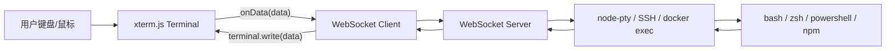
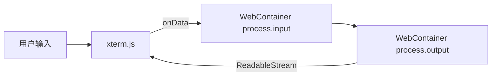
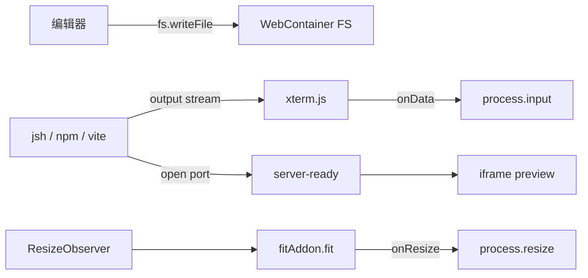

## xterm.js 学习指南

> 面向偏前端的全栈开发者。目标不是只会 `new Terminal()`，而是理解 xterm.js 在浏览器终端中的位置、输入输出链路、后端 PTY/WebSocket/WebContainer 如何接入，以及常用 API 和插件如何服务真实产品。

更新时间：2026-05-20  
主要参考：xterm.js 官方文档 6.0、API Reference、Using Addons、Flowcontrol、Encoding、Security、Link Handling。

## 0. 先说清楚：xterm.js 是什么，不是什么

xterm.js 是一个运行在浏览器里的终端模拟器组件。它负责：

- 渲染终端屏幕。
- 解析 ANSI/VT escape sequences。
- 处理键盘、鼠标、选择、复制、粘贴。
- 维护终端 buffer、scrollback、光标、颜色、样式。
- 提供插件机制，例如自动适配尺寸、搜索、链接识别、序列化、WebGL 渲染。

它不负责：

- 创建真实 shell。
- 执行 `bash`、`zsh`、`powershell`、`npm run dev`。
- 管理服务器权限。
- 自动建立 SSH。
- 自动给你 WebSocket 协议。

一句话：

```txt
xterm.js = 浏览器里的终端显示器 + 输入采集器
真实 shell/进程 = 需要你用后端 PTY、SSH、WebContainer 或其他运行时接上
```

如果把完整 Web Terminal 看成一条链路：

```txt
用户键盘输入
  -> xterm.js onData
  -> WebSocket
  -> 后端 node-pty / SSH / Docker exec / WebContainer process.input
  -> 进程输出
  -> WebSocket
  -> xterm.js write
  -> 浏览器渲染
```

xterm.js 只覆盖首尾两端：收输入、画输出。

## 1. 当前版本和包名

官方文档当前为 xterm.js `6.0`。现代包名使用 scoped package：

```bash
npm install @xterm/xterm
```

常用插件：

```bash
npm install @xterm/addon-fit
npm install @xterm/addon-web-links
npm install @xterm/addon-search
npm install @xterm/addon-serialize
npm install @xterm/addon-unicode11
npm install @xterm/addon-webgl
npm install @xterm/addon-canvas
npm install @xterm/addon-attach
```

旧教程里常见：

```bash
npm install xterm
npm install xterm-addon-fit
```

这是旧包名。新项目建议使用 `@xterm/xterm` 和 `@xterm/addon-*`。

基础 CSS 也必须引入：

```ts
import "@xterm/xterm/css/xterm.css";
```

没有 CSS，终端可能能创建，但显示会乱。

## 2. 运行架构

### 2.1 最常见架构：浏览器 + WebSocket + 后端 PTY



这个架构适合：

- Web SSH。
- 云主机控制台。
- 容器终端。
- CI/CD 任务日志和交互。
- 浏览器中的远程开发环境。

### 2.2 纯前端架构：xterm.js + WebContainer



这个架构没有你的后端 PTY，进程跑在浏览器 WebContainer 中。适合：

- 在线前端 Playground。
- 教程沙盒。
- AI 生成代码预览。

### 2.3 只读日志架构

```txt
后端任务日志 -> SSE/WebSocket/HTTP stream -> terminal.write()
```

这个场景不需要 `onData`，因为用户不需要交互，只看日志。

适合：

- 构建日志。
- 部署日志。
- 测试输出。
- 命令回放。

## 3. 最小示例

### 3.1 创建并打开终端

```ts
import { Terminal } from "@xterm/xterm";
import "@xterm/xterm/css/xterm.css";

const terminal = new Terminal({
  cursorBlink: true,
  fontSize: 14,
  fontFamily: "Menlo, Monaco, Consolas, monospace",
});

terminal.open(document.getElementById("terminal")!);
terminal.writeln("Hello xterm.js");
terminal.write("$ ");
```

API 解释：

- `new Terminal(options)`：创建终端实例。此时还没有挂到 DOM。
- `terminal.open(element)`：把终端挂载到某个 DOM 容器里。
- `terminal.write(data)`：向终端写入数据，不会自动换行。
- `terminal.writeln(data)`：向终端写入数据，并追加换行。

HTML：

```html
<div id="terminal" style="width: 800px; height: 400px"></div>
```

注意：容器必须有明确尺寸，否则终端可能高度为 0 或布局异常。

### 3.2 正确处理换行

终端换行常用 `\r\n`：

```ts
terminal.write("first line\r\nsecond line\r\n");
```

很多 shell/PTY 输出已经包含正确的控制字符，你直接 `terminal.write(data)` 就行。自己写 demo 文本时，推荐使用 `writeln()` 或 `\r\n`。

### 3.3 模拟一个本地输入回显

```ts
terminal.onData((data) => {
  terminal.write(data);
});
```

`onData` 解释：

- 当用户按键、粘贴、输入控制键时触发。
- 事件值是应该发给后端 PTY 的字符串。
- 真实项目中通常不直接 `write(data)`，而是发送给后端。

这段只是本地 echo demo，不是真 shell。

## 4. 核心运行流程

真实终端要理解两个方向。

### 4.1 用户输入方向

```txt
键盘事件 -> xterm.js 转成终端输入序列 -> onData(data) -> 发送给后端 PTY
```

例如：

- 用户按 `a`，`onData` 可能收到 `"a"`。
- 用户按 Enter，`onData` 可能收到 `"\r"`。
- 用户按方向键，`onData` 收到的是 escape sequence，例如 `"\x1b[A"`。
- 用户粘贴大段文本，`onData` 可能一次收到很多字符。

你不需要自己把键盘事件翻译成 ANSI 序列，xterm.js 已经处理好了。通常只需要：

```ts
terminal.onData((data) => {
  socket.send(JSON.stringify({ type: "input", data }));
});
```

### 4.2 进程输出方向

```txt
后端 PTY 输出 bytes/string -> WebSocket -> terminal.write(data) -> parser -> buffer -> renderer -> 屏幕
```

`terminal.write()` 会把数据交给 xterm.js parser，parser 识别：

- 普通文本。
- 光标移动。
- 清屏。
- 设置颜色。
- alternate screen。
- OSC title。
- 链接序列。
- 鼠标模式。

你不要用 `innerHTML` 渲染终端输出。终端输出必须交给 `terminal.write()`。

## 5. Terminal 构造选项

常见配置：

```ts
const terminal = new Terminal({
  cols: 80,
  rows: 24,
  cursorBlink: true,
  cursorStyle: "block",
  fontFamily: "Menlo, Monaco, Consolas, monospace",
  fontSize: 14,
  lineHeight: 1.2,
  scrollback: 5000,
  convertEol: false,
  theme: {
    background: "#111827",
    foreground: "#e5e7eb",
    cursor: "#ffffff",
    selectionBackground: "#374151",
  },
});
```

| 选项 | 作用 | 使用建议 |
| --- | --- | --- |
| `cols` | 初始列数 | 通常由 FitAddon 自动计算 |
| `rows` | 初始行数 | 通常由 FitAddon 自动计算 |
| `cursorBlink` | 光标是否闪烁 | 交互终端建议开 |
| `cursorStyle` | 光标样式 | `"block"`、`"underline"`、`"bar"` |
| `fontFamily` | 字体 | 使用等宽字体 |
| `fontSize` | 字号 | 影响 fit 计算 |
| `lineHeight` | 行高 | 过小会拥挤，过大浪费空间 |
| `scrollback` | 回滚行数 | 日志终端可大一些 |
| `convertEol` | 是否把 `\n` 转成 `\r\n` | demo 可开，真实 PTY 一般不开 |
| `theme` | 颜色主题 | 用于适配产品视觉 |
| `allowProposedApi` | 允许 proposed API | 只有明确需要实验 API 时才开 |

构造后也可以修改：

```ts
terminal.options.fontSize = 16;
terminal.options.theme = {
  ...terminal.options.theme,
  background: "#000000",
};
```

注意：对象型 option 需要传新对象，避免引用比较导致不生效。

## 6. 输出 API：write、writeln、clear、reset

### 6.1 write

```ts
terminal.write("Installing dependencies...\r\n");
```

`write()` 的用途是写入终端数据。数据可以是普通文本，也可以包含 ANSI 控制序列。

```ts
terminal.write("\x1b[31mError:\x1b[0m failed to install\r\n");
```

这会显示红色 `Error:`。

重要细节：官方 API 说明 `write()` 是异步处理的。调用后 buffer 不一定立刻更新。如果你需要等解析完成，传 callback：

```ts
terminal.write("hello", () => {
  console.log("data parsed");
});
```

### 6.2 writeln

```ts
terminal.writeln("Build completed");
```

`writeln()` 适合你自己写提示信息。真实 PTY 输出不要强行改成 `writeln()`，否则会破坏控制序列和光标行为。

### 6.3 clear

```ts
terminal.clear();
```

`clear()` 清除当前可见内容和部分 scrollback，适合用户点击“清空终端”按钮。

### 6.4 reset

```ts
terminal.reset();
```

`reset()` 重置终端状态，包括模式、样式等。适合终端状态被异常控制序列弄乱时恢复。

### 6.5 refresh

```ts
terminal.refresh(0, terminal.rows - 1);
```

`refresh()` 强制刷新某些行。一般很少手动调用，除非你写 addon 或遇到渲染状态需要主动刷新。

## 7. 输入 API：onData、onKey、input、paste

### 7.1 onData

```ts
const disposable = terminal.onData((data) => {
  socket.send(data);
});
```

`onData` 是最常用输入事件。它输出的是“终端应该发送给后端的数据”，不是原始 DOM keyboard event。

返回值是 `IDisposable`：

```ts
disposable.dispose();
```

在 React 卸载时一定要 dispose，避免重复监听。

### 7.2 onKey

```ts
terminal.onKey(({ key, domEvent }) => {
  console.log(key, domEvent.key, domEvent.ctrlKey);
});
```

`onKey` 同时给你：

- `key`：将要送入终端的数据。
- `domEvent`：浏览器原始键盘事件。

适合：

- 做快捷键。
- 判断 `Ctrl`、`Alt`、`Meta`。
- 拦截某些组合键。

### 7.3 attachCustomKeyEventHandler

```ts
terminal.attachCustomKeyEventHandler((event) => {
  if (event.ctrlKey && event.key === "l") {
    terminal.clear();
    return false;
  }

  return true;
});
```

这个 API 在按键被 xterm.js 处理前执行。返回：

- `true`：允许 xterm.js 继续处理。
- `false`：阻止 xterm.js 处理。

适合做强控制快捷键，但要谨慎。拦截太多会让终端不像终端。

### 7.4 input

```ts
terminal.input("ls\r");
```

`input()` 会把数据当成用户输入处理，因此会触发 `onData`。它不是直接显示文本，而是模拟输入。

适合：

- 点击按钮自动输入命令。
- 命令面板选择命令后送入终端。

### 7.5 paste

```ts
terminal.paste("npm install");
```

`paste()` 模拟用户粘贴文本。它会走粘贴相关处理。

适合：

- 自定义粘贴按钮。
- 从 UI 片段插入命令。

## 8. 尺寸和 FitAddon

终端尺寸不是 CSS 宽高，而是：

```txt
cols x rows
```

也就是“多少列字符、多少行字符”。

`fitAddon.fit()` 

后端 PTY 也必须知道这个尺寸，否则全屏程序、换行、vim/top 等都会显示异常。

### 8.1 安装和使用 FitAddon

```bash
npm install @xterm/addon-fit
```

```ts
import { Terminal } from "@xterm/xterm";
import { FitAddon } from "@xterm/addon-fit";
import "@xterm/xterm/css/xterm.css";

const terminal = new Terminal();
const fitAddon = new FitAddon();

terminal.loadAddon(fitAddon);
terminal.open(container);
fitAddon.fit();
```

`FitAddon` 的作用：

- 测量容器宽高。
- 根据字体宽高计算能放多少列和多少行。
- 调用 `terminal.resize(cols, rows)`。

### 8.2 监听容器变化

```ts
const resizeObserver = new ResizeObserver(() => {
  fitAddon.fit();
});

resizeObserver.observe(container);
```

注意：`fitAddon.fit()` 只改变前端 terminal 尺寸。如果你连接了后端 PTY，还要把新尺寸发给后端。

```ts
terminal.onResize(({ cols, rows }) => {
  socket.send(
    JSON.stringify({
      type: "resize",
      cols,
      rows,
    })
  );
});
```

后端收到后：

```ts
ptyProcess.resize(cols, rows);
```

### 8.3 proposeDimensions

```ts
const dimensions = fitAddon.proposeDimensions();

if (dimensions) {
  console.log(dimensions.cols, dimensions.rows);
}
```

`proposeDimensions()` 只计算建议尺寸，不实际 resize。适合你想先判断或和后端协商。

### 8.4 常见尺寸问题

问题一：终端高度为 0。

原因：父容器没有明确高度。

```css
.terminal-wrapper {
  height: 100%;
  min-height: 320px;
}
```

问题二：fit 后后端换行仍然错。

原因：只改了前端，没通知 PTY resize。

问题三：字体加载后尺寸不准。

原因：Web font 异步加载改变字符宽度。可以在字体 ready 后再 fit：

```ts
await document.fonts.ready;
fitAddon.fit();
```

## 9. 前后端 WebSocket + node-pty 实战

### 9.1 前端

```ts
import { Terminal } from "@xterm/xterm";
import { FitAddon } from "@xterm/addon-fit";
import "@xterm/xterm/css/xterm.css";

const terminal = new Terminal({
  cursorBlink: true,
  scrollback: 5000,
});

const fitAddon = new FitAddon();
terminal.loadAddon(fitAddon);
terminal.open(document.getElementById("terminal")!);
fitAddon.fit();

const socket = new WebSocket("ws://localhost:3001/terminal");

socket.addEventListener("open", () => {
  terminal.writeln("Connected");

  socket.send(
    JSON.stringify({
      type: "resize",
      cols: terminal.cols,
      rows: terminal.rows,
    })
  );
});

terminal.onData((data) => {
  socket.send(
    JSON.stringify({
      type: "input",
      data,
    })
  );
});

terminal.onResize(({ cols, rows }) => {
  socket.send(
    JSON.stringify({
      type: "resize",
      cols,
      rows,
    })
  );
});

socket.addEventListener("message", (event) => {
  const message = JSON.parse(event.data);

  if (message.type === "output") {
    terminal.write(message.data);
  }
});

window.addEventListener("resize", () => {
  fitAddon.fit();
});
```

这里每个 API 的职责：

- `terminal.onData()`：把用户输入发给后端。
- `socket.message`：接收后端进程输出。
- `terminal.write()`：把进程输出渲染到终端。
- `terminal.onResize()`：同步前端终端字符尺寸。
- `fitAddon.fit()`：根据容器大小自动计算 cols/rows。

### 9.2 后端 Node.js + node-pty

```ts
import http from "node:http";
import os from "node:os";
import { WebSocketServer } from "ws";
import pty from "node-pty";

const server = http.createServer();
const wss = new WebSocketServer({ server, path: "/terminal" });

wss.on("connection", (socket) => {
  const shell = os.platform() === "win32" ? "powershell.exe" : "bash";

  const ptyProcess = pty.spawn(shell, [], {
    name: "xterm-256color",
    cols: 80,
    rows: 24,
    cwd: process.env.HOME,
    env: process.env,
  });

  ptyProcess.onData((data) => {
    socket.send(
      JSON.stringify({
        type: "output",
        data,
      })
    );
  });

  socket.on("message", (raw) => {
    const message = JSON.parse(String(raw));

    if (message.type === "input") {
      ptyProcess.write(message.data);
    }

    if (message.type === "resize") {
      ptyProcess.resize(message.cols, message.rows);
    }
  });

  socket.on("close", () => {
    ptyProcess.kill();
  });
});

server.listen(3001);
```

后端关键点：

- `node-pty` 创建伪终端，不是普通 `child_process.spawn`。
- PTY 能正确处理 shell prompt、vim、top、颜色、全屏程序。
- `ptyProcess.write()` 接收前端输入。
- `ptyProcess.onData()` 输出后端数据。
- `ptyProcess.resize()` 同步 cols/rows。
- WebSocket 关闭时必须 kill PTY。

### 9.3 为什么不用 child_process 直接接 stdout

普通 `child_process.spawn()` 适合非交互命令，例如跑 `npm test` 日志。

真实 shell 交互需要 PTY，因为很多程序会检测自己是否运行在 TTY 中：

- bash prompt。
- vim/nano。
- top/htop。
- readline。
- 彩色输出。
- 方向键历史命令。

所以交互式 Web Terminal 推荐：

```txt
xterm.js + WebSocket + node-pty
```

只读日志可以：

```txt
xterm.js + SSE/WebSocket + child_process stdout
```

## 10. 和 WebContainer 集成

如果你在前端使用 WebContainer，可以把 xterm.js 接到 WebContainer process。

```ts
import { WebContainer } from "@webcontainer/api";
import { Terminal } from "@xterm/xterm";
import { FitAddon } from "@xterm/addon-fit";
import "@xterm/xterm/css/xterm.css";

const webcontainer = await WebContainer.boot();

const terminal = new Terminal({ cursorBlink: true });
const fitAddon = new FitAddon();
terminal.loadAddon(fitAddon);
terminal.open(container);
fitAddon.fit();

const shell = await webcontainer.spawn("jsh", {
  terminal: {
    cols: terminal.cols,
    rows: terminal.rows,
  },
});

shell.output.pipeTo(
  new WritableStream({
    write(chunk) {
      terminal.write(chunk);
    },
  })
);

const writer = shell.input.getWriter();

terminal.onData((data) => {
  writer.write(data);
});

terminal.onResize(({ cols, rows }) => {
  shell.resize({ cols, rows });
});
```

这里的运行流程：

- xterm.js 负责显示和输入。
- WebContainer `shell.output` 是 `ReadableStream<string>`。
- `pipeTo(new WritableStream(...))` 把输出写入 `terminal.write()`。
- `terminal.onData()` 把输入写到 `shell.input`。
- `terminal.onResize()` 调用 WebContainer process 的 `resize()`。

### 10.1 WebContainer 集成的三个对象

把 xterm.js 和 WebContainer 接起来时，你会同时管理三个对象：

| 对象 | 来自哪里 | 负责什么 |
| --- | --- | --- |
| `terminal` | xterm.js | 渲染输出、接收输入、维护 cols/rows |
| `webcontainer` | `@webcontainer/api` | 浏览器内 Node.js 运行时和虚拟文件系统 |
| `process` | `webcontainer.spawn()` | 某个具体进程，例如 `jsh`、`npm install`、`npm run dev` |

不要把它们混在一起：

- `terminal.write()` 只是写到屏幕。
- `webcontainer.fs.writeFile()` 是写虚拟文件系统。
- `process.input.getWriter().write()` 是把输入送给进程。
- `process.output.pipeTo(...)` 是把进程输出接出来。

### 10.2 最小可交互 shell

下面是一个更完整的 WebContainer shell 接线版本。

```ts
import { WebContainer, type WebContainerProcess } from "@webcontainer/api";
import { Terminal } from "@xterm/xterm";
import { FitAddon } from "@xterm/addon-fit";
import "@xterm/xterm/css/xterm.css";

export async function createWebContainerTerminal(container: HTMLElement) {
  const webcontainer = await WebContainer.boot();

  const terminal = new Terminal({
    cursorBlink: true,
    scrollback: 5000,
    convertEol: true,
    fontFamily: "Menlo, Monaco, Consolas, monospace",
    fontSize: 14,
  });

  const fitAddon = new FitAddon();
  terminal.loadAddon(fitAddon);
  terminal.open(container);
  fitAddon.fit();
  terminal.focus();

  const shell = await webcontainer.spawn("jsh", {
    terminal: {
      cols: terminal.cols,
      rows: terminal.rows,
    },
  });

  const outputPromise = shell.output.pipeTo(
    new WritableStream({
      write(chunk) {
        terminal.write(chunk);
      },
    })
  );

  const inputWriter = shell.input.getWriter();

  const dataDisposable = terminal.onData((data) => {
    inputWriter.write(data);
  });

  const resizeDisposable = terminal.onResize(({ cols, rows }) => {
    shell.resize({ cols, rows });
  });

  const resizeObserver = new ResizeObserver(() => {
    fitAddon.fit();
  });

  resizeObserver.observe(container);

  return {
    webcontainer,
    terminal,
    shell,
    fitAddon,
    dispose() {
      dataDisposable.dispose();
      resizeDisposable.dispose();
      resizeObserver.disconnect();
      inputWriter.releaseLock();
      shell.kill();
      terminal.dispose();
      outputPromise.catch(() => {});
    },
  };
}
```

关键解释：

- `webcontainer.spawn("jsh")`：启动 WebContainer 内置 shell，适合做交互式终端。
- `terminal: { cols, rows }`：告诉 WebContainer 进程当前终端大小。
- `shell.output.pipeTo(...)`：把 shell 的输出流接到 xterm.js。
- `shell.input.getWriter()`：拿到 shell stdin 的 writer。
- `terminal.onData(...)`：用户输入什么，就写入 shell。
- `terminal.onResize(...)`：终端尺寸变化时同步给 shell。
- `shell.kill()`：组件销毁时停止进程，避免后台进程残留。

### 10.3 交互式 shell 和一次性命令的区别

WebContainer 里你通常会跑两类进程。

第一类：交互式 shell。

```ts
const shell = await webcontainer.spawn("jsh", {
  terminal: {
    cols: terminal.cols,
    rows: terminal.rows,
  },
});
```

特点：

- 长时间存在。
- 用户通过 xterm.js 输入命令。
- 输出持续流向 terminal。
- 需要处理 resize。

第二类：一次性命令。

```ts
const install = await webcontainer.spawn("npm", ["install"]);

install.output.pipeTo(
  new WritableStream({
    write(chunk) {
      terminal.write(chunk);
    },
  })
);

const exitCode = await install.exit;
```

特点：

- 运行完就退出。
- 通常不需要 `process.input`。
- 需要等待 `process.exit` 判断成功失败。
- 适合 `npm install`、`npm test`、`npm run build`。

### 10.4 写一个命令运行器

你可以封装一个函数，把 WebContainer 命令输出统一写到 xterm.js。

```ts
async function runCommand(
  webcontainer: WebContainer,
  terminal: Terminal,
  command: string,
  args: string[] = []
) {
  terminal.writeln(`\r\n$ ${command} ${args.join(" ")}`);

  const process = await webcontainer.spawn(command, args, {
    terminal: {
      cols: terminal.cols,
      rows: terminal.rows,
    },
  });

  const outputPromise = process.output.pipeTo(
    new WritableStream({
      write(chunk) {
        terminal.write(chunk);
      },
    })
  );

  const exitCode = await process.exit;

  await outputPromise.catch(() => {});

  if (exitCode === 0) {
    terminal.writeln(`\r\nCommand completed: ${command}`);
  } else {
    terminal.writeln(`\r\nCommand failed with exit code ${exitCode}`);
  }

  return exitCode;
}
```

使用：

```ts
await runCommand(webcontainer, terminal, "npm", ["install"]);
await runCommand(webcontainer, terminal, "npm", ["run", "build"]);
```

这个函数做了三件事：

- 启动 WebContainer 进程。
- 把 `process.output` 持续写入 `terminal.write()`。
- 等待 `process.exit`，把退出结果显示给用户。

### 10.5 npm install + dev server + 终端输出

在线 Playground 常见流程：

```txt
boot WebContainer
  -> mount 项目文件
  -> npm install
  -> npm run dev
  -> server-ready 后 iframe 预览
  -> xterm.js 显示所有命令输出
```

示例：

```ts
async function startProject(
  webcontainer: WebContainer,
  terminal: Terminal,
  files: Parameters<WebContainer["mount"]>[0],
  iframe: HTMLIFrameElement
) {
  terminal.writeln("Mounting files...");
  await webcontainer.mount(files);

  webcontainer.on("server-ready", (_port, url) => {
    terminal.writeln(`\r\nPreview ready: ${url}`);
    iframe.src = url;
  });

  terminal.writeln("Installing dependencies...");
  const installCode = await runCommand(webcontainer, terminal, "npm", ["install"]);

  if (installCode !== 0) {
    terminal.writeln("Install failed. Dev server will not start.");
    return;
  }

  terminal.writeln("Starting dev server...");

  const devServer = await webcontainer.spawn("npm", ["run", "dev"], {
    terminal: {
      cols: terminal.cols,
      rows: terminal.rows,
    },
  });

  devServer.output.pipeTo(
    new WritableStream({
      write(chunk) {
        terminal.write(chunk);
      },
    })
  );

  return devServer;
}
```

这里 dev server 不等待 `exit`，因为它是长时间运行的进程。你应该保存返回的 `devServer`，重新运行或卸载页面时调用：

```ts
devServer.kill();
```

### 10.6 xterm.js + WebContainer + iframe 预览的完整数据流



这张图里有两条不要混淆的链路：

- 代码编辑链路：编辑器写入 `webcontainer.fs`，Vite HMR 或 dev server 处理文件变化。
- 终端链路：xterm.js 接用户输入，WebContainer process 返回输出。

编辑器内容变化不应该直接 `terminal.write()`，除非你想显示日志。终端输出也不应该直接改文件。

### 10.7 React Hook 封装

如果你主要在 Next.js/React 中使用，可以把 xterm + WebContainer 接线封装成 hook。

```tsx
"use client";

import { useEffect, useRef, useState } from "react";
import { WebContainer, type WebContainerProcess } from "@webcontainer/api";
import { Terminal } from "@xterm/xterm";
import { FitAddon } from "@xterm/addon-fit";
import "@xterm/xterm/css/xterm.css";

let bootPromise: Promise<WebContainer> | null = null;

function bootWebContainer() {
  if (!bootPromise) {
    bootPromise = WebContainer.boot();
  }

  return bootPromise;
}

export function useWebContainerTerminal() {
  const containerRef = useRef<HTMLDivElement | null>(null);
  const terminalRef = useRef<Terminal | null>(null);
  const shellRef = useRef<WebContainerProcess | null>(null);
  const [ready, setReady] = useState(false);

  useEffect(() => {
    if (!containerRef.current) {
      return;
    }

    let disposed = false;
    let inputWriter: WritableStreamDefaultWriter<string> | null = null;
    const disposables: Array<{ dispose: () => void }> = [];

    async function start() {
      const terminal = new Terminal({
        cursorBlink: true,
        scrollback: 5000,
      });

      const fitAddon = new FitAddon();
      terminal.loadAddon(fitAddon);
      terminal.open(containerRef.current!);
      fitAddon.fit();
      terminal.focus();

      terminalRef.current = terminal;

      const webcontainer = await bootWebContainer();

      if (disposed) {
        terminal.dispose();
        return;
      }

      const shell = await webcontainer.spawn("jsh", {
        terminal: {
          cols: terminal.cols,
          rows: terminal.rows,
        },
      });

      shellRef.current = shell;

      shell.output
        .pipeTo(
          new WritableStream({
            write(chunk) {
              terminal.write(chunk);
            },
          })
        )
        .catch(() => {});

      inputWriter = shell.input.getWriter();

      disposables.push(
        terminal.onData((data) => {
          inputWriter?.write(data);
        })
      );

      disposables.push(
        terminal.onResize(({ cols, rows }) => {
          shell.resize({ cols, rows });
        })
      );

      const resizeObserver = new ResizeObserver(() => {
        fitAddon.fit();
      });

      resizeObserver.observe(containerRef.current!);

      disposables.push({
        dispose() {
          resizeObserver.disconnect();
        },
      });

      setReady(true);
    }

    start();

    return () => {
      disposed = true;
      setReady(false);

      for (const disposable of disposables) {
        disposable.dispose();
      }

      inputWriter?.releaseLock();
      shellRef.current?.kill();
      terminalRef.current?.dispose();
      shellRef.current = null;
      terminalRef.current = null;
    };
  }, []);

  return {
    containerRef,
    terminal: terminalRef.current,
    shell: shellRef.current,
    ready,
  };
}
```

组件中使用：

```tsx
export function TerminalPanel() {
  const { containerRef, ready } = useWebContainerTerminal();

  return (
    <section>
      <div>{ready ? "Terminal ready" : "Starting terminal..."}</div>
      <div ref={containerRef} style={{ height: 420, width: "100%" }} />
    </section>
  );
}
```

这个 hook 的价值：

- 只 boot 一次 WebContainer。
- 组件卸载时清理 terminal、shell 和监听器。
- xterm.js 仍然保持命令式实例，不放入 React state。
- 避免 React render 触发 terminal 重建。

### 10.8 在同一个终端里跑 shell 和任务日志

有时候你既想保留交互式 shell，又想按钮触发 `npm install`。不建议同时把多个进程输出无脑写进同一个 terminal，因为输出会混在一起。

更清晰的方式是：

方案一：一个终端只接一个交互 shell。用户自己在 shell 里输入 `npm install`。

方案二：任务按钮单独启动一次性命令，并在同一个 terminal 中显示，但按钮运行期间提示用户不要同时操作 shell。

方案三：拆成两个 xterm.js：

```txt
Shell Terminal: jsh 交互
Task Terminal: npm install/build/dev 日志
```

如果你要把命令写入 shell，而不是另外 spawn 一个进程，可以用：

```ts
const writer = shell.input.getWriter();
await writer.write("npm install\n");
await writer.write("npm run dev\n");
```

这等价于用户在终端中输入命令。优点是体验自然；缺点是你不容易拿到每个命令准确的退出码。

如果你需要退出码，用单独 `webcontainer.spawn("npm", ["install"])` 更可靠。

### 10.9 resize 的正确顺序

推荐顺序：

```ts
const resizeObserver = new ResizeObserver(() => {
  fitAddon.fit();
});

terminal.onResize(({ cols, rows }) => {
  shell.resize({ cols, rows });
});
```

解释：

- `ResizeObserver` 观察 DOM 容器变化。
- `fitAddon.fit()` 根据容器计算新的 cols/rows。
- fit 内部触发 `terminal.resize()`。
- `terminal.onResize()` 再把 cols/rows 传给 WebContainer process。

不要直接拿容器像素宽高传给 `shell.resize()`。它需要的是字符列数和行数，不是 CSS 像素。

### 10.10 终端输出和 React state

WebContainer process 输出可能很多。不要这样：

```ts
shell.output.pipeTo(
  new WritableStream({
    write(chunk) {
      setLogs((current) => current + chunk);
      terminal.write(chunk);
    },
  })
);
```

如果输出频繁，React 会被大量 setState 拖慢。更推荐：

```ts
shell.output.pipeTo(
  new WritableStream({
    write(chunk) {
      terminal.write(chunk);
    },
  })
);
```

如果确实要保存日志，可做批处理：

```ts
let pending = "";
let scheduled = false;

function appendLog(chunk: string) {
  pending += chunk;

  if (scheduled) {
    return;
  }

  scheduled = true;

  requestAnimationFrame(() => {
    setLogs((current) => current + pending);
    pending = "";
    scheduled = false;
  });
}
```

### 10.11 常见坑

坑一：忘记引入 xterm.css。

```ts
import "@xterm/xterm/css/xterm.css";
```

坑二：容器没高度，`fitAddon.fit()` 得到异常尺寸。

```tsx
<div ref={containerRef} style={{ height: 420, width: "100%" }} />
```

坑三：没有把 resize 同步给 WebContainer process。

```ts
terminal.onResize(({ cols, rows }) => {
  shell.resize({ cols, rows });
});
```

坑四：释放时没有 kill 进程。

```ts
return () => {
  shell.kill();
  terminal.dispose();
};
```

坑五：多个组件同时 `WebContainer.boot()`。

```ts
let bootPromise: Promise<WebContainer> | null = null;

function bootWebContainer() {
  bootPromise ??= WebContainer.boot();
  return bootPromise;
}
```

坑六：`writer.releaseLock()` 后还继续写。

```ts
const writer = shell.input.getWriter();
writer.releaseLock();
await writer.write("ls\n"); // 错误
```

释放 lock 后如果还要写，需要重新 `getWriter()`。

## 11. React/Next.js 封装

xterm.js 是命令式 DOM 组件。React 里不要每次 render 都创建终端，应在 `useEffect` 中创建和销毁。

### 11.1 基础组件

```tsx
"use client";

import { useEffect, useRef } from "react";
import { Terminal } from "@xterm/xterm";
import { FitAddon } from "@xterm/addon-fit";
import "@xterm/xterm/css/xterm.css";

export function XtermDemo() {
  const containerRef = useRef<HTMLDivElement | null>(null);
  const terminalRef = useRef<Terminal | null>(null);
  const fitAddonRef = useRef<FitAddon | null>(null);

  useEffect(() => {
    if (!containerRef.current) {
      return;
    }

    const terminal = new Terminal({
      cursorBlink: true,
      fontSize: 14,
    });

    const fitAddon = new FitAddon();
    terminal.loadAddon(fitAddon);
    terminal.open(containerRef.current);
    fitAddon.fit();
    terminal.focus();
    terminal.writeln("React + xterm.js");
    terminal.write("$ ");

    terminalRef.current = terminal;
    fitAddonRef.current = fitAddon;

    const resizeObserver = new ResizeObserver(() => {
      fitAddon.fit();
    });

    resizeObserver.observe(containerRef.current);

    return () => {
      resizeObserver.disconnect();
      terminal.dispose();
      terminalRef.current = null;
      fitAddonRef.current = null;
    };
  }, []);

  return <div ref={containerRef} style={{ height: 400, width: "100%" }} />;
}
```

解释：

- `useRef` 保存 terminal 实例，避免 render 触发重建。
- `useEffect` 中创建 terminal，组件卸载时 `dispose()`。
- `ResizeObserver` 用来驱动 `fitAddon.fit()`。
- Next.js App Router 中必须是 client component，因为 xterm.js 依赖 DOM。

### 11.2 WebSocket 版 React 组件

```tsx
"use client";

import { useEffect, useRef } from "react";
import { Terminal } from "@xterm/xterm";
import { FitAddon } from "@xterm/addon-fit";
import "@xterm/xterm/css/xterm.css";

export function RemoteTerminal({ url }: { url: string }) {
  const containerRef = useRef<HTMLDivElement | null>(null);

  useEffect(() => {
    if (!containerRef.current) {
      return;
    }

    const terminal = new Terminal({
      cursorBlink: true,
      scrollback: 5000,
    });

    const fitAddon = new FitAddon();
    terminal.loadAddon(fitAddon);
    terminal.open(containerRef.current);
    fitAddon.fit();

    const socket = new WebSocket(url);

    const dataDisposable = terminal.onData((data) => {
      if (socket.readyState === WebSocket.OPEN) {
        socket.send(JSON.stringify({ type: "input", data }));
      }
    });

    const resizeDisposable = terminal.onResize(({ cols, rows }) => {
      if (socket.readyState === WebSocket.OPEN) {
        socket.send(JSON.stringify({ type: "resize", cols, rows }));
      }
    });

    socket.addEventListener("open", () => {
      socket.send(
        JSON.stringify({
          type: "resize",
          cols: terminal.cols,
          rows: terminal.rows,
        })
      );
    });

    socket.addEventListener("message", (event) => {
      const message = JSON.parse(event.data);

      if (message.type === "output") {
        terminal.write(message.data);
      }
    });

    const resizeObserver = new ResizeObserver(() => {
      fitAddon.fit();
    });

    resizeObserver.observe(containerRef.current);

    return () => {
      dataDisposable.dispose();
      resizeDisposable.dispose();
      resizeObserver.disconnect();
      socket.close();
      terminal.dispose();
    };
  }, [url]);

  return <div ref={containerRef} style={{ height: "100%", minHeight: 360 }} />;
}
```

这个组件的清理非常重要：

- `dataDisposable.dispose()` 移除输入监听。
- `resizeDisposable.dispose()` 移除 resize 监听。
- `socket.close()` 断开后端。
- `terminal.dispose()` 清理 DOM 和内部资源。

React Strict Mode 开发环境会让 effect 重复执行一次，用完整清理可以避免重复连接。

## 12. Addon 插件系统

官方文档说明：Addon 是使用 xterm.js API 扩展终端功能的模块。使用方式统一是：

```ts
const addon = new SomeAddon();
terminal.loadAddon(addon);
```

Addon 通常有：

- `activate(terminal)`：加载时执行。
- `dispose()`：卸载时清理。

### 12.1 FitAddon

```ts
import { FitAddon } from "@xterm/addon-fit";

const fitAddon = new FitAddon();
terminal.loadAddon(fitAddon);
fitAddon.fit();
```

用途：根据容器大小自动计算 terminal cols/rows。

### 12.2 WebLinksAddon

```ts
import { WebLinksAddon } from "@xterm/addon-web-links";

terminal.loadAddon(
  new WebLinksAddon((event, uri) => {
    window.open(uri, "_blank", "noopener,noreferrer");
  })
);
```

用途：把终端输出中看起来像 URL 的文本变成可点击链接。

安全建议：

- 新窗口加 `noopener,noreferrer`。
- 可以要求 Ctrl/Cmd 才打开，避免误触。
- 终端输出不可信，不要把链接直接塞 `innerHTML`。

### 12.3 SearchAddon

```ts
import { SearchAddon } from "@xterm/addon-search";

const searchAddon = new SearchAddon();
terminal.loadAddon(searchAddon);

searchAddon.findNext("error");
searchAddon.findPrevious("warning");
```

用途：在 scrollback 中搜索文本。适合日志终端、构建输出、远程 shell 历史查看。

### 12.4 SerializeAddon

```ts
import { SerializeAddon } from "@xterm/addon-serialize";

const serializeAddon = new SerializeAddon();
terminal.loadAddon(serializeAddon);

const snapshot = serializeAddon.serialize();
```

用途：把当前终端 buffer 序列化成字符串，适合：

- 保存终端快照。
- 重新挂载时恢复显示。
- 导出日志。

注意：序列化的是终端显示状态，不等于真实 shell 状态。恢复显示不代表进程还活着。

### 12.5 Unicode11Addon

```ts
import { Unicode11Addon } from "@xterm/addon-unicode11";

const unicode11Addon = new Unicode11Addon();
terminal.loadAddon(unicode11Addon);
terminal.unicode.activeVersion = "11";
```

用途：更好处理 Unicode 字符宽度，尤其是 emoji、东亚字符等。

如果你面向中文用户，字符宽度问题很常见。遇到对齐异常时，可以考虑引入。

### 12.6 WebglAddon 和 CanvasAddon

```ts
import { WebglAddon } from "@xterm/addon-webgl";

const webglAddon = new WebglAddon();
terminal.loadAddon(webglAddon);
```

用途：替换默认渲染器，提高大量输出时的渲染性能。

```ts
import { CanvasAddon } from "@xterm/addon-canvas";

terminal.loadAddon(new CanvasAddon());
```

选择建议：

- 默认 DOM/浏览器渲染已够用时，不要急着加。
- 大量日志、高频刷新、复杂主题时可以测试 WebGL/Canvas。
- WebGL 可能遇到 GPU/上下文丢失问题，要做好 fallback。

### 12.7 AttachAddon

```ts
import { AttachAddon } from "@xterm/addon-attach";

const socket = new WebSocket("wss://example.com/terminal");
terminal.loadAddon(new AttachAddon(socket));
```

用途：快速把 WebSocket 和 terminal 接起来。

但官方安全文档明确提醒：不要直接把仓库 demo 和 attach addon 当成生产 WebSocket 方案。生产中你通常需要自定义消息协议，加入：

- 鉴权。
- 会话 ID。
- resize 消息。
- 心跳。
- 流控 ACK。
- 审计日志。
- 权限控制。

所以 AttachAddon 适合 demo 或简单场景，复杂生产终端建议自己写协议。

### 12.8 自定义 Addon

```ts
import type { IDisposable, ITerminalAddon, Terminal } from "@xterm/xterm";

class DataLoggerAddon implements ITerminalAddon {
  private disposables: IDisposable[] = [];

  activate(terminal: Terminal) {
    this.disposables.push(
      terminal.onData((data) => {
        console.log("terminal input", data);
      })
    );
  }

  dispose() {
    for (const disposable of this.disposables) {
      disposable.dispose();
    }

    this.disposables = [];
  }
}

terminal.loadAddon(new DataLoggerAddon());
```

自定义 addon 适合封装：

- 埋点。
- 命令识别。
- 自定义快捷键。
- 业务链接处理。
- 特定控制序列解析。

## 13. 选择、复制、粘贴、滚动

### 13.1 选择相关

```ts
const text = terminal.getSelection();
const position = terminal.getSelectionPosition();
const hasSelection = terminal.hasSelection();
```

用途：

- 自定义复制按钮。
- 右键菜单。
- 根据选中内容搜索。

```ts
terminal.selectAll();
terminal.clearSelection();
terminal.selectLines(0, 10);
```

### 13.2 滚动相关

```ts
terminal.scrollToTop();
terminal.scrollToBottom();
terminal.scrollLines(-5);
terminal.scrollPages(1);
terminal.scrollToLine(100);
```

适合：

- 日志查看器。
- “回到底部”按钮。
- 搜索结果定位。

### 13.3 复制粘贴注意

xterm.js 本身可以处理选择和粘贴，但浏览器权限、系统快捷键、右键菜单因平台而异。常见做法：

```ts
async function copySelection() {
  const selection = terminal.getSelection();

  if (selection) {
    await navigator.clipboard.writeText(selection);
  }
}
```

粘贴：

```ts
async function pasteFromClipboard() {
  const text = await navigator.clipboard.readText();
  terminal.paste(text);
}
```

浏览器 Clipboard API 通常要求 HTTPS 和用户手势。

## 14. Buffer、Marker 和 Decoration

### 14.1 Buffer 是什么

xterm.js 维护两种 buffer：

- normal buffer：普通终端内容，带 scrollback。
- alternate buffer：全屏程序使用，例如 vim、less、top。

访问：

```ts
const activeBuffer = terminal.buffer.active;
console.log(activeBuffer.length);
console.log(activeBuffer.cursorX, activeBuffer.cursorY);
```

读取某一行：

```ts
const line = terminal.buffer.active.getLine(0);
const text = line?.translateToString(true);
```

用途：

- 自定义搜索。
- 读取当前屏幕内容。
- 日志分析。
- 做测试断言。

注意：buffer 中的数据来自终端输出，仍然要当成不可信数据处理。

### 14.2 Marker

```ts
const marker = terminal.registerMarker(0);
```

Marker 用于标记 buffer 中的位置。随着内容滚动，marker 会跟随更新或失效。

适合：

- 标记命令开始位置。
- 标记搜索结果。
- 标记构建阶段。

### 14.3 Decoration

```ts
const marker = terminal.registerMarker(0);

if (marker) {
  const decoration = terminal.registerDecoration({
    marker,
    x: 0,
    width: terminal.cols,
    backgroundColor: "#1f2937",
  });

  decoration?.onRender((element) => {
    element.title = "Command started here";
  });
}
```

Decoration 用于给 buffer 中的行或位置添加装饰。适合做：

- 命令分隔线。
- 错误行高亮。
- 断点/标记。
- overview ruler。

## 15. 链接处理

终端里出现链接有两种方式：

- 程序显式输出 OSC 8 hyperlink escape sequence。
- 普通文本看起来像 URL，需要 WebLinksAddon 识别。

### 15.1 WebLinksAddon

```ts
import { WebLinksAddon } from "@xterm/addon-web-links";

const webLinksAddon = new WebLinksAddon((event, uri) => {
  if (!event.ctrlKey && !event.metaKey) {
    return;
  }

  window.open(uri, "_blank", "noopener,noreferrer");
});

terminal.loadAddon(webLinksAddon);
```

这里要求按住 Ctrl/Cmd 才打开，避免误触。

### 15.2 linkHandler

```ts
terminal.options.linkHandler = {
  activate(event, text) {
    window.open(text, "_blank", "noopener,noreferrer");
  },
  hover(event, text) {
    console.log("hover", text);
  },
  leave() {
    console.log("leave");
  },
  allowNonHttpProtocols: false,
};
```

`linkHandler` 用来处理显式链接。安全建议：

- 默认只允许 http/https。
- hover 时展示真实 URL。
- 打开链接用新窗口和 `noopener,noreferrer`。

## 16. 编码和 Unicode

官方 Encoding 文档强调：终端和后端 locale 必须正确，否则非 ASCII 字符会出问题。

### 16.1 write 的字符串和字节

`terminal.write()` 接受：

```ts
terminal.write("中文\r\n");
terminal.write(new Uint8Array([0xe4, 0xbd, 0xa0]));
```

官方 API 说明：

- `Uint8Array` 会按 UTF-8 处理。
- `string` 是 JavaScript 字符串，属于 UTF-16/UCS-2 语义。

多数 WebSocket 项目直接传 string。若你处理原始 bytes，要确保编码一致。

### 16.2 后端 locale

Linux 后端建议环境包含 UTF-8：

```ts
env: {
  ...process.env,
  LANG: "en_US.UTF-8",
  LC_ALL: "en_US.UTF-8",
}
```

如果 `LC_CTYPE` 或 `LC_ALL` 不是 UTF-8，中文、emoji、宽字符对齐可能异常。

### 16.3 中文宽度问题

遇到这些情况：

- 表格错位。
- emoji 占宽异常。
- 中文字符覆盖下一个字符。

可以尝试：

```ts
import { Unicode11Addon } from "@xterm/addon-unicode11";

terminal.loadAddon(new Unicode11Addon());
terminal.unicode.activeVersion = "11";
```

同时后端程序、字体、locale 也要配合。

## 17. 流控和性能

官方 Flowcontrol 文档指出：`terminal.write()` 是非阻塞的，会先把数据放入内部缓冲区，再异步解析。非常快的生产者可能把 xterm.js 压垮，导致 UI 卡顿、输入延迟甚至数据丢弃。

### 17.1 为什么会卡

例如后端执行：

```bash
yes
```

它会疯狂输出。如果你无脑：

```ts
socket.onmessage = (event) => {
  terminal.write(event.data);
};
```

前端可能出现：

- 输入 Ctrl+C 很久才响应。
- 浏览器主线程卡顿。
- xterm.js 内部 write buffer 膨胀。

### 17.2 write callback

```ts
terminal.write(chunk, () => {
  console.log("chunk parsed");
});
```

callback 表示这批数据已被 parser 处理。可以用它做背压信号。

简单 PTY 流控：

```ts
ptyProcess.onData((chunk) => {
  ptyProcess.pause();

  terminal.write(chunk, () => {
    ptyProcess.resume();
  });
});
```

这很直观，但效率较低，因为每个 chunk 都暂停/恢复。

### 17.3 watermark 流控

```ts
const HIGH = 100_000;
const LOW = 10_000;
let watermark = 0;

ptyProcess.onData((chunk) => {
  watermark += chunk.length;

  terminal.write(chunk, () => {
    watermark = Math.max(watermark - chunk.length, 0);

    if (watermark < LOW) {
      ptyProcess.resume();
    }
  });

  if (watermark > HIGH) {
    ptyProcess.pause();
  }
});
```

含义：

- `watermark` 表示已写入但尚未解析完成的数据量。
- 超过高水位暂停生产者。
- 低于低水位恢复生产者。

如果中间有 WebSocket，流控要跨客户端和服务端设计 ACK 协议。官方文档提醒 WebSocket 自身没有足够直接的背压钩子，生产级终端需要自己设计消息协议。

### 17.4 前端性能建议

- 大量输出时减少 React state 更新，不要每个 chunk 都 setState。
- 优先让 `terminal.write()` 直接处理输出。
- 日志搜索用 SearchAddon，不要每次都重新渲染 DOM。
- 高吞吐场景测试 WebGL/Canvas addon。
- `scrollback` 不要无限大。
- 用户输入优先级要高，避免被输出淹没。

## 18. Parser Hooks 和自定义序列

xterm.js 可以注册 parser hook，处理特定终端序列。

### 18.1 registerOscHandler

```ts
const disposable = terminal.parser.registerOscHandler(1337, (data) => {
  console.log("custom OSC 1337", data);
  return true;
});
```

用途：

- 识别自定义控制序列。
- 和你的后端程序约定特殊事件。
- 实现终端内标记、任务状态、文件链接。

返回 `true` 表示这个序列被处理。

### 18.2 安全提醒

终端输出来自外部进程，不可信。自定义 parser hook 不要直接：

```ts
element.innerHTML = data; // 危险
```

应该：

```ts
element.textContent = data;
```

## 19. 安全

官方 Security 文档很直接：终端组件会显著提高安全要求，因为页面上的 JavaScript 能接触终端输入输出，终端本身也可能连接高权限系统。

### 19.1 基本原则

- 不要把高权限 shell 暴露给未授权用户。
- 不要绕过系统权限机制。
- WebSocket 必须鉴权。
- 远程终端使用 `wss`。
- 不要在终端页面引入不可信第三方脚本。
- 不要用 `innerHTML` 展示来自终端的数据。
- 终端页面要防 XSS。
- 审计用户会话和命令权限。

### 19.2 WebSocket 安全

不要只靠“知道 WebSocket 地址”来保护终端。

建议消息握手：

```ts
socket.send(
  JSON.stringify({
    type: "auth",
    token,
    sessionId,
  })
);
```

后端必须验证：

- token 是否有效。
- 用户是否有权限访问目标机器/容器。
- session 是否过期。
- origin 是否可信。

### 19.3 后端权限

node-pty 启动进程时要尽量低权限：

```ts
pty.spawn("bash", [], {
  cwd: userWorkspacePath,
  env: safeEnv,
});
```

不要用 root/administrator 启动对外终端。

### 19.4 链接安全

终端输出中的 URL 可能是恶意的。打开链接时：

```ts
window.open(uri, "_blank", "noopener,noreferrer");
```

并考虑只允许 http/https。

## 20. 常见业务模式

### 20.1 远程 SSH 控制台

```txt
xterm.js <-> WebSocket <-> 后端 SSH client <-> 远程服务器
```

注意：

- 后端保存 SSH session。
- 前端只处理终端 I/O。
- resize 要传到 SSH channel。
- 权限和审计很重要。

### 20.2 容器终端

```txt
xterm.js <-> WebSocket <-> docker exec -it / Kubernetes exec <-> container shell
```

注意：

- 容器权限隔离。
- session 生命周期。
- 多用户抢占或共享问题。
- 审计和资源限制。

### 20.3 构建日志

```txt
build process stdout/stderr -> xterm.js write
```

可以不接 `onData`。

```ts
terminal.options.cursorBlink = false;
terminal.write(logChunk);
```

适合：

- CI 日志。
- npm install 输出。
- AI 代码生成执行日志。

### 20.4 浏览器内沙盒

```txt
xterm.js <-> WebContainer shell
```

适合前端教程、Playground，不需要后端 shell 权限。

## 21. 命令识别和 prompt 分段

有些产品希望知道“用户执行了什么命令”。简单但不完整的做法是在前端监听输入并缓存。

```ts
let currentCommand = "";

terminal.onData((data) => {
  if (data === "\r") {
    console.log("command submitted", currentCommand);
    currentCommand = "";
    socket.send(JSON.stringify({ type: "input", data }));
    return;
  }

  if (data === "\u007f") {
    currentCommand = currentCommand.slice(0, -1);
    socket.send(JSON.stringify({ type: "input", data }));
    return;
  }

  currentCommand += data;
  socket.send(JSON.stringify({ type: "input", data }));
});
```

问题：

- 方向键历史命令很难靠前端准确还原。
- shell 编辑行为复杂。
- vim/nano 等全屏程序不是命令输入。

更可靠做法：

- 在 shell 层集成，例如 bash `PROMPT_COMMAND`。
- 后端 PTY 包装 shell。
- 使用自定义 OSC 序列标记命令开始/结束。

## 22. 测试和调试

### 22.1 检查 terminal 是否正常打开

```ts
console.log(terminal.element);
console.log(terminal.cols, terminal.rows);
```

如果 `element` 是 `undefined`，说明还没 `open()`。

### 22.2 检查输入

```ts
terminal.onData((data) => {
  console.log(JSON.stringify(data));
});
```

方向键、Enter、Backspace 都会显示为特殊字符序列。

### 22.3 检查输出

```ts
socket.addEventListener("message", (event) => {
  console.log("output", event.data);
  terminal.write(event.data);
});
```

### 22.4 常见问题

终端不显示：

- 没引入 CSS。
- 容器高度为 0。
- 没调用 `terminal.open()`。

输入没反应：

- 没调用 `terminal.focus()`。
- `onData` 没转发到后端。
- WebSocket 未连接。
- 后端 PTY 没创建。

换行错乱：

- 后端没用 PTY。
- resize 未同步。
- 自己错误处理了 `\n`/`\r\n`。

中文错位：

- 后端 locale 不是 UTF-8。
- 字体不支持。
- Unicode 宽度配置问题。

## 23. API 速查和用途解释

### Terminal

```ts
const terminal = new Terminal(options);
```

创建终端实例。只是创建对象，不会自动显示。

### open

```ts
terminal.open(container);
```

把终端挂载到 DOM。必须在浏览器环境执行。

### write / writeln

```ts
terminal.write(data);
terminal.writeln(line);
```

向终端写输出。`write` 适合 PTY 原始输出，`writeln` 适合你自己写提示。

### onData

```ts
terminal.onData((data) => {});
```

监听用户输入，并把数据转发给后端 PTY、WebSocket 或 WebContainer stdin。

### onKey

```ts
terminal.onKey(({ key, domEvent }) => {});
```

比 `onData` 多了 DOM keyboard event，适合做快捷键判断。

### resize

```ts
terminal.resize(cols, rows);
```

手动设置终端字符尺寸。通常由 FitAddon 间接调用。

### onResize

```ts
terminal.onResize(({ cols, rows }) => {});
```

监听终端字符尺寸变化。真实 PTY 场景必须转发给后端。

### focus / blur

```ts
terminal.focus();
terminal.blur();
```

控制终端焦点。打开后通常 `focus()`，让用户可以直接输入。

### loadAddon

```ts
terminal.loadAddon(addon);
```

加载插件。插件会获得 terminal 实例并注册自己的行为。

### dispose

```ts
terminal.dispose();
```

释放终端资源。React/Vue 组件卸载时必须调用。

### getSelection

```ts
const text = terminal.getSelection();
```

读取用户选中文本，适合复制按钮、搜索、右键菜单。

### buffer

```ts
const line = terminal.buffer.active.getLine(0);
```

读取终端内部 buffer。适合高级场景，不建议用来替代正常输出流。

### parser

```ts
terminal.parser.registerOscHandler(1337, handler);
```

注册自定义终端序列处理器。适合和后端程序定义私有协议。

## 24. 学习路线

### 第 1 阶段：纯前端理解

目标：

- 安装 `@xterm/xterm`。
- 引入 CSS。
- `new Terminal()`。
- `open()`。
- `write()` / `writeln()`。
- 用 `onData()` 做本地 echo。

你要能解释：

- xterm.js 为什么不是 shell？
- `write` 和 `onData` 分别是哪条数据方向？
- 为什么容器必须有尺寸？

### 第 2 阶段：尺寸和插件

目标：

- 使用 `@xterm/addon-fit`。
- 监听 ResizeObserver。
- 使用 `terminal.onResize()`。
- 使用 WebLinksAddon 和 SearchAddon。

你要能解释：

- CSS 宽高和 terminal cols/rows 的区别。
- 为什么后端 PTY 也要 resize？
- addon 的 activate/dispose 模型。

### 第 3 阶段：真实后端终端

目标：

- 前端 xterm.js 连接 WebSocket。
- 后端 node-pty 创建 shell。
- 输入走 `onData -> socket -> pty.write`。
- 输出走 `pty.onData -> socket -> terminal.write`。
- resize 走 `terminal.onResize -> pty.resize`。

你要能解释：

- 为什么交互式 shell 要 PTY？
- 为什么不能只接 child_process stdout？
- WebSocket 协议里为什么要区分 input/output/resize？

### 第 4 阶段：产品化

目标：

- 加鉴权。
- 加 session 生命周期管理。
- 加流控。
- 加日志审计。
- 加搜索、链接、复制、清空。
- 处理中文、emoji、宽字符。
- 优化大量输出性能。

你要能解释：

- `terminal.write()` 为什么需要流控？
- 终端页面为什么要特别防 XSS？
- AttachAddon 为什么不等于生产方案？

### 第 5 阶段：高级能力

目标：

- 使用 buffer/marker/decoration。
- 使用 parser hooks。
- 自定义 addon。
- WebGL/Canvas 渲染测试。
- 终端 session 序列化和恢复显示。

你要能解释：

- buffer snapshot 和真实 shell session 的区别。
- 自定义 OSC 序列有什么价值和风险？
- 高吞吐日志下如何保持输入响应？

## 25. 最佳实践清单

- 新项目使用 `@xterm/xterm`，不要照旧教程用 `xterm`。
- 必须引入 `@xterm/xterm/css/xterm.css`。
- `Terminal` 实例只创建一次，组件卸载时 `dispose()`。
- 交互式 shell 用 PTY，不要只用 `child_process.stdout`。
- 输入用 `onData` 转发给后端，不要自己翻译键盘事件。
- 输出用 `terminal.write`，不要用 DOM 拼终端内容。
- 使用 FitAddon，并把 resize 同步给后端 PTY。
- WebSocket 协议区分 `input`、`output`、`resize`、`ping/pong`、`error`。
- 大量输出要设计流控。
- 终端页面不要引入不可信第三方脚本。
- WebSocket 必须鉴权，远程环境使用 `wss`。
- 用户权限要在后端校验，不要相信前端。
- 中文用户建议检查 UTF-8 locale 和 Unicode 宽度。
- React 中避免每个输出 chunk 都 setState。
- 链接打开使用 `noopener,noreferrer`。

## 26. 常见问题

### 26.1 xterm.js 能直接执行命令吗？

不能。它只负责终端 UI 和终端协议解析。执行命令需要后端 PTY、SSH、Docker exec、WebContainer 等。

### 26.2 为什么我输入 `ls` 没反应？

因为你只在前端创建了终端，没有接 shell。需要监听 `onData` 并把数据发给真实进程。

### 26.3 为什么颜色和 vim 不正常？

通常是因为后端不是 PTY，而是普通 stdout/stderr。交互终端要用 node-pty 或等价 PTY。

### 26.4 为什么 resize 后显示错乱？

你可能只调用了 `fitAddon.fit()`，没有把 `terminal.cols/rows` 发给后端 PTY。

### 26.5 可以把 xterm.js 用在 Next.js 吗？

可以，但必须在 client component 中使用，并避免 SSR 直接访问 DOM。

### 26.6 终端输出可以用 innerHTML 吗？

不要。终端输出不可信，交给 `terminal.write()`。如果你通过 API 读取 buffer 再展示，也要用 `textContent` 或 React 文本节点。

### 26.7 AttachAddon 能直接生产用吗？

简单场景可以，但生产终端通常需要自定义协议、鉴权、resize、心跳、审计和流控。官方安全文档也提醒不要直接用 demo/attach 方案当生产 WebSocket 终端。

## 27. 官方资料

- Documentation 6.0: https://xtermjs.org/docs/
- Terminal API: https://xtermjs.org/docs/api/terminal/classes/terminal/
- ITerminalOptions: https://xtermjs.org/docs/api/terminal/interfaces/iterminaloptions/
- Using addons: https://xtermjs.org/docs/guides/using-addons/
- Flowcontrol: https://xtermjs.org/docs/guides/flowcontrol/
- Encoding: https://xtermjs.org/docs/guides/encoding/
- Security: https://xtermjs.org/docs/guides/security/
- Link Handling: https://xtermjs.org/docs/guides/link-handling/
