## JavaScript面试八股整理

> 适合前端 / 全栈 / Node.js 工程师的大厂 JavaScript 八股手册。重点不是背 API，而是理解 JavaScript 的运行机制、语言设计思想、V8 执行机制、异步模型与内存模型。

## 目录

1. 数据类型、类型转换与相等判断
2. 执行上下文、作用域、闭包与 this
3. 原型、原型链、new、instanceof、class 与继承
4. ES6+ 核心能力：Iterator、Generator、Symbol、Reflect、Proxy、Map/Set
5. Promise、async/await 与异步控制
6. Event Loop、宏任务、微任务、浏览器与 Node.js 差异
7. 拷贝、函数式编程、防抖节流与高频手写题
8. 垃圾回收、V8 引擎、内存泄漏
9. 模块化、CommonJS、ESModule、Tree Shaking、Babel
10. Node.js 相关：Buffer、Stream、并发与服务端场景
11. Fetch、AbortController、Web API 与 JS 引擎关系
12. 大厂面试回答模板与复习路线

---

## 1. 数据类型、类型转换与相等判断

### 1.1 概念解释

JavaScript 数据类型分为两大类：

| 分类   | 类型                                                               | 存储特点            | 典型面试点                            |
| ---- | ---------------------------------------------------------------- | --------------- | -------------------------------- |
| 原始类型 | `undefined`、`null`、`boolean`、`number`、`string`、`symbol`、`bigint` | 值本身不可变，通常按值访问   | `typeof null`、`NaN`、`Symbol` 唯一性 |
| 引用类型 | `object`、`array`、`function`、`date`、`regexp`、`map`、`set` 等        | 变量保存引用地址，对象内容可变 | 浅拷贝、深拷贝、原型链                      |

面试中可以这样回答：

> JS 的原始类型表示简单不可变值，引用类型表示一组属性或行为的集合。变量保存的不是“对象本身”，而是指向堆内存中对象的引用，所以对象赋值、传参、比较时比较的是引用地址。

`==` 与 `===` 的区别：

| 比较方式        |                     是否类型转换 | 适用建议                             |
| ----------- | -------------------------: | -------------------------------- |
| `==`        |          会进行抽象相等比较，会触发类型转换 | 只在明确需要兼容 `null == undefined` 时使用 |
| `===`       |      不做类型转换，类型和值都相等才为 true | 默认使用                             |
| `Object.is` | 接近严格相等，但修复 `NaN` 和 `+0/-0` | 判断精确语义时使用                        |

```javascript
NaN === NaN;        // false
Object.is(NaN, NaN); // true

+0 === -0;          // true
Object.is(+0, -0);  // false

null == undefined;  // true
null === undefined; // false
```

### 1.2 底层原理

JS 采用动态类型，变量本身没有固定类型，值有类型。引擎在运行时根据值的类型决定执行路径。

原始类型通常可以直接放在栈帧或引擎优化结构中；引用类型对象分配在堆上，变量保存的是引用。注意这不是语言规范强制的物理存储描述，而是常见引擎实现的理解方式。面试表达时可以说“从语义上看，原始类型按值访问，对象按引用访问”。

`typeof null === "object"` 是历史遗留问题。早期 JS 用低位标记值类型，对象的类型标签是 `000`，`null` 的机器表示也接近全 0，所以被识别成 object。这个行为已经成为 Web 兼容性的一部分，不能修改。

类型转换核心规则：

1. 对象转原始值：先调用 `Symbol.toPrimitive`，再根据 hint 调用 `valueOf` / `toString`。
2. `+` 遇到字符串倾向字符串拼接，否则数值计算。
3. `==` 会根据抽象相等算法做隐式转换。
4. `Boolean` 转换中，只有 `false`、`0`、`-0`、`0n`、`""`、`null`、`undefined`、`NaN` 是 falsy。

```javascript
const obj = {
  valueOf() {
    return 1;
  },
  toString() {
    return "2";
  }
};

console.log(obj + 1); // 2
```


### 1.3 执行流程

表达式 `obj + 1` 的执行过程：

1. JS 引擎发现 `+` 两边有对象。
2. 对对象执行 ToPrimitive。
3. 如果存在 `Symbol.toPrimitive`，优先调用。
4. 否则调用 `valueOf`，如果返回原始值，使用该值。
5. 若 `valueOf` 返回对象，再调用 `toString`。
6. 得到原始值后，判断是否字符串拼接或数值运算。

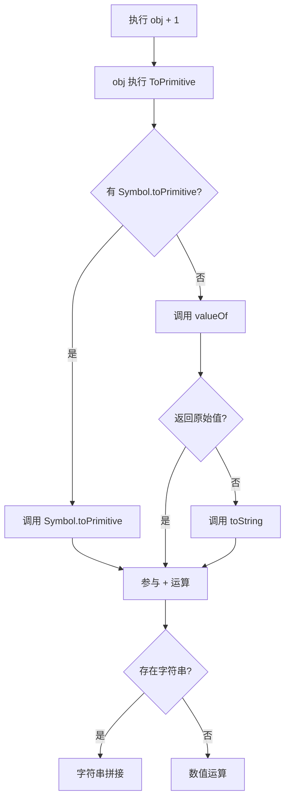

### 1.4 高频面试题

**Q：JS 有哪些数据类型？**

标准回答：

> JS 有 7 种原始类型：`undefined`、`null`、`boolean`、`number`、`string`、`symbol`、`bigint`，以及引用类型 `object`。数组、函数、日期、正则、Map、Set 本质都属于对象，只是内部槽和原型不同。

**Q：为什么 `typeof null` 是 object？**

标准回答：

> 这是历史遗留问题。早期 JS 使用类型标签表示数据类型，null 的底层表示接近空指针，全 0 的标签被误判为对象。由于大量网页依赖这个行为，规范保留了它。

**Q：`==` 的转换规则是什么？**

标准回答：

> `==` 会进行抽象相等比较。`null` 只和 `undefined` 宽松相等；字符串和数字会转数字；布尔值先转数字；对象和原始值比较时，对象先转原始值。实际开发优先用 `===`，除非明确需要判断 `x == null`。

**Q：`Object.is` 和 `===` 区别？**

标准回答：

> 大多数情况一致，区别是 `Object.is(NaN, NaN)` 为 true，`Object.is(+0, -0)` 为 false。它更接近 SameValue 语义。

### 1.5 常见追问

**Q：为什么 `NaN !== NaN`？**

因为 `NaN` 表示一个无效数值结果，它可能来自不同的非法计算。IEEE 754 规定 NaN 与任何值比较都不相等，包括它自己。判断 NaN 应使用 `Number.isNaN`。

**Q：为什么引用类型比较的是地址？**

对象可能很大且可变，如果每次比较都递归比较所有属性，成本和语义都不可控。JS 默认比较引用，让“是否同一个对象”成为明确语义。

**Q：为什么 `[] == ![]` 是 true？**

`![]` 先转布尔，因为对象 truthy，所以 `![]` 是 false。然后 `[] == false`，false 转 0，数组转原始值为空字符串，空字符串转 0，所以结果为 true。

### 1.6 手写代码：类型判断

```javascript
function getType(value) {
  if (value === null) return "null";
  const type = typeof value;
  if (type !== "object" && type !== "function") return type;

  return Object.prototype.toString
    .call(value)
    .slice(8, -1)
    .toLowerCase();
}

console.log(getType([]));        // array
console.log(getType(new Date())); // date
console.log(getType(null));      // null
console.log(getType(1n));        // bigint
```

实现原理：

1. `typeof` 适合判断原始类型和函数。
2. `null` 需要单独处理。
3. `Object.prototype.toString` 读取对象内部 `[[Class]]` 标签，比 `instanceof` 更稳定。

### 1.7 实际项目场景

1. 接口字段判断：后端可能返回 `null`，前端变量未初始化是 `undefined`，业务中要区分“没有传”和“主动置空”。
2. 表单处理：空字符串、0、false 都可能是合法值，不能简单 `if (!value)`。
3. React props：对象引用变化会触发重新渲染，浅比较依赖引用稳定性。
4. 缓存 key：对象不能直接作为普通对象 key，应该使用 `Map` 或序列化策略。

---

## 2. 执行上下文、作用域/链、闭包与 this、词法环境、词法作用域

### 2.1 概念解释

执行上下文是 JS 代码运行时的**环境**。每进入一段可执行代码，例如全局代码、函数代码、模块代码，都会创建对应执行上下文。

执行上下文包含：

| 组成       | 含义                           |
| -------- | ---------------------------- |
| 变量环境     | `var`、函数声明等绑定                |
| 词法环境     | `let`、`const`、块级作用域绑定(暂时性死区) |
| 外部词法环境引用 | 指向外层作用域，形成作用域链               |
| this 绑定  | 当前执行上下文中的 this 值             |

作用域指变量的可访问范围

作用域链指变量的查找规则

闭包是**函数和其词法环境**的组合。通俗说：

> 一个函数即使在定义它的外层函数执行结束后，仍然可以访问外层函数里的变量，这种能力就是闭包。

`this` 不是词法作用域变量，它的值取决于函数调用方式。箭头函数没有自己的 `this`，会捕获外层词法环境中的 `this`。

**词法环境和词法作用域：**

词法作用域是一套规则，指**变量的访问权限**在书写的时候就确立了

词法环境可以理解为一种映射结构，里面存储的是变量的信息；例如：当JS遇到一个名叫X的变量，它会知道X的值
	包括**环境记录**和**外部词法环境引用**
	**环境记录**就是真正存储变量名与值的地方
	**外部词法环境**引用意思是指向另一个**词法环境**，形成作用域链；这就是**作用域链的本质**

``` js
function main() {
	let a = 1;
	{
		let b = 2
	}
}
main()

-----
/*
当执行函数时，会为该函数创建一个执行上下文
执行时，遇到let定义的a，为该变量创建一个词法环境，这个词法环境在当前函数的执行上下文中
继续执行进入块级作用域，遇到let定义的b，此时将a的词法环境从该函数的执行上下文移出，将b的词法环境放到当前函数的执行上下文中
注意：同时b的词法环境中的 外部环境引用 部分指向a的词法环境

当b执行完之后，当前函数的执行上下文会将b的词法环境移出，同时将a的词法环境移入
*/

```

### 2.2 底层原理

JS 执行函数时会创建函数执行上下文并压入调用栈，后进先出。函数执行完，上下文通常会弹出。但如果内部函数**被外部引用**(例如将内部函数赋值给全局变量)，内部函数的 `[[Environment]]` 仍然指向定义时的词法环境，**相关变量仍然可达**，所以不会被垃圾回收。

> 函数身上有个属性 fn.[[Environment]]，里面存了一个地址，指向该函数定义时所处的那个词法环境

这就是闭包不会被回收的原因：不是“闭包特殊”，而是“还有引用链能访问到变量”。垃圾回收**基于可达性**，只要变量环境仍可从根对象访问，它就不能释放。

变量提升：

1. `var` 声明会被提升并初始化为 `undefined`。
	var只有函数作用域或全局作用域，创建阶段初始化为 undefined；全局 var 会成为 window 的属性。
2. 函数声明会整体提升。
3. `let` / `const` 也会被提升，但从**作用域开始**到**声明语句执行前**这段区域叫**暂时性死区**，不能访问。

暂时性死区的设计目的：

1. 避免变量在声明前被误用。
2. 让块级作用域更可靠。
3. 为 `const` 的不可重复赋值语义提供基础。

`this` 绑定规则：

| 调用方式                   | this 指向                      |
| ---------------------- | ---------------------------- |
| 默认调用 `fn()`            | 非严格模式为全局对象，严格模式为 `undefined` |
| 隐式调用 `obj.fn()`        | `obj`                        |
| 显式调用 `call/apply/bind` | 指定对象                         |
| 构造调用 `new Fn()`        | 新创建的实例                       |
| 箭头函数                   | 外层词法 this                    |

### 2.3 执行流程

```javascript
function outer() {
  let count = 0;
  return function inner() {
    count++;
    return count;
  };
}

const fn = outer();
fn();
fn();
```

执行过程：

1. 全局上下文创建，声明 `outer` 和 `fn`。
2. 调用 `outer`，创建 `outer` 执行上下文，此时会将 `outer` 压入调用栈中 。
3. 创建词法环境，绑定 `count = 0`。
4. 创建 `inner` 函数，`inner.[[Environment]]` 指向 `outer` 的词法环境。
5. `outer` 返回 `inner`，`outer` 执行上下文弹出。
6. 因为全局变量 `fn` 引用了 `inner`，`inner` 又引用 `outer` 的词法环境，所以 `count` 仍可达。
7. 每次调用 `fn`，都会通过作用域链找到同一个 `count`。

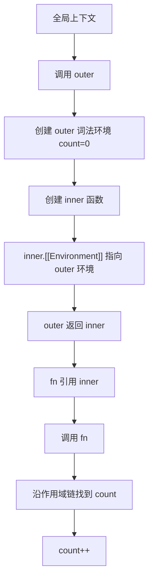

### 2.4 高频面试题

**Q：闭包是什么？**

标准回答：

> 闭包是函数和其定义时词法环境的组合。当内部函数被外部引用时，即使外部函数已经执行完，内部函数仍能通过作用域链访问外部函数中的变量。它常用于封装私有变量、缓存状态、函数柯里化和异步回调。

**Q：闭包为什么不会被回收？**

标准回答：

> JS 垃圾回收基于可达性。外部变量引用了内部函数，内部函数的 `[[Environment]]` 又引用外层词法环境，所以这条引用链仍然可达，相关变量不会被释放。只有当内部函数也不可达时，闭包环境才会被回收。

**Q：箭头函数为什么没有 this？**

标准回答：

> 箭头函数没有自己的 `this`、`arguments`、`super`、`new.target` 绑定。它的 `this` 在定义时从外层词法环境捕获，因此不能被 `call/apply/bind` 改变，也不能作为构造函数。

**Q：变量提升和暂时性死区是什么？**

标准回答：

> `var` 声明会提升并初始化为 `undefined`，所以声明前访问得到 undefined。`let/const` 也会在词法环境中创建绑定，但声明执行前不能访问，这段区域叫暂时性死区。它能避免变量声明前被误用。

### 2.5 常见追问

**Q：作用域和执行上下文有什么区别？**

作用域是静态概念，代码定义时就确定了变量可访问范围；执行上下文是动态概念，代码运行时创建，包含变量环境、词法环境、this 等运行状态。

**Q：闭包一定会造成内存泄漏吗？**

不会。闭包只是让变量保持可达。只有不再需要的闭包仍被引用，导致大对象或 DOM 节点无法释放，才是内存泄漏。

**Q：`bind` 后还能被 `call` 改 this 吗？**

不能。`bind` 返回的是绑定函数，内部保存了固定的 `thisArg` 和预置参数，后续 `call/apply` 无法覆盖。

### 2.6 手写代码：call / apply / bind

``` js
Function.prototype.call(thisArg, arg1, arg2, arg3...)
```

call 改变函数 this 指向，可以逐个传入参数；相当于**立即调用**该函数执行
	如果不传参数/传入为null，this指向全局对象

``` js
object.fn = fn
object.fn()
delete object.fn
```

call 的本质是**临时把函数挂载到对象上执行**，再删除
	**注意：** 处理null情况、处理基本数据类型、处理属性名冲突

```javascript
Function.prototype.myCall = function (context, ...args) {
  if (typeof this !== "function") {
    throw new TypeError("myCall must be called on a function");
  }

  // globalThis 指向当前运行环境的全局对象
  // Object(context) 处理基本数据类型,因为基本数据类型不可能持有属性，需要先变为 Number 类似，然后挂载属性
  // 如果是对象，不会再创建新对象，直接返回对原对象的引用
  context = context == null ? globalThis : Object(context);
  
  // 调用Symbol处理属性名一致的冲突，防止覆盖原有属性名
  const key = Symbol("fn");
  context[key] = this;

  const result = context[key](...args);
  delete context[key];
  return result;
};
```

为什么 `call` 不需要判断参数为空情况？
	因为 `call` 采用的是剩余参数形式，如果传入参数为空，那么 `args` 是一个`[]数组`，对空数组的展开不会报错

``` js
Function.prototype.apply(thisArg, argsArray)
```

`apply` 与 `call` 处理方法基本相同，不同点在于**对参数的处理**，`apply` 传递参数要求传递一个**数组**

``` js
Function.prototype.myApply = function (context, args) {
  if (typeof this !== "function") {
    throw new TypeError("myApply must be called on a function");
  }

  context = context == null ? globalThis : Object(context);
  const key = Symbol("fn");
  context[key] = this;

  const result = args == null ? context[key]() : context[key](...args);
  delete context[key];
  return result;
};
```

如果不对参数进行判断，那么当不传参数时，`args` 是 `undefined`，对 `undefined` 展开不合法
	
> **注意：** `bind` 修改函数 `this` 指向，但是返回一个修改了this指向的**新函数**

``` js
const obj = {}
function Person(name) {
  this.name = name
}
const BindPerson =
  Person.bind(obj)
const p = new BindPerson("Tom")

// Tom
console.log(p.name)
// undefined
console.log(obj.name)

/*
按照常理来说，BindPerson函数的this指向应该指向obj
但是使用new调用BindPerson函数后，this指向函数创建的实例对象
*/
```

> `bind` 特殊点在于使用 `new` 操作符创建实例后，`this` 指向新实例，而不是传入的对象，**bind 绑定的 this 遇到 new 会失效**

``` js
// 普通调用时,Bn 的 this 指向全局
const Bn = test.myBind({})
Bn()
// new 调用时,this 指向 新创建的实例对象
const Bn = test.myBind({})
const p = new Bn()  // 实际上是 new boundFn
// 相当于 p.__proto__ === boundFn.prototype
```

> `new BindPerson()` 创建出来的对象本质上还是 `Person` 的实例

``` js
Function.prototype.myBind = function (context, ...boundArgs) {
  if (typeof this !== "function") {
    throw new TypeError("myBind must be called on a function");
  }

  const targetFn = this;

  // 内部返回的是预设好参数的函数，不能在被更改this指向了
  function boundFn(...args) {
	// 判断是否为new调用，instanceof 的本质是判断函数是否出现在对象的原型链上
    const isNewCall = this instanceof boundFn;
    // 普通调用，this指向context；new 调用this指向实例对象
    const finalThis = isNewCall ? this : context;
    return targetFn.apply(finalThis, boundArgs.concat(args));
  }

  if (targetFn.prototype) {
    // Object.create 创建一个新对象，将新对象的proto指向targetFn.prototype
    boundFn.prototype = Object.create(targetFn.prototype);
  }

  return boundFn;
};
```

实现原理：

1. `call/apply` 的核心是把函数临时挂到对象上，通过 `obj.fn()` 触发隐式 this 绑定。
2. 使用 `Symbol` 避免属性名冲突。
3. `bind` 返回新函数，保存原函数、this 和预置参数。
4. `bind` 需要兼容 `new`，构造调用时 this 应指向新实例。

```
bind总结：
调用bind返回的是改变this指向的新函数，新函数内部还是执行的是原有函数逻辑，只不过this指向变了
bind还支持函数柯里化，这其实用到了闭包
如果用new调用返回的函数，那么this应该指向实例对象而不是传入的参数
注意：new创建出来的实例对象本质上还是原有函数的实例对象，要改变原型指向
```
### 2.7 实际项目场景

1. React 闭包陷阱：事件处理器或定时器捕获旧 state，导致读取到过期值。

先看：
``` js
function Counter() {
  const [count, setCount] = React.useState(0);

  console.log("render", count);

  return (
    <button onClick={() => setCount(count + 1)}>
      {count}
    </button>
  );
}
/*
每次调用set函数时，state更新，Counter函数重新执行，创建一个新的执行上下文
因此count并不是在原来的基础上加一，而是销毁原来变量重新赋值为2，以此类推
*/
```

再看：
```javascript
function Counter() {
  const [count, setCount] = React.useState(0);

  React.useEffect(() => {
    const timer = setInterval(() => {
      // 如果依赖数组为空，这里会一直捕获初始 count
      setCount(count + 1);
    }, 1000);

    return () => clearInterval(timer);
  }, []);
}
/*
在这段代码中，setInterval回调函数捕获的值是count为0
这源于该函数创建时的词法环境，在创建时的词法环境中count的值始终为0

因为useEffect依赖为空时，该定时器只会被创建一次，这个定时器的回调函数引用的外部词法环境中count值始终为0
*/
```

修复方式：

```javascript
setCount(prev => prev + 1);

/*
因为函数更新React会参与执行
会在内部将上一次的旧状态注入prev中
*/
```

2. Node.js 中闭包保存连接、缓存、配置，能减少全局变量污染，但要避免闭包引用超大对象。
3. 防抖、节流、缓存函数都依赖闭包保存状态。

---

## 3. 原型、原型链、new、instanceof、class 与继承

### 3.1 概念解释

**只有函数**（严格来说是构造函数）才拥有 `prototype` 属性。它指向一个对象，这个对象包含了所有实例共享的属性和方法。

**所有对象**（包括函数）都有一个 `__proto__` 属性。它指向创建该对象的构造函数的 `prototype`。

> 注意：在生产环境中建议使用 `Object.getPrototypeOf()` 获取，`__proto__` 主要是浏览器厂商实现的非标准属性，但它对理解概念非常有帮助。

**原型链？**

当访问一个对象的属性时，JavaScript 引擎会执行以下搜索算法：

1. 先在**对象自身**找。找到了，返回。
    
2. 找不到，就去对象的 `__proto__`（即**构造函数的 prototype**）里找。
    
3. 如果还找不到，就去**原型的原型**里找（比如 `Object.prototype`）。
    
4. 一直找到 `null` 为止。
    

这种由 `__proto__` 一层层连接起来的链路，就叫**原型链**。

---
构造函数、原型、实例关系：

```javascript
function Person(name) {
  this.name = name;
}

Person.prototype.say = function () {
  return this.name;
};

const p = new Person("Ada");
```

| 对象 | 关系 |
|---|---|
| `Person.prototype` | 实例的原型对象 |
| `p.__proto__` | 指向 `Person.prototype` |
| `Person.prototype.constructor` | 指回 `Person` |

`class` 是原型继承的语法糖。它提供更接近传统面向对象语言的写法，但底层仍然是函数、原型和原型链。

### 3.2 底层原理

`new` 操作符做了四件事：

1. 创建一个新对象。
2. 将新对象的 `[[Prototype]]` 指向构造函数的 `prototype`。
3. 执行构造函数，并把 `this` 绑定到新对象。
4. 如果构造函数返回对象，则返回该对象；否则返回新对象。

`instanceof` 的本质：

> 判断构造函数的 `prototype` 是否出现在对象的原型链上。

`Object.create(proto)` 的本质：

> 创建一个新对象，并把它的原型直接设置为 `proto`。它不会执行构造函数。

为什么 class 本质还是函数：

1. `typeof class A {} === "function"`。
2. class 方法定义在 `ClassName.prototype` 上。
3. `extends` 通过原型链连接子类和父类。
4. class 只是限制了直接调用、方法不可枚举、默认严格模式等行为。

### 3.3 执行流程

`new Person("Ada")` 执行过程：

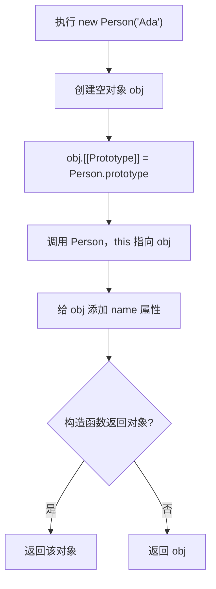

属性查找流程：

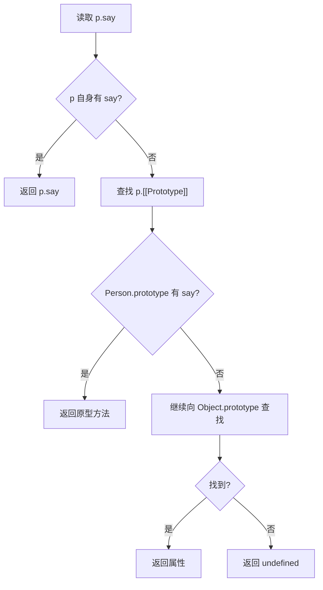

### 3.4 高频面试题

**Q：原型链是什么？**

标准回答：

> 每个对象都有内部原型 `[[Prototype]]`，读取属性时会先查自身，找不到就沿 `[[Prototype]]` 一层层向上查找，直到 `null`。这条查找链就是原型链。

**Q：new 操作符做了什么？**

标准回答：

> 创建新对象，关联构造函数原型，绑定 this 执行构造函数，根据构造函数返回值决定返回结果。

**Q：class 和构造函数有什么关系？**

标准回答：

> class 是构造函数和原型继承的语法糖。类方法仍然定义在原型上，实例通过原型链共享方法。但 class 默认严格模式，不能不使用 new 调用，方法不可枚举，并且有 extends/super 等语义约束。

### 3.5 常见追问

**Q：为什么方法要放在 prototype 上？**

如果方法写在构造函数内部，每个实例都会创建一份函数，浪费内存。放在原型上，所有实例共享同一个方法。

**Q：为什么箭头函数不适合作为原型方法？**

箭头函数没有自己的 this，定义时捕获外层 this。原型方法通常需要在调用时让 this 指向实例，所以不适合使用箭头函数。

**Q：为什么 Proxy 无法完全 polyfill？**

Proxy 能拦截对象底层内部方法，例如 `[[Get]]`、`[[Set]]`、`[[HasProperty]]`，这是语言层面的元编程能力。旧环境没有这些内部钩子，无法用普通 JS 完整模拟。

### 3.6 手写代码：new / instanceof / Object.create

手写 `new`  
	1. 创建一个新对象
	2. 新对象的 proto 指向函数的 prototype
	3. 执行该函数，将 this 指向新对象
	4. 如果构造函数返回的是对象，则直接返回该对象
	5. 函数本质也是对象，如果构造函数返回函数，那就返回该函数

```javascript
function myNew(Constructor, ...args) {
  if (typeof Constructor !== "function") {
    throw new TypeError("Constructor must be a function");
  }

  const obj = Object.create(Constructor.prototype);
  const result = Constructor.apply(obj, args);

  const isObject = result !== null && typeof result === "object";
  // 判断一下是不是函数，因为规定是函数那么就返回函数
  const isFunction = typeof result === "function";
  return isObject || isFunction ? result : obj;
}
```

手写 `instanceof`
	1. 本质就是判断函数是否出现在对象的 **原型链** 上
	2. 处理 基本数据类型 和 null 情况

``` js
function myInstanceof(value, Constructor) {
  // 如果为 null 或 (value 不是对象和 value 不是函数)
  // 也就是value 是没有原型链的那几种数据类型
  if (value === null || (typeof value !== "object" && typeof value !== "function")) {
    return false;
  }

  let proto = Object.getPrototypeOf(value);
  const prototype = Constructor.prototype;

  while (proto) {
    if (proto === prototype) return true;
    proto = Object.getPrototypeOf(proto);
  }

  return false;
}
```

手写 `Object.create`
	1. 创建一个新对象，将新对象的 `proto` 指向 传入的对象

``` js
function myCreate(proto) {
  if (proto !== null && typeof proto !== "object") {
    throw new TypeError("Object prototype may only be an Object or null");
  }

  function F() {}
  F.prototype = proto;
  return new F();
}
```

### 3.7 实际项目场景

1. React 类组件本质依赖 class 继承，实例方法和生命周期方法都在原型链上。
2. SDK 设计中常用原型方法共享行为，减少实例内存开销。
3. `instanceof` 在多 iframe、多 realm 环境会失效，因为构造函数来自不同全局对象。更稳的判断方式是 `Object.prototype.toString` 或鸭子类型。

---

## 4. ES6+ 核心能力：Proxy、Map/Set、Symbol、Iterator、Generator、Reflect

### 4.1 概念解释

ES6+ 引入了一批偏“语言基础设施”的能力：

| 能力          | 解决什么问题                      |
| ----------- | --------------------------- |
| `Symbol`    | 创建唯一属性 key，定义语言内置协议         |
| `Iterator`  | 统一遍历协议                      |
| `Generator` | 可暂停、可恢复的函数                  |
| `Reflect`   | 把对象底层操作函数化，和 Proxy trap 对齐  |
| `Proxy`     | 拦截对象基本操作                    |
| `Map`       | 任意类型 key 的键值集合              |
| `WeakMap`   | 弱引用 key 的键值集合               |
| `Set`       | 唯一值集合，意思是值不会重复，可以用于**数组去重** |
| `WeakSet`   | 弱引用对象集合                     |

`Iterator` 是一种协议，只要对象实现了 `[Symbol.iterator]` 方法，并返回带有 `next()` 的迭代器，就可以被 `for...of`、展开运算符、数组解构消费。

### 4.2 底层原理

`Symbol` 的设计目标是避免属性名冲突，并作为语言内置协议入口。例如：

1. `Symbol.iterator` 控制对象如何被遍历。
2. `Symbol.toPrimitive` 控制对象转原始值。
3. `Symbol.toStringTag` 控制 `Object.prototype.toString` 标签。

`Generator` 调用后不会立即执行函数体，而是返回一个迭代器对象。每次调用 `next()`，函数从上次暂停的 `yield` 位置继续执行。

`Proxy` 拦截的是对象内部操作，例如读取属性、设置属性、判断属性是否存在、函数调用、构造调用等。`Reflect` 提供对应默认行为，便于在拦截后继续执行原语义。

``` js
const proxy = new Proxy(obj, {
  get(target, key) {
    return Reflect.get(target, key);
  }
});
// Reflect.get(target, key) 等价于
target[key]
```

WeakMap 为什么不会造成内存泄漏：

> WeakMap 的 key 是弱引用。如果 key 对象除了 WeakMap 之外没有其他强引用，垃圾回收可以回收这个 key 以及对应 value。WeakMap 不提供遍历能力，因为如果可遍历，就会暴露 GC 的不确定性。

WeakMap key 必须是对象的原因：

> 弱引用依赖对象的可达性。原始值没有引用身份，不能作为弱引用目标。

### 4.3 执行流程

`for...of` 遍历过程：

```javascript
const list = [1, 2, 3];
for (const item of list) {
  console.log(item);
}
```

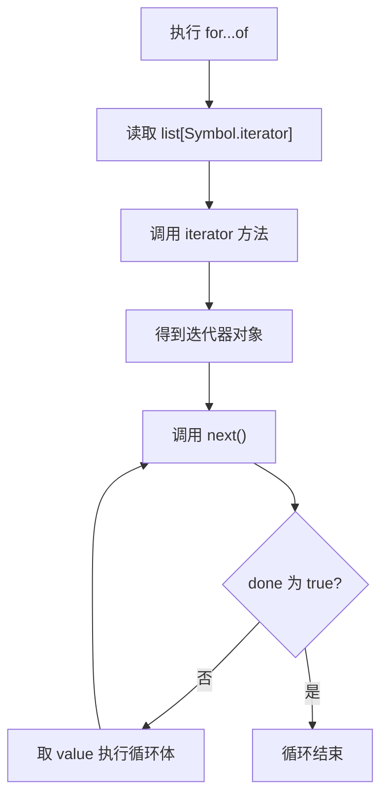

Proxy 属性读取过程：

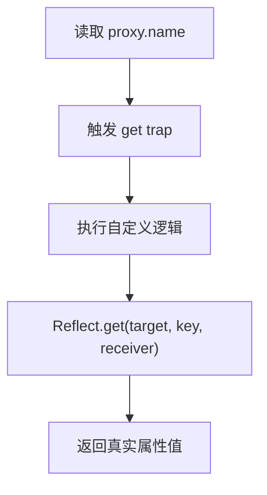

### 4.4 高频面试题

**Q：Iterator 是什么？**

标准回答：

> Iterator 是 JS 的统一遍历协议。一个对象只要实现 `[Symbol.iterator]` 方法，并返回具有 `next()` 的迭代器，就能被 `for...of`、解构、扩展运算符消费。

**Q：Generator 有什么用？**

标准回答：

> Generator 是可暂停、可恢复的函数。它可以生成迭代器，也可以把异步流程写成同步风格。早期 `co` 库就是通过 Generator + Promise 实现类似 async/await 的流程控制。

**Q：Map 和 Object 的区别？**

标准回答：

> Map 的 key 可以是任意类型，保持插入顺序，天然可迭代，适合频繁增删键值。Object 的 key 主要是字符串或 Symbol，更多用于描述结构化数据。

**Q：WeakMap 为什么适合做私有数据？**

标准回答：

> WeakMap 的 key 是对象且弱引用，不影响对象回收。可以用实例对象作为 key，把私有状态放在 WeakMap 中，外部无法直接枚举或访问。

### 4.5 常见追问

**Q：为什么 WeakMap 不可遍历？**

因为 WeakMap 的 key 随时可能被 GC 回收。如果允许遍历，就必须暴露 key 集合，而这会让 GC 行为变得可观察，破坏弱引用语义。

**Q：Reflect 有什么意义？**

Reflect 把对象内部操作函数化，并且与 Proxy trap 一一对应。它让拦截器中调用默认行为更清晰，也能返回布尔值表示操作是否成功。

**Q：Generator 和 async/await 的关系？**

async/await 可以看作 Generator + Promise 自动执行器的语法级封装。不同的是 async 函数天然返回 Promise，await 后面的恢复由引擎调度到微任务中。

### 4.6 手写代码：Iterator 与 Generator 自动执行器

```javascript
function makeRange(start, end) {
  return {
    [Symbol.iterator]() {
      let current = start;

      return {
        next() {
          if (current <= end) {
            return { value: current++, done: false };
          }
          return { value: undefined, done: true };
        }
      };
    }
  };
}

for (const num of makeRange(1, 3)) {
  console.log(num);
}
```

```javascript
function run(generatorFn) {
  const iterator = generatorFn();

  function step(method, arg) {
    let result;

    try {
      result = iterator[method](arg);
    } catch (error) {
      return Promise.reject(error);
    }

    if (result.done) {
      return Promise.resolve(result.value);
    }

    return Promise.resolve(result.value).then(
      value => step("next", value),
      reason => step("throw", reason)
    );
  }

  return step("next");
}
```

实现原理：

1. Generator 每次 `next` 返回 `{ value, done }`。
2. 如果 `value` 是 Promise，等待它完成。
3. 成功后把结果传回 Generator。
4. 失败后用 `throw` 把错误抛回 Generator 内部。

### 4.7 实际项目场景

1. Vue 3 响应式核心使用 Proxy 拦截 `get/set`，实现依赖收集和触发更新。
2. Babel、Webpack 插件系统中常使用 Map 管理模块依赖关系。
3. WeakMap 适合存储 DOM 节点对应的元信息，节点移除后不阻止 GC。
4. Iterator 让自定义数据结构可以被 `for...of` 和扩展运算符消费。

---

## 5. Promise、async/await 与异步控制

### 5.1 概念解释

Promise 是**异步操作的状态容器**，用来表示一个现在可能还没有结果、未来会完成或失败的值。

Promise 有三种状态：

| 状态 | 含义 | 是否可变 |
|---|---|---|
| pending | 进行中 | 可以变为 fulfilled/rejected |
| fulfilled | 已成功 | 不可再变 |
| rejected | 已失败 | 不可再变 |

Promise 解决了回调地狱的两个核心问题：

1. 把**嵌套回调**改成**链式调用**。
2. 把错误通过 rejected 状态统一冒泡也就是 catch 统一处理，不用每层 if(error) 处理

> 什么是回调地狱？

后续请求 用到了 前一个请求 的响应。

因为请求是异步的，必须等待前一个请求响应后才知道结果

``` js
getUser((user) => {
  getOrder(user.id, (order) => {
    getLogistics(order.id, (logistics) => {
      console.log(logistics);
    });
  });
});
```

---

async/await 是 Promise 的语法糖。`async` 函数总是返回 Promise，`await` 会暂停 async 函数后续代码，把后续执行放到微任务中恢复。

### 5.2 底层原理

Promise 能链式调用的原因：

> `then` 方法总是返回一个新的 Promise。回调返回普通值，新 Promise resolve 该值；回调返回 Promise，新 Promise 会**采用它的状态**；回调抛错，新 Promise reject 该错误。

``` js
const p1 = Promise.resolve(1);

const p2 = p1.then((value) => {
  return Promise.resolve(value + 1);
});

p2.then(console.log);
// 返回 2
// 并不是Promise<Promise<2>>，因为p2采用了新回调的状态，p2就相当于新回调
```

Promise 状态一旦确定不可变，是为了保证异步结果的确定性。否则一个异步任务可能先成功后失败，调用方无法建立可靠逻辑。

`await expr` 的本质：

```javascript
Promise.resolve(expr).then(value => {
  // 恢复 async 函数后续执行
});
```

所以：

1. `await` 后面不是 Promise 也会被包装成 Promise。
2. `await` 之后的代码进入微任务。
3. async 函数中抛出的错误会转成返回 Promise 的 rejected。

### 5.3 执行流程

不要想的太复杂，async 只是一个语法糖，标记该函数为异步函数

被 async 标记的函数跟函数一样，被调用时会立即执行

但是函数执行中遇到 await 就会将后续代码放入微任务队列中

```javascript
async function main() {
  console.log(1);
  await Promise.resolve();
  console.log(2);
}

console.log(3);
main();
console.log(4);
```

执行顺序：

1. 打印 3。
2. 调用 main，打印 1。
3. 遇到 await，main 暂停，后续 `console.log(2)` 放入微任务。
4. 回到全局，打印 4。
5. 当前宏任务执行完，清空微任务，打印 2。

结果：`3 1 4 2`。

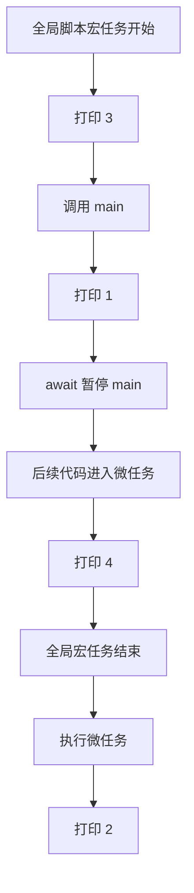

### 5.4 高频面试题

**Q：Promise 为什么解决回调地狱？**

标准回答：

> Promise 把异步结果抽象为状态机，通过 `then` 返回新 Promise 支持链式调用，避免多层嵌套。错误可以通过 rejected 状态向后传递，由统一的 `catch` 处理。

**Q：Promise.all / allSettled / race / any 区别？**

| API                  | 成功条件             | 失败条件             | 典型场景       |
| -------------------- | ---------------- | ---------------- | ---------- |
| `Promise.all`        | 全部 fulfilled     | 任意一个 rejected    | 多个请求都成功才继续 |
| `Promise.allSettled` | 等全部 settled      | 不会整体 reject      | 批量任务统计结果   |
| `Promise.race`       | 第一个 settled 决定结果 | 第一个 settled 决定结果 | 超时控制       |
| `Promise.any`        | 任意一个 fulfilled   | 全部 rejected      | 多源容灾       |

`Promise.race()` 多个 Promise 同时执行，谁最先确定状态（fulfilled 或 rejected），就采用谁的结果，**忽略后续 Promise 执行结果**。

**Q：async/await 为什么本质是 Promise？**

标准回答：

> async 函数返回值会被包装成 Promise，函数内部抛错会变成 rejected。await 会把后续逻辑注册为 Promise 的 then 回调，因此 async/await 是 Promise 的语法级封装。

### 5.5 常见追问

**Q：then 的第二个参数和 catch 有什么区别？**

`then(onFulfilled, onRejected)` 只能捕获前一个 Promise 的 rejection，捕获不到 `onFulfilled` 内部新抛出的错误。`catch` 放在链后面，可以捕获前面链路传下来的错误。

**Q：Promise 构造函数里的代码是同步还是异步？**

同步执行。只有 `then/catch/finally` 回调进入微任务。

**Q：await 会阻塞线程吗？**

不会。await 只暂停 async 函数的后续执行，不阻塞 JS 主线程，外层同步代码会继续运行。

### 5.6 手写代码：Promise 与组合 API

根据调用手写Promise
	1. 基本的框架、结构
	2. then方法
	3. this指向问题
	4. throw new Error问题
	5. then 回调是微任务
	6. reject、resolve执行时机
	7. 链式调用
	8. 成功的队列、失败的队列

简化版 Promise：

``` js
class myPromise {
    constructor(execute) {
        this.state = 'pending'
        this.value = undefined
        this.result = undefined
        this.onFulfilledCallback = []
        this.onRejectedCallback = []
  
        const resolve = value => {
            if (this.state !== 'pending') return

            queueMicrotask(() => {
                this.state = 'fulfilled'
                this.value = value
                this.onFulfilledCallback.forEach(fn => fn())
            })
        }

        const reject = result => {
            if (this.state !== 'pending') return
  
            queueMicrotask(() => {
                this.state = 'rejected'
                this.result = result
                this.onRejectedCallback.forEach(fn => fn())
            })
        }

        try {
            execute(resolve, reject)
        } catch (error) {
            reject(error)
        }
    }

    then(onFulfilled, onRejected) {
        return new myPromise((reject, resolve) => {
            onFulfilled = typeof onFulfilled === 'function' ? onFulfilled : value => value
            onRejected = typeof onRejected === 'function' ? onRejected : result => result
  
            if (this.state === 'fulfilled') {
                queueMicrotask(() => {
                    onFulfilled(this.value)
                })
            } else if (this.state === 'rejected') {
                queueMicrotask(() => {
                    onRejected(this.result)
                })
            } else {
                this.onFulfilledCallback.push(onFulfilled)
                this.onRejectedCallback.push(onRejected)
            }
        })
    }
}
```


看不懂版本Promise：

```javascript
class MyPromise {
  constructor(executor) {
    this.state = "pending";
    this.value = undefined;
    this.reason = undefined;
    this.onFulfilledCallbacks = [];
    this.onRejectedCallbacks = [];

	// 注意 this 指向问题
    const resolve = value => {
      // 只有当state为pending才可以触发
      if (this.state !== "pending") return;
	  // 为什么推入微任务队列？
      queueMicrotask(() => {
        if (this.state !== "pending") return;
        this.state = "fulfilled";
        this.value = value;
        this.onFulfilledCallbacks.forEach(fn => fn());
      });
    };

    const reject = reason => {
      if (this.state !== "pending") return;

      queueMicrotask(() => {
        if (this.state !== "pending") return;
        this.state = "rejected";
        this.reason = reason;
        this.onRejectedCallbacks.forEach(fn => fn());
      });
    };

	// 处理异常
	// 规定throw new Error错误被reject消费
    try {
      executor(resolve, reject);
    } catch (error) {
      reject(error);
    }
  }

  // then 方法返回一个新的 Promise
  // 对于参数处理，如果是函数则调用该函数；如果不是函数则转为函数
  then(onFulfilled, onRejected) {
    onFulfilled = typeof onFulfilled === "function" ? onFulfilled : value => value;
    onRejected = typeof onRejected === "function" ? onRejected : reason => { throw reason };

	// 返回新的Promise
    return new MyPromise((resolve, reject) => {
      const handleFulfilled = () => {
        try {
          const result = onFulfilled(this.value);
          resolvePromise(result, resolve, reject);
        } catch (error) {
          reject(error);
        }
      };

      const handleRejected = () => {
        try {
          const result = onRejected(this.reason);
          resolvePromise(result, resolve, reject);
        } catch (error) {
          reject(error);
        }
      };

      if (this.state === "fulfilled") {
        queueMicrotask(handleFulfilled);
      } else if (this.state === "rejected") {
        queueMicrotask(handleRejected);
      } else {
        this.onFulfilledCallbacks.push(handleFulfilled);
        this.onRejectedCallbacks.push(handleRejected);
      }
    });
  }

  catch(onRejected) {
    return this.then(null, onRejected);
  }
}

// 决定 then() 返回的新 Promise 应该变成什么状态 ???
function resolvePromise(result, resolve, reject) {
  if (result instanceof MyPromise) {
    result.then(resolve, reject);
    return;
  }
  resolve(result);
}
/*
queueMicrotask() 一个JS原生的API，接收一个callback function，将 callback function 放入微任务队列
*/
```

> 手写 `Promise.all`：

特点：

1. 接收一个可迭代对象（数组、Set 等）
2. 所有 Promise 都成功 → 返回结果数组
3. 任何一个失败 → 立即 reject
4. 返回结果顺序必须和输入顺序一致
5. 空数组直接返回 `[]`
6. promiseAll 返回一个 Promise

```javascript
function promiseAll(iterable) {
  return new Promise((resolve, reject) => {
    // 浅拷贝数组
    const list = Array.from(iterable);
    const results = [];
    let completed = 0;

    if (list.length === 0) {
      resolve([]);
      return;
    }

    list.forEach((item, index) => {
	  // Promise 包装
	  // 因为可能传递的不是一个 promise
      Promise.resolve(item).then( // then 会监听 promise 的状态，从而执行哪一个回调
        value => {
          results[index] = value;
          completed++;
          if (completed === list.length) {
            resolve(results);
          }
        },
        reject // 调用的是外层 Promise 的 reject
      );
    });
  });
}
```

手写 Promise.reac 

``` js
function promiseRace(promises) {
	return new Promise((resolve,reject) => {
	})
}
```

> 手写并发控制器：

并发控制器，就是**限制同一时刻正在进行的异步任务数量**

```javascript
function limitConcurrency(tasks, limit) {
  return new Promise((resolve, reject) => {
    // 结果数组
    const results = [];
    // 下一个执行
    let nextIndex = 0;
    // 当前执行数量
    let running = 0;
    // 完成的数量
    let finished = 0;

    function runNext() {
      // 当完成的数量 等于 栈的长度
      if (finished === tasks.length) {
        resolve(results);
        return;
      }
	  // 有任务还没启动 并且 还没有执行完
	  // 每次执行完开启新的请求
      while (running < limit && nextIndex < tasks.length) {
        const current = nextIndex++;
        running++;

        Promise.resolve()
          .then(() => tasks[current]())
          .then(value => {
            results[current] = value;
            running--;
            finished++;
            runNext();
          }, reject);
      }
    }

    runNext();
  });
}
```

代码还缺少了失败策略，这个按需求来，一种是all，一种是allSettled

``` js
// 此版本单独处理状态，也就是 allSettled 版本
function limitConcurrency(tasks, limit) {
  return new Promise(resolve => {
    const results = [];
    let nextIndex = 0;
    let running = 0;
    let finished = 0;

    function runNext() {
      if (finished === tasks.length) {
        resolve(results);
        return;
      }

      while (running < limit && nextIndex < tasks.length) {
        const current = nextIndex++;
        running++;

        Promise.resolve()
          .then(() => tasks[current]())
          .then(
            value => {
              results[current] = {
                status: "fulfilled",
                value
              };
            },
            // 处理失败状态
            reason => {
              results[current] = {
                status: "rejected",
                reason
              };
            }
          )
          .finally(() => {
            running--;
            finished++;
            runNext();
          });
      }
    }

    runNext();
  });
} 
```
### 5.7 实际项目场景

1. 首页多个接口必须全部成功：使用 `Promise.all`。
2. 埋点、推荐、非核心配置接口允许失败：使用 `Promise.allSettled`。
3. 请求超时：`Promise.race([fetchTask, timeoutTask])`。
4. 多 CDN 获取同一资源：使用 `Promise.any`。
5. 批量上传文件：使用并发控制器，避免同时发起几百个请求压垮浏览器和服务端。
6. Next.js SSR：服务端渲染前需要等待数据 Promise 完成，错误要转换成可渲染的错误边界或状态码。

---

## 6. Event Loop、宏任务、微任务、浏览器与 Node.js 差异

是什么？规则是什么？任务产生？

### 6.1 概念解释

Event Loop 是浏览器协调 JS 运行的一种机制

基本规则：

1. 执行一个宏任务。
2. 清空所有微任务。
3. 浏览器可能进行渲染。
4. 取下一个宏任务继续执行。
5. 如果执行过程中遇到宏任务放入**宏任务队列**，遇到微任务放入**微任务队列**；注意：微任务执行中产生微任务会继续执行该微任务

JavaScript 主线程一次只能执行一个任务。Event Loop 用来协调**同步代码**、**异步回调**、**渲染**和 **I/O**。

浏览器中常见任务：

| 类型  | 示例                                                     |
| --- | ------------------------------------------------------ |
| 宏任务 | script、setTimeout、setInterval、MessageChannel、I/O、UI 事件 |
| 微任务 | Promise.then、queueMicrotask、MutationObserver           |

MessageChannel 是浏览器提供的一个 **创建两个通信端口（port）的 API**。常用于 Worker、iframe 通信以及 React Scheduler 等**任务调度**场景。

``` js
Promise.resolve().then(() => console.log("promise"));

channel.port2.postMessage(null);

setTimeout(() => console.log("timeout"));

console.log("sync");
/*
sync
promise
message
timeout
*/
```

queueMicrotask 将一个函数推入微任务队列中

MutationObserver 是浏览器提供的一个 **DOM 变化监听器**
	返回一个observer实例对象，第一个参数为监听的DOM，第二个为配置参数。例如：可以监听子元素增删、属性变化

### 6.2 底层原理

！**为什么需要微任务队列：**

> 微任务用于在当前同步代码结束后、浏览器渲染和下一个宏任务之前，尽快执行一些需要**保持状态一致性**的逻辑，可以理解为为当前同步任务执行**收尾操作**。例如 Promise 状态传递、MutationObserver DOM 变化通知。如果全部放进宏任务，状态更新会被延迟到下一轮事件循环，可能产生可见的不一致。

例如：React中的setState批量更新，是在微任务队列中统一执行的，也是在下次渲染前执行

为什么 0ms 的 `setTimeout` 不会立刻执行：

1. `setTimeout` 回调会进入定时器任务队列。
2. 当前**JS调用栈**必须先清空才能执行。
3. 当前宏任务结束后还要先清空微任务。
4. 浏览器还有最小延迟、嵌套定时器钳制和线程调度成本。

浏览器和 Node.js Event Loop 差异：

| 维度    | 浏览器                                     | Node.js                                 |
| ----- | --------------------------------------- | --------------------------------------- |
| 主要目标  | 协调 JS、用户事件、网络、渲染                        | 协调 JS、I/O、定时器、系统事件                      |
| 宏任务来源 | script、timer、UI 事件、网络                   | timers、poll、check、close callbacks       |
| 微任务   | Promise、queueMicrotask、MutationObserver | Promise、queueMicrotask、process.nextTick |
| 特殊点   | 每轮可能渲染                                  | `process.nextTick` 优先级高于 Promise 微任务    |

Node.js 事件循环阶段：

1. timers：执行 `setTimeout`、`setInterval` 到期回调。
2. pending callbacks：执行部分系统回调。
3. idle/prepare：内部使用。
4. poll：获取新的 I/O 事件，执行 I/O 回调。
5. check：执行 `setImmediate`。
6. close callbacks：执行关闭回调。

### 6.3 执行流程

经典题：

```javascript
console.log("script start");

setTimeout(() => {
  console.log("timeout");
}, 0);

Promise.resolve()
  .then(() => {
    console.log("promise1");
  })
  .then(() => {
    console.log("promise2");
  });

console.log("script end");
```

输出：

```text
script start
script end
promise1
promise2
timeout
```

流程图：

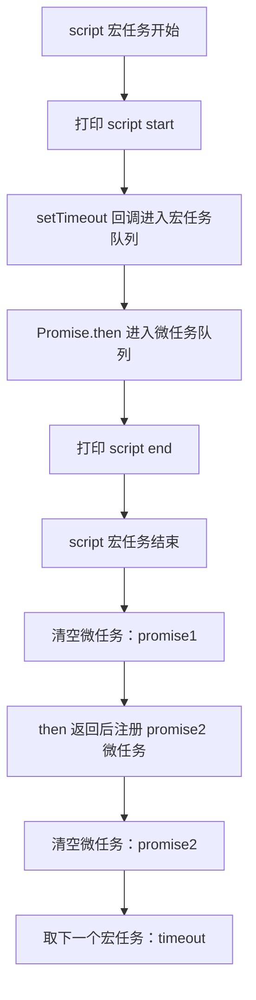

### 6.4 高频面试题

**Q：Event Loop 执行顺序是什么？**

标准回答：

> JS 先执行当前宏任务中的同步代码，遇到异步任务交给宿主环境。当前调用栈清空后，会清空微任务队列，然后浏览器可能渲染，再进入下一个宏任务。微任务包括 Promise.then、queueMicrotask 等，宏任务包括 script、setTimeout、事件回调等。

**Q：为什么微任务优先级更高？**

标准回答：

> 微任务用于在当前任务结束后立即完成**状态收敛**，例如 Promise 链式传值和 DOM 变更通知。它必须早于下一个宏任务和渲染，否则异步状态可能延迟到下一轮，造成逻辑不一致。

**Q：浏览器和 Node.js Event Loop 有什么区别？**

标准回答：

> 浏览器事件循环关注 JS 执行、用户事件、网络和渲染；Node.js 基于 libuv，有 timers、poll、check 等阶段。Node 还有 `process.nextTick` 队列，它优先于 Promise 微任务，过度使用可能饿死 I/O。

### 6.5 常见追问

**Q：微任务会饿死宏任务吗？**

会。如果微任务不断递归创建新的微任务，事件循环会一直清空微任务队列，导致宏任务、渲染和用户事件无法执行。

**Q：`setTimeout` 和 `requestAnimationFrame` 谁先执行？**

不固定，要看浏览器调度和刷新时机。`requestAnimationFrame` 通常在下一帧渲染前执行，适合动画；`setTimeout` 是定时器宏任务，不保证帧同步。

**Q：Node 中 `setImmediate` 和 `setTimeout(fn, 0)` 谁先？**

在主模块中不稳定，取决于进入事件循环时机；在 I/O 回调中通常 `setImmediate` 先执行，因为它在 check 阶段，而 timer 要等下一轮 timers 阶段。

### 6.6 手写代码：任务调度器

什么是任务调度器？

```
决定：
1. 哪个任务先执行
2. 哪个任务后执行
3. 同时执行几个任务
4. 什么时候执行
```

一次最多执行 limit 个异步任务 ，其余任务排队等待

```javascript
class Scheduler {
  constructor(limit) {
    this.limit = limit;
    this.running = 0;
    this.queue = [];
  }

  // task 为返回 Promise 的函数
  add(task) {
    return new Promise((resolve, reject) => {
      // resolve 和 reject 其实就是写好的程序，表示当前 promise 是成功还是失败时的调用
      this.queue.push({ task, resolve, reject });
      this.run();
    });
  }

  run() {
    while (this.running < this.limit && this.queue.length) {
      const { task, resolve, reject } = this.queue.shift();
      this.running++;

	  // Promise.resolve() 
      Promise.resolve()
        .then(task)
        .then(resolve, reject)
        .finally(() => {
          this.running--;
          this.run();
        });
    }
  }
}
```

为什么 `Promise.resolve()` ，直接调用 `task` 不行吗？

```
为什么 promise 状态变为 fulfilled 再调用？

统一处理 同步异常 和 异步异常

异步异常：
const task = () =>
  Promise.reject("boom");

如果传入：
scheduler.add(() => {  
	throw new Error("boom");  
});

调度器直接炸
```

### 6.7 实际项目场景

1. React 状态批处理依赖事件循环和调度机制，不同版本中同步事件、异步事件的批处理策略不同。
2. 大量 Promise 微任务可能阻塞渲染，导致页面卡顿。
3. Node.js 服务中 `process.nextTick` 滥用会让 I/O 回调迟迟得不到执行。
4. WebSocket 消息队列需要控制消费节奏，避免单轮事件循环处理太多消息造成 UI 阻塞。

---

## 7. 拷贝、函数式编程、防抖节流与高频手写题

### 7.1 概念解释

浅拷贝只复制第一层属性。如果属性值是对象，复制的是引用。

深拷贝会递归复制对象内部结构，使新旧对象互不影响。

> 防抖和节流：

| 技术          | 含义                             | 场景             |
| ----------- | ------------------------------ | -------------- |
| 防抖 debounce | 频繁触发事件只执行最后一次，不断删除旧的定时器开启新的定时器 | 搜索联想、窗口 resize |
| 节流 throttle | 频繁触发事件只执行一次，如果有定时器就不开启新的       | 滚动监听、拖拽、按钮连点   |

函数式编程关注：

1. 函数是一等公民。
	意思是：函数和普通数据类型一样，可以赋值给变量、作为参数传递给其他函数、作为返回值返回，以及存储在对象或数组中。
	
2. 尽量使用纯函数。
	相同的输入一定得到相同的输出，不会产生副作用，也就是影响外部环境
	
3. 通过高阶函数组合逻辑。
4. 避免共享可变状态。

柯里化是把多参数函数转换成一系列单参数函数。函数组合是把多个函数按顺序组合成一个新函数。

### 7.2 底层原理

深拷贝的难点不在递归，而在对象图：

1. 循环引用会导致无限递归。
2. Date、RegExp、Map、Set、ArrayBuffer 等有特殊内部结构。
3. 函数通常不深拷贝，只复制引用。
4. 原型、属性描述符、不可枚举属性、Symbol key 都需要考虑。

防抖和节流的本质是用闭包保存定时器、上次执行时间等状态。

高阶函数的本质：

> 函数可以作为参数传入，也可以作为返回值返回。闭包让返回的函数保存外层状态，从而实现缓存、柯里化、组合、装饰器等模式。

### 7.3 执行流程

防抖执行流程：

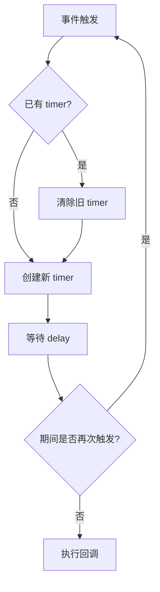

节流执行流程：

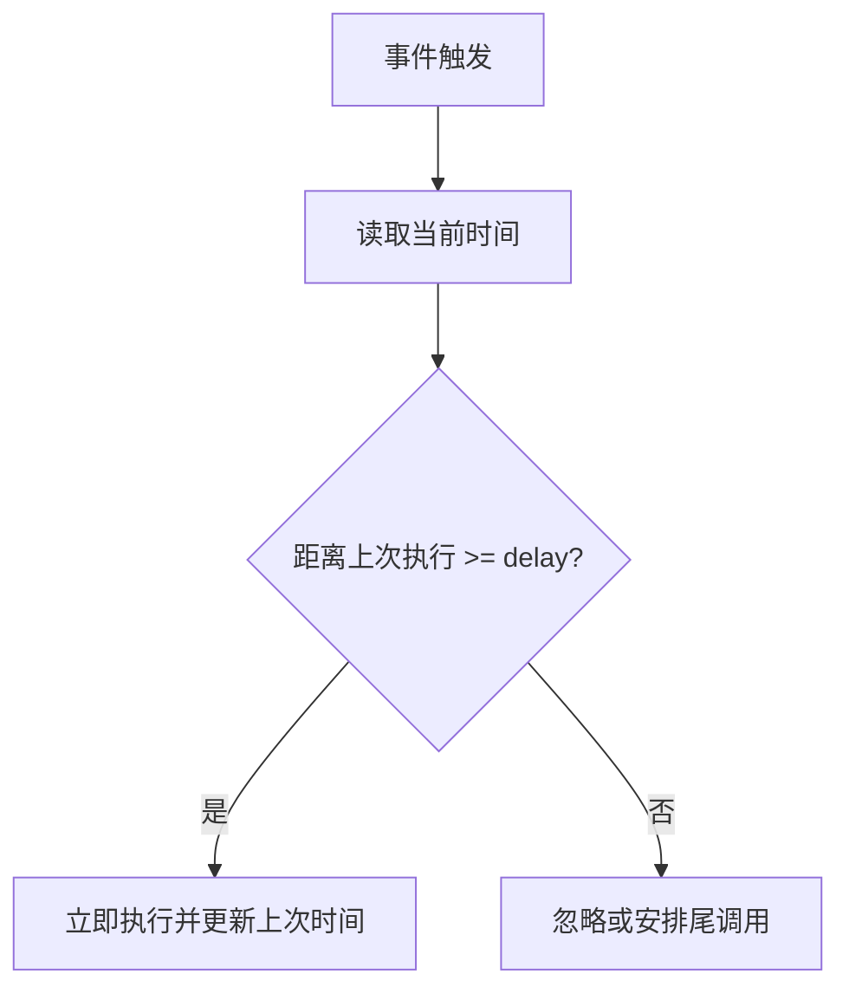

### 7.4 高频面试题

**Q：浅拷贝和深拷贝区别？**

标准回答：

> 浅拷贝只复制对象第一层，嵌套对象仍共享引用；深拷贝递归复制完整对象结构，新旧对象互不影响。实际实现深拷贝时要处理循环引用、特殊对象、Symbol key 和原型等问题。

**Q：防抖和节流区别？**

标准回答：

> 防抖是高频触发后只执行最后一次，强调“等你停下来再执行”；节流是固定间隔最多执行一次，强调“控制执行频率”。

**Q：什么是高阶函数？**

标准回答：

> 接收函数作为参数或返回函数的函数就是高阶函数。它依赖函数一等公民特性和闭包，可用于封装通用逻辑，比如 map、filter、debounce、memoize。

### 7.5 常见追问

**Q：`JSON.parse(JSON.stringify(obj))` 深拷贝有什么问题？**

会丢失函数、undefined、Symbol、BigInt，Date 会变字符串，RegExp 变空对象，循环引用会报错，原型和属性描述符也会丢失。

**Q：函数组合和管道有什么区别？**

组合通常从右到左执行：`compose(f, g)(x) = f(g(x))`。管道通常从左到右执行：`pipe(f, g)(x) = g(f(x))`。

**Q：纯函数为什么利于测试？**

同样输入总是同样输出，不依赖外部可变状态，也不产生副作用，所以测试不需要复杂环境。

### 7.6 手写代码

深拷贝：
	1. 循环引用问题

```javascript
function deepClone(value, cache = new WeakMap()) {
  if (value === null || typeof value !== "object") {
    return value;
  }

  if (cache.has(value)) {
    return cache.get(value);
  }

  if (value instanceof Date) {
    return new Date(value.getTime());
  }

  if (value instanceof RegExp) {
    return new RegExp(value.source, value.flags);
  }

  if (value instanceof Map) {
    const result = new Map();
    cache.set(value, result);
    value.forEach((mapValue, mapKey) => {
      result.set(deepClone(mapKey, cache), deepClone(mapValue, cache));
    });
    return result;
  }

  if (value instanceof Set) {
    const result = new Set();
    cache.set(value, result);
    value.forEach(item => {
      result.add(deepClone(item, cache));
    });
    return result;
  }

  const result = Array.isArray(value)
    ? []
    : Object.create(Object.getPrototypeOf(value));

  cache.set(value, result);

  Reflect.ownKeys(value).forEach(key => {
    result[key] = deepClone(value[key], cache);
  });

  return result;
}
```

防抖：

```javascript
function debounce(fn, delay, immediate = false) {
  let timer = null;

  return function debounced(...args) {
    const context = this;
    const shouldCallNow = immediate && timer === null;

    clearTimeout(timer);

    timer = setTimeout(() => {
      timer = null;
      if (!immediate) {
        fn.apply(context, args);
      }
    }, delay);

    if (shouldCallNow) {
      fn.apply(context, args);
    }
  };
}
```

节流：

```javascript
function throttle(fn, delay) {
  let lastTime = 0;
  let timer = null;

  return function throttled(...args) {
    const context = this;
    const now = Date.now();
    const remaining = delay - (now - lastTime);

    if (remaining <= 0) {
      clearTimeout(timer);
      timer = null;
      lastTime = now;
      fn.apply(context, args);
      return;
    }

    if (!timer) {
      timer = setTimeout(() => {
        lastTime = Date.now();
        timer = null;
        fn.apply(context, args);
      }, remaining);
    }
  };
}
```

柯里化：

```javascript
function curry(fn, ...presetArgs) {
  return function curried(...args) {
    const allArgs = presetArgs.concat(args);

    if (allArgs.length >= fn.length) {
      return fn.apply(this, allArgs);
    }

    return curry(fn, ...allArgs);
  };
}
```

函数组合：

```javascript
function compose(...fns) {
  return function composed(input) {
    return fns.reduceRight((value, fn) => fn(value), input);
  };
}

function pipe(...fns) {
  return function piped(input) {
    return fns.reduce((value, fn) => fn(value), input);
  };
}
```

### 7.7 实际项目场景

1. React 中不可变更新依赖浅拷贝，配合引用比较减少渲染。
2. Redux reducer 应保持纯函数，不能直接修改原 state。
3. 搜索框输入使用防抖，滚动加载使用节流。
4. 数据清洗、权限过滤、格式化可以用函数组合提升可读性。

---

## 8. 垃圾回收、V8 引擎、内存泄漏

### 8.1 概念解释

JavaScript 自动管理内存。开发者创建对象，引擎负责在对象不再可达时回收内存。

常见内存生命周期：

1. 分配内存。
2. 使用内存。
3. 不再需要时释放内存。

JS 的垃圾回收主要基于可达性：从根对象出发能访问到的对象是存活对象，访问不到的对象可以被回收。

常见根对象：

1. 全局对象。
2. 当前调用栈中的局部变量。
3. 闭包引用。
4. DOM 引用。
5. 原生模块或宿主环境持有的引用。

### 8.2 底层原理

V8 采用分代回收思想：

| 区域 | 存放对象 | 回收特点 |
|---|---|---|
| 新生代 | 存活时间短的小对象 | Scavenge，复制算法，频繁回收 |
| 老生代 | 存活时间长或较大的对象 | 标记清除、标记整理，成本较高 |

为什么分代：

> 绝大多数对象“朝生夕死”，比如函数调用中的临时对象。如果所有对象都用同一种回收策略，成本会很高。分代回收让短生命周期对象快速回收，长期存活对象晋升到老生代。

V8 执行机制简化流程：

1. 解析 JS 源码生成 AST。
2. Ignition 解释器生成并执行字节码。
3. 热点函数交给 TurboFan 优化编译为机器码。
4. 如果类型假设失效，发生反优化，退回字节码。

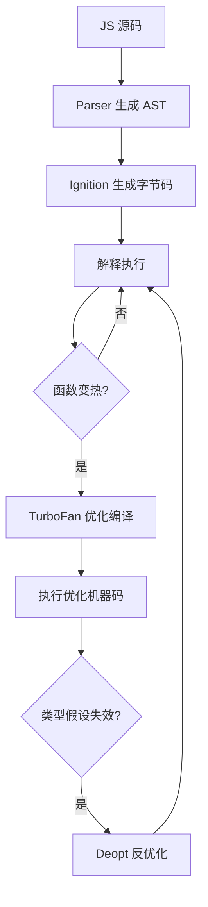

### 8.3 执行流程

标记清除流程：

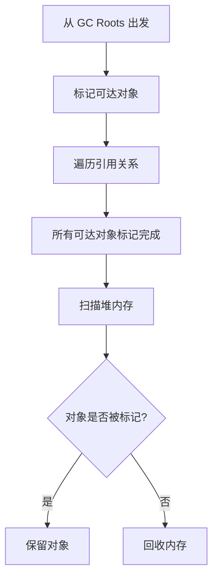

内存泄漏排查流程：

1. 打开 Chrome DevTools Memory。
2. 拍摄 Heap Snapshot。
3. 复现操作。
4. 再拍一次 Snapshot。
5. 比较对象数量和 Retainers 引用链。
6. 找到是谁持有了不该持有的对象。

### 8.4 高频面试题

**Q：JS 垃圾回收机制是什么？**

标准回答：

> JS 引擎基于可达性做自动垃圾回收。从全局对象、调用栈、闭包等根对象出发，能访问到的对象保留，访问不到的对象回收。V8 还使用分代回收，新生代回收短生命周期对象，老生代处理长期存活对象。

**Q：常见内存泄漏有哪些？**

标准回答：

> 未清除定时器、事件监听未解绑、闭包长期引用大对象、全局变量缓存无限增长、DOM 被移除但仍被 JS 引用、Map 缓存对象不释放、未关闭 WebSocket 或 Stream。

**Q：V8 为什么需要隐藏类和内联缓存？**

标准回答：

> JS 是动态语言，属性访问本来需要运行时查找。V8 通过隐藏类描述对象形状，通过内联缓存记住属性访问路径，把动态属性访问优化得接近静态语言。对象形状稳定，优化效果更好。

### 8.5 常见追问

**Q：闭包导致内存泄漏怎么排查？**

看 Heap Snapshot 的 Retainers 链。如果某个大对象被函数上下文、事件回调或定时器引用，说明闭包仍然可达。清理方式是解除引用、清除定时器、解绑事件。

**Q：WeakMap 为什么适合缓存？**

当 key 对象不再被业务引用时，WeakMap 不阻止它被回收，适合做对象元数据缓存。但 WeakMap 不可遍历，不适合做需要统计和清理策略的普通缓存。

**Q：为什么对象属性顺序和形状会影响性能？**

V8 会为相同结构的对象复用隐藏类。如果对象属性添加顺序不一致或频繁 delete，会让隐藏类变得不稳定，影响内联缓存命中。

### 8.6 手写代码：简单 LRU 缓存

```javascript
class LRUCache {
  constructor(capacity) {
    this.capacity = capacity;
    this.cache = new Map();
  }

  get(key) {
    if (!this.cache.has(key)) return -1;

    const value = this.cache.get(key);
    this.cache.delete(key);
    this.cache.set(key, value);
    return value;
  }

  put(key, value) {
    if (this.cache.has(key)) {
      this.cache.delete(key);
    }

    this.cache.set(key, value);

    if (this.cache.size > this.capacity) {
      const oldestKey = this.cache.keys().next().value;
      this.cache.delete(oldestKey);
    }
  }
}
```

实现原理：

1. Map 保持插入顺序。
2. 访问时删除再插入，让 key 变成最新。
3. 超出容量时删除最早插入的 key。

### 8.7 实际项目场景

1. React 组件卸载时未清理定时器、订阅、请求，会导致状态更新到已卸载组件。
2. WebSocket 页面离开后未关闭，连接和消息回调继续存在。
3. Node.js 服务全局 Map 缓存无限增长，进程 RSS 持续升高。
4. 大文件上传时 Buffer 堆积，没有背压控制，会导致内存暴涨。

---

## 9. 模块化、CommonJS、ESModule、Tree Shaking、Babel

### 9.1 概念解释

模块化是把代码拆成独立文件，每个文件有自己的作用域，并通过导入导出建立依赖关系。

| 模块系统 | 运行环境 | 特点 |
|---|---|---|
| CommonJS | Node.js 传统模块 | 运行时加载，同步 require，导出值拷贝或引用 |
| ESModule | 浏览器和现代 Node.js | 编译时静态分析，import/export，实时绑定 |
| 动态 import | 浏览器和 Node.js | 返回 Promise，支持按需加载 |

Tree Shaking 是构建工具基于 ESModule 静态结构删除未使用代码的优化。

Babel 是 JS 编译器，核心工作是把源码解析成 AST，经过插件转换，再生成目标代码。

TypeScript 和 JavaScript 的关系：

> TypeScript 是 JavaScript 的超集，给 JS 增加静态类型系统和编译期检查。运行时仍然是 JavaScript，类型会在编译后擦除。

### 9.2 底层原理

CommonJS：

1. `require` 是运行时执行。
2. 模块第一次加载会执行并缓存。
3. 后续 `require` 返回缓存的 `module.exports`。
4. 可以写在条件语句中，因为它是普通函数调用。

ESModule：

1. import/export 是静态语法。
2. 模块在执行前会先进行依赖解析和链接。
3. 导入的是 live binding，不是普通值拷贝。
4. 顶层 `this` 是 `undefined`，默认严格模式。

Tree Shaking 依赖 ESModule 的静态结构：

1. 编译阶段就能知道导入导出关系。
2. 如果模块无副作用，未使用导出可以删除。
3. CommonJS 因为 require 动态性强，静态分析困难。

Babel 流程：

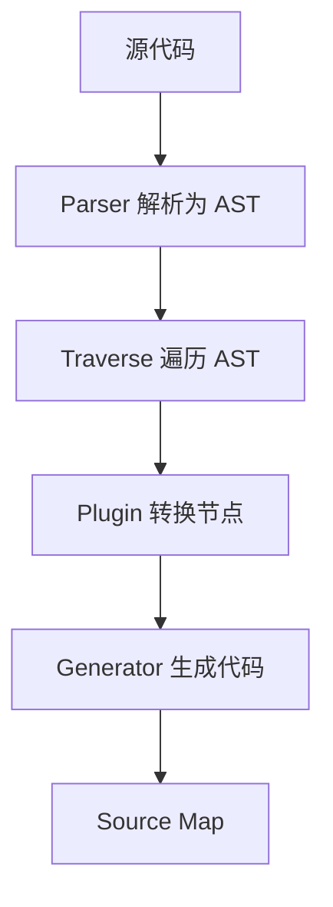

### 9.3 执行流程

ESModule 加载流程：

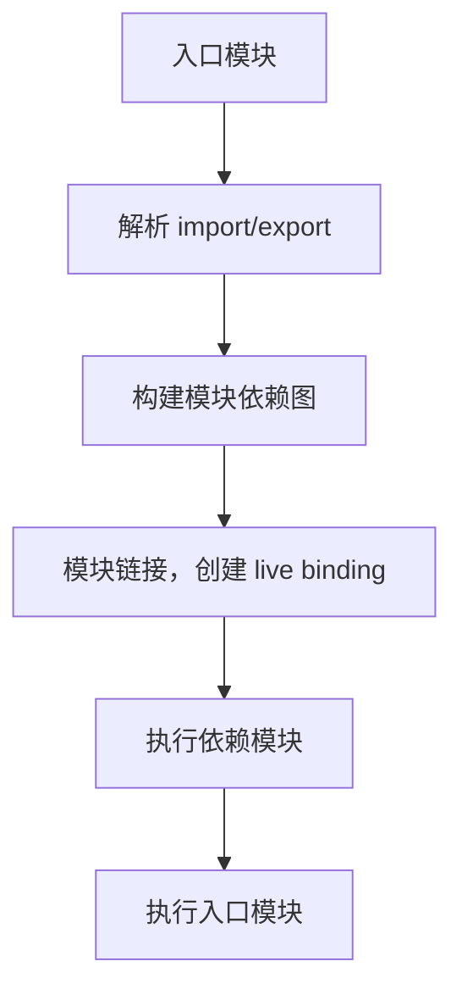

动态 import：

```javascript
button.addEventListener("click", async () => {
  const module = await import("./heavy-chart.js");
  module.renderChart();
});
```

执行过程：

1. 点击按钮后触发事件回调。
2. 执行 `import()`，浏览器或打包产物加载 chunk。
3. 模块解析、链接、执行。
4. Promise fulfilled，返回模块命名空间对象。
5. 调用导出方法。

### 9.4 高频面试题

**Q：CommonJS 和 ESModule 区别？**

标准回答：

> CommonJS 是运行时同步加载，导出的是 `module.exports` 对象，适合 Node.js 早期环境。ESModule 是静态模块系统，编译阶段可分析依赖，导入是 live binding，天然支持 Tree Shaking 和浏览器原生加载。

**Q：Tree Shaking 为什么依赖 ESModule？**

标准回答：

> ESModule 的 import/export 是静态语法，构建工具能在编译阶段确定哪些导出被使用。CommonJS 的 require 可以动态执行，依赖关系不稳定，难以安全删除代码。

**Q：Babel 做了什么？**

标准回答：

> Babel 把源码解析成 AST，通过插件遍历并转换 AST，再生成目标代码和 source map。它可以做语法降级、JSX 转换、Polyfill 注入配合等工作。

### 9.5 常见追问

**Q：ESModule 导入是值拷贝吗？**

不是。ESModule 导入是 live binding，导出方变量变化，导入方读到的是最新值，但导入方不能直接给导入绑定重新赋值。

**Q：为什么循环依赖在 ESM 中相对更可控？**

ESM 会先创建模块绑定再执行模块代码，导入引用可以先建立。但如果在初始化前访问某些绑定，仍可能触发暂时性死区错误。

**Q：TypeScript 会提升运行时性能吗？**

通常不会。TS 类型在编译后擦除，主要提升开发期可维护性、重构安全性和错误发现能力。运行时性能取决于生成的 JS 和引擎优化。

### 9.6 手写代码：简化 CommonJS require

```javascript
const fs = require("fs");
const path = require("path");

const moduleCache = {};

function myRequire(filename) {
  const absolutePath = path.resolve(filename);

  if (moduleCache[absolutePath]) {
    return moduleCache[absolutePath].exports;
  }

  const code = fs.readFileSync(absolutePath, "utf8");

  const module = {
    exports: {}
  };

  moduleCache[absolutePath] = module;

  const wrapper = new Function(
    "exports",
    "require",
    "module",
    "__filename",
    "__dirname",
    code
  );

  wrapper(
    module.exports,
    myRequire,
    module,
    absolutePath,
    path.dirname(absolutePath)
  );

  return module.exports;
}
```

实现原理：

1. 读取模块文件。
2. 用函数包裹形成模块作用域。
3. 提供 `exports`、`require`、`module` 等变量。
4. 执行模块代码。
5. 缓存并返回 `module.exports`。

### 9.7 实际项目场景

1. Next.js 页面级动态 import：降低首屏 JS 体积。
2. 组件库要正确配置 `sideEffects`，否则 Tree Shaking 可能误删样式或副作用模块。
3. Node.js 项目混用 CJS 和 ESM 时，要注意默认导出、命名导出和异步加载差异。
4. TS 只负责类型，不负责运行时校验，接口数据仍需要 zod、io-ts 或手写校验。

---

## 10. Node.js 相关：Buffer、Stream、并发与服务端场景

### 10.1 概念解释

Buffer 是 Node.js 用来处理二进制数据的对象。浏览器 JS 主要处理字符串、对象，而 Node.js 需要处理文件、网络包、图片、音视频等二进制数据，因此提供 Buffer。

Stream 是 Node.js 中处理流式数据的抽象。它可以把大文件或网络数据分块处理，而不是一次性全部读入内存。

Stream 类型：

| 类型 | 含义 | 示例 |
|---|---|---|
| Readable | 可读流 | `fs.createReadStream` |
| Writable | 可写流 | `fs.createWriteStream` |
| Duplex | 双工流 | TCP socket |
| Transform | 转换流 | gzip 压缩 |

### 10.2 底层原理

Buffer 本质是一段固定大小的二进制内存，类似 `Uint8Array`。在现代 Node.js 中，Buffer 继承自 `Uint8Array`，但提供了更多 Node 场景 API。

Stream 的核心思想：

1. 分块读取。
2. 边读边处理。
3. 背压控制。

背压是什么：

> 当写入方速度快于消费方速度时，如果不控制，会导致内存中堆积大量数据。Stream 通过 `write()` 返回值、`drain` 事件和 `pipe` 自动协调读写速度。

### 10.3 执行流程

文件流式复制：

```javascript
const fs = require("fs");

const reader = fs.createReadStream("./input.txt");
const writer = fs.createWriteStream("./output.txt");

reader.pipe(writer);
```

执行过程：

1. 可读流从文件读取一块数据。
2. 数据写入可写流。
3. 如果可写流缓冲区满，暂停读取。
4. 等待 `drain` 后继续读取。
5. 直到读取结束，关闭流。

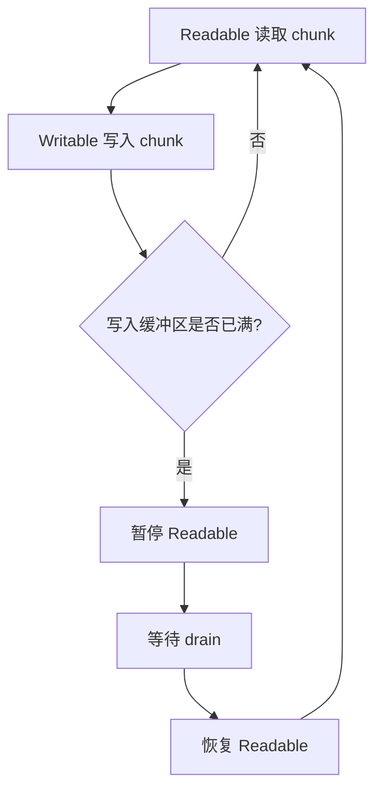

### 10.4 高频面试题

**Q：Buffer 是什么？**

标准回答：

> Buffer 是 Node.js 处理二进制数据的对象，底层是一段字节数组。它常用于文件系统、网络通信、加密、图片处理等场景。现代 Buffer 基于 Uint8Array，但提供了 Node 特有的编码转换和二进制操作 API。

**Q：Stream 有什么优势？**

标准回答：

> Stream 可以分块处理数据，避免大文件一次性加载进内存，还能通过背压机制协调生产者和消费者速度，非常适合文件传输、HTTP 响应、日志处理和压缩。

**Q：Node.js 如何处理高并发？**

标准回答：

> Node.js 使用事件驱动和非阻塞 I/O。JS 主线程负责执行回调，底层 I/O 交给操作系统或 libuv 线程池。它适合 I/O 密集型场景，但 CPU 密集型任务需要 worker_threads、子进程或拆到独立服务。

### 10.5 常见追问

**Q：Buffer 和字符串有什么关系？**

字符串是字符序列，Buffer 是字节序列。编码决定字符如何转成字节，例如 UTF-8 中一个中文通常占 3 个字节。

**Q：为什么 Stream 能减少内存占用？**

因为它不需要把完整数据放入内存，而是按 chunk 处理。配合背压，消费不过来时会暂停读取。

**Q：Node.js 单线程为什么还能高并发？**

单线程指 JS 执行线程。网络 I/O、文件 I/O、DNS、加密等由操作系统或 libuv 线程池处理，完成后再把回调放回事件循环。

### 10.6 手写代码：控制并发请求

```javascript
async function asyncPool(limit, items, worker) {
  const results = [];
  const executing = new Set();

  for (const item of items) {
    const promise = Promise.resolve()
      .then(() => worker(item))
      .then(result => {
        results.push(result);
        executing.delete(promise);
      });

    executing.add(promise);

    if (executing.size >= limit) {
      await Promise.race(executing);
    }
  }

  await Promise.all(executing);
  return results;
}
```

注意：上面版本按完成顺序收集结果。如果需要保持输入顺序，应保存 index。

### 10.7 实际项目场景

1. 大文件下载：服务端使用 Stream 直接 pipe 到响应，避免读完整文件。
2. SSR 流式输出：React / Next.js 可以逐步把 HTML 片段发送给浏览器，提升首字节和可见速度。
3. 日志采集：Transform Stream 可以边读边过滤、脱敏、压缩。
4. 批量调用第三方 API：使用并发控制，避免触发限流。

---

## 11. Fetch、AbortController、Web API 与 JS 引擎关系

### 11.1 概念解释

Fetch API 是浏览器提供的网络请求 API，返回 Promise。它不是 JS 语言本身的一部分，而是 Web API。

AbortController 用于取消异步操作，常见于 fetch 请求取消。

Web API 与 JS 引擎关系：

| 部分 | 负责内容 |
|---|---|
| JS 引擎 | 执行 ECMAScript：变量、函数、对象、Promise、语法 |
| Web API | DOM、BOM、fetch、timer、事件、存储、渲染相关能力 |
| 事件循环 | 协调 JS 调用栈、任务队列、微任务、渲染 |

### 11.2 底层原理

当执行 `fetch(url)`：

1. JS 引擎调用浏览器提供的 fetch API。
2. 浏览器网络线程处理 DNS、TCP/TLS、HTTP。
3. fetch 立即返回 pending Promise。
4. 网络完成后，浏览器把 Promise 状态更新相关逻辑放入微任务。
5. JS 主线程空闲并清空微任务时执行 then/await 后续逻辑。

AbortController 通过 `signal` 建立取消通知通道。fetch 监听 signal 的 abort 事件，一旦触发，浏览器终止请求并让 Promise reject 一个 `AbortError`。

### 11.3 执行流程

```javascript
const controller = new AbortController();

fetch("/api/user", {
  signal: controller.signal
}).catch(error => {
  if (error.name === "AbortError") {
    console.log("request aborted");
  }
});

controller.abort();
```

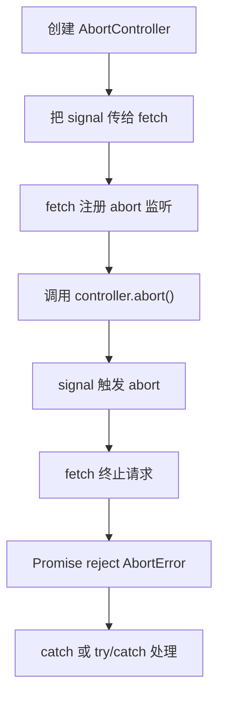

### 11.4 高频面试题

**Q：Fetch 和 XMLHttpRequest 区别？**

标准回答：

> Fetch 基于 Promise，API 更现代，支持 Request/Response/Headers 等对象模型，也天然适合 async/await。XHR 更老，基于事件回调，但上传进度等能力仍常见。Fetch 默认只有网络错误才 reject，HTTP 4xx/5xx 不会 reject，需要检查 response.ok。

**Q：如何取消请求？**

标准回答：

> 使用 AbortController。创建 controller，把 `controller.signal` 传给 fetch，需要取消时调用 `controller.abort()`，fetch 会 reject 一个 AbortError。

**Q：Web API 是 JS 的一部分吗？**

标准回答：

> 不是。JS 语言由 ECMAScript 定义，Web API 由浏览器宿主环境提供。比如 DOM、fetch、setTimeout 都不是 JS 引擎本身的能力，而是浏览器暴露给 JS 调用的能力。

### 11.5 常见追问

**Q：为什么 fetch 遇到 404 不进入 catch？**

因为 404 是 HTTP 层正常收到响应，不是网络失败。fetch 只有网络错误、CORS 错误、取消请求等才 reject。业务要通过 `response.ok` 判断。

**Q：AbortController 只能取消 fetch 吗？**

不是。它是通用取消信号机制。任何支持 `AbortSignal` 的 API 或自定义异步任务都可以监听 signal。

**Q：Promise 是 JS 引擎实现还是浏览器实现？**

Promise 是 ECMAScript 语言标准的一部分，由 JS 引擎实现。fetch、setTimeout 是宿主环境 API，但它们可以通过 Promise 或任务队列与 JS 引擎协作。

### 11.6 手写代码：可取消请求封装

```javascript
function fetchWithTimeout(url, options = {}, timeout = 8000) {
  const controller = new AbortController();
  const timer = setTimeout(() => {
    controller.abort();
  }, timeout);

  return fetch(url, {
    ...options,
    signal: controller.signal
  }).then(response => {
    if (!response.ok) {
      throw new Error(`HTTP error: ${response.status}`);
    }
    return response;
  }).finally(() => {
    clearTimeout(timer);
  });
}
```

自定义支持取消的异步任务：

```javascript
function delay(ms, signal) {
  return new Promise((resolve, reject) => {
    if (signal?.aborted) {
      reject(new DOMException("Aborted", "AbortError"));
      return;
    }

    const timer = setTimeout(resolve, ms);

    signal?.addEventListener("abort", () => {
      clearTimeout(timer);
      reject(new DOMException("Aborted", "AbortError"));
    }, { once: true });
  });
}
```

### 11.7 实际项目场景

1. React 页面切换时取消旧请求，避免旧响应覆盖新页面状态。
2. 搜索联想中，上一次查询未返回时取消它，节省网络和服务端资源。
3. Next.js 服务端请求设置超时，避免 SSR 被慢接口拖死。
4. 上传文件时配合 AbortController 实现用户主动取消。

---

## 12. 大厂面试回答模板与复习路线

### 12.1 面试回答结构

回答 JavaScript 八股时建议遵循：

1. 先说概念：它是什么，解决什么问题。
2. 再说机制：底层如何运行，和执行上下文、原型、事件循环、内存模型有什么关系。
3. 然后说流程：给一段代码，逐步分析执行顺序。
4. 最后说工程：在 React、Node.js、Next.js、浏览器性能中怎么用，踩过什么坑。

模板：

```text
这个问题我会从三层说：
第一，概念上它是什么；
第二，底层机制上 JS 引擎或宿主环境怎么处理；
第三，项目中它会造成什么影响，以及我怎么规避。
```

### 12.2 高频深挖链路

闭包深挖：

```text
闭包是什么
-> 为什么外层函数执行完变量还在
-> GC 可达性如何判断
-> React Hooks 为什么有闭包陷阱
-> 如何用 useRef 或函数式 setState 解决
```

Promise 深挖：

```text
Promise 三种状态
-> then 为什么能链式调用
-> then 回调为什么是微任务
-> async/await 和 Promise 的关系
-> Promise.all 如何实现
-> 并发控制如何做
```

Event Loop 深挖：

```text
宏任务 / 微任务
-> 为什么微任务优先
-> setTimeout 0 为什么不立刻执行
-> 浏览器渲染发生在哪里
-> Node.js 事件循环阶段
-> process.nextTick 风险
```

原型深挖：

```text
原型链是什么
-> new 做了什么
-> instanceof 如何判断
-> class 为什么是语法糖
-> extends/super 如何建立继承关系
```

内存深挖：

```text
JS 如何 GC
-> 闭包为什么不会回收
-> WeakMap 为什么弱引用
-> V8 新生代 / 老生代
-> 如何排查内存泄漏
```

### 12.3 必背手写题清单

| 手写题 | 核心考点 |
|---|---|
| `call/apply/bind` | this 绑定、Symbol、防止属性冲突、new 兼容 |
| `new` | 构造调用、原型关联、返回值规则 |
| `instanceof` | 原型链查找 |
| `Promise` | 状态机、异步回调、then 链式解析 |
| `Promise.all` | 顺序收集、失败快速返回 |
| 并发控制 | 队列、Promise.race、任务调度 |
| 深拷贝 | 递归、WeakMap、循环引用、特殊对象 |
| 防抖节流 | 闭包、定时器、this 和参数保持 |
| 柯里化 | 参数收集、函数返回函数 |
| EventEmitter | 发布订阅、事件队列 |

### 12.4 手写 EventEmitter

```javascript
class EventEmitter {
  constructor() {
    this.events = new Map();
  }

  on(type, listener) {
    if (!this.events.has(type)) {
      this.events.set(type, new Set());
    }
    this.events.get(type).add(listener);
    return this;
  }

  off(type, listener) {
    const listeners = this.events.get(type);
    if (!listeners) return this;

    listeners.delete(listener);
    if (listeners.size === 0) {
      this.events.delete(type);
    }
    return this;
  }

  once(type, listener) {
    const wrapper = (...args) => {
      this.off(type, wrapper);
      listener.apply(this, args);
    };

    this.on(type, wrapper);
    return this;
  }

  emit(type, ...args) {
    const listeners = this.events.get(type);
    if (!listeners) return false;

    [...listeners].forEach(listener => {
      listener.apply(this, args);
    });

    return true;
  }
}
```

### 12.5 真实工程综合题

**场景：React 搜索页面，输入关键字后请求接口，快速输入时出现旧结果覆盖新结果，页面还偶尔卡顿。怎么分析？**

回答思路：

1. 输入事件高频触发，应该使用 debounce 降低请求频率。
2. 每次请求返回顺序不确定，旧请求可能后返回覆盖新状态。
3. 使用 AbortController 取消旧请求，或维护 requestId，只接受最后一次请求结果。
4. 如果结果列表渲染很大，要做虚拟列表或分片渲染，避免长任务阻塞主线程。
5. React 中注意闭包捕获旧 state，可以使用函数式更新或 ref 保存最新值。

示例：

```javascript
function createSearchService() {
  let controller = null;
  let requestId = 0;

  return async function search(keyword) {
    if (controller) {
      controller.abort();
    }

    controller = new AbortController();
    const currentId = ++requestId;

    try {
      const response = await fetch(`/api/search?q=${encodeURIComponent(keyword)}`, {
        signal: controller.signal
      });
      const data = await response.json();

      if (currentId !== requestId) {
        return null;
      }

      return data;
    } catch (error) {
      if (error.name === "AbortError") {
        return null;
      }
      throw error;
    }
  };
}
```

**场景：Node.js 服务内存持续上涨，如何排查？**

回答思路：

1. 判断是堆内存上涨还是 RSS 上涨。
2. 使用 heap snapshot 对比对象增长。
3. 查看 Retainers 找引用链。
4. 重点检查全局 Map、定时器、事件监听、未关闭连接、请求上下文缓存。
5. 对缓存增加容量限制或 TTL，对连接和 Stream 做关闭处理。

**场景：Next.js SSR 慢接口拖慢首屏，怎么优化？**

回答思路：

1. 区分首屏关键数据和非关键数据。
2. 关键数据并行请求，使用超时和降级。
3. 非关键数据客户端懒加载或 Suspense。
4. 使用流式渲染，先返回可展示外壳。
5. 对稳定数据做缓存和 revalidate。

---

## 13. 高频知识点速记表

| 知识点 | 一句话本质 | 面试关键词 |
|---|---|---|
| 数据类型 | 值有类型，变量无固定类型 | 原始值、引用、堆栈、不可变 |
| 类型转换 | 运算符触发抽象转换 | ToPrimitive、valueOf、toString |
| `==` | 抽象相等比较 | 隐式转换、慎用 |
| `Object.is` | SameValue 比较 | NaN、+0/-0 |
| 执行上下文 | 代码运行时环境 | 变量环境、词法环境、this |
| 作用域链 | 变量查找路径 | 词法作用域、外部环境引用 |
| 闭包 | 函数保留定义时环境 | 可达性、私有变量、React 陷阱 |
| this | 调用时绑定 | 默认、隐式、显式、new、箭头函数 |
| 原型链 | 对象属性委托查找链 | `[[Prototype]]`、共享方法 |
| new | 构造调用协议 | 创建对象、绑定原型、绑定 this |
| class | 原型继承语法糖 | 函数、本质、严格模式 |
| Promise | 异步状态机 | pending、then 返回新 Promise |
| async/await | Promise 语法糖 | 微任务、暂停恢复 |
| Event Loop | 调度同步、异步和渲染 | 宏任务、微任务、Node 阶段 |
| WeakMap | 弱引用对象 key | GC、不可遍历、私有数据 |
| Proxy | 拦截对象内部操作 | trap、Reflect、不可 polyfill |
| 深拷贝 | 复制对象图 | WeakMap、循环引用、特殊对象 |
| V8 | 解释执行 + JIT 优化 | Ignition、TurboFan、隐藏类 |
| 模块化 | 文件作用域和依赖管理 | CJS、ESM、Tree Shaking |
| Stream | 分块处理数据 | 背压、大文件、pipe |
| AbortController | 取消异步任务 | signal、abort、fetch |

---

## 14. 复习建议

1. 第一轮：按“概念解释”和“高频面试题”背标准回答。
2. 第二轮：重点画执行流程图，尤其是闭包、Promise、Event Loop、new、原型链。
3. 第三轮：默写手写题，要求能解释每一行为什么这样写。
4. 第四轮：结合项目讲场景，例如 React 闭包陷阱、请求取消、SSR 异步、Node Stream 背压、内存泄漏排查。
5. 面试中尽量从“是什么”升级到“为什么”和“怎么运行”，这会明显拉开候选人层次。

