## React 面试八股整理

> 目标：整理一份适合前端 / 全栈 / Next.js / AI Web 工程师长期复习的大厂 React 八股手册。重点不是“API 怎么用”，而是解释 React 为什么这样设计、内部如何工作、如何与浏览器协作，以及如何在真实项目中定位和优化问题。

## 目录

- [1. React 架构总览](#1-react-架构总览)
- [2. JSX 与元素对象](#2-jsx-与元素对象)
- [3. Virtual DOM 与 Diff 算法](#3-virtual-dom-与-diff-算法)
- [4. Fiber 架构](#4-fiber-架构)
- [5. React 渲染机制](#5-react-渲染机制)
- [6. 调度机制、Scheduler 与 Lane 模型](#6-调度机制scheduler-与-lane-模型)
- [7. Concurrent Rendering 与 React 18](#7-concurrent-rendering-与-react-18)
- [8. Hooks 原理与高频考点](#8-hooks-原理与高频考点)
- [9. 状态更新机制与批量更新](#9-状态更新机制与批量更新)
- [10. 生命周期、函数组件与类组件](#10-生命周期函数组件与类组件)
- [11. 事件系统与合成事件](#11-事件系统与合成事件)
- [12. Suspense、lazy 与 Error Boundary](#12-suspenselazy-与-error-boundary)
- [13. 状态管理：Context、Redux、Zustand](#13-状态管理contextreduxzustand)
- [14. React Router 与页面架构](#14-react-router-与页面架构)
- [15. SSR、CSR、SSG、ISR 与 Hydration](#15-ssrcsrssgisr-与-hydration)
- [16. RSC、Server Action 与 Next.js App Router](#16-rscserver-action-与-nextjs-app-router)
- [17. React 与浏览器 Event Loop](#17-react-与浏览器-event-loop)
- [18. 性能优化专题](#18-性能优化专题)
- [19. React 与 TypeScript](#19-react-与-typescript)
- [20. 表单、数据请求与缓存](#20-表单数据请求与缓存)
- [21. AI Web / 流式输出场景](#21-ai-web--流式输出场景)
- [22. 高频面试题标准回答](#22-高频面试题标准回答)
- [23. 项目场景题](#23-项目场景题)
- [24. 复习路线](#24-复习路线)

---

## 1. React 架构总览

### 1. 概念解释

React 是一个用于构建 UI 的声明式 JavaScript 库。开发者描述“某个状态下 UI 应该长什么样”，React 负责把状态变化转换为最小化的 UI 更新。

面试中可以这样回答：

> React 的核心思想是声明式 UI、组件化和状态驱动视图。开发者不直接操作 DOM，而是通过 state、props 描述界面，React 内部通过调度、协调和渲染把变化应用到宿主环境，例如浏览器 DOM、React Native 原生视图。

### 2. 底层原理

现代 React 可以粗略拆成三层：

| 层 | 作用 | 常见关键词 |
| --- | --- | --- |
| Scheduler | 任务调度，决定什么时候做、先做什么 | priority、time slicing、Lane |
| Reconciler | 协调新旧树，计算需要变更的 Fiber | Fiber、Diff、render phase |
| Renderer | 把变更提交到宿主环境 | ReactDOM、commit phase、host config |

React 不是一个简单的模板引擎，而是一套 UI 运行时。它要解决的问题包括：

- 如何把状态变化映射成 UI 变化。
- 如何减少真实 DOM 操作。
- 如何在复杂组件树中保持响应速度。
- 如何支持中断、恢复、优先级和流式渲染。
- 如何支持浏览器 DOM、Native、小程序等不同渲染目标。

### 3. 渲染流程

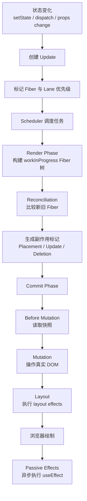

### 4. 高频面试题

**Q：React 的核心架构是什么？**

标准回答：

> React 主要由 Scheduler、Reconciler、Renderer 三部分组成。Scheduler 负责根据优先级调度任务；Reconciler 负责在 render phase 构建新的 Fiber 树并计算差异；Renderer 负责在 commit phase 把差异提交到宿主环境。React DOM 是浏览器 Renderer，React Native 则是另一种 Renderer。

面试官可能追问：

- 为什么要把 Reconciler 和 Renderer 分开？
- Scheduler 为什么是 React 18 并发能力的基础？
- render phase 和 commit phase 哪个能中断？

### 5. 常见追问

**Q：为什么 React 不直接在状态变化时改 DOM？**

因为直接操作 DOM 会把业务状态、UI 结构和平台细节耦合在一起。React 通过中间层抽象出元素树和 Fiber 树，可以批量处理更新、计算优先级、复用节点、跨平台渲染，并让 UI 更新更可预测。

**Q：React 是框架还是库？**

React 本身更像 UI 库，只负责视图层。但配合 Next.js、React Router、Redux、TanStack Query 等生态，可以形成完整应用框架。Next.js 则是在 React 之上提供路由、构建、SSR、RSC、缓存和部署能力的全栈框架。

### 6. 实际项目场景

在一个后台系统中，筛选条件变化会导致表格、统计卡片、图表同时刷新。如果直接散落地操作 DOM，很难保证一致性。React 的状态驱动模式让页面只关心“筛选状态是什么”，表格和图表分别根据 state 渲染。React 再通过批量更新、Diff 和调度减少不必要的 DOM 操作。

---

## 2. JSX 与元素对象

### 1. 概念解释

JSX 是 JavaScript 的语法扩展，用来描述 UI 结构。它看起来像 HTML，但本质上会被编译成 JavaScript 函数调用，最终得到 React Element 对象。

面试可答：

> JSX 不是模板字符串，也不是浏览器能直接识别的语法。它会被 Babel、SWC 等工具编译成 `jsx` 或 `React.createElement` 调用，返回一个普通对象，这个对象描述了组件类型、props、key、ref 等信息。

### 2. 底层原理

例如：

```tsx
const el = <button className="primary">Save</button>;
```

编译后可理解为：

```tsx
const el = jsx("button", {
  className: "primary",
  children: "Save",
});
```

React Element 近似结构：

```ts
{
  type: "button",
  key: null,
  ref: null,
  props: {
    className: "primary",
    children: "Save"
  }
}
```

Element 是不可变描述对象，不是真实 DOM，也不是 Fiber。React 会根据 Element 创建或更新 Fiber。

### 3. 渲染流程

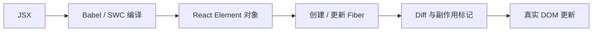

### 4. 高频面试题

**Q：JSX 和 HTML 有什么区别？**

标准回答：

> JSX 是 JavaScript 语法扩展，最终会变成 JS 对象；HTML 是浏览器解析的标记语言。JSX 中 `class` 写成 `className`，事件用驼峰写法，如 `onClick`，表达式用 `{}`，并且 JSX 可以表示自定义组件。

深挖：

- JSX 为什么需要一个根节点？
- React 17 后为什么可以不显式 import React？
- JSX 中的 key 为什么不是 props 的普通字段？

### 5. 常见追问

**Q：为什么组件名必须大写？**

小写标签会被当成宿主标签，例如 `div`、`span`；大写会被当成变量引用，即自定义组件。`<UserCard />` 会编译成对 `UserCard` 变量的引用。

**Q：React Element 和 Fiber 有什么区别？**

Element 是 UI 的静态描述，轻量、不可变；Fiber 是 React 内部的工作单元，保存组件状态、更新队列、优先级、父子兄弟关系和副作用标记。Element 是输入，Fiber 是运行时结构。

### 6. 实际项目场景

在 Next.js 中，服务端组件也可以返回 JSX，但它不一定会变成客户端 JS。Server Component 的 JSX 会在服务端执行，生成 RSC Payload，再由客户端合并到 UI 树中。这说明 JSX 只是 UI 描述语法，不等同于“浏览器里的组件”。

---

## 3. Virtual DOM 与 Diff 算法

### 1. 概念解释

Virtual DOM 是 React 用 JavaScript 对象描述 UI 结构的一种思想。状态变化后，React 生成新的 UI 描述，并与旧结构比较，找出需要更新的部分，再提交到真实 DOM。

面试可答：

> Virtual DOM 的价值不是一定比手写 DOM 快，而是提供了一层抽象，让 React 可以用声明式方式描述 UI、跨平台渲染，并通过 Diff、批量更新和调度优化复杂应用的整体性能。

什么叫声明式Ui？

``` js
function App() {
  const [isLogin, setIsLogin] = useState(false)

  return (
    <button>
      {isLogin ? "退出登录" : "登录"}
    </button>
  )
}
```

当 `isLogin` 为 `false` 时 `ui` 长什么样子；当 `isLogin` 为 `true` 时 `ui` 长什么样子
并没有手动更改 `DOM`，而是 `React` 自己怎么找 `DOM` 、怎么更新 `DOM` 、更新哪些 `DOM`

命令式编程：

``` js
const button = document.querySelector("button")

function updateUI(isLogin) {
  if (isLogin) {
    button.textContent = "退出登录"
  } else {
    button.textContent = "登录"
  }
}
```
### 2. 底层原理

真实 DOM 操作慢，主要慢在：

- DOM API 调用可能触发布局、样式计算、绘制。
- DOM 节点携带大量浏览器内部状态。
- 频繁读写 DOM 容易造成 layout thrashing。

React 不会每次状态变化都全量重建 DOM，而是先在内存中构建新的 Element / Fiber 结构，然后通过启发式 Diff 判断哪里变化了。

React Diff 的关键假设：

| 假设 | 原因 |
| --- | --- |
| 不同类型的元素会产生不同树 | `div` 变 `span` 通常代表结构语义变化 |
| 同层比较，不跨层移动 | 将复杂度从 O(n^3) 降到接近 O(n) |
| key 帮助识别稳定身份 | 列表重排时复用正确节点 |

### 3. 渲染流程

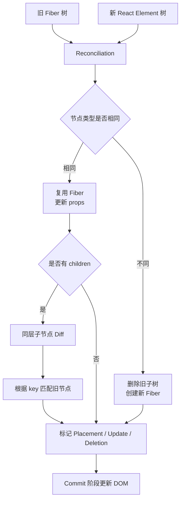

### 4. 高频面试题

**Q：React 为什么使用 Virtual DOM？**

标准回答：

> Virtual DOM 让 React 可以用声明式方式描述 UI，并在状态变化时先计算差异，再批量提交到真实 DOM。它的核心收益是抽象、可预测和跨平台，而不是简单地说“Virtual DOM 一定更快”。在复杂应用里，React 可以结合 Fiber、优先级和批量更新减少无效 DOM 操作。

深挖：

- Virtual DOM 相比模板编译的框架有什么优劣？
- 为什么 Vue 也有虚拟 DOM，但优化策略不同？
- React Compiler 出现后 Virtual DOM 还重要吗？

### 5. 常见追问

**Q：Diff 为什么不做最优解？**

树编辑距离的最优算法复杂度很高，真实 UI 更新中不值得。React 用“同层比较 + 类型判断 + key”换取可接受的准确性和线性复杂度，更符合前端 UI 的常见变化模式。

**Q：为什么不要用 index 作为 key？**

index 表示位置，不表示数据身份。列表插入、删除、排序后，同一个 index 可能对应不同数据，React 会错误复用 Fiber 和 DOM，导致输入框内容错乱、组件状态串位、动画异常。

### 6. 实际项目场景

聊天列表中如果使用 index 作为 key，新消息插入顶部后，旧消息组件可能被错误复用，导致“已读状态、输入草稿、展开状态”出现在错误消息上。正确做法是使用消息 id 作为 key。

---

## 4. Fiber 架构

### 1. 概念解释

Fiber 是 React 16 引入的新协调架构。它既是一种数据结构，也是一个工作单元。每个组件、DOM 节点、文本节点在 React 内部都对应一个 Fiber 节点。

面试可答：

> Fiber 解决的是旧版 React 递归渲染不可中断的问题。旧架构一旦开始更新整棵组件树，就会长时间占用主线程，导致用户输入、动画、滚动卡顿。Fiber 把渲染拆成一个个可中断、可恢复、可设置优先级的工作单元，为 Concurrent Rendering 打基础。

### 2. 底层原理

Fiber 节点保存的信息包括：

| 字段 | 含义 |
| --- | --- |
| type | 组件类型或 DOM 标签 |
| tag | Fiber 类型，例如 FunctionComponent、HostComponent |
| stateNode | 对应实例，DOM 节点或类组件实例 |
| child / sibling / return | 子、兄弟、父 Fiber 指针 |
| pendingProps / memoizedProps | 新旧 props |
| memoizedState | Hook 链表或类组件 state |
| updateQueue | 更新队列 |
| lanes / childLanes | 当前节点和子树的优先级 |
| flags / subtreeFlags | 需要提交的副作用 |
| alternate | 当前树与 workInProgress 树互相指向 |

Fiber 采用链表式树结构，不再依赖 JS 调用栈递归。React 可以执行一小段工作后把控制权还给浏览器，之后再从上次中断的位置继续。

### 3. 渲染流程

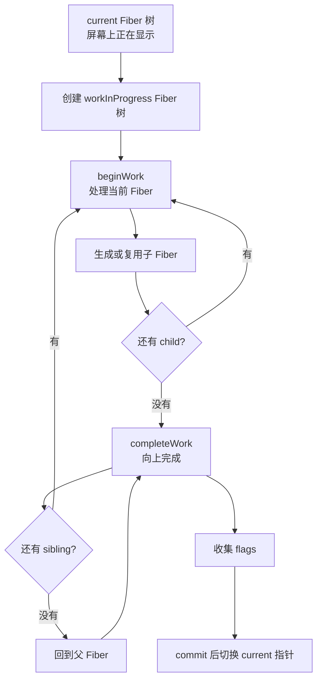

### 4. 高频面试题

**Q：Fiber 解决了什么问题？**

标准回答：

> Fiber 主要解决旧 React Stack Reconciler 一次性递归渲染不可中断的问题。它把渲染工作拆成 Fiber 节点，让 React 可以暂停、恢复、丢弃和复用工作，并引入优先级调度。这样高优先级更新，比如输入和点击，可以优先处理，低优先级渲染可以延后。

深挖：

- Fiber 为什么能中断？
- 中断后怎么恢复？
- 为什么 commit 阶段不能中断？

### 5. 常见追问

**Q：为什么 Fiber 可以中断渲染？**

因为 Fiber 树用显式指针保存工作进度，不依赖浏览器 JS 调用栈。React 每处理一个 Fiber 都可以判断是否还有剩余时间，没时间就暂停，之后通过 `workInProgress` 指针继续。

**Q：为什么 commit 阶段不能中断？**

commit 阶段会真实修改 DOM。如果中断，屏幕可能处于半更新状态，导致 UI 不一致。因此 React 允许 render phase 被中断、重做或丢弃，但 commit phase 必须同步完成。

### 6. 实际项目场景

搜索页输入框联动大列表过滤。如果每输入一个字符都同步渲染几千项，主线程会阻塞，输入卡顿。Fiber + 并发特性允许 React 把输入更新作为高优先级任务先提交，把列表渲染作为低优先级任务延后或中断。

---

## 5. React 渲染机制

### 1. 概念解释

React 渲染不是单指“浏览器绘制”。React 里的渲染通常指从状态变化开始，到计算新的 Fiber 树、提交 DOM 变化、执行副作用的完整过程。

React 更新可以拆成：

| 阶段 | 作用 | 是否可中断 |
| --- | --- | --- |
| Trigger | 触发更新，创建 update | 否 |
| Render Phase | 计算新 Fiber 树和差异 | 可中断 |
| Commit Phase | 修改 DOM、执行 layout effect | 不可中断 |
| Passive Effects | 执行 `useEffect` | 异步调度 |

### 2. 底层原理

render phase 做的是“算”，commit phase 做的是“改”。这也是 React 架构里非常重要的边界。

render phase：

- 调用函数组件或类组件 render。
- 执行 Hook 链表读取。
- 根据返回的 React Element 做 reconciliation。
- 生成 workInProgress Fiber 树。
- 标记副作用 flags。

commit phase：

- before mutation：读取 DOM 更新前快照。
- mutation：插入、删除、更新真实 DOM。
- layout：执行 `useLayoutEffect`、类组件 `componentDidMount/Update`。
- passive：后续异步执行 `useEffect`。

### 3. 渲染流程

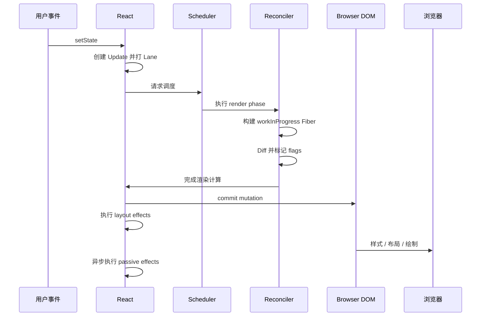

### 4. 高频面试题

**Q：render phase 和 commit phase 区别？**

标准回答：

> render phase 负责计算新的 Fiber 树和变更，可以被中断、重做、丢弃，因此不应该产生副作用。commit phase 负责把变更应用到真实 DOM，并执行 layout effect 和生命周期，它不能中断，否则 UI 会出现不一致。

深挖：

- 为什么函数组件不能在 render 中发请求或改 DOM？
- `useLayoutEffect` 为什么会阻塞绘制？
- `useEffect` 为什么在绘制后执行？

### 5. 常见追问

**Q：组件 render 了是否一定会更新 DOM？**

不一定。render 只是重新计算 UI 描述。React 还会通过 Diff 判断真实 DOM 是否需要变更。如果 props/state 变化但最终元素结构一样，可能不会产生 DOM mutation。

**Q：父组件 render，子组件一定 render 吗？**

默认情况下，父组件重新渲染会递归渲染子组件。但如果子组件被 `React.memo` 包裹，且 props 浅比较相等，子组件可以跳过 render。

### 6. 实际项目场景

在表格页中，把筛选条件、分页、弹窗状态全放在顶层组件，会导致每次打开弹窗都让整张表格重新 render。优化思路是拆分状态边界，让弹窗状态靠近弹窗组件，表格用 memo 或数据缓存减少无关渲染。

---

## 6. 调度机制、Scheduler 与 Lane 模型

### 1. 概念解释

调度机制决定 React 在多个更新任务中先处理哪个、什么时候暂停、什么时候恢复。React 18 中，Lane 模型用于表示更新优先级和批次。

面试可答：

> React 调度机制的目标是在主线程有限的情况下保持交互响应。用户输入、点击这类更新优先级更高；列表过滤、页面跳转这类可以延后的更新优先级较低。React 通过 Lane 标记更新优先级，通过 Scheduler 安排任务执行。

### 2. 底层原理

浏览器主线程同时负责：

- 执行 JS。
- 处理事件。
- 样式计算和布局。
- 绘制。
- 执行动画回调。

如果 React 一直占用主线程，浏览器就不能及时响应输入和绘制。Scheduler 的思想是把大任务拆成小任务，利用时间切片执行。

Lane 可以理解为位掩码优先级集合：

| 更新类型 | 优先级倾向 | 例子 |
| --- | --- | --- |
| SyncLane | 最高 | 受控输入、flushSync |
| InputContinuousLane | 高 | 滚动、拖拽、鼠标移动 |
| DefaultLane | 默认 | 普通 setState |
| TransitionLane | 较低 | 页面切换、大列表过滤 |
| IdleLane | 最低 | 空闲预渲染 |

### 3. 渲染流程

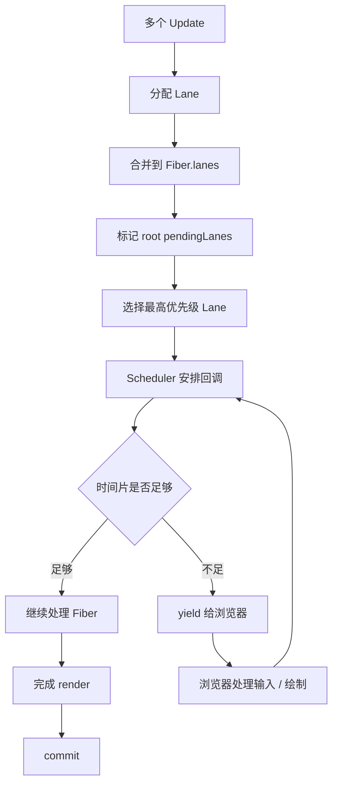

### 4. 高频面试题

**Q：Lane 模型解决了什么问题？**

标准回答：

> Lane 用位掩码表达多个更新优先级，可以方便地合并、比较、跳过和重试更新。它比过去年份的 expirationTime 更适合并发渲染，因为不同优先级更新可以共存在同一棵 Fiber 树上，React 能先处理高优先级更新，再恢复低优先级工作。

深挖：

- Lane 和 Scheduler priority 是一回事吗？
- 为什么需要 childLanes？
- 低优先级更新会不会永远不执行？

### 5. 常见追问

**Q：React 的调度是不是使用 `requestIdleCallback`？**

React 早期实验过类似思路，但生产 Scheduler 不直接依赖 `requestIdleCallback`，因为它兼容性、触发频率和时机不稳定。React 自己实现了 Scheduler，通常基于 MessageChannel 等机制模拟任务调度，并结合时间片判断是否让出主线程。

**Q：Concurrent Rendering 是不是多线程？**

不是。React 并发渲染主要仍在浏览器主线程上运行。所谓并发是指渲染任务可以被拆分、中断、恢复和按优先级调度，不是多个线程同时修改 UI。

### 6. 实际项目场景

在 AI 搜索应用里，用户输入 prompt 时，输入框更新必须即时；推荐问题、检索结果预览、历史记录过滤可以延后。可以把输入框状态保持同步，把列表过滤包进 `startTransition`，这样输入不会被低优先级 UI 计算拖慢。

---

## 7. Concurrent Rendering 与 React 18

### 1. 概念解释

Concurrent Rendering 是 React 18 的核心能力之一。它让 React 可以准备多个版本的 UI，并根据优先级中断、恢复或丢弃某次渲染。

面试可答：

> Concurrent Rendering 不是让 React 多线程渲染，而是让渲染变得可中断。React 可以在后台准备低优先级 UI，当更高优先级的输入到来时先处理输入，从而提升交互响应。最终只有 commit 阶段会把某个完成的 UI 版本一次性提交到屏幕。

### 2. 底层原理

React 18 的关键变化：

- `createRoot` 开启并发根。
- 自动批量更新覆盖更多异步场景。
- `startTransition` 标记非紧急更新。
- `useTransition` 暴露 transition pending 状态。
- `useDeferredValue` 延迟使用某个值。
- Suspense 支持更自然的并发渲染。
- Streaming SSR 和 selective hydration 改善服务端渲染体验。

Concurrent Rendering 的设计目标不是让单次计算更快，而是让重要交互先发生，让用户感觉应用更顺滑。

### 3. 渲染流程

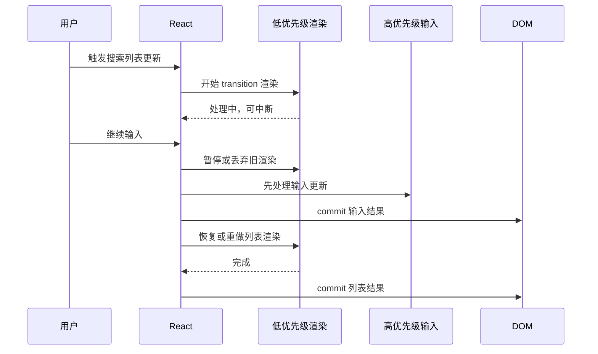

### 4. 高频面试题

**Q：Concurrent Rendering 为什么能提升用户体验？**

标准回答：

> 因为它允许 React 把渲染拆分为可中断的任务，并区分紧急和非紧急更新。输入、点击等高优先级更新可以先提交，大列表、页面切换等低优先级更新可以延后。它不一定减少总计算量，但能减少主线程长时间阻塞，提升响应感。

深挖：

- 为什么并发渲染可能导致 render 被调用多次？
- 并发模式下为什么 render 必须纯？
- `startTransition` 和 `setTimeout` 有什么区别？

### 5. 常见追问

**Q：为什么 Concurrent Rendering 下副作用更容易暴露问题？**

因为 render phase 可能被中断、重试、丢弃。如果在 render 中发请求、改全局变量、操作 DOM，可能执行多次或执行后不提交。React 要求 render 是纯计算，副作用放到 effect 或事件处理里。

**Q：Transition 会让状态更新变慢吗？**

它会降低这类更新的优先级，让紧急更新先执行。不是人为延迟固定时间，而是让 React 根据主线程情况调度。

### 6. 实际项目场景

电商搜索页中，输入关键词同时触发商品列表过滤。优化写法：

```tsx
const [keyword, setKeyword] = useState("");
const [query, setQuery] = useState("");
const [isPending, startTransition] = useTransition();

function onChange(e: ChangeEvent<HTMLInputElement>) {
  const next = e.target.value;
  setKeyword(next);
  startTransition(() => {
    setQuery(next);
  });
}
```

`keyword` 保证输入框即时更新，`query` 驱动较重列表渲染，可以被中断或延后。

---

## 8. Hooks 原理与高频考点

### 1. 概念解释

Hooks 让函数组件拥有状态、副作用、上下文、引用和性能缓存能力。它不是简单的语法糖，而是 React 组件模型从类实例转向函数闭包的重要设计。

面试可答：

> Hooks 的核心是把组件相关逻辑挂到 Fiber 的 Hook 链表上。函数组件每次 render 都会重新执行，React 按 Hook 调用顺序依次读取或创建 Hook 节点，所以 Hooks 必须在组件顶层按固定顺序调用，不能写在条件、循环或嵌套函数里。

### 2. 底层原理

每个函数组件 Fiber 的 `memoizedState` 指向 Hook 链表：

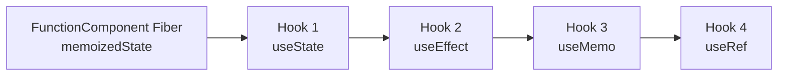

React 不通过变量名识别 Hook，而是通过调用顺序识别。第一次 render 创建 Hook 链表，后续 render 按顺序复用。

### 3. 渲染流程

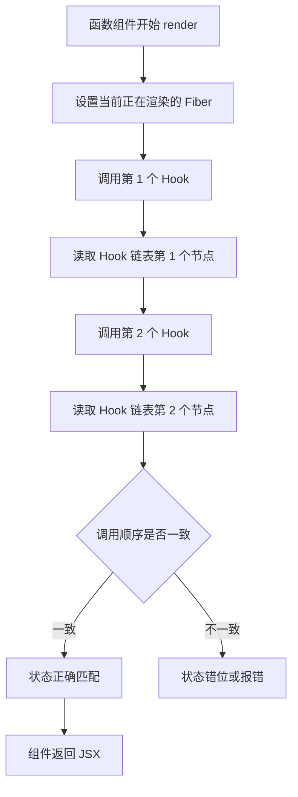

### 4. 高频面试题

**Q：Hooks 为什么不能写在条件判断里？**

标准回答：

> 因为 React 依赖 Hook 的调用顺序来匹配 Hook 状态。Hook 信息保存在 Fiber 的链表中，没有通过变量名绑定。如果某次 render 因为条件分支少调用了一个 Hook，后面的 Hook 读取位置都会错位，导致状态和副作用对应错误。

深挖：

- 自定义 Hook 为什么也必须遵守规则？
- Hook 状态存在哪里？
- 函数组件每次执行，局部变量为什么不会保留？

### 5. 常见追问

**Q：Hooks 设计思想是什么？**

Hooks 把状态逻辑从类生命周期里解耦出来，让逻辑可以按业务关注点组织和复用。相比 mixin、HOC、render props，Hooks 更少嵌套，更容易组合，但也引入了闭包和依赖数组心智负担。

**Q：Hooks 和类组件 state 最大区别？**

类组件状态挂在实例上，方法通常读取同一个实例状态；函数组件每次 render 都是一次新的函数调用，事件处理器和 effect 捕获的是当次 render 的闭包。

### 6. 实际项目场景

复杂表单页常把字段校验、提交状态、脏检查、离开确认拆成自定义 Hook，例如 `useFormDirtyWarning`、`useAsyncSubmit`。这样复用的是状态逻辑，而不是 UI 结构。

---

## 9. 状态更新机制与批量更新

### 1. 概念解释

React 状态更新不是立即修改当前变量，而是创建一个 Update，放入更新队列，之后由 React 调度一次渲染来计算新状态。

面试可答：

> `setState` 或 `setX` 调用后，React 会把更新放进队列，并根据优先级调度渲染。当前 render 中的 state 是快照，所以调用 setState 后立刻读取旧 state 是正常的。React 这样设计是为了批量合并更新、保持渲染一致性和支持并发调度。

### 2. 底层原理

`useState` 的更新过程：

1. 调用 dispatch。
2. 创建 update 对象，包含 action 和 lane。
3. update 进入 Hook 的 queue。
4. 标记 Fiber 到 root 的更新路径。
5. Scheduler 根据 Lane 调度 render。
6. render 时按顺序处理 update queue，算出新 state。
7. commit 后 UI 更新。

### 3. 渲染流程

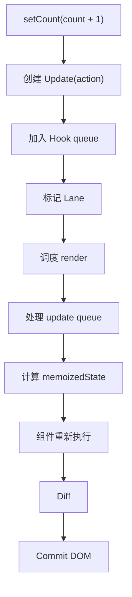

### 4. 批量更新

React 会把同一批次中的多个状态更新合并成一次渲染。

React 18 自动批量更新覆盖：

- React 事件处理函数。
- Promise 回调。
- `setTimeout`。
- 原生事件回调。
- 其他异步任务。

```tsx
setCount(c => c + 1);
setFlag(f => !f);
// React 18 中通常只触发一次 render
```

### 5. 高频面试题

**Q：为什么 useState 不会立即更新？**

标准回答：

> 因为函数组件中的 state 是本次 render 的快照。调用 setState 只是把更新加入队列，并请求 React 之后重新渲染。这样 React 可以批量处理多个更新，避免每次 setState 都同步 render，也为优先级调度和并发渲染提供基础。

深挖：

- 函数式更新 `setCount(c => c + 1)` 解决什么问题？
- React 18 自动批量更新和 React 17 有什么区别？
- `flushSync` 什么时候用？

### 6. 常见追问

**Q：连续执行三次 `setCount(count + 1)` 为什么只加 1？**

因为三次更新捕获的是同一次 render 中的 `count` 值。它们的 action 都是同一个结果。要基于上一次更新继续计算，应使用函数式更新：

```tsx
setCount(c => c + 1);
setCount(c => c + 1);
setCount(c => c + 1);
```

**Q：为什么 React 要批量更新？**

减少重复 render 和 DOM commit，保证同一事件内多个状态变化以一致快照更新。否则每次 setState 都同步更新，会造成性能浪费和中间 UI 状态暴露。

### 7. 实际项目场景

在订单提交中，同时更新 loading、错误信息、表单禁用状态。如果不批量更新，页面可能出现多次中间状态闪烁。React 的批量更新让这些状态在一次渲染中统一生效。

---

## 10. 生命周期、函数组件与类组件

### 1. 概念解释

类组件通过生命周期方法组织逻辑，函数组件通过 Hooks 组织逻辑。现代 React 推荐函数组件，但理解类组件生命周期仍有助于看旧项目和理解 commit 阶段。

### 2. 底层原理

类组件实例持久存在，state 在实例上；函数组件没有实例，每次 render 都是重新调用函数，状态由 Fiber 的 Hook 链表保存。

| 对比项 | 类组件 | 函数组件 |
| --- | --- | --- |
| 状态保存 | 实例 `this.state` | Fiber Hook 链表 |
| 逻辑复用 | HOC、render props | 自定义 Hook |
| 副作用 | 生命周期 | `useEffect` / `useLayoutEffect` |
| 闭包问题 | 较少 | 高频 |
| 并发友好 | 较弱 | 更适配 |

### 3. 生命周期映射

| 类组件 | 函数组件近似 |
| --- | --- |
| componentDidMount | `useEffect(() => {}, [])` |
| componentDidUpdate | `useEffect(() => {}, [deps])` |
| componentWillUnmount | `useEffect` cleanup |
| getSnapshotBeforeUpdate | 特殊场景配合 `useLayoutEffect` |
| componentDidCatch | 目前仍需要 Error Boundary 类组件或框架封装 |

### 4. 高频面试题

**Q：函数组件和类组件有什么区别？**

标准回答：

> 类组件基于实例，状态和方法挂在 `this` 上；函数组件基于 render 快照，状态保存在 Fiber 的 Hook 链表中。函数组件更利于逻辑组合和并发渲染，但需要理解闭包和依赖数组。现代 React 更推荐函数组件。

深挖：

- 为什么函数组件每次 render 的 props/state 都是快照？
- 为什么类组件中 `this.state` 有时更像可变引用？
- Hooks 是否完全替代生命周期？

### 5. 实际项目场景

老后台项目常有类组件 Error Boundary 包住函数组件页面。因为 React 目前官方 Error Boundary 仍主要通过类组件生命周期实现，而业务页面可以全部使用函数组件和 Hooks。

---

## 11. 事件系统与合成事件

### 1. 概念解释

React 合成事件是 React 对浏览器原生事件的封装，提供跨浏览器一致的事件对象和统一的事件委托机制。

面试可答：

> React 不是给每个 DOM 节点都绑定真实事件，而是通过事件委托在根节点监听事件，再根据 Fiber 树和事件目标模拟捕获、冒泡流程，调用对应组件上的事件处理函数。

### 2. 底层原理

React 17 之前事件主要委托到 `document`，React 17 后委托到 root container。这让多个 React 版本共存、微前端和渐进升级更容易。

事件处理流程：

1. 浏览器触发原生事件。
2. 事件冒泡到 React root。
3. React 根据 target 找到对应 Fiber。
4. 收集捕获和冒泡阶段的监听器。
5. 构造 SyntheticEvent。
6. 按顺序执行事件回调。
7. 事件回调中触发的状态更新进入批处理。

### 3. 渲染流程

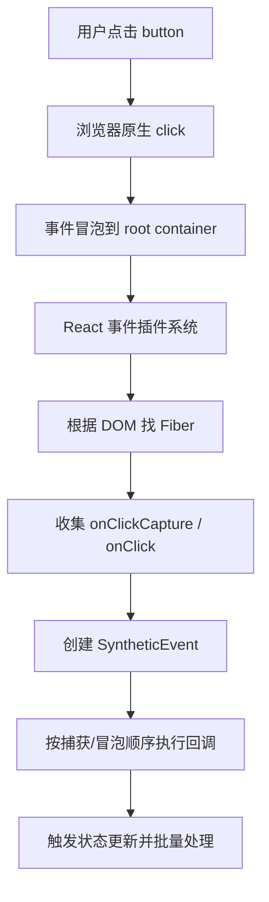

### 4. 高频面试题

**Q：React 合成事件有什么好处？**

标准回答：

> 合成事件提供跨浏览器一致性，并通过事件委托减少大量事件监听器。同时事件系统和 React 更新机制结合，事件回调中的状态更新可以自动批量处理。

深挖：

- React 17 事件委托位置为什么改变？
- `event.stopPropagation()` 会影响原生事件吗？
- 合成事件和原生事件执行顺序是什么？

### 5. 常见追问

**Q：React 事件为什么能触发批量更新？**

因为 React 控制合成事件回调的执行边界，可以在回调开始和结束之间收集多个 update，最后统一调度渲染。React 18 又把这种自动批处理扩展到更多异步场景。

### 6. 实际项目场景

弹窗组件中，点击遮罩关闭，点击内容区不关闭。常见写法是遮罩 `onClick` 关闭，内容区 `onClick={e => e.stopPropagation()}`。如果混用原生事件监听 document，需要注意 React 合成事件与原生事件顺序，避免关闭逻辑提前触发。

---

## 12. Suspense、lazy 与 Error Boundary

### 1. 概念解释

`React.lazy` 用于组件级代码分割，`Suspense` 用于在组件等待期间展示 fallback，Error Boundary 用于捕获渲染阶段错误并展示降级 UI。

面试可答：

> Suspense 的思想是让组件在“尚未准备好”时把等待状态交给上层边界。它最早常用于 lazy 组件加载，现代 React 和 Next.js 中还用于服务端组件、流式 SSR、数据加载和 selective hydration。

### 2. 底层原理

`lazy` 本质接收一个动态 import：

```tsx
const Settings = lazy(() => import("./Settings"));
```

当组件还没加载完成时，会抛出一个 thenable。React 捕获到后找到最近的 Suspense 边界，渲染 fallback。Promise resolve 后重新调度渲染。

Error Boundary 捕获：

- render 阶段错误。
- 生命周期错误。
- 子组件树错误。

不能捕获：

- 事件处理器内部异步错误。
- `setTimeout` 异步错误。
- 服务端渲染错误。
- Error Boundary 自身错误。

### 3. 渲染流程

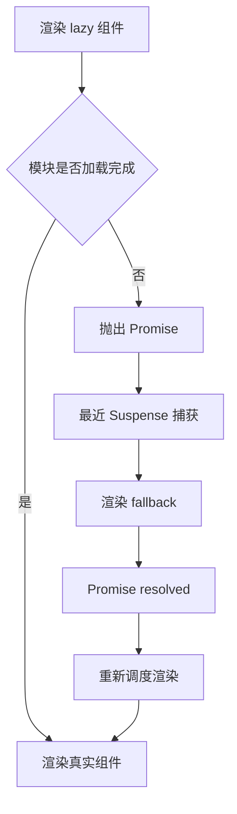

### 4. 高频面试题

**Q：Suspense 是怎么工作的？**

标准回答：

> Suspense 通过边界捕获子树中抛出的 thenable，先渲染 fallback，等异步资源完成后重新渲染子树。它不是简单 loading 组件，而是 React 协调层面的等待机制，能和并发渲染、SSR streaming、selective hydration 结合。

深挖：

- Suspense 和 Error Boundary 区别？
- Suspense 为什么能支持 streaming SSR？
- Suspense fallback 放太大有什么问题？

### 5. 实际项目场景

后台系统的“报表详情”模块体积很大，可以用 `lazy + Suspense` 懒加载，只在用户进入详情页时下载。Next.js App Router 中可以用 `loading.tsx` 自动形成 Suspense 边界，让页面部分内容先显示，慢数据区域后流式补上。

---

## 13. 状态管理：Context、Redux、Zustand

### 1. 概念解释

React 内置状态适合组件局部 UI 状态；Context 适合跨层传递低频全局信息；Redux 和 Zustand 适合更复杂的全局状态管理。

面试可答：

> 状态管理的核心不是选库，而是划分状态的作用域、更新频率和一致性要求。局部状态放组件内，服务端缓存交给 TanStack Query，全局客户端状态再考虑 Redux、Zustand 或 Context。

### 2. 底层原理

Context：

- Provider value 变化会通知消费该 Context 的组件。
- 如果 value 每次都是新对象，会造成消费者重新 render。
- 适合主题、语言、登录用户、配置等低频变化。

Redux：

- 单一 store。
- reducer 纯函数更新。
- dispatch action。
- selector 订阅局部状态。
- 适合大型团队、复杂业务流、可追踪状态变化。

Zustand：

- 外部 store。
- Hook 订阅选择的状态切片。
- API 简洁，不强制 reducer。
- 适合中小型应用、交互状态、编辑器状态。

### 3. 状态流转流程

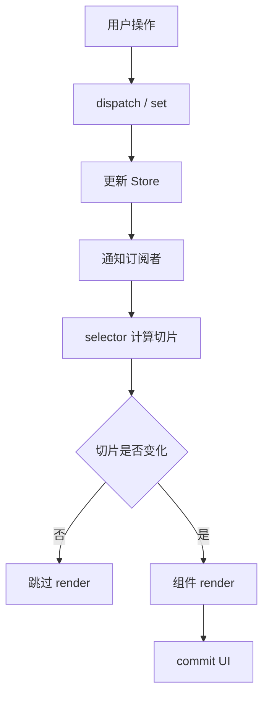

### 4. 高频面试题

**Q：Context 能不能替代 Redux？**

标准回答：

> Context 解决跨层传值，不是完整状态管理方案。它没有内建 reducer、异步流程、时间旅行、细粒度订阅和调试工具。低频全局状态可以用 Context，高频且复杂的共享状态更适合 Redux、Zustand 或其他外部 store。

深挖：

- Context 为什么可能导致性能问题？
- Redux Toolkit 解决了 Redux 哪些痛点？
- Zustand 为什么更新粒度通常比 Context 更细？

### 5. 常见追问

**Q：如何设计状态管理？**

先分类：

| 状态类型 | 推荐方案 |
| --- | --- |
| 表单输入、弹窗开关 | 组件局部 state |
| 主题、语言、用户信息 | Context |
| 服务端数据、分页列表 | TanStack Query |
| 多页面共享业务状态 | Zustand / Redux |
| URL 可表达状态 | Router search params |
| RSC 服务端数据 | Server Component / fetch cache |

### 6. 实际项目场景

AI 聊天应用中：

- 当前输入框内容：局部 state。
- 会话列表和当前会话 id：Zustand。
- 消息历史接口缓存：TanStack Query。
- 当前登录用户和主题：Context。
- 服务端生成的初始会话：Next.js Server Component。

---

## 14. React Router 与页面架构

### 1. 概念解释

React Router 是客户端路由方案，让单页应用在不刷新页面的情况下根据 URL 渲染不同组件。Next.js 则提供文件系统路由和服务端渲染能力。

### 2. 底层原理

客户端路由核心：

- 使用 History API 改变 URL。
- 监听 `popstate`。
- 根据路由表匹配组件。
- 渲染对应页面。
- 保持应用状态和 JS 运行时不重载。

### 3. 路由流程

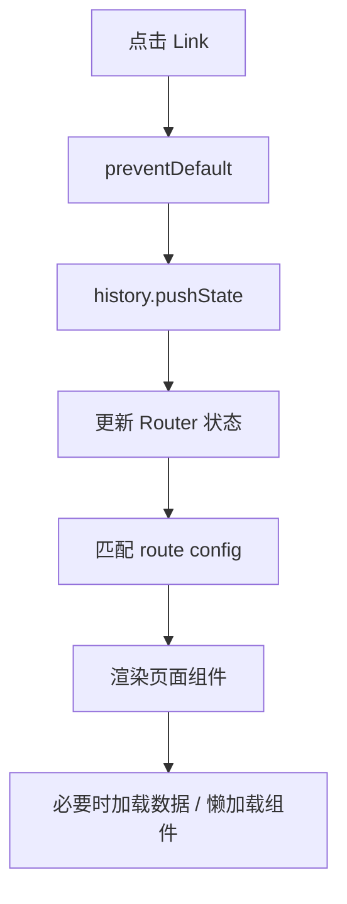

### 4. 高频面试题

**Q：SPA 路由和传统多页路由区别？**

标准回答：

> 传统 MPA 每次跳转由浏览器请求新 HTML，页面整体刷新。SPA 使用 History API 修改 URL，由前端路由匹配组件并局部更新页面，体验更流畅，但首屏、SEO 和数据加载需要额外处理。

深挖：

- React Router loader 和组件内 useEffect 请求有什么区别？
- Next.js App Router 与 React Router 最大区别？
- URL 状态和全局 store 如何取舍？

### 5. 实际项目场景

筛选条件、分页、排序适合放 URL query 中。这样页面可分享、可刷新恢复、可被浏览器前进后退管理，而不是全部放 Redux 或 Zustand。

---

## 15. SSR、CSR、SSG、ISR 与 Hydration

### 1. 概念解释

| 模式 | 含义 | 适合场景 |
| --- | --- | --- |
| CSR | 客户端渲染，浏览器下载 JS 后渲染 | 后台、强交互应用 |
| SSR | 每次请求服务端生成 HTML | 个性化、SEO、首屏要求高 |
| SSG | 构建时生成静态 HTML | 文档、博客、营销页 |
| ISR | 静态生成后按需再生成 | 商品详情、内容站 |

Hydration 是客户端 React 接管服务端 HTML 的过程。服务端先输出 HTML，客户端下载 JS 后把事件和状态绑定回去。

### 2. 底层原理

SSR 不等于页面已经可交互。SSR 只让用户更早看到 HTML，真正交互要等客户端 JS 加载、解析、执行并完成 hydration。

Hydration 过程：

1. 服务端生成 HTML。
2. 浏览器展示静态 HTML。
3. 客户端下载 JS bundle。
4. React 在客户端构建对应 Fiber 树。
5. React 尝试复用已有 DOM。
6. 绑定事件并恢复交互。

### 3. Hydration 流程

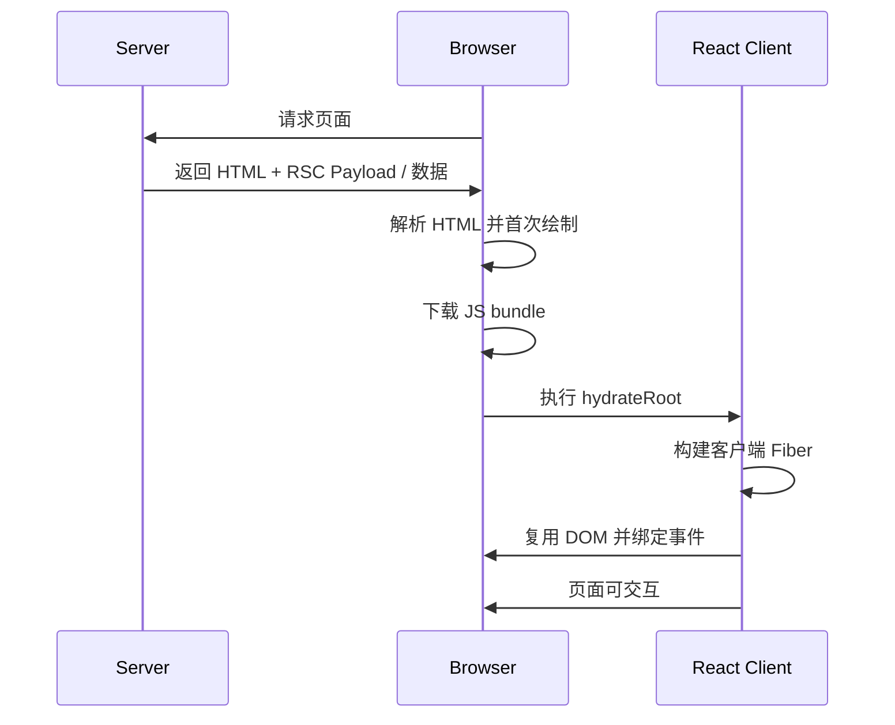

### 4. 高频面试题

**Q：SSR 和 CSR 的区别？**

标准回答：

> CSR 主要在浏览器执行 JS 后生成页面，首屏依赖 bundle 下载和接口请求。SSR 在服务端先生成 HTML，用户能更快看到内容，也更利于 SEO，但需要 hydration 才能交互，并且会增加服务端计算和缓存复杂度。

深挖：

- SSR 为什么仍可能交互慢？
- hydration mismatch 是什么？
- selective hydration 解决什么问题？

### 5. 常见追问

**Q：什么是 selective hydration？**

React 可以优先 hydrate 用户正在交互或更高优先级的区域，而不是必须从上到下同步 hydrate 整个页面。它配合 Suspense，让页面部分区域先可交互，提高大型 SSR 页面的体验。

**Q：Streaming SSR 是什么？**

服务端不必等整页数据都准备好再返回 HTML，而是先发送外壳和已完成部分，慢组件通过 Suspense 边界后续流式补充。用户更早看到内容，浏览器也能更早下载资源。

### 6. 实际项目场景

电商商品详情页：

- 商品基础信息用 SSR 保证首屏和 SEO。
- 推荐商品用 Suspense 流式加载。
- 评论列表可 CSR 或延迟加载。
- 库存、价格根据缓存策略选择 SSR 或客户端刷新。

---

## 16. RSC、Server Action 与 Next.js App Router

### 1. 概念解释

React Server Component（RSC）允许组件在服务端渲染，并且不把该组件的 JS 发送到客户端。Next.js App Router 是目前 RSC 的主流落地框架。

面试可答：

> RSC 让 React 组件树可以同时包含服务端组件和客户端组件。服务端组件负责读取数据库、调用内部服务、生成不可交互 UI；客户端组件负责事件、状态和浏览器 API。这样可以减少客户端 bundle size，把更多工作放到服务端完成。

### 2. 底层原理

RSC 不是 SSR 的同义词：

| 对比项 | SSR | RSC |
| --- | --- | --- |
| 目标 | 生成首屏 HTML | 减少客户端 JS，服务端执行组件 |
| 是否需要 hydration | SSR 输出的客户端组件需要 | Server Component 本身不 hydrate |
| 能否访问数据库 | 通过服务端逻辑 | 可以直接在服务端组件中访问 |
| 是否能用 useState | 可以在客户端组件 | Server Component 不能用 |

RSC 输出的是一种可序列化的组件树描述，Next.js 会把它和客户端组件引用一起传给浏览器。

### 3. App Router 渲染流程

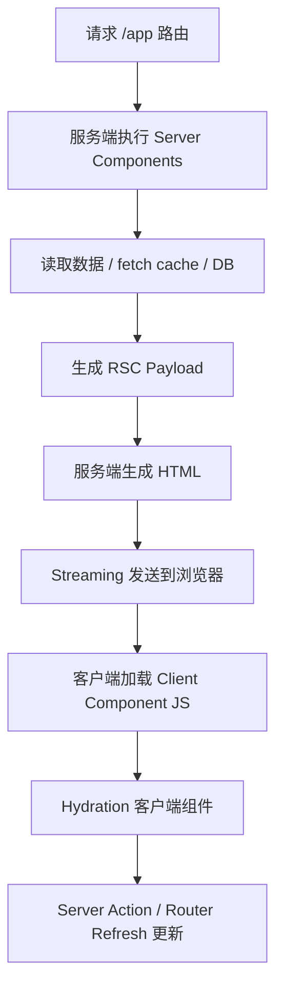

### 4. Next.js 如何扩展 React

Next.js 在 React 之上提供：

- 文件系统路由。
- Layout、Template、Loading、Error 约定。
- Server Component 默认模式。
- Server Action。
- Route Handler。
- 数据缓存和 revalidate。
- Streaming SSR。
- Edge Runtime。
- 图片、字体、脚本优化。
- 构建和部署约定。

### 5. 高频面试题

**Q：为什么 RSC 可以减少 bundle size？**

标准回答：

> 因为 Server Component 只在服务端执行，它的代码和依赖不会被打进客户端 bundle。比如 markdown 解析、数据库 SDK、权限判断、数据聚合逻辑都可以留在服务端，客户端只接收渲染结果和必要的 Client Component JS。

深挖：

- RSC 和 SSR 区别？
- 为什么 Server Component 不能使用 `useState`？
- `use client` 的边界会影响什么？
- Server Action 和 API Route 区别？

### 6. 常见追问

**Q：Server Action 是什么？**

Server Action 是可以从组件中直接调用的服务端函数，常用于表单提交、数据变更。它让 mutation 逻辑靠近组件，并结合 Next.js 缓存失效、redirect、revalidate 使用。

**Q：App Router 中 Cache 怎么理解？**

Next.js 有多层缓存：请求记忆化、Data Cache、Full Route Cache、Router Cache。缓存能提升性能，但也会带来数据新鲜度问题，需要用 `cache: "no-store"`、`revalidate`、`revalidatePath`、`revalidateTag` 等控制。

### 7. 实际项目场景

内容管理系统文章详情页：

- 文章正文用 Server Component 读取数据库和 markdown 渲染，减少客户端 JS。
- 收藏按钮是 Client Component，因为需要点击事件和乐观更新。
- 评论表单用 Server Action 提交。
- 相关推荐用 Suspense 流式加载。
- 编辑权限判断放服务端，避免敏感逻辑下发。

---

## 17. React 与浏览器 Event Loop

### 1. 概念解释

浏览器 Event Loop 负责协调宏任务、微任务、渲染和事件。React 在主线程上运行，必须和浏览器争夺执行时间，所以调度机制非常关键。

### 2. 底层原理

一次浏览器循环大致包括：

1. 执行一个宏任务。
2. 清空微任务队列。
3. 执行 requestAnimationFrame。
4. 样式计算、布局、绘制。
5. 空闲回调。

React 更新、事件处理、组件 render 都是 JS 执行，会阻塞浏览器绘制。Concurrent Rendering 的时间切片就是为了避免长时间占用主线程。

### 3. React 与浏览器协作

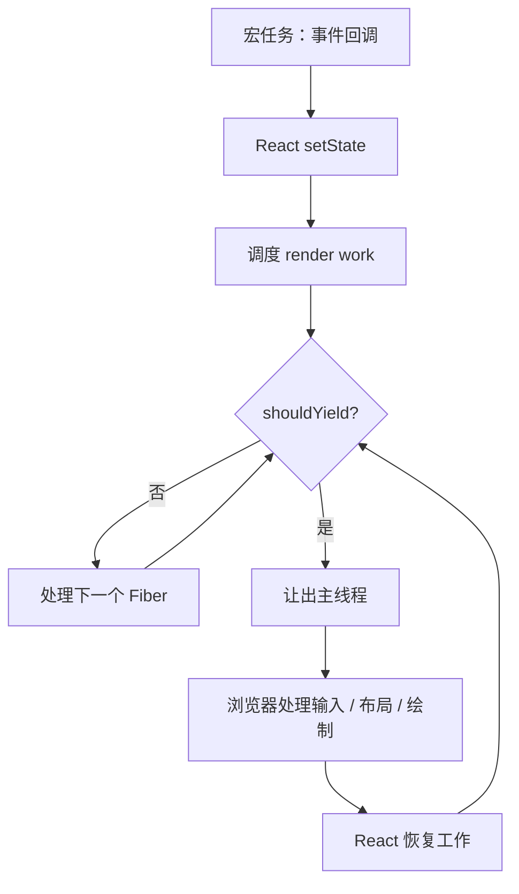

### 4. 高频面试题

**Q：React 与 requestIdleCallback 什么关系？**

标准回答：

> React 的并发调度思想类似利用空闲时间处理低优先级任务，但生产实现不依赖 requestIdleCallback。因为它兼容性和触发时机不可控。React Scheduler 自己维护任务队列和时间片，通过 MessageChannel 等机制更稳定地调度。

深挖：

- 微任务过多会影响 React 渲染吗？
- 为什么长 JS 任务会导致掉帧？
- React 如何判断是否该 yield？

### 5. 实际项目场景

如果在一次点击后同步执行大量 JSON 解析和列表计算，即使 React 有 Fiber，也可能卡顿。React 只能调度自己的渲染工作，不能自动拆分你的业务 CPU 密集任务。需要 Web Worker、分页、虚拟列表、增量计算或缓存。

---

## 18. 性能优化专题

### 1. 性能问题总览

React 性能优化不是到处加 `useMemo`。应先判断慢在哪里：

| 问题 | 内部发生了什么 | 优化方向 |
| --- | --- | --- |
| 重复渲染 | 父组件更新导致子树 render | 拆分组件、memo、状态下沉 |
| DOM 过多 | commit 和浏览器布局绘制成本高 | 虚拟滚动、分页 |
| Context 频繁变化 | 消费者全部被通知 | 拆 Context、selector、外部 store |
| key 错误 | Fiber 错误复用 | 使用稳定业务 id |
| hydration 慢 | 客户端 JS 多、绑定事件慢 | RSC、代码分割、selective hydration |
| 计算昂贵 | render phase CPU 高 | useMemo、缓存、Worker |

### 2. 重复渲染

为什么会慢：

- 父组件 state 更新导致子组件重新执行。
- 子组件 render 中有复杂计算。
- props 每次都是新引用，memo 失效。

优化：

- 状态靠近使用位置。
- 用 `React.memo` 跳过 props 未变化的子组件。
- 用 `useMemo` 保持昂贵计算结果。
- 用 `useCallback` 保持传给 memo 子组件的函数引用。

注意：`useMemo/useCallback` 也有成本。它们适合昂贵计算、稳定引用、配合 memo，而不是机械套用。

### 3. Context 性能问题

Context value 变化会让所有消费该 Context 的组件重新渲染。

坏例子：

```tsx
<AppContext.Provider value={{ user, theme, setTheme, filters }}>
  {children}
</AppContext.Provider>
```

只要任一字段变了，所有消费者都可能更新。

优化：

- 拆分 Context：UserContext、ThemeContext、FilterContext。
- Provider value 用 `useMemo`。
- 高频状态放 Zustand / Redux 等支持 selector 的外部 store。
- 不把大对象或频繁变化数据塞进 Context。

### 4. key 使用错误

错误 key 会导致：

- 组件状态串位。
- DOM 复用错误。
- 动画错乱。
- 输入框光标或内容异常。

规则：

- key 只需要在兄弟节点中唯一。
- key 要稳定，不要随机数。
- 可排序、可插入、可删除列表不要用 index。

### 5. 大列表优化

大列表慢的原因：

- render phase 创建大量 Fiber。
- commit phase 插入大量 DOM。
- 浏览器布局和绘制成本高。
- 滚动时频繁更新可见区域。

优化：

- 虚拟滚动，只渲染可见区域。
- 分页或无限加载。
- 行组件 memo。
- 固定高度减少测量成本。
- 避免每行创建新函数和新对象。

### 6. 懒加载与 Code Splitting

为什么有效：

- 减少首屏 JS bundle。
- 减少解析、编译、执行 JS 时间。
- 降低 hydration 成本。

方式：

- 路由级懒加载。
- 复杂弹窗懒加载。
- 图表、编辑器、富文本等重依赖动态加载。
- Next.js 中合理使用 Server Component 和 dynamic import。

### 7. Hydration 性能

Hydration 慢的原因：

- 客户端组件太多。
- JS bundle 过大。
- 页面 HTML 很大，Fiber 构建成本高。
- 低价值交互组件过早 hydration。

优化：

- 使用 RSC 减少客户端组件。
- 把非交互区域留在服务端。
- 使用 Suspense 边界和 streaming。
- 减少第三方脚本。
- 分析 bundle。

### 8. React DevTools 分析

Profiler 重点看：

- 哪些组件 render 次数异常。
- 单次 render 耗时高的组件。
- 是 props 变化、state 变化还是 parent render 导致。
- commit 时间是否过长。

面试回答思路：

> 先用 Profiler 定位慢组件，再判断是 render 计算慢、DOM 数量多、props 引用不稳定、Context 广播，还是服务端 hydration 慢。针对原因做局部优化，不会盲目添加 memo。

---

## 19. React 与 TypeScript

### 1. 概念解释

React + TypeScript 的重点是给 props、state、事件、ref、自定义 Hook 和组件泛型建模，提升复杂组件的可维护性。

### 2. 高频类型

```tsx
type ButtonProps = {
  variant?: "primary" | "secondary";
  disabled?: boolean;
  onClick?: React.MouseEventHandler<HTMLButtonElement>;
  children: React.ReactNode;
};
```

常见类型：

| 场景 | 类型 |
| --- | --- |
| children | `React.ReactNode` |
| DOM 事件 | `React.MouseEventHandler<HTMLButtonElement>` |
| ref | `React.RefObject<T>` / `forwardRef` |
| 表单事件 | `React.ChangeEvent<HTMLInputElement>` |
| 组件 props | `ComponentProps<typeof Button>` |
| CSS style | `React.CSSProperties` |

### 3. 高频面试题

**Q：React.FC 推荐吗？**

标准回答：

> 现在不一定推荐默认使用 `React.FC`。直接声明 props 类型更清晰，children 是否存在也更显式。`React.FC` 的优势是内置返回类型和一些静态属性类型，但在很多项目里会让 children 表达不够精确。

### 4. 实际项目场景

组件库中常使用泛型组件：

```tsx
type SelectProps<T> = {
  value: T;
  options: T[];
  getKey: (item: T) => string;
  renderLabel: (item: T) => React.ReactNode;
  onChange: (item: T) => void;
};
```

这样既能复用 UI，又能保证业务数据类型安全。

---

## 20. 表单、数据请求与缓存

### 1. React 表单方案

表单分为受控和非受控：

| 类型 | 特点 | 适合 |
| --- | --- | --- |
| 受控组件 | value 由 React state 控制 | 小表单、强联动 |
| 非受控组件 | DOM 自己保存值，提交时读取 | 大表单、性能敏感 |

React Hook Form 倾向非受控，减少每次输入都触发 React render。Formik 更偏受控和状态集中。

### 2. TanStack Query

TanStack Query 管理的是服务端状态，不是普通全局状态。

它解决：

- 请求缓存。
- loading/error 状态。
- 重试。
- 后台刷新。
- 分页和无限加载。
- mutation 后失效。
- 乐观更新。

### 3. 缓存机制

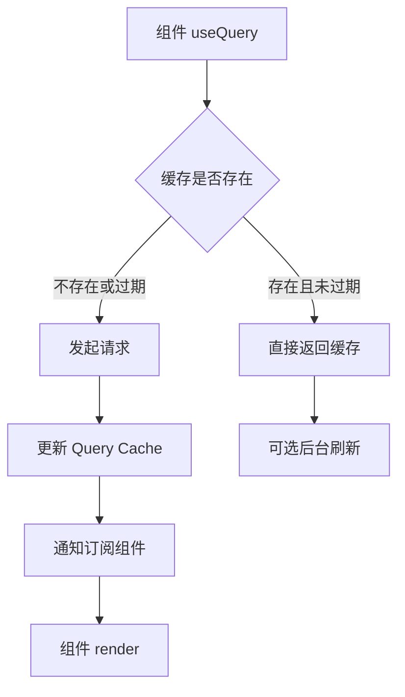

### 4. 高频面试题

**Q：为什么不把接口数据都放 Redux？**

标准回答：

> 接口数据属于服务端状态，核心问题是缓存、过期、重试、同步和失效。Redux 可以做，但需要自己实现很多机制。TanStack Query 专门处理服务端状态，Redux/Zustand 更适合客户端业务状态。

### 5. 实际项目场景

后台表格页：

- URL query 保存筛选分页。
- TanStack Query 根据 queryKey 缓存列表数据。
- Zustand 保存列宽、列显隐等用户交互偏好。
- 表单局部状态放 React Hook Form。

---

## 21. AI Web / 流式输出场景

### 1. 场景特点

AI Web 常见 UI：

- 流式 token 输出。
- 长消息列表。
- Markdown 渲染。
- 代码高亮。
- 工具调用状态。
- 多会话切换。
- 乐观更新和中断生成。

### 2. React 挑战

流式输出如果每个 token 都 setState，可能造成：

- 高频 render。
- Markdown 反复解析。
- 滚动卡顿。
- 长列表 DOM 过多。

### 3. 优化思路

- 对 token 做节流或按 chunk 合并更新。
- 当前生成消息单独组件更新，避免整页 render。
- 长会话使用虚拟列表。
- Markdown 解析结果缓存。
- 代码高亮懒加载。
- 历史消息用 RSC 或服务端分页减少首屏 JS。
- 输入框更新和消息渲染分优先级。

### 4. 流式流程

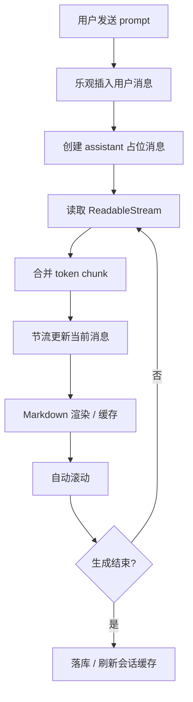

### 5. 面试回答

**Q：AI 聊天流式输出卡顿怎么优化？**

标准回答：

> 先定位是 token 更新太频繁、Markdown 解析重、列表 DOM 多还是滚动逻辑导致。通常会把流式 token 合并成 chunk 后节流 setState，让正在生成的消息单独更新；历史消息 memo 或虚拟滚动；Markdown 和代码高亮做缓存与懒加载；必要时把重解析放 Worker。

---

## 22. 高频面试题标准回答

### 1. React 为什么使用 Virtual DOM？

React 使用 Virtual DOM 不是因为它一定比手写 DOM 快，而是因为它提供了声明式 UI 的中间表示。状态变化后，React 可以生成新的 UI 描述，与旧 Fiber 树比较，批量计算最小变更，再提交到真实 DOM。它还让 React 能跨平台渲染，并结合 Fiber、调度和批量更新优化复杂应用体验。

追问：

- Virtual DOM 有什么缺点？
- 为什么 Solid、Svelte 不依赖 Virtual DOM 也很快？
- Virtual DOM 和 Fiber 是一回事吗？

### 2. Fiber 解决了什么问题？

Fiber 解决旧 React 递归渲染不可中断的问题。旧架构一次更新会递归处理整棵树，组件多时长时间占用主线程。Fiber 把渲染拆成工作单元，用链表结构保存进度，使 React 可以中断、恢复、丢弃工作，并给不同更新设置优先级。

追问：

- Fiber 节点里保存了什么？
- render phase 为什么可中断？
- commit phase 为什么不可中断？

### 3. Hooks 为什么不能写在条件判断里？

Hooks 状态保存在当前组件 Fiber 的 Hook 链表里，React 通过调用顺序匹配每个 Hook 的状态。如果 Hook 写在条件中，某次 render 调用顺序变化，后面的 Hook 就会读取错误位置，导致状态错乱。因此 Hooks 必须在函数组件顶层调用。

追问：

- 自定义 Hook 内部可以写条件吗？
- Hook 依赖数组为什么容易出错？
- React 怎么在开发环境发现 Hook 顺序错误？

### 4. useEffect 和 useLayoutEffect 区别？

`useLayoutEffect` 在 DOM mutation 后、浏览器绘制前同步执行，会阻塞绘制，适合测量布局并同步修正 DOM。`useEffect` 在浏览器绘制后异步执行，不阻塞首屏，适合请求、订阅、日志等副作用。能用 `useEffect` 就不要用 `useLayoutEffect`。

追问：

- 为什么 useLayoutEffect 在 SSR 中会有警告？
- effect cleanup 什么时候执行？
- StrictMode 下 effect 为什么执行两次？

### 5. useMemo 和 useCallback 的区别？

`useMemo` 缓存计算结果，`useCallback` 缓存函数引用。`useCallback(fn, deps)` 近似等价于 `useMemo(() => fn, deps)`。它们主要用于昂贵计算或配合 `React.memo` 稳定 props，不应该盲目使用，因为依赖比较和缓存本身也有成本。

追问：

- useMemo 是否保证永远不重新计算？
- useCallback 能解决闭包问题吗？
- 为什么 memo 子组件仍然重新渲染？

### 6. useRef 为什么不会触发重新渲染？

`useRef` 返回一个稳定对象，值保存在 `.current` 上。修改 `.current` 不会创建 update，也不会进入 React 调度流程，因此不会触发 render。它适合保存 DOM 引用、定时器 id、最新值等不需要驱动 UI 的可变数据。

追问：

- useRef 和 useState 怎么取舍？
- ref 在 commit 阶段什么时候赋值？
- forwardRef 和 useImperativeHandle 用来做什么？

### 7. React key 的作用？

key 用来帮助 React 在同层子节点 Diff 时识别元素身份。稳定 key 可以让 React 正确复用 Fiber 和 DOM，保留组件状态。错误 key 会导致状态串位和 DOM 复用错误。key 不会作为普通 props 传给组件。

追问：

- 为什么 index key 在静态列表中有时可以？
- key 改变为什么会让组件 remount？
- Fragment 可以加 key 吗？

### 8. React 为什么需要批量更新？

批量更新可以把同一事件或同一异步批次中的多个状态变化合并成一次 render，减少重复计算和 DOM 提交，也避免用户看到中间状态。React 18 自动批量更新覆盖 Promise、setTimeout、原生事件等更多场景。

追问：

- 什么时候需要 flushSync？
- React 17 和 18 批处理区别？
- 批量更新和并发渲染是什么关系？

### 9. Concurrent Rendering 是什么？

Concurrent Rendering 是 React 18 支持的可中断渲染能力。React 可以同时准备多个 UI 版本，并根据优先级暂停、恢复或丢弃某些渲染任务。它不是多线程，而是在主线程上通过调度让高优先级交互先响应。

追问：

- 为什么 concurrent 下 render 可能执行多次？
- startTransition 如何标记低优先级更新？
- useDeferredValue 适合什么场景？

### 10. RSC 和 SSR 区别？

SSR 是在服务端生成 HTML，帮助首屏和 SEO，但客户端组件仍需要 JS 和 hydration。RSC 是让组件本身在服务端执行，Server Component 的代码不会发送到客户端，能直接读取服务端资源并减少 bundle size。Next.js App Router 把 RSC、SSR、Streaming 和缓存整合起来。

追问：

- Server Component 能不能有事件？
- `use client` 边界如何影响 bundle？
- Server Action 如何触发缓存失效？

---

## 23. 项目场景题

### 1. 页面卡顿如何排查？

回答框架：

1. 用 React DevTools Profiler 看哪些组件 render 慢、render 次数多。
2. 用 Performance 面板看是否有长任务、布局抖动、脚本执行过长。
3. 判断慢在 React render、commit DOM、浏览器布局绘制、网络还是 hydration。
4. 针对性优化：拆分组件、memo、虚拟列表、缓存计算、代码分割、RSC、减少客户端 JS。

### 2. 大列表如何优化？

标准回答：

> 大列表主要慢在大量 Fiber 创建、DOM 节点过多和浏览器布局绘制。优先使用虚拟滚动，只渲染可视区域；行组件 memo；固定高度减少测量；分页或无限加载；避免把整个列表状态和页面其他状态耦合。

### 3. React 闭包陷阱怎么解决？

常见问题：

```tsx
useEffect(() => {
  const id = setInterval(() => {
    console.log(count);
  }, 1000);
  return () => clearInterval(id);
}, []);
```

这里 `count` 永远是首次 render 的值。

解决：

- 加依赖数组。
- 使用函数式更新。
- 用 ref 保存最新值。
- 使用事件回调模式。

### 4. SSR 首屏优化怎么做？

思路：

- 关键内容 SSR / SSG。
- 非关键模块延迟加载。
- 使用 Streaming SSR 和 Suspense。
- 减少客户端组件数量。
- RSC 下沉服务端逻辑。
- 优化图片、字体、第三方脚本。
- 合理缓存 HTML 和数据。

### 5. Zustand 状态设计怎么讲？

回答框架：

> 我会把 Zustand 用于高频客户端交互状态，比如编辑器画布、当前会话、面板布局。store 设计上按领域拆 slice，组件通过 selector 订阅最小状态切片，避免整个 store 变化导致大面积渲染。服务端数据不放 Zustand，交给 TanStack Query 或 RSC。

### 6. TanStack Query 缓存管理怎么讲？

回答框架：

> queryKey 要表达数据身份，例如 `["orders", filters]`。列表、详情分别缓存；mutation 成功后通过 invalidateQueries 或 setQueryData 更新缓存。对于乐观更新，先取消请求、保存旧缓存、立即更新 UI，失败后回滚，成功后重新校验。

### 7. 流式 AI 输出怎么做？

回答框架：

> 使用 fetch 或 SSE 读取流，前端维护当前 assistant 消息。不要每个 token 都触发整页 setState，而是 chunk 合并、节流更新，并让当前消息组件独立 render。历史消息 memo 或虚拟滚动，Markdown 解析缓存，代码高亮懒加载，必要时用 Worker。

---

## 24. 复习路线

### 第一层：能讲清基础

- JSX 是什么，如何编译。
- Virtual DOM 是什么，为什么需要。
- key 的作用。
- state 和 props 的区别。
- 受控和非受控组件。
- 生命周期和 Hooks 对应关系。

### 第二层：能讲清内部机制

- Fiber 数据结构。
- render phase / commit phase。
- Diff 的启发式策略。
- Hooks 链表和调用顺序。
- setState 更新队列。
- 批量更新。
- 合成事件与事件委托。

### 第三层：能讲清现代 React

- Concurrent Rendering。
- Lane 模型。
- Transition。
- Suspense。
- Streaming SSR。
- Selective hydration。
- RSC。
- Server Action。

### 第四层：能结合工程实践

- 页面卡顿排查。
- 大列表优化。
- Context 性能问题。
- SSR 首屏优化。
- Hydration mismatch 排查。
- Next.js App Router 架构设计。
- AI Web 流式输出优化。

### 面试表达模板

回答 React 深挖题时，推荐结构：

1. 先给一句直接定义。
2. 说明它解决什么问题。
3. 解释 React 内部怎么做。
4. 讲为什么这样设计。
5. 补一个项目场景。
6. 主动提示边界和坑。

示例：

> Fiber 是 React 的新协调架构，它把组件树拆成可中断的工作单元，解决旧递归渲染长时间占用主线程的问题。每个 Fiber 保存组件类型、状态、更新队列、优先级和父子兄弟指针。render phase 中 React 可以按 Fiber 粒度处理任务，时间不够就让出主线程；commit phase 再一次性提交 DOM，保证 UI 一致。在大列表过滤、页面切换这类场景中，Fiber 配合并发渲染可以让输入和点击优先响应。

---

## 速记对比表

| 概念 | 一句话 | 面试重点 |
| --- | --- | --- |
| JSX | UI 描述语法，编译成 Element | 不是 HTML，不是 DOM |
| Element | 不可变 UI 描述对象 | 输入给 Reconciler |
| Fiber | React 内部工作单元 | 可中断、优先级、状态保存 |
| Reconciler | 计算新旧树差异 | render phase |
| Renderer | 提交到宿主环境 | ReactDOM / Native |
| Scheduler | 调度任务优先级 | 时间切片、yield |
| Lane | 更新优先级模型 | 合并、跳过、重试更新 |
| Commit | 真实修改 DOM | 不可中断 |
| useEffect | 绘制后执行副作用 | 不阻塞渲染 |
| useLayoutEffect | 绘制前同步执行 | 可测量布局，会阻塞 |
| Suspense | 等待边界 | lazy、SSR streaming、RSC |
| Transition | 非紧急更新 | 保持输入响应 |
| RSC | 服务端执行组件 | 减少客户端 JS |
| Hydration | 客户端接管 HTML | 绑定事件、恢复交互 |

---

## 最后总结

大厂 React 面试的核心不是背 API，而是围绕三个问题展开：

1. 状态变化后，React 如何计算 UI 变化？
2. 计算和提交过程中，React 如何与浏览器主线程协作？
3. 在真实工程中，如何利用 React / Next.js 架构减少卡顿、减少 bundle、提升首屏和交互体验？

只要能把 Virtual DOM、Fiber、Scheduler、Lane、Hooks、Concurrent Rendering、Suspense、SSR/RSC 和性能优化串成一条完整链路，就已经从“会写 React”进入到“理解 React 架构”的层次。
