## 浏览器原理面试八股整理

> 面向前端 / 全栈 / Node.js / AI Web 工程师的大厂浏览器原理手册。重点不是背 API，而是能讲清楚：浏览器为什么这样设计、内部怎么协作、性能瓶颈在哪里、安全边界是什么、工程里如何取舍。

## 目录

- [1. 浏览器架构与多进程模型](#1-浏览器架构与多进程模型)
- [2. 浏览器线程模型](#2-浏览器线程模型)
- [3. 渲染流程](#3-渲染流程)
- [4. Event Loop](#4-event-loop)
- [5. 宏任务 / 微任务](#5-宏任务--微任务)
- [6. Promise 与 async/await](#6-promise-与-asyncawait)
- [7. JS 执行机制](#7-js-执行机制)
- [8. V8 引擎](#8-v8-引擎)
- [9. 垃圾回收](#9-垃圾回收)
- [10. 闭包 / 作用域链 / 原型链 / this](#10-闭包--作用域链--原型链--this)
- [11. 浏览器缓存](#11-浏览器缓存)
- [12. 浏览器存储](#12-浏览器存储)
- [13. 浏览器安全](#13-浏览器安全)
- [14. 同源策略与 CORS](#14-同源策略与-cors)
- [15. CSP / XSS / CSRF](#15-csp--xss--csrf)
- [16. iframe 与 postMessage](#16-iframe-与-postmessage)
- [17. Web Worker / SharedWorker / SharedArrayBuffer](#17-web-worker--sharedworker--sharedarraybuffer)
- [18. Service Worker](#18-service-worker)
- [19. 渲染优化：回流、重绘、合成层、GPU](#19-渲染优化回流重绘合成层gpu)
- [20. requestAnimationFrame / 防抖 / 节流](#20-requestanimationframe--防抖--节流)
- [21. Fetch / Stream API / 网络请求流程](#21-fetch--stream-api--网络请求流程)
- [22. WebSocket / SSE / AI 流式输出](#22-websocket--sse--ai-流式输出)
- [23. 输入 URL 到页面渲染全过程](#23-输入-url-到页面渲染全过程)
- [24. SSR / Hydration / React Server Component](#24-ssr--hydration--react-server-component)
- [25. 浏览器中的 ESM](#25-浏览器中的-esm)
- [26. WebAssembly 可选](#26-webassembly-可选)
- [27. WebContainer 可选](#27-webcontainer-可选)
- [28. 综合项目场景题](#28-综合项目场景题)

---

## 1. 浏览器架构与多进程模型

### 1.1 背景：浏览器为什么不能只是一个普通应用

早期浏览器可以近似理解为一个“大进程”：地址栏、网络请求、HTML 解析、JS 执行、布局、绘制、插件都挤在同一个进程里。这种模型实现简单、内存占用低，但现代 Web 已经不是静态文档查看器了。

今天一个页面可能同时做这些事：

- 执行复杂 JS，例如 React 渲染、状态管理、数据处理。
- 发起大量网络请求，例如接口、图片、字体、视频、流式响应。
- 操作 DOM、CSSOM、Canvas、WebGL、音视频。
- 嵌入跨站 iframe，例如支付、广告、登录组件。
- 访问敏感能力，例如摄像头、剪贴板、定位、文件选择器。

如果这些能力全部运行在一个进程里，会出现几个严重问题：

1. 稳定性差：一个页面死循环、崩溃或插件异常，可能拖垮整个浏览器。
2. 安全边界弱：恶意网页一旦利用漏洞，就更容易接触系统资源或其他页面数据。
3. 调度困难：多个页面、GPU 合成、网络请求、扩展任务互相抢资源，难以隔离。
4. 权限不可控：网页不应该直接读写文件、调用摄像头或访问操作系统能力。

因此现代浏览器采用多进程架构。它的本质不是“为了更快”这么简单，而是把不可信网页、浏览器自身能力、网络、GPU、扩展等放进不同隔离单元中，用更高的内存和 IPC 成本换取稳定性、安全性和可维护性。

面试可以先这样概括：

> 现代浏览器通常采用多进程架构。Browser 进程负责浏览器主控、导航、标签页、权限和 UI；Renderer 进程负责页面的 HTML/CSS 解析、JS 执行、样式计算、布局和绘制；Network Service 负责网络请求；GPU 进程负责光栅化、图层合成和硬件加速；Utility/Plugin/Extension 等进程负责隔离特定能力。这样一个页面崩溃通常不会拖垮整个浏览器，网页也不能直接访问系统资源。

### 1.2 核心问题：浏览器到底要隔离什么

浏览器面对的代码来源非常复杂：浏览器自身代码相对可信，网页 JS 不可信，扩展权限很高但也需要约束，GPU 驱动和解码器历史上也常出现安全漏洞。多进程架构的核心目标就是隔离。

#### 1.2.1 稳定性隔离

如果 `a.com` 页面 JS 死循环：

```js
while (true) {}
```

在单进程模型中，整个浏览器事件循环都可能被卡住，地址栏、其他标签页、下载任务都无法响应。在多进程模型中，死循环主要卡住该页面所在的 Renderer 进程。Browser 进程仍然可以响应用户操作，例如关闭标签页、打开任务管理器、终止该 Renderer。

这就是 Chrome 中“页面无响应，但浏览器窗口还能操作”的基础。

#### 1.2.2 安全隔离

网页 JS 是不可信代码。它可以来自任意网站，也可能被 XSS 注入。如果 Renderer 能直接读文件、访问摄像头、读其他站点内存，浏览器安全模型就不存在了。

现代浏览器通常让 Renderer 运行在沙箱中：

- Renderer 可以解析页面、执行 JS、构建 DOM、发起“请求意图”。
- Renderer 不能随意读写本地文件、创建任意系统进程或直接访问硬件。
- 敏感操作必须通过 IPC 请求 Browser 进程。
- Browser 进程检查权限、用户授权、同源策略、CORS、下载策略等，再决定是否允许。

例如网页调用：

```js
navigator.mediaDevices.getUserMedia({ video: true })
```

大致流程不是 Renderer 直接打开摄像头，而是：

```text
JS 调用 getUserMedia
  ↓
Renderer 通过 IPC 向 Browser 进程请求权限
  ↓
Browser 进程检查 HTTPS、权限状态、用户授权
  ↓
用户同意后，浏览器受控地创建媒体采集管线
  ↓
Renderer 拿到 MediaStream 对象并使用
```

这样设计的原因是：网页可以表达“我想要什么”，但不能直接控制“系统给不给”。

#### 1.2.3 站点数据隔离

前端常说“同源策略”限制 JS 读取跨源数据，但只靠 JS 层面的规则还不够。假设浏览器引擎出现内存读取漏洞，如果多个站点共享一个进程，攻击页面理论上可能从进程内存中读到其他站点的数据。

站点隔离（Site Isolation）就是为了解决这个问题：浏览器尽量把不同站点放到不同 Renderer 进程中，让操作系统进程边界也参与保护站点数据。

这里要区分几个概念：

| 概念 | 例子 | 说明 |
| --- | --- | --- |
| origin，同源 | `https://a.example.com:443` | 协议、主机、端口都相同 |
| site，站点 | `https://example.com` | 通常按 scheme + 可注册域名划分 |
| process，进程 | Renderer 进程 | 操作系统资源隔离单位 |

所以“不同源”不一定总是“不同进程”，“不同站点”更可能被隔离到不同 Renderer 中。具体策略会受浏览器版本、平台、内存压力、iframe 类型、企业策略等影响。

### 1.3 解决方案：现代浏览器的主要进程

以 Chromium 系浏览器为例，常见进程如下。

| 进程                  | 主要职责                                             | 为什么要独立               |
| ------------------- | ------------------------------------------------ | -------------------- |
| Browser 进程          | 浏览器主控、地址栏、标签页、导航、权限、下载、书签、窗口 UI、进程管理             | 必须保持稳定，不能被网页 JS 拖垮   |
| Renderer 进程         | 解析 HTML/CSS，执行 JS，构建 DOM/CSSOM，样式计算，布局，绘制，处理页面事件 | 网页代码不可信，需要沙箱隔离       |
| Network Service 进程  | DNS、TCP/TLS、HTTP 缓存、Cookie、代理、证书、请求调度            | 网络栈复杂且涉及隐私和安全策略      |
| GPU 进程              | GPU 命令、纹理上传、合成、部分光栅化、WebGL/WebGPU 相关能力           | GPU 驱动复杂，独立后可减少崩溃影响  |
| Utility 进程          | 音视频解码、数据解析、存储、打印、文件处理等特定任务                       | 把高风险或重任务能力拆出去        |
| Extension/Plugin 进程 | 扩展、插件或兼容能力                                       | 扩展权限高，需要与页面和浏览器主流程隔离 |

注意：不同浏览器、不同版本的进程名和拆分方式会变化。面试时更重要的是讲清楚“为什么拆”和“拆完怎么协作”，而不是死记固定数量。

### 1.4 实现原理：进程之间如何协作

进程之间内存默认隔离，Renderer 不能直接调用 Browser 进程里的函数，也不能直接拿到 Network 进程里的数据结构。它们依靠 IPC（Inter-Process Communication，进程间通信）传递消息。

可以把 IPC 理解成浏览器内部的受控消息通道：

```text
Renderer: 我要导航到 https://example.com
  ↓ IPC
Browser: 检查导航策略，选择 Network Service 发请求
  ↓ IPC
Network: 发起 DNS/TCP/TLS/HTTP，请求响应头和响应体
  ↓ IPC
Browser: 决定是否提交导航，选择或创建 Renderer
  ↓ IPC
Renderer: 接收 HTML 字节流，开始解析和渲染
```

IPC 的优点是边界清晰、便于权限检查、崩溃影响小。缺点是有序列化、反序列化、线程切换和进程切换成本。所以多进程不是免费午餐，浏览器需要在隔离和资源消耗之间做权衡。

### 1.5 打开一个页面时发生了什么

以用户在地址栏输入 `https://example.com` 为例，一个简化流程如下：

```text
1. 用户输入 URL，按下回车
   ↓
2. Browser 进程接收导航请求
   - 处理地址栏输入
   - 判断是搜索词还是 URL
   - 创建导航任务
   ↓
3. Browser 进程通知 Network Service 发起请求
   - DNS 查询
   - 建立 TCP 连接
   - TLS 握手
   - 发送 HTTP 请求
   - 处理缓存、Cookie、重定向、证书
   ↓
4. 收到响应头
   - Browser 判断 MIME 类型、下载策略、安全策略
   - 如果是 HTML，准备提交导航
   ↓
5. Browser 选择或创建 Renderer 进程
   - 考虑站点隔离
   - 考虑进程复用
   - 考虑内存和后台状态
   ↓
6. Renderer 接收 HTML 字节流
   - 解析 HTML 生成 DOM
   - 解析 CSS 生成 CSSOM
   - 执行 JS
   - 构建渲染树、布局、绘制
   ↓
7. Renderer 提交绘制结果或图层信息
   ↓
8. GPU 进程进行光栅化、合成
   ↓
9. Browser 窗口显示最终画面
```

对应的协作图：

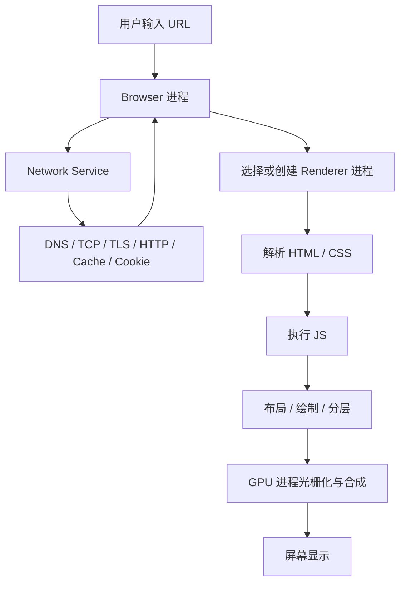

这个流程也解释了为什么浏览器架构会和后续章节强相关：

- 网络请求流程会展开 Network Service、DNS、TCP/TLS、HTTP 缓存。
- 渲染流程会展开 DOM、CSSOM、Layout、Paint、Composite。
- Event Loop 会展开 Renderer 主线程如何调度 JS、任务队列、微任务和渲染。
- 浏览器安全会展开沙箱、同源策略、CORS、CSP、Cookie、权限模型。

### 1.6 一个 Tab 一定是一个进程吗

不一定。这是面试高频陷阱。

更准确的说法是：现代浏览器通常以“站点隔离”和“进程复用”为基础，而不是简单地“一个 Tab 一个进程”。

可能出现以下情况：

1. 同一个 Tab 中的跨站 iframe 可能使用独立 Renderer 进程。
2. 多个同站页面可能复用 Renderer 进程。
3. 浏览器在内存紧张时可能调整进程复用策略。
4. 扩展、Service Worker、Shared Worker、GPU、Network 可能有自己的进程或线程模型。

例如页面结构如下：

```html
<!-- https://shop.example 页面 -->
<iframe src="https://pay.example-pay.com"></iframe>
<iframe src="https://ads.other-site.com"></iframe>
```

在启用站点隔离的浏览器中，主页面、支付 iframe、广告 iframe 可能分别位于不同 Renderer 进程。跨进程 iframe 通常称为 OOPIF（Out-of-Process iframe）。

这带来两个结果：

- 安全性更好：广告 iframe 即使被攻击，也更难读取主站或支付站点的数据。
- 实现更复杂：一个页面的坐标、输入事件、渲染结果可能来自多个 Renderer，需要 Browser 和合成器统一协调。

### 1.7 Renderer 沙箱：网页为什么不能直接操作系统

Renderer 进程负责执行网页代码，但它的权限被限制。它可以做页面内部的工作：

- 执行 JS。
- 读写当前页面 DOM。
- 计算样式和布局。
- 处理用户事件回调。
- 通过浏览器提供的 API 发起受控请求。

它不能随意做这些事：

- 直接读取本地任意文件。
- 绕过用户授权打开摄像头或麦克风。
- 直接访问其他站点的 Cookie 或响应内容。
- 直接创建系统进程。
- 直接控制浏览器地址栏和下载目录。

这背后的设计原则是最小权限原则：Renderer 只拿完成页面渲染所需的最低权限，其他能力统一交给 Browser 进程仲裁。

这也能解释很多前端现象：

- `input[type="file"]` 需要用户手势，因为文件读取是敏感能力。
- 跨源请求受 CORS 限制，因为 Renderer 不能随意读取其他站点响应。
- 剪贴板、摄像头、定位通常要求 HTTPS 和用户授权。
- 下载、弹窗、通知等能力会被浏览器策略限制，防止网页滥用。

### 1.8 多进程的代价

多进程解决了很多问题，但也带来成本。

| 代价      | 解释                     | 浏览器的缓解方式                             |
| ------- | ---------------------- | ------------------------------------ |
| 内存占用更高  | 每个进程都有独立地址空间、堆、栈和运行时结构 | 进程复用、后台标签页冻结、丢弃页面、内存回收               |
| IPC 有开销 | 进程间通信需要消息传递和上下文切换      | 批量消息、共享内存、减少高频跨进程调用                  |
| 架构复杂    | 导航、输入、渲染、权限都要跨进程协调     | 明确进程职责和安全边界                          |
| 调试更难    | 一个页面可能涉及多个进程、线程和队列     | DevTools、Chrome Task Manager、Tracing |

所以面试中不要只说“多进程性能更好”。更严谨的表达是：多进程主要提升稳定性、安全性和隔离能力；性能上有收益也有成本，浏览器通过进程复用、任务调度、合成线程、缓存和冻结策略来平衡。

### 1.9 实际项目中的理解价值

理解多进程模型不是为了背 Chromium 架构图，而是能解释真实问题。

#### 页面卡死但浏览器没崩

```js
button.onclick = () => {
  while (true) {}
};
```

点击后当前页面无响应，是因为 Renderer 主线程被 JS 死循环占满。但 Browser 进程还活着，所以你通常仍然可以关闭这个 Tab。

#### 跨站 iframe 为什么更安全但更重

后台系统经常嵌入 BI、客服、支付、广告或第三方登录 iframe。如果这些 iframe 来自不同站点，浏览器可能为它们创建独立 Renderer。这样安全性更好，但内存和进程通信成本更高。复杂中后台页面 iframe 很多时，需要关注内存、首屏、通信频率和销毁时机。

#### Chrome 任务管理器为什么能看到很多进程

Chrome 任务管理器中可能看到：

- Tab 对应的 Renderer。
- GPU Process。
- Network Service。
- Extension。
- Service Worker。
- Utility 进程。

这不是“浏览器开太多重复程序”，而是浏览器把不同职责拆到不同隔离单元里。

### 1.10 容易混淆的知识

#### 进程 VS 线程

| 对比项 | 进程 | 线程 |
| --- | --- | --- |
| 定义 | 资源隔离单位 | CPU 调度执行单位 |
| 内存 | 默认不共享地址空间 | 同一进程内线程共享内存 |
| 崩溃影响 | 一个进程崩溃通常不直接破坏其他进程 | 一个线程崩溃可能导致整个进程崩溃 |
| 浏览器例子 | Browser、Renderer、GPU、Network | Renderer 主线程、合成线程、光栅线程、Worker 线程 |

一句话：进程解决“隔离”，线程解决“执行”。

#### Browser 进程 VS Renderer 进程

| Browser 进程 | Renderer 进程 |
| --- | --- |
| 可信度更高，负责浏览器主控 | 运行网页代码，不可信 |
| 管理导航、权限、下载、窗口、标签页 | 解析 HTML/CSS，执行 JS，布局绘制 |
| 可以协调系统能力 | 运行在沙箱中，权限受限 |
| 崩溃会影响整个浏览器 | 崩溃通常影响对应页面或站点实例 |

#### 多进程 VS 多线程

浏览器不是“只多进程”或“只多线程”，而是两者结合：

```text
Browser 进程
  ├─ UI 线程
  ├─ IO 线程
  └─ 其他内部线程

Renderer 进程
  ├─ 主线程：JS、DOM、样式、布局
  ├─ 合成线程：图层合成调度
  ├─ 光栅线程：绘制指令转位图
  └─ Worker 线程：Web Worker / Worklet 等
```

本章重点是“进程级隔离”；下一章会进一步讲 Renderer 内部线程如何协作。

### 1.11 高频面试题

| 问题                            | 回答思路                                                                    |
| ----------------------------- | ----------------------------------------------------------------------- |
| 浏览器为什么采用多进程架构？                | 从稳定性、安全性、站点数据隔离、权限隔离、任务调度说起，再补充代价是内存和 IPC。不要只说“为了性能”。                   |
| Browser 进程和 Renderer 进程分别做什么？ | Browser 管浏览器主控、导航、权限、UI、下载和进程管理；Renderer 管页面解析、JS、DOM、样式、布局、绘制，并运行在沙箱里。 |
| 一个 Tab 是一个进程吗？                | 不一定。更准确是浏览器按站点隔离和进程复用策略分配 Renderer。跨站 iframe 可能是 OOPIF，多 Tab 也可能复用进程。   |
| Renderer 为什么不能直接访问文件或摄像头？     | Renderer 执行不可信网页代码，必须最小权限运行。敏感能力通过 IPC 交给 Browser 进程做权限检查和用户授权。         |
| 站点隔离解决什么问题？                   | 它把不同站点尽量放进不同 Renderer，使操作系统进程边界参与保护站点数据，降低引擎漏洞导致跨站数据泄露的风险。              |
| 多进程有什么缺点？                     | 内存更高、IPC 更慢、架构复杂、调试困难。浏览器通过进程复用、后台冻结、共享内存、任务调度等方式缓解。                    |
| GPU 进程有什么作用？                  | 负责 GPU 命令、图层合成、纹理上传、部分光栅化和硬件加速；独立 GPU 进程也能隔离 GPU 驱动崩溃风险。                |
| 页面崩溃后为什么其他 Tab 通常还在？          | 因为崩溃多发生在某个 Renderer 进程，Browser 进程和其他 Renderer 仍然存活。                     |

### 1.12 本章总结

浏览器多进程架构的主线可以概括为：

```text
现代 Web 能力越来越强
  ↓
网页代码不可信，任务也越来越重
  ↓
单进程模型无法保证稳定性和安全性
  ↓
浏览器拆分 Browser / Renderer / Network / GPU / Utility 等进程
  ↓
Renderer 沙箱化，敏感能力交给 Browser 进程仲裁
  ↓
不同站点尽量进程隔离，降低跨站数据泄露风险
  ↓
代价是更多内存、IPC 成本和架构复杂度
```

面试时最好的回答不是背进程列表，而是讲清楚设计取舍：浏览器把“不可信、容易崩、资源重、权限敏感”的部分拆开，用进程边界和 IPC 建立安全、稳定、可控的运行环境。

---

## 2. 浏览器线程模型

### 2.1 背景：有了多进程，为什么还需要多线程

上一章讲到，进程解决的是“隔离”问题：把 Browser、Renderer、Network、GPU 等职责拆开，让一个页面或某个组件崩溃时，不至于拖垮整个浏览器。

但进程只是资源隔离单位，真正执行任务的是线程。一个 Renderer 进程内部也有很多事情要同时推进：

- 解析 HTML，构建 DOM。
- 执行 JS，响应点击、输入、定时器、Promise 回调。
- 计算 CSS 样式。
- 执行 Layout，计算元素位置和尺寸。
- Paint，生成绘制指令。
- Raster，把绘制指令转成位图。
- Composite，把多个图层合成最终画面。
- 运行 Web Worker，处理后台计算。

如果所有工作都挤在一个线程中，页面很容易因为某个重任务而完全失去响应。浏览器因此在 Renderer 内部继续拆分线程：主线程负责必须串行且需要一致性的页面逻辑，合成线程、光栅线程、Worker 线程等负责可以并行或半并行的工作。

面试可以先这样答：

> 进程是资源隔离单位，线程是执行单位。浏览器 Renderer 进程内部通常有主线程、合成线程、光栅线程、Worker 线程等。主线程负责 JS 执行、DOM 操作、HTML 解析、样式计算、布局和部分绘制；合成线程负责图层合成调度；光栅线程把绘制指令转成位图；Worker 线程用于后台计算。JS 和 DOM 大多放在同一个主线程，是为了避免多线程同时修改 DOM 带来的竞态和同步复杂度。

### 2.2 核心问题：为什么 JS 和 DOM 主要运行在同一个主线程

JS 可以读写 DOM：

```js
const box = document.querySelector(".box");
box.style.width = "200px";
console.log(box.offsetWidth);
```

这段代码看起来简单，但它要求浏览器给出一个一致的世界：

1. JS 修改了元素宽度。
2. JS 立刻读取 `offsetWidth`。
3. 浏览器必须返回修改后的、可信的布局结果。

如果 JS 线程、DOM 线程、布局线程完全并行，问题会非常复杂：

```text
布局线程正在读取 DOM 树
  ↓
JS 线程同时修改 DOM 节点和样式
  ↓
布局线程读到一半旧数据、一半新数据
  ↓
页面结果不确定，甚至内存结构被破坏
```

浏览器当然可以加锁，但这会带来新问题：

- 每次 DOM 读写都要锁，性能开销大。
- 容易出现死锁。
- JS 开发者需要理解复杂并发模型。
- 渲染结果和事件顺序更难预测。

所以浏览器选择了一种更稳定的模型：把 JS 执行、DOM 修改、样式计算、布局等关键步骤集中在主线程，以串行执行换取一致性和可理解性。

这也是“JS 是单线程”的准确含义：不是浏览器只有一个线程，而是同一个页面的 JS 执行和 DOM 操作主要在 Renderer 主线程上串行运行。

### 2.3 Renderer 进程中的主要线程

不同浏览器、不同版本的实现细节会变化，但前端面试最常讨论的是下面几类线程。

| 线程                     | 主要职责                                        | 和前端的关系                        |
| ---------------------- | ------------------------------------------- | ----------------------------- |
| 主线程 Main Thread        | HTML 解析、JS 执行、DOM 操作、样式计算、Layout、Paint、事件回调 | 页面卡顿的核心现场                     |
| 合成线程 Compositor Thread | 管理图层树、处理部分滚动和合成动画、提交帧                       | `transform`、`opacity` 动画不卡的关键 |
| 光栅线程 Raster Worker     | 把绘制指令转换成位图纹理                                | 大面积绘制、复杂阴影、图片会影响它             |
| Worker 线程              | 执行 Web Worker、部分 Worklet 等后台任务              | 适合大计算，但不能直接操作 DOM             |
| 内部辅助线程                 | IO、解码、存储、垃圾回收辅助任务等                          | 具体实现相关，面试不必死记数量               |

可以用这张图建立整体模型：

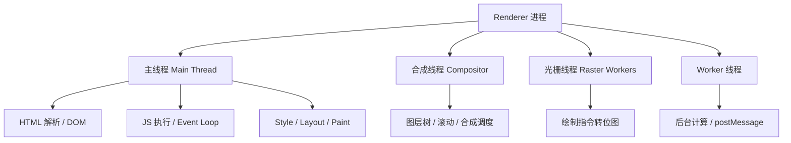

### 2.4 主线程：为什么它最容易成为性能瓶颈

主线程像页面的“总调度现场”。大量关键工作都要在这里排队：

```text
一个任务开始
  ↓
执行 JS 回调
  ↓
可能修改 DOM / class / style
  ↓
执行微任务
  ↓
浏览器在合适时机更新渲染
  ↓
处理下一轮任务
```

例如一次点击触发 React 更新：

```text
用户点击按钮
  ↓
Browser 进程接收输入事件
  ↓
事件被发送到对应 Renderer
  ↓
Renderer 主线程执行 click 回调
  ↓
React setState
  ↓
React 计算新虚拟 DOM，执行 diff
  ↓
React 提交 DOM 更新
  ↓
浏览器重新计算样式
  ↓
需要时执行 Layout
  ↓
生成 Paint 指令或更新合成属性
  ↓
合成线程/GPU 输出新画面
```

如果 click 回调里执行了 300ms 的同步计算：

```js
button.onclick = () => {
  const start = performance.now();
  while (performance.now() - start < 300) {}
  box.textContent = "done";
};
```

这 300ms 内主线程无法及时处理：

- 后续点击、键盘输入、滚动事件。
- 定时器回调。
- Promise 微任务之后的渲染机会。
- 样式计算、布局、绘制。
- React 后续调度。

所以页面卡顿的本质通常不是“浏览器慢”，而是主线程被长任务占满。浏览器把超过 50ms 的主线程任务称为 Long Task，因为 60Hz 屏幕下一帧大约只有 16.7ms，50ms 已经足够连续错过多帧。

### 2.5 合成线程：为什么有些动画不阻塞主线程也能动

渲染并不是每一帧都必须完整经历 JS、样式、布局、绘制、光栅化、合成。浏览器会把页面拆成多个图层，某些变化只需要重新合成图层即可。

典型例子：

```css
.box {
  transition: transform 300ms;
}

.box:hover {
  transform: translateX(100px);
}
```

`transform` 通常不会改变其他元素的布局位置，它更多是在已有图层上做矩阵变换。浏览器可以让合成线程参与调度，复用已经光栅化好的位图纹理，只改变图层的位置、缩放、透明度等合成参数。

对比 `left`：

```css
.box {
  position: relative;
  transition: left 300ms;
}

.box:hover {
  left: 100px;
}
```

`left` 可能影响布局，需要主线程重新计算元素位置，后续可能触发 Paint 和 Raster。它更容易和 JS、事件回调、样式计算抢主线程时间。

可以这样理解：

```text
修改 width / height / top / left
  ↓
可能影响布局
  ↓
Style / Layout / Paint / Composite

修改 color / box-shadow
  ↓
不改变布局，但需要重新绘制
  ↓
Paint / Raster / Composite

修改 transform / opacity
  ↓
通常只改图层合成参数
  ↓
Composite
```

这就是为什么性能优化里常建议动画优先使用 `transform` 和 `opacity`。但要注意，“合成动画一定不卡”也不严谨：如果图层太多、纹理太大、GPU 内存压力高、主线程仍有必要参与，动画仍然可能掉帧。

### 2.6 光栅线程：Paint 指令如何变成屏幕像素

Paint 阶段不是直接把像素画到屏幕上。更准确地说，主线程会生成绘制指令列表，例如：

```text
画一个矩形
画一段文字
画一张图片
画一个阴影
裁剪某个区域
```

这些绘制指令随后会被光栅化，转换成位图纹理，再交给 GPU 合成。光栅化工作可以分块并行处理，这就是光栅线程存在的原因。

简化流程：

```text
主线程 Paint
  ↓
生成 Display List / Paint Records
  ↓
分块 Tiling
  ↓
Raster Worker 并行光栅化
  ↓
生成 Bitmap / GPU Texture
  ↓
Compositor 合成到屏幕
```

实际项目中，大面积阴影、滤镜、复杂 SVG、大图、频繁重绘都可能增加 Paint 和 Raster 成本。它们不一定表现为 JS 执行慢，但会表现为掉帧、滚动不流畅或 GPU/渲染开销高。

### 2.7 Worker 线程：为什么能后台计算却不能操作 DOM

Web Worker 的目标是把耗时 JS 计算从主线程移出去，避免阻塞输入和渲染。

主线程：

```js
const worker = new Worker("./worker.js");

worker.postMessage({ type: "sum", payload: [1, 2, 3] });

worker.onmessage = (event) => {
  console.log(event.data);
};
```

Worker：

```js
self.onmessage = (event) => {
  const result = event.data.payload.reduce((a, b) => a + b, 0);
  self.postMessage(result);
};
```

执行流程：

```text
主线程创建 Worker
  ↓
Worker 线程加载并执行 worker.js
  ↓
主线程 postMessage 发送数据
  ↓
浏览器复制或转移数据到 Worker
  ↓
Worker 执行计算
  ↓
Worker postMessage 返回结果
  ↓
主线程收到 message 事件
  ↓
主线程更新 DOM
```

Worker 不能直接操作 DOM，是因为 DOM 主要属于主线程。如果 Worker 也能随意改 DOM，就会重新引入多线程 DOM 竞态问题。浏览器让 Worker 和主线程通过消息通信，牺牲一部分通信便利性，换取 DOM 模型稳定。

适合放进 Worker 的任务：

- 大数组计算。
- 图片像素处理。
- 加密、压缩、解析大文件。
- 复杂数据排序、搜索、聚合。
- AI Web 场景中的部分本地推理或流式数据处理。

不适合放进 Worker 的任务：

- 频繁、细碎、需要不断读写 DOM 的逻辑。
- 数据量很小的计算，因为通信成本可能超过收益。
- 依赖大量主线程上下文的 UI 更新。

### 2.8 定时器、网络、事件到底在哪个线程执行

这是面试中非常容易混淆的点。

#### 定时器回调不是“定时器线程执行”

`setTimeout` 的计时可以由浏览器内部机制管理，但回调函数最终仍然要回到 JS 主线程执行。

```js
setTimeout(() => {
  console.log("timer");
}, 1000);
```

简化流程：

```text
主线程执行 setTimeout
  ↓
浏览器记录定时器
  ↓
时间到
  ↓
回调被放入任务队列
  ↓
主线程空闲后，Event Loop 取出任务
  ↓
主线程执行回调
```

如果主线程正在执行长任务，即使 1000ms 到了，回调也不能立刻执行：

```js
setTimeout(() => console.log("timeout"), 0);

const start = performance.now();
while (performance.now() - start < 2000) {}

console.log("end");
```

输出顺序一定是：

```text
end
timeout
```

原因不是定时器不准，而是回调只能等主线程空出来。

#### 网络请求不是 JS 主线程亲自下载

`fetch` 发起后，网络请求由浏览器网络栈处理，通常涉及 Network Service 或浏览器内部网络线程。JS 主线程不会阻塞等待响应。

```js
fetch("/api/user")
  .then((res) => res.json())
  .then((data) => {
    render(data);
  });
```

简化流程：

```text
JS 主线程调用 fetch
  ↓
浏览器网络栈接管请求
  ↓
JS 继续向下执行
  ↓
响应到达，Promise 状态变为 fulfilled
  ↓
then 回调进入微任务队列
  ↓
主线程在合适时机执行微任务
  ↓
render(data) 更新 UI
```

所以“网络是异步的”不是因为 JS 开了一个线程去请求，而是浏览器把网络能力放在 JS 引擎之外，结果再通过任务/微任务机制回到主线程。

#### 用户输入也要回到主线程

鼠标、键盘、触摸等输入事件通常先由 Browser 进程接收，再路由到对应 Renderer。是否需要主线程参与，取决于事件类型、监听器和页面状态。

例如滚动：

- 如果页面没有阻塞滚动的 JS 监听，合成线程可能直接处理滚动，体验更顺滑。
- 如果存在可能调用 `preventDefault()` 的触摸事件监听，浏览器可能需要等待主线程确认，滚动就可能被 JS 卡住。

这也是为什么移动端性能优化会关注 `passive: true`：

```js
window.addEventListener(
  "touchmove",
  (event) => {
    // 不调用 preventDefault
  },
  { passive: true }
);
```

它告诉浏览器：这个监听器不会阻止默认滚动，浏览器可以更放心地走快速滚动路径。

### 2.9 一次页面交互的线程级时间线

以“点击按钮后修改状态并触发动画”为例：

```text
1. 用户点击
   ↓
2. Browser 进程接收输入事件
   ↓
3. 事件路由到目标 Renderer
   ↓
4. Renderer 主线程执行 click 回调
   ↓
5. JS 调用 setState / 修改 DOM
   ↓
6. 主线程完成当前任务，并清空微任务队列
   ↓
7. 浏览器准备渲染
   ↓
8. 主线程 Style：重新计算受影响元素样式
   ↓
9. 主线程 Layout：必要时重新计算几何信息
   ↓
10. 主线程 Paint：生成绘制指令
   ↓
11. 光栅线程 Raster：把绘制指令转成位图
   ↓
12. 合成线程 Composite：合成图层
   ↓
13. GPU / 浏览器窗口显示新帧
```

如果这次更新只改变 `transform`：

```text
JS 修改 class
  ↓
样式确认 transform 变化
  ↓
不需要重新 Layout
  ↓
可能不需要重新 Paint
  ↓
合成线程更新图层变换
  ↓
输出新帧
```

如果这次更新读取布局又写布局：

```js
const width = box.offsetWidth; // 读布局
box.style.width = width + 10 + "px"; // 写布局
const height = box.offsetHeight; // 又读布局
```

浏览器可能被迫提前刷新布局，形成强制同步布局。大量循环读写会让主线程在 JS 和 Layout 之间来回切换，造成卡顿。

### 2.10 容易混淆的知识

#### JS 单线程 VS 浏览器多线程

| 说法 | 正确理解 |
| --- | --- |
| JS 是单线程 | 同一页面的 JS 执行通常在一个主线程上串行运行 |
| 浏览器是单线程 | 错。浏览器有多进程、多线程 |
| 异步就是开新线程 | 不一定。异步表示结果未来再通知，可能由网络栈、任务队列、系统 IO 或 Worker 完成 |
| Worker 能让 DOM 更新更快 | Worker 不能直接操作 DOM，只能把计算结果发回主线程 |

#### 主线程 VS 合成线程

| 主线程                           | 合成线程                           |
| ----------------------------- | ------------------------------ |
| 执行 JS、DOM、Style、Layout、Paint  | 管理图层合成、部分滚动和合成动画               |
| 容易被长 JS 阻塞                    | 某些场景能绕开主线程保持流畅                 |
| 负责页面逻辑一致性                     | 负责把已有图层高效组合成帧                  |
| `width`、`height`、DOM 大量更新常影响它 | `transform`、`opacity` 更容易走合成路径 |

#### Web Worker VS Service Worker

| 对比项 | Web Worker | Service Worker |
| --- | --- | --- |
| 主要目的 | 后台计算，减轻主线程压力 | 网络代理、离线缓存、推送、后台同步 |
| 生命周期 | 通常由页面创建，跟页面关系更直接 | 可独立于页面生命周期运行 |
| 能否操作 DOM | 不能 | 不能 |
| 典型通信 | `postMessage` | `postMessage`、拦截 `fetch` 事件 |

#### 宏任务、微任务和线程

宏任务、微任务是 Event Loop 的调度概念，不是线程类型。

```text
线程：谁来执行代码
任务队列：代码按什么顺序被调度
Event Loop：主线程如何从队列中取任务并安排渲染
```

后续 Event Loop 章节会详细讲：为什么 Promise 回调通常比 `setTimeout` 更早执行，以及微任务为什么会影响渲染时机。

### 2.11 高频面试题

| 问题                                | 回答思路                                                                                         |
| --------------------------------- | -------------------------------------------------------------------------------------------- |
| 浏览器 Renderer 进程里有哪些重要线程？          | 主线程、合成线程、光栅线程、Worker 线程等。主线程负责 JS/DOM/Style/Layout/Paint，合成线程负责图层合成，光栅线程负责位图化，Worker 负责后台计算。 |
| JS 为什么设计成单线程？                     | 因为 JS 可以操作 DOM。若多线程同时读写 DOM，会有竞态、锁、死锁和一致性问题。浏览器选择主线程串行模型，让页面状态和执行顺序更可预测。                     |
| 页面卡顿的本质是什么？                       | 主线程被长任务占用，无法及时处理输入、JS 回调、样式、布局和渲染。超过 50ms 的任务通常可视为 Long Task。                                |
| 定时器回调在哪个线程执行？                     | 计时由浏览器内部机制处理，但回调最终进入任务队列，由 JS 主线程执行。主线程忙时，定时器会延迟。                                            |
| fetch 是不是在 JS 线程里请求网络？            | 不是。JS 调用 `fetch` 后网络栈接管请求，响应回来后通过 Promise 微任务把结果交还主线程。                                       |
| Worker 为什么不能操作 DOM？               | 为了避免多线程同时修改 DOM 的竞态。Worker 适合计算，结果通过 `postMessage` 回主线程，再由主线程更新 DOM。                         |
| 为什么 `transform` 动画通常比 `left` 更流畅？ | `transform` 通常不触发布局，可能只需要合成线程更新图层变换；`left` 可能触发布局、绘制和光栅化，更依赖主线程。                             |
| passive 事件监听为什么能优化滚动？             | 它告诉浏览器监听器不会调用 `preventDefault()`，浏览器可以减少等待主线程确认的成本，让滚动更容易走快速路径。                              |
| 主线程和合成线程是什么关系？                    | 主线程生成 DOM、样式、布局和绘制信息；合成线程根据图层信息调度合成。某些滚动和合成动画可以在主线程繁忙时继续推进。                                  |

### 2.12 本章总结

浏览器线程模型可以用一条主线理解：

```text
进程解决隔离问题
  ↓
线程解决执行与并行问题
  ↓
DOM / JS / Layout 需要一致性，所以集中在主线程
  ↓
主线程过忙会阻塞输入、脚本和渲染，形成卡顿
  ↓
合成线程、光栅线程、Worker 线程分担可并行的工作
  ↓
合理使用 Worker、transform、opacity、passive、任务拆分，可以降低主线程压力
```

面试时不要只背“JS 是单线程”。更完整的回答是：浏览器是多进程、多线程系统；同一页面的 JS 和 DOM 主要在 Renderer 主线程上串行执行，是为了保证 DOM 状态一致；浏览器再通过合成线程、光栅线程、Worker 和异步网络栈，把可以并行的工作拆出去，从而在一致性和性能之间取得平衡。

---

## 3. 渲染流程

### 3.1 概念解释

浏览器渲染流程是把 HTML、CSS、JS 转换成屏幕像素的过程。核心步骤包括：解析 HTML 生成 DOM，解析 CSS 生成 CSSOM，合并成 Render Tree，布局，绘制，分层，光栅化，合成。

面试回答：

> 浏览器拿到 HTML 后会边下载边解析，构建 DOM；遇到 CSS 构建 CSSOM；DOM 和 CSSOM 结合生成渲染树；然后计算每个元素的位置和尺寸，也就是布局；再生成绘制指令；最后经过分层、光栅化和合成，把页面显示到屏幕上。

### 3.2 底层原理

DOM 描述结构，CSSOM 描述样式，渲染树只包含需要显示的节点。例如 `display: none` 不会进入渲染树，`visibility: hidden` 会占据布局但不可见。

浏览器把渲染拆成多个阶段，是为了支持增量更新。JS 改了一个 class，浏览器不一定重走全部流程，可能只做样式计算、重绘或合成。

### 3.3 工作流程

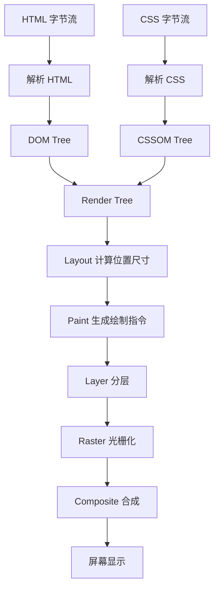

渲染关键阻塞点：

1. CSS 会阻塞渲染，因为渲染树需要样式。
2. 同步 JS 会阻塞 HTML 解析，因为 JS 可能修改 DOM。
3. JS 执行前如果依赖尚未加载的 CSS，可能等待 CSSOM。
4. 图片不阻塞 DOM 解析，但可能影响布局和 LCP。

### 3.4 高频面试题

| 问题 | 标准回答 | 继续追问 |
| --- | --- | --- |
| 浏览器渲染流程？ | DOM、CSSOM、Render Tree、Layout、Paint、Composite。 | 哪些阶段开销最大？ |
| CSS 会阻塞 DOM 解析吗？ | 不直接阻塞 DOM 解析，但阻塞渲染，也可能阻塞 JS 执行。 | 为什么 JS 会等 CSS？ |
| JS 为什么阻塞解析？ | JS 可能修改 DOM，浏览器要保证执行顺序。 | async/defer 区别？ |
| display none 和 visibility hidden 区别？ | 前者不参与布局，后者占位但不可见。 | 哪个会触发回流？ |

### 3.5 常见追问

Q：为什么 CSS 会阻塞渲染？

A：浏览器需要知道元素最终样式才能构建渲染树和布局。如果 CSS 没加载完就渲染，可能出现无样式闪烁和大量无效布局。

Q：为什么图片要设置宽高？

A：图片未加载时浏览器不知道占位尺寸，加载后可能改变布局，造成 CLS。设置宽高或 aspect-ratio 可以稳定布局。

### 3.6 实际项目场景

- 首屏 CSS 应尽量小，关键 CSS 内联可以减少首屏阻塞。
- 大 JS 包会阻塞主线程，导致 FCP、TTI、INP 变差。
- 图片懒加载、预加载首屏大图、设置尺寸，是优化 LCP 和 CLS 的常见手段。

---

## 4. Event Loop

### 4.1 概念解释

Event Loop 是浏览器协调 JS 执行、异步回调、用户输入、渲染更新的调度机制。因为 JS 主线程一次只能执行一个任务，异步任务完成后不能立刻打断当前代码，只能进入队列等待事件循环调度。

面试回答：

> Event Loop 负责从任务队列中取出宏任务执行，执行完一个宏任务后清空微任务队列，然后浏览器在合适时机进行渲染，再进入下一轮循环。它让单线程 JS 也能处理异步、事件和渲染。

### 4.2 底层原理

Event Loop 存在的原因是主线程需要统一调度。浏览器不能让网络回调、定时器、点击事件、渲染更新随意打断 JS，否则执行顺序不可预测。

微任务优先，是为了让当前同步逻辑产生的“后续收尾工作”尽快完成，保证 Promise 链、MutationObserver 等在下一次渲染或下一个宏任务前得到处理。

### 4.3 工作流程

1. 执行一个宏任务，例如 script、setTimeout 回调、事件回调。
2. 执行过程中产生微任务，放入微任务队列。
3. 当前宏任务结束。
4. 清空所有微任务，微任务中继续产生微任务也会继续执行。
5. 浏览器判断是否需要渲染。
6. 执行 requestAnimationFrame 回调、布局、绘制等。
7. 进入下一轮事件循环。

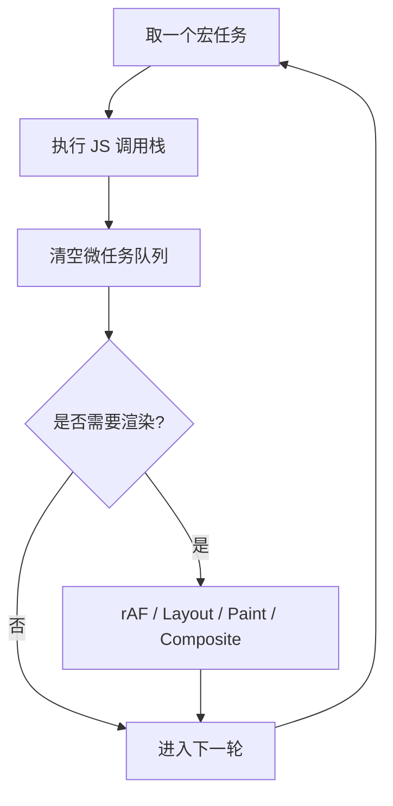

### 4.4 高频面试题

```js
console.log(1);
setTimeout(() => console.log(2), 0);
Promise.resolve().then(() => console.log(3));
console.log(4);
```

输出：`1 4 3 2`。

解释：同步代码先执行，Promise then 是微任务，在当前宏任务结束后执行；setTimeout 是宏任务，下一轮再执行。

| 问题 | 标准回答 | 继续追问 |
| --- | --- | --- |
| Event Loop 是什么？ | 协调宏任务、微任务、渲染和事件的调度机制。 | 浏览器和 Node.js Event Loop 有区别吗？ |
| Promise 为什么比 setTimeout 先执行？ | Promise then 是微任务，setTimeout 是宏任务，当前宏任务结束后先清空微任务。 | 微任务过多会怎样？ |
| 渲染发生在什么时候？ | 通常在一次宏任务和微任务清空之后，浏览器选择合适时机渲染。 | rAF 在哪里执行？ |

### 4.5 常见追问

Q：为什么微任务会导致页面卡顿？

A：微任务队列必须清空后浏览器才有机会进入渲染。如果微任务不断递归产生新的微任务，主线程会长期被占用，用户输入和页面渲染都被饿死。

Q：setTimeout 0ms 是立即执行吗？

A：不是。它表示尽快把回调放入任务队列，必须等当前调用栈、微任务和前面的任务完成后才执行，还受浏览器最小延迟和后台节流影响。

### 4.6 实际项目场景

- React 状态更新、Promise 链、大量微任务都可能影响渲染时机。
- 大计算应切片到多个宏任务，或用 Worker，避免长任务。
- 动画逻辑应放在 `requestAnimationFrame`，和浏览器刷新节奏对齐。

---

## 5. 宏任务 / 微任务

### 5.1 概念解释

宏任务是事件循环的一次主要任务，例如 script、setTimeout、setInterval、I/O、用户事件。微任务是当前宏任务结束后的高优先级队列，例如 Promise 回调、queueMicrotask、MutationObserver。

面试回答：

> 宏任务代表一轮事件循环中的主要工作，微任务代表当前任务结束后要立刻处理的收尾任务。执行顺序是：一个宏任务执行完，清空所有微任务，然后浏览器才可能渲染，再执行下一个宏任务。

### 5.2 底层原理

微任务是为了保证异步链式逻辑的连续性。例如 Promise 的 `then` 应该尽快在当前同步代码后执行，而不是等定时器或用户事件之后。这样能让状态传播更确定。

宏任务之间给浏览器留下渲染、输入、网络处理的机会。微任务如果无限增长，会破坏这种机会。

### 5.3 工作流程

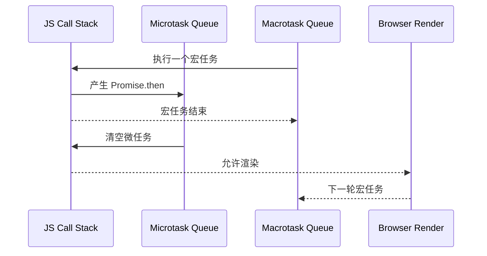

常见分类：

| 类型 | 常见来源 |
| --- | --- |
| 宏任务 | script、setTimeout、setInterval、MessageChannel、用户事件、网络回调 |
| 微任务 | Promise.then/catch/finally、queueMicrotask、MutationObserver |

### 5.4 高频面试题

Q：宏任务和微任务区别？

A：宏任务是一轮事件循环中的主要任务，微任务是在当前宏任务结束后立即执行的高优先级任务。每执行完一个宏任务，都会清空微任务队列，然后浏览器才可能渲染。

Q：微任务一定比宏任务快吗？

A：不是“执行耗时更快”，而是调度优先级更高。微任务本身如果执行很重，一样会卡顿。

Q：`queueMicrotask` 和 `Promise.then` 区别？

A：二者都能调度微任务。`queueMicrotask` 语义更直接，不需要创建 Promise 链；错误处理方式也略有差异，微任务中的异常更接近普通异常报告。

### 5.5 常见追问

Q：为什么 MutationObserver 是微任务？

A：DOM 变更可能在一个同步任务中发生多次，MutationObserver 放在微任务阶段统一通知，可以合并变更，避免每次 DOM 修改都立即回调。

Q：如何避免微任务饿死渲染？

A：避免递归创建无穷微任务；大量任务切分到 `setTimeout`、`MessageChannel`、`scheduler.postTask` 或 Worker；必要时让出主线程。

### 5.6 实际项目场景

- 表单状态更新后想在当前同步代码之后立即执行，可用微任务。
- 大批量数据处理不要全部塞进 Promise 链，可能导致渲染长期不发生。
- 前端框架的批量更新常利用微任务或任务调度控制刷新时机。

---

## 6. Promise 与 async/await

### 6.1 概念解释

Promise 是 JS 表达异步结果的对象，状态从 pending 变为 fulfilled 或 rejected 后不可再变。`async/await` 是 Promise 的语法糖，让异步代码写起来像同步流程。

面试回答：

> Promise 解决回调地狱和异步流程组合问题。then/catch/finally 的回调会进入微任务队列。async 函数一定返回 Promise，await 会暂停 async 函数后续代码，把后续逻辑包装成微任务，在等待的 Promise 状态确定后继续执行。

### 6.2 底层原理

Promise 的关键是状态机和回调队列：

- pending：初始状态。
- fulfilled：成功，不可逆。
- rejected：失败，不可逆。

当 Promise 状态改变时，对应 then/catch 回调不会同步执行，而是放入微任务队列。这保证了执行顺序一致：即使 Promise 已经 resolved，then 也是异步执行。

`await expr` 可以理解为：

1. 把 `expr` 转成 Promise。
2. 暂停当前 async 函数。
3. 当前调用栈继续执行外部代码。
4. Promise settled 后，把 await 后面的代码放入微任务继续执行。

### 6.3 工作流程

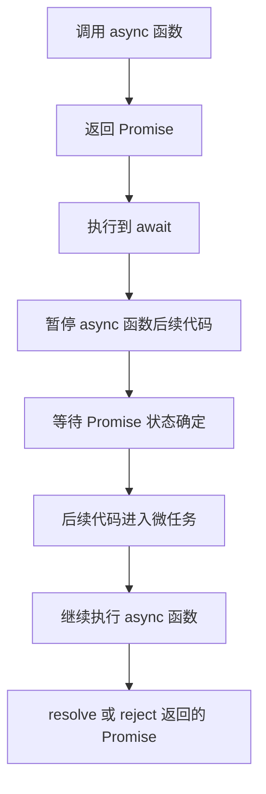

### 6.4 高频面试题

Q：async 函数返回什么？

A：一定返回 Promise。返回普通值会被包装成 resolved Promise；抛出异常会变成 rejected Promise。

Q：await 后面的代码什么时候执行？

A：await 等待的 Promise 状态确定后，后续代码以微任务形式继续执行。

Q：Promise 错误如何捕获？

A：可以用 `.catch`，也可以在 async 函数里用 `try/catch` 捕获 await 的 rejected。

示例：

```js
async function test() {
  console.log(1);
  await Promise.resolve();
  console.log(2);
}
test();
console.log(3);
```

输出：`1 3 2`。

### 6.5 常见追问

Q：await 会阻塞线程吗？

A：不会阻塞 JS 主线程。它只是暂停当前 async 函数后续逻辑，让出调用栈，外部同步代码和其他任务可以继续执行。

Q：Promise.all 和 Promise.allSettled 区别？

A：`Promise.all` 任一失败就整体失败，适合强依赖；`allSettled` 等全部完成并返回每个结果，适合批量请求统计成功失败。

### 6.6 实际项目场景

- 多接口并行用 `Promise.all`，避免串行 await 拉长首屏时间。
- 非关键请求用 `allSettled`，避免单个失败影响整体页面。
- 请求取消可结合 `AbortController`，避免组件卸载后还更新状态。

---

## 7. JS 执行机制

### 7.1 概念解释

JS 执行机制包括词法解析、作用域创建、变量提升、执行上下文、调用栈、事件循环等。JS 代码不是逐字“随便执行”，而是先编译再执行。

面试回答：

> JS 执行时会创建执行上下文，包括变量环境、词法环境、this 绑定等。函数调用会入栈，执行结束出栈。同步代码在调用栈中执行，异步回调通过事件循环进入调用栈。

### 7.2 底层原理

执行上下文主要包含：

- Lexical Environment：let/const、块级作用域、函数声明等。
- Variable Environment：var 声明等。
- This Binding：当前 this 值。
- Outer Reference：指向外部作用域，用于形成作用域链。

变量提升的本质是编译阶段建立作用域绑定。`var` 会初始化为 `undefined`，`let/const` 会创建绑定但在声明前处于暂时性死区。

### 7.3 工作流程

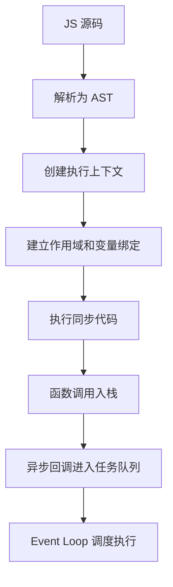

### 7.4 高频面试题

| 问题 | 标准回答 | 继续追问 |
| --- | --- | --- |
| var 和 let/const 区别？ | 作用域、提升行为、重复声明、暂时性死区不同。 | TDZ 为什么存在？ |
| 什么是执行上下文？ | JS 代码执行所需的环境，包括变量、作用域、this 等。 | 函数执行上下文何时创建？ |
| 调用栈是什么？ | 管理函数调用关系的数据结构，后进先出。 | 栈溢出怎么产生？ |

### 7.5 常见追问

Q：为什么会栈溢出？

A：函数递归太深或循环调用导致调用栈无法释放，超过引擎限制就会抛出栈溢出错误。可改成循环、尾递归优化不可依赖、任务切片等。

Q：let/const 为什么有暂时性死区？

A：为了避免在声明前访问变量造成不确定行为，让块级作用域语义更清晰，也减少 var 提升带来的历史问题。

### 7.6 实际项目场景

- 复杂递归处理树结构时，要注意深度过大导致栈溢出。
- 前端框架源码大量依赖闭包、作用域和任务调度，理解执行机制有助于读源码。
- 线上偶发 `Cannot access before initialization`，通常和循环依赖或 TDZ 有关。

---

## 8. V8 引擎

### 8.1 概念解释

V8 是 Chrome 和 Node.js 使用的 JavaScript 引擎，负责解析、编译、执行 JS，并进行垃圾回收和性能优化。

面试回答：

> V8 会把 JS 源码解析成 AST，再生成字节码由解释器执行；热点代码会被 JIT 优化编译成机器码。它还通过隐藏类、内联缓存、分代垃圾回收等机制提升执行性能。

### 8.2 底层原理

V8 的执行链路：

- Parser：解析源码生成 AST。
- Ignition：解释器，将 AST 转成字节码并执行。
- TurboFan：优化编译器，将热点字节码优化为机器码。
- Deopt：如果运行时类型变化破坏优化假设，退回解释执行。

为什么 JS 需要 JIT？JS 是动态语言，变量类型运行时才确定。直接解释执行灵活但慢，全部提前编译又难以优化。JIT 根据运行时反馈优化热点路径，在灵活性和性能之间平衡。

### 8.3 工作流程

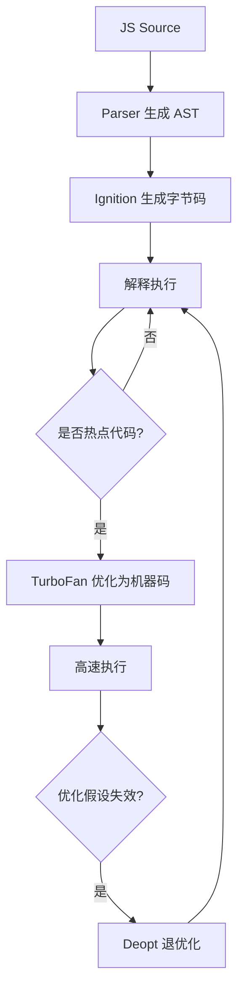

### 8.4 高频面试题

| 问题 | 标准回答 | 继续追问 |
| --- | --- | --- |
| V8 如何执行 JS？ | 解析源码、生成 AST、字节码解释执行、热点代码 JIT 优化。 | 为什么会退优化？ |
| 什么是隐藏类？ | V8 为对象形状创建内部结构，便于快速属性访问。 | 为什么对象属性顺序会影响性能？ |
| 什么是内联缓存？ | 缓存属性访问路径，避免每次动态查找。 | 多态会影响优化吗？ |

### 8.5 常见追问

Q：怎么写更利于 V8 优化的代码？

A：保持对象结构稳定，避免同一变量频繁改变类型，避免给对象动态增删大量属性，热点路径减少异常和多态分支。

Q：为什么数组混合类型可能变慢？

A：V8 会根据数组元素类型选择更高效的内部表示。混入不同类型、产生稀疏数组，会让内部表示退化，影响访问性能。

### 8.6 实际项目场景

- 大列表渲染时，数据结构稳定比“炫技写法”更重要。
- Node.js 高性能服务中，对象形状、热路径、JSON 序列化都会影响吞吐。
- 前端性能优化优先看主线程和算法复杂度，再考虑 V8 微优化。

---

## 9. 垃圾回收

### 9.1 概念解释

垃圾回收是 JS 引擎自动释放不再可达对象内存的机制。开发者不用手动 free，但仍然可能因为引用没有释放造成内存泄漏。

面试回答：

> V8 判断对象是否可回收主要看可达性。从根对象出发能访问到的对象是存活的，访问不到的对象会被回收。V8 使用分代回收，新生代回收短命对象，老生代回收长期存活对象，并配合增量、并发、标记清除、标记整理等减少停顿。

### 9.2 底层原理

引用计数无法很好处理循环引用，所以现代 JS 引擎主要使用可达性分析。根对象包括全局对象、当前调用栈变量、闭包引用、DOM 引用等。

分代假说：大多数对象很快死亡，少数对象存活很久。V8 把堆分为新生代和老生代：

- 新生代：空间小，回收频繁，适合短命对象。
- 老生代：空间大，回收成本高，适合长期对象。

### 9.3 工作流程

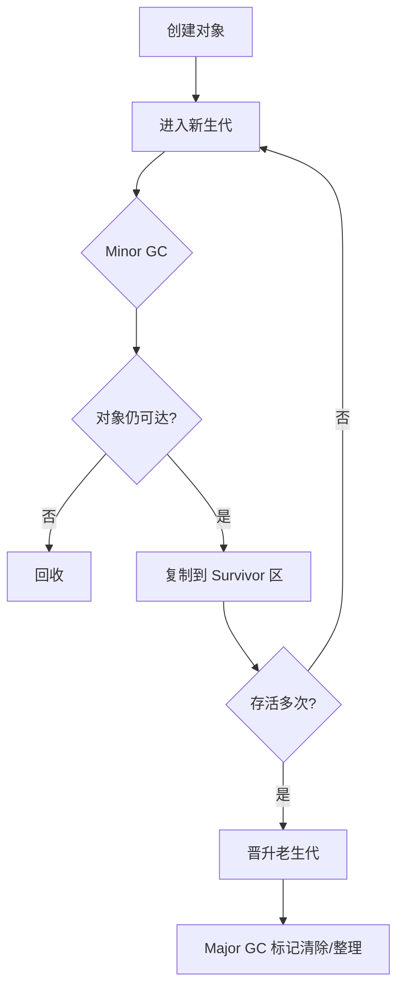

常见泄漏来源：

- 全局变量意外引用。
- 定时器未清除。
- 事件监听未解绑。
- 闭包持有大对象。
- DOM 节点被 JS 引用导致 detached DOM。
- 缓存 Map 无限增长。

### 9.4 高频面试题

| 问题 | 标准回答 | 继续追问 |
| --- | --- | --- |
| JS 如何判断垃圾？ | 从 GC Roots 出发不可达的对象可回收。 | 闭包变量会被回收吗？ |
| V8 为什么分代 GC？ | 大部分对象生命周期短，分代能提高回收效率。 | 新生代怎么回收？ |
| 什么是内存泄漏？ | 不再需要的对象仍被引用，GC 无法回收。 | 如何排查？ |

### 9.5 常见追问

Q：闭包一定造成内存泄漏吗？

A：不会。闭包只是让函数继续引用外部变量。如果引用的是必要状态，就是正常设计；如果长期持有不再需要的大对象，才可能泄漏。

Q：WeakMap 有什么用？

A：WeakMap 的 key 是弱引用，不会阻止 key 被 GC。适合给对象附加元数据，避免缓存导致对象无法回收。

### 9.6 实际项目场景

- React 组件卸载时清理定时器、订阅、WebSocket、事件监听。
- 虚拟列表和图表组件要注意缓存规模，避免 Map 持续增长。
- Chrome DevTools Memory 面板可用 Heap Snapshot、Allocation Timeline 排查泄漏。

---

## 10. 闭包 / 作用域链 / 原型链 / this

### 10.1 概念解释

这部分是 JS 基础高频，但浏览器面试常结合执行机制和内存问。

- 闭包：函数可以记住并访问其词法作用域，即使函数在外部执行。
- 作用域链：变量查找会从当前作用域向外层作用域逐级查找。
- 原型链：对象属性查找如果自身没有，会沿着 `[[Prototype]]` 向上查找。
- this：函数执行时的上下文绑定，由调用方式决定，箭头函数没有自己的 this。

### 10.2 底层原理

闭包来自词法作用域。函数创建时会记录外部词法环境引用。只要内部函数还可达，相关外部变量环境就不能被回收。

原型链是 JS 实现对象继承和属性共享的机制。方法放在 prototype 上，可以被多个实例共享，减少重复创建。

this 不是函数定义时固定的，普通函数的 this 在调用时确定；箭头函数捕获外层 this。

### 10.3 工作流程

变量查找：

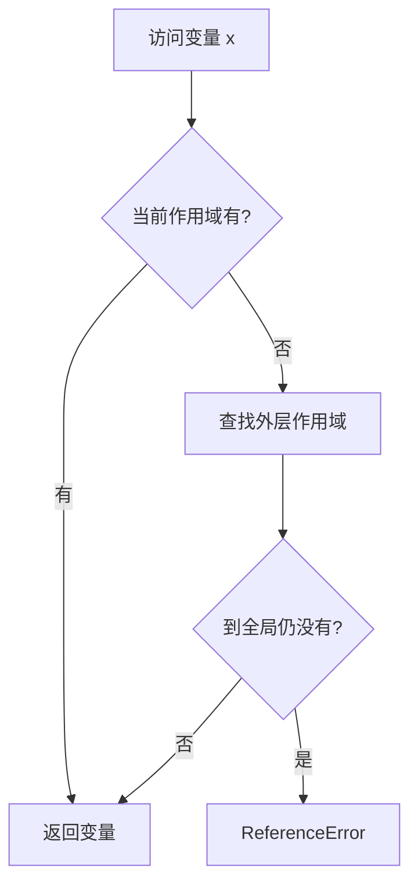

属性查找：

```mermaid
flowchart TD
    A[访问 obj.a] --> B{obj 自身有 a?}
    B -- 有 --> C[返回]
    B -- 否 --> D[沿 [[Prototype]] 查找]
    D --> E{原型链结束?}
    E -- 是 --> F[undefined]
    E -- 否 --> C
```

### 10.4 高频面试题

| 问题 | 标准回答 | 继续追问 |
| --- | --- | --- |
| 什么是闭包？ | 函数能访问定义时的外部词法作用域。 | 闭包变量为什么不会被回收？ |
| 原型链是什么？ | 对象属性查找沿 `[[Prototype]]` 逐级向上。 | `__proto__` 和 `prototype` 区别？ |
| this 指向怎么判断？ | 看调用方式：默认、隐式、显式、new、箭头函数。 | bind/call/apply 区别？ |

### 10.5 常见追问

Q：`prototype` 和 `__proto__` 区别？

A：`prototype` 是函数对象上的属性，用于 new 时设置实例原型；`__proto__` 是对象指向其原型的访问器。实例的 `__proto__` 通常等于构造函数的 `prototype`。

Q：箭头函数为什么不能当构造函数？

A：箭头函数没有自己的 `this`、`arguments`、`prototype`，也没有 `[[Construct]]` 内部方法，所以不能 `new`。

### 10.6 实际项目场景

- 防抖、节流、模块私有状态常用闭包。
- React Hooks 本质上大量利用闭包，因此要理解 stale closure。
- 类组件事件处理常见 this 丢失，需要 bind 或箭头函数。

---

## 11. 浏览器缓存

### 11.1 概念解释

浏览器缓存是为了减少请求、降低延迟、节省带宽而保存资源副本。常见包括 HTTP 缓存、Memory Cache、Disk Cache、Service Worker Cache、预加载缓存等。

面试回答：

> HTTP 缓存分强缓存和协商缓存。强缓存命中时不发请求；协商缓存会向服务器验证资源是否变化，未变化返回 304。实际项目里通常 HTML 使用短缓存或协商缓存，带 hash 的静态资源使用长期强缓存。

### 11.2 底层原理

缓存的核心是“用一致性换性能”。如果资源不会频繁变化，可以长期缓存；如果资源变化频繁，就需要验证机制。

强缓存靠 `Cache-Control: max-age` 或 `Expires` 判断是否过期。协商缓存靠 `ETag` / `If-None-Match` 或 `Last-Modified` / `If-Modified-Since` 判断是否变化。

### 11.3 工作流程

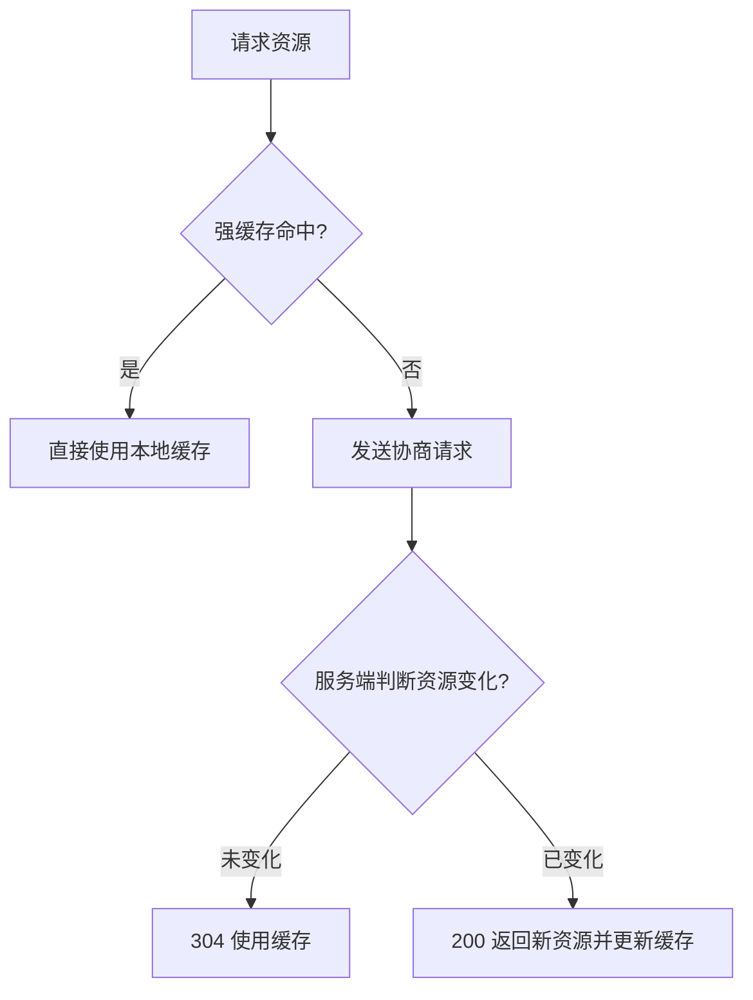

### 11.4 高频面试题

| 问题 | 标准回答 | 继续追问 |
| --- | --- | --- |
| 强缓存和协商缓存区别？ | 强缓存不发请求，协商缓存会发请求验证。 | no-cache 和 no-store 区别？ |
| ETag 和 Last-Modified 区别？ | ETag 精度更高，基于资源标识；Last-Modified 基于修改时间。 | 为什么有 ETag 还要 Last-Modified？ |
| Memory Cache 和 Disk Cache 区别？ | 内存缓存快但生命周期短，磁盘缓存慢但持久。 | 刷新页面会走哪个？ |

### 11.5 常见追问

Q：为什么 HTML 不建议长缓存？

A：HTML 是入口文件，如果长缓存，用户可能一直加载旧入口，引用旧资源。通常让 HTML 走协商缓存或短缓存，JS/CSS 带 hash 长缓存。

Q：Service Worker 缓存和 HTTP 缓存谁优先？

A：Service Worker 可以拦截页面请求，优先级很高。它能决定是否走 Cache Storage、网络或自定义策略，因此也更容易因为策略错误导致更新不及时。

### 11.6 实际项目场景

- SPA 发布时保持旧 hash 文件一段时间，避免用户旧 HTML 引用资源 404。
- CDN + hash 静态资源长期缓存，显著降低二次访问加载时间。
- 对 AI 模型配置、用户权限等敏感数据，不要盲目强缓存。

---

## 12. 浏览器存储

### 12.1 概念解释

浏览器提供多种客户端存储：Cookie、localStorage、sessionStorage、IndexedDB、Cache Storage。它们的定位不同，不能混用。

面试回答：

> Cookie 主要用于随请求携带状态；localStorage 适合少量持久键值；sessionStorage 只在当前标签页会话内有效；IndexedDB 是浏览器内置的异步 NoSQL 数据库，适合大量结构化数据；Cache Storage 常配合 Service Worker 缓存请求响应。

### 12.2 底层原理

Cookie 会自动附加到匹配域名和路径的 HTTP 请求中，因此不适合存大量数据。localStorage/sessionStorage 是同步 API，会阻塞主线程，不适合频繁读写大数据。IndexedDB 是异步事务型存储，能存对象、Blob，适合离线应用和大数据缓存。

### 12.3 工作流程

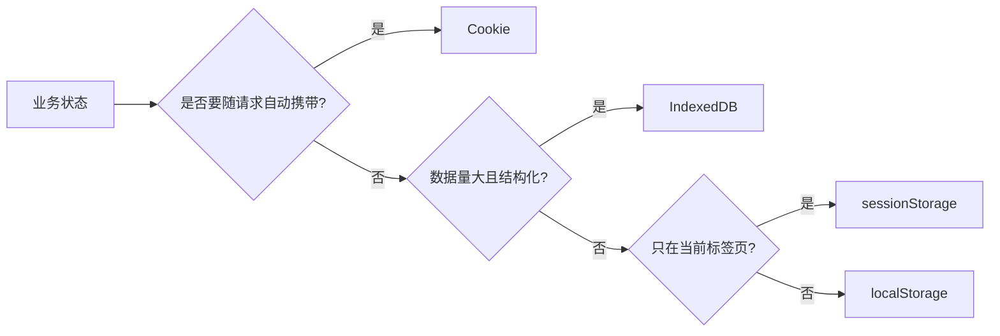

### 12.4 高频面试题

| 存储 | 生命周期 | 容量 | 是否随请求发送 | API |
| --- | --- | --- | --- | --- |
| Cookie | 可设置过期 | 小，通常约 4KB | 是 | 字符串 |
| localStorage | 持久 | 较大，通常 MB 级 | 否 | 同步 |
| sessionStorage | 标签页会话 | 较大，通常 MB 级 | 否 | 同步 |
| IndexedDB | 持久 | 大 | 否 | 异步 |
| Cache Storage | 持久 | 大 | 否 | 异步，请求响应缓存 |

Q：localStorage 和 Cookie 区别？

A：Cookie 会自动随请求发送，容量小，适合会话标识；localStorage 不随请求发送，容量更大，适合前端本地配置，但同步 API 且易被 XSS 读取。

Q：Token 放哪里？

A：没有绝对答案。HttpOnly Cookie 可防 JS 读取但要防 CSRF；localStorage 不受 CSRF 自动携带影响但容易被 XSS 窃取。高安全场景常用 HttpOnly + Secure + SameSite Cookie，或短 Token + Refresh Token + CSP/XSS 防护。

### 12.5 常见追问

Q：为什么 localStorage 可能导致卡顿？

A：localStorage 是同步读写，数据量大或频繁操作会阻塞主线程。复杂离线数据应使用 IndexedDB。

Q：IndexedDB 为什么适合离线应用？

A：它容量更大、异步、支持事务和索引，可以保存结构化数据、文件、消息队列，适合 PWA 和弱网场景。

### 12.6 实际项目场景

- 用户主题、布局偏好可放 localStorage。
- AI 聊天历史、离线文档、草稿箱可用 IndexedDB。
- 登录态更推荐 HttpOnly Cookie 或短生命周期 Token 方案。

---

## 13. 浏览器安全

### 13.1 概念解释

浏览器安全是围绕“不信任网页”构建的一套隔离体系，包括同源策略、沙箱、多进程、权限管理、CSP、Cookie 安全属性、HTTPS、跨域控制等。

面试回答：

> 浏览器默认把网页当作不可信代码执行，所以通过同源策略限制不同站点互相读取数据，通过沙箱限制 Renderer 访问系统资源，通过权限模型控制摄像头、定位等敏感能力，通过 CSP、SameSite、HttpOnly 等机制降低 XSS 和 CSRF 风险。

### 13.2 底层原理

浏览器安全的关键是边界：

- 进程边界：Renderer 沙箱隔离。
- 源边界：同源策略限制数据访问。
- 权限边界：敏感 API 必须用户授权。
- 网络边界：HTTPS 防窃听和篡改。
- 内容边界：CSP 限制脚本来源和执行方式。

### 13.3 工作流程

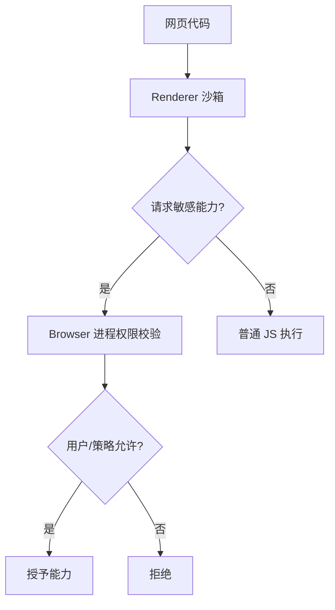

### 13.4 高频面试题

| 问题 | 标准回答 | 继续追问 |
| --- | --- | --- |
| 浏览器有哪些安全机制？ | 同源策略、CORS、CSP、沙箱、HTTPS、Cookie 安全属性、权限模型。 | 哪些是浏览器强制，哪些依赖服务端？ |
| 为什么网页不能直接访问本地文件？ | 网页是不可信代码，直接访问会泄漏用户隐私和系统数据。 | input file 为什么可以？ |
| HTTPS 能防 XSS 吗？ | 不能。HTTPS 保护传输，XSS 是页面内容执行恶意脚本。 | CSP 能完全防 XSS 吗？ |

### 13.5 常见追问

Q：浏览器权限为什么必须用户授权？

A：摄像头、麦克风、定位、剪贴板等能力涉及隐私和安全，必须由 Browser 进程统一弹窗和记录授权，不能让网页静默调用。

Q：安全机制会影响性能吗？

A：会有一定成本，例如站点隔离增加进程和内存，CSP 校验增加策略检查。但相对安全收益，这是必要权衡。

### 13.6 实际项目场景

- 企业后台必须配置 HTTPS、CSP、Cookie 安全属性。
- 上传文件只能通过用户主动选择文件，不能让网页任意读本地路径。
- AI Web 应用若支持渲染用户生成 HTML，必须做严格净化和 CSP。

---

## 14. 同源策略与 CORS

### 14.1 概念解释

同源策略限制一个源的脚本读取另一个源的敏感数据。源由协议、域名、端口三者决定。CORS 是服务端声明允许跨域访问的机制。

面试回答：

> 跨域不是请求一定发不出去，而是浏览器不允许 JS 读取未授权的跨域响应。CORS 通过服务端返回 `Access-Control-Allow-Origin` 等响应头，告诉浏览器哪些来源可以读取资源。复杂请求会先发 OPTIONS 预检。

### 14.2 底层原理

同源策略保护用户登录态。因为浏览器会自动携带 Cookie，如果恶意站点能随意读取其他站点响应，就能窃取用户隐私。

CORS 必须由服务端配置，因为资源访问权属于服务端。前端配置只能改变请求方式，不能单方面授权读取跨域响应。

### 14.3 工作流程

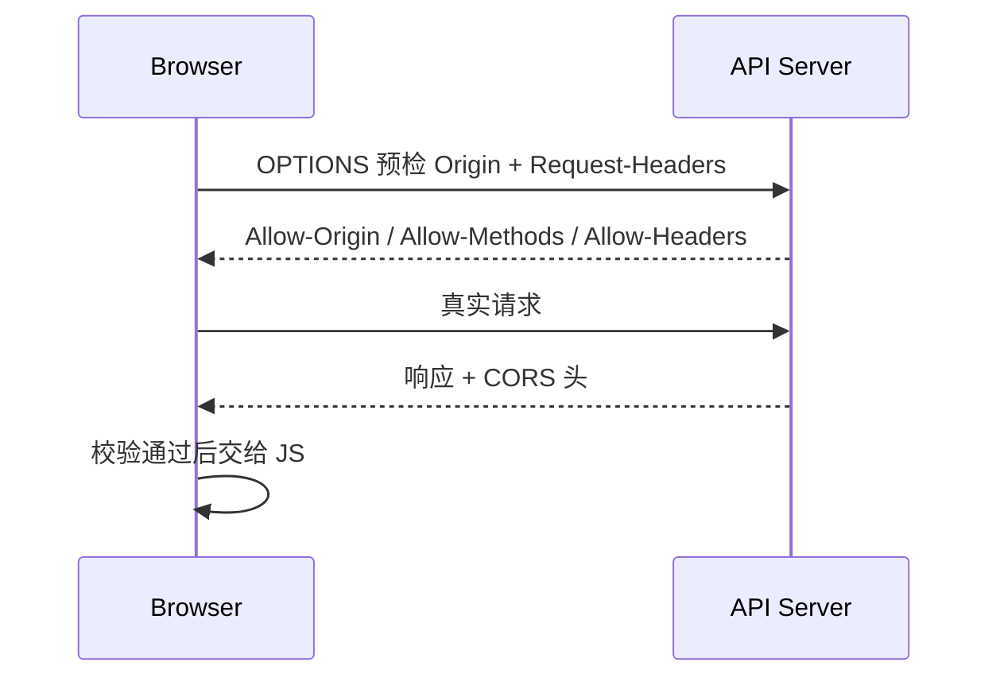

### 14.4 高频面试题

| 问题 | 标准回答 | 继续追问 |
| --- | --- | --- |
| 什么是同源？ | 协议、域名、端口都相同。 | 子域名算同源吗？ |
| CORS 怎么工作？ | 浏览器带 Origin，服务端返回允许的 CORS 头。 | 预检什么时候发生？ |
| 携带 Cookie 跨域怎么做？ | 前端 credentials include，服务端 Allow-Credentials true，Allow-Origin 不能是 *。 | SameSite 会影响吗？ |

### 14.5 常见追问

Q：跨域请求服务端会收到吗？

A：简单请求会直接发到服务端，只是浏览器可能不把响应交给 JS。复杂请求如果预检失败，真实请求不会发。

Q：JSONP 为什么能跨域？

A：`script` 标签加载脚本不受同源读取限制，JSONP 利用回调函数接收数据。但只支持 GET，安全性差，现代项目优先 CORS。

### 14.6 实际项目场景

- 本地开发常用 dev server proxy，让浏览器看到同源。
- 生产环境可以通过 Nginx 反向代理，或后端精确配置 CORS 白名单。
- 带 Cookie 的跨域接口要同时考虑 CORS、SameSite、CSRF。

---

## 15. CSP / XSS / CSRF

### 15.1 概念解释

XSS 跨站脚本攻击，**本质上是**利用浏览器会自动执行 JS ， 攻击者把恶意 JavaScript 注入到网页中执行。

CSRF 跨站请求伪造，**本质上是**利用浏览器发送请求时自动携带 cookie，伪造用户请求。

CSP 是浏览器内容安全策略，用于限制脚本、样式、图片等资源来源和执行方式。

面试回答：

> XSS 的本质是恶意代码执行，防护重点是输入输出转义、HTML 净化、CSP、HttpOnly Cookie。CSRF 的本质是借用用户登录态发请求，防护重点是 SameSite、CSRF Token、Origin/Referer 校验。CSP 是一道浏览器级防线，可以降低 XSS 成功后的危害。

### 15.2 底层原理

XSS 能偷 Token、操作页面、发请求，因为脚本运行在受害站点源下。HttpOnly 可以防 JS 读取 Cookie，但不能阻止恶意脚本以用户身份发请求。

CSRF 利用浏览器自动携带 Cookie 的行为。攻击者不一定能读取响应，但只要能触发状态改变请求，就可能造成损害。

CSP 通过响应头声明允许加载哪些脚本、是否允许 inline script、是否允许 eval。浏览器执行前检查策略，不符合就阻止。
	`Content-Security-Policy: script-src 'self'`

### 15.3 详解

#### 15.3.1 XSS

> XSS 攻击类型

存储型 XSS，意思是：攻击代码存储到数据库中，所有请求了该数据的用户网站都会执行该 JS 代码

反射形 XSS，意思是：会在 URL 的参数中注入恶意的 JavaScript 代码。依赖于服务端“不加过滤地直接返回用户提交的数据”。

DOM 型 XSS，意思是：不安全地处理了来自浏览器的数据源（Source），并将其直接输出到了能够执行代码的接收器（Sink）中。
	**数据源（Source）：** 攻击者可以控制的输入点。常见的有 `location.search`（URL 参数）、`location.hash`（URL 的 # 号后面部分）、`document.referrer` 等。
	**接收器（Sink）：** 会导致字符串被当作代码执行的 JavaScript 方法或 DOM 属性。常见的有 `innerHTML`、`document.write()`、`eval()`、`setTimeout()` 等。

> XSS 怎么防御

HTML 转义，也就是不直接输出类似于 `<script>` 的内容，而是转义后输出；例如 React 默认转义输出内容

不使用类似于 innerHTML 这类可以执行代码的接收器

使用 CSP，通过响应头声明允许加载哪些脚本，只允许浏览器加载符合策略的 JS 

Cookie 设置 HttpOnly，禁止 JS 读取 cookie；但是不能阻止 JS 发送请求时自动携带 cookie
### 15.4 工作流程

XSS：

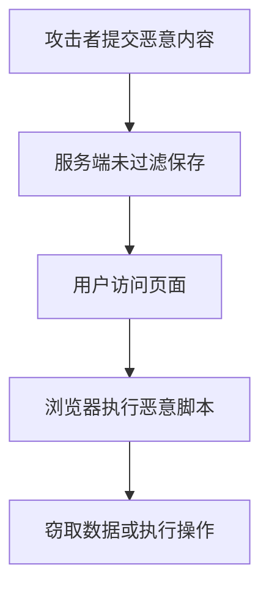

CSRF：

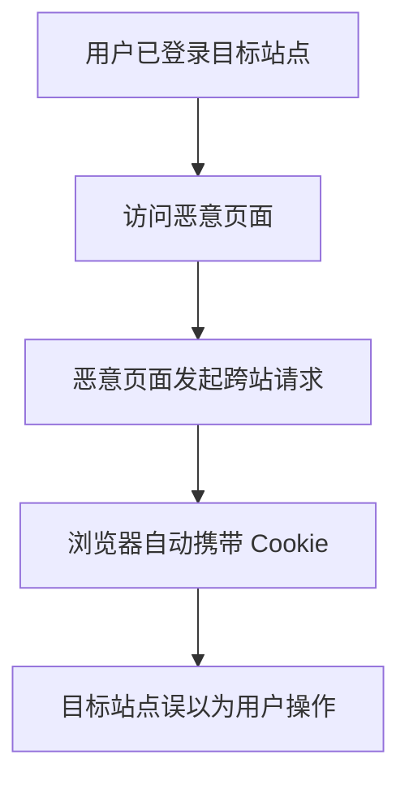

### 15.5 高频面试题

| 问题         | 标准回答                                      | 继续追问                         |
| ---------- | ----------------------------------------- | ---------------------------- |
| XSS 有哪些类型？ | 存储型、反射型、DOM 型。                            | React 能完全防 XSS 吗？            |
| 如何防 XSS？   | 输出转义、HTML sanitize、CSP、HttpOnly、避免危险 API。 | dangerouslySetInnerHTML 怎么办？ |
| 如何防 CSRF？  | SameSite、CSRF Token、Origin/Referer 校验。    | Token 为什么有效？                 |
| CSP 是什么？   | 通过响应头限制资源来源和脚本执行策略。                       | nonce 和 hash 有什么用？           |

### 15.6 常见追问

Q：React 是否天然防 XSS？

A：React 默认会转义文本插值，能防很多反射/存储型 XSS。但 `dangerouslySetInnerHTML`、第三方富文本、URL 注入、DOM API 仍可能引入 XSS。

Q：SameSite 能完全防 CSRF 吗？

A：不能完全。它能显著降低跨站 Cookie 携带风险，但兼容性、跳转场景、复杂业务仍建议结合 CSRF Token 和 Origin 校验。

### 15.7 实际项目场景

- 富文本评论、AI 生成 HTML、Markdown 渲染必须 sanitize。
- 后台管理关键操作使用 CSRF Token 或双重 Cookie 校验。
- CSP 可以从 Report-Only 模式开始收集违规报告，再逐步收紧策略。

---

## 16. iframe 与 postMessage

### 16.1 概念解释

iframe 可以在页面中嵌入另一个页面。postMessage 是浏览器提供的跨窗口安全通信机制，可用于 iframe、弹窗、不同源页面之间传递消息。

面试回答：

> iframe 能隔离页面和加载第三方内容，但也带来性能、安全和通信复杂度。不同源 iframe 不能直接访问彼此 DOM，必须通过 postMessage 通信，并且接收方必须校验 origin 和消息格式。

### 16.2 底层原理

iframe 是独立的 browsing context，拥有自己的 window、document、事件循环和资源加载。跨源 iframe 受到同源策略限制，不能直接读写父页面 DOM。

postMessage 的安全关键是 `targetOrigin` 和 `event.origin`。发送时明确目标源，接收时校验来源，避免任意页面伪造消息。

### 16.3 工作流程

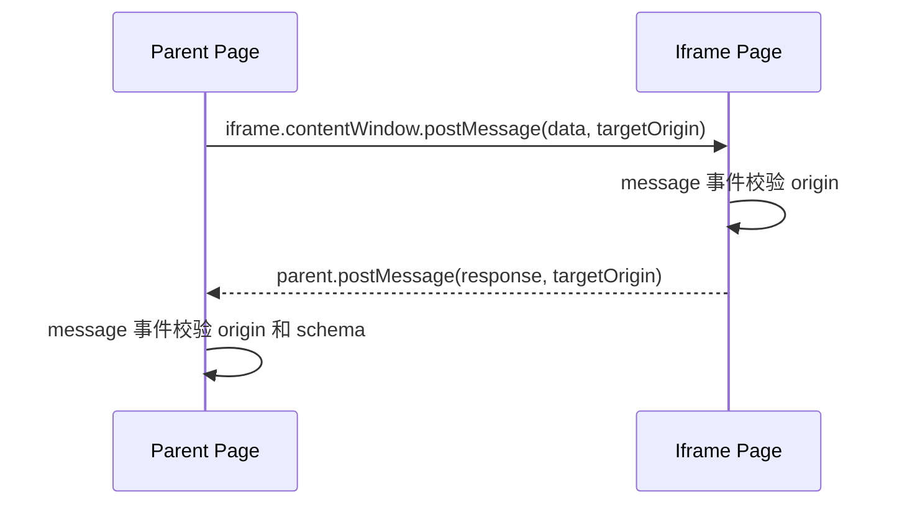

### 16.4 高频面试题

| 问题 | 标准回答 | 继续追问 |
| --- | --- | --- |
| iframe 有什么问题？ | 性能开销、SEO、通信复杂、安全风险、样式隔离和高度适配问题。 | 怎么限制 iframe 权限？ |
| postMessage 如何安全使用？ | 指定 targetOrigin，接收时校验 event.origin 和数据结构。 | 为什么不能用 *？ |
| iframe 为什么可能有安全风险？ | 点击劫持、恶意嵌入、跨站通信不校验、权限滥用。 | X-Frame-Options 是什么？ |

### 16.5 常见追问

Q：如何防点击劫持？

A：使用 `X-Frame-Options: DENY/SAMEORIGIN` 或 CSP `frame-ancestors` 限制页面被哪些站点嵌入。

Q：iframe sandbox 有什么用？

A：`sandbox` 可以限制 iframe 的脚本、表单、弹窗、同源权限等能力，按需通过 allow 属性放开。

### 16.6 实际项目场景

- 微前端可以用 iframe 做强隔离，但要处理通信、路由、样式、性能。
- 支付、第三方登录常通过 iframe 或弹窗与主页面通信。
- 嵌入 BI 报表或低代码页面时，必须校验 postMessage 来源。

---

## 17. Web Worker / SharedWorker / SharedArrayBuffer

### 17.1 概念解释

Web Worker 允许在浏览器中启动后台线程执行 JS，避免大计算阻塞主线程。SharedWorker 可以被同源多个页面共享。SharedArrayBuffer 允许线程之间共享内存，但需要严格跨源隔离。

面试回答：

> Worker 适合处理 CPU 密集任务，比如大文件解析、图片处理、加密压缩、AI Web 推理的部分计算。Worker 不能直接操作 DOM，因为 DOM 属于主线程，跨线程修改会带来同步和安全复杂度。主线程和 Worker 通过消息传递通信。

### 17.2 底层原理

Worker 运行在独立线程，有自己的全局上下文和事件循环。它不能访问 DOM、window、document，但可以使用 fetch、IndexedDB、WebAssembly 等能力。

数据传递方式：

- Structured Clone：复制数据，简单但大对象成本高。
- Transferable：转移 ArrayBuffer 所有权，避免复制。
- SharedArrayBuffer：共享内存，配合 Atomics 同步，性能强但安全要求高。

### 17.3 工作流程

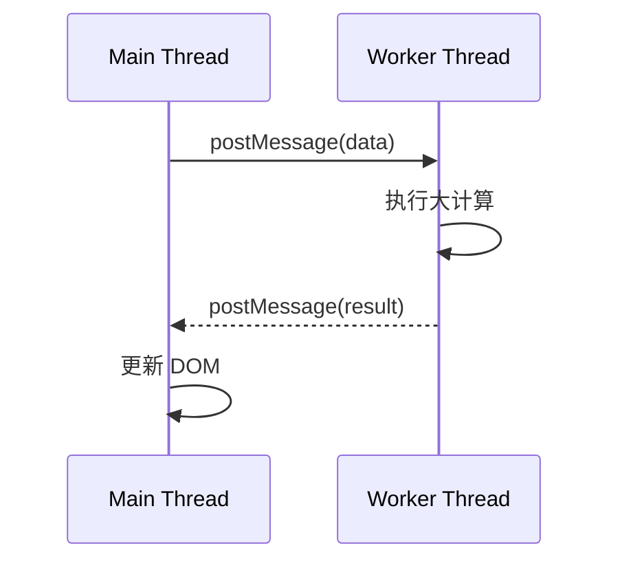

### 17.4 高频面试题

| 问题 | 标准回答 | 继续追问 |
| --- | --- | --- |
| Web Worker 为什么不能操作 DOM？ | DOM 由主线程管理，跨线程操作会引入竞态和锁复杂度。 | Worker 如何通知 UI 更新？ |
| Worker 通信怎么传数据？ | postMessage，结构化克隆、Transferable、SharedArrayBuffer。 | 大文件传输怎么优化？ |
| SharedWorker 和 Worker 区别？ | SharedWorker 可被同源多个上下文共享，普通 Worker 通常绑定创建它的页面。 | 多 Tab 通信还有哪些方式？ |
| SharedArrayBuffer 为什么需要隔离？ | 防止高精度计时和共享内存被用于侧信道攻击。 | COOP/COEP 是什么？ |

### 17.5 常见追问

Q：Transferable 为什么更快？

A：它不是复制 ArrayBuffer，而是把所有权从一个线程转移到另一个线程。原线程不能再访问该 buffer，避免大数据复制成本。

Q：SharedArrayBuffer 需要哪些响应头？

A：通常需要跨源隔离：`Cross-Origin-Opener-Policy: same-origin` 和 `Cross-Origin-Embedder-Policy: require-corp` 或合适的 COEP 策略。

### 17.6 实际项目场景

- Excel/CSV 大文件解析放 Worker，主线程只负责进度和渲染。
- AI Web 方向可把 tokenization、向量计算、WASM 推理任务放 Worker。
- 多 Tab 共享连接状态可考虑 SharedWorker、BroadcastChannel 或 Service Worker。

---

## 18. Service Worker

### 18.1 概念解释

Service Worker 是运行在浏览器后台的脚本，可以拦截网络请求、管理缓存、支持离线访问、推送通知。它是 PWA 的核心能力。

面试回答：

> Service Worker 位于页面和网络之间，可以监听 fetch 事件，决定返回缓存还是走网络。它独立于页面生命周期运行，但不能直接操作 DOM。它必须在 HTTPS 或 localhost 下使用，因为它能拦截请求，权限很高。

### 18.2 底层原理

Service Worker 的生命周期包括 install、activate、fetch。它可以用 Cache Storage 保存 Request/Response。浏览器为了安全和省资源，会随时启动或终止 Service Worker，因此不能依赖全局变量长期保存状态。

为什么可以离线缓存？因为 Service Worker 拦截请求后，即使网络不可用，也可以从 Cache Storage 或 IndexedDB 返回之前缓存的响应。

### 18.3 工作流程

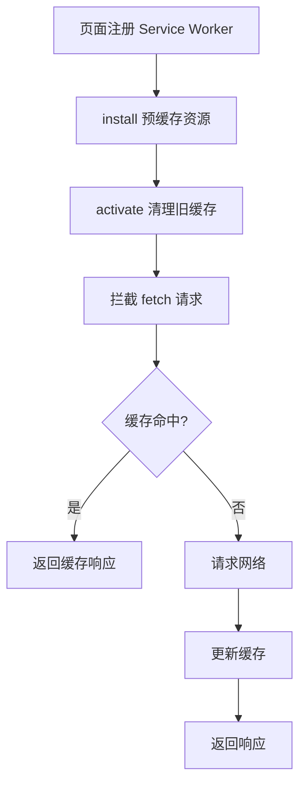

### 18.4 高频面试题

| 问题 | 标准回答 | 继续追问 |
| --- | --- | --- |
| Service Worker 能做什么？ | 请求拦截、离线缓存、PWA、推送通知、后台同步。 | 为什么不能操作 DOM？ |
| Service Worker 生命周期？ | register、install、activate、fetch。 | 更新机制有什么坑？ |
| 和 Web Worker 区别？ | Web Worker 处理后台计算；Service Worker 更像网络代理和后台缓存层。 | SW 为什么要求 HTTPS？ |

### 18.5 常见追问

Q：Service Worker 更新为什么容易踩坑？

A：新 SW 安装后通常要等旧页面关闭才 activate。如果缓存策略不当，用户可能长期拿旧资源。需要设计版本化缓存、skipWaiting、clients.claim 和更新提示。

Q：Cache First 和 Network First 怎么选？

A：静态资源适合 Cache First；接口数据或时效性强内容适合 Network First；离线优先应用可结合 stale-while-revalidate。

### 18.6 实际项目场景

- 文档、笔记、AI 聊天历史可做离线访问。
- 静态资源预缓存提升重复访问速度。
- 弱网环境下使用离线兜底页，提升用户体验。

---

## 19. 渲染优化：回流、重绘、合成层、GPU

### 19.1 概念解释

回流 Reflow/Layout 是重新计算元素几何位置和尺寸。重绘 Repaint 是重新绘制像素但不改变布局。合成 Composite 是把多个图层合成为最终画面。

面试回答：

> 回流比重绘开销大，因为它会影响布局树，可能导致大量元素重新计算位置和尺寸；重绘只重新生成绘制结果；如果只改变 transform、opacity 等合成属性，可能只触发合成，不触发布局和重绘，性能更好。

### 19.2 底层原理

浏览器渲染阶段越靠前，影响越大：

- Layout：影响几何，可能牵连子树、父级甚至全局。
- Paint：影响像素，需要重新绘制。
- Composite：只合成已有图层，通常成本最低。

读写布局交错会导致强制同步布局。例如先修改 DOM，再读取 `offsetHeight`，浏览器为了返回准确值，必须提前刷新布局。

### 19.3 工作流程

```mermaid
flowchart TD
    A[JS 修改样式] --> B{影响几何?}
    B -- 是 --> C[Layout 回流]
    C --> D[Paint 重绘]
    D --> E[Composite 合成]
    B -- 否 --> F{影响视觉像素?}
    F -- 是 --> D
    F -- 否 --> G[仅 Composite]
    G --> E
```

触发回流的常见操作：

- 修改宽高、margin、padding、border、position、font-size。
- 增删 DOM。
- 读取 `offsetTop`、`clientWidth`、`getBoundingClientRect` 等布局信息。
- 窗口 resize。

### 19.4 高频面试题

| 问题 | 标准回答 | 继续追问 |
| --- | --- | --- |
| 回流和重绘区别？ | 回流计算布局，重绘更新像素；回流通常会引发重绘。 | 哪些属性只触发合成？ |
| 为什么回流更贵？ | 几何变化可能影响周围和后代元素，需要重新布局。 | 如何减少回流？ |
| GPU 加速是什么？ | 把合成、部分绘制交给 GPU，提高动画和图层合成性能。 | GPU 加速有什么副作用？ |
| 什么是合成层？ | 浏览器把页面拆成多个图层独立绘制再合成。 | 如何创建合成层？ |

### 19.5 常见追问

Q：`will-change` 能乱用吗？

A：不能。它会提示浏览器提前创建优化资源，过度使用会增加内存和 GPU 压力。只应对即将动画的少量元素使用，并及时移除。

Q：为什么 transform 动画更流畅？

A：transform 通常不改变文档流布局，可以在合成阶段处理，避免主线程频繁 Layout/Paint。

### 19.6 实际项目场景

- 虚拟列表减少 DOM 数量，是解决大列表卡顿的核心。
- 拖拽、弹窗动画用 `transform`，避免修改 `top/left`。
- 批量 DOM 更新时先读后写，避免布局抖动。

---

## 20. requestAnimationFrame / 防抖 / 节流

### 20.1 概念解释

`requestAnimationFrame` 会在浏览器下一次绘制前执行回调，适合动画更新。防抖是在连续触发后只执行最后一次，节流是在固定时间内最多执行一次。

面试回答：

> rAF 和浏览器刷新节奏对齐，页面不可见时会被暂停或降频，适合动画。防抖适合搜索输入、窗口 resize 结束后执行；节流适合滚动、拖拽、鼠标移动这类高频事件。

### 20.2 底层原理

屏幕通常 60Hz，每帧约 16.7ms。动画如果用 setTimeout，容易和刷新节奏错位，导致丢帧。rAF 在绘制前调用，可以集中更新样式，让浏览器更好地安排渲染。

防抖和节流本质是控制高频事件进入主线程的频率，降低事件回调和渲染压力。

### 20.3 工作流程

```mermaid
flowchart TD
    A[高频事件触发] --> B{策略}
    B -- 防抖 --> C[重置定时器]
    C --> D[停止触发后执行一次]
    B -- 节流 --> E[时间窗口内最多执行一次]
    B -- rAF --> F[下一帧绘制前执行]
```

### 20.4 高频面试题

| 问题 | 标准回答 | 继续追问 |
| --- | --- | --- |
| rAF 和 setTimeout 区别？ | rAF 与刷新率同步，后台降频，适合动画；setTimeout 是时间任务，不保证帧对齐。 | rAF 回调在渲染前还是后？ |
| 防抖和节流区别？ | 防抖取最后一次，节流控制频率。 | 搜索框用哪个？滚动用哪个？ |
| 如何优化滚动事件？ | passive listener、节流/rAF、减少同步布局读取。 | passive 是什么？ |

### 20.5 常见追问

Q：passive event listener 有什么用？

A：告诉浏览器监听器不会调用 `preventDefault`，浏览器可以不等待 JS 就先执行滚动，提高滚动流畅度。

Q：rAF 里做大计算可以吗？

A：不适合。rAF 只是让回调贴近渲染时机，不会减少计算成本。大计算仍会阻塞主线程。

### 20.6 实际项目场景

- 拖拽、滚动同步位置用 rAF 合并更新。
- 搜索输入联想用防抖，减少请求。
- 无限滚动监听用节流或 IntersectionObserver。

---

## 21. Fetch / Stream API / 网络请求流程

### 21.1 概念解释

Fetch 是现代浏览器发起网络请求的 API，基于 Promise。Stream API 允许以流的方式读取数据，不必等完整响应下载完。

面试回答：

> Fetch 发起请求后，浏览器会经历缓存判断、Service Worker 拦截、CORS 校验、DNS、TCP/TLS、HTTP 请求响应等流程。响应体可以通过 ReadableStream 分块读取，适合大文件下载、AI 流式输出、日志流等场景。

### 21.2 底层原理

Fetch 和 XHR 最大差异之一是更现代的 Promise/Stream 模型。Fetch 的 Promise 在响应头到达时就可能 resolve，响应体读取是后续流式过程。HTTP 错误状态如 404/500 不会让 fetch Promise reject，只有网络错误、CORS 拦截、取消等才会 reject。

Stream API 的核心是背压。消费者读取慢时，生产者可以感知并放慢，避免内存无限增长。

### 21.3 工作流程

```mermaid
flowchart TD
    A[fetch 请求] --> B[检查缓存/Service Worker]
    B --> C[CORS/安全策略]
    C --> D[DNS/TCP/TLS]
    D --> E[发送 HTTP 请求]
    E --> F[收到响应头]
    F --> G[Promise resolve Response]
    G --> H[ReadableStream 分块读取 body]
    H --> I[业务增量处理]
```

### 21.4 高频面试题

| 问题 | 标准回答 | 继续追问 |
| --- | --- | --- |
| Fetch 和 XHR 区别？ | Fetch Promise 化、支持 Stream、API 更简洁；XHR 有上传进度等历史能力。 | fetch 如何取消？ |
| fetch 404 会 reject 吗？ | 不会，HTTP 错误状态仍是成功响应，需要检查 `response.ok`。 | 什么时候 reject？ |
| Stream API 有什么用？ | 分块处理响应，降低等待和内存压力。 | 什么是背压？ |

### 21.5 常见追问

Q：fetch 如何设置超时？

A：Fetch 本身没有 timeout 参数，可用 `AbortController` 配合 `setTimeout` 取消请求。

Q：为什么流式读取能改善 AI 体验？

A：用户不需要等完整生成结束，模型每产生一段文本就可以显示，显著降低感知等待时间。

### 21.6 实际项目场景

- AI 聊天用 fetch 读取 ReadableStream，实现逐字输出。
- 大文件下载边读边写或显示进度，避免一次性占用大内存。
- 组件卸载时 abort 请求，避免无效更新和资源浪费。

---

## 22. WebSocket / SSE / AI 流式输出

### 22.1 概念解释

WebSocket 是全双工长连接，适合双向实时通信。SSE 是基于 HTTP 的服务端单向推送，适合服务端持续推文本。AI Web 场景常用 SSE 或 fetch stream 实现流式输出。

面试回答：

> 如果业务需要双向实时交互，比如聊天室、协同编辑、实时游戏，用 WebSocket；如果只是服务端不断推送文本，比如 AI 生成结果、日志流，用 SSE 或 Fetch Stream 更简单。核心取舍是双向能力、代理兼容性、鉴权、断线重连和数据格式。

### 22.2 底层原理

WebSocket 通过 HTTP Upgrade 握手后切换协议，在一个 TCP 连接上双向传输帧。SSE 不切换协议，本质是一个长期不断开的 HTTP 响应，服务端不断 flush 文本事件。

AI 流式输出通常不是模型一次性返回完整答案，而是服务端拿到 token/chunk 后立即推给浏览器，前端增量渲染。

### 22.3 工作流程

SSE / AI 流：

```mermaid
sequenceDiagram
    participant B as Browser
    participant API as API Server
    participant LLM as Model Service
    B->>API: 发起聊天请求
    API->>LLM: 请求模型流式生成
    LLM-->>API: chunk 1
    API-->>B: data: chunk 1
    LLM-->>API: chunk 2
    API-->>B: data: chunk 2
    API-->>B: data: [DONE]
```

WebSocket：

```mermaid
sequenceDiagram
    participant C as Client
    participant S as Server
    C->>S: HTTP Upgrade
    S-->>C: 101 Switching Protocols
    C->>S: message
    S-->>C: push message
    C->>S: heartbeat
    S-->>C: heartbeat ack
```

### 22.4 高频面试题

| 问题 | 标准回答 | 继续追问 |
| --- | --- | --- |
| WebSocket 和 SSE 区别？ | WebSocket 双向，SSE 单向；SSE 基于 HTTP 更简单，自动重连。 | AI 输出选哪个？ |
| SSE 如何断线恢复？ | 使用事件 id，重连时 Last-Event-ID 告诉服务端从哪里继续。 | 服务端需要保存什么？ |
| WebSocket 如何保活？ | ping/pong、业务心跳、超时检测、断线重连。 | 负载均衡怎么处理？ |

### 22.5 常见追问

Q：SSE 会被代理缓冲怎么办？

A：服务端要设置合适响应头，禁用缓冲，及时 flush；Nginx 等代理也要关闭对应 buffer，否则前端收不到实时 chunk。

Q：WebSocket 鉴权怎么做？

A：握手时携带 Cookie、短 Token 或 Query Token，服务端校验后把连接绑定用户。Token 过期要设计重新鉴权或断线重连。

### 22.6 实际项目场景

- AI 聊天：SSE 或 fetch stream，支持 abort、重试、消息持久化。
- 聊天室：WebSocket 房间广播，心跳和断线重连。
- 实时日志：SSE 简单稳定，服务端持续推送日志行。

---

## 23. 输入 URL 到页面渲染全过程

### 23.1 概念解释

这是浏览器综合题，考察网络、缓存、安全、进程、渲染、JS 执行和性能优化。

面试回答：

> 输入 URL 后，浏览器先解析 URL，检查缓存和 HSTS，进行 DNS 解析，建立 TCP/TLS 连接，发送 HTTP 请求，接收响应；然后 Renderer 解析 HTML 构建 DOM，加载 CSS/JS/图片等资源，构建 CSSOM 和渲染树，执行布局、绘制、合成，最终显示页面。期间会受到缓存、CORS、安全策略、JS 阻塞、CSS 阻塞和资源优先级影响。

### 23.2 底层原理

这个过程本质上是 Browser 进程、Network 进程、Renderer 进程、GPU 进程的协作。网络拿资源，Renderer 把资源变成渲染指令，GPU 合成画面。

浏览器会做大量优化：DNS 预解析、连接复用、预加载扫描、资源优先级、缓存、流式 HTML 解析、延迟加载、合成层优化。

### 23.3 工作流程

```mermaid
flowchart TD
    A[输入 URL] --> B[URL 解析]
    B --> C[检查缓存/HSTS/Service Worker]
    C --> D[DNS 解析]
    D --> E[TCP 握手]
    E --> F{HTTPS?}
    F -- 是 --> G[TLS 握手]
    F -- 否 --> H[HTTP 请求]
    G --> H
    H --> I[服务端返回 HTML]
    I --> J[Renderer 解析 HTML]
    J --> K[构建 DOM]
    J --> L[加载 CSS/JS/图片]
    L --> M[CSSOM]
    K --> N[Render Tree]
    M --> N
    N --> O[Layout]
    O --> P[Paint]
    P --> Q[Composite]
    Q --> R[页面显示]
```

### 23.4 高频面试题

| 问题 | 标准回答 | 继续追问 |
| --- | --- | --- |
| 输入 URL 发生什么？ | 从 URL 解析、网络、缓存、安全到渲染完整回答。 | 哪些环节能优化首屏？ |
| DNS 之后是什么？ | 建立 TCP，HTTPS 还要 TLS，然后 HTTP 请求。 | HTTP/2/3 有什么不同？ |
| 浏览器什么时候开始渲染？ | HTML 流式解析，关键 CSS 到位后可构建渲染树并绘制。 | JS 会阻塞哪里？ |

### 23.5 常见追问

Q：首屏优化从哪些阶段入手？

A：网络层减少 DNS/TCP/TLS 和资源体积，缓存层提高命中，渲染层减少关键 CSS/JS 阻塞，框架层用 SSR/SSG/懒加载/代码分割，图片层优化 LCP。

Q：为什么页面有时白屏但接口很快？

A：可能是 JS 包过大、主线程长任务、CSS 阻塞、框架 hydration 慢、首屏依赖资源加载失败，而不一定是接口慢。

### 23.6 实际项目场景

- 电商首页优化：CDN、HTTP/2、图片预加载、SSR、骨架屏、资源分包。
- 后台系统优化：路由懒加载、权限接口并行、减少大表格同步渲染。
- AI Web 应用：首屏框架尽快可交互，模型输出用流式响应降低等待。

---

## 24. SSR / Hydration / React Server Component

### 24.1 概念解释

SSR 是服务端渲染 HTML，浏览器先看到完整结构，再加载 JS 接管交互。Hydration 是客户端把已有 HTML 和组件状态、事件绑定关联起来的过程。React Server Component 是 React 中在服务端执行、结果以特殊协议传给客户端的组件模型。

面试回答：

> SSR 解决纯 CSR 首屏白屏和 SEO 问题，但页面真正可交互还要等待 JS 下载和 hydration。Hydration 会复用服务端 HTML，并绑定事件、恢复组件树。RSC 则进一步把部分组件放到服务端执行，减少客户端 JS 体积，并能直接访问服务端数据源。

### 24.2 底层原理

CSR 的瓶颈是浏览器先下载 JS，再执行 JS 生成 DOM。SSR 把首屏 HTML 在服务端生成，浏览器能更快展示内容。但 SSR 后的 HTML 只是静态快照，交互需要客户端 JS hydrate。

Hydration 的成本包括下载 JS、解析执行、构建虚拟树、对齐已有 DOM、绑定事件。如果组件树大，hydration 本身也会阻塞主线程。

RSC 的关键是组件分层：Server Component 不进客户端 bundle，Client Component 才负责交互。这样可以减少客户端 JS 和数据请求瀑布。

### 24.3 工作流程

SSR + Hydration：

```mermaid
sequenceDiagram
    participant B as Browser
    participant S as Server
    B->>S: 请求页面
    S->>S: 渲染 React 为 HTML
    S-->>B: HTML + 数据 + JS 引用
    B->>B: 解析 HTML 显示内容
    B->>S: 下载 JS bundle
    B->>B: Hydration 绑定事件和状态
    B->>B: 页面可交互
```

RSC：

```mermaid
flowchart TD
    A[请求页面] --> B[服务端执行 Server Components]
    B --> C[读取数据库/API]
    C --> D[生成 RSC Payload]
    D --> E[客户端合并渲染树]
    E --> F[Client Components Hydration]
```

### 24.4 高频面试题

| 问题 | 标准回答 | 继续追问 |
| --- | --- | --- |
| SSR 解决什么问题？ | 改善首屏内容和 SEO，减少纯 CSR 白屏。 | SSR 一定更快吗？ |
| Hydration 是什么？ | 客户端复用服务端 HTML，绑定事件并恢复组件状态。 | hydration mismatch 为什么发生？ |
| RSC 和 SSR 区别？ | SSR 生成 HTML；RSC 是组件模型，服务端组件不进入客户端 bundle。 | Server Component 能用 useState 吗？ |

### 24.5 常见追问

Q：SSR 一定提高性能吗？

A：不一定。SSR 提高 FCP/LCP 可能明显，但会增加服务端压力和 hydration 成本。如果 JS 仍然很大，TTI/INP 可能不好。

Q：Hydration mismatch 常见原因？

A：服务端和客户端渲染结果不一致，例如时间、随机数、浏览器特有 API、用户态数据不一致、条件渲染差异。

Q：RSC 为什么能减少客户端 JS？

A：Server Component 在服务端执行，其代码不需要发到浏览器；客户端只接收渲染结果和必要的 Client Component。

### 24.6 实际项目场景

- 内容型网站、营销页、商品详情适合 SSR/SSG，提高首屏和 SEO。
- 强交互后台不一定需要 SSR，重点可能是代码分割和运行时性能。
- AI Web 中，RSC 可在服务端读取会话、权限和模型配置，客户端只保留交互组件。

---

## 25. 浏览器中的 ESM

### 25.1 概念解释

ESM 是浏览器原生模块系统，通过 `import` / `export` 声明依赖。模块默认严格模式，具有静态结构、单例执行、实时绑定等特点。

面试回答：

> 浏览器加载 ESM 时，会先根据入口模块解析依赖图，下载并链接所有依赖，再按依赖顺序执行。ESM 的 import/export 是静态的，所以构建工具能做 tree shaking。模块只执行一次，导出是 live binding。

### 25.2 底层原理

ESM 分三阶段：

1. 构建：解析入口模块，递归下载依赖，形成模块图。
2. 实例化：创建模块环境记录，连接 import/export 绑定。
3. 求值：按依赖顺序执行模块代码。

为什么 import 必须顶层静态？因为浏览器和构建工具需要在执行前知道依赖图，才能并行下载、链接和优化。

### 25.3 工作流程

```mermaid
flowchart TD
    A[script type=module] --> B[解析入口模块]
    B --> C[递归解析 import]
    C --> D[下载依赖模块]
    D --> E[实例化绑定 import/export]
    E --> F[按依赖顺序执行]
    F --> G[模块缓存，后续复用]
```

### 25.4 高频面试题

| 问题 | 标准回答 | 继续追问 |
| --- | --- | --- |
| ESM 和 CommonJS 区别？ | ESM 静态、异步加载、live binding；CJS 动态、运行时加载、值拷贝表现不同。 | 为什么 ESM 支持 tree shaking？ |
| import/export 工作原理？ | 构建模块图、实例化绑定、按依赖求值。 | 循环依赖怎么处理？ |
| type=module 有什么特点？ | 默认 defer、严格模式、独立作用域、支持跨域 CORS。 | 模块脚本为什么需要 CORS？ |

### 25.5 常见追问

Q：ESM 循环依赖为什么有时能工作？

A：ESM 使用 live binding，在实例化阶段先建立绑定，再执行代码。只要不在变量初始化前访问，就可以处理部分循环依赖。

Q：动态 import 有什么用？

A：`import()` 返回 Promise，可运行时按需加载模块，常用于路由懒加载、功能开关、重组件延迟加载。

### 25.6 实际项目场景

- React/Vue 路由懒加载依赖动态 import。
- 构建工具基于 ESM 静态结构做 tree shaking。
- 浏览器原生 ESM 可用于无构建小项目，但生产仍常用打包优化请求数量和兼容性。

---

## 26. WebAssembly 可选

### 26.1 概念解释

WebAssembly，简称 WASM，是一种可在浏览器中运行的低级二进制指令格式。它不是替代 JS，而是让 C/C++/Rust 等语言编译后在 Web 中高性能运行。

面试回答：

> WASM 适合 CPU 密集型任务，比如图像处理、音视频编解码、加密、游戏引擎、AI 推理部分算子。它运行在浏览器沙箱中，通过 JS API 加载和调用，和 JS 共享能力边界。

### 26.2 底层原理

WASM 是提前编译友好的字节码格式，浏览器能快速验证、编译和执行。它使用线性内存模型，不能直接操作 DOM，需要通过 JS 胶水代码调用浏览器 API。

为什么快？WASM 类型明确、格式紧凑、接近机器指令，减少 JS 动态类型和 JIT 猜测成本。但 JS/WASM 频繁跨边界调用也有开销。

### 26.3 工作流程

```mermaid
flowchart TD
    A[Rust/C/C++ 源码] --> B[编译为 .wasm]
    B --> C[浏览器加载 WASM]
    C --> D[验证和编译]
    D --> E[实例化模块]
    E --> F[JS 调用导出函数]
    F --> G[通过线性内存交换数据]
```

### 26.4 高频面试题

| 问题 | 标准回答 | 继续追问 |
| --- | --- | --- |
| WASM 用来做什么？ | 高性能计算、复用已有 C/C++/Rust 库。 | WASM 能操作 DOM 吗？ |
| WASM 一定比 JS 快吗？ | 不一定，CPU 密集型更有优势，频繁 JS/WASM 调用可能变慢。 | 数据传输成本在哪里？ |
| WASM 安全吗？ | 运行在浏览器沙箱，不能直接访问系统资源。 | 内存越界怎么办？ |

### 26.5 常见追问

Q：AI Web 和 WASM 有什么关系？

A：浏览器端模型推理、tokenizer、向量检索、图像处理可以用 WASM 加速，常与 Web Worker、WebGPU、IndexedDB 结合。

Q：WASM 和 Web Worker 怎么搭配？

A：WASM 负责高性能计算，Worker 负责把计算移出主线程，避免 UI 卡顿。

### 26.6 实际项目场景

- 浏览器端 PDF、图片、音视频处理库常用 WASM。
- AI Web 中可用 WASM 跑 tokenizer、轻量模型推理或向量计算。
- 大计算应放 Worker 中运行 WASM，主线程只接收结果。

---

## 27. WebContainer 可选

### 27.1 概念解释

WebContainer 是在浏览器中运行类 Node.js 开发环境的技术形态，常见于在线 IDE、代码沙箱、AI 编程产品。它让 npm、dev server、文件系统等能力在浏览器沙箱中模拟运行。

面试回答：

> WebContainer 的核心是把开发运行时搬进浏览器沙箱，通过 WebAssembly、Worker、虚拟文件系统、浏览器网络能力模拟 Node.js 环境。它适合在线代码编辑、实时预览、AI 生成应用预览，但受到浏览器安全和系统能力限制。

### 27.2 底层原理

WebContainer 通常依赖：

- WebAssembly：运行部分系统级或语言运行时能力。
- Web Worker：把运行时放到后台线程。
- 虚拟文件系统：在浏览器存储中模拟文件读写。
- Service Worker / iframe：代理请求和预览应用。
- SharedArrayBuffer：提升多线程和运行时性能，通常要求跨源隔离。

### 27.3 工作流程

```mermaid
flowchart TD
    A[用户打开在线 IDE] --> B[初始化 WebContainer]
    B --> C[挂载虚拟文件系统]
    C --> D[安装或解析依赖]
    D --> E[启动浏览器内 dev server]
    E --> F[iframe 预览应用]
    F --> G[编辑文件触发热更新]
```

### 27.4 高频面试题

| 问题 | 标准回答 | 继续追问 |
| --- | --- | --- |
| WebContainer 是什么？ | 浏览器内运行的类 Node.js 沙箱开发环境。 | 和远程容器区别？ |
| 为什么需要跨源隔离？ | SharedArrayBuffer 等高性能能力需要 COOP/COEP。 | 资源加载会受什么限制？ |
| 有哪些限制？ | 不能任意访问本机系统 API，网络、进程、原生模块能力有限。 | npm 原生模块怎么办？ |

### 27.5 常见追问

Q：WebContainer 和云端容器怎么选？

A：WebContainer 启动快、隐私好、成本低、适合前端预览；云端容器能力完整，适合后端服务、原生依赖、真实系统环境。

Q：AI 生成代码预览为什么适合 WebContainer？

A：模型生成文件后可直接在浏览器内安装依赖、启动预览、实时编辑，不需要为每个用户分配云端容器。

### 27.6 实际项目场景

- 在线 StackBlitz 类 IDE。
- AI 生成 React/Vue 页面后即时预览。
- 教学平台让用户在浏览器内运行代码练习。

---

## 28. 综合项目场景题

### 28.1 React 页面卡顿怎么排查？

回答思路：

1. 用 Performance 面板录制，确认是否有 Long Task。
2. 看主线程是否被 JS 执行、布局、绘制占满。
3. React Profiler 找出重复渲染和重组件。
4. 大列表使用虚拟列表。
5. 大计算移到 Worker。
6. 高频事件用节流、rAF、passive listener。
7. 动画改用 transform/opacity，减少回流。

```mermaid
flowchart TD
    A[页面卡顿] --> B[Performance 录制]
    B --> C{瓶颈类型}
    C -- JS 长任务 --> D[拆分任务/Worker/减少渲染]
    C -- Layout/Paint --> E[减少 DOM/避免回流/优化 CSS]
    C -- 网络慢 --> F[缓存/CDN/压缩/预加载]
    C -- React 重渲染 --> G[memo/useMemo/虚拟列表/状态下沉]
```

### 28.2 虚拟列表为什么能优化性能？

虚拟列表只渲染可视区域和少量缓冲区元素，把上万 DOM 节点减少到几十个。它减少了 DOM 创建、样式计算、布局、绘制和内存占用。

面试追问：

Q：动态高度怎么处理？

A：可以预估高度，滚动过程中测量真实高度并修正偏移；或使用分段缓存高度表，避免每次全量计算。

### 28.3 AI 流式输出如何设计？

推荐方案：

1. 前端发起 fetch 或 SSE 请求。
2. 服务端调用模型流式接口。
3. 模型每返回一个 chunk，服务端立即 flush 给浏览器。
4. 前端用 ReadableStream 或 EventSource 增量渲染。
5. 支持 AbortController 取消生成。
6. 消息落库，断线可恢复。

关键点：

- 禁用代理缓冲。
- 处理 UTF-8 分块边界。
- 做错误和重试。
- 避免每个 token 都触发大范围 React 渲染，可批量更新。

### 28.4 SSR 首屏优化怎么讲？

回答结构：

1. SSR 让浏览器更快拿到 HTML，提高 FCP/LCP 和 SEO。
2. 但 hydration 仍会占用主线程，JS 包过大仍会影响可交互。
3. 优化包括 streaming SSR、代码分割、减少 Client Component、延迟非关键脚本、图片优化、缓存 HTML。
4. Next.js 场景可以结合 RSC，把不需要交互的部分放到服务端。

### 28.5 Web Worker 处理大计算怎么落地？

典型流程：

1. 主线程创建 Worker。
2. 使用 Transferable 传递 ArrayBuffer，避免复制。
3. Worker 内处理计算。
4. 分批返回进度和结果。
5. 主线程根据结果更新 UI。
6. 组件卸载或任务取消时 terminate Worker。

### 28.6 浏览器缓存优化怎么讲？

推荐策略：

1. HTML：短缓存或协商缓存。
2. JS/CSS：文件名带 hash，长期强缓存。
3. 图片字体：按内容 hash 或版本号缓存。
4. API：根据数据时效性设置缓存，不缓存敏感用户数据。
5. Service Worker：仅对明确资源做版本化缓存，避免更新困难。

### 28.7 安全综合题怎么回答？

如果面试官问“如何设计一个安全的前端登录系统”：

1. 全站 HTTPS。
2. Cookie 设置 HttpOnly、Secure、SameSite。
3. 服务端 Session 或短 Access Token + Refresh Token。
4. 防 XSS：转义、sanitize、CSP、避免危险 API。
5. 防 CSRF：SameSite、CSRF Token、Origin 校验。
6. 权限变化和强制下线依赖服务端状态或 tokenVersion。
7. 关键操作二次确认、审计日志、风控限流。

---

## 面试回答方法论

### 1. 先说它解决什么问题

例如 Event Loop：

> JS 是单线程，但浏览器要同时处理异步回调、用户输入和渲染，所以需要 Event Loop 统一调度。

### 2. 再说浏览器内部怎么做

> 它每次取一个宏任务执行，结束后清空微任务，然后浏览器选择是否渲染，再进入下一轮。

### 3. 解释为什么这样设计

> 微任务优先是为了让当前任务产生的 Promise 链和状态收尾在下一个任务前完成，保证执行顺序更确定。

### 4. 最后结合项目

> 如果微任务递归过多，会饿死渲染，导致页面卡顿。项目里大计算要切片或丢给 Worker。

---

## 最后复习建议

浏览器原理不要分散背，建议按四条主线串起来：

- 架构主线：多进程、Renderer、线程、沙箱、权限。
- 渲染主线：HTML/CSS/JS 到 DOM/CSSOM/Layout/Paint/Composite。
- 执行主线：执行上下文、调用栈、Event Loop、Promise、V8、GC。
- 工程主线：性能优化、安全防护、缓存、SSR、流式输出、Worker。

大厂面试真正想听的是“你能不能解释为什么”。能把 API 背后的浏览器机制讲清楚，再落到项目取舍，就不只是背八股了。
