## 计算机网络面试八股整理

> 面向前端 / 全栈 / Node.js / 服务端开发的大厂网络高频面试手册。重点不是背定义，而是能讲清楚：它解决什么问题、为什么这样设计、数据怎么流转、项目里怎么落地。

## 目录

- [1. HTTP](#1-http)
- [2. HTTPS / TLS / SSL](#2-https--tls--ssl)
- [3. TCP](#3-tcp)
- [4. UDP](#4-udp)
- [5. DNS](#5-dns)
- [6. Cookie / Session / JWT](#6-cookie--session--jwt)
- [7. WebSocket](#7-websocket)
- [8. SSE](#8-sse)
- [9. CDN](#9-cdn)
- [10. 浏览器缓存 / HTTP 缓存](#10-浏览器缓存--http-缓存)
- [11. 跨域 CORS](#11-跨域-cors)
- [12. 输入 URL 到页面渲染全过程](#12-输入-url-到页面渲染全过程)
- [13. HTTP/1.1、HTTP/2、HTTP/3](#13-http11http2http3)
- [14. 长连接 / 短连接 / Keep-Alive](#14-长连接--短连接--keep-alive)
- [15. 状态码](#15-状态码)
- [16. 请求方法](#16-请求方法)
- [17. RESTful](#17-restful)
- [18. RPC](#18-rpc)
- [19. WebRTC 可选](#19-webrtc-可选)
- [20. 综合高频追问速记](#20-综合高频追问速记)

---

## 1. HTTP

### 1.1 概念解释

HTTP 是浏览器和服务器之间最常见的应用层通信协议。它定义了客户端如何发请求、服务端如何返回响应，以及双方如何表达资源、状态、缓存、内容类型、鉴权等信息。

面试里不要只说“HTTP 是超文本传输协议”。更好的回答是：

> HTTP 是一个基于请求-响应模型的应用层协议。浏览器通过 HTTP 请求向服务器描述“我要什么资源、用什么方法、带什么参数和上下文”，服务器通过 HTTP 响应返回状态码、响应头和响应体。它本身不负责可靠传输，可靠性通常交给 TCP；也不负责加密，安全性通常由 TLS 形成 HTTPS。

HTTP 的核心价值是“统一资源交互模型”：URL 定位资源，Method 表达动作，Header 描述元信息，Body 承载数据。

### 1.2 工作流程

一次典型 HTTP 请求流程：

1. 浏览器根据 URL 解析协议、域名、端口、路径和查询参数。
2. 通过 DNS 找到服务器 IP。
3. 建立传输层连接，HTTP/1.1 和 HTTP/2 通常基于 TCP，HTTPS 还会额外进行 TLS 握手。
4. 浏览器发送 HTTP 请求报文，包括请求行、请求头、空行和请求体。
5. 服务端接收请求，经过网关、反向代理、应用框架、业务逻辑、数据库或缓存。
6. 服务端返回 HTTP 响应报文，包括状态行、响应头、空行和响应体。
7. 浏览器根据状态码、Content-Type、缓存头、Set-Cookie 等信息处理响应。
8. 如果连接可复用，保留 TCP 连接；否则关闭连接。

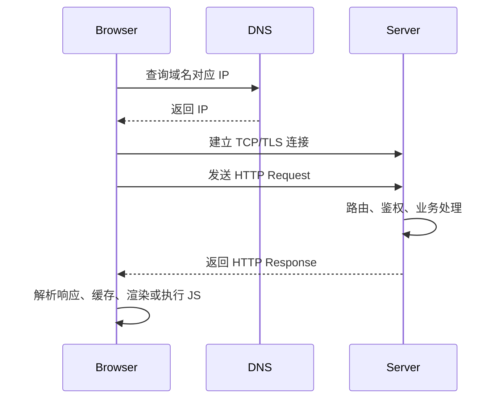
```mermaid
sequenceDiagram
    participant Browser as Browser
    participant DNS as DNS
    participant Server as Server
    Browser->>DNS: 查询域名对应 IP
    DNS-->>Browser: 返回 IP
    Browser->>Server: 建立 TCP/TLS 连接
    Browser->>Server: 发送 HTTP Request
    Server->>Server: 路由、鉴权、业务处理
    Server-->>Browser: 返回 HTTP Response
    Browser->>Browser: 解析响应、缓存、渲染或执行 JS
```

HTTP 报文大致结构：

```http
GET /api/user?id=1 HTTP/1.1
Host: example.com
Accept: application/json
Cookie: token=xxx

```

响应：

```http
HTTP/1.1 200 OK
Content-Type: application/json
Cache-Control: max-age=60

{"id":1,"name":"Tom"}
```

### 1.3 高频面试题

| 问题 | 标准回答思路 | 可能追问 |
| --- | --- | --- |
| HTTP 是无状态的吗？ | 是。协议本身不记住上一次请求状态，所以登录态通常依赖 Cookie、Session、Token。 | 无状态有什么好处？如何实现登录态？ |
| HTTP 和 HTTPS 区别？ | HTTPS = HTTP + TLS，加密传输、身份认证、防篡改；HTTP 明文传输。 | HTTPS 握手过程？为什么需要 CA？ |
| GET 和 POST 区别？ | 语义、参数位置、缓存、幂等性、安全性表现不同；本质上二者都能携带数据，但语义不同。 | GET 能不能有 body？POST 是否一定不幂等？ |
| HTTP 请求包括哪些部分？ | 请求行、请求头、空行、请求体。 | Header 里常见字段有哪些？ |
| HTTP 为什么要有状态码？ | 用统一机器可读方式表达处理结果，方便客户端、代理、监控、重试策略处理。 | 301/302/307/308 区别？ |

### 1.4 底层原理

HTTP 被设计成无状态，主要是为了降低服务端复杂度。服务端不需要在协议层维护每个客户端的上下文，可以横向扩展，多个请求可以分发到不同机器。状态如果需要，可以放在 Cookie、Session、数据库、Redis 或 JWT 中。

HTTP 使用 Header 扩展能力，而不是把所有功能写死在协议核心中。缓存、压缩、内容协商、鉴权、跨域、安全策略都可以通过头部表达。这也是 HTTP 能长期演进的重要原因。

HTTP 自身不保证可靠传输，因为分层设计里应用层不重复做传输层的事。HTTP/1.1 和 HTTP/2 把可靠性交给 TCP；HTTP/3 则把可靠传输能力建立在 QUIC 之上。

### 1.5 常见追问

Q：HTTP 无状态为什么还可以实现登录？

A：无状态指协议本身不保存上下文，但客户端可以每次请求携带身份凭证。例如浏览器自动携带 Cookie，服务端根据 Session ID 查 Redis；或者前端在 Authorization 头里携带 JWT，服务端验签后识别用户。

Q：HTTP Header 为什么不能太大？

A：Header 每次请求都要传输，过大会增加带宽、延迟和服务端解析成本。Cookie 过大尤其常见，会导致所有同域请求都带上冗余数据，影响性能。

Q：HTTP 是应用层协议，和 TCP 有什么关系？

A：HTTP 规定应用数据格式和语义，TCP 负责把字节流可靠、有序地送到对端。HTTP 报文最终会被拆成 TCP 段，再经过 IP 层发送。

### 1.6 实际项目场景

- 前端请求接口时，通过 Method 表达业务动作，通过 Header 携带 Token、Trace ID、Content-Type。
- Node.js 服务可以通过中间件统一处理鉴权、日志、跨域、压缩和错误响应。
- 大型系统会在 Nginx / API Gateway 层处理 TLS 终止、限流、缓存、路由转发。

---

## 2. HTTPS / TLS / SSL

### 2.1 概念解释

HTTPS 不是一个全新协议，而是在 HTTP 和 TCP 之间加了一层 TLS。HTTP 负责业务语义，TLS 负责加密、身份认证和完整性校验。

面试回答可以这样说：

> HTTPS 通过 TLS 解决 HTTP 明文传输的问题。它用非对称加密完成身份认证和密钥协商，用对称加密传输实际数据，用消息认证码或 AEAD 算法保证数据不被篡改，用 CA 证书体系证明服务器身份。

SSL 是 TLS 的前身，现代场景通常说 TLS。口语里仍会说 SSL 证书，但真实协议多是 TLS 1.2 / TLS 1.3。

### 2.2 工作流程

TLS 1.2 简化握手流程：

1. ClientHello：客户端发送支持的 TLS 版本、加密套件、随机数。
2. ServerHello：服务端选择 TLS 版本、加密套件，返回随机数。
3. Certificate：服务端发送证书链，证明自己是这个域名的合法拥有者。
4. 客户端验证证书：检查域名、有效期、签名链、吊销状态等。
5. 密钥协商：客户端和服务端协商出会话密钥。
6. 双方发送 Finished，确认后续使用对称密钥加密通信。
7. HTTP 请求和响应在 TLS 加密通道中传输。

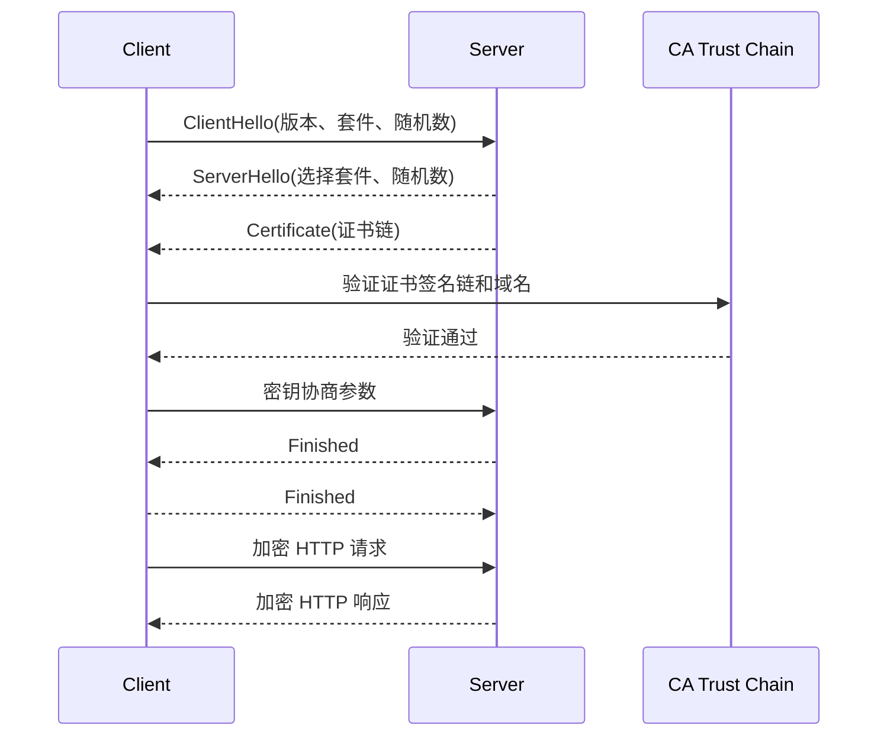
```mermaid
sequenceDiagram
    participant C as Client
    participant S as Server
    participant CA as CA Trust Chain
    C->>S: ClientHello(版本、套件、随机数)
    S-->>C: ServerHello(选择套件、随机数)
    S-->>C: Certificate(证书链)
    C->>CA: 验证证书签名链和域名
    CA-->>C: 验证通过
    C->>S: 密钥协商参数
    S-->>C: Finished
    C-->>S: Finished
    C->>S: 加密 HTTP 请求
    S-->>C: 加密 HTTP 响应
```

TLS 1.3 优化了握手，减少往返次数，移除了不安全算法，默认使用前向安全的密钥交换方式。

#### 2.2.1 消息认证码

> 消息认证码是如何防止篡改的？

问题其实可以拆成两个：

1. **MAC（Message Authentication Code）为什么能发现数据被篡改？**

MAC 是什么？MAC 本质上是一个只有通信双方知道的**密钥**，用于对消息**计算出摘要**

例如：

```
共享密钥：key = abc123
消息：Transfer=100
MAC：HMAC(key, message)
	↓
0x7af923....
```

于是客户端真正发送的是：

```
消息：Transfer=100
MAC：7af923...
```

服务器收到以后：

```
收到消息：Transfer=100
收到MAC：7af923...
```

服务器自己也知道

```
key = abc123
```

于是重新计算：

```
HMAC(abc123, "Transfer=100")
↓
7af923...
```

和收到的 MAC 一模一样：

```
收到：7af923...计算：7af923...
```

说明：

> 数据没有被改。


2. **攻击者为什么不能修改 MAC，让校验通过？**
	

### 2.3 高频面试题

| 问题 | 标准回答思路 | 可能追问 |
| --- | --- | --- |
| HTTPS 解决了什么问题？ | 防窃听、防篡改、身份认证。 | 中间人攻击怎么防？ |
| 为什么 HTTPS 还需要 CA？ | 单纯加密不能证明对方是谁，CA 通过证书链证明公钥属于目标域名。 | 自签名证书为什么浏览器不信？ |
| HTTPS 为什么既用非对称加密又用对称加密？ | 非对称适合密钥协商和身份认证，但慢；对称加密快，适合大量数据传输。 | 会话密钥怎么来的？ |
| TLS 1.2 和 TLS 1.3 区别？ | TLS 1.3 握手更少、算法更安全、默认前向安全。 | 0-RTT 有什么风险？ |
| HTTPS 一定安全吗？ | 不一定。证书配置、TLS 版本、混合内容、XSS、私钥泄漏都会影响安全。 | HSTS 是什么？ |

### 2.4 底层原理

HTTPS 的设计关键是把安全问题拆成三部分：

1. 机密性：别人抓包也看不懂内容，通过对称加密实现。
2. 完整性：内容被改了能发现，通过 MAC 或 AEAD 实现。
3. 身份认证：确认连接的是目标网站，通过证书和 CA 信任链实现。

为什么不能只用非对称加密传所有数据？因为非对称加密计算成本高，不适合大规模数据传输。实际做法是用非对称机制协商一个临时对称密钥，后续数据用这个密钥快速加密。

为什么需要前向安全？如果服务端长期私钥泄漏，攻击者不应该能解密过去抓到的所有流量。ECDHE 这类临时密钥交换方式可以让每次会话使用不同密钥，即使长期私钥泄漏，历史会话也尽量不可解。

### 2.5 常见追问

Q：HTTPS 能防止 DNS 劫持吗？

A：HTTPS 本身不能防止 DNS 返回错误 IP，但如果攻击者把用户导向假服务器，假服务器没有合法证书，浏览器会证书校验失败。DoH / DoT 可以加密 DNS 查询，进一步减少 DNS 被监听或篡改风险。

Q：为什么抓包工具能看到 HTTPS 明文？

A：抓包工具通常让用户安装自己的根证书，然后对客户端伪装成服务端，对服务端伪装成客户端，相当于被用户主动信任的中间人。没有安装根证书时无法直接解密。

Q：HSTS 有什么用？

A：HSTS 告诉浏览器以后访问该域名必须使用 HTTPS，避免用户第一次或后续访问被降级到 HTTP。

### 2.6 实际项目场景

- 登录、支付、后台管理系统必须使用 HTTPS，避免 Token、Cookie、密码明文泄漏。
- Node.js 应用通常不直接处理证书，而是在 Nginx、Ingress、云负载均衡层做 TLS 终止。
- 前端项目上线时要检查 mixed content，避免 HTTPS 页面加载 HTTP 脚本、图片或接口导致安全问题。

---

## 3. TCP

### 3.1 概念解释

TCP 是传输层协议，提供面向连接、可靠、有序、基于字节流的通信能力。HTTP/1.1 和 HTTP/2 通常都跑在 TCP 上。

面试回答：

> TCP 通过三次握手建立连接，通过序列号、确认应答、重传、滑动窗口、拥塞控制等机制保证数据可靠、有序到达。它适合对数据完整性要求高的场景，比如网页、接口、文件传输。

### 3.2 工作流程

#### 三次握手

1. 客户端发送 SYN，表示想建立连接，并带上初始序列号。
2. 服务端返回 SYN + ACK，确认客户端的 SYN，同时发送自己的初始序列号。
3. 客户端返回 ACK，确认服务端的 SYN，连接建立。

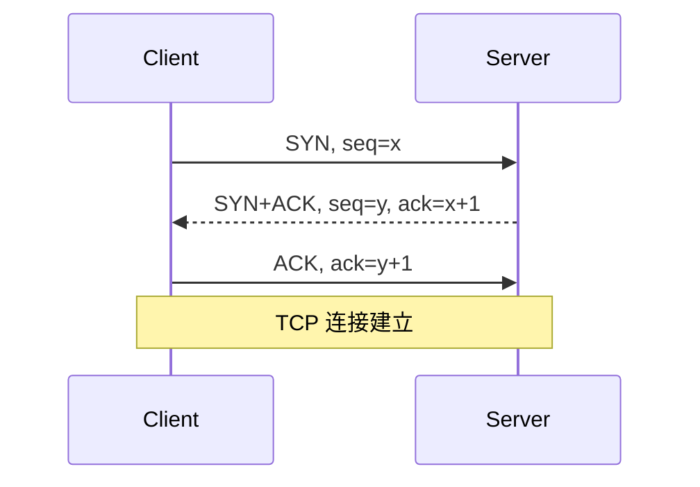
```mermaid
sequenceDiagram
    participant C as Client
    participant S as Server
    C->>S: SYN, seq=x
    S-->>C: SYN+ACK, seq=y, ack=x+1
    C->>S: ACK, ack=y+1
    Note over C,S: TCP 连接建立
```

#### 四次挥手

1. 主动关闭方发送 FIN，表示自己没有数据要发了。
2. 被动关闭方返回 ACK，表示知道了。
3. 被动关闭方处理完剩余数据后发送 FIN。
4. 主动关闭方返回 ACK，并进入 TIME_WAIT，等待一段时间后关闭。

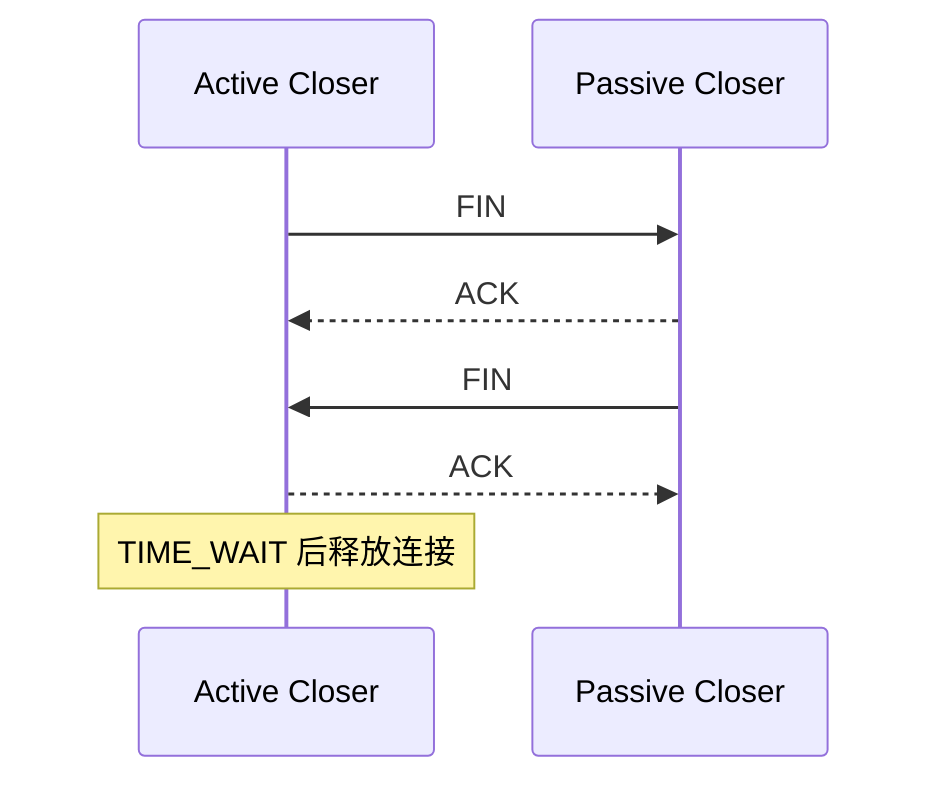
```mermaid
sequenceDiagram
    participant A as Active Closer
    participant B as Passive Closer
    A->>B: FIN
    B-->>A: ACK
    B->>A: FIN
    A-->>B: ACK
    Note over A: TIME_WAIT 后释放连接
```

### 3.3 高频面试题

| 问题 | 标准回答思路 | 可能追问 |
| --- | --- | --- |
| TCP 为什么三次握手？ | 双方都要确认自己的发送和接收能力，以及对方的发送和接收能力。两次无法让客户端确认服务端发送能力。 | 两次握手会有什么问题？ |
| 为什么四次挥手？ | TCP 是全双工，双方发送方向要分别关闭。收到 FIN 只表示对方不发了，不代表自己也发完了。 | 为什么会有 TIME_WAIT？ |
| TCP 如何保证可靠性？ | 序列号、ACK、超时重传、快速重传、滑动窗口、流量控制、拥塞控制、校验和。 | 拥塞控制和流量控制区别？ |
| TCP 和 UDP 区别？ | TCP 可靠有序面向连接；UDP 无连接、低开销、不保证可靠。 | HTTP/3 为什么用 UDP？ |
| TCP 粘包是什么？ | TCP 是字节流，没有消息边界，多次写入可能被合并或拆分。 | 怎么解决粘包？ |

### 3.4 底层原理

TCP 的可靠性不是“网络天然可靠”，而是协议在不可靠 IP 层上做出来的：

- 序列号：每个字节都有逻辑编号，用于排序和去重。
- ACK：接收方告诉发送方哪些数据已经收到。
- 重传：数据丢了或 ACK 丢了，发送方会重发。
- 滑动窗口：不用发一个等一个，提高吞吐。
- 流量控制：接收方通过窗口大小告诉发送方“我还能收多少”。
- 拥塞控制：根据网络拥塞情况动态调整发送速度，避免把网络打爆。

为什么需要 TIME_WAIT？

1. 确保最后一个 ACK 能被对方收到。如果 ACK 丢了，对方会重发 FIN，主动关闭方还能再回 ACK。
2. 让旧连接中的延迟报文在网络中自然消失，避免影响相同四元组的新连接。

### 3.5 常见追问

Q：为什么 TCP 不能两次握手？

A：两次握手只能让服务端确认客户端能发、服务端能收，但客户端还不能确认服务端能发、客户端能收。更严重的是，历史延迟 SYN 可能让服务端误建立连接，浪费资源。

Q：SYN Flood 是什么？

A：攻击者大量发送 SYN 但不完成第三次握手，导致服务端半连接队列耗尽。常见防护包括 SYN Cookie、限流、扩大队列、负载均衡防护。

Q：TCP 粘包怎么解决？

A：应用层自己定义消息边界，例如固定长度、分隔符、长度字段、TLV 编码。HTTP 通过 Content-Length 或 chunked encoding 解决消息边界。

### 3.6 实际项目场景

- Node.js `net` 模块写 TCP 服务时，必须自己处理消息边界，不能假设一次 `data` 就是一条完整消息。
- HTTP 服务性能调优时，会关注 TCP 连接复用、TIME_WAIT 数量、连接池、keep-alive 配置。
- WebSocket 长连接底层依赖 TCP，需要处理断线重连、心跳、消息顺序和背压。

---

## 4. UDP

### 4.1 概念解释

UDP 是无连接的传输层协议。它只负责把数据报尽力发送出去，不保证可靠、不保证顺序、不保证不重复。

面试回答：

> UDP 的特点是简单、开销小、延迟低。它适合实时性优先、允许少量丢包的场景，比如音视频、直播、游戏、DNS、QUIC。可靠性如果需要，可以在应用层或上层协议中实现。

### 4.2 工作流程

1. 应用层把数据交给 UDP。
2. UDP 加上源端口、目标端口、长度、校验和。
3. IP 层根据目标 IP 发送数据报。
4. 接收端收到后，根据端口交给对应应用。
5. UDP 不维护连接状态，也不关心对方是否收到。

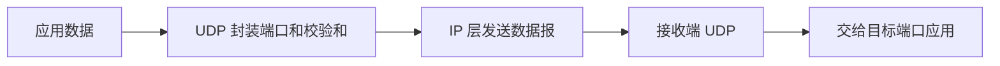
```mermaid
flowchart LR
    A[应用数据] --> B[UDP 封装端口和校验和]
    B --> C[IP 层发送数据报]
    C --> D[接收端 UDP]
    D --> E[交给目标端口应用]
```

### 4.3 高频面试题

| 问题 | 标准回答思路 | 可能追问 |
| --- | --- | --- |
| UDP 为什么快？ | 无连接、头部小、无握手、无重传、无拥塞控制的强约束。 | 快是否等于一定低延迟？ |
| UDP 会丢包怎么办？ | 应用层根据场景选择忽略、补偿、重传、前向纠错。 | 音视频为什么能接受丢包？ |
| DNS 为什么常用 UDP？ | 查询响应小，UDP 开销低；超过大小或需要可靠性时可用 TCP。 | DNS 什么时候用 TCP？ |
| HTTP/3 为什么基于 UDP？ | 用 QUIC 在用户态实现可靠传输，解决 TCP 队头阻塞，减少握手延迟。 | QUIC 如何保证可靠？ |

### 4.4 底层原理

UDP 的设计是“最小传输能力”：只提供端口复用和校验，不承担可靠性。这样应用可以根据自身场景选择策略。

比如视频通话里，迟到的数据包价值很低。与其重传旧帧，不如直接展示新帧，所以 TCP 的可靠有序反而可能带来卡顿。UDP 允许应用层把实时性放在可靠性前面。

### 4.5 常见追问

Q：UDP 一定不可靠吗？

A：UDP 本身不保证可靠，但可以在应用层实现可靠机制。QUIC 就是在 UDP 之上实现了连接管理、可靠传输、拥塞控制和加密。

Q：UDP 需要三次握手吗？

A：UDP 协议本身无连接，不需要握手。但上层协议如果需要建立会话，可以自己设计握手，例如 QUIC。

### 4.6 实际项目场景

- DNS 查询追求低延迟，常用 UDP。
- 实时音视频、游戏同步更关注实时性，可以丢弃过期数据。
- HTTP/3 使用 QUIC over UDP，让浏览器连接在弱网、切换网络时表现更好。

---

## 5. DNS

### 5.1 概念解释

DNS 是域名系统，把人容易记住的域名转换成机器使用的 IP 地址。它相当于互联网的分布式电话簿。

面试回答：

> DNS 查询会经过浏览器缓存、操作系统缓存、本地 DNS、根域名服务器、顶级域名服务器、权威域名服务器等层级，最终拿到域名对应的 IP。DNS 还可以配合 CDN、负载均衡、容灾调度做就近访问。

### 5.2 工作流程

1. 浏览器检查自身 DNS 缓存。
2. 操作系统检查 hosts 文件和系统 DNS 缓存。
3. 查询本地 DNS 服务器，通常由运营商或公共 DNS 提供。
4. 本地 DNS 如果没有缓存，会递归或迭代查询根 DNS。
5. 根 DNS 返回顶级域名服务器地址，如 `.com`。
6. 顶级域名服务器返回权威 DNS 地址。
7. 权威 DNS 返回目标域名记录。
8. 结果按 TTL 缓存，浏览器拿到 IP 后建立连接。

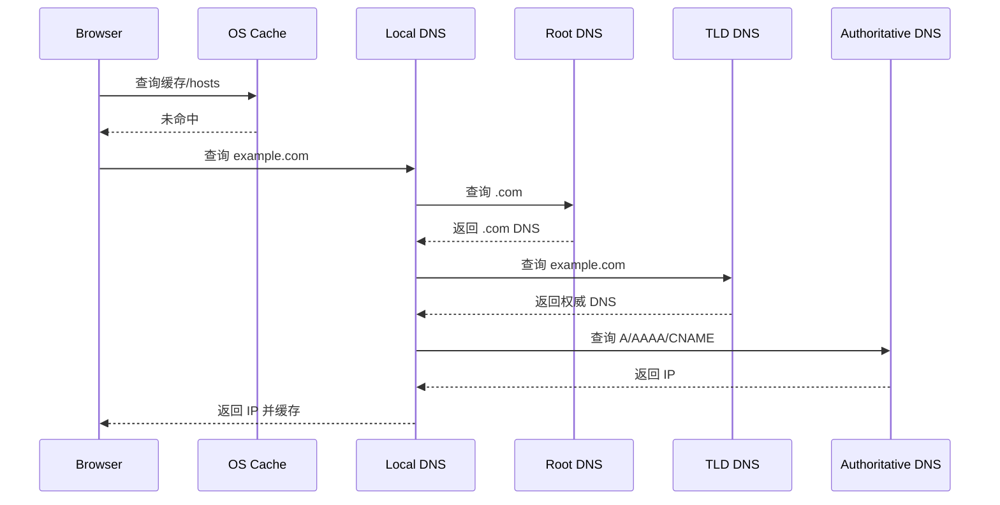
```mermaid
sequenceDiagram
    participant B as Browser
    participant OS as OS Cache
    participant LDNS as Local DNS
    participant Root as Root DNS
    participant TLD as TLD DNS
    participant Auth as Authoritative DNS
    B->>OS: 查询缓存/hosts
    OS-->>B: 未命中
    B->>LDNS: 查询 example.com
    LDNS->>Root: 查询 .com
    Root-->>LDNS: 返回 .com DNS
    LDNS->>TLD: 查询 example.com
    TLD-->>LDNS: 返回权威 DNS
    LDNS->>Auth: 查询 A/AAAA/CNAME
    Auth-->>LDNS: 返回 IP
    LDNS-->>B: 返回 IP 并缓存
```

常见记录类型：

| 类型 | 作用 |
| --- | --- |
| A | 域名到 IPv4 |
| AAAA | 域名到 IPv6 |
| CNAME | 域名别名 |
| MX | 邮件服务器 |
| TXT | 文本记录，常用于验证 |
| NS | 指定权威域名服务器 |

### 5.3 高频面试题

| 问题 | 标准回答思路 | 可能追问 |
| --- | --- | --- |
| DNS 查询过程？ | 多级缓存 + 根/TLD/权威 DNS 分层查询。 | 递归和迭代区别？ |
| DNS 为什么要缓存？ | 降低延迟、减少 DNS 服务器压力。 | TTL 太长/太短的问题？ |
| CNAME 和 A 记录区别？ | A 直接指向 IP，CNAME 指向另一个域名。 | CDN 为什么常用 CNAME？ |
| DNS 劫持是什么？ | 查询结果被篡改或污染，返回错误 IP。 | HTTPS 能否解决？ |

### 5.4 底层原理

DNS 使用分层设计，避免单点存储全网域名。根服务器只知道顶级域，顶级域知道权威服务器，权威服务器负责具体域名。这种层级结构让 DNS 能支撑全球规模。

DNS 缓存是性能关键。没有缓存的话，每次访问都要从根开始查，延迟和压力都会很高。但缓存也带来变更延迟，所以域名切流、迁移前通常会提前降低 TTL。

### 5.5 常见追问

Q：递归查询和迭代查询区别？

A：递归是“你帮我查到底，把最终结果给我”；迭代是“我告诉你下一步该问谁”。客户端到本地 DNS 通常是递归，本地 DNS 到根/TLD/权威 DNS 常表现为迭代。

Q：CDN 如何利用 DNS？

A：用户访问业务域名时，DNS 通过 CNAME 指向 CDN 域名，CDN 的调度系统根据用户地理位置、运营商、节点负载返回合适边缘节点 IP。

### 5.6 实际项目场景

- 前端静态资源接入 CDN 时，常配置 `static.example.com` CNAME 到 CDN 提供的域名。
- 服务迁移前降低 TTL，等缓存过期后再切换解析，减少用户访问旧 IP 的时间。
- 排查线上访问异常时，会用 `nslookup`、`dig`、`ping`、`traceroute` 分析 DNS 和网络路径。

---

## 6. Cookie / Session / JWT

### 6.1 概念解释

Cookie 是浏览器保存并自动随请求携带的小段数据。Session 是服务端保存的用户会话状态。JWT 是一种自包含的 Token 格式，常用于无状态鉴权。

面试回答：

> Cookie 解决浏览器如何在多次请求间携带状态的问题；Session 解决服务端如何保存登录态的问题；JWT 解决服务端不查会话存储也能识别用户的问题。三者不是同一层面的东西，Cookie 是客户端存储和传输机制，Session 是服务端状态方案，JWT 是 Token 格式。

### 6.2 工作流程

#### Cookie + Session 登录

1. 用户提交账号密码。
2. 服务端验证成功后创建 Session，存入内存、Redis 或数据库。
3. 服务端通过 `Set-Cookie` 返回 Session ID。
4. 浏览器保存 Cookie。
5. 后续请求自动携带 Cookie。
6. 服务端根据 Session ID 查询会话，识别用户。

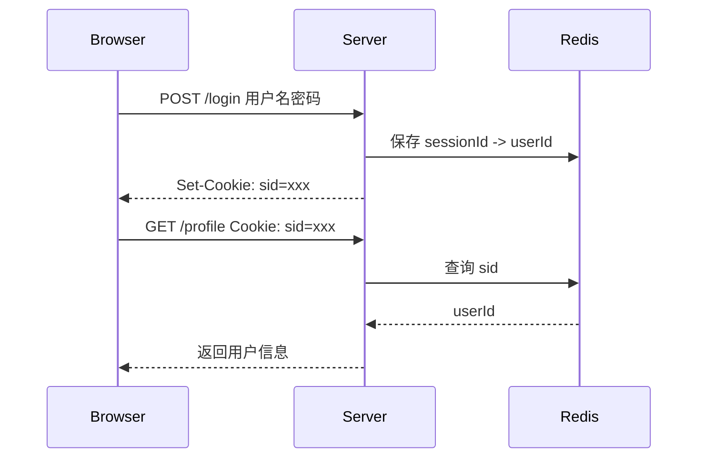
```mermaid
sequenceDiagram
    participant B as Browser
    participant S as Server
    participant R as Redis
    B->>S: POST /login 用户名密码
    S->>R: 保存 sessionId -> userId
    S-->>B: Set-Cookie: sid=xxx
    B->>S: GET /profile Cookie: sid=xxx
    S->>R: 查询 sid
    R-->>S: userId
    S-->>B: 返回用户信息
```

#### JWT 登录

1. 用户登录成功。
2. 服务端生成 JWT，包含用户 ID、过期时间、权限等声明，并用密钥签名。
3. 客户端保存 JWT，通常放在 Cookie 或内存。
4. 后续请求携带 JWT。
5. 服务端验签和检查过期时间，通过后识别用户。

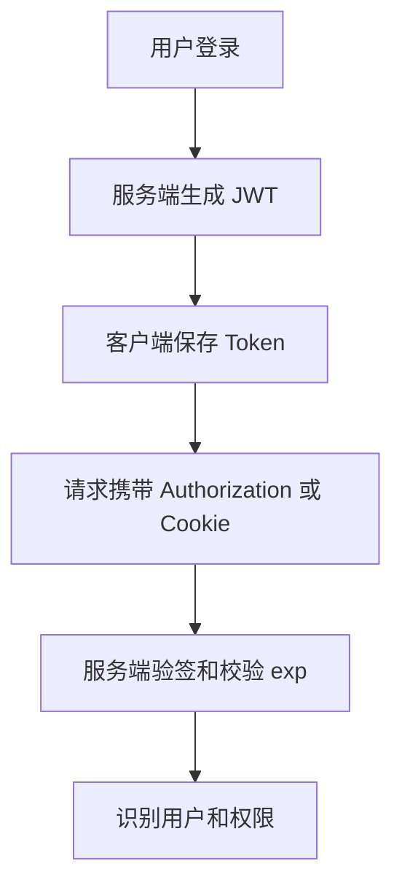
```mermaid
flowchart TD
    A[用户登录] --> B[服务端生成 JWT]
    B --> C[客户端保存 Token]
    C --> D[请求携带 Authorization 或 Cookie]
    D --> E[服务端验签和校验 exp]
    E --> F[识别用户和权限]
```

### 6.3 高频面试题

| 问题 | 标准回答思路 | 可能追问 |
| --- | --- | --- |
| Cookie 和 Session 区别？ | Cookie 存客户端，Session 存服务端；Cookie 可保存 Session ID。 | Session 为什么通常依赖 Cookie？ |
| JWT 和 Session 区别？ | Session 有状态，服务端可控；JWT 自包含，服务端无状态但撤销困难。 | JWT 如何强制下线？ |
| Cookie 有哪些安全属性？ | HttpOnly、Secure、SameSite、Domain、Path、Max-Age。 | SameSite 如何防 CSRF？ |
| Token 放 localStorage 还是 Cookie？ | 看风险模型。localStorage 易受 XSS 读取；Cookie 自动携带但要防 CSRF。 | 如何设计更安全的登录？ |

### 6.4 底层原理

Session 需要 Cookie，是因为 HTTP 无状态。服务端保存了会话，但还需要客户端每次告诉服务端“我是谁”。最常见方式就是 Cookie 自动携带 Session ID。

JWT 不适合强制下线，是因为它一旦签发，在过期前只要签名正确就能通过校验。服务端如果不保存状态，就不知道这个 Token 是否已经被撤销。要强制下线，通常需要黑名单、版本号、短 Access Token + Refresh Token、服务端会话表等机制。

Cookie 的安全属性很重要：

| 属性 | 作用 |
| --- | --- |
| HttpOnly | 禁止 JS 读取，降低 XSS 窃取风险 |
| Secure | 只在 HTTPS 下发送 |
| SameSite | 控制跨站请求是否携带 Cookie，缓解 CSRF |
| Domain | 控制哪些域名可携带 |
| Path | 控制哪些路径可携带 |
| Max-Age / Expires | 控制有效期 |

### 6.5 常见追问

Q：JWT 为什么不能存敏感信息？

A：JWT 默认只是 Base64URL 编码，不是加密。任何拿到 Token 的人都能解码 payload。敏感信息不应放入 JWT，除非使用额外加密方案。

Q：Refresh Token 有什么用？

A：Access Token 短期有效，降低泄漏风险；Refresh Token 用于换取新的 Access Token，通常保存更严格，并支持服务端撤销。

Q：如何防 CSRF？

A：SameSite Cookie、CSRF Token、验证 Origin/Referer、关键操作二次确认。前后端分离场景也要注意 Cookie 自动携带导致的跨站请求风险。

### 6.6 实际项目场景

- 管理后台常用 Cookie + Session 或短 Token + Redis 会话，方便强制下线和权限变更即时生效。
- 移动端和开放 API 常用 JWT，因为客户端类型多，Authorization 头更灵活。
- 前端项目要避免把长期有效 Token 放 localStorage；如果必须放，要配合 CSP、XSS 防护、短有效期。

---

## 7. WebSocket

### 7.1 概念解释

WebSocket 是一种在单个 TCP 连接上进行全双工通信的协议。它允许服务端主动向客户端推送消息，不需要客户端不断轮询。

面试回答：

> WebSocket 先通过 HTTP Upgrade 完成握手，成功后协议从 HTTP 切换为 WebSocket。之后客户端和服务端可以在同一条长连接上双向发送帧，非常适合聊天室、实时通知、协同编辑、行情推送等场景。

### 7.2 工作流程

1. 浏览器发起 HTTP 请求，带上 `Upgrade: websocket`。
2. 服务端校验并返回 `101 Switching Protocols`。
3. 连接升级为 WebSocket。
4. 双方通过 WebSocket Frame 双向通信。
5. 通过 ping/pong 或业务心跳检测连接是否存活。
6. 断线后客户端按策略重连。

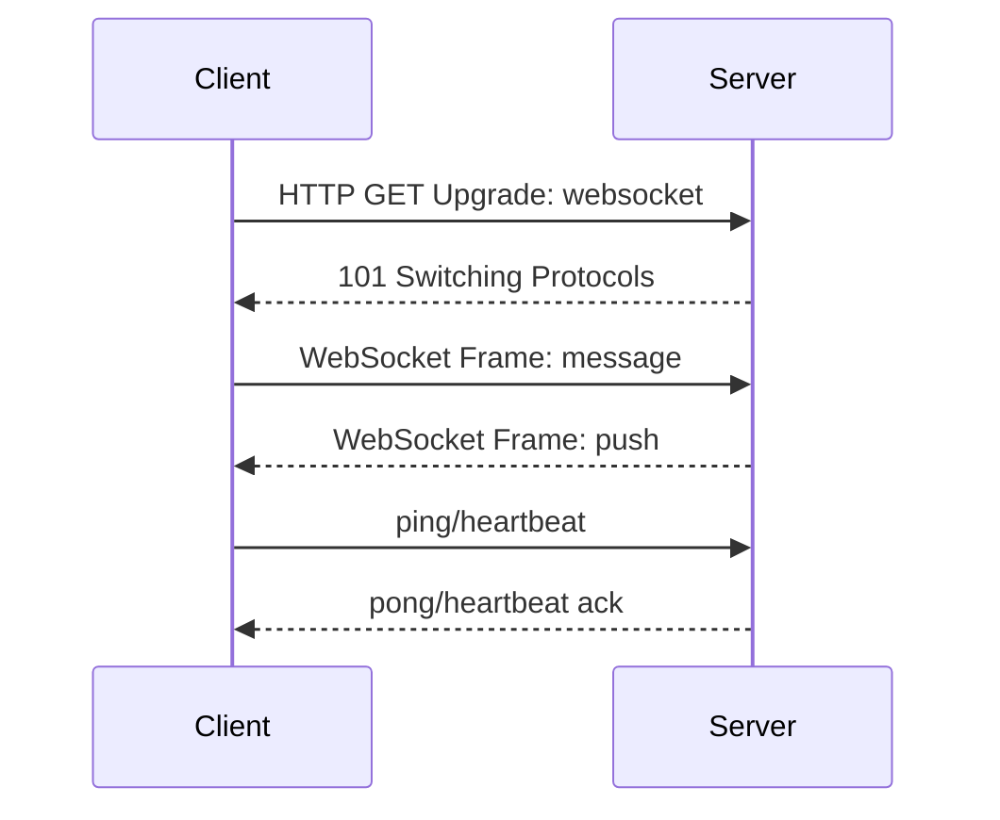
```mermaid
sequenceDiagram
    participant C as Client
    participant S as Server
    C->>S: HTTP GET Upgrade: websocket
    S-->>C: 101 Switching Protocols
    C->>S: WebSocket Frame: message
    S-->>C: WebSocket Frame: push
    C->>S: ping/heartbeat
    S-->>C: pong/heartbeat ack
```

### 7.3 高频面试题

| 问题 | 标准回答思路 | 可能追问 |
| --- | --- | --- |
| WebSocket 和 HTTP 区别？ | HTTP 是请求响应，服务端不能随意主动推；WebSocket 是长连接全双工。 | WebSocket 握手为什么用 HTTP？ |
| WebSocket 如何保持连接？ | ping/pong、业务心跳、断线重连、超时关闭。 | 心跳间隔怎么设计？ |
| WebSocket 和 SSE 区别？ | WebSocket 双向，SSE 单向服务端推送；SSE 基于 HTTP，自动重连更简单。 | AI 流式输出选哪个？ |
| WebSocket 如何鉴权？ | 握手时带 Cookie、Token、Query，服务端校验后绑定连接用户。 | Token 过期怎么办？ |

### 7.4 底层原理

WebSocket 解决的是 HTTP 请求响应模型下服务端推送困难的问题。轮询会浪费请求，长轮询会占用连接且延迟不稳定。WebSocket 建立长连接后，服务端可以随时写数据给客户端。

WebSocket 基于帧传输，而不是 HTTP 报文。帧里有 opcode、payload length、mask、payload 等字段。客户端发往服务端的数据必须 mask，服务端发往客户端通常不 mask。

### 7.5 常见追问

Q：WebSocket 连接很多时服务端压力在哪里？

A：主要在连接数、内存、文件描述符、心跳开销、消息广播、连接状态管理。Node.js 要注意单机连接上限、负载均衡、粘性会话或连接状态外置。

Q：WebSocket 经过 Nginx 要注意什么？

A：要配置 `Upgrade` 和 `Connection` 头，设置合理的超时时间，并考虑负载均衡策略。

### 7.6 实际项目场景

- 聊天室：用户进入房间后建立 WebSocket，服务端维护房间到连接的映射，收到消息后广播。
- 实时通知：订单状态、审批消息、系统告警可以通过 WebSocket 推送。
- 协同编辑：需要处理操作顺序、冲突合并、断线恢复，WebSocket 只是传输层能力。

---

## 8. SSE

### 8.1 概念解释

SSE，全称 Server-Sent Events，是基于 HTTP 的服务端单向推送技术。客户端用 `EventSource` 建立连接，服务端持续返回 `text/event-stream` 数据。

面试回答：

> SSE 适合服务端持续向浏览器推送文本事件，例如 AI 流式输出、消息通知、日志流。它比 WebSocket 简单，天然走 HTTP，浏览器支持自动重连，但只能服务端到客户端单向推送。

### 8.2 工作流程

1. 客户端创建 `EventSource` 连接。
2. 服务端返回 `Content-Type: text/event-stream`。
3. 服务端不断写入事件数据。
4. 浏览器按事件边界触发 `message` 或自定义事件。
5. 连接断开时浏览器自动重连，可通过 `Last-Event-ID` 恢复。

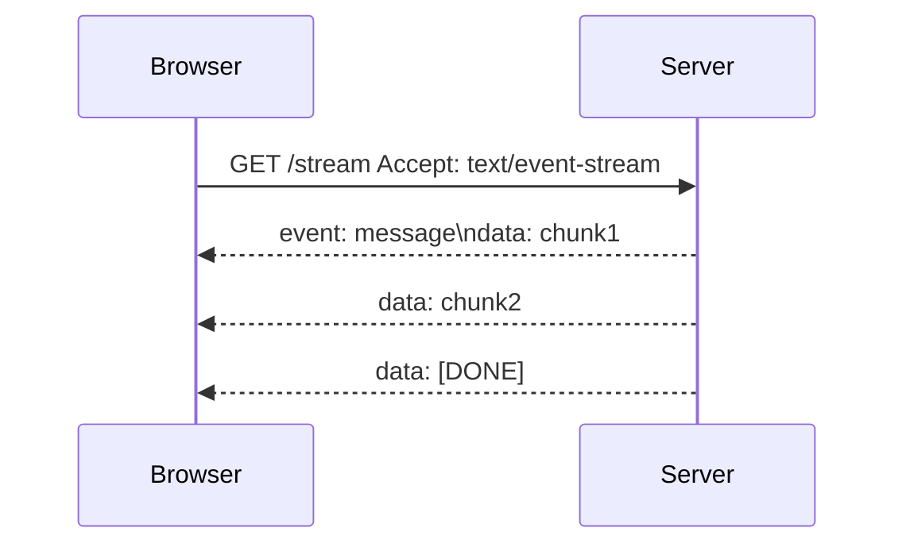
```mermaid
sequenceDiagram
    participant C as Browser
    participant S as Server
    C->>S: GET /stream Accept: text/event-stream
    S-->>C: event: message\ndata: chunk1
    S-->>C: data: chunk2
    S-->>C: data: [DONE]
```

### 8.3 高频面试题

| 问题 | 标准回答思路 | 可能追问 |
| --- | --- | --- |
| SSE 和 WebSocket 区别？ | SSE 单向、基于 HTTP、简单自动重连；WebSocket 双向、协议升级、适合强实时交互。 | 为什么 AI 输出常用 SSE？ |
| SSE 有什么限制？ | 只支持服务端到客户端，主要传文本，连接数受浏览器限制。 | 怎么传二进制？ |
| SSE 如何断线恢复？ | 事件带 id，客户端重连时带 Last-Event-ID，服务端从指定位置继续。 | 服务端要保存什么状态？ |

### 8.4 底层原理

SSE 本质是一个长期不结束的 HTTP 响应。服务端不断 flush 数据，浏览器边接收边解析事件。它不需要像 WebSocket 那样升级协议，所以对代理、网关、服务端框架更友好。

SSE 的关键是禁用响应缓存、及时 flush、避免代理缓冲。否则服务端写了数据，用户端可能迟迟收不到。

### 8.5 常见追问

Q：SSE 为什么适合 AI 流式输出？

A：AI 生成是服务端不断产生文本片段，客户端只需要接收并增量渲染，基本不需要频繁双向通信。SSE 简单、可读、自动重连，和 HTTP 生态兼容好。

Q：SSE 如何鉴权？

A：可以依赖 Cookie，也可以通过 URL 上的短期 token 或先建立业务会话。原生 `EventSource` 设置自定义 Header 不方便，如果需要复杂 Header，常用 `fetch` 流式读取替代。

### 8.6 实际项目场景

- AI 聊天：服务端将模型输出分块写入 SSE，前端逐字渲染。
- 日志查看器：构建任务、部署日志实时推送到浏览器。
- 消息提醒：低频通知可以用 SSE，复杂互动再考虑 WebSocket。

---

## 9. CDN

### 9.1 概念解释

CDN 是内容分发网络，通过把静态资源缓存到离用户更近的边缘节点，降低访问延迟和源站压力。

面试回答：

> CDN 的核心是就近访问和边缘缓存。用户请求资源时，DNS 或调度系统把用户分配到合适的 CDN 节点；节点有缓存就直接返回，没有缓存就回源拉取，再缓存给后续用户。

### 9.2 工作流程

1. 用户访问静态资源域名。
2. DNS 解析到 CDN 调度域名或边缘节点 IP。
3. 请求到达离用户较近的 CDN 节点。
4. 节点检查缓存是否命中。
5. 命中则直接返回。
6. 未命中则回源站获取资源。
7. CDN 按缓存策略保存资源并返回给用户。

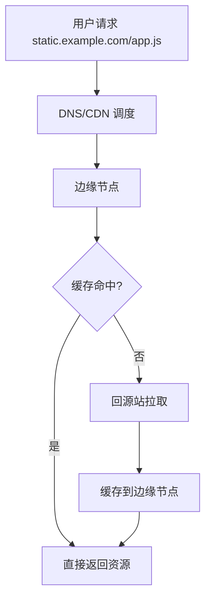
```mermaid
flowchart TD
    A[用户请求 static.example.com/app.js] --> B[DNS/CDN 调度]
    B --> C[边缘节点]
    C --> D{缓存命中?}
    D -- 是 --> E[直接返回资源]
    D -- 否 --> F[回源站拉取]
    F --> G[缓存到边缘节点]
    G --> E
```

### 9.3 高频面试题

| 问题 | 标准回答思路 | 可能追问 |
| --- | --- | --- |
| CDN 为什么快？ | 就近访问、边缘缓存、减少跨地域传输和源站压力。 | 首次访问为什么可能不快？ |
| CDN 缓存如何更新？ | 文件名 hash、缓存刷新、预热、版本化发布。 | 强刷 CDN 有什么风险？ |
| CDN 回源是什么？ | 边缘节点没有缓存或缓存过期时向源站请求资源。 | 如何减少回源？ |
| 动态接口能用 CDN 吗？ | 可以，但要谨慎设计缓存键、鉴权、个性化数据和过期策略。 | 接口缓存如何避免脏数据？ |

### 9.4 底层原理

CDN 不是简单的“复制文件”，它还涉及调度、缓存一致性、回源策略、协议优化、安全防护。

前端静态资源最适合 CDN，因为构建产物通常带内容 hash。内容变了文件名就变，旧文件可以长期缓存，新版本通过 HTML 引用新文件。这比频繁刷新 CDN 更稳定。

### 9.5 常见追问

Q：为什么 HTML 不适合设置特别长的强缓存？

A：HTML 通常是入口文件，里面引用具体 JS/CSS 资源。如果 HTML 被长期缓存，用户可能一直拿到旧版本入口，导致更新不生效。一般 HTML 设置协商缓存或较短缓存，静态资源设置长缓存。

Q：CDN 缓存键是什么？

A：CDN 判断缓存是否命中的 key，通常由 Host、Path、Query、部分 Header 组成。Query 是否参与缓存会直接影响命中率和正确性。

### 9.6 实际项目场景

- 前端构建产物 `app.[hash].js`、`style.[hash].css` 设置一年强缓存。
- HTML 设置 `no-cache`，让浏览器每次校验入口是否更新。
- 大促前对核心资源做 CDN 预热，避免大量用户首次请求同时回源。

---

## 10. 浏览器缓存 / HTTP 缓存

### 10.1 概念解释

浏览器缓存是浏览器为了减少网络请求、提升加载速度而保存资源副本的机制。HTTP 缓存是其中最重要的一部分，通过响应头控制资源能否缓存、缓存多久、过期后如何校验。

面试回答：

> HTTP 缓存分为强缓存和协商缓存。强缓存命中时不发请求，直接从本地缓存读；协商缓存会向服务器验证资源是否变化，没变化返回 304，浏览器继续使用本地缓存。

### 10.2 工作流程

缓存判断流程：

1. 浏览器请求资源，收到响应和缓存头。
2. 下次请求同一资源时，先判断强缓存是否有效。
3. 如果 `Cache-Control: max-age` 未过期，直接使用本地缓存。
4. 如果强缓存过期，带上 `If-None-Match` 或 `If-Modified-Since` 请求服务端。
5. 服务端判断资源未变化，返回 304。
6. 浏览器继续使用本地缓存。
7. 如果资源已变化，返回 200 和新资源。

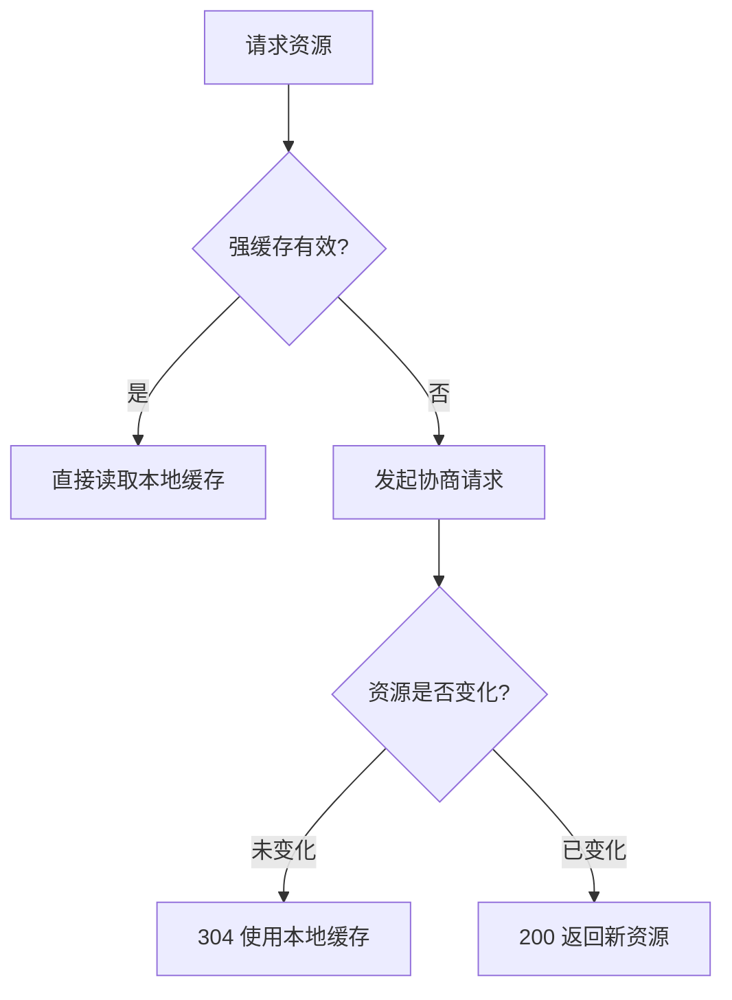
```mermaid
flowchart TD
    A[请求资源] --> B{强缓存有效?}
    B -- 是 --> C[直接读取本地缓存]
    B -- 否 --> D[发起协商请求]
    D --> E{资源是否变化?}
    E -- 未变化 --> F[304 使用本地缓存]
    E -- 已变化 --> G[200 返回新资源]
```

### 10.3 高频面试题

| 问题 | 标准回答思路 | 可能追问 |
| --- | --- | --- |
| 强缓存和协商缓存区别？ | 强缓存不发请求，协商缓存要发请求验证。 | 哪些响应头控制？ |
| Cache-Control 和 Expires 区别？ | Cache-Control 是相对时间、优先级更高；Expires 是绝对时间，受本地时间影响。 | no-cache 和 no-store 区别？ |
| ETag 和 Last-Modified 区别？ | ETag 是资源标识，精度更高；Last-Modified 基于修改时间。 | 为什么有了 Last-Modified 还要 ETag？ |
| 前端资源如何设计缓存？ | HTML 短缓存或协商缓存，hash 静态资源长缓存。 | 发布后白屏怎么处理？ |

### 10.4 底层原理

强缓存减少的是完整网络往返，速度最快。协商缓存虽然还要发请求，但响应体可以省掉，减少带宽。

`ETag` 比 `Last-Modified` 更可靠，因为：

- 文件内容变了但修改时间没变，Last-Modified 可能误判。
- 修改时间精度通常是秒级，一秒内多次变更可能识别不了。
- 文件修改时间变了但内容没变，ETag 可以避免无效下载。

常见缓存头：

| Header | 作用 |
| --- | --- |
| Cache-Control: max-age=3600 | 强缓存 3600 秒 |
| Cache-Control: no-cache | 可缓存，但使用前必须协商 |
| Cache-Control: no-store | 不允许存储 |
| ETag | 资源版本标识 |
| Last-Modified | 资源最后修改时间 |
| If-None-Match | 客户端带 ETag 协商 |
| If-Modified-Since | 客户端带修改时间协商 |

### 10.5 常见追问

Q：刷新页面时缓存策略有什么变化？

A：普通地址栏访问会优先使用缓存；刷新通常会跳过强缓存或触发协商；强制刷新会尽量重新请求资源。不同浏览器细节略有差异。

Q：Service Worker 缓存和 HTTP 缓存区别？

A：HTTP 缓存由浏览器根据响应头自动管理；Service Worker 可以用 JS 拦截请求并自定义缓存策略，更灵活但也更容易出错。

### 10.6 实际项目场景

- Vite/Webpack 产物带 hash：`assets/index.abc123.js` 设置长缓存。
- HTML 入口：`Cache-Control: no-cache`，确保发布后能拿到最新资源引用。
- 接口缓存：对公开、低频变化接口设置短缓存，对用户私有数据谨慎使用缓存。

---

## 11. 跨域 CORS

### 11.1 概念解释

跨域是浏览器同源策略带来的限制。同源要求协议、域名、端口都相同。CORS 是服务器显式允许浏览器跨域访问资源的一套机制。

面试回答：

> 跨域不是请求发不出去，而是浏览器基于同源策略拦截了响应。CORS 通过响应头告诉浏览器“这个源可以访问我”。简单请求直接发，复杂请求会先发 OPTIONS 预检。

### 11.2 工作流程

#### 简单请求

1. 浏览器发现请求跨域。
2. 如果是简单请求，直接发送，并带上 `Origin`。
3. 服务端返回 `Access-Control-Allow-Origin`。
4. 浏览器校验通过后把响应交给 JS。

#### 预检请求

1. 请求方法或头部不满足简单请求条件。
2. 浏览器先发送 OPTIONS 预检。
3. 服务端返回允许的源、方法、头部、凭证等。
4. 浏览器校验通过后发送真实请求。

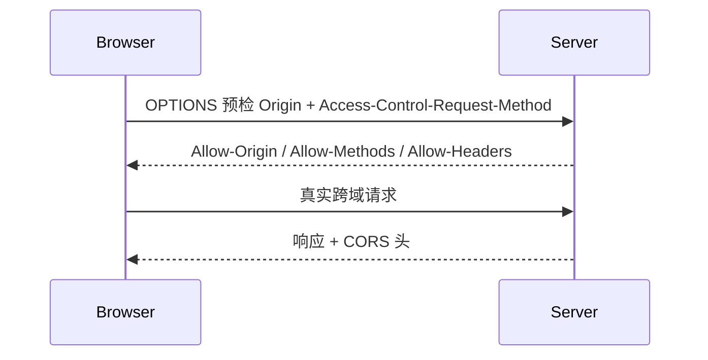
```mermaid
sequenceDiagram
    participant B as Browser
    participant S as Server
    B->>S: OPTIONS 预检 Origin + Access-Control-Request-Method
    S-->>B: Allow-Origin / Allow-Methods / Allow-Headers
    B->>S: 真实跨域请求
    S-->>B: 响应 + CORS 头
```

### 11.3 高频面试题

| 问题 | 标准回答思路 | 可能追问 |
| --- | --- | --- |
| 什么是同源策略？ | 协议、域名、端口相同才同源，浏览器限制不同源 JS 读取响应。 | 为什么要有同源策略？ |
| CORS 怎么解决跨域？ | 服务端返回允许跨域的响应头，浏览器验证后放行。 | 为什么是服务端配置？ |
| 简单请求和复杂请求区别？ | 满足特定方法、头部、Content-Type 的是简单请求；否则预检。 | POST 一定会预检吗？ |
| 携带 Cookie 跨域要怎么配？ | 前端 `credentials: include`，服务端 `Allow-Credentials: true`，Origin 不能是 `*`。 | SameSite 有影响吗？ |

### 11.4 底层原理

同源策略保护的是用户数据。浏览器会自动携带 Cookie，如果没有同源策略，恶意网站可以请求银行或后台接口并读取响应。

CORS 的控制权在服务端，因为资源属于服务端。浏览器只是执行服务端声明的访问策略。前端无法单方面“关闭跨域”，本地代理只是让浏览器看到的是同源请求。

### 11.5 常见追问

Q：跨域请求服务端会收到吗？

A：多数情况下会收到。CORS 拦截发生在浏览器是否把响应交给 JS 这一步。复杂请求如果预检失败，真实请求不会发。

Q：为什么 `Access-Control-Allow-Origin: *` 不能和 Cookie 一起用？

A：携带凭证意味着响应包含用户上下文，不能对任意来源开放，否则会扩大 CSRF 和数据泄漏风险。规范要求明确指定 Origin。

### 11.6 实际项目场景

- 前后端分离开发时，Vite dev server 代理 `/api` 到后端，避免浏览器跨域。
- 生产环境通过 Nginx 同域反向代理，或后端精确配置 CORS 白名单。
- 多租户后台要避免把 CORS 配成全开放，尤其是带 Cookie 的接口。

---

## 12. 输入 URL 到页面渲染全过程

### 12.1 概念解释

这是前端网络综合题，考察浏览器、网络、缓存、DNS、TCP、TLS、HTTP、渲染流水线和性能优化。

面试回答要有层次：

> 输入 URL 后，浏览器会解析 URL、检查缓存、DNS 解析、建立 TCP/TLS 连接、发送 HTTP 请求、接收响应，然后解析 HTML，构建 DOM 和 CSSOM，生成渲染树，布局、绘制、合成，最终显示页面。期间还会处理 JS 阻塞、资源加载、缓存、重定向和安全策略。

### 12.2 工作流程

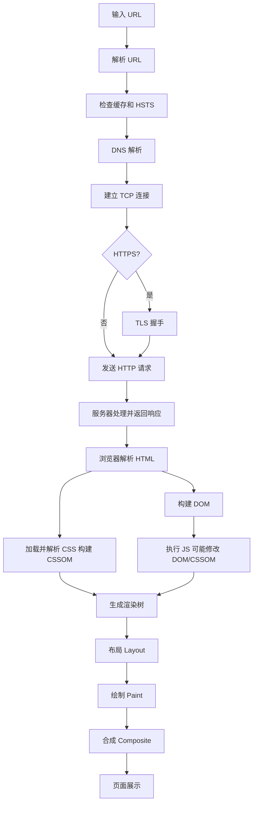
```mermaid
flowchart TD
    A[输入 URL] --> B[解析 URL]
    B --> C[检查缓存和 HSTS]
    C --> D[DNS 解析]
    D --> E[建立 TCP 连接]
    E --> F{HTTPS?}
    F -- 是 --> G[TLS 握手]
    F -- 否 --> H[发送 HTTP 请求]
    G --> H
    H --> I[服务器处理并返回响应]
    I --> J[浏览器解析 HTML]
    J --> K[构建 DOM]
    J --> L[加载并解析 CSS 构建 CSSOM]
    K --> M[执行 JS 可能修改 DOM/CSSOM]
    L --> N[生成渲染树]
    M --> N
    N --> O[布局 Layout]
    O --> P[绘制 Paint]
    P --> Q[合成 Composite]
    Q --> R[页面展示]
```

关键阶段：

1. URL 解析：判断协议、域名、端口、路径。
2. 缓存检查：命中强缓存可能不走网络。
3. DNS：域名解析为 IP。
4. TCP：三次握手建立连接。
5. TLS：HTTPS 场景进行安全握手。
6. HTTP：发送请求，服务端返回 HTML。
7. 解析 HTML：构建 DOM，遇到 CSS/JS/图片等资源继续请求。
8. CSSOM：CSS 会阻塞渲染，因为渲染树需要样式。
9. JS：默认会阻塞 HTML 解析，因为 JS 可能 `document.write` 或修改 DOM。
10. Layout：计算元素几何位置。
11. Paint：绘制像素。
12. Composite：合成图层，上屏。

### 12.3 高频面试题

| 问题 | 标准回答思路 | 可能追问 |
| --- | --- | --- |
| 输入 URL 到页面显示发生了什么？ | 按网络阶段和渲染阶段分层回答。 | 哪些环节可以优化？ |
| CSS 会阻塞 DOM 解析吗？ | CSS 不阻塞 DOM 构建，但会阻塞渲染；也可能间接阻塞 JS 执行。 | 为什么 JS 会被 CSS 阻塞？ |
| JS 为什么阻塞 HTML 解析？ | JS 可能修改 DOM 结构，浏览器要保证执行顺序。 | defer 和 async 区别？ |
| 白屏时间和哪些因素有关？ | DNS、TCP/TLS、TTFB、HTML 大小、CSS/JS 阻塞、首屏资源。 | 如何优化首屏？ |

### 12.4 底层原理

浏览器解析和渲染不是等所有资源下载完才开始，而是流式进行。HTML 边下载边解析，遇到外部资源会触发加载。现代浏览器还有预加载扫描器，会提前发现资源并并行下载。

CSS 会影响渲染树，因此浏览器通常要等关键 CSS 下载并解析后再绘制，避免先显示无样式页面再闪烁。JS 默认阻塞解析，是为了保持脚本执行与文档顺序一致。

### 12.5 常见追问

Q：defer 和 async 区别？

A：`async` 下载完成后立即执行，执行时会阻塞 HTML 解析，多个脚本执行顺序不保证；`defer` 下载不阻塞解析，等 DOM 解析完成后按顺序执行，适合依赖 DOM 和顺序的业务脚本。

Q：重排和重绘区别？

A：重排是重新计算布局，成本更高；重绘是样式变化导致重新绘制但不改变布局。改变宽高、位置会重排；改变颜色、背景通常只重绘。

### 12.6 实际项目场景

- 首屏优化：开启 CDN、压缩、HTTP/2、合理缓存、减少关键 CSS/JS、路由懒加载。
- SSR/SSG：让浏览器更快拿到可展示 HTML，减少纯 CSR 的白屏。
- 图片优化：使用 WebP/AVIF、懒加载、响应式图片、设置宽高避免布局偏移。

---

## 13. HTTP/1.1、HTTP/2、HTTP/3

### 13.1 概念解释

三者都是 HTTP 语义的不同传输实现。HTTP/1.1 是文本协议，HTTP/2 引入二进制分帧和多路复用，HTTP/3 基于 QUIC/UDP，进一步解决 TCP 层队头阻塞和握手延迟。

### 13.2 工作流程

HTTP/1.1：

- 一个 TCP 连接同一时间通常只能处理一个响应。
- 可以 Keep-Alive 复用连接。
- 管线化理论上可多个请求连续发送，但实践少用，仍有队头阻塞。

HTTP/2：

- 一个 TCP 连接上多个 Stream 并发。
- 请求和响应拆成 Frame。
- Header 压缩。
- Stream 之间可交错传输。

HTTP/3：

- 基于 UDP 上的 QUIC。
- TLS 1.3 内置。
- 多路复用在 QUIC 层实现。
- 某个 Stream 丢包不阻塞其他 Stream。

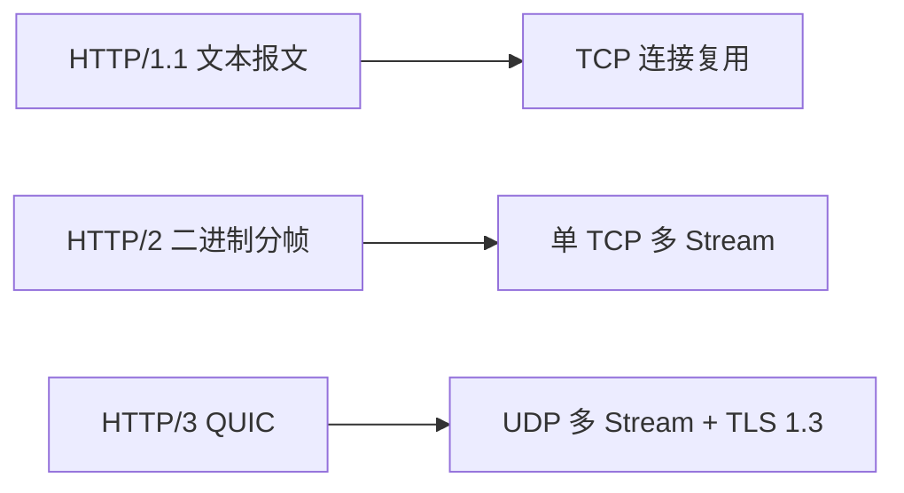
```mermaid
flowchart LR
    A[HTTP/1.1 文本报文] --> B[TCP 连接复用]
    C[HTTP/2 二进制分帧] --> D[单 TCP 多 Stream]
    E[HTTP/3 QUIC] --> F[UDP 多 Stream + TLS 1.3]
```

### 13.3 高频面试题

| 对比项 | HTTP/1.1 | HTTP/2 | HTTP/3 |
| --- | --- | --- | --- |
| 传输层 | TCP | TCP | UDP + QUIC |
| 报文格式 | 文本 | 二进制帧 | 二进制帧 |
| 多路复用 | 弱 | 支持 | 支持 |
| 队头阻塞 | 应用层明显 | TCP 层仍存在 | 单 Stream 丢包不阻塞其他 Stream |
| Header 压缩 | 无 | HPACK | QPACK |
| 加密 | 可选 HTTPS | 浏览器里基本要求 HTTPS | 默认 TLS 1.3 |

高频问法：

Q：HTTP/2 为什么更快？

A：它通过二进制分帧、多路复用、Header 压缩、请求优先级等机制减少连接数量和重复头部开销。多个请求可以在一个 TCP 连接里并发传输，避免 HTTP/1.1 多连接竞争和应用层队头阻塞。

Q：HTTP/2 还有队头阻塞吗？

A：有，但主要在 TCP 层。HTTP/2 多个 Stream 共享一个 TCP 连接，如果底层 TCP 某个包丢了，后续字节即使属于其他 Stream，也要等重传后才能交给应用层。

Q：HTTP/3 为什么用 UDP？

A：不是为了使用 UDP 的“不可靠”，而是为了在用户态的 QUIC 中实现更灵活的可靠传输、多路复用、连接迁移和 TLS 1.3 握手，绕开 TCP 的内核限制和队头阻塞。

### 13.4 底层原理

HTTP/2 的核心是“把 HTTP 消息拆成帧，在一个连接上交错传输”。这样慢请求不会在 HTTP 层阻塞快请求。但因为 TCP 只认字节流，一旦丢包，整个连接的字节流都要等待补齐。

HTTP/3 把多路复用放到 QUIC 层，每个 Stream 有独立的流控和重传。一个 Stream 丢包不会阻塞其他 Stream 的数据交付。

### 13.5 常见追问

Q：HTTP/2 下还需要域名分片吗？

A：通常不需要。HTTP/1.1 时代域名分片是为了突破浏览器单域连接数限制；HTTP/2 单连接多路复用后，分片反而可能破坏连接复用和 Header 压缩效果。

Q：HTTP/3 一定比 HTTP/2 快吗？

A：不一定。它在弱网、移动网络、丢包、网络切换时优势明显，但实际效果取决于网络环境、服务端支持、CDN、实现质量。

### 13.6 实际项目场景

- 静态资源上 CDN 后通常自动支持 HTTP/2 / HTTP/3。
- HTTP/2 下可以减少雪碧图、资源合并这类为了减少请求数的旧优化，但仍要控制资源体积。
- 移动端弱网场景，HTTP/3 的连接迁移能减少网络切换导致的连接中断。

---

## 14. 长连接 / 短连接 / Keep-Alive

### 14.1 概念解释

短连接是一次请求响应后关闭连接。长连接是连接建立后复用多次请求。Keep-Alive 是 HTTP 中复用 TCP 连接的机制。

面试回答：

> 长连接减少了频繁 TCP 握手和 TLS 握手的成本，适合多个请求连续访问同一服务。HTTP/1.1 默认开启 Keep-Alive，但长连接也会占用服务端连接资源，需要合理设置超时和最大请求数。

### 14.2 工作流程

短连接：

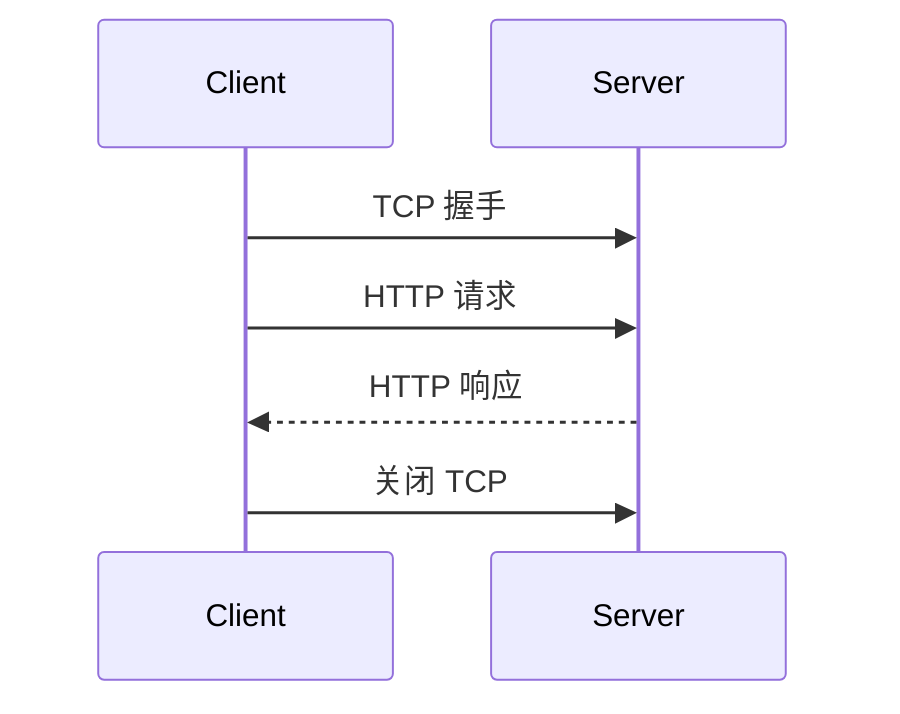
```mermaid
sequenceDiagram
    participant C as Client
    participant S as Server
    C->>S: TCP 握手
    C->>S: HTTP 请求
    S-->>C: HTTP 响应
    C->>S: 关闭 TCP
```

长连接：

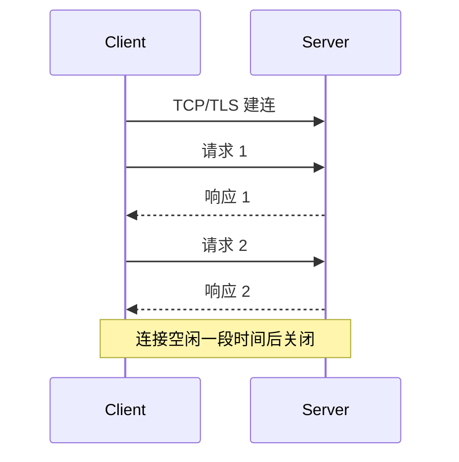
```mermaid
sequenceDiagram
    participant C as Client
    participant S as Server
    C->>S: TCP/TLS 建连
    C->>S: 请求 1
    S-->>C: 响应 1
    C->>S: 请求 2
    S-->>C: 响应 2
    Note over C,S: 连接空闲一段时间后关闭
```

### 14.3 高频面试题

| 问题 | 标准回答思路 | 可能追问 |
| --- | --- | --- |
| 长连接有什么好处？ | 减少握手开销、降低延迟、提升吞吐。 | 长连接有什么缺点？ |
| Keep-Alive 是 TCP 的还是 HTTP 的？ | TCP 有 keepalive 探活机制，HTTP Keep-Alive 是连接复用机制，二者不同。 | TCP keepalive 默认适合业务心跳吗？ |
| 长连接会一直不断吗？ | 不会，通常有 idle timeout、最大请求数、服务端资源限制。 | 超时怎么配置？ |

### 14.4 底层原理

建立 TCP 和 TLS 连接需要 RTT 和计算成本。短连接在大量小请求场景下非常浪费。长连接通过复用连接，把这部分成本摊薄。

但是连接本身占用文件描述符、内存和状态。服务端要在性能和资源之间平衡，设置合理的 keep-alive timeout。超时时间太短复用效果差，太长会占用资源。

### 14.5 常见追问

Q：TCP keepalive 和业务心跳区别？

A：TCP keepalive 是操作系统层面的空闲探测，默认间隔通常很长，不适合实时业务。业务心跳由应用自己发送，可以检测用户在线状态、延迟、鉴权过期等。

Q：HTTP/2 还需要 Keep-Alive 吗？

A：HTTP/2 本身就是复用单连接承载多个 Stream，连接复用仍然重要，只是不再按 HTTP/1.1 的方式理解多个串行请求。

### 14.6 实际项目场景

- Node.js 调用下游服务时使用连接池和 keep-alive agent，避免高并发下频繁建连。
- Nginx 配置 `keepalive_timeout` 时要结合业务请求频率和连接数。
- 微服务内部调用需要关注连接复用，否则延迟和端口耗尽问题会很明显。

---

## 15. 状态码

### 15.1 概念解释

HTTP 状态码是服务端对请求处理结果的标准化表达。它让客户端、代理、浏览器和监控系统用统一方式理解响应。

### 15.2 工作流程

1. 客户端发送请求。
2. 服务端处理请求。
3. 服务端选择合适状态码。
4. 客户端根据状态码决定缓存、跳转、重试、报错或解析响应。

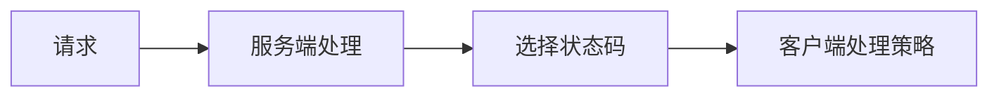
```mermaid
flowchart LR
    A[请求] --> B[服务端处理]
    B --> C[选择状态码]
    C --> D[客户端处理策略]
```

### 15.3 高频面试题

| 分类 | 常见状态码 | 含义 |
| --- | --- | --- |
| 1xx | 101 | 协议切换，如 WebSocket |
| 2xx | 200 | 成功 |
| 2xx | 201 | 创建成功 |
| 2xx | 204 | 成功但无响应体 |
| 3xx | 301 | 永久重定向 |
| 3xx | 302 | 临时重定向 |
| 3xx | 304 | 资源未修改，使用缓存 |
| 3xx | 307 | 临时重定向，保持方法和 body |
| 3xx | 308 | 永久重定向，保持方法和 body |
| 4xx | 400 | 请求参数错误 |
| 4xx | 401 | 未认证 |
| 4xx | 403 | 已认证但无权限 |
| 4xx | 404 | 资源不存在 |
| 4xx | 405 | 方法不允许 |
| 4xx | 409 | 资源冲突 |
| 4xx | 429 | 请求过多 |
| 5xx | 500 | 服务端内部错误 |
| 5xx | 502 | 网关从上游收到无效响应 |
| 5xx | 503 | 服务暂不可用 |
| 5xx | 504 | 网关等待上游超时 |

### 15.4 底层原理

状态码不是给人看的错误文案，而是机器可处理的协议语义。例如：

- 浏览器看到 301/302 会自动跳转。
- 缓存看到 304 会复用本地资源。
- 客户端看到 401 可以跳登录。
- 网关看到 502/504 可以判断上游异常。

### 15.5 常见追问

Q：401 和 403 区别？

A：401 是未认证或认证失效，需要登录；403 是认证了但权限不足。

Q：301 和 302 对 SEO 和缓存有什么影响？

A：301 表示永久迁移，浏览器和搜索引擎可能长期缓存；302 是临时迁移，语义上不应永久替换原地址。

Q：502 和 504 区别？

A：502 是网关连到上游但上游响应无效或异常；504 是网关等上游响应超时。

### 15.6 实际项目场景

- 登录过期返回 401，前端统一拦截跳登录。
- 无权限访问管理后台接口返回 403，前端展示无权限页面。
- API 限流返回 429，客户端做退避重试。

---

## 16. 请求方法

### 16.1 概念解释

HTTP Method 表示对资源执行的动作。面试重点不是“GET 查 POST 增”这么浅，而是理解语义、幂等性和安全性。

### 16.2 工作流程

客户端通过 Method + URL + Header + Body 表达操作：

```http
PUT /api/users/1 HTTP/1.1
Content-Type: application/json

{"name":"New Name"}
```

服务端根据 Method 和路径路由到对应处理逻辑。

### 16.3 高频面试题

| 方法 | 语义 | 是否安全 | 是否幂等 | 常见用途 |
| --- | --- | --- | --- | --- |
| GET | 获取资源 | 是 | 是 | 查询列表/详情 |
| POST | 提交处理 | 否 | 通常否 | 创建、提交表单 |
| PUT | 整体替换资源 | 否 | 是 | 更新完整资源 |
| PATCH | 部分更新资源 | 否 | 不一定 | 修改部分字段 |
| DELETE | 删除资源 | 否 | 是 | 删除 |
| HEAD | 只获取响应头 | 是 | 是 | 检查资源元信息 |
| OPTIONS | 查询支持能力 | 是 | 是 | CORS 预检 |

### 16.4 底层原理

安全方法指不应该修改服务端资源；幂等指一次和多次执行效果相同。GET 是安全且幂等，DELETE 是不安全但幂等，POST 通常不幂等。

幂等性影响重试策略。网络超时时，如果 POST 创建订单被重试，可能重复下单；因此真实项目会使用幂等键、唯一约束或业务状态机。

### 16.5 常见追问

Q：GET 能不能带 body？

A：协议并没有绝对禁止，但语义和兼容性都不推荐。浏览器、代理、服务器对 GET body 支持不一致，实际项目应使用 query 或改用 POST。

Q：POST 一定不幂等吗？

A：不一定。幂等是语义和服务端实现决定的。比如 `POST /payments` 如果使用幂等键保证同一请求只处理一次，也可以实现幂等。

### 16.6 实际项目场景

- 查询接口用 GET，方便缓存、日志和排查。
- 创建订单用 POST，并带 `Idempotency-Key` 防重复提交。
- 更新用户资料用 PATCH，只传修改字段。

---

## 17. RESTful

### 17.1 概念解释

RESTful 是一种面向资源的 API 设计风格。它用 URL 表示资源，用 HTTP Method 表示动作，用状态码表达结果。

面试回答：

> RESTful 的核心是资源建模。接口不应该只围绕动词设计，而应该围绕资源设计，比如 `/users/1` 表示用户资源，GET 获取，PATCH 修改，DELETE 删除。

### 17.2 工作流程

```http
GET    /api/users
POST   /api/users
GET    /api/users/1
PATCH  /api/users/1
DELETE /api/users/1
```

客户端通过统一语义操作资源，服务端返回资源表示。

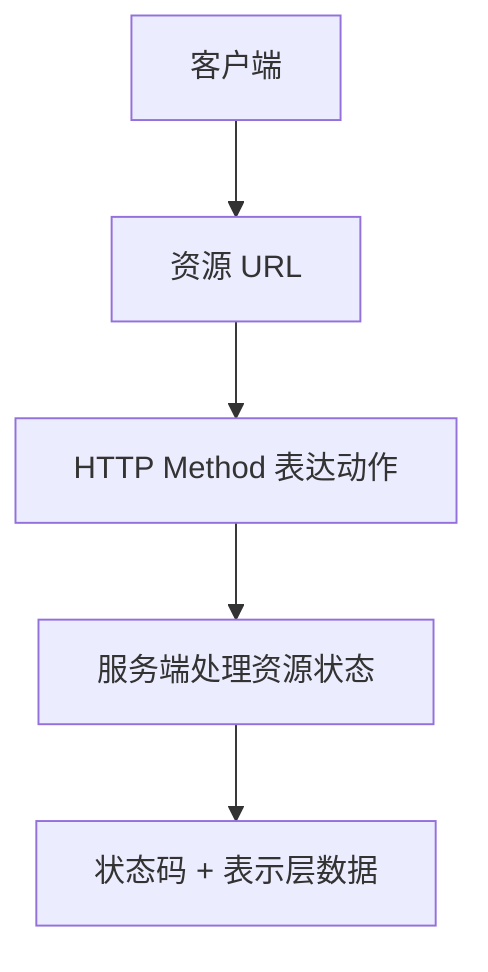
```mermaid
flowchart TD
    A[客户端] --> B[资源 URL]
    B --> C[HTTP Method 表达动作]
    C --> D[服务端处理资源状态]
    D --> E[状态码 + 表示层数据]
```

### 17.3 高频面试题

| 问题 | 标准回答思路 | 可能追问 |
| --- | --- | --- |
| RESTful 是什么？ | 面向资源的接口设计风格。 | 和普通 RPC 接口区别？ |
| RESTful URL 怎么设计？ | 名词复数表示资源，层级表达关系，避免动词泛滥。 | 复杂动作怎么设计？ |
| RESTful 一定要完全遵守吗？ | 不一定，工程上可以结合业务可读性和一致性。 | 批量操作怎么做？ |

### 17.4 底层原理

RESTful 借用了 HTTP 的原生语义，让接口更统一。缓存、状态码、幂等、代理、网关都能更自然地工作。

但真实业务里有很多“动作型”操作，比如发布文章、取消订单、导出报表。此时可以把动作建模成资源状态变化，或者适度使用动作子路径，例如 `POST /orders/1/cancel`。

### 17.5 常见追问

Q：RESTful 和 GraphQL 区别？

A：RESTful 多端点、资源导向；GraphQL 单端点、客户端声明需要的数据结构。GraphQL 可以减少过取和欠取，但缓存、权限、复杂度控制更难。

Q：RESTful 和 RPC 区别？

A：RESTful 强调资源和 HTTP 语义；RPC 强调调用远程函数或方法，更像本地调用远端过程。

### 17.6 实际项目场景

- 后台管理 CRUD 适合 RESTful，语义清晰、调试方便。
- 前端请求封装可以按资源模块组织：`userApi.getList`、`userApi.update`。
- 对复杂业务动作，团队应保持一致命名，不为“纯 REST”牺牲可读性。

---

## 18. RPC

### 18.1 概念解释

RPC 是远程过程调用，让调用远程服务像调用本地函数一样。常见实现包括 gRPC、Thrift、Dubbo、JSON-RPC 等。

面试回答：

> RPC 关注服务之间的方法调用，通常有接口定义、序列化协议、网络传输、服务发现、负载均衡、超时重试等能力。它更常用于服务端内部通信，而 REST 更常用于对外 HTTP API。

### 18.2 工作流程

1. 客户端调用本地 Stub 方法。
2. Stub 把方法名、参数序列化。
3. 通过网络发送到服务端。
4. 服务端 Stub 反序列化并调用真实方法。
5. 服务端把结果序列化返回。
6. 客户端反序列化，得到返回值。

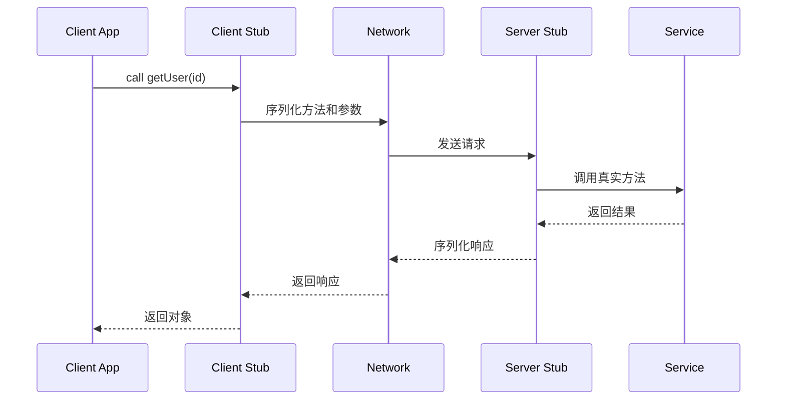
```mermaid
sequenceDiagram
    participant App as Client App
    participant CS as Client Stub
    participant Net as Network
    participant SS as Server Stub
    participant Svc as Service
    App->>CS: call getUser(id)
    CS->>Net: 序列化方法和参数
    Net->>SS: 发送请求
    SS->>Svc: 调用真实方法
    Svc-->>SS: 返回结果
    SS-->>Net: 序列化响应
    Net-->>CS: 返回响应
    CS-->>App: 返回对象
```

### 18.3 高频面试题

| 问题 | 标准回答思路 | 可能追问 |
| --- | --- | --- |
| RPC 和 HTTP API 区别？ | RPC 面向方法调用，REST 面向资源；RPC 常用于内部高性能通信。 | gRPC 为什么快？ |
| RPC 要解决哪些问题？ | 序列化、连接、超时、重试、服务发现、负载均衡、熔断。 | 重试会带来什么风险？ |
| gRPC 基于什么？ | HTTP/2 + Protocol Buffers。 | 浏览器为什么不能直接完整支持 gRPC？ |

### 18.4 底层原理

RPC 的难点不是发请求，而是把远程调用伪装成本地调用时，仍然要处理网络的不确定性：超时、失败、重复、乱序、服务不可用、版本不兼容。

序列化协议影响性能和兼容性。JSON 可读性好但体积大、解析慢；Protobuf 体积小、速度快、强 schema，但调试不如 JSON 直观。

### 18.5 常见追问

Q：RPC 重试为什么危险？

A：如果方法不是幂等的，重试可能导致重复扣款、重复下单、重复发送消息。需要幂等键、去重表、状态机或只对安全操作重试。

Q：gRPC-Web 是什么？

A：浏览器环境对原生 gRPC 支持有限，gRPC-Web 通过代理和适配协议让浏览器可以调用 gRPC 服务。

### 18.6 实际项目场景

- Node.js BFF 对前端提供 REST/GraphQL，对内部服务调用 gRPC。
- 微服务间用 RPC 时要设置超时、重试、熔断，避免故障扩散。
- 对外开放接口通常更偏 HTTP/REST，因为兼容性和调试体验更好。

---

## 19. WebRTC 可选

### 19.1 概念解释

WebRTC 是浏览器提供的实时音视频和点对点数据通信技术。它可以让浏览器之间直接传输音视频或数据，不必所有媒体流都经过业务服务器。

面试回答：

> WebRTC 包括媒体采集、编解码、NAT 穿透、安全传输和点对点连接。信令不由 WebRTC 规定，业务可以用 WebSocket、HTTP 或其他方式交换 SDP 和 ICE candidate。

### 19.2 工作流程

1. A 获取本地媒体流。
2. A 创建 PeerConnection，生成 Offer SDP。
3. A 通过信令服务器发送 Offer 给 B。
4. B 设置远端描述，生成 Answer SDP。
5. 双方交换 ICE candidate。
6. 通过 STUN/TURN 完成 NAT 穿透。
7. 建立 P2P 或 TURN 中继连接，传输音视频。

```mermaid
sequenceDiagram
    participant A as Peer A
    participant Sig as Signaling Server
    participant B as Peer B
    participant STUN as STUN/TURN
    A->>Sig: Offer SDP
    Sig-->>B: Offer SDP
    B->>Sig: Answer SDP
    Sig-->>A: Answer SDP
    A->>Sig: ICE Candidate
    Sig-->>B: ICE Candidate
    B->>Sig: ICE Candidate
    Sig-->>A: ICE Candidate
    A->>STUN: 获取公网映射/中继
    B->>STUN: 获取公网映射/中继
    A-->>B: 建立实时媒体通道
```

### 19.3 高频面试题

| 问题 | 标准回答思路 | 可能追问 |
| --- | --- | --- |
| WebRTC 需要服务器吗？ | 需要信令服务器；复杂网络下还需要 STUN/TURN。媒体可 P2P，也可能走 TURN 中继。 | 信令服务器传什么？ |
| STUN 和 TURN 区别？ | STUN 帮助发现公网地址，TURN 负责中继流量。 | TURN 为什么成本高？ |
| WebRTC 和 WebSocket 区别？ | WebRTC 适合实时音视频/P2P；WebSocket 是客户端服务端全双工消息通道。 | 文件传输能用 WebRTC 吗？ |

### 19.4 底层原理

WebRTC 的难点是 NAT 穿透。大多数用户在路由器或运营商 NAT 后面，两个浏览器不能直接知道如何互连。ICE 会收集多种候选地址，尝试找出可用路径。如果 P2P 失败，就用 TURN 服务器中继。

媒体传输使用 SRTP 加密，控制和拥塞处理会动态调整码率、分辨率和丢包恢复策略。

### 19.5 常见追问

Q：为什么 WebRTC 不规定信令？

A：不同业务的房间、权限、用户、设备协商方式不同。WebRTC 只规定媒体和连接能力，把信令留给业务实现。

Q：多人会议怎么做？

A：小规模可以 Mesh，但连接数和上行压力大。生产常用 SFU，由服务器转发媒体流，客户端只上传一路、接收多路。

### 19.6 实际项目场景

- 视频会议：WebRTC + SFU + WebSocket 信令。
- 在线客服：浏览器采集音视频，通过 WebRTC 与客服端通话。
- P2P 文件传输：使用 WebRTC DataChannel 传输数据。

---

## 20. 综合高频追问速记

### 20.1 HTTP / HTTPS

Q：为什么 HTTPS 第一次连接慢？

A：需要 TCP 握手和 TLS 握手，增加 RTT 和加密计算。但 TLS 1.3、会话复用、HTTP/2/3、OCSP Stapling 等机制可以降低成本。

Q：HTTPS 可以被缓存吗？

A：可以。HTTPS 不影响 HTTP 缓存语义。浏览器、CDN 都可以在合适配置下缓存 HTTPS 资源，只是传输过程加密。

Q：HTTP 请求头里 Host 有什么用？

A：同一个 IP 可以部署多个站点，Host 告诉服务端用户访问的是哪个域名，便于虚拟主机和路由。

### 20.2 TCP / UDP

Q：流量控制和拥塞控制区别？

A：流量控制保护接收方，避免发送太快导致接收方缓冲区溢出；拥塞控制保护网络，避免过多数据注入网络造成拥塞。

Q：TCP 是消息流还是字节流？

A：字节流。TCP 不保留应用层消息边界，所以应用协议要自己定义边界。

Q：UDP 为什么也有校验和？

A：用于检测数据在传输中是否损坏。UDP 不保证重传，但至少能发现错误并丢弃坏包。

### 20.3 鉴权

Q：Cookie 被禁用后 Session 还能用吗？

A：可以用 URL 重写或 Header 携带 Session ID，但安全性和体验较差。浏览器场景通常依赖 Cookie。

Q：如何设计单点登录？

A：统一认证中心登录后签发票据或 Token，业务系统验证票据并建立本地会话。关键点是跨域登录态传递、票据校验、退出登录和 Token 生命周期。

Q：如何实现强制下线？

A：服务端保留会话状态或 Token 版本号。用户下线时删除 Session、加入 JWT 黑名单、递增用户 tokenVersion，后续请求校验失败。

### 20.4 缓存 / CDN

Q：缓存命中率低怎么排查？

A：检查资源 URL 是否稳定、Query 是否参与缓存键、Cache-Control 是否正确、是否频繁刷新、CDN 节点是否回源、是否 Vary 头过多。

Q：为什么带 hash 的静态资源适合长期缓存？

A：文件内容变化会生成新文件名，旧缓存不会影响新版本。URL 本身就是版本号。

Q：CDN 能防 DDoS 吗？

A：CDN 可以吸收部分流量并隐藏源站，但专业 DDoS 防护还需要高防、清洗、限流、WAF、源站保护等组合。

### 20.5 跨域 / 安全

Q：CORS 能防 CSRF 吗？

A：CORS 主要控制跨域读取响应，不是专门防 CSRF。CSRF 防护应依赖 SameSite、CSRF Token、Origin/Referer 校验等。

Q：JSONP 为什么能跨域？

A：`script` 标签不受同源策略限制，JSONP 利用脚本加载执行回调。但它只支持 GET，安全性差，现代项目优先用 CORS。

Q：XSS 和 CSRF 区别？

A：XSS 是攻击者让恶意脚本在用户页面执行；CSRF 是诱导用户浏览器带着登录态发起非预期请求。XSS 偏“偷和执行”，CSRF 偏“借身份发请求”。

---

## 面试回答方法论

### 1. 先讲它解决的问题

例如 HTTPS：

> HTTP 明文传输会被窃听、篡改，也无法确认对方身份，所以需要 HTTPS。

### 2. 再讲核心机制

> HTTPS 通过 TLS 实现加密、完整性校验和证书认证。握手阶段用非对称机制协商密钥，传输阶段用对称加密。

### 3. 接着讲为什么这样设计

> 非对称加密安全但慢，对称加密快但需要安全交换密钥，所以组合使用。

### 4. 最后落到项目经验

> 项目里通常在 Nginx 或云负载均衡终止 TLS，前端要避免 mixed content，并给 Cookie 设置 Secure、HttpOnly、SameSite。

---

## 项目实战组合题

### 登录鉴权方案怎么设计？

推荐回答：

1. Web 管理后台可使用 Cookie + Session，Session 存 Redis，方便强制下线和权限实时变更。
2. Cookie 设置 HttpOnly、Secure、SameSite，降低 XSS 和 CSRF 风险。
3. 前端统一处理 401，跳转登录；403 展示无权限。
4. 如果使用 JWT，Access Token 短有效期，Refresh Token 可撤销，并设计黑名单或版本号。

### 前端静态资源缓存怎么设计？

推荐回答：

1. HTML 入口使用 `Cache-Control: no-cache` 或短缓存，确保能拿到最新资源引用。
2. JS/CSS/图片等带内容 hash 的资源设置长期强缓存。
3. 静态资源部署 CDN，开启 gzip/br 压缩。
4. 发布时避免删除旧资源，防止用户拿旧 HTML 请求不到旧 JS。

### AI 流式输出选 WebSocket 还是 SSE？

推荐回答：

1. 如果只是服务端连续返回文本，SSE 更简单，基于 HTTP，支持自动重连。
2. 如果需要强双向实时交互、多人协作、复杂状态同步，WebSocket 更合适。
3. 实战中还要考虑鉴权、代理缓冲、超时、断线恢复和前端增量渲染。

### 大文件上传怎么优化？

推荐回答：

1. 分片上传，避免单次失败重传整个文件。
2. 每个分片带 hash，服务端记录上传进度。
3. 支持断点续传和秒传。
4. 控制并发数，避免占满带宽。
5. 上传完成后服务端合并分片，并校验整体 hash。

```mermaid
flowchart TD
    A[选择文件] --> B[计算文件 hash]
    B --> C{服务端是否已有?}
    C -- 有 --> D[秒传成功]
    C -- 无 --> E[切分分片]
    E --> F[并发上传分片]
    F --> G[服务端记录进度]
    G --> H[全部分片完成]
    H --> I[合并并校验 hash]
```

---

## 最后复习建议

网络八股不要孤立背。大厂面试喜欢把多个点串起来问：

- 从 URL 输入开始，串 DNS、TCP、TLS、HTTP、缓存、渲染。
- 从登录开始，串 Cookie、Session、JWT、CSRF、XSS、CORS。
- 从性能优化开始，串 CDN、缓存、HTTP/2、压缩、首屏渲染。
- 从实时通信开始，串 WebSocket、SSE、TCP、心跳、断线重连。

真正好的回答通常有四层：概念、流程、为什么、项目取舍。能讲出取舍，就不像只背过八股。
