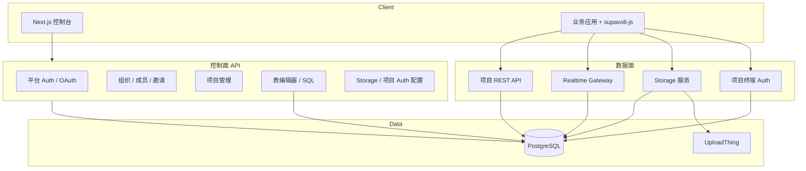

# 本科毕业论文开题报告

---

**论文题目**：基于 Node.js 的 BaaS 云平台设计与实现——以 Supavolt 为例  

**学生姓名**：____________  
**学号**：____________  
**专业**：____________（建议：软件工程 / 计算机科学与技术）  
**指导教师**：____________  
**填表日期**：____________  

---

## 一、选题背景与研究意义

### 1.1 选题背景

随着移动互联网与 SaaS 模式的普及，大量创业团队与独立开发者需要在较短时间内完成具备「数据库 + 用户认证 + 文件存储 + 实时能力」的后端能力，而传统方式为每个项目单独部署数据库、编写 CRUD 接口与运维脚本，开发周期长、重复劳动多。Backend-as-a-Service（BaaS）将后端能力产品化，以 API 与控制台形式交付，典型代表包括 Firebase、Supabase 等。

Supabase 等开源方案虽功能完善，但其架构复杂、部署门槛较高，不利于在教学与毕设场景下完整理解「多租户 + PostgreSQL + 实时 + 自动生成 API」的全链路实现。本课题在 **Supavolt** 全栈项目基础上，设计并实现一套可运行、可演示、可扩展的轻量级 BaaS 平台：采用 **NestJS + Next.js** 前后端分离架构，以 **Schema 级多租户** 隔离项目数据，并提供表编辑器、REST 数据面、SQL 控制台、Realtime、对象存储与项目级 Auth 及 JavaScript SDK，兼顾工程完整性与学习深度。

### 1.2 研究意义

**理论意义**：梳理 BaaS 平台的分层架构（控制面 vs 数据面）、多租户隔离策略（库级 / Schema 级 / 行级）、以及基于 PostgreSQL 触发器与 NOTIFY 实现变更推送的机制，为同类系统设计提供可参考的技术路线。

**实践意义**：完成一套可本地部署、可演示的端到端系统，验证 TypeScript 全栈、Drizzle ORM、JWT 双令牌与项目密钥、WebSocket 实时推送等主流技术在云平台场景下的可行性与边界（如 SQL 沙箱、密钥权限划分）。

**应用价值**：降低小型应用的后端启动成本；控制台与 SDK 可直接支撑课程设计、原型验证或二次开发。

---

## 二、国内外研究现状

### 2.1 商业与开源 BaaS

- **Firebase**：以 NoSQL 与托管服务为核心，实时与 Auth 成熟，但与关系型 SQL 工作流契合度有限。
- **Supabase**：PostgreSQL + PostgREST + Realtime + Storage + Auth，生态完整，是开源 BaaS 的重要参考；其实现依赖较多基础设施组件，学习与二次开发成本较高。
- **Appwrite、PocketBase** 等：强调一体化部署与简化运维，在中小场景流行。

### 2.2 相关技术研究

- **多租户数据隔离**：Schema-per-tenant 在 PostgreSQL 中可在单一实例内实现较强隔离，便于毕设规模下的资源复用。
- **自动生成 REST**：基于元数据或约定路由，将表映射为 CRUD HTTP 接口，需解决 SQL 注入、权限与查询参数解析（filter、order、limit 等）。
- **实时数据同步**：Change Data Capture（CDC）、逻辑复制、或触发器 + NOTIFY/LISTEN 是常见方案；本课题采用后者以降低外部依赖。
- **全栈 TypeScript**：Monorepo 共享类型定义，有利于前后端与 SDK 契约一致，减少集成错误。

### 2.3 现有不足与本课题切入点

现有成熟产品文档丰富但源码体量大；教学型实现往往只覆盖 CRUD 而缺少组织权限、项目密钥、Realtime 与存储等完整链路。本课题以 **Supavolt 代码库** 为对象，在可控复杂度内实现 **控制面（控制台 + 平台 Auth）** 与 **数据面（项目 REST + Realtime + Storage + 项目 Auth）** 的闭环，并撰写配套文档与测试验证，填补「可运行、可讲解、可答辩演示」的实现样本。

---

## 三、研究内容与目标

### 3.1 研究内容

1. **需求分析与总体架构设计**  
   明确平台用户、组织成员、项目开发者、终端应用用户等角色；划分功能模块：平台认证、组织与邀请、项目管理、表结构管理、自动 REST API、SQL 编辑器、Realtime、对象存储、项目级认证、JS SDK。

2. **控制面设计与实现**  
   - 基于 NestJS 的 RESTful API 与全局校验、CORS、Cookie 会话。  
   - 基于 Next.js 的管理控制台：组织/项目导航、表编辑器、SQL 与 API 文档页、Storage 与 Auth 配置页。  
   - 平台 JWT 与组织角色守卫（admin / developer）。

3. **数据面设计与实现**  
   - 项目创建时自动 `CREATE SCHEMA` 与密钥签发（anon / service_role）。  
   - 动态 REST 路由与查询解析；写操作限制 service_role。  
   - SQL 执行的安全策略（禁止 DROP DATABASE 等）。  
   - Realtime：表级触发器、`pg_notify`、后端 LISTEN 与 Socket.IO 广播。  
   - Storage：存储桶元数据 + UploadThing 文件托管。  
   - 项目 Auth：邮箱密码、Magic Link、OAuth 配置与终端用户 JWT。

4. **客户端 SDK 与共享契约**  
   - `@supavolt/types`、`@supavolt/constants` 与 `supavolt-js` 查询构建器、Auth、Storage、Realtime 封装。

5. **测试、部署与文档**  
   单元/端到端测试要点、环境变量与迁移流程、README 与答辩演示脚本。

### 3.2 研究目标

- 完成可运行的 Supavolt 全栈系统，覆盖上述核心模块。  
- 至少 1 个项目从「建表 → 插入数据 → REST/SDK 访问 → Realtime 订阅 → 文件上传」全流程演示。  
- 形成毕业论文：含需求分析、总体设计、详细设计、关键模块实现、测试与总结。  
- 总结 Schema 多租户 BaaS 的优缺点及后续扩展方向（RLS、水平扩展、计费计量等）。

---

## 四、研究方法与技术路线

### 4.1 研究方法

- **文献与产品调研**：阅读 BaaS、多租户、PostgreSQL NOTIFY 相关论文与技术文档。  
- **原型驱动开发**：以 monorepo 迭代实现，先控制面后数据面。  
- **实验验证**：功能测试、简单性能观察（SQL 耗时、Realtime 延迟）、安全性检查（密钥权限、SQL 黑名单）。

### 4.2 技术路线

```
需求分析 → 架构设计（控制面/数据面/Sdk）
    → 数据库设计（Drizzle Schema + 项目 Schema 动态 DDL）
    → 后端模块实现（NestJS 各 Module）
    → 前端控制台（Next.js App Router）
    → Realtime & Storage & 项目 Auth
    → SDK 与联调
    → 测试与部署文档
    → 论文撰写与答辩准备
```

### 4.3 关键技术

| 层次 | 技术选型 |
| --- | --- |
| 前端 | Next.js 16、React 19、Tailwind CSS、Monaco Editor |
| 后端 | NestJS 11、Socket.IO、JWT、bcrypt |
| 数据 | PostgreSQL、Drizzle ORM |
| 工程 | pnpm workspace、TypeScript 共享类型 |
| 第三方 | Resend（邮件）、UploadThing（存储） |

### 4.4 系统架构（逻辑视图）



---

## 五、拟解决的关键问题

1. **多租户隔离**：如何在单 PostgreSQL 实例中通过 Schema 隔离项目，并安全执行动态 DDL/DML。  
2. **权限模型**：平台 JWT、组织角色、项目 anon/service_role 三层权限如何划分与校验。  
3. **自动 REST 与查询安全**：查询参数到 SQL 的映射与注入防护。  
4. **Realtime 一致性**：触发器安装/卸载、连接断开重连、事件 payload 设计。  
5. **SQL 编辑器风险**：危险语句拦截与 Schema 范围限制。  

---

## 六、预期成果

1. **软件成果**：Supavolt 源代码（apps/api、apps/web、packages/*）及可复现的本地运行环境说明。  
2. **文档成果**：项目 README、API 与控制台使用说明、开题与中期检查材料。  
3. **论文成果**：不少于规定字数的本科毕业论文一篇，附架构图、核心流程图、界面截图与测试用例说明。  
4. **演示成果**：答辩现场 10–15 分钟演示：注册 → 创建项目 → 建表 → SDK/REST 读写 → Realtime → 上传文件。

---

## 七、进度安排

| 阶段 | 时间（示例） | 工作内容 |
| --- | --- | --- |
| 第 1 阶段 | 第 1–2 周 | 文献调研、需求分析、开题答辩 |
| 第 2 阶段 | 第 3–5 周 | 数据库与总体架构设计、平台 Auth 与组织项目模块 |
| 第 3 阶段 | 第 6–8 周 | 表编辑器、REST 数据面、SQL 编辑器 |
| 第 4 阶段 | 第 9–10 周 | Realtime、Storage、项目 Auth、SDK 联调 |
| 第 5 阶段 | 第 11–12 周 | 测试、性能与安全检查、部署与文档 |
| 第 6 阶段 | 第 13–16 周 | 论文撰写、修改、查重、答辩准备 |

*具体周次请按学院校历调整。*

---

## 八、参考文献

[1] Supabase Inc. Supabase Documentation[EB/OL]. https://supabase.com/docs.  

[2] Google. Firebase Documentation[EB/OL]. https://firebase.google.com/docs.  

[3] NestJS. NestJS Documentation[EB/OL]. https://docs.nestjs.com/.  

[4] Vercel. Next.js Documentation[EB/OL]. https://nextjs.org/docs.  

[5] PostgreSQL Global Development Group. PostgreSQL 16 Documentation: NOTIFY[EB/OL]. https://www.postgresql.org/docs/current/sql-notify.html.  

[6] Drizzle Team. Drizzle ORM Documentation[EB/OL]. https://orm.drizzle.team/.  

[7] Champoux J, et al. Multi-Tenant Data Architecture Patterns in Cloud Applications[C]//相关云计算与 SaaS 架构文献（请按实际检索补充）.  

[8] Fielding R T. Architectural Styles and the Design of Network-based Software Architectures[D]. UC Irvine, 2000.  

[9] JWT IETF. JSON Web Token (JWT) RFC 7519[S]. 2015.  

[10] 张海藩, 牟永敏. 软件工程导论[M]. 北京: 清华大学出版社. （版次按学院要求）  

[11] 王珊, 萨师煊. 数据库系统概论[M]. 北京: 高等教育出版社. （版次按学院要求）  

[12] 相关中文期刊：云计算、软件学报、计算机工程与应用中「多租户」「Backend as a Service」检索论文 2–3 篇（答辩前替换为真实引文）.  

---

## 九、指导教师意见

（留白，由指导教师填写意见与签名、日期）

---

## 十、学院审核意见

（留白，由学院填写意见与盖章、日期）

---

**说明**：本开题报告依据仓库 **Supavolt** 当前实现撰写，题目中的「Supavolt」为项目代号。提交正式稿前请根据学院模板调整章节编号、字数要求，并补全个人信息与真实参考文献条目。
