## Git 学习指南

> 适合从零开始系统学习，也适合作为日常查阅手册。建议按章节顺序学习：先掌握基本操作，再理解分支协作，最后深入 Git 的架构设计和底层对象模型。

## 目录

1. Git 是什么
2. 安装与基础配置
3. Git 的三个区域
4. 创建仓库与第一次提交
5. 查看状态、差异和历史
6. 分支基础
7. 合并、变基与冲突解决
8. 远程仓库协作
9. 撤销、回退与恢复
10. 标签与版本发布
11. 暂存、清理与忽略文件
12. 常见团队工作流
13. Git 架构设计
14. Git 底层对象模型
15. 高级工具与性能优化
16. 学习路线与练习项目
17. 常用命令速查

---

## 1. Git 是什么

Git 是一个分布式版本控制系统。它用来记录文件随时间发生的变化，让你可以：

- 查看代码是谁在什么时候改的
- 回到历史版本
- 同时开发多个功能分支
- 与团队成员协同工作
- 安全地实验、撤销、合并代码

与集中式版本控制系统不同，Git 的每个本地仓库都保存了完整历史。即使离线，也可以提交、查看历史、切换分支。

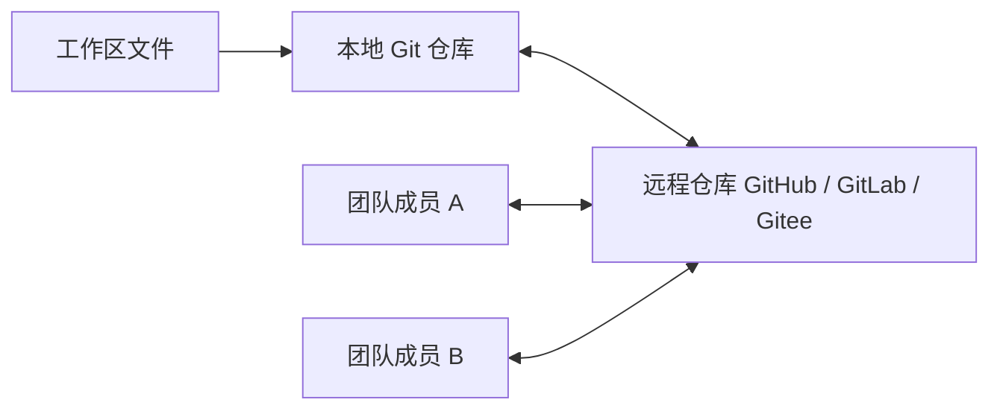

---

## 2. 安装与基础配置

### 2.1 检查是否已安装

```bash
git --version
```

### 2.2 配置用户名和邮箱

这两个信息会写入提交记录。

```bash
git config --global user.name "你的名字"
git config --global user.email "你的邮箱"
```

查看配置：

```bash
git config --list
```

### 2.3 常用推荐配置

```bash
git config --global init.defaultBranch main
git config --global core.autocrlf true
git config --global pull.rebase false
git config --global color.ui auto
```

说明：

- `init.defaultBranch main`：新仓库默认主分支为 `main`
- `core.autocrlf true`：Windows 上自动处理换行符
- `pull.rebase false`：默认使用 merge 方式执行 `git pull`
- `color.ui auto`：命令行输出带颜色

---

## 3. Git 的三个区域

Git 最重要的基础模型是三个区域：

- 工作区：你正在编辑的文件
- 暂存区：准备进入下一次提交的内容
- 本地仓库：已经提交保存的历史版本

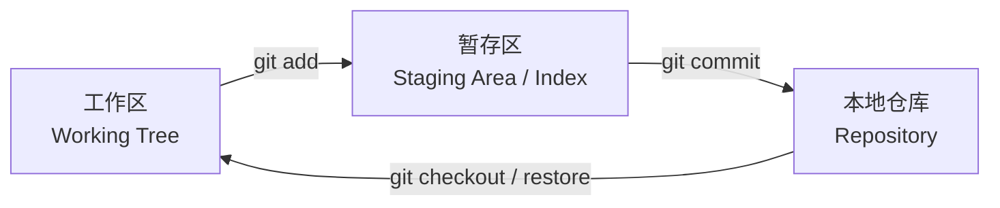

理解这三个区域后，大多数命令都会变得清晰：

- `git add`：把工作区变化放入暂存区
- `git commit`：把暂存区内容保存成一次提交
- `git restore`：从暂存区或仓库恢复文件
- `git status`：查看三个区域之间的差异状态

---

## 4. 创建仓库与第一次提交

### 4.1 初始化本地仓库

```bash
mkdir my-project
cd my-project
git init
```

初始化后，目录中会出现隐藏文件夹 `.git`，它就是 Git 仓库的核心数据库。

### 4.2 添加文件并提交

```bash
echo "# My Project" > README.md
git status
git add README.md
git commit -m "Initial commit"
```

### 4.3 一次提交的基本流程

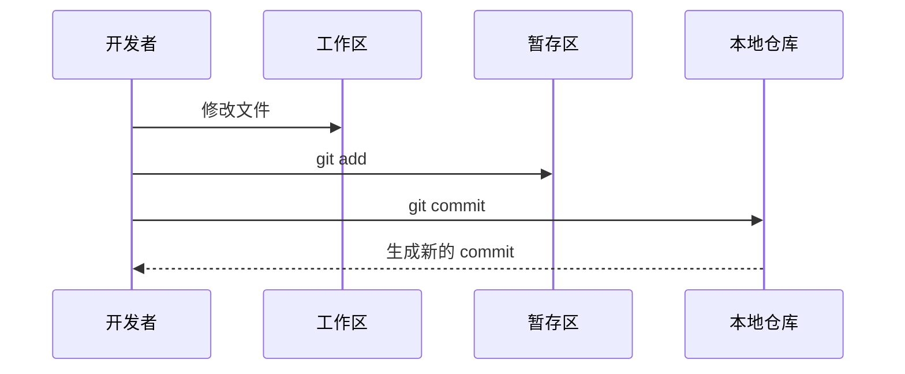

---

## 5. 查看状态、差异和历史

### 5.1 查看当前状态

```bash
git status
git status -sb
```

`git status -sb` 输出更简洁，适合日常使用。

### 5.2 查看文件差异

查看工作区和暂存区之间的差异：

```bash
git diff
```

查看暂存区和上一次提交之间的差异：

```bash
git diff --staged
```

查看两个提交之间的差异：

```bash
git diff commitA commitB
```

### 5.3 查看提交历史

```bash
git log
git log --oneline
git log --oneline --graph --decorate --all
```

推荐别名：

```bash
git config --global alias.lg "log --oneline --graph --decorate --all"
```

之后可以使用：

```bash
git lg
```

---

## 6. 分支基础

分支是 Git 的核心能力。你可以把分支理解为“指向某个提交的可移动指针”。

### 6.1 查看分支

```bash
git branch
git branch -a
```

### 6.2 创建并切换分支

```bash
git switch -c feature/login
```

等价于老命令：

```bash
git checkout -b feature/login
```

### 6.3 切回主分支

```bash
git switch main
```

### 6.4 分支模型

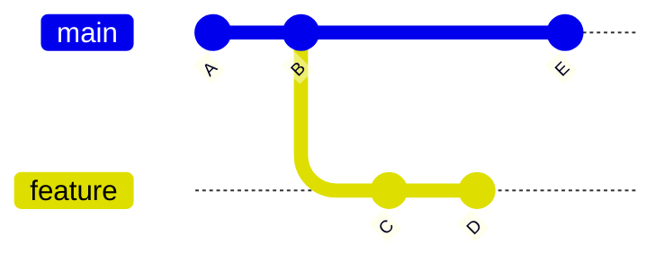

上图中：

- `main` 分支继续向前产生了 `E`
- `feature` 分支从 `B` 分出，产生了 `C` 和 `D`
- 两条分支可以独立开发，之后再合并

---

## 7. 合并、变基与冲突解决

### 7.1 merge 合并

```bash
git switch main
git merge feature/login
```

如果两个分支没有分叉，Git 会执行 fast-forward：

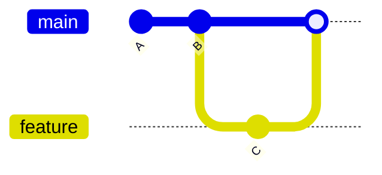

如果两个分支都有新提交，Git 会生成一个 merge commit：

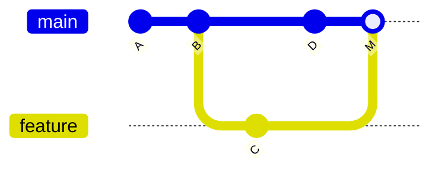

### 7.2 rebase 变基

```bash
git switch feature/login
git rebase main
```

rebase 会把当前分支的提交“移到”目标分支最新提交之后，使历史更线性。

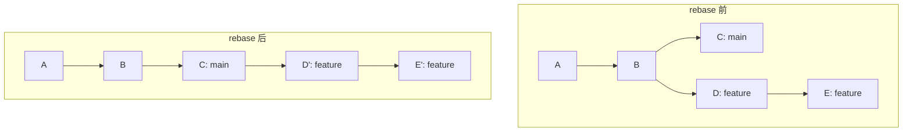

注意：已经推送给别人共享的提交，不要随意 rebase 后强推，否则会改写公共历史。

### 7.3 merge 与 rebase 怎么选

| 场景 | 推荐 |
|---|---|
| 保留真实协作历史 | merge |
| 个人功能分支同步主分支 | rebase |
| 公共分支集成代码 | merge 或 Pull Request 平台合并 |
| 提交已经被多人依赖 | 避免 rebase |

### 7.4 冲突解决流程

冲突通常发生在两个分支修改了同一文件的同一区域。

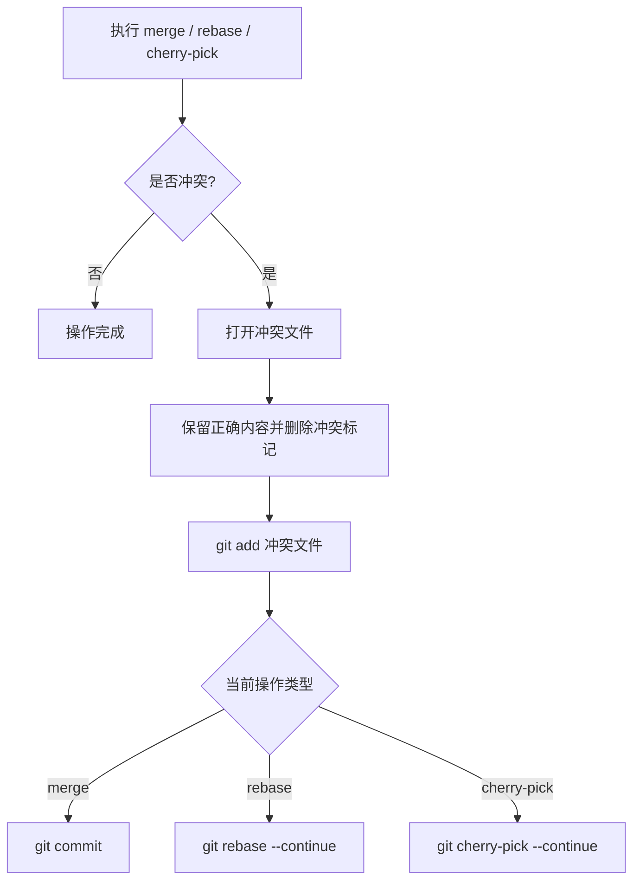

冲突标记示例：

```text
<<<<<<< HEAD
当前分支内容
=======
被合并分支内容
>>>>>>> feature/login
```

解决后：

```bash
git add path/to/file
git commit
```

如果是 rebase：

```bash
git add path/to/file
git rebase --continue
```

中止操作：

```bash
git merge --abort
git rebase --abort
git cherry-pick --abort
```

---

## 8. 远程仓库协作

### 8.1 添加远程仓库

```bash
git remote add origin https://github.com/user/repo.git
git remote -v
```

### 8.2 推送本地分支

```bash
git push -u origin main
```

之后可以简写：

```bash
git push
```

### 8.3 拉取远程更新

```bash
git fetch origin
git pull
```

`git pull` 大致等价于：

```bash
git fetch
git merge
```

如果配置为 rebase，则类似：

```bash
git fetch
git rebase
```

### 8.4 clone 仓库

```bash
git clone https://github.com/user/repo.git
```

### 8.5 远程协作流程

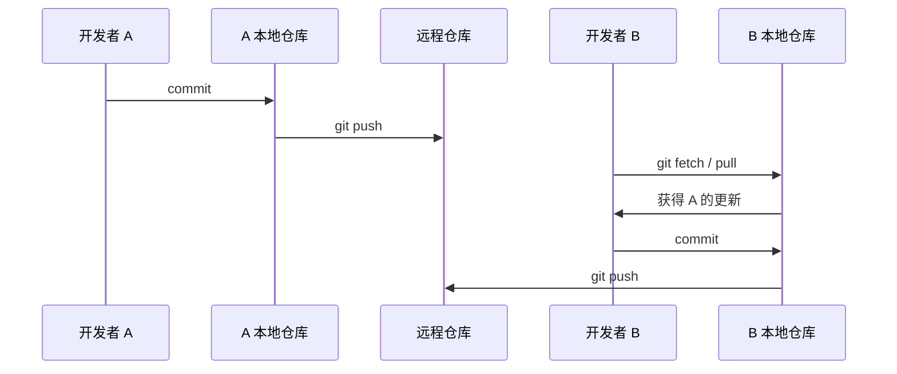

---

## 9. 撤销、回退与恢复

Git 的撤销命令很多，关键是先判断你要撤销的是哪个区域。

### 9.1 丢弃工作区修改

```bash
git restore file.txt
```

### 9.2 取消暂存

```bash
git restore --staged file.txt
```

### 9.3 修改最近一次提交

```bash
git add .
git commit --amend
```

如果只是改提交信息：

```bash
git commit --amend -m "新的提交信息"
```

### 9.4 reset

`reset` 会移动当前分支指针。

```bash
git reset --soft HEAD~1
git reset --mixed HEAD~1
git reset --hard HEAD~1
```

区别：

| 命令 | 提交历史 | 暂存区 | 工作区 |
|---|---|---|---|
| `--soft` | 回退 | 保留 | 保留 |
| `--mixed` | 回退 | 清空 | 保留 |
| `--hard` | 回退 | 清空 | 清空 |

注意：`git reset --hard` 会丢弃未保存修改，执行前要非常确认。

### 9.5 revert

`revert` 不改写历史，而是新增一个“反向提交”。

```bash
git revert commit_id
```

适合已经推送到公共分支的提交。

### 9.6 reflog 找回历史

`reflog` 记录 HEAD 和分支指针的移动历史，是 Git 的后悔药之一。

```bash
git reflog
git reset --hard HEAD@{1}
```

---

## 10. 标签与版本发布

标签通常用于标记版本号。

### 10.1 创建轻量标签

```bash
git tag v1.0.0
```

### 10.2 创建附注标签

```bash
git tag -a v1.0.0 -m "Release v1.0.0"
```

### 10.3 推送标签

```bash
git push origin v1.0.0
git push origin --tags
```

### 10.4 删除标签

```bash
git tag -d v1.0.0
git push origin :refs/tags/v1.0.0
```

---

## 11. 暂存、清理与忽略文件

### 11.1 stash 临时保存现场

```bash
git stash
git stash list
git stash pop
```

带说明：

```bash
git stash push -m "WIP: login page"
```

只恢复不删除 stash：

```bash
git stash apply
```

### 11.2 clean 清理未跟踪文件

查看将要删除的文件：

```bash
git clean -n
```

执行删除：

```bash
git clean -f
```

删除目录：

```bash
git clean -fd
```

### 11.3 .gitignore

`.gitignore` 用来忽略不应该进入版本库的文件。

常见前端项目示例：

```gitignore
node_modules/
dist/
build/
.env
.env.local
.DS_Store
coverage/
*.log
```

如果文件已经被 Git 跟踪，后来加入 `.gitignore` 不会自动取消跟踪。需要：

```bash
git rm --cached file.txt
```

---

## 12. 常见团队工作流

### 12.1 功能分支工作流

适合大多数中小团队。

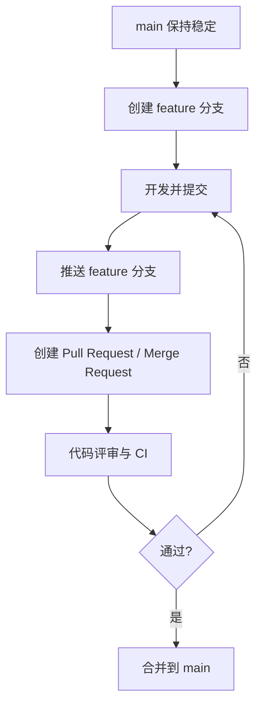

推荐习惯：

- 一个分支只做一件事
- 提交信息清晰
- 合并前同步主分支
- Pull Request 保持可审查的大小

### 12.2 Git Flow

适合发布节奏明确、版本维护较重的项目。

核心分支：

- `main`：生产版本
- `develop`：开发集成分支
- `feature/*`：功能分支
- `release/*`：发布准备分支
- `hotfix/*`：线上紧急修复分支

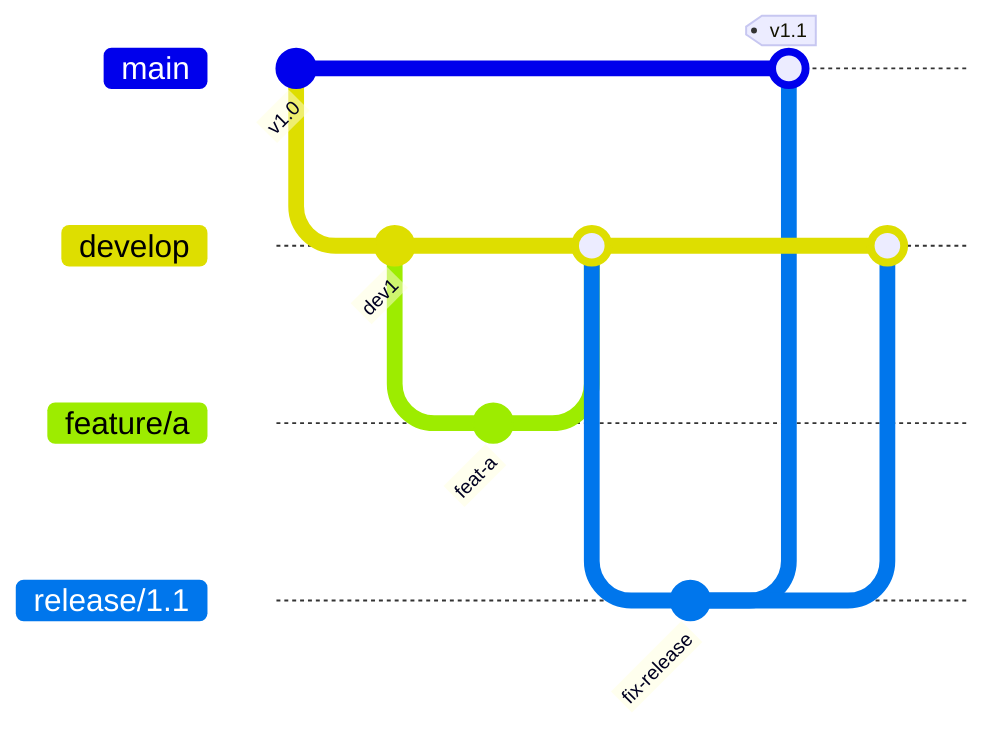

### 12.3 Trunk Based Development

适合自动化测试完善、发布频繁的团队。

特点：

- 主干分支长期保持可发布
- 分支生命周期很短
- 使用 feature flag 隐藏未完成能力
- 高频集成，减少大规模冲突

---

## 13. Git 架构设计

Git 的设计可以从四个层次理解：

1. 命令层：用户执行的 `git add`、`git commit`、`git push`
2. 索引层：暂存区，也叫 index
3. 对象数据库：存储 blob、tree、commit、tag
4. 引用层：分支、标签、HEAD 等指针

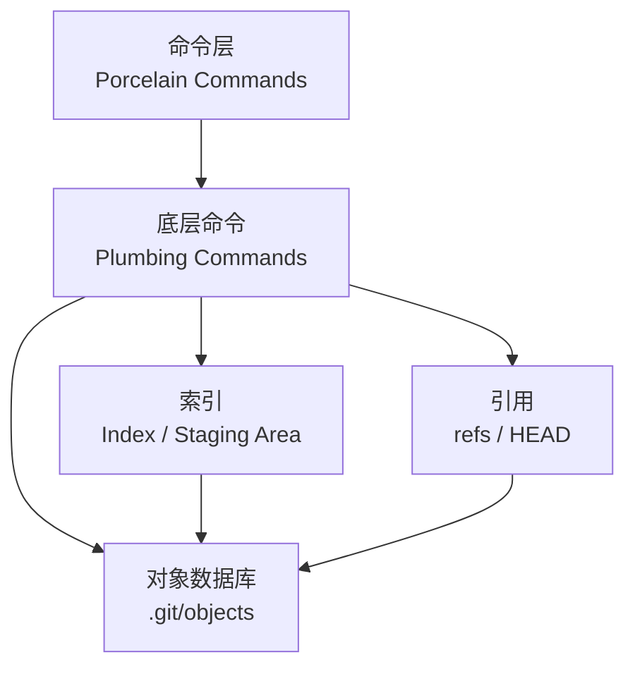

### 13.1 Porcelain 与 Plumbing

Git 命令分为两类：

- Porcelain：面向用户的高级命令，例如 `commit`、`push`、`merge`
- Plumbing：面向底层对象的低级命令，例如 `hash-object`、`cat-file`、`update-index`

日常使用主要接触 Porcelain，但理解 Plumbing 有助于理解 Git 原理。

### 13.2 `.git` 目录结构

典型 `.git` 目录：

```text
.git/
  HEAD
  config
  index
  objects/
  refs/
    heads/
    tags/
  logs/
```

关键文件说明：

| 路径 | 作用 |
|---|---|
| `.git/HEAD` | 指向当前分支或当前提交 |
| `.git/config` | 当前仓库配置 |
| `.git/index` | 暂存区 |
| `.git/objects` | Git 对象数据库 |
| `.git/refs/heads` | 本地分支引用 |
| `.git/refs/tags` | 标签引用 |
| `.git/logs` | reflog 记录 |

### 13.3 HEAD、分支和提交的关系

分支本质是一个文件，内容是某个 commit 的哈希。HEAD 通常指向当前分支。

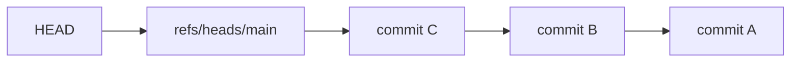

当你提交一次新 commit：

1. Git 创建新的 commit 对象
2. 新 commit 的 parent 指向旧 commit
3. 当前分支指针移动到新 commit
4. HEAD 因为指向当前分支，所以也间接指向新 commit

---

## 14. Git 底层对象模型

Git 是内容寻址文件系统。它不是简单按文件名保存版本，而是按内容计算哈希，并把内容存入对象数据库。

Git 主要有四种对象：

- blob：文件内容
- tree：目录结构
- commit：一次提交
- tag：标签对象

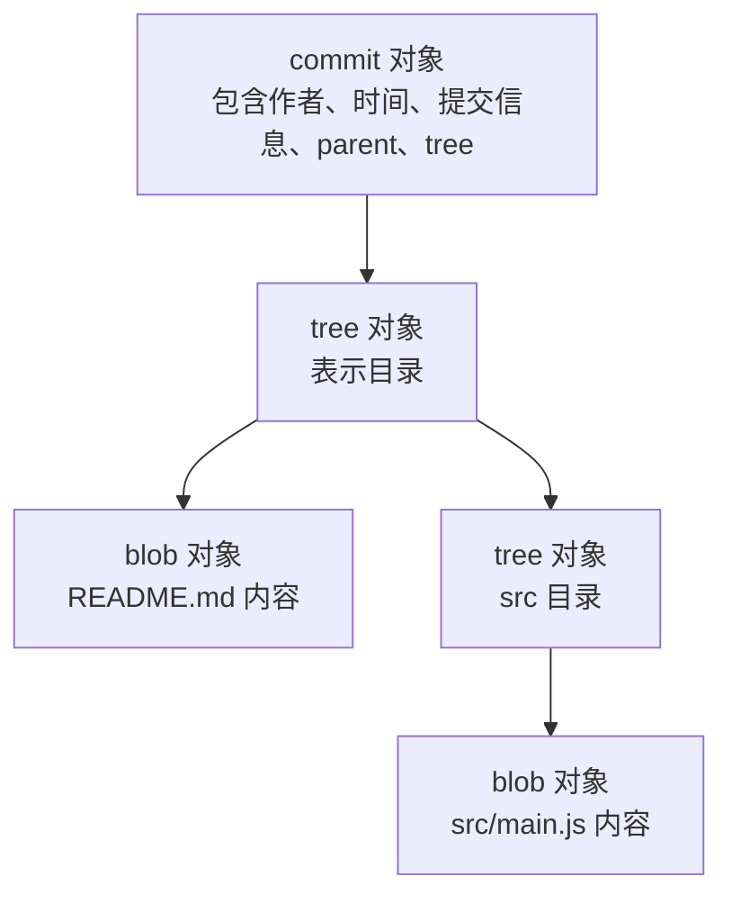

### 14.1 blob 对象

blob 只保存文件内容，不保存文件名。

查看文件内容对应的对象哈希：

```bash
git hash-object README.md
```

把文件内容写入对象库：

```bash
git hash-object -w README.md
```

查看对象内容：

```bash
git cat-file -p object_hash
```

### 14.2 tree 对象

tree 保存目录结构，包括：

- 文件名
- 文件模式
- 对应 blob 或 tree 的哈希

查看当前提交的 tree：

```bash
git cat-file -p HEAD^{tree}
```

示例输出类似：

```text
100644 blob e69de29... README.md
040000 tree abcd123... src
```

### 14.3 commit 对象

commit 保存一次提交的元数据：

- tree 哈希
- parent commit 哈希
- author
- committer
- commit message

查看当前提交对象：

```bash
git cat-file -p HEAD
```

可能看到：

```text
tree 9fb037...
parent 3a2f91...
author Alice <alice@example.com> 1710000000 +0800
committer Alice <alice@example.com> 1710000000 +0800

Add login page
```

### 14.4 tag 对象

附注标签会生成 tag 对象，保存：

- 指向的对象
- 标签名
- 标签创建者
- 标签说明

轻量标签只是一个引用，不生成 tag 对象。

### 14.5 哈希与不可变性

Git 对象的哈希由对象类型、长度和内容共同计算。内容发生任何变化，哈希就会变化。

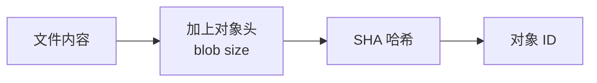

因此，Git 历史具有很强的完整性：

- 改一个文件，会产生新的 blob
- 改目录结构，会产生新的 tree
- 新提交会产生新的 commit
- parent 链条变化会影响后续 commit 哈希

### 14.6 Git 如何保存一次提交

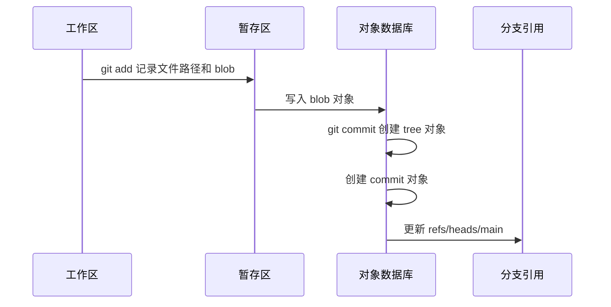

### 14.7 packfile

如果每个对象都单独保存，仓库会越来越大。Git 会把对象压缩成 packfile。

常见命令：

```bash
git gc
git count-objects -v
git verify-pack -v .git/objects/pack/*.idx
```

packfile 会做两类优化：

- 压缩对象内容
- 对相似对象使用增量存储

---

## 15. 高级工具与性能优化

### 15.1 cherry-pick

把某个提交应用到当前分支：

```bash
git cherry-pick commit_id
```

常用于把修复提交复制到 release 分支。

### 15.2 bisect

二分查找引入 bug 的提交：

```bash
git bisect start
git bisect bad
git bisect good v1.0.0
```

每一步测试后标记：

```bash
git bisect good
git bisect bad
```

结束：

```bash
git bisect reset
```

### 15.3 blame

查看某行代码最后由谁修改：

```bash
git blame path/to/file
```

### 15.4 worktree

同一个仓库同时检出多个分支：

```bash
git worktree add ../project-hotfix hotfix/login
```

适合在不打断当前工作区的情况下修复线上问题。

### 15.5 submodule

把另一个 Git 仓库作为当前仓库的子目录：

```bash
git submodule add https://github.com/user/lib.git libs/lib
git submodule update --init --recursive
```

submodule 有学习成本，团队使用前要统一规范。

### 15.6 sparse-checkout

只检出仓库的一部分目录：

```bash
git sparse-checkout init --cone
git sparse-checkout set packages/app
```

适合大型 monorepo。

### 15.7 LFS

Git LFS 用来管理大文件，例如图片、视频、模型文件。

```bash
git lfs install
git lfs track "*.psd"
git add .gitattributes
```

---

## 16. 学习路线与练习项目

### 16.1 第一阶段：能独立使用

目标：

- 初始化仓库
- 提交代码
- 查看历史
- 创建和切换分支
- 解决简单冲突

练习：

1. 创建一个 `git-practice` 仓库
2. 新建 `README.md`
3. 提交三次不同修改
4. 创建 `feature/title` 分支
5. 在两个分支修改同一行并制造冲突
6. 手动解决冲突

### 16.2 第二阶段：能参与团队协作

目标：

- 熟悉 clone、fetch、pull、push
- 理解 Pull Request
- 会处理远程分支冲突
- 会写清晰提交信息

练习：

1. 在 GitHub 或 Gitee 创建远程仓库
2. 推送本地 main 分支
3. 创建 feature 分支并推送
4. 发起 Pull Request
5. 合并后删除远程 feature 分支

### 16.3 第三阶段：能处理复杂问题

目标：

- 理解 reset、revert、reflog
- 会用 rebase 整理个人分支
- 会用 bisect 定位 bug
- 理解 Git 对象模型

练习：

1. 故意提交错误文件，再用 revert 撤销
2. 用 reset 回退本地提交
3. 用 reflog 找回被 reset 的提交
4. 用 `git cat-file -p HEAD` 查看 commit 对象
5. 用 `git cat-file -p HEAD^{tree}` 查看 tree 对象

---

## 17. 常用命令速查

### 17.1 初始化与配置

```bash
git init
git clone <url>
git config --global user.name "name"
git config --global user.email "email"
git config --list
```

### 17.2 日常提交

```bash
git status
git add .
git add file.txt
git commit -m "message"
git commit --amend
```

### 17.3 查看信息

```bash
git log --oneline --graph --decorate --all
git diff
git diff --staged
git show commit_id
```

### 17.4 分支

```bash
git branch
git branch -a
git switch -c feature/name
git switch main
git merge feature/name
git branch -d feature/name
```

### 17.5 远程

```bash
git remote -v
git remote add origin <url>
git fetch origin
git pull
git push -u origin main
git push
```

### 17.6 撤销与恢复

```bash
git restore file.txt
git restore --staged file.txt
git reset --soft HEAD~1
git reset --mixed HEAD~1
git reset --hard HEAD~1
git revert commit_id
git reflog
```

### 17.7 标签

```bash
git tag
git tag v1.0.0
git tag -a v1.0.0 -m "Release v1.0.0"
git push origin v1.0.0
```

### 17.8 底层对象

```bash
git hash-object file.txt
git cat-file -t object_hash
git cat-file -p object_hash
git cat-file -p HEAD
git cat-file -p HEAD^{tree}
```

---

## 推荐提交信息规范

可以采用 Conventional Commits：

```text
feat: add login page
fix: handle empty username
docs: update Git guide
style: format button styles
refactor: simplify auth service
test: add login tests
chore: update dependencies
```

常见类型：

| 类型 | 含义 |
|---|---|
| `feat` | 新功能 |
| `fix` | 修复 bug |
| `docs` | 文档 |
| `style` | 格式调整，不影响逻辑 |
| `refactor` | 重构 |
| `test` | 测试 |
| `chore` | 构建、依赖、工具等杂项 |

---

## 最后建议

学习 Git 不要只背命令。真正重要的是建立三个心智模型：

1. 工作区、暂存区、本地仓库之间如何流动
2. 分支、HEAD、commit 之间如何指向
3. blob、tree、commit、tag 如何组成 Git 的对象数据库
