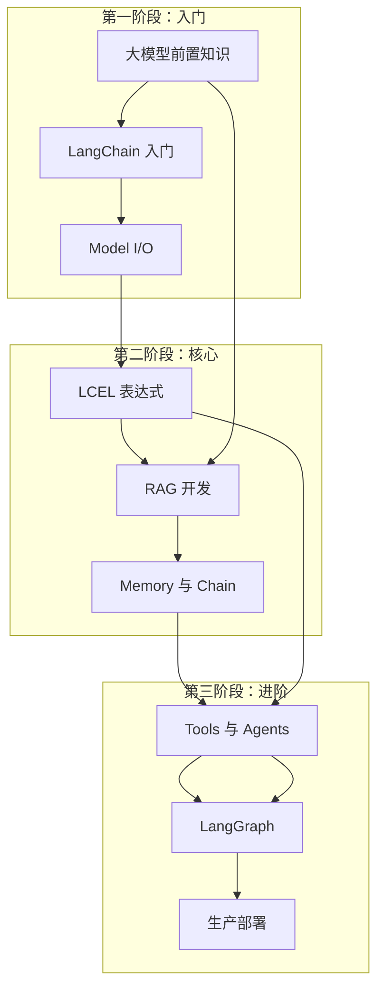

# LangChain 学习指南

> 从零开始，全面掌握 LangChain 开发大模型应用

---

## 目录

| 章节 | 内容 | 难度 |
|------|------|------|
| [第 0 章 大模型前置知识](第0章-大模型前置知识.md) | Token、Prompt、Embedding、RAG、Agent 等核心概念 | 入门 |
| [第 1 章 LangChain 入门与架构](第1章-LangChain入门与架构.md) | 安装、Hello World、LCEL 核心、整体架构 | 入门 |
| [第 2 章 Model I/O 三件套](第2章-ModelIO三件套.md) | Prompts 模板、Models 接口、Output Parsers | 基础 |
| [第 3 章 LCEL 表达式语言](第3章-LCEL表达式语言.md) | 管道组合、并行处理、批处理、分支路由 | 进阶 |
| [第 4 章 数据连接与 RAG](第4章-数据连接与RAG.md) | 文档加载、分割、向量化、RAG 完整实现 | 核心 |
| [第 5 章 Memory 与 Chain](第5章-Memory与Chain.md) | 对话记忆、多种 Memory 类型、Chain 类型 | 进阶 |
| [第 6 章 Tools 与 Agents](第6章-Tools与Agents.md) | 工具定义、ReAct 模式、Agent Executor | 高级 |
| [第 7 章 LangGraph 与多智能体](第7章-LangGraph与多智能体.md) | 状态机、多 Agent 协作、人机协同、检查点 | 高级 |
| [第 8 章 调试监控与可观测性](第8章-调试监控与可观测性.md) | LangSmith、Callbacks、Token 追踪、错误处理 | 生产 |

---

## 学习路径



---

## 快速导航

### 按需求查找

| 需求 | 推荐章节 |
|------|----------|
| 我想快速入门 | 第 0、1 章 |
| 我想构建 RAG 应用 | 第 0、4 章 |
| 我想开发对话机器人 | 第 1、5 章 |
| 我想构建 AI Agent | 第 6、7 章 |
| 我想了解架构设计 | 第 3、7 章 |
| 我要上线生产环境 | 第 8 章 |

---

## 配套资源

### 环境准备

```bash
# Python 3.9+
python --version

# 创建虚拟环境
python -m venv venv
source venv/bin/activate  # Linux/Mac
# or
.\venv\Scripts\activate  # Windows

# 安装核心依赖
pip install langchain-core langchain langchain-openai langchain-community
pip install python-dotenv tiktoken

# 向量数据库（可选）
pip install chromadb  # 轻量级
pip install faiss-cpu  # 高性能

# Jupyter 支持
pip install jupyter notebook
```

### API Key 配置

```bash
# .env 文件
OPENAI_API_KEY=sk-your-key-here
ANTHROPIC_API_KEY=sk-ant-your-key-here
```

---

## 常见问题

### Q: 需要昂贵的 GPU 吗？

不需要。LangChain 本身只是一个编排框架，实际的 LLM 调用是通过 API 完成的，不需要本地 GPU。

### Q: 需要付费使用 LLM 吗？

大多数 LLM API 按 token 计费，成本可控。入门阶段可以使用免费的模型（如 GPT-4o-mini）或免费额度。

### Q: 学习 LangChain 需要什么基础？

- Python 基础（函数、类、异步）
- 基本的 API 调用经验
- 对 LLM 的基本了解（可选）

### Q: LangChain 和 LangGraph 是什么关系？

- LangChain 是主框架，提供了各种组件
- LangGraph 是 LangChain 的扩展，专门用于构建复杂的多智能体系统

---

## 版本说明

| 版本 | 说明 |
|------|------|
| LangChain 0.1+ | 引入 LCEL，性能优化 |
| LangChain 0.3 | 当前主流版本 |
| LangGraph | 独立包，与 LangChain 配合使用 |

---

## 贡献与反馈

如果你发现文档中有任何问题或有改进建议，欢迎提出 Issue 或 Pull Request。

---

*最后更新：2026-05-15*