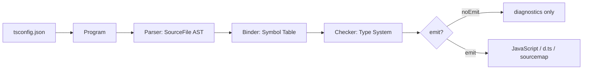

## TypeScript 系统学习指南

> 版本基线：截至 2026-05-21，本文按 TypeScript 6.0 稳定版整理，并补充 TypeScript 7 native preview 的方向。学习时优先阅读官方 Handbook 与 Release Notes。

## 0. 学习地图

TypeScript 不是一门“替代 JavaScript 的语言”，而是给 JavaScript 加上一套静态类型系统、工程化配置和编辑器能力。你应该按下面顺序学习：

1. 会写 JavaScript，理解值、对象、函数、原型、模块、异步。
2. 学基础类型：让变量、函数参数、返回值有明确边界。
3. 学对象建模：interface、type、联合、交叉、字面量类型。
4. 学类型收窄：用控制流让 TypeScript 理解运行时代码。
5. 学泛型：把“类型作为参数”，写可复用 API。
6. 学类型编程：keyof、typeof、indexed access、mapped type、conditional type、infer。
7. 学类、模块、声明文件、第三方库类型。
8. 学 tsconfig、编译流程、运行流程和项目架构。
9. 学真实项目中的边界：React、Node、API 响应、表单、状态、库发布。

推荐练习节奏：

- 第 1 周：基础类型、函数、对象、联合类型。
- 第 2 周：泛型、工具类型、类型收窄。
- 第 3 周：tsconfig、模块系统、声明文件、工程实践。
- 第 4 周：做一个小项目，并把外部 API、表单、状态、错误处理都类型化。

## 1. TypeScript 是什么

TypeScript = JavaScript + 静态类型 + 编译器工具链。

它做三件事：

- 在开发期检查错误：比如属性不存在、参数类型不对、分支遗漏。
- 给编辑器提供智能提示、跳转、重构能力。
- 把 `.ts` / `.tsx` 转换成目标 JavaScript，或只做类型检查。

TypeScript 不做这些事：

- 默认不做运行时类型校验。
- 默认不改变 JavaScript 的执行模型。
- 类型信息大多会在编译后被擦除。

示例：

```ts
function formatPrice(price: number, currency = "CNY") {
  return new Intl.NumberFormat("zh-CN", {
    style: "currency",
    currency,
  }).format(price);
}

formatPrice(99);
formatPrice("99");
//          ^^^^ 类型错误：string 不能传给 number 参数
```

编译后的 JavaScript 大致只保留运行时代码：

```js
function formatPrice(price, currency = "CNY") {
  return new Intl.NumberFormat("zh-CN", {
    style: "currency",
    currency,
  }).format(price);
}
```

## 2. 快速开始

### 2.1 安装与运行

```bash
npm install -D typescript
npx tsc --version
npx tsc --init
```

常见脚本：

```json
{
  "scripts": {
    "typecheck": "tsc --noEmit",
    "build": "tsc",
    "watch": "tsc --watch --noEmit"
  },
  "devDependencies": {
    "typescript": "^6.0.0"
  }
}
```

在 Node 项目中直接运行 TypeScript，常见选择：

```bash
# Node 原生 strip types 能运行“可擦除类型”的 TS 子集
node src/index.ts

# 或使用 tsx / ts-node 等开发工具
npm install -D tsx
npx tsx src/index.ts
```

说明：

- `tsc` 是 TypeScript 编译器。
- `tsc --noEmit` 只检查类型，不输出 JS。
- Vite、Next.js、Babel、SWC、esbuild 通常负责转译，`tsc --noEmit` 负责类型检查。
- Node 原生执行 TypeScript 时只适合类型可擦除的语法，避免 enum、namespace、参数属性等需要 TS 转换的语法。

### 2.2 推荐 tsconfig

现代前端应用建议：

```json
{
  "compilerOptions": {
    "target": "ES2022",
    "module": "ESNext",
    "moduleResolution": "bundler",
    "strict": true,
    "jsx": "react-jsx",
    "noEmit": true,
    "allowImportingTsExtensions": true,
    "verbatimModuleSyntax": true,
    "isolatedModules": true,
    "noUncheckedIndexedAccess": true,
    "exactOptionalPropertyTypes": true,
    "skipLibCheck": true
  },
  "include": ["src"]
}
```

Node ESM 库建议：

```json
{
  "compilerOptions": {
    "target": "ES2022",
    "module": "NodeNext",
    "moduleResolution": "NodeNext",
    "strict": true,
    "declaration": true,
    "sourceMap": true,
    "outDir": "dist",
    "rootDir": "src",
    "verbatimModuleSyntax": true,
    "isolatedModules": true,
    "noUncheckedIndexedAccess": true,
    "exactOptionalPropertyTypes": true,
    "skipLibCheck": true
  },
  "include": ["src"]
}
```

重要选项讲解：

- `strict`：打开严格模式，是学习和项目都应该优先开启的核心选项。
- `noEmit`：只做类型检查，交给构建工具输出。
- `target`：控制输出 JS 的语法级别。
- `module`：控制模块输出格式。
- `moduleResolution`：控制如何解析导入路径。
- `moduleResolution: "bundler"`：适合 Vite、Webpack、Rspack、Next 等打包器。
- `module: "NodeNext"`：适合 Node ESM/CJS 规则混用的库。
- `verbatimModuleSyntax`：按你写的 import/export 更忠实地输出，要求你区分 `import type`。
- `isolatedModules`：确保每个文件可以被独立转译，适合 Babel/SWC/esbuild。
- `noUncheckedIndexedAccess`：数组和对象索引访问会多出 `undefined`，更安全。
- `exactOptionalPropertyTypes`：让可选属性更精确，`x?: string` 不等于 `x: string | undefined`。
- `skipLibCheck`：跳过依赖声明文件检查，减少第三方库噪音。

## 3. 编译器架构与运行流程

### 3.1 TypeScript 程序生命周期

一次 `tsc` 检查大致经历：

1. 读取 `tsconfig.json`。
2. 根据 `include`、`exclude`、`files` 建立源文件列表。
3. 解析源码，生成 AST。
4. Binder 建立符号表：把变量、函数、类型、模块绑定成 symbol。
5. Checker 做类型检查：推断、收窄、泛型实例化、兼容性判断。
6. Transformer / Emitter 输出 JS、`.d.ts`、source map。

流程图：



理解这个流程很重要：

- 类型错误通常来自 Checker。
- 语法错误来自 Parser。
- 模块找不到通常来自配置和 module resolution。
- `.d.ts` 影响类型检查，但不会直接输出运行时代码。

### 3.2 开发时与运行时

TypeScript 的类型只在开发期存在：

```ts
type User = {
  id: string;
  name: string;
};

function printUser(user: User) {
  console.log(user.name);
}
```

运行时没有 `User` 这个类型：

```js
function printUser(user) {
  console.log(user.name);
}
```

如果数据来自网络、用户输入、本地存储，仍然需要运行时校验：

```ts
type User = {
  id: string;
  name: string;
};

function isUser(value: unknown): value is User {
  return (
    typeof value === "object" &&
    value !== null &&
    "id" in value &&
    "name" in value &&
    typeof value.id === "string" &&
    typeof value.name === "string"
  );
}

async function fetchUser(id: string) {
  const response = await fetch(`/api/users/${id}`);
  const data: unknown = await response.json();

  if (!isUser(data)) {
    throw new Error("Invalid user payload");
  }

  return data;
}
```

## 4. 基础类型

### 4.1 原始类型

```ts
let isDone: boolean = false;
let count: number = 10;
let title: string = "TypeScript";
let big: bigint = 100n;
let key: symbol = Symbol("key");
let empty: null = null;
let missing: undefined = undefined;
```

日常建议：

- 变量有初始值时，让 TS 自动推断。
- 函数参数和公共函数返回值建议显式标注。
- 不要滥用 `String`、`Number`、`Boolean` 这类包装对象类型。

```ts
let name = "Ada";
//  inferred as string

function greet(name: string): string {
  return `Hello, ${name}`;
}
```

### 4.2 数组与元组

```ts
const scores: number[] = [98, 87, 91];
const names: Array<string> = ["Ada", "Linus"];

const point: [number, number] = [10, 20];
const entry: [key: string, value: number] = ["count", 3];
```

只读数组：

```ts
function sum(values: readonly number[]) {
  return values.reduce((total, value) => total + value, 0);
}

const list = [1, 2, 3] as const;
//    ^? readonly [1, 2, 3]
```

`as const` 会把对象或数组推断成最窄的只读字面量类型：

```ts
const routes = {
  home: "/",
  user: "/users/:id",
} as const;

type RouteName = keyof typeof routes;
// "home" | "user"
```

### 4.3 any、unknown、never、void

```ts
let value1: any = 1;
value1.toUpperCase(); // 编译通过，运行可能崩

let value2: unknown = 1;
// value2.toUpperCase(); // 类型错误

if (typeof value2 === "string") {
  value2.toUpperCase();
}
```

对比：

- `any`：关闭类型检查，尽量少用。
- `unknown`：安全的未知类型，使用前必须收窄，意思是使用前必须进行类型检查。
- `never`：不可能出现的类型，常用于穷尽检查。
- `void`：函数没有有意义的返回值。

穷尽检查：

```ts
type Status = "idle" | "loading" | "success" | "error";

function renderStatus(status: Status) {
  switch (status) {
    case "idle":
      return "未开始";
    case "loading":
      return "加载中";
    case "success":
      return "成功";
    case "error":
      return "失败";
    default: {
      const exhaustive: never = status;
      return exhaustive;
    }
  }
}
```

### 4.4 字面量类型

```ts
type Theme = "light" | "dark" | "system";
type Size = 12 | 14 | 16;

function setTheme(theme: Theme) {
  document.documentElement.dataset.theme = theme;
}

setTheme("dark");
setTheme("blue"); // 类型错误
```

字面量类型适合表达有限状态、配置项、事件名、接口返回状态。

## 5. 函数类型

### 5.1 参数与返回值

```ts
function add(a: number, b: number): number {
  return a + b;
}

const multiply = (a: number, b: number): number => a * b;
```

函数类型：

```ts
type BinaryOperator = (left: number, right: number) => number;

const divide: BinaryOperator = (left, right) => left / right;
```

### 5.2 可选参数、默认参数、剩余参数

```ts
function createUser(name: string, age?: number) {
  return { name, age };
}

function log(message: string, level: "info" | "warn" | "error" = "info") {
  console[level](message);
}

function join(separator: string, ...parts: string[]) {
  return parts.join(separator);
}
```

### 5.3 函数重载

重载适合“同一个函数根据输入返回不同类型”的 API：

```ts
function getValue(key: "id"): number;
function getValue(key: "name"): string;
function getValue(key: "id" | "name") {
  if (key === "id") return 1;
  return "TypeScript";
}

const id = getValue("id");
//    ^? number

const name = getValue("name");
//    ^? string
```

不要为了简单联合类型滥用重载：

```ts
function toArray(value: string | string[]) {
  return Array.isArray(value) ? value : [value];
}
```

### 5.4 this 参数

`this` 参数只存在于类型层，不会成为真正参数：

```ts
type Button = {
  text: string;
  onClick(this: Button): void;
};

const button: Button = {
  text: "Save",
  onClick() {
    console.log(this.text);
  },
};
```

## 6. 对象建模：interface 与 type

### 6.1 interface

```ts
interface User {
  id: string;
  name: string;
  age?: number;
  readonly createdAt: Date;
}

const user: User = {
  id: "u1",
  name: "Ada",
  createdAt: new Date(),
};
```

索引签名：

```ts
interface Dictionary {
  [key: string]: string;
}

const messages: Dictionary = {
  hello: "你好",
  bye: "再见",
};
```

### 6.2 type

```ts
type ID = string | number;

type ApiResponse<T> =
  | { ok: true; data: T }
  | { ok: false; error: string };
```

### 6.3 interface vs type

优先规则：
- `interface`可以被重复声明并且合并，`type` 不能重复声明
- 描述对象结构、API、组件 props、类 implements，给库声明扩展时，用 `interface`。
- 描述联合、交叉、工具类型、条件类型、映射类型、函数别名时，用 `type`。
- 两者都能表达对象时，按团队风格统一即可。

区别示例：

```ts
interface Window {
  appVersion: string;
}

interface Window {
  currentUser?: { id: string };
}

// interface 会声明合并，type 不会。
```

### 6.4 excess property check

对象字面量直接赋值时，TS 会检查多余属性：

```ts
interface User {
  id: string;
  name: string;
}

const user: User = {
  id: "u1",
  name: "Ada",
  role: "admin", // 类型错误：多余属性
};
```

如果值先放进变量，检查会变宽：

```ts
const raw = {
  id: "u1",
  name: "Ada",
  role: "admin",
};

const user: User = raw; // 可以，因为结构兼容
```

## 7. 联合、交叉与类型收窄

### 7.1 联合类型

```ts
type Input = string | number;

function normalize(input: Input) {
  if (typeof input === "string") {
    return input.trim();
  }

  return input.toFixed(2);
}
```

### 7.2 交叉类型

```ts
type Timestamped = {
  createdAt: Date;
  updatedAt: Date;
};

type User = {
  id: string;
  name: string;
} & Timestamped;
```

交叉不是对象合并运行时代码，只是类型组合。

### 7.3 类型守卫

常见收窄方式：

```ts
function print(value: string | string[] | Date | null) {
  if (value === null) {
    return;
  }

  if (typeof value === "string") {
    console.log(value.toUpperCase());
    return;
  }

  if (Array.isArray(value)) {
    console.log(value.join(","));
    return;
  }

  if (value instanceof Date) {
    console.log(value.toISOString());
  }
}
```

`in` 操作符：

```ts
type Cat = { kind: "cat"; meow(): void };
type Dog = { kind: "dog"; bark(): void };

function speak(pet: Cat | Dog) {
  if ("meow" in pet) {
    pet.meow();
  } else {
    pet.bark();
  }
}
```

自定义类型守卫：

```ts
type Product = {
  id: string;
  price: number;
};

function isProduct(value: unknown): value is Product {
  return (
    typeof value === "object" &&
    value !== null &&
    "id" in value &&
    "price" in value &&
    typeof value.id === "string" &&
    typeof value.price === "number"
  );
}
```

断言函数：

```ts
function assertDefined<T>(value: T): asserts value is NonNullable<T> {
  if (value == null) {
    throw new Error("Expected value to be defined");
  }
}

const element = document.querySelector("#app");
assertDefined(element);
element.innerHTML = "Ready";
```

### 7.4 可辨识联合

可辨识联合是 TypeScript 建模状态机的核心技巧。

```ts
type RequestState<T> =
  | { status: "idle" }
  | { status: "loading" }
  | { status: "success"; data: T }
  | { status: "error"; error: Error };

function render<T>(state: RequestState<T>) {
  switch (state.status) {
    case "idle":
      return "等待开始";
    case "loading":
      return "加载中";
    case "success":
      return state.data;
    case "error":
      return state.error.message;
  }
}
```

API 响应建模：

```ts
type Result<T, E = string> =
  | { ok: true; data: T }
  | { ok: false; error: E };

function parseNumber(value: string): Result<number> {
  const number = Number(value);

  if (Number.isNaN(number)) {
    return { ok: false, error: "不是有效数字" };
  }

  return { ok: true, data: number };
}

const result = parseNumber("42");

if (result.ok) {
  console.log(result.data.toFixed(2));
} else {
  console.error(result.error);
}
```

## 8. 泛型

泛型其实就是把**类型当作参数**进行传递，使**逻辑可复用**，而不是固定的参数写死

### 8.1 泛型函数

泛型让类型成为参数：

```ts
function identity<T>(value: T): T {
  return value;
}

const text = identity("hello");
//    ^? string

const count = identity(123);
//    ^? number
```

实际 API：

```ts
async function request<T>(url: string): Promise<T> {
  const response = await fetch(url);

  if (!response.ok) {
    throw new Error(`Request failed: ${response.status}`);
  }

  return response.json() as Promise<T>;
}

type User = { id: string; name: string };

const user = await request<User>("/api/user");
```

注意：`request<T>` 只是告诉 TS “我期望它是 T”，并没有校验运行时数据。

### 8.2 泛型约束

```ts
function getLength<T extends { length: number }>(value: T) {
  return value.length;
}

getLength("abc");
getLength([1, 2, 3]);
getLength(123); // 类型错误
```

`keyof` 约束：

```ts
function getProperty<T, K extends keyof T>(object: T, key: K): T[K] {
  return object[key];
}

const user = {
  id: "u1",
  name: "Ada",
};

const name = getProperty(user, "name");
//    ^? string
```

### 8.3 泛型默认值

```ts
type Page<T, Meta = { total: number }> = {
  data: T[];
  meta: Meta;
};

type UserPage = Page<{ id: string; name: string }>;
```

### 8.4 泛型类与接口

```ts
interface Repository<T, ID = string> {
  findById(id: ID): Promise<T | null>;
  save(entity: T): Promise<T>;
}

class MemoryRepository<T extends { id: string }> implements Repository<T> {
  private items = new Map<string, T>();

  async findById(id: string) {
    return this.items.get(id) ?? null;
  }

  async save(entity: T) {
    this.items.set(entity.id, entity);
    return entity;
  }
}
```

## 9. 类型编程核心

### 9.1 typeof

在类型位置使用 `typeof`，可以从值反推出类型：

```ts
const config = {
  apiBase: "/api",
  retry: 3,
};

type Config = typeof config;
```

配合 `as const`：

```ts
const roles = ["admin", "editor", "viewer"] as const;

type Role = (typeof roles)[number];
// "admin" | "editor" | "viewer"
```

### 9.2 keyof

获取一个对象类型 T 中所有的键

```ts
type User = {
  id: string;
  name: string;
  age: number;
};

type UserKey = keyof User;
// "id" | "name" | "age"
```

### 9.3 Indexed Access Types

```ts
type User = {
  id: string;
  profile: {
    nickname: string;
    avatar?: string;
  };
};

type Profile = User["profile"];
type Avatar = User["profile"]["avatar"];
```

### 9.4 Mapped Types

映射类型，也就是 `[K in keyof T] : T[K]`

```ts
type ReadonlyObject<T> = {
  readonly [K in keyof T]: T[K];
};

type OptionalObject<T> = {
  [K in keyof T]?: T[K];
};
```

修改属性名：

```ts
type Getters<T> = {
  [K in keyof T as |get${Capitalize<string & K>|}]: () => T[K];
};

type User = {
  id: string;
  name: string;
};

type UserGetters = Getters<User>;
// {
//   getId: () => string;
//   getName: () => string;
// }
```

**深度只读：** 要求递归把对象所有属性变成 readonly，但函数类型保持不变

``` js
type DeepReadonly<T> = {
    readonly [K in keyof T]: T[K] extends Function
        ? T[K]
        : T[K] extends Object
        ? DeepReadonly<T[K]>
        : T[K]
}

/**
 *  获取对象所有的键，然后对键进行遍历
 *  如果当前类型是函数，那么就返回函数类型
 *  如果不是判断是不是对象类型，如果是对象类型通过递归处理
 *  如果不是就返回原类型
 *
 *  对于数组处理，数组会走 DeepReadonly<T[K]>分支
 *  因为数组本质上还是对象，只不过数组的下标是键等数字字符串
 *  当数组进入 DeepReadonly 后，它的数字索引会被加上 readonly
 *  类似于 readonly string[]）
 *
 *  其实函数底层本质也是数组，如果不对函数类型进行判断
 *  那么它会进入 DeepReadonly<T[K]>分支
 *  TypeScript 会把这个函数当成普通对象，去递归遍历它的内置属性
 *  在此过程中函数的调用签名就会丢失
 */
```

### 9.5 Conditional Types

条件类型

```ts
type IsString<T> = T extends string ? true : false;

type A = IsString<string>;
// true

type B = IsString<number>;
// false
```

分布式条件类型：

意思是：条件类型接收的是一个**联合类型**时，TypeScript 会自动把联合类型拆开，分别计算后再合并结果。

解决什么问题：可以让 TS 像遍历数组一样遍历联合类型，对联合类型中的每个元素分别计算

```ts
type ToArray<T> = T extends unknown ? T[] : never;

type Result = ToArray<string | number>;
// 相当于
ToArray<string> | ToArray<number>
// string[] | number[]
```

关闭分布：

```ts
type ToArrayNonDistributed<T> = [T] extends [unknown] ? T[] : never;

type Result = ToArrayNonDistributed<string | number>;
// (string | number)[]
```

### 9.6 infer

`infer` 用于在条件类型中提取类型：

意思是如果 `extends` 匹配成功，那么就将 `T` 的类型返回
``` ts
type ElemenType<T> = T extends Array<infer P> ? P : never
```

实例：

```ts
type UnwrapPromise<T> = T extends Promise<infer Value> ? Value : T;

type A = UnwrapPromise<Promise<string>>;
// string

type B = UnwrapPromise<number>;
// number
```

提取函数返回值：

```ts
// (...args: never[]) 表示不关心参数,只关心是不是函数
// 类似于 (...args: any[]) / (...args: unknown[])
type MyReturnType<T> = T extends (...args: never[]) => infer R ? R : never;

function createUser() {
  return { id: "u1", name: "Ada" };
}

type User = MyReturnType<typeof createUser>;
// { id:string,name:string }
```

## 10. 内置工具类型

常用工具类型都可以看作“类型层 API”。

### 10.1 对象属性工具

```ts
type User = {
  id: string;
  name: string;
  email?: string;
};

// Partial 把一个现有对象类型 T 中的所有属性变为 可选
type PartialUser = Partial<User>;

// Required 把一个现有对象类型 T 中的所有可选属性变为 必选
type RequiredUser = Required<User>;
// 实现
type Required<T> = {
    [P in keyof T]-?: T[P];
};

// Readonly 把一个现有对象类型 T 中的所有属性变为 只读
type ReadonlyUser = Readonly<User>;

// Pick 表示从一个现有对象类型 T 中挑出所选类型
type UserPreview = Pick<User, "id" | "name">;
// 实现
type Pick<T,K extends keyof T> = {
	[P in K]:T[P]
}

// Omit 表示从现有的类型中删除选择的类型
type UserWithoutEmail = Omit<User, "email">;
```

使用场景：

```ts
type CreateUserInput = Pick<User, "name" | "email">;
type UpdateUserInput = Partial<CreateUserInput>;

function updateUser(id: string, input: UpdateUserInput) {
  return { id, ...input };
}
```

### 10.2 联合类型工具

```ts
type Role = "admin" | "editor" | "viewer";

// Exclude 表示从一个联合类型中排除所选属性
type StaffRole = Exclude<Role, "viewer">;
// "admin" | "editor"

// Extract 表示从一个联合类型中抽取所选属性
type VisibleRole = Extract<Role, "editor" | "viewer">;
// "editor" | "viewer"

type MaybeUser = User | null | undefined;
type UserOnly = NonNullable<MaybeUser>;
```

### 10.3 函数与构造器工具

```ts
function search(keyword: string, page = 1) {
  return { keyword, page };
}

type SearchParams = Parameters<typeof search>;
// [keyword: string, page?: number]

type SearchResult = ReturnType<typeof search>;
// { keyword: string; page: number }

class Service {
  constructor(public baseUrl: string) {}
}

type ServiceArgs = ConstructorParameters<typeof Service>;
type ServiceInstance = InstanceType<typeof Service>;
```

### 10.4 Awaited

Awaited 的强大的特性：**递归解包**

不管你的 Promise 嵌套了多少层（比如 Promise<Promise），它都能一路拆到最底层的基本类型。

```ts
type Data = Awaited<Promise<Promise<string>>>;
// string

async function loadUser() {
  return { id: "u1", name: "Ada" };
}

type LoadedUser = Awaited<ReturnType<typeof loadUser>>;
```

## 11. 类

### 11.1 基础

```ts
class User {
  readonly id: string;
  private passwordHash: string;
  protected loginCount = 0;

  constructor(id: string, passwordHash: string) {
    this.id = id;
    this.passwordHash = passwordHash;
  }

  verify(password: string) {
    return this.passwordHash === password;
  }
}
```

修饰符：

- `public`：默认公开。
- `private`：只能类内部访问，TS 层私有。
- `protected`：类内部和子类可访问。
- `readonly`：初始化后不可重新赋值。
- `static`：类本身的属性或方法。

JavaScript 私有字段：

```ts
class Counter {
  #value = 0;

  increment() {
    this.#value += 1;
  }

  get value() {
    return this.#value;
  }
}
```

### 11.2 implements

```ts
interface Logger {
  log(message: string): void;
}

class ConsoleLogger implements Logger {
  log(message: string) {
    console.log(message);
  }
}
```

`implements` 只检查实例结构，不会改变类的运行时行为。

### 11.3 抽象类

```ts
abstract class Shape {
  abstract area(): number;

  describe() {
    return `area: ${this.area()}`;
  }
}

class Circle extends Shape {
  constructor(private radius: number) {
    super();
  }

  area() {
    return Math.PI * this.radius ** 2;
  }
}
```

### 11.4 参数属性

```ts
class UserService {
  constructor(
    private readonly baseUrl: string,
    private readonly logger: Logger,
  ) {}
}
```

注意：参数属性不是纯类型语法，它需要 TS 编译转换。若你依赖 Node 原生 TypeScript 类型擦除，建议写成普通属性赋值。

## 12. 枚举、const object 与现代建议

### 12.1 enum

```ts
enum Direction {
  Up,
  Down,
  Left,
  Right,
}

console.log(Direction.Up);
console.log(Direction[0]);
```

数字 enum 会生成运行时代码，并带反向映射。

字符串 enum：

```ts
enum ApiStatus {
  Success = "success",
  Error = "error",
}
```

### 12.2 const enum

```ts
const enum Size {
  Small = "S",
  Medium = "M",
  Large = "L",
}
```

`const enum` 会被内联，但在 Babel/SWC/esbuild、isolated modules、库发布中容易踩坑。

### 12.3 更推荐的对象常量

```ts
const Direction = {
  Up: "UP",
  Down: "DOWN",
  Left: "LEFT",
  Right: "RIGHT",
} as const;

type Direction = (typeof Direction)[keyof typeof Direction];

function move(direction: Direction) {
  console.log(direction);
}
```

现代建议：

- 应用内部可用 enum，但优先考虑 union literal + const object。
- 库代码少用 `const enum`。
- Node 原生类型擦除场景避免 enum。

## 13. 模块系统

### 13.1 导出与导入

```ts
// user.ts
export type User = {
  id: string;
  name: string;
};

export function createUser(name: string): User {
  return {
    id: crypto.randomUUID(),
    name,
  };
}
```

```ts
// main.ts
import { createUser } from "./user";
import type { User } from "./user";

const user: User = createUser("Ada");
```

`import type` 只导入类型，编译后会被擦除。配合 `verbatimModuleSyntax` 时尤其重要。

### 13.2 ESM 与 CommonJS

ESM：

```ts
export function add(a: number, b: number) {
  return a + b;
}
```

CommonJS：

```js
module.exports = {
  add(a, b) {
    return a + b;
  },
};
```

现代前端和新 Node 项目优先 ESM。老项目或部分 Node 工具仍可能使用 CommonJS。

### 13.3 路径别名

```json
{
  "compilerOptions": {
    "baseUrl": ".",
    "paths": {
      "@/*": ["src/*"]
    }
  }
}
```

代码：

```ts
import { Button } from "@/components/Button";
```

注意：`paths` 只告诉 TypeScript 如何检查类型。运行时或打包器也要配置对应别名。Vite、Next、Webpack、Node loader 都有自己的解析规则。

### 13.4 动态导入

```ts
async function loadEditor() {
  const module = await import("./editor");
  return module.createEditor();
}
```

动态导入常用于路由级代码分割、重型库懒加载、插件系统。

## 14. 声明文件与第三方库类型

### 14.1 .d.ts 是什么

`.d.ts` 只描述类型，不包含实际实现。

```ts
// global.d.ts
declare global {
  interface Window {
    appConfig: {
      apiBase: string;
    };
  }
}

export {};
```

使用：

```ts
fetch(`${window.appConfig.apiBase}/users`);
```

### 14.2 声明无类型模块

```ts
// types/legacy-lib.d.ts
declare module "legacy-lib" {
  export function format(value: string): string;
}
```

### 14.3 模块扩展

```ts
declare module "express-serve-static-core" {
  interface Request {
    user?: {
      id: string;
      role: "admin" | "user";
    };
  }
}
```

### 14.4 @types

如果库没有自带类型，先查：

```bash
npm install -D @types/lodash
```

现在很多库已经自带类型，安装前先看它的 `package.json` 是否有 `types` 或 `exports` 中的类型声明。

## 15. JSX 与 React 类型实践

### 15.1 组件 Props

```tsx
type ButtonProps = {
  variant?: "primary" | "secondary";
  disabled?: boolean;
  onClick?: () => void;
  children: React.ReactNode;
};

export function Button({
  variant = "primary",
  disabled = false,
  onClick,
  children,
}: ButtonProps) {
  return (
    <button data-variant={variant} disabled={disabled} onClick={onClick}>
      {children}
    </button>
  );
}
```

### 15.2 事件类型

```tsx
function SearchBox() {
  function handleChange(event: React.ChangeEvent<HTMLInputElement>) {
    console.log(event.target.value);
  }

  return <input onChange={handleChange} />;
}
```

### 15.3 泛型组件

```tsx
type SelectProps<T extends string> = {
  value: T;
  options: readonly T[];
  onChange: (value: T) => void;
};

function Select<T extends string>({ value, options, onChange }: SelectProps<T>) {
  return (
    <select value={value} onChange={(event) => onChange(event.target.value as T)}>
      {options.map((option) => (
        <option key={option} value={option}>
          {option}
        </option>
      ))}
    </select>
  );
}

const themes = ["light", "dark", "system"] as const;

<Select value="light" options={themes} onChange={(theme) => console.log(theme)} />;
/*
T会被自动推导为 "light" | "dark" | "system" 联合类型
不需要手动传递泛型参数
*/
```

#### 15.3.1 TSX 泛型坑

如果组件使用**箭头函数**定义，并且**传入泛型**

``` ts
const Select = <T>(props: SelectProps<T>) => {
  return null;
};
// 会报错：JSX element 'T' has no corresponding closing tag
```

这是因为 `<T>` 被 TS 编译器当作为标签解析

``` ts
// 解决方法1：添加逗号
const Select = <T,>(
  props: SelectProps<T>
) => {
  return null;
};
// 解决方法2：加约束
const Select = <T extends unknown>(
  props: SelectProps<T>
) => {
  return null;
};
// 直接使用function没有这个问题
```

### 15.4 API 状态建模

```tsx
type RemoteData<T> =
  | { status: "idle" }
  | { status: "loading" }
  | { status: "success"; data: T }
  | { status: "error"; error: Error };

function UserPanel({ state }: { state: RemoteData<{ name: string }> }) {
  switch (state.status) {
    case "idle":
      return null;
    case "loading":
      return <p>Loading...</p>;
    case "error":
      return <p>{state.error.message}</p>;
    case "success":
      return <h2>{state.data.name}</h2>;
  }
}
```

## 16. API 与数据边界

### 16.1 fetch 封装

```ts
type ApiError = {
  message: string;
  code?: string;
};

type ApiResult<T> =
  | { ok: true; data: T }
  | { ok: false; error: ApiError };

async function apiGet<T>(url: string): Promise<ApiResult<T>> {
  try {
    const response = await fetch(url);
    const data: unknown = await response.json();

    if (!response.ok) {
      return {
        ok: false,
        error: { message: `HTTP ${response.status}` },
      };
    }

    return { ok: true, data: data as T };
  } catch (error) {
    return {
      ok: false,
      error: {
        message: error instanceof Error ? error.message : "Unknown error",
      },
    };
  }
}
```

更稳妥的做法是加运行时 schema，例如 Zod、Valibot、ArkType：

```ts
import { z } from "zod";

const UserSchema = z.object({
  id: z.string(),
  name: z.string(),
});

type User = z.infer<typeof UserSchema>;

async function loadUser(id: string): Promise<User> {
  const response = await fetch(`/api/users/${id}`);
  const data: unknown = await response.json();
  return UserSchema.parse(data);
}
```

### 16.2 DTO 与领域模型

接口返回值不一定等于前端内部模型：

```ts
type UserDTO = {
  id: string;
  display_name: string;
  created_at: string;
};

type User = {
  id: string;
  displayName: string;
  createdAt: Date;
};

function mapUser(dto: UserDTO): User {
  return {
    id: dto.id,
    displayName: dto.display_name,
    createdAt: new Date(dto.created_at),
  };
}
```

建议：

- 外部数据类型命名为 `DTO`、`Response`、`Payload`。
- 内部业务类型保持更适合 UI 和逻辑的结构。
- 在边界层做映射，不要让后端字段风格污染整个前端。

## 17. 架构实践

### 17.1 推荐目录结构

```text
src/
  app/
    main.tsx
    routes.tsx
  shared/
    api/
      client.ts
      result.ts
    config/
      env.ts
    types/
      utility.ts
  features/
    user/
      api/
        getUser.ts
        user.schema.ts
      model/
        user.types.ts
      ui/
        UserPanel.tsx
```

思想：

- `shared` 放跨业务复用的基础设施。
- `features` 按业务能力组织。
- API schema、DTO、领域类型靠近使用场景。
- 避免一个全局 `types.ts` 越长越乱。

### 17.2 类型分层

```text
外部输入
  unknown
  ↓ runtime validation
DTO / Schema inferred type
  ↓ mapper
Domain Model
  ↓ component props / state
UI View Model
```

示例：

```ts
type UserDTO = {
  id: string;
  name: string;
  permissions: string[];
};

type Permission = "user:read" | "user:write" | "admin";

type User = {
  id: string;
  name: string;
  permissions: Permission[];
  isAdmin: boolean;
};

function isPermission(value: string): value is Permission {
  return value === "user:read" || value === "user:write" || value === "admin";
}

function toUser(dto: UserDTO): User {
  const permissions = dto.permissions.filter(isPermission);

  return {
    id: dto.id,
    name: dto.name,
    permissions,
    isAdmin: permissions.includes("admin"),
  };
}
```

### 17.3 错误建模

不要到处 throw 字符串或返回 `null`。

```ts
type AppError =
  | { type: "network"; message: string }
  | { type: "auth"; message: string }
  | { type: "validation"; field: string; message: string };

type Result<T> =
  | { ok: true; data: T }
  | { ok: false; error: AppError };

function getErrorMessage(error: AppError) {
  switch (error.type) {
    case "network":
      return `网络错误：${error.message}`;
    case "auth":
      return `认证错误：${error.message}`;
    case "validation":
      return `${error.field}: ${error.message}`;
  }
}
```

### 17.4 配置建模

```ts
const env = {
  mode: import.meta.env.MODE,
  apiBaseUrl: import.meta.env.VITE_API_BASE_URL,
} as const;

type Env = typeof env;

function requireEnv<K extends keyof Env>(key: K): NonNullable<Env[K]> {
  const value = env[key];

  if (!value) {
    throw new Error(`Missing env: ${key}`);
  }

  return value;
}
```

## 18. tsconfig 深入

### 18.1 文件选择

```json
{
  "files": ["src/main.ts"],
  "include": ["src/**/*.ts", "src/**/*.tsx"],
  "exclude": ["dist", "node_modules"]
}
```

规则：

- `files` 精确列出入口文件，适合小型或特殊项目。
- `include` 按模式包含文件，最常见。
- `exclude` 只影响 `include` 搜索，不会阻止被 import 的文件进入编译图。

### 18.2 类型相关选项

```json
{
  "compilerOptions": {
    "strict": true,
    "noImplicitAny": true,
    "strictNullChecks": true,
    "strictFunctionTypes": true,
    "noUncheckedIndexedAccess": true,
    "exactOptionalPropertyTypes": true,
    "noImplicitOverride": true,
    "noFallthroughCasesInSwitch": true
  }
}
```

讲解：

- `noImplicitAny`：不能悄悄推断成 any。
- `strictNullChecks`：`null` 和 `undefined` 不再随便赋给其他类型。
- `strictFunctionTypes`：更严格检查函数参数兼容。
- `noImplicitOverride`：重写父类方法时必须写 `override`。
- `noFallthroughCasesInSwitch`：防止 switch 忘记 break/return。

### 18.3 输出相关选项

```json
{
  "compilerOptions": {
    "rootDir": "src",
    "outDir": "dist",
    "declaration": true,
    "declarationMap": true,
    "sourceMap": true,
    "removeComments": false
  }
}
```

库发布通常需要 `.d.ts`：

```json
{
  "name": "my-lib",
  "type": "module",
  "exports": {
    ".": {
      "types": "./dist/index.d.ts",
      "import": "./dist/index.js"
    }
  },
  "types": "./dist/index.d.ts"
}
```

### 18.4 项目引用

适合 monorepo 或大型项目：

```json
{
  "files": [],
  "references": [
    { "path": "./packages/shared" },
    { "path": "./packages/web" }
  ]
}
```

子项目：

```json
{
  "compilerOptions": {
    "composite": true,
    "declaration": true
  }
}
```

命令：

```bash
npx tsc -b
npx tsc -b --watch
```

## 19. 装饰器

TypeScript 支持符合现代 ECMAScript 方向的装饰器，同时仍有旧版 experimental decorators 生态。

现代装饰器示意：

```ts
function loggedMethod(
  originalMethod: (...args: unknown[]) => unknown,
  context: ClassMethodDecoratorContext,
) {
  const methodName = String(context.name);

  function replacementMethod(this: unknown, ...args: unknown[]) {
    console.log(`enter ${methodName}`);
    const result = originalMethod.call(this, ...args);
    console.log(`exit ${methodName}`);
    return result;
  }

  return replacementMethod;
}

class Calculator {
  @loggedMethod
  add(a: number, b: number) {
    return a + b;
  }
}
```

注意：

- 装饰器会影响运行时代码，不是纯类型能力。
- NestJS、Angular 等框架大量使用旧版装饰器与 metadata。
- 如果项目依赖 `emitDecoratorMetadata`，需要理解它和标准装饰器不是同一套模型。

## 20. 常见坑

### 20.1 类型断言不是类型转换

```ts
const value = "123" as unknown as number;
console.log(value.toFixed(2)); // 运行时崩溃
```

正确做法：

```ts
const value = Number("123");
console.log(value.toFixed(2));
```

### 20.2 Object、object、{}

```ts
let a: Object;
let b: object;
let c: {};
```

建议：

- 很少使用 `Object`。
- `object` 表示非原始类型。
- `{}` 表示非 null/undefined 的值，范围很宽。
- 如果需要普通对象，通常写 `Record<string, unknown>`。

```ts
function readConfig(config: Record<string, unknown>) {
  return config;
}
```

### 20.3 Array.filter(Boolean)

```ts
const values = ["a", undefined, "b"];
const filtered = values.filter(Boolean);
// filtered 仍可能不是 string[]
```

写类型守卫：

```ts
function isDefined<T>(value: T): value is NonNullable<T> {
  return value != null;
}

const filtered = values.filter(isDefined);
// string[]
```

### 20.4 Object.keys

```ts
const user = {
  id: "u1",
  name: "Ada",
};

Object.keys(user).forEach((key) => {
  console.log(user[key]);
  //          ^^^^^^^ 类型错误：key 是 string
});
```

封装 helper：

```ts
function objectKeys<T extends object>(object: T) {
  return Object.keys(object) as Array<keyof T>;
}

objectKeys(user).forEach((key) => {
  console.log(user[key]);
});
```

### 20.5 JSON.parse

`JSON.parse` 返回 `any`，建议包一层变成 `unknown`。

```ts
function parseJson(value: string): unknown {
  return JSON.parse(value);
}

const data = parseJson(localStorage.getItem("user") ?? "{}");
```

然后用 schema 或类型守卫校验。

## 21. 代码风格建议

类型命名：

```ts
type User = {};
type UserDTO = {};
type UserResponse = {};
type CreateUserInput = {};
type UserRepository = {};
```

推荐：

- 公共函数写清参数和返回值。
- 内部局部变量多依赖推断。
- 少用 `any`，必须用时加注释说明边界。
- 对外部输入先用 `unknown`。
- 用 union 表达状态，而不是多个 boolean。
- 用 `type` 组合类型，用 `interface` 描述可扩展对象结构。
- 类型和值尽量靠近使用场景。

不推荐：

```ts
type State = {
  isLoading: boolean;
  isError: boolean;
  data?: User;
  error?: Error;
};
```

推荐：

```ts
type State =
  | { status: "loading" }
  | { status: "error"; error: Error }
  | { status: "success"; data: User };
```

## 22. 实战小项目：类型安全 Todo

### 22.1 领域类型

```ts
type TodoId = string;

type Todo = {
  id: TodoId;
  title: string;
  completed: boolean;
  createdAt: Date;
};

type CreateTodoInput = {
  title: string;
};

type UpdateTodoInput = Partial<Pick<Todo, "title" | "completed">>;
```

### 22.2 Repository

```ts
interface TodoRepository {
  list(): Promise<Todo[]>;
  create(input: CreateTodoInput): Promise<Todo>;
  update(id: TodoId, input: UpdateTodoInput): Promise<Todo>;
  remove(id: TodoId): Promise<void>;
}

class MemoryTodoRepository implements TodoRepository {
  private todos = new Map<TodoId, Todo>();

  async list() {
    return [...this.todos.values()];
  }

  async create(input: CreateTodoInput) {
    const todo: Todo = {
      id: crypto.randomUUID(),
      title: input.title,
      completed: false,
      createdAt: new Date(),
    };

    this.todos.set(todo.id, todo);
    return todo;
  }

  async update(id: TodoId, input: UpdateTodoInput) {
    const todo = this.todos.get(id);

    if (!todo) {
      throw new Error(`Todo not found: ${id}`);
    }

    const next = { ...todo, ...input };
    this.todos.set(id, next);
    return next;
  }

  async remove(id: TodoId) {
    this.todos.delete(id);
  }
}
```

### 22.3 Service

```ts
class TodoService {
  constructor(private readonly repository: TodoRepository) {}

  async addTodo(title: string) {
    const normalizedTitle = title.trim();

    if (!normalizedTitle) {
      return {
        ok: false,
        error: "标题不能为空",
      } as const;
    }

    const todo = await this.repository.create({ title: normalizedTitle });

    return {
      ok: true,
      data: todo,
    } as const;
  }
}
```

这里用到了：

- 领域类型：`Todo`。
- 输入类型：`CreateTodoInput`、`UpdateTodoInput`。
- 接口抽象：`TodoRepository`。
- 类实现：`MemoryTodoRepository`。
- Result 返回：成功和失败分支可被自动收窄。

## 23. 练习题

1. 写一个 `DeepReadonly<T>`，让对象所有层级属性都变成 readonly。
2. 写一个 `pick<T, K extends keyof T>(object: T, keys: K[]): Pick<T, K>`。
3. 用可辨识联合建模登录状态：未登录、登录中、已登录、登录失败。
4. 写一个 `request<T>()`，并给失败分支返回 `Result<T>`。
5. 给一个没有类型的第三方模块写 `.d.ts`。
6. 配置一个 Vite + React + TS 项目，打开 `strict`、`noUncheckedIndexedAccess`、`exactOptionalPropertyTypes`。
7. 把一段接口返回的 snake_case DTO 映射成 camelCase 前端模型。
8. 写一个 `assertNever`，用于 switch 穷尽检查。

参考答案片段：

```ts
type DeepReadonly<T> = T extends (...args: never[]) => unknown
  ? T
  : T extends object
    ? { readonly [K in keyof T]: DeepReadonly<T[K]> }
    : T;
```

```ts
function pick<T extends object, K extends keyof T>(object: T, keys: readonly K[]) {
  const result = {} as Pick<T, K>;

  for (const key of keys) {
    result[key] = object[key];
  }

  return result;
}
```

```ts
function assertNever(value: never): never {
  throw new Error(`Unexpected value: ${String(value)}`);
}
```

## 24. 版本更新关注点

TypeScript 6.0 学习重点：

- 更关注 Node 与现代工具链中的类型擦除、可擦除语法和配置约束。
- 更推荐写标准 JavaScript 运行时语法，把 TypeScript 当作类型层。
- 大型项目继续关注增量构建、项目引用、编辑器性能。

TypeScript 7 native preview 方向：

- TypeScript 团队正在推进原生实现，目标是提升编译器和语言服务性能。
- 日常学习仍应以稳定版语法和官方 Handbook 为主。
- 不要为了 preview 功能牺牲项目稳定性。

## 25. 官方资料

- TypeScript Handbook: https://www.typescriptlang.org/docs/handbook/intro.html
- TSConfig Reference: https://www.typescriptlang.org/tsconfig/
- TypeScript Release Notes: https://www.typescriptlang.org/docs/handbook/release-notes/overview.html
- TypeScript DevBlog: https://devblogs.microsoft.com/typescript/
- TypeScript GitHub: https://github.com/microsoft/TypeScript

## 26. 最后复盘

学 TypeScript 的关键不是记住所有语法，而是建立三层意识：

1. 类型是开发期模型，不等于运行时校验。
2. 好类型应该描述真实业务状态，而不是给所有东西补冒号。
3. 工程配置决定类型检查、模块解析、构建输出和运行方式是否一致。

一旦你能稳定处理“外部 unknown 输入 -> 校验 -> DTO -> 领域模型 -> UI 状态”这条链路，就已经进入 TypeScript 的实战阶段。
