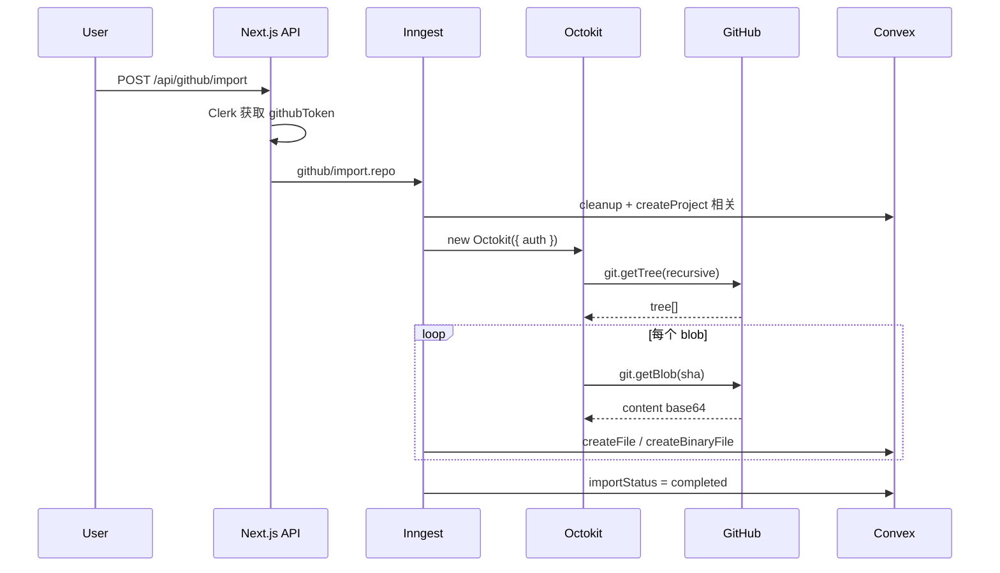
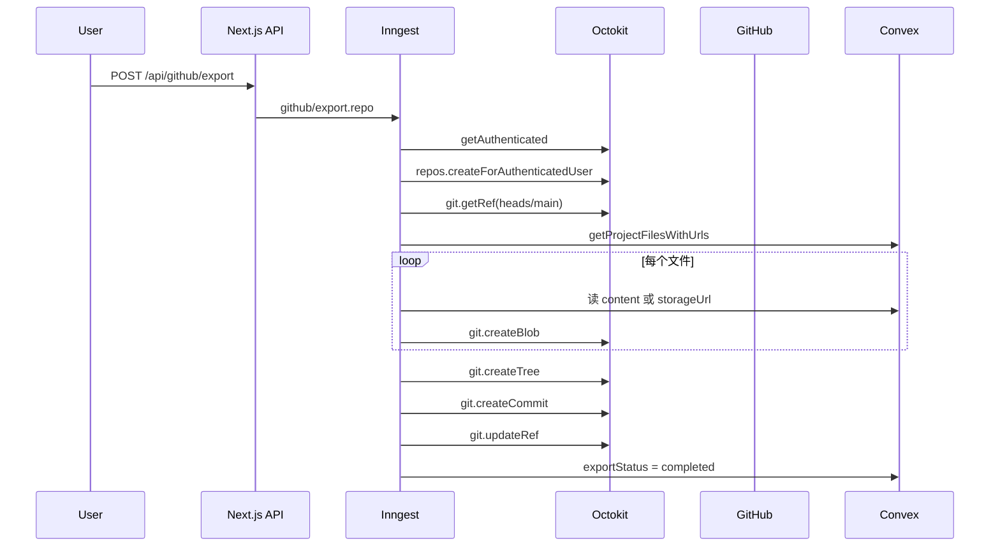

# Polaris 项目中的 Octokit 知识体系

本文按「先理解 Octokit 是什么，再看项目怎么用，最后对照 GitHub API 细节」的顺序整理。当前项目依赖的是 `octokit@^5.0.5`。

相关源码入口：

- `src/app/api/github/import/route.ts`
- `src/app/api/github/export/route.ts`
- `src/features/projects/inngest/import-github-repo.ts`
- `src/features/projects/inngest/export-to-github.ts`
- `src/inngest/events.ts`
- `convex/system.ts`（文件读写、导入/导出状态）

官方资料参考：

- Octokit.js 文档：https://github.com/octokit/octokit.js
- GitHub REST API 概览：https://docs.github.com/en/rest
- Git Database API：https://docs.github.com/en/rest/git
- OAuth Scopes：https://docs.github.com/en/apps/oauth-apps/building-oauth-apps/scopes-for-oauth-apps

---

## 1. Octokit 解决什么问题

Polaris 有两个和 GitHub 相关的核心能力：

- **导入**：用户粘贴 GitHub 仓库 URL，把远程仓库的文件树同步到 Convex 项目里。
- **导出**：用户把 Polaris 项目一次性推到一个新建的 GitHub 仓库。

这两件事都涉及大量 GitHub API 调用：读目录树、读 blob、建仓库、写 blob/tree/commit、更新分支。如果手写 `fetch`，需要自己拼 URL、处理分页、解析错误、维护类型定义。

**Octokit** 是 GitHub 官方维护的 JavaScript SDK，把 REST API 封装成带类型的方法，例如：

```ts
const { data } = await octokit.rest.git.getTree({ owner, repo, tree_sha: "main" });
```

项目里 Octokit **只出现在 Inngest 后台任务中**，不在浏览器或普通 API Route 里直接调用。原因是：

- 需要用户的 GitHub OAuth Access Token，只能在服务端安全使用。
- 导入/导出是长任务，适合交给 Inngest 分步执行（详见 `Tutorial/inngest-knowledge-guide.md`）。

---

## 2. 项目中的 Octokit 初始化

### 2.1 依赖版本

`package.json`：

```json
"octokit": "^5.0.5"
```

Octokit v5 是统一包，直接 `import { Octokit } from "octokit"` 即可，内部包含 `@octokit/rest` 等模块。

### 2.2 创建客户端

两个 Inngest function 里的写法一致：

```ts
import { Octokit } from "octokit";

const octokit = new Octokit({ auth: githubToken });
```

| 参数 | 来源 | 说明 |
|------|------|------|
| `auth` | Clerk OAuth Access Token | 代表当前登录用户对 GitHub 的操作权限 |

Octokit 会自动在请求头里加上：

```txt
Authorization: Bearer <githubToken>
```

### 2.3 Token 从哪来

API Route 通过 Clerk 读取用户绑定的 GitHub OAuth token：

```ts
const client = await clerkClient();
const tokens = await client.users.getUserOauthAccessToken(userId, "github");
const githubToken = tokens.data[0]?.token;
```

然后通过 Inngest 事件传给后台任务：

```ts
// import
githubImportRepo.create({ owner, repo, projectId, githubToken })

// export
githubExportRepo.create({ projectId, repoName, visibility, description, githubToken })
```

**设计要点**：

- Token **不写入 Convex**，只在事件 payload 里流转，任务结束即丢弃。
- 前端永远拿不到 token，避免泄露。
- 若用户未连接 GitHub，API 直接返回 400，Octokit 不会被创建。

### 2.4 需要的 OAuth 权限

项目实际用到的 API 大致需要：

| 能力         | 典型 scope                     |
| ---------- | ---------------------------- |
| 读公开/私有仓库内容 | `repo`                       |
| 以用户身份创建仓库  | `repo` 或 `public_repo`（仅公开库） |
| 获取当前用户信息   | 通常随 GitHub OAuth 默认可用        |

具体 scope 在 Clerk GitHub OAuth 配置里设置；若导入私有仓库或创建私有仓库失败，优先检查 scope 是否包含 `repo`。

---

## 3. 项目架构：Octokit 在链路中的位置

```txt
用户操作（ImportGithubDialog / ExportPopover）
  -> POST /api/github/import 或 /api/github/export
  -> Clerk 取 githubToken
  -> inngest.send({ ..., githubToken })
  -> Inngest 触发 importGithubRepo / exportToGithub
  -> new Octokit({ auth: githubToken })
  -> octokit.rest.* 调用 GitHub API
  -> 配合 Convex mutation/query 读写项目文件
  -> 前端通过 Convex 订阅 importStatus / exportStatus
```

Octokit 负责 **GitHub 侧**；Convex 负责 **Polaris 项目文件与状态**。两者通过 Inngest step 串联。

---

## 4. 为什么用 Git Data API，而不是 Contents API

GitHub 提供两套「读写文件」的思路：

| 方式 | 代表 API | 特点 |
|------|----------|------|
| **Contents API** | `repos.getContent`、`repos.createOrUpdateFileContents` | 按路径读写单个文件，适合改 README |
| **Git Data API** | `git.getTree`、`git.getBlob`、`git.createBlob`、`git.createTree`、`git.createCommit` | 操作 Git 底层对象，适合批量导入/导出 |

Polaris 选择 **Git Data API**，原因：

1. **一次 commit 导出整个项目**（export）：Contents API 每个文件一次 commit，历史会非常碎。
2. **一次拉取完整目录树**（import）：`getTree` + `recursive: "1"` 可递归拿到所有 path/sha。
3. **与 Git 对象模型一致**：blob → tree → commit → ref，便于理解也便于扩展。

Contents API 在本项目中 **未使用**。

---

## 5. Git 对象模型（读懂 Octokit 调用的前提）

```txt
Blob   — 文件内容（如 App.tsx 的文本）
Tree   — 目录结构（path → blob/tree 的映射）
Commit — 指向一棵 tree，并记录 parent commit
Ref    — 分支名（如 main）指向某个 commit SHA
```

**导入方向**（GitHub → Polaris）：

```txt
getTree(递归) → 得到所有 path + sha
getBlob(sha)  → 得到文件内容（base64）
→ 写入 Convex（文本存 content，二进制存 Storage）
```

**导出方向**（Polaris → GitHub）：

```txt
createBlob(每个文件) → 得到 blob.sha
createTree(treeItems) → 得到 tree.sha
createCommit(tree, parents) → 得到 commit.sha
updateRef(main → commit.sha) → 分支指向新提交
```

---

## 6. 项目中用到的 Octokit API 速查

### 6.1 总览

| 方法 | 文件 | 用途 |
|------|------|------|
| `octokit.rest.users.getAuthenticated` | export | 获取当前用户 login，作为 owner |
| `octokit.rest.repos.createForAuthenticatedUser` | export | 创建新仓库 |
| `octokit.rest.git.getRef` | export | 读取 `main` 分支当前 commit SHA |
| `octokit.rest.git.getTree` | import | 递归读取仓库目录树 |
| `octokit.rest.git.getBlob` | import | 按 SHA 读取文件内容 |
| `octokit.rest.git.createBlob` | export | 上传单个文件内容 |
| `octokit.rest.git.createTree` | export | 用 path + blob.sha 组装目录树 |
| `octokit.rest.git.createCommit` | export | 创建新 commit |
| `octokit.rest.git.updateRef` | export | 把 `main` 指到新 commit |

---

### 6.2 `users.getAuthenticated`

**文件**：`export-to-github.ts` → step `get-github-user`

```ts
const { data: user } = await octokit.rest.users.getAuthenticated();
// user.login 用作 owner
```

**作用**：导出时要 **以当前用户名义** 创建仓库、写 git 对象，需要 `owner` 参数。导入时 owner 来自用户粘贴的 URL，所以导入流程不需要这一步。

**返回常用字段**：`login`（用户名）、`id`、`name` 等。

---

### 6.3 `repos.createForAuthenticatedUser`

**文件**：`export-to-github.ts` → step `create-repo`

```ts
const { data: repo } = await octokit.rest.repos.createForAuthenticatedUser({
  name: repoName,
  description: description || `Exported from Polaris`,
  private: visibility === "private",
  auto_init: true,
});
```

| 参数 | 说明 |
|------|------|
| `name` | 新仓库名 |
| `private` | 是否私有 |
| `auto_init: true` | 让 GitHub 自动生成 README 和初始 commit，从而存在 `main` 分支 |

**为什么 `auto_init: true`**：空仓库没有分支、没有 commit，后续 `getRef` / `createCommit` 无法工作。初始化后还要 `step.sleep("3s")`，因为 GitHub 侧异步完成 init。

**返回常用字段**：`html_url`（写入 Convex `exportStatus` 供前端「View on GitHub」）。

---

### 6.4 `git.getRef`

**文件**：`export-to-github.ts` → step `get-initial-commit`

```ts
const { data: ref } = await octokit.rest.git.getRef({
  owner: user.login,
  repo: repoName,
  ref: "heads/main",
});
const initialCommitSha = ref.object.sha;
```

**作用**：读取 `refs/heads/main` 当前指向的 commit SHA，作为下一步 `createCommit` 的 `parents[0]`。

Git 里除第一个 commit 外，每个 commit 必须有 parent；`auto_init` 产生的就是这个 parent。

```
1. GitHub 自动创建初始 commit（README）  →  main 指向它
2. getRef("heads/main")                  →  拿到初始 commit SHA 作为 parent
3. createCommit({ parents: [initialCommitSha] })  →  新 commit 合法地接在初始 commit 之后
4. updateRef("heads/main", sha: newCommitSha)     →  把 main 移到新 commit
```

---

### 6.5 `git.getTree`

**文件**：`import-github-repo.ts` → step `fetch-repo-tree`

```ts
const { data } = await octokit.rest.git.getTree({
  owner,
  repo,
  tree_sha: "main",      // 或 "master"
  recursive: "1",
});
```

| 参数 | 说明 |
|------|------|
| `tree_sha` | 这里传分支名 `main`/`master`，GitHub 会解析为对应 tree |
| `recursive: "1"` | 递归展开所有子目录，一次拿到扁平列表 |

**返回结构**（简化）：

```ts
{
  tree: [
    { path: "src", type: "tree", sha: "..." },
    { path: "src/App.tsx", type: "blob", sha: "..." },
  ]
}
```

| type | 含义 |
|------|------|
| `tree` | 文件夹 |
| `blob` | 文件 |

**分支 fallback**：先尝试 `main`，失败再试 `master`，兼容老仓库默认分支。

**注意**：Octokit 只负责拉元数据；在 Polaris 里还要按路径深度排序文件夹、再写入 Convex（见第 7 节）。

---

### 6.6 `git.getBlob`

**文件**：`import-github-repo.ts` → step `create-files`

```ts
const { data: blob } = await octokit.rest.git.getBlob({
  owner,
  repo,
  file_sha: file.sha,
});
const buffer = Buffer.from(blob.content, "base64");
```

**作用**：根据 tree 里的 `sha` 取文件 **原始内容**。

GitHub 返回的 `blob.content` 默认是 **base64 字符串**，需解码成 `Buffer` 后再：

- 用 `isBinaryFile` 判断是否二进制；
- 文本 → `buffer.toString("utf-8")` → Convex `createFile`；
- 二进制 → 上传 Convex Storage → `createBinaryFile`。

单文件失败时 `catch` 打日志并 `continue`，不中断整个导入。

---

### 6.7 `git.createBlob`

**文件**：`export-to-github.ts` → step `create-blobs`

```ts
const { data: blob } = await octokit.rest.git.createBlob({
  owner: user.login,
  repo: repoName,
  content,
  encoding, // "utf-8" | "base64"
});
```

| 文件类型 | content | encoding |
|----------|---------|----------|
| 文本（Convex `content` 字段） | 原始字符串 | `"utf-8"`（默认） |
| 二进制（Convex Storage） | 下载后 `buffer.toString("base64")` | `"base64"` |

**返回**：`blob.sha`，供 `createTree` 引用。

**为什么不把内容直接塞进 createTree**：多文件、大文件时，先 blob 再引用 sha 更清晰，也符合 Git 内容寻址模型。

---

### 6.8 `git.createTree`

**文件**：`export-to-github.ts` → step `create-tree`

```ts
const { data: tree } = await octokit.rest.git.createTree({
  owner: user.login,
  repo: repoName,
  tree: treeItems,
});
```

每个 `treeItems` 元素：

```ts
{
  path: "src/components/App.tsx",
  mode: "100644",  // 普通文件
  type: "blob",
  sha: blob.sha,
}
```

GitHub 会根据 `path` 中的 `/` **自动推导目录结构**，无需单独为每个文件夹创建 tree 节点。

---

### 6.9 `git.createCommit`

**文件**：`export-to-github.ts` → step `create-commit`

```ts
const { data: commit } = await octokit.rest.git.createCommit({
  owner: user.login,
  repo: repoName,
  message: "Initial commit from Polaris",
  tree: tree.sha,
  parents: [initialCommitSha],
});
```

| 参数 | 说明 |
|------|------|
| `tree` | 上一步 createTree 的 SHA |
| `parents` | 父 commit 列表；这里接在 auto_init 的 commit 后面 |

历史结构：`GitHub README 初始提交 → Polaris 导出提交`。

---

### 6.10 `git.updateRef`

**文件**：`export-to-github.ts` → step `update-branch-ref`

```ts
await octokit.rest.git.updateRef({
  owner: user.login,
  repo: repoName,
  ref: "heads/main",
  sha: commit.sha,
  force: true,
});
```

**作用**：把 `main` 分支指针移到新 commit，用户 clone/pull 看到的就是 Polaris 导出的文件。

`force: true`：确保 ref 一定更新到目标 SHA（防御性；正常情况新 commit 已是 initialCommit 的子提交，本可 fast-forward）。

---

## 7. 导入流程详解（import-github-repo）

```txt
github/import.repo 事件
  -> cleanup（Convex：清空项目旧文件）
  -> fetch-repo-tree（Octokit：getTree）
  -> create-folders（Convex：按深度顺序建文件夹）
  -> create-files（Octokit：getBlob + Convex：写文件）
  -> set-completed-status
```

### 7.1 Octokit 与 Convex 的分工

| 步骤 | Octokit | Convex |
|------|---------|--------|
| 目录结构 | getTree 返回 path 列表 | createFolder 建 parentId 树 |
| 文件内容 | getBlob 读 base64 | createFile / createBinaryFile |
| 状态 | — | updateImportStatus |

### 7.2 文件夹为什么要按深度排序

`getTree` 返回的 folder 顺序不确定。Polaris 的 `files` 表用 `parentId` 关联，必须先创建父文件夹，子文件夹才能拿到 `parentId`：

```ts
// 按 path 分段数排序：src → src/components → src/components/ui
folders.sort((a, b) => aDepth - bDepth);
```

这一步 **不是 Octokit 的能力**，是 Polaris 在拿到 tree 之后的业务逻辑。

### 7.3 二进制判断

Octokit 只返回 bytes（base64），不区分文本/二进制。项目用 `isbinaryfile` 包检测，与 Convex schema（`content` vs `storageId`）对齐。

---

## 8. 导出流程详解（export-to-github）

```txt
github/export.repo 事件
  -> set-exporting-status
  -> get-github-user（Octokit：getAuthenticated）
  -> create-repo（Octokit：createForAuthenticatedUser）
  -> wait-for-repo-init（sleep 3s）
  -> get-initial-commit（Octokit：getRef）
  -> fetch-project-files（Convex：getProjectFilesWithUrls）
  -> buildFilePaths（本地：parentId → 完整 path）
  -> create-blobs（Octokit：createBlob × N）
  -> create-tree（Octokit：createTree）
  -> create-commit（Octokit：createCommit）
  -> update-branch-ref（Octokit：updateRef）
  -> set-completed-status
```

### 8.1 路径是如何拼出来的

Convex 存的是扁平 `name` + `parentId`，导出前用递归 `getFullPath` 转成 GitHub 需要的 `"src/App.tsx"` 字符串。这一步在 Octokit 调用 **之前** 完成。

### 8.2 二进制文件为何还要 ky

Octokit 这一步只负责 **上传到 GitHub**。二进制字节在 Convex Storage，需先用 `ky.get(storageUrl)` 下载，再 base64 后 `createBlob`。Storage URL 来自 `getProjectFilesWithUrls`，不是 Octokit API。

### 8.3 取消导出

`exportToGithub` 配置了 `cancelOn: github/export.cancel`，取消本身不调用 Octokit，只停 Inngest 函数；已创建的 GitHub 仓库不会自动删除。

---

## 9. Octokit 响应结构与 TypeScript

Octokit REST 方法普遍返回：

```ts
const { data, headers, status, url } = await octokit.rest.git.getTree(...);
```

项目里通常只解构 `data`。

在 Inngest step 中，为了保留类型，常见写法：

```ts
}) as Awaited<ReturnType<typeof octokit.rest.git.createTree>>;
```

原因：`step.run` 的返回值会被序列化/缓存，TypeScript 推断可能丢失，用 `ReturnType` 显式标注更安全。

---

## 10. 错误处理与重试

### 10.1 Octokit 抛错

未授权、404、rate limit 等会以异常形式抛出。导入里对 **单文件** getBlob 做了 try/catch；对 **整树** getTree 用 main/master fallback。

### 10.2 Inngest 层

- 致命错误（如无 internalKey、无文件可导出）→ `NonRetriableError`，不再重试。
- function 级 `onFailure` → 更新 Convex `importStatus` / `exportStatus` 为 `failed`。
- 每个 Octokit 调用包在 `step.run` 里 → 失败后重试时跳过已成功的 step（见 Inngest 文档）。

### 10.3 Rate Limit

GitHub 对 OAuth token 有速率限制。大仓库导入时，`getBlob` 在循环里逐个调用，可能触限。生产环境可考虑：

- 监控 `headers` 里的 `x-ratelimit-remaining`；
- 批量或并发控制；
- 使用 conditional requests（本项目尚未实现）。

---

## 11. 与 Convex 文件模型的对应关系

| Polaris (Convex) | 导入（GitHub → Convex） | 导出（Convex → GitHub） |
|------------------|-------------------------|-------------------------|
| 文本 `content` | getBlob → utf-8 字符串 | createBlob encoding utf-8 |
| 二进制 `storageId` | getBlob → Storage 上传 | ky 下载 → createBlob base64 |
| 文件夹 `type: "folder"` | getTree type=tree → createFolder | 仅用于拼 path，不单独 createTree 目录节点 |
| 路径 | tree.path 拆 parent | parentId 递归 getFullPath |

---

## 12. 完整 API 调用序列图

### 导入



### 导出



---

## 13. 常见问题

### Q1：为什么导入用 URL 里的 owner，导出用 getAuthenticated 的 login？

导入目标是 **任意公开/可访问仓库**，owner/repo 来自用户输入。导出目标是 **当前用户名下新建仓库**，必须用自己的 login 作为 owner。

### Q2：能否导入 GitHub 上非 main/master 的分支？

当前实现写死了 `tree_sha: "main"` / `"master"`，不支持选分支。扩展方式：增加分支参数，传给 `getTree` 或先 `getRef` 再取 SHA。

### Q3：导出会覆盖已有同名仓库吗？

`createForAuthenticatedUser` 在仓库名冲突时会失败；项目未做「向已有仓库追加 commit」流程。

### Q4：Octokit 能在前端用吗？

不能也不应。Token 必须留在服务端；本项目架构已把 Octokit 限制在 Inngest function 内。

### Q5：和 `isBinaryFile`、`ky` 的关系？

它们不是 Octokit 的一部分，而是导入/导出链路上处理 **字节内容** 的辅助库；Octokit 负责与 GitHub 通信，Convex/ky 负责 Polaris 侧存储。

---

## 14. 练习 / 作业

以下练习都基于现有 Octokit 用法，可单独在本地或测试仓库验证。

### 练习 1：读懂 getTree 返回值

1. 找一个小型 GitHub 仓库。
2. 用 Personal Access Token 在脚本里 `new Octokit({ auth: token })`。
3. 调用 `git.getTree({ recursive: "1" })`，打印 `tree` 里 `type` 为 `tree` 和 `blob` 的数量。
4. 对比 Polaris `import-github-repo.ts` 里 folders / allFiles 的 filter 逻辑。

### 练习 2：单文件 blob  round-trip

1. 对某仓库调用 `getBlob` 取一个文本文件。
2. 在你自己的测试仓库里 `createBlob`（utf-8）→ `createTree` → `createCommit` → `updateRef`。
3. 在 GitHub 网页上确认文件内容一致。

### 练习 3：扩展分支选择（进阶）

1. 给 import API 增加可选参数 `branch`。
2. 将 `getTree` 的 `tree_sha` 改为该分支名。
3. 处理分支不存在时的错误提示。

### 练习 4：Rate Limit 观察（进阶）

1. 在 import 循环里打印 Octokit 响应头 `x-ratelimit-remaining`。
2. 记录导入 N 个文件后剩余配额，写一段简短结论。

---

## 15. 小结

| 主题 | 项目做法 |
|------|----------|
| SDK | `octokit@^5`，`new Octokit({ auth: githubToken })` |
| 调用位置 | 仅 Inngest：`import-github-repo.ts`、`export-to-github.ts` |
| Token | Clerk OAuth → Inngest 事件 payload，不落库 |
| API 风格 | Git Data API（blob/tree/commit/ref），不用 Contents API |
| 导入 | getTree → getBlob → Convex |
| 导出 | createBlob → createTree → createCommit → updateRef |
| 文本/二进制 | 导入：base64 解码 + isBinaryFile；导出：utf-8 或 base64 createBlob |
| 可靠性 | Inngest step 拆分 + onFailure 更新状态 |

掌握以上几点，即可读懂 Polaris 里所有 Octokit 相关代码，并在此基础上扩展分支选择、增量同步、并发优化等能力。
