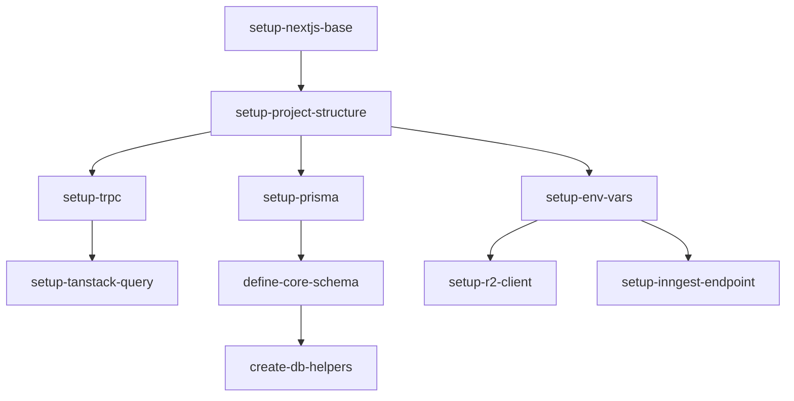

# Epic 1: 基础工程搭建

**优先级**: P0  
**预计工作量**: 5 人日  
**Feature 数量**: 3

---

## Feature 1.1: 项目脚手架

### Change 1.1.1: 初始化 Next.js 项目

**Change ID**: `setup-nextjs-base`

**Goal**: 创建 Next.js 14+ 项目，配置 TypeScript、TailwindCSS

**Scope**:
- 包含: 初始化 Next.js、安装核心依赖、配置 TypeScript、TailwindCSS、ESLint、Prettier
- 不包含: 业务代码、数据库配置、第三方服务集成

**Files Likely Affected**:
- `package.json`
- `tsconfig.json`
- `next.config.js`
- `tailwind.config.ts`
- `.eslintrc.json`
- `.prettierrc`
- `/app/layout.tsx`
- `/app/page.tsx`

**Dependencies**: 无

**Acceptance Criteria**:
- Given 执行 `npm create next-app@latest`
- When 选择 TypeScript、TailwindCSS、App Router
- Then 项目可以成功启动 `npm run dev`

**Estimated Size**: XS

**Estimated LOC**: 300

**Priority**: P0

---

### Change 1.1.2: 配置项目结构

**Change ID**: `setup-project-structure`

**Goal**: 建立标准目录结构

**Scope**:
- 包含: 创建 `/lib`、`/components`、`/server`、`/types` 目录
- 不包含: 具体业务模块

**Files Likely Affected**:
- `/lib/` (新建)
- `/components/` (新建)
- `/server/` (新建)
- `/types/` (新建)
- `/public/`

**Dependencies**: `setup-nextjs-base`

**Acceptance Criteria**:
- Given 项目已初始化
- When 创建标准目录结构
- Then 所有目录都存在且包含 README.md

**Estimated Size**: XS

**Estimated LOC**: 100

**Priority**: P0

---

### Change 1.1.3: 配置 tRPC

**Change ID**: `setup-trpc`

**Goal**: 集成 tRPC 用于类型安全的 API

**Scope**:
- 包含: 安装 tRPC、配置 server、client、API route
- 不包含: 具体业务 router

**Files Likely Affected**:
- `/server/trpc.ts`
- `/server/routers/_app.ts`
- `/lib/trpc/client.ts`
- `/lib/trpc/server.ts`
- `/app/api/trpc/[trpc]/route.ts`

**Dependencies**: `setup-project-structure`

**Acceptance Criteria**:
- Given tRPC 已安装
- When 创建测试 router `hello`
- Then 客户端可以成功调用并获得类型提示

**Estimated Size**: S

**Estimated LOC**: 500

**Priority**: P0

---

### Change 1.1.4: 配置 TanStack Query

**Change ID**: `setup-tanstack-query`

**Goal**: 集成 TanStack Query 用于数据获取和缓存

**Scope**:
- 包含: 安装 @tanstack/react-query、配置 QueryClient、Provider
- 不包含: 具体业务查询

**Files Likely Affected**:
- `/lib/query-client.ts`
- `/components/providers/query-provider.tsx`
- `/app/layout.tsx`

**Dependencies**: `setup-trpc`

**Acceptance Criteria**:
- Given TanStack Query 已安装
- When 在 layout 中添加 QueryClientProvider
- Then React Query DevTools 可用

**Estimated Size**: XS

**Estimated LOC**: 200

**Priority**: P0

---

## Feature 1.2: 数据库模型

### Change 1.2.1: 安装配置 Prisma

**Change ID**: `setup-prisma`

**Goal**: 安装 Prisma 并配置数据库连接

**Scope**:
- 包含: 安装 Prisma、初始化、配置 PostgreSQL 连接
- 不包含: 具体表定义

**Files Likely Affected**:
- `package.json`
- `/prisma/schema.prisma`
- `.env.example`
- `/lib/prisma.ts`

**Dependencies**: `setup-project-structure`

**Acceptance Criteria**:
- Given Prisma 已安装
- When 配置 DATABASE_URL
- Then `npx prisma db push` 成功连接数据库

**Estimated Size**: S

**Estimated LOC**: 300

**Priority**: P0

---

### Change 1.2.2: 定义核心数据模型

**Change ID**: `define-core-schema`

**Goal**: 定义 Project、User、Asset、Job 等核心表

**Scope**:
- 包含: 定义 8 个核心表（User、Project、StoryboardVersion、Scene、Asset、GenerationJob、RenderJob、JobEvent）
- 不包含: UsageRecord、审计日志表

**Files Likely Affected**:
- `/prisma/schema.prisma`

**Dependencies**: `setup-prisma`

**Acceptance Criteria**:
- Given Prisma schema 已定义
- When 执行 `npx prisma migrate dev`
- Then 所有表创建成功，索引生效

**Estimated Size**: M

**Estimated LOC**: 800

**Priority**: P0

---

### Change 1.2.3: 创建数据库辅助函数

**Change ID**: `create-db-helpers`

**Goal**: 创建通用数据库查询辅助函数

**Scope**:
- 包含: Prisma client 单例、通用查询函数、事务辅助
- 不包含: 具体业务查询

**Files Likely Affected**:
- `/lib/db/client.ts`
- `/lib/db/utils.ts`
- `/lib/db/types.ts`

**Dependencies**: `define-core-schema`

**Acceptance Criteria**:
- Given 数据库表已创建
- When 使用辅助函数执行 CRUD
- Then 操作成功且类型安全

**Estimated Size**: S

**Estimated LOC**: 400

**Priority**: P0

---

## Feature 1.3: 开发环境配置

### Change 1.3.1: 配置环境变量管理

**Change ID**: `setup-env-vars`

**Goal**: 使用 Zod 校验环境变量

**Scope**:
- 包含: 创建 env.ts、定义必需环境变量、Zod 校验
- 不包含: 具体 Provider 的 API Key

**Files Likely Affected**:
- `/lib/env.ts`
- `.env.example`
- `.env.local` (gitignore)

**Dependencies**: `setup-project-structure`

**Acceptance Criteria**:
- Given 环境变量 schema 已定义
- When 缺少必需变量
- Then 应用启动失败并提示错误

**Estimated Size**: S

**Estimated LOC**: 300

**Priority**: P0

---

### Change 1.3.2: 配置 Cloudflare R2

**Change ID**: `setup-r2-client`

**Goal**: 配置 R2 SDK 和连接

**Scope**:
- 包含: 安装 @aws-sdk/client-s3、配置 R2 client、测试连接
- 不包含: 具体业务上传逻辑

**Files Likely Affected**:
- `/lib/r2.ts`
- `/lib/env.ts`

**Dependencies**: `setup-env-vars`

**Acceptance Criteria**:
- Given R2 credentials 已配置
- When 执行测试上传
- Then 文件成功上传到 R2

**Estimated Size**: S

**Estimated LOC**: 400

**Priority**: P0

---

### Change 1.3.3: 配置 Inngest Endpoint

**Change ID**: `setup-inngest-endpoint`

**Goal**: 安装 Inngest 并配置 webhook endpoint

**Scope**:
- 包含: 安装 inngest、配置 client、创建 API route
- 不包含: 具体业务 functions

**Files Likely Affected**:
- `/lib/inngest.ts`
- `/app/api/inngest/route.ts`
- `/lib/env.ts`

**Dependencies**: `setup-env-vars`

**Acceptance Criteria**:
- Given Inngest 已配置
- When 访问 `/api/inngest`
- Then 返回 Inngest 健康检查响应

**Estimated Size**: S

**Estimated LOC**: 300

**Priority**: P0

---

## Epic 1 依赖图

---

## 验证清单

Epic 1 完成后需验证：

- [ ] `npm run dev` 成功启动
- [ ] tRPC API 正常工作
- [ ] 数据库迁移成功
- [ ] R2 上传测试通过
- [ ] Inngest endpoint 响应正常
- [ ] 所有环境变量已配置
- [ ] TypeScript 无错误
- [ ] ESLint 无警告
