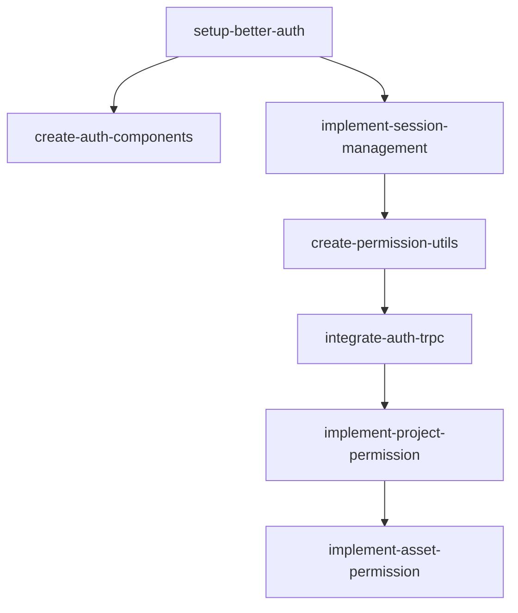

# Epic 2: 用户认证与权限

**优先级**: P0  
**预计工作量**: 4 人日  
**Feature 数量**: 2

---

## Feature 2.1: Better-auth 集成

### Change 2.1.1: 安装配置 Better-auth

**Change ID**: `setup-better-auth`

**Goal**: 集成 better-auth 实现用户认证

**Scope**:
- 包含: 安装 better-auth、配置认证策略（邮箱密码）、创建 auth API
- 不包含: OAuth 第三方登录

**Files Likely Affected**:
- `package.json`
- `/lib/auth.ts`
- `/lib/env.ts`
- `/app/api/auth/[...all]/route.ts`
- `/prisma/schema.prisma` (User 表)

**Dependencies**: `define-core-schema`, `setup-env-vars`

**Acceptance Criteria**:
- Given better-auth 已配置
- When 用户注册并登录
- Then 获得有效 session token

**Estimated Size**: M

**Estimated LOC**: 600

**Priority**: P0

---

### Change 2.1.2: 创建认证组件

**Change ID**: `create-auth-components`

**Goal**: 创建登录、注册 UI 组件

**Scope**:
- 包含: 登录表单、注册表单、受保护路由包装器
- 不包含: 完整用户中心页面

**Files Likely Affected**:
- `/components/auth/login-form.tsx`
- `/components/auth/register-form.tsx`
- `/components/auth/auth-guard.tsx`
- `/app/login/page.tsx`
- `/app/register/page.tsx`

**Dependencies**: `setup-better-auth`

**Acceptance Criteria**:
- Given 认证表单已创建
- When 用户填写并提交
- Then 表单验证正确，提交成功跳转

**Estimated Size**: M

**Estimated LOC**: 800

**Priority**: P0

---

### Change 2.1.3: 实现 Session 管理

**Change ID**: `implement-session-management`

**Goal**: 服务端和客户端 session 管理

**Scope**:
- 包含: Session 读取、刷新、登出、中间件拦截
- 不包含: 多设备管理

**Files Likely Affected**:
- `/lib/auth/session.ts`
- `/lib/auth/middleware.ts`
- `/middleware.ts`

**Dependencies**: `setup-better-auth`

**Acceptance Criteria**:
- Given 用户已登录
- When session 过期
- Then 自动跳转登录页

**Estimated Size**: S

**Estimated LOC**: 500

**Priority**: P0

---

## Feature 2.2: 权限中间件

### Change 2.2.1: 创建权限检查工具

**Change ID**: `create-permission-utils`

**Goal**: 实现权限判断工具函数

**Scope**:
- 包含: isAdmin、isProjectOwner、canAccessAsset 等权限检查
- 不包含: 细粒度 RBAC

**Files Likely Affected**:
- `/lib/permissions.ts`
- `/lib/env.ts` (ADMIN_EMAILS)

**Dependencies**: `implement-session-management`

**Acceptance Criteria**:
- Given 用户邮箱在 ADMIN_EMAILS 中
- When 调用 isAdmin(userId)
- Then 返回 true

**Estimated Size**: S

**Estimated LOC**: 400

**Priority**: P0

---

### Change 2.2.2: 集成权限到 tRPC Context

**Change ID**: `integrate-auth-trpc`

**Goal**: tRPC context 注入 userId 和权限信息

**Scope**:
- 包含: 修改 createContext、添加 protectedProcedure、adminProcedure
- 不包含: 具体业务 router

**Files Likely Affected**:
- `/server/trpc.ts`
- `/server/context.ts`

**Dependencies**: `setup-trpc`, `create-permission-utils`

**Acceptance Criteria**:
- Given tRPC procedure 使用 protectedProcedure
- When 未登录用户调用
- Then 返回 UNAUTHORIZED 错误

**Estimated Size**: M

**Estimated LOC**: 600

**Priority**: P0

---

### Change 2.2.3: 实现项目权限校验

**Change ID**: `implement-project-permission`

**Goal**: 校验用户是否可访问特定项目

**Scope**:
- 包含: 项目所有权校验、管理员豁免
- 不包含: 项目分享链接权限

**Files Likely Affected**:
- `/lib/permissions/project.ts`
- `/lib/db/project-query.ts`

**Dependencies**: `integrate-auth-trpc`

**Acceptance Criteria**:
- Given 用户 A 尝试访问用户 B 的项目
- When 调用权限校验
- Then 返回 FORBIDDEN

**Estimated Size**: S

**Estimated LOC**: 400

**Priority**: P0

---

### Change 2.2.4: 实现资产权限校验

**Change ID**: `implement-asset-permission`

**Goal**: 校验用户是否可访问特定资产

**Scope**:
- 包含: 通过 projectId 反查权限
- 不包含: 公开分享资产

**Files Likely Affected**:
- `/lib/permissions/asset.ts`
- `/lib/db/asset-query.ts`

**Dependencies**: `implement-project-permission`

**Acceptance Criteria**:
- Given 资产属于项目 X
- When 用户无权限访问项目 X
- Then 无法获取资产签名 URL

**Estimated Size**: S

**Estimated LOC**: 400

**Priority**: P0

---

## Epic 2 依赖图

---

## 验证清单

Epic 2 完成后需验证：

- [ ] 用户可以成功注册
- [ ] 用户可以成功登录
- [ ] 登录后 session 持久化
- [ ] 未登录访问受保护页面跳转登录
- [ ] 管理员邮箱白名单生效
- [ ] tRPC protectedProcedure 正确拦截
- [ ] 用户无法访问他人项目
- [ ] 用户无法访问他人资产
- [ ] Session 过期自动跳转
- [ ] 登出功能正常
