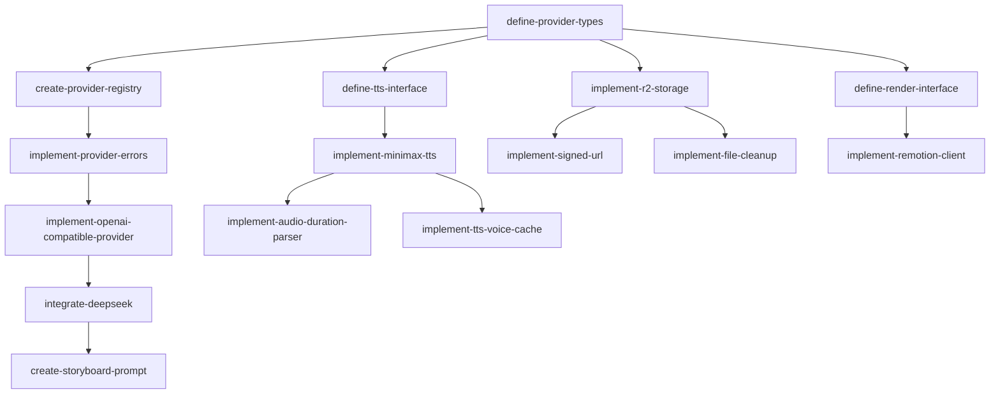

# Epic 3: Provider 抽象层

**优先级**: P0  
**预计工作量**: 8 人日  
**Feature 数量**: 5

---

## Feature 3.1: Provider 接口定义

### Change 3.1.1: 定义 Provider 类型系统

**Change ID**: `define-provider-types`

**Goal**: 定义所有 Provider 的 TypeScript 接口

**Scope**:
- 包含: LlmProvider、TtsProvider、StorageProvider、RenderProvider 接口定义
- 不包含: 具体实现

**Files Likely Affected**:
- `/lib/providers/types.ts`
- `/lib/providers/llm/types.ts`
- `/lib/providers/tts/types.ts`
- `/lib/providers/storage/types.ts`
- `/lib/providers/render/types.ts`

**Dependencies**: `setup-project-structure`

**Acceptance Criteria**:
- Given Provider 接口已定义
- When 创建具体实现
- Then 必须满足接口契约

**Estimated Size**: M

**Estimated LOC**: 600

**Priority**: P0

---

### Change 3.1.2: 创建 Provider Registry

**Change ID**: `create-provider-registry`

**Goal**: 实现 Provider 注册和查找机制

**Scope**:
- 包含: Registry 单例、register、get、listByType 方法
- 不包含: 健康检查

**Files Likely Affected**:
- `/lib/providers/registry.ts`
- `/lib/providers/errors.ts`

**Dependencies**: `define-provider-types`

**Acceptance Criteria**:
- Given Provider 已注册
- When 通过 ID 查找
- Then 返回对应 Provider 实例

**Estimated Size**: S

**Estimated LOC**: 500

**Priority**: P0

---

### Change 3.1.3: 实现 Provider 错误处理

**Change ID**: `implement-provider-errors`

**Goal**: 统一 Provider 错误码和异常处理

**Scope**:
- 包含: ProviderError 类、错误码映射、重试策略判断
- 不包含: 具体业务错误处理

**Files Likely Affected**:
- `/lib/providers/errors.ts`
- `/lib/providers/retry.ts`

**Dependencies**: `create-provider-registry`

**Acceptance Criteria**:
- Given Provider 调用失败
- When 捕获异常
- Then 映射为标准 ProviderError

**Estimated Size**: S

**Estimated LOC**: 400

**Priority**: P0

---

## Feature 3.2: LLM Provider

### Change 3.2.1: 实现 OpenAI-Compatible Provider

**Change ID**: `implement-openai-compatible-provider`

**Goal**: 通用 OpenAI API 兼容 Provider

**Scope**:
- 包含: OpenAI SDK 封装、generateStoryboard、repairStoryboardJson
- 不包含: 具体厂商特殊逻辑

**Files Likely Affected**:
- `/lib/providers/llm/openai-compatible.ts`
- `/lib/providers/llm/client.ts`
- `package.json` (openai SDK)

**Dependencies**: `define-provider-types`, `implement-provider-errors`

**Acceptance Criteria**:
- Given 配置 OpenAI-compatible endpoint
- When 调用 generateStoryboard
- Then 返回合法 JSON

**Estimated Size**: M

**Estimated LOC**: 800

**Priority**: P0

---

### Change 3.2.2: 接入 DeepSeek

**Change ID**: `integrate-deepseek`

**Goal**: 配置 DeepSeek 作为默认 LLM

**Scope**:
- 包含: DeepSeek endpoint 配置、API Key 管理
- 不包含: 其他国内大模型

**Files Likely Affected**:
- `/lib/providers/llm/deepseek.ts`
- `/lib/env.ts`
- `/lib/providers/registry.ts` (启动注册)

**Dependencies**: `implement-openai-compatible-provider`

**Acceptance Criteria**:
- Given DeepSeek API Key 已配置
- When 应用启动
- Then DeepSeek Provider 自动注册

**Estimated Size**: S

**Estimated LOC**: 300

**Priority**: P0

---

### Change 3.2.3: 创建 Storyboard Prompt

**Change ID**: `create-storyboard-prompt`

**Goal**: 设计 LLM 生成 Storyboard 的 Prompt

**Scope**:
- 包含: System prompt、User prompt 模板、Few-shot examples
- 不包含: Prompt 优化迭代

**Files Likely Affected**:
- `/lib/prompts/storyboard.ts`
- `/lib/prompts/repair.ts`

**Dependencies**: `integrate-deepseek`

**Acceptance Criteria**:
- Given 输入 AI 回答文本
- When 使用 Prompt 调用 LLM
- Then 输出符合 Storyboard Schema

**Estimated Size**: M

**Estimated LOC**: 700

**Priority**: P0

---

## Feature 3.3: TTS Provider

### Change 3.3.1: 定义 TTS Provider 接口

**Change ID**: `define-tts-interface`

**Goal**: 定义通用 TTS Provider 接口

**Scope**:
- 包含: synthesize、listVoices 方法签名、返回类型
- 不包含: 具体实现

**Files Likely Affected**:
- `/lib/providers/tts/types.ts`
- `/lib/providers/tts/voice.ts`

**Dependencies**: `define-provider-types`

**Acceptance Criteria**:
- Given TTS Provider 接口已定义
- When 实现具体 Provider
- Then 必须包含 synthesize 和 listVoices

**Estimated Size**: S

**Estimated LOC**: 400

**Priority**: P0

---

### Change 3.3.2: 实现 MiniMax TTS Provider

**Change ID**: `implement-minimax-tts`

**Goal**: 接入 MiniMax TTS API

**Scope**:
- 包含: 同步 HTTP T2A、音频下载、时长解析、字幕提取
- 不包含: 异步长文本 TTS

**Files Likely Affected**:
- `/lib/providers/tts/minimax.ts`
- `/lib/providers/tts/minimax-client.ts`
- `/lib/env.ts`

**Dependencies**: `define-tts-interface`

**Acceptance Criteria**:
- Given MiniMax API Key 已配置
- When 调用 synthesize
- Then 返回音频 Buffer 和 durationMs

**Estimated Size**: L

**Estimated LOC**: 1200

**Priority**: P0

---

### Change 3.3.3: 实现音频时长解析

**Change ID**: `implement-audio-duration-parser`

**Goal**: 解析音频文件获取时长

**Scope**:
- 包含: 使用 ffprobe 或 audio-metadata 解析 mp3/wav
- 不包含: 视频时长解析

**Files Likely Affected**:
- `/lib/audio/analyzer.ts`
- `package.json` (音频解析库)

**Dependencies**: `implement-minimax-tts`

**Acceptance Criteria**:
- Given 音频 Buffer
- When 调用解析函数
- Then 返回准确 durationMs

**Estimated Size**: S

**Estimated LOC**: 400

**Priority**: P0

---

### Change 3.3.4: 实现 TTS Voice 列表缓存

**Change ID**: `implement-tts-voice-cache`

**Goal**: 缓存 TTS Provider 的 voice 列表

**Scope**:
- 包含: 内存缓存、1小时 TTL、缓存刷新
- 不包含: Redis 缓存

**Files Likely Affected**:
- `/lib/providers/tts/voice-cache.ts`

**Dependencies**: `implement-minimax-tts`

**Acceptance Criteria**:
- Given Voice 列表已缓存
- When 1小时内再次请求
- Then 直接返回缓存，不调用 API

**Estimated Size**: S

**Estimated LOC**: 300

**Priority**: P1

---

## Feature 3.4: Storage Provider

### Change 3.4.1: 实现 R2 Storage Provider

**Change ID**: `implement-r2-storage`

**Goal**: 封装 R2 上传、签名 URL 生成

**Scope**:
- 包含: upload、getSignedUrl、delete 方法
- 不包含: 列表、批量操作

**Files Likely Affected**:
- `/lib/providers/storage/r2.ts`
- `/lib/providers/storage/utils.ts`

**Dependencies**: `setup-r2-client`, `define-provider-types`

**Acceptance Criteria**:
- Given R2 credentials 已配置
- When 调用 upload
- Then 文件成功上传并返回 key

**Estimated Size**: M

**Estimated LOC**: 800

**Priority**: P0

---

### Change 3.4.2: 实现签名 URL 生成

**Change ID**: `implement-signed-url`

**Goal**: 生成安全的预签名 URL

**Scope**:
- 包含: 按用途（preview/download/render）生成不同有效期 URL
- 不包含: 自定义域名

**Files Likely Affected**:
- `/lib/providers/storage/signed-url.ts`

**Dependencies**: `implement-r2-storage`

**Acceptance Criteria**:
- Given 资产 key
- When 生成 preview 用 URL
- Then 有效期 10 分钟

**Estimated Size**: S

**Estimated LOC**: 400

**Priority**: P0

---

### Change 3.4.3: 实现文件删除和清理

**Change ID**: `implement-file-cleanup`

**Goal**: 删除 R2 文件和孤儿文件清理

**Scope**:
- 包含: 单文件删除、标记待清理、清理任务
- 不包含: 自动清理调度

**Files Likely Affected**:
- `/lib/providers/storage/cleanup.ts`
- `/lib/db/asset-cleanup.ts`

**Dependencies**: `implement-r2-storage`

**Acceptance Criteria**:
- Given Asset 标记为 deleted
- When 执行清理
- Then R2 文件被删除

**Estimated Size**: M

**Estimated LOC**: 600

**Priority**: P1

---

## Feature 3.5: Render Provider

### Change 3.5.1: 定义 Render Provider 接口

**Change ID**: `define-render-interface`

**Goal**: 定义渲染 Provider 接口

**Scope**:
- 包含: render 方法签名、输入输出类型
- 不包含: Remotion 具体实现

**Files Likely Affected**:
- `/lib/providers/render/types.ts`

**Dependencies**: `define-provider-types`

**Acceptance Criteria**:
- Given Render Provider 接口已定义
- When 实现具体渲染器
- Then 必须实现 render 方法

**Estimated Size**: S

**Estimated LOC**: 300

**Priority**: P0

---

### Change 3.5.2: 实现 Remotion Worker 客户端

**Change ID**: `implement-remotion-client`

**Goal**: HTTP 客户端调用 Remotion Worker

**Scope**:
- 包含: HTTP 请求封装、超时控制、错误处理
- 不包含: Worker 服务端实现

**Files Likely Affected**:
- `/lib/providers/render/remotion-client.ts`
- `/lib/env.ts` (REMOTION_WORKER_URL)

**Dependencies**: `define-render-interface`

**Acceptance Criteria**:
- Given Worker URL 已配置
- When 调用 render
- Then 发送 HTTP 请求到 Worker

**Estimated Size**: S

**Estimated LOC**: 500

**Priority**: P0

---

## Epic 3 依赖图

---

## 验证清单

Epic 3 完成后需验证：

- [ ] Provider Registry 可以注册和查找
- [ ] DeepSeek 生成 Storyboard JSON 成功
- [ ] MiniMax TTS 生成音频成功
- [ ] 音频时长解析准确
- [ ] R2 上传文件成功
- [ ] 签名 URL 可访问
- [ ] 文件删除成功
- [ ] Remotion Client 可以发送请求
- [ ] 所有 Provider 错误统一处理
- [ ] Voice 列表缓存生效
