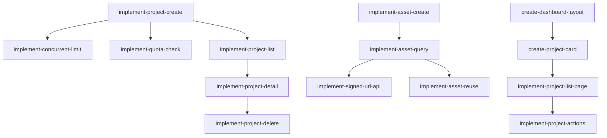

# Epic 4: 项目管理基础

**优先级**: P0  
**预计工作量**: 6 人日  
**Feature 数量**: 3

---

## Feature 4.1: 项目 CRUD API

### Change 4.1.1: 实现项目创建 API

**Change ID**: `implement-project-create`

**Goal**: 创建项目并启动生成任务

**Scope**:
- 包含: project.createAndGenerate tRPC mutation、输入校验、并发限制、额度检查
- 不包含: Inngest 事件发送（在 Epic 9）

**Files Likely Affected**:
- `/server/routers/project.ts`
- `/lib/db/project.ts`
- `/lib/validation/project.ts`
- `/lib/quota/checker.ts`

**Dependencies**: `integrate-auth-trpc`, `define-core-schema`

**Acceptance Criteria**:
- Given 用户已登录且额度充足
- When 提交有效输入
- Then 创建 Project 并返回 projectId

**Estimated Size**: M

**Estimated LOC**: 800

**Priority**: P0

---

### Change 4.1.2: 实现项目列表 API

**Change ID**: `implement-project-list`

**Goal**: 查询用户的项目列表

**Scope**:
- 包含: project.list query、分页、状态筛选、排序
- 不包含: 全文搜索

**Files Likely Affected**:
- `/server/routers/project.ts`
- `/lib/db/project-query.ts`

**Dependencies**: `implement-project-create`

**Acceptance Criteria**:
- Given 用户有多个项目
- When 请求列表（limit=10）
- Then 返回最新 10 个项目

**Estimated Size**: M

**Estimated LOC**: 600

**Priority**: P0

---

### Change 4.1.3: 实现项目详情 API

**Change ID**: `implement-project-detail`

**Goal**: 查询单个项目的完整信息

**Scope**:
- 包含: project.getById query、关联查询 Job、Storyboard、Assets
- 不包含: 嵌套资源的深度查询

**Files Likely Affected**:
- `/server/routers/project.ts`
- `/lib/db/project-query.ts`

**Dependencies**: `implement-project-permission`

**Acceptance Criteria**:
- Given 项目 ID
- When 用户有权限
- Then 返回项目完整信息

**Estimated Size**: S

**Estimated LOC**: 500

**Priority**: P0

---

### Change 4.1.4: 实现项目删除 API

**Change ID**: `implement-project-delete`

**Goal**: 删除项目及关联资源

**Scope**:
- 包含: project.delete mutation、软删除、Asset 标记删除
- 不包含: 硬删除和物理文件清理（在 Epic 3）

**Files Likely Affected**:
- `/server/routers/project.ts`
- `/lib/db/project-delete.ts`

**Dependencies**: `implement-project-detail`

**Acceptance Criteria**:
- Given 项目 ID
- When 用户是 owner
- Then 项目标记删除，Assets 标记删除

**Estimated Size**: M

**Estimated LOC**: 700

**Priority**: P1

---

### Change 4.1.5: 实现并发限制检查

**Change ID**: `implement-concurrent-limit`

**Goal**: 限制用户同时运行的生成任务数

**Scope**:
- 包含: 查询用户运行中任务数、限制为 1
- 不包含: 动态配置限制数

**Files Likely Affected**:
- `/lib/concurrent/checker.ts`
- `/lib/db/job-query.ts`

**Dependencies**: `implement-project-create`

**Acceptance Criteria**:
- Given 用户已有 1 个运行中任务
- When 尝试创建新任务
- Then 返回 CONCURRENT_LIMIT_EXCEEDED

**Estimated Size**: S

**Estimated LOC**: 400

**Priority**: P0

---

### Change 4.1.6: 实现额度检查

**Change ID**: `implement-quota-check`

**Goal**: 检查用户每日免费额度

**Scope**:
- 包含: 每日额度计算、重置逻辑、管理员豁免
- 不包含: 付费套餐

**Files Likely Affected**:
- `/lib/quota/checker.ts`
- `/lib/quota/calculator.ts`
- `/lib/db/usage-query.ts`

**Dependencies**: `implement-project-create`

**Acceptance Criteria**:
- Given 用户今日已生成 1 个视频（免费额度）
- When 再次尝试生成
- Then 返回 QUOTA_EXCEEDED

**Estimated Size**: M

**Estimated LOC**: 600

**Priority**: P0

---

## Feature 4.2: 资产管理 API

### Change 4.2.1: 实现资产创建

**Change ID**: `implement-asset-create`

**Goal**: 创建 Asset 记录

**Scope**:
- 包含: asset.create mutation、元数据保存、关联项目
- 不包含: 文件上传（在 Provider）

**Files Likely Affected**:
- `/server/routers/asset.ts`
- `/lib/db/asset.ts`

**Dependencies**: `define-core-schema`, `implement-r2-storage`

**Acceptance Criteria**:
- Given 文件已上传 R2
- When 创建 Asset 记录
- Then 保存 key、type、metadata

**Estimated Size**: S

**Estimated LOC**: 500

**Priority**: P0

---

### Change 4.2.2: 实现资产查询

**Change ID**: `implement-asset-query`

**Goal**: 查询项目的资产列表

**Scope**:
- 包含: asset.listByProject query、按类型筛选
- 不包含: 分页（资产数量有限）

**Files Likely Affected**:
- `/server/routers/asset.ts`
- `/lib/db/asset-query.ts`

**Dependencies**: `implement-asset-create`, `implement-asset-permission`

**Acceptance Criteria**:
- Given 项目 ID
- When 查询资产
- Then 返回所有关联资产

**Estimated Size**: S

**Estimated LOC**: 400

**Priority**: P0

---

### Change 4.2.3: 实现签名 URL API

**Change ID**: `implement-signed-url-api`

**Goal**: 为前端提供签名 URL

**Scope**:
- 包含: asset.getSignedUrl query、权限校验、purpose 区分
- 不包含: 公开分享

**Files Likely Affected**:
- `/server/routers/asset.ts`
- `/lib/db/asset-query.ts`

**Dependencies**: `implement-signed-url`, `implement-asset-query`

**Acceptance Criteria**:
- Given Asset ID 和 purpose=preview
- When 用户有权限
- Then 返回 10 分钟有效签名 URL

**Estimated Size**: S

**Estimated LOC**: 500

**Priority**: P0

---

### Change 4.2.4: 实现资产复用查询

**Change ID**: `implement-asset-reuse`

**Goal**: 通过 textHash 查找可复用音频

**Scope**:
- 包含: findReusableAudio、checksum 匹配
- 不包含: 跨用户复用

**Files Likely Affected**:
- `/lib/db/asset-reuse.ts`

**Dependencies**: `implement-asset-query`

**Acceptance Criteria**:
- Given textHash + voiceId 组合
- When 查询可复用音频
- Then 返回已存在的 Asset 或 null

**Estimated Size**: S

**Estimated LOC**: 400

**Priority**: P0

---

## Feature 4.3: Dashboard 页面

### Change 4.3.1: 创建 Dashboard 布局

**Change ID**: `create-dashboard-layout`

**Goal**: Dashboard 页面布局和导航

**Scope**:
- 包含: 顶部导航、侧边栏、用户头像、退出按钮
- 不包含: 项目列表内容

**Files Likely Affected**:
- `/app/dashboard/layout.tsx`
- `/components/layout/dashboard-nav.tsx`
- `/components/layout/user-menu.tsx`

**Dependencies**: `implement-session-management`

**Acceptance Criteria**:
- Given 用户已登录
- When 访问 /dashboard
- Then 显示导航和用户信息

**Estimated Size**: M

**Estimated LOC**: 600

**Priority**: P0

---

### Change 4.3.2: 实现项目卡片组件

**Change ID**: `create-project-card`

**Goal**: 项目列表卡片 UI

**Scope**:
- 包含: 缩略图、标题、状态、时间、操作按钮
- 不包含: 详细信息弹窗

**Files Likely Affected**:
- `/components/project/project-card.tsx`
- `/components/project/status-badge.tsx`

**Dependencies**: `create-dashboard-layout`

**Acceptance Criteria**:
- Given 项目数据
- When 渲染卡片
- Then 显示所有必要信息

**Estimated Size**: M

**Estimated LOC**: 700

**Priority**: P0

---

### Change 4.3.3: 实现项目列表页

**Change ID**: `implement-project-list-page`

**Goal**: Dashboard 主页展示项目列表

**Scope**:
- 包含: 列表渲染、Loading、Empty、Error 状态、筛选器
- 不包含: 无限滚动（使用分页）

**Files Likely Affected**:
- `/app/dashboard/page.tsx`
- `/components/project/project-list.tsx`
- `/components/project/project-filters.tsx`

**Dependencies**: `implement-project-list`, `create-project-card`

**Acceptance Criteria**:
- Given 用户有项目
- When 进入 Dashboard
- Then 显示项目列表

**Estimated Size**: M

**Estimated LOC**: 800

**Priority**: P0

---

### Change 4.3.4: 实现项目操作

**Change ID**: `implement-project-actions`

**Goal**: 删除、重试等操作

**Scope**:
- 包含: 删除确认弹窗、重试按钮、取消按钮
- 不包含: 批量操作

**Files Likely Affected**:
- `/components/project/project-actions.tsx`
- `/components/project/delete-dialog.tsx`

**Dependencies**: `implement-project-delete`, `implement-project-list-page`

**Acceptance Criteria**:
- Given 项目卡片
- When 点击删除
- Then 显示确认弹窗，确认后删除

**Estimated Size**: M

**Estimated LOC**: 600

**Priority**: P1

---

## Epic 4 依赖图

---

## 验证清单

Epic 4 完成后需验证：

- [ ] 可以成功创建项目
- [ ] 项目列表正确显示
- [ ] 项目详情查询成功
- [ ] 并发限制生效（同时只能 1 个任务）
- [ ] 每日额度限制生效
- [ ] 管理员不受额度限制
- [ ] Asset 创建成功
- [ ] 签名 URL 可访问
- [ ] 音频复用查询正确
- [ ] Dashboard 页面正常渲染
- [ ] 项目卡片显示正确
- [ ] 删除项目成功
- [ ] 所有 Loading/Empty/Error 状态正常
