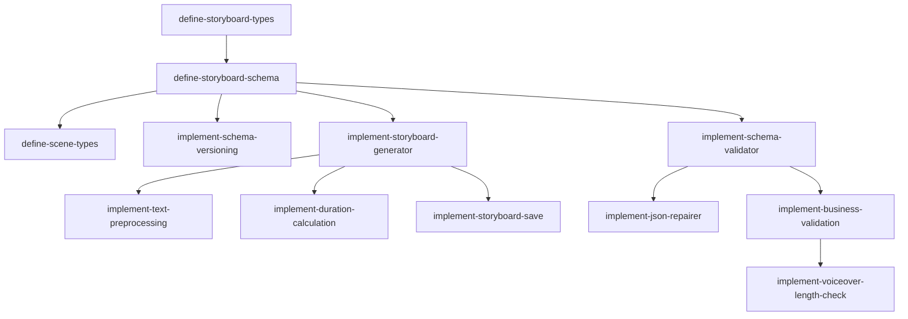

# Epic 5: Storyboard 生成

**优先级**: P0  
**预计工作量**: 7 人日  
**Feature 数量**: 3

---

## Feature 5.1: Storyboard Schema

### Change 5.1.1: 定义 Storyboard TypeScript 类型

**Change ID**: `define-storyboard-types`

**Goal**: 定义完整 Storyboard 数据结构

**Scope**:
- 包含: Storyboard、Scene、Visual、Voiceover、Animation 类型
- 不包含: Zod Schema（下一个 Change）

**Files Likely Affected**:
- `/lib/storyboard/types.ts`
- `/lib/storyboard/scene-types.ts`

**Dependencies**: `setup-project-structure`

**Acceptance Criteria**:
- Given Storyboard 类型已定义
- When 使用类型
- Then TypeScript 类型检查通过

**Estimated Size**: M

**Estimated LOC**: 800

**Priority**: P0

---

### Change 5.1.2: 定义 Storyboard Zod Schema

**Change ID**: `define-storyboard-schema`

**Goal**: 创建运行时校验 Schema

**Scope**:
- 包含: 所有类型的 Zod Schema、严格校验规则
- 不包含: 业务逻辑校验

**Files Likely Affected**:
- `/lib/storyboard/schema.ts`
- `/lib/storyboard/validation.ts`

**Dependencies**: `define-storyboard-types`

**Acceptance Criteria**:
- Given 合法 Storyboard JSON
- When 使用 Zod parse
- Then 校验通过

**Estimated Size**: M

**Estimated LOC**: 900

**Priority**: P0

---

### Change 5.1.3: 定义支持的 Scene Types

**Change ID**: `define-scene-types`

**Goal**: 明确第一版支持的 7 种 scene type

**Scope**:
- 包含: title、concept、bullet_list、process、comparison、timeline、summary
- 不包含: 复杂图表、自定义 type

**Files Likely Affected**:
- `/lib/storyboard/scene-types.ts`
- `/lib/storyboard/templates.ts`

**Dependencies**: `define-storyboard-schema`

**Acceptance Criteria**:
- Given scene type 枚举
- When LLM 生成其他 type
- Then Schema 校验失败

**Estimated Size**: S

**Estimated LOC**: 400

**Priority**: P0

---

### Change 5.1.4: 实现 Schema 版本管理

**Change ID**: `implement-schema-versioning`

**Goal**: 支持 Storyboard Schema 版本演进

**Scope**:
- 包含: schemaVersion 字段、版本兼容性检查
- 不包含: 自动迁移

**Files Likely Affected**:
- `/lib/storyboard/version.ts`
- `/lib/storyboard/migration.ts`

**Dependencies**: `define-storyboard-schema`

**Acceptance Criteria**:
- Given Storyboard 包含 schemaVersion
- When 检查兼容性
- Then 返回是否支持该版本

**Estimated Size**: S

**Estimated LOC**: 400

**Priority**: P1

---

## Feature 5.2: LLM 分镜生成

### Change 5.2.1: 实现 Storyboard Generator

**Change ID**: `implement-storyboard-generator`

**Goal**: 调用 LLM 生成 Storyboard

**Scope**:
- 包含: 调用 LLM Provider、构造 prompt、解析响应
- 不包含: 校验和修复（下一个 Feature）

**Files Likely Affected**:
- `/lib/storyboard/generator.ts`
- `/lib/storyboard/llm-adapter.ts`

**Dependencies**: `create-storyboard-prompt`, `define-storyboard-schema`

**Acceptance Criteria**:
- Given 用户输入文本
- When 调用 generateStoryboard
- Then 返回 JSON 字符串

**Estimated Size**: M

**Estimated LOC**: 700

**Priority**: P0

---

### Change 5.2.2: 实现文本预处理

**Change ID**: `implement-text-preprocessing`

**Goal**: 清理和格式化输入文本

**Scope**:
- 包含: 去除多余空格、换行、特殊字符、长度截断
- 不包含: 内容审核

**Files Likely Affected**:
- `/lib/text/preprocessor.ts`
- `/lib/text/cleaner.ts`

**Dependencies**: `implement-storyboard-generator`

**Acceptance Criteria**:
- Given 包含多余空格的文本
- When 预处理
- Then 返回清理后的文本

**Estimated Size**: S

**Estimated LOC**: 400

**Priority**: P0

---

### Change 5.2.3: 实现目标时长计算

**Change ID**: `implement-duration-calculation`

**Goal**: 根据目标时长决定 scene 数量

**Scope**:
- 包含: 1min → 3-5 scenes, 3min → 6-10 scenes, 5min → 10-16 scenes
- 不包含: 动态调整

**Files Likely Affected**:
- `/lib/storyboard/duration-calculator.ts`

**Dependencies**: `implement-storyboard-generator`

**Acceptance Criteria**:
- Given 目标时长 180 秒
- When 计算 scene 数量
- Then 返回 6-10 范围

**Estimated Size**: S

**Estimated LOC**: 300

**Priority**: P0

---

### Change 5.2.4: 实现 Storyboard 保存

**Change ID**: `implement-storyboard-save`

**Goal**: 保存 StoryboardVersion 和 Scene 到数据库

**Scope**:
- 包含: 创建 StoryboardVersion、拆分保存 Scenes、上传 JSON 到 R2
- 不包含: 更新操作

**Files Likely Affected**:
- `/lib/db/storyboard.ts`
- `/lib/db/scene.ts`

**Dependencies**: `implement-storyboard-generator`, `define-core-schema`

**Acceptance Criteria**:
- Given 生成的 Storyboard
- When 保存到数据库
- Then StoryboardVersion 和所有 Scenes 都已创建

**Estimated Size**: M

**Estimated LOC**: 800

**Priority**: P0

---

## Feature 5.3: JSON 校验与修复

### Change 5.3.1: 实现 Schema 校验器

**Change ID**: `implement-schema-validator`

**Goal**: 使用 Zod 校验 LLM 输出

**Scope**:
- 包含: 解析 JSON、Zod 校验、收集错误信息
- 不包含: 修复逻辑

**Files Likely Affected**:
- `/lib/storyboard/validator.ts`
- `/lib/storyboard/errors.ts`

**Dependencies**: `define-storyboard-schema`

**Acceptance Criteria**:
- Given LLM 返回的 JSON
- When 校验
- Then 返回校验结果和错误列表

**Estimated Size**: M

**Estimated LOC**: 600

**Priority**: P0

---

### Change 5.3.2: 实现 JSON 修复器

**Change ID**: `implement-json-repairer`

**Goal**: 自动修复常见 JSON 错误

**Scope**:
- 包含: 调用 LLM repair、最多重试 2 次、错误提示优化
- 不包含: 手动修复界面

**Files Likely Affected**:
- `/lib/storyboard/repairer.ts`
- `/lib/prompts/repair.ts`

**Dependencies**: `implement-schema-validator`, `create-storyboard-prompt`

**Acceptance Criteria**:
- Given 不合法的 Storyboard JSON
- When 调用 repair
- Then 返回修复后的合法 JSON 或失败

**Estimated Size**: M

**Estimated LOC**: 700

**Priority**: P0

---

### Change 5.3.3: 实现业务规则校验

**Change ID**: `implement-business-validation`

**Goal**: 校验业务规则（非 Schema）

**Scope**:
- 包含: scene 数量合理性、voiceover 长度限制、重复 scene key 检查
- 不包含: 内容质量评分

**Files Likely Affected**:
- `/lib/storyboard/business-validator.ts`

**Dependencies**: `implement-schema-validator`

**Acceptance Criteria**:
- Given Storyboard 有 50 个 scenes
- When 业务校验
- Then 返回 scene 数量过多错误

**Estimated Size**: M

**Estimated LOC**: 600

**Priority**: P0

---

### Change 5.3.4: 实现 voiceover 长度检查

**Change ID**: `implement-voiceover-length-check`

**Goal**: 确保单个 scene voiceover 不超过 TTS 限制

**Scope**:
- 包含: 字数统计、超限提示、建议拆分
- 不包含: 自动拆分

**Files Likely Affected**:
- `/lib/storyboard/voiceover-validator.ts`

**Dependencies**: `implement-business-validation`

**Acceptance Criteria**:
- Given scene voiceover 超过 10000 字
- When 校验
- Then 返回 VOICEOVER_TOO_LONG 错误

**Estimated Size**: S

**Estimated LOC**: 400

**Priority**: P0

---

## Epic 5 依赖图

---

## 验证清单

Epic 5 完成后需验证：

- [ ] Storyboard 类型定义完整
- [ ] Zod Schema 校验准确
- [ ] 支持 7 种 scene type
- [ ] Schema 版本管理正常
- [ ] LLM 成功生成 Storyboard
- [ ] 文本预处理正确
- [ ] 目标时长转 scene 数量准确
- [ ] StoryboardVersion 保存成功
- [ ] Scene 拆分保存正确
- [ ] JSON 校验返回准确错误
- [ ] Repair 可以修复常见错误
- [ ] Repair 失败后正确提示
- [ ] 业务规则校验生效
- [ ] Voiceover 长度检查正确
