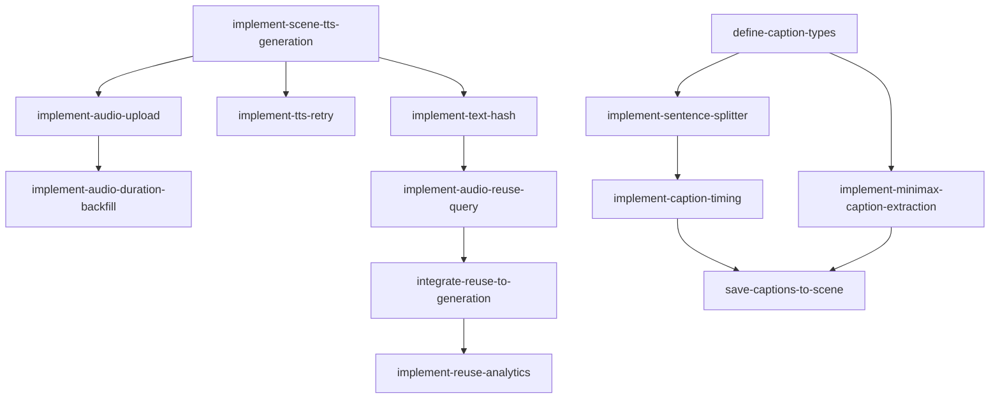

# Epic 6: TTS 音频生成

**优先级**: P0  
**预计工作量**: 6 人日  
**Feature 数量**: 3

---

## Feature 6.1: 音频生成流程

### Change 6.1.1: 实现逐 Scene TTS 生成

**Change ID**: `implement-scene-tts-generation`

**Goal**: 为每个 scene 单独生成音频

**Scope**:
- 包含: 遍历 scenes、调用 TTS Provider、处理异常
- 不包含: 并行生成、复用检查

**Files Likely Affected**:
- `/lib/tts/scene-generator.ts`
- `/lib/tts/batch-processor.ts`

**Dependencies**: `implement-minimax-tts`, `implement-storyboard-save`

**Acceptance Criteria**:
- Given Storyboard 有 5 个 scenes
- When 逐个生成 TTS
- Then 每个 scene 都有对应音频

**Estimated Size**: M

**Estimated LOC**: 800

**Priority**: P0

---

### Change 6.1.2: 实现音频上传流程

**Change ID**: `implement-audio-upload`

**Goal**: 将 TTS 生成的音频上传到 R2

**Scope**:
- 包含: 生成唯一 key、上传、保存 Asset 记录
- 不包含: 断点续传

**Files Likely Affected**:
- `/lib/tts/audio-uploader.ts`
- `/lib/asset/audio-asset.ts`

**Dependencies**: `implement-scene-tts-generation`, `implement-asset-create`

**Acceptance Criteria**:
- Given 音频 Buffer
- When 上传
- Then R2 保存成功，Asset 记录已创建

**Estimated Size**: M

**Estimated LOC**: 700

**Priority**: P0

---

### Change 6.1.3: 实现音频时长回填

**Change ID**: `implement-audio-duration-backfill`

**Goal**: 将音频时长写入 Scene 表

**Scope**:
- 包含: 解析 durationMs、更新 Scene.durationMs
- 不包含: 批量更新

**Files Likely Affected**:
- `/lib/db/scene-update.ts`
- `/lib/tts/duration-backfill.ts`

**Dependencies**: `implement-audio-duration-parser`, `implement-audio-upload`

**Acceptance Criteria**:
- Given 音频已上传且解析出时长
- When 回填到 Scene
- Then Scene.durationMs 已更新

**Estimated Size**: S

**Estimated LOC**: 400

**Priority**: P0

---

### Change 6.1.4: 实现 TTS 失败重试

**Change ID**: `implement-tts-retry`

**Goal**: TTS 失败时智能重试

**Scope**:
- 包含: 判断可重试错误、指数退避、最多 3 次重试
- 不包含: 跨 scene 重试

**Files Likely Affected**:
- `/lib/tts/retry-handler.ts`

**Dependencies**: `implement-scene-tts-generation`

**Acceptance Criteria**:
- Given TTS 调用超时
- When 判断为可重试
- Then 最多重试 3 次

**Estimated Size**: S

**Estimated LOC**: 500

**Priority**: P0

---

## Feature 6.2: 音频复用机制

### Change 6.2.1: 实现文本哈希计算

**Change ID**: `implement-text-hash`

**Goal**: 为 voiceover 文本生成稳定哈希

**Scope**:
- 包含: SHA256 哈希、归一化文本（去空格、标点）
- 不包含: 语义相似度

**Files Likely Affected**:
- `/lib/tts/text-hasher.ts`

**Dependencies**: `implement-scene-tts-generation`

**Acceptance Criteria**:
- Given 相同文本（忽略空格）
- When 计算哈希
- Then 返回相同哈希值

**Estimated Size**: S

**Estimated LOC**: 300

**Priority**: P0

---

### Change 6.2.2: 实现音频复用查询

**Change ID**: `implement-audio-reuse-query`

**Goal**: 查询可复用的音频资产

**Scope**:
- 包含: 按 textHash + voiceId + speed 查询
- 不包含: 跨用户复用

**Files Likely Affected**:
- `/lib/db/audio-reuse.ts`

**Dependencies**: `implement-text-hash`, `implement-asset-reuse`

**Acceptance Criteria**:
- Given textHash + voiceId 已存在
- When 查询复用
- Then 返回已有 Asset

**Estimated Size**: S

**Estimated LOC**: 400

**Priority**: P0

---

### Change 6.2.3: 集成复用到生成流程

**Change ID**: `integrate-reuse-to-generation`

**Goal**: 生成前先检查复用

**Scope**:
- 包含: 修改 scene-generator、复用时跳过 TTS 调用
- 不包含: 复用统计

**Files Likely Affected**:
- `/lib/tts/scene-generator.ts`

**Dependencies**: `implement-audio-reuse-query`

**Acceptance Criteria**:
- Given scene voiceover 已生成过
- When 再次生成
- Then 直接复用，不调用 TTS

**Estimated Size**: M

**Estimated LOC**: 600

**Priority**: P0

---

### Change 6.2.4: 实现复用统计埋点

**Change ID**: `implement-reuse-analytics`

**Goal**: 记录音频复用情况

**Scope**:
- 包含: 复用次数、节省成本估算
- 不包含: 复杂报表

**Files Likely Affected**:
- `/lib/analytics/tts-reuse.ts`

**Dependencies**: `integrate-reuse-to-generation`

**Acceptance Criteria**:
- Given 音频被复用
- When 记录埋点
- Then 保存复用事件

**Estimated Size**: S

**Estimated LOC**: 300

**Priority**: P1

---

## Feature 6.3: 字幕生成

### Change 6.3.1: 定义字幕数据结构

**Change ID**: `define-caption-types`

**Goal**: 定义句子级字幕类型

**Scope**:
- 包含: CaptionSegment 类型、时间戳格式
- 不包含: 逐字级字幕

**Files Likely Affected**:
- `/lib/captions/types.ts`

**Dependencies**: `setup-project-structure`

**Acceptance Criteria**:
- Given 字幕类型已定义
- When 使用类型
- Then TypeScript 检查通过

**Estimated Size**: S

**Estimated LOC**: 300

**Priority**: P0

---

### Change 6.3.2: 实现句子分割

**Change ID**: `implement-sentence-splitter`

**Goal**: 将 voiceover 拆分为句子

**Scope**:
- 包含: 中文句号、问号、感叹号分句
- 不包含: 复杂语义分句

**Files Likely Affected**:
- `/lib/captions/sentence-splitter.ts`

**Dependencies**: `define-caption-types`

**Acceptance Criteria**:
- Given 包含多个句子的文本
- When 分句
- Then 返回句子数组

**Estimated Size**: S

**Estimated LOC**: 400

**Priority**: P0

---

### Change 6.3.3: 实现字幕时间戳计算

**Change ID**: `implement-caption-timing`

**Goal**: 为每个句子计算时间戳

**Scope**:
- 包含: 按字数比例分配时间、考虑停顿
- 不包含: 精确语音识别对齐

**Files Likely Affected**:
- `/lib/captions/timing-calculator.ts`

**Dependencies**: `implement-sentence-splitter`

**Acceptance Criteria**:
- Given 句子数组和总时长
- When 计算时间戳
- Then 每个句子有 startMs 和 endMs

**Estimated Size**: M

**Estimated LOC**: 600

**Priority**: P0

---

### Change 6.3.4: 实现 MiniMax 字幕提取

**Change ID**: `implement-minimax-caption-extraction`

**Goal**: 从 MiniMax TTS 响应提取字幕

**Scope**:
- 包含: 解析 sentence 级别时间戳
- 不包含: word 级别提取（第一版不需要）

**Files Likely Affected**:
- `/lib/providers/tts/minimax-caption.ts`

**Dependencies**: `implement-minimax-tts`, `define-caption-types`

**Acceptance Criteria**:
- Given MiniMax 返回字幕时间戳
- When 解析
- Then 返回标准 CaptionSegment 数组

**Estimated Size**: M

**Estimated LOC**: 700

**Priority**: P0

---

### Change 6.3.5: 保存字幕到 Scene

**Change ID**: `save-captions-to-scene`

**Goal**: 将字幕 JSON 保存到 Scene 表

**Scope**:
- 包含: 更新 Scene.captionsJson
- 不包含: 单独字幕文件

**Files Likely Affected**:
- `/lib/db/scene-captions.ts`

**Dependencies**: `implement-caption-timing`, `implement-audio-duration-backfill`

**Acceptance Criteria**:
- Given 字幕已生成
- When 保存到 Scene
- Then Scene.captionsJson 已更新

**Estimated Size**: S

**Estimated LOC**: 400

**Priority**: P0

---

## Epic 6 依赖图

---

## 验证清单

Epic 6 完成后需验证：

- [ ] 逐 scene 生成 TTS 成功
- [ ] 音频上传到 R2 成功
- [ ] Asset 记录正确创建
- [ ] Scene.durationMs 正确回填
- [ ] TTS 失败可以重试
- [ ] 文本哈希计算稳定
- [ ] 相同文本复用音频
- [ ] 复用时不调用 TTS API
- [ ] 复用埋点正确记录
- [ ] 句子分割准确
- [ ] 字幕时间戳计算合理
- [ ] MiniMax 字幕提取正确
- [ ] Scene.captionsJson 正确保存
- [ ] 所有 scene 都有音频和字幕
