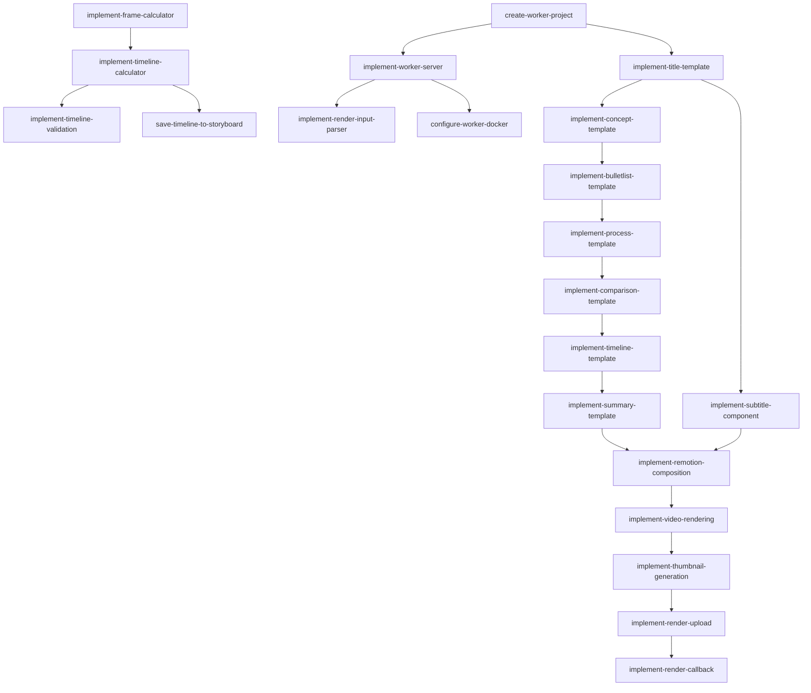

# Epic 7: 渲染流程

**优先级**: P0  
**预计工作量**: 12 人日  
**Feature 数量**: 4

---

## Feature 7.1: Timeline 计算

### Change 7.1.1: 实现帧数计算器

**Change ID**: `implement-frame-calculator`

**Goal**: 将音频时长转换为视频帧数

**Scope**:
- 包含: fps=30、durationMs 转 frames、四舍五入
- 不包含: 动态 fps

**Files Likely Affected**:
- `/lib/timeline/frame-calculator.ts`

**Dependencies**: `setup-project-structure`

**Acceptance Criteria**:
- Given durationMs=1000, fps=30
- When 计算帧数
- Then 返回 30 frames

**Estimated Size**: S

**Estimated LOC**: 300

**Priority**: P0

---

### Change 7.1.2: 实现 Timeline 计算器

**Change ID**: `implement-timeline-calculator`

**Goal**: 为所有 scene 计算 timeline

**Scope**:
- 包含: startFrame、durationFrames、enter/exit buffer
- 不包含: 过场动画

**Files Likely Affected**:
- `/lib/timeline/calculator.ts`
- `/lib/timeline/buffer-config.ts`

**Dependencies**: `implement-frame-calculator`, `save-captions-to-scene`

**Acceptance Criteria**:
- Given 所有 scene 有 durationMs
- When 计算 timeline
- Then 每个 scene 有 startFrame 和 durationFrames

**Estimated Size**: M

**Estimated LOC**: 700

**Priority**: P0

---

### Change 7.1.3: 实现 Timeline 校验

**Change ID**: `implement-timeline-validation`

**Goal**: 校验 timeline 完整性和合理性

**Scope**:
- 包含: 检查 durationMs 存在、无重叠、顺序正确
- 不包含: 自动修复

**Files Likely Affected**:
- `/lib/timeline/validator.ts`

**Dependencies**: `implement-timeline-calculator`

**Acceptance Criteria**:
- Given scene 缺少 durationMs
- When 校验 timeline
- Then 返回错误

**Estimated Size**: S

**Estimated LOC**: 500

**Priority**: P0

---

### Change 7.1.4: 保存 Timeline 到 Storyboard

**Change ID**: `save-timeline-to-storyboard`

**Goal**: 回填 timeline 到 Scene 和 StoryboardVersion

**Scope**:
- 包含: 批量更新 Scenes、更新 StoryboardVersion.totalFrames
- 不包含: 版本历史

**Files Likely Affected**:
- `/lib/db/timeline-update.ts`

**Dependencies**: `implement-timeline-calculator`

**Acceptance Criteria**:
- Given timeline 已计算
- When 保存
- Then Scenes 和 StoryboardVersion 已更新

**Estimated Size**: M

**Estimated LOC**: 600

**Priority**: P0

---

## Feature 7.2: Remotion Worker 搭建

### Change 7.2.1: 创建 Worker 项目结构

**Change ID**: `create-worker-project`

**Goal**: 搭建独立 Remotion Worker 项目

**Scope**:
- 包含: 独立目录、package.json、tsconfig、Remotion 配置
- 不包含: 模板实现

**Files Likely Affected**:
- `/worker/package.json`
- `/worker/tsconfig.json`
- `/worker/remotion.config.ts`
- `/worker/src/Root.tsx`

**Dependencies**: 无（独立项目）

**Acceptance Criteria**:
- Given Worker 项目已创建
- When 执行 npm run dev
- Then Remotion Studio 启动成功

**Estimated Size**: M

**Estimated LOC**: 500

**Priority**: P0

---

### Change 7.2.2: 实现 Worker HTTP Server

**Change ID**: `implement-worker-server`

**Goal**: Worker 接收渲染请求的 HTTP 服务

**Scope**:
- 包含: Express server、/render endpoint、内部 token 验证
- 不包含: HTTPS、负载均衡

**Files Likely Affected**:
- `/worker/src/server.ts`
- `/worker/src/middleware/auth.ts`

**Dependencies**: `create-worker-project`

**Acceptance Criteria**:
- Given Worker server 启动
- When 发送 POST /render
- Then 接收请求并返回响应

**Estimated Size**: M

**Estimated LOC**: 700

**Priority**: P0

---

### Change 7.2.3: 实现渲染输入解析

**Change ID**: `implement-render-input-parser`

**Goal**: 解析并校验渲染请求参数

**Scope**:
- 包含: Storyboard 校验、资源 URL 校验、配置校验
- 不包含: Storyboard 修复

**Files Likely Affected**:
- `/worker/src/parser/input-parser.ts`
- `/worker/src/parser/storyboard-validator.ts`

**Dependencies**: `implement-worker-server`

**Acceptance Criteria**:
- Given 渲染请求
- When 解析输入
- Then 返回结构化参数

**Estimated Size**: M

**Estimated LOC**: 600

**Priority**: P0

---

### Change 7.2.4: 配置 Docker 环境

**Change ID**: `configure-worker-docker`

**Goal**: Worker Docker 镜像和部署配置

**Scope**:
- 包含: Dockerfile、中文字体、FFmpeg、Chromium
- 不包含: Kubernetes 配置

**Files Likely Affected**:
- `/worker/Dockerfile`
- `/worker/.dockerignore`
- `/worker/fonts/` (中文字体)

**Dependencies**: `implement-worker-server`

**Acceptance Criteria**:
- Given Dockerfile 已配置
- When 构建镜像
- Then 包含所有依赖且可运行

**Estimated Size**: M

**Estimated LOC**: 400

**Priority**: P0

---

## Feature 7.3: PPT 模板实现

### Change 7.3.1: 实现 Title 模板

**Change ID**: `implement-title-template`

**Goal**: 标题页模板

**Scope**:
- 包含: 大标题、副标题、背景色
- 不包含: 复杂动画

**Files Likely Affected**:
- `/worker/src/templates/Title.tsx`
- `/worker/src/templates/styles/title.module.css`

**Dependencies**: `create-worker-project`

**Acceptance Criteria**:
- Given title scene 数据
- When 渲染
- Then 显示标题页

**Estimated Size**: M

**Estimated LOC**: 600

**Priority**: P0

---

### Change 7.3.2: 实现 Concept 模板

**Change ID**: `implement-concept-template`

**Goal**: 概念卡片模板

**Scope**:
- 包含: 概念名称、解释、图标或图示区域
- 不包含: 自定义图标

**Files Likely Affected**:
- `/worker/src/templates/Concept.tsx`

**Dependencies**: `implement-title-template`

**Acceptance Criteria**:
- Given concept scene 数据
- When 渲染
- Then 显示概念卡片

**Estimated Size**: M

**Estimated LOC**: 700

**Priority**: P0

---

### Change 7.3.3: 实现 BulletList 模板

**Change ID**: `implement-bulletlist-template`

**Goal**: 列表页模板

**Scope**:
- 包含: 标题、多行列表项、逐项进入动画
- 不包含: 嵌套列表

**Files Likely Affected**:
- `/worker/src/templates/BulletList.tsx`

**Dependencies**: `implement-concept-template`

**Acceptance Criteria**:
- Given bullet_list scene 数据
- When 渲染
- Then 显示列表页

**Estimated Size**: M

**Estimated LOC**: 800

**Priority**: P0

---

### Change 7.3.4: 实现 Process 模板

**Change ID**: `implement-process-template`

**Goal**: 流程图模板

**Scope**:
- 包含: 步骤卡片、箭头连接、水平布局
- 不包含: 复杂流程图

**Files Likely Affected**:
- `/worker/src/templates/Process.tsx`

**Dependencies**: `implement-bulletlist-template`

**Acceptance Criteria**:
- Given process scene 数据
- When 渲染
- Then 显示流程图

**Estimated Size**: M

**Estimated LOC**: 800

**Priority**: P0

---

### Change 7.3.5: 实现 Comparison 模板

**Change ID**: `implement-comparison-template`

**Goal**: 对比表格模板

**Scope**:
- 包含: 左右两栏、标题、对比项
- 不包含: 多列对比

**Files Likely Affected**:
- `/worker/src/templates/Comparison.tsx`

**Dependencies**: `implement-process-template`

**Acceptance Criteria**:
- Given comparison scene 数据
- When 渲染
- Then 显示对比表格

**Estimated Size**: M

**Estimated LOC**: 700

**Priority**: P0

---

### Change 7.3.6: 实现 Timeline 模板

**Change ID**: `implement-timeline-template`

**Goal**: 时间线模板

**Scope**:
- 包含: 时间点、事件描述、垂直或水平布局
- 不包含: 复杂时间轴

**Files Likely Affected**:
- `/worker/src/templates/Timeline.tsx`

**Dependencies**: `implement-comparison-template`

**Acceptance Criteria**:
- Given timeline scene 数据
- When 渲染
- Then 显示时间线

**Estimated Size**: M

**Estimated LOC**: 700

**Priority**: P0

---

### Change 7.3.7: 实现 Summary 模板

**Change ID**: `implement-summary-template`

**Goal**: 总结页模板

**Scope**:
- 包含: 关键点总结、结束语
- 不包含: 复杂布局

**Files Likely Affected**:
- `/worker/src/templates/Summary.tsx`

**Dependencies**: `implement-timeline-template`

**Acceptance Criteria**:
- Given summary scene 数据
- When 渲染
- Then 显示总结页

**Estimated Size**: M

**Estimated LOC**: 600

**Priority**: P0

---

### Change 7.3.8: 实现字幕组件

**Change ID**: `implement-subtitle-component`

**Goal**: 通用字幕渲染组件

**Scope**:
- 包含: 句子级字幕、位置、样式、时间同步
- 不包含: 逐字高亮

**Files Likely Affected**:
- `/worker/src/components/Subtitle.tsx`
- `/worker/src/utils/subtitle-sync.ts`

**Dependencies**: `implement-title-template`

**Acceptance Criteria**:
- Given captions 数据
- When 渲染
- Then 字幕按时间显示

**Estimated Size**: M

**Estimated LOC**: 700

**Priority**: P0

---

## Feature 7.4: 视频渲染与上传

### Change 7.4.1: 实现 Remotion Composition

**Change ID**: `implement-remotion-composition`

**Goal**: 组装所有 scene 为完整视频

**Scope**:
- 包含: 根据 scene type 选择模板、拼接 timeline、音频同步
- 不包含: 过场效果

**Files Likely Affected**:
- `/worker/src/compositions/Video.tsx`
- `/worker/src/utils/scene-router.ts`

**Dependencies**: `implement-summary-template`, `implement-subtitle-component`

**Acceptance Criteria**:
- Given 完整 Storyboard
- When 渲染 Composition
- Then 所有 scene 正确显示

**Estimated Size**: L

**Estimated LOC**: 1000

**Priority**: P0

---

### Change 7.4.2: 实现视频渲染执行

**Change ID**: `implement-video-rendering`

**Goal**: 调用 Remotion bundle 和 render

**Scope**:
- 包含: bundle、renderMedia、进度回调
- 不包含: 分布式渲染

**Files Likely Affected**:
- `/worker/src/render/renderer.ts`
- `/worker/src/render/progress.ts`

**Dependencies**: `implement-remotion-composition`

**Acceptance Criteria**:
- Given 渲染请求
- When 执行渲染
- Then 生成 MP4 文件

**Estimated Size**: M

**Estimated LOC**: 800

**Priority**: P0

---

### Change 7.4.3: 实现缩略图生成

**Change ID**: `implement-thumbnail-generation`

**Goal**: 从视频生成缩略图

**Scope**:
- 包含: 提取第一帧、resize、保存为 JPEG
- 不包含: 多缩略图

**Files Likely Affected**:
- `/worker/src/thumbnail/generator.ts`

**Dependencies**: `implement-video-rendering`

**Acceptance Criteria**:
- Given 渲染完成的视频
- When 生成缩略图
- Then 保存 JPEG 文件

**Estimated Size**: S

**Estimated LOC**: 500

**Priority**: P0

---

### Change 7.4.4: 实现渲染结果上传

**Change ID**: `implement-render-upload`

**Goal**: 上传 MP4 和缩略图到 R2

**Scope**:
- 包含: 文件流上传、进度监控、重试
- 不包含: 分片上传

**Files Likely Affected**:
- `/worker/src/upload/uploader.ts`

**Dependencies**: `implement-thumbnail-generation`

**Acceptance Criteria**:
- Given 渲染完成
- When 上传文件
- Then R2 保存成功

**Estimated Size**: M

**Estimated LOC**: 700

**Priority**: P0

---

### Change 7.4.5: 实现渲染结果回调

**Change ID**: `implement-render-callback`

**Goal**: 通知主服务渲染完成

**Scope**:
- 包含: HTTP callback、重试、超时
- 不包含: Webhook 签名

**Files Likely Affected**:
- `/worker/src/callback/notifier.ts`

**Dependencies**: `implement-render-upload`

**Acceptance Criteria**:
- Given 渲染完成
- When 回调主服务
- Then 主服务更新 RenderJob 状态

**Estimated Size**: S

**Estimated LOC**: 500

**Priority**: P0

---

## Epic 7 依赖图

---

## 验证清单

Epic 7 完成后需验证：

- [ ] Timeline 计算准确
- [ ] 所有 scene 有正确 startFrame
- [ ] Timeline 校验正确
- [ ] Worker 项目可独立运行
- [ ] Worker HTTP Server 正常响应
- [ ] Docker 镜像构建成功
- [ ] 7 种模板都可渲染
- [ ] 字幕同步准确
- [ ] Composition 正确组装
- [ ] 视频渲染成功
- [ ] 缩略图生成正确
- [ ] 文件上传到 R2 成功
- [ ] 渲染完成回调主服务
- [ ] 中文字体显示正常
- [ ] 音画同步无偏移
