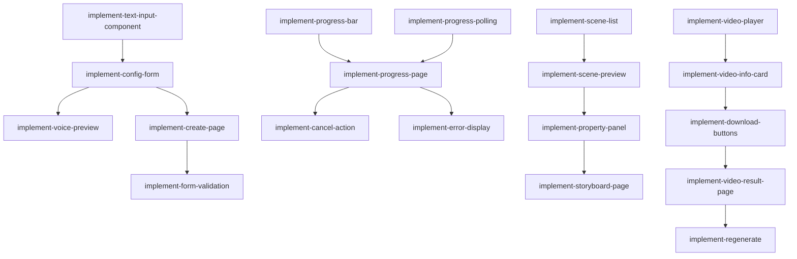

# Epic 8: 前端交互

**优先级**: P0  
**预计工作量**: 8 人日  
**Feature 数量**: 4

---

## Feature 8.1: 创建页面

### Change 8.1.1: 实现文本输入组件

**Change ID**: `implement-text-input-component`

**Goal**: 多行文本输入框，支持粘贴和字数统计

**Scope**:
- 包含: Textarea、字数实时统计、最大长度限制提示
- 不包含: 富文本编辑

**Files Likely Affected**:
- `/components/create/text-input.tsx`
- `/components/ui/textarea.tsx`

**Dependencies**: `create-dashboard-layout`

**Acceptance Criteria**:
- Given 用户输入文本
- When 超过最大字数
- Then 显示错误提示

**Estimated Size**: M

**Estimated LOC**: 600

**Priority**: P0

---

### Change 8.1.2: 实现配置表单组件

**Change ID**: `implement-config-form`

**Goal**: 生成参数配置表单

**Scope**:
- 包含: 目标对象、难度、比例、时长、语音选择器
- 不包含: 高级配置

**Files Likely Affected**:
- `/components/create/config-form.tsx`
- `/components/create/voice-selector.tsx`
- `/components/ui/select.tsx`

**Dependencies**: `implement-text-input-component`

**Acceptance Criteria**:
- Given 配置表单
- When 选择参数
- Then 表单状态更新

**Estimated Size**: M

**Estimated LOC**: 800

**Priority**: P0

---

### Change 8.1.3: 实现语音预览

**Change ID**: `implement-voice-preview`

**Goal**: 预览试听 TTS 语音

**Scope**:
- 包含: 语音列表、试听按钮、音频播放器
- 不包含: 自定义语音

**Files Likely Affected**:
- `/components/create/voice-preview.tsx`
- `/components/ui/audio-player.tsx`

**Dependencies**: `implement-config-form`, `implement-tts-voice-cache`

**Acceptance Criteria**:
- Given 语音列表
- When 点击试听
- Then 播放示例音频

**Estimated Size**: M

**Estimated LOC**: 700

**Priority**: P1

---

### Change 8.1.4: 实现创建页面主组件

**Change ID**: `implement-create-page`

**Goal**: 组装创建页面

**Scope**:
- 包含: 布局、表单集成、提交逻辑、Loading 状态
- 不包含: 草稿保存

**Files Likely Affected**:
- `/app/create/page.tsx`
- `/hooks/use-create-project.ts`

**Dependencies**: `implement-config-form`, `implement-project-create`

**Acceptance Criteria**:
- Given 表单填写完整
- When 提交
- Then 创建项目并跳转进度页

**Estimated Size**: M

**Estimated LOC**: 800

**Priority**: P0

---

### Change 8.1.5: 实现表单验证

**Change ID**: `implement-form-validation`

**Goal**: 前端表单校验

**Scope**:
- 包含: 必填项、长度限制、实时验证、错误提示
- 不包含: 异步校验

**Files Likely Affected**:
- `/lib/validation/create-form.ts`
- `/hooks/use-form-validation.ts`

**Dependencies**: `implement-create-page`

**Acceptance Criteria**:
- Given 文本为空
- When 提交
- Then 显示错误，阻止提交

**Estimated Size**: S

**Estimated LOC**: 500

**Priority**: P0

---

## Feature 8.2: 进度页面

### Change 8.2.1: 实现进度条组件

**Change ID**: `implement-progress-bar`

**Goal**: 多阶段进度条

**Scope**:
- 包含: 6 个阶段、当前阶段高亮、完成/进行中/未开始状态
- 不包含: 百分比进度

**Files Likely Affected**:
- `/components/progress/progress-bar.tsx`
- `/components/progress/stage-indicator.tsx`

**Dependencies**: `create-dashboard-layout`

**Acceptance Criteria**:
- Given 当前阶段 generating_audio
- When 渲染进度条
- Then 前 3 个阶段完成，第 4 个进行中

**Estimated Size**: M

**Estimated LOC**: 700

**Priority**: P0

---

### Change 8.2.2: 实现进度轮询

**Change ID**: `implement-progress-polling`

**Goal**: 定期查询项目状态

**Scope**:
- 包含: TanStack Query interval、2-5 秒轮询、完成后停止
- 不包含: WebSocket

**Files Likely Affected**:
- `/hooks/use-project-status.ts`

**Dependencies**: `implement-project-detail`

**Acceptance Criteria**:
- Given 项目生成中
- When 轮询
- Then 每 3 秒查询一次状态

**Estimated Size**: S

**Estimated LOC**: 500

**Priority**: P0

---

### Change 8.2.3: 实现进度页面主组件

**Change ID**: `implement-progress-page`

**Goal**: 进度展示页面

**Scope**:
- 包含: 进度条、当前步骤描述、取消按钮、错误展示
- 不包含: 实时日志

**Files Likely Affected**:
- `/app/projects/[id]/progress/page.tsx`
- `/components/progress/progress-view.tsx`

**Dependencies**: `implement-progress-bar`, `implement-progress-polling`

**Acceptance Criteria**:
- Given 项目 ID
- When 进入进度页
- Then 显示实时进度

**Estimated Size**: M

**Estimated LOC**: 800

**Priority**: P0

---

### Change 8.2.4: 实现取消操作

**Change ID**: `implement-cancel-action`

**Goal**: 取消生成任务

**Scope**:
- 包含: 取消按钮、确认弹窗、状态更新
- 不包含: 强制终止

**Files Likely Affected**:
- `/components/progress/cancel-button.tsx`
- `/hooks/use-cancel-job.ts`

**Dependencies**: `implement-progress-page`

**Acceptance Criteria**:
- Given 任务运行中
- When 点击取消并确认
- Then 任务标记为 cancelled

**Estimated Size**: S

**Estimated LOC**: 500

**Priority**: P0

---

### Change 8.2.5: 实现错误展示

**Change ID**: `implement-error-display`

**Goal**: 友好展示生成失败原因

**Scope**:
- 包含: 错误码映射、用户友好文案、重试入口
- 不包含: 错误详情展开

**Files Likely Affected**:
- `/components/progress/error-display.tsx`
- `/lib/error-messages.ts`

**Dependencies**: `implement-progress-page`

**Acceptance Criteria**:
- Given 任务失败
- When 显示错误
- Then 展示友好提示和重试按钮

**Estimated Size**: M

**Estimated LOC**: 600

**Priority**: P0

---

## Feature 8.3: 分镜预览页面

### Change 8.3.1: 实现 Scene 列表组件

**Change ID**: `implement-scene-list`

**Goal**: 左侧 scene 列表

**Scope**:
- 包含: 缩略图、序号、标题、类型、时长
- 不包含: 拖拽排序

**Files Likely Affected**:
- `/components/storyboard/scene-list.tsx`
- `/components/storyboard/scene-item.tsx`

**Dependencies**: `create-dashboard-layout`

**Acceptance Criteria**:
- Given Storyboard 数据
- When 渲染列表
- Then 显示所有 scenes

**Estimated Size**: M

**Estimated LOC**: 700

**Priority**: P0

---

### Change 8.3.2: 实现 Scene 预览组件

**Change ID**: `implement-scene-preview`

**Goal**: 中间静态预览区

**Scope**:
- 包含: 根据 scene type 渲染简化版模板
- 不包含: 动画效果

**Files Likely Affected**:
- `/components/storyboard/scene-preview.tsx`
- `/components/storyboard/preview-templates/` (7 个模板)

**Dependencies**: `implement-scene-list`

**Acceptance Criteria**:
- Given scene 数据
- When 切换 scene
- Then 预览区更新显示

**Estimated Size**: L

**Estimated LOC**: 1200

**Priority**: P0

---

### Change 8.3.3: 实现属性面板

**Change ID**: `implement-property-panel`

**Goal**: 右侧属性展示

**Scope**:
- 包含: 旁白、关键词、模板类型、音频播放、字幕预览
- 不包含: 编辑功能

**Files Likely Affected**:
- `/components/storyboard/property-panel.tsx`
- `/components/storyboard/audio-player.tsx`

**Dependencies**: `implement-scene-preview`

**Acceptance Criteria**:
- Given 选中 scene
- When 显示属性
- Then 展示完整信息

**Estimated Size**: M

**Estimated LOC**: 800

**Priority**: P0

---

### Change 8.3.4: 实现分镜预览页

**Change ID**: `implement-storyboard-page`

**Goal**: 组装分镜预览页面

**Scope**:
- 包含: 三栏布局、状态管理、导航
- 不包含: 编辑模式

**Files Likely Affected**:
- `/app/projects/[id]/storyboard/page.tsx`
- `/hooks/use-storyboard.ts`

**Dependencies**: `implement-property-panel`

**Acceptance Criteria**:
- Given 项目有 Storyboard
- When 进入预览页
- Then 显示完整分镜

**Estimated Size**: M

**Estimated LOC**: 700

**Priority**: P0

---

## Feature 8.4: 视频结果页面

### Change 8.4.1: 实现视频播放器

**Change ID**: `implement-video-player`

**Goal**: HTML5 视频播放器

**Scope**:
- 包含: 播放、暂停、进度条、音量、全屏
- 不包含: 播放速度、字幕开关

**Files Likely Affected**:
- `/components/video/video-player.tsx`
- `/components/video/controls.tsx`

**Dependencies**: `create-dashboard-layout`

**Acceptance Criteria**:
- Given 视频 URL
- When 加载播放器
- Then 可正常播放

**Estimated Size**: M

**Estimated LOC**: 800

**Priority**: P0

---

### Change 8.4.2: 实现视频信息卡片

**Change ID**: `implement-video-info-card`

**Goal**: 视频元信息展示

**Scope**:
- 包含: 标题、时长、比例、生成时间、文件大小
- 不包含: 编辑功能

**Files Likely Affected**:
- `/components/video/info-card.tsx`

**Dependencies**: `implement-video-player`

**Acceptance Criteria**:
- Given 项目数据
- When 渲染信息卡片
- Then 显示所有元信息

**Estimated Size**: S

**Estimated LOC**: 500

**Priority**: P0

---

### Change 8.4.3: 实现下载按钮

**Change ID**: `implement-download-buttons`

**Goal**: 下载 MP4 和字幕

**Scope**:
- 包含: 获取签名 URL、触发下载
- 不包含: 批量下载

**Files Likely Affected**:
- `/components/video/download-buttons.tsx`
- `/hooks/use-download.ts`

**Dependencies**: `implement-signed-url-api`

**Acceptance Criteria**:
- Given 视频已生成
- When 点击下载
- Then 浏览器开始下载

**Estimated Size**: S

**Estimated LOC**: 500

**Priority**: P0

---

### Change 8.4.4: 实现视频结果页

**Change ID**: `implement-video-result-page`

**Goal**: 组装视频结果页面

**Scope**:
- 包含: 播放器、信息、下载、重新生成、分享（置灰）
- 不包含: 公开分享

**Files Likely Affected**:
- `/app/projects/[id]/result/page.tsx`
- `/hooks/use-video-result.ts`

**Dependencies**: `implement-video-info-card`, `implement-download-buttons`

**Acceptance Criteria**:
- Given 视频已渲染
- When 进入结果页
- Then 显示完整结果

**Estimated Size**: M

**Estimated LOC**: 700

**Priority**: P0

---

### Change 8.4.5: 实现重新生成

**Change ID**: `implement-regenerate`

**Goal**: 重新生成视频

**Scope**:
- 包含: 重新生成按钮、确认弹窗
- 不包含: 只重渲染（第一版全量重新生成）

**Files Likely Affected**:
- `/components/video/regenerate-button.tsx`
- `/hooks/use-regenerate.ts`

**Dependencies**: `implement-video-result-page`

**Acceptance Criteria**:
- Given 视频已生成
- When 点击重新生成并确认
- Then 创建新的 GenerationJob

**Estimated Size**: S

**Estimated LOC**: 500

**Priority**: P1

---

## Epic 8 依赖图

---

## 验证清单

Epic 8 完成后需验证：

- [ ] 创建页文本输入正常
- [ ] 字数统计准确
- [ ] 配置表单可选择所有参数
- [ ] 语音试听正常
- [ ] 表单验证生效
- [ ] 提交后跳转进度页
- [ ] 进度条显示正确
- [ ] 轮询实时更新状态
- [ ] 取消操作成功
- [ ] 错误提示友好
- [ ] Scene 列表渲染正确
- [ ] Scene 预览显示准确
- [ ] 属性面板信息完整
- [ ] 音频播放正常
- [ ] 视频播放器正常工作
- [ ] 视频信息显示正确
- [ ] 下载 MP4 成功
- [ ] 下载字幕成功
- [ ] 重新生成功能正常
- [ ] 所有页面响应式布局正常
