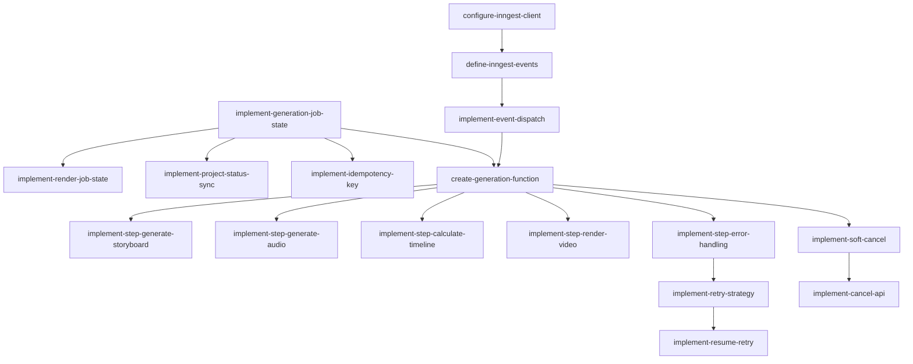

# Epic 9: 任务编排

**优先级**: P0  
**预计工作量**: 7 人日  
**Feature 数量**: 3

---

## Feature 9.1: Inngest 集成

### Change 9.1.1: 配置 Inngest Client

**Change ID**: `configure-inngest-client`

**Goal**: 创建 Inngest client 单例

**Scope**:
- 包含: client 初始化、环境变量配置
- 不包含: 具体 functions

**Files Likely Affected**:
- `/lib/inngest.ts`
- `/lib/env.ts`

**Dependencies**: `setup-inngest-endpoint`

**Acceptance Criteria**:
- Given Inngest 配置已完成
- When 导入 inngest client
- Then 返回可用实例

**Estimated Size**: S

**Estimated LOC**: 300

**Priority**: P0

---

### Change 9.1.2: 创建事件类型定义

**Change ID**: `define-inngest-events`

**Goal**: 定义所有 Inngest 事件类型

**Scope**:
- 包含: video/generate.requested、video/generate.completed、video/generate.failed
- 不包含: 事件处理逻辑

**Files Likely Affected**:
- `/lib/inngest/events.ts`
- `/lib/inngest/types.ts`

**Dependencies**: `configure-inngest-client`

**Acceptance Criteria**:
- Given 事件类型已定义
- When 发送事件
- Then TypeScript 类型检查通过

**Estimated Size**: S

**Estimated LOC**: 400

**Priority**: P0

---

### Change 9.1.3: 实现事件发送

**Change ID**: `implement-event-dispatch`

**Goal**: 封装事件发送逻辑

**Scope**:
- 包含: send 方法封装、错误处理、重试
- 不包含: 事件消费

**Files Likely Affected**:
- `/lib/inngest/dispatcher.ts`

**Dependencies**: `define-inngest-events`

**Acceptance Criteria**:
- Given 项目已创建
- When 发送 generate.requested 事件
- Then Inngest 接收事件

**Estimated Size**: S

**Estimated LOC**: 500

**Priority**: P0

---

## Feature 9.2: Job 状态机

### Change 9.2.1: 实现 GenerationJob 状态机

**Change ID**: `implement-generation-job-state`

**Goal**: GenerationJob 状态流转逻辑

**Scope**:
- 包含: pending → running → succeeded/failed/cancelled
- 不包含: RenderJob 状态

**Files Likely Affected**:
- `/lib/jobs/generation-state.ts`
- `/lib/jobs/state-machine.ts`

**Dependencies**: `define-core-schema`

**Acceptance Criteria**:
- Given Job 状态为 pending
- When 转换为 running
- Then 数据库状态已更新

**Estimated Size**: M

**Estimated LOC**: 700

**Priority**: P0

---

### Change 9.2.2: 实现 RenderJob 状态机

**Change ID**: `implement-render-job-state`

**Goal**: RenderJob 状态流转逻辑

**Scope**:
- 包含: queued → rendering → uploading → succeeded/failed
- 不包含: GenerationJob 关联

**Files Likely Affected**:
- `/lib/jobs/render-state.ts`

**Dependencies**: `implement-generation-job-state`

**Acceptance Criteria**:
- Given RenderJob 状态为 queued
- When 转换为 rendering
- Then 数据库状态已更新

**Estimated Size**: M

**Estimated LOC**: 600

**Priority**: P0

---

### Change 9.2.3: 实现 Project 状态同步

**Change ID**: `implement-project-status-sync`

**Goal**: Job 状态变更同步到 Project

**Scope**:
- 包含: Job 状态变更时更新 Project.status
- 不包含: 乐观锁

**Files Likely Affected**:
- `/lib/jobs/project-sync.ts`

**Dependencies**: `implement-generation-job-state`

**Acceptance Criteria**:
- Given GenerationJob 变为 succeeded
- When 同步 Project 状态
- Then Project.status 更新为 completed

**Estimated Size**: M

**Estimated LOC**: 600

**Priority**: P0

---

### Change 9.2.4: 实现幂等键管理

**Change ID**: `implement-idempotency-key`

**Goal**: 防止重复执行

**Scope**:
- 包含: 生成幂等键、检查重复、防重复提交
- 不包含: 分布式锁

**Files Likely Affected**:
- `/lib/jobs/idempotency.ts`

**Dependencies**: `implement-generation-job-state`

**Acceptance Criteria**:
- Given 相同 idempotencyKey
- When 重复提交
- Then 返回已存在的 Job

**Estimated Size**: S

**Estimated LOC**: 500

**Priority**: P0

---

## Feature 9.3: 重试与取消

### Change 9.3.1: 创建生成 Inngest Function

**Change ID**: `create-generation-function`

**Goal**: 主生成流程 Inngest function

**Scope**:
- 包含: 接收 generate.requested、编排 6 个步骤
- 不包含: 具体步骤实现（已在其他 Epic）

**Files Likely Affected**:
- `/lib/inngest/functions/generate-video.ts`

**Dependencies**: `implement-event-dispatch`, `implement-generation-job-state`

**Acceptance Criteria**:
- Given generate.requested 事件
- When Inngest function 执行
- Then 依次执行所有步骤

**Estimated Size**: L

**Estimated LOC**: 1000

**Priority**: P0

---

### Change 9.3.2: 实现步骤 1 - 生成 Storyboard

**Change ID**: `implement-step-generate-storyboard`

**Goal**: Inngest step 调用 Storyboard 生成

**Scope**:
- 包含: 调用 LLM、校验、保存
- 不包含: 修复逻辑（已在 Epic 5）

**Files Likely Affected**:
- `/lib/inngest/steps/generate-storyboard.ts`

**Dependencies**: `create-generation-function`, `implement-storyboard-save`

**Acceptance Criteria**:
- Given 项目输入文本
- When 执行 step
- Then Storyboard 已保存

**Estimated Size**: M

**Estimated LOC**: 700

**Priority**: P0

---

### Change 9.3.3: 实现步骤 2 - 生成音频

**Change ID**: `implement-step-generate-audio`

**Goal**: Inngest step 调用 TTS 生成

**Scope**:
- 包含: 逐 scene 生成、上传、复用检查
- 不包含: 并行生成

**Files Likely Affected**:
- `/lib/inngest/steps/generate-audio.ts`

**Dependencies**: `create-generation-function`, `implement-scene-tts-generation`

**Acceptance Criteria**:
- Given Storyboard 已生成
- When 执行 step
- Then 所有 scene 有音频

**Estimated Size**: M

**Estimated LOC**: 800

**Priority**: P0

---

### Change 9.3.4: 实现步骤 3 - 计算 Timeline

**Change ID**: `implement-step-calculate-timeline`

**Goal**: Inngest step 调用 timeline 计算

**Scope**:
- 包含: 计算、校验、保存
- 不包含: 手动调整

**Files Likely Affected**:
- `/lib/inngest/steps/calculate-timeline.ts`

**Dependencies**: `create-generation-function`, `save-timeline-to-storyboard`

**Acceptance Criteria**:
- Given 所有音频已生成
- When 执行 step
- Then Timeline 已计算并保存

**Estimated Size**: S

**Estimated LOC**: 500

**Priority**: P0

---

### Change 9.3.5: 实现步骤 4 - 渲染视频

**Change ID**: `implement-step-render-video`

**Goal**: Inngest step 调用 Remotion Worker

**Scope**:
- 包含: 调用 Worker、轮询结果、处理回调
- 不包含: Worker 实现（已在 Epic 7）

**Files Likely Affected**:
- `/lib/inngest/steps/render-video.ts`

**Dependencies**: `create-generation-function`, `implement-remotion-client`

**Acceptance Criteria**:
- Given Timeline 已计算
- When 执行 step
- Then 视频已渲染

**Estimated Size**: M

**Estimated LOC**: 800

**Priority**: P0

---

### Change 9.3.6: 实现步骤失败处理

**Change ID**: `implement-step-error-handling`

**Goal**: 统一步骤错误处理

**Scope**:
- 包含: 错误捕获、状态更新、日志记录
- 不包含: 自动修复

**Files Likely Affected**:
- `/lib/inngest/error-handler.ts`

**Dependencies**: `create-generation-function`

**Acceptance Criteria**:
- Given step 执行失败
- When 捕获错误
- Then Job 状态更新为 failed

**Estimated Size**: M

**Estimated LOC**: 700

**Priority**: P0

---

### Change 9.3.7: 实现重试策略

**Change ID**: `implement-retry-strategy`

**Goal**: Inngest 重试配置

**Scope**:
- 包含: 可重试错误判断、指数退避、最多 3 次
- 不包含: 跨步骤重试

**Files Likely Affected**:
- `/lib/inngest/retry-config.ts`

**Dependencies**: `implement-step-error-handling`

**Acceptance Criteria**:
- Given step 失败且可重试
- When Inngest 重试
- Then 最多执行 3 次

**Estimated Size**: S

**Estimated LOC**: 500

**Priority**: P0

---

### Change 9.3.8: 实现软取消机制

**Change ID**: `implement-soft-cancel`

**Goal**: 取消任务但不强杀进程

**Scope**:
- 包含: 每个 step 开始前检查 Project.status
- 不包含: 中断运行中的外部 API 调用

**Files Likely Affected**:
- `/lib/inngest/cancel-checker.ts`

**Dependencies**: `create-generation-function`

**Acceptance Criteria**:
- Given 用户取消任务
- When step 开始执行前
- Then 检查到 cancelled，停止后续步骤

**Estimated Size**: S

**Estimated LOC**: 500

**Priority**: P0

---

### Change 9.3.9: 实现 Resume 重试

**Change ID**: `implement-resume-retry`

**Goal**: 从失败步骤恢复，不重复已完成步骤

**Scope**:
- 包含: 检查已完成步骤、跳过已有资源
- 不包含: 全量重新生成

**Files Likely Affected**:
- `/lib/inngest/resume-handler.ts`
- `/server/routers/generation.ts` (retry mutation)

**Dependencies**: `implement-retry-strategy`

**Acceptance Criteria**:
- Given 任务在音频生成阶段失败
- When 用户重试
- Then 跳过 Storyboard 生成，直接从音频开始

**Estimated Size**: M

**Estimated LOC**: 800

**Priority**: P0

---

### Change 9.3.10: 实现取消 API

**Change ID**: `implement-cancel-api`

**Goal**: 前端调用的取消接口

**Scope**:
- 包含: generation.cancel mutation、权限校验
- 不包含: 强制终止

**Files Likely Affected**:
- `/server/routers/generation.ts`

**Dependencies**: `implement-soft-cancel`, `integrate-auth-trpc`

**Acceptance Criteria**:
- Given 任务运行中
- When 调用 cancel
- Then Project 和 Job 标记为 cancelled

**Estimated Size**: S

**Estimated LOC**: 500

**Priority**: P0

---

## Epic 9 依赖图

---

## 验证清单

Epic 9 完成后需验证：

- [ ] Inngest client 正常工作
- [ ] 事件发送成功
- [ ] GenerationJob 状态流转正确
- [ ] RenderJob 状态流转正确
- [ ] Project 状态同步正确
- [ ] 幂等键防重复生效
- [ ] 主生成流程完整执行
- [ ] Storyboard 步骤成功
- [ ] 音频生成步骤成功
- [ ] Timeline 计算步骤成功
- [ ] 渲染视频步骤成功
- [ ] 步骤失败时正确处理
- [ ] 可重试错误自动重试
- [ ] 重试最多 3 次
- [ ] 软取消机制生效
- [ ] Resume 重试跳过已完成步骤
- [ ] 取消 API 正常工作
- [ ] 整个生成流程端到端成功
- [ ] 失败任务可以重试
- [ ] 取消任务不影响已生成资源
