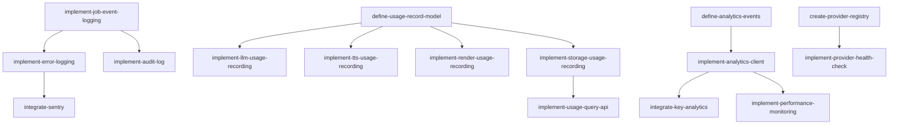

# Epic 10: 可观测性

**优先级**: P1  
**预计工作量**: 4 人日  
**Feature 数量**: 3

---

## Feature 10.1: 日志系统

### Change 10.1.1: 实现 JobEvent 记录

**Change ID**: `implement-job-event-logging`

**Goal**: 记录任务执行事件

**Scope**:
- 包含: 创建 JobEvent、info/warn/error 级别
- 不包含: 日志聚合

**Files Likely Affected**:
- `/lib/logging/job-event.ts`
- `/lib/db/job-event.ts`

**Dependencies**: `define-core-schema`

**Acceptance Criteria**:
- Given Job 状态变更
- When 记录事件
- Then JobEvent 表插入记录

**Estimated Size**: S

**Estimated LOC**: 500

**Priority**: P1

---

### Change 10.1.2: 实现错误日志记录

**Change ID**: `implement-error-logging`

**Goal**: 统一错误日志记录

**Scope**:
- 包含: 错误栈、上下文、requestId
- 不包含: 敏感信息脱敏

**Files Likely Affected**:
- `/lib/logging/error-logger.ts`

**Dependencies**: `implement-job-event-logging`

**Acceptance Criteria**:
- Given 发生错误
- When 记录日志
- Then 包含完整错误信息

**Estimated Size**: S

**Estimated LOC**: 500

**Priority**: P1

---

### Change 10.1.3: 集成 Sentry

**Change ID**: `integrate-sentry`

**Goal**: 前后端错误上报

**Scope**:
- 包含: Sentry SDK 集成、自动上报、环境配置
- 不包含: 性能监控

**Files Likely Affected**:
- `/lib/sentry.ts`
- `/app/error.tsx`
- `next.config.js`

**Dependencies**: `implement-error-logging`

**Acceptance Criteria**:
- Given 发生异常
- When 上报 Sentry
- Then Sentry 收到事件

**Estimated Size**: M

**Estimated LOC**: 600

**Priority**: P1

---

### Change 10.1.4: 实现审计日志

**Change ID**: `implement-audit-log`

**Goal**: 记录关键用户操作

**Scope**:
- 包含: 创建项目、删除项目、下载资源
- 不包含: 完整操作日志

**Files Likely Affected**:
- `/lib/logging/audit-logger.ts`
- `/lib/db/audit-log.ts`

**Dependencies**: `implement-job-event-logging`

**Acceptance Criteria**:
- Given 用户删除项目
- When 记录审计日志
- Then 保存 userId、操作、时间

**Estimated Size**: S

**Estimated LOC**: 500

**Priority**: P1

---

## Feature 10.2: 用量记录

### Change 10.2.1: 定义 UsageRecord 模型

**Change ID**: `define-usage-record-model`

**Goal**: 扩展 Prisma schema 支持用量记录

**Scope**:
- 包含: UsageRecord 表、provider/metric/quantity 字段
- 不包含: 聚合视图

**Files Likely Affected**:
- `/prisma/schema.prisma`

**Dependencies**: `define-core-schema`

**Acceptance Criteria**:
- Given schema 已定义
- When 执行 migrate
- Then UsageRecord 表创建成功

**Estimated Size**: S

**Estimated LOC**: 300

**Priority**: P1

---

### Change 10.2.2: 实现 LLM 用量记录

**Change ID**: `implement-llm-usage-recording`

**Goal**: 记录 LLM token 消耗

**Scope**:
- 包含: tokens、model、成本估算
- 不包含: 实时统计

**Files Likely Affected**:
- `/lib/usage/llm-recorder.ts`

**Dependencies**: `define-usage-record-model`

**Acceptance Criteria**:
- Given LLM 调用完成
- When 记录用量
- Then UsageRecord 保存 tokens

**Estimated Size**: S

**Estimated LOC**: 500

**Priority**: P1

---

### Change 10.2.3: 实现 TTS 用量记录

**Change ID**: `implement-tts-usage-recording`

**Goal**: 记录 TTS 字符消耗

**Scope**:
- 包含: chars、voiceId、成本估算
- 不包含: 复用统计

**Files Likely Affected**:
- `/lib/usage/tts-recorder.ts`

**Dependencies**: `define-usage-record-model`

**Acceptance Criteria**:
- Given TTS 调用完成
- When 记录用量
- Then UsageRecord 保存 chars

**Estimated Size**: S

**Estimated LOC**: 500

**Priority**: P1

---

### Change 10.2.4: 实现渲染用量记录

**Change ID**: `implement-render-usage-recording`

**Goal**: 记录渲染时长

**Scope**:
- 包含: render_ms、分辨率、成本估算
- 不包含: CPU/内存详情

**Files Likely Affected**:
- `/lib/usage/render-recorder.ts`

**Dependencies**: `define-usage-record-model`

**Acceptance Criteria**:
- Given 渲染完成
- When 记录用量
- Then UsageRecord 保存时长

**Estimated Size**: S

**Estimated LOC**: 500

**Priority**: P1

---

### Change 10.2.5: 实现存储用量记录

**Change ID**: `implement-storage-usage-recording`

**Goal**: 记录 R2 存储量

**Scope**:
- 包含: bytes、文件类型
- 不包含: 流量统计

**Files Likely Affected**:
- `/lib/usage/storage-recorder.ts`

**Dependencies**: `define-usage-record-model`

**Acceptance Criteria**:
- Given 文件上传
- When 记录用量
- Then UsageRecord 保存 bytes

**Estimated Size**: S

**Estimated LOC**: 400

**Priority**: P1

---

### Change 10.2.6: 实现用量查询 API

**Change ID**: `implement-usage-query-api`

**Goal**: 查询用户用量统计

**Scope**:
- 包含: 按时间范围、按 provider 聚合
- 不包含: 图表渲染

**Files Likely Affected**:
- `/server/routers/usage.ts`
- `/lib/db/usage-query.ts`

**Dependencies**: `implement-storage-usage-recording`

**Acceptance Criteria**:
- Given 用户 ID 和时间范围
- When 查询用量
- Then 返回聚合数据

**Estimated Size**: M

**Estimated LOC**: 700

**Priority**: P1

---

## Feature 10.3: 监控埋点

### Change 10.3.1: 定义埋点事件

**Change ID**: `define-analytics-events`

**Goal**: 定义所有埋点事件类型

**Scope**:
- 包含: 页面访问、按钮点击、任务状态变更
- 不包含: 第三方 SDK

**Files Likely Affected**:
- `/lib/analytics/events.ts`
- `/lib/analytics/types.ts`

**Dependencies**: `setup-project-structure`

**Acceptance Criteria**:
- Given 埋点事件已定义
- When 调用 track
- Then TypeScript 类型检查通过

**Estimated Size**: S

**Estimated LOC**: 400

**Priority**: P1

---

### Change 10.3.2: 实现埋点客户端

**Change ID**: `implement-analytics-client`

**Goal**: 前端埋点 SDK

**Scope**:
- 包含: track、identify、page 方法
- 不包含: 第三方集成

**Files Likely Affected**:
- `/lib/analytics/client.ts`
- `/hooks/use-track.ts`

**Dependencies**: `define-analytics-events`

**Acceptance Criteria**:
- Given 埋点 client 已创建
- When 调用 track
- Then 事件发送成功

**Estimated Size**: M

**Estimated LOC**: 600

**Priority**: P1

---

### Change 10.3.3: 集成关键埋点

**Change ID**: `integrate-key-analytics`

**Goal**: 在关键位置添加埋点

**Scope**:
- 包含: Dashboard、Create、Progress、Result 页面埋点
- 不包含: 全量埋点

**Files Likely Affected**:
- `/app/dashboard/page.tsx`
- `/app/create/page.tsx`
- `/app/projects/[id]/progress/page.tsx`
- `/app/projects/[id]/result/page.tsx`

**Dependencies**: `implement-analytics-client`

**Acceptance Criteria**:
- Given 用户进入 Dashboard
- When 页面加载
- Then 发送 dashboard_view 埋点

**Estimated Size**: M

**Estimated LOC**: 700

**Priority**: P1

---

### Change 10.3.4: 实现性能监控

**Change ID**: `implement-performance-monitoring`

**Goal**: 监控关键指标

**Scope**:
- 包含: 生成耗时、API 响应时间、错误率
- 不包含: APM 系统

**Files Likely Affected**:
- `/lib/monitoring/metrics.ts`

**Dependencies**: `implement-analytics-client`

**Acceptance Criteria**:
- Given 任务完成
- When 记录耗时
- Then 上报 P50/P95/P99

**Estimated Size**: M

**Estimated LOC**: 600

**Priority**: P1

---

### Change 10.3.5: 实现 Provider 健康检查

**Change ID**: `implement-provider-health-check`

**Goal**: 定期检查 Provider 可用性

**Scope**:
- 包含: 心跳检查、错误率统计、降级标记
- 不包含: 自动切换

**Files Likely Affected**:
- `/lib/providers/health-checker.ts`

**Dependencies**: `create-provider-registry`

**Acceptance Criteria**:
- Given Provider 配置完成
- When 执行健康检查
- Then 返回可用性状态

**Estimated Size**: M

**Estimated LOC**: 700

**Priority**: P1

---

## Epic 10 依赖图

---

## 验证清单

Epic 10 完成后需验证：

- [ ] JobEvent 正确记录
- [ ] 错误日志包含完整信息
- [ ] Sentry 接收异常事件
- [ ] 审计日志记录关键操作
- [ ] UsageRecord 表创建成功
- [ ] LLM token 用量记录准确
- [ ] TTS 字符用量记录准确
- [ ] 渲染时长记录准确
- [ ] 存储用量记录准确
- [ ] 用量查询 API 返回正确
- [ ] 埋点事件类型完整
- [ ] 前端埋点正常发送
- [ ] 关键页面埋点已集成
- [ ] 性能指标正确上报
- [ ] Provider 健康检查正常
- [ ] 监控数据可查询
- [ ] 日志不包含敏感信息

---

## 总结

Epic 10 完成后，平台具备完整的可观测性：

- ✅ 任务执行日志
- ✅ 错误追踪和上报
- ✅ 用量统计和成本估算
- ✅ 用户行为埋点
- ✅ 性能监控
- ✅ Provider 健康检查
- ✅ 审计日志

这些能力为后续优化和故障排查提供数据支持。
