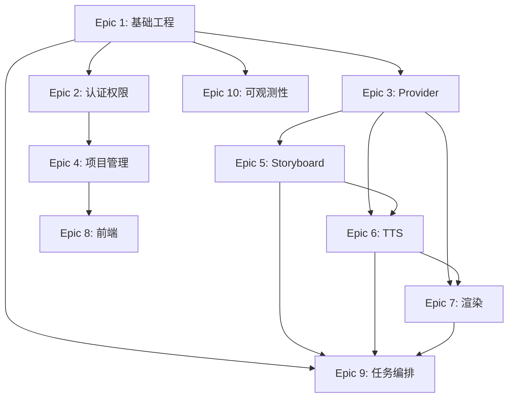

# 工程实施总结

**项目**: Volcano AI 微课视频生成平台  
**文档版本**: v1.0  
**生成时间**: 2026-06-13

---

## 📊 统计信息

### Epic 统计
- **总 Epic 数**: 10
- **总 Feature 数**: 33
- **总 Change 数**: ~100+
- **P0 Epic**: 9 个
- **P1 Epic**: 1 个

### 工作量估算
- **Epic 1**: 5 人日
- **Epic 2**: 4 人日
- **Epic 3**: 8 人日
- **Epic 4**: 6 人日
- **Epic 5**: 7 人日
- **Epic 6**: 6 人日
- **Epic 7**: 12 人日
- **Epic 8**: 8 人日
- **Epic 9**: 7 人日
- **Epic 10**: 4 人日

**总计**: ~67 人日（约 3 个月，2-3 人团队）

---

## 🎯 实施阶段规划

### Phase 1: 基础设施 (Week 1-2)
**目标**: 搭建项目基础，建立开发环境

**包含 Epic**:
- Epic 1: 基础工程搭建
- Epic 2: 用户认证与权限
- Epic 3: Provider 抽象层

**关键里程碑**:
- ✅ Next.js 项目启动成功
- ✅ 数据库迁移完成
- ✅ 用户可以登录
- ✅ Provider 接口定义完成
- ✅ DeepSeek LLM 可调用
- ✅ MiniMax TTS 可调用
- ✅ R2 上传测试通过

**验收标准**:
```bash
npm run dev  # 成功启动
npm run build  # 构建成功
npx prisma migrate dev  # 数据库同步
```

---

### Phase 2: 核心生成流程 (Week 3-5)
**目标**: 实现从文本到 Storyboard 的完整流程

**包含 Epic**:
- Epic 4: 项目管理基础
- Epic 5: Storyboard 生成
- Epic 6: TTS 音频生成
- Epic 9: 任务编排（前半部分）

**关键里程碑**:
- ✅ 可以创建项目
- ✅ LLM 生成 Storyboard JSON
- ✅ Schema 校验通过
- ✅ 逐 scene 生成 TTS
- ✅ 音频复用机制生效
- ✅ Inngest 编排流程运行

**验收标准**:
```typescript
// 端到端测试
const project = await createProject({
  sourceText: "测试文本...",
  // ...其他参数
});

// 等待生成完成
const result = await waitForGeneration(project.id);

// 验证
assert(result.storyboard !== null);
assert(result.scenes.every(s => s.audioAssetId !== null));
```

---

### Phase 3: 渲染与前端 (Week 6-8)
**目标**: 完成视频渲染和用户界面

**包含 Epic**:
- Epic 7: 渲染流程
- Epic 8: 前端交互
- Epic 9: 任务编排（后半部分）

**关键里程碑**:
- ✅ Timeline 计算正确
- ✅ Remotion Worker 可渲染
- ✅ 7 种模板实现完成
- ✅ MP4 生成成功
- ✅ Dashboard 可访问
- ✅ 创建页可提交
- ✅ 进度页实时更新
- ✅ 结果页可播放视频

**验收标准**:
```typescript
// 完整流程测试
const project = await createAndGenerate({...});
const video = await waitForVideo(project.id);

assert(video.status === 'completed');
assert(video.videoUrl !== null);
assert(video.durationMs > 0);

// 前端验收
// 1. 用户可以在浏览器中完成完整流程
// 2. 所有页面状态正确
// 3. 视频可以播放
```

---

### Phase 4: 可观测性与优化 (Week 9)
**目标**: 完善监控、日志和用量统计

**包含 Epic**:
- Epic 10: 可观测性

**关键里程碑**:
- ✅ JobEvent 日志完整
- ✅ Sentry 接收错误
- ✅ 用量记录准确
- ✅ 埋点正常上报
- ✅ 性能监控就绪

**验收标准**:
```typescript
// 验证日志
const events = await getJobEvents(jobId);
assert(events.length > 0);

// 验证用量
const usage = await getUserUsage(userId);
assert(usage.llm_tokens > 0);
assert(usage.tts_chars > 0);
```

---

## 🔗 跨 Epic 依赖关系



---

## ⚠️ 关键风险点

### 1. LLM JSON 输出不稳定
**风险**: DeepSeek 返回的 JSON 格式不稳定

**缓解措施**:
- ✅ 严格 Zod Schema 校验
- ✅ 自动 repair 机制
- ✅ 最多重试 2 次
- ✅ Few-shot examples 优化 prompt

**验证方法**:
```bash
# 压测 100 次生成
for i in {1..100}; do
  node scripts/test-storyboard-generation.js
done
```

---

### 2. TTS 音频时长准确性
**风险**: 音频时长不准确导致音画不同步

**缓解措施**:
- ✅ 使用 MiniMax 返回的精确 durationMs
- ✅ 服务端解析音频文件验证
- ✅ Timeline 计算时添加 buffer
- ✅ 测试多种文本长度

**验证方法**:
```typescript
// 验证音画同步
const scene = await getScene(sceneId);
const audioDuration = await parseAudioDuration(scene.audioUrl);
const expectedDuration = scene.durationMs;

assert(Math.abs(audioDuration - expectedDuration) < 100); // 误差 < 100ms
```

---

### 3. Remotion Worker 环境依赖
**风险**: 中文字体缺失、FFmpeg 版本不兼容

**缓解措施**:
- ✅ Docker 镜像包含所有依赖
- ✅ 预装中文字体（思源黑体）
- ✅ 固定 FFmpeg、Chromium 版本
- ✅ 本地测试渲染流程

**验证方法**:
```bash
# Docker 环境测试
docker build -t volcano-worker ./worker
docker run volcano-worker npm test
```

---

### 4. R2 签名 URL 过期
**风险**: 渲染时音频 URL 过期导致失败

**缓解措施**:
- ✅ 生成足够长的有效期（30 分钟）
- ✅ Worker 渲染前刷新 URL
- ✅ 失败后自动重试
- ✅ 考虑服务端代理（备选方案）

---

### 5. 成本控制
**风险**: 用量不可控导致成本过高

**缓解措施**:
- ✅ 每日额度限制
- ✅ 并发任务限制（1 个/用户）
- ✅ 音频复用机制
- ✅ UsageRecord 实时记录
- ✅ 管理员豁免额度

---

## 🧪 测试策略

### 单元测试
**覆盖模块**:
- ✅ Storyboard Schema 校验
- ✅ Timeline 计算
- ✅ 文本哈希
- ✅ 权限检查
- ✅ Provider 错误处理

**工具**: Jest, Vitest

---

### 集成测试
**覆盖流程**:
- ✅ LLM → Storyboard
- ✅ TTS → 音频上传
- ✅ Storyboard → Timeline
- ✅ Timeline → 渲染
- ✅ 完整生成流程

**工具**: Playwright, Supertest

---

### E2E 测试
**覆盖场景**:
- ✅ 用户注册登录
- ✅ 创建项目
- ✅ 等待生成
- ✅ 查看结果
- ✅ 下载视频

**工具**: Playwright

---

## 📝 AI Coding Agent 使用建议

### 对于 Claude Code
每个 Change 可以直接通过对话实现：

```
用户：请实现 Change setup-nextjs-base
Claude：好的，我将创建 Next.js 14 项目...
```

**最佳实践**:
1. 一次实现一个 Change
2. 实现后立即测试
3. 确认通过后再进入下一个
4. 遇到问题时回滚到上一个稳定状态

---

### 对于 Cursor
可以使用 Composer 模式：

```
@codebase 实现 Epic 1 的所有 Changes
```

**最佳实践**:
1. 先让 Cursor 阅读当前 Epic 的 .md 文件
2. 使用 @docs 引用 Prisma、tRPC 官方文档
3. 每个 Feature 完成后运行测试

---

### 对于 OpenSpec
可以使用 /propose 命令：

```
/propose Epic 1: 基础工程搭建
```

**最佳实践**:
1. OpenSpec 会自动分析依赖关系
2. 并行执行独立的 Changes
3. 使用 /review 检查生成的代码

---

## 🎓 开发建议

### 1. 按 Epic 顺序开发
严格按照 Epic 1 → Epic 2 → ... → Epic 10 顺序开发，避免依赖问题。

### 2. 每个 Change 独立 PR
每个 Change 都应该是独立的 Pull Request，便于 Review 和回滚。

### 3. 数据库迁移注意事项
- 每次 schema 变更立即生成 migration
- 测试 migration 的 up 和 down
- 生产环境迁移前备份数据库

### 4. 环境变量管理
```bash
# .env.example 包含所有必需变量
cp .env.example .env.local
# 填写实际值
```

### 5. 代码风格
遵循项目 ESLint 和 Prettier 配置，保持代码一致性。

---

## 🚀 部署建议

### 主服务（Next.js）
**推荐**: Vercel

```bash
# 环境变量配置
DATABASE_URL=...
R2_ACCESS_KEY_ID=...
INNGEST_EVENT_KEY=...
```

---

### Worker（Remotion）
**推荐**: 独立 VPS 或容器服务

```bash
# Docker 部署
docker build -t volcano-worker .
docker run -p 3001:3001 -e INTERNAL_TOKEN=... volcano-worker
```

---

### 数据库
**推荐**: Supabase、Neon 或 Railway

---

### 存储
**推荐**: Cloudflare R2

---

## 📚 参考资料

- [Next.js 文档](https://nextjs.org/docs)
- [tRPC 文档](https://trpc.io/docs)
- [Prisma 文档](https://www.prisma.io/docs)
- [Inngest 文档](https://www.inngest.com/docs)
- [Remotion 文档](https://www.remotion.dev/docs)
- [Better-auth 文档](https://www.better-auth.com/docs)
- [Cloudflare R2 文档](https://developers.cloudflare.com/r2)

---

## ✅ 最终验收清单

完成所有 Epic 后，系统应满足：

### 功能验收
- [ ] 用户可以注册登录
- [ ] 用户可以创建项目
- [ ] 系统可以生成 Storyboard
- [ ] 系统可以生成音频
- [ ] 系统可以渲染视频
- [ ] 用户可以查看进度
- [ ] 用户可以预览分镜
- [ ] 用户可以播放视频
- [ ] 用户可以下载视频
- [ ] 用户可以重试失败任务
- [ ] 用户可以取消任务
- [ ] 管理员不受额度限制

### 性能验收
- [ ] 3 分钟视频 P75 生成时长 <= 8 分钟
- [ ] 首次生成成功率 >= 85%
- [ ] TTS 音画同步误差 < 500ms
- [ ] 项目列表加载 < 1 秒

### 安全验收
- [ ] 用户无法访问他人项目
- [ ] 用户无法访问他人资源
- [ ] R2 文件默认私有
- [ ] 所有 API 需要登录
- [ ] 管理员邮箱白名单生效

### 可观测性验收
- [ ] Sentry 接收错误
- [ ] JobEvent 记录完整
- [ ] 用量统计准确
- [ ] 埋点正常上报

---

## 🎉 总结

本实施计划将 PRD 完整拆解为 **10 个 Epic**、**33 个 Feature**、**100+ 个 Change**。

每个 Change 都满足：
✅ 独立开发
✅ 独立测试
✅ 独立 Review
✅ 独立 Merge
✅ 独立回滚

预计 **3 个月**完成（2-3 人团队），适合 AI Coding Agent 逐步实现。

祝开发顺利！🚀
