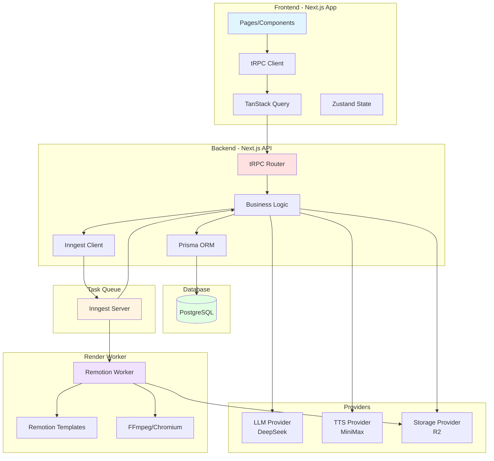
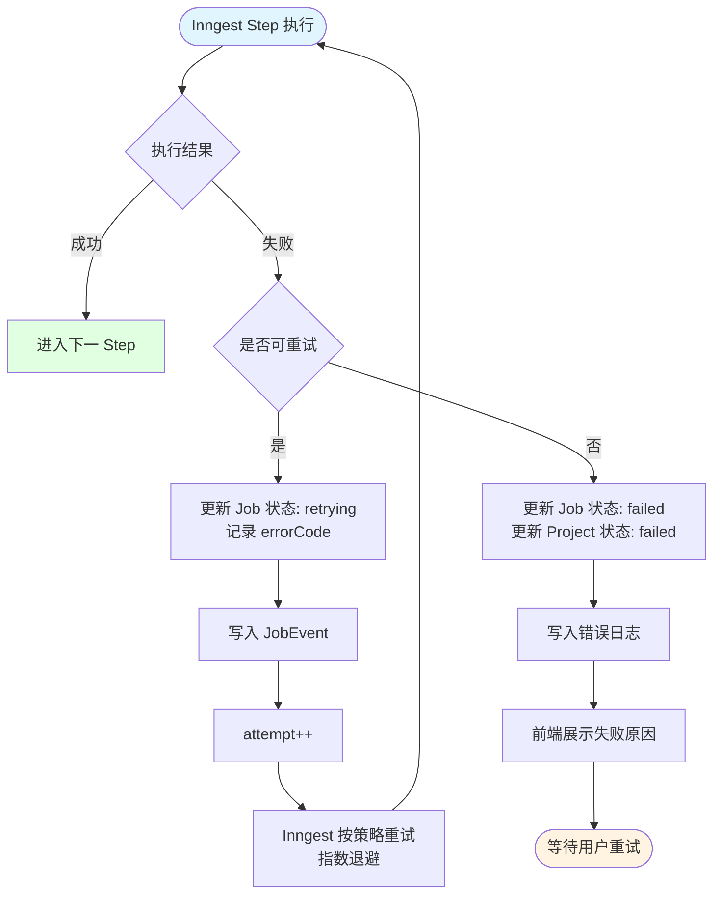
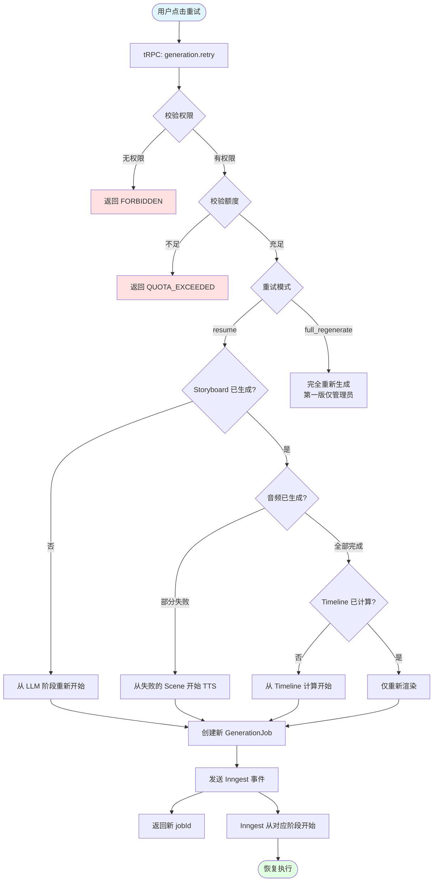
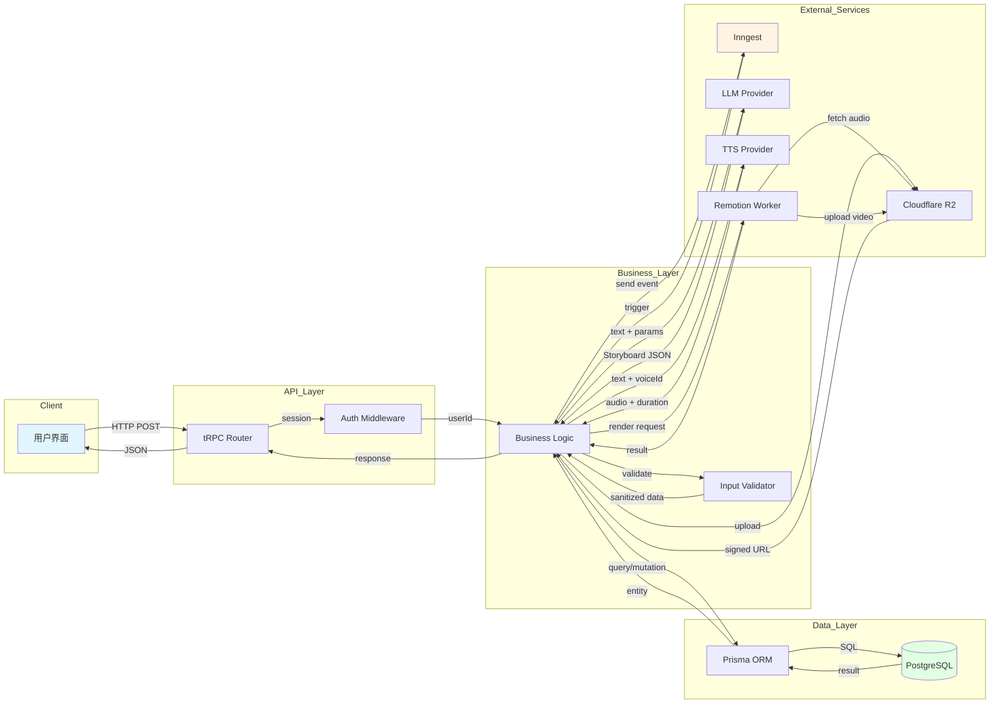
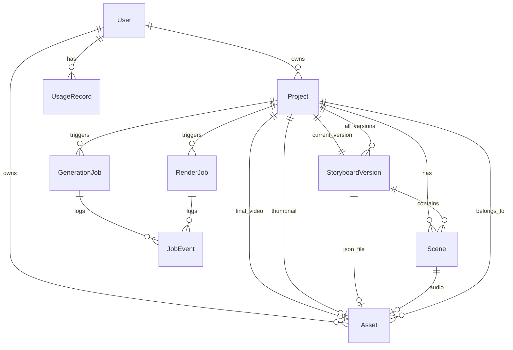
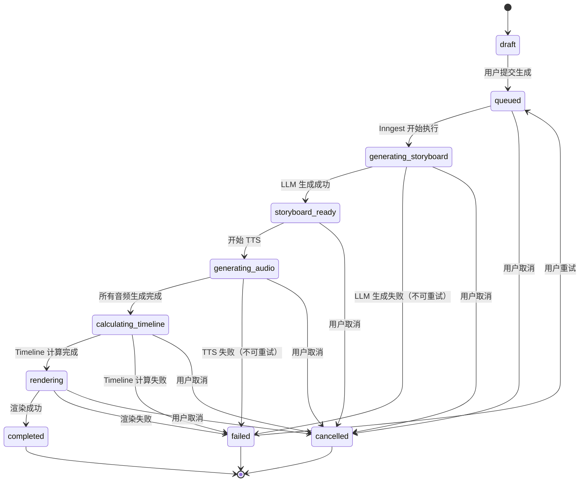
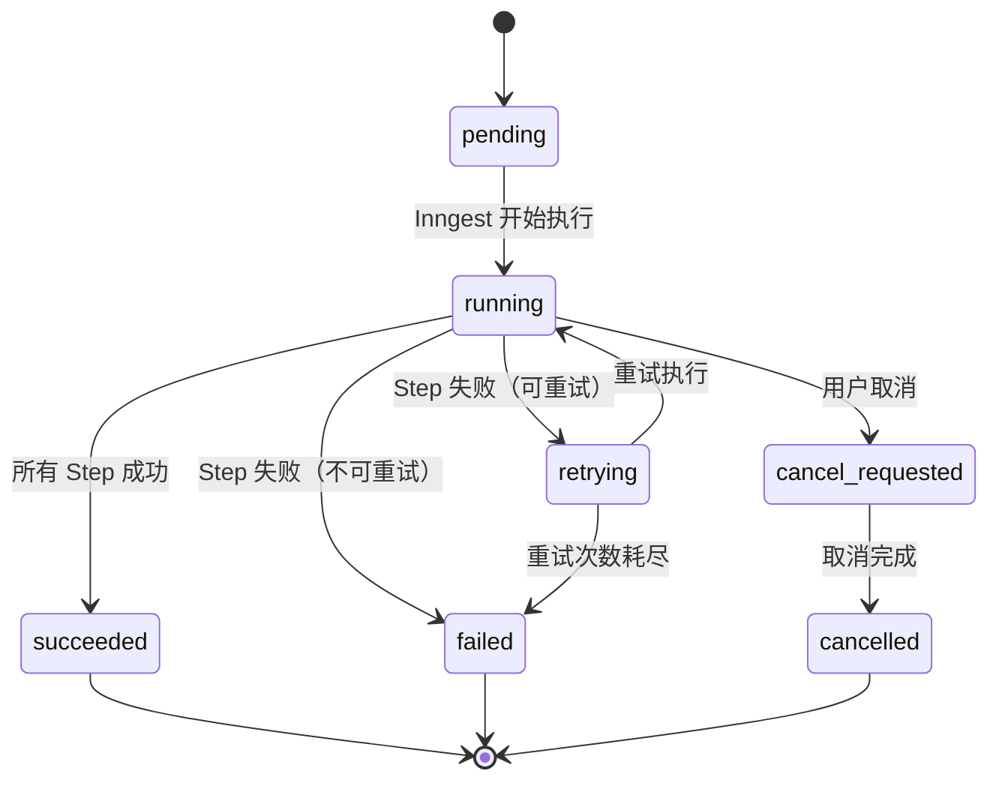

## Technical Design Document - Volcano AI 微课视频生成平台

## 1. 文档信息

### 项目名称

Volcano AI 微课视频生成平台

### 技术文档版本

v1.0.0

### 作者

Tech Lead & System Architect

### 创建时间

2026-06-14

### 状态

Draft

### 变更记录

| 版本 | 日期 | 变更说明 |
|------|------|----------|
| v1.0.0 | 2026-06-14 | 创建 TDD 初稿，基于 PRD v1.0.6 |

---

## 2. 技术目标

### 功能目标

1. **AI 文本转分镜**：将用户输入的 AI 回答文本转换为结构化 Storyboard JSON
2. **TTS 语音合成**：逐 scene 生成高质量中文语音，支持句级字幕时间戳
3. **视频渲染**：基于 Remotion 模板渲染 PPT 风格微课视频（MP4）
4. **异步任务编排**：使用 Inngest 编排长任务，支持失败重试和任务取消
5. **资源管理**：使用 Cloudflare R2 存储音频、字幕、分镜 JSON、缩略图和视频
6. **项目管理**：用户可创建、查看、删除项目，查看生成进度和最终结果

### 技术目标

1. **技术栈统一**：使用 Next.js App Router + tRPC + Prisma + PostgreSQL + Inngest 构建全栈平台
2. **Provider 抽象**：LLM、TTS、Storage、Render 能力均通过 Provider 接口抽象，不直接依赖具体厂商 SDK
3. **Remotion 集成**：在项目内集成 Remotion 作为视频模板与动效引擎，渲染执行由独立 Worker 承载
4. **数据模型规范**：建立 Storyboard、Scene、Asset、Job 状态机等核心数据模型
5. **可扩展架构**：支持后续接入新 LLM、新 TTS、新渲染器、分镜编辑器
6. **成本可控**：记录每次 LLM、TTS、渲染的资源消耗，支持额度控制

### 性能目标

| 指标 | 目标值 | 说明 |
|------|--------|------|
| 创建项目接口 P95 | ≤ 800ms | 不等待生成完成，仅创建 Project 和触发事件 |
| 项目详情查询 P95 | ≤ 500ms | 包含 Project、Job、Storyboard、Assets |
| 项目列表查询 P95 | ≤ 800ms | 分页查询，默认 20 条 |
| 3 分钟视频生成 P75 | ≤ 8 分钟 | 端到端耗时，包含 LLM、TTS、渲染、上传 |
| TTS 音频与画面时长错位投诉率 | ≤ 2% | 通过服务端解析音频 duration 保证 |
| 首次生成成功率 | ≥ 85% | 排除用户输入错误 |
| 生成任务可恢复率 | ≥ 95% | 重试后无需从头重做全部步骤 |
| 失败原因展示覆盖率 | ≥ 95% | 用户可理解的错误提示 |

### 可扩展性目标

1. **Storyboard Schema 版本化**：支持 schema 升级，旧版本仍可渲染
2. **Scene Type 可扩展**：第一版限制 7 种类型，但架构支持后续扩展
3. **Provider 可替换**：通过环境变量切换 LLM、TTS、Storage、Render
4. **Remotion 模板可扩展**：通过模板注册表管理，新增模板不破坏已有视频渲染
5. **多渲染器支持**：第一版使用项目内 Remotion，架构支持后续接入 HyperFrames 等

### 安全目标

1. **认证授权**：所有业务 API 必须校验 better-auth session
2. **资源隔离**：用户只能访问自己的项目和资源
3. **私有存储**：R2 bucket 默认私有，通过签名 URL 访问
4. **密钥管理**：Provider API Key 仅保存在服务端环境变量
5. **内容安全**：用户输入文本需基础敏感内容检测
6. **审计日志**：记录用户关键操作和管理员操作

---

## 3. 总体架构设计

### 架构概览



### 模块划分

| 模块 | 职责 | 输入 | 输出 |
|------|------|------|------|
| **Web UI** | 页面渲染、用户交互、状态管理 | 用户操作、API 响应 | 页面展示、API 请求 |
| **tRPC API** | 接口定义、权限校验、业务调用 | HTTP Request、Session | JSON Response |
| **Business Logic** | 核心业务逻辑、数据校验、Provider 调用 | tRPC Input、Job Event | Database 写入、Provider 调用 |
| **Inngest Orchestration** | 异步任务编排、重试、状态流转 | Event Payload | Step 执行、状态更新 |
| **LLM Provider** | 生成 Storyboard、修复 JSON | 文本、参数 | Storyboard JSON |
| **TTS Provider** | 文本转语音、返回音频和字幕 | 文本、语音 ID | 音频文件、Duration、Captions |
| **Storage Provider** | 文件上传、签名 URL 生成 | 文件、Key | R2 Key、Signed URL |
| **Render Provider** | 调用 Remotion Worker 渲染视频 | Storyboard、Config | 视频文件、缩略图 |
| **Remotion Worker** | 视频渲染执行、资源拉取、编码 | Render Job、Storyboard | MP4 文件 |
| **Database** | 数据持久化、事务管理 | SQL Query | Query Result |

### 模块依赖关系

**上游 → 下游调用关系：**

1. **Web UI** → tRPC API（HTTP/WebSocket）
2. **tRPC API** → Business Logic（同进程函数调用）
3. **Business Logic** → Prisma ORM（同进程函数调用）
4. **Business Logic** → Inngest Client（HTTP Event 发送）
5. **Inngest Server** → tRPC API（HTTP Webhook 回调）
6. **Business Logic** → LLM Provider（HTTP API）
7. **Business Logic** → TTS Provider（HTTP API）
8. **Business Logic** → Storage Provider（S3 SDK）
9. **Business Logic** → Render Provider（HTTP API，内部 Worker）
10. **Remotion Worker** → Storage Provider（拉取音频、上传视频）

**调用方式：**

- Web ↔ API：HTTPS（tRPC over HTTP POST）
- API ↔ Inngest：HTTPS（Event 发送 + Webhook 回调）
- API ↔ LLM/TTS：HTTPS（RESTful API）
- API ↔ R2：HTTPS（S3-compatible SDK）
- API ↔ Remotion Worker：HTTPS（内部 HTTP API + token）

**同步/异步：**

- 创建项目：同步返回 projectId，异步执行生成
- 查询项目：同步
- 生成 Storyboard：异步（Inngest Step）
- 生成 TTS：异步（Inngest Step，逐 scene 串行或并行）
- 渲染视频：异步（Inngest Step 调用 Worker）
- 取消任务：同步标记 cancelled，异步软终止
- 重试任务：同步创建新 Job，异步执行

---

## 4. 核心业务流程设计

### 主流程：创建项目并生成视频


### 异常流程：失败重试



### 异常流程：用户取消任务


### 回滚流程：resume 重试



---

## 5. 数据流设计

### Data Flow Diagram



### 用户请求数据流示例：创建项目

1. **用户输入** → 前端表单收集：`sourceText`, `audienceRole`, `aspectRatio`, `targetDurationSec`, `voiceProvider`, `voiceId`
2. **前端校验** → 字数限制、必填项、格式校验
3. **tRPC 请求** → `project.createAndGenerate` mutation
4. **Auth 中间件** → 从 session 提取 `userId`
5. **业务校验** → 校验额度、并发限制、语音可用性
6. **数据库写入** → 
   - 插入 `Project` 表（状态 `queued`）
   - 插入 `GenerationJob` 表（状态 `pending`）
7. **事件发送** → Inngest `video/generate.requested` 事件
8. **响应返回** → `{ projectId, status: 'queued' }`
9. **前端跳转** → 进度页 `/projects/:id`

### 异步生成数据流示例：生成 Storyboard

1. **Inngest 触发** → `video/generate.requested` 事件到达
2. **读取 Project** → 从数据库查询 `sourceText` 和参数
3. **调用 LLM** → DeepSeek API，传入 prompt 和参数
4. **LLM 响应** → 返回 Storyboard JSON
5. **Schema 校验** → Zod 校验，失败则调用 repair
6. **数据库写入** →
   - 插入 `StoryboardVersion` 表
   - 批量插入 `Scene` 表
7. **上传 R2** → Storyboard JSON 文件
8. **Asset 记录** → 插入 `Asset` 表（type: `storyboard_json`）
9. **状态更新** → Project 状态 → `storyboard_ready`
10. **进入下一 Step** → 生成音频

---
## 6. 数据模型设计

### 6.1 实体关系图



### 6.2 核心表设计

#### 6.2.1 User 表

**用途**：用户账户信息，由 better-auth 管理

**说明**：本表由 better-auth 自动生成和管理，业务侧仅依赖 userId 作为外键。具体字段以 better-auth schema 为准。

**业务关注字段**：
- `id`：用户唯一标识
- `email`：登录邮箱
- `name`：用户名
- `createdAt`：注册时间

**管理员判断逻辑**：
```typescript
// 管理员判断通过环境变量 ADMIN_EMAILS 实现
const ADMIN_EMAILS = process.env.ADMIN_EMAILS?.split(',') ?? [];
const isAdmin = (email: string) => ADMIN_EMAILS.includes(email);
```

#### 6.2.2 Project 表

**用途**：视频项目主表，记录用户创建的每个微课视频项目

**字段设计**：

| 字段 | 类型 | Nullable | 默认值 | 说明 |
|------|------|----------|--------|------|
| id | String(CUID) | No | - | 主键，CUID 格式 |
| userId | String | No | - | 外键，关联 User.id |
| title | String | No | - | 项目标题，最大 200 字符 |
| sourceText | Text | No | - | 原始 AI 回答文本，50-5000 字 |
| status | Enum(ProjectStatus) | No | `draft` | 项目状态，见下方枚举 |
| audienceRole | String | No | - | 目标对象：`student` / `teacher` |
| audienceLevel | String | Yes | null | 年级或难度，可选 |
| aspectRatio | String | No | `16:9` | 视频比例：`16:9` / `9:16` / `1:1` |
| targetDurationSec | Int | No | 180 | 目标时长（秒），60/180/300 |
| voiceProvider | String | No | - | TTS Provider ID，如 `minimax` |
| voiceId | String | No | - | 语音 ID，如 `female-yoyo` |
| currentStoryboardVersionId | String | Yes | null | 当前分镜版本，外键 StoryboardVersion.id |
| finalVideoAssetId | String | Yes | null | 最终视频资源，外键 Asset.id |
| thumbnailAssetId | String | Yes | null | 缩略图资源，外键 Asset.id |
| errorCode | String | Yes | null | 最近失败错误码 |
| errorMessage | String | Yes | null | 最近失败信息（用户可读） |
| createdAt | DateTime | No | now() | 创建时间 |
| updatedAt | DateTime | No | now() | 更新时间 |

**索引设计**：
- 主键：`id`
- 复合索引：`userId_createdAt_idx (userId, createdAt DESC)` - 用于项目列表查询
- 单字段索引：`status_idx (status)` - 用于按状态筛选
- 外键索引：`userId`, `currentStoryboardVersionId`, `finalVideoAssetId`, `thumbnailAssetId`

**外键**：
- `userId` → User(id) ON DELETE CASCADE
- `currentStoryboardVersionId` → StoryboardVersion(id) ON DELETE SET NULL
- `finalVideoAssetId` → Asset(id) ON DELETE SET NULL
- `thumbnailAssetId` → Asset(id) ON DELETE SET NULL

**枚举类型：ProjectStatus**

```typescript
enum ProjectStatus {
  draft              // 草稿，已创建但未提交生成
  queued             // 已入队，等待执行
  generating_storyboard  // 正在生成分镜
  storyboard_ready   // 分镜已生成
  generating_audio   // 正在生成音频
  calculating_timeline  // 正在计算时间轴
  rendering          // 正在渲染视频
  completed          // 已完成
  failed             // 失败
  cancelled          // 已取消
}
```

**状态流转规则**：
```
draft → queued → generating_storyboard → storyboard_ready 
  → generating_audio → calculating_timeline → rendering → completed
                                                        ↓
                                                     failed
                                                        ↓
                                                    cancelled
```

#### 6.2.3 StoryboardVersion 表

**用途**：分镜版本快照，支持版本化管理

**字段设计**：

| 字段 | 类型 | Nullable | 默认值 | 说明 |
|------|------|----------|--------|------|
| id | String(CUID) | No | - | 主键 |
| projectId | String | No | - | 外键，关联 Project.id |
| version | Int | No | 1 | 版本号，从 1 开始递增 |
| schemaVersion | String | No | `1.0` | Storyboard schema 版本 |
| status | String | No | `draft` | 状态：`draft` / `valid` / `rendered` |
| storyboardJson | Json | No | - | 完整 Storyboard JSON 结构 |
| storyboardAssetId | String | Yes | null | R2 存储的 JSON 文件 Asset ID |
| totalFrames | Int | Yes | null | 总帧数（计算后填入） |
| totalDurationMs | Int | Yes | null | 总时长（毫秒） |
| contentHash | String | No | - | 分镜内容 SHA256 hash |
| createdAt | DateTime | No | now() | 创建时间 |

**索引设计**：
- 主键：`id`
- 唯一约束：`projectId_version_unique (projectId, version)` - 同一项目的版本号唯一
- 复合索引：`projectId_createdAt_idx (projectId, createdAt DESC)`
- 单字段索引：`contentHash_idx (contentHash)` - 用于去重检测

**外键**：
- `projectId` → Project(id) ON DELETE CASCADE
- `storyboardAssetId` → Asset(id) ON DELETE SET NULL

**说明**：
- 每次 LLM 生成新的 Storyboard 时创建新版本
- `contentHash` 用于检测内容是否与历史版本重复
- `storyboardJson` 存储完整结构，Scene 表额外拆分存储便于查询

#### 6.2.4 Scene 表

**用途**：分镜场景详细信息，拆分存储便于查询和关联音频资源

**字段设计**：

| 字段 | 类型 | Nullable | 默认值 | 说明 |
|------|------|----------|--------|------|
| id | String(CUID) | No | - | 主键 |
| projectId | String | No | - | 外键，关联 Project.id |
| storyboardVersionId | String | No | - | 外键，关联 StoryboardVersion.id |
| sceneKey | String | No | - | 场景唯一标识，如 `scene_001` |
| order | Int | No | - | 场景顺序，从 0 开始 |
| type | String | No | - | 场景类型，见枚举 SceneType |
| title | String | Yes | null | 场景标题 |
| voiceoverText | Text | No | - | 旁白文本 |
| visualJson | Json | No | - | 可视化结构（SceneVisual） |
| animationJson | Json | Yes | null | 动画配置 |
| audioAssetId | String | Yes | null | 音频 Asset ID |
| durationMs | Int | Yes | null | 音频时长（毫秒） |
| startFrame | Int | Yes | null | 起始帧（全局时间轴） |
| durationFrames | Int | Yes | null | 持续帧数 |
| captionsJson | Json | Yes | null | 字幕数组（CaptionSegment[]） |
| createdAt | DateTime | No | now() | 创建时间 |

**索引设计**：
- 主键：`id`
- 唯一约束：`storyboardVersionId_sceneKey_unique (storyboardVersionId, sceneKey)`
- 唯一约束：`storyboardVersionId_order_unique (storyboardVersionId, order)`
- 复合索引：`projectId_order_idx (projectId, order ASC)`
- 外键索引：`audioAssetId`

**外键**：
- `projectId` → Project(id) ON DELETE CASCADE
- `storyboardVersionId` → StoryboardVersion(id) ON DELETE CASCADE
- `audioAssetId` → Asset(id) ON DELETE SET NULL

**枚举类型：SceneType**

```typescript
enum SceneType {
  title         // 标题页
  concept       // 概念卡片
  bullet_list   // 要点列表
  process       // 流程图
  comparison    // 对比
  timeline      // 时间线
  summary       // 总结页
  ending        // 结束页（系统自动注入）
}
```

#### 6.2.5 Asset 表

**用途**：资源统一管理表，存储所有文件元数据

**字段设计**：

| 字段 | 类型 | Nullable | 默认值 | 说明 |
|------|------|----------|--------|------|
| id | String(CUID) | No | - | 主键 |
| userId | String | No | - | 所属用户 |
| projectId | String | Yes | null | 所属项目（可为空，支持复用） |
| type | Enum(AssetType) | No | - | 资源类型 |
| provider | String | No | `r2` | 存储提供商 |
| bucket | String | No | - | R2 bucket 名称 |
| key | String | No | - | R2 key（路径） |
| url | String | Yes | null | 可选公开 URL（不建议存签名 URL） |
| contentType | String | No | - | MIME 类型 |
| sizeBytes | Int | Yes | null | 文件大小（字节） |
| durationMs | Int | Yes | null | 音视频时长（毫秒） |
| width | Int | Yes | null | 图片/视频宽度 |
| height | Int | Yes | null | 图片/视频高度 |
| checksum | String | Yes | null | 内容校验和（SHA256） |
| metadata | Json | Yes | null | 扩展字段（如 TTS providerRequestId） |
| orphan | Boolean | No | false | 是否孤儿文件（项目已删除但保留） |
| createdAt | DateTime | No | now() | 创建时间 |

**索引设计**：
- 主键：`id`
- 唯一约束：`key_unique (key)` - R2 key 唯一
- 复合索引：`userId_type_idx (userId, type)`
- 复合索引：`projectId_type_idx (projectId, type)`
- 单字段索引：`checksum_idx (checksum)` - 用于音频复用查询

**外键**：
- `userId` → User(id) ON DELETE CASCADE
- `projectId` → Project(id) ON DELETE SET NULL

**枚举类型：AssetType**

```typescript
enum AssetType {
  source_text      // 原始文本（备份）
  audio            // TTS 音频文件
  caption          // 字幕文件（SRT/VTT）
  image            // 图片（预留）
  thumbnail        // 视频缩略图
  video            // 最终视频
  storyboard_json  // Storyboard JSON 文件
}
```

**音频复用逻辑**：
- 通过 `checksum` 字段查询是否存在相同内容的音频
- checksum 生成规则：`SHA256(textHash + voiceProvider + voiceId + speed)`
- 复用时更新 `projectId` 关联到新项目


#### 6.2.6 GenerationJob 表

**用途**：生成任务记录表，追踪 Storyboard、TTS、Timeline 计算的完整生成过程

**字段设计**：

| 字段 | 类型 | Nullable | 默认值 | 说明 |
|------|------|----------|--------|------|
| id | String(CUID) | No | - | 主键 |
| projectId | String | No | - | 外键，关联 Project.id |
| userId | String | No | - | 用户 ID，索引 |
| status | Enum(JobStatus) | No | `pending` | 任务状态 |
| currentStep | String | Yes | null | 当前步骤：storyboard/audio/timeline |
| inngestRunId | String | Yes | null | Inngest run ID |
| idempotencyKey | String | No | - | 幂等键，唯一 |
| attempt | Int | No | 0 | 尝试次数 |
| errorCode | String | Yes | null | 错误码 |
| errorMessage | String | Yes | null | 错误信息（用户可读） |
| startedAt | DateTime | Yes | null | 开始时间 |
| finishedAt | DateTime | Yes | null | 完成时间 |
| createdAt | DateTime | No | now() | 创建时间 |
| updatedAt | DateTime | No | now() | 更新时间 |

**索引设计**：
- 主键：`id`
- 唯一约束：`idempotencyKey_unique (idempotencyKey)`
- 复合索引：`projectId_status_idx (projectId, status)`
- 复合索引：`userId_createdAt_idx (userId, createdAt DESC)`

**外键**：
- `projectId` → Project(id) ON DELETE CASCADE
- `userId` → User(id) ON DELETE CASCADE

**幂等键生成规则**：
```typescript
// 基于项目 ID + 创建时间戳 + 随机字符串
const idempotencyKey = `gen_${projectId}_${Date.now()}_${randomString(8)}`;
```

#### 6.2.7 RenderJob 表

**用途**：渲染任务记录表，追踪 Remotion Worker 渲染过程

**字段设计**：

| 字段 | 类型 | Nullable | 默认值 | 说明 |
|------|------|----------|--------|------|
| id | String(CUID) | No | - | 主键 |
| projectId | String | No | - | 外键，关联 Project.id |
| storyboardVersionId | String | No | - | 外键，关联 StoryboardVersion.id |
| status | Enum(JobStatus) | No | `pending` | 任务状态 |
| renderConfigHash | String | No | - | 渲染配置 hash（幂等用） |
| remotionTemplateVersion | String | No | - | Remotion 模板版本号 |
| outputAssetId | String | Yes | null | 输出视频 Asset ID |
| thumbnailAssetId | String | Yes | null | 缩略图 Asset ID |
| workerId | String | Yes | null | Worker 标识 |
| attempt | Int | No | 0 | 尝试次数 |
| errorCode | String | Yes | null | 错误码 |
| errorMessage | String | Yes | null | 错误信息 |
| startedAt | DateTime | Yes | null | 开始时间 |
| finishedAt | DateTime | Yes | null | 完成时间 |
| createdAt | DateTime | No | now() | 创建时间 |
| updatedAt | DateTime | No | now() | 更新时间 |

**索引设计**：
- 主键：`id`
- 唯一约束：`storyboardVersionId_renderConfigHash_unique (storyboardVersionId, renderConfigHash)`
- 复合索引：`projectId_status_idx (projectId, status)`
- 单字段索引：`workerId_idx (workerId)` - 用于 Worker 健康检查

**外键**：
- `projectId` → Project(id) ON DELETE CASCADE
- `storyboardVersionId` → StoryboardVersion(id) ON DELETE CASCADE
- `outputAssetId` → Asset(id) ON DELETE SET NULL
- `thumbnailAssetId` → Asset(id) ON DELETE SET NULL

**renderConfigHash 生成规则**：
```typescript
// 基于 Storyboard 内容 + 渲染参数
const configString = JSON.stringify({
  storyboardContentHash: storyboardVersion.contentHash,
  aspectRatio: project.aspectRatio,
  fps: 30,
  codec: 'h264',
});
const renderConfigHash = SHA256(configString);
```

**枚举类型：JobStatus**

```typescript
enum JobStatus {
  pending          // 待执行
  running          // 执行中
  succeeded        // 成功
  failed           // 失败
  retrying         // 重试中
  cancel_requested // 已请求取消
  cancelled        // 已取消
}
```

#### 6.2.8 JobEvent 表

**用途**：任务事件日志表，记录任务执行过程中的关键事件

**字段设计**：

| 字段 | 类型 | Nullable | 默认值 | 说明 |
|------|------|----------|--------|------|
| id | String(CUID) | No | - | 主键 |
| projectId | String | No | - | 项目 ID，索引 |
| jobId | String | No | - | GenerationJob 或 RenderJob ID |
| jobType | String | No | - | 任务类型：generation/render |
| level | String | No | `info` | 日志级别：info/warn/error |
| event | String | No | - | 事件名称 |
| message | String | Yes | null | 事件描述 |
| metadata | Json | Yes | null | 扩展数据 |
| createdAt | DateTime | No | now() | 创建时间 |

**索引设计**：
- 主键：`id`
- 复合索引：`jobId_createdAt_idx (jobId, createdAt ASC)`
- 复合索引：`projectId_createdAt_idx (projectId, createdAt DESC)`
- 单字段索引：`level_idx (level)` - 用于错误日志查询

**外键**：
- `projectId` → Project(id) ON DELETE CASCADE

**常见事件名称**：
- `generation.started` - 生成任务开始
- `storyboard.generated` - Storyboard 生成完成
- `audio.generated` - 单个 scene 音频生成完成
- `timeline.calculated` - Timeline 计算完成
- `render.started` - 渲染开始
- `render.progress` - 渲染进度更新
- `render.completed` - 渲染完成
- `job.failed` - 任务失败
- `job.cancelled` - 任务取消

#### 6.2.9 UsageRecord 表

**用途**：用量记录表，用于额度统计和成本核算

**字段设计**：

| 字段 | 类型 | Nullable | 默认值 | 说明 |
|------|------|----------|--------|------|
| id | String(CUID) | No | - | 主键 |
| userId | String | No | - | 用户 ID，索引 |
| projectId | String | Yes | null | 项目 ID |
| resourceType | String | No | - | 资源类型：llm/tts/render/storage |
| provider | String | No | - | Provider ID |
| operation | String | No | - | 操作：generate/synthesize/render/upload |
| inputTokens | Int | Yes | null | LLM 输入 token 数 |
| outputTokens | Int | Yes | null | LLM 输出 token 数 |
| durationMs | Int | Yes | null | TTS/Render 时长（毫秒） |
| sizeBytes | Int | Yes | null | 存储文件大小 |
| cost | Decimal | Yes | null | 成本（预留字段） |
| metadata | Json | Yes | null | 扩展信息 |
| createdAt | DateTime | No | now() | 创建时间 |

**索引设计**：
- 主键：`id`
- 复合索引：`userId_createdAt_idx (userId, createdAt DESC)`
- 复合索引：`userId_resourceType_idx (userId, resourceType)`
- 单字段索引：`projectId_idx (projectId)`

**外键**：
- `userId` → User(id) ON DELETE CASCADE
- `projectId` → Project(id) ON DELETE SET NULL

**用量统计示例**：
```typescript
// 统计用户今日 LLM token 消耗
SELECT SUM(inputTokens + outputTokens) as totalTokens
FROM UsageRecord
WHERE userId = ? 
  AND resourceType = 'llm'
  AND createdAt >= ?  -- 今日 00:00:00
```

#### 6.2.10 AuditLog 表

**用途**：审计日志表，记录用户和管理员的关键操作

**字段设计**：

| 字段 | 类型 | Nullable | 默认值 | 说明 |
|------|------|----------|--------|------|
| id | String(CUID) | No | - | 主键 |
| userId | String | No | - | 操作用户 ID |
| action | String | No | - | 操作类型 |
| resourceType | String | Yes | null | 资源类型：project/asset/job |
| resourceId | String | Yes | null | 资源 ID |
| ipAddress | String | Yes | null | IP 地址 |
| userAgent | String | Yes | null | User Agent |
| details | Json | Yes | null | 操作详情 |
| createdAt | DateTime | No | now() | 操作时间 |

**索引设计**：
- 主键：`id`
- 复合索引：`userId_createdAt_idx (userId, createdAt DESC)`
- 复合索引：`resourceType_resourceId_idx (resourceType, resourceId)`
- 单字段索引：`action_idx (action)`

**外键**：
- `userId` → User(id) ON DELETE CASCADE

**常见操作类型**：
- `project.created` - 创建项目
- `project.deleted` - 删除项目
- `generation.cancelled` - 取消生成
- `generation.retried` - 重试生成
- `asset.downloaded` - 下载资源
- `admin.viewed_project` - 管理员查看项目（敏感操作）

### 6.3 数据模型关键设计说明

#### 6.3.1 版本化设计

**StoryboardVersion** 支持版本化：
- 每次 LLM 生成新 Storyboard 时创建新版本
- Project.currentStoryboardVersionId 指向当前使用的版本
- 历史版本保留，支持回滚和对比

#### 6.3.2 幂等设计

**GenerationJob.idempotencyKey**：
- 确保同一项目的重复请求不会创建多个任务
- 前端重复点击、网络重试等场景下保证幂等

**RenderJob.renderConfigHash**：
- 基于 Storyboard 内容和渲染参数生成 hash
- 相同配置的渲染任务可复用结果

#### 6.3.3 软删除与孤儿文件管理

**Asset.orphan** 标志：
- Project 删除时，Asset 不立即删除，而是标记为 orphan
- 定时任务清理超过 N 天的孤儿文件

#### 6.3.4 音频复用机制

通过 **Asset.checksum** 实现：
```typescript
// 生成音频前先查询
const existingAudio = await prisma.asset.findFirst({
  where: {
    type: 'audio',
    checksum: audioChecksum,
    orphan: false,
  },
});

if (existingAudio) {
  // 复用已有音频
  return existingAudio;
} else {
  // 调用 TTS 生成新音频
}
```

---


## 7. API 设计

### 7.1 tRPC Router 结构

```typescript
// apps/web/server/api/root.ts
import { projectRouter } from "./routers/project";
import { generationRouter } from "./routers/generation";
import { assetRouter } from "./routers/asset";
import { providerRouter } from "./routers/provider";

export const appRouter = createTRPCRouter({
  project: projectRouter,
  generation: generationRouter,
  asset: assetRouter,
  provider: providerRouter,
});

export type AppRouter = typeof appRouter;
```

### 7.2 核心接口定义

#### 7.2.1 project.createAndGenerate - 创建并生成视频

**Method**: Mutation

**Path**: `trpc.project.createAndGenerate.mutate`

**Request Schema**:

```typescript
{
  title: z.string().min(1).max(200),
  sourceText: z.string().min(50).max(5000),
  audienceRole: z.enum(['student', 'teacher']),
  audienceLevel: z.string().optional(),
  aspectRatio: z.enum(['16:9', '9:16', '1:1']).default('16:9'),
  targetDurationSec: z.enum([60, 180, 300]).default(180),
  voiceProvider: z.string().min(1),
  voiceId: z.string().min(1),
}
```

**Response Schema**:

```typescript
{
  projectId: string;
  status: ProjectStatus;
  generationJobId: string;
}
```

**错误码**：

| Code | 说明 | 是否可重试 |
|------|------|------------|
| UNAUTHORIZED | 未登录 | 否 |
| QUOTA_EXCEEDED | 超出每日额度 | 否 |
| CONCURRENT_LIMIT_EXCEEDED | 超出并发限制 | 是（等待后重试） |
| INVALID_VOICE | 语音 ID 不存在 | 否 |
| PROVIDER_UNAVAILABLE | Provider 不可用 | 是 |
| TEXT_TOO_SHORT | 文本字数不足 50 | 否 |
| TEXT_TOO_LONG | 文本字数超限 | 否 |

**幂等策略**：基于 userId + sourceText hash + timestamp 生成幂等键，5 分钟内相同内容的重复请求返回已有项目

**限流策略**：普通用户 10 次/分钟，管理员无限制

**超时策略**：API 超时 5 秒（仅创建记录和触发事件）

**权限要求**：必须登录，普通用户仅可创建自己的项目


#### 7.2.2 project.list - 项目列表

**Method**: Query

**Path**: `trpc.project.list.useQuery`

**Request Schema**:

```typescript
{
  status: z.enum(['all', 'generating', 'completed', 'failed']).optional(),
  page: z.number().int().min(1).default(1),
  pageSize: z.number().int().min(1).max(50).default(20),
}
```

**Response Schema**:

```typescript
{
  items: Array<{
    id: string;
    title: string;
    status: ProjectStatus;
    aspectRatio: string;
    targetDurationSec: number;
    thumbnailUrl: string | null;
    errorMessage: string | null;
    createdAt: Date;
    updatedAt: Date;
  }>;
  total: number;
  page: number;
  pageSize: number;
}
```

**错误码**：UNAUTHORIZED（未登录）、INVALID_PAGE（页码无效）

**限流策略**：50 次/分钟

**超时策略**：3 秒

**权限要求**：必须登录，仅返回当前用户的项目（管理员可查看所有项目）

#### 7.2.3 project.getById - 项目详情

**Method**: Query

**Request Schema**: `{ id: z.string().cuid() }`

**Response Schema**:

```typescript
{
  id: string;
  title: string;
  sourceText: string;
  status: ProjectStatus;
  audienceRole: string;
  aspectRatio: string;
  currentStoryboard: {
    id: string;
    version: number;
    scenes: Array<{ id, sceneKey, order, type, title, voiceoverText, durationMs, audioUrl }>;
  } | null;
  finalVideo: { id, url, durationMs, sizeBytes } | null;
  thumbnail: { url } | null;
  currentJob: { id, status, currentStep, attempt, errorCode, errorMessage } | null;
  errorCode: string | null;
  errorMessage: string | null;
  createdAt: Date;
  updatedAt: Date;
}
```

**错误码**：UNAUTHORIZED、PROJECT_NOT_FOUND、FORBIDDEN

**限流策略**：100 次/分钟

**超时策略**：5 秒

**权限要求**：仅项目 owner 和管理员可访问

#### 7.2.4 generation.cancel - 取消生成任务

**Method**: Mutation

**Request Schema**: `{ projectId: z.string().cuid() }`

**Response Schema**: `{ success: boolean; message: string; }`

**错误码**：UNAUTHORIZED、PROJECT_NOT_FOUND、FORBIDDEN、PROJECT_NOT_RUNNING、ALREADY_CANCELLED

**幂等策略**：多次调用返回相同结果

**限流策略**：20 次/分钟

**超时策略**：3 秒

**权限要求**：仅项目 owner 和管理员可操作

**说明**：取消操作为软取消，当前正在执行的 API 调用不会立即中断，已生成的中间资源会保留以供复用

#### 7.2.5 generation.retry - 重试生成任务

**Method**: Mutation

**Request Schema**:

```typescript
{
  projectId: z.string().cuid(),
  mode: z.enum(['resume', 'full_regenerate']).default('resume'),
}
```

**Response Schema**:

```typescript
{
  success: boolean;
  newJobId: string;
  resumeFrom: string | null;  // 从哪个步骤恢复：storyboard/audio/timeline/render
}
```

**错误码**：UNAUTHORIZED、PROJECT_NOT_FOUND、FORBIDDEN、QUOTA_EXCEEDED、PROJECT_STILL_RUNNING

**幂等策略**：基于 projectId + mode + timestamp 生成幂等键，1 分钟内重复请求返回已创建的 Job

**限流策略**：10 次/分钟

**超时策略**：3 秒

**权限要求**：仅项目 owner 和管理员可操作

**重试逻辑**：
- `resume` 模式：从失败的步骤开始恢复
  - 若 Storyboard 已生成，从 audio 步骤开始
  - 若 Audio 已生成，从 timeline 步骤开始
  - 若 Timeline 已计算，从 render 步骤开始
- `full_regenerate` 模式：完全重新生成（第一版仅管理员可用）

#### 7.2.6 asset.getSignedUrl - 获取资源签名 URL

**Method**: Query

**Request Schema**:

```typescript
{
  assetId: z.string().cuid(),
  purpose: z.enum(['preview', 'download']).default('preview'),
}
```

**Response Schema**: `{ url: string; expiresAt: Date; }`

**错误码**：UNAUTHORIZED、ASSET_NOT_FOUND、FORBIDDEN

**限流策略**：100 次/分钟

**超时策略**：3 秒

**权限要求**：仅资源所属用户和管理员可访问

**签名 URL 有效期**：preview 10 分钟，download 60 分钟

#### 7.2.7 provider.listTtsVoices - 获取 TTS 语音列表

**Method**: Query

**Request Schema**: `{ providerId: z.string().optional() }`

**Response Schema**:

```typescript
{
  providerId: string;
  providerName: string;
  voices: Array<{
    id: string;
    name: string;
    language: string;
    gender: 'male' | 'female' | 'neutral';
    style: string | null;
    sampleUrl: string | null;
  }>;
}
```

**错误码**：PROVIDER_NOT_FOUND、PROVIDER_UNAVAILABLE

**限流策略**：20 次/分钟

**超时策略**：5 秒

**权限要求**：无需登录（公开接口）

**缓存策略**：前端 TanStack Query staleTime 5 分钟，后端 Redis TTL 10 分钟

### 7.3 内部 API（Remotion Worker）

#### 7.3.1 POST /internal/render - 触发渲染

**说明**：Web 服务调用 Render Worker 的内部接口

**Request**:

```typescript
{
  renderJobId: string;
  storyboard: Storyboard;
  audioAssets: Array<{ sceneKey: string; url: string; }>;
  outputKey: string;
  aspectRatio: '16:9' | '9:16' | '1:1';
  fps: number;
}
```

**Response**:

```typescript
{
  success: boolean;
  renderJobId: string;
  outputAssetKey: string;
  thumbnailAssetKey: string;
  durationMs: number;
  sizeBytes: number;
}
```

**错误码**：

| Code | 说明 | 是否可重试 |
|------|------|------------|
| RENDER_INVALID_STORYBOARD | Storyboard 不合法 | 否 |
| RENDER_AUDIO_URL_EXPIRED | 音频 URL 过期 | 是 |
| RENDER_BUNDLE_FAILED | Bundle 构建失败 | 是 |
| RENDER_CHROMIUM_LAUNCH_FAILED | Chromium 启动失败 | 是 |
| RENDER_MEDIA_FAILED | renderMedia 执行失败 | 是 |
| RENDER_UPLOAD_FAILED | 上传 R2 失败 | 是 |
| RENDER_WORKER_OOM | Worker 内存溢出 | 是 |
| RENDER_TIMEOUT | 渲染超时 | 是 |

**幂等策略**：基于 renderJobId 幂等

**超时策略**：1 分钟视频 10 分钟，3 分钟视频 20 分钟，5 分钟视频 30 分钟

**权限要求**：必须携带 Authorization: Bearer INTERNAL_TOKEN，仅内网可访问

#### 7.3.2 GET /internal/health - 健康检查

**Response**:

```typescript
{
  status: 'healthy' | 'unhealthy';
  workerId: string;
  uptime: number;
  activeRenders: number;
  chromiumVersion: string;
  diskUsage: { used: number; total: number; };
}
```

#### 7.3.3 GET /internal/status/:renderJobId - 查询渲染状态

**Response**:

```typescript
{
  renderJobId: string;
  status: 'pending' | 'running' | 'completed' | 'failed';
  progress: number;  // 0-100
  currentFrame: number;
  totalFrames: number;
  errorMessage: string | null;
}
```

---


## 8. 状态机设计

### 8.1 ProjectStatus 状态流转



### 8.2 ProjectStatus 状态详细说明

| 状态 | 说明 | 进入条件 | 离开条件 | 超时处理 | 失败处理 |
|------|------|----------|----------|----------|----------|
| **draft** | 草稿状态 | 项目创建但未提交 | 用户点击生成 | 无 | 无 |
| **queued** | 已入队 | 创建 GenerationJob 并发送 Inngest 事件 | Inngest 开始执行 | 30 秒后标记为 failed | 标记为 failed |
| **generating_storyboard** | 生成分镜中 | Inngest Step 1 开始 | LLM 返回合法 Storyboard | 5 分钟后超时重试，最多 3 次 | 记录错误码，标记为 failed |
| **storyboard_ready** | 分镜已生成 | Storyboard 校验通过并保存 | 开始 TTS Step | 无（中间状态） | 无 |
| **generating_audio** | 生成音频中 | Inngest Step 2 开始 | 所有 scene 音频生成完成 | 单个 TTS 调用 60 秒超时 | 记录失败的 scene，标记为 failed |
| **calculating_timeline** | 计算时间轴 | Inngest Step 3 开始 | Timeline 计算完成 | 10 秒超时重试 | 标记为 failed |
| **rendering** | 渲染视频中 | Inngest Step 4 开始 | 渲染完成并上传 R2 | 根据视频时长动态超时 | 记录错误码，标记为 failed |
| **completed** | 已完成 | 视频上传成功 | 终态 | - | - |
| **failed** | 失败 | 任一步骤不可恢复失败 | 用户点击重试 | - | 允许重试 |
| **cancelled** | 已取消 | 用户主动取消 | 终态 | - | - |

### 8.3 JobStatus 状态流转



### 8.4 JobStatus 状态详细说明

| 状态 | 说明 | 进入条件 | 离开条件 | 超时处理 | 回滚逻辑 |
|------|------|----------|----------|----------|----------|
| **pending** | 待执行 | Job 创建 | Inngest 开始执行 | 5 分钟后标记为 failed | 删除 Job 记录 |
| **running** | 执行中 | Inngest 执行第一个 Step | Step 成功/失败/取消 | 各 Step 独立超时 | 保留已生成资源 |
| **succeeded** | 成功 | 所有 Step 完成 | 终态 | - | - |
| **failed** | 失败 | 不可重试的错误 | 用户重试创建新 Job | - | 保留已生成资源 |
| **retrying** | 重试中 | Step 失败且可重试 | 重试执行或耗尽次数 | 指数退避重试 | 保留已生成资源 |
| **cancel_requested** | 已请求取消 | 用户点击取消 | 当前 Step 完成或中断 | 5 秒强制终止 | 保留已生成资源 |
| **cancelled** | 已取消 | 取消完成 | 终态 | - | 保留可复用资源 |

### 8.5 状态流转触发条件

#### 8.5.1 用户触发

- **创建项目并生成**：draft → queued
- **取消任务**：任意运行中状态 → cancel_requested → cancelled
- **重试任务**：failed → queued

#### 8.5.2 系统触发

- **Inngest 开始执行**：queued → generating_storyboard
- **LLM 生成完成**：generating_storyboard → storyboard_ready
- **TTS 开始**：storyboard_ready → generating_audio
- **TTS 完成**：generating_audio → calculating_timeline
- **Timeline 完成**：calculating_timeline → rendering
- **渲染完成**：rendering → completed
- **任一步骤失败**：当前状态 → failed

#### 8.5.3 异常触发

- **超时**：当前状态 → retrying（可重试）或 failed（不可重试）
- **Provider 不可用**：当前状态 → retrying
- **校验失败**：当前状态 → failed

### 8.6 状态持久化与一致性

#### 8.6.1 状态更新事务

所有状态更新必须在事务中完成：

```typescript
await prisma.$transaction(async (tx) => {
  // 1. 更新 Project 状态
  await tx.project.update({
    where: { id: projectId },
    data: { 
      status: 'generating_audio',
      updatedAt: new Date(),
    },
  });
  
  // 2. 更新 Job 状态
  await tx.generationJob.update({
    where: { id: jobId },
    data: {
      status: 'running',
      currentStep: 'audio',
      updatedAt: new Date(),
    },
  });
  
  // 3. 记录 JobEvent
  await tx.jobEvent.create({
    data: {
      projectId,
      jobId,
      jobType: 'generation',
      level: 'info',
      event: 'step.audio.started',
      message: '开始生成音频',
    },
  });
});
```

#### 8.6.2 状态不一致恢复

定时任务检测并修复状态不一致：

**检测场景 1**：Job 状态为 running 但 Project 状态为 failed
- **原因**：Job 更新成功但 Project 更新失败
- **修复**：将 Job 状态同步为 failed

**检测场景 2**：Project 状态为 completed 但无 finalVideoAssetId
- **原因**：Asset 创建失败但 Project 状态已更新
- **修复**：回退 Project 状态为 rendering，触发重试

**检测场景 3**：Job 状态为 running 超过 30 分钟
- **原因**：Inngest 执行超时未更新状态
- **修复**：标记 Job 为 failed，Project 为 failed

### 8.7 状态查询优化

**前端轮询策略**：

```typescript
// TanStack Query 配置
useQuery({
  queryKey: ['project', projectId],
  queryFn: () => trpc.project.getById.query({ id: projectId }),
  refetchInterval: (data) => {
    // 根据状态动态调整轮询间隔
    const runningStates = [
      'queued',
      'generating_storyboard',
      'generating_audio',
      'calculating_timeline',
      'rendering',
    ];
    
    if (runningStates.includes(data?.status)) {
      return 3000;  // 运行中：3 秒轮询
    }
    
    return false;  // 终态：停止轮询
  },
  staleTime: 1000,  // 1 秒内认为数据新鲜
});
```

**后端查询优化**：

- 为 `status` 字段创建索引
- 使用 `userId_status_idx` 复合索引查询用户的运行中项目
- 前端缓存终态项目，避免重复查询

---


## 9. 权限模型设计

### 9.1 角色定义

| 角色 | 标识 | 判断逻辑 | 说明 |
|------|------|----------|------|
| **游客（Guest）** | 无 session | `!session` | 未登录用户 |
| **普通用户（User）** | 有 session | `session && !isAdmin(session.user.email)` | 已登录的普通用户 |
| **管理员（Admin）** | 有 session + 邮箱在白名单 | `session && isAdmin(session.user.email)` | 环境变量 ADMIN_EMAILS 中的邮箱 |

**管理员判断逻辑实现**：

```typescript
// apps/web/server/api/utils/auth.ts

const ADMIN_EMAILS = process.env.ADMIN_EMAILS?.split(',').map(e => e.trim()) ?? [];

export function isAdmin(email: string | null | undefined): boolean {
  if (!email) return false;
  return ADMIN_EMAILS.includes(email);
}

export function requireAdmin(session: Session | null) {
  if (!session) {
    throw new TRPCError({ code: 'UNAUTHORIZED' });
  }
  if (!isAdmin(session.user.email)) {
    throw new TRPCError({ code: 'FORBIDDEN', message: '需要管理员权限' });
  }
}
```

### 9.2 权限矩阵

| 功能 | 游客 | 普通用户 | 管理员 | 说明 |
|------|------|----------|--------|------|
| **查看 TTS 语音列表** | ✅ | ✅ | ✅ | 公开接口 |
| **注册/登录** | ✅ | ✅ | ✅ | better-auth 处理 |
| **查看项目列表** | ❌ | ✅（仅自己） | ✅（所有） | 需登录 |
| **创建项目** | ❌ | ✅ | ✅ | 需登录 + 额度校验 |
| **查看项目详情** | ❌ | ✅（仅自己） | ✅（所有） | owner 或 admin |
| **取消任务** | ❌ | ✅（仅自己） | ✅（所有） | owner 或 admin |
| **重试任务（resume）** | ❌ | ✅（仅自己） | ✅（所有） | owner 或 admin |
| **重试任务（full_regenerate）** | ❌ | ❌ | ✅ | 仅管理员 |
| **删除项目** | ❌ | ✅（仅自己） | ✅（所有） | owner 或 admin |
| **获取资源签名 URL** | ❌ | ✅（仅自己） | ✅（所有） | owner 或 admin |
| **查看用量记录** | ❌ | ✅（仅自己） | ✅（所有） | 第一版不做前端页面 |
| **查看审计日志** | ❌ | ❌ | ✅ | 仅管理员，第一版无页面 |
| **调用内部 API（/internal/*）** | ❌ | ❌ | ❌ | 仅 Worker 内网调用 |

### 9.3 数据权限

#### 9.3.1 Project 数据权限

**普通用户**：
- 只能查询自己的 Project（`WHERE userId = currentUserId`）
- 只能操作自己的 Project（创建、取消、重试、删除）

**管理员**：
- 可以查询所有 Project（需显式传入 `adminView: true` 参数）
- 可以操作所有 Project（取消、重试、删除）
- 操作记录到 AuditLog

**实现示例**：

```typescript
// apps/web/server/api/routers/project.ts

export const projectRouter = createTRPCRouter({
  list: protectedProcedure
    .input(z.object({
      status: z.enum(['all', 'generating', 'completed', 'failed']).optional(),
      page: z.number().int().min(1).default(1),
      pageSize: z.number().int().min(1).max(50).default(20),
      adminView: z.boolean().default(false),  // 管理员视图
    }))
    .query(async ({ ctx, input }) => {
      const { session } = ctx;
      const isAdminUser = isAdmin(session.user.email);
      
      // 非管理员无法使用 adminView
      if (input.adminView && !isAdminUser) {
        throw new TRPCError({ code: 'FORBIDDEN' });
      }
      
      const where = {
        // 普通用户只能看自己的，管理员使用 adminView 可看所有
        userId: input.adminView ? undefined : session.user.id,
        status: input.status === 'all' ? undefined : statusMap[input.status],
      };
      
      // ... 查询逻辑
    }),
});
```

#### 9.3.2 Asset 数据权限

**普通用户**：
- 只能访问自己的 Asset（`WHERE userId = currentUserId`）
- 只能访问自己项目关联的 Asset

**管理员**：
- 可以访问所有 Asset
- 访问他人 Asset 时记录审计日志

#### 9.3.3 Job 数据权限

**普通用户**：
- 只能查看自己项目的 Job（通过 projectId 关联）
- 只能查看自己的 JobEvent

**管理员**：
- 可以查看所有 Job 和 JobEvent
- 用于故障排查和系统监控

### 9.4 额度控制

#### 9.4.1 每日免费额度

| 资源类型 | 免费额度 | 超限行为 | 刷新时间 |
|----------|----------|----------|----------|
| **生成次数** | 【待确认】5 次/天 | 返回 QUOTA_EXCEEDED | 每日 00:00:00 刷新 |
| **输入字数** | 5000 字/次 | 前端校验拦截 | - |
| **并发生成数** | 1 个/用户 | 返回 CONCURRENT_LIMIT_EXCEEDED | 实时检测 |

**管理员额度**：
- 不受每日生成次数限制
- 不受输入字数限制
- 并发限制仍生效（避免资源耗尽）

**额度查询实现**：

```typescript
// apps/web/server/services/quota.service.ts

export async function checkQuota(userId: string, email: string): Promise<{
  canGenerate: boolean;
  reason?: string;
  remaining?: number;
}> {
  // 管理员跳过额度检查
  if (isAdmin(email)) {
    return { canGenerate: true };
  }
  
  const today = new Date();
  today.setHours(0, 0, 0, 0);
  
  // 统计今日生成次数
  const todayCount = await prisma.generationJob.count({
    where: {
      userId,
      createdAt: { gte: today },
    },
  });
  
  const dailyLimit = parseInt(process.env.DAILY_GENERATION_LIMIT ?? '5');
  
  if (todayCount >= dailyLimit) {
    return {
      canGenerate: false,
      reason: 'QUOTA_EXCEEDED',
      remaining: 0,
    };
  }
  
  return {
    canGenerate: true,
    remaining: dailyLimit - todayCount,
  };
}
```

#### 9.4.2 并发限制

**检测逻辑**：

```typescript
export async function checkConcurrentLimit(userId: string, email: string): Promise<{
  canStart: boolean;
  reason?: string;
  runningProjects?: string[];
}> {
  const runningStates: ProjectStatus[] = [
    'queued',
    'generating_storyboard',
    'storyboard_ready',
    'generating_audio',
    'calculating_timeline',
    'rendering',
  ];
  
  const runningProjects = await prisma.project.findMany({
    where: {
      userId,
      status: { in: runningStates },
    },
    select: { id: true, title: true, status: true },
  });
  
  const concurrentLimit = isAdmin(email) ? 3 : 1;  // 管理员可同时 3 个
  
  if (runningProjects.length >= concurrentLimit) {
    return {
      canStart: false,
      reason: 'CONCURRENT_LIMIT_EXCEEDED',
      runningProjects: runningProjects.map(p => p.id),
    };
  }
  
  return { canStart: true };
}
```

### 9.5 审计日志记录

**需记录的操作**：

| 操作类型 | 触发条件 | 记录内容 |
|----------|----------|----------|
| `project.created` | 用户创建项目 | projectId, title, sourceText 前 100 字 |
| `project.deleted` | 用户删除项目 | projectId, title, 是否有已完成视频 |
| `generation.cancelled` | 用户取消任务 | projectId, jobId, 当前状态 |
| `generation.retried` | 用户重试任务 | projectId, oldJobId, newJobId, mode |
| `asset.downloaded` | 用户下载资源 | assetId, type, purpose |
| `admin.viewed_project` | 管理员查看他人项目 | projectId, targetUserId |
| `admin.operated_project` | 管理员操作他人项目 | projectId, operation, targetUserId |

**实现示例**：

```typescript
// apps/web/server/services/audit.service.ts

export async function logAudit({
  userId,
  action,
  resourceType,
  resourceId,
  details,
  req,
}: {
  userId: string;
  action: string;
  resourceType?: string;
  resourceId?: string;
  details?: any;
  req?: Request;
}) {
  await prisma.auditLog.create({
    data: {
      userId,
      action,
      resourceType,
      resourceId,
      ipAddress: req?.headers.get('x-forwarded-for') ?? req?.headers.get('x-real-ip'),
      userAgent: req?.headers.get('user-agent'),
      details: details ? JSON.stringify(details) : null,
    },
  });
}
```

### 9.6 安全边界

#### 9.6.1 Session 验证

所有需要登录的接口必须通过 `protectedProcedure`：

```typescript
export const protectedProcedure = t.procedure.use(async ({ ctx, next }) => {
  if (!ctx.session) {
    throw new TRPCError({ code: 'UNAUTHORIZED' });
  }
  return next({
    ctx: {
      ...ctx,
      session: ctx.session,
    },
  });
});
```

#### 9.6.2 资源所有权校验

操作资源前必须校验所有权：

```typescript
export async function requireProjectOwnership(
  projectId: string,
  userId: string,
  email: string,
) {
  const project = await prisma.project.findUnique({
    where: { id: projectId },
    select: { userId: true },
  });
  
  if (!project) {
    throw new TRPCError({ code: 'NOT_FOUND' });
  }
  
  // 管理员跳过所有权检查
  if (isAdmin(email)) {
    return project;
  }
  
  if (project.userId !== userId) {
    throw new TRPCError({ code: 'FORBIDDEN' });
  }
  
  return project;
}
```

#### 9.6.3 敏感数据脱敏

**返回前端的数据脱敏规则**：

- **不返回**：better-auth 密码、Provider API Key、内部 token
- **截断**：sourceText 在列表接口中仅返回前 200 字
- **脱敏**：邮箱地址在非管理员接口中显示为 `u***@example.com`
- **隐藏**：UsageRecord 的 cost 字段第一版不返回前端

---


## 10. 缓存设计

### 10.1 前端缓存策略（TanStack Query）

| 查询类型 | staleTime | cacheTime | 轮询策略 | 说明 |
|----------|-----------|-----------|----------|------|
| **project.list** | 30s | 5 分钟 | 无 | 列表数据变化频率低 |
| **project.getById（运行中）** | 1s | 5 分钟 | 3 秒 | 运行中项目需实时更新 |
| **project.getById（终态）** | 5 分钟 | 30 分钟 | 无 | 终态项目不再变化 |
| **provider.listTtsVoices** | 5 分钟 | 30 分钟 | 无 | 语音列表变化频率极低 |
| **asset.getSignedUrl** | 0 | 0 | 无 | 签名 URL 有时效性，不缓存 |

**实现示例**：

```typescript
// apps/web/app/hooks/useProject.ts

export function useProject(projectId: string) {
  return useQuery({
    queryKey: ['project', projectId],
    queryFn: () => trpc.project.getById.query({ id: projectId }),
    staleTime: (data) => {
      // 运行中状态：1 秒 staleTime
      const runningStates = [
        'queued',
        'generating_storyboard',
        'generating_audio',
        'calculating_timeline',
        'rendering',
      ];
      
      if (data && runningStates.includes(data.status)) {
        return 1000;
      }
      
      // 终态：5 分钟 staleTime
      return 5 * 60 * 1000;
    },
    refetchInterval: (data) => {
      // 运行中状态：3 秒轮询
      const runningStates = [
        'queued',
        'generating_storyboard',
        'generating_audio',
        'calculating_timeline',
        'rendering',
      ];
      
      if (data && runningStates.includes(data.status)) {
        return 3000;
      }
      
      // 终态：停止轮询
      return false;
    },
  });
}
```

### 10.2 后端缓存策略（Redis）

#### 10.2.1 TTS 语音列表缓存

**Key**: `tts:voices:{providerId}`

**TTL**: 10 分钟

**更新策略**: 被动过期（过期后重新调用 Provider API）

**失效条件**: 
- TTL 到期自动失效
- Provider 配置变更时手动清除

**实现示例**:

```typescript
// apps/web/server/services/provider.service.ts

export async function getTtsVoices(providerId: string) {
  const cacheKey = `tts:voices:${providerId}`;
  
  // 1. 尝试从 Redis 读取
  const cached = await redis.get(cacheKey);
  if (cached) {
    return JSON.parse(cached);
  }
  
  // 2. 调用 Provider
  const provider = getTtsProvider(providerId);
  const voices = await provider.listVoices();
  
  // 3. 写入 Redis
  await redis.setex(cacheKey, 600, JSON.stringify(voices));
  
  return voices;
}
```

#### 10.2.2 签名 URL 缓存

**不缓存**：签名 URL 有时效性（10-60 分钟），每次请求重新生成

**原因**：
- 缓存命中率低（URL 包含时间戳和签名）
- 过期 URL 导致播放/下载失败
- 生成 URL 的成本很低（< 10ms）

### 10.3 应用层缓存策略

#### 10.3.1 Storyboard JSON 缓存

**场景**：渲染时需要读取完整 Storyboard

**策略**：
- 存储在 `StoryboardVersion.storyboardJson` 字段（数据库）
- 同时上传到 R2 作为备份（Asset 表记录）
- 数据库优先，R2 降级

**读取顺序**：
```
1. 读取 StoryboardVersion.storyboardJson (PostgreSQL)
   ↓ 失败
2. 读取 R2 Asset (通过 storyboardAssetId)
   ↓ 失败
3. 返回错误，任务标记为 failed
```

#### 10.3.2 音频复用缓存

**场景**：相同文本+语音的音频无需重复生成

**策略**：
- 通过 Asset.checksum 字段索引查询
- checksum = SHA256(textHash + voiceProvider + voiceId + speed)
- 查询时过滤 `orphan = false` 和 `type = 'audio'`

**复用逻辑**：

```typescript
// apps/web/server/services/tts.service.ts

export async function generateOrReuseAudio({
  text,
  voiceProvider,
  voiceId,
  speed = 1.0,
}: {
  text: string;
  voiceProvider: string;
  voiceId: string;
  speed?: number;
}) {
  // 1. 计算 checksum
  const textHash = SHA256(text);
  const checksumInput = `${textHash}_${voiceProvider}_${voiceId}_${speed}`;
  const checksum = SHA256(checksumInput);
  
  // 2. 查询是否已存在
  const existingAudio = await prisma.asset.findFirst({
    where: {
      type: 'audio',
      checksum,
      orphan: false,
    },
  });
  
  if (existingAudio) {
    // 3. 复用已有音频
    return existingAudio;
  }
  
  // 4. 调用 TTS Provider 生成新音频
  const ttsProvider = getTtsProvider(voiceProvider);
  const result = await ttsProvider.synthesize({
    text,
    voiceId,
    speed,
    format: 'mp3',
  });
  
  // 5. 上传到 R2
  const key = `audio/${Date.now()}_${randomString(8)}.mp3`;
  await storageProvider.upload({
    key,
    body: result.audioBuffer,
    contentType: 'audio/mpeg',
  });
  
  // 6. 保存 Asset
  const asset = await prisma.asset.create({
    data: {
      userId,
      projectId,
      type: 'audio',
      provider: 'r2',
      bucket: process.env.R2_BUCKET_NAME,
      key,
      contentType: 'audio/mpeg',
      sizeBytes: result.audioBuffer.length,
      durationMs: result.durationMs,
      checksum,
      metadata: {
        voiceProvider,
        voiceId,
        speed,
        providerRequestId: result.providerRequestId,
      },
    },
  });
  
  return asset;
}
```

### 10.4 Remotion Bundle 缓存

**场景**：Worker 渲染时需要 bundle Remotion 项目

**策略**：
- Worker 本地缓存 bundle 结果（文件系统）
- 缓存键：`remotion-video` 包的内容 hash
- 包内容变更时自动失效

**实现**：

```typescript
// apps/render-worker/src/bundle-cache.ts

const BUNDLE_CACHE_DIR = '/tmp/remotion-bundles';

export async function getBundleUrl(remotionRoot: string): Promise<string> {
  // 1. 计算 remotion-video 包的内容 hash
  const packageHash = await hashDirectory(remotionRoot);
  const cacheKey = `bundle_${packageHash}`;
  const cachePath = path.join(BUNDLE_CACHE_DIR, cacheKey);
  
  // 2. 检查缓存是否存在
  if (await fs.pathExists(cachePath)) {
    console.log(`Bundle cache hit: ${cacheKey}`);
    return `file://${cachePath}`;
  }
  
  // 3. 执行 bundle
  console.log(`Bundle cache miss, building: ${cacheKey}`);
  const bundleResult = await bundle({
    entryPoint: path.join(remotionRoot, 'src/index.ts'),
    outDir: cachePath,
    webpackOverride: (config) => config,
  });
  
  return bundleResult.serveUrl;
}
```

### 10.5 缓存更新与失效

#### 10.5.1 主动失效场景

| 场景 | 失效操作 | 影响范围 |
|------|----------|----------|
| **项目状态更新** | 前端 invalidateQueries(['project', projectId]) | 单个项目 |
| **项目删除** | 前端 invalidateQueries(['project']) | 项目列表 + 详情 |
| **Provider 配置变更** | 后端清除 Redis tts:voices:* | TTS 语音列表 |
| **管理员操作他人项目** | 前端 invalidateQueries(['project', projectId]) | 被操作项目 |

#### 10.5.2 被动失效场景

| 场景 | 失效方式 | 说明 |
|------|----------|------|
| **前端缓存过期** | staleTime 到期 | TanStack Query 自动重新请求 |
| **Redis 缓存过期** | TTL 到期 | 下次请求时重新生成 |
| **Bundle 缓存失效** | 文件系统 LRU 淘汰 | 磁盘空间不足时自动清理旧 bundle |

#### 10.5.3 缓存预热

**TTS 语音列表预热**：

服务启动时预加载当前启用的 TTS Provider 的语音列表到 Redis：

```typescript
// apps/web/server/init/cache-warmup.ts

export async function warmupTtsVoicesCache() {
  const enabledProviders = getEnabledTtsProviders();
  
  for (const providerId of enabledProviders) {
    try {
      await getTtsVoices(providerId);  // 自动写入 Redis
      console.log(`Warmed up TTS voices cache for: ${providerId}`);
    } catch (error) {
      console.error(`Failed to warmup TTS cache for ${providerId}:`, error);
    }
  }
}
```

### 10.6 缓存监控指标

**需监控的缓存指标**：

| 指标 | 目标值 | 说明 |
|------|--------|------|
| **TTS 语音列表缓存命中率** | ≥ 95% | Redis 缓存命中率 |
| **音频复用率** | ≥ 10% | 复用已有音频的比例 |
| **Bundle 缓存命中率** | ≥ 80% | Worker 本地 bundle 缓存命中率 |
| **前端项目详情缓存命中率** | ≥ 70% | TanStack Query 缓存命中率 |
| **Redis 内存使用率** | ≤ 80% | 避免内存溢出 |

**监控实现**：

```typescript
// 在每次缓存查询时记录 hit/miss
await recordCacheMetric({
  cacheType: 'tts_voices',
  hit: cached !== null,
  key: cacheKey,
});
```

---
