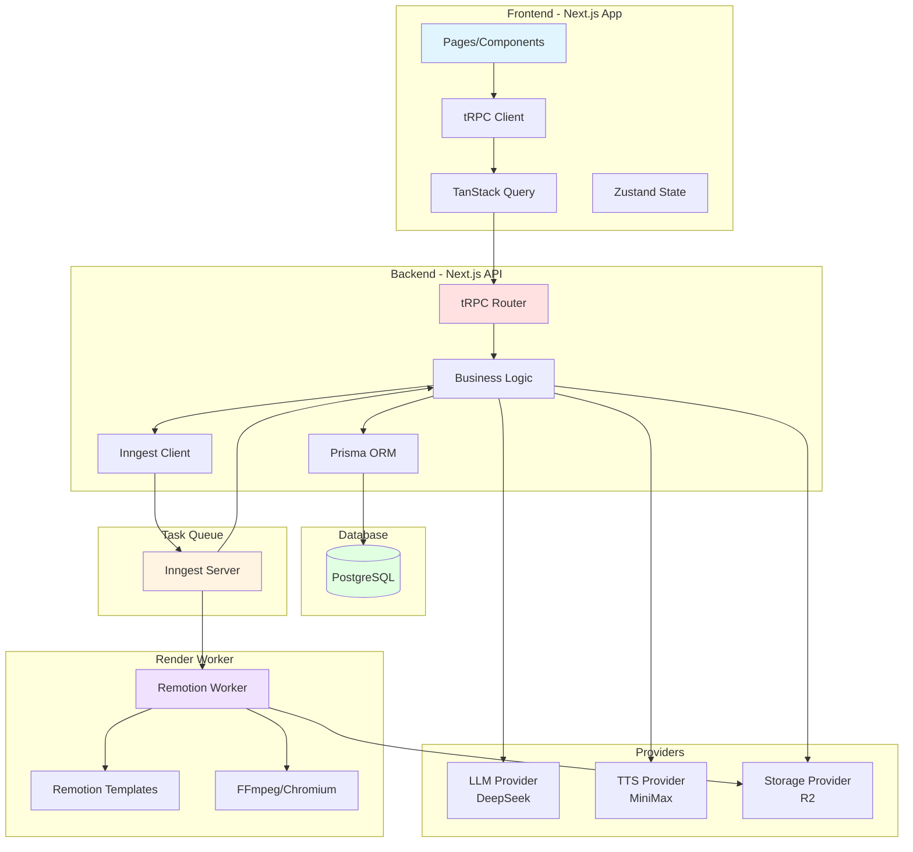
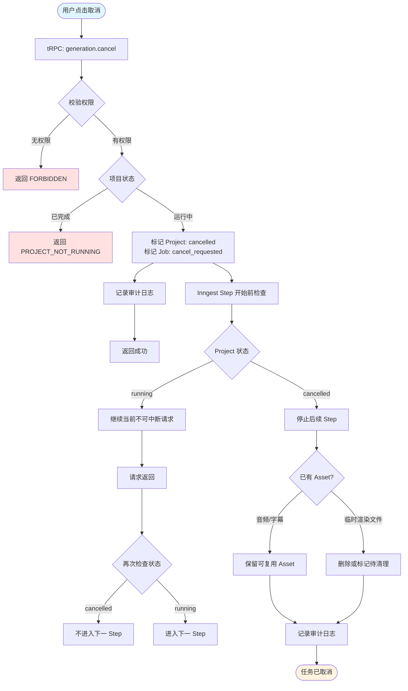
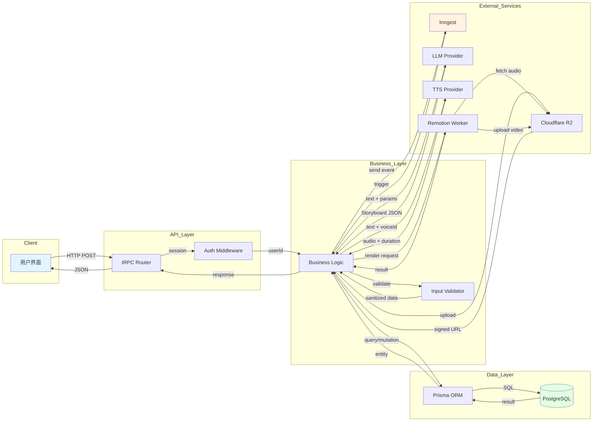

# Technical Design Document - Volcano AI 微课视频生成平台

## 1. 文档信息

### 项目名称

Volcano AI 微课视频生成平台

### 技术文档版本

v1.0.0

### 作者

Tech Lead & System Architect

### 创建时间

2026-06-14

### 状态

Draft

### 变更记录

| 版本 | 日期 | 变更说明 |
|------|------|----------|
| v1.0.0 | 2026-06-14 | 创建 TDD 初稿，基于 PRD v1.0.6 |

---

## 2. 技术目标

### 功能目标

1. **AI 文本转分镜**：将用户输入的 AI 回答文本转换为结构化 Storyboard JSON
2. **TTS 语音合成**：逐 scene 生成高质量中文语音，支持句级字幕时间戳
3. **视频渲染**：基于 Remotion 模板渲染 PPT 风格微课视频（MP4）
4. **异步任务编排**：使用 Inngest 编排长任务，支持失败重试和任务取消
5. **资源管理**：使用 Cloudflare R2 存储音频、字幕、分镜 JSON、缩略图和视频
6. **项目管理**：用户可创建、查看、删除项目，查看生成进度和最终结果

### 技术目标

1. **技术栈统一**：使用 Next.js App Router + tRPC + Prisma + PostgreSQL + Inngest 构建全栈平台
2. **Provider 抽象**：LLM、TTS、Storage、Render 能力均通过 Provider 接口抽象，不直接依赖具体厂商 SDK
3. **Remotion 集成**：在项目内集成 Remotion 作为视频模板与动效引擎，渲染执行由独立 Worker 承载
4. **数据模型规范**：建立 Storyboard、Scene、Asset、Job 状态机等核心数据模型
5. **可扩展架构**：支持后续接入新 LLM、新 TTS、新渲染器、分镜编辑器
6. **成本可控**：记录每次 LLM、TTS、渲染的资源消耗，支持额度控制

### 性能目标

| 指标 | 目标值 | 说明 |
|------|--------|------|
| 创建项目接口 P95 | ≤ 800ms | 不等待生成完成，仅创建 Project 和触发事件 |
| 项目详情查询 P95 | ≤ 500ms | 包含 Project、Job、Storyboard、Assets |
| 项目列表查询 P95 | ≤ 800ms | 分页查询，默认 20 条 |
| 3 分钟视频生成 P75 | ≤ 8 分钟 | 端到端耗时，包含 LLM、TTS、渲染、上传 |
| TTS 音频与画面时长错位投诉率 | ≤ 2% | 通过服务端解析音频 duration 保证 |
| 首次生成成功率 | ≥ 85% | 排除用户输入错误 |
| 生成任务可恢复率 | ≥ 95% | 重试后无需从头重做全部步骤 |
| 失败原因展示覆盖率 | ≥ 95% | 用户可理解的错误提示 |

### 可扩展性目标

1. **Storyboard Schema 版本化**：支持 schema 升级，旧版本仍可渲染
2. **Scene Type 可扩展**：第一版限制 7 种类型，但架构支持后续扩展
3. **Provider 可替换**：通过环境变量切换 LLM、TTS、Storage、Render
4. **Remotion 模板可扩展**：通过模板注册表管理，新增模板不破坏已有视频渲染
5. **多渲染器支持**：第一版使用项目内 Remotion，架构支持后续接入 HyperFrames 等

### 安全目标

1. **认证授权**：所有业务 API 必须校验 better-auth session
2. **资源隔离**：用户只能访问自己的项目和资源
3. **私有存储**：R2 bucket 默认私有，通过签名 URL 访问
4. **密钥管理**：Provider API Key 仅保存在服务端环境变量
5. **内容安全**：用户输入文本需基础敏感内容检测
6. **审计日志**：记录用户关键操作和管理员操作

---

## 3. 总体架构设计

### 架构概览

### 模块划分

| 模块 | 职责 | 输入 | 输出 |
|------|------|------|------|
| **Web UI** | 页面渲染、用户交互、状态管理 | 用户操作、API 响应 | 页面展示、API 请求 |
| **tRPC API** | 接口定义、权限校验、业务调用 | HTTP Request、Session | JSON Response |
| **Business Logic** | 核心业务逻辑、数据校验、Provider 调用 | tRPC Input、Job Event | Database 写入、Provider 调用 |
| **Inngest Orchestration** | 异步任务编排、重试、状态流转 | Event Payload | Step 执行、状态更新 |
| **LLM Provider** | 生成 Storyboard、修复 JSON | 文本、参数 | Storyboard JSON |
| **TTS Provider** | 文本转语音、返回音频和字幕 | 文本、语音 ID | 音频文件、Duration、Captions |
| **Storage Provider** | 文件上传、签名 URL 生成 | 文件、Key | R2 Key、Signed URL |
| **Render Provider** | 调用 Remotion Worker 渲染视频 | Storyboard、Config | 视频文件、缩略图 |
| **Remotion Worker** | 视频渲染执行、资源拉取、编码 | Render Job、Storyboard | MP4 文件 |
| **Database** | 数据持久化、事务管理 | SQL Query | Query Result |

### 模块依赖关系

**上游 → 下游调用关系：**

1. **Web UI** → tRPC API（HTTP/WebSocket）
2. **tRPC API** → Business Logic（同进程函数调用）
3. **Business Logic** → Prisma ORM（同进程函数调用）
4. **Business Logic** → Inngest Client（HTTP Event 发送）
5. **Inngest Server** → tRPC API（HTTP Webhook 回调）
6. **Business Logic** → LLM Provider（HTTP API）
7. **Business Logic** → TTS Provider（HTTP API）
8. **Business Logic** → Storage Provider（S3 SDK）
9. **Business Logic** → Render Provider（HTTP API，内部 Worker）
10. **Remotion Worker** → Storage Provider（拉取音频、上传视频）

**调用方式：**

- Web ↔ API：HTTPS（tRPC over HTTP POST）
- API ↔ Inngest：HTTPS（Event 发送 + Webhook 回调）
- API ↔ LLM/TTS：HTTPS（RESTful API）
- API ↔ R2：HTTPS（S3-compatible SDK）
- API ↔ Remotion Worker：HTTPS（内部 HTTP API + token）

**同步/异步：**

- 创建项目：同步返回 projectId，异步执行生成
- 查询项目：同步
- 生成 Storyboard：异步（Inngest Step）
- 生成 TTS：异步（Inngest Step，逐 scene 串行或并行）
- 渲染视频：异步（Inngest Step 调用 Worker）
- 取消任务：同步标记 cancelled，异步软终止
- 重试任务：同步创建新 Job，异步执行

---

## 4. 核心业务流程设计

### 主流程：创建项目并生成视频

```mermaid
flowchart TD
    Start([用户提交文本和参数]) --> Validate[前端校验]
    Validate --> CreateAPI[tRPC: project.createAndGenerate]
    CreateAPI --> CheckAuth{校验登录态}
    CheckAuth -->|未登录| AuthError[返回 UNAUTHORIZED]
    CheckAuth -->|已登录| CheckQuota{校验额度}
    CheckQuota -->|不足| QuotaError[返回 QUOTA_EXCEEDED]
    CheckQuota -->|充足| CheckConcurrent{校验并发限制}
    CheckConcurrent -->|超限| ConcurrentError[返回 CONCURRENT_LIMIT_EXCEEDED]
    CheckConcurrent -->|通过| CreateProject[创建 Project<br/>状态: queued]
    CreateProject --> CreateJob[创建 GenerationJob<br/>状态: pending]
    CreateJob --> SendEvent[发送 Inngest 事件<br/>video/generate.requested]
    SendEvent --> ReturnResponse[返回 projectId]
    
    SendEvent --> InngestStart[Inngest 接收事件]
    InngestStart --> Step1[Step 1: 生成 Storyboard]
    Step1 --> CallLLM[调用 LLM Provider]
    CallLLM --> ValidateSchema{校验 Schema}
    ValidateSchema -->|失败| RepairJSON[repair JSON<br/>最多 2 次]
    RepairJSON --> ValidateSchema
    ValidateSchema -->|成功| SaveStoryboard[保存 StoryboardVersion<br/>和 Scene 表]
    SaveStoryboard --> UploadStoryboardJSON[上传 JSON 到 R2]
    
    UploadStoryboardJSON --> Step2[Step 2: 生成音频]
    Step2 --> ForEachScene[遍历每个 Scene]
    ForEachScene --> CheckCache{检查音频缓存}
    CheckCache -->|已存在| ReuseAudio[复用 Asset]
    CheckCache -->|不存在| CallTTS[调用 TTS Provider]
    CallTTS --> UploadAudio[上传音频到 R2]
    UploadAudio --> SaveAsset[保存 Asset<br/>记录 durationMs]
    SaveAsset --> UpdateScene[更新 Scene.audioAssetId<br/>和 durationMs]
    ReuseAudio --> UpdateScene
    UpdateScene --> NextScene{还有下一个 scene?}
    NextScene -->|是| ForEachScene
    NextScene -->|否| Step3[Step 3: 计算时间轴]
    
    Step3 --> CalculateTimeline[计算每个 scene<br/>startFrame 和 durationFrames]
    CalculateTimeline --> UpdateStoryboard[更新 StoryboardVersion<br/>timeline 和 totalFrames]
    
    UpdateStoryboard --> Step4[Step 4: 渲染视频]
    Step4 --> CallWorker[调用 Remotion Worker]
    CallWorker --> WorkerRender[Worker 拉取音频<br/>执行 Remotion 渲染]
    WorkerRender --> GenerateThumbnail[生成缩略图]
    GenerateThumbnail --> UploadVideo[上传 MP4 和缩略图到 R2]
    UploadVideo --> SaveVideoAsset[保存视频 Asset]
    SaveVideoAsset --> UpdateProject[更新 Project 状态<br/>completed]
    UpdateProject --> End([生成完成])
    
    style Start fill:#e1f5ff
    style End fill:#e1ffe1
    style AuthError fill:#ffe1e1
    style QuotaError fill:#ffe1e1
    style ConcurrentError fill:#ffe1e1
```

### 异常流程：失败重试

### 异常流程：用户取消任务

### 回滚流程：resume 重试

---

## 5. 数据流设计

### Data Flow Diagram

### 用户请求数据流示例：创建项目

1. **用户输入** → 前端表单收集：`sourceText`, `audienceRole`, `aspectRatio`, `targetDurationSec`, `voiceProvider`, `voiceId`
2. **前端校验** → 字数限制、必填项、格式校验
3. **tRPC 请求** → `project.createAndGenerate` mutation
4. **Auth 中间件** → 从 session 提取 `userId`
5. **业务校验** → 校验额度、并发限制、语音可用性
6. **数据库写入** → 
   - 插入 `Project` 表（状态 `queued`）
   - 插入 `GenerationJob` 表（状态 `pending`）
7. **事件发送** → Inngest `video/generate.requested` 事件
8. **响应返回** → `{ projectId, status: 'queued' }`
9. **前端跳转** → 进度页 `/projects/:id`

### 异步生成数据流示例：生成 Storyboard

1. **Inngest 触发** → `video/generate.requested` 事件到达
2. **读取 Project** → 从数据库查询 `sourceText` 和参数
3. **调用 LLM** → DeepSeek API，传入 prompt 和参数
4. **LLM 响应** → 返回 Storyboard JSON
5. **Schema 校验** → Zod 校验，失败则调用 repair
6. **数据库写入** →
   - 插入 `StoryboardVersion` 表
   - 批量插入 `Scene` 表
7. **上传 R2** → Storyboard JSON 文件
8. **Asset 记录** → 插入 `Asset` 表（type: `storyboard_json`）
9. **状态更新** → Project 状态 → `storyboard_ready`
10. **进入下一 Step** → 生成音频

---
