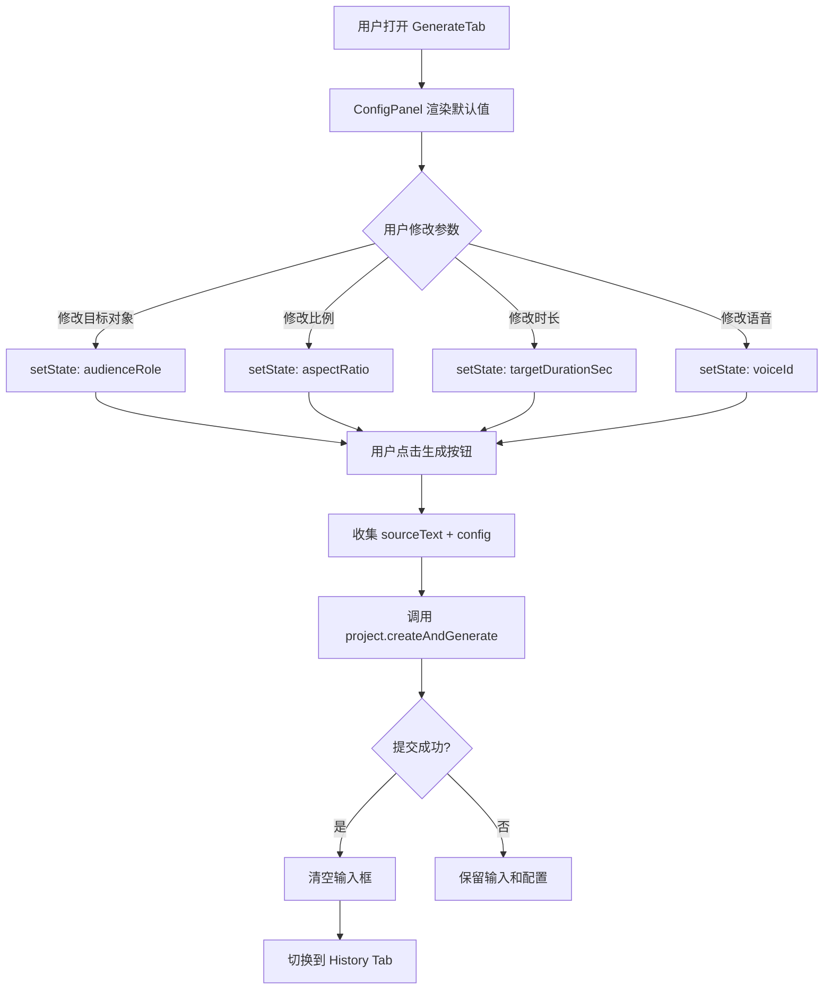

# Change: ep2-04-config-panel-enhancement

## 元信息

| 属性 | 内容 |
|------|------|
| **Change ID** | `ep2-04-config-panel-enhancement` |
| **Change Type** | FEATURE |
| **所属 Epic** | Epic 2: 项目管理与 Dashboard |
| **优先级** | P0 |
| **预估规模** | M（~600 LOC） |
| **预估工期** | 2 天 |
| **前置 Change** | `ep2-01-project-create-api`（API 已支持参数）、`ep2-03-dashboard-page`（GenerateTab 基础 UI 已完成） |
| **目标代码库** | `E:\A\Ai\convert documents to videos` |
| **实施状态** | 🎯 待开始 |

---

## 1. Change Overview

### Goal

为 GenerateTab 添加可折叠的**参数配置面板**，让用户自定义视频生成参数（目标对象、难度、比例、时长、语音），替换当前硬编码的 `DEFAULT_CONFIG`。

### User Value

- 用户可以根据场景定制视频参数（如学生/教师、16:9/9:16）
- 提供专业控制感，提升产品完成度
- 为后续付费计划预留差异化参数（如更多语音选项）

### Business Value

- 满足不同用户场景需求（教学视频 vs 短视频）
- 提升用户留存率（更多可配置项 = 更高参与度）
- 为付费用户提供高级参数选项奠定基础

### Related Epic

Epic 2: 项目管理与 Dashboard

### Priority

P0 — 核心用户体验，必须在 Phase 1 完成

---

## 2. Scope Definition

### ✅ 包含内容

1. **参数配置面板组件**（`ConfigPanel.tsx`）
   - 5 个参数项：目标对象、难度级别、视频比例、时长、语音
   - 可折叠面板（默认展开）
   - 极简黑白设计，与 GenerateTab 视觉一致

2. **参数输入组件**
   - 目标对象（audienceRole）：Radio Group（学生 / 教师）
   - 难度级别（audienceLevel）：Select 下拉（入门 / 中级 / 高级）
   - 视频比例（aspectRatio）：Radio Group（16:9 / 9:16 / 1:1）
   - 视频时长（targetDurationSec）：Segmented Control（1分钟 / 3分钟 / 5分钟）
   - 语音（voiceProvider + voiceId）：Select 下拉（Mock 数据，6 个选项）

3. **GenerateTab 集成**
   - ConfigPanel 放置在输入框下方（垂直间距 24px）
   - 使用 React state 管理配置参数
   - 提交时使用用户配置替换 DEFAULT_CONFIG
   - 配置项实时生效（无需保存按钮）

4. **前端校验**
   - 所有参数必填（UI 默认值确保始终有效）
   - 无异步校验（参数均为枚举值）

5. **响应式适配**
   - 移动端（< 768px）：单列布局
   - 桌面端（≥ 768px）：双列布局

### ❌ 不包含内容

- ❌ 实际 TTS 语音列表 API 调用（`provider.listTtsVoices`）→ Epic 4 `ep4-04`
- ❌ 配置预设保存功能（草稿/模板）→ 后续版本
- ❌ 高级参数（音频速度、动效风格）→ 付费功能
- ❌ 参数推荐引擎（AI 自动推荐最优参数）→ 后续版本
- ❌ 实时预览（参数变化时预览视频效果）→ 后续版本

---

## 3. Technical Design Refinement

### 涉及模块

- **前端组件**：GenerateTab（修改）、ConfigPanel（新建）
- **UI 组件库**：RadioGroup、Select、Collapsible（已有 shadcn/ui 组件）
- **状态管理**：React useState（无需 Zustand，配置项不跨组件）

### 涉及领域模型

- **Project Config**（前端 TS 类型）

### 数据流



---

## 4. Impact Analysis

| Area | Impact | 说明 |
|------|--------|------|
| Database | ✗ | 无数据库变更（参数已存在于 Project 表） |
| API | ✗ | API 已支持参数（ep2-01 完成） |
| Frontend | ✓ | 修改 GenerateTab，新增 ConfigPanel |
| Cache | ✗ | 无缓存需求 |
| Queue | ✗ | 不影响 Inngest |
| Storage | ✗ | 不涉及文件存储 |
| Logging | ✗ | 无日志变更 |
| Monitoring | ✗ | 无监控变更 |
| Tests | ✓ | 新增组件单元测试 |
| Docs | ✓ | 更新用户使用文档 |

---

## 5. File Planning

### New Files

```
src/components/main-app/ConfigPanel.tsx              ~200 LOC  # 参数配置面板
src/components/main-app/ConfigItem.tsx               ~80 LOC   # 单个配置项
src/lib/validation/project-config.ts                 ~100 LOC  # 前端校验 Zod Schema
src/lib/constants/project-config.ts                  ~60 LOC   # 参数枚举和 Mock 数据
tests/components/ConfigPanel.test.tsx                ~150 LOC  # 组件测试
```

### Modified Files

```
src/components/main-app/GenerateTab.tsx              ~40 LOC   # 集成 ConfigPanel + 状态管理
```

### Deleted Files

无

### Directory Impact

```
src/
├── components/
│   └── main-app/
│       ├── GenerateTab.tsx          [修改]
│       ├── ConfigPanel.tsx          [新建]
│       └── ConfigItem.tsx           [新建]
├── lib/
│   ├── validation/
│   │   └── project-config.ts        [新建]
│   └── constants/
│       └── project-config.ts        [新建]
└── tests/
    └── components/
        └── ConfigPanel.test.tsx     [新建]
```

---

## 6. Implementation Tasks

### Task 1: 定义参数常量和类型

**目标**：建立参数枚举、默认值、Mock 数据

**实施步骤**：
1. 创建 `src/lib/constants/project-config.ts`
2. 定义枚举：`AUDIENCE_ROLES`, `AUDIENCE_LEVELS`, `ASPECT_RATIOS`, `DURATIONS`
3. 定义 Mock 语音列表（6 个选项）
4. 定义 `DEFAULT_CONFIG` 常量
5. 导出 TypeScript 类型 `ProjectConfig`

**完成标准**：
- [ ] 所有枚举值与 API Schema 一致
- [ ] Mock 语音列表含 6 个选项（3 男声 + 3 女声）
- [ ] 类型可被 GenerateTab 导入使用

**预估时间**：0.5 天

---

### Task 2: 创建 ConfigPanel 组件

**目标**：实现可折叠的参数配置面板

**实施步骤**：
1. 创建 `src/components/main-app/ConfigPanel.tsx`
2. 使用 shadcn/ui `Collapsible` 组件
3. 实现 5 个参数项布局（2 列网格）
4. 添加折叠/展开动画
5. 添加参数说明文字（辅助理解）

**完成标准**：
- [ ] 默认展开状态
- [ ] 点击标题可折叠/展开
- [ ] 桌面端 2 列，移动端 1 列
- [ ] 黑白极简设计，符合品牌调性

**预估时间**：0.5 天

---

### Task 3: 实现 5 个参数输入组件

**目标**：创建各参数的输入 UI

**实施步骤**：
1. **目标对象**：使用 RadioGroup（学生/教师）
2. **难度级别**：使用 Select 下拉（入门/中级/高级）
3. **视频比例**：使用 RadioGroup（16:9/9:16/1:1）
4. **视频时长**：使用 SegmentedControl（1分钟/3分钟/5分钟）
5. **语音**：使用 Select 下拉（Mock 6 个选项）

**完成标准**：
- [ ] 所有输入组件样式一致
- [ ] 选中状态明显（视觉反馈清晰）
- [ ] 支持键盘导航（Tab 键切换）
- [ ] 移动端触控友好（最小 44px 触控目标）

**预估时间**：0.5 天

---

### Task 4: 集成到 GenerateTab

**目标**：将 ConfigPanel 嵌入 GenerateTab 并实现状态联动

**实施步骤**：
1. 修改 `GenerateTab.tsx`，添加配置 state
2. 将 ConfigPanel 放置在输入框下方
3. 实现配置变化回调（`onConfigChange`）
4. 提交时使用用户配置替换硬编码 DEFAULT_CONFIG
5. 调整布局间距（输入框与面板之间 24px）

**完成标准**：
- [ ] ConfigPanel 正确渲染
- [ ] 配置参数实时更新到 state
- [ ] 提交时传递正确的配置参数
- [ ] 成功/失败后配置项保留（不重置）

**预估时间**：0.3 天

---

### Task 5: 添加前端校验

**目标**：确保参数有效性

**实施步骤**：
1. 创建 `src/lib/validation/project-config.ts`
2. 定义 Zod Schema `ProjectConfigSchema`
3. 在 GenerateTab 提交前校验
4. 校验失败显示 toast 错误提示

**完成标准**：
- [ ] 所有枚举值校验正确
- [ ] 必填项校验生效
- [ ] 错误提示友好（中文）

**预估时间**：0.2 天

---

## 7. Dependencies

### Upstream Changes

**必须依赖**：
- `ep2-01-project-create-api`：API 已支持 `audienceRole`, `aspectRatio`, `targetDurationSec`, `voiceId` 等参数
- `ep2-03-dashboard-page`：GenerateTab 基础 UI（输入框 + 按钮）已完成

**可选依赖**：
- `ep4-04-asset-signed-url-api`：真实 TTS 语音列表 API（本 Change 使用 Mock 数据）

### Downstream Changes

**被依赖**：
- `ep6-01-progress-page`：进度页需要显示用户选择的参数
- `ep2-02-project-list-detail-api`：项目列表可能需要显示参数标签（如"16:9"）

### Blocking Risks

无阻塞风险。本 Change 为纯前端增强，不影响现有功能。

---

## 8. Acceptance Criteria

### Happy Path

```gherkin
Given 用户在 GenerateTab 页面
When 用户点击"配置参数"展开面板
Then 显示 5 个参数项，默认值为 DEFAULT_CONFIG

Given 用户修改了目标对象为"教师"
And 用户修改了比例为"9:16"
And 用户修改了时长为"3分钟"
When 用户输入文本并点击生成按钮
Then 调用 API 时传递用户选择的参数（而非硬编码）

Given 用户提交成功
When 清空输入框并切换到 History Tab
Then 配置参数保留（不重置为默认值）
```

### Error Path

```gherkin
Given 用户修改了参数但输入框为空
When 用户点击生成按钮
Then 按钮保持 disabled 状态，无法提交

Given 用户提交失败（API 错误）
When 显示错误 toast
Then 输入框和配置参数均保留，用户可重新提交
```

### Edge Cases

```gherkin
# 边界 1：快速切换参数
Given 用户快速点击多个参数选项
When 所有点击事件处理完毕
Then 最终 state 为最后一次点击的值

# 边界 2：折叠状态下提交
Given 用户折叠了配置面板
When 用户提交生成请求
Then 使用当前配置参数（不因折叠而重置）

# 边界 3：移动端单列布局
Given 用户在 375px 宽度设备上访问
When ConfigPanel 渲染
Then 显示单列布局，所有参数项垂直排列
```

### Permission Cases

无需权限控制（已登录用户均可访问）。

### Retry Cases

无需重试逻辑（参数配置为纯客户端操作）。

---

## 9. Test Plan

### Unit Test

**需要覆盖**：
1. **ConfigPanel.test.tsx**
   - 默认展开状态
   - 点击折叠/展开功能
   - 5 个参数项正确渲染
   - `onConfigChange` 回调触发
   - 响应式布局（桌面 2 列，移动 1 列）

2. **GenerateTab.test.tsx**（修改现有测试）
   - 提交时传递用户配置参数
   - 成功后配置参数不重置
   - 失败后配置参数保留

3. **project-config.test.ts**（Zod 校验）
   - 合法参数通过校验
   - 非法参数抛出错误

### Integration Test

**需要覆盖**：
1. **GenerateTab + ConfigPanel 联动**
   - 用户修改参数 → state 更新
   - 用户提交 → API 收到正确参数
   - API 返回成功 → 配置保留
   - API 返回失败 → 配置保留

### E2E Test

**需要覆盖**：
1. **完整生成流程（含自定义参数）**
   - 登录 → 进入 GenerateTab
   - 修改参数（教师 + 9:16 + 3分钟）
   - 输入文本 → 点击生成
   - 跳转到 History Tab → 项目状态为 `queued`

### Regression Test

**需要覆盖**：
1. **现有功能不受影响**
   - 输入框扩展行为正常
   - 按钮状态切换正常
   - 提交成功跳转正常
   - 错误处理正常

---

## 10. Rollback Plan

### Code Rollback

**步骤**：
1. 恢复 `GenerateTab.tsx` 到修改前版本（Git revert）
2. 删除新增文件：`ConfigPanel.tsx`, `ConfigItem.tsx`, `project-config.ts`, `tests/`
3. 重新部署前端（Vercel 自动部署或手动触发）
4. 验证：GenerateTab 恢复为硬编码配置，功能正常

**预计回滚时间**：< 5 分钟

### Data Rollback

无需数据回滚（纯前端变更，不涉及数据库）。

### Config Rollback

无配置文件变更。

### Feature Flag Rollback

无 Feature Flag。若需要，可在 GenerateTab 中添加：

```typescript
const ENABLE_CONFIG_PANEL = process.env.NEXT_PUBLIC_ENABLE_CONFIG_PANEL === 'true';

return (
  <>
    <AutoResizeTextarea ... />
    {ENABLE_CONFIG_PANEL && <ConfigPanel ... />}
  </>
);
```

---

## 11. OpenSpec Output

### change.md

```markdown
# Change: ep2-04-config-panel-enhancement

## Goal

为 GenerateTab 添加参数配置面板，让用户自定义视频生成参数（目标对象、比例、时长、语音）。

## Why

当前 GenerateTab 使用硬编码配置，无法满足不同场景需求（如教学视频 vs 短视频）。
添加配置面板可提升产品专业度和用户满意度。

## Scope

- ✅ ConfigPanel 组件（5 个参数项）
- ✅ 集成到 GenerateTab
- ✅ 前端校验
- ❌ 实际 TTS 语音列表 API（使用 Mock 数据）
```

### design.md

```markdown
# Design: ConfigPanel Architecture

## Component Structure

```
GenerateTab
├── AutoResizeTextarea + IconButton
└── ConfigPanel
    ├── Collapsible Header
    └── Config Items Grid (2 columns)
        ├── audienceRole (RadioGroup)
        ├── audienceLevel (Select)
        ├── aspectRatio (RadioGroup)
        ├── targetDurationSec (SegmentedControl)
        └── voiceId (Select)
```

## State Management

```typescript
// GenerateTab.tsx
const [config, setConfig] = useState<ProjectConfig>(DEFAULT_CONFIG);

const handleConfigChange = (key: keyof ProjectConfig, value: string | number) => {
  setConfig(prev => ({ ...prev, [key]: value }));
};

const handleSubmit = () => {
  createMutation.mutate({
    sourceText: text.trim(),
    requestId: crypto.randomUUID(),
    ...config, // 用户配置
  });
};
```

## Visual Design

- **布局**：输入框下方 24px 间距
- **面板背景**：透明（无背景色）
- **边框**：1px 细线 `border-border`
- **间距**：Grid gap 16px
- **响应式**：`grid-cols-1 md:grid-cols-2`
```

### tasks.md

```markdown
# Tasks

## Task 1: 定义参数常量
- [ ] 创建 `lib/constants/project-config.ts`
- [ ] 定义枚举和 Mock 数据
- [ ] 导出 TypeScript 类型

## Task 2: 创建 ConfigPanel 组件
- [ ] 实现 Collapsible 结构
- [ ] 添加 2 列网格布局
- [ ] 添加响应式支持

## Task 3: 实现 5 个参数输入
- [ ] audienceRole RadioGroup
- [ ] audienceLevel Select
- [ ] aspectRatio RadioGroup
- [ ] targetDurationSec SegmentedControl
- [ ] voiceId Select

## Task 4: 集成到 GenerateTab
- [ ] 添加配置 state
- [ ] 实现 onConfigChange 回调
- [ ] 提交时使用用户配置

## Task 5: 前端校验
- [ ] 定义 Zod Schema
- [ ] 提交前校验
- [ ] 错误提示
```

---

## 12. AI Implementation Readiness Check

### Scope Too Large

✅ **否**。本 Change 约 600 LOC，在 300-1500 LOC 目标范围内。

### Hidden Dependencies

✅ **无**。所有依赖明确列出（ep2-01, ep2-03）。

### Context Explosion

✅ **无风险**。
- 核心文件：ConfigPanel.tsx（~200 LOC）+ GenerateTab.tsx（修改 ~40 LOC）
- 辅助文件：constants/project-config.ts（~60 LOC）
- 总计不超过 500 LOC 核心代码

### Testing Gap

✅ **已覆盖**。
- Unit Test：ConfigPanel 组件测试
- Integration Test：GenerateTab + ConfigPanel 联动
- E2E Test：完整生成流程

### Rollback Risk

✅ **低风险**。
- 纯前端变更，无数据库 migration
- Git revert 即可回滚
- 预计回滚时间 < 5 分钟

---

## 13. 实施建议

### 推荐实施顺序

1. **Task 1 → Task 2 → Task 3**（基础组件开发）
2. **Task 4**（集成到 GenerateTab）
3. **Task 5**（前端校验）
4. **测试 → 部署 → 验收**

### 并行开发可能性

- Task 2 和 Task 3 可部分并行（ConfigPanel 结构 + 单个参数输入组件）
- Task 5 可与 Task 4 并行（独立的校验逻辑）

### 关键风险点

1. **语音列表 Mock 数据不准确**
   - 风险：用户选择的 voiceId 在 Epic 4 接入真实 API 时不存在
   - 缓解：提前与 MiniMax API 文档对齐，使用真实的 voiceId

2. **参数枚举值与 API Schema 不一致**
   - 风险：前端校验通过，但 API 拒绝参数
   - 缓解：从 ep2-01 的 Zod Schema 导出枚举值，确保一致性

3. **ConfigPanel 折叠状态影响用户体验**
   - 风险：用户忘记修改参数，使用默认值
   - 缓解：默认展开 + 参数值在标题栏显示摘要

---

## 14. 技术细节补充

### ConfigPanel 数据结构

```typescript
// src/lib/constants/project-config.ts

export const AUDIENCE_ROLES = [
  { value: 'student', label: '学生' },
  { value: 'teacher', label: '教师' },
] as const;

export const AUDIENCE_LEVELS = [
  { value: 'beginner', label: '入门' },
  { value: 'intermediate', label: '中级' },
  { value: 'advanced', label: '高级' },
] as const;

export const ASPECT_RATIOS = [
  { value: '16:9', label: '横屏 (16:9)' },
  { value: '9:16', label: '竖屏 (9:16)' },
  { value: '1:1', label: '方形 (1:1)' },
] as const;

export const DURATIONS = [
  { value: 60, label: '1 分钟' },
  { value: 180, label: '3 分钟' },
  { value: 300, label: '5 分钟' },
] as const;

export const MOCK_VOICES = [
  { providerId: 'minimax', voiceId: 'male-qn-qingse', label: '青涩青年（男）' },
  { providerId: 'minimax', voiceId: 'male-qn-jingying', label: '精英青年（男）' },
  { providerId: 'minimax', voiceId: 'male-qn-badao', label: '霸道青年（男）' },
  { providerId: 'minimax', voiceId: 'female-shaonv', label: '灿烂少女（女）' },
  { providerId: 'minimax', voiceId: 'female-yujie', label: '御姐（女）' },
  { providerId: 'minimax', voiceId: 'female-chengshu', label: '成熟女性（女）' },
] as const;

export const DEFAULT_CONFIG = {
  audienceRole: 'student',
  audienceLevel: 'intermediate',
  aspectRatio: '16:9',
  targetDurationSec: 120,
  voiceProvider: 'minimax',
  voiceId: 'male-qn-qingse',
} as const;

export type ProjectConfig = typeof DEFAULT_CONFIG;
```

### ConfigPanel 组件接口

```typescript
// src/components/main-app/ConfigPanel.tsx

interface ConfigPanelProps {
  config: ProjectConfig;
  onConfigChange: (key: keyof ProjectConfig, value: string | number) => void;
  disabled?: boolean; // 提交中时禁用
}

export function ConfigPanel({ config, onConfigChange, disabled }: ConfigPanelProps) {
  const [isOpen, setIsOpen] = useState(true);
  
  return (
    <Collapsible open={isOpen} onOpenChange={setIsOpen}>
      <CollapsibleTrigger className="flex items-center justify-between w-full">
        <span>配置参数</span>
        <ChevronDown className={cn("transition-transform", isOpen && "rotate-180")} />
      </CollapsibleTrigger>
      
      <CollapsibleContent>
        <div className="grid grid-cols-1 md:grid-cols-2 gap-4 pt-4">
          {/* 5 个参数项 */}
        </div>
      </CollapsibleContent>
    </Collapsible>
  );
}
```

### GenerateTab 修改摘要

```typescript
// src/components/main-app/GenerateTab.tsx (修改部分)

export function GenerateTab({ onTabChange }: GenerateTabProps) {
  const [text, setText] = useState("");
  const [config, setConfig] = useState<ProjectConfig>(DEFAULT_CONFIG); // 新增

  const handleConfigChange = useCallback((key: keyof ProjectConfig, value: string | number) => {
    setConfig(prev => ({ ...prev, [key]: value }));
  }, []);

  const handleSubmit = useCallback(() => {
    if (isTextEmpty || isPending) return;
    createMutation.mutate({
      sourceText: text.trim(),
      requestId: crypto.randomUUID(),
      ...config, // 使用用户配置
    });
  }, [text, config, isTextEmpty, isPending, createMutation]); // 新增 config 依赖

  return (
    <div className="flex flex-col items-center justify-center min-h-[calc(100vh-3.5rem)] px-6 py-12">
      <div className="w-full max-w-3xl space-y-6"> {/* 新增 space-y-6 */}
        {/* 输入区域 */}
        <div className="relative">...</div>
        
        {/* 配置面板 - 新增 */}
        <ConfigPanel 
          config={config}
          onConfigChange={handleConfigChange}
          disabled={isPending}
        />
      </div>
    </div>
  );
}
```

---

## 15. 用户体验优化

### 视觉层次

1. **输入框**（主要）：视觉权重最高，居中显示
2. **配置面板**（辅助）：视觉权重次之，默认展开但可折叠
3. **间距**：输入框与面板间距 24px，避免拥挤

### 交互反馈

1. **参数变化**：无需"保存"按钮，实时生效
2. **折叠动画**：流畅的展开/收起动画（300ms）
3. **禁用状态**：提交中时配置面板变灰，防止误操作

### 移动端适配

1. **单列布局**：< 768px 时所有参数项垂直排列
2. **触控目标**：最小 44px，符合移动端标准
3. **折叠默认状态**：移动端可考虑默认折叠（节省空间）

---

## 16. 后续扩展计划

### Phase 2（Epic 4 完成后）

- 集成真实 TTS 语音列表 API（`provider.listTtsVoices`）
- 语音试听功能（点击播放语音样本）

### Phase 3（付费功能）

- 高级参数：音频速度（0.8x - 1.5x）
- 高级参数：动效风格（淡入/滑动/缩放）
- 高级参数：自定义 Logo 水印

### Phase 4（AI 推荐）

- 基于文本内容自动推荐最优参数
- 参数预设模板（教学视频/营销短视频/知识科普）

---

**文档版本**：v1.0  
**创建日期**：2026-06-16  
**创建人**：Claude Opus 4.8  
**审核状态**：待审核
