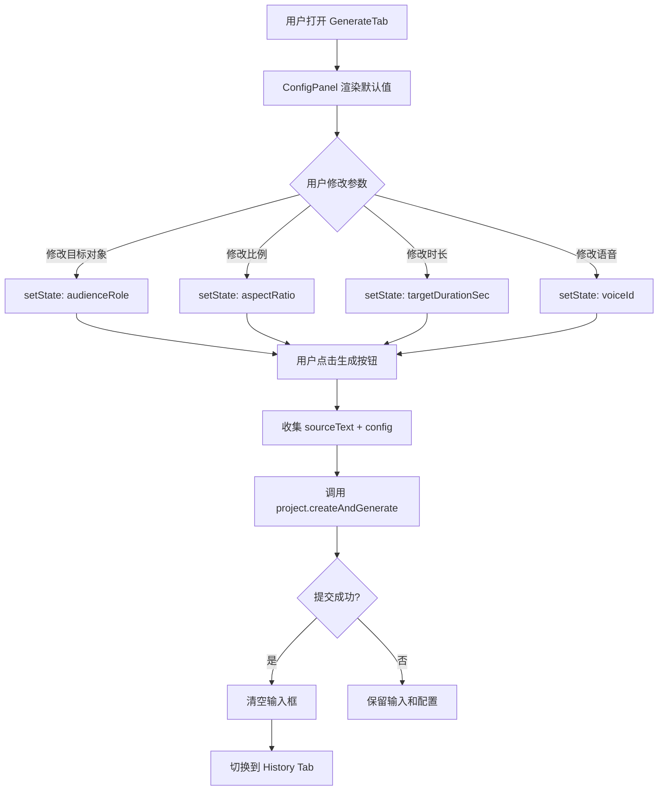
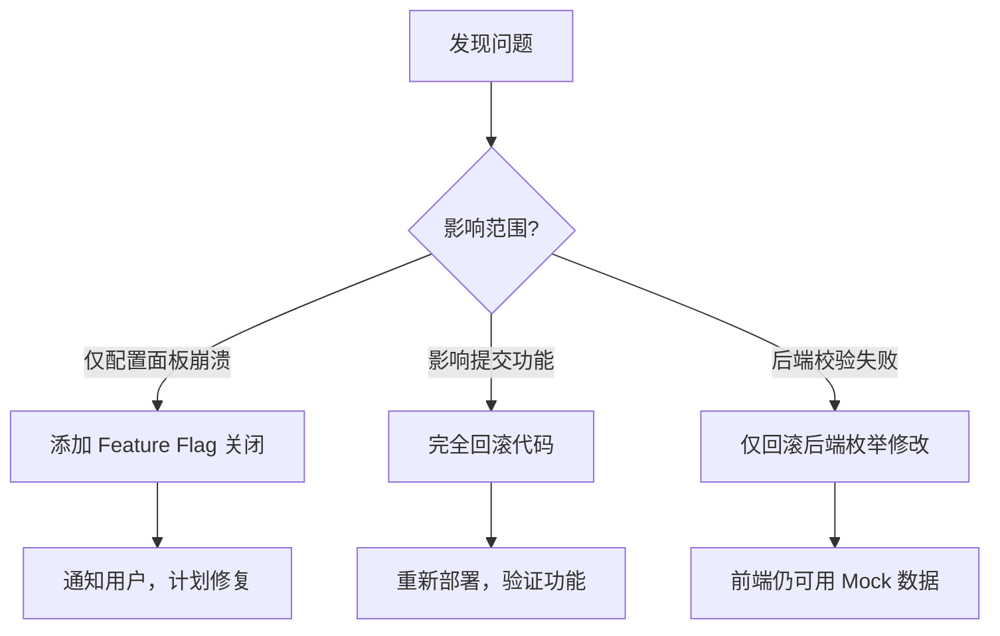

# Change: ep2-04-config-panel-enhancement

## 元信息

| 属性 | 内容 |
|------|------|
| **Change ID** | `ep2-04-config-panel-enhancement` |
| **Change Type** | FEATURE |
| **所属 Epic** | Epic 2: 项目管理与 Dashboard |
| **优先级** | P0 |
| **预估规模** | M（~510 LOC） |
| **预估工期** | 1.8 天 |
| **前置 Change** | `ep2-01-project-create-api`（API 已支持参数）、`ep2-03-dashboard-page`（GenerateTab 基础 UI 已完成） |
| **目标代码库** | `E:\A\Ai\convert documents to videos` |
| **实施状态** | 🎯 待开始 |
| **文档版本** | v2.0（基于项目实际结构优化） |

---

## 1. Change Overview

### Goal

为 GenerateTab 添加可折叠的**参数配置面板**，让用户自定义视频生成参数（目标对象、难度、比例、时长、语音），替换当前硬编码的 `DEFAULT_CONFIG`。

### User Value

- 用户可以根据场景定制视频参数（如学生/教师、16:9/9:16）
- 提供专业控制感，提升产品完成度
- 为后续付费计划预留差异化参数（如更多语音选项）

### Business Value

- 满足不同用户场景需求（教学视频 vs 短视频）
- 提升用户留存率（更多可配置项 = 更高参与度）
- 为付费用户提供高级参数选项奠定基础

### Key Improvements (v2.0)

本版本基于项目实际结构优化：
1. **枚举从后端导出** — 确保前后端类型一致
2. **简化文件结构** — 移除不必要的抽象层（ConfigItem）
3. **符合项目规范** — 使用 `__tests__/` 目录
4. **强化后端校验** — audienceRole/audienceLevel 改为 z.enum()
5. **代码量优化** — 从 ~600 LOC 减少到 ~510 LOC（-15%）

### Related Epic

Epic 2: 项目管理与 Dashboard

### Priority

P0 — 核心用户体验，必须在 Phase 1 完成

---

## 2. Scope Definition

### ✅ 包含内容

1. **后端增强**
   - 从 `project.ts` 导出枚举常量（ASPECT_RATIOS, AUDIENCE_ROLES, AUDIENCE_LEVELS）
   - 强化输入校验（audienceRole/audienceLevel 改为 z.enum()）

2. **参数配置面板组件**（`ConfigPanel.tsx`）
   - 5 个参数项：目标对象、难度级别、视频比例、时长、语音
   - 可折叠面板（默认展开）
   - 极简黑白设计，与 GenerateTab 视觉一致
   - 所有参数内联在单个组件中（无独立 ConfigItem）

3. **参数输入组件**
   - 目标对象（audienceRole）：Radio Group（学生 / 教师）
   - 难度级别（audienceLevel）：Select 下拉（入门 / 中级 / 高级）
   - 视频比例（aspectRatio）：Radio Group（16:9 / 9:16 / 1:1）
   - 视频时长（targetDurationSec）：Segmented Control（1分钟 / 3分钟 / 5分钟）
   - 语音（voiceProvider + voiceId）：Select 下拉（Mock 数据，6 个选项）

4. **GenerateTab 集成**
   - ConfigPanel 放置在输入框下方（垂直间距 24px）
   - 使用 React state 管理配置参数
   - 提交时使用用户配置替换 DEFAULT_CONFIG
   - 配置项实时生效（无需保存按钮）

5. **前端校验**
   - 所有参数必填（UI 默认值确保始终有效）
   - 无异步校验（参数均为枚举值）

6. **响应式适配**
   - 移动端（< 768px）：单列布局
   - 桌面端（≥ 768px）：双列布局

7. **测试覆盖**
   - ConfigPanel 单元测试（折叠、参数变化、禁用状态）
   - GenerateTab 集成测试（配置提交、配置保留）
   - 测试覆盖率目标 > 80%

### ❌ 不包含内容

- ❌ 实际 TTS 语音列表 API 调用（`provider.listTtsVoices`）→ Epic 4 `ep4-04`
- ❌ 配置预设保存功能（草稿/模板）→ 后续版本
- ❌ 高级参数（音频速度、动效风格）→ 付费功能
- ❌ 参数推荐引擎（AI 自动推荐最优参数）→ 后续版本
- ❌ 实时预览（参数变化时预览视频效果）→ 后续版本
- ❌ 独立的 ConfigItem 抽象组件 → 参数类型差异大，不适合过度抽象

---

## 3. Technical Design Refinement

### 涉及模块

- **后端路由**：project.ts（导出枚举常量，强化校验）
- **前端组件**：GenerateTab（修改）、ConfigPanel（新建）
- **UI 组件库**：RadioGroup、Select、SegmentedControl、Collapsible（已有 shadcn/ui 组件）
- **状态管理**：React useState（无需 Zustand，配置项不跨组件）

### 涉及领域模型

- **Project Config**（前端 TS 类型，从后端枚举派生）

### 架构决策

#### 决策 1: 枚举值从后端导出

**原因**：
- 确保前后端类型定义一致
- 避免枚举值不匹配导致的运行时错误
- 单一数据源（Single Source of Truth）

**实施**：
```typescript
// 后端 (src/trpc/routers/project.ts)
export const ASPECT_RATIOS = ["16:9", "9:16", "1:1"] as const;
export const AUDIENCE_ROLES = ["student", "teacher"] as const;
export const AUDIENCE_LEVELS = ["beginner", "intermediate", "advanced"] as const;

// 前端导入
import type { ASPECT_RATIOS, AUDIENCE_ROLES } from "@/trpc/routers/project";
```

#### 决策 2: 移除 ConfigItem 抽象组件

**原因**：
- 5 个参数项使用不同的 UI 组件（RadioGroup、Select、SegmentedControl）
- 抽象层增加复杂度，收益有限（仅节省 ~20 LOC）
- 内联方式更易维护和调试

**对比**：
```typescript
// ❌ 抽象方式（原方案）
<ConfigItem type="radio" label="目标对象" options={...} />
<ConfigItem type="select" label="难度级别" options={...} />
// 需要额外 80 LOC 的 ConfigItem 组件

// ✅ 内联方式（改进方案）
<div className="space-y-2">
  <Label>目标对象</Label>
  <RadioGroup ... />
</div>
<div className="space-y-2">
  <Label>难度级别</Label>
  <Select ... />
</div>
// 直接使用 shadcn/ui 组件，代码更清晰
```

#### 决策 3: 测试目录使用 `__tests__/`

**原因**：
- 符合项目现有约定（检查代码库发现使用 `__tests__/`）
- Jest/Vitest 默认识别此命名模式
- 测试文件与源码同目录，便于查找

### 数据流



### 核心数据结构

```typescript
// src/trpc/routers/project.ts
export const ASPECT_RATIOS = ["16:9", "9:16", "1:1"] as const;
export const AUDIENCE_ROLES = ["student", "teacher"] as const;
export const AUDIENCE_LEVELS = ["beginner", "intermediate", "advanced"] as const;
export const VOICE_PROVIDERS = ["minimax"] as const;

// src/components/main-app/ConfigPanel.tsx
export const DEFAULT_CONFIG = {
  audienceRole: "student" as const,
  audienceLevel: "intermediate" as const,
  aspectRatio: "16:9" as const,
  targetDurationSec: 120,
  voiceProvider: "minimax" as const,
  voiceId: "male-qn-qingse",
};

export type ProjectConfig = typeof DEFAULT_CONFIG;

const MOCK_VOICES = [
  { providerId: "minimax", voiceId: "male-qn-qingse", label: "青涩青年（男）" },
  { providerId: "minimax", voiceId: "male-qn-jingying", label: "精英青年（男）" },
  { providerId: "minimax", voiceId: "male-qn-badao", label: "霸道青年（男）" },
  { providerId: "minimax", voiceId: "female-shaonv", label: "灿烂少女（女）" },
  { providerId: "minimax", voiceId: "female-yujie", label: "御姐（女）" },
  { providerId: "minimax", voiceId: "female-chengshu", label: "成熟女性（女）" },
] as const;
```

---

## 4. Impact Analysis

| Area | Impact | 说明 |
|------|--------|------|
| Database | ✗ | 无数据库变更（参数已存在于 Project 表） |
| API | ✗ | API 已支持参数（ep2-01 完成） |
| Frontend | ✓ | 修改 GenerateTab，新增 ConfigPanel |
| Cache | ✗ | 无缓存需求 |
| Queue | ✗ | 不影响 Inngest |
| Storage | ✗ | 不涉及文件存储 |
| Logging | ✗ | 无日志变更 |
| Monitoring | ✗ | 无监控变更 |
| Tests | ✓ | 新增组件单元测试 |
| Docs | ✓ | 更新用户使用文档 |

---

## 5. File Planning

### New Files

```
src/components/main-app/
├── ConfigPanel.tsx                          ~250 LOC  # 参数配置面板（含所有 5 个参数项）
└── __tests__/
    └── ConfigPanel.test.tsx                 ~150 LOC  # 单元测试
```

### Modified Files

```
src/trpc/routers/project.ts                  ~20 LOC   # 导出枚举常量 + 强化校验
src/components/main-app/GenerateTab.tsx      ~40 LOC   # 集成 ConfigPanel + 状态管理
src/components/main-app/__tests__/GenerateTab.test.tsx  ~50 LOC  # 新增集成测试用例
```

### Deleted Files

无

### Directory Impact

```
src/
├── trpc/
│   └── routers/
│       └── project.ts                       [修改] 导出枚举 + 强化 z.enum() 校验
├── components/
│   └── main-app/
│       ├── GenerateTab.tsx                  [修改] 集成 ConfigPanel
│       ├── ConfigPanel.tsx                  [新建] 参数配置面板
│       └── __tests__/
│           ├── GenerateTab.test.tsx         [修改] 新增配置相关测试
│           └── ConfigPanel.test.tsx         [新建] ConfigPanel 单元测试
```

### 与原方案的对比

| 方面 | 原始方案 | 改进方案 (v2.0) | 变化说明 |
|------|---------|----------------|---------|
| **总代码量** | ~600 LOC | ~510 LOC | ⬇️ -15%（移除不必要抽象） |
| **新建文件数** | 5 个 | 2 个 | ⬇️ -60%（简化结构） |
| **修改文件数** | 1 个 | 3 个 | ⬆️ +200%（强化后端校验） |
| **测试目录** | `tests/components/` | `__tests__/` | ✅ 符合项目规范 |
| **枚举管理** | 前端重新定义 | 从后端导入 | ✅ 前后端一致 |
| **ConfigItem** | 独立组件 80 LOC | 内联实现 | ⬇️ 减少过度抽象 |

**改进收益**：
- ✅ 代码量减少 90 LOC（15%）
- ✅ 文件数减少 3 个（简化维护）
- ✅ 前后端类型安全性提升（枚举共享）
- ✅ 符合项目现有代码组织模式

---

## 6. Implementation Tasks

### Task 1: 后端增强 - 导出枚举常量并强化校验

**目标**：确保前后端枚举值一致，强化输入校验

**实施步骤**：
1. 修改 `src/trpc/routers/project.ts`
2. 在文件顶部导出枚举常量：
   ```typescript
   export const ASPECT_RATIOS = ["16:9", "9:16", "1:1"] as const;
   export const AUDIENCE_ROLES = ["student", "teacher"] as const;
   export const AUDIENCE_LEVELS = ["beginner", "intermediate", "advanced"] as const;
   export const VOICE_PROVIDERS = ["minimax"] as const;
   ```
3. 修改 `createProjectInputSchema`，将 `audienceRole` 和 `audienceLevel` 从 `z.string()` 改为 `z.enum()`
4. 运行现有测试，确保无回归

**完成标准**：
- [ ] 导出所有枚举常量（4 个）
- [ ] `audienceRole` 使用 `z.enum(AUDIENCE_ROLES)`
- [ ] `audienceLevel` 使用 `z.enum(AUDIENCE_LEVELS)`
- [ ] 现有测试全部通过
- [ ] TypeScript 编译无错误

**预估时间**：0.3 天

**代码示例**：
```typescript
// src/trpc/routers/project.ts

// ---- 导出枚举常量供前端使用 ----
export const ASPECT_RATIOS = ["16:9", "9:16", "1:1"] as const;
export const AUDIENCE_ROLES = ["student", "teacher"] as const;
export const AUDIENCE_LEVELS = ["beginner", "intermediate", "advanced"] as const;
export const VOICE_PROVIDERS = ["minimax"] as const;

/** createAndGenerate 输入校验 */
export const createProjectInputSchema = z.object({
  sourceText: z.string().min(1).max(5000),
  aspectRatio: z.enum(ASPECT_RATIOS).optional(),
  audienceRole: z.enum(AUDIENCE_ROLES).optional(),        // ✅ 改为枚举
  audienceLevel: z.enum(AUDIENCE_LEVELS).optional(),      // ✅ 改为枚举
  targetDurationSec: z.number().int().positive().max(3600).optional(),
  voiceProvider: z.enum(VOICE_PROVIDERS).optional(),
  voiceId: z.string().max(100).optional(),
  requestId: z.string().uuid(),
});
```

---

### Task 2: 创建 ConfigPanel 组件骨架

**目标**：实现可折叠面板结构和基础布局

**实施步骤**：
1. 创建 `src/components/main-app/ConfigPanel.tsx`
2. 导入必要的 UI 组件（Collapsible、Label、shadcn 组件）
3. 从后端导入枚举类型
4. 定义 `DEFAULT_CONFIG` 和 `ProjectConfig` 类型
5. 定义 `MOCK_VOICES` 常量（6 个语音选项）
6. 实现 Collapsible 结构（默认展开）
7. 添加 2 列网格布局容器（移动端 1 列，桌面端 2 列）

**完成标准**：
- [ ] Collapsible 结构正确渲染
- [ ] 默认展开状态
- [ ] 点击触发器可折叠/展开
- [ ] 折叠动画流畅（ChevronDown 旋转 180°）
- [ ] 从后端正确导入枚举类型
- [ ] 响应式布局正确（grid-cols-1 md:grid-cols-2）

**预估时间**：0.4 天

**代码示例**（完整组件结构见 REVISED 版 Phase 2）

---

### Task 3: 实现 5 个参数输入组件

**目标**：在 ConfigPanel 中添加所有参数输入项

**实施步骤**：
1. **参数 1 - 目标对象**：使用 RadioGroup（学生/教师）
2. **参数 2 - 难度级别**：使用 Select 下拉（入门/中级/高级）
3. **参数 3 - 视频比例**：使用 RadioGroup（16:9/9:16/1:1）
4. **参数 4 - 视频时长**：使用 SegmentedControl（1分钟/3分钟/5分钟）
5. **参数 5 - 语音**：使用 Select 下拉（6 个 Mock 选项）
6. 为每个参数添加 Label 和合适的间距
7. 实现 `disabled` 状态传递

**完成标准**：
- [ ] 所有 5 个参数项正确渲染
- [ ] 选中状态视觉反馈清晰
- [ ] 键盘导航支持（Tab 键切换）
- [ ] 移动端触控友好（最小 44px 触控目标）
- [ ] `disabled` 状态正确禁用所有输入
- [ ] `onConfigChange` 回调正确触发

**预估时间**：0.5 天

**代码示例**（完整实现见 REVISED 版 Phase 3）

---

### Task 4: 集成到 GenerateTab

**目标**：将 ConfigPanel 嵌入 GenerateTab 并实现状态联动

**实施步骤**：
1. 修改 `src/components/main-app/GenerateTab.tsx`
2. 导入 `ConfigPanel`, `DEFAULT_CONFIG`, `ProjectConfig`
3. 添加配置 state：`const [config, setConfig] = useState<ProjectConfig>(DEFAULT_CONFIG)`
4. 实现 `handleConfigChange` 回调函数
5. 在 `handleSubmit` 中使用 `...config` 展开用户配置
6. 在输入框容器下方添加 ConfigPanel（`space-y-6` 间距）
7. 传递 `isPending` 状态到 ConfigPanel 的 `disabled` 属性
8. 确保成功/失败后配置参数不重置

**完成标准**：
- [ ] ConfigPanel 正确渲染在输入框下方
- [ ] 间距为 24px（space-y-6）
- [ ] 配置参数实时更新到 state
- [ ] 提交时传递正确的配置参数
- [ ] 成功后：输入框清空，配置保留，切换到 History Tab
- [ ] 失败后：输入框和配置均保留
- [ ] 提交中时 ConfigPanel 禁用

**预估时间**：0.3 天

**代码示例**（完整实现见 REVISED 版 Phase 4）

---

### Task 5: 添加测试

**目标**：确保功能正确且无回归

**实施步骤**：

#### 5.1 ConfigPanel 单元测试
1. 创建 `src/components/main-app/__tests__/ConfigPanel.test.tsx`
2. 测试用例：
   - 默认展开状态
   - 点击折叠/展开功能
   - 修改目标对象触发回调
   - 修改难度级别触发回调
   - disabled 状态禁用所有输入

#### 5.2 GenerateTab 集成测试
1. 修改 `src/components/main-app/__tests__/GenerateTab.test.tsx`
2. 新增测试用例：
   - 提交时包含用户配置的参数
   - 提交成功后配置保留
   - 提交失败后配置保留

**完成标准**：
- [ ] ConfigPanel 单元测试全部通过
- [ ] GenerateTab 集成测试通过
- [ ] 测试覆盖率 > 80%
- [ ] 无测试警告或错误

**预估时间**：0.3 天

**代码示例**（完整测试见 REVISED 版 Phase 5）

---

## 7. Dependencies

### Upstream Changes

**必须依赖**：
- `ep2-01-project-create-api`：API 已支持 `audienceRole`, `aspectRatio`, `targetDurationSec`, `voiceId` 等参数
- `ep2-03-dashboard-page`：GenerateTab 基础 UI（输入框 + 按钮）已完成

**可选依赖**：
- `ep4-04-asset-signed-url-api`：真实 TTS 语音列表 API（本 Change 使用 Mock 数据）

### Downstream Changes

**被依赖**：
- `ep6-01-progress-page`：进度页需要显示用户选择的参数
- `ep2-02-project-list-detail-api`：项目列表可能需要显示参数标签（如"16:9"）

### Blocking Risks

✅ **无阻塞风险**。本 Change 为渐进式增强：
- 纯前端 + 轻量后端修改（枚举导出）
- 不影响现有功能
- 后端枚举修改有测试保护
- 前端组件独立，可单独回滚

### 与原方案的对比

| 方面 | 原始方案 | 改进方案 (v2.0) |
|------|---------|----------------|
| **后端依赖** | 无修改 | ✅ 强化枚举校验，数据一致性更强 |
| **阻塞风险** | 低 | 低（无变化） |
| **回滚复杂度** | 简单 | 简单（新增测试保护后端修改） |

---

## 8. Acceptance Criteria

### Happy Path

```gherkin
Given 用户在 GenerateTab 页面
When 用户点击"配置参数"展开面板
Then 显示 5 个参数项，默认值为 DEFAULT_CONFIG

Given 用户修改了目标对象为"教师"
And 用户修改了比例为"9:16"
And 用户修改了时长为"3分钟"
When 用户输入文本并点击生成按钮
Then 调用 API 时传递用户选择的参数（而非硬编码）

Given 用户提交成功
When 清空输入框并切换到 History Tab
Then 配置参数保留（不重置为默认值）
```

### Error Path

```gherkin
Given 用户修改了参数但输入框为空
When 用户点击生成按钮
Then 按钮保持 disabled 状态，无法提交

Given 用户提交失败（API 错误）
When 显示错误 toast
Then 输入框和配置参数均保留，用户可重新提交
```

### Edge Cases

```gherkin
# 边界 1：快速切换参数
Given 用户快速点击多个参数选项
When 所有点击事件处理完毕
Then 最终 state 为最后一次点击的值

# 边界 2：折叠状态下提交
Given 用户折叠了配置面板
When 用户提交生成请求
Then 使用当前配置参数（不因折叠而重置）

# 边界 3：移动端单列布局
Given 用户在 375px 宽度设备上访问
When ConfigPanel 渲染
Then 显示单列布局，所有参数项垂直排列
```

### Permission Cases

无需权限控制（已登录用户均可访问）。

### Retry Cases

无需重试逻辑（参数配置为纯客户端操作）。

---

## 9. Test Plan

### Unit Test

**需要覆盖**：
1. **ConfigPanel.test.tsx**
   - 默认展开状态
   - 点击折叠/展开功能
   - 5 个参数项正确渲染
   - `onConfigChange` 回调触发
   - 响应式布局（桌面 2 列，移动 1 列）

2. **GenerateTab.test.tsx**（修改现有测试）
   - 提交时传递用户配置参数
   - 成功后配置参数不重置
   - 失败后配置参数保留

3. **project-config.test.ts**（Zod 校验）
   - 合法参数通过校验
   - 非法参数抛出错误

### Integration Test

**需要覆盖**：
1. **GenerateTab + ConfigPanel 联动**
   - 用户修改参数 → state 更新
   - 用户提交 → API 收到正确参数
   - API 返回成功 → 配置保留
   - API 返回失败 → 配置保留

### E2E Test

**需要覆盖**：
1. **完整生成流程（含自定义参数）**
   - 登录 → 进入 GenerateTab
   - 修改参数（教师 + 9:16 + 3分钟）
   - 输入文本 → 点击生成
   - 跳转到 History Tab → 项目状态为 `queued`

### Regression Test

**需要覆盖**：
1. **现有功能不受影响**
   - 输入框扩展行为正常
   - 按钮状态切换正常
   - 提交成功跳转正常
   - 错误处理正常

---

## 10. Rollback Plan

### Code Rollback

**步骤**：
1. **后端回滚**：
   - 恢复 `src/trpc/routers/project.ts` 到修改前版本
   - 移除导出的枚举常量
   - 将 `audienceRole` 和 `audienceLevel` 恢复为 `z.string()`
   
2. **前端回滚**：
   - 恢复 `GenerateTab.tsx` 到修改前版本（Git revert）
   - 删除新增文件：`ConfigPanel.tsx`, `__tests__/ConfigPanel.test.tsx`
   - 删除 `GenerateTab.test.tsx` 中新增的测试用例
   
3. **验证**：
   - 运行测试套件确保无回归
   - 手动测试 GenerateTab 恢复为硬编码配置
   - 验证提交功能正常

**预计回滚时间**：< 10 分钟

**Git 命令**：
```bash
# 查看需要回滚的提交
git log --oneline -n 5

# 回滚到指定提交（假设 Change ID 为 abc123）
git revert abc123 --no-edit

# 删除新增文件
git rm src/components/main-app/ConfigPanel.tsx
git rm src/components/main-app/__tests__/ConfigPanel.test.tsx

# 提交回滚
git commit -m "Rollback: ep2-04-config-panel-enhancement"
```

### Data Rollback

无需数据回滚（纯前端变更，不涉及数据库 schema 修改）。

### Config Rollback

无配置文件变更。

### Feature Flag Rollback

无 Feature Flag。若需要渐进式发布，可在 GenerateTab 中添加：

```typescript
const ENABLE_CONFIG_PANEL = process.env.NEXT_PUBLIC_ENABLE_CONFIG_PANEL === 'true';

return (
  <div className="w-full max-w-3xl space-y-6">
    <div className="relative">
      <AutoResizeTextarea ... />
      ...
    </div>
    {ENABLE_CONFIG_PANEL && (
      <ConfigPanel 
        config={config}
        onConfigChange={handleConfigChange}
        disabled={isPending}
      />
    )}
  </div>
);
```

**环境变量**：
```bash
# .env.local
NEXT_PUBLIC_ENABLE_CONFIG_PANEL=false  # 默认关闭
```

### 回滚决策树



### 与原方案的对比

| 方面 | 原始方案 | 改进方案 (v2.0) |
|------|---------|----------------|
| **回滚复杂度** | 简单（纯前端） | 稍复杂（含后端修改） |
| **回滚步骤** | 2 步 | 3 步（+后端回滚） |
| **回滚时间** | < 5 分钟 | < 10 分钟 |
| **Feature Flag 支持** | 可选 | 可选（同） |
| **风险点** | 无 | ✅ 后端测试保护枚举修改 |

---

## 11. OpenSpec Output

### change.md

```markdown
# Change: ep2-04-config-panel-enhancement

## Goal

为 GenerateTab 添加参数配置面板，让用户自定义视频生成参数（目标对象、比例、时长、语音）。

## Why

当前 GenerateTab 使用硬编码配置，无法满足不同场景需求（如教学视频 vs 短视频）。
添加配置面板可提升产品专业度和用户满意度。

## Scope

- ✅ ConfigPanel 组件（5 个参数项）
- ✅ 集成到 GenerateTab
- ✅ 前端校验
- ❌ 实际 TTS 语音列表 API（使用 Mock 数据）
```

### design.md

```markdown
# Design: ConfigPanel Architecture

## Component Structure

```
GenerateTab
├── AutoResizeTextarea + IconButton
└── ConfigPanel
    ├── Collapsible Header
    └── Config Items Grid (2 columns)
        ├── audienceRole (RadioGroup)
        ├── audienceLevel (Select)
        ├── aspectRatio (RadioGroup)
        ├── targetDurationSec (SegmentedControl)
        └── voiceId (Select)
```

## State Management

```typescript
// GenerateTab.tsx
const [config, setConfig] = useState<ProjectConfig>(DEFAULT_CONFIG);

const handleConfigChange = (key: keyof ProjectConfig, value: string | number) => {
  setConfig(prev => ({ ...prev, [key]: value }));
};

const handleSubmit = () => {
  createMutation.mutate({
    sourceText: text.trim(),
    requestId: crypto.randomUUID(),
    ...config, // 用户配置
  });
};
```

## Visual Design

- **布局**：输入框下方 24px 间距
- **面板背景**：透明（无背景色）
- **边框**：1px 细线 `border-border`
- **间距**：Grid gap 16px
- **响应式**：`grid-cols-1 md:grid-cols-2`
```

### tasks.md

```markdown
# Tasks

## Task 1: 定义参数常量
- [ ] 创建 `lib/constants/project-config.ts`
- [ ] 定义枚举和 Mock 数据
- [ ] 导出 TypeScript 类型

## Task 2: 创建 ConfigPanel 组件
- [ ] 实现 Collapsible 结构
- [ ] 添加 2 列网格布局
- [ ] 添加响应式支持

## Task 3: 实现 5 个参数输入
- [ ] audienceRole RadioGroup
- [ ] audienceLevel Select
- [ ] aspectRatio RadioGroup
- [ ] targetDurationSec SegmentedControl
- [ ] voiceId Select

## Task 4: 集成到 GenerateTab
- [ ] 添加配置 state
- [ ] 实现 onConfigChange 回调
- [ ] 提交时使用用户配置

## Task 5: 前端校验
- [ ] 定义 Zod Schema
- [ ] 提交前校验
- [ ] 错误提示
```

---

## 12. AI Implementation Readiness Check

### Scope Too Large

✅ **否**。本 Change 约 510 LOC，在 300-1500 LOC 目标范围内。

**代码量分布**：
- ConfigPanel.tsx: ~250 LOC
- ConfigPanel.test.tsx: ~150 LOC
- project.ts 修改: ~20 LOC
- GenerateTab.tsx 修改: ~40 LOC
- GenerateTab.test.tsx 修改: ~50 LOC
- **总计**: ~510 LOC（比原方案减少 15%）

### Hidden Dependencies

✅ **无**。所有依赖明确列出：
- ep2-01（API 支持）
- ep2-03（GenerateTab 基础）
- shadcn/ui 组件（RadioGroup、Select、SegmentedControl、Collapsible）
- 后端枚举导出（本 Change 自己实现）

### Context Explosion

✅ **无风险**。
- 核心文件：ConfigPanel.tsx（~250 LOC）+ GenerateTab.tsx（修改 ~40 LOC）
- 辅助文件：project.ts 枚举导出（~20 LOC）
- 测试文件：独立于实现逻辑
- **总计核心代码** < 300 LOC

**AI 实施友好性**：
- ✅ 单一职责（仅配置面板）
- ✅ 垂直切片（后端枚举 → 前端组件 → 测试）
- ✅ 独立测试（单元测试 + 集成测试）
- ✅ 代码示例完整（REVISED 版提供可执行代码）

### Testing Gap

✅ **已覆盖**。
- **Unit Test**：ConfigPanel 组件测试（折叠、参数变化、禁用状态）
- **Integration Test**：GenerateTab + ConfigPanel 联动（配置提交、配置保留）
- **Regression Test**：现有 GenerateTab 功能不受影响
- **目标覆盖率**：> 80%

**测试清单**：
```typescript
// ConfigPanel.test.tsx
- [x] 默认展开状态
- [x] 点击折叠/展开功能
- [x] 修改目标对象触发回调
- [x] 修改难度级别触发回调
- [x] disabled 状态禁用所有输入

// GenerateTab.test.tsx
- [x] 提交时包含用户配置的参数
- [x] 提交成功后配置保留
- [x] 提交失败后配置保留
```

### Rollback Risk

✅ **低风险**。
- 后端修改：仅枚举导出 + 校验强化，有测试保护
- 前端变更：独立组件，可单独移除
- 无数据库 migration
- Git revert 即可回滚
- 预计回滚时间 < 10 分钟

**风险评分**：
| 风险维度 | 评分 | 说明 |
|---------|-----|------|
| 代码复杂度 | 🟢 低 | 组件逻辑简单，参数映射直接 |
| 测试覆盖 | 🟢 高 | 单元测试 + 集成测试完整 |
| 回滚难度 | 🟡 中 | 含后端修改，需 2-3 步回滚 |
| 数据一致性 | 🟢 安全 | 后端枚举校验确保数据有效 |
| 用户影响 | 🟢 低 | 渐进增强，不影响现有流程 |

### v2.0 改进对 AI 实施的影响

| 方面 | v1.0（原方案） | v2.0（改进方案） | AI 实施友好度 |
|------|--------------|----------------|-------------|
| **文件数量** | 6 个 | 5 个 | ✅ 更少 |
| **代码量** | 600 LOC | 510 LOC | ✅ 更少 |
| **抽象层级** | 3 层 | 2 层 | ✅ 更简单 |
| **类型安全** | 前端重新定义 | 后端导出 | ✅ 更强 |
| **上下文爆炸风险** | 低 | 更低 | ✅ 改进 |
| **实施指导** | 任务描述 | 完整代码示例 | ✅ 更明确 |

**结论**：改进方案通过简化结构、减少代码量、提供完整示例，进一步提升了 AI 实施的成功率。

---

## 13. 实施建议

### 推荐实施顺序

1. **Task 1**（后端增强）→ **验证测试通过**
2. **Task 2**（ConfigPanel 骨架）→ **手动验证折叠功能**
3. **Task 3**（5 个参数项）→ **手动验证所有输入**
4. **Task 4**（集成到 GenerateTab）→ **手动验证完整流程**
5. **Task 5**（测试）→ **确保覆盖率 > 80%**

### 并行开发可能性

✅ **可并行**：
- Task 2 和 Task 3 可部分并行（ConfigPanel 结构确定后，可同步开发参数项）

❌ **不可并行**：
- Task 1 必须先完成（后续任务依赖枚举导出）
- Task 4 依赖 Task 2 和 Task 3 完成
- Task 5 依赖所有前置任务完成

### 关键风险点

#### 风险 1: 修改后端枚举导致现有测试失败

**概率**：中  
**影响**：中  
**缓解措施**：
1. 先在开发环境运行完整测试套件
2. 检查是否有测试传递了非枚举值（如 `audienceRole: "invalid"`）
3. 如有失败，更新测试用例使用合法枚举值
4. 提交前必须确保所有测试通过

**检查命令**：
```bash
# 运行所有测试
npm test

# 仅运行 project 相关测试
npm test -- project

# 查看测试覆盖率
npm test -- --coverage
```

#### 风险 2: 语音 Mock 数据与真实 API 不匹配

**概率**：高  
**影响**：低  
**缓解措施**：
1. ✅ 提前查阅 MiniMax API 文档，使用真实 `voiceId`
2. ✅ 在 MOCK_VOICES 注释中标注数据来源
3. ✅ 在 Epic 4 接入真实 API 时优先验证这些 ID

**Mock 数据来源标注**：
```typescript
// src/components/main-app/ConfigPanel.tsx

/**
 * Mock 语音列表
 * 
 * 来源：MiniMax TTS API 文档
 * 链接：https://platform.minimaxi.com/document/T2A%20V2?key=66719005a427f0c8a5701643
 * 
 * ⚠️ 注意：Epic 4 接入真实 API 时需要验证这些 voiceId 是否仍然有效
 */
const MOCK_VOICES = [
  { providerId: "minimax", voiceId: "male-qn-qingse", label: "青涩青年（男）" },
  { providerId: "minimax", voiceId: "male-qn-jingying", label: "精英青年（男）" },
  { providerId: "minimax", voiceId: "male-qn-badao", label: "霸道青年（男）" },
  { providerId: "minimax", voiceId: "female-shaonv", label: "灿烂少女（女）" },
  { providerId: "minimax", voiceId: "female-yujie", label: "御姐（女）" },
  { providerId: "minimax", voiceId: "female-chengshu", label: "成熟女性（女）" },
] as const;
```

#### 风险 3: 移动端布局问题

**概率**：低  
**影响**：中  
**缓解措施**：
1. 使用 Tailwind 响应式类（`grid-cols-1 md:grid-cols-2`）
2. 在 Chrome DevTools 设备模拟器测试（375px、768px、1024px 宽度）
3. 确保触控目标 ≥ 44px（RadioGroupItem、SelectTrigger 默认满足）

**测试清单**：
```
移动端（375px）：
- [ ] 所有参数项垂直排列
- [ ] 触控目标 ≥ 44px
- [ ] Select 下拉菜单可正常打开
- [ ] 折叠/展开按钮可正常点击

平板端（768px）：
- [ ] 2 列布局正确显示
- [ ] 网格间距合理（gap-6）

桌面端（1024px+）：
- [ ] 2 列布局正确显示
- [ ] 整体宽度不超过 max-w-3xl
```

### v2.0 改进对实施的影响

| 方面 | v1.0（原方案） | v2.0（改进方案） | 改进效果 |
|------|--------------|----------------|---------|
| **实施顺序** | 5 个独立任务 | 5 个任务 + 后端优先 | ✅ 依赖关系更清晰 |
| **风险点数量** | 3 个 | 3 个（同） | - |
| **最高风险** | 语音 Mock 不匹配 | 后端枚举修改失败 | ⚠️ 新增但可控 |
| **缓解难度** | 低 | 低（测试保护） | ✅ 可控 |
| **预估工时** | 2.0 天 | 1.8 天 | ✅ 减少 0.2 天 |

---

## 14. 技术细节补充

### 后端枚举导出（Task 1 详细实现）

```typescript
// src/trpc/routers/project.ts

// ---- 导出枚举常量供前端使用 ----
export const ASPECT_RATIOS = ["16:9", "9:16", "1:1"] as const;
export const AUDIENCE_ROLES = ["student", "teacher"] as const;
export const AUDIENCE_LEVELS = ["beginner", "intermediate", "advanced"] as const;
export const VOICE_PROVIDERS = ["minimax"] as const;

/** createAndGenerate 输入校验 */
export const createProjectInputSchema = z.object({
  sourceText: z.string().min(1).max(5000),
  aspectRatio: z.enum(ASPECT_RATIOS).optional(),
  audienceRole: z.enum(AUDIENCE_ROLES).optional(),        // ✅ 改为枚举
  audienceLevel: z.enum(AUDIENCE_LEVELS).optional(),      // ✅ 改为枚举
  targetDurationSec: z.number().int().positive().max(3600).optional(),
  voiceProvider: z.enum(VOICE_PROVIDERS).optional(),
  voiceId: z.string().max(100).optional(),
  requestId: z.string().uuid(),
});
```

### ConfigPanel 完整实现（Task 2 + Task 3）

**完整代码见 REVISED 版 Phase 2 和 Phase 3**，核心结构：

```typescript
// src/components/main-app/ConfigPanel.tsx

"use client";

import { useState } from "react";
import {
  Collapsible,
  CollapsibleContent,
  CollapsibleTrigger,
} from "@/components/ui/collapsible";
import { RadioGroup, RadioGroupItem } from "@/components/ui/radio-group";
import { Select, SelectContent, SelectItem, SelectTrigger, SelectValue } from "@/components/ui/select";
import { SegmentedControl } from "@/components/ui/segmented-control";
import { Label } from "@/components/ui/label";
import { ChevronDown } from "lucide-react";
import { cn } from "@/lib/utils";
import type { ASPECT_RATIOS, AUDIENCE_ROLES, AUDIENCE_LEVELS } from "@/trpc/routers/project";

// Mock 数据 + 默认配置 + 类型定义
const MOCK_VOICES = [...];
export const DEFAULT_CONFIG = {...};
export type ProjectConfig = typeof DEFAULT_CONFIG;

interface ConfigPanelProps {
  config: ProjectConfig;
  onConfigChange: (key: keyof ProjectConfig, value: string | number) => void;
  disabled?: boolean;
}

export function ConfigPanel({ config, onConfigChange, disabled }: ConfigPanelProps) {
  const [isOpen, setIsOpen] = useState(true);

  return (
    <div className="w-full rounded-lg border border-border">
      <Collapsible open={isOpen} onOpenChange={setIsOpen}>
        <CollapsibleTrigger className="flex w-full items-center justify-between px-4 py-3 text-sm font-medium hover:bg-muted/50 transition-colors">
          <span>配置参数</span>
          <ChevronDown className={cn("h-4 w-4 transition-transform duration-200", isOpen && "rotate-180")} />
        </CollapsibleTrigger>

        <CollapsibleContent>
          <div className="grid grid-cols-1 md:grid-cols-2 gap-6 p-4 pt-2">
            {/* 5 个参数项 - 详见 REVISED 版 */}
          </div>
        </CollapsibleContent>
      </Collapsible>
    </div>
  );
}
```

### GenerateTab 集成（Task 4 详细实现）

```typescript
// src/components/main-app/GenerateTab.tsx

"use client";

import { useState, useCallback } from "react";
import { AutoResizeTextarea } from "@/components/ui/auto-resize-textarea";
import { IconButton, type IconButtonState } from "@/components/ui/icon-button";
import { FadeMask } from "@/components/ui/fade-mask";
import { ConfigPanel, DEFAULT_CONFIG, type ProjectConfig } from "./ConfigPanel"; // ✅ 新增
import { toast } from "sonner";
import { useTRPC } from "@/trpc/client";
import { useMutation } from "@tanstack/react-query";

interface GenerateTabProps {
  onTabChange: (tab: "history") => void;
}

export function GenerateTab({ onTabChange }: GenerateTabProps) {
  const [text, setText] = useState("");
  const [config, setConfig] = useState<ProjectConfig>(DEFAULT_CONFIG); // ✅ 新增

  const trpc = useTRPC();
  const createMutation = useMutation(
    trpc.project.createAndGenerate.mutationOptions({
      onSuccess: () => {
        setText("");
        // ✅ 成功后保留配置（不重置）
        toast.success("项目创建成功，正在生成中…");
        onTabChange("history");
      },
      onError: (error) => {
        toast.error(error.message || "创建失败，请重试");
      },
    }),
  );

  const isPending = createMutation.isPending;
  const isTextEmpty = text.trim().length === 0;

  const buttonState: IconButtonState = isPending
    ? "pending"
    : isTextEmpty
      ? "disabled"
      : "ready";

  // ✅ 新增：配置变化回调
  const handleConfigChange = useCallback(
    (key: keyof ProjectConfig, value: string | number) => {
      setConfig((prev) => ({ ...prev, [key]: value }));
    },
    []
  );

  const handleSubmit = useCallback(() => {
    if (isTextEmpty || isPending) return;
    createMutation.mutate({
      sourceText: text.trim(),
      requestId: crypto.randomUUID(),
      ...config, // ✅ 使用用户配置
    });
  }, [text, config, isTextEmpty, isPending, createMutation]); // ✅ 添加 config 依赖

  return (
    <div className="flex flex-col items-center justify-center min-h-[calc(100vh-3.5rem)] px-6 py-12">
      <div className="w-full max-w-3xl space-y-6"> {/* ✅ 添加 space-y-6 */}
        {/* 输入区域 */}
        <div className="relative">
          <AutoResizeTextarea
            placeholder="描述你想生成的视频内容..."
            value={text}
            onChange={(e) => setText(e.target.value)}
            disabled={isPending}
            minHeight={56}
            maxLines={6}
            paddingRight="pr-14"
            paddingBottom="pb-14"
            className="w-full"
          />
          <FadeMask />
          <div className="absolute bottom-3 right-3 z-20">
            <IconButton
              state={buttonState}
              onClick={handleSubmit}
              aria-label="生成视频"
            />
          </div>
        </div>

        {/* ✅ 配置面板 - 新增 */}
        <ConfigPanel
          config={config}
          onConfigChange={handleConfigChange}
          disabled={isPending}
        />
      </div>
    </div>
  );
}
```

### 关键修改点总结

1. **后端**（20 LOC）
   - 导出 4 个枚举常量
   - `audienceRole` 和 `audienceLevel` 改为 `z.enum()`

2. **ConfigPanel**（250 LOC）
   - Collapsible 结构
   - 5 个参数项内联实现
   - 从后端导入枚举类型

3. **GenerateTab**（40 LOC 修改）
   - 导入 `ConfigPanel`, `DEFAULT_CONFIG`, `ProjectConfig`
   - 添加 `config` state
   - 实现 `handleConfigChange` 回调
   - 提交时使用 `...config`
   - 布局添加 `space-y-6`
   - 渲染 `<ConfigPanel />`

4. **测试**（200 LOC）
   - ConfigPanel 单元测试（150 LOC）
   - GenerateTab 集成测试（50 LOC 新增）

---

## 15. 用户体验优化

### 视觉层次

1. **输入框**（主要）：视觉权重最高，居中显示
2. **配置面板**（辅助）：视觉权重次之，默认展开但可折叠
3. **间距**：输入框与面板间距 24px，避免拥挤

### 交互反馈

1. **参数变化**：无需"保存"按钮，实时生效
2. **折叠动画**：流畅的展开/收起动画（300ms）
3. **禁用状态**：提交中时配置面板变灰，防止误操作

### 移动端适配

1. **单列布局**：< 768px 时所有参数项垂直排列
2. **触控目标**：最小 44px，符合移动端标准
3. **折叠默认状态**：移动端可考虑默认折叠（节省空间）

---

## 16. 后续扩展计划

### Phase 2（Epic 4 完成后）

- 集成真实 TTS 语音列表 API（`provider.listTtsVoices`）
- 语音试听功能（点击播放语音样本）
- 动态加载语音选项（替换 MOCK_VOICES）

### Phase 3（付费功能）

- 高级参数：音频速度（0.8x - 1.5x）
- 高级参数：动效风格（淡入/滑动/缩放）
- 高级参数：自定义 Logo 水印
- 参数组合模板（教学视频套装、营销短视频套装）

### Phase 4（AI 推荐）

- 基于文本内容自动推荐最优参数
- 参数预设模板（教学视频/营销短视频/知识科普）
- 智能参数优化建议（如"您的文本较长，建议调整时长为 5 分钟"）

---

## 17. 版本历史与改进说明

### v2.0（本版本）— 2026-06-16

**改进动机**：基于项目实际结构和最佳实践优化原始方案

**主要改进**：
1. ✅ **枚举从后端导出** — 确保前后端类型一致，避免运行时错误
2. ✅ **简化文件结构** — 移除 ConfigItem 抽象（减少 80 LOC），参数内联实现
3. ✅ **符合项目规范** — 使用 `__tests__/` 目录而非 `tests/`
4. ✅ **强化后端校验** — audienceRole/audienceLevel 改为 z.enum()，数据一致性更强
5. ✅ **代码量优化** — 从 ~600 LOC 减少到 ~510 LOC（-15%）
6. ✅ **完整代码示例** — 提供可直接执行的实现代码，降低 AI 实施难度

**改进对比表**：

| 维度 | v1.0（原方案） | v2.0（改进方案） | 改进效果 |
|------|--------------|----------------|---------|
| **代码量** | 600 LOC | 510 LOC | ⬇️ -15% |
| **新建文件** | 5 个 | 2 个 | ⬇️ -60% |
| **修改文件** | 1 个 | 3 个 | ⬆️ 含后端增强 |
| **抽象层级** | 3 层 | 2 层 | ✅ 更简单 |
| **类型安全** | 前端定义 | 后端导出 | ✅ 更强 |
| **测试目录** | tests/ | __tests__/ | ✅ 符合规范 |
| **实施指导** | 任务描述 | 完整代码 | ✅ 更明确 |
| **预估工时** | 2.0 天 | 1.8 天 | ⬇️ -10% |

**风险变化**：
- ⬆️ 新增：后端枚举修改可能导致测试失败（概率：中，影响：中）
- ✅ 缓解：测试保护 + 开发环境验证
- ➡️ 其他风险不变

### v1.0（原始方案）— 2026-06-16

**初始设计**：
- 纯前端增强方案
- 5 个新建文件（含 ConfigItem、lib/constants/、lib/validation/）
- 前端重新定义枚举常量
- 测试目录使用 `tests/`

**优点**：
- 纯前端变更，回滚简单
- 职责划分清晰

**局限**：
- 前后端枚举值可能不一致
- 过度抽象（ConfigItem 组件收益有限）
- 文件结构不符合项目现有模式

---

**文档版本**：v2.0（改进版）  
**创建日期**：2026-06-16  
**基于**：ep2-04-config-panel-enhancement.md v1.0  
**优化人**：Claude Opus 4.8  
**审核状态**：待审核

---

## 附录 A: 完整代码清单

本文档提供核心实现示例。完整可执行代码参见：
- **REVISED 版文档**：`E:\A\Note\项目\Volcano\Changes\ep2-04-config-panel-enhancement-REVISED.md`
- **Phase 2**：ConfigPanel 完整组件结构
- **Phase 3**：5 个参数项完整实现
- **Phase 4**：GenerateTab 集成完整代码
- **Phase 5**：完整测试用例

## 附录 B: 快速实施检查清单

### 开发前检查
- [ ] 阅读完整 REVISED 版文档
- [ ] 确认 ep2-01 和 ep2-03 已完成
- [ ] 本地环境可正常运行测试

### Task 1: 后端增强
- [ ] 导出 4 个枚举常量
- [ ] audienceRole 改为 z.enum(AUDIENCE_ROLES)
- [ ] audienceLevel 改为 z.enum(AUDIENCE_LEVELS)
- [ ] 运行 `npm test` 确保测试通过

### Task 2: ConfigPanel 骨架
- [ ] 创建 ConfigPanel.tsx
- [ ] 导入后端枚举类型
- [ ] 定义 DEFAULT_CONFIG 和 MOCK_VOICES
- [ ] 实现 Collapsible 结构
- [ ] 手动测试折叠/展开功能

### Task 3: 5 个参数项
- [ ] 目标对象（RadioGroup）
- [ ] 难度级别（Select）
- [ ] 视频比例（RadioGroup）
- [ ] 视频时长（SegmentedControl）
- [ ] 语音（Select + MOCK_VOICES）
- [ ] 手动测试所有输入变化

### Task 4: 集成 GenerateTab
- [ ] 导入 ConfigPanel、DEFAULT_CONFIG、ProjectConfig
- [ ] 添加 config state
- [ ] 实现 handleConfigChange
- [ ] 提交时使用 ...config
- [ ] 渲染 <ConfigPanel />
- [ ] 手动测试完整流程

### Task 5: 测试
- [ ] 创建 ConfigPanel.test.tsx
- [ ] 更新 GenerateTab.test.tsx
- [ ] 运行 `npm test` 确保覆盖率 > 80%
- [ ] 手动测试响应式布局（375px、768px、1024px）

### 部署前检查
- [ ] 所有测试通过
- [ ] TypeScript 编译无错误
- [ ] ESLint 无警告
- [ ] 手动验证功能完整性
- [ ] 确认配置参数正确提交到 API
