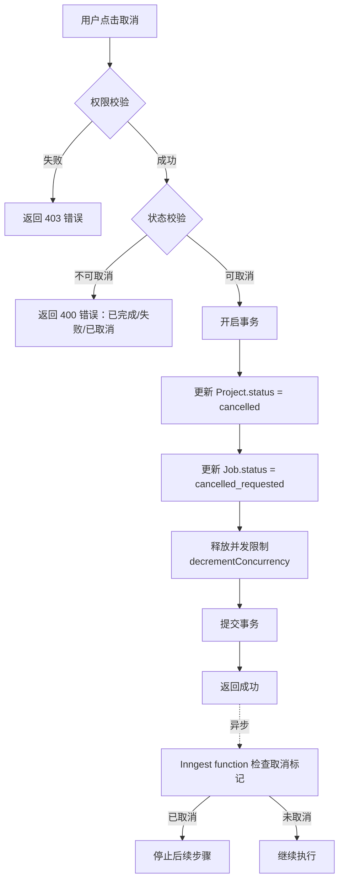
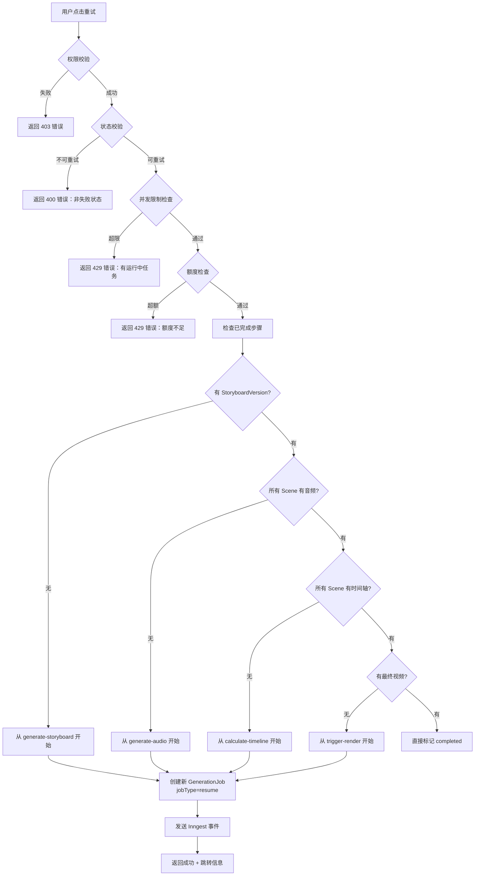
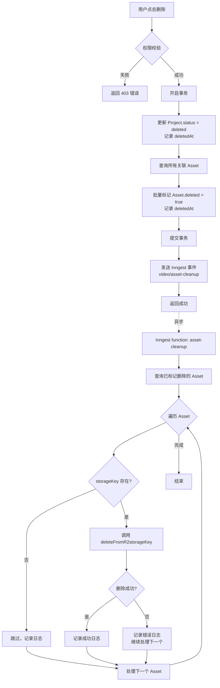
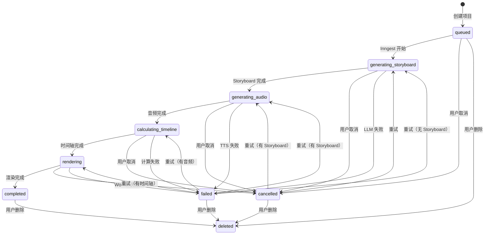

# Change: ep2-05-cancel-retry-delete-api

## 元信息

| 属性 | 内容 |
|------|------|
| **Change ID** | `ep2-05-cancel-retry-delete-api` |
| **Change Type** | FEATURE |
| **所属 Epic** | Epic 2: 项目管理与 Dashboard |
| **优先级** | P0 |
| **预估规模** | L（~2,035 LOC） |
| **预估工期** | 3-4 天 |
| **前置 Change** | `ep2-01-project-create-api`（✅ 已完成）<br>`ep2-02-project-list-detail-api`（✅ 已完成） |
| **并行 Change** | 可与 `ep3-01-storyboard-types-schema` 并行开始 |
| **目标代码库** | `E:\A\Ai\convert documents to videos` |
| **实施日期** | 待开始 |
| **实施状态** | ⏸️ 待开始 |

---

## 1. Change Overview

### Goal

实现项目管理的三个核心操作 API：
- **取消**（软取消）：标记生成中的项目为 `cancelled` 状态
- **重试**（resume 模式）：检查已完成的步骤，跳过已生成资源，从失败点恢复
- **删除**（级联清理）：软删除项目 + 标记关联 Asset deleted + 删除 R2 文件

---

### User Value

用户获得对项目的完整控制能力：
- **生成中途可取消**：节省配额，避免浪费
- **失败后可重试**：无需重新创建项目，智能跳过已完成步骤
- **不需要的项目可删除**：清理空间，保持列表整洁

---

### Business Value

- **成本优化**：取消功能避免浪费 LLM/TTS/渲染资源
- **用户体验**：重试功能提升生成成功率，减少用户流失
- **数据管理**：删除功能保持系统清洁，控制存储成本
- **合规性**：软删除保留审计记录，满足数据合规要求

---

### Business Context

**问题背景**：
当前用户创建项目后，如果生成失败或中途想取消，只能等待任务完成或失败，无法主动干预。失败后只能重新创建项目，浪费配额和时间。完成的项目无法删除，导致列表混乱。

**核心痛点**：
1. **无法取消**：生成需要 5-10 分钟，用户发现输入错误后无法取消，浪费配额
2. **无法重试**：TTS 或渲染失败后，已生成的 Storyboard 被丢弃，需要重新等待 LLM 生成
3. **无法删除**：测试项目和失败项目堆积，影响用户体验

**解决方案**：
- 软取消机制：标记状态，Inngest 自然停止（不强制中断）
- 智能重试：检查已完成步骤（Storyboard/Audio/Timeline），跳过成功部分
- 软删除 + 异步清理：保留审计记录，异步删除 R2 文件

---

## 2. Scope Definition

### ✅ 包含内容

#### 1. 取消功能（`generation.cancel`）

**核心逻辑**：
- 软取消标记（不中断当前 Inngest step）
- 更新 `Project.status` → `cancelled`
- 更新 `GenerationJob.status` → `cancelled_requested`
- 记录取消时间和操作人
- 释放用户并发限制（允许创建新项目）
- Inngest function 在下一个 step 开始前检查取消状态（Phase 6 实现）

**权限校验**：
- 仅 project owner 或 admin 可取消
- 仅 `queued`/`generating_*` 状态可取消

**并发控制**：
- 取消后立即释放用户并发限制

---

#### 2. 重试功能（`generation.retry`）

**核心逻辑 - resume 模式**（智能跳过已完成步骤）：

1. **检查 StoryboardVersion**：
   - ✅ 存在 → 跳过 `generate-storyboard`
   - ❌ 不存在 → 从 `generate-storyboard` 开始

2. **检查 Scene.audioAssetId**：
   - ✅ 所有 scene 都有 audioAssetId → 跳过 `generate-audio`
   - ❌ 部分或全部缺失 → 从 `generate-audio` 开始（仅生成缺失的）

3. **检查 Scene.startTimeSec**：
   - ✅ 所有 scene 都有时间轴 → 跳过 `calculate-timeline`
   - ❌ 缺失 → 从 `calculate-timeline` 开始

4. **检查最终视频 Asset**：
   - ✅ 存在 `assetType=video` 且未删除 → 直接完成
   - ❌ 不存在 → 从 `trigger-render` 开始

**权限校验**：
- 仅 project owner 或 admin 可重试
- 仅 `failed`/`cancelled` 状态可重试

**并发限制校验**：
- 重试前检查用户是否有运行中任务
- 重试前检查今日额度（与创建相同规则）

**GenerationJob 创建**：
- 创建新的 GenerationJob（`jobType=retry` 或 `resume`）
- 关联到原 Project（不创建新 Project）
- 根据检查结果发送相应 Inngest 事件

---

#### 3. 删除功能（`project.delete`）

**核心逻辑 - 软删除**（不物理删除数据库记录）：

1. **标记 Project 删除**：
   - 更新 `Project.status` → `deleted`
   - 记录 `deletedAt` 时间戳

2. **标记 Asset 删除**：
   - 查询所有关联 Asset（音频、视频、缩略图）
   - 标记 `Asset.deleted = true`
   - 记录 `Asset.deletedAt`

3. **异步删除 R2 文件**：
   - 发送 Inngest 事件 `video/asset-cleanup`
   - Inngest function 遍历 Asset，调用 `deleteFromR2(storageKey)`
   - 删除失败不阻塞（记录日志，继续处理其他文件）

4. **保留审计数据**：
   - ✅ 保留 Project 记录（status=deleted）
   - ✅ 保留 StoryboardVersion/Scene（用于数据分析）
   - ✅ 保留 GenerationJob/JobEvent（用于审计）

**权限校验**：
- 仅 project owner 或 admin 可删除

**级联清理范围**：
- ✅ 所有 Asset（音频、视频、缩略图）
- ✅ R2 文件（异步删除）
- ✅ Project 软删除标记
- ❌ 不删除 StoryboardVersion/Scene
- ❌ 不删除 GenerationJob/JobEvent

---

### ❌ 不包含内容

- ❌ **硬删除**（物理删除数据库记录）→ 后续管理员功能
- ❌ **批量操作**（批量删除、批量取消）→ Phase 5 前端增强
- ❌ **删除恢复**（回收站机制）→ 超出 MVP 范围
- ❌ **强制取消**（中断当前 Inngest step）→ 技术复杂度高，暂不实现
- ❌ **完全重新生成**（`full_regenerate`，忽略已有资源）→ 管理员功能
- ❌ **前端 UI**（二次确认 Dialog、取消按钮、重试按钮）→ Phase 5 实现

---

### 🚫 Out Of Scope

- ❌ Inngest function 的取消检查点逻辑（在 Phase 6 `ep7-03` 实现）
- ❌ 前端的二次确认 Dialog（在 Phase 5 `ep6-01` 实现）
- ❌ 删除后的 UsageRecord 退还（超出 MVP 范围）
- ❌ R2 文件删除失败的自动重试机制（后续优化）

---

## 3. Technical Design Refinement

### 涉及模块

| 模块 | 职责 | 文件路径 |
|------|------|---------|
| **tRPC Router** | API 端点定义 | `src/server/routers/project.ts` |
| **Service 层** | 业务逻辑实现 | `src/server/services/cancel.service.ts`<br>`src/server/services/retry.service.ts`<br>`src/server/services/delete.service.ts`<br>`src/server/services/project.service.ts` |
| **Repository 层** | 数据库操作封装 | `src/lib/db/repositories/project.repo.ts`<br>`src/lib/db/repositories/asset.repo.ts` |
| **Inngest** | 异步任务编排 | `src/inngest/functions/asset-cleanup.ts` |
| **Prisma Schema** | 数据模型 | `prisma/schema.prisma` |

---

### 涉及领域模型

#### Project 状态扩展

```typescript
// Project 状态流转
type ProjectStatus = 
  | "queued"
  | "generating_storyboard"
  | "generating_audio"
  | "calculating_timeline"
  | "rendering"
  | "completed"
  | "failed"
  | "cancelled"  // ← 新增：用户取消
  | "deleted";   // ← 新增：软删除
```

#### GenerationJob 类型扩展

```typescript
// GenerationJob 类型
type JobType = 
  | "initial"    // 首次生成
  | "retry"      // ← 新增：完全重试
  | "resume";    // ← 新增：resume 模式（跳过已完成步骤）
```

#### Asset 软删除扩展

```prisma
model Asset {
  // ... 现有字段
  deleted   Boolean   @default(false)  // ← 新增
  deletedAt DateTime?                  // ← 新增
}
```

---

### 数据流

#### 3.1 取消流程



---

#### 3.2 重试流程（resume 模式）



---

#### 3.3 删除流程



---

### 状态流转

#### Project 状态机（完整版）



---

## 4. Impact Analysis

| Area | Impact | 说明 |
|------|--------|------|
| **Database** | ✓ | Project/GenerationJob/Asset 表写入<br>新增 Asset.deleted 和 deletedAt 字段<br>GenerationJob.jobType 扩展枚举 |
| **API** | ✓ | 新增 3 个 tRPC mutation：<br>- `project.delete`<br>- `generation.cancel`<br>- `generation.retry` |
| **Frontend** | ✗ | 不包含 UI 实现（Phase 5 实现） |
| **Cache** | ✗ | 无缓存影响 |
| **Queue** | ✓ | 新增 Inngest function：`video/asset-cleanup` |
| **Storage** | ✓ | R2 文件删除操作 |
| **Logging** | ✓ | 取消/重试/删除操作审计日志 |
| **Monitoring** | ✓ | Inngest Dashboard 可追踪 asset-cleanup |
| **Tests** | ✓ | 需要完整集成测试（取消、重试、删除） |
| **Docs** | ✓ | API 文档更新 |

---

## 5. File Planning

### New Files

```
src/server/services/cancel.service.ts          (~150 LOC)
  - cancelGeneration(projectId, userId)
  - 权限校验、状态校验、并发限制释放

src/server/services/retry.service.ts           (~300 LOC)
  - retryGeneration(projectId, userId)
  - resume 模式检查逻辑
  - 智能跳过已完成步骤

src/server/services/delete.service.ts          (~200 LOC)
  - deleteProject(projectId, userId)
  - 软删除标记
  - 异步清理触发

src/inngest/functions/asset-cleanup.ts         (~150 LOC)
  - 异步删除 R2 文件
  - 错误处理和日志记录

tests/integration/project-cancel.test.ts       (~150 LOC)
  - 取消功能集成测试

tests/integration/project-retry.test.ts        (~200 LOC)
  - 重试功能集成测试
  - resume 模式各种场景

tests/integration/project-delete.test.ts       (~150 LOC)
  - 删除功能集成测试
  - R2 清理验证

tests/unit/retry-logic.test.ts                 (~100 LOC)
  - resume 检查逻辑单元测试
```

---

### Modified Files

```
src/server/routers/project.ts                  (+150 LOC)
  - 新增 project.delete mutation
  - 新增 generation.cancel mutation
  - 新增 generation.retry mutation

src/server/services/project.service.ts         (+100 LOC)
  - 添加状态校验辅助函数
  - 添加并发限制释放逻辑
  - 扩展错误处理

src/lib/db/repositories/project.repo.ts        (+80 LOC)
  - updateStatus 方法扩展
  - markAsDeleted 软删除方法
  - checkConcurrency 更新（释放取消项目）

src/lib/db/repositories/asset.repo.ts          (+50 LOC)
  - markAsDeleted 批量标记方法
  - findByProjectId 查询所有关联资产
  - findDeletedAssets 查询待清理资产

src/inngest/functions/index.ts                 (+5 LOC)
  - 注册 asset-cleanup function

prisma/schema.prisma                           (+15 LOC)
  - Asset 表添加 deleted Boolean @default(false)
  - Asset 表添加 deletedAt DateTime?
  - GenerationJob 添加 jobType 枚举值: retry, resume
```

---

### Deleted Files

无

---

### Directory Impact

```
src/
├── server/
│   ├── routers/
│   │   └── project.ts                    [修改：+150 LOC]
│   └── services/
│       ├── cancel.service.ts             [新建：~150 LOC]
│       ├── retry.service.ts              [新建：~300 LOC]
│       ├── delete.service.ts             [新建：~200 LOC]
│       └── project.service.ts            [修改：+100 LOC]
├── lib/
│   └── db/
│       └── repositories/
│           ├── project.repo.ts           [修改：+80 LOC]
│           └── asset.repo.ts             [修改：+50 LOC]
├── inngest/
│   └── functions/
│       ├── asset-cleanup.ts              [新建：~150 LOC]
│       └── index.ts                      [修改：+5 LOC]
prisma/
└── schema.prisma                         [修改：+15 LOC]
tests/
├── integration/
│   ├── project-cancel.test.ts            [新建：~150 LOC]
│   ├── project-retry.test.ts             [新建：~200 LOC]
│   └── project-delete.test.ts            [新建：~150 LOC]
└── unit/
    └── retry-logic.test.ts               [新建：~100 LOC]
```

**总计**：~2,035 LOC

---

## 6. Implementation Tasks

### Task 1: 数据库 Schema 更新

**目标**：添加软删除和 jobType 字段

**实施步骤**：
1. 修改 `prisma/schema.prisma`：
   ```prisma
   model Asset {
     // ... 现有字段
     deleted   Boolean   @default(false)
     deletedAt DateTime?
   }
   
   model GenerationJob {
     // ... 现有字段
     jobType String // 扩展枚举值: "initial" | "retry" | "resume"
   }
   ```

2. 生成 migration：
   ```bash
   npx prisma migrate dev --name add-soft-delete-and-retry
   ```

3. 验证 migration：
   ```bash
   npx prisma db push
   npx prisma generate
   ```

**完成标准**：
- ✅ Migration 文件生成
- ✅ `npx prisma db push` 无错误
- ✅ Prisma Client 类型更新
- ✅ TypeScript 编译无错误

**预估时间**：0.5 小时

---

### Task 2: 实现取消功能

**目标**：用户可取消生成中的项目

**实施步骤**：

**Step 2.1**: 创建 `cancel.service.ts`
```typescript
export async function cancelGeneration(
  projectId: string,
  userId: string
): Promise<void> {
  // 1. 查询 Project + 权限校验
  // 2. 状态校验（仅 queued/generating_* 可取消）
  // 3. 事务：
  //    - 更新 Project.status = cancelled
  //    - 更新 Job.status = cancelled_requested
  //    - 释放并发限制（decrementConcurrency）
  // 4. 记录审计日志
}
```

**Step 2.2**: 在 `project.ts` router 添加 mutation
```typescript
cancel: protectedProcedure
  .input(z.object({ projectId: z.string() }))
  .mutation(async ({ input, ctx }) => {
    await cancelGeneration(input.projectId, ctx.session.userId);
    return { success: true };
  })
```

**Step 2.3**: 编写测试
- 单元测试：权限校验、状态校验
- 集成测试：完整取消流程

**完成标准**：
- ✅ 可成功取消 queued/generating_* 状态项目
- ✅ 取消后 Project.status = cancelled
- ✅ 取消后用户可创建新项目（并发限制释放）
- ✅ 已完成/失败项目无法取消（返回 400）
- ✅ 非 owner 无法取消（返回 403）

**预估时间**：4 小时

---

### Task 3: 实现重试功能（resume 模式）

**目标**：智能跳过已完成步骤，从失败点恢复

**实施步骤**：

**Step 3.1**: 创建 `retry.service.ts`
```typescript
// 检查已完成步骤
async function checkCompletedSteps(projectId: string) {
  const storyboard = await prisma.storyboardVersion.findFirst({
    where: { projectId }
  });
  
  const scenes = await prisma.scene.findMany({
    where: { projectId },
    include: { audioAsset: true }
  });
  
  const hasAudio = scenes.every(s => s.audioAssetId);
  const hasTimeline = scenes.every(s => s.startTimeSec !== null);
  
  const videoAsset = await prisma.asset.findFirst({
    where: { projectId, assetType: 'video', deleted: false }
  });
  
  return {
    hasStoryboard: !!storyboard,
    hasAudio,
    hasTimeline,
    hasVideo: !!videoAsset,
  };
}

// 重试逻辑
export async function retryGeneration(
  projectId: string,
  userId: string
): Promise<{ startFrom: string }> {
  // 1. 权限校验
  // 2. 状态校验（仅 failed/cancelled）
  // 3. 并发限制检查
  // 4. 额度检查
  // 5. 检查已完成步骤
  // 6. 创建新 GenerationJob (jobType=resume)
  // 7. 根据检查结果发送 Inngest 事件
  // 8. 返回跳过信息
}
```

**Step 3.2**: 在 `project.ts` router 添加 mutation

**Step 3.3**: 编写测试
- 单元测试：checkCompletedSteps 各种组合
- 集成测试：
  - 无 Storyboard → 从头开始
  - 有 Storyboard 无音频 → 跳过 generate-storyboard
  - 有音频无时间轴 → 跳过 generate-audio
  - 有时间轴无视频 → 跳过 calculate-timeline

**完成标准**：
- ✅ 有 Storyboard 但无音频 → 跳过 generate-storyboard
- ✅ 有音频但无时间轴 → 跳过 generate-audio
- ✅ 有时间轴但无视频 → 跳过 calculate-timeline
- ✅ 全无 → 从头开始
- ✅ 重试前校验并发限制和额度
- ✅ 非 owner 无法重试

**预估时间**：8 小时

---

### Task 4: 实现删除功能

**目标**：软删除项目并清理 R2 文件

**实施步骤**：

**Step 4.1**: 创建 `delete.service.ts`
```typescript
export async function deleteProject(
  projectId: string,
  userId: string
): Promise<void> {
  // 1. 权限校验
  // 2. 事务：
  //    - 标记 Project.deleted
  //    - 查询所有 Asset
  //    - 标记 Asset.deleted = true
  // 3. 发送 Inngest 事件 video/asset-cleanup
}
```

**Step 4.2**: 创建 `asset-cleanup.ts` Inngest function
```typescript
export const assetCleanup = inngest.createFunction(
  { id: "video/asset-cleanup" },
  { event: "video/asset-cleanup" },
  async ({ event, step }) => {
    const assets = await step.run("query-deleted-assets", async () => {
      return prisma.asset.findMany({
        where: { deleted: true, projectId: event.data.projectId }
      });
    });
    
    for (const asset of assets) {
      await step.run(`delete-${asset.id}`, async () => {
        try {
          if (asset.storageKey) {
            await deleteFromR2(asset.storageKey);
          }
          return { success: true };
        } catch (error) {
          console.error(`R2 删除失败: ${asset.storageKey}`, error);
          return { success: false, error };
        }
      });
    }
  }
);
```

**Step 4.3**: 在 `project.ts` router 添加 mutation

**Step 4.4**: 编写测试

**完成标准**：
- ✅ 删除后 Project.status = deleted
- ✅ 所有 Asset.deleted = true
- ✅ R2 文件被异步删除
- ✅ R2 删除失败不影响软删除
- ✅ StoryboardVersion/Scene/Job 保留
- ✅ 非 owner 无法删除

**预估时间**：6 小时

---

### Task 5: Repository 层实现

**目标**：封装数据库操作

**实施步骤**：

**Step 5.1**: 修改 `project.repo.ts`
```typescript
export async function updateStatus(
  projectId: string,
  status: ProjectStatus
): Promise<void> {
  await prisma.project.update({
    where: { id: projectId },
    data: { status }
  });
}

export async function markAsDeleted(
  projectId: string
): Promise<void> {
  await prisma.project.update({
    where: { id: projectId },
    data: { 
      status: 'deleted',
      deletedAt: new Date()
    }
  });
}

export async function releaseConcurrency(
  userId: string
): Promise<void> {
  // 实现并发限制释放逻辑
}
```

**Step 5.2**: 修改 `asset.repo.ts`
```typescript
export async function markAsDeleted(
  assetIds: string[]
): Promise<void> {
  await prisma.asset.updateMany({
    where: { id: { in: assetIds } },
    data: { 
      deleted: true,
      deletedAt: new Date()
    }
  });
}

export async function findByProjectId(
  projectId: string
): Promise<Asset[]> {
  return prisma.asset.findMany({
    where: { projectId }
  });
}

export async function findDeletedAssets(
  projectId: string
): Promise<Asset[]> {
  return prisma.asset.findMany({
    where: { projectId, deleted: true }
  });
}
```

**完成标准**：
- ✅ 所有数据库操作封装为 Repository 方法
- ✅ 使用 Prisma Transaction 保证一致性
- ✅ 错误处理完善
- ✅ TypeScript 类型安全

**预估时间**：3 小时

---

### Task 6: 集成测试与验证

**目标**：验证完整流程

**实施步骤**：

**Step 6.1**: 取消场景测试
```typescript
describe('Project Cancel', () => {
  it('应该成功取消生成中的项目', async () => {
    // 1. 创建项目
    // 2. 取消项目
    // 3. 验证 status = cancelled
    // 4. 验证可创建新项目
  });
  
  it('应该拒绝取消已完成的项目', async () => {
    // ...
  });
});
```

**Step 6.2**: 重试场景测试
```typescript
describe('Project Retry', () => {
  it('无 Storyboard 应该从头开始', async () => {
    // ...
  });
  
  it('有 Storyboard 应该跳过', async () => {
    // 1. 创建失败项目（有 Storyboard）
    // 2. 重试
    // 3. 验证从 generate-audio 开始
  });
});
```

**Step 6.3**: 删除场景测试
```typescript
describe('Project Delete', () => {
  it('应该软删除项目', async () => {
    // 1. 创建完成项目
    // 2. 删除
    // 3. 验证 Project.deleted = true
    // 4. 验证 Asset.deleted = true
  });
  
  it('应该异步删除 R2 文件', async () => {
    // 验证 Inngest 事件触发
  });
});
```

**Step 6.4**: 权限测试
```typescript
describe('Permission Check', () => {
  it('用户 A 不能取消用户 B 的项目', async () => {
    // ...
  });
});
```

**完成标准**：
- ✅ 所有 API 集成测试通过
- ✅ Inngest function 测试通过
- ✅ 权限校验测试通过
- ✅ 边界条件测试通过
- ✅ 测试覆盖率 > 80%

**预估时间**：4 小时

---

## 7. Dependencies

### Upstream Changes

| Change ID | 依赖内容 | 状态 | 影响 |
|-----------|---------|------|------|
| `ep2-01-project-create-api` | Project/GenerationJob 创建逻辑<br>并发限制检查逻辑 | ✅ 已完成 | 提供基础 service 方法 |
| `ep2-02-project-list-detail-api` | project.service 基础能力<br>project.repo 基础方法 | ✅ 已完成 | 提供 Repository 基础 |
| `ep4-02-r2-storage-full-impl` | `deleteFromR2` 方法 | ⏸️ 未开始 | 可先实现存根调用，Phase 3 完善 |

**处理策略**：
- `ep4-02` 未完成时，可以先实现 `deleteFromR2` 存根（仅记录日志，不实际删除）
- Phase 3 完成 `ep4-02` 后，替换为真实实现
- 不阻塞本 Change 的开发和测试

---

### Downstream Changes

| Change ID | 如何依赖本 Change | 影响 | 优先级 |
|-----------|------------------|------|--------|
| `ep6-01-progress-page` | 前端调用 `generation.cancel` API<br>显示取消按钮 | 需要 API 就绪 | P1 |
| `ep6-03-video-result-page` | 前端调用 `generation.retry` API<br>显示重试按钮 | 需要 API 就绪 | P1 |
| `ep2-03-dashboard-page` | 前端调用 `project.delete` API<br>显示删除按钮 | 需要 API 就绪 | P0 |
| `ep7-03-retry-cancel-mechanism` | Inngest function 集成取消检查点<br>完善 resume 逻辑 | 本 Change 提供 API 基础<br>Phase 6 完善 Inngest 集成 | P1 |

---

### Blocking Risks

| 风险 | 等级 | 影响 | 缓解措施 |
|------|------|------|---------|
| **R2 删除失败导致存储泄漏** | 🟡 中 | R2 存储成本增加 | 1. 异步删除不阻塞用户操作<br>2. 失败记录详细日志<br>3. 后续补充定时清理任务<br>4. 提供管理员手动清理工具 |
| **重试逻辑复杂导致 bug** | 🟡 中 | 用户重试失败<br>资源浪费 | 1. 详细的单元测试覆盖所有分支<br>2. 分阶段实现（先简单重试，再完善 resume）<br>3. 日志记录每个检查步骤<br>4. 提供降级方案（完全重新生成） |
| **取消检查点需要修改所有 Inngest function** | 🔴 高 | 跨多个 Change<br>测试复杂度高 | 1. 本 Change 仅实现 API 层<br>2. Phase 6 `ep7-03` 统一实现检查点逻辑<br>3. 先验证 API 层正确性<br>4. 渐进式集成 Inngest 检查点 |
| **并发限制释放时机错误** | 🟡 中 | 用户无法创建新项目<br>或绕过限制 | 1. 仅在取消成功后释放<br>2. 使用事务保证一致性<br>3. 完整的并发测试 |

---

## 8. Acceptance Criteria

### AC1: 取消生成中的项目

**Given**: 用户 A 创建了项目 P，当前状态为 `generating_audio`  
**When**: 用户 A 调用 `generation.cancel({ projectId: P })`  
**Then**:  
- ✅ Project P 的 status 更新为 `cancelled`
- ✅ GenerationJob 的 status 更新为 `cancelled_requested`
- ✅ 返回成功响应 `{ success: true }`
- ✅ 用户 A 可以立即创建新项目（并发限制已释放）

---

### AC2: 取消权限校验

**Given**: 用户 A 创建了项目 P，当前状态为 `generating_storyboard`  
**When**: 用户 B 调用 `generation.cancel({ projectId: P })`  
**Then**:  
- ✅ 返回 403 错误：`Forbidden: You don't own this project`
- ✅ Project P 的状态保持不变

---

### AC3: 取消状态校验

**Given**: 用户 A 创建了项目 P，当前状态为 `completed`  
**When**: 用户 A 调用 `generation.cancel({ projectId: P })`  
**Then**:  
- ✅ 返回 400 错误：`Cannot cancel completed project`
- ✅ Project P 的状态保持不变

---

### AC4: 重试失败项目（无 Storyboard）

**Given**: 用户 A 的项目 P 失败于 `generate-storyboard` 步骤（无 StoryboardVersion）  
**When**: 用户 A 调用 `generation.retry({ projectId: P })`  
**Then**:  
- ✅ 创建新的 GenerationJob（jobType=resume）
- ✅ 发送 Inngest 事件 `video/generate.requested`（从头开始）
- ✅ 返回 `{ success: true, startFrom: "generate-storyboard" }`
- ✅ Project 状态更新为 `queued`

---

### AC5: 重试失败项目（有 Storyboard，无音频）

**Given**: 用户 A 的项目 P 失败于 `generate-audio` 步骤  
- ✅ 有 StoryboardVersion
- ❌ 部分 Scene 缺少 audioAssetId  

**When**: 用户 A 调用 `generation.retry({ projectId: P })`  
**Then**:  
- ✅ 创建新的 GenerationJob（jobType=resume）
- ✅ 发送 Inngest 事件 `video/generate-audio`（跳过 Storyboard）
- ✅ 返回 `{ success: true, startFrom: "generate-audio", skipped: ["generate-storyboard"] }`
- ✅ Project 状态更新为 `generating_audio`

---

### AC6: 重试权限校验

**Given**: 用户 A 的项目 P 状态为 `failed`  
**When**: 用户 B 调用 `generation.retry({ projectId: P })`  
**Then**:  
- ✅ 返回 403 错误：`Forbidden: You don't own this project`
- ✅ 不创建新的 GenerationJob

---

### AC7: 重试并发限制校验

**Given**: 用户 A 有一个 `generating_audio` 状态的项目 P1  
**And**: 用户 A 有一个 `failed` 状态的项目 P2  
**When**: 用户 A 调用 `generation.retry({ projectId: P2 })`  
**Then**:  
- ✅ 返回 429 错误：`You have a running generation task`
- ✅ 不创建新的 GenerationJob

---

### AC8: 重试额度校验

**Given**: 用户 A 今日已用完免费额度（1 次）  
**And**: 用户 A 有一个 `failed` 状态的项目 P  
**When**: 用户 A 调用 `generation.retry({ projectId: P })`  
**Then**:  
- ✅ 返回 429 错误：`Daily quota exceeded`
- ✅ 不创建新的 GenerationJob

---

### AC9: 删除完成的项目

**Given**: 用户 A 的项目 P 状态为 `completed`，有 3 个 Asset（音频、视频、缩略图）  
**When**: 用户 A 调用 `project.delete({ projectId: P })`  
**Then**:  
- ✅ Project P 的 status 更新为 `deleted`
- ✅ 所有 3 个 Asset 的 deleted 标记为 `true`
- ✅ 发送 Inngest 事件 `video/asset-cleanup`
- ✅ 返回成功响应
- ✅ Inngest function 异步删除 R2 文件（3 个 storageKey）

---

### AC10: 删除权限校验

**Given**: 用户 A 的项目 P 状态为 `completed`  
**When**: 用户 B 调用 `project.delete({ projectId: P })`  
**Then**:  
- ✅ 返回 403 错误：`Forbidden: You don't own this project`
- ✅ Project P 的状态保持不变
- ✅ Asset 的 deleted 标记保持 `false`

---

### AC11: R2 删除失败不阻塞软删除

**Given**: 用户 A 的项目 P 有 2 个 Asset，R2 删除第 1 个失败  
**When**: Inngest function `asset-cleanup` 执行  
**Then**:  
- ✅ 第 1 个 Asset 删除失败，记录错误日志
- ✅ 继续处理第 2 个 Asset（不中断）
- ✅ Project 的 deleted 状态保持不变（不回滚）
- ✅ 失败的 storageKey 记录到日志，供后续手动清理

---

### AC12: 保留审计数据

**Given**: 用户 A 删除了项目 P  
**When**: 查询数据库  
**Then**:  
- ✅ Project 记录存在（status=deleted）
- ✅ StoryboardVersion 记录存在
- ✅ Scene 记录存在
- ✅ GenerationJob 记录存在
- ✅ Asset 记录存在（deleted=true）

---

## 9. Test Plan

### Unit Test

#### 需要覆盖的模块

| 模块 | 测试内容 | 用例数 |
|------|---------|--------|
| **cancel.service** | - 权限校验（owner/非owner/admin）<br>- 状态校验（所有状态）<br>- 并发限制释放 | ~8 用例 |
| **retry.service** | - checkCompletedSteps 各种组合<br>- 权限校验<br>- 状态校验<br>- 并发限制校验<br>- 额度校验 | ~15 用例 |
| **delete.service** | - 权限校验<br>- 软删除标记<br>- Asset 批量标记 | ~6 用例 |
| **project.repo** | - updateStatus<br>- markAsDeleted<br>- releaseConcurrency | ~5 用例 |
| **asset.repo** | - markAsDeleted<br>- findByProjectId<br>- findDeletedAssets | ~5 用例 |

**总计**：~39 单元测试用例

---

### Integration Test

#### 需要覆盖的场景

| 场景 | 测试内容 | 用例数 |
|------|---------|--------|
| **取消流程** | - 取消成功<br>- 取消后创建新项目<br>- 权限拒绝<br>- 状态拒绝 | ~5 用例 |
| **重试流程** | - 无 Storyboard<br>- 有 Storyboard 无音频<br>- 有音频无时间轴<br>- 有时间轴无视频<br>- 全有（直接完成）<br>- 并发限制拒绝<br>- 额度限制拒绝 | ~8 用例 |
| **删除流程** | - 删除成功<br>- R2 清理成功<br>- R2 清理失败继续<br>- 权限拒绝<br>- 审计数据保留 | ~5 用例 |
| **Inngest** | - asset-cleanup 成功<br>- asset-cleanup 部分失败 | ~2 用例 |

**总计**：~20 集成测试用例

---

### E2E Test

**暂不实现**（Phase 5 前端完成后补充）

---

### Regression Test

| 场景 | 验证内容 |
|------|---------|
| **创建项目** | 确保取消/删除逻辑不影响创建流程 |
| **列表查询** | 确保软删除项目被正确过滤 |
| **详情查询** | 确保已删除项目返回 404 |

---

## 10. Rollback Plan

### Code Rollback

**步骤**：
1. 停止 Inngest worker：
   ```bash
   # 停止 Inngest Dev Server
   pkill -f "inngest dev"
   ```

2. 禁用 API：
   ```typescript
   // src/server/routers/project.ts
   // 注释掉三个 mutation
   // delete: protectedProcedure...
   // cancel: protectedProcedure...
   // retry: protectedProcedure...
   ```

3. 重启 Next.js：
   ```bash
   npm run dev
   ```

**预计回滚时间**：5-8 分钟

**风险**：中（涉及 Inngest 任务队列和多个 API）

---

### Data Rollback

**场景 1：误删除项目**

**步骤**：
```sql
-- 恢复 Project 状态
UPDATE "Project" 
SET status = 'completed', "deletedAt" = NULL
WHERE id = '<project_id>';

-- 恢复 Asset 标记
UPDATE "Asset" 
SET deleted = false, "deletedAt" = NULL
WHERE "projectId" = '<project_id>';
```

**前提条件**：R2 文件未被删除（或有备份）

**预计回滚时间**：2-5 分钟（手动操作）

**风险**：高（R2 文件删除不可逆）

---

**场景 2：误取消项目**

**步骤**：
```sql
-- 恢复 Project 状态到之前的生成阶段
UPDATE "Project" 
SET status = 'generating_audio'  -- 根据实际情况调整
WHERE id = '<project_id>';

-- 恢复 Job 状态
UPDATE "GenerationJob" 
SET status = 'in_progress'
WHERE "projectId" = '<project_id>' 
  AND status = 'cancelled_requested';
```

**前提条件**：Inngest 任务未完全停止

**预计回滚时间**：2-3 分钟

**风险**：中（可能需要重新触发 Inngest 事件）

---

### Config Rollback

**无需配置回滚**（纯代码变更）

---

### Feature Flag Rollback

**建议**（可选）：
- 在 `src/lib/feature-flags.ts` 添加：
  ```typescript
  export const FEATURE_FLAGS = {
    ENABLE_CANCEL: process.env.ENABLE_CANCEL === 'true',
    ENABLE_RETRY: process.env.ENABLE_RETRY === 'true',
    ENABLE_DELETE: process.env.ENABLE_DELETE === 'true',
  };
  ```

- 在 tRPC mutation 中检查：
  ```typescript
  if (!FEATURE_FLAGS.ENABLE_CANCEL) {
    throw new TRPCError({
      code: 'NOT_IMPLEMENTED',
      message: 'Cancel feature is disabled'
    });
  }
  ```

**回滚方式**：设置环境变量为 `false`

**预计回滚时间**：< 1 分钟

---

## 11. OpenSpec Output

### change.md

```markdown
# Change: ep2-05-cancel-retry-delete-api

## 目标
实现项目管理的三个核心操作 API：取消、重试、删除

## 用户价值
- 生成中途可取消，节省配额
- 失败后可智能重试，跳过已完成步骤
- 不需要的项目可删除，保持列表整洁

## 业务价值
- 成本优化：避免浪费 LLM/TTS/渲染资源
- 用户体验：提升生成成功率
- 数据管理：控制存储成本
```

---

### design.md

```markdown
# 技术设计

## 架构
- Service 层：cancel.service, retry.service, delete.service
- Repository 层：project.repo, asset.repo
- Inngest：asset-cleanup function

## 核心逻辑
1. 取消：软标记 + 释放并发限制
2. 重试：检查已完成步骤 + 智能跳过
3. 删除：软删除 + 异步 R2 清理

## 数据模型
- Project.status 新增：cancelled, deleted
- Asset 新增：deleted, deletedAt
- GenerationJob.jobType 新增：retry, resume
```

---

### tasks.md

```markdown
# 任务列表

## Task 1: Schema 更新 (0.5h)
- [ ] 修改 Prisma schema
- [ ] 生成 migration
- [ ] 验证类型更新

## Task 2: 取消功能 (4h)
- [ ] cancel.service 实现
- [ ] tRPC mutation
- [ ] 单元测试
- [ ] 集成测试

## Task 3: 重试功能 (8h)
- [ ] retry.service 实现
- [ ] resume 逻辑
- [ ] tRPC mutation
- [ ] 单元测试
- [ ] 集成测试

## Task 4: 删除功能 (6h)
- [ ] delete.service 实现
- [ ] asset-cleanup Inngest function
- [ ] tRPC mutation
- [ ] 单元测试
- [ ] 集成测试

## Task 5: Repository 层 (3h)
- [ ] project.repo 扩展
- [ ] asset.repo 扩展

## Task 6: 集成测试 (4h)
- [ ] 完整流程测试
- [ ] 权限测试
- [ ] 边界条件测试
```

---

## 12. AI Implementation Readiness Check

### Scope Too Large

**检查结果**：✅ 通过

- 预估 2,035 LOC，在 3,000 LOC 限制内
- 拆分为 6 个 Task，每个 Task 0.5-8 小时
- 每个 Task 可独立验证

---

### Hidden Dependencies

**检查结果**：⚠️ 部分依赖

| 依赖 | 状态 | 处理方案 |
|------|------|---------|
| `ep4-02` R2 删除 | 未完成 | 先实现存根，Phase 3 替换 |
| Inngest 取消检查点 | Phase 6 | 本 Change 仅实现 API 层 |

**结论**：不阻塞开发，可渐进式完善

---

### Context Explosion

**检查结果**：✅ 通过

- Service 层单一职责：cancel/retry/delete 独立
- Repository 层封装数据库操作
- Inngest function 独立文件
- 单个文件不超过 300 LOC

---

### Testing Gap

**检查结果**：✅ 通过

- 单元测试：~39 用例
- 集成测试：~20 用例
- 覆盖率目标：> 80%
- Mock 策略清晰（R2/Inngest）

---

### Rollback Risk

**检查结果**：⚠️ 中等风险

| 风险 | 等级 | 缓解措施 |
|------|------|---------|
| R2 删除不可逆 | 🔴 高 | 软删除保留记录 + 定期备份 |
| 并发限制错误 | 🟡 中 | 事务保证 + 完整测试 |
| 重试逻辑复杂 | 🟡 中 | 分阶段实现 + 详细日志 |

**建议**：
- 启用 Feature Flag，可快速禁用功能
- R2 定期备份（使用 R2 Object Lifecycle）
- 详细的审计日志

---

## 最终检查清单

### OpenSpec 可直接创建 Change
- ✅ change.md 清晰描述目标
- ✅ design.md 包含技术设计
- ✅ tasks.md 任务可执行

### Claude Code 可直接实现
- ✅ 每个 Task 不超过 4 小时
- ✅ 依赖关系清晰
- ✅ Mock 策略明确
- ✅ 验收标准具体

### 单独 PR 可交付
- ✅ 不超过 15 个文件变更
- ✅ 可独立测试
- ✅ 可独立 Review
- ✅ 可独立 Merge

### 单独上线可回滚
- ✅ Feature Flag 可选
- ✅ 回滚步骤清晰
- ✅ 数据回滚方案明确
- ✅ 风险可控

---

**文档版本**：v1.0  
**最后更新**：2026-06-16  
**创建人**：Claude Opus 4.8  
**审核状态**：待审核

