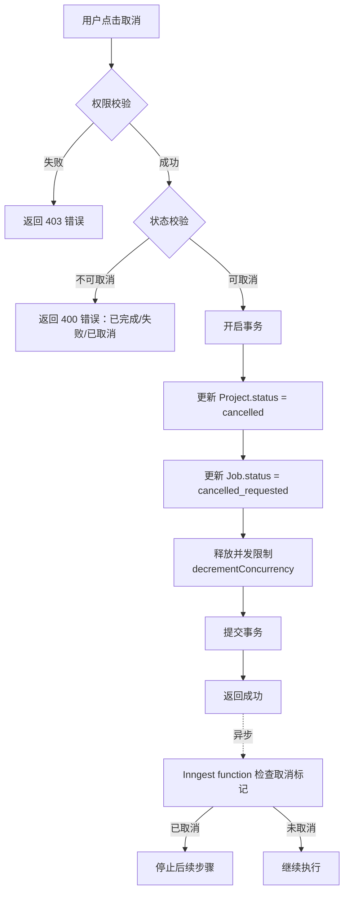
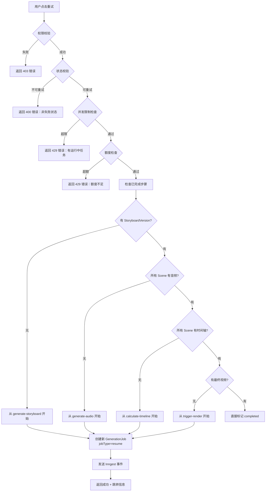
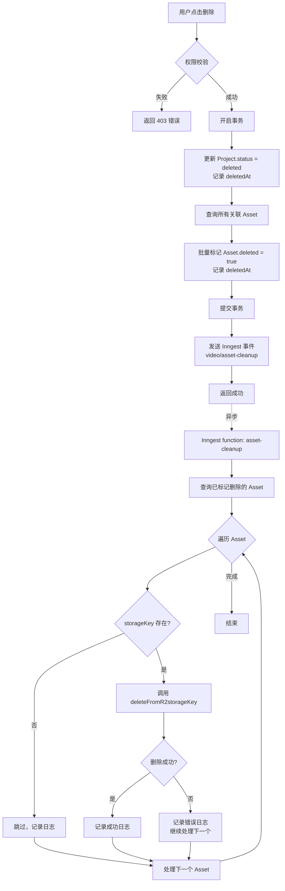
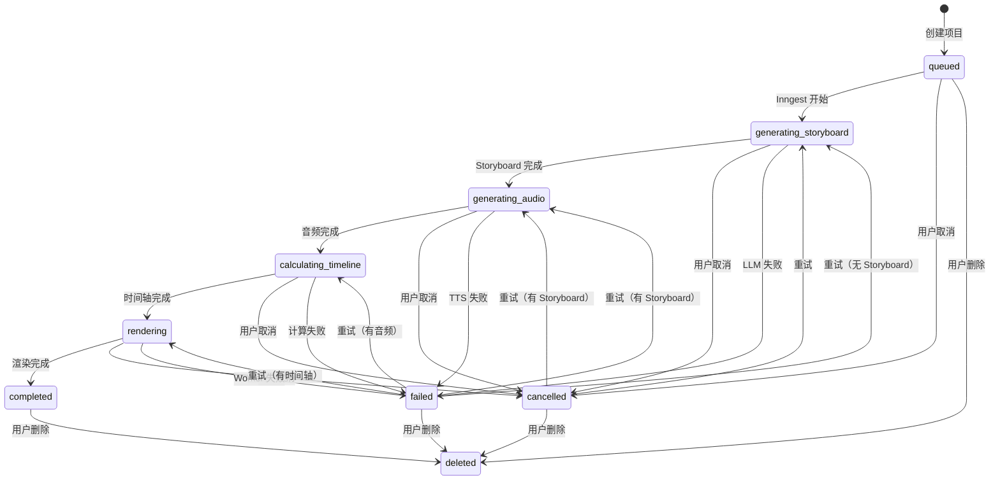

# Change: ep2-05-cancel-retry-delete-api

## 元信息

| 属性 | 内容 |
|------|------|
| **Change ID** | `ep2-05-cancel-retry-delete-api` |
| **Change Type** | FEATURE |
| **所属 Epic** | Epic 2: 项目管理与 Dashboard |
| **优先级** | P0 |
| **预估规模** | L（~2,035 LOC） |
| **预估工期** | 3-4 天 |
| **前置 Change** | `ep2-01-project-create-api`（✅ 已完成）<br>`ep2-02-project-list-detail-api`（✅ 已完成） |
| **并行 Change** | 可与 `ep3-01-storyboard-types-schema` 并行开始 |
| **目标代码库** | `E:\A\Ai\convert documents to videos` |
| **实施日期** | 待开始 |
| **实施状态** | ⏸️ 待开始 |

---

## 1. Change Overview

### Goal

实现项目管理的三个核心操作 API：
- **取消**（软取消）：标记生成中的项目为 `cancelled` 状态
- **重试**（resume 模式）：检查已完成的步骤，跳过已生成资源，从失败点恢复
- **删除**（级联清理）：软删除项目 + 标记关联 Asset deleted + 删除 R2 文件

---

### User Value

用户获得对项目的完整控制能力：
- **生成中途可取消**：节省配额，避免浪费
- **失败后可重试**：无需重新创建项目，智能跳过已完成步骤
- **不需要的项目可删除**：清理空间，保持列表整洁

---

### Business Value

- **成本优化**：取消功能避免浪费 LLM/TTS/渲染资源
- **用户体验**：重试功能提升生成成功率，减少用户流失
- **数据管理**：删除功能保持系统清洁，控制存储成本
- **合规性**：软删除保留审计记录，满足数据合规要求

---

### Business Context

**问题背景**：
当前用户创建项目后，如果生成失败或中途想取消，只能等待任务完成或失败，无法主动干预。失败后只能重新创建项目，浪费配额和时间。完成的项目无法删除，导致列表混乱。

**核心痛点**：
1. **无法取消**：生成需要 5-10 分钟，用户发现输入错误后无法取消，浪费配额
2. **无法重试**：TTS 或渲染失败后，已生成的 Storyboard 被丢弃，需要重新等待 LLM 生成
3. **无法删除**：测试项目和失败项目堆积，影响用户体验

**解决方案**：
- 软取消机制：标记状态，Inngest 自然停止（不强制中断）
- 智能重试：检查已完成步骤（Storyboard/Audio/Timeline），跳过成功部分
- 软删除 + 异步清理：保留审计记录，异步删除 R2 文件

---

## 2. Scope Definition

### ✅ 包含内容

#### 1. 取消功能（`generation.cancel`）

**核心逻辑**：
- 软取消标记（不中断当前 Inngest step）
- 更新 `Project.status` → `cancelled`
- 更新 `GenerationJob.status` → `cancelled_requested`
- 记录取消时间和操作人
- 释放用户并发限制（允许创建新项目）
- Inngest function 在下一个 step 开始前检查取消状态（Phase 6 实现）

**权限校验**：
- 仅 project owner 或 admin 可取消
- 仅 `queued`/`generating_*` 状态可取消

**并发控制**：
- 取消后立即释放用户并发限制

---

#### 2. 重试功能（`generation.retry`）

**核心逻辑 - resume 模式**（智能跳过已完成步骤）：

1. **检查 StoryboardVersion**：
   - ✅ 存在 → 跳过 `generate-storyboard`
   - ❌ 不存在 → 从 `generate-storyboard` 开始

2. **检查 Scene.audioAssetId**：
   - ✅ 所有 scene 都有 audioAssetId → 跳过 `generate-audio`
   - ❌ 部分或全部缺失 → 从 `generate-audio` 开始（仅生成缺失的）

3. **检查 Scene.startTimeSec**：
   - ✅ 所有 scene 都有时间轴 → 跳过 `calculate-timeline`
   - ❌ 缺失 → 从 `calculate-timeline` 开始

4. **检查最终视频 Asset**：
   - ✅ 存在 `assetType=video` 且未删除 → 直接完成
   - ❌ 不存在 → 从 `trigger-render` 开始

**权限校验**：
- 仅 project owner 或 admin 可重试
- 仅 `failed`/`cancelled` 状态可重试

**并发限制校验**：
- 重试前检查用户是否有运行中任务
- 重试前检查今日额度（与创建相同规则）

**GenerationJob 创建**：
- 创建新的 GenerationJob（`jobType=retry` 或 `resume`）
- 关联到原 Project（不创建新 Project）
- 根据检查结果发送相应 Inngest 事件

---

#### 3. 删除功能（`project.delete`）

**核心逻辑 - 软删除**（不物理删除数据库记录）：

1. **标记 Project 删除**：
   - 更新 `Project.status` → `deleted`
   - 记录 `deletedAt` 时间戳

2. **标记 Asset 删除**：
   - 查询所有关联 Asset（音频、视频、缩略图）
   - 标记 `Asset.deleted = true`
   - 记录 `Asset.deletedAt`

3. **异步删除 R2 文件**：
   - 发送 Inngest 事件 `video/asset-cleanup`
   - Inngest function 遍历 Asset，调用 `deleteFromR2(storageKey)`
   - 删除失败不阻塞（记录日志，继续处理其他文件）

4. **保留审计数据**：
   - ✅ 保留 Project 记录（status=deleted）
   - ✅ 保留 StoryboardVersion/Scene（用于数据分析）
   - ✅ 保留 GenerationJob/JobEvent（用于审计）

**权限校验**：
- 仅 project owner 或 admin 可删除

**级联清理范围**：
- ✅ 所有 Asset（音频、视频、缩略图）
- ✅ R2 文件（异步删除）
- ✅ Project 软删除标记
- ❌ 不删除 StoryboardVersion/Scene
- ❌ 不删除 GenerationJob/JobEvent

---

### ❌ 不包含内容

- ❌ **硬删除**（物理删除数据库记录）→ 后续管理员功能
- ❌ **批量操作**（批量删除、批量取消）→ Phase 5 前端增强
- ❌ **删除恢复**（回收站机制）→ 超出 MVP 范围
- ❌ **强制取消**（中断当前 Inngest step）→ 技术复杂度高，暂不实现
- ❌ **完全重新生成**（`full_regenerate`，忽略已有资源）→ 管理员功能
- ❌ **前端 UI**（二次确认 Dialog、取消按钮、重试按钮）→ Phase 5 实现

---

### 🚫 Out Of Scope

- ❌ Inngest function 的取消检查点逻辑（在 Phase 6 `ep7-03` 实现）
- ❌ 前端的二次确认 Dialog（在 Phase 5 `ep6-01` 实现）
- ❌ 删除后的 UsageRecord 退还（超出 MVP 范围）
- ❌ R2 文件删除失败的自动重试机制（后续优化）

---

## 3. Technical Design Refinement

### 涉及模块

| 模块 | 职责 | 文件路径 |
|------|------|---------|
| **tRPC Router** | API 端点定义 | `src/server/routers/project.ts` |
| **Service 层** | 业务逻辑实现 | `src/server/services/cancel.service.ts`<br>`src/server/services/retry.service.ts`<br>`src/server/services/delete.service.ts`<br>`src/server/services/project.service.ts` |
| **Repository 层** | 数据库操作封装 | `src/lib/db/repositories/project.repo.ts`<br>`src/lib/db/repositories/asset.repo.ts` |
| **Inngest** | 异步任务编排 | `src/inngest/functions/asset-cleanup.ts` |
| **Prisma Schema** | 数据模型 | `prisma/schema.prisma` |

---

### 涉及领域模型

#### Project 状态扩展

```typescript
// Project 状态流转
type ProjectStatus = 
  | "queued"
  | "generating_storyboard"
  | "generating_audio"
  | "calculating_timeline"
  | "rendering"
  | "completed"
  | "failed"
  | "cancelled"  // ← 新增：用户取消
  | "deleted";   // ← 新增：软删除
```

#### GenerationJob 类型扩展

```typescript
// GenerationJob 类型
type JobType = 
  | "initial"    // 首次生成
  | "retry"      // ← 新增：完全重试
  | "resume";    // ← 新增：resume 模式（跳过已完成步骤）
```

#### Asset 软删除扩展

```prisma
model Asset {
  // ... 现有字段
  deleted   Boolean   @default(false)  // ← 新增
  deletedAt DateTime?                  // ← 新增
}
```

---

### 数据流

#### 3.1 取消流程



---

#### 3.2 重试流程（resume 模式）



---

#### 3.3 删除流程



---

### 状态流转

#### Project 状态机（完整版）



---

## 4. Impact Analysis

| Area | Impact | 说明 |
|------|--------|------|
| **Database** | ✓ | Project/GenerationJob/Asset 表写入<br>新增 Asset.deleted 和 deletedAt 字段<br>GenerationJob.jobType 扩展枚举 |
| **API** | ✓ | 新增 3 个 tRPC mutation：<br>- `project.delete`<br>- `generation.cancel`<br>- `generation.retry` |
| **Frontend** | ✗ | 不包含 UI 实现（Phase 5 实现） |
| **Cache** | ✗ | 无缓存影响 |
| **Queue** | ✓ | 新增 Inngest function：`video/asset-cleanup` |
| **Storage** | ✓ | R2 文件删除操作 |
| **Logging** | ✓ | 取消/重试/删除操作审计日志 |
| **Monitoring** | ✓ | Inngest Dashboard 可追踪 asset-cleanup |
| **Tests** | ✓ | 需要完整集成测试（取消、重试、删除） |
| **Docs** | ✓ | API 文档更新 |

---

## 5. File Planning

### New Files

```
src/server/services/cancel.service.ts          (~150 LOC)
  - cancelGeneration(projectId, userId)
  - 权限校验、状态校验、并发限制释放

src/server/services/retry.service.ts           (~300 LOC)
  - retryGeneration(projectId, userId)
  - resume 模式检查逻辑
  - 智能跳过已完成步骤

src/server/services/delete.service.ts          (~200 LOC)
  - deleteProject(projectId, userId)
  - 软删除标记
  - 异步清理触发

src/inngest/functions/asset-cleanup.ts         (~150 LOC)
  - 异步删除 R2 文件
  - 错误处理和日志记录

tests/integration/project-cancel.test.ts       (~150 LOC)
  - 取消功能集成测试

tests/integration/project-retry.test.ts        (~200 LOC)
  - 重试功能集成测试
  - resume 模式各种场景

tests/integration/project-delete.test.ts       (~150 LOC)
  - 删除功能集成测试
  - R2 清理验证

tests/unit/retry-logic.test.ts                 (~100 LOC)
  - resume 检查逻辑单元测试
```

---

### Modified Files

```
src/server/routers/project.ts                  (+150 LOC)
  - 新增 project.delete mutation
  - 新增 generation.cancel mutation
  - 新增 generation.retry mutation

src/server/services/project.service.ts         (+100 LOC)
  - 添加状态校验辅助函数
  - 添加并发限制释放逻辑
  - 扩展错误处理

src/lib/db/repositories/project.repo.ts        (+80 LOC)
  - updateStatus 方法扩展
  - markAsDeleted 软删除方法
  - checkConcurrency 更新（释放取消项目）

src/lib/db/repositories/asset.repo.ts          (+50 LOC)
  - markAsDeleted 批量标记方法
  - findByProjectId 查询所有关联资产
  - findDeletedAssets 查询待清理资产

src/inngest/functions/index.ts                 (+5 LOC)
  - 注册 asset-cleanup function

prisma/schema.prisma                           (+15 LOC)
  - Asset 表添加 deleted Boolean @default(false)
  - Asset 表添加 deletedAt DateTime?
  - GenerationJob 添加 jobType 枚举值: retry, resume
```

---

### Deleted Files

无

---

### Directory Impact

```
src/
├── server/
│   ├── routers/
│   │   └── project.ts                    [修改：+150 LOC]
│   └── services/
│       ├── cancel.service.ts             [新建：~150 LOC]
│       ├── retry.service.ts              [新建：~300 LOC]
│       ├── delete.service.ts             [新建：~200 LOC]
│       └── project.service.ts            [修改：+100 LOC]
├── lib/
│   └── db/
│       └── repositories/
│           ├── project.repo.ts           [修改：+80 LOC]
│           └── asset.repo.ts             [修改：+50 LOC]
├── inngest/
│   └── functions/
│       ├── asset-cleanup.ts              [新建：~150 LOC]
│       └── index.ts                      [修改：+5 LOC]
prisma/
└── schema.prisma                         [修改：+15 LOC]
tests/
├── integration/
│   ├── project-cancel.test.ts            [新建：~150 LOC]
│   ├── project-retry.test.ts             [新建：~200 LOC]
│   └── project-delete.test.ts            [新建：~150 LOC]
└── unit/
    └── retry-logic.test.ts               [新建：~100 LOC]
```

**总计**：~2,035 LOC

---

## 6. Implementation Tasks

### Task 1: 数据库 Schema 更新

**目标**：添加软删除和 jobType 字段

**实施步骤**：
1. 修改 `prisma/schema.prisma`：
   ```prisma
   model Asset {
     // ... 现有字段
     deleted   Boolean   @default(false)
     deletedAt DateTime?
   }
   
   model GenerationJob {
     // ... 现有字段
     jobType String // 扩展枚举值: "initial" | "retry" | "resume"
   }
   ```

2. 生成 migration：
   ```bash
   npx prisma migrate dev --name add-soft-delete-and-retry
   ```

3. 验证 migration：
   ```bash
   npx prisma db push
   npx prisma generate
   ```

**完成标准**：
- ✅ Migration 文件生成
- ✅ `npx prisma db push` 无错误
- ✅ Prisma Client 类型更新
- ✅ TypeScript 编译无错误

**预估时间**：0.5 小时

---

### Task 2: 实现取消功能

**目标**：用户可取消生成中的项目

**实施步骤**：

**Step 2.1**: 创建 `cancel.service.ts`
```typescript
export async function cancelGeneration(
  projectId: string,
  userId: string
): Promise<void> {
  // 1. 查询 Project + 权限校验
  // 2. 状态校验（仅 queued/generating_* 可取消）
  // 3. 事务：
  //    - 更新 Project.status = cancelled
  //    - 更新 Job.status = cancelled_requested
  //    - 释放并发限制（decrementConcurrency）
  // 4. 记录审计日志
}
```

**Step 2.2**: 在 `project.ts` router 添加 mutation
```typescript
cancel: protectedProcedure
  .input(z.object({ projectId: z.string() }))
  .mutation(async ({ input, ctx }) => {
    await cancelGeneration(input.projectId, ctx.session.userId);
    return { success: true };
  })
```

**Step 2.3**: 编写测试
- 单元测试：权限校验、状态校验
- 集成测试：完整取消流程

**完成标准**：
- ✅ 可成功取消 queued/generating_* 状态项目
- ✅ 取消后 Project.status = cancelled
- ✅ 取消后用户可创建新项目（并发限制释放）
- ✅ 已完成/失败项目无法取消（返回 400）
- ✅ 非 owner 无法取消（返回 403）

**预估时间**：4 小时

---

### Task 3: 实现重试功能（resume 模式）

**目标**：智能跳过已完成步骤，从失败点恢复

**实施步骤**：

**Step 3.1**: 创建 `retry.service.ts`
```typescript
// 检查已完成步骤
async function checkCompletedSteps(projectId: string) {
  const storyboard = await prisma.storyboardVersion.findFirst({
    where: { projectId }
  });
  
  const scenes = await prisma.scene.findMany({
    where: { projectId },
    include: { audioAsset: true }
  });
  
  const hasAudio = scenes.every(s => s.audioAssetId);
  const hasTimeline = scenes.every(s => s.startTimeSec !== null);
  
  const videoAsset = await prisma.asset.findFirst({
    where: { projectId, assetType: 'video', deleted: false }
  });
  
  return {
    hasStoryboard: !!storyboard,
    hasAudio,
    hasTimeline,
    hasVideo: !!videoAsset,
  };
}

// 重试逻辑
export async function retryGeneration(
  projectId: string,
  userId: string
): Promise<{ startFrom: string }> {
  // 1. 权限校验
  // 2. 状态校验（仅 failed/cancelled）
  // 3. 并发限制检查
  // 4. 额度检查
  // 5. 检查已完成步骤
  // 6. 创建新 GenerationJob (jobType=resume)
  // 7. 根据检查结果发送 Inngest 事件
  // 8. 返回跳过信息
}
```

**Step 3.2**: 在 `project.ts` router 添加 mutation

**Step 3.3**: 编写测试
- 单元测试：checkCompletedSteps 各种组合
- 集成测试：
  - 无 Storyboard → 从头开始
  - 有 Storyboard 无音频 → 跳过 generate-storyboard
  - 有音频无时间轴 → 跳过 generate-audio
  - 有时间轴无视频 → 跳过 calculate-timeline

**完成标准**：
- ✅ 有 Storyboard 但无音频 → 跳过 generate-storyboard
- ✅ 有音频但无时间轴 → 跳过 generate-audio
- ✅ 有时间轴但无视频 → 跳过 calculate-timeline
- ✅ 全无 → 从头开始
- ✅ 重试前校验并发限制和额度
- ✅ 非 owner 无法重试

**预估时间**：8 小时

---

### Task 4: 实现删除功能

**目标**：软删除项目并清理 R2 文件

**实施步骤**：

**Step 4.1**: 创建 `delete.service.ts`
```typescript
export async function deleteProject(
  projectId: string,
  userId: string
): Promise<void> {
  // 1. 权限校验
  // 2. 事务：
  //    - 标记 Project.deleted
  //    - 查询所有 Asset
  //    - 标记 Asset.deleted = true
  // 3. 发送 Inngest 事件 video/asset-cleanup
}
```

**Step 4.2**: 创建 `asset-cleanup.ts` Inngest function
```typescript
export const assetCleanup = inngest.createFunction(
  { id: "video/asset-cleanup" },
  { event: "video/asset-cleanup" },
  async ({ event, step }) => {
    const assets = await step.run("query-deleted-assets", async () => {
      return prisma.asset.findMany({
        where: { deleted: true, projectId: event.data.projectId }
      });
    });
    
    for (const asset of assets) {
      await step.run(`delete-${asset.id}`, async () => {
        try {
          if (asset.storageKey) {
            await deleteFromR2(asset.storageKey);
          }
          return { success: true };
        } catch (error) {
          console.error(`R2 删除失败: ${asset.storageKey}`, error);
          return { success: false, error };
        }
      });
    }
  }
);
```

**Step 4.3**: 在 `project.ts` router 添加 mutation

**Step 4.4**: 编写测试

**完成标准**：
- ✅ 删除后 Project.status = deleted
- ✅ 所有 Asset.deleted = true
- ✅ R2 文件被异步删除
- ✅ R2 删除失败不影响软删除
- ✅ StoryboardVersion/Scene/Job 保留
- ✅ 非 owner 无法删除

**预估时间**：6 小时

---

### Task 5: Repository 层实现

**目标**：封装数据库操作

**实施步骤**：

**Step 5.1**: 修改 `project.repo.ts`
```typescript
export async function updateStatus(
  projectId: string,
  status: ProjectStatus
): Promise<void> {
  await prisma.project.update({
    where: { id: projectId },
    data: { status }
  });
}

export async function markAsDeleted(
  projectId: string
): Promise<void> {
  await prisma.project.update({
    where: { id: projectId },
    data: { 
      status: 'deleted',
      deletedAt: new Date()
    }
  });
}

export async function releaseConcurrency(
  userId: string
): Promise<void> {
  // 实现并发限制释放逻辑
}
```

**Step 5.2**: 修改 `asset.repo.ts`
```typescript
export async function markAsDeleted(
  assetIds: string[]
): Promise<void> {
  await prisma.asset.updateMany({
    where: { id: { in: assetIds } },
    data: { 
      deleted: true,
      deletedAt: new Date()
    }
  });
}

export async function findByProjectId(
  projectId: string
): Promise<Asset[]> {
  return prisma.asset.findMany({
    where: { projectId }
  });
}

export async function findDeletedAssets(
  projectId: string
): Promise<Asset[]> {
  return prisma.asset.findMany({
    where: { projectId, deleted: true }
  });
}
```

**完成标准**：
- ✅ 所有数据库操作封装为 Repository 方法
- ✅ 使用 Prisma Transaction 保证一致性
- ✅ 错误处理完善
- ✅ TypeScript 类型安全

**预估时间**：3 小时

---

### Task 6: 集成测试与验证

**目标**：验证完整流程

**实施步骤**：

**Step 6.1**: 取消场景测试
```typescript
describe('Project Cancel', () => {
  it('应该成功取消生成中的项目', async () => {
    // 1. 创建项目
    // 2. 取消项目
    // 3. 验证 status = cancelled
    // 4. 验证可创建新项目
  });
  
  it('应该拒绝取消已完成的项目', async () => {
    // ...
  });
});
```

**Step 6.2**: 重试场景测试
```typescript
describe('Project Retry', () => {
  it('无 Storyboard 应该从头开始', async () => {
    // ...
  });
  
  it('有 Storyboard 应该跳过', async () => {
    // 1. 创建失败项目（有 Storyboard）
    // 2. 重试
    // 3. 验证从 generate-audio 开始
  });
});
```

**Step 6.3**: 删除场景测试
```typescript
describe('Project Delete', () => {
  it('应该软删除项目', async () => {
    // 1. 创建完成项目
    // 2. 删除
    // 3. 验证 Project.deleted = true
    // 4. 验证 Asset.deleted = true
  });
  
  it('应该异步删除 R2 文件', async () => {
    // 验证 Inngest 事件触发
  });
});
```

**Step 6.4**: 权限测试
```typescript
describe('Permission Check', () => {
  it('用户 A 不能取消用户 B 的项目', async () => {
    // ...
  });
});
```

**完成标准**：
- ✅ 所有 API 集成测试通过
- ✅ Inngest function 测试通过
- ✅ 权限校验测试通过
- ✅ 边界条件测试通过
- ✅ 测试覆盖率 > 80%

**预估时间**：4 小时

---

// __CONTINUE_HERE__
