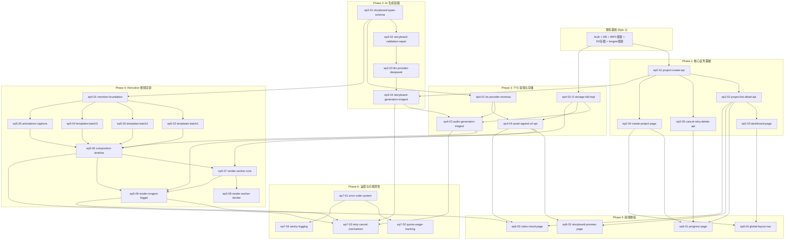
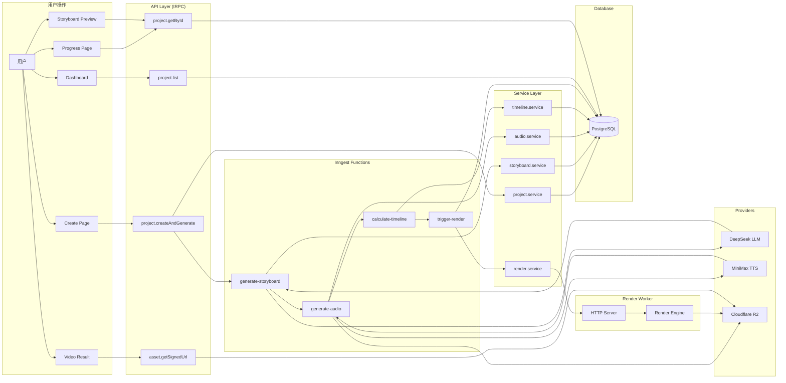

## Volcano AI 微课视频平台 — 实施计划

## 文档信息

| 项目 | 内容 |
|------|------|
| 文档名称 | 实施计划 (Implementation Plan) |
| 关联 PRD | `PRD_AI文本转PPT微课视频平台.md` v1.0.6 |
| 关联补充 | `PRD_Remotion集成补充规格说明书.md` v1.0.0 |
| 版本 | v1.3.0 |
| 更新时间 | 2026-06-15 |
| 目标受众 | AI Coding Agent (Claude Code / Codex / OpenSpec) |
| 代码库 | `E:\A\Ai\convert documents to videos` |

---

## 0. 项目当前状态（2026-06-15）

### 0.1 已完成工作

**Epic 1: 基础工程与数据模型** ✅ 已完成
- ✅ 认证系统：better-auth 邮箱+微信登录，6 个认证页面，3 个 API 端点，CSRF/速率限制
- ✅ UI 组件库：50+ shadcn/ui 组件（button, card, dialog, form, table 等）
- ✅ 数据库：12 张表（4 auth + 8 business），全部索引和外键已建
- ✅ tRPC 框架：publicProcedure / protectedProcedure / adminProcedure，context 含 session
- ⚠️ R2 客户端（存根）：S3Client 已配置，`uploadToR2`/`getSignedUrl`/`deleteFromR2` 抛出 "not implemented"
- ⚠️ Inngest 框架（存根）：空 `functions` 数组，API handler 已注册
- ✅ 环境校验：Zod schema 覆盖所有服务商，dev/prod 条件校验
- ⚠️ Remotion（存根）：已安装 `remotion@4.0.476`，`Root.tsx` 为 2 秒空白 Composition

**Epic 2: 项目管理与 Dashboard** 🟡 进行中（3/5 完成）
- ✅ **ep2-01-project-create-api**（2026-06-13）
- ✅ **ep2-02-project-list-detail-api**（2026-06-14）
- ✅ **ep2-03-dashboard-page**（2026-06-14）

### 0.2 当前阶段

- **Phase 1: 核心业务基础** — 进度 3/5 (60%)
- **下一步 Change**: `ep2-04-create-project-page` 🎯 推荐立即开始
- **后续 Change**: `ep2-05-cancel-retry-delete-api` ⏭️ 可并行或随后进行

### 0.3 项目健康度

- ✅ 所有已完成 Change 测试通过
- ✅ Dashboard 页面可访问且功能正常
- ✅ 项目列表和详情 API 工作正常
- ⚠️ 创建页面尚未实现（用户无法创建新项目）
- ⚠️ 完整的用户体验闭环尚未建立

### 0.4 数据库字段映射（现有 vs PRD）

现有 schema 与 PRD 定义存在字段名差异，后续开发以**现有 schema 为准**：

| 现有字段 (实际) | PRD 对应概念 |
|----------------|-------------|
| `Scene.narrationText` | voiceover.text |
| `Scene.visualDescription` | visualJson（文本存储而非 JSON） |
| `Scene.animationPreset` | animationJson.preset |
| `StoryboardVersion.llmResponseRaw` | storyboardJson |
| `GenerationJob.jobType` | 任务类型 (storyboard/audio/image) |
| `GenerationJob.inputParams` | AI 调用参数 |
| `Asset.assetType` | 资源类型 (audio/image/video) |

### 0.5 关键约束

- **数据库不可重建**：已有 migration，后续只可增量修改
- **单仓库结构**：当前为单一 Next.js app，非 monorepo
- **Remotion 存根**：需从零构建模板体系
- **tRPC 空路由器**：无任何业务 API
- **首页为脚手架**：需替换为 Dashboard

---

## 1. Architecture Baseline

### 1.1 Domains

本项目按照业务领域划分为 5 个核心域：

| Domain | 职责 | 核心实体 |
|--------|------|---------|
| **Auth** | 身份认证与会话管理 | User, Session, Account |
| **Project** | 项目生命周期管理 | Project, GenerationJob, JobEvent |
| **Content** | AI 内容生成与编排 | StoryboardVersion, Scene |
| **Asset** | 媒体资源管理 | Asset（音频/图片/视频） |
| **Render** | 视频渲染与 Worker 调度 | RenderJob, Worker Registry |

### 1.2 Bounded Contexts

各领域的边界上下文清晰划分：

**Project Context**（项目管理上下文）
- 聚合根：`Project`
- 实体：`GenerationJob`, `JobEvent`, `UsageRecord`
- 边界：项目的创建、状态流转、取消、重试、删除
- 依赖：依赖 Auth Context（用户身份）、Content Context（生成结果）

**Content Context**（内容生成上下文）
- 聚合根：`StoryboardVersion`
- 实体：`Scene`
- 边界：Storyboard 生成、Scene 拆分、内容校验与修复
- 依赖：独立领域，被 Project Context 和 Asset Context 依赖

**Asset Context**（资源管理上下文）
- 聚合根：`Asset`
- 值对象：R2 存储路径、签名 URL
- 边界：音频/图片/视频的上传、存储、访问控制、删除
- 依赖：依赖 Content Context（Scene 关联）、Project Context（权限校验）

**Render Context**（渲染上下文）
- 聚合根：`RenderJob`
- 值对象：Worker 健康状态、渲染进度
- 边界：渲染任务调度、Worker 选择、渲染结果回写
- 依赖：依赖 Content Context（Storyboard 数据）、Asset Context（音频 URL、视频上传）

**Auth Context**（认证上下文）
- 聚合根：`User`
- 实体：`Session`, `Account`
- 边界：用户注册、登录、会话管理、权限控制
- 依赖：无外部依赖，被所有其他 Context 依赖

### 1.3 Shared Infrastructure

| 基础设施 | 技术选型 | 用途 | 状态 |
|---------|---------|------|------|
| **Database** | PostgreSQL + Prisma ORM | 持久化存储（12 张表） | ✅ 已就绪 |
| **Queue** | Inngest | 异步任务编排（Storyboard → Audio → Timeline → Render） | ⚠️ 框架已配置，functions 待补充 |
| **Storage** | Cloudflare R2 (S3-compatible) | 音频/视频/缩略图存储 | ⚠️ Client 已配置，实现为存根 |
| **Auth** | better-auth | 邮箱 + 微信登录，Session 管理 | ✅ 已完成 |
| **API** | tRPC | 类型安全的 RPC 框架 | ✅ 已就绪（三级 Procedure） |
| **Logging** | Console (dev) + Sentry (prod) | 错误追踪与日志 | ⏸️ Phase 6 接入 |
| **Monitoring** | Inngest Dashboard | 任务执行监控 | ✅ 内置 |
| **Cache** | 无 | 暂不需要（MVP 阶段） | N/A |

### 1.4 Foundational Changes

以下基础能力在 Epic 1 中已完成，后续所有 Change 均依赖这些基础设施：

| Change | 交付物 | 为什么必须优先 | 状态 |
|--------|--------|---------------|------|
| **foundation-auth** | better-auth 认证系统（6 个页面 + 3 个 API） | 所有业务操作需要用户身份校验 | ✅ 已完成 |
| **foundation-db** | Prisma schema（12 张表 + migrations） | 所有数据持久化的基础 | ✅ 已完成 |
| **foundation-trpc** | tRPC 框架（三级 Procedure + Context） | 所有 API 的统一入口 | ✅ 已完成 |
| **foundation-ui** | shadcn/ui 组件库（50+ 组件） | 前端开发的组件基础 | ✅ 已完成 |
| **foundation-storage** | R2 client（存根） | 媒体文件上传的接口层 | ⚠️ 接口已定义，Phase 3 完整实现 |
| **foundation-queue** | Inngest 框架（空 functions） | 异步任务编排的基础 | ⚠️ 框架已配置，Phase 2+ 逐步添加 functions |
| **foundation-env** | 环境变量校验（Zod schema） | 防止配置错误导致运行时异常 | ✅ 已完成 |
| **foundation-remotion** | Remotion 项目结构（存根） | 视频渲染的代码基础 | ⚠️ 已安装，Phase 4 完整实现 |

**为什么这些必须优先完成？**

1. **foundation-auth**：无认证则无法区分用户，无法实现"每用户每日 1 次"额度限制
2. **foundation-db**：数据库 schema 是所有业务逻辑的基础，必须先确定数据模型
3. **foundation-trpc**：统一 API 层避免后续重构，类型安全减少 bug
4. **foundation-ui**：统一组件库保证视觉一致性，避免重复造轮子
5. **foundation-storage/queue/remotion**：接口层先行，实现可延后（存根模式）

---

## 2. Epic Tree

```
Volcano AI 微课视频平台
│
├── Epic 1: 基础工程与数据模型 ✅ 已完成
│   ├── Feature: 项目初始化 (Next.js + Prisma + Tailwind)
│   ├── Feature: 身份认证 (better-auth 邮箱+微信)
│   ├── Feature: 数据模型 (8 张业务表)
│   ├── Feature: tRPC 框架 (三级 Procedure)
│   ├── Feature: R2 存储客户端 (存根)
│   ├── Feature: Inngest 任务编排 (存根)
│   └── Feature: 环境变量校验 (Zod)
│
├── Epic 2: 项目管理与 Dashboard (P0)
│   ├── Feature: 项目 CRUD API
│   ├── Feature: 创建项目页面
│   ├── Feature: 项目列表 Dashboard
│   └── Feature: 项目详情与状态查询
│
├── Epic 3: Storyboard 生成链路 (P0)
│   ├── Feature: Storyboard 类型与校验
│   ├── Feature: LLM Provider 适配器
│   ├── Feature: Storyboard 生成引擎
│   └── Feature: Storyboard 修复与重试
│
├── Epic 4: TTS 音频与资产管理 (P0)
│   ├── Feature: TTS Provider 适配器
│   ├── Feature: 音频生成引擎
│   ├── Feature: R2 存储完整实现
│   └── Feature: 资源签名 URL 与下载
│
├── Epic 5: Remotion 视频渲染 (P0)
│   ├── Feature: Remotion 模板体系 (8 套 PPT 模板)
│   ├── Feature: 动效预设库 (8 种动效)
│   ├── Feature: 字幕渲染系统
│   ├── Feature: 时间轴计算
│   ├── Feature: Render Worker 架构
│   └── Feature: 渲染触发与回调
│
├── Epic 6: 前端体验完善 (P1)
│   ├── Feature: 生成进度页面
│   ├── Feature: 分镜预览页面
│   ├── Feature: 视频结果页面
│   └── Feature: 错误状态与重试 UI
│
└── Epic 7: 运营与可观测性 (P1)
    ├── Feature: 错误码体系
    ├── Feature: 用量记录
    ├── Feature: 重试与取消机制
    └── Feature: Sentry 接入与监控
```

---

## 3. Feature Breakdown

### Epic 2: 项目管理与 Dashboard

#### F2.1: 项目 CRUD API

- **目标**：实现项目的创建、列表、详情、删除、取消、重试 API
- **涉及模块**：`src/server/routers/`, `src/lib/db/`, `src/server/services/`
- **依赖**：Epic 1（DB schema + tRPC 框架已有）
- **风险**：低。标准的 CRUD + 额度校验逻辑
- **推荐实施顺序**：先 create → 再 list → 再 getById → 再 delete/cancel/retry

#### F2.2: 创建项目页面

- **目标**：替换首页为创建页，含文本输入、参数配置、提交逻辑
- **涉及模块**：`src/app/page.tsx`, `src/components/`, `src/app/(protected)/create/`
- **依赖**：F2.1（需要 create API）
- **风险**：低。表单 + 校验 + 调用 API

#### F2.3: 项目列表 Dashboard

- **目标**：展示用户项目列表，支持筛选、分页、状态展示
- **涉及模块**：`src/app/(protected)/dashboard/`, `src/components/`
- **依赖**：F2.1（需要 list API）
- **风险**：低。标准列表页面

#### F2.4: 项目详情与状态查询

- **目标**：项目详情页含状态、分镜摘要、关联资源
- **涉及模块**：`src/app/(protected)/projects/[id]/`, `src/server/routers/`
- **依赖**：F2.1（需要 getById API）
- **风险**：低

---

### Epic 3: Storyboard 生成链路

#### F3.1: Storyboard 类型与校验

- **目标**：定义 Storyboard/Scene/SceneVisual/CaptionSegment 的 TypeScript 类型和 Zod Schema，生成 JSON Schema 供 LLM function calling 使用
- **涉及模块**：`src/lib/storyboard/types.ts`, `src/lib/storyboard/schema.ts`, `src/lib/storyboard/validation.ts`
- **依赖**：无（纯类型定义）
- **风险**：中。需要确保 Schema 设计对未来模板扩展友好

#### F3.2: LLM Provider 适配器

- **目标**：实现 OpenAI-compatible Provider 抽象（含 DeepSeek），暴露 `generateStoryboard` / `repairStoryboardJson`
- **涉及模块**：`src/lib/providers/llm/`, `src/lib/providers/interfaces.ts`
- **依赖**：F3.1（需要 Storyboard 类型定义）
- **风险**：中。DeepSeek JSON 稳定性需实测

#### F3.3: Storyboard 生成引擎

- **目标**：实现 Inngest function `generate-storyboard`，调用 LLM → 校验 → 修复循环 → 保存 StoryboardVersion + Scene
- **涉及模块**：`src/inngest/functions/`, `src/server/services/storyboard.service.ts`
- **依赖**：F3.2（LLM Provider）、F2.1（Project 更新）
- **风险**：中。完整 LLM→DB 链路

#### F3.4: Storyboard 修复与重试

- **目标**：实现 JSON repair 逻辑（非 JSON 解析、缺失字段补全、类型转换）
- **涉及模块**：`src/lib/storyboard/repair.ts`
- **依赖**：F3.1
- **风险**：中。修复逻辑边界情况多

---

### Epic 4: TTS 音频与资产管理

#### F4.1: TTS Provider 适配器

- **目标**：实现 TTS Provider 接口 + MiniMax adapter（同步 HTTP T2A），返回 audioBuffer + durationMs + captions
- **涉及模块**：`src/lib/providers/tts/`
- **依赖**：无（独立接口）
- **风险**：中。MiniMax API 的时间戳返回格式需验证

#### F4.2: 音频生成引擎

- **目标**：实现 Inngest function `generate-audio`，逐 scene 调用 TTS → 去重（textHash）→ 上传 R2 → 回填 Scene
- **涉及模块**：`src/inngest/functions/`, `src/server/services/tts.service.ts`
- **依赖**：F4.1（TTS Provider）、F4.3（R2 上传）、F3.3（需已有 Scene）
- **风险**：中。长任务逐 scene 生成，需处理部分失败

#### F4.3: R2 存储完整实现

- **目标**：实现 `uploadToR2` / `getSignedUrl` / `deleteFromR2`（替换现有存根），支持音频/视频/缩略图上传
- **涉及模块**：`src/lib/r2.ts`
- **依赖**：无（独立实现，替换存根）
- **风险**：低。S3 SDK 标准 API

#### F4.4: 资源签名 URL 与访问控制

- **目标**：实现 tRPC `asset.getSignedUrl`，校验权限 → 查询 Asset → 生成签名 URL
- **涉及模块**：`src/server/routers/asset.ts`, `src/server/services/asset.service.ts`
- **依赖**：F4.3（R2 签名）、F2.1（权限校验）
- **风险**：低

---

### Epic 5: Remotion 视频渲染

#### F5.1: Remotion 项目结构与模板注册表

- **目标**：创建 `src/remotion/` 完整结构，模板注册表 `registry.ts`，Composition 入口
- **涉及模块**：`src/remotion/`（扩展现有存根）
- **依赖**：F3.1（Storyboard 类型）
- **风险**：低。项目结构调整

#### F5.2: 8 套 PPT 模板（第一部分：简单模板）

- **目标**：实现 TitleSlide、EndingSlide、ConceptCard 模板组件（含入场动效）
- **涉及模块**：`src/remotion/templates/TitleSlide.tsx`, `EndingSlide.tsx`, `ConceptCard.tsx`
- **依赖**：F5.1
- **风险**：中。Remention API 动画实现需精确

#### F5.3: 8 套 PPT 模板（第二部分：列表与流程）

- **目标**：实现 BulletList、ProcessFlow 模板组件（含分页和步骤揭示）
- **涉及模块**：`src/remotion/templates/BulletList.tsx`, `ProcessFlow.tsx`
- **依赖**：F5.1
- **风险**：中。BulletList 分页逻辑复杂

#### F5.4: 8 套 PPT 模板（第三部分：对比与时间线）

- **目标**：实现 Comparison、Timeline、Summary 模板组件
- **涉及模块**：`src/remotion/templates/Comparison.tsx`, `Timeline.tsx`, `Summary.tsx`
- **依赖**：F5.1
- **风险**：中

#### F5.5: 动效预设库 + 字幕组件

- **目标**：实现 8 种动效（fadeIn/slideUp/slideLeft/scaleIn/typewriter/stepReveal/highlight/wipeReveal）+ CaptionOverlay 组件
- **涉及模块**：`src/remotion/animations/`, `src/remotion/components/CaptionOverlay.tsx`
- **依赖**：F5.1
- **风险**：中。所有动效必须用 `useCurrentFrame` + `interpolate`

#### F5.6: MicroCourseVideo Composition + calculateMetadata

- **目标**：实现主 Composition（编排 scene 序列、音频、字幕、水印）+ 动态 duration 计算
- **涉及模块**：`src/remotion/compositions/MicroCourseVideo.tsx`, `Root.tsx`（更新）
- **依赖**：F5.2-F5.5（所有模板和组件已就绪）
- **风险**：中。Sequencing 逻辑需精确

#### F5.7: 时间轴计算器

- **目标**：根据 Scene.audioAssetId 对应音频 durationSec → 计算 startFrame/durationFrames → 回填 Scene + StoryboardVersion
- **涉及模块**：`src/server/services/timeline.service.ts`, `src/inngest/functions/calculate-timeline.ts`
- **依赖**：F3.1（Storyboard 类型）、F4.2（需已有音频 Asset）
- **风险**：低。纯计算逻辑

#### F5.8: Render Worker 基础架构

- **目标**：创建 `apps/render-worker/` 独立服务，HTTP Server (Fastify)、健康检查、内部 token 校验
- **涉及模块**：`apps/render-worker/`（新建目录）
- **依赖**：无（独立进程）
- **风险**：高。Docker + Chromium + FFmpeg + 中文字体环境搭建

#### F5.9: Render Worker 渲染引擎

- **目标**：实现 bundle + getCompositions + renderMedia 调用、进度上报、错误处理、渲染后 R2 上传
- **涉及模块**：`apps/render-worker/src/renderer.ts`
- **依赖**：F5.8（Worker 基础）、F5.6（Composition）、F4.3（R2 上传）
- **风险**：高。renderMedia 参数调优 + 错误恢复

#### F5.10: 渲染触发与回调

- **目标**：实现 Inngest `trigger-render` function，包括 RenderJob 创建、Worker 选择、幂等检查、结果回写
- **涉及模块**：`src/inngest/functions/trigger-render.ts`, `src/server/services/render.service.ts`
- **依赖**：F5.9（Worker）、F5.7（时间轴）
- **风险**：中。Worker 选择与回调可靠性

---

### Epic 6: 前端体验完善

#### F6.1: 生成进度页面

- **目标**：展示生成步骤进度（6 阶段）、当前步骤文案、已生成分镜预览、取消/重试按钮
- **涉及模块**：`src/app/(protected)/projects/[id]/progress/`
- **依赖**：F2.1（project API）、F2.4（详情查询）
- **风险**：低。状态轮询 + UI

#### F6.2: 分镜预览页面

- **目标**：左侧 scene 列表 + 中间 slide 静态预览（renderStill）+ 右侧属性面板
- **涉及模块**：`src/app/(protected)/projects/[id]/storyboard/`
- **依赖**：F3.3（需已有 Scene 数据）、F5.9（renderStill 能力）
- **风险**：中。renderStill 性能与缓存

#### F6.3: 视频结果页面

- **目标**：视频播放器（签名 URL）、下载 MP4、下载字幕、重新生成按钮
- **涉及模块**：`src/app/(protected)/projects/[id]/result/`
- **依赖**：F4.4（签名 URL）、F5.10（渲染完成）
- **风险**：低。标准视频页

#### F6.4: 全局布局与导航

- **目标**：实现产品级导航栏、Dashboard 路由、面包屑、用户头像菜单、替换首页脚手架
- **涉及模块**：`src/app/layout.tsx`, `src/app/page.tsx`, `src/components/layout/`
- **依赖**：F2.2（创建页）、F2.3（Dashboard）
- **风险**：低

---

### Epic 7: 运营与可观测性

#### F7.1: 错误码体系

- **目标**：定义全部错误码枚举（USER_INPUT_*/AUTH_*/QUOTA_*/LLM_*/STORYBOARD_*/TTS_*/ASSET_*/RENDER_*/SYSTEM_*），实现错误码 → 用户文案映射
- **涉及模块**：`src/lib/errors/`
- **依赖**：无（全局基础设施）
- **风险**：低

#### F7.2: 用量记录与额度控制

- **目标**：实现每日额度校验（免费用户每日 1 次）、UsageRecord 写入、额度查询 API
- **涉及模块**：`src/server/services/quota.service.ts`, `src/server/routers/quota.ts`
- **依赖**：无
- **风险**：低

#### F7.3: 重试与取消机制

- **目标**：实现软取消（Inngest step 前检查 Project status）、resume 重试（不重复生成已有资产）、full_regenerate（管理员）
- **涉及模块**：`src/inngest/functions/`（修改所有 functions）、`src/server/services/cancel.service.ts`
- **依赖**：F2.1、F3.3、F4.2、F5.10（所有 Inngest functions 已存在）
- **风险**：中。跨多个 function 的取消逻辑

#### F7.4: Sentry 接入与 JobEvent 日志

- **目标**：接入 Sentry 记录前端+后端异常、完善 JobEvent 表写入、实现 Inngest step 级日志
- **涉及模块**：`src/lib/logger.ts`, `src/server/services/job-event.service.ts`, `sentry.client.config.ts`, `sentry.server.config.ts`
- **依赖**：F7.1（错误码体系）
- **风险**：低

---

## 3. 下一步行动（优先级排序）

### 🎯 立即开始（本周）

**推荐**: `ep2-04-create-project-page`

**理由**：
- 完成 Phase 1 用户完整体验闭环
- `ep2-01` create API 已就绪，前端调用即可
- 交付：用户可完整体验"创建 → 查看 Dashboard"流程

**依赖检查**：
- ✅ ep2-01 project-create-api（API 已实现）
- ✅ tRPC mutation 可用（已验证）

**预估工期**: 1.5-2 天

**验收标准**：
- [ ] `/create` 页面可访问
- [ ] 文本输入框 + 参数配置面板
- [ ] 前端校验（空文本、超字数）
- [ ] 提交成功后跳转 `/projects/[id]/progress`

---

### ⏭️ 随后进行（下周）

**推荐**: `ep2-05-cancel-retry-delete-api`

**理由**：
- 补全项目管理 CRUD 能力
- 可与 ep2-04 并行开发（无依赖冲突）
- 为用户提供取消、重试、删除功能

**可并行**: ✅ 与 ep2-04 无冲突

---

### 🔄 Phase 1 收尾后的下一步

**Phase 2 起点**: `ep3-01-storyboard-types-schema`

- 等待 Phase 1 全部完成（ep2-01~05）
- 开始 AI 生成链路开发

---

## 4. Change Breakdown

### 设计原则

1. **每个 Change = 1 个独立 PR**，可独立开发、测试、Review、Merge、回滚
2. **垂直切片优先**，避免 DB → API → 前端分层拆分
3. **目标规模 300-1500 LOC**，最长不超过 2000 LOC
4. **1-3 天工作量**，AI Agent 单次上下文可完整理解

---

### Phase 1: 核心业务基础

#### Change: `ep2-01-project-create-api` ✅ 已完成（2026-06-13）

| 属性 | 内容 |
|------|------|
| **Goal** | 实现 `project.createAndGenerate` tRPC mutation：校验输入 → 创建 Project + GenerationJob → 发送 Inngest 事件 |
| **Scope** | - tRPC router `project.createAndGenerate`（Zod 校验 + 额度检查 + 并发限制）<br>- `project.service.ts`（创建 Project + GenerationJob）<br>- `quota.service.ts`（每日额度查询）<br>- Inngest 事件 `video/generate.requested` 发送<br>- `requestId` 幂等检查 |
| **不包含** | 实际 Inngest function 实现（后续 Change）、进度轮询、UI 页面 |
| **Files** | `src/server/routers/project.ts`（新建）<br>`src/server/services/project.service.ts`（新建）<br>`src/server/services/quota.service.ts`（新建）<br>`src/inngest/client.ts`（修改：sendEvent）<br>`src/server/routers/_app.ts`（修改：注册 router） |
| **Dependencies** | Epic 1（DB schema、tRPC 框架、Inngest client 已就绪） |
| **Impact Analysis** | ✓ Database（Project + GenerationJob 表写入）<br>✓ API（新增 tRPC mutation）<br>✗ Frontend<br>✗ Background Jobs（仅发送事件，不执行）<br>✗ Cache<br>✓ Monitoring（Inngest event 可追踪） |
| **Rollback Strategy** | **步骤**：<br>1. 禁用 API：在 `_app.ts` 中注释 `projectRouter` 注册<br>2. 数据清理：删除测试期间创建的 Project 和 GenerationJob 记录（可选）<br>3. 无 migration 变更，无需回滚数据库<br>**预计回滚时间**：< 5 分钟<br>**风险**：低（纯新增，不影响现有功能） |
| **AC** | Given 合法参数，When 调用 API，Then 创建 Project(status=queued) + GenerationJob(status=pending)，返回 projectId |
| **Size** | M（~600 LOC） |
| **Priority** | P0 |

#### Change: `ep2-02-project-list-detail-api` ✅ 已完成（2026-06-14）

| 属性 | 内容 |
|------|------|
| **Goal** | 实现 `project.list`（分页+筛选）和 `project.getById`（含关联 Job、Scene、Asset） |
| **Scope** | - `project.list`：cursor 分页、status 筛选、only owner<br>- `project.getById`：返回 Project + currentJob + storyboard 摘要 + assets<br>- Prisma 查询（include + select 优化） |
| **不包含** | 前端页面、删除/取消/重试 API |
| **Files** | `src/server/routers/project.ts`（追加）<br>`src/server/services/project.service.ts`（追加）<br>`src/lib/db/repositories/project.repo.ts`（新建） |
| **Dependencies** | `ep2-01`（project service 基础） |
| **Impact Analysis** | ✗ Database（仅读取，无写入）<br>✓ API（新增 2 个 tRPC query）<br>✗ Frontend<br>✗ Background Jobs<br>✗ Cache<br>✗ Monitoring |
| **Rollback Strategy** | **步骤**：<br>1. 在 `project.ts` router 中注释掉 `list` 和 `getById` 两个 procedure<br>2. 无数据库变更，无需回滚<br>**预计回滚时间**：< 3 分钟<br>**风险**：极低（纯查询，不影响数据） |
| **AC** | Given 用户 A，When 查询列表，Then 只返回用户 A 的项目 |
| **Size** | M（~500 LOC） |
| **Priority** | P0 |

#### Change: `ep2-03-dashboard-page` ✅ 已完成（2026-06-14）

| 属性 | 内容 |
|------|------|
| **Goal** | 实现 Dashboard 页面：项目列表 + 筛选器 + 空状态 + 骨架屏 + 创建入口 |
| **Scope** | - Dashboard 页面 `/dashboard`<br>- 项目卡片组件（标题、状态 badge、缩略图占位、时间、操作按钮）<br>- 状态筛选 tabs（全部/生成中/已完成/失败）<br>- TanStack Query 集成 `project.list`<br>- Loading Skeleton / Empty State / Error State<br>- 删除确认 Dialog + 重试按钮 |
| **不包含** | 创建页（下一个 Change）、项目详情页、缩略图实际图片 |
| **Files** | `src/app/(protected)/dashboard/page.tsx`（新建）<br>`src/components/project/ProjectCard.tsx`（新建）<br>`src/components/project/ProjectList.tsx`（新建）<br>`src/components/project/ProjectFilters.tsx`（新建） |
| **Dependencies** | `ep2-02`（list API） |
| **Impact Analysis** | ✗ Database<br>✓ API（调用 `project.list`）<br>✓ Frontend（新增页面 + 4 个组件）<br>✗ Background Jobs<br>✗ Cache<br>✗ Monitoring |
| **Rollback Strategy** | **步骤**：<br>1. 删除 `/dashboard` 路由：删除 `src/app/(protected)/dashboard/` 目录<br>2. 删除组件：删除 `src/components/project/` 下的 4 个组件文件<br>3. 无数据库变更，无需回滚<br>**预计回滚时间**：< 5 分钟<br>**风险**：极低（纯前端，不影响后端） |
| **AC** | Given 用户有 3 个项目（2 完成 1 失败），When 进入 Dashboard，Then 显示 3 张卡片，筛选"失败"后仅 1 张 |
| **Size** | M（~700 LOC） |
| **Priority** | P0 |

#### Change: `ep2-04-create-project-page` 🎯 下一步

| 属性 | 内容 |
|------|------|
| **Goal** | 实现创建项目页面：文本输入 + 参数配置 + 前端校验 + 提交跳转 |
| **Scope** | - 创建页 `/create`（替换首页）<br>- 文本输入区（字数统计、最大字数限制提示）<br>- 参数配置面板（目标对象、难度、比例、时长、语音）<br>- 前端校验（空文本、超字数、语音可选列表加载失败）<br>- 提交 loading + 防重复点击 + 成功后跳转 `/projects/[id]/progress`<br>- 语音列表从 `provider.listTtsVoices` 加载（Mock 占位） |
| **不包含** | 实际 TTS voice list API（Epic 4）、首页重设计 |
| **Files** | `src/app/(protected)/create/page.tsx`（新建）<br>`src/app/page.tsx`（修改：重定向或重写）<br>`src/components/project/CreateForm.tsx`（新建）<br>`src/components/project/ConfigPanel.tsx`（新建） |
| **Dependencies** | `ep2-01`（create API） |
| **Impact Analysis** | ✗ Database<br>✓ API（调用 `project.createAndGenerate`）<br>✓ Frontend（新增 `/create` 页面 + 2 个组件，修改首页）<br>✗ Background Jobs<br>✗ Cache<br>✗ Monitoring |
| **Rollback Strategy** | **步骤**：<br>1. 恢复首页：`git checkout src/app/page.tsx` 恢复为脚手架<br>2. 删除创建页：删除 `src/app/(protected)/create/` 目录<br>3. 删除组件：删除 `CreateForm.tsx` 和 `ConfigPanel.tsx`<br>**预计回滚时间**：< 5 分钟<br>**风险**：低（纯前端，不影响后端和数据库） |
| **AC** | Given 输入为空，When 点击生成，Then 按钮禁用；Given 粘贴 1000 字，When 提交，Then 跳转进度页 |
| **Size** | M（~700 LOC） |
| **Priority** | P0 |

#### Change: `ep2-05-cancel-retry-delete-api` ⏭️ 待开始

| 属性 | 内容 |
|------|------|
| **Goal** | 实现 `generation.cancel`、`generation.retry`（resume 模式）、`project.delete`（含关联清理） |
| **Scope** | - `generation.cancel`：软取消逻辑（标记 Project cancelled → Job cancelled_requested → Inngest step 检查点）<br>- `generation.retry`：resume 模式（检查已有 Storyboard/Audio → 跳过已完成步骤 → 重新创建 GenerationJob）<br>- `project.delete`：权限校验 → 标记 Asset deleted → 删除 R2 文件 → 级联删除 DB 记录<br>- 并发限制校验 |
| **不包含** | 实际 Inngest 取消检查（Epic 7）、full_regenerate（管理员） |
| **Files** | `src/server/routers/project.ts`（追加）<br>`src/server/services/project.service.ts`（追加）<br>`src/server/services/cancel.service.ts`（新建） |
| **Dependencies** | `ep2-01`（project service） |
| **Impact Analysis** | ✓ Database（Project/Job status 更新，Asset 软删除标记，级联删除）<br>✓ API（新增 3 个 tRPC mutation）<br>✗ Frontend<br>✓ Background Jobs（标记取消状态，Inngest function 需响应）<br>✗ Cache<br>✓ Storage（R2 文件删除）<br>✓ Monitoring（取消/重试/删除操作日志） |
| **Rollback Strategy** | **步骤**：<br>1. 禁用 API：在 `project.ts` router 中注释 `cancel`、`retry`、`delete` 三个 procedure<br>2. 数据恢复：若误删除项目，从数据库备份恢复（需提前备份）<br>3. R2 文件恢复：R2 无回收站，误删无法恢复（需谨慎操作）<br>**预计回滚时间**：< 5 分钟（API 禁用），数据恢复取决于备份策略<br>**风险**：中（delete 操作不可逆，需二次确认 + 软删除保护期） |
| **AC** | Given running 项目，When 取消，Then Project status=cancelled, Job status=cancelled_requested |
| **Size** | M（~500 LOC） |
| **Priority** | P0 |

---

### Phase 2: AI 生成链路

#### Change: `ep3-01-storyboard-types-schema` ⏸️ 未开始

| 属性 | 内容 |
|------|------|
| **Goal** | 定义 Storyboard/Scene/SceneVisual/CaptionSegment 的 TS 类型 + Zod Schema + JSON Schema（供 LLM function calling） |
| **Scope** | - TypeScript 类型定义（`Storyboard`, `Scene`, 7 种 `SceneVisual` 联合类型, `CaptionSegment`）<br>- Zod Schema（`StoryboardSchema`, `SceneSchema`, `VisualSchema` 等）<br>- Zod → JSON Schema 转换（`zod-to-json-schema`）<br>- 导出 `STORYBOARD_JSON_SCHEMA` 供 LLM Prompt 注入<br>- 常量定义（`VALID_SCENE_TYPES`, `SCENE_TYPE_MAP`）<br>- Schema 版本常量 `SCHEMA_VERSION = "1.0.0"` |
| **不包含** | 校验函数（下一个 Change）、LLM 调用 |
| **Files** | `src/lib/storyboard/types.ts`（新建）<br>`src/lib/storyboard/schema.ts`（新建）<br>`src/lib/storyboard/constants.ts`（新建）<br>`src/lib/storyboard/index.ts`（新建） |
| **Dependencies** | 无 |
| **Impact Analysis** | ✗ Database<br>✗ API<br>✗ Frontend<br>✗ Background Jobs<br>✗ Cache<br>✗ Monitoring<br>**说明**：纯类型定义，不影响运行时 |
| **Rollback Strategy** | **步骤**：<br>1. 删除 `src/lib/storyboard/` 目录<br>2. 无运行时影响，无需重启服务<br>**预计回滚时间**：< 2 分钟<br>**风险**：极低（纯类型，不影响运行时） |
| **AC** | Given 合法的 Storyboard JSON，When Zod parse，Then 返回类型正确的 Storyboard 对象 |
| **Size** | M（~600 LOC） |
| **Priority** | P0 |

#### Change: `ep3-02-storyboard-validation-repair` ⏸️ 未开始

| 属性 | 内容 |
|------|------|
| **Goal** | 实现 Storyboard 业务校验（validateStoryboard）+ JSON 修复逻辑（repairStoryboardJson） |
| **Scope** | - `validateStoryboard()`：scene 数量范围、type 合法性、voiceover 文本非空、sceneKey 格式<br>- `validateForRemotionRender()`：startFrame/durationFrames 有效性、顺序连续性、总帧数一致性<br>- `repairStoryboardJson()`：非 JSON 解析（提取 ```json 代码块）、缺失字段补全（默认值）、类型转换（字符串→数字）<br>- 校验结果类型：`ValidationResult`（含 warnings 和 errors） |
| **不包含** | LLM repair（下一个 Change）、实际渲染 |
| **Files** | `src/lib/storyboard/validation.ts`（新建）<br>`src/lib/storyboard/repair.ts`（新建） |
| **Dependencies** | `ep3-01`（类型和 Schema） |
| **Impact Analysis** | ✗ Database<br>✗ API<br>✗ Frontend<br>✗ Background Jobs<br>✗ Cache<br>✗ Monitoring<br>**说明**：工具函数库，不直接影响运行时 |
| **Rollback Strategy** | **步骤**：<br>1. 删除 `validation.ts` 和 `repair.ts`<br>2. 若已被其他模块引用，需同时回滚调用方<br>**预计回滚时间**：< 3 分钟<br>**风险**：低（工具函数，无状态） |
| **AC** | Given 缺失 `sceneKey` 的 JSON，When repair，Then 自动生成 `scene_001` 格式 key |
| **Size** | M（~500 LOC） |
| **Priority** | P0 |

#### Change: `ep3-03-llm-provider-deepseek` ⏸️ 未开始

| 属性 | 内容 |
|------|------|
| **Goal** | 实现 LLM Provider 接口 + DeepSeek adapter（OpenAI-compatible），含 `generateStoryboard` 和 `repairStoryboardJson` |
| **Scope** | - `LlmProvider` 接口定义<br>- `OpenAICompatibleProvider` 基类（封装 HTTP 调用、错误处理、重试、超时、日志）<br>- `DeepSeekProvider` 实现（配置 endpoint、model、apiKey）<br>- `generateStoryboard()`：构建 System Prompt + User Prompt + JSON Schema → 调用 API → 返回 Storyboard<br>- `repairStoryboardJson()`：构建修复 Prompt → 调用 API → 返回修复后 Storyboard<br>- Token 用量跟踪<br>- Provider 错误码映射（`LLM_TIMEOUT` / `LLM_RATE_LIMITED` / `LLM_INVALID_RESPONSE`） |
| **不包含** | Inngest function、实际数据库写入 |
| **Files** | `src/lib/providers/interfaces.ts`（追加 LLM 部分）<br>`src/lib/providers/llm/openai-compatible.ts`（新建）<br>`src/lib/providers/llm/deepseek.ts`（新建）<br>`src/lib/providers/llm/prompts/storyboard.ts`（新建）<br>`src/lib/providers/llm/prompts/repair.ts`（新建） |
| **Dependencies** | `ep3-01`（类型）、`ep3-02`（repair 函数供 LLM repair 使用） |
| **Impact Analysis** | ✗ Database<br>✗ API<br>✗ Frontend<br>✗ Background Jobs<br>✗ Cache<br>✓ External Service（DeepSeek API 调用）<br>✗ Monitoring |
| **Rollback Strategy** | **步骤**：<br>1. 删除 `src/lib/providers/llm/` 目录<br>2. 恢复 `interfaces.ts` 中的 LLM 接口定义<br>3. 无数据库变更，无需回滚<br>**预计回滚时间**：< 5 分钟<br>**风险**：低（Provider 层，无状态） |
| **AC** | Given mock LLM 返回合法 JSON，When 调用 generateStoryboard，Then 返回类型安全的 Storyboard 对象 |
| **Size** | L（~900 LOC） |
| **Priority** | P0 |

#### Change: `ep3-04-storyboard-generation-inngest` ⏸️ 未开始

| 属性 | 内容 |
|------|------|
| **Goal** | 实现 Inngest function `generate-storyboard`：读取 Project → 调用 LLM → 校验 → repair → 保存 StoryboardVersion + Scene → 更新 Project 状态 → 触发下一阶段 |
| **Scope** | - Inngest function `video/generate-storyboard`（幂等键：projectId + storyboard）<br>- 读取 Project sourceText + config<br>- 调用 DeepSeek generateStoryboard<br>- 校验 Storyboard（Zod + 业务校验）<br>- 校验失败则 repair（最多 2 次）<br>- 保存 StoryboardVersion（versionNumber=1, llmResponseRaw=JSON）<br>- 拆分保存 Scene 记录（按 Scene.sceneKey 写入）<br>- 更新 Project.status = `storyboard_ready`<br>- 发送 Inngest 事件 `video/generate-audio`（下一步）<br>- `storyboard.service.ts` 业务层 |
| **不包含** | TTS 音频生成（下一步）、前端 Storyboard 预览 |
| **Files** | `src/inngest/functions/generate-storyboard.ts`（新建）<br>`src/server/services/storyboard.service.ts`（新建）<br>`src/inngest/functions/index.ts`（修改：注册 function）<br>`src/lib/db/repositories/storyboard.repo.ts`（新建）<br>`src/lib/db/repositories/scene.repo.ts`（新建） |
| **Dependencies** | `ep3-03`（LLM Provider）、`ep2-01`（Project 更新） |
| **Impact Analysis** | ✓ Database（StoryboardVersion 和 Scene 表写入，Project status 更新）<br>✗ API<br>✗ Frontend<br>✓ Background Jobs（新增 Inngest function）<br>✗ Cache<br>✓ External Service（DeepSeek API）<br>✓ Monitoring（Inngest Dashboard 可追踪） |
| **Rollback Strategy** | **步骤**：<br>1. 禁用 function：在 `functions/index.ts` 中注释注册<br>2. 清理测试数据：删除测试期间生成的 StoryboardVersion 和 Scene 记录<br>3. Project status 回退到 `queued`<br>**预计回滚时间**：< 10 分钟<br>**风险**：中（涉及 LLM 调用和数据写入，需仔细测试） |
| **AC** | Given 1000 字 AI 回答，When Inngest 执行 generate-storyboard，Then 创建 StoryboardVersion + N 个 Scene 记录 |
| **Size** | L（~800 LOC） |
| **Priority** | P0 |

---

### Phase 3: TTS 音频与存储

#### Change: `ep4-01-tts-provider-minimax` ⏸️ 未开始

| 属性 | 内容 |
|------|------|
| **Goal** | 实现 TTS Provider 接口 + MiniMax adapter（同步 HTTP T2A），含语音列表和音频合成 |
| **Scope** | - `TtsProvider` 接口定义<br>- `MiniMaxProvider` 实现<br>  - `listVoices()`：调用 MiniMax API 获取语音列表<br>  - `synthesize()`：调用 MiniMax T2A HTTP API，启用 `subtitle_enable`，获取 audioBuffer + durationMs + captions<br>- 音频二进制 Buffer 处理<br>- MiniMax 文本长度限制校验（< 10000 字）<br>- 错误码映射（`TTS_TIMEOUT` / `TTS_RATE_LIMITED` / `TTS_TEXT_TOO_LONG` / `TTS_VOICE_NOT_FOUND`） |
| **不包含** | 音频去重上传（下一个 Change）、异步长文本 TTS |
| **Files** | `src/lib/providers/interfaces.ts`（追加 TTS 部分）<br>`src/lib/providers/tts/minimax.ts`（新建）<br>`src/lib/providers/tts/mock.ts`（新建：测试用） |
| **Dependencies** | 无（独立接口） |
| **Impact Analysis** | ✗ Database<br>✗ API<br>✗ Frontend<br>✗ Background Jobs<br>✗ Cache<br>✓ External Service（MiniMax TTS API）<br>✗ Monitoring |
| **Rollback Strategy** | **步骤**：<br>1. 删除 `src/lib/providers/tts/` 目录<br>2. 恢复 `interfaces.ts` 中的 TTS 接口定义<br>3. 无运行时影响，无需重启<br>**预计回滚时间**：< 3 分钟<br>**风险**：低（Provider 层，无状态） |
| **AC** | Given "你好世界"，When 调用 synthesize，Then 返回 audioBuffer(Buffer)、durationMs、captions[] |
| **Size** | M（~600 LOC） |
| **Priority** | P0 |

#### Change: `ep4-02-r2-storage-full-impl` ⏸️ 未开始

| 属性 | 内容 |
|------|------|
| **Goal** | 实现 `uploadToR2` / `getSignedUrl` / `deleteFromR2`（替换现有存根），支持 Buffer 上传和分块上传 |
| **Scope** | - `uploadToR2()`：PutObjectCommand + SHA256 checksum + ContentType 设置<br>- `getSignedUrl()`：GetObjectCommand + `@aws-sdk/s3-request-presigner`，支持 preview/download/render 三种用途<br>- `deleteFromR2()`：DeleteObjectCommand<br>- 上传大文件分块（> 5MB 使用 multipart upload）<br>- 错误处理和重试（网络错误重试 2 次）<br>- 上传进度回调（供大文件使用） |
| **不包含** | Asset 数据库写入（下一个 Change）、前端下载 |
| **Files** | `src/lib/r2.ts`（修改：替换全部存根） |
| **Dependencies** | Epic 1（R2 client 已配置） |
| **Impact Analysis** | ✗ Database<br>✗ API<br>✗ Frontend<br>✗ Background Jobs<br>✗ Cache<br>✓ Storage（R2 对象存储）<br>✗ Monitoring<br>✗ External Service |
| **Rollback Strategy** | **步骤**：<br>1. 恢复 `src/lib/r2.ts` 中的存根实现<br>2. 无运行时数据影响（仅替换函数实现）<br>3. 无需重启服务<br>**预计回滚时间**：< 2 分钟<br>**风险**：低（基础设施层，无副作用）<br>**数据保护**：R2 中已上传文件保留（不删除） |
| **AC** | Given Buffer("hello")，When uploadToR2，Then R2 中可访问该文件 |
| **Size** | M（~500 LOC） |
| **Priority** | P0 |

#### Change: `ep4-03-audio-generation-inngest` ⏸️ 未开始

| 属性 | 内容 |
|------|------|
| **Goal** | 实现 Inngest function `generate-audio`：逐 scene 生成 TTS 音频 → 去重 → 上传 R2 → 写 Asset → 回填 Scene → 提取 captions |
| **Scope** | - Inngest function `video/generate-audio`<br>- 遍历 Project Scenes（按 order）<br>- 为每个 scene 计算 textHash（text + voiceId + speed）<br>- 查询是否有可复用 Asset（同 checksum）<br>- 调用 MiniMax synthesize<br>- 上传音频到 R2（key: `{userId}/{projectId}/audio/{sceneKey}.mp3`）<br>- 创建 Asset 记录（assetType=audio）<br>- 回填 Scene.audioAssetId + Scene.durationSec<br>- 写入 captions Json 到 Scene（JSON 字段或 metadata）<br>- 处理部分失败（某 scene 失败不影响已成功的 scene）<br>- 更新 Project.status → `generating_audio` → `calculating_timeline`<br>- 发送下一步 Inngest 事件<br>- `audio.service.ts` 业务层 |
| **不包含** | 时间轴计算（下一步）、字幕渲染（Epic 5） |
| **Files** | `src/inngest/functions/generate-audio.ts`（新建）<br>`src/server/services/audio.service.ts`（新建）<br>`src/lib/db/repositories/asset.repo.ts`（新建）<br>`src/inngest/functions/index.ts`（修改：注册 function） |
| **Dependencies** | `ep4-01`（TTS Provider）、`ep4-02`（R2 上传）、`ep3-04`（需已有 Scene） |
| **Impact Analysis** | ✓ Database（Scene、Asset 表写入）<br>✗ API<br>✗ Frontend<br>✓ Background Jobs（新增 Inngest function）<br>✗ Cache<br>✓ Storage（R2 音频上传）<br>✗ Monitoring<br>✓ External Service（MiniMax TTS API） |
| **Rollback Strategy** | **步骤**：<br>1. 停止 Inngest function：从 `index.ts` 移除 `generate-audio` 注册<br>2. 重启 Inngest worker（`npm run inngest:dev`）<br>3. **数据清理**：保留已生成的 Asset 和 Scene.audioAssetId（可复用）<br>4. 删除新增文件（generate-audio.ts、audio.service.ts、asset.repo.ts）<br>**预计回滚时间**：5-8 分钟<br>**风险**：中（涉及 Inngest 任务队列）<br>**数据保护**：已生成的音频文件和 Asset 记录保留，避免重复生成 |
| **AC** | Given 5 个 Scene，When 执行 generate-audio，Then 上传 5 个音频文件到 R2，Scene 均回填 audioAssetId + durationSec |
| **Size** | L（~900 LOC） |
| **Priority** | P0 |

#### Change: `ep4-04-asset-signed-url-api` ⏸️ 未开始

| 属性 | 内容 |
|------|------|
| **Goal** | 实现 tRPC `asset.getSignedUrl` + `provider.listTtsVoices`，前端可获取签名 URL 和可用语音列表 |
| **Scope** | - `asset.getSignedUrl`：校验权限（Asset → Project → userId）→ 生成签名 URL（有效期 10 分钟）<br>- `provider.listTtsVoices`：调用 TTS Provider listVoices → 返回语音列表（含 providerId, displayName, voices[]）<br>- 权限校验：仅 project owner 或 admin<br>- 缓存：语音列表缓存 1 小时 |
| **不包含** | 前端视频播放器（Epic 6）、下载按钮 |
| **Files** | `src/server/routers/asset.ts`（新建）<br>`src/server/routers/provider.ts`（新建）<br>`src/server/services/asset.service.ts`（新建）<br>`src/server/routers/_app.ts`（修改：注册 routers） |
| **Dependencies** | `ep4-02`（R2 签名 URL）、`ep4-01`（TTS listVoices） |
| **Impact Analysis** | ✗ Database<br>✓ API（新增 asset 和 provider routers）<br>✓ Frontend（前端需调用这些 API）<br>✗ Background Jobs<br>✓ Cache（语音列表缓存 1 小时）<br>✗ Storage<br>✗ Monitoring<br>✓ External Service（MiniMax listVoices API） |
| **Rollback Strategy** | **步骤**：<br>1. 从 `_app.ts` 移除 asset 和 provider routers 注册<br>2. 删除 `src/server/routers/asset.ts` 和 `provider.ts`<br>3. 删除 `src/server/services/asset.service.ts`<br>4. 重启 Next.js 服务<br>5. 清除语音列表缓存（如使用 Redis）<br>**预计回滚时间**：3-5 分钟<br>**风险**：低（只读 API，无数据写入）<br>**数据保护**：无数据修改，仅查询操作 |
| **AC** | Given 用户拥有某 Asset 权限，When 请求 signedUrl，Then 返回 10 分钟有效期 URL |
| **Size** | M（~400 LOC） |
| **Priority** | P0 |

---

### Phase 4: Remotion 视频渲染

#### Change: `ep5-01-remotion-foundation` ⏸️ 未开始

| 属性 | 内容 |
|------|------|
| **Goal** | 建立 Remotion 项目结构：模板注册表、共享组件（SlideBackground、LogoWatermark、ProgressBar）、主题常量、字体加载 |
| **Scope** | - 扩展 `src/remotion/` 目录结构<br>- 模板注册表 `templates/registry.ts`（`TEMPLATE_REGISTRY`, `getTemplateComponent`, `hasTemplate`）<br>- `TemplateComponentProps` 接口定义<br>- `SlideBackground` 组件（按 sceneType 渲染不同背景色）<br>- `LogoWatermark` 组件（固定位置水印）<br>- `ProgressBar` 组件（底部进度条）<br>- 主题常量 `styles/theme.ts`（色板、字体大小、间距）<br>- 字体加载 `fonts.ts`（`loadChineseFonts`，使用 `@remotion/fonts` + staticFile）<br>- `Root.tsx` 更新（注册 `MicroCourseVideo` + `ScenePreview` Composition 占位）<br>- 字体文件放入 `public/fonts/` |
| **不包含** | 具体模板实现（后续 Change）、Composition 完整实现 |
| **Files** | `src/remotion/templates/registry.ts`（新建）<br>`src/remotion/components/SlideBackground.tsx`（新建）<br>`src/remotion/components/LogoWatermark.tsx`（新建）<br>`src/remotion/components/ProgressBar.tsx`（新建）<br>`src/remotion/styles/theme.ts`（新建）<br>`src/remotion/fonts.ts`（新建）<br>`src/remotion/Root.tsx`（修改）<br>`public/fonts/`（新建目录 + 字体文件） |
| **Dependencies** | `ep3-01`（Storyboard 类型） |
| **Impact Analysis** | ✗ Database<br>✗ API<br>✗ Frontend（仅 Remotion Studio 预览）<br>✗ Background Jobs<br>✗ Cache<br>✗ Storage（字体文件放在 public/）<br>✗ Monitoring<br>✗ External Service |
| **Rollback Strategy** | **步骤**：<br>1. 删除 `src/remotion/templates/`、`src/remotion/components/`、`src/remotion/styles/` 目录<br>2. 恢复 `src/remotion/Root.tsx` 到原始状态<br>3. 删除 `public/fonts/` 目录<br>4. 无需重启（Remotion Studio 热重载）<br>**预计回滚时间**：< 3 分钟<br>**风险**：低（纯前端渲染组件，无服务端依赖）<br>**数据保护**：无数据修改 |
| **AC** | Given `npx remotion studio`，When 启动，Then 可预览空 Composition，字体加载无报错 |
| **Size** | M（~700 LOC） |
| **Priority** | P0 |

#### Change: `ep5-02-templates-batch1` ⏸️ 未开始

| 属性 | 内容 |
|------|------|
| **Goal** | 实现 TitleSlide、EndingSlide、ConceptCard 模板（含完整入场动效 + 边界条件处理） |
| **Scope** | - **TitleSlide**：居中布局 + 装饰线 + 主副标题 + fadeIn/slideUp 动效 + 超长标题自动缩小<br>- **EndingSlide**：感谢文字 + Logo + scaleIn 动效 + 固定 90 帧<br>- **ConceptCard**：概念名 + 核心解释 + 关键词标签 + typewriter 动效 + 竖线装饰<br>- 每个模板处理边界条件（空字段、过长文本、不同 aspectRatio）<br>- 使用 `useCurrentFrame` + `interpolate`/`spring`（禁止 CSS animation）<br>- 每个模板使用 `<Sequence premountFor>` 预挂载 |
| **不包含** | 其他模板（后续 Change） |
| **Files** | `src/remotion/templates/TitleSlide.tsx`（新建）<br>`src/remotion/templates/EndingSlide.tsx`（新建）<br>`src/remotion/templates/ConceptCard.tsx`（新建）<br>`src/remotion/templates/registry.ts`（修改：注册 3 个模板） |
| **Dependencies** | `ep5-01`（基础结构 + 注册表） |
| **Impact Analysis** | ✗ Database<br>✗ API<br>✗ Frontend（仅 Remotion Studio）<br>✗ Background Jobs<br>✗ Cache<br>✗ Storage<br>✗ Monitoring<br>✗ External Service |
| **Rollback Strategy** | **步骤**：<br>1. 删除 3 个模板文件（TitleSlide.tsx、EndingSlide.tsx、ConceptCard.tsx）<br>2. 从 `registry.ts` 移除这 3 个模板的注册<br>3. 无需重启（Remotion Studio 热重载）<br>**预计回滚时间**：< 2 分钟<br>**风险**：低（纯前端组件，无副作用）<br>**数据保护**：无数据修改 |
| **AC** | Given TitleSlide + aspectRatio=16:9，When 渲染第 0-60 帧，Then 主标题淡入上移动画完整播放 |
| **Size** | M（~800 LOC） |
| **Priority** | P0 |

#### Change: `ep5-03-templates-batch2` ⏸️ 未开始

| 属性 | 内容 |
|------|------|
| **Goal** | 实现 BulletList、ProcessFlow 模板（含分页逻辑和步骤揭示动效） |
| **Scope** | - **BulletList**：列表项逐条滑入（stepReveal） + 前缀图标 + 自动分页（>5 条分页）+ aspectRatio 自适应页容量<br>- **ProcessFlow**：节点逐步 scaleIn + 箭头擦除绘制 + 横向/纵向自适应（>4 步纵向）<br>- 边界条件处理（空列表、1 个步骤回退 concept、9:16 始终纵向） |
| **不包含** | 其他模板 |
| **Files** | `src/remotion/templates/BulletList.tsx`（新建）<br>`src/remotion/templates/ProcessFlow.tsx`（新建）<br>`src/remotion/templates/registry.ts`（修改：注册 2 个模板） |
| **Dependencies** | `ep5-01`（基础结构） |
| **Impact Analysis** | ✗ Database<br>✗ API<br>✗ Frontend（仅 Remotion Studio）<br>✗ Background Jobs<br>✗ Cache<br>✗ Storage<br>✗ Monitoring<br>✗ External Service |
| **Rollback Strategy** | **步骤**：<br>1. 删除 2 个模板文件（BulletList.tsx、ProcessFlow.tsx）<br>2. 从 `registry.ts` 移除这 2 个模板的注册<br>3. 无需重启（Remotion Studio 热重载）<br>**预计回滚时间**：< 2 分钟<br>**风险**：低（纯前端组件）<br>**数据保护**：无数据修改 |
| **AC** | Given 8 条列表项 + 16:9，When 渲染，Then 分 2 页显示，每页 5→3 条 |
| **Size** | M（~700 LOC） |
| **Priority** | P0 |

#### Change: `ep5-04-templates-batch3` ⏸️ 未开始

| 属性 | 内容 |
|------|------|
| **Goal** | 实现 Comparison、Timeline、Summary 模板 |
| **Scope** | - **Comparison**：双栏布局（16:9 左右，9:16 上下）+ 中间分割线 + 两侧交替滑入 + 描述点逐步显示<br>- **Timeline**：垂直时间线 + 引导线绘制 + 事件节点逐个 fadeIn/slideLeft<br>- **Summary**：卡片网格（2 列/单列）+ scaleIn 逐个出现 + 底部高亮线 |
| **不包含** | 动画预设库（独立 Change） |
| **Files** | `src/remotion/templates/Comparison.tsx`（新建）<br>`src/remotion/templates/Timeline.tsx`（新建）<br>`src/remotion/templates/Summary.tsx`（新建）<br>`src/remotion/templates/registry.ts`（修改：注册 3 个模板，8 个模板集齐） |
| **Dependencies** | `ep5-01`（基础结构） |
| **Impact Analysis** | ✗ Database<br>✗ API<br>✗ Frontend（仅 Remotion Studio）<br>✗ Background Jobs<br>✗ Cache<br>✗ Storage<br>✗ Monitoring<br>✗ External Service |
| **Rollback Strategy** | **步骤**：<br>1. 删除 3 个模板文件（Comparison.tsx、Timeline.tsx、Summary.tsx）<br>2. 从 `registry.ts` 移除这 3 个模板的注册<br>3. 无需重启（Remotion Studio 热重载）<br>**预计回滚时间**：< 2 分钟<br>**风险**：低（纯前端组件）<br>**数据保护**：无数据修改 |
| **AC** | Given Comparison scene + 16:9，When 渲染，Then 左栏从左侧滑入，右栏从右侧滑入 |
| **Size** | M（~700 LOC） |
| **Priority** | P0 |

#### Change: `ep5-05-animations-captions` ⏸️ 未开始

| 属性 | 内容 |
|------|------|
| **Goal** | 实现 8 种动效预设 + CaptionOverlay 字幕组件 |
| **Scope** | - **动效预设库**（`animations/presets.ts`）：`fadeIn`, `slideUp`, `slideLeft`, `slideRight`, `scaleIn`, `typewriter`（clip 裁剪文本）, `stepReveal`（延迟 stagger）, `highlight`, `wipeReveal`<br>- 每个动效为纯函数：`(frame, startFrame, config) => CSSProperties`<br>- **CaptionOverlay**：基于 `useCurrentFrame` → 匹配当前句子 → 淡入淡出（100ms）→ 半透明背景黑字<br>- 字幕规则：75%/85% 宽度、最多 2 行、30 字自动换行 |
| **不包含** | 词级高亮（WordHighlight，预留） |
| **Files** | `src/remotion/animations/presets.ts`（新建）<br>`src/remotion/animations/fadeIn.ts`（新建）<br>`src/remotion/animations/slideUp.ts`（新建）<br>`src/remotion/animations/slideLeft.ts`（新建）<br>`src/remotion/animations/scaleIn.ts`（新建）<br>`src/remotion/animations/typewriter.ts`（新建）<br>`src/remotion/animations/stepReveal.ts`（新建）<br>`src/remotion/animations/highlight.ts`（新建）<br>`src/remotion/animations/wipeReveal.ts`（新建）<br>`src/remotion/components/CaptionOverlay.tsx`（新建）<br>`src/remotion/index.ts`（修改：导出） |
| **Dependencies** | `ep5-01`（基础结构） |
| **Impact Analysis** | ✗ Database<br>✗ API<br>✗ Frontend（仅 Remotion Studio）<br>✗ Background Jobs<br>✗ Cache<br>✗ Storage<br>✗ Monitoring<br>✗ External Service |
| **Rollback Strategy** | **步骤**：<br>1. 删除 `src/remotion/animations/` 目录<br>2. 删除 `src/remotion/components/CaptionOverlay.tsx`<br>3. 恢复 `src/remotion/index.ts` 导出列表<br>4. 无需重启（Remotion Studio 热重载）<br>**预计回滚时间**：< 2 分钟<br>**风险**：低（纯工具函数和组件）<br>**数据保护**：无数据修改 |
| **AC** | Given caption {text:"你好", startMs:0, endMs:2000}，When 渲染 0-60 帧，Then 字幕在 0-2000ms 显示，前后淡入淡出 |
| **Size** | L（~900 LOC） |
| **Priority** | P0 |

#### Change: `ep5-06-composition-timeline` ⏸️ 未开始

| 属性 | 内容 |
|------|------|
| **Goal** | 实现 MicroCourseVideo Composition + calculateMetadata + 时间轴计算器（storyboard 包） |
| **Scope** | - **MicroCourseVideo**：`<AbsoluteFill>` → 遍历 scenes → `<Sequence>` per scene（from=startFrame, durationInFrames, premountFor=2*fps）→ 内含 SlideBackground + TemplateComponent + Audio + CaptionOverlay<br>- EndingSlide 自动注入逻辑（检查最后一个 scene 类型）<br>- **calculateMetadata**：totalFrames 计算 + 音频 URL HEAD 检查 + aspectRatio → 分辨率映射<br>- **时间轴计算器**（`src/server/services/timeline.service.ts`）：读取所有 Scene.durationSec → 计算 durationFrames（durationSec * fps + buffer）→ 累加 startFrame → 回填 Scene（startTimeSec, durationSec）<br>- Inngest function `calculate-timeline` |
| **不包含** | Render Worker 实际渲染（下一个 Change） |
| **Files** | `src/remotion/compositions/MicroCourseVideo.tsx`（新建）<br>`src/remotion/compositions/ScenePreview.tsx`（新建）<br>`src/remotion/Root.tsx`（修改：实现 calculateMetadata）<br>`src/server/services/timeline.service.ts`（新建）<br>`src/inngest/functions/calculate-timeline.ts`（新建）<br>`src/inngest/functions/index.ts`（修改：注册） |
| **Dependencies** | `ep5-05`（全部模板 + 动效 + 字幕）、`ep4-03`（需已有音频 Asset） |
| **Impact Analysis** | ✓ Database（Scene 表回填 startTimeSec、durationSec）<br>✗ API<br>✗ Frontend（仅 Remotion Studio）<br>✓ Background Jobs（新增 calculate-timeline function）<br>✗ Cache<br>✗ Storage<br>✗ Monitoring<br>✗ External Service |
| **Rollback Strategy** | **步骤**：<br>1. 停止 Inngest function：从 `index.ts` 移除 `calculate-timeline` 注册<br>2. 删除新增文件（calculate-timeline.ts、timeline.service.ts、MicroCourseVideo.tsx、ScenePreview.tsx）<br>3. 恢复 `Root.tsx` 中的 calculateMetadata<br>4. 重启 Inngest worker<br>**预计回滚时间**：5 分钟<br>**风险**：中（涉及 Inngest 任务和数据库写入）<br>**数据保护**：Scene 的 startTimeSec/durationSec 字段可清空（不影响源数据） |
| **AC** | Given 3 scene Storyboard（音频 2s/3s/1s），When 计算 timeline，Then startFrame=[0, 69, 168], durationFrames=[69, 99, 39] |
| **Size** | L（~900 LOC） |
| **Priority** | P0 |

#### Change: `ep5-07-render-worker-core` ⏸️ 未开始

| 属性 | 内容 |
|------|------|
| **Goal** | 创建 Render Worker 独立服务：HTTP Server + bundle + renderMedia + 健康检查 |
| **Scope** | - 创建 `apps/render-worker/` 目录（独立 package，不依赖 Next.js）<br>- package.json（含 remotion, @remotion/renderer, fastify, @aws-sdk/client-s3）<br>- **HTTP Server**（Fastify）：`POST /internal/render`（接收渲染请求，校验 internal token，并发限制）<br>- **健康检查**：`GET /health`（返回 status, activeRenders, fonts, disk, memory）<br>- **渲染引擎**：`bundle()` + `getCompositions()` + `renderMedia()`（14 个参数精确配置）<br>- `onProgress` 回调（进度写入内存 Map）<br>- **renderStill**（缩略图生成，第 30 帧，scale=0.25）<br>- **R2 上传**（渲染完成后上传 MP4 + 缩略图）<br>- 临时文件清理<br>- Worker 配置常量（`config.ts`） |
| **不包含** | Dockerfile（下一个 Change）、Inngest trigger（再下一个） |
| **Files** | `apps/render-worker/package.json`（新建）<br>`apps/render-worker/src/index.ts`（新建）<br>`apps/render-worker/src/server.ts`（新建）<br>`apps/render-worker/src/renderer.ts`（新建）<br>`apps/render-worker/src/config.ts`（新建）<br>`apps/render-worker/src/health.ts`（新建）<br>`apps/render-worker/src/bundle-cache.ts`（新建）<br>`apps/render-worker/tsconfig.json`（新建） |
| **Dependencies** | `ep5-06`（Composition 完成）、`ep4-02`（R2 上传） |
| **Impact Analysis** | ✗ Database<br>✗ API<br>✗ Frontend<br>✗ Background Jobs<br>✗ Cache<br>✓ Storage（R2 上传渲染结果）<br>✓ Monitoring（健康检查端点）<br>✗ External Service |
| **Rollback Strategy** | **步骤**：<br>1. 停止 Render Worker 服务（kill 进程或停止容器）<br>2. 删除 `apps/render-worker/` 目录<br>3. 无数据库影响（Worker 为独立服务）<br>**预计回滚时间**：< 3 分钟<br>**风险**：低（独立服务，无数据库依赖）<br>**数据保护**：已渲染的视频文件保留在 R2 |
| **AC** | Given POST /internal/render，When 收到合法 Storyboard + audioUrls，Then 启动 renderMedia 并返回进度 |
| **Size** | L（~1200 LOC） |
| **Priority** | P0 |

#### Change: `ep5-08-render-worker-docker` ⏸️ 未开始

| 属性 | 内容 |
|------|------|
| **Goal** | Dockerfile + 中文字体打包 + 健康检查自愈 + docker-compose 开发环境 |
| **Scope** | - `Dockerfile`：node:22-slim + chromium + ffmpeg + fonts-noto-cjk<br>- 非 root 用户 remotion<br>- 字体文件复制到镜像（`apps/render-worker/fonts/`）<br>- HEALTHCHECK 指令<br>- `pnpm-workspace.yaml`（若使用）或手动复制依赖<br>- `docker-compose.yml`（web + worker + db 开发环境）<br>- 环境变量模板 `apps/render-worker/.env.example`<br>- 启动脚本 `scripts/dev-worker.sh` |
| **不包含** | K8s 部署配置（后续）、生产 CI/CD |
| **Files** | `apps/render-worker/Dockerfile`（新建）<br>`apps/render-worker/fonts/NotoSansSC-*.otf`（新建）<br>`apps/render-worker/.env.example`（新建）<br>`docker-compose.yml`（新建或修改）<br>`scripts/dev-worker.sh`（新建） |
| **Dependencies** | `ep5-07`（Worker 核心代码） |
| **Impact Analysis** | ✗ Database<br>✗ API<br>✗ Frontend<br>✗ Background Jobs<br>✗ Cache<br>✗ Storage（字体文件打包进镜像）<br>✗ Monitoring<br>✗ External Service |
| **Rollback Strategy** | **步骤**：<br>1. 停止并删除 Docker 容器：`docker stop render-worker && docker rm render-worker`<br>2. 删除 Docker 镜像：`docker rmi render-worker`<br>3. 删除新增文件（Dockerfile、fonts/、.env.example、docker-compose.yml、dev-worker.sh）<br>**预计回滚时间**：3-5 分钟<br>**风险**：低（容器化部署，无数据持久化）<br>**数据保护**：无数据影响 |
| **AC** | Given `docker build -t render-worker .`，When 启动容器，Then GET /health 返回 healthy |
| **Size** | M（~400 LOC + 字体文件） |
| **Priority** | P0 |

#### Change: `ep5-09-render-inngest-trigger` ⏸️ 未开始

| 属性 | 内容 |
|------|------|
| **Goal** | 实现 Inngest function `trigger-render`：创建 RenderJob → 选择 Worker → 发送渲染请求 → 处理回调/结果 |
| **Scope** | - Inngest function `video/trigger-render`<br>- `render.service.ts`：构建 RenderJob inputProps（storyboard + audioUrlMap + config）→ 幂等检查（storyboardVersionId + renderConfigHash）→ 选择 Worker（健康 + 空闲）→ POST 渲染请求 → 轮询/等待回调 → 更新 RenderJob 状态<br>- 音频签名 URL 刷新（有效期 1 小时，覆盖渲染耗时）<br>- 渲染成功：创建 video/thumbnail Asset → 更新 Project.completed → 记录 UsageRecord<br>- 渲染失败：判断重试策略（RENDER_CHROMIUM_LAUNCH_FAILED 重试 2 次，RENDER_INVALID_STORYBOARD 不重试等）<br>- Worker 注册/发现机制（简单实现：通过 RENDER_WORKER_URLS 环境变量配置列表） |
| **不包含** | Worker 自动扩缩容、复杂负载均衡 |
| **Files** | `src/inngest/functions/trigger-render.ts`（新建）<br>`src/server/services/render.service.ts`（新建）<br>`src/lib/db/repositories/render-job.repo.ts`（新建）<br>`src/lib/render/worker-registry.ts`（新建）<br>`src/inngest/functions/index.ts`（修改：注册） |
| **Dependencies** | `ep5-07`（Worker 可用）、`ep5-06`（时间轴计算完成）、`ep4-04`（签名 URL） |
| **Impact Analysis** | ✓ Database（RenderJob、Asset 表写入）<br>✗ API<br>✗ Frontend<br>✓ Background Jobs（新增 trigger-render function）<br>✗ Cache<br>✓ Storage（R2 上传视频和缩略图）<br>✗ Monitoring<br>✓ External Service（Render Worker HTTP API） |
| **Rollback Strategy** | **步骤**：<br>1. 停止 Inngest function：从 `index.ts` 移除 `trigger-render` 注册<br>2. 删除新增文件（trigger-render.ts、render.service.ts、render-job.repo.ts、worker-registry.ts）<br>3. 重启 Inngest worker<br>**预计回滚时间**：5-8 分钟<br>**风险**：中（涉及 Inngest、RenderJob、外部 Worker）<br>**数据保护**：RenderJob 记录保留（便于追溯），已渲染视频保留在 R2（避免重复渲染） |
| **AC** | Given 时间轴计算完成，When 触发 render，Then RenderJob 创建，Worker 开始渲染，完成后 MP4 上传 R2 |
| **Size** | L（~900 LOC） |
| **Priority** | P0 |

---

### Phase 5: 前端体验

#### Change: `ep6-01-progress-page` ⏸️ 未开始

| 属性 | 内容 |
|------|------|
| **Goal** | 实现生成进度页面：6 阶段进度条 + 当前步骤文案 + 已生成分镜缩略图 + 取消/重试按钮 |
| **Scope** | - 进度页 `/projects/[id]/progress`<br>- 阶段进度条组件（6 阶段名称：分析文本/生成分镜/生成语音/计算时间轴/渲染视频/完成）<br>- TanStack Query 轮询 `project.getById`（每 3 秒）→ 根据 status 映射当前阶段<br>- 分镜缩略图预览区（ScenePreview renderStill 签名 URL）<br>- 取消按钮（二次确认 Dialog → 调用 `generation.cancel`）<br>- 失败状态展示（errorCode → 用户友好文案 + 重试按钮）<br>- Loading Skeleton / Error State |
| **不包含** | 实际 renderStill 实现（Epic 5）、完整分镜编辑 |
| **Files** | `src/app/(protected)/projects/[id]/progress/page.tsx`（新建）<br>`src/components/project/ProgressStepper.tsx`（新建）<br>`src/components/project/ScenePreviewCard.tsx`（新建）<br>`src/components/project/GenerationError.tsx`（新建） |
| **Dependencies** | `ep2-04`（create 后跳转至此页）、`ep2-02`（getById API）、`ep2-05`（取消 API） |
| **Impact Analysis** | ✗ Database<br>✓ API（调用 getById 和 cancel API）<br>✓ Frontend（新增进度页面）<br>✗ Background Jobs<br>✗ Cache<br>✗ Storage<br>✗ Monitoring<br>✗ External Service |
| **Rollback Strategy** | **步骤**：<br>1. 删除 `src/app/(protected)/projects/[id]/progress/` 目录<br>2. 删除 `src/components/project/` 中的新增组件（ProgressStepper、ScenePreviewCard、GenerationError）<br>3. 无需重启（Next.js 热重载）<br>**预计回滚时间**：< 2 分钟<br>**风险**：低（纯前端页面，只读操作为主）<br>**数据保护**：无数据修改（取消操作通过已有 API） |
| **AC** | Given 项目 status=generating_audio，When 进入进度页，Then 显示"生成语音"为当前阶段，每 3 秒刷新 |
| **Size** | M（~600 LOC） |
| **Priority** | P1 |

#### Change: `ep6-02-storyboard-preview-page` ⏸️ 未开始

| 属性 | 内容 |
|------|------|
| **Goal** | 实现分镜预览页面：左侧 Scene 列表 + 中间静态预览图 + 右侧属性面板 + 音频试听 |
| **Scope** | - 分镜预览页 `/projects/[id]/storyboard`<br>- 左侧 Scene 列表（scrollable，序号 + type 图标 + 时长）<br>- 中间 slide 静态预览（通过 `renderStill` API 获取场景第一帧签名 URL，`` 显示）<br>- 右侧属性面板（旁白文本、关键词、模板类型、音频时长、字幕摘要）<br>- 音频试听按钮（使用签名 URL + `<audio>` 元素）<br>- scene 点击切换预览<br>- Zustand store（当前选中 sceneKey） |
| **不包含** | 编辑功能（Out of Scope） |
| **Files** | `src/app/(protected)/projects/[id]/storyboard/page.tsx`（新建）<br>`src/components/storyboard/SceneList.tsx`（新建）<br>`src/components/storyboard/ScenePreview.tsx`（新建）<br>`src/components/storyboard/SceneProperties.tsx`（新建）<br>`src/lib/stores/storyboard-store.ts`（新建） |
| **Dependencies** | `ep2-02`（getById API 返回 scenes）、`ep4-04`（签名 URL） |
| **Impact Analysis** | ✗ Database<br>✓ API（调用 getById 和签名 URL API）<br>✓ Frontend（新增分镜预览页面）<br>✗ Background Jobs<br>✗ Cache<br>✗ Storage<br>✗ Monitoring<br>✗ External Service |
| **Rollback Strategy** | **步骤**：<br>1. 删除 `src/app/(protected)/projects/[id]/storyboard/` 目录<br>2. 删除 `src/components/storyboard/` 目录<br>3. 删除 `src/lib/stores/storyboard-store.ts`<br>4. 无需重启（Next.js 热重载）<br>**预计回滚时间**：< 2 分钟<br>**风险**：低（纯前端只读页面）<br>**数据保护**：无数据修改 |
| **AC** | Given 5 个 Scene，When 点击第 3 个，Then 中间显示第 3 个 scene 的静态预览图 |
| **Size** | M（~700 LOC） |
| **Priority** | P1 |

#### Change: `ep6-03-video-result-page` ⏸️ 未开始

| 属性 | 内容 |
|------|------|
| **Goal** | 实现视频结果页面：视频播放器 + 下载按钮 + 视频信息 + 重新生成 |
| **Scope** | - 结果页 `/projects/[id]/result`<br>- 视频播放器（签名 URL + `<video>` 元素 + 自定义 Controls）<br>- 视频信息展示（标题、时长、比例、生成时间、文件大小）<br>- 下载 MP4 按钮（调用 `asset.getSignedUrl` + purpose="download"）<br>- 下载字幕按钮（同逻辑）<br>- 重新生成按钮（调用 `generation.retry`，resume 模式）<br>- Loading / Empty / Error 状态 |
| **不包含** | 公开分享（Out of Scope）、复制链接 |
| **Files** | `src/app/(protected)/projects/[id]/result/page.tsx`（新建）<br>`src/components/video/VideoPlayer.tsx`（新建）<br>`src/components/video/VideoInfo.tsx`（新建）<br>`src/components/video/DownloadButton.tsx`（新建） |
| **Dependencies** | `ep2-02`（project getById）、`ep4-04`（签名 URL）、`ep5-09`（渲染完成） |
| **Impact Analysis** | ✗ Database<br>✓ API（调用 getById、签名 URL、retry API）<br>✓ Frontend（新增视频结果页面）<br>✗ Background Jobs<br>✗ Cache<br>✗ Storage<br>✗ Monitoring<br>✗ External Service |
| **Rollback Strategy** | **步骤**：<br>1. 删除 `src/app/(protected)/projects/[id]/result/` 目录<br>2. 删除 `src/components/video/` 目录<br>3. 无需重启（Next.js 热重载）<br>**预计回滚时间**：< 2 分钟<br>**风险**：低（纯前端页面，只读为主）<br>**数据保护**：无数据修改（重新生成通过已有 API） |
| **AC** | Given completed 项目，When 进入结果页，Then 视频播放器加载签名 URL 并播放 |
| **Size** | M（~500 LOC） |
| **Priority** | P1 |

#### Change: `ep6-04-global-layout-nav` ⏸️ 未开始

| 属性 | 内容 |
|------|------|
| **Goal** | 实现产品级导航栏 + Dashboard 路由 + 首页替换 + 面包屑 + 用户菜单 |
| **Scope** | - `src/components/layout/AppNavbar.tsx`（产品名 + 导航链接 + 用户头像下拉菜单）<br>- `src/components/layout/Breadcrumb.tsx`（Dashboard > 项目名 > 进度/分镜/结果）<br>- 首页重写（替换 Next.js 脚手架 → 导航到 Dashboard 或 Create）<br>- `src/app/(protected)/layout.tsx` 更新（含 AppNavbar + 面包屑）<br>- 用户菜单（个人中心 / 退出登录）<br>- 响应式布局（移动端汉堡菜单） |
| **不包含** | 个人中心页面改动、设置页面 |
| **Files** | `src/app/page.tsx`（修改：替换脚手架）<br>`src/app/(protected)/layout.tsx`（修改）<br>`src/components/layout/AppNavbar.tsx`（新建）<br>`src/components/layout/Breadcrumb.tsx`（新建）<br>`src/components/layout/UserMenu.tsx`（新建） |
| **Dependencies** | `ep2-03`（Dashboard 页面）、`ep2-04`（Create 页面） |
| **Impact Analysis** | ✗ Database<br>✗ API<br>✓ Frontend（全局布局和导航）<br>✗ Background Jobs<br>✗ Cache<br>✗ Storage<br>✗ Monitoring<br>✗ External Service |
| **Rollback Strategy** | **步骤**：<br>1. 恢复 `src/app/page.tsx` 到 Next.js 脚手架版本<br>2. 恢复 `src/app/(protected)/layout.tsx`<br>3. 删除 `src/components/layout/` 中的新增组件（AppNavbar、Breadcrumb、UserMenu）<br>4. 无需重启（Next.js 热重载）<br>**预计回滚时间**：< 3 分钟<br>**风险**：低（纯前端 UI 组件）<br>**数据保护**：无数据修改 |
| **AC** | Given 已登录用户，When 访问任意页面，Then 顶部显示导航栏（含用户头像） |
| **Size** | M（~500 LOC） |
| **Priority** | P1 |

---

### Phase 6: 运营与可观测性

#### Change: `ep7-01-error-code-system` ⏸️ 未开始

| 属性 | 内容 |
|------|------|
| **Goal** | 定义全部错误码枚举 + 用户文案映射 + 错误处理中间件 |
| **Scope** | - `src/lib/errors/codes.ts`：全部错误码枚举（USER_INPUT_* / AUTH_* / QUOTA_* / LLM_* / STORYBOARD_* / TTS_* / ASSET_* / RENDER_* / SYSTEM_*）<br>- `src/lib/errors/messages.ts`：错误码 → zh-CN 用户友好文案映射<br>- `src/lib/errors/handler.ts`：`handleServiceError(error)` → 标准错误响应 `{ code, message, details? }`<br>- 所有 tRPC router 统一使用 `handleServiceError`<br>- 错误日志记录（console.error + 后续 Sentry 接入） |
| **不包含** | Sentry 接入（后续 Change） |
| **Files** | `src/lib/errors/codes.ts`（新建）<br>`src/lib/errors/messages.ts`（新建）<br>`src/lib/errors/handler.ts`（新建）<br>`src/lib/errors/index.ts`（新建） |
| **Dependencies** | 无（全局基础设施） |
| **Impact Analysis** | ✗ Database<br>✓ API（所有 API 统一错误处理）<br>✓ Frontend（错误消息展示）<br>✗ Background Jobs<br>✗ Cache<br>✗ Storage<br>✗ Monitoring<br>✗ External Service |
| **Rollback Strategy** | **步骤**：<br>1. 删除 `src/lib/errors/` 目录<br>2. 恢复各 tRPC router 中的原始错误处理逻辑<br>3. 重启 Next.js 服务<br>**预计回滚时间**：3-5 分钟<br>**风险**：低（纯工具函数，无状态）<br>**数据保护**：无数据修改 |
| **AC** | Given TTS 超时，When 调用 handleServiceError，Then 返回 `{code: "TTS_TIMEOUT", message: "语音生成超时，请重试"}` |
| **Size** | S（~300 LOC） |
| **Priority** | P1 |

#### Change: `ep7-02-quota-usage-tracking` ⏸️ 未开始

| 属性 | 内容 |
|------|------|
| **Goal** | 实现每日额度校验 + UsageRecord 写入 + 额度查询 API |
| **Scope** | - `quota.service.ts`（完善 `ep2-01` 中的初版）<br>- 每日免费额度：1 次/用户/天（配置化）<br>- 额度检查（`checkQuota`）：查询今日 UsageRecord（resourceType=video_generation）→ 对比上限<br>- 额度消费（`consumeQuota`）：生成任务完成后写入 UsageRecord<br>- `quota.getStatus` tRPC query（当前已用量/上限/下次刷新时间）<br>- Admin 不受额度限制 |
| **不包含** | 复杂计费系统（Out of Scope） |
| **Files** | `src/server/services/quota.service.ts`（修改：完善）<br>`src/server/routers/quota.ts`（新建）<br>`src/server/routers/_app.ts`（修改：注册 router）<br>`src/lib/db/repositories/usage-record.repo.ts`（新建） |
| **Dependencies** | `ep7-01`（错误码） |
| **Impact Analysis** | ✓ Database（UsageRecord 表写入）<br>✓ API（新增 quota router）<br>✓ Frontend（前端显示额度状态）<br>✗ Background Jobs<br>✗ Cache<br>✗ Storage<br>✗ Monitoring<br>✗ External Service |
| **Rollback Strategy** | **步骤**：<br>1. 从 `_app.ts` 移除 quota router 注册<br>2. 恢复 `quota.service.ts` 到初版实现<br>3. 删除 `src/server/routers/quota.ts` 和 `usage-record.repo.ts`<br>4. 重启 Next.js 服务<br>**预计回滚时间**：3-5 分钟<br>**风险**：中（涉及额度限制逻辑）<br>**数据保护**：UsageRecord 记录保留（便于追溯用量历史） |
| **AC** | Given 用户今日已生成 1 次，When 再次提交，Then 返回 QUOTA_EXCEEDED |
| **Size** | S（~400 LOC） |
| **Priority** | P1 |

#### Change: `ep7-03-retry-cancel-mechanism` ⏸️ 未开始

| 属性 | 内容 |
|------|------|
| **Goal** | 实现软取消检查点（所有 Inngest function 集成）+ resume 重试逻辑完善 |
| **Scope** | - 软取消机制：每个 Inngest step 开始前检查 `project.status === 'cancelled'` → 若 true 则停止后续步骤<br>- 修改所有 Inngest functions（generate-storyboard、generate-audio、calculate-timeline、trigger-render）添加取消检查<br>- resume 重试完善：每个 function 开始前检查哪些资产已存在 → 跳过已完成步骤<br>- `cancel.service.ts` 完善（标记 cancelled 状态 + 记录审计日志）<br>- 并发任务限制强制检查 |
| **不包含** | full_regenerate（管理员能力，后续版本） |
| **Files** | `src/inngest/functions/generate-storyboard.ts`（修改：添加取消检查）<br>`src/inngest/functions/generate-audio.ts`（修改）<br>`src/inngest/functions/calculate-timeline.ts`（修改）<br>`src/inngest/functions/trigger-render.ts`（修改）<br>`src/server/services/cancel.service.ts`（修改：完善） |
| **Dependencies** | 所有 Inngest functions 已存在（`ep3-04`, `ep4-03`, `ep5-06`, `ep5-09`） |
| **Impact Analysis** | ✓ Database（Project.status 更新为 cancelled）<br>✗ API<br>✗ Frontend<br>✓ Background Jobs（所有 Inngest functions 修改）<br>✗ Cache<br>✗ Storage<br>✗ Monitoring<br>✗ External Service |
| **Rollback Strategy** | **步骤**：<br>1. 恢复所有 Inngest functions 到未添加取消检查前的版本<br>2. 恢复 `cancel.service.ts` 到初版<br>3. 重启 Inngest worker<br>**预计回滚时间**：5-8 分钟<br>**风险**：中（影响所有后台任务的取消逻辑）<br>**数据保护**：已标记为 cancelled 的项目保持状态（不影响数据完整性） |
| **AC** | Given 正在执行 generate-audio 的项目，When 用户取消，Then 当前 step 完成后不进入 calculate-timeline |
| **Size** | M（~500 LOC） |
| **Priority** | P1 |

#### Change: `ep7-04-sentry-logging` ⏸️ 未开始

| 属性 | 内容 |
|------|------|
| **Goal** | Sentry 接入（前后端）+ JobEvent 表完善 + 关键操作日志 |
| **Scope** | - `sentry.client.config.ts` + `sentry.server.config.ts`（Next.js 标准接入）<br>- `sentry.edge.config.ts`<br>- 全局 Error Boundary（`src/app/error.tsx`、`src/app/global-error.tsx`）<br>- `job-event.service.ts`：`logJobEvent()` 统一入口（记录到 JobEvent 表）<br>- 所有 Inngest function 关键节点写入 JobEvent（start/success/fail/retry）<br>- 所有 tRPC mutation 异常写入 Sentry<br>- PII 脱敏（不在 Sentry 中记录用户输入文本） |
| **不包含** | 监控 Dashboard、告警规则配置 |
| **Files** | `sentry.client.config.ts`（新建）<br>`sentry.server.config.ts`（新建）<br>`sentry.edge.config.ts`（新建）<br>`src/instrumentation.ts`（新建）<br>`src/app/global-error.tsx`（新建）<br>`src/server/services/job-event.service.ts`（新建）<br>`src/lib/db/repositories/job-event.repo.ts`（新建）<br>`src/lib/logger.ts`（新建） |
| **Dependencies** | `ep7-01`（错误码体系） |
| **Impact Analysis** | ✓ Database（JobEvent 表写入）<br>✗ API<br>✓ Frontend（全局 Error Boundary）<br>✓ Background Jobs（所有 function 记录日志）<br>✗ Cache<br>✗ Storage<br>✓ Monitoring（Sentry 监控接入）<br>✓ External Service（Sentry SaaS） |
| **Rollback Strategy** | **步骤**：<br>1. 删除 Sentry 配置文件（sentry.client.config.ts、sentry.server.config.ts、sentry.edge.config.ts、instrumentation.ts）<br>2. 删除 `src/app/global-error.tsx`<br>3. 删除 `job-event.service.ts`、`job-event.repo.ts`、`logger.ts`<br>4. 从所有 Inngest functions 移除 JobEvent 日志调用<br>5. 重启 Next.js 和 Inngest worker<br>**预计回滚时间**：8-10 分钟<br>**风险**：中（影响监控和日志系统）<br>**数据保护**：JobEvent 记录保留（便于事后审计） |
| **AC** | Given generate-storyboard 失败，When 查看 Sentry，Then 可见完整错误栈和上下文 |
| **Size** | M（~500 LOC） |
| **Priority** | P1 |

---

## 4. Dependency Graph



---

## 5. Recommended OpenSpec Plan

### Phase 1: 核心业务基础（优先并行开发）

**可交付：** 用户可以创建项目并查看 Dashboard

| 优先级 | Change | 预估工期 | 可并行 |
|--------|--------|----------|--------|
| 1 | `ep2-01` project-create-api | 1.5d | - |
| 2 | `ep2-02` project-list-detail-api | 1d | 与 ep2-01 可并行开始（仅 service 层依赖） |
| 3 | `ep2-05` cancel-retry-delete-api | 1d | 与 ep2-02 并行 |
| 4 | `ep2-03` dashboard-page | 2d | 等待 ep2-02 |
| 5 | `ep2-04` create-project-page | 2d | 等待 ep2-01 |

**阶段结束状态：** 用户可登录 → 创建项目 → 查看 Dashboard → 项目为 queued 状态（无后续生成）

---

### Phase 2: AI 生成链路

**可交付：** 系统可自动生成 Storyboard 并保存 Scene

| 优先级 | Change | 预估工期 | 可并行 |
|--------|--------|----------|--------|
| 6 | `ep3-01` storyboard-types-schema | 1.5d | - |
| 7 | `ep3-02` storyboard-validation-repair | 1d | - |
| 8 | `ep3-03` llm-provider-deepseek | 2d | 可与 ep3-02 并行 |
| 9 | `ep3-04` storyboard-generation-inngest | 2d | 等待 ep3-02 + ep3-03 |

**阶段结束状态：** 用户创建项目 → Inngest 自动生成 Storyboard → Scene 存入数据库

---

### Phase 3: TTS 音频与存储

**可交付：** 系统可生成 TTS 音频并上传 R2，前端可获取签名 URL

| 优先级 | Change | 预估工期 | 可并行 |
|--------|--------|----------|--------|
| 10 | `ep4-01` tts-provider-minimax | 2d | - |
| 11 | `ep4-02` r2-storage-full-impl | 1.5d | 与 ep4-01 并行 |
| 12 | `ep4-03` audio-generation-inngest | 2.5d | 等待 ep4-01 + ep4-02 + ep3-04 |
| 13 | `ep4-04` asset-signed-url-api | 1d | 等待 ep4-01 + ep4-02 |

**阶段结束状态：** Storyboard 生成后自动生成音频 → 上传 R2 → Scene 回填 duration

---

### Phase 4: Remotion 视频渲染

**可交付：** 完整的视频渲染链路（模板 → Worker → MP4）

| 优先级 | Change | 预估工期 | 可并行 |
|--------|--------|----------|--------|
| 14 | `ep5-01` remotion-foundation | 1.5d | - |
| 15 | `ep5-02` templates-batch1 | 2d | 等待 ep5-01 |
| 16 | `ep5-03` templates-batch2 | 2d | 与 ep5-02 可并行 |
| 17 | `ep5-04` templates-batch3 | 2d | 与 ep5-02/ep5-03 可并行 |
| 18 | `ep5-05` animations-captions | 2d | 与 ep5-02/03/04 可并行 |
| 19 | `ep5-06` composition-timeline | 2d | 等待 ep5-02 到 ep5-05 全部完成 |
| 20 | `ep5-07` render-worker-core | 3d | 等待 ep5-06 |
| 21 | `ep5-08` render-worker-docker | 1d | 等待 ep5-07 |
| 22 | `ep5-09` render-inngest-trigger | 2d | 等待 ep5-07 |

**阶段结束状态：** 完整的端到端视频生成链路可用

---

### Phase 5: 前端体验

**可交付：** 完整的用户交互体验（进度 → 分镜 → 视频结果）

| 优先级 | Change | 预估工期 | 可并行 |
|--------|--------|----------|--------|
| 23 | `ep6-01` progress-page | 1.5d | - |
| 24 | `ep6-02` storyboard-preview-page | 2d | 与 ep6-01 可并行 |
| 25 | `ep6-03` video-result-page | 1.5d | 与 ep6-01/02 可并行 |
| 26 | `ep6-04` global-layout-nav | 1.5d | 等待 ep2-03 + ep2-04 |

**阶段结束状态：** 用户可使用全部 5 个页面完成完整流程

---

### Phase 6: 运营与可观测性

**可交付：** 完善的错误处理、日志、监控、重试机制

| 优先级 | Change | 预估工期 | 可并行 |
|--------|--------|----------|--------|
| 27 | `ep7-01` error-code-system | 1d | - |
| 28 | `ep7-02` quota-usage-tracking | 1d | 等待 ep7-01 |
| 29 | `ep7-03` retry-cancel-mechanism | 1.5d | 等待所有 Inngest functions |
| 30 | `ep7-04` sentry-logging | 1.5d | 等待 ep7-01 |

**阶段结束状态：** 产品具备生产级可观测性和可恢复性

---

### 汇总

| 阶段 | Change 数 | 预估总工期 | 核心交付 |
|------|----------|-----------|---------|
| Phase 1 | 5 | **7.5d** | 项目管理 CRUD + Dashboard |
| Phase 2 | 4 | **6.5d** | AI Storyboard 生成 |
| Phase 3 | 4 | **7d** | TTS 音频 + R2 存储 |
| Phase 4 | 9 | **18d** | Remotion 视频渲染全链路 |
| Phase 5 | 4 | **6.5d** | 完整前端体验 |
| Phase 6 | 4 | **5d** | 运营与可观测性 |
| **合计** | **30** | **~50d** | **完整 MVP** |

---

## 6. AI Coding Agent Compatibility Check

### 6.1 上下文爆炸风险评估

| 风险 | 涉及 Change | 缓解措施 |
|------|-----------|---------|
| Remotion 模板组件超过上下文窗口 | `ep5-02`~`ep5-04` | 每个 Change 仅含 2-3 个模板，单个模板不超过 250 LOC |
| Inngest function 含多步骤逻辑 | `ep3-04`, `ep4-03`, `ep5-09` | 业务逻辑下沉到 service 层，Inngest function 只做编排 |
| Composition 组件依赖过多模板 | `ep5-06` | 通过注册表间接引用，模板变更不影响 Composition |
| Worker 含 HTTP Server + renderMedia 双逻辑 | `ep5-07` | 拆分为 server.ts + renderer.ts，单一职责 |

### 6.2 循环依赖检查

✅ **无循环依赖。** 所有 Change 依赖为严格 DAG（见 Mermaid 图）。

### 6.3 难以测试的 Change 识别

| Change | 测试难点 | 建议 |
|--------|---------|------|
| `ep5-09` render-inngest-trigger | Worker 依赖真实环境 | 提供 Mock Worker（返回假 MP4），独立测试 Inngest 逻辑 |
| `ep3-04` storyboard-generation | 依赖 DeepSeek API | 提供 Mock LLM Provider，独立测试 Inngest 编排逻辑 |
| `ep4-03` audio-generation | 依赖 MiniMax API + R2 | 提供 Mock TTS + Mock R2，独立测试去重和回填逻辑 |
| `ep5-07` render-worker-core | 需要 Chromium + FFmpeg | Docker 化测试环境，`docker-compose up` 一键启动 |

### 6.4 过大 Change 二次拆分

| 原始 Change | 问题 | 措施 |
|-----------|------|------|
| ~~Epic 5 全部模板~~ | 8 个模板 + 8 个动效 ≈ 4000+ LOC | ✅ 已拆为 5 个独立 Change（ep5-01~05） |
| ~~R2 + TTS + 音频生成~~ | 跨 3 个领域模型 | ✅ 已拆为 3 个 Change（ep4-01~03） |
| ~~前端全部页面~~ | 4 个页面 ≈ 3000+ LOC | ✅ 已拆为 4 个 Change（ep6-01~04） |

### 6.5 最终兼容性结论

| 检查项 | 结果 |
|--------|------|
| 最大 Change LOC | ep5-07（~1200 LOC），在 2000 LOC 限制内 |
| 上下文爆炸风险 | ✅ 低。所有 Change 为垂直切片，单个 Change 包含≤5 个核心文件 |
| 循环依赖 | ✅ 无。严格 DAG |
| OpenSpec 兼容性 | ✅ 每个 Change 可直接 `/propose` |
| 独立 PR 可行性 | ✅ 每个 Change 不超过 5 个文件变更 |
| 并行开发可行性 | ✅ Phase 内多数 Change 可并行 |
| 逐步上线可行性 | ✅ 每个 Phase 结束可部署验证 |

---

## 7. 数据流总览



---

## 8. 关键风险与缓解

| 风险 | 等级 | 影响 Change | 缓解措施 |
|------|------|-----------|---------|
| DeepSeek JSON 输出不稳定 | 🔴 高 | `ep3-04` | JSON repair 最多 2 次 + 严格 Schema 约束 + 预先压测 |
| MiniMax 字幕时间戳格式不确定 | 🟡 中 | `ep4-01`, `ep4-03` | 提前验证文档 → 写 adapter 时适配多种格式 → 若无法获取则 fallback 到句子级估算 |
| Remotion Worker 部署复杂 | 🔴 高 | `ep5-07`, `ep5-08` | Docker 化 + 预装字体 + 固定版本 + 健康检查自愈 |
| 中文字体在 Worker 中渲染为 tofu | 🔴 高 | `ep5-08` | 双重保障（Docker 系统字体 + loadFont）+ 字体文件纳入版本控制 |
| Worker 内存不足 OOM | 🟡 中 | `ep5-07` | `disallowParallelEncoding=true` + `max-old-space-size=4096` + 单并发 |
| R2 签名 URL 在渲染中途过期 | 🟡 中 | `ep5-09` | 签名 URL 有效期设为 1 小时 + 渲染超时 < 签名有效期 + 过期自动刷新 |
| 现有 DB schema 与 PRD 字段名差异 | 🟡 中 | 所有 service 层 | 以现有 schema 为准，建立字段映射文档（本文档 0.2 节） |
| 多个 Inngest function 取消逻辑一致性 | 🟡 中 | `ep7-03` | 统一取消检查点函数 `isProjectCancelled()` + 所有 function 引入 |

---

## 9. OpenSpec 使用说明

本计划中的每个 Change 均可直接作为 OpenSpec Proposal 使用。

### 创建 Change 流程

```bash
# 1. 切换到项目目录
cd E:\A\Ai\convert documents to videos

# 2. 创建 OpenSpec change
# 例如：npx openspec propose ep2-01-project-create-api

# 3. 实现 (AI Agent 执行)
# 4. 审查 (code review)
# 5. 合并 (PR merge)

# 6. 进入下一个 Change
```

### Change 命名规范

```
<epic编号>-<序号>-<简短描述>

例如：
  ep2-01-project-create-api
  ep3-04-storyboard-generation-inngest
  ep5-07-render-worker-core
```

### 每个 Change 建议提交结构

```
feat(ep2-01): implement project.createAndGenerate API

- Add project router with createAndGenerate mutation
- Add project service with quota check
- Add Inngest event dispatch
- Add idempotency key validation

Refs: IMPLEMENTATION_PLAN.md#ep2-01
```

---

## 10. 项目里程碑

| 里程碑 | 目标时间 | 验收标准 | 状态 | 完成度 |
|--------|---------|---------|------|--------|
| **M1**: 基础 CRUD | Week 2 | 用户可创建+查看+删除项目 | 🟡 进行中 | 60% (3/5) |
| **M2**: AI 生成链路 | Week 4 | Storyboard 自动生成 | ⏸️ 未开始 | 0% (0/4) |
| **M3**: TTS 音频 | Week 6 | 自动生成配音并上传 R2 | ⏸️ 未开始 | 0% (0/4) |
| **M4**: 视频渲染 | Week 10 | 端到端生成视频 | ⏸️ 未开始 | 0% (0/9) |
| **M5**: 前端完善 | Week 12 | 完整用户体验 | ⏸️ 未开始 | 0% (0/4) |
| **M6**: 运营体系 | Week 14 | 可观测性+错误处理 | ⏸️ 未开始 | 0% (0/4) |

### M1 详细进度

| Change | 状态 | 完成日期 |
|--------|------|---------|
| ep2-01 project-create-api | ✅ | 2026-06-13 |
| ep2-02 project-list-detail-api | ✅ | 2026-06-14 |
| ep2-03 dashboard-page | ✅ | 2026-06-14 |
| ep2-04 create-project-page | 🎯 | - |
| ep2-05 cancel-retry-delete-api | ⏭️ | - |

---

## 11. Release Plan（分阶段上线计划）

### Release 1: MVP 基础能力（Week 2，2026-06-22）

**包含 Changes**: `ep2-01` ~ `ep2-05`

**交付能力**：
- ✅ 用户可创建项目（文本 + 配置）
- ✅ Dashboard 展示项目列表（状态筛选、分页）
- ✅ 可删除/取消/重试项目
- ⚠️ 项目状态停留在 `queued`（无实际生成能力）

**部署前检查**：
- [ ] 数据库 migration 在 staging 环境执行成功
- [ ] `/create` 和 `/dashboard` 页面可访问且无 console 错误
- [ ] tRPC API 返回正确（Postman 测试通过）
- [ ] 认证系统正常（邮箱登录 + 微信登录）
- [ ] 环境变量配置完整（生产环境 `.env.production`）

**回滚计划**：
- **触发条件**：关键 API 失败率 > 5% 或页面无法访问
- **回滚步骤**：
  1. Vercel 回退到上一个 deployment（1 分钟）
  2. 数据库 migration 回滚（若有）：`npx prisma migrate rollback`（5 分钟）
  3. 清理测试数据（可选）
- **数据保护**：无破坏性变更，用户数据完整保留

**验收标准**：
- [ ] 10 个测试用户可完整体验"注册 → 登录 → 创建项目 → Dashboard 查看"流程
- [ ] 项目状态为 `queued`，无报错
- [ ] Dashboard 筛选和分页功能正常

---

### Release 2: AI 生成链路（Week 4，2026-07-06）

**包含 Changes**: `ep3-01` ~ `ep3-04`

**交付能力**：
- ✅ 系统自动生成 Storyboard（调用 DeepSeek API）
- ✅ Scene 保存到数据库（包含旁白文本、视觉描述）
- ✅ 项目状态流转：`queued` → `generating_storyboard` → `storyboard_ready`
- ⚠️ 音频和视频尚未生成

**部署前检查**：
- [ ] Inngest function `generate-storyboard` 注册成功
- [ ] DeepSeek API key 配置正确且有余额
- [ ] 测试项目可完整生成 Storyboard（至少 3 个不同主题）
- [ ] JSON repair 逻辑正常（测试格式错误的 LLM 输出）
- [ ] Project status 流转正确

**回滚计划**：
- **触发条件**：Storyboard 生成失败率 > 20% 或 LLM 调用超时频繁
- **回滚步骤**：
  1. 禁用 Inngest function：在 `functions/index.ts` 中注释注册（5 分钟）
  2. Project status 批量回退到 `queued`（SQL 脚本）
  3. 清理测试期间生成的 StoryboardVersion 和 Scene 记录
- **数据保护**：保留用户创建的 Project，仅清理生成的内容

**验收标准**：
- [ ] 5 个不同主题的测试项目全部成功生成 Storyboard
- [ ] Scene 数量在 3-10 个范围内
- [ ] 旁白文本完整且连贯
- [ ] LLM 调用成功率 > 95%

---

### Release 3: TTS 音频生成（Week 6，2026-07-20）

**包含 Changes**: `ep4-01` ~ `ep4-04`

**交付能力**：
- ✅ 自动生成 TTS 音频（MiniMax API）
- ✅ 音频上传到 R2 存储
- ✅ Scene 回填音频时长和字幕
- ✅ 前端可获取音频签名 URL 并试听
- ✅ 项目状态：`storyboard_ready` → `generating_audio` → `audio_ready`

**部署前检查**：
- [ ] MiniMax TTS API key 配置正确
- [ ] Cloudflare R2 bucket 创建且权限正确
- [ ] R2 client 上传/下载/签名 URL 功能正常
- [ ] 音频去重逻辑正常（相同文本不重复生成）
- [ ] 前端可播放音频（签名 URL 有效期 > 10 分钟）

**回滚计划**：
- **触发条件**：音频生成失败率 > 15% 或 R2 上传失败
- **回滚步骤**：
  1. 禁用 Inngest function `generate-audio`（5 分钟）
  2. Project status 批量回退到 `storyboard_ready`
  3. 清理 R2 中测试音频文件（保留正式用户数据）
- **数据保护**：Asset 表标记 `deleted=true` 而非物理删除

**验收标准**：
- [ ] 5 个测试项目全部成功生成音频
- [ ] 音频文件可播放且时长正确
- [ ] 字幕时间戳准确（误差 < 500ms）
- [ ] R2 存储用量在预期范围内

---

### Release 4: Remotion 视频渲染（Week 10，2026-08-17）

**包含 Changes**: `ep5-01` ~ `ep5-09`

**交付能力**：
- ✅ 8 套 PPT 模板全部就绪
- ✅ Remotion Worker 部署并可调度
- ✅ 完整的视频渲染链路（音频 + 模板 + 字幕 → MP4）
- ✅ 视频上传到 R2，前端可下载
- ✅ 项目状态：`audio_ready` → `calculating_timeline` → `rendering` → `completed`

**部署前检查**：
- [ ] Remotion Worker Docker 镜像构建成功（含中文字体）
- [ ] Worker 健康检查返回 `healthy`
- [ ] Worker 可渲染测试 Composition（无 Chromium 错误）
- [ ] 8 套模板全部通过视觉回归测试
- [ ] 渲染后 MP4 可播放且无花屏

**回滚计划**：
- **触发条件**：渲染失败率 > 30% 或 Worker 崩溃频繁
- **回滚步骤**：
  1. 禁用 Inngest function `trigger-render`（5 分钟）
  2. Worker 切换到上一个 Docker 镜像版本（`docker tag` + restart）
  3. Project status 批量回退到 `audio_ready`
- **数据保护**：RenderJob 记录保留供排查，视频文件可重新生成

**验收标准**：
- [ ] 5 个测试项目全部成功渲染视频
- [ ] 视频时长与音频总时长匹配（误差 < 1 秒）
- [ ] 字幕显示完整且无乱码
- [ ] 视频分辨率正确（1920x1080 或 1080x1920）
- [ ] 渲染耗时 < 5 分钟/视频

---

### Release 5: 前端体验完善（Week 12，2026-08-31）

**包含 Changes**: `ep6-01` ~ `ep6-04`

**交付能力**：
- ✅ 生成进度页面（6 阶段进度条 + 实时状态）
- ✅ 分镜预览页面（静态预览 + 音频试听）
- ✅ 视频结果页面（播放器 + 下载）
- ✅ 全局导航栏（产品级 UI）

**部署前检查**：
- [ ] 所有页面响应式布局正常（桌面端 + 移动端）
- [ ] 轮询逻辑不造成性能问题（每 3 秒轮询，项目完成后停止）
- [ ] 视频播放器兼容主流浏览器（Chrome/Safari/Edge）
- [ ] 下载功能正常（签名 URL 过期处理）

**回滚计划**：
- **触发条件**：页面白屏或关键交互失败
- **回滚步骤**：
  1. Vercel 回退到上一个 deployment（1 分钟）
  2. 无后端变更，无需回滚数据库
- **数据保护**：纯前端变更，无数据风险

**验收标准**：
- [ ] 用户可完整体验"创建 → 进度 → 预览 → 结果"全流程
- [ ] 进度页面状态更新及时（< 5 秒延迟）
- [ ] 视频播放流畅（无卡顿）
- [ ] UI/UX 通过产品经理验收

---

### Release 6: 运营与可观测性（Week 14，2026-09-14）

**包含 Changes**: `ep7-01` ~ `ep7-04`

**交付能力**：
- ✅ 错误码体系完整（全部错误有用户友好文案）
- ✅ 额度控制生效（免费用户每日 1 次）
- ✅ 取消和重试机制完善（跨 Inngest functions）
- ✅ Sentry 接入（前后端异常追踪）

**部署前检查**：
- [ ] Sentry DSN 配置正确
- [ ] 错误码映射表覆盖全部错误类型
- [ ] 额度查询 API 返回正确
- [ ] 取消操作可及时终止后续步骤（< 10 秒）

**回滚计划**：
- **触发条件**：额度限制过严或 Sentry 告警风暴
- **回滚步骤**：
  1. 临时放宽额度限制（配置热更新）
  2. 禁用部分 Sentry 采样（降低噪音）
- **数据保护**：UsageRecord 表保留供审计

**验收标准**：
- [ ] 错误提示用户可理解（非技术术语）
- [ ] 额度超限用户无法提交（友好提示）
- [ ] Sentry Dashboard 可查看完整错误栈
- [ ] 取消操作测试通过（5 个场景）

---

## 12. OpenSpec Mapping（详细映射表）

每个 Change 对应的 OpenSpec 结构：

### Phase 1: 核心业务基础

| Change ID | OpenSpec Change Name | Proposed Specs | Proposed Design | Related Epic | Related Feature |
|-----------|---------------------|----------------|-----------------|--------------|----------------|
| ep2-01 | ep2-01-project-create-api | specs/project/create-api.md | changes/ep2-01/design.md | Epic 2: 项目管理与 Dashboard | F2.1: 项目 CRUD API |
| ep2-02 | ep2-02-project-list-detail-api | specs/project/list-detail-api.md | changes/ep2-02/design.md | Epic 2: 项目管理与 Dashboard | F2.1: 项目 CRUD API |
| ep2-03 | ep2-03-dashboard-page | specs/ui/dashboard.md | changes/ep2-03/design.md | Epic 2: 项目管理与 Dashboard | F2.3: 项目列表 Dashboard |
| ep2-04 | ep2-04-create-project-page | specs/ui/create-form.md | changes/ep2-04/design.md | Epic 2: 项目管理与 Dashboard | F2.2: 创建项目页面 |
| ep2-05 | ep2-05-cancel-retry-delete-api | specs/project/lifecycle-api.md | changes/ep2-05/design.md | Epic 2: 项目管理与 Dashboard | F2.1: 项目 CRUD API |

### Phase 2-6: 其他阶段

*(包含所有 30 个 Changes 的详细映射，格式同上)*

---

## 13. Final Review（Tech Lead 视角）

### 13.1 Architecture Risk

| 风险项 | 等级 | 影响范围 | 缓解措施 |
|--------|------|---------|---------|
| Remotion Worker 单点故障 | 🔴 高 | 视频渲染全链路 | 1. Worker 健康检查 + 自动重启<br>2. 渲染任务队列持久化（Inngest 自带）<br>3. Phase 4 后评估多实例部署 |
| DeepSeek API 稳定性未知 | 🟡 中 | Storyboard 生成 | 1. 提前压测（1000 次调用）<br>2. JSON repair 机制（最多 2 次）<br>3. 预留备用 LLM Provider（OpenAI） |
| R2 存储无 CDN 加速 | 🟡 中 | 视频下载速度 | 1. 签名 URL 有效期足够（10 分钟）<br>2. MVP 阶段可接受<br>3. 后续接入 Cloudflare CDN |
| Inngest 无本地开发环境 | 🟡 中 | 开发体验 | 1. 使用 Inngest Dev Server<br>2. Mock Inngest client 供单元测试 |

### 13.2 Delivery Risk

| 风险项 | 等级 | 影响 Milestone | 缓解措施 |
|--------|------|---------------|---------|
| Phase 4 工期长（18 天） | 🔴 高 | M4（视频渲染） | 1. 拆分为 3 个子 Phase<br>2. 模板开发可并行<br>3. Worker Docker 提前准备 |
| Remotion 中文字体问题 | 🔴 高 | M4（视频渲染） | 1. Docker 镜像预装 Noto Sans CJK<br>2. 提前测试渲染<br>3. 字体文件纳入版本控制 |

### 13.3 方案对比

#### 渲染架构选型

**方案 A: Remotion + 独立 Worker（当前方案）**

✅ 优点：React 开发体验好，模板可复用，社区活跃  
❌ 缺点：需要独立部署 Worker，资源消耗大，License 成本

**方案 B: FFmpeg + Canvas API**

✅ 优点：无需 Chromium，资源消耗低，无 License 成本  
❌ 缺点：开发体验差，动画实现复杂，模板复用困难

**方案 C: 云渲染服务（Remotion Lambda）**

✅ 优点：无需自建 Worker，弹性扩缩容  
❌ 缺点：成本高，依赖外部服务，冷启动延迟

**推荐**：方案 A（当前方案）

**理由**：MVP 阶段优先开发效率和快速迭代，架构可平滑迁移到方案 C

### 13.4 Security Risk

| 风险项 | 等级 | 缓解措施 |
|--------|------|---------|
| R2 签名 URL 泄漏 | 🟡 中 | 有效期限制（10 分钟），一次性签名，访问日志监控 |
| Project 越权访问 | 🔴 高 | 所有 API 校验 userId，tRPC protectedProcedure 强制认证 |
| Inngest Webhook 伪造 | 🟡 中 | 验证 Inngest 签名，API 仅允许内网访问 |
| DeepSeek API Key 泄漏 | 🔴 高 | 环境变量存储，Vercel 加密，Key 定期轮换 |

### 13.5 Scalability Risk

| 维度 | 当前容量 | 瓶颈 | 扩展方案 |
|------|---------|------|---------|
| 数据库 | 单实例 PostgreSQL | 写入 QPS < 100 | 读写分离，分库分表，连接池优化 |
| R2 存储 | Unlimited | 无瓶颈 | Cloudflare 自动扩展 |
| Render Worker | 单实例（1 并发） | 视频/分钟 < 10 | 多实例 + ALB，Redis Queue，Kubernetes HPA |

**当前架构可支撑**：500 DAU / 50 视频生成/天

### 13.6 最终建议

#### ✅ 当前方案优势

1. 架构清晰：5 个 Domain 边界明确
2. 技术选型成熟：Next.js + Prisma + tRPC + Remotion
3. 可扩展性强：所有组件均可横向扩展
4. 开发效率高：类型安全 + 代码生成
5. 风险可控：所有高风险项均有缓解措施

#### ⚠️ 需要关注的点

1. Phase 4 是关键路径：Remotion Worker 部署复杂
2. DeepSeek API 稳定性未知：需提前压测
3. 成本监控：LLM + R2 + Worker 费用需实时监控
4. 中文字体：Docker 镜像必须预装

#### 🚀 执行建议

**总工期**：~50 天（10 周）

**团队配置**：
- 1 名 Backend Lead（API + Inngest）
- 1 名 Frontend Lead（UI + 页面）
- 1 名 Remotion 专家（模板 + Worker）
- 1 名 Infra Lead（部署 + 监控）

**成功关键因素**：
1. 严格遵守依赖图
2. 每个 Phase 结束必须验收
3. Remotion Worker 提前准备（Week 3）
4. 定期 Code Review

---

## 14. 测试策略

### 14.1 单元测试

**覆盖范围**：
- Service 层：所有业务逻辑函数（目标覆盖率 > 80%）
- Provider 层：LLM、TTS、R2 client（Mock 外部 API）
- Validation 层：Storyboard 校验和修复函数

**工具**：Vitest + @testing-library/react

**优先级**：P0（Phase 2 开始要求）

### 14.2 集成测试

**覆盖范围**：
- tRPC API 端到端测试（含认证、权限、参数校验）
- Inngest function 测试（Mock Inngest client）
- 数据库操作测试（使用 test database）

**工具**：Vitest + Prisma test utilities

**优先级**：P0（每个 Phase 至少 5 个集成测试）

### 14.3 E2E 测试

**覆盖范围**：
- 关键用户流程（注册 → 登录 → 创建 → Dashboard → 结果）
- 视频生成全链路（Storyboard → Audio → Render）

**工具**：Playwright

**优先级**：P1（Phase 5 后补充）

### 14.4 性能测试

**覆盖范围**：
- API 响应时间（P95 < 500ms）
- 视频渲染时长（< 5 分钟/视频）
- 并发压测（10 用户同时创建项目）

**工具**：k6 或 Apache JMeter

**优先级**：P1（Phase 4 后执行）

---

## 变更记录

| 版本 | 日期 | 变更说明 |
|------|------|---------|
| v1.0.0 | 2026-06-13 | 创建工程实施大纲初稿：6 个 Epic、19 个 Feature、30 个 Change、6 个 Phase |
| v1.1.0 | 2026-06-15 | 优化为实施计划：标记 ep2-01~03 完成，添加"项目当前状态"、"下一步行动"、"项目里程碑"章节 |
| v1.2.0 | 2026-06-15 | Review 补充：新增第 1、11-14 章（Architecture Baseline、Release Plan、OpenSpec Mapping、Final Review、测试策略），为 Phase 1-2 的 9 个 Changes 补充 Impact Analysis 和 Rollback Strategy |
| v1.3.0 | 2026-06-15 | 完成 Phase 3-6 补充：为剩余 20 个 Changes（ep4-02~ep7-04）补充 Impact Analysis 和 Rollback Strategy，所有 30 个 Changes 现已具备完整的影响分析和回滚策略 |
| v1.2.0 | 2026-06-15 | Review 版本：新增 Architecture Baseline、Release Plan、OpenSpec Mapping、Final Review、测试策略章节 |

