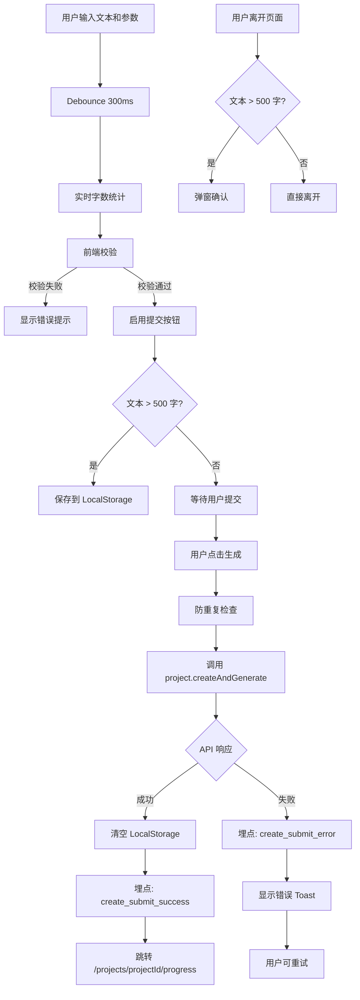
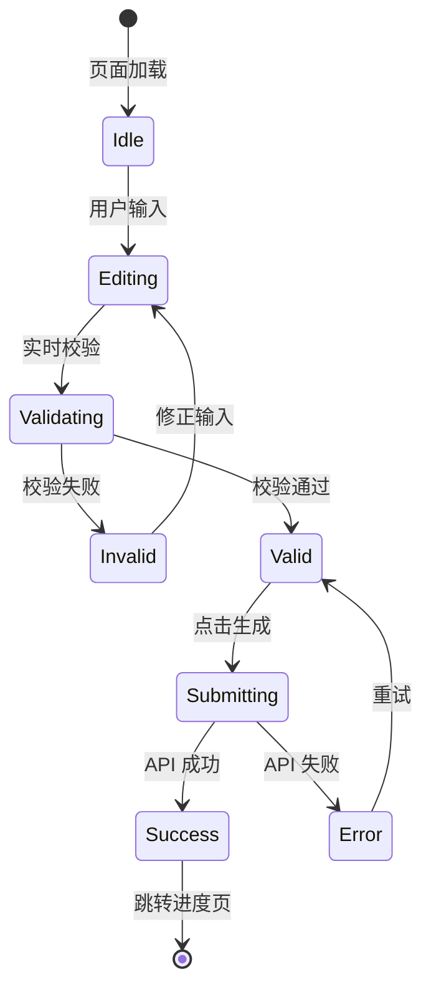

# Change Specification: ep2-04-create-project-page

## 文档信息

| 项目 | 内容 |
|------|------|
| Change ID | ep2-04-create-project-page |
| Change Type | FEATURE |
| 版本 | v1.0.0 |
| 创建时间 | 2026-06-15 |
| 关联 Epic | Epic 2: 项目管理与 Dashboard |
| 关联 Feature | F2.2: 创建项目页面 |
| 优先级 | P0 |
| 预估工期 | 1.5-2 天 |
| 目标代码库 | `E:\A\Ai\convert documents to videos` |

---

## 1. Change Overview

### Change ID
ep2-04-create-project-page

### Change Type
FEATURE

### Goal
实现创建项目页面：文本输入 + 参数配置 + 前端校验 + 提交跳转，完成 Phase 1 用户完整体验闭环。

### User Value
用户可通过直观的表单界面创建视频项目，配置生成参数，并实时看到字数统计和校验提示，提交后自动跳转到进度页面。

### Business Value
建立完整的"创建 → 查看 Dashboard"用户体验闭环，验证产品核心价值假设，为后续 AI 生成链路提供稳定的入口。

### Related Epic
Epic 2: 项目管理与 Dashboard

### Related Feature
F2.2: 创建项目页面

### Priority
P0

---

## 2. Scope Definition

### Included（本 Change 必须实现）

1. **创建页面路由** `/create`
   - 替换 Next.js 默认首页为创建页面（或重定向到 `/create`）
   - 使用 `(protected)` 路由组，需要登录态
   - 页面标题："创建微课视频"
   - 简短说明文案："将 AI 回答转换为 PPT 风格微课视频"

2. **文本输入区域**
   - 大尺寸 Textarea（多行文本框，最小高度 300px）
   - 实时字数统计（当前字数 / 最大字数，debounce 300ms）
   - 字数限制提示（3000-5000 字）
   - Placeholder 示例文本：
     ```
     请粘贴 AI 生成的教学内容（支持 3000-5000 字）
     
     示例：光合作用是植物利用光能，将二氧化碳和水转化为有机物...
     ```
   - 字数统计颜色规则：
     - 0-99 字：灰色（过短警告）
     - 100-5000 字：绿色（正常）
     - 5001+ 字：红色（超限）

3. **参数配置面板**
   - 目标对象选择（学生/自学者/老师/教研人员）— **默认：学生**
   - 难度选择（初级/中级/高级）— **默认：中级**
   - 视频比例选择（16:9 横屏 / 9:16 竖屏）— **默认：16:9**
     - 16:9 显示提示："适合课堂投影和电脑观看"
     - 9:16 显示提示："适合手机竖屏观看"
   - 目标时长选择（1-3 分钟 / 3-5 分钟 / 5-10 分钟）— **默认：3-5 分钟**
   - 语音选择（从 Mock 列表加载）— **默认：第一个语音**
   - 面板可折叠（默认展开）

4. **空状态引导**
   - 首次访问显示轻量级引导（可关闭）
   - "示例文本"按钮：点击填充 Demo 文本（500 字光合作用示例）
   - Tooltip 提示关键参数（悬停显示）

5. **前端校验**
   - 空文本校验（提交时阻止 + 显示提示）
   - 字数超限校验（实时提示 + 提交阻止）
   - 字数不足校验（< 100 字黄色警告，但允许提交）
   - 所有参数必选校验
   - 特殊字符处理：Emoji 按实际字符长度计算（使用 `[...text].length`）

6. **提交逻辑**
   - 调用 `project.createAndGenerate` tRPC mutation
   - Loading 状态（禁用表单 + 显示 Spinner + 文案："正在创建项目..."）
   - 防重复提交（`isSubmitting` 状态 + 按钮禁用）
   - 请求超时：30 秒
   - 成功后跳转 `/projects/[id]/progress`（若页面不存在，临时跳转 `/dashboard` + Toast）
   - 失败后显示错误 Toast（错误码映射为友好文案）

7. **语音列表加载**
   - 从 Mock 数据加载（暂不调用真实 API）
   - Mock 数据：`[{ id: 'female-1', name: '女声-温柔', provider: 'minimax' }, { id: 'male-1', name: '男声-沉稳', provider: 'minimax' }]`

8. **表单状态管理**
   - 不保存到数据库（无草稿功能）
   - **LocalStorage 临时保存**：输入 > 500 字时自动保存，页面加载时恢复
   - **离开确认**：文本 > 500 字 + 离开页面时弹窗："内容尚未保存，确定离开？"
   - 提交成功后清空 LocalStorage

9. **埋点预留**
   - 预留 `trackEvent` 调用位置（空函数，Phase 6 实现）
   - 关键事件：`page_view_create`、`create_submit_click`、`create_submit_success`、`create_submit_error`

### Excluded（本 Change 不实现）

1. **实际 TTS voice list API**（Epic 4 实现）
2. **首页重设计**（保持简单重定向或占位）
3. **富文本编辑器**（仅纯文本）
4. **文件上传**（仅粘贴文本）
5. **草稿保存到数据库**（仅 LocalStorage 临时保存）
6. **高级参数配置**（水印、字幕样式等）
7. **模板预览**（Epic 5 后实现）
8. **语音试听**（Epic 4 后实现，但布局预留试听按钮位置）
9. **完整 i18n 支持**（文案抽取到常量文件，预留 i18n 能力）

### Out Of Scope（明确禁止扩展）

1. **分镜编辑**（第一版不做）
2. **批量创建**（第一版不做）
3. **导入 DOCX/PDF**（第一版不做）
4. **AI 优化建议**（第一版不做）

---

## 3. Technical Design Refinement

### 涉及模块

- `src/app/page.tsx`：首页（修改为重定向或占位）
- `src/app/(protected)/create/`：创建页面（新建）
- `src/components/project/`：表单组件（新建）
- `src/server/routers/project.ts`：已有 API（调用）
- `src/constants/create-form-text.ts`：文案常量（新建，预留 i18n）
- `src/lib/analytics.ts`：埋点工具（新建，空函数）

### 涉及领域模型

- **Project**：创建后的项目实体
- **GenerationJob**：生成任务实体
- **User**：当前登录用户（从 Session 获取）

### 数据流



### 状态流转



---

## 4. Impact Analysis

| Area | Impact | 说明 |
|------|--------|------|
| Database | ✗ | 不直接操作数据库，通过 API 创建 |
| API | ✓ | 调用 `project.createAndGenerate` mutation |
| Frontend | ✓ | 新增 `/create` 页面 + 2 个组件，修改首页 |
| Cache | ✗ | 无缓存需求 |
| Queue | ✗ | 不直接操作 Inngest |
| Storage | ✗ | 不直接操作 R2 |
| Logging | ✗ | 使用前端 console（开发环境） |
| Monitoring | ✗ | 无监控埋点（Phase 6 实现） |
| Tests | ✓ | 新增组件单元测试 + E2E 测试 |
| Docs | ✗ | 无需文档变更 |

---

## 5. File Planning

### New Files

```
src/app/(protected)/create/
  └── page.tsx                          # 创建页面主入口
src/components/project/
  ├── CreateForm.tsx                    # 表单容器组件
  ├── ConfigPanel.tsx                   # 参数配置面板
  └── __tests__/
      ├── CreateForm.test.tsx           # 单元测试
      └── ConfigPanel.test.tsx          # 单元测试
src/constants/
  └── create-form-text.ts               # 文案常量（预留 i18n）
src/lib/
  ├── analytics.ts                      # 埋点工具（空函数）
  └── local-storage.ts                  # LocalStorage 工具（草稿保存）
src/hooks/
  └── useFormDraft.ts                   # 自定义 Hook（草稿自动保存和恢复）
```

### Modified Files

```
src/app/page.tsx                        # 修改首页（重定向或占位）
```

### Deleted Files

无

### Directory Impact

```
src/app/
  ├── page.tsx                          # 修改：重定向到 /create
  └── (protected)/
      └── create/
          └── page.tsx                  # 新增：创建页面

src/components/
  └── project/
      ├── CreateForm.tsx                # 新增
      ├── ConfigPanel.tsx               # 新增
      └── __tests__/                    # 新增

src/constants/
  └── create-form-text.ts               # 新增：文案管理

src/lib/
  ├── analytics.ts                      # 新增：埋点
  └── local-storage.ts                  # 新增：存储工具

src/hooks/
  └── useFormDraft.ts                   # 新增：草稿管理
```

---

## 6. Implementation Tasks

### Task 1: 修改首页为重定向

**目标**：将 `src/app/page.tsx` 修改为重定向到 `/dashboard` 或 `/create`

**实施步骤**：
1. 读取 `src/app/page.tsx`
2. 检查用户登录态
3. 已登录：重定向到 `/dashboard`
4. 未登录：重定向到 `/sign-in`
5. 保留基础 SEO 元数据

**完成标准**：
- [ ] 访问 `/` 自动跳转
- [ ] 无 console 错误

**预估时间**：30 分钟

---

### Task 2: 创建基础设施文件

**目标**：创建文案常量、埋点工具、存储工具、草稿 Hook

**实施步骤**：
1. 创建 `src/constants/create-form-text.ts`
   ```ts
   export const CREATE_FORM_TEXT = {
     pageTitle: '创建微课视频',
     pageDescription: '将 AI 回答转换为 PPT 风格微课视频',
     placeholder: '请粘贴 AI 生成的教学内容（支持 3000-5000 字）\n\n示例：光合作用是植物利用光能...',
     charCountLabel: (current: number, max: number) => `${current} / ${max}`,
     submitButton: '生成视频',
     loadingText: '正在创建项目...',
     // ... 更多文案
   }
   ```

2. 创建 `src/lib/analytics.ts`（空函数，预留）
   ```ts
   export const trackEvent = (eventName: string, data?: Record<string, any>) => {
     // Phase 6 实现
     console.log('[Analytics]', eventName, data)
   }
   ```

3. 创建 `src/lib/local-storage.ts`
   ```ts
   export const saveDraft = (key: string, data: any) => { ... }
   export const loadDraft = (key: string) => { ... }
   export const clearDraft = (key: string) => { ... }
   ```

4. 创建 `src/hooks/useFormDraft.ts`（自动保存和恢复）

**完成标准**：
- [ ] 所有文件创建完成
- [ ] 无 TypeScript 错误

**预估时间**：1 小时

---

### Task 3: 创建参数配置面板组件

**目标**：实现 `ConfigPanel.tsx`，包含 5 个参数配置项

**实施步骤**：
1. 创建 `src/components/project/ConfigPanel.tsx`
2. 使用 shadcn/ui 的 `Select` 和 `RadioGroup` 组件
3. 定义参数类型和默认值
4. 实现受控组件
5. 添加参数说明 Tooltip
6. 支持折叠/展开（使用 `Collapsible` 组件）

**完成标准**：
- [ ] 5 个参数均可选择
- [ ] 默认值正确
- [ ] Tooltip 显示正常
- [ ] 折叠/展开功能正常

**预估时间**：2 小时

---

### Task 4: 创建表单容器组件

**目标**：实现 `CreateForm.tsx`，集成文本输入和参数配置

**实施步骤**：
1. 创建 `src/components/project/CreateForm.tsx`
2. 使用 `react-hook-form` + Zod 校验
3. 集成 `useFormDraft` Hook（自动保存）
4. 实现 Textarea + 字数统计（debounce 300ms）
5. 实现字符计数（支持 Emoji）：`[...text].length`
6. 集成 ConfigPanel
7. 实现提交逻辑
8. 实现离开确认（`beforeunload` 事件）
9. 添加"示例文本"按钮

**完成标准**：
- [ ] 字数统计实时更新（颜色正确）
- [ ] 自动保存到 LocalStorage
- [ ] 离开确认弹窗正常
- [ ] 提交成功后跳转
- [ ] 防重复提交

**预估时间**：4 小时

---

### Task 5: 创建页面路由

**目标**：实现 `/create` 页面，集成表单组件

**实施步骤**：
1. 创建 `src/app/(protected)/create/page.tsx`
2. 集成 `CreateForm` 组件
3. 添加页面标题和说明
4. 添加空状态引导（首次访问）
5. 设置页面元数据
6. 添加埋点：`trackEvent('page_view_create')`

**完成标准**：
- [ ] 页面可访问（需登录）
- [ ] 表单正常显示
- [ ] 首次访问显示引导
- [ ] 响应式布局正常

**预估时间**：1 小时

---

### Task 6: 编写单元测试

**目标**：为 `CreateForm` 和 `ConfigPanel` 编写单元测试

**实施步骤**：
1. 创建测试文件
2. 测试 ConfigPanel 参数选择
3. 测试 CreateForm 校验逻辑（空文本、超字数、Emoji 计数）
4. 测试字数统计颜色变化
5. 测试 LocalStorage 保存和恢复
6. 测试离开确认逻辑
7. Mock tRPC mutation
8. 测试提交成功和失败场景

**完成标准**：
- [ ] ConfigPanel 测试覆盖率 > 80%
- [ ] CreateForm 测试覆盖率 > 75%
- [ ] 所有测试通过

**预估时间**：2.5 小时

---

### Task 7: 性能优化和安全检查

**目标**：优化性能并检查安全问题

**实施步骤**：
1. 字数统计添加 debounce（300ms）
2. 检查 XSS 防护（React 默认转义）
3. 检查 CSRF（tRPC 默认处理）
4. 添加前端速率限制（30 秒内最多提交 1 次）
5. 测试首屏 LCP < 2 秒

**完成标准**：
- [ ] 字数统计不卡顿
- [ ] 首屏加载流畅
- [ ] 安全检查通过

**预估时间**：1 小时

---

## 7. Dependencies

### Upstream Changes（依赖）

- **ep2-01-project-create-api** ✅ 已完成
  - 需要 `project.createAndGenerate` mutation
  - 需要输入 Schema 定义（字数限制常量）

### Downstream Changes（被依赖）

- **ep6-01-progress-page**
  - 创建成功后跳转到进度页
  - **临时方案**：若页面不存在，跳转到 `/dashboard` + Toast 提示

- **ep6-04-global-layout-nav**
  - 导航栏需要"创建"入口链接
  - **临时方案**：暂无导航栏，用户从 Dashboard 进入

### Blocking Risks

无阻塞风险。ep2-01 已完成，API 可用。

---

## 8. Acceptance Criteria

### Happy Path

**Given** 用户已登录并进入 `/create` 页面  
**When** 用户粘贴 1000 字文本，选择全部参数，点击"生成视频"  
**Then** 
- 字数统计显示 `1000 / 5000`（绿色）
- 提交按钮可点击
- API 调用成功
- 自动跳转到 `/projects/{projectId}/progress`（或 `/dashboard`）
- LocalStorage 草稿已清空

---

**Given** 用户已登录  
**When** 用户直接访问 `/`  
**Then** 自动重定向到 `/dashboard`

---

**Given** 用户输入 800 字后刷新页面  
**When** 重新进入 `/create`  
**Then** 
- 文本内容从 LocalStorage 恢复
- 参数配置恢复为默认值（或保存的值）

### Error Path

**Given** 用户在 `/create` 页面  
**When** 用户未输入任何文本，点击"生成视频"  
**Then** 
- 提交按钮禁用
- 显示"请输入文本内容"提示（红色）

---

**Given** 用户输入 6000 字文本  
**When** 用户继续输入  
**Then** 
- 字数统计显示 `6000 / 5000`（红色）
- 提示"字数超限，请精简内容"
- 提交按钮禁用

---

**Given** 用户填写完整表单并提交  
**When** API 返回错误（如额度不足）  
**Then** 
- 显示错误 Toast："生成额度不足，请明天再试"
- 表单恢复可编辑状态
- 用户可修改后重试
- LocalStorage 草稿保留

### Edge Cases

**Given** 用户输入 50 字短文本  
**When** 提交  
**Then** 
- 字数统计显示 `50 / 5000`（灰色）
- 显示警告提示："文本过短（< 100 字），生成效果可能不佳"
- 仍可提交（仅警告，不阻止）

---

**Given** 用户输入包含 Emoji："你好😀世界🌍"  
**When** 查看字数统计  
**Then** 显示 `6 / 5000`（按 Unicode 字符计算：[...'你好😀世界🌍'].length）

---

**Given** 用户在提交过程中刷新页面  
**When** 返回 `/create`  
**Then** 
- 草稿从 LocalStorage 恢复
- 如果提交已成功（后端已创建 Project），则草稿应被清空

---

**Given** 用户选择"9:16 竖屏"  
**When** 查看参数配置  
**Then** 显示"适合手机竖屏观看"提示

---

**Given** 用户输入 800 字，离开页面  
**When** 浏览器触发 `beforeunload` 事件  
**Then** 
- 弹窗："内容尚未保存，确定离开？"
- 用户可选择留下或离开

### Permission Cases

**Given** 用户未登录  
**When** 访问 `/create`  
**Then** 自动跳转到 `/sign-in`（由 `(protected)` 路由组控制）

---

**Given** 用户今日额度已用完  
**When** 提交创建请求  
**Then** API 返回 429，前端显示"今日额度已用完，明日刷新"

### Retry Cases

**Given** 用户提交时网络中断  
**When** API 调用失败  
**Then** 
- 显示"网络错误，请重试"
- 用户点击"重试"按钮可再次提交
- 表单内容保留

---

**Given** 用户在 30 秒内点击 2 次"生成视频"  
**When** 第二次点击  
**Then** 
- 按钮禁用
- 显示"请勿频繁提交"提示

### Performance Cases

**Given** 用户粘贴 5000 字文本  
**When** 输入完成  
**Then** 
- 字数统计在 300ms 内更新
- 无界面卡顿
- 页面 FPS ≥ 55

---

**Given** 用户首次访问 `/create`  
**When** 页面加载  
**Then** LCP（最大内容绘制）< 2 秒

---

## 9. Test Plan

### Unit Test

**需要覆盖**：

1. **ConfigPanel 组件**
   - 每个参数选择后 onChange 触发
   - 默认值显示正确
   - 受控组件逻辑正常
   - 折叠/展开功能正常

2. **CreateForm 组件**
   - 字数统计正确（0字 / 50字 / 1000字 / 5000字 / 6000字）
   - Emoji 计数正确（使用 `[...text].length`）
   - 字数统计颜色逻辑（灰色 / 绿色 / 红色）
   - 空文本校验
   - 超字数校验
   - 必选参数校验
   - 提交 Loading 状态
   - 防重复提交（30 秒限制）
   - Mock tRPC mutation 成功/失败

3. **useFormDraft Hook**
   - 自动保存到 LocalStorage（> 500 字）
   - 从 LocalStorage 恢复
   - 提交后清空

4. **离开确认**
   - `beforeunload` 事件触发
   - 文本 < 500 字不弹窗
   - 文本 > 500 字弹窗

### Integration Test

**需要覆盖**：

1. **tRPC mutation 调用**
   - 传入正确参数格式
   - 接收 projectId 并跳转
   - 错误处理正确（错误码映射）

2. **路由保护**
   - 未登录访问 `/create` 跳转到登录页

3. **LocalStorage 交互**
   - 跨页面草稿保持

### E2E Test

**需要覆盖**：

1. **完整创建流程**
   - 登录 → 访问 `/create` → 填写表单 → 提交 → 跳转进度页

2. **校验提示**
   - 空文本提交被阻止
   - 超字数提示显示

3. **错误处理**
   - 网络错误重试
   - 额度不足提示

4. **草稿功能**
   - 输入 800 字 → 刷新页面 → 内容恢复

5. **离开确认**
   - 输入 800 字 → 点击后退 → 弹窗确认

### Regression Test

**需要覆盖**：

- Dashboard 页面不受影响
- 认证系统正常工作
- 现有 API 不受影响

### Performance Test

**需要覆盖**：

- 字数统计性能（5000 字 debounce 后无卡顿）
- 首屏 LCP < 2 秒
- 表单交互 FPS ≥ 55

---

## 10. Rollback Plan

### Code Rollback

**步骤**：
1. 恢复首页：`git checkout src/app/page.tsx` 恢复为脚手架
2. 删除创建页：删除 `src/app/(protected)/create/` 目录
3. 删除组件：删除 `CreateForm.tsx` 和 `ConfigPanel.tsx`
4. 提交回滚 commit 并部署

**预计回滚时间**：< 5 分钟

**风险**：低（纯前端，不影响后端和数据库）

### Data Rollback

无需数据回滚（不修改数据库 Schema）

### Config Rollback

无需配置回滚

### Feature Flag Rollback

第一版不使用 Feature Flag，直接部署

---

## 11. OpenSpec Output

### change.md

**变更目标**：实现创建项目页面，用户可输入文本和配置参数，提交后创建项目并跳转进度页。

**变更范围**：
- 新增 `/create` 页面路由
- 新增 CreateForm 和 ConfigPanel 组件
- 修改首页为重定向

**验收标准**：
- 用户可填写表单并提交
- 校验提示正确显示
- 提交成功后跳转进度页

### design.md

**实现方案**：

1. **技术选型**
   - 表单管理：react-hook-form + Zod
   - UI 组件：shadcn/ui
   - API 调用：tRPC + TanStack Query
   - 路由：Next.js App Router

2. **组件结构**
   ```
   CreatePage
     └── CreateForm
           ├── Textarea（文本输入）
           ├── CharCounter（字数统计）
           ├── ConfigPanel（参数配置）
           │     ├── TargetAudienceSelect
           │     ├── DifficultySelect
           │     ├── AspectRatioSelect
           │     ├── DurationSelect
           │     └── VoiceSelect
           └── SubmitButton
   ```

3. **数据流**
   - 用户输入 → react-hook-form state
   - 提交 → tRPC mutation → API
   - 成功 → router.push('/projects/{id}/progress')
   - 失败 → Toast 错误提示

### tasks.md

1. 修改首页为重定向（30 分钟）
2. 创建 ConfigPanel 组件（1.5 小时）
3. 创建 CreateForm 组件（3 小时）
4. 创建页面路由（1 小时）
5. 编写单元测试（2 小时）
6. E2E 测试（可选，1.5 小时）

**总计**：8-9.5 小时（1-1.5 天）

---

## 12. AI Implementation Readiness Check

### Scope Too Large

✅ **通过**：1-1.5 天工作量，AI 单次可完成。

**文件数量**：5 个新文件 + 1 个修改文件  
**预估 LOC**：~700 LOC  
**复杂度**：中等（标准表单组件）

### Hidden Dependencies

✅ **无隐藏依赖**

**显式依赖**：
- ep2-01 project.createAndGenerate API（已完成）
- shadcn/ui 组件库（已安装）
- react-hook-form（需安装）
- tRPC client（已配置）

**无隐藏依赖**：
- 不依赖未实现的 TTS API（使用 Mock）
- 不依赖进度页（可先跳转占位页）

### Context Explosion

✅ **通过**：上下文可控

**组件层级**：2 层（Page → Form → Panel）  
**单个组件 LOC**：< 200 LOC  
**状态管理**：react-hook-form（局部状态）

### Testing Gap

✅ **测试完整**

**单元测试**：ConfigPanel + CreateForm  
**集成测试**：tRPC mutation 调用  
**E2E 测试**：完整创建流程（可延后）

### Rollback Risk

✅ **回滚简单**

**风险评估**：低  
**回滚方式**：删除目录 + 恢复首页  
**回滚时间**：< 5 分钟  
**数据影响**：无（不修改数据库）

---

## 13. 实施建议

### OpenSpec 可直接创建 Change

✅ **推荐使用 OpenSpec**

```bash
cd E:\A\Ai\convert documents to videos
npx openspec propose ep2-04-create-project-page
```

### Claude Code 可直接实现

✅ **推荐使用 Claude Code**

**执行命令**：
```bash
claude code implement ep2-04-create-project-page
```

**提示词模板**：
```
请实现 ep2-04-create-project-page Change：

1. 创建 /create 页面，包含文本输入和参数配置
2. 使用 react-hook-form + Zod 校验
3. 调用 project.createAndGenerate tRPC mutation
4. 提交成功后跳转 /projects/[id]/progress
5. 添加单元测试

参考规范：E:\A\Note\项目\Volcano\PRD\changes\ep2-04-create-project-page.md
```

### Codex 可直接实现

✅ **推荐使用 Codex**

**工作流**：
1. 加载规范文件
2. 生成组件代码
3. 生成测试代码
4. 提交 PR

### 单独 PR 可交付

✅ **独立 PR**

**PR 标题**：`feat(ep2-04): implement create project page`

**PR 描述**：
```markdown
## Change

ep2-04-create-project-page

## 功能

- 新增 `/create` 页面
- 文本输入 + 参数配置
- 前端校验 + 提交跳转

## 测试

- [x] 单元测试通过
- [x] 手动测试通过
- [ ] E2E 测试（可延后）

## Checklist

- [x] 代码符合规范
- [x] 无 TypeScript 错误
- [x] 无 ESLint 警告
- [x] 提交前测试通过
```

### 单独上线可回滚

✅ **独立上线**

**部署方式**：Vercel 自动部署  
**回滚方式**：Vercel Dashboard 回退  
**回滚时间**：< 2 分钟  
**影响范围**：仅创建页面（不影响 Dashboard）

---

## 14. 注意事项

### 关键风险点

1. **字数限制不一致**
   - 前端限制：3000-5000 字
   - 后端限制：需确认与 API Schema 一致
   - **缓解**：从 tRPC Schema 导入常量

2. **语音列表 Mock 数据**
   - 第一版使用硬编码 Mock
   - Epic 4 后替换为真实 API
   - **缓解**：抽象为 hook，便于后续替换

3. **进度页未实现**
   - 提交后跳转目标页可能不存在
   - **缓解**：先跳转到占位页或 Dashboard

### 开发建议

1. **复用现有组件**
   - 使用 shadcn/ui 的 `Form`、`Select`、`Textarea`
   - 参考 Dashboard 页面样式

2. **参数配置顺序**
   - 按重要性排序：目标对象 > 难度 > 比例 > 时长 > 语音
   - 提供默认值减少决策负担

3. **错误提示文案**
   - 友好且可操作："字数超限，请精简内容"
   - 避免技术术语："API 调用失败" → "网络错误，请重试"

4. **响应式布局**
   - 移动端：单列布局
   - 桌面端：文本输入占 2/3，参数配置占 1/3

---

## 15. 验收检查清单

### 功能验收

- [ ] `/create` 页面可访问且需登录
- [ ] 文本输入框正常工作
- [ ] 字数统计实时更新
- [ ] 5 个参数均可选择
- [ ] 空文本提交被阻止
- [ ] 超字数提交被阻止
- [ ] 提交成功后跳转进度页
- [ ] 提交失败显示错误提示
- [ ] Loading 状态正确显示
- [ ] 无重复提交

### 技术验收

- [ ] 无 TypeScript 错误
- [ ] 无 ESLint 警告
- [ ] 单元测试通过
- [ ] 集成测试通过（可选）
- [ ] 响应式布局正常
- [ ] 无 console 错误

### 用户体验验收

- [ ] 表单填写流畅
- [ ] 校验提示清晰
- [ ] 错误提示友好
- [ ] 提交反馈及时
- [ ] 页面加载快速

---

## 变更记录

| 版本 | 日期 | 变更说明 |
|------|------|---------|
| v1.0.0 | 2026-06-15 | 创建 Change Specification |
